Chacterizing CpG Methylation (5x Individual Samples)
================

In this script, I’ll create summary tables and figures to characterize
CpG methylation in *M. capitata* and *P. acuta* using WGBS, RRBS, and
MBD-BSSeq. I used individual samples with data for 5x CpGs in [this
Jupyter
notebook](https://github.com/hputnam/Meth_Compare/blob/master/scripts/Characterizing-CpG-Methylation-5x.ipynb)
to identify methylation status and genomic location. I will use the
output in this script.

# Set up R Markdown Document

# Install packages

``` r
#install.packages("RColorBrewer") #Use for color palletes
#install.packages("dichromat") #Discern color blind accessibility of figures
#install.packages("compositions") #Compositional data analysis package
#install.packages("vegan") #Multivariate analysis package
#install.packages("cluster") #Multivariate analysis package
#install.packages("glmmTMB") #Linear modeling package
#install.packages("emmeans")
```

``` r
require(RColorBrewer) 
```

    ## Loading required package: RColorBrewer

``` r
require(dichromat)
```

    ## Loading required package: dichromat

``` r
require(compositions)
```

    ## Loading required package: compositions

    ## Loading required package: tensorA

    ## 
    ## Attaching package: 'tensorA'

    ## The following object is masked from 'package:base':
    ## 
    ##     norm

    ## Loading required package: robustbase

    ## Loading required package: bayesm

    ## Welcome to compositions, a package for compositional data analysis.
    ## Find an intro with "? compositions"

    ## 
    ## Attaching package: 'compositions'

    ## The following objects are masked from 'package:stats':
    ## 
    ##     cor, cov, dist, var

    ## The following objects are masked from 'package:base':
    ## 
    ##     %*%, scale, scale.default

``` r
require(vegan)
```

    ## Loading required package: vegan

    ## Loading required package: permute

    ## Loading required package: lattice

    ## This is vegan 2.5-6

``` r
require(cluster)
```

    ## Loading required package: cluster

``` r
require(glmmTMB)
```

    ## Loading required package: glmmTMB

``` r
require(emmeans)
```

    ## Loading required package: emmeans

# Session information

``` r
sessionInfo()
```

    ## R version 4.0.0 (2020-04-24)
    ## Platform: x86_64-apple-darwin17.0 (64-bit)
    ## Running under: macOS Catalina 10.15.5
    ## 
    ## Matrix products: default
    ## BLAS:   /Library/Frameworks/R.framework/Versions/4.0/Resources/lib/libRblas.dylib
    ## LAPACK: /Library/Frameworks/R.framework/Versions/4.0/Resources/lib/libRlapack.dylib
    ## 
    ## locale:
    ## [1] en_US.UTF-8/en_US.UTF-8/en_US.UTF-8/C/en_US.UTF-8/en_US.UTF-8
    ## 
    ## attached base packages:
    ## [1] stats     graphics  grDevices utils     datasets  methods   base     
    ## 
    ## other attached packages:
    ##  [1] emmeans_1.4.8       glmmTMB_1.0.1       cluster_2.1.0      
    ##  [4] vegan_2.5-6         lattice_0.20-41     permute_0.9-5      
    ##  [7] compositions_1.40-5 bayesm_3.1-4        robustbase_0.93-6  
    ## [10] tensorA_0.36.1      dichromat_2.0-0     RColorBrewer_1.1-2 
    ## 
    ## loaded via a namespace (and not attached):
    ##  [1] Rcpp_1.0.4.6     DEoptimR_1.0-8   compiler_4.0.0   nloptr_1.2.2.1  
    ##  [5] TMB_1.7.16       tools_4.0.0      boot_1.3-25      digest_0.6.25   
    ##  [9] lme4_1.1-23      statmod_1.4.34   evaluate_0.14    nlme_3.1-147    
    ## [13] mgcv_1.8-31      rlang_0.4.6      Matrix_1.2-18    yaml_2.2.1      
    ## [17] parallel_4.0.0   mvtnorm_1.1-0    xfun_0.13        coda_0.19-3     
    ## [21] stringr_1.4.0    knitr_1.28       grid_4.0.0       rmarkdown_2.1   
    ## [25] minqa_1.2.4      magrittr_1.5     htmltools_0.4.0  MASS_7.3-51.6   
    ## [29] splines_4.0.0    xtable_1.8-4     stringi_1.4.6    estimability_1.3

# CpG methylation status

## Mcap

### Import file counts

``` r
McapAll <- read.table("../analyses/Characterizing-CpG-Methylation-5x/Mcap/Mcap-5x-bedgraph-counts.txt", header = FALSE, col.names = c("totalLines", "filename")) #Import file using space as a delimiter. Columns are the number of lines and the filename
McapAll <- McapAll[-10,] #Remove last row (total lines for all files)
tail(McapAll) #Confirm import
```

    ##   totalLines                                        filename
    ## 4    3173254 Meth13_R1_001_val_1_bismark_bt2_pe._5x.bedgraph
    ## 5    2648697 Meth14_R1_001_val_1_bismark_bt2_pe._5x.bedgraph
    ## 6    3176517 Meth15_R1_001_val_1_bismark_bt2_pe._5x.bedgraph
    ## 7     583599 Meth16_R1_001_val_1_bismark_bt2_pe._5x.bedgraph
    ## 8     242390 Meth17_R1_001_val_1_bismark_bt2_pe._5x.bedgraph
    ## 9     153392 Meth18_R1_001_val_1_bismark_bt2_pe._5x.bedgraph

``` r
McapMeth <- read.table("../analyses/Characterizing-CpG-Methylation-5x/Mcap/Mcap-5x-Meth-counts.txt", header = FALSE, col.names = c("Meth", "filename")) #Import file using space as a delimiter. Columns are the number of lines and the filename
McapMeth <- McapMeth[-10,] #Remove last row (total lines for all files)
tail(McapMeth) #Confirm import
```

    ##     Meth                                             filename
    ## 4 257741 Meth13_R1_001_val_1_bismark_bt2_pe._5x.bedgraph-Meth
    ## 5 184742 Meth14_R1_001_val_1_bismark_bt2_pe._5x.bedgraph-Meth
    ## 6 231347 Meth15_R1_001_val_1_bismark_bt2_pe._5x.bedgraph-Meth
    ## 7 106695 Meth16_R1_001_val_1_bismark_bt2_pe._5x.bedgraph-Meth
    ## 8  45506 Meth17_R1_001_val_1_bismark_bt2_pe._5x.bedgraph-Meth
    ## 9  29468 Meth18_R1_001_val_1_bismark_bt2_pe._5x.bedgraph-Meth

``` r
McapSparseMeth <- read.table("../analyses/Characterizing-CpG-Methylation-5x/Mcap/Mcap-5x-sparseMeth-counts.txt", header = FALSE, col.names = c("sparseMeth", "filename")) #Import file using space as a delimiter. Columns are the number of lines and the filename
McapSparseMeth <- McapSparseMeth[-10,] #Remove last row (total lines for all files)
tail(McapSparseMeth) #Confirm import
```

    ##   sparseMeth                                                   filename
    ## 4     152042 Meth13_R1_001_val_1_bismark_bt2_pe._5x.bedgraph-sparseMeth
    ## 5     135052 Meth14_R1_001_val_1_bismark_bt2_pe._5x.bedgraph-sparseMeth
    ## 6     179454 Meth15_R1_001_val_1_bismark_bt2_pe._5x.bedgraph-sparseMeth
    ## 7      74839 Meth16_R1_001_val_1_bismark_bt2_pe._5x.bedgraph-sparseMeth
    ## 8      28850 Meth17_R1_001_val_1_bismark_bt2_pe._5x.bedgraph-sparseMeth
    ## 9      16793 Meth18_R1_001_val_1_bismark_bt2_pe._5x.bedgraph-sparseMeth

``` r
McapUnMeth <- read.table("../analyses/Characterizing-CpG-Methylation-5x/Mcap/Mcap-5x-unMeth-counts.txt", header = FALSE, col.names = c("unMeth", "filename")) #Import file using space as a delimiter. Columns are the number of lines and the filename
McapUnMeth <- McapUnMeth[-10,] #Remove last row (total lines for all files)
tail(McapUnMeth) #Confirm import
```

    ##    unMeth                                               filename
    ## 4 2763471 Meth13_R1_001_val_1_bismark_bt2_pe._5x.bedgraph-unMeth
    ## 5 2328903 Meth14_R1_001_val_1_bismark_bt2_pe._5x.bedgraph-unMeth
    ## 6 2765716 Meth15_R1_001_val_1_bismark_bt2_pe._5x.bedgraph-unMeth
    ## 7  402065 Meth16_R1_001_val_1_bismark_bt2_pe._5x.bedgraph-unMeth
    ## 8  168034 Meth17_R1_001_val_1_bismark_bt2_pe._5x.bedgraph-unMeth
    ## 9  107131 Meth18_R1_001_val_1_bismark_bt2_pe._5x.bedgraph-unMeth

### Create summary table

``` r
McapCpGType <- cbind(McapAll, McapMeth, McapSparseMeth, McapUnMeth) #Mash tables together by column
rownames(McapCpGType) <- substr(McapAll$filename, start = 1, stop = 6) #Use the first 6 characters of the filename to add sample ID as row names
McapCpGType <- McapCpGType[,-c(2,4,6,8)] #Remove filename columns
tail(McapCpGType) #Confirm table mashing
```

    ##        totalLines   Meth sparseMeth  unMeth
    ## Meth13    3173254 257741     152042 2763471
    ## Meth14    2648697 184742     135052 2328903
    ## Meth15    3176517 231347     179454 2765716
    ## Meth16     583599 106695      74839  402065
    ## Meth17     242390  45506      28850  168034
    ## Meth18     153392  29468      16793  107131

``` r
McapCpGType$percentMeth <- (McapCpGType$Meth / McapCpGType$totalLines) * 100 #Calculate percent methylated loci
McapCpGType$percentSparseMeth <- (McapCpGType$sparseMeth / McapCpGType$totalLines) * 100 #Calculate percent sparsely methylated loci
McapCpGType$percentUnMeth <- (McapCpGType$unMeth / McapCpGType$totalLines) * 100 #Calculate percent unmethylated loci
McapCpGType <- McapCpGType[,c(1, 2, 5, 3, 6, 4, 7)] #Reorganize columns
tail(McapCpGType) #Confirm calculations
```

    ##        totalLines   Meth percentMeth sparseMeth percentSparseMeth  unMeth
    ## Meth13    3173254 257741    8.122293     152042          4.791359 2763471
    ## Meth14    2648697 184742    6.974826     135052          5.098809 2328903
    ## Meth15    3176517 231347    7.283040     179454          5.649395 2765716
    ## Meth16     583599 106695   18.282245      74839         12.823703  402065
    ## Meth17     242390  45506   18.773877      28850         11.902306  168034
    ## Meth18     153392  29468   19.210911      16793         10.947768  107131
    ##        percentUnMeth
    ## Meth13      87.08635
    ## Meth14      87.92637
    ## Meth15      87.06756
    ## Meth16      68.89405
    ## Meth17      69.32382
    ## Meth18      69.84132

``` r
write.table(McapCpGType, "../analyses/Characterizing-CpG-Methylation-5x/Mcap/Mcap-CpG-Type.txt", sep = "\t", quote = FALSE, row.names = TRUE) #Save summary table
```

### Reorganize data

``` r
McapCpGTypePercents <- McapCpGType[,c(3,5,7)] #Keep only columns with % total CpG information
head(McapCpGTypePercents) #Check reorganization
```

    ##        percentMeth percentSparseMeth percentUnMeth
    ## Meth10    9.856784         11.984981      78.15823
    ## Meth11   11.345650         11.107605      77.54674
    ## Meth12   12.055734         11.378198      76.56607
    ## Meth13    8.122293          4.791359      87.08635
    ## Meth14    6.974826          5.098809      87.92637
    ## Meth15    7.283040          5.649395      87.06756

``` r
#Create test plots

barplot(t(McapCpGTypePercents[1,]), beside = TRUE, ylim = c(0,100), names.arg = c(expression("High (">="50%)"), "Moderate (10-50%)", expression("Weak ("<="10%)")), axes = FALSE) #Sample 1, WGBS
axis(side = 2, at = seq(0, 100, by = 25), las = 2, col = "grey80")
```

<!-- -->

``` r
barplot(t(McapCpGTypePercents[4,]), beside = TRUE, ylim = c(0,100), names.arg = c(expression("High (">="50%)"), "Moderate (10-50%)", expression("Weak ("<="10%)")), axes = FALSE) #Sample 1, RRBS
axis(side = 2, at = seq(0, 100, by = 25), las = 2, col = "grey80")
```

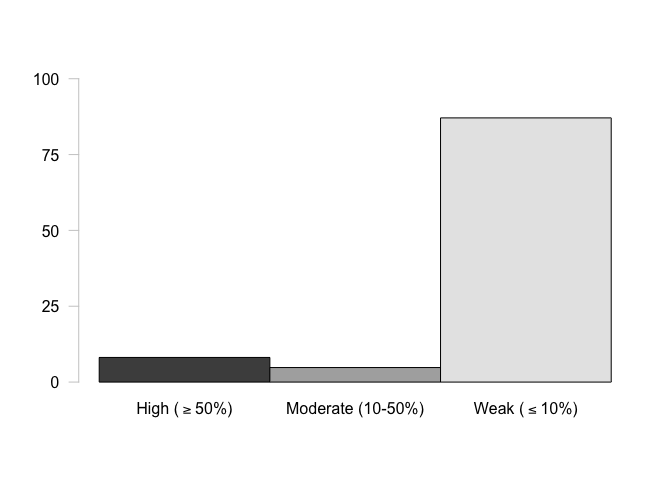<!-- -->

``` r
barplot(t(McapCpGTypePercents[7,]), beside = TRUE, ylim = c(0,100), names.arg = c(expression("High (">="50%)"), "Moderate (10-50%)", expression("Weak ("<="10%)")), axes = FALSE) #Sample 1, MBD-BSSeq
axis(side = 2, at = seq(0, 100, by = 25), las = 2, col = "grey80")
```

<!-- -->

### Create multipanel figure with all samples

``` r
#pdf("../analyses/Characterizing-CpG-Methylation-5x/Mcap/Mcap-CpG-Type.pdf", height = 8.5, width = 11) #Save file as pdf

par(mfcol = c(3,3), mar = c(2, 2, 2, 0), oma = c(5, 5, 2, 0)) #Fill in multipanel plot by column and adjust inner and outer margins

barplot(t(McapCpGTypePercents[1,]), beside = TRUE, ylim = c(0,100), names.arg = FALSE, axes = FALSE) #Sample 1, WGBS
axis(side = 2, at = seq(0, 100, by = 25), las = 2, col = "grey80", cex.axis = 1.3) #Add y-axis
mtext(side = 3, "WBGS", adj = 0, line = 1) #Add sequencing information

barplot(t(McapCpGTypePercents[4,]), beside = TRUE, ylim = c(0,100), names.arg = FALSE, axes = FALSE) #Sample 1, RRBS
mtext(side = 3, "RRBS", adj = 0, line = 1) #Add sequencing information
axis(side = 2, at = seq(0, 100, by = 25), las = 2, col = "grey80", cex.axis = 1.3) #Add y-axis
mtext(side = 2, outer = TRUE, "% 5x CpG with Data", cex = 1.5, line = 2) #Add y-axis label

barplot(t(McapCpGTypePercents[7,]), beside = TRUE, ylim = c(0,100), names.arg = c(expression("">= "50%"), "10-50%", "< 10%"), cex.names = 1.3, axes = FALSE) #Sample 1, MBD-BSSeq
mtext(side = 3, "MBD-BSSeq", adj = 0, line = 1) #Add sequencing information
axis(side = 2, at = seq(0, 100, by = 25), las = 2, col = "grey80", cex.axis = 1.3) #Add y-axis

barplot(t(McapCpGTypePercents[2,]), beside = TRUE, ylim = c(0,100), names.arg = FALSE, axes = FALSE) #Sample 2, WGBS
barplot(t(McapCpGTypePercents[5,]), beside = TRUE, ylim = c(0,100), names.arg = FALSE, axes = FALSE) #Sample 2, RRBS
barplot(t(McapCpGTypePercents[8,]), beside = TRUE, ylim = c(0,100), names.arg = c(expression("">= "50%"), "10-50%", "< 10%"), cex.names = 1.3, axes = FALSE) #Sample 2, MBD-BSSeq
mtext(side = 1, outer = TRUE, "% Methylation", cex = 1.5, line = 2) #Add x-axis label

barplot(t(McapCpGTypePercents[3,]), beside = TRUE, ylim = c(0,100), names.arg = FALSE, axes = FALSE) #Sample 3, WGBS
barplot(t(McapCpGTypePercents[6,]), beside = TRUE, ylim = c(0,100), names.arg = FALSE, axes = FALSE) #Sample 3, RRBS
barplot(t(McapCpGTypePercents[9,]), beside = TRUE, ylim = c(0,100), names.arg = c(expression("">= "50%"), "10-50%", "< 10%"), cex.names = 1.3, axes = FALSE) #Sample 3, MBD-BSSeq
```

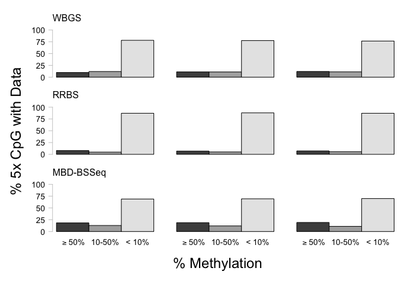<!-- -->

``` r
#dev.off() #Turn off plotting device
```

### Multivariate data analysis with compositional data

We are interested in how sequencing method affects the proportion, or
composition, of CpGs in various methylation statuses and genomic
features. For this reason, I will use a combined compositional analysis
and multivariate approach. For each sample, I will have separate columns
for each methylation
status.

#### Format data

``` r
McapCpGPercentsTrans <- data.frame(clr(McapCpGTypePercents / 100)) #Use centered log-ratio transformation on proportion data
tail(McapCpGPercentsTrans) # Confirm transformation
```

    ##        percentMeth percentSparseMeth percentUnMeth
    ## Meth13  -0.6148297        -1.1426281      1.757458
    ## Meth14  -0.7402973        -1.0535977      1.793895
    ## Meth15  -0.7423787        -0.9963786      1.738757
    ## Meth16  -0.3240014        -0.6786366      1.002638
    ## Meth17  -0.2835293        -0.7392635      1.022793
    ## Meth18  -0.2428016        -0.8051443      1.047946

#### PCoA and perMANOVA

##### Conduct PCoA

``` r
dissimMcapCpGPercentsTrans <- vegdist(McapCpGPercentsTrans, "euclidean") #Calculate euclidean dissimilarity matrix
```

``` r
McapCpGPercentsPCoA <- cmdscale(dissimMcapCpGPercentsTrans, eig = TRUE, add = TRUE) #Perform the PCoA. Include eigenvalues for each PC, and add a constant so default eigenvalues are non-negative.
McapCpGPercentsPCoA$points #View PC scores
```

    ##               [,1]         [,2]
    ## Meth10  0.04989901 -0.323301338
    ## Meth11  0.08368418 -0.170284997
    ## Meth12  0.12884957 -0.144666897
    ## Meth13 -0.48845107  0.191595113
    ## Meth14 -0.53404580  0.040210413
    ## Meth15 -0.46678556 -0.002152137
    ## Meth16  0.43520917  0.063244196
    ## Meth17  0.41098208  0.134888315
    ## Meth18  0.38065842  0.210467333

##### Understand eigenvalues and loadings

``` r
McapCpGPercentsPCoA$eig #View eigenvalues
```

    ## [1] 1.270987e+00 2.592706e-01 4.903799e-16 3.421384e-16 2.488641e-16
    ## [6] 1.572921e-16 1.474011e-16 9.918971e-17 6.211813e-17

``` r
(McapCpGPercentsPCoA$eig / sum(McapCpGPercentsPCoA$eig)) * 100 #Calculate percent variation explained by each PC
```

    ## [1] 8.305706e+01 1.694294e+01 3.204557e-14 2.235822e-14 1.626289e-14
    ## [6] 1.027880e-14 9.632433e-15 6.481894e-15 4.059324e-15

``` r
plot(McapCpGPercentsPCoA$eig/sum(McapCpGPercentsPCoA$eig)*100, 
     type = "b",lwd = 2,col = "blue", 
     xlab = "Principal Component from PCoA", ylab = "% variation explained", main = "% variation explained by PCoA (blue) vs. random expectation (red)") #Plot eigenvalues
lines(bstick(35)*100, type = "b",lwd = 2, col = "red") #Compare eigenvalues to expectations according to the broken stick model
```

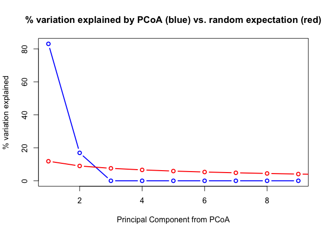<!-- -->

``` r
vec.McapCpGPercentsPCoA <- envfit(scores(McapCpGPercentsPCoA), McapCpGPercentsTrans, perm = 1000) #Extract PCs to calculate PC loadings (variable weights)
vec.McapCpGPercentsPCoA #Look at statistical results
```

    ## 
    ## ***VECTORS
    ## 
    ##                       Dim1     Dim2 r2   Pr(>r)    
    ## percentMeth        0.50552  0.86281  1 0.000999 ***
    ## percentSparseMeth  0.49445 -0.86920  1 0.000999 ***
    ## percentUnMeth     -0.99998  0.00639  1 0.000999 ***
    ## ---
    ## Signif. codes:  0 '***' 0.001 '**' 0.01 '*' 0.05 '.' 0.1 ' ' 1
    ## Permutation: free
    ## Number of permutations: 1000

##### Global perMANOVA

``` r
sampleInformation <- c(rep("WGBS", times = 3),
                       rep("RRBS", times = 3),
                       rep("MBDBS", times = 3)) #Create a vector with grouping information
```

``` r
McapCpGPercentsTest <- adonis(dissimMcapCpGPercentsTrans ~ sampleInformation) #Conduct perMANOVA by method
McapCpGPercentsTest #Look at test output.
```

    ## 
    ## Call:
    ## adonis(formula = dissimMcapCpGPercentsTrans ~ sampleInformation) 
    ## 
    ## Permutation: free
    ## Number of permutations: 999
    ## 
    ## Terms added sequentially (first to last)
    ## 
    ##                   Df SumsOfSqs MeanSqs F.Model      R2 Pr(>F)   
    ## sampleInformation  2   1.47302 0.73651  77.203 0.96259  0.004 **
    ## Residuals          6   0.05724 0.00954         0.03741          
    ## Total              8   1.53026                 1.00000          
    ## ---
    ## Signif. codes:  0 '***' 0.001 '**' 0.01 '*' 0.05 '.' 0.1 ' ' 1

##### Beta dispersion model

``` r
disp.McapCpGPercentsTrans <- betadisper(dissimMcapCpGPercentsTrans,group=sampleInformation,type='centroid') #Run a beta dispersion model to assess if significant differences are due to differences in group centroid or variance
anova(disp.McapCpGPercentsTrans) #Variance is the same across all groups. Significance in perMANOVA due to centroid differences, not variance
```

    ## Analysis of Variance Table
    ## 
    ## Response: Distances
    ##           Df    Sum Sq    Mean Sq F value Pr(>F)
    ## Groups     2 0.0016690 0.00083448  0.5826 0.5872
    ## Residuals  6 0.0085943 0.00143239

##### Create plot

``` r
ordiplot(McapCpGPercentsPCoA, choices = c(1,2), type = "text", display = "sites", xlab = "PC 1 (83.1%)", ylab = "PC 2 (16.9%)") #Plot basic PCoA
plot(vec.McapCpGPercentsPCoA, p.max = 0.05, col = "blue") #Plot loadings that are significant at the 0.05 level
```

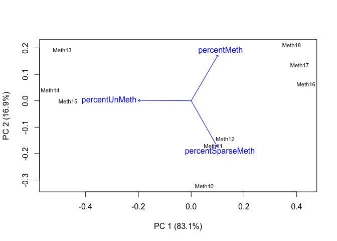<!-- -->

#### Pairwise perMANVOA

##### WGBS vs. RRBS

``` r
McapCpGPercentsWGRR <- vegdist(McapCpGPercentsTrans[c(1:3, 4:6),], "euclidean") #Subset WGBS and RRBS data and calculate dissimilarity matrix
```

``` r
McapCpGPercentsWGRRTest <- adonis(McapCpGPercentsWGRR ~ sampleInformation[1:6]) #Conduct pairwise perMANOVA for WGBS and RRBS data. Only use sequencing method metadata for these samples
```

    ## 'nperm' >= set of all permutations: complete enumeration.

    ## Set of permutations < 'minperm'. Generating entire set.

``` r
McapCpGPercentsWGRRTest
```

    ## 
    ## Call:
    ## adonis(formula = McapCpGPercentsWGRR ~ sampleInformation[1:6]) 
    ## 
    ## Permutation: free
    ## Number of permutations: 719
    ## 
    ## Terms added sequentially (first to last)
    ## 
    ##                        Df SumsOfSqs MeanSqs F.Model      R2 Pr(>F)
    ## sampleInformation[1:6]  1   0.63696 0.63696  56.738 0.93414    0.1
    ## Residuals               4   0.04491 0.01123         0.06586       
    ## Total                   5   0.68187                 1.00000

##### WGBS vs. MBD-BS

``` r
McapCpGPercentsWGMB <- vegdist(McapCpGPercentsTrans[c(1:3, 7:9),], "euclidean") #Subset WGBS and MBD-BS data and calculate dissimilarity matrix
```

``` r
McapCpGPercentsWGMBTest <- adonis(McapCpGPercentsWGMB ~ sampleInformation[c(1:3, 7:9)]) #Conduct pairwise perMANOVA for WGBS and MBD-BS data. Only use sequencing method metadata for these samples
```

    ## 'nperm' >= set of all permutations: complete enumeration.

    ## Set of permutations < 'minperm'. Generating entire set.

``` r
McapCpGPercentsWGMBTest
```

    ## 
    ## Call:
    ## adonis(formula = McapCpGPercentsWGMB ~ sampleInformation[c(1:3,      7:9)]) 
    ## 
    ## Permutation: free
    ## Number of permutations: 719
    ## 
    ## Terms added sequentially (first to last)
    ## 
    ##                                Df SumsOfSqs MeanSqs F.Model     R2 Pr(>F)
    ## sampleInformation[c(1:3, 7:9)]  1   0.33767 0.33767  39.571 0.9082    0.1
    ## Residuals                       4   0.03413 0.00853         0.0918       
    ## Total                           5   0.37180                 1.0000

##### RRBS vs. MBD-BS

``` r
McapCpGPercentsRRMB <- vegdist(McapCpGPercentsTrans[c(4:9),], "euclidean") #Subset RRBS and MBD-BS data and calculate dissimilarity matrix
```

``` r
McapCpGPercentsRRMBTest <- adonis(McapCpGPercentsRRMB ~ sampleInformation[c(4:9)]) #Conduct pairwise perMANOVA for WGBS and RRBS data. Only use sequencing method metadata for these samples
```

    ## 'nperm' >= set of all permutations: complete enumeration.

    ## Set of permutations < 'minperm'. Generating entire set.

``` r
McapCpGPercentsRRMBTest
```

    ## 
    ## Call:
    ## adonis(formula = McapCpGPercentsRRMB ~ sampleInformation[c(4:9)]) 
    ## 
    ## Permutation: free
    ## Number of permutations: 719
    ## 
    ## Terms added sequentially (first to last)
    ## 
    ##                           Df SumsOfSqs MeanSqs F.Model     R2 Pr(>F)
    ## sampleInformation[c(4:9)]  1   1.23490 1.23490  139.37 0.9721    0.1
    ## Residuals                  4   0.03544 0.00886         0.0279       
    ## Total                      5   1.27034                 1.0000

### Generalized linear model analysis

To complement my multivariate analysis, I will use a series of
generalized linear models. I will run separate models for each
methylation status since the proportions of each add up to 1.

Does sequencing method influence the proportion of high, moderate, or
low CpGs
detected?

#### High methylation

``` r
McapCpGPercentsHigh <- data.frame("seqMethod" = c(rep("A", times = 3), rep("B", times = 3), rep("C", times = 3)),
                                  "replicate" = rep(c("1", "2", "3"), times = 3),
                                  "highMeth" = McapCpGTypePercents[,1] / 100) #Remove moderate and low methylation information and add sequencing metadata. A = WGBS, B = RRBS, C = MBD-BS. Needed to alphabetize so RRBS and MBD-BS are compared to WGBS (model default is alphabetized)
head(McapCpGPercentsHigh) #Confirm dataframe creation
```

    ##   seqMethod replicate   highMeth
    ## 1         A         1 0.09856784
    ## 2         A         2 0.11345650
    ## 3         A         3 0.12055734
    ## 4         B         1 0.08122293
    ## 5         B         2 0.06974826
    ## 6         B         3 0.07283040

``` r
McapCpGHighModel <- glmmTMB(highMeth ~ seqMethod + (1|replicate),
                            family = beta_family(link = "logit"),
                            data = McapCpGPercentsHigh) #Run the model using a beta distribution and a logit link. Use replicate as a random effect
summary(McapCpGHighModel) #Look at model output.
```

    ##  Family: beta  ( logit )
    ## Formula:          highMeth ~ seqMethod + (1 | replicate)
    ## Data: McapCpGPercentsHigh
    ## 
    ##      AIC      BIC   logLik deviance df.resid 
    ##    -54.8    -53.8     32.4    -64.8        4 
    ## 
    ## Random effects:
    ## 
    ## Conditional model:
    ##  Groups    Name        Variance  Std.Dev. 
    ##  replicate (Intercept) 1.153e-11 3.396e-06
    ## Number of obs: 9, groups:  replicate, 3
    ## 
    ## Overdispersion parameter for beta family (): 2.31e+03 
    ## 
    ## Conditional model:
    ##             Estimate Std. Error z value Pr(>|z|)    
    ## (Intercept) -2.08372    0.03828  -54.43  < 2e-16 ***
    ## seqMethodB  -0.43374    0.05959   -7.28 3.37e-13 ***
    ## seqMethodC   0.61845    0.04911   12.59  < 2e-16 ***
    ## ---
    ## Signif. codes:  0 '***' 0.001 '**' 0.01 '*' 0.05 '.' 0.1 ' ' 1

``` r
McapCpGHighPostHoc <- data.frame(emmeans(McapCpGHighModel, pairwise ~ seqMethod, adjust = "FDR")$contrasts) #Run pairwise comparisons (estimated marginal means). Obtain log odd ratio results and not confidence intervals for individual methods in a dataframe format. Specify FDR instead of Tukey post-hoc test (default)
head(McapCpGHighPostHoc) #Look at log odd ratio results
```

    ##   contrast   estimate         SE df    t.ratio      p.value
    ## 1    A - B  0.4337431 0.05959172  4   7.278579 0.0018932085
    ## 2    A - C -0.6184525 0.04911135  4 -12.592863 0.0003433239
    ## 3    B - C -1.0521955 0.05507614  4 -19.104380 0.0001326934

#### Moderate methylation

``` r
McapCpGPercentsMod <- data.frame("seqMethod" = c(rep("A", times = 3), rep("B", times = 3), rep("C", times = 3)),
                                 "replicate" = rep(c("1", "2", "3"), times = 3),
                                 "modMeth" = McapCpGTypePercents[,2] / 100) #Remove high and low methylation information and add sequencing metadata
head(McapCpGPercentsMod) #Confirm dataframe creation
```

    ##   seqMethod replicate    modMeth
    ## 1         A         1 0.11984981
    ## 2         A         2 0.11107605
    ## 3         A         3 0.11378198
    ## 4         B         1 0.04791359
    ## 5         B         2 0.05098809
    ## 6         B         3 0.05649395

``` r
McapCpGModModel <- glmmTMB(modMeth ~ seqMethod + (1|replicate),
                           family = beta_family(link = "logit"),
                           data = McapCpGPercentsMod) #Run the model using a beta distribution and a logit link. Use replicate as a random effect
summary(McapCpGModModel) #Look at model output.
```

    ##  Family: beta  ( logit )
    ## Formula:          modMeth ~ seqMethod + (1 | replicate)
    ## Data: McapCpGPercentsMod
    ## 
    ##      AIC      BIC   logLik deviance df.resid 
    ##    -59.7    -58.7     34.8    -69.7        4 
    ## 
    ## Random effects:
    ## 
    ## Conditional model:
    ##  Groups    Name        Variance  Std.Dev. 
    ##  replicate (Intercept) 6.791e-12 2.606e-06
    ## Number of obs: 9, groups:  replicate, 3
    ## 
    ## Overdispersion parameter for beta family (): 3.17e+03 
    ## 
    ## Conditional model:
    ##             Estimate Std. Error z value Pr(>|z|)    
    ## (Intercept) -2.04092    0.03213  -63.52   <2e-16 ***
    ## seqMethodB  -0.86572    0.05627  -15.39   <2e-16 ***
    ## seqMethodC   0.03725    0.04511    0.83    0.409    
    ## ---
    ## Signif. codes:  0 '***' 0.001 '**' 0.01 '*' 0.05 '.' 0.1 ' ' 1

``` r
McapCpGModPostHoc <- data.frame(emmeans(McapCpGModModel, pairwise ~ seqMethod, adjust = "FDR")$contrasts) #Run pairwise comparisons (estimated marginal means). Obtain log odd ratio results and not confidence intervals for individual methods in a dataframe format. Specify FDR instead of Tukey post-hoc test (default)
head(McapCpGModPostHoc) #Look at log odd ratio results
```

    ##   contrast    estimate         SE df     t.ratio      p.value
    ## 1    A - B  0.86572311 0.05626762  4  15.3858144 0.0001561808
    ## 2    A - C -0.03725136 0.04511108  4  -0.8257696 0.4553393386
    ## 3    B - C -0.90297447 0.05600967  4 -16.1217614 0.0001561808

#### Low methylation

``` r
McapCpGPercentsLow <- data.frame("seqMethod" = c(rep("A", times = 3), rep("B", times = 3), rep("C", times = 3)),
                                 "replicate" = rep(c("1", "2", "3"), times = 3),
                                 "lowMeth" = McapCpGTypePercents[,3] / 100) #Remove moderate and low methylation information and add sequencing metadata
head(McapCpGPercentsLow) #Confirm dataframe creation
```

    ##   seqMethod replicate   lowMeth
    ## 1         A         1 0.7815823
    ## 2         A         2 0.7754674
    ## 3         A         3 0.7656607
    ## 4         B         1 0.8708635
    ## 5         B         2 0.8792637
    ## 6         B         3 0.8706756

``` r
McapCpGLowModel <- glmmTMB(lowMeth ~ seqMethod + (1|replicate),
                           family = beta_family(link = "logit"),
                           data = McapCpGPercentsLow) #Run the model using a beta distribution and a logit link. Use replicate as a random effect
summary(McapCpGLowModel) #Look at model output.
```

    ##  Family: beta  ( logit )
    ## Formula:          lowMeth ~ seqMethod + (1 | replicate)
    ## Data: McapCpGPercentsLow
    ## 
    ##      AIC      BIC   logLik deviance df.resid 
    ##    -59.9    -59.0     35.0    -69.9        4 
    ## 
    ## Random effects:
    ## 
    ## Conditional model:
    ##  Groups    Name        Variance  Std.Dev. 
    ##  replicate (Intercept) 1.205e-12 1.098e-06
    ## Number of obs: 9, groups:  replicate, 3
    ## 
    ## Overdispersion parameter for beta family (): 6.48e+03 
    ## 
    ## Conditional model:
    ##             Estimate Std. Error z value Pr(>|z|)    
    ## (Intercept)  1.23253    0.01715   71.85   <2e-16 ***
    ## seqMethodB   0.70062    0.02757   25.42   <2e-16 ***
    ## seqMethodC  -0.41593    0.02316  -17.96   <2e-16 ***
    ## ---
    ## Signif. codes:  0 '***' 0.001 '**' 0.01 '*' 0.05 '.' 0.1 ' ' 1

``` r
McapCpGLowPostHoc <- data.frame(emmeans(McapCpGLowModel, pairwise ~ seqMethod, adjust = "FDR")$contrasts) #Run pairwise comparisons (estimated marginal means). Obtain log odd ratio results and not confidence intervals for individual methods in a dataframe format. Specify FDR instead of Tukey post-hoc test (default)
head(McapCpGLowPostHoc) #Look at log odd ratio results
```

    ##   contrast   estimate         SE df   t.ratio      p.value
    ## 1    A - B -0.7006236 0.02756550  4 -25.41669 2.134510e-05
    ## 2    A - C  0.4159316 0.02315618  4  17.96202 5.646898e-05
    ## 3    B - C  1.1165552 0.02660081  4  41.97448 5.776830e-06

#### Save statistical output

``` r
McapCpGMethStatusStatOutput <- rbind(McapCpGHighPostHoc,
                                     McapCpGModPostHoc,
                                     McapCpGLowPostHoc) #Create a dataframe with logs odd ratio output for each model
McapCpGMethStatusStatOutput$model <- c(rep("High", times = 3), rep("Mod", times = 3), rep("Low", times = 3)) #Add model information
head(McapCpGMethStatusStatOutput) #Confirm dataframe creation
```

    ##   contrast    estimate         SE df     t.ratio      p.value model
    ## 1    A - B  0.43374305 0.05959172  4   7.2785787 0.0018932085  High
    ## 2    A - C -0.61845246 0.04911135  4 -12.5928629 0.0003433239  High
    ## 3    B - C -1.05219551 0.05507614  4 -19.1043802 0.0001326934  High
    ## 4    A - B  0.86572311 0.05626762  4  15.3858144 0.0001561808   Mod
    ## 5    A - C -0.03725136 0.04511108  4  -0.8257696 0.4553393386   Mod
    ## 6    B - C -0.90297447 0.05600967  4 -16.1217614 0.0001561808   Mod

``` r
write.table(McapCpGMethStatusStatOutput, "../analyses/Characterizing-CpG-Methylation-5x/Mcap/Mcap-CpG-Type-StatResults.txt", quote = FALSE, row.names = FALSE) #Save table
```

## Pact

### Import file counts

``` r
PactAll <- read.table("../analyses/Characterizing-CpG-Methylation-5x/Pact/Pact-5x-bedgraph-counts.txt", header = FALSE, col.names = c("totalLines", "filename")) #Import file using space as a delimiter. Columns are the number of lines and the filename
PactAll <- PactAll[-10,] #Remove last row (total lines for all files)
tail(PactAll) #Confirm import
```

    ##   totalLines                                       filename
    ## 4    1835561 Meth4_R1_001_val_1_bismark_bt2_pe._5x.bedgraph
    ## 5    1451229 Meth5_R1_001_val_1_bismark_bt2_pe._5x.bedgraph
    ## 6    1517358 Meth6_R1_001_val_1_bismark_bt2_pe._5x.bedgraph
    ## 7    2640625 Meth7_R1_001_val_1_bismark_bt2_pe._5x.bedgraph
    ## 8     539008 Meth8_R1_001_val_1_bismark_bt2_pe._5x.bedgraph
    ## 9    2732607 Meth9_R1_001_val_1_bismark_bt2_pe._5x.bedgraph

``` r
PactMeth <- read.table("../analyses/Characterizing-CpG-Methylation-5x/Pact/Pact-5x-Meth-counts.txt", header = FALSE, col.names = c("Meth", "filename")) #Import file using space as a delimiter. Columns are the number of lines and the filename
PactMeth <- PactMeth[-10,] #Remove last row (total lines for all files)
tail(PactMeth) #Confirm import
```

    ##     Meth                                            filename
    ## 4  31047 Meth4_R1_001_val_1_bismark_bt2_pe._5x.bedgraph-Meth
    ## 5  30345 Meth5_R1_001_val_1_bismark_bt2_pe._5x.bedgraph-Meth
    ## 6  26617 Meth6_R1_001_val_1_bismark_bt2_pe._5x.bedgraph-Meth
    ## 7 258222 Meth7_R1_001_val_1_bismark_bt2_pe._5x.bedgraph-Meth
    ## 8 213342 Meth8_R1_001_val_1_bismark_bt2_pe._5x.bedgraph-Meth
    ## 9 255370 Meth9_R1_001_val_1_bismark_bt2_pe._5x.bedgraph-Meth

``` r
PactSparseMeth <- read.table("../analyses/Characterizing-CpG-Methylation-5x/Pact/Pact-5x-sparseMeth-counts.txt", header = FALSE, col.names = c("sparseMeth", "filename")) #Import file using space as a delimiter. Columns are the number of lines and the filename
PactSparseMeth <- PactSparseMeth[-10,] #Remove last row (total lines for all files)
tail(PactSparseMeth) #Confirm import
```

    ##   sparseMeth                                                  filename
    ## 4     137700 Meth4_R1_001_val_1_bismark_bt2_pe._5x.bedgraph-sparseMeth
    ## 5      64837 Meth5_R1_001_val_1_bismark_bt2_pe._5x.bedgraph-sparseMeth
    ## 6      89246 Meth6_R1_001_val_1_bismark_bt2_pe._5x.bedgraph-sparseMeth
    ## 7     296059 Meth7_R1_001_val_1_bismark_bt2_pe._5x.bedgraph-sparseMeth
    ## 8      80086 Meth8_R1_001_val_1_bismark_bt2_pe._5x.bedgraph-sparseMeth
    ## 9     337855 Meth9_R1_001_val_1_bismark_bt2_pe._5x.bedgraph-sparseMeth

``` r
PactUnMeth <- read.table("../analyses/Characterizing-CpG-Methylation-5x/Pact/Pact-5x-unMeth-counts.txt", header = FALSE, col.names = c("unMeth", "filename")) #Import file using space as a delimiter. Columns are the number of lines and the filename
PactUnMeth <- PactUnMeth[-10,] #Remove last row (total lines for all files)
tail(PactUnMeth) #Confirm import
```

    ##    unMeth                                              filename
    ## 4 1666814 Meth4_R1_001_val_1_bismark_bt2_pe._5x.bedgraph-unMeth
    ## 5 1356047 Meth5_R1_001_val_1_bismark_bt2_pe._5x.bedgraph-unMeth
    ## 6 1401495 Meth6_R1_001_val_1_bismark_bt2_pe._5x.bedgraph-unMeth
    ## 7 2086344 Meth7_R1_001_val_1_bismark_bt2_pe._5x.bedgraph-unMeth
    ## 8  245580 Meth8_R1_001_val_1_bismark_bt2_pe._5x.bedgraph-unMeth
    ## 9 2139382 Meth9_R1_001_val_1_bismark_bt2_pe._5x.bedgraph-unMeth

### Create summary table

``` r
PactCpGType <- cbind(PactAll, PactMeth, PactSparseMeth, PactUnMeth) #Mash tables together by column
rownames(PactCpGType) <- substr(PactAll$filename, start = 1, stop = 5) #Use the first 5 characters of the filename to add sample ID to row names
PactCpGType <- PactCpGType[,-c(2,4,6,8)] #Remove filename columns
tail(PactCpGType) #Confirm table mashing
```

    ##       totalLines   Meth sparseMeth  unMeth
    ## Meth4    1835561  31047     137700 1666814
    ## Meth5    1451229  30345      64837 1356047
    ## Meth6    1517358  26617      89246 1401495
    ## Meth7    2640625 258222     296059 2086344
    ## Meth8     539008 213342      80086  245580
    ## Meth9    2732607 255370     337855 2139382

``` r
PactCpGType$percentMeth <- (PactCpGType$Meth / PactCpGType$totalLines) * 100 #Calculate percent methylated loci
PactCpGType$percentSparseMeth <- (PactCpGType$sparseMeth / PactCpGType$totalLines) * 100 #Calculate percent sparsely methylated loci
PactCpGType$percentUnMeth <- (PactCpGType$unMeth / PactCpGType$totalLines) * 100 #Calculate percent unmethylated loci
PactCpGType <- PactCpGType[,c(1, 2, 5, 3, 6, 4, 7)] #Reorganize columns
tail(PactCpGType) #Confirm calculations
```

    ##       totalLines   Meth percentMeth sparseMeth percentSparseMeth  unMeth
    ## Meth4    1835561  31047    1.691418     137700          7.501794 1666814
    ## Meth5    1451229  30345    2.090986      64837          4.467730 1356047
    ## Meth6    1517358  26617    1.754167      89246          5.881671 1401495
    ## Meth7    2640625 258222    9.778821     296059         11.211702 2086344
    ## Meth8     539008 213342   39.580489      80086         14.858036  245580
    ## Meth9    2732607 255370    9.345288     337855         12.363834 2139382
    ##       percentUnMeth
    ## Meth4      90.80679
    ## Meth5      93.44128
    ## Meth6      92.36416
    ## Meth7      79.00948
    ## Meth8      45.56148
    ## Meth9      78.29088

``` r
write.table(PactCpGType, "../analyses/Characterizing-CpG-Methylation-5x/Pact/Pact-CpG-Type.txt", sep = "\t", quote = FALSE, row.names = TRUE) #Save summary table
```

``` r
PactCpGType <- read.delim("../analyses/Characterizing-CpG-Methylation-5x/Pact/Pact-CpG-Type.txt", sep = "\t", header = TRUE) #Import summary table
head(PactCpGType) #Check import
```

    ##       totalLines   Meth percentMeth sparseMeth percentSparseMeth  unMeth
    ## Meth1    5546051 110364    1.989956     367019          6.617664 5068668
    ## Meth2    6358722 126440    1.988450     345887          5.439568 5886395
    ## Meth3    5866786 124819    2.127553     385346          6.568264 5356621
    ## Meth4    1835561  31047    1.691418     137700          7.501794 1666814
    ## Meth5    1451229  30345    2.090986      64837          4.467730 1356047
    ## Meth6    1517358  26617    1.754167      89246          5.881671 1401495
    ##       percentUnMeth
    ## Meth1      91.39238
    ## Meth2      92.57198
    ## Meth3      91.30418
    ## Meth4      90.80679
    ## Meth5      93.44128
    ## Meth6      92.36416

### Reorganize data

``` r
PactCpGTypePercents <- PactCpGType[,c(3,5,7)] #Keep only columns with % total CpG information
tail(PactCpGTypePercents) #Check reorganization
```

    ##       percentMeth percentSparseMeth percentUnMeth
    ## Meth4    1.691418          7.501794      90.80679
    ## Meth5    2.090986          4.467730      93.44128
    ## Meth6    1.754167          5.881671      92.36416
    ## Meth7    9.778821         11.211702      79.00948
    ## Meth8   39.580489         14.858036      45.56148
    ## Meth9    9.345288         12.363834      78.29088

``` r
#Create test plots

barplot(t(PactCpGTypePercents[1,]), beside = TRUE, ylim = c(0,100), names.arg = c(expression("High (">="50%)"), "Moderate (10-50%)", expression("Weak ("<="10%)")), axes = FALSE) #Sample 1, WGBS
axis(side = 2, at = seq(0, 100, by = 25), las = 2, col = "grey80")
```

<!-- -->

``` r
barplot(t(PactCpGTypePercents[4,]), beside = TRUE, ylim = c(0,100), names.arg = c(expression("High (">="50%)"), "Moderate (10-50%)", expression("Weak ("<="10%)")), axes = FALSE) #Sample 1, RRBS
axis(side = 2, at = seq(0, 100, by = 25), las = 2, col = "grey80")
```

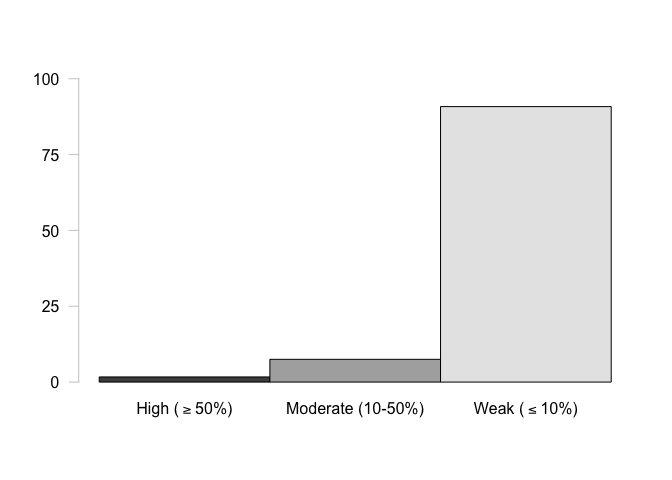<!-- -->

``` r
barplot(t(PactCpGTypePercents[7,]), beside = TRUE, ylim = c(0,100), names.arg = c(expression("High (">="50%)"), "Moderate (10-50%)", expression("Weak ("<="10%)")), axes = FALSE) #Sample 1, MBD-BSSeqc(expression("High (">="50%)"), "Moderate (10-50%)", expression("Weak ("<="10%)"))
axis(side = 2, at = seq(0, 100, by = 25), las = 2, col = "grey80")
```

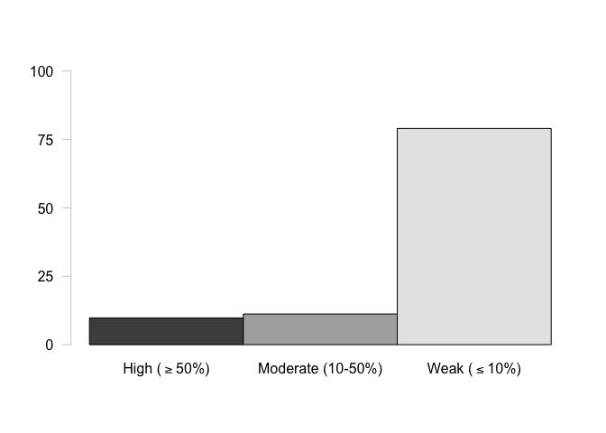<!-- -->

### Create multipanel figure with all samples

``` r
#pdf("../analyses/Characterizing-CpG-Methylation-5x/Pact/Pact-CpG-Type.pdf", height = 8.5, width = 11) #Save file as pdf

par(mfcol = c(3,3), mar = c(2, 2, 2, 0), oma = c(5, 5, 2, 0)) #Fill in multipanel plot by column and adjust inner and outer margins

barplot(t(PactCpGTypePercents[1,]), beside = TRUE, ylim = c(0,100), names.arg = FALSE, axes = FALSE) #Sample 1, WGBS
mtext(side = 3, "WBGS", adj = 0, line = 1) #Add sequencing information
axis(side = 2, at = seq(0, 100, by = 25), las = 2, col = "grey80", cex.axis = 1.3) #Add y-axis

barplot(t(PactCpGTypePercents[4,]), beside = TRUE, ylim = c(0,100), names.arg = FALSE, axes = FALSE) #Sample 1, RRBS
mtext(side = 3, "RRBS", adj = 0, line = 1) #Add sequencing information
axis(side = 2, at = seq(0, 100, by = 25), las = 2, col = "grey80", cex.axis = 1.3) #Add y-axis
mtext(side = 2, outer = TRUE, "% 5x CpG with Data", cex = 1.5, line = 2) #Add y-axis label

barplot(t(PactCpGTypePercents[7,]), beside = TRUE, ylim = c(0,100), names.arg = c(expression("">= "50%"), "10-50%", "< 10%"), cex.names = 1.3, axes = FALSE) #Sample 1, MBD-BSSeq
mtext(side = 3, "MBD-BSSeq", adj = 0, line = 1) #Add sequencing information
axis(side = 2, at = seq(0, 100, by = 25), las = 2, col = "grey80", cex.axis = 1.3) #Add y-axis

barplot(t(PactCpGTypePercents[2,]), beside = TRUE, ylim = c(0,100), names.arg = FALSE, axes = FALSE) #Sample 2, WGBS
barplot(t(PactCpGTypePercents[5,]), beside = TRUE, ylim = c(0,100), names.arg = FALSE, axes = FALSE) #Sample 2, RRBS
barplot(t(PactCpGTypePercents[8,]), beside = TRUE, ylim = c(0,100), names.arg = c(expression("">= "50%"), "10-50%", "< 10%"), cex.names = 1.3, axes = FALSE) #Sample 2, MBD-BSSeq
mtext(side = 1, outer = TRUE, "% Methylation", cex = 1.5, line = 2) #Add x-axis label

barplot(t(PactCpGTypePercents[3,]), beside = TRUE, ylim = c(0,100), names.arg = FALSE, axes = FALSE) #Sample 3, WGBS
barplot(t(PactCpGTypePercents[6,]), beside = TRUE, ylim = c(0,100), names.arg = FALSE, axes = FALSE) #Sample 3, RRBS
barplot(t(PactCpGTypePercents[9,]), beside = TRUE, ylim = c(0,100), names.arg = c(expression("">= "50%"), "10-50%", "< 10%"), cex.names = 1.3, axes = FALSE) #Sample 3, MBD-BSSeq
```

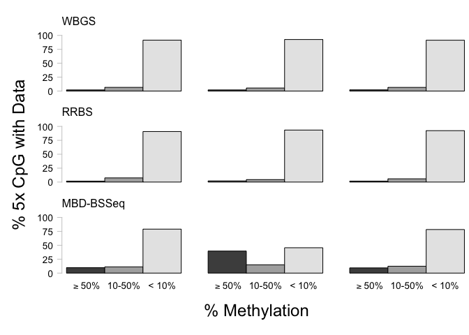<!-- -->

``` r
#dev.off() #Turn off plotting device
```

### Multivariate data analysis with compositional data

We are interested in how sequencing method affects the proportion, or
composition, of CpGs in various methylation statuses and genomic
features. For this reason, I will use a combined compositional analysis
and multivariate approach. For each sample, I will have separate columns
for each methylation
status.

#### Format data

``` r
PactCpGPercentsTrans <- data.frame(clr(PactCpGTypePercents / 100)) #Use centered log-ratio transformation on proportion data
tail(PactCpGPercentsTrans) # Confirm transformation
```

    ##       percentMeth percentSparseMeth percentUnMeth
    ## Meth4  -1.8242474        -0.3346722      2.158920
    ## Meth5  -1.5196473        -0.7604027      2.280050
    ## Meth6  -1.7245304        -0.5146839      2.239214
    ## Meth7  -0.7420293        -0.6052902      1.347320
    ## Meth8   0.2796897        -0.7001057      0.420416
    ## Meth9  -0.8018207        -0.5219174      1.323738

#### PCoA and perMANOVA

##### Conduct PCoA

``` r
dissimPactCpGPercentsTrans <- vegdist(PactCpGPercentsTrans, "euclidean") #Calculate euclidean dissimilarity matrix
```

``` r
PactCpGPercentsPCoA <- cmdscale(dissimPactCpGPercentsTrans, eig = TRUE, add = TRUE) #Perform the PCoA. Include eigenvalues for each PC, and add a constant so default eigenvalues are non-negative.
PactCpGPercentsPCoA$points #View PC scores
```

    ##             [,1]         [,2]
    ## Meth1 -0.5492318 -0.062463037
    ## Meth2 -0.5468168  0.102793175
    ## Meth3 -0.4989987 -0.033017452
    ## Meth4 -0.6717886 -0.225357135
    ## Meth5 -0.5044980  0.285244508
    ## Meth6 -0.6420655 -0.006470277
    ## Meth7  0.6878927  0.007863205
    ## Meth8  2.0705730  0.023522995
    ## Meth9  0.6549337 -0.092115981

##### Understand eigenvalues and loadings

``` r
PactCpGPercentsPCoA$eig #View eigenvalues
```

    ## [1] 7.157137e+00 1.568509e-01 1.337215e-14 1.754474e-15 1.151873e-15
    ## [6] 9.190586e-16 8.431659e-16 8.273859e-16 1.894562e-16

``` r
(PactCpGPercentsPCoA$eig / sum(PactCpGPercentsPCoA$eig)) * 100 #Calculate percent variation explained by each PC
```

    ## [1] 9.785547e+01 2.144533e+00 1.828298e-13 2.398792e-14 1.574890e-14
    ## [6] 1.256577e-14 1.152813e-14 1.131238e-14 2.590327e-15

``` r
plot(PactCpGPercentsPCoA$eig/sum(PactCpGPercentsPCoA$eig)*100, 
     type = "b",lwd = 2,col = "blue", 
     xlab = "Principal Component from PCoA", ylab = "% variation explained", main = "% variation explained by PCoA (blue) vs. random expectation (red)") #Plot eigenvalues
lines(bstick(35)*100, type = "b",lwd = 2, col = "red") #Compare eigenvalues to expectations according to the broken stick model
```

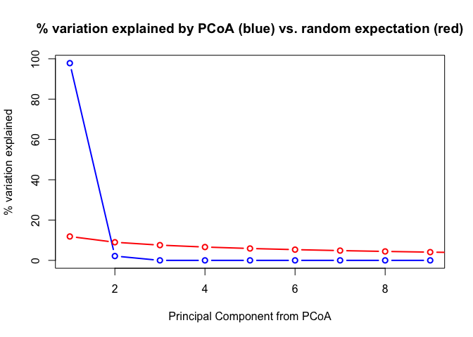<!-- -->

``` r
vec.PactCpGPercentsPCoA <- envfit(scores(PactCpGPercentsPCoA), PactCpGPercentsTrans, perm = 1000) #Extract PCs to calculate PC loadings (variable weights)
vec.PactCpGPercentsPCoA #Look at statistical results
```

    ## 
    ## ***VECTORS
    ## 
    ##                       Dim1     Dim2 r2   Pr(>r)    
    ## percentMeth        0.90008  0.43573  1 0.000999 ***
    ## percentSparseMeth -0.07269 -0.99735  1 0.000999 ***
    ## percentUnMeth     -0.82739  0.56163  1 0.000999 ***
    ## ---
    ## Signif. codes:  0 '***' 0.001 '**' 0.01 '*' 0.05 '.' 0.1 ' ' 1
    ## Permutation: free
    ## Number of permutations: 1000

##### Global perMANOVA

``` r
PactCpGPercentsTest <- adonis(dissimPactCpGPercentsTrans ~ sampleInformation) #Conduct perMANOVA by method
PactCpGPercentsTest #Look at test output.
```

    ## 
    ## Call:
    ## adonis(formula = dissimPactCpGPercentsTrans ~ sampleInformation) 
    ## 
    ## Permutation: free
    ## Number of permutations: 999
    ## 
    ## Terms added sequentially (first to last)
    ## 
    ##                   Df SumsOfSqs MeanSqs F.Model      R2 Pr(>F)  
    ## sampleInformation  2    5.8362 2.91808  11.847 0.79794  0.024 *
    ## Residuals          6    1.4778 0.24631         0.20206         
    ## Total              8    7.3140                 1.00000         
    ## ---
    ## Signif. codes:  0 '***' 0.001 '**' 0.01 '*' 0.05 '.' 0.1 ' ' 1

##### Beta dispersion model

``` r
disp.PactCpGPercentsTrans <- betadisper(dissimPactCpGPercentsTrans,group=sampleInformation,type='centroid') #Run a beta dispersion model to assess if significant differences are due to differences in group centroid or variance
anova(disp.PactCpGPercentsTrans) #Variance is different between groups. Significance in perMANOVA can be due to centroid and variance differences.
```

    ## Analysis of Variance Table
    ## 
    ## Response: Distances
    ##           Df Sum Sq  Mean Sq F value  Pr(>F)  
    ## Groups     2 0.5047 0.252351  8.3931 0.01826 *
    ## Residuals  6 0.1804 0.030067                  
    ## ---
    ## Signif. codes:  0 '***' 0.001 '**' 0.01 '*' 0.05 '.' 0.1 ' ' 1

##### Create plot

``` r
ordiplot(PactCpGPercentsPCoA, choices = c(1,2), type = "text", display = "sites", xlab = "PC 1 (97.9%)", ylab = "PC 2 (2.1%)") #Plot basic PCoA
plot(vec.PactCpGPercentsPCoA, p.max = 0.05, col = "blue") #Plot loadings that are significant at the 0.05 level
```

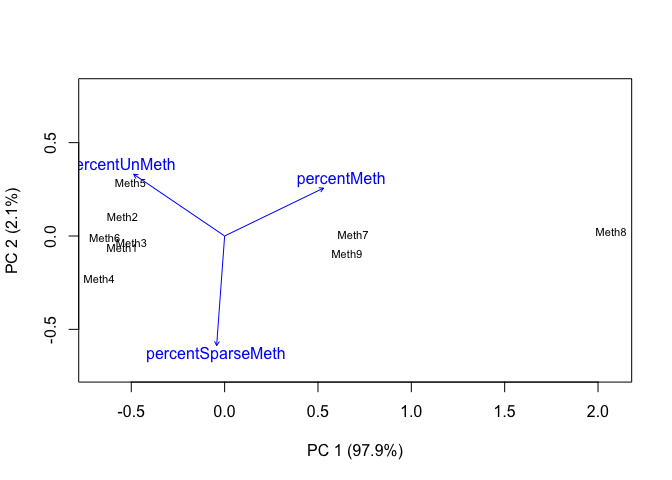<!-- -->

#### Pairwise perMANVOA

##### WGBS vs. RRBS

``` r
PactCpGPercentsWGRR <- vegdist(PactCpGPercentsTrans[c(1:3, 4:6),], "euclidean") #Subset WGBS and RRBS data and calculate dissimilarity matrix
```

``` r
PactCpGPercentsWGRRTest <- adonis(PactCpGPercentsWGRR ~ sampleInformation[1:6]) #Conduct pairwise perMANOVA for WGBS and RRBS data. Only use sequencing method metadata for these samples
```

    ## 'nperm' >= set of all permutations: complete enumeration.

    ## Set of permutations < 'minperm'. Generating entire set.

``` r
PactCpGPercentsWGRRTest
```

    ## 
    ## Call:
    ## adonis(formula = PactCpGPercentsWGRR ~ sampleInformation[1:6]) 
    ## 
    ## Permutation: free
    ## Number of permutations: 719
    ## 
    ## Terms added sequentially (first to last)
    ## 
    ##                        Df SumsOfSqs  MeanSqs F.Model      R2 Pr(>F)
    ## sampleInformation[1:6]  1  0.008665 0.008665 0.21094 0.05009    0.8
    ## Residuals               4  0.164318 0.041080         0.94991       
    ## Total                   5  0.172983                  1.00000

``` r
disp.PactCpGPercentsWGRR <- betadisper(PactCpGPercentsWGRR, group = sampleInformation[1:6], type = 'centroid') #Run a beta dispersion model to assess if differences are due to differences in group centroid or variance
anova(disp.PactCpGPercentsWGRR) #Variance is the same between groups.
```

    ## Analysis of Variance Table
    ## 
    ## Response: Distances
    ##           Df   Sum Sq   Mean Sq F value Pr(>F)
    ## Groups     1 0.022132 0.0221316  2.4607 0.1918
    ## Residuals  4 0.035975 0.0089939

##### WGBS vs. MBD-BS

``` r
PactCpGPercentsWGMB <- vegdist(PactCpGPercentsTrans[c(1:3, 7:9),], "euclidean") #Subset WGBS and MBD-BS data and calculate dissimilarity matrix
```

``` r
PactCpGPercentsWGMBTest <- adonis(PactCpGPercentsWGMB ~ sampleInformation[c(1:3, 7:9)]) #Conduct pairwise perMANOVA for WGBS and MBD-BS data. Only use sequencing method metadata for these samples
```

    ## 'nperm' >= set of all permutations: complete enumeration.

    ## Set of permutations < 'minperm'. Generating entire set.

``` r
PactCpGPercentsWGMBTest
```

    ## 
    ## Call:
    ## adonis(formula = PactCpGPercentsWGMB ~ sampleInformation[c(1:3,      7:9)]) 
    ## 
    ## Permutation: free
    ## Number of permutations: 719
    ## 
    ## Terms added sequentially (first to last)
    ## 
    ##                                Df SumsOfSqs MeanSqs F.Model     R2 Pr(>F)
    ## sampleInformation[c(1:3, 7:9)]  1    4.1815  4.1815   12.57 0.7586    0.1
    ## Residuals                       4    1.3307  0.3327         0.2414       
    ## Total                           5    5.5122                 1.0000

``` r
disp.PactCpGPercentsWGMB <- betadisper(PactCpGPercentsWGMB, group = sampleInformation[c(1:3, 7:9)], type = 'centroid') #Run a beta dispersion model to assess if differences are due to differences in group centroid or variance
anova(disp.PactCpGPercentsWGMB) #Variance is significantly different between groups.
```

    ## Analysis of Variance Table
    ## 
    ## Response: Distances
    ##           Df  Sum Sq Mean Sq F value  Pr(>F)  
    ## Groups     1 0.45696 0.45696   12.53 0.02402 *
    ## Residuals  4 0.14588 0.03647                  
    ## ---
    ## Signif. codes:  0 '***' 0.001 '**' 0.01 '*' 0.05 '.' 0.1 ' ' 1

##### RRBS vs. MBD-BS

``` r
PactCpGPercentsRRMB <- vegdist(PactCpGPercentsTrans[c(4:9),], "euclidean") #Subset RRBS and MBD-BS data and calculate dissimilarity matrix
```

``` r
PactCpGPercentsRRMBTest <- adonis(PactCpGPercentsRRMB ~ sampleInformation[c(4:9)]) #Conduct pairwise perMANOVA for WGBS and RRBS data. Only use sequencing method metadata for these samples
```

    ## 'nperm' >= set of all permutations: complete enumeration.

    ## Set of permutations < 'minperm'. Generating entire set.

``` r
PactCpGPercentsRRMBTest
```

    ## 
    ## Call:
    ## adonis(formula = PactCpGPercentsRRMB ~ sampleInformation[c(4:9)]) 
    ## 
    ## Permutation: free
    ## Number of permutations: 719
    ## 
    ## Terms added sequentially (first to last)
    ## 
    ##                           Df SumsOfSqs MeanSqs F.Model      R2 Pr(>F)
    ## sampleInformation[c(4:9)]  1    4.5640  4.5640  12.498 0.75755    0.1
    ## Residuals                  4    1.4607  0.3652         0.24245       
    ## Total                      5    6.0247                 1.00000

``` r
disp.PactCpGPercentsRRMB <- betadisper(PactCpGPercentsRRMB, group = sampleInformation[c(4:9)], type = 'centroid') #Run a beta dispersion model to assess if differences are due to differences in group centroid or variance
anova(disp.PactCpGPercentsRRMB) #Variance is marginally different between groups.
```

    ## Analysis of Variance Table
    ## 
    ## Response: Distances
    ##           Df  Sum Sq  Mean Sq F value  Pr(>F)  
    ## Groups     1 0.27796 0.277962  6.2134 0.06729 .
    ## Residuals  4 0.17894 0.044736                  
    ## ---
    ## Signif. codes:  0 '***' 0.001 '**' 0.01 '*' 0.05 '.' 0.1 ' ' 1

### Generalized linear model analysis

#### High methylation

``` r
PactCpGPercentsHigh <- data.frame("seqMethod" = c(rep("A", times = 3), rep("B", times = 3), rep("C", times = 3)),
                                  "replicate" = rep(c("1", "2", "3"), times = 3),
                                  "highMeth" = PactCpGTypePercents[,1] / 100) #Remove moderate and low methylation information and add sequencing metadata. A = WGBS, B = RRBS, C = MBD-BS. Needed to alphabetize so RRBS and MBD-BS are compared to WGBS (model default is alphabetized)
head(PactCpGPercentsHigh) #Confirm dataframe creation
```

    ##   seqMethod replicate   highMeth
    ## 1         A         1 0.01989956
    ## 2         A         2 0.01988450
    ## 3         A         3 0.02127553
    ## 4         B         1 0.01691418
    ## 5         B         2 0.02090986
    ## 6         B         3 0.01754167

``` r
PactCpGHighModel <- glmmTMB(highMeth ~ seqMethod + (1|replicate),
                            family = beta_family(link = "logit"),
                            data = PactCpGPercentsHigh) #Run the model using a beta distribution and a logit link. Use replicate as a random effect
summary(PactCpGHighModel) #Look at model output.
```

    ##  Family: beta  ( logit )
    ## Formula:          highMeth ~ seqMethod + (1 | replicate)
    ## Data: PactCpGPercentsHigh
    ## 
    ##      AIC      BIC   logLik deviance df.resid 
    ##    -27.2    -26.2     18.6    -37.2        4 
    ## 
    ## Random effects:
    ## 
    ## Conditional model:
    ##  Groups    Name        Variance Std.Dev.
    ##  replicate (Intercept) 0.3691   0.6075  
    ## Number of obs: 9, groups:  replicate, 3
    ## 
    ## Overdispersion parameter for beta family (): 87.3 
    ## 
    ## Conditional model:
    ##             Estimate Std. Error z value Pr(>|z|)    
    ## (Intercept) -3.96881    0.59264  -6.697 2.13e-11 ***
    ## seqMethodB  -0.03098    0.52774  -0.059    0.953    
    ## seqMethodC   2.42734    0.48273   5.028 4.95e-07 ***
    ## ---
    ## Signif. codes:  0 '***' 0.001 '**' 0.01 '*' 0.05 '.' 0.1 ' ' 1

``` r
PactCpGHighPostHoc <- data.frame(emmeans(PactCpGHighModel, pairwise ~ seqMethod, adjust = "FDR")$contrasts) #Run pairwise comparisons (estimated marginal means). Obtain log odd ratio results and not confidence intervals for individual methods in a dataframe format. Specify FDR instead of Tukey post-hoc test (default)
head(PactCpGHighPostHoc) #Look at log odd ratio results
```

    ##   contrast   estimate        SE df     t.ratio    p.value
    ## 1    A - B  0.0309782 0.5277436  4  0.05869933 0.95600708
    ## 2    A - C -2.4273402 0.4827296  4 -5.02836401 0.01101292
    ## 3    B - C -2.4583184 0.4792234  4 -5.12979677 0.01101292

#### Moderate methylation

``` r
PactCpGPercentsMod <- data.frame("seqMethod" = c(rep("A", times = 3), rep("B", times = 3), rep("C", times = 3)),
                                 "replicate" = rep(c("1", "2", "3"), times = 3),
                                 "modMeth" = PactCpGTypePercents[,2] / 100) #Remove high and low methylation information and add sequencing metadata
head(PactCpGPercentsMod) #Confirm dataframe creation
```

    ##   seqMethod replicate    modMeth
    ## 1         A         1 0.06617664
    ## 2         A         2 0.05439568
    ## 3         A         3 0.06568264
    ## 4         B         1 0.07501794
    ## 5         B         2 0.04467730
    ## 6         B         3 0.05881671

``` r
PactCpGModModel <- glmmTMB(modMeth ~ seqMethod + (1|replicate),
                           family = beta_family(link = "logit"),
                           data = PactCpGPercentsMod) #Run the model using a beta distribution and a logit link. Use replicate as a random effect
summary(PactCpGModModel) #Look at model output.
```

    ##  Family: beta  ( logit )
    ## Formula:          modMeth ~ seqMethod + (1 | replicate)
    ## Data: PactCpGPercentsMod
    ## 
    ##      AIC      BIC   logLik deviance df.resid 
    ##    -45.3    -44.3     27.7    -55.3        4 
    ## 
    ## Random effects:
    ## 
    ## Conditional model:
    ##  Groups    Name        Variance  Std.Dev. 
    ##  replicate (Intercept) 1.171e-11 3.422e-06
    ## Number of obs: 9, groups:  replicate, 3
    ## 
    ## Overdispersion parameter for beta family ():  562 
    ## 
    ## Conditional model:
    ##             Estimate Std. Error z value Pr(>|z|)    
    ## (Intercept) -2.70584    0.10003 -27.051  < 2e-16 ***
    ## seqMethodB  -0.06242    0.14313  -0.436    0.663    
    ## seqMethodC   0.78729    0.12352   6.374 1.85e-10 ***
    ## ---
    ## Signif. codes:  0 '***' 0.001 '**' 0.01 '*' 0.05 '.' 0.1 ' ' 1

``` r
PactCpGModPostHoc <- data.frame(emmeans(PactCpGModModel, pairwise ~ seqMethod, adjust = "FDR")$contrasts) #Run pairwise comparisons (estimated marginal means). Obtain log odd ratio results and not confidence intervals for individual methods in a dataframe format. Specify FDR instead of Tukey post-hoc test (default)
head(PactCpGModPostHoc) #Look at log odd ratio results
```

    ##   contrast    estimate        SE df    t.ratio    p.value
    ## 1    A - B  0.06241785 0.1431283  4  0.4360971 0.68527051
    ## 2    A - C -0.78728528 0.1235213  4 -6.3736797 0.00466199
    ## 3    B - C -0.84970313 0.1257500  4 -6.7570803 0.00466199

#### Low methylation

``` r
PactCpGPercentsLow <- data.frame("seqMethod" = c(rep("A", times = 3), rep("B", times = 3), rep("C", times = 3)),
                                 "replicate" = rep(c("1", "2", "3"), times = 3),
                                 "lowMeth" = PactCpGTypePercents[,3] / 100) #Remove moderate and low methylation information and add sequencing metadata
head(PactCpGPercentsLow) #Confirm dataframe creation
```

    ##   seqMethod replicate   lowMeth
    ## 1         A         1 0.9139238
    ## 2         A         2 0.9257198
    ## 3         A         3 0.9130418
    ## 4         B         1 0.9080679
    ## 5         B         2 0.9344128
    ## 6         B         3 0.9236416

``` r
PactCpGLowModel <- glmmTMB(lowMeth ~ seqMethod + (1|replicate),
                           family = beta_family(link = "logit"),
                           data = PactCpGPercentsLow) #Run the model using a beta distribution and a logit link. Use replicate as a random effect
summary(PactCpGLowModel) #Look at model output.
```

    ##  Family: beta  ( logit )
    ## Formula:          lowMeth ~ seqMethod + (1 | replicate)
    ## Data: PactCpGPercentsLow
    ## 
    ##      AIC      BIC   logLik deviance df.resid 
    ##    -15.2    -14.2     12.6    -25.2        4 
    ## 
    ## Random effects:
    ## 
    ## Conditional model:
    ##  Groups    Name        Variance Std.Dev.
    ##  replicate (Intercept) 0.02344  0.1531  
    ## Number of obs: 9, groups:  replicate, 3
    ## 
    ## Overdispersion parameter for beta family (): 30.3 
    ## 
    ## Conditional model:
    ##             Estimate Std. Error z value Pr(>|z|)    
    ## (Intercept)  2.26893    0.38598   5.878 4.14e-09 ***
    ## seqMethodB   0.05977    0.47377   0.126 0.899602    
    ## seqMethodC  -1.49740    0.44145  -3.392 0.000694 ***
    ## ---
    ## Signif. codes:  0 '***' 0.001 '**' 0.01 '*' 0.05 '.' 0.1 ' ' 1

``` r
PactCpGLowPostHoc <- data.frame(emmeans(PactCpGLowModel, pairwise ~ seqMethod, adjust = "FDR")$contrasts) #Run pairwise comparisons (estimated marginal means). Obtain log odd ratio results and not confidence intervals for individual methods in a dataframe format. Specify FDR instead of Tukey post-hoc test (default)
head(PactCpGLowPostHoc) #Look at log odd ratio results
```

    ##   contrast    estimate        SE df    t.ratio   p.value
    ## 1    A - B -0.05977305 0.4737729  4 -0.1261639 0.9056895
    ## 2    A - C  1.49739892 0.4414523  4  3.3919834 0.0412195
    ## 3    B - C  1.55717196 0.4529840  4  3.4375871 0.0412195

#### Save statistical output

``` r
PactCpGMethStatusStatOutput <- rbind(PactCpGHighPostHoc,
                                     PactCpGModPostHoc,
                                     PactCpGLowPostHoc) #Create a dataframe with logs odd ratio output for each model
PactCpGMethStatusStatOutput$model <- c(rep("High", times = 3), rep("Mod", times = 3), rep("Low", times = 3)) #Add model information
head(PactCpGMethStatusStatOutput) #Confirm dataframe creation
```

    ##   contrast    estimate        SE df     t.ratio    p.value model
    ## 1    A - B  0.03097820 0.5277436  4  0.05869933 0.95600708  High
    ## 2    A - C -2.42734020 0.4827296  4 -5.02836401 0.01101292  High
    ## 3    B - C -2.45831840 0.4792234  4 -5.12979677 0.01101292  High
    ## 4    A - B  0.06241785 0.1431283  4  0.43609714 0.68527051   Mod
    ## 5    A - C -0.78728528 0.1235213  4 -6.37367973 0.00466199   Mod
    ## 6    B - C -0.84970313 0.1257500  4 -6.75708025 0.00466199   Mod

``` r
write.table(PactCpGMethStatusStatOutput, "../analyses/Characterizing-CpG-Methylation-5x/Pact/Pact-CpG-Type-StatResults.txt", quote = FALSE, row.names = FALSE) #Save table
```

# CpG genomic location

## Mcap

### Import file counts

``` r
McapGenomeFeatures <- read.table("../analyses/Characterizing-CpG-Methylation-5x/Mcap/Mcap-CGMotif-Overlaps-counts.txt", header = FALSE, col.names = c("counts", "filename")) #Import file with CG motif and feature track overlaps
McapGenomeFeatures <- McapGenomeFeatures[-8,] #Remove final row
tail(McapGenomeFeatures) #Check import
```

    ##     counts                                    filename
    ## 2  1600210 Mcap-CGMotif-Flanks-Downstream-Overlaps.txt
    ## 3  3212581            Mcap-CGMotif-Flanks-Overlaps.txt
    ## 4  1750847   Mcap-CGMotif-Flanks-Upstream-Overlaps.txt
    ## 5 12590693              Mcap-CGMotif-Gene-Overlaps.txt
    ## 6 12874925        Mcap-CGMotif-Intergenic-Overlaps.txt
    ## 7 10164393            Mcap-CGMotif-Intron-Overlaps.txt

``` r
McapGeneOverlaps <- read.table("../analyses/Characterizing-CpG-Methylation-5x/Mcap/Mcap-5x-mcGenes-counts.txt", header = FALSE, col.names = c("counts", "filename")) #Import file with all file-gene overlaps
McapGeneOverlaps <- McapGeneOverlaps[-37,] #Remove final row
tail(McapGeneOverlaps) #Confirm import
```

    ##    counts
    ## 31  69251
    ## 32 108480
    ## 33  16697
    ## 34   6471
    ## 35  42916
    ## 36  66084
    ##                                                                  filename
    ## 31     Meth17_R1_001_val_1_bismark_bt2_pe._5x.bedgraph-unMeth.bed-mcGenes
    ## 32            Meth17_R1_001_val_1_bismark_bt2_pe._5x.bedgraph.bed-mcGenes
    ## 33       Meth18_R1_001_val_1_bismark_bt2_pe._5x.bedgraph-Meth.bed-mcGenes
    ## 34 Meth18_R1_001_val_1_bismark_bt2_pe._5x.bedgraph-sparseMeth.bed-mcGenes
    ## 35     Meth18_R1_001_val_1_bismark_bt2_pe._5x.bedgraph-unMeth.bed-mcGenes
    ## 36            Meth18_R1_001_val_1_bismark_bt2_pe._5x.bedgraph.bed-mcGenes

``` r
McapCDSOverlaps <- read.table("../analyses/Characterizing-CpG-Methylation-5x/Mcap/Mcap-5x-mcCDS-counts.txt", header = FALSE, col.names = c("counts", "filename")) #Import file with all file-CDS overlaps
McapCDSOverlaps <- McapCDSOverlaps[-37,] #Remove final row
tail(McapCDSOverlaps) #Confirm import
```

    ##    counts                                                             filename
    ## 31  23941     Meth17_R1_001_val_1_bismark_bt2_pe._5x.bedgraph-unMeth.bed-mcCDS
    ## 32  35100            Meth17_R1_001_val_1_bismark_bt2_pe._5x.bedgraph.bed-mcCDS
    ## 33   4560       Meth18_R1_001_val_1_bismark_bt2_pe._5x.bedgraph-Meth.bed-mcCDS
    ## 34   2294 Meth18_R1_001_val_1_bismark_bt2_pe._5x.bedgraph-sparseMeth.bed-mcCDS
    ## 35  14421     Meth18_R1_001_val_1_bismark_bt2_pe._5x.bedgraph-unMeth.bed-mcCDS
    ## 36  21275            Meth18_R1_001_val_1_bismark_bt2_pe._5x.bedgraph.bed-mcCDS

``` r
McapIntronsOverlaps <- read.table("../analyses/Characterizing-CpG-Methylation-5x/Mcap/Mcap-5x-mcIntrons-counts.txt", header = FALSE, col.names = c("counts", "filename")) #Import file with all file-Introns overlaps
McapIntronsOverlaps <- McapIntronsOverlaps[-37,] #Remove final row
tail(McapIntronsOverlaps) #Confirm import
```

    ##    counts
    ## 31  45375
    ## 32  73468
    ## 33  12145
    ## 34   4187
    ## 35  28528
    ## 36  44860
    ##                                                                    filename
    ## 31     Meth17_R1_001_val_1_bismark_bt2_pe._5x.bedgraph-unMeth.bed-mcIntrons
    ## 32            Meth17_R1_001_val_1_bismark_bt2_pe._5x.bedgraph.bed-mcIntrons
    ## 33       Meth18_R1_001_val_1_bismark_bt2_pe._5x.bedgraph-Meth.bed-mcIntrons
    ## 34 Meth18_R1_001_val_1_bismark_bt2_pe._5x.bedgraph-sparseMeth.bed-mcIntrons
    ## 35     Meth18_R1_001_val_1_bismark_bt2_pe._5x.bedgraph-unMeth.bed-mcIntrons
    ## 36            Meth18_R1_001_val_1_bismark_bt2_pe._5x.bedgraph.bed-mcIntrons

``` r
McapFlanksOverlaps <- read.table("../analyses/Characterizing-CpG-Methylation-5x/Mcap/Mcap-5x-mcFlanks-counts.txt", header = FALSE, col.names = c("counts", "filename")) #Import file with all file-flank overlaps
McapFlanksOverlaps <- McapFlanksOverlaps[-37,] #Remove final row
tail(McapFlanksOverlaps) #Confirm import
```

    ##    counts
    ## 31  17161
    ## 32  25888
    ## 33   3831
    ## 34   1806
    ## 35  10698
    ## 36  16335
    ##                                                                   filename
    ## 31     Meth17_R1_001_val_1_bismark_bt2_pe._5x.bedgraph-unMeth.bed-mcFlanks
    ## 32            Meth17_R1_001_val_1_bismark_bt2_pe._5x.bedgraph.bed-mcFlanks
    ## 33       Meth18_R1_001_val_1_bismark_bt2_pe._5x.bedgraph-Meth.bed-mcFlanks
    ## 34 Meth18_R1_001_val_1_bismark_bt2_pe._5x.bedgraph-sparseMeth.bed-mcFlanks
    ## 35     Meth18_R1_001_val_1_bismark_bt2_pe._5x.bedgraph-unMeth.bed-mcFlanks
    ## 36            Meth18_R1_001_val_1_bismark_bt2_pe._5x.bedgraph.bed-mcFlanks

``` r
McapFlanksUpstreamOverlaps <- read.table("../analyses/Characterizing-CpG-Methylation-5x/Mcap/Mcap-5x-mcFlanksUpstream-counts.txt", header = FALSE, col.names = c("counts", "filename")) #Import file with all file-upstream flank overlaps
McapFlanksUpstreamOverlaps <- McapFlanksUpstreamOverlaps[-37,] #Remove final row
tail(McapFlanksUpstreamOverlaps) #Confirm import
```

    ##    counts
    ## 31   9531
    ## 32  14561
    ## 33   2202
    ## 34   1054
    ## 35   5987
    ## 36   9243
    ##                                                                           filename
    ## 31     Meth17_R1_001_val_1_bismark_bt2_pe._5x.bedgraph-unMeth.bed-mcFlanksUpstream
    ## 32            Meth17_R1_001_val_1_bismark_bt2_pe._5x.bedgraph.bed-mcFlanksUpstream
    ## 33       Meth18_R1_001_val_1_bismark_bt2_pe._5x.bedgraph-Meth.bed-mcFlanksUpstream
    ## 34 Meth18_R1_001_val_1_bismark_bt2_pe._5x.bedgraph-sparseMeth.bed-mcFlanksUpstream
    ## 35     Meth18_R1_001_val_1_bismark_bt2_pe._5x.bedgraph-unMeth.bed-mcFlanksUpstream
    ## 36            Meth18_R1_001_val_1_bismark_bt2_pe._5x.bedgraph.bed-mcFlanksUpstream

``` r
McapFlanksDownstreamOverlaps <- read.table("../analyses/Characterizing-CpG-Methylation-5x/Mcap/Mcap-5x-mcFlanksDownstream-counts.txt", header = FALSE, col.names = c("counts", "filename")) #Import file with all file-Introns overlaps
McapFlanksUpstreamOverlaps <- McapFlanksUpstreamOverlaps[-37,] #Remove final row
tail(McapFlanksDownstreamOverlaps) #Confirm import
```

    ##     counts
    ## 32   12988
    ## 33    2124
    ## 34     884
    ## 35    5160
    ## 36    8168
    ## 37 3130536
    ##                                                                             filename
    ## 32            Meth17_R1_001_val_1_bismark_bt2_pe._5x.bedgraph.bed-mcFlanksDownstream
    ## 33       Meth18_R1_001_val_1_bismark_bt2_pe._5x.bedgraph-Meth.bed-mcFlanksDownstream
    ## 34 Meth18_R1_001_val_1_bismark_bt2_pe._5x.bedgraph-sparseMeth.bed-mcFlanksDownstream
    ## 35     Meth18_R1_001_val_1_bismark_bt2_pe._5x.bedgraph-unMeth.bed-mcFlanksDownstream
    ## 36            Meth18_R1_001_val_1_bismark_bt2_pe._5x.bedgraph.bed-mcFlanksDownstream
    ## 37                                                                             total

``` r
McapIntergenicOverlaps <- read.table("../analyses/Characterizing-CpG-Methylation-5x/Mcap/Mcap-5x-mcIntergenic-counts.txt", header = FALSE, col.names = c("counts", "filename")) #Import file with all file-Intergenic overlaps
McapIntergenicOverlaps <- McapIntergenicOverlaps[-37,] #Remove final row
tail(McapIntergenicOverlaps) #Confirm import
```

    ##    counts
    ## 31  81639
    ## 32 108047
    ## 33   8945
    ## 34   8517
    ## 35  53523
    ## 36  70985
    ##                                                                       filename
    ## 31     Meth17_R1_001_val_1_bismark_bt2_pe._5x.bedgraph-unMeth.bed-mcIntergenic
    ## 32            Meth17_R1_001_val_1_bismark_bt2_pe._5x.bedgraph.bed-mcIntergenic
    ## 33       Meth18_R1_001_val_1_bismark_bt2_pe._5x.bedgraph-Meth.bed-mcIntergenic
    ## 34 Meth18_R1_001_val_1_bismark_bt2_pe._5x.bedgraph-sparseMeth.bed-mcIntergenic
    ## 35     Meth18_R1_001_val_1_bismark_bt2_pe._5x.bedgraph-unMeth.bed-mcIntergenic
    ## 36            Meth18_R1_001_val_1_bismark_bt2_pe._5x.bedgraph.bed-mcIntergenic

### Create summary table

``` r
McapFeatureOverlaps <- data.frame("allCpGs" = rep(0, times = 7),
                                  "Meth10Meth" = rep(0, times = 7),
                                  "Meth10sparseMeth" = rep(0, times = 7),
                                  "Meth10unMeth" = rep(0, times = 7),
                                  "Meth10" = rep(0, times = 7),
                                  "Meth11Meth" = rep(0, times = 7),
                                  "Meth11sparseMeth" = rep(0, times = 7),
                                  "Meth11unMeth" = rep(0, times = 7),
                                  "Meth11" = rep(0, times = 7),
                                  "Meth12Meth" = rep(0, times = 7),
                                  "Meth12sparseMeth" = rep(0, times = 7),
                                  "Meth12unMeth" = rep(0, times = 7),
                                  "Meth12" = rep(0, times = 7),
                                  "Meth13Meth" = rep(0, times = 7),
                                  "Meth13sparseMeth" = rep(0, times = 7),
                                  "Meth13unMeth" = rep(0, times = 7),
                                  "Meth13" = rep(0, times = 7),
                                  "Meth14Meth" = rep(0, times = 7),
                                  "Meth14sparseMeth" = rep(0, times = 7),
                                  "Meth14unMeth" = rep(0, times = 7),
                                  "Meth14" = rep(0, times = 7),
                                  "Meth15Meth" = rep(0, times = 7),
                                  "Meth15sparseMeth" = rep(0, times = 7),
                                  "Meth15unMeth" = rep(0, times = 7),
                                  "Meth15" = rep(0, times = 7),
                                  "Meth16Meth" = rep(0, times = 7),
                                  "Meth16sparseMeth" = rep(0, times = 7),
                                  "Meth16unMeth" = rep(0, times = 7),
                                  "Meth16" = rep(0, times = 7),
                                  "Meth17Meth" = rep(0, times = 7),
                                  "Meth17sparseMeth" = rep(0, times = 7),
                                  "Meth17unMeth" = rep(0, times = 7),
                                  "Meth17" = rep(0, times = 7),
                                  "Meth18Meth" = rep(0, times = 7),
                                  "Meth18sparseMeth" = rep(0, times = 7),
                                  "Meth18unMeth" = rep(0, times = 7),
                                  "Meth18" = rep(0, times = 7)) #Create blank dataframe with information for various CpG categories and methylation status. Match columns to the order of columns in the overlap count files
row.names(McapFeatureOverlaps) <- c("Genes", "CDS", "Introns", "Flanking Regions", "Upstream Flanks", "Downstream Flanks", "Intergenic") #Assign row names
head(McapFeatureOverlaps) #Confirm changes
```

    ##                   allCpGs Meth10Meth Meth10sparseMeth Meth10unMeth Meth10
    ## Genes                   0          0                0            0      0
    ## CDS                     0          0                0            0      0
    ## Introns                 0          0                0            0      0
    ## Flanking Regions        0          0                0            0      0
    ## Upstream Flanks         0          0                0            0      0
    ## Downstream Flanks       0          0                0            0      0
    ##                   Meth11Meth Meth11sparseMeth Meth11unMeth Meth11 Meth12Meth
    ## Genes                      0                0            0      0          0
    ## CDS                        0                0            0      0          0
    ## Introns                    0                0            0      0          0
    ## Flanking Regions           0                0            0      0          0
    ## Upstream Flanks            0                0            0      0          0
    ## Downstream Flanks          0                0            0      0          0
    ##                   Meth12sparseMeth Meth12unMeth Meth12 Meth13Meth
    ## Genes                            0            0      0          0
    ## CDS                              0            0      0          0
    ## Introns                          0            0      0          0
    ## Flanking Regions                 0            0      0          0
    ## Upstream Flanks                  0            0      0          0
    ## Downstream Flanks                0            0      0          0
    ##                   Meth13sparseMeth Meth13unMeth Meth13 Meth14Meth
    ## Genes                            0            0      0          0
    ## CDS                              0            0      0          0
    ## Introns                          0            0      0          0
    ## Flanking Regions                 0            0      0          0
    ## Upstream Flanks                  0            0      0          0
    ## Downstream Flanks                0            0      0          0
    ##                   Meth14sparseMeth Meth14unMeth Meth14 Meth15Meth
    ## Genes                            0            0      0          0
    ## CDS                              0            0      0          0
    ## Introns                          0            0      0          0
    ## Flanking Regions                 0            0      0          0
    ## Upstream Flanks                  0            0      0          0
    ## Downstream Flanks                0            0      0          0
    ##                   Meth15sparseMeth Meth15unMeth Meth15 Meth16Meth
    ## Genes                            0            0      0          0
    ## CDS                              0            0      0          0
    ## Introns                          0            0      0          0
    ## Flanking Regions                 0            0      0          0
    ## Upstream Flanks                  0            0      0          0
    ## Downstream Flanks                0            0      0          0
    ##                   Meth16sparseMeth Meth16unMeth Meth16 Meth17Meth
    ## Genes                            0            0      0          0
    ## CDS                              0            0      0          0
    ## Introns                          0            0      0          0
    ## Flanking Regions                 0            0      0          0
    ## Upstream Flanks                  0            0      0          0
    ## Downstream Flanks                0            0      0          0
    ##                   Meth17sparseMeth Meth17unMeth Meth17 Meth18Meth
    ## Genes                            0            0      0          0
    ## CDS                              0            0      0          0
    ## Introns                          0            0      0          0
    ## Flanking Regions                 0            0      0          0
    ## Upstream Flanks                  0            0      0          0
    ## Downstream Flanks                0            0      0          0
    ##                   Meth18sparseMeth Meth18unMeth Meth18
    ## Genes                            0            0      0
    ## CDS                              0            0      0
    ## Introns                          0            0      0
    ## Flanking Regions                 0            0      0
    ## Upstream Flanks                  0            0      0
    ## Downstream Flanks                0            0      0

``` r
McapFeatureOverlaps$allCpGs <- c(McapGenomeFeatures$counts[5],
                                 McapGenomeFeatures$counts[1],
                                 McapGenomeFeatures$counts[7],
                                 McapGenomeFeatures$counts[3],
                                 McapGenomeFeatures$counts[4],
                                 McapGenomeFeatures$counts[2],
                                 McapGenomeFeatures$counts[6]) #Assign information for CG motif overlaps with genome features.
head(McapFeatureOverlaps) #Confirm modification
```

    ##                    allCpGs Meth10Meth Meth10sparseMeth Meth10unMeth Meth10
    ## Genes             12590693          0                0            0      0
    ## CDS                2435887          0                0            0      0
    ## Introns           10164393          0                0            0      0
    ## Flanking Regions   3212581          0                0            0      0
    ## Upstream Flanks    1750847          0                0            0      0
    ## Downstream Flanks  1600210          0                0            0      0
    ##                   Meth11Meth Meth11sparseMeth Meth11unMeth Meth11 Meth12Meth
    ## Genes                      0                0            0      0          0
    ## CDS                        0                0            0      0          0
    ## Introns                    0                0            0      0          0
    ## Flanking Regions           0                0            0      0          0
    ## Upstream Flanks            0                0            0      0          0
    ## Downstream Flanks          0                0            0      0          0
    ##                   Meth12sparseMeth Meth12unMeth Meth12 Meth13Meth
    ## Genes                            0            0      0          0
    ## CDS                              0            0      0          0
    ## Introns                          0            0      0          0
    ## Flanking Regions                 0            0      0          0
    ## Upstream Flanks                  0            0      0          0
    ## Downstream Flanks                0            0      0          0
    ##                   Meth13sparseMeth Meth13unMeth Meth13 Meth14Meth
    ## Genes                            0            0      0          0
    ## CDS                              0            0      0          0
    ## Introns                          0            0      0          0
    ## Flanking Regions                 0            0      0          0
    ## Upstream Flanks                  0            0      0          0
    ## Downstream Flanks                0            0      0          0
    ##                   Meth14sparseMeth Meth14unMeth Meth14 Meth15Meth
    ## Genes                            0            0      0          0
    ## CDS                              0            0      0          0
    ## Introns                          0            0      0          0
    ## Flanking Regions                 0            0      0          0
    ## Upstream Flanks                  0            0      0          0
    ## Downstream Flanks                0            0      0          0
    ##                   Meth15sparseMeth Meth15unMeth Meth15 Meth16Meth
    ## Genes                            0            0      0          0
    ## CDS                              0            0      0          0
    ## Introns                          0            0      0          0
    ## Flanking Regions                 0            0      0          0
    ## Upstream Flanks                  0            0      0          0
    ## Downstream Flanks                0            0      0          0
    ##                   Meth16sparseMeth Meth16unMeth Meth16 Meth17Meth
    ## Genes                            0            0      0          0
    ## CDS                              0            0      0          0
    ## Introns                          0            0      0          0
    ## Flanking Regions                 0            0      0          0
    ## Upstream Flanks                  0            0      0          0
    ## Downstream Flanks                0            0      0          0
    ##                   Meth17sparseMeth Meth17unMeth Meth17 Meth18Meth
    ## Genes                            0            0      0          0
    ## CDS                              0            0      0          0
    ## Introns                          0            0      0          0
    ## Flanking Regions                 0            0      0          0
    ## Upstream Flanks                  0            0      0          0
    ## Downstream Flanks                0            0      0          0
    ##                   Meth18sparseMeth Meth18unMeth Meth18
    ## Genes                            0            0      0
    ## CDS                              0            0      0
    ## Introns                          0            0      0
    ## Flanking Regions                 0            0      0
    ## Upstream Flanks                  0            0      0
    ## Downstream Flanks                0            0      0

``` r
for (i in 1:length(McapGeneOverlaps$counts)) {
  McapFeatureOverlaps[1,i+1] <- McapGeneOverlaps[i,1]
  McapFeatureOverlaps[2,i+1] <- McapCDSOverlaps[i,1]
  McapFeatureOverlaps[3,i+1] <- McapIntronsOverlaps[i,1]
  McapFeatureOverlaps[4,i+1] <- McapFlanksOverlaps[i,1]
  McapFeatureOverlaps[5,i+1] <- McapFlanksUpstreamOverlaps[i,1]
  McapFeatureOverlaps[6,i+1] <- McapFlanksDownstreamOverlaps[i,1]
  McapFeatureOverlaps[7,i+1] <- McapIntergenicOverlaps[i,1]
} #For each table with feature overlap information, paste the contents of the count column in the assigned row
tail(McapFeatureOverlaps) #Check summary table
```

    ##                    allCpGs Meth10Meth Meth10sparseMeth Meth10unMeth  Meth10
    ## CDS                2435887      65130            73299       436741  575170
    ## Introns           10164393     234676           183802      1187161 1605639
    ## Flanking Regions   3212581      48103            67167       410065  525335
    ## Upstream Flanks    1750847      27089            38010       227994  293093
    ## Downstream Flanks  1600210      26191            34072       197719  257982
    ## Intergenic        12874925     102964           223838      1540576 1867378
    ##                   Meth11Meth Meth11sparseMeth Meth11unMeth  Meth11 Meth12Meth
    ## CDS                    77455            71044       452286  600785     136303
    ## Introns               271029           176456      1206084 1653569     554521
    ## Flanking Regions       56509            63147       417550  537206     116459
    ## Upstream Flanks        31986            35374       231007  298367      65420
    ## Downstream Flanks      30692            32246       201955  264893      62551
    ## Intergenic            124280           207392      1540755 1872427     253319
    ##                   Meth12sparseMeth Meth12unMeth  Meth12 Meth13Meth
    ## CDS                         109527       715372  961202      22125
    ## Introns                     348649      2308024 3211194     136598
    ## Flanking Regions            120157       779025 1015641      29100
    ## Upstream Flanks              66325       428131  559876      16752
    ## Downstream Flanks            60969       376813  500333      15109
    ## Intergenic                  422423      2932087 3607829      70019
    ##                   Meth13sparseMeth Meth13unMeth  Meth13 Meth14Meth
    ## CDS                          13774       209674  245573      15512
    ## Introns                      56017       948336 1140951      99217
    ## Flanking Regions             18358       315284  362742      20401
    ## Upstream Flanks              10225       177270  204247      11869
    ## Downstream Flanks             9551       147647  172307      10555
    ## Intergenic                   63933      1291068 1425020      49667
    ##                   Meth14sparseMeth Meth14unMeth  Meth14 Meth15Meth
    ## CDS                          12773       182068  210353      18408
    ## Introns                      50839       801092  951148     126464
    ## Flanking Regions             16579       268266  305246      24948
    ## Upstream Flanks               9441       151453  172763      14080
    ## Downstream Flanks             8362       125021  143938      13204
    ## Intergenic                   54910      1078224 1182801      61587
    ##                   Meth15sparseMeth Meth15unMeth  Meth15 Meth16Meth
    ## CDS                          16764       212331  247503      16367
    ## Introns                      66603       942556 1135623      47509
    ## Flanking Regions             21741       315952  362641      12593
    ## Upstream Flanks              12110       178405  204595       7279
    ## Downstream Flanks            11318       147484  172006       6970
    ## Intergenic                   74392      1295768 1431747      30278
    ##                   Meth16sparseMeth Meth16unMeth Meth16 Meth17Meth
    ## CDS                          11719        59549  87635       6740
    ## Introns                      21593       115854 184956      20191
    ## Flanking Regions              8823        44466  65882       5449
    ## Upstream Flanks               5270        24942  37491       3164
    ## Downstream Flanks             4302        21381  32653       2901
    ## Intergenic                   32744       182381 245403      13146
    ##                   Meth17sparseMeth Meth17unMeth Meth17 Meth18Meth
    ## CDS                           4419        23941  35100       4560
    ## Introns                       7902        45375  73468      12145
    ## Flanking Regions              3278        17161  25888       3831
    ## Upstream Flanks               1866         9531  14561       2202
    ## Downstream Flanks             1723         8364  12988       2124
    ## Intergenic                   13262        81639 108047       8945
    ##                   Meth18sparseMeth Meth18unMeth Meth18
    ## CDS                           2294        14421  21275
    ## Introns                       4187        28528  44860
    ## Flanking Regions              1806        10698  16335
    ## Upstream Flanks               1054         5987   9243
    ## Downstream Flanks              884         5160   8168
    ## Intergenic                    8517        53523  70985

``` r
write.table(McapFeatureOverlaps, "../analyses/Characterizing-CpG-Methylation-5x/Mcap/Mcap_union-Genomic-Location-Counts.txt", sep = "\t", quote = FALSE, row.names = TRUE) #Save file
```

``` r
McapFeatureOverlapsPercents <- McapFeatureOverlaps[-c(1,4),] #Duplicate dataframe but remove gene and total flank rows
for (i in 1:length(McapFeatureOverlaps)) {
  McapFeatureOverlapsPercents[,i] <- ((McapFeatureOverlapsPercents[,i] / sum(McapFeatureOverlapsPercents[,i]))) * 100
} #Divide every entry by sum of the column and multiply by 100 to get percentages. Do not include gene information
head(McapFeatureOverlapsPercents) #Check calculations
```

    ##                     allCpGs Meth10Meth Meth10sparseMeth Meth10unMeth    Meth10
    ## CDS                8.450235  14.281329        13.254289     12.16484 12.505702
    ## Introns           35.260878  51.458393        33.235989     33.06679 34.910797
    ## Upstream Flanks    6.073791   5.939919         6.873157      6.35047  6.372609
    ## Downstream Flanks  5.551223   5.743011         6.161068      5.50720  5.609204
    ## Intergenic        44.663873  22.577349        40.475497     42.91070 40.601688
    ##                   Meth11Meth Meth11sparseMeth Meth11unMeth    Meth11 Meth12Meth
    ## CDS                14.465619        13.596626    12.452510 12.809803  12.713480
    ## Introns            50.617807        33.770708    33.206363 35.257027  51.722205
    ## Upstream Flanks     5.973756         6.769988     6.360173  6.361714   6.101963
    ## Downstream Flanks   5.732087         6.171342     5.560302  5.647989   5.834361
    ## Intergenic         23.210731        39.691337    42.420652 39.923468  23.627991
    ##                   Meth12sparseMeth Meth12unMeth    Meth12 Meth13Meth
    ## CDS                      10.866927    10.581758 10.872792   8.489925
    ## Introns                  34.591866    34.140210 36.323941  52.416127
    ## Upstream Flanks           6.580560     6.332899  6.333128   6.428169
    ## Downstream Flanks         6.049154     5.573805  5.659598   5.797708
    ## Intergenic               41.911493    43.371328 40.810542  26.868071
    ##                   Meth13sparseMeth Meth13unMeth    Meth13 Meth14Meth
    ## CDS                       8.973290     7.558557  7.702806   8.303180
    ## Introns                  36.493160    34.186651 35.787827  53.108340
    ## Upstream Flanks           6.661238     6.390422  6.406547   6.353174
    ## Downstream Flanks         6.222150     5.322540  5.404696   5.649823
    ## Intergenic               41.650163    46.541829 44.698124  26.585483
    ##                   Meth14sparseMeth Meth14unMeth    Meth14 Meth15Meth
    ## CDS                       9.369521     7.787813  7.905027   7.875316
    ## Introns                  37.292500    34.266067 35.743966  54.103866
    ## Upstream Flanks           6.925362     6.478281  6.492402   6.023710
    ## Downstream Flanks         6.133871     5.347673  5.409163   5.648939
    ## Intergenic               40.278746    46.120166 44.449443  26.348169
    ##                   Meth15sparseMeth Meth15unMeth    Meth15 Meth16Meth
    ## CDS                       9.252319     7.647313  7.755131  15.098291
    ## Introns                  36.759260    33.947094 35.583025  43.826278
    ## Upstream Flanks           6.683702     6.425434  6.410674   6.714759
    ## Downstream Flanks         6.246585     5.311783  5.389547   6.429711
    ## Intergenic               41.058133    46.668376 44.861622  27.930961
    ##                   Meth16sparseMeth Meth16unMeth    Meth16 Meth17Meth
    ## CDS                      15.495584    14.735949 14.900415  14.607082
    ## Introns                  28.551595    28.669140 31.447721  43.758398
    ## Upstream Flanks           6.968319     6.172128  6.374524   6.857093
    ## Downstream Flanks         5.688369     5.290925  5.551928   6.287114
    ## Intergenic               43.296134    45.131859 41.725411  28.490313
    ##                   Meth17sparseMeth Meth17unMeth    Meth17 Meth18Meth
    ## CDS                      15.148087    14.178857 14.375584  15.212170
    ## Introns                  27.087618    26.872964 30.089612  40.515746
    ## Upstream Flanks           6.396545     5.644655  5.963615   7.345877
    ## Downstream Flanks         5.906349     4.953509  5.319376   7.085669
    ## Intergenic               45.461401    48.350015 44.251814  29.840539
    ##                   Meth18sparseMeth Meth18unMeth    Meth18
    ## CDS                      13.545111    13.400050 13.767464
    ## Introns                  24.722485    26.508330 29.029774
    ## Upstream Flanks           6.223429     5.563144  5.981324
    ## Downstream Flanks         5.219650     4.794692  5.285671
    ## Intergenic               50.289325    49.733783 45.935767

``` r
write.table(McapFeatureOverlapsPercents, "../analyses/Characterizing-CpG-Methylation-5x/Mcap/Mcap_union-Genomic-Location-Percents.txt", sep = "\t", quote = FALSE, row.names = TRUE) #Save file
```

### Multivariate data analysis with compositional data

We are interested in how sequencing method affects the proportion, or
composition, of CpGs in various methylation statuses and genomic
features. For this reason, I will use a combined compositional analysis
and multivariate approach. For each sample, I will have separate columns
for each methylation
status.

#### Format data

``` r
McapFeatureOverlapsTrans <- data.frame(clr(t(McapFeatureOverlapsPercents[,seq(5, 37, 4)] / 100))) #Use centered log-ratio transformation on proportion data
tail(McapFeatureOverlapsTrans) # Confirm transformation
```

    ##                 CDS   Introns Upstream.Flanks Downstream.Flanks Intergenic
    ## Meth13 -0.551157865 0.9848653      -0.7354221        -0.9054744   1.207189
    ## Meth14 -0.531893077 0.9769895      -0.7287594        -0.9112975   1.194960
    ## Meth15 -0.544891659 0.9786223      -0.7352819        -0.9087850   1.210336
    ## Meth16  0.011932898 0.7588704      -0.8371467        -0.9753108   1.041654
    ## Meth17  0.002203138 0.7408519      -0.8776513        -0.9919721   1.126568
    ## Meth18 -0.031995002 0.7140189      -0.8656612        -0.9893036   1.172941

#### PCoA and perMANOVA

##### Conduct PCoA

``` r
dissimMcapFeatureOverlapsTrans <- vegdist(McapFeatureOverlapsTrans, "euclidean") #Calculate euclidean dissimilarity matrix
```

``` r
McapFeatureOverlapsPCoA <- cmdscale(dissimMcapFeatureOverlapsTrans, eig = TRUE, add = TRUE) #Perform the PCoA. Include eigenvalues for each PC, and add a constant so default eigenvalues are non-negative.
McapFeatureOverlapsPCoA$points #View PC scores
```

    ##               [,1]        [,2]
    ## Meth10 -0.10243016 -0.08035259
    ## Meth11 -0.12266166 -0.10242053
    ## Meth12  0.03597333 -0.08734099
    ## Meth13  0.34779004  0.02960158
    ## Meth14  0.32630273  0.02278601
    ## Meth15  0.34021781  0.03554933
    ## Meth16 -0.29084917 -0.01400932
    ## Meth17 -0.28306677  0.07090309
    ## Meth18 -0.25127615  0.12528341

##### Understand eigenvalues and loadings

``` r
McapFeatureOverlapsPCoA$eig #View eigenvalues
```

    ## [1] 5.978712e-01 4.815360e-02 1.641302e-03 1.203223e-04 8.622672e-10
    ## [6] 4.187767e-10 2.270894e-10 7.701990e-11 3.823553e-18

``` r
(McapFeatureOverlapsPCoA$eig / sum(McapFeatureOverlapsPCoA$eig)) * 100 #Calculate percent variation explained by each PC
```

    ## [1] 9.229449e+01 7.433562e+00 2.533709e-01 1.857438e-02 1.331098e-07
    ## [6] 6.464734e-08 3.505622e-08 1.188971e-08 5.902490e-16

``` r
plot(McapFeatureOverlapsPCoA$eig/sum(McapFeatureOverlapsPCoA$eig)*100, 
     type = "b",lwd = 2,col = "blue", 
     xlab = "Principal Component from PCoA", ylab = "% variation explained", main = "% variation explained by PCoA (blue) vs. random expectation (red)") #Plot eigenvalues
lines(bstick(35)*100, type = "b",lwd = 2, col = "red") #Compare eigenvalues to expectations according to the broken stick model
```

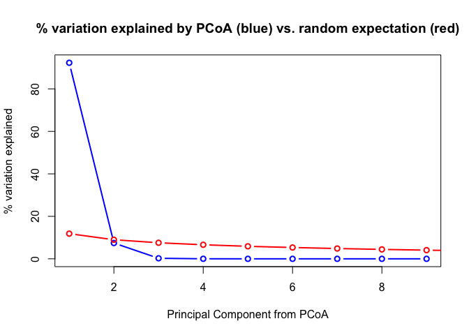<!-- -->

``` r
vec.McapFeatureOverlapsPCoA <- envfit(scores(McapFeatureOverlapsPCoA), McapFeatureOverlapsTrans, perm = 1000) #Extract PCs to calculate PC loadings (variable weights)
vec.McapFeatureOverlapsPCoA #Look at statistical results
```

    ## 
    ## ***VECTORS
    ## 
    ##                       Dim1     Dim2     r2   Pr(>r)    
    ## CDS               -0.99583 -0.09120 1.0000 0.000999 ***
    ## Introns            0.56130 -0.82761 0.9960 0.000999 ***
    ## Upstream.Flanks    0.97006 -0.24287 0.9558 0.000999 ***
    ## Downstream.Flanks  0.62337 -0.78193 0.9904 0.000999 ***
    ## Intergenic         0.22450  0.97448 0.9978 0.000999 ***
    ## ---
    ## Signif. codes:  0 '***' 0.001 '**' 0.01 '*' 0.05 '.' 0.1 ' ' 1
    ## Permutation: free
    ## Number of permutations: 1000

##### Global perMANOVA

``` r
McapFeatureOverlapsTest <- adonis(dissimMcapFeatureOverlapsTrans ~ sampleInformation) #Conduct perMANOVA by method
McapFeatureOverlapsTest #Look at test output.
```

    ## 
    ## Call:
    ## adonis(formula = dissimMcapFeatureOverlapsTrans ~ sampleInformation) 
    ## 
    ## Permutation: free
    ## Number of permutations: 999
    ## 
    ## Terms added sequentially (first to last)
    ## 
    ##                   Df SumsOfSqs  MeanSqs F.Model      R2 Pr(>F)   
    ## sampleInformation  2   0.62002 0.310011  66.997 0.95714  0.004 **
    ## Residuals          6   0.02776 0.004627         0.04286          
    ## Total              8   0.64779                  1.00000          
    ## ---
    ## Signif. codes:  0 '***' 0.001 '**' 0.01 '*' 0.05 '.' 0.1 ' ' 1

##### Beta dispersion model

``` r
disp.McapFeatureOverlapsTrans <- betadisper(dissimMcapFeatureOverlapsTrans, group = sampleInformation, type = 'centroid') #Run a beta dispersion model to assess if significant differences are due to differences in group centroid or variance
anova(disp.McapFeatureOverlapsTrans) #Variance is the same between groups. Significance in perMANOVA due to centroid differences, not variance
```

    ## Analysis of Variance Table
    ## 
    ## Response: Distances
    ##           Df    Sum Sq    Mean Sq F value Pr(>F)  
    ## Groups     2 0.0054665 0.00273326  4.5476 0.0628 .
    ## Residuals  6 0.0036062 0.00060104                 
    ## ---
    ## Signif. codes:  0 '***' 0.001 '**' 0.01 '*' 0.05 '.' 0.1 ' ' 1

##### Create plot

``` r
ordiplot(McapFeatureOverlapsPCoA, choices = c(1,2), type = "text", display = "sites", xlab = "PC 1 (92.3%)", ylab = "PC 2 (7.4%)") #Plot basic PCoA
plot(vec.McapFeatureOverlapsPCoA, p.max = 0.05, col = "blue") #Plot loadings that are significant at the 0.05 level
```

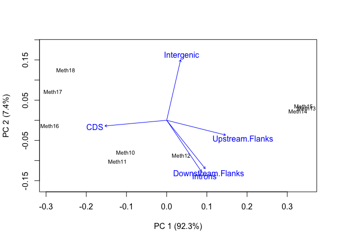<!-- -->

#### Pairwise perMANVOA

##### WGBS vs. RRBS

``` r
McapFeatureOverlapsWGRR <- vegdist(McapFeatureOverlapsTrans[c(1:3, 4:6),], "euclidean") #Subset WGBS and RRBS data and calculate dissimilarity matrix
```

``` r
McapFeatureOverlapsWGRRTest <- adonis(McapFeatureOverlapsWGRR ~ sampleInformation[1:6]) #Conduct pairwise perMANOVA for WGBS and RRBS data. Only use sequencing method metadata for these samples
```

    ## 'nperm' >= set of all permutations: complete enumeration.

    ## Set of permutations < 'minperm'. Generating entire set.

``` r
McapFeatureOverlapsWGRRTest
```

    ## 
    ## Call:
    ## adonis(formula = McapFeatureOverlapsWGRR ~ sampleInformation[1:6]) 
    ## 
    ## Permutation: free
    ## Number of permutations: 719
    ## 
    ## Terms added sequentially (first to last)
    ## 
    ##                        Df SumsOfSqs  MeanSqs F.Model      R2 Pr(>F)
    ## sampleInformation[1:6]  1  0.262904 0.262904  66.606 0.94335    0.1
    ## Residuals               4  0.015788 0.003947         0.05665       
    ## Total                   5  0.278692                  1.00000

##### WGBS vs. MBD-BS

``` r
McapFeatureOverlapsWGMB <- vegdist(McapFeatureOverlapsTrans[c(1:3, 7:9),], "euclidean") #Subset WGBS and MBD-BS data and calculate dissimilarity matrix
```

``` r
McapFeatureOverlapsWGMBTest <- adonis(McapFeatureOverlapsWGMB ~ sampleInformation[c(1:3, 7:9)]) #Conduct pairwise perMANOVA for WGBS and MBD-BS data. Only use sequencing method metadata for these samples
```

    ## 'nperm' >= set of all permutations: complete enumeration.

    ## Set of permutations < 'minperm'. Generating entire set.

``` r
McapFeatureOverlapsWGMBTest
```

    ## 
    ## Call:
    ## adonis(formula = McapFeatureOverlapsWGMB ~ sampleInformation[c(1:3,      7:9)]) 
    ## 
    ## Permutation: free
    ## Number of permutations: 719
    ## 
    ## Terms added sequentially (first to last)
    ## 
    ##                                Df SumsOfSqs  MeanSqs F.Model    R2 Pr(>F)
    ## sampleInformation[c(1:3, 7:9)]  1  0.101687 0.101687  14.868 0.788    0.1
    ## Residuals                       4  0.027358 0.006839         0.212       
    ## Total                           5  0.129044                  1.000

##### RRBS vs. MBD-BS

``` r
McapFeatureOverlapsRRMB <- vegdist(McapFeatureOverlapsTrans[c(4:9),], "euclidean") #Subset RRBS and MBD-BS data and calculate dissimilarity matrix
```

``` r
McapFeatureOverlapsRRMBTest <- adonis(McapFeatureOverlapsRRMB ~ sampleInformation[c(4:9)]) #Conduct pairwise perMANOVA for WGBS and RRBS data. Only use sequencing method metadata for these samples
```

    ## 'nperm' >= set of all permutations: complete enumeration.

    ## Set of permutations < 'minperm'. Generating entire set.

``` r
McapFeatureOverlapsRRMBTest
```

    ## 
    ## Call:
    ## adonis(formula = McapFeatureOverlapsRRMB ~ sampleInformation[c(4:9)]) 
    ## 
    ## Permutation: free
    ## Number of permutations: 719
    ## 
    ## Terms added sequentially (first to last)
    ## 
    ##                           Df SumsOfSqs MeanSqs F.Model      R2 Pr(>F)
    ## sampleInformation[c(4:9)]  1   0.56544 0.56544  182.69 0.97857    0.1
    ## Residuals                  4   0.01238 0.00310         0.02143       
    ## Total                      5   0.57782                 1.00000

### Generalized linear model analysis

Does sequencing method influence the proportion of CpGs detected in
various genome
features?

#### Format data

``` r
McapFeatureOverlapsGLMData <- cbind("seqMethod" = c(rep("A", times = 3), rep("B", times = 3), rep("C", times = 3)),
                                    "replicate" = rep(seq(1:3), times = 3),
                                    data.frame(t(McapFeatureOverlapsPercents[,seq(5, 37, 4)] / 100))) #Create master dataframe for GLM
head(McapFeatureOverlapsGLMData) #Confirm dataframe creation
```

    ##        seqMethod replicate        CDS   Introns Upstream.Flanks
    ## Meth10         A         1 0.12505702 0.3491080      0.06372609
    ## Meth11         A         2 0.12809803 0.3525703      0.06361714
    ## Meth12         A         3 0.10872792 0.3632394      0.06333128
    ## Meth13         B         1 0.07702806 0.3578783      0.06406547
    ## Meth14         B         2 0.07905027 0.3574397      0.06492402
    ## Meth15         B         3 0.07755131 0.3558303      0.06410674
    ##        Downstream.Flanks Intergenic
    ## Meth10        0.05609204  0.4060169
    ## Meth11        0.05647989  0.3992347
    ## Meth12        0.05659598  0.4081054
    ## Meth13        0.05404696  0.4469812
    ## Meth14        0.05409163  0.4444944
    ## Meth15        0.05389547  0.4486162

#### CDS

``` r
McapCDSModel <- glmmTMB(CDS ~ seqMethod + (1|replicate),
                        family = beta_family(link = "logit"),
                        data = McapFeatureOverlapsGLMData) #Run the model using a beta distribution and a logit link. Use replicate as a random effect
summary(McapCDSModel) #Look at model output.
```

    ##  Family: beta  ( logit )
    ## Formula:          CDS ~ seqMethod + (1 | replicate)
    ## Data: McapFeatureOverlapsGLMData
    ## 
    ##      AIC      BIC   logLik deviance df.resid 
    ##    -60.1    -59.1     35.0    -70.1        4 
    ## 
    ## Random effects:
    ## 
    ## Conditional model:
    ##  Groups    Name        Variance Std.Dev.
    ##  replicate (Intercept) 0.001285 0.03585 
    ## Number of obs: 9, groups:  replicate, 3
    ## 
    ## Overdispersion parameter for beta family (): 6.01e+03 
    ## 
    ## Conditional model:
    ##             Estimate Std. Error z value Pr(>|z|)    
    ## (Intercept) -1.98756    0.03084  -64.44  < 2e-16 ***
    ## seqMethodB  -0.48407    0.03600  -13.45  < 2e-16 ***
    ## seqMethodC   0.20065    0.03122    6.43  1.3e-10 ***
    ## ---
    ## Signif. codes:  0 '***' 0.001 '**' 0.01 '*' 0.05 '.' 0.1 ' ' 1

``` r
McapCDSPostHoc <- data.frame(emmeans(McapCDSModel, pairwise ~ seqMethod, adjust = "FDR")$contrasts) #Run pairwise comparisons (estimated marginal means). Obtain log odd ratio results and not confidence intervals for individual methods in a dataframe format. Specify FDR instead of Tukey post-hoc test (default)
head(McapCDSPostHoc) #Look at log odd ratio results
```

    ##   contrast   estimate         SE df    t.ratio      p.value
    ## 1    A - B  0.4840726 0.03600087  4  13.446138 0.0002654640
    ## 2    A - C -0.2006483 0.03121718  4  -6.427495 0.0030127358
    ## 3    B - C -0.6847209 0.03497842  4 -19.575524 0.0001204761

#### Introns

``` r
McapIntronsModel <- glmmTMB(Introns ~ seqMethod + (1|replicate),
                            family = beta_family(link = "logit"),
                            data = McapFeatureOverlapsGLMData) #Run the model using a beta distribution and a logit link. Use replicate as a random effect
summary(McapIntronsModel) #Look at model output.
```

    ##  Family: beta  ( logit )
    ## Formula:          Introns ~ seqMethod + (1 | replicate)
    ## Data: McapFeatureOverlapsGLMData
    ## 
    ##      AIC      BIC   logLik deviance df.resid 
    ##    -54.3    -53.3     32.1    -64.3        4 
    ## 
    ## Random effects:
    ## 
    ## Conditional model:
    ##  Groups    Name        Variance  Std.Dev. 
    ##  replicate (Intercept) 9.534e-13 9.764e-07
    ## Number of obs: 9, groups:  replicate, 3
    ## 
    ## Overdispersion parameter for beta family (): 4.8e+03 
    ## 
    ## Conditional model:
    ##              Estimate Std. Error z value Pr(>|z|)    
    ## (Intercept) -0.597220   0.017413  -34.30   <2e-16 ***
    ## seqMethodB   0.009153   0.024609    0.37     0.71    
    ## seqMethodC  -0.241332   0.025152   -9.60   <2e-16 ***
    ## ---
    ## Signif. codes:  0 '***' 0.001 '**' 0.01 '*' 0.05 '.' 0.1 ' ' 1

``` r
McapIntronsPostHoc <- data.frame(emmeans(McapIntronsModel, pairwise ~ seqMethod, adjust = "FDR")$contrasts) #Run pairwise comparisons (estimated marginal means). Obtain log odd ratio results and not confidence intervals for individual methods in a dataframe format. Specify FDR instead of Tukey post-hoc test (default)
head(McapIntronsPostHoc) #Look at log odd ratio results
```

    ##   contrast     estimate         SE df    t.ratio      p.value
    ## 1    A - B -0.009153366 0.02460865  4 -0.3719573 0.7287912390
    ## 2    A - C  0.241332148 0.02515172  4  9.5950548 0.0009891018
    ## 3    B - C  0.250485514 0.02513586  4  9.9652651 0.0009891018

#### Upstream Flanks

``` r
McapUpstreamFlanksModel <- glmmTMB(Upstream.Flanks ~ seqMethod + (1|replicate),
                                   family = beta_family(link = "logit"),
                                   data = McapFeatureOverlapsGLMData) #Run the model using a beta distribution and a logit link. Use replicate as a random effect
summary(McapUpstreamFlanksModel) #Look at model output
```

    ##  Family: beta  ( logit )
    ## Formula:          Upstream.Flanks ~ seqMethod + (1 | replicate)
    ## Data: McapFeatureOverlapsGLMData
    ## 
    ##      AIC      BIC   logLik deviance df.resid 
    ##    -86.6    -85.6     48.3    -96.6        4 
    ## 
    ## Random effects:
    ## 
    ## Conditional model:
    ##  Groups    Name        Variance  Std.Dev. 
    ##  replicate (Intercept) 2.831e-12 1.683e-06
    ## Number of obs: 9, groups:  replicate, 3
    ## 
    ## Overdispersion parameter for beta family (): 4.62e+04 
    ## 
    ## Conditional model:
    ##             Estimate Std. Error z value Pr(>|z|)    
    ## (Intercept) -2.68998    0.01101 -244.28  < 2e-16 ***
    ## seqMethodB   0.01347    0.01553    0.87  0.38582    
    ## seqMethodC  -0.04314    0.01572   -2.74  0.00607 ** 
    ## ---
    ## Signif. codes:  0 '***' 0.001 '**' 0.01 '*' 0.05 '.' 0.1 ' ' 1

``` r
McapUpstreamFlanksPostHoc <- data.frame(emmeans(McapUpstreamFlanksModel, pairwise ~ seqMethod, adjust = "FDR")$contrasts) #Run pairwise comparisons (estimated marginal means). Obtain log odd ratio results and not confidence intervals for individual methods in a dataframe format. Specify FDR instead of Tukey post-hoc test (default)
head(McapUpstreamFlanksPostHoc) #Look at log odd ratio results
```

    ##   contrast    estimate         SE df    t.ratio    p.value
    ## 1    A - B -0.01346575 0.01552744  4 -0.8672224 0.43474706
    ## 2    A - C  0.04314086 0.01572205  4  2.7439712 0.07754079
    ## 3    B - C  0.05660661 0.01567698  4  3.6108114 0.06762104

#### Downstream Flanks

``` r
McapDownstreamFlanksModel <- glmmTMB(Downstream.Flanks ~ seqMethod + (1|replicate),
                                     family = beta_family(link = "logit"),
                                     data = McapFeatureOverlapsGLMData) #Run the model using a beta distribution and a logit link. Use replicate as a random effect
summary(McapDownstreamFlanksModel) #Look at model output
```

    ##  Family: beta  ( logit )
    ## Formula:          Downstream.Flanks ~ seqMethod + (1 | replicate)
    ## Data: McapFeatureOverlapsGLMData
    ## 
    ##      AIC      BIC   logLik deviance df.resid 
    ##    -95.3    -94.3     52.6   -105.3        4 
    ## 
    ## Random effects:
    ## 
    ## Conditional model:
    ##  Groups    Name        Variance  Std.Dev. 
    ##  replicate (Intercept) 7.558e-13 8.694e-07
    ## Number of obs: 9, groups:  replicate, 3
    ## 
    ## Overdispersion parameter for beta family (): 1.06e+05 
    ## 
    ## Conditional model:
    ##              Estimate Std. Error z value Pr(>|z|)    
    ## (Intercept) -2.817363   0.007682  -366.7  < 2e-16 ***
    ## seqMethodB  -0.045592   0.010976    -4.2 3.27e-05 ***
    ## seqMethodC  -0.048863   0.010984    -4.4 8.65e-06 ***
    ## ---
    ## Signif. codes:  0 '***' 0.001 '**' 0.01 '*' 0.05 '.' 0.1 ' ' 1

``` r
McapDownstreamFlanksPostHoc <- data.frame(emmeans(McapDownstreamFlanksModel, pairwise ~ seqMethod, adjust = "FDR")$contrasts) #Run pairwise comparisons (estimated marginal means). Obtain log odd ratio results and not confidence intervals for individual methods in a dataframe format. Specify FDR instead of Tukey post-hoc test (default)
head(McapDownstreamFlanksPostHoc) #Look at log odd ratio results
```

    ##   contrast    estimate         SE df   t.ratio    p.value
    ## 1    A - B 0.045592291 0.01097579  4 4.1538942 0.02132299
    ## 2    A - C 0.048862585 0.01098397  4 4.4485355 0.02132299
    ## 3    B - C 0.003270294 0.01109460  4 0.2947645 0.78283914

#### Intergenic regions

``` r
McapIntergenicModel <- glmmTMB(Intergenic ~ seqMethod + (1|replicate),
                               family = beta_family(link = "logit"),
                               data = McapFeatureOverlapsGLMData) #Run the model using a beta distribution and a logit link. Use replicate as a random effect
summary(McapIntergenicModel) #Look at model output
```

    ##  Family: beta  ( logit )
    ## Formula:          Intergenic ~ seqMethod + (1 | replicate)
    ## Data: McapFeatureOverlapsGLMData
    ## 
    ##      AIC      BIC   logLik deviance df.resid 
    ##    -46.9    -46.0     28.5    -56.9        4 
    ## 
    ## Random effects:
    ## 
    ## Conditional model:
    ##  Groups    Name        Variance  Std.Dev.
    ##  replicate (Intercept) 0.0001266 0.01125 
    ## Number of obs: 9, groups:  replicate, 3
    ## 
    ## Overdispersion parameter for beta family (): 2.51e+03 
    ## 
    ## Conditional model:
    ##             Estimate Std. Error z value Pr(>|z|)    
    ## (Intercept) -0.38683    0.02437 -15.876  < 2e-16 ***
    ## seqMethodB   0.17288    0.03300   5.239 1.62e-07 ***
    ## seqMethodC   0.14431    0.03303   4.370 1.24e-05 ***
    ## ---
    ## Signif. codes:  0 '***' 0.001 '**' 0.01 '*' 0.05 '.' 0.1 ' ' 1

``` r
McapIntergenicPostHoc <- data.frame(emmeans(McapIntergenicModel, pairwise ~ seqMethod, adjust = "FDR")$contrasts) #Run pairwise comparisons (estimated marginal means). Obtain log odd ratio results and not confidence intervals for individual methods in a dataframe format. Specify FDR instead of Tukey post-hoc test (default)
head(McapIntergenicPostHoc) #Look at log odd ratio results
```

    ##   contrast    estimate         SE df    t.ratio    p.value
    ## 1    A - B -0.17287971 0.03299960  4 -5.2388432 0.01795698
    ## 2    A - C -0.14430970 0.03302543  4 -4.3696535 0.01795698
    ## 3    B - C  0.02857001 0.03281234  4  0.8707092 0.43304983

#### Save statistical output

``` r
McapCpGFeatureOverlapStatOutput <- rbind(McapCDSPostHoc,
                                         McapIntronsPostHoc,
                                         McapUpstreamFlanksPostHoc,
                                         McapDownstreamFlanksPostHoc,
                                         McapIntergenicPostHoc) #Create a dataframe with logs odd ratio output for each model
McapCpGFeatureOverlapStatOutput$model <- c(rep("CDS", times = 3),
                                           rep("Introns", times = 3),
                                           rep("UpstreamFlanks", times = 3),
                                           rep("DownstreamFlanks", times = 3),
                                           rep("Intergenic", times = 3)) #Add model information
head(McapCpGFeatureOverlapStatOutput) #Confirm dataframe creation
```

    ##   contrast     estimate         SE df     t.ratio      p.value   model
    ## 1    A - B  0.484072650 0.03600087  4  13.4461382 0.0002654640     CDS
    ## 2    A - C -0.200648271 0.03121718  4  -6.4274948 0.0030127358     CDS
    ## 3    B - C -0.684720921 0.03497842  4 -19.5755243 0.0001204761     CDS
    ## 4    A - B -0.009153366 0.02460865  4  -0.3719573 0.7287912390 Introns
    ## 5    A - C  0.241332148 0.02515172  4   9.5950548 0.0009891018 Introns
    ## 6    B - C  0.250485514 0.02513586  4   9.9652651 0.0009891018 Introns

``` r
write.table(McapCpGFeatureOverlapStatOutput, "../analyses/Characterizing-CpG-Methylation-5x/Mcap/Mcap-CpG-Overlap-StatResults.txt", quote = FALSE, row.names = FALSE) #Save table
```

## Pact

### Import file counts

``` r
PactGenomeFeatures <- read.table("../analyses/Characterizing-CpG-Methylation-5x/Pact/Pact-CGMotif-Overlaps-counts.txt", header = FALSE, col.names = c("counts", "filename")) #Import file with CG motif and feature track overlaps
PactGenomeFeatures <- PactGenomeFeatures[-8,] #Remove final row
tail(PactGenomeFeatures) #Check import
```

    ##    counts                                    filename
    ## 2  948914 Pact-CGMotif-Flanks-Downstream-Overlaps.txt
    ## 3 1732726            Pact-CGMotif-Flanks-Overlaps.txt
    ## 4 1047316   Pact-CGMotif-Flanks-Upstream-Overlaps.txt
    ## 5 3434720              Pact-CGMotif-Gene-Overlaps.txt
    ## 6 3989278        Pact-CGMotif-Intergenic-Overlaps.txt
    ## 7 1999490            Pact-CGMotif-Intron-Overlaps.txt

``` r
PactGeneOverlaps <- read.table("../analyses/Characterizing-CpG-Methylation-5x/Pact/Pact-5x-paGenes-counts.txt", header = FALSE, col.names = c("counts", "filename")) #Import file with all file-gene overlaps
PactGeneOverlaps <- PactGeneOverlaps[-37,] #Remove final row
tail(PactGeneOverlaps) #Confirm import
```

    ##     counts
    ## 31  106046
    ## 32  219883
    ## 33  125421
    ## 34  138915
    ## 35 1016418
    ## 36 1280754
    ##                                                                 filename
    ## 31     Meth8_R1_001_val_1_bismark_bt2_pe._5x.bedgraph-unMeth.bed-paGenes
    ## 32            Meth8_R1_001_val_1_bismark_bt2_pe._5x.bedgraph.bed-paGenes
    ## 33       Meth9_R1_001_val_1_bismark_bt2_pe._5x.bedgraph-Meth.bed-paGenes
    ## 34 Meth9_R1_001_val_1_bismark_bt2_pe._5x.bedgraph-sparseMeth.bed-paGenes
    ## 35     Meth9_R1_001_val_1_bismark_bt2_pe._5x.bedgraph-unMeth.bed-paGenes
    ## 36            Meth9_R1_001_val_1_bismark_bt2_pe._5x.bedgraph.bed-paGenes

``` r
PactCDSOverlaps <- read.table("../analyses/Characterizing-CpG-Methylation-5x/Pact/Pact-5x-paCDS-counts.txt", header = FALSE, col.names = c("counts", "filename")) #Import file with all file-CDS overlaps
PactCDSOverlaps <- PactCDSOverlaps[-37,] #Remove final row
tail(PactCDSOverlaps) #Confirm import
```

    ##    counts                                                            filename
    ## 31  72799     Meth8_R1_001_val_1_bismark_bt2_pe._5x.bedgraph-unMeth.bed-paCDS
    ## 32 146814            Meth8_R1_001_val_1_bismark_bt2_pe._5x.bedgraph.bed-paCDS
    ## 33  73677       Meth9_R1_001_val_1_bismark_bt2_pe._5x.bedgraph-Meth.bed-paCDS
    ## 34  77848 Meth9_R1_001_val_1_bismark_bt2_pe._5x.bedgraph-sparseMeth.bed-paCDS
    ## 35 560861     Meth9_R1_001_val_1_bismark_bt2_pe._5x.bedgraph-unMeth.bed-paCDS
    ## 36 712386            Meth9_R1_001_val_1_bismark_bt2_pe._5x.bedgraph.bed-paCDS

``` r
PactIntronsOverlaps <- read.table("../analyses/Characterizing-CpG-Methylation-5x/Pact/Pact-5x-paIntron-counts.txt", header = FALSE, col.names = c("counts", "filename")) #Import file with all file-Introns overlaps
PactIntronsOverlaps <- PactIntronsOverlaps[-37,] #Remove final row
tail(PactIntronsOverlaps) #Confirm import
```

    ##    counts
    ## 31  33695
    ## 32  74499
    ## 33  52983
    ## 34  61846
    ## 35 460776
    ## 36 575605
    ##                                                                  filename
    ## 31     Meth8_R1_001_val_1_bismark_bt2_pe._5x.bedgraph-unMeth.bed-paIntron
    ## 32            Meth8_R1_001_val_1_bismark_bt2_pe._5x.bedgraph.bed-paIntron
    ## 33       Meth9_R1_001_val_1_bismark_bt2_pe._5x.bedgraph-Meth.bed-paIntron
    ## 34 Meth9_R1_001_val_1_bismark_bt2_pe._5x.bedgraph-sparseMeth.bed-paIntron
    ## 35     Meth9_R1_001_val_1_bismark_bt2_pe._5x.bedgraph-unMeth.bed-paIntron
    ## 36            Meth9_R1_001_val_1_bismark_bt2_pe._5x.bedgraph.bed-paIntron

``` r
PactFlanksOverlaps <- read.table("../analyses/Characterizing-CpG-Methylation-5x/Pact/Pact-5x-paFlanks-counts.txt", header = FALSE, col.names = c("counts", "filename")) #Import file with all file-flanks overlaps
PactFlanksOverlaps <- PactFlanksOverlaps[-37,] #Remove final row
tail(PactFlanksOverlaps) #Confirm import
```

    ##    counts
    ## 31  34885
    ## 32  80102
    ## 33  42444
    ## 34  58605
    ## 35 395780
    ## 36 496829
    ##                                                                  filename
    ## 31     Meth8_R1_001_val_1_bismark_bt2_pe._5x.bedgraph-unMeth.bed-paFlanks
    ## 32            Meth8_R1_001_val_1_bismark_bt2_pe._5x.bedgraph.bed-paFlanks
    ## 33       Meth9_R1_001_val_1_bismark_bt2_pe._5x.bedgraph-Meth.bed-paFlanks
    ## 34 Meth9_R1_001_val_1_bismark_bt2_pe._5x.bedgraph-sparseMeth.bed-paFlanks
    ## 35     Meth9_R1_001_val_1_bismark_bt2_pe._5x.bedgraph-unMeth.bed-paFlanks
    ## 36            Meth9_R1_001_val_1_bismark_bt2_pe._5x.bedgraph.bed-paFlanks

``` r
PactFlanksUpstreamOverlaps <- read.table("../analyses/Characterizing-CpG-Methylation-5x/Pact/Pact-5x-paFlanksUpstream-counts.txt", header = FALSE, col.names = c("counts", "filename")) #Import file with all file-upstream flanks overlaps
PactFlanksUpstreamOverlaps <- PactFlanksUpstreamOverlaps[-37,] #Remove final row
tail(PactFlanksUpstreamOverlaps) #Confirm import
```

    ##    counts
    ## 31  22550
    ## 32  50721
    ## 33  25567
    ## 34  36479
    ## 35 252766
    ## 36 314812
    ##                                                                          filename
    ## 31     Meth8_R1_001_val_1_bismark_bt2_pe._5x.bedgraph-unMeth.bed-paFlanksUpstream
    ## 32            Meth8_R1_001_val_1_bismark_bt2_pe._5x.bedgraph.bed-paFlanksUpstream
    ## 33       Meth9_R1_001_val_1_bismark_bt2_pe._5x.bedgraph-Meth.bed-paFlanksUpstream
    ## 34 Meth9_R1_001_val_1_bismark_bt2_pe._5x.bedgraph-sparseMeth.bed-paFlanksUpstream
    ## 35     Meth9_R1_001_val_1_bismark_bt2_pe._5x.bedgraph-unMeth.bed-paFlanksUpstream
    ## 36            Meth9_R1_001_val_1_bismark_bt2_pe._5x.bedgraph.bed-paFlanksUpstream

``` r
PactFlanksDownstreamOverlaps <- read.table("../analyses/Characterizing-CpG-Methylation-5x/Pact/Pact-5x-paFlanksDownstream-counts.txt", header = FALSE, col.names = c("counts", "filename")) #Import file with all file-downstream flanks overlaps
PactFlanksDownstreamOverlaps <- PactFlanksDownstreamOverlaps[-37,] #Remove final row
tail(PactFlanksDownstreamOverlaps) #Confirm import
```

    ##    counts
    ## 31  19030
    ## 32  48878
    ## 33  28375
    ## 34  34209
    ## 35 204309
    ## 36 266893
    ##                                                                            filename
    ## 31     Meth8_R1_001_val_1_bismark_bt2_pe._5x.bedgraph-unMeth.bed-paFlanksDownstream
    ## 32            Meth8_R1_001_val_1_bismark_bt2_pe._5x.bedgraph.bed-paFlanksDownstream
    ## 33       Meth9_R1_001_val_1_bismark_bt2_pe._5x.bedgraph-Meth.bed-paFlanksDownstream
    ## 34 Meth9_R1_001_val_1_bismark_bt2_pe._5x.bedgraph-sparseMeth.bed-paFlanksDownstream
    ## 35     Meth9_R1_001_val_1_bismark_bt2_pe._5x.bedgraph-unMeth.bed-paFlanksDownstream
    ## 36            Meth9_R1_001_val_1_bismark_bt2_pe._5x.bedgraph.bed-paFlanksDownstream

``` r
PactIntergenicOverlaps <- read.table("../analyses/Characterizing-CpG-Methylation-5x/Pact/Pact-5x-paIntergenic-counts.txt", header = FALSE, col.names = c("counts", "filename")) #Import file with all file-Intergenic overlaps
PactIntergenicOverlaps <- PactIntergenicOverlaps[-37,] #Remove final row
tail(PactIntergenicOverlaps) #Confirm import
```

    ##    counts
    ## 31 104665
    ## 32 239055
    ## 33  87520
    ## 34 140365
    ## 35 727400
    ## 36 955285
    ##                                                                      filename
    ## 31     Meth8_R1_001_val_1_bismark_bt2_pe._5x.bedgraph-unMeth.bed-paIntergenic
    ## 32            Meth8_R1_001_val_1_bismark_bt2_pe._5x.bedgraph.bed-paIntergenic
    ## 33       Meth9_R1_001_val_1_bismark_bt2_pe._5x.bedgraph-Meth.bed-paIntergenic
    ## 34 Meth9_R1_001_val_1_bismark_bt2_pe._5x.bedgraph-sparseMeth.bed-paIntergenic
    ## 35     Meth9_R1_001_val_1_bismark_bt2_pe._5x.bedgraph-unMeth.bed-paIntergenic
    ## 36            Meth9_R1_001_val_1_bismark_bt2_pe._5x.bedgraph.bed-paIntergenic

### Create summary table

``` r
PactFeatureOverlaps <- data.frame("allCpGs" = rep(0, times = 7),
                                  "Meth1Meth" = rep(0, times = 7),
                                  "Meth1sparseMeth" = rep(0, times = 7),
                                  "Meth1unMeth" = rep(0, times = 7),
                                  "Meth1" = rep(0, times = 7),
                                  "Meth2Meth" = rep(0, times = 7),
                                  "Meth2sparseMeth" = rep(0, times = 7),
                                  "Meth2unMeth" = rep(0, times = 7),
                                  "Meth2" = rep(0, times = 7),
                                  "Meth3Meth" = rep(0, times = 7),
                                  "Meth3sparseMeth" = rep(0, times = 7),
                                  "Meth3unMeth" = rep(0, times = 7),
                                  "Meth3" = rep(0, times = 7),
                                  "Meth4Meth" = rep(0, times = 7),
                                  "Meth4sparseMeth" = rep(0, times = 7),
                                  "Meth4unMeth" = rep(0, times = 7),
                                  "Meth4" = rep(0, times = 7),
                                  "Meth5Meth" = rep(0, times = 7),
                                  "Meth5sparseMeth" = rep(0, times = 7),
                                  "Meth5unMeth" = rep(0, times = 7),
                                  "Meth5" = rep(0, times = 7),
                                  "Meth6Meth" = rep(0, times = 7),
                                  "Meth6sparseMeth" = rep(0, times = 7),
                                  "Meth6unMeth" = rep(0, times = 7),
                                  "Meth6" = rep(0, times = 7),
                                  "Meth7Meth" = rep(0, times = 7),
                                  "Meth7sparseMeth" = rep(0, times = 7),
                                  "Meth7unMeth" = rep(0, times = 7),
                                  "Meth7" = rep(0, times = 7),
                                  "Meth8Meth" = rep(0, times = 7),
                                  "Meth8sparseMeth" = rep(0, times = 7),
                                  "Meth8unMeth" = rep(0, times = 7),
                                  "Meth8" = rep(0, times = 7),
                                  "Meth9Meth" = rep(0, times = 7),
                                  "Meth9sparseMeth" = rep(0, times = 7),
                                  "Meth9unMeth" = rep(0, times = 7),
                                  "Meth9" = rep(0, times = 7)) #Create blank dataframe with information for various CpG categories and methylation status. Match columns to the order of columns in the overlap count files
row.names(PactFeatureOverlaps) <- c("Genes", "CDS", "Introns", "Flanking Regions", "Upstream Flanks", "Downstream Flanks", "Intergenic") #Assign row names
head(PactFeatureOverlaps) #Confirm changes
```

    ##                   allCpGs Meth1Meth Meth1sparseMeth Meth1unMeth Meth1 Meth2Meth
    ## Genes                   0         0               0           0     0         0
    ## CDS                     0         0               0           0     0         0
    ## Introns                 0         0               0           0     0         0
    ## Flanking Regions        0         0               0           0     0         0
    ## Upstream Flanks         0         0               0           0     0         0
    ## Downstream Flanks       0         0               0           0     0         0
    ##                   Meth2sparseMeth Meth2unMeth Meth2 Meth3Meth Meth3sparseMeth
    ## Genes                           0           0     0         0               0
    ## CDS                             0           0     0         0               0
    ## Introns                         0           0     0         0               0
    ## Flanking Regions                0           0     0         0               0
    ## Upstream Flanks                 0           0     0         0               0
    ## Downstream Flanks               0           0     0         0               0
    ##                   Meth3unMeth Meth3 Meth4Meth Meth4sparseMeth Meth4unMeth Meth4
    ## Genes                       0     0         0               0           0     0
    ## CDS                         0     0         0               0           0     0
    ## Introns                     0     0         0               0           0     0
    ## Flanking Regions            0     0         0               0           0     0
    ## Upstream Flanks             0     0         0               0           0     0
    ## Downstream Flanks           0     0         0               0           0     0
    ##                   Meth5Meth Meth5sparseMeth Meth5unMeth Meth5 Meth6Meth
    ## Genes                     0               0           0     0         0
    ## CDS                       0               0           0     0         0
    ## Introns                   0               0           0     0         0
    ## Flanking Regions          0               0           0     0         0
    ## Upstream Flanks           0               0           0     0         0
    ## Downstream Flanks         0               0           0     0         0
    ##                   Meth6sparseMeth Meth6unMeth Meth6 Meth7Meth Meth7sparseMeth
    ## Genes                           0           0     0         0               0
    ## CDS                             0           0     0         0               0
    ## Introns                         0           0     0         0               0
    ## Flanking Regions                0           0     0         0               0
    ## Upstream Flanks                 0           0     0         0               0
    ## Downstream Flanks               0           0     0         0               0
    ##                   Meth7unMeth Meth7 Meth8Meth Meth8sparseMeth Meth8unMeth Meth8
    ## Genes                       0     0         0               0           0     0
    ## CDS                         0     0         0               0           0     0
    ## Introns                     0     0         0               0           0     0
    ## Flanking Regions            0     0         0               0           0     0
    ## Upstream Flanks             0     0         0               0           0     0
    ## Downstream Flanks           0     0         0               0           0     0
    ##                   Meth9Meth Meth9sparseMeth Meth9unMeth Meth9
    ## Genes                     0               0           0     0
    ## CDS                       0               0           0     0
    ## Introns                   0               0           0     0
    ## Flanking Regions          0               0           0     0
    ## Upstream Flanks           0               0           0     0
    ## Downstream Flanks         0               0           0     0

``` r
PactFeatureOverlaps$allCpGs <- c(PactGenomeFeatures$counts[5],
                                 PactGenomeFeatures$counts[1],
                                 PactGenomeFeatures$counts[7],
                                 PactGenomeFeatures$counts[3],
                                 PactGenomeFeatures$counts[4],
                                 PactGenomeFeatures$counts[2],
                                 PactGenomeFeatures$counts[6]) #Assign information for CG motif overlaps with genome features.
head(PactFeatureOverlaps) #Confirm modification
```

    ##                   allCpGs Meth1Meth Meth1sparseMeth Meth1unMeth Meth1 Meth2Meth
    ## Genes             3434720         0               0           0     0         0
    ## CDS               1455630         0               0           0     0         0
    ## Introns           1999490         0               0           0     0         0
    ## Flanking Regions  1732726         0               0           0     0         0
    ## Upstream Flanks   1047316         0               0           0     0         0
    ## Downstream Flanks  948914         0               0           0     0         0
    ##                   Meth2sparseMeth Meth2unMeth Meth2 Meth3Meth Meth3sparseMeth
    ## Genes                           0           0     0         0               0
    ## CDS                             0           0     0         0               0
    ## Introns                         0           0     0         0               0
    ## Flanking Regions                0           0     0         0               0
    ## Upstream Flanks                 0           0     0         0               0
    ## Downstream Flanks               0           0     0         0               0
    ##                   Meth3unMeth Meth3 Meth4Meth Meth4sparseMeth Meth4unMeth Meth4
    ## Genes                       0     0         0               0           0     0
    ## CDS                         0     0         0               0           0     0
    ## Introns                     0     0         0               0           0     0
    ## Flanking Regions            0     0         0               0           0     0
    ## Upstream Flanks             0     0         0               0           0     0
    ## Downstream Flanks           0     0         0               0           0     0
    ##                   Meth5Meth Meth5sparseMeth Meth5unMeth Meth5 Meth6Meth
    ## Genes                     0               0           0     0         0
    ## CDS                       0               0           0     0         0
    ## Introns                   0               0           0     0         0
    ## Flanking Regions          0               0           0     0         0
    ## Upstream Flanks           0               0           0     0         0
    ## Downstream Flanks         0               0           0     0         0
    ##                   Meth6sparseMeth Meth6unMeth Meth6 Meth7Meth Meth7sparseMeth
    ## Genes                           0           0     0         0               0
    ## CDS                             0           0     0         0               0
    ## Introns                         0           0     0         0               0
    ## Flanking Regions                0           0     0         0               0
    ## Upstream Flanks                 0           0     0         0               0
    ## Downstream Flanks               0           0     0         0               0
    ##                   Meth7unMeth Meth7 Meth8Meth Meth8sparseMeth Meth8unMeth Meth8
    ## Genes                       0     0         0               0           0     0
    ## CDS                         0     0         0               0           0     0
    ## Introns                     0     0         0               0           0     0
    ## Flanking Regions            0     0         0               0           0     0
    ## Upstream Flanks             0     0         0               0           0     0
    ## Downstream Flanks           0     0         0               0           0     0
    ##                   Meth9Meth Meth9sparseMeth Meth9unMeth Meth9
    ## Genes                     0               0           0     0
    ## CDS                       0               0           0     0
    ## Introns                   0               0           0     0
    ## Flanking Regions          0               0           0     0
    ## Upstream Flanks           0               0           0     0
    ## Downstream Flanks         0               0           0     0

``` r
for (i in 1:length(PactGeneOverlaps$counts)) {
  PactFeatureOverlaps[1,i+1] <- PactGeneOverlaps[i,1]
  PactFeatureOverlaps[2,i+1] <- PactCDSOverlaps[i,1]
  PactFeatureOverlaps[3,i+1] <- PactIntronsOverlaps[i,1]
  PactFeatureOverlaps[4,i+1] <- PactFlanksOverlaps[i,1]
  PactFeatureOverlaps[5,i+1] <- PactFlanksUpstreamOverlaps[i,1]
  PactFeatureOverlaps[6,i+1] <- PactFlanksDownstreamOverlaps[i,1]
  PactFeatureOverlaps[7,i+1] <- PactIntergenicOverlaps[i,1]
} #For each table with feature overlap information, paste the contents of the count column in the assigned row
tail(PactFeatureOverlaps) #Check summary table
```

    ##                   allCpGs Meth1Meth Meth1sparseMeth Meth1unMeth   Meth1
    ## CDS               1455630     44391           69732     1033482 1147605
    ## Introns           1999490     30313           88506     1212927 1331746
    ## Flanking Regions  1732726     19148           73346     1018940 1111434
    ## Upstream Flanks   1047316     11410           44616      630420  686446
    ## Downstream Flanks  948914     13174           41423      538748  593345
    ## Intergenic        3989278     17320          136484     1816318 1970122
    ##                   Meth2Meth Meth2sparseMeth Meth2unMeth   Meth2 Meth3Meth
    ## CDS                   49447           59475     1136063 1244985     48847
    ## Introns               37312           85627     1407919 1530858     34362
    ## Flanking Regions      22078           69879     1189855 1281812     21825
    ## Upstream Flanks       12966           41745      733370  788081     12973
    ## Downstream Flanks     15359           40530      630948  686837     14934
    ## Intergenic            18574          131867     2167398 2317839     20691
    ##                   Meth3sparseMeth Meth3unMeth   Meth3 Meth4Meth Meth4sparseMeth
    ## CDS                         69708     1073682 1192237      7459           28514
    ## Introns                     92942     1281701 1409005      6201           28028
    ## Flanking Regions            76679     1078982 1177486      5512           25985
    ## Upstream Flanks             46285      667296  726554      3304           16119
    ## Downstream Flanks           43793      569790  628517      3253           13907
    ## Intergenic                 147023     1935891 2103605     11969           55500
    ##                   Meth4unMeth  Meth4 Meth5Meth Meth5sparseMeth Meth5unMeth
    ## CDS                    351237 387210      6762           13559      287611
    ## Introns                358170 392399      6083           12520      283366
    ## Flanking Regions       332396 363893      5537           12401      271274
    ## Upstream Flanks        213411 232834      3496            7859      175577
    ## Downstream Flanks      169277 186437      3061            6540      138077
    ## Intergenic             628931 696400     12047           26504      516926
    ##                    Meth5 Meth6Meth Meth6sparseMeth Meth6unMeth  Meth6 Meth7Meth
    ## CDS               307932      6215           18448      297495 322158     71918
    ## Introns           301969      5235           17325      297640 320200     47394
    ## Flanking Regions  289212      4609           16818      279752 301179     41653
    ## Upstream Flanks   186932      2876           10651      180292 193819     25318
    ## Downstream Flanks 147678      2660            8817      142856 154333     27785
    ## Intergenic        555477     10629           36825      529826 577280     98419
    ##                   Meth7sparseMeth Meth7unMeth  Meth7 Meth8Meth Meth8sparseMeth
    ## CDS                         69371      577821 719110     55825           18190
    ## Introns                     51739      441740 540873     30922            9882
    ## Flanking Regions            50998      375763 468414     32905           12312
    ## Upstream Flanks             32050      240520 297888     20249            7922
    ## Downstream Flanks           29904      193571 251260     22171            7677
    ## Intergenic                 124696      696362 919477     94478           39912
    ##                   Meth8unMeth  Meth8 Meth9Meth Meth9sparseMeth Meth9unMeth
    ## CDS                     72799 146814     73677           77848      560861
    ## Introns                 33695  74499     52983           61846      460776
    ## Flanking Regions        34885  80102     42444           58605      395780
    ## Upstream Flanks         22550  50721     25567           36479      252766
    ## Downstream Flanks       19030  48878     28375           34209      204309
    ## Intergenic             104665 239055     87520          140365      727400
    ##                    Meth9
    ## CDS               712386
    ## Introns           575605
    ## Flanking Regions  496829
    ## Upstream Flanks   314812
    ## Downstream Flanks 266893
    ## Intergenic        955285

``` r
write.table(PactFeatureOverlaps, "../analyses/Characterizing-CpG-Methylation-5x/Pact/Pact_union-Genomic-Location-Counts.txt", sep = "\t", quote = FALSE, row.names = TRUE) #Save file
```

``` r
PactFeatureOverlapsPercents <- PactFeatureOverlaps[-c(1,4),] #Duplicate dataframe but remove gene and total flank rows
for (i in 1:length(PactFeatureOverlaps)) {
  PactFeatureOverlapsPercents[,i] <- (PactFeatureOverlapsPercents[,i] / (sum(PactFeatureOverlapsPercents[,i]))) * 100
} #Divide every entry by sum of the column and multiply by 100 to get percentages. Do not include gene information
head(PactFeatureOverlapsPercents) #Check calculations
```

    ##                    allCpGs Meth1Meth Meth1sparseMeth Meth1unMeth    Meth1
    ## CDS               15.41878  38.06857        18.31385    19.75349 20.03058
    ## Introns           21.17963  25.99564        23.24450    23.18332 23.24463
    ## Upstream Flanks   11.09371   9.78492        11.71759    12.04955 11.98140
    ## Downstream Flanks 10.05139  11.29768        10.87900    10.29738 10.35639
    ## Intergenic        42.25649  14.85318        35.84506    34.71625 34.38700
    ##                   Meth2Meth Meth2sparseMeth Meth2unMeth    Meth2 Meth3Meth
    ## CDS               36.995167        16.55560    18.69848 18.95358 37.059488
    ## Introns           27.916024        23.83533    23.17296 23.30570 26.069936
    ## Upstream Flanks    9.700878        11.62024    12.07055 11.99770  9.842421
    ## Downstream Flanks 11.491269        11.28203    10.38478 10.45637 11.330202
    ## Intergenic        13.896662        36.70681    35.67323 35.28665 15.697952
    ##                   Meth3sparseMeth Meth3unMeth    Meth3 Meth4Meth
    ## CDS                      17.43786    19.42135 19.67414  23.17467
    ## Introns                  23.24997    23.18411 23.25122  19.26614
    ## Upstream Flanks          11.57846    12.07042 11.98950  10.26533
    ## Downstream Flanks        10.95507    10.30667 10.37171  10.10688
    ## Intergenic               36.77864    35.01746 34.71342  37.18698
    ##                   Meth4sparseMeth Meth4unMeth     Meth4 Meth5Meth
    ## CDS                     20.070670   20.408582 20.430227 21.501479
    ## Introns                 19.728581   20.811423 20.704012 19.342427
    ## Upstream Flanks         11.345975   12.400219 12.284939 11.116411
    ## Downstream Flanks        9.788974    9.835819  9.836911  9.733219
    ## Intergenic              39.065799   36.543957 36.743911 38.306464
    ##                   Meth5sparseMeth Meth5unMeth     Meth5 Meth6Meth
    ## CDS                     20.242752   20.520821 20.528964 22.505884
    ## Introns                 18.691589   20.217943 20.131428 18.957089
    ## Upstream Flanks         11.733003   12.527282 12.462233 10.414630
    ## Downstream Flanks        9.763817    9.851686  9.845279  9.632446
    ## Intergenic              39.568839   36.882267 37.032096 38.489951
    ##                   Meth6sparseMeth Meth6unMeth     Meth6 Meth7Meth
    ## CDS                     20.037799   20.543688 20.548543 26.554273
    ## Introns                 18.818022   20.553701 20.423654 17.499280
    ## Upstream Flanks         11.568875   12.450168 12.362561  9.348162
    ## Downstream Flanks        9.576825    9.865003  9.843984 10.259052
    ## Intergenic              39.998479   36.587439 36.821258 36.339234
    ##                   Meth7sparseMeth Meth7unMeth     Meth7 Meth8Meth
    ## CDS                     22.540616   26.875220 26.354464 24.961434
    ## Introns                 16.811476   20.545913 19.822305 13.826377
    ## Upstream Flanks         10.413959   11.186904 10.917215  9.054081
    ## Downstream Flanks        9.716662    9.003244  9.208358  9.913479
    ## Intergenic              40.517286   32.388719 33.697658 42.244629
    ##                   Meth8sparseMeth Meth8unMeth     Meth8 Meth9Meth
    ## CDS                     21.762799   28.804023 26.218331 27.478909
    ## Introns                 11.822978   13.331935 13.304177 19.760781
    ## Upstream Flanks          9.478004    8.922248  9.057855  9.535585
    ## Downstream Flanks        9.184882    7.529507  8.728729 10.582869
    ## Intergenic              47.751337   41.412287 42.690909 32.641857
    ##                   Meth9sparseMeth Meth9unMeth     Meth9
    ## CDS                     22.194915   25.423052 25.217373
    ## Introns                 17.632653   20.886338 20.375535
    ## Upstream Flanks         10.400374   11.457533 11.143863
    ## Downstream Flanks        9.753184    9.261044  9.447603
    ## Intergenic              40.018874   32.972034 33.815626

``` r
write.table(PactFeatureOverlapsPercents, "../analyses/Characterizing-CpG-Methylation-5x/Pact/Pact_union-Genomic-Location-Percents.txt", sep = "\t", quote = FALSE, row.names = TRUE) #Save file
```

### Multivariate data analysis with compositional data

We are interested in how sequencing method affects the proportion, or
composition, of CpGs in various methylation statuses and genomic
features. For this reason, I will use a combined compositional analysis
and multivariate approach. For each sample, I will have separate columns
for each methylation
status.

#### Format data

``` r
PactFeatureOverlapsTrans <- data.frame(clr(t(PactFeatureOverlapsPercents[,seq(5, 37, 4)] / 100))) #Use centered log-ratio transformation on proportion data
tail(PactFeatureOverlapsTrans) # Confirm transformation
```

    ##             CDS    Introns Upstream.Flanks Downstream.Flanks Intergenic
    ## Meth4 0.1278492  0.1411612      -0.3807922        -0.6030246  0.7148063
    ## Meth5 0.1327170  0.1131624      -0.3664170        -0.6021277  0.7226653
    ## Meth6 0.1333716  0.1272753      -0.3747458        -0.6025579  0.7166569
    ## Meth7 0.3943724  0.1095426      -0.4869244        -0.6571537  0.6401631
    ## Meth8 0.4707038 -0.2076769      -0.5921226        -0.6291353  0.9582310
    ## Meth9 0.3436449  0.1304467      -0.4729993        -0.6381271  0.6370348

#### PCoA and perMANOVA

##### Conduct PCoA

``` r
dissimPactFeatureOverlapsTrans <- vegdist(PactFeatureOverlapsTrans, "euclidean") #Calculate euclidean dissimilarity matrix
```

``` r
PactFeatureOverlapsPCoA <- cmdscale(dissimPactFeatureOverlapsTrans, eig = TRUE, add = TRUE) #Perform the PCoA. Include eigenvalues for each PC, and add a constant so default eigenvalues are non-negative.
PactFeatureOverlapsPCoA$points #View PC scores
```

    ##              [,1]         [,2]
    ## Meth1 -0.17254441 -0.013379917
    ## Meth2 -0.20213815  0.038359098
    ## Meth3 -0.18130351  0.004066003
    ## Meth4 -0.06716356  0.055530567
    ## Meth5 -0.04849321  0.070489351
    ## Meth6 -0.05632818  0.059549369
    ## Meth7  0.13359519 -0.170425735
    ## Meth8  0.51345402  0.099480391
    ## Meth9  0.08092182 -0.143669126

##### Understand eigenvalues and loadings

``` r
PactFeatureOverlapsPCoA$eig #View eigenvalues
```

    ## [1] 4.015688e-01 7.284759e-02 1.228659e-02 1.283481e-04 1.335290e-10
    ## [6] 1.079534e-10 3.705697e-11 2.473016e-11 3.028705e-17

``` r
(PactFeatureOverlapsPCoA$eig / sum(PactFeatureOverlapsPCoA$eig)) * 100 #Calculate percent variation explained by each PC
```

    ## [1] 8.248623e+01 1.496362e+01 2.523787e+00 2.636398e-02 2.742819e-08
    ## [6] 2.217471e-08 7.611871e-09 5.079821e-09 6.221262e-15

``` r
plot(PactFeatureOverlapsPCoA$eig/sum(PactFeatureOverlapsPCoA$eig)*100, 
     type = "b",lwd = 2,col = "blue", 
     xlab = "Principal Component from PCoA", ylab = "% variation explained", main = "% variation explained by PCoA (blue) vs. random expectation (red)") #Plot eigenvalues
lines(bstick(35)*100, type = "b",lwd = 2, col = "red") #Compare eigenvalues to expectations according to the broken stick model
```

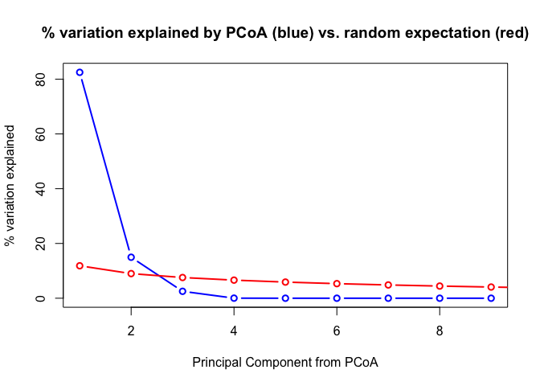<!-- -->

``` r
vec.PactFeatureOverlapsPCoA <- envfit(scores(PactFeatureOverlapsPCoA), PactFeatureOverlapsTrans, perm = 1000) #Extract PCs to calculate PC loadings (variable weights)
vec.PactFeatureOverlapsPCoA #Look at statistical results
```

    ## 
    ## ***VECTORS
    ## 
    ##                       Dim1     Dim2     r2   Pr(>r)    
    ## CDS                0.72564 -0.68807 0.9996 0.000999 ***
    ## Introns           -0.84872 -0.52884 0.9930 0.000999 ***
    ## Upstream.Flanks   -0.88326  0.46888 0.7988 0.027972 *  
    ## Downstream.Flanks -0.55180  0.83397 0.7641 0.005994 ** 
    ## Intergenic         0.47933  0.87764 0.9962 0.000999 ***
    ## ---
    ## Signif. codes:  0 '***' 0.001 '**' 0.01 '*' 0.05 '.' 0.1 ' ' 1
    ## Permutation: free
    ## Number of permutations: 1000

##### Global perMANOVA

``` r
PactFeatureOverlapsTest <- adonis(dissimPactFeatureOverlapsTrans ~ sampleInformation) #Conduct perMANOVA by method
PactFeatureOverlapsTest #Look at test output.
```

    ## 
    ## Call:
    ## adonis(formula = dissimPactFeatureOverlapsTrans ~ sampleInformation) 
    ## 
    ## Permutation: free
    ## Number of permutations: 999
    ## 
    ## Terms added sequentially (first to last)
    ## 
    ##                   Df SumsOfSqs  MeanSqs F.Model      R2 Pr(>F)   
    ## sampleInformation  2   0.32733 0.163666  6.1567 0.67237  0.005 **
    ## Residuals          6   0.15950 0.026583         0.32763          
    ## Total              8   0.48683                  1.00000          
    ## ---
    ## Signif. codes:  0 '***' 0.001 '**' 0.01 '*' 0.05 '.' 0.1 ' ' 1

##### Beta dispersion model

``` r
disp.PactFeatureOverlapsTrans <- betadisper(dissimPactFeatureOverlapsTrans, group = sampleInformation, type = 'centroid') #Run a beta dispersion model to assess if significant differences are due to differences in group centroid or variance
anova(disp.PactFeatureOverlapsTrans) #Variance is different between groups. Significance in perMANOVA is due to either centroid or variance differences
```

    ## Analysis of Variance Table
    ## 
    ## Response: Distances
    ##           Df   Sum Sq  Mean Sq F value   Pr(>F)   
    ## Groups     2 0.078976 0.039488  13.356 0.006171 **
    ## Residuals  6 0.017740 0.002957                    
    ## ---
    ## Signif. codes:  0 '***' 0.001 '**' 0.01 '*' 0.05 '.' 0.1 ' ' 1

##### Create plot

``` r
ordiplot(PactFeatureOverlapsPCoA, choices = c(1,2), type = "text", display = "sites", xlab = "PC 1 (82.5%)", ylab = "PC 2 (15.0%)") #Plot basic PCoA
plot(vec.PactFeatureOverlapsPCoA, p.max = 0.05, col = "blue") #Plot loadings that are significant at the 0.05 level
```

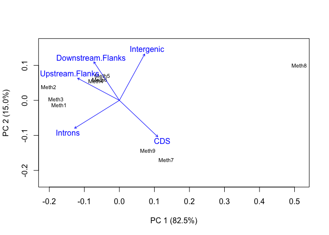<!-- -->

#### Pairwise perMANVOA

##### WGBS vs. RRBS

``` r
PactFeatureOverlapsWGRR <- vegdist(PactFeatureOverlapsTrans[c(1:3, 4:6),], "euclidean") #Subset WGBS and RRBS data and calculate dissimilarity matrix
```

``` r
PactFeatureOverlapsWGRRTest <- adonis(PactFeatureOverlapsWGRR ~ sampleInformation[1:6]) #Conduct pairwise perMANOVA for WGBS and RRBS data. Only use sequencing method metadata for these samples
```

    ## 'nperm' >= set of all permutations: complete enumeration.

    ## Set of permutations < 'minperm'. Generating entire set.

``` r
PactFeatureOverlapsWGRRTest
```

    ## 
    ## Call:
    ## adonis(formula = PactFeatureOverlapsWGRR ~ sampleInformation[1:6]) 
    ## 
    ## Permutation: free
    ## Number of permutations: 719
    ## 
    ## Terms added sequentially (first to last)
    ## 
    ##                        Df SumsOfSqs  MeanSqs F.Model      R2 Pr(>F)
    ## sampleInformation[1:6]  1  0.039252 0.039252  62.485 0.93984    0.1
    ## Residuals               4  0.002513 0.000628         0.06016       
    ## Total                   5  0.041765                  1.00000

``` r
disp.PactFeatureOverlapsWGRR <- betadisper(PactFeatureOverlapsWGRR, group = sampleInformation[1:6], type = 'centroid') #Run a beta dispersion model to assess if differences are due to differences in group centroid or variance
anova(disp.PactFeatureOverlapsWGRR) #Variance is the same between groups.
```

    ## Analysis of Variance Table
    ## 
    ## Response: Distances
    ##           Df     Sum Sq    Mean Sq F value Pr(>F)
    ## Groups     1 0.00018300 0.00018300  1.4036 0.3017
    ## Residuals  4 0.00052152 0.00013038

##### WGBS vs. MBD-BS

``` r
PactFeatureOverlapsWGMB <- vegdist(PactFeatureOverlapsTrans[c(1:3, 7:9),], "euclidean") #Subset WGBS and MBD-BS data and calculate dissimilarity matrix
```

``` r
PactFeatureOverlapsWGMBTest <- adonis(PactFeatureOverlapsWGMB ~ sampleInformation[c(1:3, 7:9)]) #Conduct pairwise perMANOVA for WGBS and MBD-BS data. Only use sequencing method metadata for these samples
```

    ## 'nperm' >= set of all permutations: complete enumeration.

    ## Set of permutations < 'minperm'. Generating entire set.

``` r
PactFeatureOverlapsWGMBTest
```

    ## 
    ## Call:
    ## adonis(formula = PactFeatureOverlapsWGMB ~ sampleInformation[c(1:3,      7:9)]) 
    ## 
    ## Permutation: free
    ## Number of permutations: 719
    ## 
    ## Terms added sequentially (first to last)
    ## 
    ##                                Df SumsOfSqs  MeanSqs F.Model      R2 Pr(>F)
    ## sampleInformation[c(1:3, 7:9)]  1   0.28657 0.286566  7.2114 0.64322    0.1
    ## Residuals                       4   0.15895 0.039738         0.35678       
    ## Total                           5   0.44552                  1.00000

``` r
disp.PactFeatureOverlapsWGMB <- betadisper(PactFeatureOverlapsWGMB, group = sampleInformation[c(1:3, 7:9)], type = 'centroid') #Run a beta dispersion model to assess if differences are due to differences in group centroid or variance
anova(disp.PactFeatureOverlapsWGMB) #Variance is different between groups.
```

    ## Analysis of Variance Table
    ## 
    ## Response: Distances
    ##           Df   Sum Sq  Mean Sq F value  Pr(>F)  
    ## Groups     1 0.055852 0.055852  12.685 0.02355 *
    ## Residuals  4 0.017612 0.004403                  
    ## ---
    ## Signif. codes:  0 '***' 0.001 '**' 0.01 '*' 0.05 '.' 0.1 ' ' 1

##### RRBS vs. MBD-BS

``` r
PactFeatureOverlapsRRMB <- vegdist(PactFeatureOverlapsTrans[c(4:9),], "euclidean") #Subset RRBS and MBD-BS data and calculate dissimilarity matrix
```

``` r
PactFeatureOverlapsRRMBTest <- adonis(PactFeatureOverlapsRRMB ~ sampleInformation[c(4:9)]) #Conduct pairwise perMANOVA for WGBS and RRBS data. Only use sequencing method metadata for these samples
```

    ## 'nperm' >= set of all permutations: complete enumeration.

    ## Set of permutations < 'minperm'. Generating entire set.

``` r
PactFeatureOverlapsRRMBTest
```

    ## 
    ## Call:
    ## adonis(formula = PactFeatureOverlapsRRMB ~ sampleInformation[c(4:9)]) 
    ## 
    ## Permutation: free
    ## Number of permutations: 719
    ## 
    ## Terms added sequentially (first to last)
    ## 
    ##                           Df SumsOfSqs  MeanSqs F.Model      R2 Pr(>F)
    ## sampleInformation[c(4:9)]  1   0.16518 0.165180  4.1941 0.51185    0.1
    ## Residuals                  4   0.15753 0.039384         0.48815       
    ## Total                      5   0.32272                  1.00000

``` r
disp.PactFeatureOverlapsRRMB <- betadisper(PactFeatureOverlapsRRMB, group = sampleInformation[c(4:9)], type = 'centroid') #Run a beta dispersion model to assess if differences are due to differences in group centroid or variance
anova(disp.PactFeatureOverlapsRRMB) #Variance is different between groups.
```

    ## Analysis of Variance Table
    ## 
    ## Response: Distances
    ##           Df   Sum Sq  Mean Sq F value Pr(>F)  
    ## Groups     1 0.062429 0.062429  14.396 0.0192 *
    ## Residuals  4 0.017346 0.004337                 
    ## ---
    ## Signif. codes:  0 '***' 0.001 '**' 0.01 '*' 0.05 '.' 0.1 ' ' 1

### Generalized linear model analysis

Does sequencing method influence the proportion of CpGs detected in
various genome
features?

#### Format data

``` r
PactFeatureOverlapsGLMData <- cbind("seqMethod" = c(rep("A", times = 3), rep("B", times = 3), rep("C", times = 3)),
                                    "replicate" = rep(seq(1:3), times = 3),
                                    data.frame(t(PactFeatureOverlapsPercents[,seq(5, 37, 4)] / 100))) #Create master dataframe for GLM
head(PactFeatureOverlapsGLMData) #Confirm dataframe creation
```

    ##       seqMethod replicate       CDS   Introns Upstream.Flanks Downstream.Flanks
    ## Meth1         A         1 0.2003058 0.2324463       0.1198140        0.10356391
    ## Meth2         A         2 0.1895358 0.2330570       0.1199770        0.10456368
    ## Meth3         A         3 0.1967414 0.2325122       0.1198950        0.10371708
    ## Meth4         B         1 0.2043023 0.2070401       0.1228494        0.09836911
    ## Meth5         B         2 0.2052896 0.2013143       0.1246223        0.09845279
    ## Meth6         B         3 0.2054854 0.2042365       0.1236256        0.09843984
    ##       Intergenic
    ## Meth1  0.3438700
    ## Meth2  0.3528665
    ## Meth3  0.3471342
    ## Meth4  0.3674391
    ## Meth5  0.3703210
    ## Meth6  0.3682126

#### CDS

``` r
PactCDSModel <- glmmTMB(CDS ~ seqMethod + (1|replicate),
                        family = beta_family(link = "logit"),
                        data = PactFeatureOverlapsGLMData) #Run the model using a beta distribution and a logit link. Use replicate as a random effect
summary(PactCDSModel) #Look at model output.
```

    ##  Family: beta  ( logit )
    ## Formula:          CDS ~ seqMethod + (1 | replicate)
    ## Data: PactFeatureOverlapsGLMData
    ## 
    ##      AIC      BIC   logLik deviance df.resid 
    ##    -64.4    -63.4     37.2    -74.4        4 
    ## 
    ## Random effects:
    ## 
    ## Conditional model:
    ##  Groups    Name        Variance  Std.Dev. 
    ##  replicate (Intercept) 2.803e-12 1.674e-06
    ## Number of obs: 9, groups:  replicate, 3
    ## 
    ## Overdispersion parameter for beta family (): 1.13e+04 
    ## 
    ## Conditional model:
    ##             Estimate Std. Error z value Pr(>|z|)    
    ## (Intercept) -1.41456    0.01367 -103.50  < 2e-16 ***
    ## seqMethodB   0.05955    0.01916    3.11  0.00188 ** 
    ## seqMethodC   0.36490    0.01843   19.80  < 2e-16 ***
    ## ---
    ## Signif. codes:  0 '***' 0.001 '**' 0.01 '*' 0.05 '.' 0.1 ' ' 1

``` r
PactCDSPostHoc <- data.frame(emmeans(PactCDSModel, pairwise ~ seqMethod, adjust = "FDR")$contrasts) #Run pairwise comparisons (estimated marginal means). Obtain log odd ratio results and not confidence intervals for individual methods in a dataframe format. Specify FDR instead of Tukey post-hoc test (default)
head(PactCDSPostHoc) #Look at log odd ratio results
```

    ##   contrast    estimate         SE df    t.ratio      p.value
    ## 1    A - B -0.05954505 0.01915706  4  -3.108256 0.0359324981
    ## 2    A - C -0.36489635 0.01843196  4 -19.796934 0.0001122404
    ## 3    B - C -0.30535130 0.01825347  4 -16.728395 0.0001122404

#### Introns

``` r
PactIntronsModel <- glmmTMB(Introns ~ seqMethod + (1|replicate),
                            family = beta_family(link = "logit"),
                            data = PactFeatureOverlapsGLMData) #Run the model using a beta distribution and a logit link. Use replicate as a random effect
summary(PactIntronsModel) #Look at model output.
```

    ##  Family: beta  ( logit )
    ## Formula:          Introns ~ seqMethod + (1 | replicate)
    ## Data: PactFeatureOverlapsGLMData
    ## 
    ##      AIC      BIC   logLik deviance df.resid 
    ##    -34.7    -33.7     22.3    -44.7        4 
    ## 
    ## Random effects:
    ## 
    ## Conditional model:
    ##  Groups    Name        Variance  Std.Dev.
    ##  replicate (Intercept) 0.0001318 0.01148 
    ## Number of obs: 9, groups:  replicate, 3
    ## 
    ## Overdispersion parameter for beta family ():  395 
    ## 
    ## Conditional model:
    ##             Estimate Std. Error z value Pr(>|z|)    
    ## (Intercept) -1.18958    0.06894 -17.255  < 2e-16 ***
    ## seqMethodB  -0.16622    0.09918  -1.676 0.093748 .  
    ## seqMethodC  -0.34951    0.10263  -3.405 0.000661 ***
    ## ---
    ## Signif. codes:  0 '***' 0.001 '**' 0.01 '*' 0.05 '.' 0.1 ' ' 1

``` r
PactIntronsPostHoc <- data.frame(emmeans(PactIntronsModel, pairwise ~ seqMethod, adjust = "FDR")$contrasts) #Run pairwise comparisons (estimated marginal means). Obtain log odd ratio results and not confidence intervals for individual methods in a dataframe format. Specify FDR instead of Tukey post-hoc test (default)
head(PactIntronsPostHoc) #Look at log odd ratio results
```

    ##   contrast  estimate         SE df  t.ratio    p.value
    ## 1    A - B 0.1662213 0.09918039  4 1.675949 0.16905653
    ## 2    A - C 0.3495125 0.10263437  4 3.405413 0.08142506
    ## 3    B - C 0.1832912 0.10482778  4 1.748498 0.16905653

#### Upstream Flanks

``` r
PactUpstreamFlanksModel <- glmmTMB(Upstream.Flanks ~ seqMethod + (1|replicate),
                                   family = beta_family(link = "logit"),
                                   data = PactFeatureOverlapsGLMData) #Run the model using a beta distribution and a logit link. Use replicate as a random effect
summary(PactUpstreamFlanksModel) #Look at model output
```

    ##  Family: beta  ( logit )
    ## Formula:          Upstream.Flanks ~ seqMethod + (1 | replicate)
    ## Data: PactFeatureOverlapsGLMData
    ## 
    ##      AIC      BIC   logLik deviance df.resid 
    ##    -57.2    -56.2     33.6    -67.2        4 
    ## 
    ## Random effects:
    ## 
    ## Conditional model:
    ##  Groups    Name        Variance  Std.Dev. 
    ##  replicate (Intercept) 1.008e-11 3.175e-06
    ## Number of obs: 9, groups:  replicate, 3
    ## 
    ## Overdispersion parameter for beta family (): 3.06e+03 
    ## 
    ## Conditional model:
    ##             Estimate Std. Error z value Pr(>|z|)    
    ## (Intercept) -1.99224    0.03213  -62.01  < 2e-16 ***
    ## seqMethodB   0.03550    0.04513    0.79 0.431399    
    ## seqMethodC  -0.16701    0.04697   -3.56 0.000377 ***
    ## ---
    ## Signif. codes:  0 '***' 0.001 '**' 0.01 '*' 0.05 '.' 0.1 ' ' 1

``` r
PactUpstreamFlanksPostHoc <- data.frame(emmeans(PactUpstreamFlanksModel, pairwise ~ seqMethod, adjust = "FDR")$contrasts) #Run pairwise comparisons (estimated marginal means). Obtain log odd ratio results and not confidence intervals for individual methods in a dataframe format. Specify FDR instead of Tukey post-hoc test (default)
head(PactUpstreamFlanksPostHoc) #Look at log odd ratio results
```

    ##   contrast   estimate         SE df    t.ratio    p.value
    ## 1    A - B -0.0355048 0.04512554  4 -0.7868006 0.47539678
    ## 2    A - C  0.1670052 0.04697131  4  3.5554721 0.03552299
    ## 3    B - C  0.2025100 0.04667994  4  4.3382660 0.03552299

#### Downstream Flanks

``` r
PactDownstreamFlanksModel <- glmmTMB(Downstream.Flanks ~ seqMethod + (1|replicate),
                                     family = beta_family(link = "logit"),
                                     data = PactFeatureOverlapsGLMData) #Run the model using a beta distribution and a logit link. Use replicate as a random effect
summary(PactDownstreamFlanksModel) #Look at model output
```

    ##  Family: beta  ( logit )
    ## Formula:          Downstream.Flanks ~ seqMethod + (1 | replicate)
    ## Data: PactFeatureOverlapsGLMData
    ## 
    ##      AIC      BIC   logLik deviance df.resid 
    ##    -78.2    -77.2     44.1    -88.2        4 
    ## 
    ## Random effects:
    ## 
    ## Conditional model:
    ##  Groups    Name        Variance  Std.Dev. 
    ##  replicate (Intercept) 1.447e-12 1.203e-06
    ## Number of obs: 9, groups:  replicate, 3
    ## 
    ## Overdispersion parameter for beta family (): 2.71e+04 
    ## 
    ## Conditional model:
    ##             Estimate Std. Error z value Pr(>|z|)    
    ## (Intercept) -2.15396    0.01149 -187.50  < 2e-16 ***
    ## seqMethodB  -0.06077    0.01645   -3.70  0.00022 ***
    ## seqMethodC  -0.14447    0.01674   -8.63  < 2e-16 ***
    ## ---
    ## Signif. codes:  0 '***' 0.001 '**' 0.01 '*' 0.05 '.' 0.1 ' ' 1

``` r
PactDownstreamFlanksPostHoc <- data.frame(emmeans(PactDownstreamFlanksModel, pairwise ~ seqMethod, adjust = "FDR")$contrasts) #Run pairwise comparisons (estimated marginal means). Obtain log odd ratio results and not confidence intervals for individual methods in a dataframe format. Specify FDR instead of Tukey post-hoc test (default)
head(PactDownstreamFlanksPostHoc) #Look at log odd ratio results
```

    ##   contrast   estimate         SE df  t.ratio     p.value
    ## 1    A - B 0.06077414 0.01644658  4 3.695246 0.020922336
    ## 2    A - C 0.14447412 0.01673947  4 8.630749 0.002972874
    ## 3    B - C 0.08369998 0.01693408  4 4.942694 0.011702647

#### Intergenic regions

``` r
PactIntergenicModel <- glmmTMB(Intergenic ~ seqMethod + (1|replicate),
                               family = beta_family(link = "logit"),
                               data = PactFeatureOverlapsGLMData) #Run the model using a beta distribution and a logit link. Use replicate as a random effect
summary(PactIntergenicModel) #Look at model output
```

    ##  Family: beta  ( logit )
    ## Formula:          Intergenic ~ seqMethod + (1 | replicate)
    ## Data: PactFeatureOverlapsGLMData
    ## 
    ##      AIC      BIC   logLik deviance df.resid 
    ##    -31.6    -30.7     20.8    -41.6        4 
    ## 
    ## Random effects:
    ## 
    ## Conditional model:
    ##  Groups    Name        Variance Std.Dev.
    ##  replicate (Intercept) 0.001245 0.03529 
    ## Number of obs: 9, groups:  replicate, 3
    ## 
    ## Overdispersion parameter for beta family ():  447 
    ## 
    ## Conditional model:
    ##             Estimate Std. Error z value Pr(>|z|)    
    ## (Intercept) -0.62687    0.06078 -10.314   <2e-16 ***
    ## seqMethodB   0.08984    0.08044   1.117    0.264    
    ## seqMethodC   0.08110    0.08049   1.008    0.314    
    ## ---
    ## Signif. codes:  0 '***' 0.001 '**' 0.01 '*' 0.05 '.' 0.1 ' ' 1

``` r
PactIntergenicPostHoc <- data.frame(emmeans(PactIntergenicModel, pairwise ~ seqMethod, adjust = "FDR")$contrasts) #Run pairwise comparisons (estimated marginal means). Obtain log odd ratio results and not confidence intervals for individual methods in a dataframe format. Specify FDR instead of Tukey post-hoc test (default)
head(PactIntergenicPostHoc) #Look at log odd ratio results
```

    ##   contrast     estimate         SE df    t.ratio   p.value
    ## 1    A - B -0.089841570 0.08044225  4 -1.1168456 0.5560185
    ## 2    A - C -0.081099262 0.08049291  4 -1.0075330 0.5560185
    ## 3    B - C  0.008742309 0.07998344  4  0.1093015 0.9182273

#### Save statistical output

``` r
PactCpGFeatureOverlapStatOutput <- rbind(PactCDSPostHoc,
                                         PactIntronsPostHoc,
                                         PactUpstreamFlanksPostHoc,
                                         PactDownstreamFlanksPostHoc,
                                         PactIntergenicPostHoc) #Create a dataframe with logs odd ratio output for each model
PactCpGFeatureOverlapStatOutput$model <- c(rep("CDS", times = 3),
                                           rep("Introns", times = 3),
                                           rep("UpstreamFlanks", times = 3),
                                           rep("DownstreamFlanks", times = 3),
                                           rep("Intergenic", times = 3)) #Add model information
head(PactCpGFeatureOverlapStatOutput) #Confirm dataframe creation
```

    ##   contrast    estimate         SE df    t.ratio      p.value   model
    ## 1    A - B -0.05954505 0.01915706  4  -3.108256 0.0359324981     CDS
    ## 2    A - C -0.36489635 0.01843196  4 -19.796934 0.0001122404     CDS
    ## 3    B - C -0.30535130 0.01825347  4 -16.728395 0.0001122404     CDS
    ## 4    A - B  0.16622131 0.09918039  4   1.675949 0.1690565294 Introns
    ## 5    A - C  0.34951246 0.10263437  4   3.405413 0.0814250626 Introns
    ## 6    B - C  0.18329116 0.10482778  4   1.748498 0.1690565294 Introns

``` r
write.table(PactCpGFeatureOverlapStatOutput, "../analyses/Characterizing-CpG-Methylation-5x/Pact/Pact-CpG-Overlap-StatResults.txt", quote = FALSE, row.names = FALSE) #Save table
```
