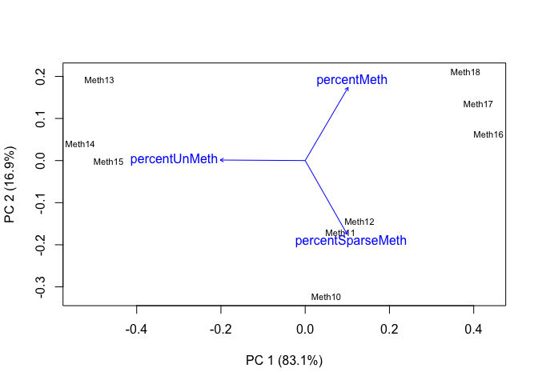

Chacterizing CpG Methylation (5x Individual Samples)
================

In this script, I’ll create summary tables and figures to characterize
CpG methylation in *M. capitata* and *P. acuta* using WGBS, RRBS, and
MBD-BSSeq. I used individual samples with data for 5x CpGs in [this
Jupyter
notebook](https://github.com/hputnam/Meth_Compare/blob/master/scripts/Characterizing-CpG-Methylation-5x.ipynb)
to identify methylation status and genomic location. I will use the
output in this script.

# Install packages

``` r
#install.packages("RColorBrewer") #Use for color palletes
#install.packages("dichromat") #Discern color blind accessibility of figures
#install.packages("compositions") #Compositional data analysis package
#install.packages("vegan") #Multivariate analysis package
#install.packages("cluster") #Multivariate analysis package
```

``` r
require(RColorBrewer) 
```

    ## Loading required package: RColorBrewer

``` r
require(dichromat)
```

    ## Loading required package: dichromat

``` r
require(compositions)
```

    ## Loading required package: compositions

    ## Loading required package: tensorA

    ## 
    ## Attaching package: 'tensorA'

    ## The following object is masked from 'package:base':
    ## 
    ##     norm

    ## Loading required package: robustbase

    ## Loading required package: bayesm

    ## Welcome to compositions, a package for compositional data analysis.
    ## Find an intro with "? compositions"

    ## 
    ## Attaching package: 'compositions'

    ## The following objects are masked from 'package:stats':
    ## 
    ##     cor, cov, dist, var

    ## The following objects are masked from 'package:base':
    ## 
    ##     %*%, scale, scale.default

``` r
require(vegan)
```

    ## Loading required package: vegan

    ## Loading required package: permute

    ## Loading required package: lattice

    ## This is vegan 2.5-6

``` r
require(cluster)
```

    ## Loading required package: cluster

``` r
source("biostats.R") #Multivariate analysis source script
```

# Session information

``` r
sessionInfo()
```

    ## R version 4.0.0 (2020-04-24)
    ## Platform: x86_64-apple-darwin17.0 (64-bit)
    ## Running under: macOS Catalina 10.15.5
    ## 
    ## Matrix products: default
    ## BLAS:   /Library/Frameworks/R.framework/Versions/4.0/Resources/lib/libRblas.dylib
    ## LAPACK: /Library/Frameworks/R.framework/Versions/4.0/Resources/lib/libRlapack.dylib
    ## 
    ## locale:
    ## [1] en_US.UTF-8/en_US.UTF-8/en_US.UTF-8/C/en_US.UTF-8/en_US.UTF-8
    ## 
    ## attached base packages:
    ## [1] stats     graphics  grDevices utils     datasets  methods   base     
    ## 
    ## other attached packages:
    ##  [1] cluster_2.1.0       vegan_2.5-6         lattice_0.20-41    
    ##  [4] permute_0.9-5       compositions_1.40-5 bayesm_3.1-4       
    ##  [7] robustbase_0.93-6   tensorA_0.36.1      dichromat_2.0-0    
    ## [10] RColorBrewer_1.1-2 
    ## 
    ## loaded via a namespace (and not attached):
    ##  [1] Rcpp_1.0.4.6    knitr_1.28      magrittr_1.5    splines_4.0.0  
    ##  [5] MASS_7.3-51.6   rlang_0.4.6     stringr_1.4.0   tools_4.0.0    
    ##  [9] parallel_4.0.0  grid_4.0.0      nlme_3.1-147    mgcv_1.8-31    
    ## [13] xfun_0.13       htmltools_0.4.0 yaml_2.2.1      digest_0.6.25  
    ## [17] Matrix_1.2-18   evaluate_0.14   rmarkdown_2.1   stringi_1.4.6  
    ## [21] compiler_4.0.0  DEoptimR_1.0-8

# CpG distribution

## Mcap

### Import file counts

``` r
McapAll <- read.table("../analyses/Characterizing-CpG-Methylation-5x/Mcap/Mcap-5x-bedgraph-counts.txt", header = FALSE, col.names = c("totalLines", "filename")) #Import file using space as a delimiter. Columns are the number of lines and the filename
McapAll <- McapAll[-10,] #Remove last row (total lines for all files)
tail(McapAll) #Confirm import
```

    ##   totalLines                                        filename
    ## 4    3173254 Meth13_R1_001_val_1_bismark_bt2_pe._5x.bedgraph
    ## 5    2648697 Meth14_R1_001_val_1_bismark_bt2_pe._5x.bedgraph
    ## 6    3176517 Meth15_R1_001_val_1_bismark_bt2_pe._5x.bedgraph
    ## 7     583599 Meth16_R1_001_val_1_bismark_bt2_pe._5x.bedgraph
    ## 8     242390 Meth17_R1_001_val_1_bismark_bt2_pe._5x.bedgraph
    ## 9     153392 Meth18_R1_001_val_1_bismark_bt2_pe._5x.bedgraph

``` r
McapMeth <- read.table("../analyses/Characterizing-CpG-Methylation-5x/Mcap/Mcap-5x-Meth-counts.txt", header = FALSE, col.names = c("Meth", "filename")) #Import file using space as a delimiter. Columns are the number of lines and the filename
McapMeth <- McapMeth[-10,] #Remove last row (total lines for all files)
tail(McapMeth) #Confirm import
```

    ##     Meth                                             filename
    ## 4 257741 Meth13_R1_001_val_1_bismark_bt2_pe._5x.bedgraph-Meth
    ## 5 184742 Meth14_R1_001_val_1_bismark_bt2_pe._5x.bedgraph-Meth
    ## 6 231347 Meth15_R1_001_val_1_bismark_bt2_pe._5x.bedgraph-Meth
    ## 7 106695 Meth16_R1_001_val_1_bismark_bt2_pe._5x.bedgraph-Meth
    ## 8  45506 Meth17_R1_001_val_1_bismark_bt2_pe._5x.bedgraph-Meth
    ## 9  29468 Meth18_R1_001_val_1_bismark_bt2_pe._5x.bedgraph-Meth

``` r
McapSparseMeth <- read.table("../analyses/Characterizing-CpG-Methylation-5x/Mcap/Mcap-5x-sparseMeth-counts.txt", header = FALSE, col.names = c("sparseMeth", "filename")) #Import file using space as a delimiter. Columns are the number of lines and the filename
McapSparseMeth <- McapSparseMeth[-10,] #Remove last row (total lines for all files)
tail(McapSparseMeth) #Confirm import
```

    ##   sparseMeth                                                   filename
    ## 4     152042 Meth13_R1_001_val_1_bismark_bt2_pe._5x.bedgraph-sparseMeth
    ## 5     135052 Meth14_R1_001_val_1_bismark_bt2_pe._5x.bedgraph-sparseMeth
    ## 6     179454 Meth15_R1_001_val_1_bismark_bt2_pe._5x.bedgraph-sparseMeth
    ## 7      74839 Meth16_R1_001_val_1_bismark_bt2_pe._5x.bedgraph-sparseMeth
    ## 8      28850 Meth17_R1_001_val_1_bismark_bt2_pe._5x.bedgraph-sparseMeth
    ## 9      16793 Meth18_R1_001_val_1_bismark_bt2_pe._5x.bedgraph-sparseMeth

``` r
McapUnMeth <- read.table("../analyses/Characterizing-CpG-Methylation-5x/Mcap/Mcap-5x-unMeth-counts.txt", header = FALSE, col.names = c("unMeth", "filename")) #Import file using space as a delimiter. Columns are the number of lines and the filename
McapUnMeth <- McapUnMeth[-10,] #Remove last row (total lines for all files)
tail(McapUnMeth) #Confirm import
```

    ##    unMeth                                               filename
    ## 4 2763471 Meth13_R1_001_val_1_bismark_bt2_pe._5x.bedgraph-unMeth
    ## 5 2328903 Meth14_R1_001_val_1_bismark_bt2_pe._5x.bedgraph-unMeth
    ## 6 2765716 Meth15_R1_001_val_1_bismark_bt2_pe._5x.bedgraph-unMeth
    ## 7  402065 Meth16_R1_001_val_1_bismark_bt2_pe._5x.bedgraph-unMeth
    ## 8  168034 Meth17_R1_001_val_1_bismark_bt2_pe._5x.bedgraph-unMeth
    ## 9  107131 Meth18_R1_001_val_1_bismark_bt2_pe._5x.bedgraph-unMeth

### Create summary table

``` r
McapCpGType <- cbind(McapAll, McapMeth, McapSparseMeth, McapUnMeth) #Mash tables together by column
rownames(McapCpGType) <- substr(McapAll$filename, start = 1, stop = 6) #Use the first 6 characters of the filename to add sample ID as row names
McapCpGType <- McapCpGType[,-c(2,4,6,8)] #Remove filename columns
tail(McapCpGType) #Confirm table mashing
```

    ##        totalLines   Meth sparseMeth  unMeth
    ## Meth13    3173254 257741     152042 2763471
    ## Meth14    2648697 184742     135052 2328903
    ## Meth15    3176517 231347     179454 2765716
    ## Meth16     583599 106695      74839  402065
    ## Meth17     242390  45506      28850  168034
    ## Meth18     153392  29468      16793  107131

``` r
McapCpGType$percentMeth <- (McapCpGType$Meth / McapCpGType$totalLines) * 100 #Calculate percent methylated loci
McapCpGType$percentSparseMeth <- (McapCpGType$sparseMeth / McapCpGType$totalLines) * 100 #Calculate percent sparsely methylated loci
McapCpGType$percentUnMeth <- (McapCpGType$unMeth / McapCpGType$totalLines) * 100 #Calculate percent unmethylated loci
McapCpGType <- McapCpGType[,c(1, 2, 5, 3, 6, 4, 7)] #Reorganize columns
tail(McapCpGType) #Confirm calculations
```

    ##        totalLines   Meth percentMeth sparseMeth percentSparseMeth  unMeth
    ## Meth13    3173254 257741    8.122293     152042          4.791359 2763471
    ## Meth14    2648697 184742    6.974826     135052          5.098809 2328903
    ## Meth15    3176517 231347    7.283040     179454          5.649395 2765716
    ## Meth16     583599 106695   18.282245      74839         12.823703  402065
    ## Meth17     242390  45506   18.773877      28850         11.902306  168034
    ## Meth18     153392  29468   19.210911      16793         10.947768  107131
    ##        percentUnMeth
    ## Meth13      87.08635
    ## Meth14      87.92637
    ## Meth15      87.06756
    ## Meth16      68.89405
    ## Meth17      69.32382
    ## Meth18      69.84132

``` r
write.table(McapCpGType, "../analyses/Characterizing-CpG-Methylation-5x/Mcap/Mcap-CpG-Type.txt", sep = "\t", quote = FALSE, row.names = TRUE) #Save summary table
```

### Reorganize data

``` r
McapCpGTypePercents <- McapCpGType[,c(3,5,7)] #Keep only columns with % total CpG information
head(McapCpGTypePercents) #Check reorganization
```

    ##        percentMeth percentSparseMeth percentUnMeth
    ## Meth10    9.856784         11.984981      78.15823
    ## Meth11   11.345650         11.107605      77.54674
    ## Meth12   12.055734         11.378198      76.56607
    ## Meth13    8.122293          4.791359      87.08635
    ## Meth14    6.974826          5.098809      87.92637
    ## Meth15    7.283040          5.649395      87.06756

``` r
#Create test plots

barplot(t(McapCpGTypePercents[1,]), beside = TRUE, ylim = c(0,100), names.arg = c(expression("High (">="50%)"), "Moderate (10-50%)", expression("Weak ("<="10%)")), axes = FALSE) #Sample 1, WGBS
axis(side = 2, at = seq(0, 100, by = 25), las = 2, col = "grey80")
```

<!-- -->

``` r
barplot(t(McapCpGTypePercents[4,]), beside = TRUE, ylim = c(0,100), names.arg = c(expression("High (">="50%)"), "Moderate (10-50%)", expression("Weak ("<="10%)")), axes = FALSE) #Sample 1, RRBS
axis(side = 2, at = seq(0, 100, by = 25), las = 2, col = "grey80")
```

<!-- -->

``` r
barplot(t(McapCpGTypePercents[7,]), beside = TRUE, ylim = c(0,100), names.arg = c(expression("High (">="50%)"), "Moderate (10-50%)", expression("Weak ("<="10%)")), axes = FALSE) #Sample 1, MBD-BSSeq
axis(side = 2, at = seq(0, 100, by = 25), las = 2, col = "grey80")
```

<!-- -->

### Create multipanel figure with all samples

``` r
#pdf("../analyses/Characterizing-CpG-Methylation-5x/Mcap/Mcap-CpG-Type.pdf", height = 8.5, width = 11) #Save file as pdf

par(mfcol = c(3,3), mar = c(2, 2, 2, 0), oma = c(5, 5, 2, 0)) #Fill in multipanel plot by column and adjust inner and outer margins

barplot(t(McapCpGTypePercents[1,]), beside = TRUE, ylim = c(0,100), names.arg = FALSE, axes = FALSE) #Sample 1, WGBS
axis(side = 2, at = seq(0, 100, by = 25), las = 2, col = "grey80", cex.axis = 1.3) #Add y-axis
mtext(side = 3, "WBGS", adj = 0, line = 1) #Add sequencing information

barplot(t(McapCpGTypePercents[4,]), beside = TRUE, ylim = c(0,100), names.arg = FALSE, axes = FALSE) #Sample 1, RRBS
mtext(side = 3, "RRBS", adj = 0, line = 1) #Add sequencing information
axis(side = 2, at = seq(0, 100, by = 25), las = 2, col = "grey80", cex.axis = 1.3) #Add y-axis
mtext(side = 2, outer = TRUE, "% 5x CpG with Data", cex = 1.5, line = 2) #Add y-axis label

barplot(t(McapCpGTypePercents[7,]), beside = TRUE, ylim = c(0,100), names.arg = c(expression("">= "50%"), "10-50%", "< 10%"), cex.names = 1.3, axes = FALSE) #Sample 1, MBD-BSSeq
mtext(side = 3, "MBD-BSSeq", adj = 0, line = 1) #Add sequencing information
axis(side = 2, at = seq(0, 100, by = 25), las = 2, col = "grey80", cex.axis = 1.3) #Add y-axis

barplot(t(McapCpGTypePercents[2,]), beside = TRUE, ylim = c(0,100), names.arg = FALSE, axes = FALSE) #Sample 2, WGBS
barplot(t(McapCpGTypePercents[5,]), beside = TRUE, ylim = c(0,100), names.arg = FALSE, axes = FALSE) #Sample 2, RRBS
barplot(t(McapCpGTypePercents[8,]), beside = TRUE, ylim = c(0,100), names.arg = c(expression("">= "50%"), "10-50%", "< 10%"), cex.names = 1.3, axes = FALSE) #Sample 2, MBD-BSSeq
mtext(side = 1, outer = TRUE, "% Methylation", cex = 1.5, line = 2) #Add x-axis label

barplot(t(McapCpGTypePercents[3,]), beside = TRUE, ylim = c(0,100), names.arg = FALSE, axes = FALSE) #Sample 3, WGBS
barplot(t(McapCpGTypePercents[6,]), beside = TRUE, ylim = c(0,100), names.arg = FALSE, axes = FALSE) #Sample 3, RRBS
barplot(t(McapCpGTypePercents[9,]), beside = TRUE, ylim = c(0,100), names.arg = c(expression("">= "50%"), "10-50%", "< 10%"), cex.names = 1.3, axes = FALSE) #Sample 3, MBD-BSSeq
```

<!-- -->

``` r
#dev.off() #Turn off plotting device
```

## Pact

### Import file counts

``` r
PactAll <- read.table("../analyses/Characterizing-CpG-Methylation-5x/Pact/Pact-5x-bedgraph-counts.txt", header = FALSE, col.names = c("totalLines", "filename")) #Import file using space as a delimiter. Columns are the number of lines and the filename
PactAll <- PactAll[-10,] #Remove last row (total lines for all files)
tail(PactAll) #Confirm import
```

    ##   totalLines                                       filename
    ## 4    1835561 Meth4_R1_001_val_1_bismark_bt2_pe._5x.bedgraph
    ## 5    1451229 Meth5_R1_001_val_1_bismark_bt2_pe._5x.bedgraph
    ## 6    1517358 Meth6_R1_001_val_1_bismark_bt2_pe._5x.bedgraph
    ## 7    2640625 Meth7_R1_001_val_1_bismark_bt2_pe._5x.bedgraph
    ## 8     539008 Meth8_R1_001_val_1_bismark_bt2_pe._5x.bedgraph
    ## 9    2732607 Meth9_R1_001_val_1_bismark_bt2_pe._5x.bedgraph

``` r
PactMeth <- read.table("../analyses/Characterizing-CpG-Methylation-5x/Pact/Pact-5x-Meth-counts.txt", header = FALSE, col.names = c("Meth", "filename")) #Import file using space as a delimiter. Columns are the number of lines and the filename
PactMeth <- PactMeth[-10,] #Remove last row (total lines for all files)
tail(PactMeth) #Confirm import
```

    ##     Meth                                            filename
    ## 4  31047 Meth4_R1_001_val_1_bismark_bt2_pe._5x.bedgraph-Meth
    ## 5  30345 Meth5_R1_001_val_1_bismark_bt2_pe._5x.bedgraph-Meth
    ## 6  26617 Meth6_R1_001_val_1_bismark_bt2_pe._5x.bedgraph-Meth
    ## 7 258222 Meth7_R1_001_val_1_bismark_bt2_pe._5x.bedgraph-Meth
    ## 8 213342 Meth8_R1_001_val_1_bismark_bt2_pe._5x.bedgraph-Meth
    ## 9 255370 Meth9_R1_001_val_1_bismark_bt2_pe._5x.bedgraph-Meth

``` r
PactSparseMeth <- read.table("../analyses/Characterizing-CpG-Methylation-5x/Pact/Pact-5x-sparseMeth-counts.txt", header = FALSE, col.names = c("sparseMeth", "filename")) #Import file using space as a delimiter. Columns are the number of lines and the filename
PactSparseMeth <- PactSparseMeth[-10,] #Remove last row (total lines for all files)
tail(PactSparseMeth) #Confirm import
```

    ##   sparseMeth                                                  filename
    ## 4     137700 Meth4_R1_001_val_1_bismark_bt2_pe._5x.bedgraph-sparseMeth
    ## 5      64837 Meth5_R1_001_val_1_bismark_bt2_pe._5x.bedgraph-sparseMeth
    ## 6      89246 Meth6_R1_001_val_1_bismark_bt2_pe._5x.bedgraph-sparseMeth
    ## 7     296059 Meth7_R1_001_val_1_bismark_bt2_pe._5x.bedgraph-sparseMeth
    ## 8      80086 Meth8_R1_001_val_1_bismark_bt2_pe._5x.bedgraph-sparseMeth
    ## 9     337855 Meth9_R1_001_val_1_bismark_bt2_pe._5x.bedgraph-sparseMeth

``` r
PactUnMeth <- read.table("../analyses/Characterizing-CpG-Methylation-5x/Pact/Pact-5x-unMeth-counts.txt", header = FALSE, col.names = c("unMeth", "filename")) #Import file using space as a delimiter. Columns are the number of lines and the filename
PactUnMeth <- PactUnMeth[-10,] #Remove last row (total lines for all files)
tail(PactUnMeth) #Confirm import
```

    ##    unMeth                                              filename
    ## 4 1666814 Meth4_R1_001_val_1_bismark_bt2_pe._5x.bedgraph-unMeth
    ## 5 1356047 Meth5_R1_001_val_1_bismark_bt2_pe._5x.bedgraph-unMeth
    ## 6 1401495 Meth6_R1_001_val_1_bismark_bt2_pe._5x.bedgraph-unMeth
    ## 7 2086344 Meth7_R1_001_val_1_bismark_bt2_pe._5x.bedgraph-unMeth
    ## 8  245580 Meth8_R1_001_val_1_bismark_bt2_pe._5x.bedgraph-unMeth
    ## 9 2139382 Meth9_R1_001_val_1_bismark_bt2_pe._5x.bedgraph-unMeth

### Create summary table

``` r
PactCpGType <- cbind(PactAll, PactMeth, PactSparseMeth, PactUnMeth) #Mash tables together by column
rownames(PactCpGType) <- substr(PactAll$filename, start = 1, stop = 5) #Use the first 5 characters of the filename to add sample ID to row names
PactCpGType <- PactCpGType[,-c(2,4,6,8)] #Remove filename columns
tail(PactCpGType) #Confirm table mashing
```

    ##       totalLines   Meth sparseMeth  unMeth
    ## Meth4    1835561  31047     137700 1666814
    ## Meth5    1451229  30345      64837 1356047
    ## Meth6    1517358  26617      89246 1401495
    ## Meth7    2640625 258222     296059 2086344
    ## Meth8     539008 213342      80086  245580
    ## Meth9    2732607 255370     337855 2139382

``` r
PactCpGType$percentMeth <- (PactCpGType$Meth / PactCpGType$totalLines) * 100 #Calculate percent methylated loci
PactCpGType$percentSparseMeth <- (PactCpGType$sparseMeth / PactCpGType$totalLines) * 100 #Calculate percent sparsely methylated loci
PactCpGType$percentUnMeth <- (PactCpGType$unMeth / PactCpGType$totalLines) * 100 #Calculate percent unmethylated loci
PactCpGType <- PactCpGType[,c(1, 2, 5, 3, 6, 4, 7)] #Reorganize columns
tail(PactCpGType) #Confirm calculations
```

    ##       totalLines   Meth percentMeth sparseMeth percentSparseMeth  unMeth
    ## Meth4    1835561  31047    1.691418     137700          7.501794 1666814
    ## Meth5    1451229  30345    2.090986      64837          4.467730 1356047
    ## Meth6    1517358  26617    1.754167      89246          5.881671 1401495
    ## Meth7    2640625 258222    9.778821     296059         11.211702 2086344
    ## Meth8     539008 213342   39.580489      80086         14.858036  245580
    ## Meth9    2732607 255370    9.345288     337855         12.363834 2139382
    ##       percentUnMeth
    ## Meth4      90.80679
    ## Meth5      93.44128
    ## Meth6      92.36416
    ## Meth7      79.00948
    ## Meth8      45.56148
    ## Meth9      78.29088

``` r
write.table(PactCpGType, "../analyses/Characterizing-CpG-Methylation-5x/Pact/Pact-CpG-Type.txt", sep = "\t", quote = FALSE, row.names = TRUE) #Save summary table
```

``` r
PactCpGType <- read.delim("../analyses/Characterizing-CpG-Methylation-5x/Pact/Pact-CpG-Type.txt", sep = "\t", header = TRUE) #Import summary table
head(PactCpGType) #Check import
```

    ##       totalLines   Meth percentMeth sparseMeth percentSparseMeth  unMeth
    ## Meth1    5546051 110364    1.989956     367019          6.617664 5068668
    ## Meth2    6358722 126440    1.988450     345887          5.439568 5886395
    ## Meth3    5866786 124819    2.127553     385346          6.568264 5356621
    ## Meth4    1835561  31047    1.691418     137700          7.501794 1666814
    ## Meth5    1451229  30345    2.090986      64837          4.467730 1356047
    ## Meth6    1517358  26617    1.754167      89246          5.881671 1401495
    ##       percentUnMeth
    ## Meth1      91.39238
    ## Meth2      92.57198
    ## Meth3      91.30418
    ## Meth4      90.80679
    ## Meth5      93.44128
    ## Meth6      92.36416

### Reorganize data

``` r
PactCpGTypePercents <- PactCpGType[,c(3,5,7)] #Keep only columns with % total CpG information
tail(PactCpGTypePercents) #Check reorganization
```

    ##       percentMeth percentSparseMeth percentUnMeth
    ## Meth4    1.691418          7.501794      90.80679
    ## Meth5    2.090986          4.467730      93.44128
    ## Meth6    1.754167          5.881671      92.36416
    ## Meth7    9.778821         11.211702      79.00948
    ## Meth8   39.580489         14.858036      45.56148
    ## Meth9    9.345288         12.363834      78.29088

``` r
#Create test plots

barplot(t(PactCpGTypePercents[1,]), beside = TRUE, ylim = c(0,100), names.arg = c(expression("High (">="50%)"), "Moderate (10-50%)", expression("Weak ("<="10%)")), axes = FALSE) #Sample 1, WGBS
axis(side = 2, at = seq(0, 100, by = 25), las = 2, col = "grey80")
```

<!-- -->

``` r
barplot(t(PactCpGTypePercents[4,]), beside = TRUE, ylim = c(0,100), names.arg = c(expression("High (">="50%)"), "Moderate (10-50%)", expression("Weak ("<="10%)")), axes = FALSE) #Sample 1, RRBS
axis(side = 2, at = seq(0, 100, by = 25), las = 2, col = "grey80")
```

<!-- -->

``` r
barplot(t(PactCpGTypePercents[7,]), beside = TRUE, ylim = c(0,100), names.arg = c(expression("High (">="50%)"), "Moderate (10-50%)", expression("Weak ("<="10%)")), axes = FALSE) #Sample 1, MBD-BSSeqc(expression("High (">="50%)"), "Moderate (10-50%)", expression("Weak ("<="10%)"))
axis(side = 2, at = seq(0, 100, by = 25), las = 2, col = "grey80")
```

<!-- -->

### Create multipanel figure with all samples

``` r
#pdf("../analyses/Characterizing-CpG-Methylation-5x/Pact/Pact-CpG-Type.pdf", height = 8.5, width = 11) #Save file as pdf

par(mfcol = c(3,3), mar = c(2, 2, 2, 0), oma = c(5, 5, 2, 0)) #Fill in multipanel plot by column and adjust inner and outer margins

barplot(t(PactCpGTypePercents[1,]), beside = TRUE, ylim = c(0,100), names.arg = FALSE, axes = FALSE) #Sample 1, WGBS
mtext(side = 3, "WBGS", adj = 0, line = 1) #Add sequencing information
axis(side = 2, at = seq(0, 100, by = 25), las = 2, col = "grey80", cex.axis = 1.3) #Add y-axis

barplot(t(PactCpGTypePercents[4,]), beside = TRUE, ylim = c(0,100), names.arg = FALSE, axes = FALSE) #Sample 1, RRBS
mtext(side = 3, "RRBS", adj = 0, line = 1) #Add sequencing information
axis(side = 2, at = seq(0, 100, by = 25), las = 2, col = "grey80", cex.axis = 1.3) #Add y-axis
mtext(side = 2, outer = TRUE, "% 5x CpG with Data", cex = 1.5, line = 2) #Add y-axis label

barplot(t(PactCpGTypePercents[7,]), beside = TRUE, ylim = c(0,100), names.arg = c(expression("">= "50%"), "10-50%", "< 10%"), cex.names = 1.3, axes = FALSE) #Sample 1, MBD-BSSeq
mtext(side = 3, "MBD-BSSeq", adj = 0, line = 1) #Add sequencing information
axis(side = 2, at = seq(0, 100, by = 25), las = 2, col = "grey80", cex.axis = 1.3) #Add y-axis

barplot(t(PactCpGTypePercents[2,]), beside = TRUE, ylim = c(0,100), names.arg = FALSE, axes = FALSE) #Sample 2, WGBS
barplot(t(PactCpGTypePercents[5,]), beside = TRUE, ylim = c(0,100), names.arg = FALSE, axes = FALSE) #Sample 2, RRBS
barplot(t(PactCpGTypePercents[8,]), beside = TRUE, ylim = c(0,100), names.arg = c(expression("">= "50%"), "10-50%", "< 10%"), cex.names = 1.3, axes = FALSE) #Sample 2, MBD-BSSeq
mtext(side = 1, outer = TRUE, "% Methylation", cex = 1.5, line = 2) #Add x-axis label

barplot(t(PactCpGTypePercents[3,]), beside = TRUE, ylim = c(0,100), names.arg = FALSE, axes = FALSE) #Sample 3, WGBS
barplot(t(PactCpGTypePercents[6,]), beside = TRUE, ylim = c(0,100), names.arg = FALSE, axes = FALSE) #Sample 3, RRBS
barplot(t(PactCpGTypePercents[9,]), beside = TRUE, ylim = c(0,100), names.arg = c(expression("">= "50%"), "10-50%", "< 10%"), cex.names = 1.3, axes = FALSE) #Sample 3, MBD-BSSeq
```

<!-- -->

``` r
#dev.off() #Turn off plotting device
```

# CpG overlaps

## Mcap

### Import file counts

``` r
McapGenomeFeatures <- read.table("../analyses/Characterizing-CpG-Methylation-5x/Mcap/Mcap-CGMotif-Overlaps-counts.txt", header = FALSE, col.names = c("counts", "filename")) #Import file with CG motif and feature track overlaps
McapGenomeFeatures <- McapGenomeFeatures[-8,] #Remove final row
tail(McapGenomeFeatures) #Check import
```

    ##     counts                                    filename
    ## 2  1365975 Mcap-CGMotif-Flanks-Downstream-Overlaps.txt
    ## 3  2758953            Mcap-CGMotif-Flanks-Overlaps.txt
    ## 4  1505544   Mcap-CGMotif-Flanks-Upstream-Overlaps.txt
    ## 5  9450564              Mcap-CGMotif-Gene-Overlaps.txt
    ## 6 16468305        Mcap-CGMotif-Intergenic-Overlaps.txt
    ## 7  7503314            Mcap-CGMotif-Intron-Overlaps.txt

``` r
McapGeneOverlaps <- read.table("../analyses/Characterizing-CpG-Methylation-5x/Mcap/Mcap-5x-mcGenes-counts.txt", header = FALSE, col.names = c("counts", "filename")) #Import file with all file-gene overlaps
McapGeneOverlaps <- McapGeneOverlaps[-37,] #Remove final row
tail(McapGeneOverlaps) #Confirm import
```

    ##    counts
    ## 31  53620
    ## 32  83519
    ## 33  12960
    ## 34   4843
    ## 35  32499
    ## 36  50302
    ##                                                                  filename
    ## 31     Meth17_R1_001_val_1_bismark_bt2_pe._5x.bedgraph-unMeth.bed-mcGenes
    ## 32            Meth17_R1_001_val_1_bismark_bt2_pe._5x.bedgraph.bed-mcGenes
    ## 33       Meth18_R1_001_val_1_bismark_bt2_pe._5x.bedgraph-Meth.bed-mcGenes
    ## 34 Meth18_R1_001_val_1_bismark_bt2_pe._5x.bedgraph-sparseMeth.bed-mcGenes
    ## 35     Meth18_R1_001_val_1_bismark_bt2_pe._5x.bedgraph-unMeth.bed-mcGenes
    ## 36            Meth18_R1_001_val_1_bismark_bt2_pe._5x.bedgraph.bed-mcGenes

``` r
McapCDSOverlaps <- read.table("../analyses/Characterizing-CpG-Methylation-5x/Mcap/Mcap-5x-mcCDS-counts.txt", header = FALSE, col.names = c("counts", "filename")) #Import file with all file-CDS overlaps
McapCDSOverlaps <- McapCDSOverlaps[-37,] #Remove final row
tail(McapCDSOverlaps) #Confirm import
```

    ##    counts                                                             filename
    ## 31  19966     Meth17_R1_001_val_1_bismark_bt2_pe._5x.bedgraph-unMeth.bed-mcCDS
    ## 32  29305            Meth17_R1_001_val_1_bismark_bt2_pe._5x.bedgraph.bed-mcCDS
    ## 33   3992       Meth18_R1_001_val_1_bismark_bt2_pe._5x.bedgraph-Meth.bed-mcCDS
    ## 34   1907 Meth18_R1_001_val_1_bismark_bt2_pe._5x.bedgraph-sparseMeth.bed-mcCDS
    ## 35  11720     Meth18_R1_001_val_1_bismark_bt2_pe._5x.bedgraph-unMeth.bed-mcCDS
    ## 36  17619            Meth18_R1_001_val_1_bismark_bt2_pe._5x.bedgraph.bed-mcCDS

``` r
McapIntronsOverlaps <- read.table("../analyses/Characterizing-CpG-Methylation-5x/Mcap/Mcap-5x-mcIntrons-counts.txt", header = FALSE, col.names = c("counts", "filename")) #Import file with all file-Introns overlaps
McapIntronsOverlaps <- McapIntronsOverlaps[-37,] #Remove final row
tail(McapIntronsOverlaps) #Confirm import
```

    ##    counts
    ## 31  33699
    ## 32  54275
    ## 33   8973
    ## 34   2942
    ## 35  20802
    ## 36  32717
    ##                                                                    filename
    ## 31     Meth17_R1_001_val_1_bismark_bt2_pe._5x.bedgraph-unMeth.bed-mcIntrons
    ## 32            Meth17_R1_001_val_1_bismark_bt2_pe._5x.bedgraph.bed-mcIntrons
    ## 33       Meth18_R1_001_val_1_bismark_bt2_pe._5x.bedgraph-Meth.bed-mcIntrons
    ## 34 Meth18_R1_001_val_1_bismark_bt2_pe._5x.bedgraph-sparseMeth.bed-mcIntrons
    ## 35     Meth18_R1_001_val_1_bismark_bt2_pe._5x.bedgraph-unMeth.bed-mcIntrons
    ## 36            Meth18_R1_001_val_1_bismark_bt2_pe._5x.bedgraph.bed-mcIntrons

``` r
McapFlanksOverlaps <- read.table("../analyses/Characterizing-CpG-Methylation-5x/Mcap/Mcap-5x-mcFlanks-counts.txt", header = FALSE, col.names = c("counts", "filename")) #Import file with all file-flank overlaps
McapFlanksOverlaps <- McapFlanksOverlaps[-37,] #Remove final row
tail(McapFlanksOverlaps) #Confirm import
```

    ##    counts
    ## 31  15099
    ## 32  22627
    ## 33   3326
    ## 34   1541
    ## 35   9460
    ## 36  14327
    ##                                                                   filename
    ## 31     Meth17_R1_001_val_1_bismark_bt2_pe._5x.bedgraph-unMeth.bed-mcFlanks
    ## 32            Meth17_R1_001_val_1_bismark_bt2_pe._5x.bedgraph.bed-mcFlanks
    ## 33       Meth18_R1_001_val_1_bismark_bt2_pe._5x.bedgraph-Meth.bed-mcFlanks
    ## 34 Meth18_R1_001_val_1_bismark_bt2_pe._5x.bedgraph-sparseMeth.bed-mcFlanks
    ## 35     Meth18_R1_001_val_1_bismark_bt2_pe._5x.bedgraph-unMeth.bed-mcFlanks
    ## 36            Meth18_R1_001_val_1_bismark_bt2_pe._5x.bedgraph.bed-mcFlanks

``` r
McapFlanksUpstreamOverlaps <- read.table("../analyses/Characterizing-CpG-Methylation-5x/Mcap/Mcap-5x-mcFlanksUpstream-counts.txt", header = FALSE, col.names = c("counts", "filename")) #Import file with all file-upstream flank overlaps
McapFlanksUpstreamOverlaps <- McapFlanksUpstreamOverlaps[-37,] #Remove final row
tail(McapFlanksUpstreamOverlaps) #Confirm import
```

    ##    counts
    ## 31   8579
    ## 32  12941
    ## 33   1877
    ## 34    910
    ## 35   5300
    ## 36   8087
    ##                                                                           filename
    ## 31     Meth17_R1_001_val_1_bismark_bt2_pe._5x.bedgraph-unMeth.bed-mcFlanksUpstream
    ## 32            Meth17_R1_001_val_1_bismark_bt2_pe._5x.bedgraph.bed-mcFlanksUpstream
    ## 33       Meth18_R1_001_val_1_bismark_bt2_pe._5x.bedgraph-Meth.bed-mcFlanksUpstream
    ## 34 Meth18_R1_001_val_1_bismark_bt2_pe._5x.bedgraph-sparseMeth.bed-mcFlanksUpstream
    ## 35     Meth18_R1_001_val_1_bismark_bt2_pe._5x.bedgraph-unMeth.bed-mcFlanksUpstream
    ## 36            Meth18_R1_001_val_1_bismark_bt2_pe._5x.bedgraph.bed-mcFlanksUpstream

``` r
McapFlanksDownstreamOverlaps <- read.table("../analyses/Characterizing-CpG-Methylation-5x/Mcap/Mcap-5x-mcFlanksDownstream-counts.txt", header = FALSE, col.names = c("counts", "filename")) #Import file with all file-Introns overlaps
McapFlanksUpstreamOverlaps <- McapFlanksUpstreamOverlaps[-37,] #Remove final row
tail(McapFlanksDownstreamOverlaps) #Confirm import
```

    ##     counts
    ## 32   11115
    ## 33    1829
    ## 34     734
    ## 35    4550
    ## 36    7113
    ## 37 2705424
    ##                                                                             filename
    ## 32            Meth17_R1_001_val_1_bismark_bt2_pe._5x.bedgraph.bed-mcFlanksDownstream
    ## 33       Meth18_R1_001_val_1_bismark_bt2_pe._5x.bedgraph-Meth.bed-mcFlanksDownstream
    ## 34 Meth18_R1_001_val_1_bismark_bt2_pe._5x.bedgraph-sparseMeth.bed-mcFlanksDownstream
    ## 35     Meth18_R1_001_val_1_bismark_bt2_pe._5x.bedgraph-unMeth.bed-mcFlanksDownstream
    ## 36            Meth18_R1_001_val_1_bismark_bt2_pe._5x.bedgraph.bed-mcFlanksDownstream
    ## 37                                                                             total

``` r
McapIntergenicOverlaps <- read.table("../analyses/Characterizing-CpG-Methylation-5x/Mcap/Mcap-5x-mcIntergenic-counts.txt", header = FALSE, col.names = c("counts", "filename")) #Import file with all file-Intergenic overlaps
McapIntergenicOverlaps <- McapIntergenicOverlaps[-37,] #Remove final row
tail(McapIntergenicOverlaps) #Confirm import
```

    ##    counts
    ## 31  99332
    ## 32 136268
    ## 33  13186
    ## 34  10410
    ## 35  65177
    ## 36  88773
    ##                                                                       filename
    ## 31     Meth17_R1_001_val_1_bismark_bt2_pe._5x.bedgraph-unMeth.bed-mcIntergenic
    ## 32            Meth17_R1_001_val_1_bismark_bt2_pe._5x.bedgraph.bed-mcIntergenic
    ## 33       Meth18_R1_001_val_1_bismark_bt2_pe._5x.bedgraph-Meth.bed-mcIntergenic
    ## 34 Meth18_R1_001_val_1_bismark_bt2_pe._5x.bedgraph-sparseMeth.bed-mcIntergenic
    ## 35     Meth18_R1_001_val_1_bismark_bt2_pe._5x.bedgraph-unMeth.bed-mcIntergenic
    ## 36            Meth18_R1_001_val_1_bismark_bt2_pe._5x.bedgraph.bed-mcIntergenic

### Create summary table

``` r
McapFeatureOverlaps <- data.frame("allCpGs" = rep(0, times = 7),
                                  "Meth10Meth" = rep(0, times = 7),
                                  "Meth10sparseMeth" = rep(0, times = 7),
                                  "Meth10unMeth" = rep(0, times = 7),
                                  "Meth10" = rep(0, times = 7),
                                  "Meth11Meth" = rep(0, times = 7),
                                  "Meth11sparseMeth" = rep(0, times = 7),
                                  "Meth11unMeth" = rep(0, times = 7),
                                  "Meth11" = rep(0, times = 7),
                                  "Meth12Meth" = rep(0, times = 7),
                                  "Meth12sparseMeth" = rep(0, times = 7),
                                  "Meth12unMeth" = rep(0, times = 7),
                                  "Meth12" = rep(0, times = 7),
                                  "Meth13Meth" = rep(0, times = 7),
                                  "Meth13sparseMeth" = rep(0, times = 7),
                                  "Meth13unMeth" = rep(0, times = 7),
                                  "Meth13" = rep(0, times = 7),
                                  "Meth14Meth" = rep(0, times = 7),
                                  "Meth14sparseMeth" = rep(0, times = 7),
                                  "Meth14unMeth" = rep(0, times = 7),
                                  "Meth14" = rep(0, times = 7),
                                  "Meth15Meth" = rep(0, times = 7),
                                  "Meth15sparseMeth" = rep(0, times = 7),
                                  "Meth15unMeth" = rep(0, times = 7),
                                  "Meth15" = rep(0, times = 7),
                                  "Meth16Meth" = rep(0, times = 7),
                                  "Meth16sparseMeth" = rep(0, times = 7),
                                  "Meth16unMeth" = rep(0, times = 7),
                                  "Meth16" = rep(0, times = 7),
                                  "Meth17Meth" = rep(0, times = 7),
                                  "Meth17sparseMeth" = rep(0, times = 7),
                                  "Meth17unMeth" = rep(0, times = 7),
                                  "Meth17" = rep(0, times = 7),
                                  "Meth18Meth" = rep(0, times = 7),
                                  "Meth18sparseMeth" = rep(0, times = 7),
                                  "Meth18unMeth" = rep(0, times = 7),
                                  "Meth18" = rep(0, times = 7)) #Create blank dataframe with information for various CpG categories and methylation status. Match columns to the order of columns in the overlap count files
row.names(McapFeatureOverlaps) <- c("Genes", "CDS", "Introns", "Flanking Regions", "Upstream Flanks", "Downstream Flanks", "Intergenic") #Assign row names
head(McapFeatureOverlaps) #Confirm changes
```

    ##                   allCpGs Meth10Meth Meth10sparseMeth Meth10unMeth Meth10
    ## Genes                   0          0                0            0      0
    ## CDS                     0          0                0            0      0
    ## Introns                 0          0                0            0      0
    ## Flanking Regions        0          0                0            0      0
    ## Upstream Flanks         0          0                0            0      0
    ## Downstream Flanks       0          0                0            0      0
    ##                   Meth11Meth Meth11sparseMeth Meth11unMeth Meth11 Meth12Meth
    ## Genes                      0                0            0      0          0
    ## CDS                        0                0            0      0          0
    ## Introns                    0                0            0      0          0
    ## Flanking Regions           0                0            0      0          0
    ## Upstream Flanks            0                0            0      0          0
    ## Downstream Flanks          0                0            0      0          0
    ##                   Meth12sparseMeth Meth12unMeth Meth12 Meth13Meth
    ## Genes                            0            0      0          0
    ## CDS                              0            0      0          0
    ## Introns                          0            0      0          0
    ## Flanking Regions                 0            0      0          0
    ## Upstream Flanks                  0            0      0          0
    ## Downstream Flanks                0            0      0          0
    ##                   Meth13sparseMeth Meth13unMeth Meth13 Meth14Meth
    ## Genes                            0            0      0          0
    ## CDS                              0            0      0          0
    ## Introns                          0            0      0          0
    ## Flanking Regions                 0            0      0          0
    ## Upstream Flanks                  0            0      0          0
    ## Downstream Flanks                0            0      0          0
    ##                   Meth14sparseMeth Meth14unMeth Meth14 Meth15Meth
    ## Genes                            0            0      0          0
    ## CDS                              0            0      0          0
    ## Introns                          0            0      0          0
    ## Flanking Regions                 0            0      0          0
    ## Upstream Flanks                  0            0      0          0
    ## Downstream Flanks                0            0      0          0
    ##                   Meth15sparseMeth Meth15unMeth Meth15 Meth16Meth
    ## Genes                            0            0      0          0
    ## CDS                              0            0      0          0
    ## Introns                          0            0      0          0
    ## Flanking Regions                 0            0      0          0
    ## Upstream Flanks                  0            0      0          0
    ## Downstream Flanks                0            0      0          0
    ##                   Meth16sparseMeth Meth16unMeth Meth16 Meth17Meth
    ## Genes                            0            0      0          0
    ## CDS                              0            0      0          0
    ## Introns                          0            0      0          0
    ## Flanking Regions                 0            0      0          0
    ## Upstream Flanks                  0            0      0          0
    ## Downstream Flanks                0            0      0          0
    ##                   Meth17sparseMeth Meth17unMeth Meth17 Meth18Meth
    ## Genes                            0            0      0          0
    ## CDS                              0            0      0          0
    ## Introns                          0            0      0          0
    ## Flanking Regions                 0            0      0          0
    ## Upstream Flanks                  0            0      0          0
    ## Downstream Flanks                0            0      0          0
    ##                   Meth18sparseMeth Meth18unMeth Meth18
    ## Genes                            0            0      0
    ## CDS                              0            0      0
    ## Introns                          0            0      0
    ## Flanking Regions                 0            0      0
    ## Upstream Flanks                  0            0      0
    ## Downstream Flanks                0            0      0

``` r
McapFeatureOverlaps$allCpGs <- c(McapGenomeFeatures$counts[5],
                                 McapGenomeFeatures$counts[1],
                                 McapGenomeFeatures$counts[7],
                                 McapGenomeFeatures$counts[3],
                                 McapGenomeFeatures$counts[4],
                                 McapGenomeFeatures$counts[2],
                                 McapGenomeFeatures$counts[6]) #Assign information for CG motif overlaps with genome features.
head(McapFeatureOverlaps) #Confirm modification
```

    ##                   allCpGs Meth10Meth Meth10sparseMeth Meth10unMeth Meth10
    ## Genes             9450564          0                0            0      0
    ## CDS               1953206          0                0            0      0
    ## Introns           7503314          0                0            0      0
    ## Flanking Regions  2758953          0                0            0      0
    ## Upstream Flanks   1505544          0                0            0      0
    ## Downstream Flanks 1365975          0                0            0      0
    ##                   Meth11Meth Meth11sparseMeth Meth11unMeth Meth11 Meth12Meth
    ## Genes                      0                0            0      0          0
    ## CDS                        0                0            0      0          0
    ## Introns                    0                0            0      0          0
    ## Flanking Regions           0                0            0      0          0
    ## Upstream Flanks            0                0            0      0          0
    ## Downstream Flanks          0                0            0      0          0
    ##                   Meth12sparseMeth Meth12unMeth Meth12 Meth13Meth
    ## Genes                            0            0      0          0
    ## CDS                              0            0      0          0
    ## Introns                          0            0      0          0
    ## Flanking Regions                 0            0      0          0
    ## Upstream Flanks                  0            0      0          0
    ## Downstream Flanks                0            0      0          0
    ##                   Meth13sparseMeth Meth13unMeth Meth13 Meth14Meth
    ## Genes                            0            0      0          0
    ## CDS                              0            0      0          0
    ## Introns                          0            0      0          0
    ## Flanking Regions                 0            0      0          0
    ## Upstream Flanks                  0            0      0          0
    ## Downstream Flanks                0            0      0          0
    ##                   Meth14sparseMeth Meth14unMeth Meth14 Meth15Meth
    ## Genes                            0            0      0          0
    ## CDS                              0            0      0          0
    ## Introns                          0            0      0          0
    ## Flanking Regions                 0            0      0          0
    ## Upstream Flanks                  0            0      0          0
    ## Downstream Flanks                0            0      0          0
    ##                   Meth15sparseMeth Meth15unMeth Meth15 Meth16Meth
    ## Genes                            0            0      0          0
    ## CDS                              0            0      0          0
    ## Introns                          0            0      0          0
    ## Flanking Regions                 0            0      0          0
    ## Upstream Flanks                  0            0      0          0
    ## Downstream Flanks                0            0      0          0
    ##                   Meth16sparseMeth Meth16unMeth Meth16 Meth17Meth
    ## Genes                            0            0      0          0
    ## CDS                              0            0      0          0
    ## Introns                          0            0      0          0
    ## Flanking Regions                 0            0      0          0
    ## Upstream Flanks                  0            0      0          0
    ## Downstream Flanks                0            0      0          0
    ##                   Meth17sparseMeth Meth17unMeth Meth17 Meth18Meth
    ## Genes                            0            0      0          0
    ## CDS                              0            0      0          0
    ## Introns                          0            0      0          0
    ## Flanking Regions                 0            0      0          0
    ## Upstream Flanks                  0            0      0          0
    ## Downstream Flanks                0            0      0          0
    ##                   Meth18sparseMeth Meth18unMeth Meth18
    ## Genes                            0            0      0
    ## CDS                              0            0      0
    ## Introns                          0            0      0
    ## Flanking Regions                 0            0      0
    ## Upstream Flanks                  0            0      0
    ## Downstream Flanks                0            0      0

``` r
for (i in 1:length(McapGeneOverlaps$counts)) {
  McapFeatureOverlaps[1,i+1] <- McapGeneOverlaps[i,1]
  McapFeatureOverlaps[2,i+1] <- McapCDSOverlaps[i,1]
  McapFeatureOverlaps[3,i+1] <- McapIntronsOverlaps[i,1]
  McapFeatureOverlaps[4,i+1] <- McapFlanksOverlaps[i,1]
  McapFeatureOverlaps[5,i+1] <- McapFlanksUpstreamOverlaps[i,1]
  McapFeatureOverlaps[6,i+1] <- McapFlanksDownstreamOverlaps[i,1]
  McapFeatureOverlaps[7,i+1] <- McapIntergenicOverlaps[i,1]
} #For each table with feature overlap information, paste the contents of the count column in the assigned row
tail(McapFeatureOverlaps) #Check summary table
```

    ##                    allCpGs Meth10Meth Meth10sparseMeth Meth10unMeth  Meth10
    ## CDS                1953206      54412            60266       361901  476579
    ## Introns            7503314     176102           136671       894836 1207609
    ## Flanking Regions   2758953      42417            59006       358799  460222
    ## Upstream Flanks    1505544      23421            33440       201145  258006
    ## Downstream Flanks  1365975      23390            29771       170917  224078
    ## Intergenic        16468305     177856           292066      1958464 2428386
    ##                   Meth11Meth Meth11sparseMeth Meth11unMeth  Meth11 Meth12Meth
    ## CDS                    64070            58258       374559  496887     113396
    ## Introns               203311           130195       910897 1244403     420249
    ## Flanking Regions       49804            55242       364811  469857     102126
    ## Upstream Flanks        27709            30930       203539  262178      56327
    ## Downstream Flanks      27243            28176       173987  229406      55336
    ## Intergenic            211966           274257      1965882 2452105     424632
    ##                   Meth12sparseMeth Meth12unMeth  Meth12 Meth13Meth
    ## CDS                          89455       589114  791965      18158
    ## Introns                     259702      1735085 2415036     105145
    ## Flanking Regions            104542       680960  887628      25660
    ## Upstream Flanks              57680       376714  490721      14385
    ## Downstream Flanks            52876       325496  433708      13412
    ## Intergenic                  546922      3728403 4699957     108841
    ##                   Meth13sparseMeth Meth13unMeth  Meth13 Meth14Meth
    ## CDS                          11383       171267  200808      12833
    ## Introns                      41866       715180  862191      77053
    ## Flanking Regions             15818       272600  314078      17970
    ## Upstream Flanks               8757       154473  177615      10127
    ## Downstream Flanks             8292       126212  147916       9404
    ## Intergenic                   83002      1605047 1796890      76921
    ##                   Meth14sparseMeth Meth14unMeth  Meth14 Meth15Meth
    ## CDS                          10486       148994  172313      15130
    ## Introns                      38032       608848  723933      98111
    ## Flanking Regions             14295       232264  264529      21914
    ## Upstream Flanks               8067       132244  150438      11973
    ## Downstream Flanks             7246       106938  123588      11765
    ## Intergenic                   72270      1339366 1488557      96227
    ##                   Meth15sparseMeth Meth15unMeth  Meth15 Meth16Meth
    ## CDS                          14015       174002  203147      13535
    ## Introns                      50116       713864  862091      34929
    ## Flanking Regions             18902       273042  313858      11079
    ## Upstream Flanks              10457       155648  178078       6401
    ## Downstream Flanks             9863       125828  147456       6100
    ## Intergenic                   96462      1605478 1798167      47190
    ##                   Meth16sparseMeth Meth16unMeth Meth16 Meth17Meth
    ## CDS                           9666        49289  72490       5649
    ## Introns                      15666        85558 136153      14821
    ## Flanking Regions              7609        38868  57556       4681
    ## Upstream Flanks               4558        21948  32907       2731
    ## Downstream Flanks             3733        18499  28332       2479
    ## Intergenic                   41921       228482 317593      20371
    ##                   Meth17sparseMeth Meth17unMeth Meth17 Meth18Meth
    ## CDS                           3690        19966  29305       3992
    ## Introns                       5755        33699  54275       8973
    ## Flanking Regions              2847        15099  22627       3326
    ## Upstream Flanks               1631         8579  12941       1877
    ## Downstream Flanks             1499         7137  11115       1829
    ## Intergenic                   16565        99332 136268      13186
    ##                   Meth18sparseMeth Meth18unMeth Meth18
    ## CDS                           1907        11720  17619
    ## Introns                       2942        20802  32717
    ## Flanking Regions              1541         9460  14327
    ## Upstream Flanks                910         5300   8087
    ## Downstream Flanks              734         4550   7113
    ## Intergenic                   10410        65177  88773

``` r
write.table(McapFeatureOverlaps, "../analyses/Characterizing-CpG-Methylation-5x/Mcap/Mcap_union-Genomic-Location-Counts.txt", sep = "\t", quote = FALSE, row.names = TRUE) #Save file
```

``` r
McapFeatureOverlapsPercents <- McapFeatureOverlaps[-c(1,4),] #Duplicate dataframe but remove gene and total flank rows
for (i in 1:length(McapFeatureOverlaps)) {
  McapFeatureOverlapsPercents[,i] <- (McapFeatureOverlapsPercents[,i] / (sum(McapFeatureOverlapsPercents[,i]))) * 100
} #Divide every entry by sum of the column and multiply by 100 to get percentages. Do not include gene information
head(McapFeatureOverlapsPercents) #Check calculations
```

    ##                     allCpGs Meth10Meth Meth10sparseMeth Meth10unMeth    Meth10
    ## CDS                6.782826  11.953926        10.913523    10.088499 10.372459
    ## Introns           26.056481  38.688346        24.749644    24.944812 26.282892
    ## Upstream Flanks    5.228247   5.145426         6.055623     5.607200  5.615347
    ## Downstream Flanks  4.743571   5.138615         5.391207     4.764552  4.876924
    ## Intergenic        57.188874  39.073687        52.890003    54.594938 52.852378
    ##                   Meth11Meth Meth11sparseMeth Meth11unMeth    Meth11 Meth12Meth
    ## CDS                11.991413        11.164472    10.321660 10.605960  10.598351
    ## Introns            38.051915        24.950366    25.101437 26.561549  39.277810
    ## Upstream Flanks     5.186048         5.927377     5.608890  5.596140   5.264501
    ## Downstream Flanks   5.098830         5.399604     4.794531  4.896628   5.171879
    ## Intergenic         39.671794        52.558181    54.173482 52.339722  39.687459
    ##                   Meth12sparseMeth Meth12unMeth    Meth12 Meth13Meth
    ## CDS                       8.886538     8.721397  8.967617   6.985431
    ## Introns                  25.799023    25.686651 27.346056  40.449564
    ## Upstream Flanks           5.729982     5.576972  5.556556   5.533948
    ## Downstream Flanks         5.252748     4.818728  4.910984   5.159632
    ## Intergenic               54.331709    55.196251 53.218787  41.871425
    ##                   Meth13sparseMeth Meth13unMeth    Meth13 Meth14Meth
    ## CDS                       7.425310     6.178064  6.303972   6.886947
    ## Introns                  27.309850    25.798478 27.066792  41.351201
    ## Upstream Flanks           5.712329     5.572259  5.575874   5.434748
    ## Downstream Flanks         5.409002     4.552808  4.643532   5.046743
    ## Intergenic               54.143509    57.898390 56.409830  41.280361
    ##                   Meth14sparseMeth Meth14unMeth    Meth14 Meth15Meth
    ## CDS                       7.704572     6.377103  6.480785   6.487826
    ## Introns                  27.943953    26.059348 27.227513  42.070530
    ## Upstream Flanks           5.927216     5.660185  5.658055   5.134087
    ## Downstream Flanks         5.323987     4.577061  4.648212   5.044896
    ## Intergenic               53.100271    57.326303 55.985436  41.262660
    ##                   Meth15sparseMeth Meth15unMeth    Meth15 Meth16Meth
    ## CDS                       7.746818     6.270749  6.370363  12.514447
    ## Introns                  27.701713    25.726498 27.033788  32.295317
    ## Upstream Flanks           5.780126     5.609301  5.584240   5.918358
    ## Downstream Flanks         5.451792     4.534636  4.623983   5.640054
    ## Intergenic               53.319551    57.858816 56.387626  43.631825
    ##                   Meth16sparseMeth Meth16unMeth    Meth16 Meth17Meth
    ## CDS                      12.795192    12.207016 12.339248  12.266835
    ## Introns                  20.737583    21.189471 23.175965  32.183883
    ## Upstream Flanks           6.033570     5.435687  5.601430   5.930382
    ## Downstream Flanks         4.941491     4.581501  4.822673   5.383162
    ## Intergenic               55.492164    56.586325 54.060683  44.235739
    ##                   Meth17sparseMeth Meth17unMeth    Meth17 Meth18Meth
    ## CDS                      12.663006    11.834298 12.014973  13.370399
    ## Introns                  19.749485    19.974157 22.252608  30.053254
    ## Upstream Flanks           5.597117     5.084967  5.305776   6.286633
    ## Downstream Flanks         5.144132     4.230261  4.557121   6.125867
    ## Intergenic               56.846259    58.876317 55.869522  44.163848
    ##                   Meth18sparseMeth Meth18unMeth    Meth18
    ## CDS                      11.282021    10.897358 11.417999
    ## Introns                  17.405194    19.341881 21.202263
    ## Upstream Flanks           5.383660     4.927986  5.240783
    ## Downstream Flanks         4.342424     4.230630  4.609582
    ## Intergenic               61.586701    60.602144 57.529373

``` r
write.table(McapFeatureOverlapsPercents, "../analyses/Characterizing-CpG-Methylation-5x/Mcap/Mcap_union-Genomic-Location-Percents.txt", sep = "\t", quote = FALSE, row.names = TRUE) #Save file
```

## Pact

### Import file counts

``` r
PactGenomeFeatures <- read.table("../analyses/Characterizing-CpG-Methylation-5x/Pact/Pact-CGMotif-Overlaps-counts.txt", header = FALSE, col.names = c("counts", "filename")) #Import file with CG motif and feature track overlaps
PactGenomeFeatures <- PactGenomeFeatures[-8,] #Remove final row
tail(PactGenomeFeatures) #Check import
```

    ##    counts                                    filename
    ## 2  948914 Pact-CGMotif-Flanks-Downstream-Overlaps.txt
    ## 3 1732726            Pact-CGMotif-Flanks-Overlaps.txt
    ## 4 1047316   Pact-CGMotif-Flanks-Upstream-Overlaps.txt
    ## 5 3434720              Pact-CGMotif-Gene-Overlaps.txt
    ## 6 3989278        Pact-CGMotif-Intergenic-Overlaps.txt
    ## 7 1999490            Pact-CGMotif-Intron-Overlaps.txt

``` r
PactGeneOverlaps <- read.table("../analyses/Characterizing-CpG-Methylation-5x/Pact/Pact-5x-paGenes-counts.txt", header = FALSE, col.names = c("counts", "filename")) #Import file with all file-gene overlaps
PactGeneOverlaps <- PactGeneOverlaps[-37,] #Remove final row
tail(PactGeneOverlaps) #Confirm import
```

    ##     counts
    ## 31  106046
    ## 32  219883
    ## 33  125421
    ## 34  138915
    ## 35 1016418
    ## 36 1280754
    ##                                                                 filename
    ## 31     Meth8_R1_001_val_1_bismark_bt2_pe._5x.bedgraph-unMeth.bed-paGenes
    ## 32            Meth8_R1_001_val_1_bismark_bt2_pe._5x.bedgraph.bed-paGenes
    ## 33       Meth9_R1_001_val_1_bismark_bt2_pe._5x.bedgraph-Meth.bed-paGenes
    ## 34 Meth9_R1_001_val_1_bismark_bt2_pe._5x.bedgraph-sparseMeth.bed-paGenes
    ## 35     Meth9_R1_001_val_1_bismark_bt2_pe._5x.bedgraph-unMeth.bed-paGenes
    ## 36            Meth9_R1_001_val_1_bismark_bt2_pe._5x.bedgraph.bed-paGenes

``` r
PactCDSOverlaps <- read.table("../analyses/Characterizing-CpG-Methylation-5x/Pact/Pact-5x-paCDS-counts.txt", header = FALSE, col.names = c("counts", "filename")) #Import file with all file-CDS overlaps
PactCDSOverlaps <- PactCDSOverlaps[-37,] #Remove final row
tail(PactCDSOverlaps) #Confirm import
```

    ##    counts                                                            filename
    ## 31  72799     Meth8_R1_001_val_1_bismark_bt2_pe._5x.bedgraph-unMeth.bed-paCDS
    ## 32 146814            Meth8_R1_001_val_1_bismark_bt2_pe._5x.bedgraph.bed-paCDS
    ## 33  73677       Meth9_R1_001_val_1_bismark_bt2_pe._5x.bedgraph-Meth.bed-paCDS
    ## 34  77848 Meth9_R1_001_val_1_bismark_bt2_pe._5x.bedgraph-sparseMeth.bed-paCDS
    ## 35 560861     Meth9_R1_001_val_1_bismark_bt2_pe._5x.bedgraph-unMeth.bed-paCDS
    ## 36 712386            Meth9_R1_001_val_1_bismark_bt2_pe._5x.bedgraph.bed-paCDS

``` r
PactIntronsOverlaps <- read.table("../analyses/Characterizing-CpG-Methylation-5x/Pact/Pact-5x-paIntron-counts.txt", header = FALSE, col.names = c("counts", "filename")) #Import file with all file-Introns overlaps
PactIntronsOverlaps <- PactIntronsOverlaps[-37,] #Remove final row
tail(PactIntronsOverlaps) #Confirm import
```

    ##    counts
    ## 31  33695
    ## 32  74499
    ## 33  52983
    ## 34  61846
    ## 35 460776
    ## 36 575605
    ##                                                                  filename
    ## 31     Meth8_R1_001_val_1_bismark_bt2_pe._5x.bedgraph-unMeth.bed-paIntron
    ## 32            Meth8_R1_001_val_1_bismark_bt2_pe._5x.bedgraph.bed-paIntron
    ## 33       Meth9_R1_001_val_1_bismark_bt2_pe._5x.bedgraph-Meth.bed-paIntron
    ## 34 Meth9_R1_001_val_1_bismark_bt2_pe._5x.bedgraph-sparseMeth.bed-paIntron
    ## 35     Meth9_R1_001_val_1_bismark_bt2_pe._5x.bedgraph-unMeth.bed-paIntron
    ## 36            Meth9_R1_001_val_1_bismark_bt2_pe._5x.bedgraph.bed-paIntron

``` r
PactFlanksOverlaps <- read.table("../analyses/Characterizing-CpG-Methylation-5x/Pact/Pact-5x-paFlanks-counts.txt", header = FALSE, col.names = c("counts", "filename")) #Import file with all file-flanks overlaps
PactFlanksOverlaps <- PactFlanksOverlaps[-37,] #Remove final row
tail(PactFlanksOverlaps) #Confirm import
```

    ##    counts
    ## 31  34885
    ## 32  80102
    ## 33  42444
    ## 34  58605
    ## 35 395780
    ## 36 496829
    ##                                                                  filename
    ## 31     Meth8_R1_001_val_1_bismark_bt2_pe._5x.bedgraph-unMeth.bed-paFlanks
    ## 32            Meth8_R1_001_val_1_bismark_bt2_pe._5x.bedgraph.bed-paFlanks
    ## 33       Meth9_R1_001_val_1_bismark_bt2_pe._5x.bedgraph-Meth.bed-paFlanks
    ## 34 Meth9_R1_001_val_1_bismark_bt2_pe._5x.bedgraph-sparseMeth.bed-paFlanks
    ## 35     Meth9_R1_001_val_1_bismark_bt2_pe._5x.bedgraph-unMeth.bed-paFlanks
    ## 36            Meth9_R1_001_val_1_bismark_bt2_pe._5x.bedgraph.bed-paFlanks

``` r
PactFlanksUpstreamOverlaps <- read.table("../analyses/Characterizing-CpG-Methylation-5x/Pact/Pact-5x-paFlanksUpstream-counts.txt", header = FALSE, col.names = c("counts", "filename")) #Import file with all file-upstream flanks overlaps
PactFlanksUpstreamOverlaps <- PactFlanksUpstreamOverlaps[-37,] #Remove final row
tail(PactFlanksUpstreamOverlaps) #Confirm import
```

    ##    counts
    ## 31  22550
    ## 32  50721
    ## 33  25567
    ## 34  36479
    ## 35 252766
    ## 36 314812
    ##                                                                          filename
    ## 31     Meth8_R1_001_val_1_bismark_bt2_pe._5x.bedgraph-unMeth.bed-paFlanksUpstream
    ## 32            Meth8_R1_001_val_1_bismark_bt2_pe._5x.bedgraph.bed-paFlanksUpstream
    ## 33       Meth9_R1_001_val_1_bismark_bt2_pe._5x.bedgraph-Meth.bed-paFlanksUpstream
    ## 34 Meth9_R1_001_val_1_bismark_bt2_pe._5x.bedgraph-sparseMeth.bed-paFlanksUpstream
    ## 35     Meth9_R1_001_val_1_bismark_bt2_pe._5x.bedgraph-unMeth.bed-paFlanksUpstream
    ## 36            Meth9_R1_001_val_1_bismark_bt2_pe._5x.bedgraph.bed-paFlanksUpstream

``` r
PactFlanksDownstreamOverlaps <- read.table("../analyses/Characterizing-CpG-Methylation-5x/Pact/Pact-5x-paFlanksDownstream-counts.txt", header = FALSE, col.names = c("counts", "filename")) #Import file with all file-downstream flanks overlaps
PactFlanksDownstreamOverlaps <- PactFlanksDownstreamOverlaps[-37,] #Remove final row
tail(PactFlanksDownstreamOverlaps) #Confirm import
```

    ##    counts
    ## 31  19030
    ## 32  48878
    ## 33  28375
    ## 34  34209
    ## 35 204309
    ## 36 266893
    ##                                                                            filename
    ## 31     Meth8_R1_001_val_1_bismark_bt2_pe._5x.bedgraph-unMeth.bed-paFlanksDownstream
    ## 32            Meth8_R1_001_val_1_bismark_bt2_pe._5x.bedgraph.bed-paFlanksDownstream
    ## 33       Meth9_R1_001_val_1_bismark_bt2_pe._5x.bedgraph-Meth.bed-paFlanksDownstream
    ## 34 Meth9_R1_001_val_1_bismark_bt2_pe._5x.bedgraph-sparseMeth.bed-paFlanksDownstream
    ## 35     Meth9_R1_001_val_1_bismark_bt2_pe._5x.bedgraph-unMeth.bed-paFlanksDownstream
    ## 36            Meth9_R1_001_val_1_bismark_bt2_pe._5x.bedgraph.bed-paFlanksDownstream

``` r
PactIntergenicOverlaps <- read.table("../analyses/Characterizing-CpG-Methylation-5x/Pact/Pact-5x-paIntergenic-counts.txt", header = FALSE, col.names = c("counts", "filename")) #Import file with all file-Intergenic overlaps
PactIntergenicOverlaps <- PactIntergenicOverlaps[-37,] #Remove final row
tail(PactIntergenicOverlaps) #Confirm import
```

    ##    counts
    ## 31 104665
    ## 32 239055
    ## 33  87520
    ## 34 140365
    ## 35 727400
    ## 36 955285
    ##                                                                      filename
    ## 31     Meth8_R1_001_val_1_bismark_bt2_pe._5x.bedgraph-unMeth.bed-paIntergenic
    ## 32            Meth8_R1_001_val_1_bismark_bt2_pe._5x.bedgraph.bed-paIntergenic
    ## 33       Meth9_R1_001_val_1_bismark_bt2_pe._5x.bedgraph-Meth.bed-paIntergenic
    ## 34 Meth9_R1_001_val_1_bismark_bt2_pe._5x.bedgraph-sparseMeth.bed-paIntergenic
    ## 35     Meth9_R1_001_val_1_bismark_bt2_pe._5x.bedgraph-unMeth.bed-paIntergenic
    ## 36            Meth9_R1_001_val_1_bismark_bt2_pe._5x.bedgraph.bed-paIntergenic

### Create summary table

``` r
PactFeatureOverlaps <- data.frame("allCpGs" = rep(0, times = 7),
                                  "Meth1Meth" = rep(0, times = 7),
                                  "Meth1sparseMeth" = rep(0, times = 7),
                                  "Meth1unMeth" = rep(0, times = 7),
                                  "Meth1" = rep(0, times = 7),
                                  "Meth2Meth" = rep(0, times = 7),
                                  "Meth2sparseMeth" = rep(0, times = 7),
                                  "Meth2unMeth" = rep(0, times = 7),
                                  "Meth2" = rep(0, times = 7),
                                  "Meth3Meth" = rep(0, times = 7),
                                  "Meth3sparseMeth" = rep(0, times = 7),
                                  "Meth3unMeth" = rep(0, times = 7),
                                  "Meth3" = rep(0, times = 7),
                                  "Meth4Meth" = rep(0, times = 7),
                                  "Meth4sparseMeth" = rep(0, times = 7),
                                  "Meth4unMeth" = rep(0, times = 7),
                                  "Meth4" = rep(0, times = 7),
                                  "Meth5Meth" = rep(0, times = 7),
                                  "Meth5sparseMeth" = rep(0, times = 7),
                                  "Meth5unMeth" = rep(0, times = 7),
                                  "Meth5" = rep(0, times = 7),
                                  "Meth6Meth" = rep(0, times = 7),
                                  "Meth6sparseMeth" = rep(0, times = 7),
                                  "Meth6unMeth" = rep(0, times = 7),
                                  "Meth6" = rep(0, times = 7),
                                  "Meth7Meth" = rep(0, times = 7),
                                  "Meth7sparseMeth" = rep(0, times = 7),
                                  "Meth7unMeth" = rep(0, times = 7),
                                  "Meth7" = rep(0, times = 7),
                                  "Meth8Meth" = rep(0, times = 7),
                                  "Meth8sparseMeth" = rep(0, times = 7),
                                  "Meth8unMeth" = rep(0, times = 7),
                                  "Meth8" = rep(0, times = 7),
                                  "Meth9Meth" = rep(0, times = 7),
                                  "Meth9sparseMeth" = rep(0, times = 7),
                                  "Meth9unMeth" = rep(0, times = 7),
                                  "Meth9" = rep(0, times = 7)) #Create blank dataframe with information for various CpG categories and methylation status. Match columns to the order of columns in the overlap count files
row.names(PactFeatureOverlaps) <- c("Genes", "CDS", "Introns", "Flanking Regions", "Upstream Flanks", "Downstream Flanks", "Intergenic") #Assign row names
head(PactFeatureOverlaps) #Confirm changes
```

    ##                   allCpGs Meth1Meth Meth1sparseMeth Meth1unMeth Meth1 Meth2Meth
    ## Genes                   0         0               0           0     0         0
    ## CDS                     0         0               0           0     0         0
    ## Introns                 0         0               0           0     0         0
    ## Flanking Regions        0         0               0           0     0         0
    ## Upstream Flanks         0         0               0           0     0         0
    ## Downstream Flanks       0         0               0           0     0         0
    ##                   Meth2sparseMeth Meth2unMeth Meth2 Meth3Meth Meth3sparseMeth
    ## Genes                           0           0     0         0               0
    ## CDS                             0           0     0         0               0
    ## Introns                         0           0     0         0               0
    ## Flanking Regions                0           0     0         0               0
    ## Upstream Flanks                 0           0     0         0               0
    ## Downstream Flanks               0           0     0         0               0
    ##                   Meth3unMeth Meth3 Meth4Meth Meth4sparseMeth Meth4unMeth Meth4
    ## Genes                       0     0         0               0           0     0
    ## CDS                         0     0         0               0           0     0
    ## Introns                     0     0         0               0           0     0
    ## Flanking Regions            0     0         0               0           0     0
    ## Upstream Flanks             0     0         0               0           0     0
    ## Downstream Flanks           0     0         0               0           0     0
    ##                   Meth5Meth Meth5sparseMeth Meth5unMeth Meth5 Meth6Meth
    ## Genes                     0               0           0     0         0
    ## CDS                       0               0           0     0         0
    ## Introns                   0               0           0     0         0
    ## Flanking Regions          0               0           0     0         0
    ## Upstream Flanks           0               0           0     0         0
    ## Downstream Flanks         0               0           0     0         0
    ##                   Meth6sparseMeth Meth6unMeth Meth6 Meth7Meth Meth7sparseMeth
    ## Genes                           0           0     0         0               0
    ## CDS                             0           0     0         0               0
    ## Introns                         0           0     0         0               0
    ## Flanking Regions                0           0     0         0               0
    ## Upstream Flanks                 0           0     0         0               0
    ## Downstream Flanks               0           0     0         0               0
    ##                   Meth7unMeth Meth7 Meth8Meth Meth8sparseMeth Meth8unMeth Meth8
    ## Genes                       0     0         0               0           0     0
    ## CDS                         0     0         0               0           0     0
    ## Introns                     0     0         0               0           0     0
    ## Flanking Regions            0     0         0               0           0     0
    ## Upstream Flanks             0     0         0               0           0     0
    ## Downstream Flanks           0     0         0               0           0     0
    ##                   Meth9Meth Meth9sparseMeth Meth9unMeth Meth9
    ## Genes                     0               0           0     0
    ## CDS                       0               0           0     0
    ## Introns                   0               0           0     0
    ## Flanking Regions          0               0           0     0
    ## Upstream Flanks           0               0           0     0
    ## Downstream Flanks         0               0           0     0

``` r
PactFeatureOverlaps$allCpGs <- c(PactGenomeFeatures$counts[5],
                                 PactGenomeFeatures$counts[1],
                                 PactGenomeFeatures$counts[7],
                                 PactGenomeFeatures$counts[3],
                                 PactGenomeFeatures$counts[4],
                                 PactGenomeFeatures$counts[2],
                                 PactGenomeFeatures$counts[6]) #Assign information for CG motif overlaps with genome features.
head(PactFeatureOverlaps) #Confirm modification
```

    ##                   allCpGs Meth1Meth Meth1sparseMeth Meth1unMeth Meth1 Meth2Meth
    ## Genes             3434720         0               0           0     0         0
    ## CDS               1455630         0               0           0     0         0
    ## Introns           1999490         0               0           0     0         0
    ## Flanking Regions  1732726         0               0           0     0         0
    ## Upstream Flanks   1047316         0               0           0     0         0
    ## Downstream Flanks  948914         0               0           0     0         0
    ##                   Meth2sparseMeth Meth2unMeth Meth2 Meth3Meth Meth3sparseMeth
    ## Genes                           0           0     0         0               0
    ## CDS                             0           0     0         0               0
    ## Introns                         0           0     0         0               0
    ## Flanking Regions                0           0     0         0               0
    ## Upstream Flanks                 0           0     0         0               0
    ## Downstream Flanks               0           0     0         0               0
    ##                   Meth3unMeth Meth3 Meth4Meth Meth4sparseMeth Meth4unMeth Meth4
    ## Genes                       0     0         0               0           0     0
    ## CDS                         0     0         0               0           0     0
    ## Introns                     0     0         0               0           0     0
    ## Flanking Regions            0     0         0               0           0     0
    ## Upstream Flanks             0     0         0               0           0     0
    ## Downstream Flanks           0     0         0               0           0     0
    ##                   Meth5Meth Meth5sparseMeth Meth5unMeth Meth5 Meth6Meth
    ## Genes                     0               0           0     0         0
    ## CDS                       0               0           0     0         0
    ## Introns                   0               0           0     0         0
    ## Flanking Regions          0               0           0     0         0
    ## Upstream Flanks           0               0           0     0         0
    ## Downstream Flanks         0               0           0     0         0
    ##                   Meth6sparseMeth Meth6unMeth Meth6 Meth7Meth Meth7sparseMeth
    ## Genes                           0           0     0         0               0
    ## CDS                             0           0     0         0               0
    ## Introns                         0           0     0         0               0
    ## Flanking Regions                0           0     0         0               0
    ## Upstream Flanks                 0           0     0         0               0
    ## Downstream Flanks               0           0     0         0               0
    ##                   Meth7unMeth Meth7 Meth8Meth Meth8sparseMeth Meth8unMeth Meth8
    ## Genes                       0     0         0               0           0     0
    ## CDS                         0     0         0               0           0     0
    ## Introns                     0     0         0               0           0     0
    ## Flanking Regions            0     0         0               0           0     0
    ## Upstream Flanks             0     0         0               0           0     0
    ## Downstream Flanks           0     0         0               0           0     0
    ##                   Meth9Meth Meth9sparseMeth Meth9unMeth Meth9
    ## Genes                     0               0           0     0
    ## CDS                       0               0           0     0
    ## Introns                   0               0           0     0
    ## Flanking Regions          0               0           0     0
    ## Upstream Flanks           0               0           0     0
    ## Downstream Flanks         0               0           0     0

``` r
for (i in 1:length(PactGeneOverlaps$counts)) {
  PactFeatureOverlaps[1,i+1] <- PactGeneOverlaps[i,1]
  PactFeatureOverlaps[2,i+1] <- PactCDSOverlaps[i,1]
  PactFeatureOverlaps[3,i+1] <- PactIntronsOverlaps[i,1]
  PactFeatureOverlaps[4,i+1] <- PactFlanksOverlaps[i,1]
  PactFeatureOverlaps[5,i+1] <- PactFlanksUpstreamOverlaps[i,1]
  PactFeatureOverlaps[6,i+1] <- PactFlanksDownstreamOverlaps[i,1]
  PactFeatureOverlaps[7,i+1] <- PactIntergenicOverlaps[i,1]
} #For each table with feature overlap information, paste the contents of the count column in the assigned row
tail(PactFeatureOverlaps) #Check summary table
```

    ##                   allCpGs Meth1Meth Meth1sparseMeth Meth1unMeth   Meth1
    ## CDS               1455630     44391           69732     1033482 1147605
    ## Introns           1999490     30313           88506     1212927 1331746
    ## Flanking Regions  1732726     19148           73346     1018940 1111434
    ## Upstream Flanks   1047316     11410           44616      630420  686446
    ## Downstream Flanks  948914     13174           41423      538748  593345
    ## Intergenic        3989278     17320          136484     1816318 1970122
    ##                   Meth2Meth Meth2sparseMeth Meth2unMeth   Meth2 Meth3Meth
    ## CDS                   49447           59475     1136063 1244985     48847
    ## Introns               37312           85627     1407919 1530858     34362
    ## Flanking Regions      22078           69879     1189855 1281812     21825
    ## Upstream Flanks       12966           41745      733370  788081     12973
    ## Downstream Flanks     15359           40530      630948  686837     14934
    ## Intergenic            18574          131867     2167398 2317839     20691
    ##                   Meth3sparseMeth Meth3unMeth   Meth3 Meth4Meth Meth4sparseMeth
    ## CDS                         69708     1073682 1192237      7459           28514
    ## Introns                     92942     1281701 1409005      6201           28028
    ## Flanking Regions            76679     1078982 1177486      5512           25985
    ## Upstream Flanks             46285      667296  726554      3304           16119
    ## Downstream Flanks           43793      569790  628517      3253           13907
    ## Intergenic                 147023     1935891 2103605     11969           55500
    ##                   Meth4unMeth  Meth4 Meth5Meth Meth5sparseMeth Meth5unMeth
    ## CDS                    351237 387210      6762           13559      287611
    ## Introns                358170 392399      6083           12520      283366
    ## Flanking Regions       332396 363893      5537           12401      271274
    ## Upstream Flanks        213411 232834      3496            7859      175577
    ## Downstream Flanks      169277 186437      3061            6540      138077
    ## Intergenic             628931 696400     12047           26504      516926
    ##                    Meth5 Meth6Meth Meth6sparseMeth Meth6unMeth  Meth6 Meth7Meth
    ## CDS               307932      6215           18448      297495 322158     71918
    ## Introns           301969      5235           17325      297640 320200     47394
    ## Flanking Regions  289212      4609           16818      279752 301179     41653
    ## Upstream Flanks   186932      2876           10651      180292 193819     25318
    ## Downstream Flanks 147678      2660            8817      142856 154333     27785
    ## Intergenic        555477     10629           36825      529826 577280     98419
    ##                   Meth7sparseMeth Meth7unMeth  Meth7 Meth8Meth Meth8sparseMeth
    ## CDS                         69371      577821 719110     55825           18190
    ## Introns                     51739      441740 540873     30922            9882
    ## Flanking Regions            50998      375763 468414     32905           12312
    ## Upstream Flanks             32050      240520 297888     20249            7922
    ## Downstream Flanks           29904      193571 251260     22171            7677
    ## Intergenic                 124696      696362 919477     94478           39912
    ##                   Meth8unMeth  Meth8 Meth9Meth Meth9sparseMeth Meth9unMeth
    ## CDS                     72799 146814     73677           77848      560861
    ## Introns                 33695  74499     52983           61846      460776
    ## Flanking Regions        34885  80102     42444           58605      395780
    ## Upstream Flanks         22550  50721     25567           36479      252766
    ## Downstream Flanks       19030  48878     28375           34209      204309
    ## Intergenic             104665 239055     87520          140365      727400
    ##                    Meth9
    ## CDS               712386
    ## Introns           575605
    ## Flanking Regions  496829
    ## Upstream Flanks   314812
    ## Downstream Flanks 266893
    ## Intergenic        955285

``` r
write.table(PactFeatureOverlaps, "../analyses/Characterizing-CpG-Methylation-5x/Pact/Pact_union-Genomic-Location-Counts.txt", sep = "\t", quote = FALSE, row.names = TRUE) #Save file
```

``` r
PactFeatureOverlapsPercents <- PactFeatureOverlaps[-c(1,4),] #Duplicate dataframe but remove gene and total flank rows
for (i in 1:length(PactFeatureOverlaps)) {
  PactFeatureOverlapsPercents[,i] <- (PactFeatureOverlapsPercents[,i] / (sum(PactFeatureOverlapsPercents[,i]))) * 100
} #Divide every entry by sum of the column and multiply by 100 to get percentages. Do not include gene information
head(PactFeatureOverlapsPercents) #Check calculations
```

    ##                    allCpGs Meth1Meth Meth1sparseMeth Meth1unMeth    Meth1
    ## CDS               15.41878  38.06857        18.31385    19.75349 20.03058
    ## Introns           21.17963  25.99564        23.24450    23.18332 23.24463
    ## Upstream Flanks   11.09371   9.78492        11.71759    12.04955 11.98140
    ## Downstream Flanks 10.05139  11.29768        10.87900    10.29738 10.35639
    ## Intergenic        42.25649  14.85318        35.84506    34.71625 34.38700
    ##                   Meth2Meth Meth2sparseMeth Meth2unMeth    Meth2 Meth3Meth
    ## CDS               36.995167        16.55560    18.69848 18.95358 37.059488
    ## Introns           27.916024        23.83533    23.17296 23.30570 26.069936
    ## Upstream Flanks    9.700878        11.62024    12.07055 11.99770  9.842421
    ## Downstream Flanks 11.491269        11.28203    10.38478 10.45637 11.330202
    ## Intergenic        13.896662        36.70681    35.67323 35.28665 15.697952
    ##                   Meth3sparseMeth Meth3unMeth    Meth3 Meth4Meth
    ## CDS                      17.43786    19.42135 19.67414  23.17467
    ## Introns                  23.24997    23.18411 23.25122  19.26614
    ## Upstream Flanks          11.57846    12.07042 11.98950  10.26533
    ## Downstream Flanks        10.95507    10.30667 10.37171  10.10688
    ## Intergenic               36.77864    35.01746 34.71342  37.18698
    ##                   Meth4sparseMeth Meth4unMeth     Meth4 Meth5Meth
    ## CDS                     20.070670   20.408582 20.430227 21.501479
    ## Introns                 19.728581   20.811423 20.704012 19.342427
    ## Upstream Flanks         11.345975   12.400219 12.284939 11.116411
    ## Downstream Flanks        9.788974    9.835819  9.836911  9.733219
    ## Intergenic              39.065799   36.543957 36.743911 38.306464
    ##                   Meth5sparseMeth Meth5unMeth     Meth5 Meth6Meth
    ## CDS                     20.242752   20.520821 20.528964 22.505884
    ## Introns                 18.691589   20.217943 20.131428 18.957089
    ## Upstream Flanks         11.733003   12.527282 12.462233 10.414630
    ## Downstream Flanks        9.763817    9.851686  9.845279  9.632446
    ## Intergenic              39.568839   36.882267 37.032096 38.489951
    ##                   Meth6sparseMeth Meth6unMeth     Meth6 Meth7Meth
    ## CDS                     20.037799   20.543688 20.548543 26.554273
    ## Introns                 18.818022   20.553701 20.423654 17.499280
    ## Upstream Flanks         11.568875   12.450168 12.362561  9.348162
    ## Downstream Flanks        9.576825    9.865003  9.843984 10.259052
    ## Intergenic              39.998479   36.587439 36.821258 36.339234
    ##                   Meth7sparseMeth Meth7unMeth     Meth7 Meth8Meth
    ## CDS                     22.540616   26.875220 26.354464 24.961434
    ## Introns                 16.811476   20.545913 19.822305 13.826377
    ## Upstream Flanks         10.413959   11.186904 10.917215  9.054081
    ## Downstream Flanks        9.716662    9.003244  9.208358  9.913479
    ## Intergenic              40.517286   32.388719 33.697658 42.244629
    ##                   Meth8sparseMeth Meth8unMeth     Meth8 Meth9Meth
    ## CDS                     21.762799   28.804023 26.218331 27.478909
    ## Introns                 11.822978   13.331935 13.304177 19.760781
    ## Upstream Flanks          9.478004    8.922248  9.057855  9.535585
    ## Downstream Flanks        9.184882    7.529507  8.728729 10.582869
    ## Intergenic              47.751337   41.412287 42.690909 32.641857
    ##                   Meth9sparseMeth Meth9unMeth     Meth9
    ## CDS                     22.194915   25.423052 25.217373
    ## Introns                 17.632653   20.886338 20.375535
    ## Upstream Flanks         10.400374   11.457533 11.143863
    ## Downstream Flanks        9.753184    9.261044  9.447603
    ## Intergenic              40.018874   32.972034 33.815626

``` r
write.table(PactFeatureOverlapsPercents, "../analyses/Characterizing-CpG-Methylation-5x/Pact/Pact_union-Genomic-Location-Percents.txt", sep = "\t", quote = FALSE, row.names = TRUE) #Save file
```

# Multivariate data analysis with compositional data

We are interested in how sequencing method affects the proportion, or
composition, of CpGs in various methylation statuses and genomic
features. For this reason, I will use a combined compositional analysis
and multivariate approach. For each sample, I will have separate columns
for each methylation status and genomic feature. I will not use the
genomic feature proportion data that considers methylation status (will
keep variables separate).

## Mcap

### Format data

``` r
McapCpGMultiMaster <- cbind(McapCpGTypePercents,
                            data.frame(t(McapFeatureOverlapsPercents[,seq(from = 5, to = 37, by = 4)]))) #Use cbind to create dataframe with CpG type and genomic feature proportions for each sample
head(McapCpGMultiMaster) #Confirm dataframe creation
```

    ##        percentMeth percentSparseMeth percentUnMeth       CDS  Introns
    ## Meth10    9.856784         11.984981      78.15823 10.372459 26.28289
    ## Meth11   11.345650         11.107605      77.54674 10.605960 26.56155
    ## Meth12   12.055734         11.378198      76.56607  8.967617 27.34606
    ## Meth13    8.122293          4.791359      87.08635  6.303972 27.06679
    ## Meth14    6.974826          5.098809      87.92637  6.480785 27.22751
    ## Meth15    7.283040          5.649395      87.06756  6.370363 27.03379
    ##        Upstream.Flanks Downstream.Flanks Intergenic
    ## Meth10        5.615347          4.876924   52.85238
    ## Meth11        5.596140          4.896628   52.33972
    ## Meth12        5.556556          4.910984   53.21879
    ## Meth13        5.575874          4.643532   56.40983
    ## Meth14        5.658055          4.648212   55.98544
    ## Meth15        5.584240          4.623983   56.38763

``` r
McapCpGMultiTrans <- data.frame(clr(McapCpGMultiMaster)) #Use centered log-ratio transformation
#McapCpGMultiTrans <- data.trans(McapCpGMultiMaster, method = "hellingers", plot = FALSE) #Hellinger (asymmetric) transformation
tail(McapCpGMultiTrans) # Confirm transformation
```

    ##        percentMeth percentSparseMeth percentUnMeth        CDS   Introns
    ## Meth13 -0.47468522        -1.0024836      1.897602 -0.7281178 0.7290098
    ## Meth14 -0.62213490        -0.9354353      1.912057 -0.6956005 0.7397857
    ## Meth15 -0.59144913        -0.8454490      1.889687 -0.7253410 0.7200900
    ## Meth16  0.07691116        -0.2777240      1.403551 -0.3162341 0.3140965
    ## Meth17  0.12682812        -0.3289061      1.433150 -0.3194846 0.2968209
    ## Meth18  0.16534807        -0.3969947      1.456096 -0.3549393 0.2639776
    ##        Upstream.Flanks Downstream.Flanks Intergenic
    ## Meth13      -0.8508487         -1.033822   1.463346
    ## Meth14      -0.8313621         -1.027960   1.460649
    ## Meth15      -0.8570492         -1.045741   1.455252
    ## Meth16      -1.1059973         -1.255691   1.161088
    ## Meth17      -1.1368422         -1.288947   1.217381
    ## Meth18      -1.1336594         -1.261993   1.262165

### Conduct NMDS

``` r
#nmds.scree(McapCpGMultiTrans, distance = "euclidean", k = 10, autotransform = FALSE, trymax = 20) #Create a screeplot to compare the stress for solutions across different k values from 2 to 10. Use 20 different random start configurations. As the number of ordination axes increases, stress is minimized because the NMDS algorithm is trying to represent p dimensional data in k dimensions.
```

``` r
McapMasterNMDS <- metaMDS(McapCpGMultiTrans, distance = 'euclidean', k = 2, trymax = 10000, autotransform = FALSE) #Make MDS dissimilarity matrix on transformed data using euclidean distance.
```

    ## 'comm' has negative data: 'autotransform', 'noshare' and 'wascores' set to FALSE

    ## Run 0 stress 9.354946e-05 
    ## Run 1 stress 0.0008800552 
    ## Run 2 stress 0.0001143552 
    ## ... Procrustes: rmse 0.06764235  max resid 0.09007552 
    ## Run 3 stress 0.0009516951 
    ## Run 4 stress 0.001150778 
    ## Run 5 stress 9.472605e-05 
    ## ... Procrustes: rmse 0.1367971  max resid 0.1910364 
    ## Run 6 stress 0.0007995782 
    ## Run 7 stress 9.815047e-05 
    ## ... Procrustes: rmse 0.1148156  max resid 0.1790241 
    ## Run 8 stress 0.0005656222 
    ## ... Procrustes: rmse 0.04120667  max resid 0.0800812 
    ## Run 9 stress 9.295758e-05 
    ## ... New best solution
    ## ... Procrustes: rmse 0.1044398  max resid 0.1900017 
    ## Run 10 stress 0.0002376281 
    ## ... Procrustes: rmse 0.09317045  max resid 0.1669948 
    ## Run 11 stress 9.455134e-05 
    ## ... Procrustes: rmse 0.01426877  max resid 0.02010633 
    ## Run 12 stress 9.403112e-05 
    ## ... Procrustes: rmse 0.0210983  max resid 0.02943953 
    ## Run 13 stress 0.001168105 
    ## Run 14 stress 0.0006044293 
    ## Run 15 stress 9.647018e-05 
    ## ... Procrustes: rmse 0.04525533  max resid 0.06233873 
    ## Run 16 stress 9.841874e-05 
    ## ... Procrustes: rmse 0.1133532  max resid 0.1443576 
    ## Run 17 stress 9.837465e-05 
    ## ... Procrustes: rmse 0.06406057  max resid 0.08655575 
    ## Run 18 stress 9.231545e-05 
    ## ... New best solution
    ## ... Procrustes: rmse 0.03985609  max resid 0.05544725 
    ## Run 19 stress 0.0004499615 
    ## ... Procrustes: rmse 0.07230537  max resid 0.1294708 
    ## Run 20 stress 9.610115e-05 
    ## ... Procrustes: rmse 0.1577138  max resid 0.1835345 
    ## Run 21 stress 8.953663e-05 
    ## ... New best solution
    ## ... Procrustes: rmse 0.09590798  max resid 0.1561334 
    ## Run 22 stress 9.996707e-05 
    ## ... Procrustes: rmse 0.05303592  max resid 0.07428741 
    ## Run 23 stress 9.825473e-05 
    ## ... Procrustes: rmse 0.05598223  max resid 0.07130829 
    ## Run 24 stress 0.0003876378 
    ## ... Procrustes: rmse 0.09889601  max resid 0.1691344 
    ## Run 25 stress 0.0006245163 
    ## Run 26 stress 0.0008289974 
    ## Run 27 stress 9.763157e-05 
    ## ... Procrustes: rmse 0.05944426  max resid 0.1025918 
    ## Run 28 stress 9.457594e-05 
    ## ... Procrustes: rmse 0.1262321  max resid 0.2125308 
    ## Run 29 stress 9.235898e-05 
    ## ... Procrustes: rmse 0.1216794  max resid 0.2059232 
    ## Run 30 stress 0.0005787895 
    ## ... Procrustes: rmse 0.09736693  max resid 0.1551818 
    ## Run 31 stress 9.393941e-05 
    ## ... Procrustes: rmse 0.08682676  max resid 0.1529857 
    ## Run 32 stress 9.692301e-05 
    ## ... Procrustes: rmse 0.1243521  max resid 0.2094949 
    ## Run 33 stress 8.065736e-05 
    ## ... New best solution
    ## ... Procrustes: rmse 0.04933372  max resid 0.08444389 
    ## Run 34 stress 0.0004151545 
    ## ... Procrustes: rmse 0.08546325  max resid 0.1618798 
    ## Run 35 stress 9.395575e-05 
    ## ... Procrustes: rmse 0.0902174  max resid 0.1271802 
    ## Run 36 stress 8.915771e-05 
    ## ... Procrustes: rmse 0.08590171  max resid 0.09772977 
    ## Run 37 stress 9.69757e-05 
    ## ... Procrustes: rmse 0.05372403  max resid 0.07451089 
    ## Run 38 stress 0.0005369188 
    ## ... Procrustes: rmse 0.08838361  max resid 0.1661134 
    ## Run 39 stress 0.3017341 
    ## Run 40 stress 0.0001453199 
    ## ... Procrustes: rmse 0.09779244  max resid 0.1374904 
    ## Run 41 stress 9.77589e-05 
    ## ... Procrustes: rmse 0.04167946  max resid 0.07157126 
    ## Run 42 stress 9.482922e-05 
    ## ... Procrustes: rmse 0.09788182  max resid 0.1355389 
    ## Run 43 stress 9.723127e-05 
    ## ... Procrustes: rmse 0.06965561  max resid 0.08606695 
    ## Run 44 stress 0.00152776 
    ## Run 45 stress 9.872937e-05 
    ## ... Procrustes: rmse 0.04173253  max resid 0.05495383 
    ## Run 46 stress 0.001344263 
    ## Run 47 stress 9.531182e-05 
    ## ... Procrustes: rmse 0.1002001  max resid 0.1402298 
    ## Run 48 stress 9.524751e-05 
    ## ... Procrustes: rmse 0.01306723  max resid 0.01745147 
    ## Run 49 stress 9.751536e-05 
    ## ... Procrustes: rmse 0.09207181  max resid 0.1291644 
    ## Run 50 stress 0.001389263 
    ## Run 51 stress 0.001083495 
    ## Run 52 stress 9.711165e-05 
    ## ... Procrustes: rmse 0.06087104  max resid 0.07756183 
    ## Run 53 stress 9.900463e-05 
    ## ... Procrustes: rmse 0.06455358  max resid 0.09849827 
    ## Run 54 stress 9.376047e-05 
    ## ... Procrustes: rmse 0.07331744  max resid 0.1018479 
    ## Run 55 stress 0.0007324009 
    ## Run 56 stress 0.001378959 
    ## Run 57 stress 0.0002807471 
    ## ... Procrustes: rmse 0.08351599  max resid 0.1618902 
    ## Run 58 stress 0.000122099 
    ## ... Procrustes: rmse 0.09426238  max resid 0.1332346 
    ## Run 59 stress 9.803167e-05 
    ## ... Procrustes: rmse 0.0753528  max resid 0.1016286 
    ## Run 60 stress 9.728784e-05 
    ## ... Procrustes: rmse 0.02383482  max resid 0.03176493 
    ## Run 61 stress 0.001058875 
    ## Run 62 stress 0.3017356 
    ## Run 63 stress 9.532398e-05 
    ## ... Procrustes: rmse 0.1056318  max resid 0.1416242 
    ## Run 64 stress 0.0001278939 
    ## ... Procrustes: rmse 0.04694635  max resid 0.06864838 
    ## Run 65 stress 9.750324e-05 
    ## ... Procrustes: rmse 0.06872979  max resid 0.08589274 
    ## Run 66 stress 9.508725e-05 
    ## ... Procrustes: rmse 0.05704222  max resid 0.07757813 
    ## Run 67 stress 9.041863e-05 
    ## ... Procrustes: rmse 0.04238121  max resid 0.05729842 
    ## Run 68 stress 9.54629e-05 
    ## ... Procrustes: rmse 0.03802018  max resid 0.05014991 
    ## Run 69 stress 0.001150828 
    ## Run 70 stress 0.0007788383 
    ## Run 71 stress 9.485642e-05 
    ## ... Procrustes: rmse 0.1004775  max resid 0.1411177 
    ## Run 72 stress 9.888919e-05 
    ## ... Procrustes: rmse 0.1079167  max resid 0.1516413 
    ## Run 73 stress 8.934145e-05 
    ## ... Procrustes: rmse 0.04598853  max resid 0.06296924 
    ## Run 74 stress 9.385532e-05 
    ## ... Procrustes: rmse 0.121634  max resid 0.149331 
    ## Run 75 stress 0.0004181805 
    ## ... Procrustes: rmse 0.05444537  max resid 0.08351646 
    ## Run 76 stress 9.817542e-05 
    ## ... Procrustes: rmse 0.08255994  max resid 0.1152824 
    ## Run 77 stress 0.0005494628 
    ## ... Procrustes: rmse 0.09785815  max resid 0.1745718 
    ## Run 78 stress 9.942739e-05 
    ## ... Procrustes: rmse 0.1178118  max resid 0.1514543 
    ## Run 79 stress 0.0004745233 
    ## ... Procrustes: rmse 0.07010004  max resid 0.1387777 
    ## Run 80 stress 9.840994e-05 
    ## ... Procrustes: rmse 0.1001676  max resid 0.1363032 
    ## Run 81 stress 0.0007030085 
    ## Run 82 stress 6.158447e-05 
    ## ... New best solution
    ## ... Procrustes: rmse 0.04087012  max resid 0.06820607 
    ## Run 83 stress 9.964616e-05 
    ## ... Procrustes: rmse 0.1003629  max resid 0.1453369 
    ## Run 84 stress 0.0001196384 
    ## ... Procrustes: rmse 0.1328351  max resid 0.206323 
    ## Run 85 stress 9.409024e-05 
    ## ... Procrustes: rmse 0.1312201  max resid 0.2046762 
    ## Run 86 stress 9.641198e-05 
    ## ... Procrustes: rmse 0.09140618  max resid 0.1280528 
    ## Run 87 stress 9.916278e-05 
    ## ... Procrustes: rmse 0.1309005  max resid 0.204384 
    ## Run 88 stress 0.0008131063 
    ## Run 89 stress 9.652944e-05 
    ## ... Procrustes: rmse 0.1224529  max resid 0.1797391 
    ## Run 90 stress 0.0009032406 
    ## Run 91 stress 8.856056e-05 
    ## ... Procrustes: rmse 0.06865039  max resid 0.1116072 
    ## Run 92 stress 0.0003618203 
    ## ... Procrustes: rmse 0.1396554  max resid 0.2123555 
    ## Run 93 stress 9.917565e-05 
    ## ... Procrustes: rmse 0.08296913  max resid 0.09719678 
    ## Run 94 stress 7.781937e-05 
    ## ... Procrustes: rmse 0.03431718  max resid 0.05180812 
    ## Run 95 stress 9.984059e-05 
    ## ... Procrustes: rmse 0.03985527  max resid 0.05501545 
    ## Run 96 stress 0.0006237111 
    ## Run 97 stress 0.0008697616 
    ## Run 98 stress 0.3209238 
    ## Run 99 stress 0.0009252786 
    ## Run 100 stress 0.0005160553 
    ## ... Procrustes: rmse 0.1205281  max resid 0.1756739 
    ## Run 101 stress 9.54562e-05 
    ## ... Procrustes: rmse 0.0985692  max resid 0.1565379 
    ## Run 102 stress 0.0003726487 
    ## ... Procrustes: rmse 0.08060727  max resid 0.1529356 
    ## Run 103 stress 0.0001382035 
    ## ... Procrustes: rmse 0.09434731  max resid 0.1497796 
    ## Run 104 stress 0.0004054123 
    ## ... Procrustes: rmse 0.0899083  max resid 0.1789105 
    ## Run 105 stress 8.220586e-05 
    ## ... Procrustes: rmse 0.03624471  max resid 0.06779466 
    ## Run 106 stress 9.501597e-05 
    ## ... Procrustes: rmse 0.1362341  max resid 0.2062079 
    ## Run 107 stress 9.93139e-05 
    ## ... Procrustes: rmse 0.02411181  max resid 0.03491388 
    ## Run 108 stress 0.0001172913 
    ## ... Procrustes: rmse 0.1394752  max resid 0.2079387 
    ## Run 109 stress 9.27506e-05 
    ## ... Procrustes: rmse 0.07446391  max resid 0.09474859 
    ## Run 110 stress 9.963825e-05 
    ## ... Procrustes: rmse 0.0834357  max resid 0.1341341 
    ## Run 111 stress 0.0001617844 
    ## ... Procrustes: rmse 0.1309744  max resid 0.2037812 
    ## Run 112 stress 9.867475e-05 
    ## ... Procrustes: rmse 0.04509625  max resid 0.08590029 
    ## Run 113 stress 0.2375875 
    ## Run 114 stress 0.0007639859 
    ## Run 115 stress 0.237771 
    ## Run 116 stress 0.0005727847 
    ## Run 117 stress 9.971687e-05 
    ## ... Procrustes: rmse 0.07856952  max resid 0.126601 
    ## Run 118 stress 0.0004051595 
    ## ... Procrustes: rmse 0.1368537  max resid 0.2023358 
    ## Run 119 stress 9.510264e-05 
    ## ... Procrustes: rmse 0.129971  max resid 0.2011365 
    ## Run 120 stress 9.693978e-05 
    ## ... Procrustes: rmse 0.1164084  max resid 0.1824727 
    ## Run 121 stress 0.0003353102 
    ## ... Procrustes: rmse 0.08250807  max resid 0.1576086 
    ## Run 122 stress 9.054993e-05 
    ## ... Procrustes: rmse 0.03215181  max resid 0.04733051 
    ## Run 123 stress 9.773118e-05 
    ## ... Procrustes: rmse 0.1399322  max resid 0.2171117 
    ## Run 124 stress 0.001047763 
    ## Run 125 stress 9.477614e-05 
    ## ... Procrustes: rmse 0.1425544  max resid 0.1972346 
    ## Run 126 stress 0.0004112164 
    ## ... Procrustes: rmse 0.09006527  max resid 0.1810808 
    ## Run 127 stress 9.898959e-05 
    ## ... Procrustes: rmse 0.08342946  max resid 0.1033907 
    ## Run 128 stress 9.897274e-05 
    ## ... Procrustes: rmse 0.1065735  max resid 0.168119 
    ## Run 129 stress 0.0008215734 
    ## Run 130 stress 9.966946e-05 
    ## ... Procrustes: rmse 0.07109425  max resid 0.1124251 
    ## Run 131 stress 0.0002196836 
    ## ... Procrustes: rmse 0.1478288  max resid 0.2064632 
    ## Run 132 stress 9.965046e-05 
    ## ... Procrustes: rmse 0.1280909  max resid 0.1999103 
    ## Run 133 stress 9.955805e-05 
    ## ... Procrustes: rmse 0.01022949  max resid 0.01574882 
    ## Run 134 stress 9.760648e-05 
    ## ... Procrustes: rmse 0.1403119  max resid 0.2178803 
    ## Run 135 stress 0.2965826 
    ## Run 136 stress 9.982781e-05 
    ## ... Procrustes: rmse 0.09711297  max resid 0.1347715 
    ## Run 137 stress 9.872045e-05 
    ## ... Procrustes: rmse 0.04751435  max resid 0.09068265 
    ## Run 138 stress 0.3017344 
    ## Run 139 stress 9.496664e-05 
    ## ... Procrustes: rmse 0.1402851  max resid 0.1995403 
    ## Run 140 stress 9.387379e-05 
    ## ... Procrustes: rmse 0.03176211  max resid 0.05428327 
    ## Run 141 stress 6.485285e-05 
    ## ... Procrustes: rmse 0.09158323  max resid 0.1122946 
    ## Run 142 stress 9.896054e-05 
    ## ... Procrustes: rmse 0.1220724  max resid 0.1913022 
    ## Run 143 stress 9.630447e-05 
    ## ... Procrustes: rmse 0.02271775  max resid 0.03034379 
    ## Run 144 stress 9.629617e-05 
    ## ... Procrustes: rmse 0.1191154  max resid 0.186884 
    ## Run 145 stress 0.001158307 
    ## Run 146 stress 0.3011894 
    ## Run 147 stress 9.974931e-05 
    ## ... Procrustes: rmse 0.02961755  max resid 0.04452929 
    ## Run 148 stress 8.944891e-05 
    ## ... Procrustes: rmse 0.05996384  max resid 0.09825869 
    ## Run 149 stress 0.001104741 
    ## Run 150 stress 0.0008989883 
    ## Run 151 stress 0.3209238 
    ## Run 152 stress 0.001115886 
    ## Run 153 stress 9.547764e-05 
    ## ... Procrustes: rmse 0.04463108  max resid 0.06124377 
    ## Run 154 stress 0.0006367417 
    ## Run 155 stress 0.0004288188 
    ## ... Procrustes: rmse 0.1364507  max resid 0.1893758 
    ## Run 156 stress 9.362499e-05 
    ## ... Procrustes: rmse 0.1413061  max resid 0.2111766 
    ## Run 157 stress 8.793062e-05 
    ## ... Procrustes: rmse 0.1058153  max resid 0.1664859 
    ## Run 158 stress 9.174618e-05 
    ## ... Procrustes: rmse 0.05683877  max resid 0.0798889 
    ## Run 159 stress 9.358325e-05 
    ## ... Procrustes: rmse 0.1197296  max resid 0.1841698 
    ## Run 160 stress 9.631062e-05 
    ## ... Procrustes: rmse 0.1478014  max resid 0.206607 
    ## Run 161 stress 0.001177392 
    ## Run 162 stress 0.0005412595 
    ## ... Procrustes: rmse 0.1422072  max resid 0.1917861 
    ## Run 163 stress 0.2661302 
    ## Run 164 stress 0.00129505 
    ## Run 165 stress 0.001069129 
    ## Run 166 stress 9.189334e-05 
    ## ... Procrustes: rmse 0.1313893  max resid 0.2045626 
    ## Run 167 stress 0.237771 
    ## Run 168 stress 0.0007411005 
    ## Run 169 stress 0.0005078143 
    ## ... Procrustes: rmse 0.1477646  max resid 0.2409111 
    ## Run 170 stress 0.0005001946 
    ## ... Procrustes: rmse 0.1377361  max resid 0.1912347 
    ## Run 171 stress 8.013301e-05 
    ## ... Procrustes: rmse 0.1365706  max resid 0.2128568 
    ## Run 172 stress 0.0005110721 
    ## ... Procrustes: rmse 0.07449597  max resid 0.1493659 
    ## Run 173 stress 0.0004437307 
    ## ... Procrustes: rmse 0.1188409  max resid 0.1798722 
    ## Run 174 stress 0.0005358227 
    ## ... Procrustes: rmse 0.1369296  max resid 0.2176453 
    ## Run 175 stress 9.46508e-05 
    ## ... Procrustes: rmse 0.05291369  max resid 0.08782632 
    ## Run 176 stress 9.719515e-05 
    ## ... Procrustes: rmse 0.07126671  max resid 0.09168693 
    ## Run 177 stress 9.665738e-05 
    ## ... Procrustes: rmse 0.1223681  max resid 0.1916263 
    ## Run 178 stress 0.2363427 
    ## Run 179 stress 9.954198e-05 
    ## ... Procrustes: rmse 0.1445747  max resid 0.224164 
    ## Run 180 stress 9.700496e-05 
    ## ... Procrustes: rmse 0.07471698  max resid 0.1124797 
    ## Run 181 stress 9.41668e-05 
    ## ... Procrustes: rmse 0.06188358  max resid 0.08271149 
    ## Run 182 stress 0.0001642253 
    ## ... Procrustes: rmse 0.04483953  max resid 0.08343325 
    ## Run 183 stress 9.524237e-05 
    ## ... Procrustes: rmse 0.1353429  max resid 0.2107078 
    ## Run 184 stress 0.2375875 
    ## Run 185 stress 0.0002835398 
    ## ... Procrustes: rmse 0.143819  max resid 0.2225544 
    ## Run 186 stress 9.958934e-05 
    ## ... Procrustes: rmse 0.158493  max resid 0.2129213 
    ## Run 187 stress 9.95983e-05 
    ## ... Procrustes: rmse 0.03560373  max resid 0.0557704 
    ## Run 188 stress 0.3208097 
    ## Run 189 stress 0.001364946 
    ## Run 190 stress 9.760247e-05 
    ## ... Procrustes: rmse 0.04067528  max resid 0.07064297 
    ## Run 191 stress 0.001230841 
    ## Run 192 stress 0.0001435222 
    ## ... Procrustes: rmse 0.038844  max resid 0.05646421 
    ## Run 193 stress 8.445008e-05 
    ## ... Procrustes: rmse 0.06521509  max resid 0.08499003 
    ## Run 194 stress 9.392747e-05 
    ## ... Procrustes: rmse 0.05009771  max resid 0.07468515 
    ## Run 195 stress 0.0001948063 
    ## ... Procrustes: rmse 0.101838  max resid 0.1596907 
    ## Run 196 stress 9.953108e-05 
    ## ... Procrustes: rmse 0.02568717  max resid 0.0446385 
    ## Run 197 stress 9.673932e-05 
    ## ... Procrustes: rmse 0.02360014  max resid 0.03960183 
    ## Run 198 stress 8.630304e-05 
    ## ... Procrustes: rmse 0.09793714  max resid 0.1481587 
    ## Run 199 stress 9.871331e-05 
    ## ... Procrustes: rmse 0.04314298  max resid 0.06232345 
    ## Run 200 stress 0.00038151 
    ## ... Procrustes: rmse 0.08985652  max resid 0.1805213 
    ## Run 201 stress 9.889844e-05 
    ## ... Procrustes: rmse 0.1523497  max resid 0.2123303 
    ## Run 202 stress 0.0005511068 
    ## ... Procrustes: rmse 0.1371995  max resid 0.1976429 
    ## Run 203 stress 0.0003021608 
    ## ... Procrustes: rmse 0.1010841  max resid 0.1531941 
    ## Run 204 stress 0.001326422 
    ## Run 205 stress 8.88671e-05 
    ## ... Procrustes: rmse 0.1296789  max resid 0.2023361 
    ## Run 206 stress 0.0008573425 
    ## Run 207 stress 0.0008440204 
    ## Run 208 stress 0.000549173 
    ## ... Procrustes: rmse 0.04669806  max resid 0.06270685 
    ## Run 209 stress 9.122464e-05 
    ## ... Procrustes: rmse 0.1402051  max resid 0.2172283 
    ## Run 210 stress 9.098266e-05 
    ## ... Procrustes: rmse 0.103825  max resid 0.1642138 
    ## Run 211 stress 8.686869e-05 
    ## ... Procrustes: rmse 0.1399807  max resid 0.2178118 
    ## Run 212 stress 9.954828e-05 
    ## ... Procrustes: rmse 0.09939179  max resid 0.1583469 
    ## Run 213 stress 9.840468e-05 
    ## ... Procrustes: rmse 0.08185554  max resid 0.09619967 
    ## Run 214 stress 9.82896e-05 
    ## ... Procrustes: rmse 0.1395573  max resid 0.2098681 
    ## Run 215 stress 0.3209236 
    ## Run 216 stress 9.786819e-05 
    ## ... Procrustes: rmse 0.02704748  max resid 0.03588458 
    ## Run 217 stress 0.000265793 
    ## ... Procrustes: rmse 0.1368669  max resid 0.2155349 
    ## Run 218 stress 9.531477e-05 
    ## ... Procrustes: rmse 0.1386719  max resid 0.2154264 
    ## Run 219 stress 0.00082652 
    ## Run 220 stress 9.590871e-05 
    ## ... Procrustes: rmse 0.1326408  max resid 0.2073275 
    ## Run 221 stress 9.008592e-05 
    ## ... Procrustes: rmse 0.05624319  max resid 0.08094271 
    ## Run 222 stress 9.797562e-05 
    ## ... Procrustes: rmse 0.1295796  max resid 0.1964401 
    ## Run 223 stress 9.999407e-05 
    ## ... Procrustes: rmse 0.01904352  max resid 0.03126672 
    ## Run 224 stress 0.0009916761 
    ## Run 225 stress 9.224342e-05 
    ## ... Procrustes: rmse 0.03546924  max resid 0.05744025 
    ## Run 226 stress 0.0009314357 
    ## Run 227 stress 9.511701e-05 
    ## ... Procrustes: rmse 0.1106271  max resid 0.1674898 
    ## Run 228 stress 9.684694e-05 
    ## ... Procrustes: rmse 0.1233185  max resid 0.1916422 
    ## Run 229 stress 0.001233592 
    ## Run 230 stress 9.917622e-05 
    ## ... Procrustes: rmse 0.1398929  max resid 0.2176533 
    ## Run 231 stress 0.0007984245 
    ## Run 232 stress 0.0005090613 
    ## ... Procrustes: rmse 0.08858997  max resid 0.1791611 
    ## Run 233 stress 0.2362532 
    ## Run 234 stress 9.243243e-05 
    ## ... Procrustes: rmse 0.0890576  max resid 0.1399961 
    ## Run 235 stress 9.573751e-05 
    ## ... Procrustes: rmse 0.137207  max resid 0.2135282 
    ## Run 236 stress 0.000792403 
    ## Run 237 stress 0.0005844131 
    ## Run 238 stress 9.826453e-05 
    ## ... Procrustes: rmse 0.06695295  max resid 0.1097304 
    ## Run 239 stress 9.86182e-05 
    ## ... Procrustes: rmse 0.03192501  max resid 0.05395768 
    ## Run 240 stress 8.771177e-05 
    ## ... Procrustes: rmse 0.1353298  max resid 0.2109092 
    ## Run 241 stress 0.299213 
    ## Run 242 stress 0.0005076904 
    ## ... Procrustes: rmse 0.06661972  max resid 0.1299016 
    ## Run 243 stress 8.578899e-05 
    ## ... Procrustes: rmse 0.1429856  max resid 0.2217345 
    ## Run 244 stress 0.0003560382 
    ## ... Procrustes: rmse 0.1169904  max resid 0.1638993 
    ## Run 245 stress 9.352253e-05 
    ## ... Procrustes: rmse 0.1322787  max resid 0.2019997 
    ## Run 246 stress 0.0009390909 
    ## Run 247 stress 0.0008168531 
    ## Run 248 stress 9.555732e-05 
    ## ... Procrustes: rmse 0.1172922  max resid 0.1833149 
    ## Run 249 stress 0.0006411131 
    ## Run 250 stress 0.001337476 
    ## Run 251 stress 9.695161e-05 
    ## ... Procrustes: rmse 0.1417866  max resid 0.1973587 
    ## Run 252 stress 9.944602e-05 
    ## ... Procrustes: rmse 0.05709523  max resid 0.09362908 
    ## Run 253 stress 9.838411e-05 
    ## ... Procrustes: rmse 0.1215954  max resid 0.1886813 
    ## Run 254 stress 0.0004550441 
    ## ... Procrustes: rmse 0.1392178  max resid 0.2217023 
    ## Run 255 stress 0.0008478802 
    ## Run 256 stress 0.0003187834 
    ## ... Procrustes: rmse 0.1354866  max resid 0.2097631 
    ## Run 257 stress 0.0001138969 
    ## ... Procrustes: rmse 0.1350651  max resid 0.2102012 
    ## Run 258 stress 9.546255e-05 
    ## ... Procrustes: rmse 0.08113349  max resid 0.0989181 
    ## Run 259 stress 9.770089e-05 
    ## ... Procrustes: rmse 0.09074534  max resid 0.1425748 
    ## Run 260 stress 9.187635e-05 
    ## ... Procrustes: rmse 0.1396035  max resid 0.2169871 
    ## Run 261 stress 9.684066e-05 
    ## ... Procrustes: rmse 0.06953363  max resid 0.1123963 
    ## Run 262 stress 0.0004695047 
    ## ... Procrustes: rmse 0.09874825  max resid 0.1505268 
    ## Run 263 stress 0.001026869 
    ## Run 264 stress 0.000822495 
    ## Run 265 stress 9.69629e-05 
    ## ... Procrustes: rmse 0.1083227  max resid 0.169252 
    ## Run 266 stress 9.909303e-05 
    ## ... Procrustes: rmse 0.03393604  max resid 0.05673159 
    ## Run 267 stress 0.0006413941 
    ## Run 268 stress 9.937527e-05 
    ## ... Procrustes: rmse 0.04760817  max resid 0.08108718 
    ## Run 269 stress 0.2362532 
    ## Run 270 stress 9.044984e-05 
    ## ... Procrustes: rmse 0.1019722  max resid 0.161684 
    ## Run 271 stress 9.079287e-05 
    ## ... Procrustes: rmse 0.1370712  max resid 0.2066087 
    ## Run 272 stress 9.19907e-05 
    ## ... Procrustes: rmse 0.05215088  max resid 0.08755124 
    ## Run 273 stress 9.809271e-05 
    ## ... Procrustes: rmse 0.1292181  max resid 0.2017937 
    ## Run 274 stress 7.679403e-05 
    ## ... Procrustes: rmse 0.05978571  max resid 0.09930144 
    ## Run 275 stress 0.0007192516 
    ## Run 276 stress 0.0001865171 
    ## ... Procrustes: rmse 0.1391936  max resid 0.216084 
    ## Run 277 stress 9.380768e-05 
    ## ... Procrustes: rmse 0.1237675  max resid 0.1925057 
    ## Run 278 stress 9.124191e-05 
    ## ... Procrustes: rmse 0.09061888  max resid 0.113534 
    ## Run 279 stress 0.0006990076 
    ## Run 280 stress 9.691925e-05 
    ## ... Procrustes: rmse 0.1217608  max resid 0.1908844 
    ## Run 281 stress 0.0006862999 
    ## Run 282 stress 0.0006709802 
    ## Run 283 stress 9.716361e-05 
    ## ... Procrustes: rmse 0.1274371  max resid 0.1980854 
    ## Run 284 stress 0.0002751947 
    ## ... Procrustes: rmse 0.09026255  max resid 0.1792443 
    ## Run 285 stress 0.3209238 
    ## Run 286 stress 9.953409e-05 
    ## ... Procrustes: rmse 0.02751034  max resid 0.03778253 
    ## Run 287 stress 0.0003195718 
    ## ... Procrustes: rmse 0.1330965  max resid 0.2100331 
    ## Run 288 stress 9.466632e-05 
    ## ... Procrustes: rmse 0.1400315  max resid 0.2062846 
    ## Run 289 stress 0.0004048383 
    ## ... Procrustes: rmse 0.04049762  max resid 0.05408501 
    ## Run 290 stress 9.782137e-05 
    ## ... Procrustes: rmse 0.1348008  max resid 0.182515 
    ## Run 291 stress 9.334515e-05 
    ## ... Procrustes: rmse 0.127082  max resid 0.1871128 
    ## Run 292 stress 9.098638e-05 
    ## ... Procrustes: rmse 0.1034409  max resid 0.1218826 
    ## Run 293 stress 0.305157 
    ## Run 294 stress 9.842159e-05 
    ## ... Procrustes: rmse 0.04200491  max resid 0.05347335 
    ## Run 295 stress 0.0005080632 
    ## ... Procrustes: rmse 0.1314793  max resid 0.1812415 
    ## Run 296 stress 0.0001107632 
    ## ... Procrustes: rmse 0.1214534  max resid 0.1911022 
    ## Run 297 stress 0.3209238 
    ## Run 298 stress 0.0006485188 
    ## Run 299 stress 9.566929e-05 
    ## ... Procrustes: rmse 0.147531  max resid 0.2103588 
    ## Run 300 stress 9.649924e-05 
    ## ... Procrustes: rmse 0.1518966  max resid 0.2112134 
    ## Run 301 stress 0.001221551 
    ## Run 302 stress 0.001317222 
    ## Run 303 stress 0.0007390339 
    ## Run 304 stress 9.680664e-05 
    ## ... Procrustes: rmse 0.1072936  max resid 0.1701102 
    ## Run 305 stress 9.134671e-05 
    ## ... Procrustes: rmse 0.07707827  max resid 0.1240444 
    ## Run 306 stress 9.51079e-05 
    ## ... Procrustes: rmse 0.1327319  max resid 0.2032577 
    ## Run 307 stress 9.688311e-05 
    ## ... Procrustes: rmse 0.07371326  max resid 0.08971801 
    ## Run 308 stress 0.0007788971 
    ## Run 309 stress 9.356659e-05 
    ## ... Procrustes: rmse 0.03364925  max resid 0.05456948 
    ## Run 310 stress 9.975387e-05 
    ## ... Procrustes: rmse 0.07378608  max resid 0.138548 
    ## Run 311 stress 0.0002246776 
    ## ... Procrustes: rmse 0.1247689  max resid 0.1951865 
    ## Run 312 stress 0.0005123716 
    ## ... Procrustes: rmse 0.08004191  max resid 0.1444722 
    ## Run 313 stress 9.993547e-05 
    ## ... Procrustes: rmse 0.0941914  max resid 0.1121414 
    ## Run 314 stress 8.389093e-05 
    ## ... Procrustes: rmse 0.1223295  max resid 0.1911071 
    ## Run 315 stress 0.2375875 
    ## Run 316 stress 0.2362532 
    ## Run 317 stress 0.001464566 
    ## Run 318 stress 0.2363427 
    ## Run 319 stress 0.0004091901 
    ## ... Procrustes: rmse 0.1365856  max resid 0.2119262 
    ## Run 320 stress 9.829618e-05 
    ## ... Procrustes: rmse 0.134401  max resid 0.2058089 
    ## Run 321 stress 0.0008370054 
    ## Run 322 stress 8.974291e-05 
    ## ... Procrustes: rmse 0.07762419  max resid 0.1021155 
    ## Run 323 stress 0.0004988743 
    ## ... Procrustes: rmse 0.1379504  max resid 0.1918257 
    ## Run 324 stress 0.3043874 
    ## Run 325 stress 9.449984e-05 
    ## ... Procrustes: rmse 0.1336894  max resid 0.2083217 
    ## Run 326 stress 0.0007394425 
    ## Run 327 stress 0.001041377 
    ## Run 328 stress 8.558103e-05 
    ## ... Procrustes: rmse 0.06855007  max resid 0.1110602 
    ## Run 329 stress 0.0004621234 
    ## ... Procrustes: rmse 0.07374076  max resid 0.1510644 
    ## Run 330 stress 9.653372e-05 
    ## ... Procrustes: rmse 0.1282549  max resid 0.2004985 
    ## Run 331 stress 0.0003815131 
    ## ... Procrustes: rmse 0.09140275  max resid 0.1803283 
    ## Run 332 stress 0.0009649773 
    ## Run 333 stress 9.252512e-05 
    ## ... Procrustes: rmse 0.0248232  max resid 0.04254901 
    ## Run 334 stress 0.2661322 
    ## Run 335 stress 9.85239e-05 
    ## ... Procrustes: rmse 0.05753912  max resid 0.09390355 
    ## Run 336 stress 0.0004450185 
    ## ... Procrustes: rmse 0.09005624  max resid 0.1813384 
    ## Run 337 stress 9.985832e-05 
    ## ... Procrustes: rmse 0.1046455  max resid 0.1535488 
    ## Run 338 stress 0.001293613 
    ## Run 339 stress 0.001439 
    ## Run 340 stress 9.298447e-05 
    ## ... Procrustes: rmse 0.06221363  max resid 0.09866835 
    ## Run 341 stress 9.547133e-05 
    ## ... Procrustes: rmse 0.03156947  max resid 0.04704313 
    ## Run 342 stress 0.0006270777 
    ## Run 343 stress 0.0009411678 
    ## Run 344 stress 9.971977e-05 
    ## ... Procrustes: rmse 0.1306017  max resid 0.180024 
    ## Run 345 stress 0.0005469463 
    ## ... Procrustes: rmse 0.09240868  max resid 0.178375 
    ## Run 346 stress 9.883291e-05 
    ## ... Procrustes: rmse 0.08711524  max resid 0.1392338 
    ## Run 347 stress 0.0005927095 
    ## Run 348 stress 0.0004360239 
    ## ... Procrustes: rmse 0.09912422  max resid 0.1821819 
    ## Run 349 stress 9.247636e-05 
    ## ... Procrustes: rmse 0.02957492  max resid 0.04916346 
    ## Run 350 stress 0.0006042099 
    ## Run 351 stress 9.688637e-05 
    ## ... Procrustes: rmse 0.02319344  max resid 0.03429911 
    ## Run 352 stress 9.877737e-05 
    ## ... Procrustes: rmse 0.138655  max resid 0.2045239 
    ## Run 353 stress 0.000581271 
    ## Run 354 stress 9.727994e-05 
    ## ... Procrustes: rmse 0.1216275  max resid 0.1905491 
    ## Run 355 stress 0.001242176 
    ## Run 356 stress 0.0006361772 
    ## Run 357 stress 0.001080834 
    ## Run 358 stress 0.0002513089 
    ## ... Procrustes: rmse 0.09070264  max resid 0.1795547 
    ## Run 359 stress 0.0002695033 
    ## ... Procrustes: rmse 0.1424962  max resid 0.1998255 
    ## Run 360 stress 9.479466e-05 
    ## ... Procrustes: rmse 0.1388491  max resid 0.2138354 
    ## Run 361 stress 0.0006935276 
    ## Run 362 stress 9.559771e-05 
    ## ... Procrustes: rmse 0.09523784  max resid 0.1143949 
    ## Run 363 stress 0.2363427 
    ## Run 364 stress 9.340321e-05 
    ## ... Procrustes: rmse 0.1410594  max resid 0.2026931 
    ## Run 365 stress 0.000655747 
    ## Run 366 stress 0.0005726595 
    ## Run 367 stress 9.872694e-05 
    ## ... Procrustes: rmse 0.06805808  max resid 0.09695293 
    ## Run 368 stress 0.3015783 
    ## Run 369 stress 0.0007932697 
    ## Run 370 stress 9.675947e-05 
    ## ... Procrustes: rmse 0.107947  max resid 0.1705104 
    ## Run 371 stress 9.156222e-05 
    ## ... Procrustes: rmse 0.07129224  max resid 0.09657781 
    ## Run 372 stress 9.972716e-05 
    ## ... Procrustes: rmse 0.05998429  max resid 0.07746247 
    ## Run 373 stress 0.0008484593 
    ## Run 374 stress 0.0004600531 
    ## ... Procrustes: rmse 0.04055806  max resid 0.05595063 
    ## Run 375 stress 9.640277e-05 
    ## ... Procrustes: rmse 0.08913879  max resid 0.1098075 
    ## Run 376 stress 0.0006062532 
    ## Run 377 stress 9.363421e-05 
    ## ... Procrustes: rmse 0.1340256  max resid 0.1826941 
    ## Run 378 stress 0.0001025132 
    ## ... Procrustes: rmse 0.05402573  max resid 0.06301954 
    ## Run 379 stress 0.0001362549 
    ## ... Procrustes: rmse 0.1341654  max resid 0.2090149 
    ## Run 380 stress 0.0007220413 
    ## Run 381 stress 9.674939e-05 
    ## ... Procrustes: rmse 0.03843092  max resid 0.05188504 
    ## Run 382 stress 0.3017346 
    ## Run 383 stress 0.0008408665 
    ## Run 384 stress 9.975719e-05 
    ## ... Procrustes: rmse 0.1550888  max resid 0.2110254 
    ## Run 385 stress 9.979071e-05 
    ## ... Procrustes: rmse 0.1389706  max resid 0.2145962 
    ## Run 386 stress 0.0005173806 
    ## ... Procrustes: rmse 0.1056069  max resid 0.1851154 
    ## Run 387 stress 9.751574e-05 
    ## ... Procrustes: rmse 0.1420371  max resid 0.2203609 
    ## Run 388 stress 8.027193e-05 
    ## ... Procrustes: rmse 0.1414808  max resid 0.2196579 
    ## Run 389 stress 9.490203e-05 
    ## ... Procrustes: rmse 0.1256702  max resid 0.1889674 
    ## Run 390 stress 9.357765e-05 
    ## ... Procrustes: rmse 0.09374596  max resid 0.1476107 
    ## Run 391 stress 9.698864e-05 
    ## ... Procrustes: rmse 0.1257906  max resid 0.1961216 
    ## Run 392 stress 9.98021e-05 
    ## ... Procrustes: rmse 0.1327971  max resid 0.2058698 
    ## Run 393 stress 0.301772 
    ## Run 394 stress 9.747684e-05 
    ## ... Procrustes: rmse 0.01991888  max resid 0.03181863 
    ## Run 395 stress 9.497521e-05 
    ## ... Procrustes: rmse 0.1404247  max resid 0.2168609 
    ## Run 396 stress 0.0007938809 
    ## Run 397 stress 9.603981e-05 
    ## ... Procrustes: rmse 0.153046  max resid 0.2091392 
    ## Run 398 stress 9.856199e-05 
    ## ... Procrustes: rmse 0.1311383  max resid 0.2039394 
    ## Run 399 stress 0.0003036636 
    ## ... Procrustes: rmse 0.07666828  max resid 0.1443069 
    ## Run 400 stress 0.0002371776 
    ## ... Procrustes: rmse 0.1484363  max resid 0.2300009 
    ## Run 401 stress 0.0005354533 
    ## ... Procrustes: rmse 0.0581975  max resid 0.09758234 
    ## Run 402 stress 0.001119039 
    ## Run 403 stress 8.820489e-05 
    ## ... Procrustes: rmse 0.155693  max resid 0.2092788 
    ## Run 404 stress 8.827258e-05 
    ## ... Procrustes: rmse 0.1033573  max resid 0.1623703 
    ## Run 405 stress 9.798292e-05 
    ## ... Procrustes: rmse 0.1347715  max resid 0.2024969 
    ## Run 406 stress 9.940948e-05 
    ## ... Procrustes: rmse 0.113305  max resid 0.1753316 
    ## Run 407 stress 9.275378e-05 
    ## ... Procrustes: rmse 0.1266931  max resid 0.1912092 
    ## Run 408 stress 9.753864e-05 
    ## ... Procrustes: rmse 0.1208438  max resid 0.1883847 
    ## Run 409 stress 9.275725e-05 
    ## ... Procrustes: rmse 0.1352167  max resid 0.2101991 
    ## Run 410 stress 0.000655617 
    ## Run 411 stress 8.223248e-05 
    ## ... Procrustes: rmse 0.03761963  max resid 0.05696224 
    ## Run 412 stress 0.001162949 
    ## Run 413 stress 0.001095536 
    ## Run 414 stress 9.364995e-05 
    ## ... Procrustes: rmse 0.1186592  max resid 0.1859366 
    ## Run 415 stress 0.0001397429 
    ## ... Procrustes: rmse 0.1382986  max resid 0.2150181 
    ## Run 416 stress 9.169964e-05 
    ## ... Procrustes: rmse 0.1303438  max resid 0.2032395 
    ## Run 417 stress 9.93335e-05 
    ## ... Procrustes: rmse 0.1430453  max resid 0.193168 
    ## Run 418 stress 0.0007011987 
    ## Run 419 stress 0.0004372823 
    ## ... Procrustes: rmse 0.09003676  max resid 0.1809987 
    ## Run 420 stress 0.0007179264 
    ## Run 421 stress 8.922903e-05 
    ## ... Procrustes: rmse 0.1173421  max resid 0.1838254 
    ## Run 422 stress 0.0003089586 
    ## ... Procrustes: rmse 0.1388519  max resid 0.215481 
    ## Run 423 stress 9.16757e-05 
    ## ... Procrustes: rmse 0.03100142  max resid 0.05386749 
    ## Run 424 stress 0.0008650659 
    ## Run 425 stress 9.468025e-05 
    ## ... Procrustes: rmse 0.02539994  max resid 0.04508172 
    ## Run 426 stress 9.838933e-05 
    ## ... Procrustes: rmse 0.02137364  max resid 0.03610598 
    ## Run 427 stress 9.55548e-05 
    ## ... Procrustes: rmse 0.1290828  max resid 0.1980123 
    ## Run 428 stress 0.0002174251 
    ## ... Procrustes: rmse 0.1221568  max resid 0.1929319 
    ## Run 429 stress 0.001165256 
    ## Run 430 stress 9.604727e-05 
    ## ... Procrustes: rmse 0.05429769  max resid 0.08820647 
    ## Run 431 stress 0.000677762 
    ## Run 432 stress 0.001352665 
    ## Run 433 stress 9.828033e-05 
    ## ... Procrustes: rmse 0.04796002  max resid 0.08036139 
    ## Run 434 stress 9.656297e-05 
    ## ... Procrustes: rmse 0.1493274  max resid 0.2112386 
    ## Run 435 stress 0.0004455391 
    ## ... Procrustes: rmse 0.08383001  max resid 0.1627367 
    ## Run 436 stress 0.0002518995 
    ## ... Procrustes: rmse 0.09119013  max resid 0.1782203 
    ## Run 437 stress 9.766809e-05 
    ## ... Procrustes: rmse 0.1351917  max resid 0.2072902 
    ## Run 438 stress 9.678004e-05 
    ## ... Procrustes: rmse 0.1390164  max resid 0.2077938 
    ## Run 439 stress 0.0006085036 
    ## Run 440 stress 9.4376e-05 
    ## ... Procrustes: rmse 0.04424034  max resid 0.06820036 
    ## Run 441 stress 9.640842e-05 
    ## ... Procrustes: rmse 0.141464  max resid 0.2056516 
    ## Run 442 stress 9.753164e-05 
    ## ... Procrustes: rmse 0.1428877  max resid 0.221271 
    ## Run 443 stress 0.0002619601 
    ## ... Procrustes: rmse 0.09101306  max resid 0.1795196 
    ## Run 444 stress 9.667103e-05 
    ## ... Procrustes: rmse 0.09457564  max resid 0.1503457 
    ## Run 445 stress 9.191872e-05 
    ## ... Procrustes: rmse 0.09539652  max resid 0.117746 
    ## Run 446 stress 9.729532e-05 
    ## ... Procrustes: rmse 0.1229637  max resid 0.1845001 
    ## Run 447 stress 9.399125e-05 
    ## ... Procrustes: rmse 0.138364  max resid 0.2122704 
    ## Run 448 stress 8.33295e-05 
    ## ... Procrustes: rmse 0.0685741  max resid 0.103201 
    ## Run 449 stress 9.763691e-05 
    ## ... Procrustes: rmse 0.1356633  max resid 0.2098683 
    ## Run 450 stress 9.79519e-05 
    ## ... Procrustes: rmse 0.06677877  max resid 0.1090073 
    ## Run 451 stress 0.00029316 
    ## ... Procrustes: rmse 0.1002331  max resid 0.1571099 
    ## Run 452 stress 0.001155134 
    ## Run 453 stress 9.94862e-05 
    ## ... Procrustes: rmse 0.02477123  max resid 0.03670742 
    ## Run 454 stress 9.314837e-05 
    ## ... Procrustes: rmse 0.1302187  max resid 0.1943623 
    ## Run 455 stress 0.0007144759 
    ## Run 456 stress 9.977332e-05 
    ## ... Procrustes: rmse 0.07320243  max resid 0.1079377 
    ## Run 457 stress 9.926525e-05 
    ## ... Procrustes: rmse 0.0409113  max resid 0.05423702 
    ## Run 458 stress 9.980394e-05 
    ## ... Procrustes: rmse 0.1333599  max resid 0.2082501 
    ## Run 459 stress 0.000118987 
    ## ... Procrustes: rmse 0.1378744  max resid 0.2112335 
    ## Run 460 stress 0.0001194172 
    ## ... Procrustes: rmse 0.1371887  max resid 0.211069 
    ## Run 461 stress 8.870436e-05 
    ## ... Procrustes: rmse 0.09609563  max resid 0.1151837 
    ## Run 462 stress 9.645649e-05 
    ## ... Procrustes: rmse 0.1365866  max resid 0.2113951 
    ## Run 463 stress 0.001270039 
    ## Run 464 stress 0.3078663 
    ## Run 465 stress 0.0001285665 
    ## ... Procrustes: rmse 0.05594734  max resid 0.1097197 
    ## Run 466 stress 9.54727e-05 
    ## ... Procrustes: rmse 0.04591844  max resid 0.06593224 
    ## Run 467 stress 0.0007089017 
    ## Run 468 stress 9.242818e-05 
    ## ... Procrustes: rmse 0.08932948  max resid 0.106994 
    ## Run 469 stress 0.0007970374 
    ## Run 470 stress 0.2661297 
    ## Run 471 stress 0.001378853 
    ## Run 472 stress 0.0002814784 
    ## ... Procrustes: rmse 0.1393988  max resid 0.2159898 
    ## Run 473 stress 0.0007914807 
    ## Run 474 stress 9.88018e-05 
    ## ... Procrustes: rmse 0.1422966  max resid 0.1918824 
    ## Run 475 stress 0.0008510729 
    ## Run 476 stress 9.750988e-05 
    ## ... Procrustes: rmse 0.1271339  max resid 0.1988672 
    ## Run 477 stress 9.791562e-05 
    ## ... Procrustes: rmse 0.1115352  max resid 0.1709555 
    ## Run 478 stress 9.347029e-05 
    ## ... Procrustes: rmse 0.1158617  max resid 0.180199 
    ## Run 479 stress 9.962062e-05 
    ## ... Procrustes: rmse 0.1468714  max resid 0.2099976 
    ## Run 480 stress 0.0007400513 
    ## Run 481 stress 9.391509e-05 
    ## ... Procrustes: rmse 0.08428945  max resid 0.1092821 
    ## Run 482 stress 0.00059133 
    ## Run 483 stress 9.542222e-05 
    ## ... Procrustes: rmse 0.02430117  max resid 0.04343125 
    ## Run 484 stress 0.0001146086 
    ## ... Procrustes: rmse 0.1341033  max resid 0.2053009 
    ## Run 485 stress 9.600982e-05 
    ## ... Procrustes: rmse 0.0245206  max resid 0.04321073 
    ## Run 486 stress 9.033711e-05 
    ## ... Procrustes: rmse 0.1141579  max resid 0.1793827 
    ## Run 487 stress 7.811696e-05 
    ## ... Procrustes: rmse 0.1005131  max resid 0.1572789 
    ## Run 488 stress 0.0008452978 
    ## Run 489 stress 9.401804e-05 
    ## ... Procrustes: rmse 0.04537357  max resid 0.07133277 
    ## Run 490 stress 0.0006660632 
    ## Run 491 stress 0.000214316 
    ## ... Procrustes: rmse 0.09038047  max resid 0.1202621 
    ## Run 492 stress 0.0002303834 
    ## ... Procrustes: rmse 0.144778  max resid 0.2240514 
    ## Run 493 stress 0.001011551 
    ## Run 494 stress 8.797386e-05 
    ## ... Procrustes: rmse 0.1221847  max resid 0.1911644 
    ## Run 495 stress 0.001091814 
    ## Run 496 stress 8.190074e-05 
    ## ... Procrustes: rmse 0.1364712  max resid 0.2108237 
    ## Run 497 stress 9.547833e-05 
    ## ... Procrustes: rmse 0.06805267  max resid 0.09191755 
    ## Run 498 stress 0.0004391413 
    ## ... Procrustes: rmse 0.1390911  max resid 0.2000573 
    ## Run 499 stress 0.0008028904 
    ## Run 500 stress 0.0002636161 
    ## ... Procrustes: rmse 0.05147755  max resid 0.07791629 
    ## Run 501 stress 7.718908e-05 
    ## ... Procrustes: rmse 0.02040052  max resid 0.03433743 
    ## Run 502 stress 0.3207244 
    ## Run 503 stress 9.206741e-05 
    ## ... Procrustes: rmse 0.126799  max resid 0.1982886 
    ## Run 504 stress 0.0005934085 
    ## Run 505 stress 9.895237e-05 
    ## ... Procrustes: rmse 0.1299761  max resid 0.2024396 
    ## Run 506 stress 0.001116077 
    ## Run 507 stress 9.38025e-05 
    ## ... Procrustes: rmse 0.04852855  max resid 0.06946606 
    ## Run 508 stress 0.00133791 
    ## Run 509 stress 8.988442e-05 
    ## ... Procrustes: rmse 0.08439812  max resid 0.1357626 
    ## Run 510 stress 9.842323e-05 
    ## ... Procrustes: rmse 0.1207447  max resid 0.1890531 
    ## Run 511 stress 9.658184e-05 
    ## ... Procrustes: rmse 0.0668721  max resid 0.09370225 
    ## Run 512 stress 9.597817e-05 
    ## ... Procrustes: rmse 0.02443442  max resid 0.03589757 
    ## Run 513 stress 8.597464e-05 
    ## ... Procrustes: rmse 0.129884  max resid 0.1900396 
    ## Run 514 stress 0.001260423 
    ## Run 515 stress 9.84413e-05 
    ## ... Procrustes: rmse 0.08867835  max resid 0.1416079 
    ## Run 516 stress 9.235575e-05 
    ## ... Procrustes: rmse 0.07795356  max resid 0.0923287 
    ## Run 517 stress 0.001419508 
    ## Run 518 stress 0.001056475 
    ## Run 519 stress 9.865925e-05 
    ## ... Procrustes: rmse 0.1142095  max resid 0.1707355 
    ## Run 520 stress 9.707747e-05 
    ## ... Procrustes: rmse 0.1299431  max resid 0.2028158 
    ## Run 521 stress 0.000415564 
    ## ... Procrustes: rmse 0.09506395  max resid 0.1779701 
    ## Run 522 stress 9.185976e-05 
    ## ... Procrustes: rmse 0.1444009  max resid 0.2070254 
    ## Run 523 stress 0.0001006588 
    ## ... Procrustes: rmse 0.05718394  max resid 0.06746309 
    ## Run 524 stress 9.831657e-05 
    ## ... Procrustes: rmse 0.144086  max resid 0.1950144 
    ## Run 525 stress 0.2661304 
    ## Run 526 stress 8.528425e-05 
    ## ... Procrustes: rmse 0.1391884  max resid 0.2141131 
    ## Run 527 stress 9.944551e-05 
    ## ... Procrustes: rmse 0.08800667  max resid 0.1113912 
    ## Run 528 stress 0.0001039058 
    ## ... Procrustes: rmse 0.1408254  max resid 0.2088125 
    ## Run 529 stress 9.976273e-05 
    ## ... Procrustes: rmse 0.06590537  max resid 0.08129853 
    ## Run 530 stress 0.0003581864 
    ## ... Procrustes: rmse 0.1456327  max resid 0.1989084 
    ## Run 531 stress 0.2661306 
    ## Run 532 stress 9.584682e-05 
    ## ... Procrustes: rmse 0.1413919  max resid 0.2058958 
    ## Run 533 stress 0.001093416 
    ## Run 534 stress 9.817711e-05 
    ## ... Procrustes: rmse 0.1303904  max resid 0.1844924 
    ## Run 535 stress 0.0002639572 
    ## ... Procrustes: rmse 0.09116121  max resid 0.1792804 
    ## Run 536 stress 0.0006501315 
    ## Run 537 stress 9.726303e-05 
    ## ... Procrustes: rmse 0.07680857  max resid 0.1210497 
    ## Run 538 stress 9.541006e-05 
    ## ... Procrustes: rmse 0.07252181  max resid 0.09877331 
    ## Run 539 stress 9.437256e-05 
    ## ... Procrustes: rmse 0.0919121  max resid 0.1472135 
    ## Run 540 stress 9.236403e-05 
    ## ... Procrustes: rmse 0.1288699  max resid 0.1942232 
    ## Run 541 stress 0.2661306 
    ## Run 542 stress 0.0008513649 
    ## Run 543 stress 0.0004792922 
    ## ... Procrustes: rmse 0.08943336  max resid 0.1764833 
    ## Run 544 stress 0.0005505907 
    ## ... Procrustes: rmse 0.1418963  max resid 0.2267179 
    ## Run 545 stress 0.0001055066 
    ## ... Procrustes: rmse 0.05435995  max resid 0.0891348 
    ## Run 546 stress 0.0004769638 
    ## ... Procrustes: rmse 0.08986742  max resid 0.1812739 
    ## Run 547 stress 0.0005541254 
    ## ... Procrustes: rmse 0.1001616  max resid 0.1390231 
    ## Run 548 stress 8.747634e-05 
    ## ... Procrustes: rmse 0.1447273  max resid 0.2245806 
    ## Run 549 stress 0.0004531897 
    ## ... Procrustes: rmse 0.1330242  max resid 0.1936064 
    ## Run 550 stress 9.791703e-05 
    ## ... Procrustes: rmse 0.1398057  max resid 0.2174257 
    ## Run 551 stress 0.0006743173 
    ## Run 552 stress 9.378424e-05 
    ## ... Procrustes: rmse 0.1472842  max resid 0.210405 
    ## Run 553 stress 0.0008808136 
    ## Run 554 stress 9.787122e-05 
    ## ... Procrustes: rmse 0.1113984  max resid 0.1756587 
    ## Run 555 stress 9.901275e-05 
    ## ... Procrustes: rmse 0.09836744  max resid 0.1478755 
    ## Run 556 stress 0.0003168098 
    ## ... Procrustes: rmse 0.1419468  max resid 0.2041083 
    ## Run 557 stress 9.237361e-05 
    ## ... Procrustes: rmse 0.1236801  max resid 0.1935701 
    ## Run 558 stress 9.782451e-05 
    ## ... Procrustes: rmse 0.1322508  max resid 0.1988515 
    ## Run 559 stress 0.2375875 
    ## Run 560 stress 9.944882e-05 
    ## ... Procrustes: rmse 0.02293527  max resid 0.03430166 
    ## Run 561 stress 9.735056e-05 
    ## ... Procrustes: rmse 0.07048646  max resid 0.1084954 
    ## Run 562 stress 9.532075e-05 
    ## ... Procrustes: rmse 0.1334007  max resid 0.2053582 
    ## Run 563 stress 9.441294e-05 
    ## ... Procrustes: rmse 0.1170197  max resid 0.1838622 
    ## Run 564 stress 9.791101e-05 
    ## ... Procrustes: rmse 0.1109082  max resid 0.1547619 
    ## Run 565 stress 0.0003525164 
    ## ... Procrustes: rmse 0.1434355  max resid 0.2140497 
    ## Run 566 stress 0.001159393 
    ## Run 567 stress 0.0002855335 
    ## ... Procrustes: rmse 0.1411304  max resid 0.2187984 
    ## Run 568 stress 9.750082e-05 
    ## ... Procrustes: rmse 0.04955261  max resid 0.0787506 
    ## Run 569 stress 9.98031e-05 
    ## ... Procrustes: rmse 0.1406933  max resid 0.2182489 
    ## Run 570 stress 0.0004948864 
    ## ... Procrustes: rmse 0.1465032  max resid 0.1958253 
    ## Run 571 stress 0.0004473895 
    ## ... Procrustes: rmse 0.0900661  max resid 0.1813743 
    ## Run 572 stress 8.387277e-05 
    ## ... Procrustes: rmse 0.02562281  max resid 0.03878004 
    ## Run 573 stress 9.546004e-05 
    ## ... Procrustes: rmse 0.04936133  max resid 0.08325135 
    ## Run 574 stress 0.0003883524 
    ## ... Procrustes: rmse 0.1397259  max resid 0.2163225 
    ## Run 575 stress 0.0007108891 
    ## Run 576 stress 0.0001244049 
    ## ... Procrustes: rmse 0.123476  max resid 0.1849511 
    ## Run 577 stress 8.718092e-05 
    ## ... Procrustes: rmse 0.05042744  max resid 0.08545377 
    ## Run 578 stress 9.651247e-05 
    ## ... Procrustes: rmse 0.1389588  max resid 0.2159612 
    ## Run 579 stress 0.0008702208 
    ## Run 580 stress 0.0006322561 
    ## Run 581 stress 0.0009023639 
    ## Run 582 stress 9.37747e-05 
    ## ... Procrustes: rmse 0.1368756  max resid 0.1971657 
    ## Run 583 stress 0.0005198789 
    ## ... Procrustes: rmse 0.09034244  max resid 0.1770584 
    ## Run 584 stress 9.951488e-05 
    ## ... Procrustes: rmse 0.06039211  max resid 0.07831444 
    ## Run 585 stress 9.703027e-05 
    ## ... Procrustes: rmse 0.1238822  max resid 0.1684064 
    ## Run 586 stress 0.0006165972 
    ## Run 587 stress 0.0004755512 
    ## ... Procrustes: rmse 0.09008076  max resid 0.1815761 
    ## Run 588 stress 9.946137e-05 
    ## ... Procrustes: rmse 0.09289835  max resid 0.1388125 
    ## Run 589 stress 9.082606e-05 
    ## ... Procrustes: rmse 0.09700552  max resid 0.1543366 
    ## Run 590 stress 0.001180615 
    ## Run 591 stress 0.001118196 
    ## Run 592 stress 9.993098e-05 
    ## ... Procrustes: rmse 0.1373054  max resid 0.2140255 
    ## Run 593 stress 9.991982e-05 
    ## ... Procrustes: rmse 0.1024539  max resid 0.1537554 
    ## Run 594 stress 0.0005042274 
    ## ... Procrustes: rmse 0.09491614  max resid 0.1814781 
    ## Run 595 stress 0.001516904 
    ## Run 596 stress 9.956488e-05 
    ## ... Procrustes: rmse 0.1545328  max resid 0.212599 
    ## Run 597 stress 0.0007743857 
    ## Run 598 stress 0.0001352915 
    ## ... Procrustes: rmse 0.1545923  max resid 0.2089171 
    ## Run 599 stress 9.293431e-05 
    ## ... Procrustes: rmse 0.1051043  max resid 0.1658344 
    ## Run 600 stress 7.614929e-05 
    ## ... Procrustes: rmse 0.06237908  max resid 0.0793924 
    ## Run 601 stress 9.94746e-05 
    ## ... Procrustes: rmse 0.1414736  max resid 0.2194919 
    ## Run 602 stress 9.734256e-05 
    ## ... Procrustes: rmse 0.1166121  max resid 0.1833046 
    ## Run 603 stress 9.966703e-05 
    ## ... Procrustes: rmse 0.05538279  max resid 0.09269972 
    ## Run 604 stress 0.0006611876 
    ## Run 605 stress 9.773565e-05 
    ## ... Procrustes: rmse 0.04064931  max resid 0.05934603 
    ## Run 606 stress 0.000599206 
    ## Run 607 stress 0.0001130214 
    ## ... Procrustes: rmse 0.1319874  max resid 0.204963 
    ## Run 608 stress 9.861933e-05 
    ## ... Procrustes: rmse 0.1417543  max resid 0.2200773 
    ## Run 609 stress 9.836255e-05 
    ## ... Procrustes: rmse 0.02280322  max resid 0.03542971 
    ## Run 610 stress 0.001681664 
    ## Run 611 stress 0.0009170079 
    ## Run 612 stress 9.586478e-05 
    ## ... Procrustes: rmse 0.1076571  max resid 0.1699832 
    ## Run 613 stress 0.0004580644 
    ## ... Procrustes: rmse 0.0399867  max resid 0.05426444 
    ## Run 614 stress 9.304486e-05 
    ## ... Procrustes: rmse 0.1488276  max resid 0.2105101 
    ## Run 615 stress 0.0001224987 
    ## ... Procrustes: rmse 0.1225071  max resid 0.1918931 
    ## Run 616 stress 9.413227e-05 
    ## ... Procrustes: rmse 0.08121216  max resid 0.1258324 
    ## Run 617 stress 9.968986e-05 
    ## ... Procrustes: rmse 0.02564622  max resid 0.03408894 
    ## Run 618 stress 9.664702e-05 
    ## ... Procrustes: rmse 0.1247565  max resid 0.1772789 
    ## Run 619 stress 7.327095e-05 
    ## ... Procrustes: rmse 0.1593464  max resid 0.2141079 
    ## Run 620 stress 8.82478e-05 
    ## ... Procrustes: rmse 0.04836318  max resid 0.09454319 
    ## Run 621 stress 9.41668e-05 
    ## ... Procrustes: rmse 0.0625177  max resid 0.08772393 
    ## Run 622 stress 0.2363427 
    ## Run 623 stress 0.0004986361 
    ## ... Procrustes: rmse 0.09999259  max resid 0.1748003 
    ## Run 624 stress 0.0002018624 
    ## ... Procrustes: rmse 0.1312889  max resid 0.2036633 
    ## Run 625 stress 0.0009683154 
    ## Run 626 stress 0.001340957 
    ## Run 627 stress 0.0006840783 
    ## Run 628 stress 9.986556e-05 
    ## ... Procrustes: rmse 0.05686014  max resid 0.09491523 
    ## Run 629 stress 9.844407e-05 
    ## ... Procrustes: rmse 0.1332526  max resid 0.2070205 
    ## Run 630 stress 0.3012639 
    ## Run 631 stress 9.987581e-05 
    ## ... Procrustes: rmse 0.0538765  max resid 0.06411472 
    ## Run 632 stress 9.787601e-05 
    ## ... Procrustes: rmse 0.07583969  max resid 0.1015104 
    ## Run 633 stress 0.3016941 
    ## Run 634 stress 9.707615e-05 
    ## ... Procrustes: rmse 0.07790317  max resid 0.12369 
    ## Run 635 stress 9.801546e-05 
    ## ... Procrustes: rmse 0.119163  max resid 0.1874672 
    ## Run 636 stress 0.0009762027 
    ## Run 637 stress 0.0001728009 
    ## ... Procrustes: rmse 0.1356693  max resid 0.2111497 
    ## Run 638 stress 0.0007207936 
    ## Run 639 stress 6.51899e-05 
    ## ... Procrustes: rmse 0.1593023  max resid 0.2139839 
    ## Run 640 stress 9.949418e-05 
    ## ... Procrustes: rmse 0.03889783  max resid 0.05156061 
    ## Run 641 stress 9.754467e-05 
    ## ... Procrustes: rmse 0.05478275  max resid 0.09085527 
    ## Run 642 stress 0.0007659314 
    ## Run 643 stress 0.0004186593 
    ## ... Procrustes: rmse 0.138504  max resid 0.1982497 
    ## Run 644 stress 9.808733e-05 
    ## ... Procrustes: rmse 0.07180712  max resid 0.08559611 
    ## Run 645 stress 0.001152821 
    ## Run 646 stress 9.854727e-05 
    ## ... Procrustes: rmse 0.086679  max resid 0.1389263 
    ## Run 647 stress 0.001062736 
    ## Run 648 stress 0.001218979 
    ## Run 649 stress 0.2375875 
    ## Run 650 stress 0.001021154 
    ## Run 651 stress 0.0005781574 
    ## Run 652 stress 9.9228e-05 
    ## ... Procrustes: rmse 0.03434374  max resid 0.04715422 
    ## Run 653 stress 9.976539e-05 
    ## ... Procrustes: rmse 0.06691904  max resid 0.09804936 
    ## Run 654 stress 9.339209e-05 
    ## ... Procrustes: rmse 0.01940355  max resid 0.03004773 
    ## Run 655 stress 0.0001428634 
    ## ... Procrustes: rmse 0.1426248  max resid 0.2217275 
    ## Run 656 stress 3.325592e-05 
    ## ... New best solution
    ## ... Procrustes: rmse 0.1370371  max resid 0.2133166 
    ## Run 657 stress 9.974415e-05 
    ## ... Procrustes: rmse 0.08043467  max resid 0.1087921 
    ## Run 658 stress 0.0001166444 
    ## ... Procrustes: rmse 0.09699845  max resid 0.1287854 
    ## Run 659 stress 9.294318e-05 
    ## ... Procrustes: rmse 0.05340312  max resid 0.07389129 
    ## Run 660 stress 9.680573e-05 
    ## ... Procrustes: rmse 0.01826603  max resid 0.02607344 
    ## Run 661 stress 9.80862e-05 
    ## ... Procrustes: rmse 0.06620584  max resid 0.09102001 
    ## Run 662 stress 9.376634e-05 
    ## ... Procrustes: rmse 0.0801223  max resid 0.1085106 
    ## Run 663 stress 9.685693e-05 
    ## ... Procrustes: rmse 0.1281502  max resid 0.1627916 
    ## Run 664 stress 0.0006516509 
    ## Run 665 stress 9.470594e-05 
    ## ... Procrustes: rmse 0.214555  max resid 0.2281953 
    ## Run 666 stress 9.996251e-05 
    ## ... Procrustes: rmse 0.08289081  max resid 0.1119191 
    ## Run 667 stress 9.68019e-05 
    ## ... Procrustes: rmse 0.04145084  max resid 0.05794616 
    ## Run 668 stress 0.0004004917 
    ## ... Procrustes: rmse 0.0833437  max resid 0.1549697 
    ## Run 669 stress 0.3192012 
    ## Run 670 stress 9.617941e-05 
    ## ... Procrustes: rmse 0.09660823  max resid 0.1284058 
    ## Run 671 stress 9.605144e-05 
    ## ... Procrustes: rmse 0.1047149  max resid 0.1376392 
    ## Run 672 stress 9.46576e-05 
    ## ... Procrustes: rmse 0.1586731  max resid 0.1904579 
    ## Run 673 stress 0.001521012 
    ## Run 674 stress 8.250185e-05 
    ## ... Procrustes: rmse 0.05541111  max resid 0.07669457 
    ## Run 675 stress 9.828872e-05 
    ## ... Procrustes: rmse 0.008162657  max resid 0.0115513 
    ## Run 676 stress 9.798411e-05 
    ## ... Procrustes: rmse 0.09954396  max resid 0.1320448 
    ## Run 677 stress 0.0008432855 
    ## Run 678 stress 0.0005289735 
    ## ... Procrustes: rmse 0.06189463  max resid 0.08528979 
    ## Run 679 stress 9.570636e-05 
    ## ... Procrustes: rmse 0.116687  max resid 0.1509377 
    ## Run 680 stress 0.0002167182 
    ## ... Procrustes: rmse 0.008143964  max resid 0.01248011 
    ## Run 681 stress 0.0006676481 
    ## Run 682 stress 9.913359e-05 
    ## ... Procrustes: rmse 0.09717877  max resid 0.1291391 
    ## Run 683 stress 0.2661305 
    ## Run 684 stress 1.804972e-06 
    ## ... New best solution
    ## ... Procrustes: rmse 0.1341296  max resid 0.2043577 
    ## Run 685 stress 0.0008894759 
    ## Run 686 stress 0.0004338187 
    ## ... Procrustes: rmse 0.1397066  max resid 0.2078039 
    ## Run 687 stress 0.0006999458 
    ## Run 688 stress 9.706379e-05 
    ## ... Procrustes: rmse 0.04185745  max resid 0.06623665 
    ## Run 689 stress 0.2924518 
    ## Run 690 stress 9.406385e-05 
    ## ... Procrustes: rmse 0.09784132  max resid 0.1698301 
    ## Run 691 stress 9.394017e-05 
    ## ... Procrustes: rmse 0.1349464  max resid 0.228713 
    ## Run 692 stress 9.993578e-05 
    ## ... Procrustes: rmse 0.1480688  max resid 0.2296256 
    ## Run 693 stress 0.0005990123 
    ## Run 694 stress 0.001286908 
    ## Run 695 stress 9.084312e-05 
    ## ... Procrustes: rmse 0.1359892  max resid 0.1967186 
    ## Run 696 stress 9.311806e-05 
    ## ... Procrustes: rmse 0.1270323  max resid 0.2054951 
    ## Run 697 stress 9.949981e-05 
    ## ... Procrustes: rmse 0.08847268  max resid 0.1566633 
    ## Run 698 stress 0.0007877012 
    ## Run 699 stress 0.0008114693 
    ## Run 700 stress 8.770376e-05 
    ## ... Procrustes: rmse 0.1396844  max resid 0.2324479 
    ## Run 701 stress 0.0001280397 
    ## ... Procrustes: rmse 0.07382005  max resid 0.1049433 
    ## Run 702 stress 0.001294847 
    ## Run 703 stress 0.0009806376 
    ## Run 704 stress 9.307167e-05 
    ## ... Procrustes: rmse 0.108919  max resid 0.1860404 
    ## Run 705 stress 9.890741e-05 
    ## ... Procrustes: rmse 0.1412621  max resid 0.2378201 
    ## Run 706 stress 0.0004949196 
    ## ... Procrustes: rmse 0.07436123  max resid 0.1500038 
    ## Run 707 stress 9.737418e-05 
    ## ... Procrustes: rmse 0.04851029  max resid 0.08635018 
    ## Run 708 stress 0.0007644696 
    ## Run 709 stress 9.792337e-05 
    ## ... Procrustes: rmse 0.1391892  max resid 0.2329896 
    ## Run 710 stress 9.602441e-05 
    ## ... Procrustes: rmse 0.1286989  max resid 0.2192557 
    ## Run 711 stress 0.0001924187 
    ## ... Procrustes: rmse 0.1373984  max resid 0.2319178 
    ## Run 712 stress 0.3046972 
    ## Run 713 stress 9.189713e-05 
    ## ... Procrustes: rmse 0.1432889  max resid 0.2191085 
    ## Run 714 stress 0.0009075163 
    ## Run 715 stress 9.813399e-05 
    ## ... Procrustes: rmse 0.1275115  max resid 0.2172574 
    ## Run 716 stress 9.830213e-05 
    ## ... Procrustes: rmse 0.1427851  max resid 0.2405069 
    ## Run 717 stress 9.914451e-05 
    ## ... Procrustes: rmse 0.03279448  max resid 0.0520039 
    ## Run 718 stress 9.775393e-05 
    ## ... Procrustes: rmse 0.05435978  max resid 0.09112626 
    ## Run 719 stress 0.0007549746 
    ## Run 720 stress 0.0008116904 
    ## Run 721 stress 0.0003760593 
    ## ... Procrustes: rmse 0.1390959  max resid 0.2308888 
    ## Run 722 stress 8.951242e-05 
    ## ... Procrustes: rmse 0.1479625  max resid 0.2280408 
    ## Run 723 stress 9.835727e-05 
    ## ... Procrustes: rmse 0.08378629  max resid 0.1492877 
    ## Run 724 stress 0.0007959825 
    ## Run 725 stress 8.613078e-05 
    ## ... Procrustes: rmse 0.1127543  max resid 0.1523506 
    ## Run 726 stress 0.0006135224 
    ## Run 727 stress 0.0002666978 
    ## ... Procrustes: rmse 0.1383014  max resid 0.2329342 
    ## Run 728 stress 0.000300046 
    ## ... Procrustes: rmse 0.07444315  max resid 0.1477424 
    ## Run 729 stress 0.001082123 
    ## Run 730 stress 9.979314e-05 
    ## ... Procrustes: rmse 0.1137865  max resid 0.1965564 
    ## Run 731 stress 9.961425e-05 
    ## ... Procrustes: rmse 0.1616376  max resid 0.2383056 
    ## Run 732 stress 9.983819e-05 
    ## ... Procrustes: rmse 0.0455115  max resid 0.06987544 
    ## Run 733 stress 0.0007177802 
    ## Run 734 stress 9.77219e-05 
    ## ... Procrustes: rmse 0.02479945  max resid 0.03425976 
    ## Run 735 stress 9.602095e-05 
    ## ... Procrustes: rmse 0.1387243  max resid 0.2330699 
    ## Run 736 stress 9.507188e-05 
    ## ... Procrustes: rmse 0.07023591  max resid 0.1024063 
    ## Run 737 stress 0.000681372 
    ## Run 738 stress 9.679246e-05 
    ## ... Procrustes: rmse 0.1373367  max resid 0.2324908 
    ## Run 739 stress 9.917465e-05 
    ## ... Procrustes: rmse 0.09731997  max resid 0.1407423 
    ## Run 740 stress 0.0002556188 
    ## ... Procrustes: rmse 0.07505092  max resid 0.1468641 
    ## Run 741 stress 8.157993e-05 
    ## ... Procrustes: rmse 0.1533897  max resid 0.2343765 
    ## Run 742 stress 0.0007114413 
    ## Run 743 stress 9.771393e-05 
    ## ... Procrustes: rmse 0.1308238  max resid 0.2198824 
    ## Run 744 stress 0.0002358305 
    ## ... Procrustes: rmse 0.1515551  max resid 0.2299736 
    ## Run 745 stress 0.0008937395 
    ## Run 746 stress 0.0001891267 
    ## ... Procrustes: rmse 0.04818316  max resid 0.08667792 
    ## Run 747 stress 0.0007767442 
    ## Run 748 stress 0.0002249958 
    ## ... Procrustes: rmse 0.1405428  max resid 0.2376152 
    ## Run 749 stress 0.2931797 
    ## Run 750 stress 9.565727e-05 
    ## ... Procrustes: rmse 0.1329154  max resid 0.2087053 
    ## Run 751 stress 9.978139e-05 
    ## ... Procrustes: rmse 0.1151695  max resid 0.1984367 
    ## Run 752 stress 0.0002229602 
    ## ... Procrustes: rmse 0.05974495  max resid 0.1018082 
    ## Run 753 stress 8.6977e-05 
    ## ... Procrustes: rmse 0.08497371  max resid 0.1509621 
    ## Run 754 stress 0.0002144982 
    ## ... Procrustes: rmse 0.1384596  max resid 0.2336238 
    ## Run 755 stress 0.00131038 
    ## Run 756 stress 9.995475e-05 
    ## ... Procrustes: rmse 0.08537288  max resid 0.1189186 
    ## Run 757 stress 0.0004253639 
    ## ... Procrustes: rmse 0.06135131  max resid 0.1247536 
    ## Run 758 stress 9.622842e-05 
    ## ... Procrustes: rmse 0.09362398  max resid 0.1297389 
    ## Run 759 stress 8.928976e-05 
    ## ... Procrustes: rmse 0.147857  max resid 0.2252258 
    ## Run 760 stress 8.894827e-05 
    ## ... Procrustes: rmse 0.1266693  max resid 0.2164138 
    ## Run 761 stress 9.782456e-05 
    ## ... Procrustes: rmse 0.1283085  max resid 0.2141051 
    ## Run 762 stress 0.000264057 
    ## ... Procrustes: rmse 0.1359495  max resid 0.2298732 
    ## Run 763 stress 9.943465e-05 
    ## ... Procrustes: rmse 0.08381571  max resid 0.1494446 
    ## Run 764 stress 9.660525e-05 
    ## ... Procrustes: rmse 0.1173731  max resid 0.2020493 
    ## Run 765 stress 0.001233195 
    ## Run 766 stress 0.2661305 
    ## Run 767 stress 9.838262e-05 
    ## ... Procrustes: rmse 0.1040534  max resid 0.1686033 
    ## Run 768 stress 0.0004618389 
    ## ... Procrustes: rmse 0.1247229  max resid 0.2010609 
    ## Run 769 stress 9.98108e-05 
    ## ... Procrustes: rmse 0.1376417  max resid 0.231975 
    ## Run 770 stress 9.533007e-05 
    ## ... Procrustes: rmse 0.1268241  max resid 0.2048151 
    ## Run 771 stress 0.000607384 
    ## Run 772 stress 0.0005507331 
    ## Run 773 stress 8.989719e-05 
    ## ... Procrustes: rmse 0.1090055  max resid 0.189091 
    ## Run 774 stress 9.964694e-05 
    ## ... Procrustes: rmse 0.1335686  max resid 0.2255731 
    ## Run 775 stress 9.987497e-05 
    ## ... Procrustes: rmse 0.1389779  max resid 0.2352131 
    ## Run 776 stress 9.899672e-05 
    ## ... Procrustes: rmse 0.126056  max resid 0.2152165 
    ## Run 777 stress 9.811863e-05 
    ## ... Procrustes: rmse 0.1431239  max resid 0.2329845 
    ## Run 778 stress 0.2661323 
    ## Run 779 stress 9.498811e-05 
    ## ... Procrustes: rmse 0.09217622  max resid 0.1322835 
    ## Run 780 stress 0.001440097 
    ## Run 781 stress 0.001275635 
    ## Run 782 stress 8.633698e-05 
    ## ... Procrustes: rmse 0.1189199  max resid 0.1900595 
    ## Run 783 stress 0.2362532 
    ## Run 784 stress 0.0001857667 
    ## ... Procrustes: rmse 0.05794893  max resid 0.07878022 
    ## Run 785 stress 9.709905e-05 
    ## ... Procrustes: rmse 0.08087295  max resid 0.1264411 
    ## Run 786 stress 0.0007366179 
    ## Run 787 stress 9.747509e-05 
    ## ... Procrustes: rmse 0.1380553  max resid 0.2332328 
    ## Run 788 stress 0.0005785539 
    ## Run 789 stress 0.00013385 
    ## ... Procrustes: rmse 0.13683  max resid 0.2275953 
    ## Run 790 stress 9.051752e-05 
    ## ... Procrustes: rmse 0.1347019  max resid 0.2112968 
    ## Run 791 stress 9.423686e-05 
    ## ... Procrustes: rmse 0.1071419  max resid 0.1486638 
    ## Run 792 stress 9.986742e-05 
    ## ... Procrustes: rmse 0.1144634  max resid 0.1972664 
    ## Run 793 stress 9.936539e-05 
    ## ... Procrustes: rmse 0.1553138  max resid 0.2313524 
    ## Run 794 stress 9.906466e-05 
    ## ... Procrustes: rmse 0.100883  max resid 0.1764453 
    ## Run 795 stress 9.482036e-05 
    ## ... Procrustes: rmse 0.04625102  max resid 0.07635801 
    ## Run 796 stress 9.983967e-05 
    ## ... Procrustes: rmse 0.1607933  max resid 0.2313122 
    ## Run 797 stress 9.560121e-05 
    ## ... Procrustes: rmse 0.0650749  max resid 0.09974876 
    ## Run 798 stress 0.2362532 
    ## Run 799 stress 9.964779e-05 
    ## ... Procrustes: rmse 0.1290402  max resid 0.2200095 
    ## Run 800 stress 9.834798e-05 
    ## ... Procrustes: rmse 0.08456321  max resid 0.1292224 
    ## Run 801 stress 9.972276e-05 
    ## ... Procrustes: rmse 0.1121532  max resid 0.1939649 
    ## Run 802 stress 0.001048348 
    ## Run 803 stress 0.00130701 
    ## Run 804 stress 0.0003133098 
    ## ... Procrustes: rmse 0.08093252  max resid 0.1415933 
    ## Run 805 stress 8.953585e-05 
    ## ... Procrustes: rmse 0.1534552  max resid 0.2293325 
    ## Run 806 stress 9.869715e-05 
    ## ... Procrustes: rmse 0.04280548  max resid 0.05272577 
    ## Run 807 stress 0.0008006117 
    ## Run 808 stress 0.0003883134 
    ## ... Procrustes: rmse 0.1189263  max resid 0.1978546 
    ## Run 809 stress 9.687343e-05 
    ## ... Procrustes: rmse 0.1243345  max resid 0.2126057 
    ## Run 810 stress 9.298446e-05 
    ## ... Procrustes: rmse 0.04887384  max resid 0.08113 
    ## Run 811 stress 0.000713634 
    ## Run 812 stress 9.82913e-05 
    ## ... Procrustes: rmse 0.1390182  max resid 0.2351061 
    ## Run 813 stress 0.2661297 
    ## Run 814 stress 9.738809e-05 
    ## ... Procrustes: rmse 0.1358217  max resid 0.214146 
    ## Run 815 stress 0.0002953083 
    ## ... Procrustes: rmse 0.1131389  max resid 0.193204 
    ## Run 816 stress 9.461421e-05 
    ## ... Procrustes: rmse 0.1385915  max resid 0.2301113 
    ## Run 817 stress 0.0001278215 
    ## ... Procrustes: rmse 0.1329592  max resid 0.2256748 
    ## Run 818 stress 0.0001451973 
    ## ... Procrustes: rmse 0.07143406  max resid 0.1004733 
    ## Run 819 stress 9.221498e-05 
    ## ... Procrustes: rmse 0.121702  max resid 0.2085361 
    ## Run 820 stress 9.549256e-05 
    ## ... Procrustes: rmse 0.09700872  max resid 0.1702482 
    ## Run 821 stress 0.001221963 
    ## Run 822 stress 0.2661297 
    ## Run 823 stress 9.722299e-05 
    ## ... Procrustes: rmse 0.1182985  max resid 0.2033531 
    ## Run 824 stress 0.0006188959 
    ## Run 825 stress 9.454244e-05 
    ## ... Procrustes: rmse 0.1364067  max resid 0.2311026 
    ## Run 826 stress 9.136723e-05 
    ## ... Procrustes: rmse 0.1661485  max resid 0.2392966 
    ## Run 827 stress 0.3046606 
    ## Run 828 stress 9.780836e-05 
    ## ... Procrustes: rmse 0.03709502  max resid 0.04876761 
    ## Run 829 stress 8.956913e-05 
    ## ... Procrustes: rmse 0.150797  max resid 0.2251748 
    ## Run 830 stress 0.001195684 
    ## Run 831 stress 9.687746e-05 
    ## ... Procrustes: rmse 0.1128968  max resid 0.1913615 
    ## Run 832 stress 0.0007641953 
    ## Run 833 stress 9.728508e-05 
    ## ... Procrustes: rmse 0.1608831  max resid 0.2374569 
    ## Run 834 stress 9.998372e-05 
    ## ... Procrustes: rmse 0.1099804  max resid 0.1901647 
    ## Run 835 stress 9.214116e-05 
    ## ... Procrustes: rmse 0.05711602  max resid 0.1035655 
    ## Run 836 stress 9.304236e-05 
    ## ... Procrustes: rmse 0.1277812  max resid 0.217605 
    ## Run 837 stress 9.624448e-05 
    ## ... Procrustes: rmse 0.134744  max resid 0.1938355 
    ## Run 838 stress 0.0008268148 
    ## Run 839 stress 0.301772 
    ## Run 840 stress 9.485378e-05 
    ## ... Procrustes: rmse 0.02813616  max resid 0.04395889 
    ## Run 841 stress 8.995112e-05 
    ## ... Procrustes: rmse 0.121503  max resid 0.208388 
    ## Run 842 stress 8.05406e-05 
    ## ... Procrustes: rmse 0.08732234  max resid 0.1162902 
    ## Run 843 stress 9.786948e-05 
    ## ... Procrustes: rmse 0.09674611  max resid 0.1646782 
    ## Run 844 stress 9.927622e-05 
    ## ... Procrustes: rmse 0.06500089  max resid 0.09850248 
    ## Run 845 stress 9.617473e-05 
    ## ... Procrustes: rmse 0.1272422  max resid 0.2156963 
    ## Run 846 stress 8.951326e-05 
    ## ... Procrustes: rmse 0.1402449  max resid 0.2302402 
    ## Run 847 stress 9.846269e-05 
    ## ... Procrustes: rmse 0.0627308  max resid 0.1041443 
    ## Run 848 stress 0.0005210096 
    ## Run 849 stress 0.0004785206 
    ## ... Procrustes: rmse 0.07399871  max resid 0.1496438 
    ## Run 850 stress 0.2375875 
    ## Run 851 stress 0.0008159115 
    ## Run 852 stress 9.405538e-05 
    ## ... Procrustes: rmse 0.1383917  max resid 0.2339363 
    ## Run 853 stress 9.407351e-05 
    ## ... Procrustes: rmse 0.1401804  max resid 0.234431 
    ## Run 854 stress 8.319947e-05 
    ## ... Procrustes: rmse 0.08448258  max resid 0.1503367 
    ## Run 855 stress 0.0006137134 
    ## Run 856 stress 0.3017974 
    ## Run 857 stress 0.2661341 
    ## Run 858 stress 9.490523e-05 
    ## ... Procrustes: rmse 0.1004507  max resid 0.1668843 
    ## Run 859 stress 0.3017948 
    ## Run 860 stress 0.0001005543 
    ## ... Procrustes: rmse 0.1424919  max resid 0.2305207 
    ## Run 861 stress 0.00128248 
    ## Run 862 stress 9.884761e-05 
    ## ... Procrustes: rmse 0.1018684  max resid 0.140167 
    ## Run 863 stress 9.795409e-05 
    ## ... Procrustes: rmse 0.02672829  max resid 0.03665255 
    ## Run 864 stress 0.3209238 
    ## Run 865 stress 8.309167e-05 
    ## ... Procrustes: rmse 0.1191711  max resid 0.2047802 
    ## Run 866 stress 6.604956e-05 
    ## ... Procrustes: rmse 0.02065822  max resid 0.02877217 
    ## Run 867 stress 0.3209238 
    ## Run 868 stress 0.000686022 
    ## Run 869 stress 0.3043873 
    ## Run 870 stress 8.881937e-05 
    ## ... Procrustes: rmse 0.1451866  max resid 0.2267698 
    ## Run 871 stress 7.886873e-05 
    ## ... Procrustes: rmse 0.02978902  max resid 0.03820229 
    ## Run 872 stress 9.720362e-05 
    ## ... Procrustes: rmse 0.04863667  max resid 0.07454513 
    ## Run 873 stress 0.0008164795 
    ## Run 874 stress 0.001326844 
    ## Run 875 stress 8.616855e-05 
    ## ... Procrustes: rmse 0.05826221  max resid 0.09178833 
    ## Run 876 stress 8.855854e-05 
    ## ... Procrustes: rmse 0.1461471  max resid 0.2259761 
    ## Run 877 stress 0.000522588 
    ## Run 878 stress 0.0005024205 
    ## Run 879 stress 9.686405e-05 
    ## ... Procrustes: rmse 0.1375049  max resid 0.2314648 
    ## Run 880 stress 0.2661307 
    ## Run 881 stress 0.001322794 
    ## Run 882 stress 9.33617e-05 
    ## ... Procrustes: rmse 0.119438  max resid 0.2054049 
    ## Run 883 stress 0.0003083246 
    ## ... Procrustes: rmse 0.1127867  max resid 0.1865489 
    ## Run 884 stress 0.00122541 
    ## Run 885 stress 0.2375875 
    ## Run 886 stress 8.575194e-05 
    ## ... Procrustes: rmse 0.09047545  max resid 0.1600892 
    ## Run 887 stress 9.297531e-05 
    ## ... Procrustes: rmse 0.1309232  max resid 0.2225364 
    ## Run 888 stress 0.2661372 
    ## Run 889 stress 0.001105608 
    ## Run 890 stress 9.286583e-05 
    ## ... Procrustes: rmse 0.1415281  max resid 0.2275463 
    ## Run 891 stress 8.381382e-05 
    ## ... Procrustes: rmse 0.1375611  max resid 0.2321425 
    ## Run 892 stress 9.61716e-05 
    ## ... Procrustes: rmse 0.06711462  max resid 0.1014902 
    ## Run 893 stress 9.740168e-05 
    ## ... Procrustes: rmse 0.05839353  max resid 0.08789533 
    ## Run 894 stress 9.47571e-05 
    ## ... Procrustes: rmse 0.1598524  max resid 0.2380769 
    ## Run 895 stress 0.000822756 
    ## Run 896 stress 9.520555e-05 
    ## ... Procrustes: rmse 0.0888502  max resid 0.1555718 
    ## Run 897 stress 0.0005957012 
    ## Run 898 stress 0.000520478 
    ## Run 899 stress 9.391519e-05 
    ## ... Procrustes: rmse 0.1207801  max resid 0.2071029 
    ## Run 900 stress 9.905546e-05 
    ## ... Procrustes: rmse 0.1078264  max resid 0.1871503 
    ## Run 901 stress 0.0007852513 
    ## Run 902 stress 0.00107974 
    ## Run 903 stress 0.001294028 
    ## Run 904 stress 0.0003797573 
    ## ... Procrustes: rmse 0.1348022  max resid 0.2325202 
    ## Run 905 stress 0.0006488364 
    ## Run 906 stress 9.657322e-05 
    ## ... Procrustes: rmse 0.09210373  max resid 0.1621289 
    ## Run 907 stress 9.882554e-05 
    ## ... Procrustes: rmse 0.04429416  max resid 0.0748327 
    ## Run 908 stress 0.0007450328 
    ## Run 909 stress 9.910646e-05 
    ## ... Procrustes: rmse 0.1430799  max resid 0.2402291 
    ## Run 910 stress 0.3025461 
    ## Run 911 stress 0.0005616701 
    ## Run 912 stress 0.0006617962 
    ## Run 913 stress 9.88833e-05 
    ## ... Procrustes: rmse 0.07872177  max resid 0.1143152 
    ## Run 914 stress 0.0006399154 
    ## Run 915 stress 9.629361e-05 
    ## ... Procrustes: rmse 0.122425  max resid 0.20954 
    ## Run 916 stress 0.000663665 
    ## Run 917 stress 9.332295e-05 
    ## ... Procrustes: rmse 0.09243428  max resid 0.161813 
    ## Run 918 stress 0.0007202478 
    ## Run 919 stress 9.841005e-05 
    ## ... Procrustes: rmse 0.1205619  max resid 0.2065654 
    ## Run 920 stress 9.757603e-05 
    ## ... Procrustes: rmse 0.07827452  max resid 0.1351265 
    ## Run 921 stress 8.791081e-05 
    ## ... Procrustes: rmse 0.1432993  max resid 0.2271492 
    ## Run 922 stress 9.144312e-05 
    ## ... Procrustes: rmse 0.126331  max resid 0.2154058 
    ## Run 923 stress 9.440253e-05 
    ## ... Procrustes: rmse 0.117459  max resid 0.20058 
    ## Run 924 stress 0.0006753286 
    ## Run 925 stress 9.917e-05 
    ## ... Procrustes: rmse 0.1253548  max resid 0.2141311 
    ## Run 926 stress 0.0008480944 
    ## Run 927 stress 0.0001566905 
    ## ... Procrustes: rmse 0.1303988  max resid 0.2217677 
    ## Run 928 stress 0.3017138 
    ## Run 929 stress 0.0007415064 
    ## Run 930 stress 0.0001005743 
    ## ... Procrustes: rmse 0.1264187  max resid 0.2158481 
    ## Run 931 stress 0.3012609 
    ## Run 932 stress 0.001086953 
    ## Run 933 stress 9.790273e-05 
    ## ... Procrustes: rmse 0.09817088  max resid 0.1544623 
    ## Run 934 stress 0.001161679 
    ## Run 935 stress 9.59425e-05 
    ## ... Procrustes: rmse 0.05899241  max resid 0.1032852 
    ## Run 936 stress 9.392243e-05 
    ## ... Procrustes: rmse 0.09483787  max resid 0.1326567 
    ## Run 937 stress 0.0007819728 
    ## Run 938 stress 0.0009432743 
    ## Run 939 stress 0.000127218 
    ## ... Procrustes: rmse 0.1308328  max resid 0.2215966 
    ## Run 940 stress 0.0009906803 
    ## Run 941 stress 9.993475e-05 
    ## ... Procrustes: rmse 0.1153438  max resid 0.1989661 
    ## Run 942 stress 0.0007998958 
    ## Run 943 stress 9.939022e-05 
    ## ... Procrustes: rmse 0.05555895  max resid 0.1008559 
    ## Run 944 stress 0.2661305 
    ## Run 945 stress 0.0006333007 
    ## Run 946 stress 9.745136e-05 
    ## ... Procrustes: rmse 0.07647169  max resid 0.1373168 
    ## Run 947 stress 9.857684e-05 
    ## ... Procrustes: rmse 0.1315562  max resid 0.2233234 
    ## Run 948 stress 0.3018056 
    ## Run 949 stress 0.0003784717 
    ## ... Procrustes: rmse 0.07432953  max resid 0.1471327 
    ## Run 950 stress 0.0003837145 
    ## ... Procrustes: rmse 0.07449758  max resid 0.1490942 
    ## Run 951 stress 0.0006645436 
    ## Run 952 stress 0.0001322536 
    ## ... Procrustes: rmse 0.05573012  max resid 0.08337993 
    ## Run 953 stress 0.000232437 
    ## ... Procrustes: rmse 0.1383514  max resid 0.2332432 
    ## Run 954 stress 0.001065693 
    ## Run 955 stress 0.001337622 
    ## Run 956 stress 9.257453e-05 
    ## ... Procrustes: rmse 0.1397969  max resid 0.2329637 
    ## Run 957 stress 9.966423e-05 
    ## ... Procrustes: rmse 0.1425175  max resid 0.2340952 
    ## Run 958 stress 9.714973e-05 
    ## ... Procrustes: rmse 0.06088061  max resid 0.1031659 
    ## Run 959 stress 0.001123776 
    ## Run 960 stress 0.0001262031 
    ## ... Procrustes: rmse 0.1128668  max resid 0.1952911 
    ## Run 961 stress 0.0009123937 
    ## Run 962 stress 0.0004573814 
    ## ... Procrustes: rmse 0.05818391  max resid 0.08685373 
    ## Run 963 stress 9.375107e-05 
    ## ... Procrustes: rmse 0.1441942  max resid 0.2333822 
    ## Run 964 stress 0.0004901243 
    ## ... Procrustes: rmse 0.1424091  max resid 0.2344392 
    ## Run 965 stress 9.287478e-05 
    ## ... Procrustes: rmse 0.100223  max resid 0.1508849 
    ## Run 966 stress 9.353289e-05 
    ## ... Procrustes: rmse 0.1149582  max resid 0.1976314 
    ## Run 967 stress 0.001151938 
    ## Run 968 stress 0.000787384 
    ## Run 969 stress 9.748606e-05 
    ## ... Procrustes: rmse 0.1479134  max resid 0.2340696 
    ## Run 970 stress 9.493879e-05 
    ## ... Procrustes: rmse 0.1578973  max resid 0.234542 
    ## Run 971 stress 9.829917e-05 
    ## ... Procrustes: rmse 0.1412368  max resid 0.2380915 
    ## Run 972 stress 0.0005971238 
    ## Run 973 stress 0.001244404 
    ## Run 974 stress 9.378894e-05 
    ## ... Procrustes: rmse 0.1405488  max resid 0.2371218 
    ## Run 975 stress 0.0007307236 
    ## Run 976 stress 9.735155e-05 
    ## ... Procrustes: rmse 0.1648228  max resid 0.2390431 
    ## Run 977 stress 0.0009762906 
    ## Run 978 stress 0.3043874 
    ## Run 979 stress 0.000392332 
    ## ... Procrustes: rmse 0.08326334  max resid 0.118748 
    ## Run 980 stress 0.3209238 
    ## Run 981 stress 9.477165e-05 
    ## ... Procrustes: rmse 0.1439666  max resid 0.2282116 
    ## Run 982 stress 9.929338e-05 
    ## ... Procrustes: rmse 0.04311007  max resid 0.06661326 
    ## Run 983 stress 0.0003233163 
    ## ... Procrustes: rmse 0.05609976  max resid 0.07309321 
    ## Run 984 stress 9.125056e-05 
    ## ... Procrustes: rmse 0.1245804  max resid 0.2106897 
    ## Run 985 stress 0.0006827978 
    ## Run 986 stress 9.633057e-05 
    ## ... Procrustes: rmse 0.1212749  max resid 0.2080699 
    ## Run 987 stress 0.0002980684 
    ## ... Procrustes: rmse 0.08143971  max resid 0.1113533 
    ## Run 988 stress 9.840361e-05 
    ## ... Procrustes: rmse 0.1588128  max resid 0.2293035 
    ## Run 989 stress 0.0003215249 
    ## ... Procrustes: rmse 0.1358278  max resid 0.2314082 
    ## Run 990 stress 0.0006797647 
    ## Run 991 stress 9.947695e-05 
    ## ... Procrustes: rmse 0.07468417  max resid 0.1083441 
    ## Run 992 stress 0.001076055 
    ## Run 993 stress 0.0003421533 
    ## ... Procrustes: rmse 0.07456054  max resid 0.148617 
    ## Run 994 stress 0.0003157051 
    ## ... Procrustes: rmse 0.1493738  max resid 0.2290278 
    ## Run 995 stress 9.758746e-05 
    ## ... Procrustes: rmse 0.05943594  max resid 0.09276617 
    ## Run 996 stress 9.75697e-05 
    ## ... Procrustes: rmse 0.1089788  max resid 0.1526525 
    ## Run 997 stress 7.486262e-05 
    ## ... Procrustes: rmse 0.06473303  max resid 0.1061514 
    ## Run 998 stress 0.0006269251 
    ## Run 999 stress 0.0001080124 
    ## ... Procrustes: rmse 0.1360946  max resid 0.2299047 
    ## Run 1000 stress 7.403912e-05 
    ## ... Procrustes: rmse 0.06998058  max resid 0.1052574 
    ## Run 1001 stress 9.545194e-05 
    ## ... Procrustes: rmse 0.1219113  max resid 0.2082036 
    ## Run 1002 stress 0.00108321 
    ## Run 1003 stress 9.762584e-05 
    ## ... Procrustes: rmse 0.1140058  max resid 0.1973096 
    ## Run 1004 stress 0.001538468 
    ## Run 1005 stress 9.578094e-05 
    ## ... Procrustes: rmse 0.1123525  max resid 0.1491802 
    ## Run 1006 stress 0.0004584081 
    ## ... Procrustes: rmse 0.08063607  max resid 0.1353981 
    ## Run 1007 stress 9.702352e-05 
    ## ... Procrustes: rmse 0.1542401  max resid 0.2329595 
    ## Run 1008 stress 0.2375875 
    ## Run 1009 stress 0.0008715092 
    ## Run 1010 stress 9.742465e-05 
    ## ... Procrustes: rmse 0.1235176  max resid 0.2113345 
    ## Run 1011 stress 0.26613 
    ## Run 1012 stress 9.354755e-05 
    ## ... Procrustes: rmse 0.1428023  max resid 0.2405529 
    ## Run 1013 stress 0.000110619 
    ## ... Procrustes: rmse 0.1000021  max resid 0.1732207 
    ## Run 1014 stress 8.788418e-05 
    ## ... Procrustes: rmse 0.1147527  max resid 0.1978184 
    ## Run 1015 stress 9.940555e-05 
    ## ... Procrustes: rmse 0.02022535  max resid 0.0284467 
    ## Run 1016 stress 0.3012587 
    ## Run 1017 stress 0.0005923776 
    ## Run 1018 stress 0.0007071135 
    ## Run 1019 stress 0.0002245402 
    ## ... Procrustes: rmse 0.09678904  max resid 0.168722 
    ## Run 1020 stress 9.889442e-05 
    ## ... Procrustes: rmse 0.08985019  max resid 0.1586365 
    ## Run 1021 stress 9.368929e-05 
    ## ... Procrustes: rmse 0.1402385  max resid 0.2368601 
    ## Run 1022 stress 0.0006371882 
    ## Run 1023 stress 0.3017339 
    ## Run 1024 stress 9.247021e-05 
    ## ... Procrustes: rmse 0.1261888  max resid 0.2159753 
    ## Run 1025 stress 0.0008204225 
    ## Run 1026 stress 9.997054e-05 
    ## ... Procrustes: rmse 0.1582916  max resid 0.2370848 
    ## Run 1027 stress 9.545537e-05 
    ## ... Procrustes: rmse 0.1001033  max resid 0.1371069 
    ## Run 1028 stress 9.995881e-05 
    ## ... Procrustes: rmse 0.1358927  max resid 0.2264345 
    ## Run 1029 stress 9.677674e-05 
    ## ... Procrustes: rmse 0.1410127  max resid 0.2105179 
    ## Run 1030 stress 0.0006595735 
    ## Run 1031 stress 9.552756e-05 
    ## ... Procrustes: rmse 0.0879195  max resid 0.130702 
    ## Run 1032 stress 9.690709e-05 
    ## ... Procrustes: rmse 0.05952286  max resid 0.1059426 
    ## Run 1033 stress 9.894394e-05 
    ## ... Procrustes: rmse 0.1426028  max resid 0.2311487 
    ## Run 1034 stress 9.525284e-05 
    ## ... Procrustes: rmse 0.04936036  max resid 0.08809488 
    ## Run 1035 stress 8.745475e-05 
    ## ... Procrustes: rmse 0.07845873  max resid 0.139111 
    ## Run 1036 stress 9.475536e-05 
    ## ... Procrustes: rmse 0.1377233  max resid 0.2320605 
    ## Run 1037 stress 9.178876e-05 
    ## ... Procrustes: rmse 0.09748136  max resid 0.1710026 
    ## Run 1038 stress 0.0005246446 
    ## Run 1039 stress 9.079463e-05 
    ## ... Procrustes: rmse 0.1529619  max resid 0.2349471 
    ## Run 1040 stress 0.0005726966 
    ## Run 1041 stress 0.0001055116 
    ## ... Procrustes: rmse 0.03958267  max resid 0.05460663 
    ## Run 1042 stress 9.999364e-05 
    ## ... Procrustes: rmse 0.04260299  max resid 0.0549554 
    ## Run 1043 stress 0.001044408 
    ## Run 1044 stress 9.255828e-05 
    ## ... Procrustes: rmse 0.1344337  max resid 0.2263374 
    ## Run 1045 stress 9.990228e-05 
    ## ... Procrustes: rmse 0.1439324  max resid 0.2332004 
    ## Run 1046 stress 0.00093519 
    ## Run 1047 stress 0.2661296 
    ## Run 1048 stress 0.2661305 
    ## Run 1049 stress 9.631579e-05 
    ## ... Procrustes: rmse 0.1313464  max resid 0.2200363 
    ## Run 1050 stress 0.0006593056 
    ## Run 1051 stress 9.516538e-05 
    ## ... Procrustes: rmse 0.06070465  max resid 0.09974587 
    ## Run 1052 stress 0.0004200285 
    ## ... Procrustes: rmse 0.07321263  max resid 0.1450343 
    ## Run 1053 stress 0.2661298 
    ## Run 1054 stress 9.388244e-05 
    ## ... Procrustes: rmse 0.1124487  max resid 0.1514728 
    ## Run 1055 stress 0.3209233 
    ## Run 1056 stress 0.0005937095 
    ## Run 1057 stress 0.0009247357 
    ## Run 1058 stress 9.812725e-05 
    ## ... Procrustes: rmse 0.1510434  max resid 0.2350808 
    ## Run 1059 stress 0.0008581156 
    ## Run 1060 stress 9.508128e-05 
    ## ... Procrustes: rmse 0.04710943  max resid 0.08148419 
    ## Run 1061 stress 9.903179e-05 
    ## ... Procrustes: rmse 0.1315835  max resid 0.2157718 
    ## Run 1062 stress 9.70489e-05 
    ## ... Procrustes: rmse 0.07934266  max resid 0.1390916 
    ## Run 1063 stress 9.910688e-05 
    ## ... Procrustes: rmse 0.1282436  max resid 0.218818 
    ## Run 1064 stress 9.48919e-05 
    ## ... Procrustes: rmse 0.1417099  max resid 0.2385812 
    ## Run 1065 stress 0.0003942106 
    ## ... Procrustes: rmse 0.1448344  max resid 0.2234731 
    ## Run 1066 stress 0.2949627 
    ## Run 1067 stress 9.918147e-05 
    ## ... Procrustes: rmse 0.09842699  max resid 0.1424047 
    ## Run 1068 stress 9.221305e-05 
    ## ... Procrustes: rmse 0.1329204  max resid 0.2256188 
    ## Run 1069 stress 9.664418e-05 
    ## ... Procrustes: rmse 0.07440052  max resid 0.1300086 
    ## Run 1070 stress 0.00129835 
    ## Run 1071 stress 0.0001253978 
    ## ... Procrustes: rmse 0.08224828  max resid 0.1459031 
    ## Run 1072 stress 0.0003812402 
    ## ... Procrustes: rmse 0.04828428  max resid 0.08617264 
    ## Run 1073 stress 9.747314e-05 
    ## ... Procrustes: rmse 0.1215725  max resid 0.2067185 
    ## Run 1074 stress 9.996425e-05 
    ## ... Procrustes: rmse 0.13098  max resid 0.2226069 
    ## Run 1075 stress 0.0002306564 
    ## ... Procrustes: rmse 0.1406359  max resid 0.2374931 
    ## Run 1076 stress 0.0007378566 
    ## Run 1077 stress 9.679264e-05 
    ## ... Procrustes: rmse 0.1591813  max resid 0.2368978 
    ## Run 1078 stress 9.898262e-05 
    ## ... Procrustes: rmse 0.08992309  max resid 0.1596312 
    ## Run 1079 stress 0.0005506136 
    ## Run 1080 stress 0.0001110022 
    ## ... Procrustes: rmse 0.1239498  max resid 0.2121989 
    ## Run 1081 stress 0.0005544089 
    ## Run 1082 stress 9.652952e-05 
    ## ... Procrustes: rmse 0.06992195  max resid 0.105755 
    ## Run 1083 stress 0.0006305716 
    ## Run 1084 stress 8.765083e-05 
    ## ... Procrustes: rmse 0.09137592  max resid 0.1532574 
    ## Run 1085 stress 0.001353468 
    ## Run 1086 stress 0.0005592513 
    ## Run 1087 stress 0.0006069011 
    ## Run 1088 stress 0.2661306 
    ## Run 1089 stress 9.606819e-05 
    ## ... Procrustes: rmse 0.08381105  max resid 0.1188621 
    ## Run 1090 stress 0.2362532 
    ## Run 1091 stress 0.0004245537 
    ## ... Procrustes: rmse 0.07311054  max resid 0.1463496 
    ## Run 1092 stress 0.3043873 
    ## Run 1093 stress 9.562443e-05 
    ## ... Procrustes: rmse 0.1408222  max resid 0.237685 
    ## Run 1094 stress 0.0005943219 
    ## Run 1095 stress 9.364326e-05 
    ## ... Procrustes: rmse 0.1416226  max resid 0.2307726 
    ## Run 1096 stress 0.0005533619 
    ## Run 1097 stress 9.582562e-05 
    ## ... Procrustes: rmse 0.103468  max resid 0.1806666 
    ## Run 1098 stress 0.0004005994 
    ## ... Procrustes: rmse 0.1035111  max resid 0.1465528 
    ## Run 1099 stress 0.0005144166 
    ## Run 1100 stress 9.930724e-05 
    ## ... Procrustes: rmse 0.1003072  max resid 0.1545741 
    ## Run 1101 stress 9.96263e-05 
    ## ... Procrustes: rmse 0.02890365  max resid 0.05437965 
    ## Run 1102 stress 0.0008257517 
    ## Run 1103 stress 9.856209e-05 
    ## ... Procrustes: rmse 0.1522697  max resid 0.2358436 
    ## Run 1104 stress 8.899679e-05 
    ## ... Procrustes: rmse 0.129324  max resid 0.2206318 
    ## Run 1105 stress 0.26613 
    ## Run 1106 stress 9.672967e-05 
    ## ... Procrustes: rmse 0.1318619  max resid 0.2243032 
    ## Run 1107 stress 0.0007855243 
    ## Run 1108 stress 0.0003561255 
    ## ... Procrustes: rmse 0.0739005  max resid 0.144781 
    ## Run 1109 stress 9.919003e-05 
    ## ... Procrustes: rmse 0.1367305  max resid 0.2263934 
    ## Run 1110 stress 8.724786e-05 
    ## ... Procrustes: rmse 0.1582704  max resid 0.2276873 
    ## Run 1111 stress 0.0009190604 
    ## Run 1112 stress 0.320924 
    ## Run 1113 stress 0.0001907903 
    ## ... Procrustes: rmse 0.09525406  max resid 0.165398 
    ## Run 1114 stress 0.0007358522 
    ## Run 1115 stress 9.932978e-05 
    ## ... Procrustes: rmse 0.06840668  max resid 0.110472 
    ## Run 1116 stress 0.0009089762 
    ## Run 1117 stress 9.428457e-05 
    ## ... Procrustes: rmse 0.1402214  max resid 0.2357926 
    ## Run 1118 stress 9.914214e-05 
    ## ... Procrustes: rmse 0.08761137  max resid 0.1548491 
    ## Run 1119 stress 0.0001886776 
    ## ... Procrustes: rmse 0.1374935  max resid 0.2273709 
    ## Run 1120 stress 0.001341719 
    ## Run 1121 stress 9.692893e-05 
    ## ... Procrustes: rmse 0.1115541  max resid 0.1848815 
    ## Run 1122 stress 0.0004616503 
    ## ... Procrustes: rmse 0.07493041  max resid 0.1276197 
    ## Run 1123 stress 9.654283e-05 
    ## ... Procrustes: rmse 0.1193401  max resid 0.2049903 
    ## Run 1124 stress 9.929368e-05 
    ## ... Procrustes: rmse 0.1346837  max resid 0.2284004 
    ## Run 1125 stress 0.0002929894 
    ## ... Procrustes: rmse 0.1489707  max resid 0.2323219 
    ## Run 1126 stress 6.874383e-05 
    ## ... Procrustes: rmse 0.1125854  max resid 0.194751 
    ## Run 1127 stress 0.000296143 
    ## ... Procrustes: rmse 0.1425186  max resid 0.2388538 
    ## Run 1128 stress 0.001107307 
    ## Run 1129 stress 9.955294e-05 
    ## ... Procrustes: rmse 0.0828633  max resid 0.1473302 
    ## Run 1130 stress 9.477748e-05 
    ## ... Procrustes: rmse 0.05976591  max resid 0.09657319 
    ## Run 1131 stress 0.0006352863 
    ## Run 1132 stress 9.931019e-05 
    ## ... Procrustes: rmse 0.08746639  max resid 0.1297918 
    ## Run 1133 stress 9.800793e-05 
    ## ... Procrustes: rmse 0.1214435  max resid 0.2078286 
    ## Run 1134 stress 9.9756e-05 
    ## ... Procrustes: rmse 0.07551128  max resid 0.1356638 
    ## Run 1135 stress 0.2661301 
    ## Run 1136 stress 0.0005746193 
    ## Run 1137 stress 9.653681e-05 
    ## ... Procrustes: rmse 0.1054889  max resid 0.1838514 
    ## Run 1138 stress 9.211356e-05 
    ## ... Procrustes: rmse 0.124966  max resid 0.213724 
    ## Run 1139 stress 9.662501e-05 
    ## ... Procrustes: rmse 0.1222267  max resid 0.1773481 
    ## Run 1140 stress 9.289934e-05 
    ## ... Procrustes: rmse 0.1274085  max resid 0.1972343 
    ## Run 1141 stress 9.341095e-05 
    ## ... Procrustes: rmse 0.1353431  max resid 0.2278482 
    ## Run 1142 stress 0.3209238 
    ## Run 1143 stress 0.0009151719 
    ## Run 1144 stress 9.458967e-05 
    ## ... Procrustes: rmse 0.1167468  max resid 0.2010727 
    ## Run 1145 stress 0.2947895 
    ## Run 1146 stress 0.001193245 
    ## Run 1147 stress 9.976816e-05 
    ## ... Procrustes: rmse 0.07990542  max resid 0.1241414 
    ## Run 1148 stress 9.587979e-05 
    ## ... Procrustes: rmse 0.1362819  max resid 0.2304069 
    ## Run 1149 stress 9.698554e-05 
    ## ... Procrustes: rmse 0.1517492  max resid 0.236378 
    ## Run 1150 stress 9.952724e-05 
    ## ... Procrustes: rmse 0.03738886  max resid 0.04678691 
    ## Run 1151 stress 0.0008274041 
    ## Run 1152 stress 0.0008835337 
    ## Run 1153 stress 0.0001011858 
    ## ... Procrustes: rmse 0.1411608  max resid 0.2378169 
    ## Run 1154 stress 0.0010338 
    ## Run 1155 stress 9.827794e-05 
    ## ... Procrustes: rmse 0.1470191  max resid 0.2310901 
    ## Run 1156 stress 8.45762e-05 
    ## ... Procrustes: rmse 0.1181133  max resid 0.2031977 
    ## Run 1157 stress 0.3051583 
    ## Run 1158 stress 9.463625e-05 
    ## ... Procrustes: rmse 0.1204851  max resid 0.2059793 
    ## Run 1159 stress 9.664404e-05 
    ## ... Procrustes: rmse 0.05306449  max resid 0.08864375 
    ## Run 1160 stress 9.198964e-05 
    ## ... Procrustes: rmse 0.01857048  max resid 0.02572861 
    ## Run 1161 stress 9.858664e-05 
    ## ... Procrustes: rmse 0.140399  max resid 0.2253871 
    ## Run 1162 stress 9.535786e-05 
    ## ... Procrustes: rmse 0.1377859  max resid 0.2323561 
    ## Run 1163 stress 0.001008809 
    ## Run 1164 stress 9.98505e-05 
    ## ... Procrustes: rmse 0.0245801  max resid 0.03584784 
    ## Run 1165 stress 9.966469e-05 
    ## ... Procrustes: rmse 0.02611767  max resid 0.03685266 
    ## Run 1166 stress 0.000530361 
    ## Run 1167 stress 9.633712e-05 
    ## ... Procrustes: rmse 0.06785773  max resid 0.1228859 
    ## Run 1168 stress 7.641319e-05 
    ## ... Procrustes: rmse 0.1424366  max resid 0.2260214 
    ## Run 1169 stress 9.617206e-05 
    ## ... Procrustes: rmse 0.1389471  max resid 0.2350109 
    ## Run 1170 stress 8.655067e-05 
    ## ... Procrustes: rmse 0.1614156  max resid 0.2347352 
    ## Run 1171 stress 9.773766e-05 
    ## ... Procrustes: rmse 0.09550481  max resid 0.1377717 
    ## Run 1172 stress 9.786287e-05 
    ## ... Procrustes: rmse 0.1434947  max resid 0.2283916 
    ## Run 1173 stress 9.002587e-05 
    ## ... Procrustes: rmse 0.02904636  max resid 0.03720647 
    ## Run 1174 stress 9.80049e-05 
    ## ... Procrustes: rmse 0.1143481  max resid 0.1766925 
    ## Run 1175 stress 0.0002526443 
    ## ... Procrustes: rmse 0.07628955  max resid 0.1458113 
    ## Run 1176 stress 9.80884e-05 
    ## ... Procrustes: rmse 0.1552158  max resid 0.2234624 
    ## Run 1177 stress 0.0006318005 
    ## Run 1178 stress 0.3209238 
    ## Run 1179 stress 9.194392e-05 
    ## ... Procrustes: rmse 0.1001945  max resid 0.1721665 
    ## Run 1180 stress 9.83208e-05 
    ## ... Procrustes: rmse 0.06792366  max resid 0.1030885 
    ## Run 1181 stress 9.887021e-05 
    ## ... Procrustes: rmse 0.1399041  max resid 0.2353624 
    ## Run 1182 stress 0.0003750107 
    ## ... Procrustes: rmse 0.03737911  max resid 0.05010202 
    ## Run 1183 stress 9.980393e-05 
    ## ... Procrustes: rmse 0.1341088  max resid 0.2119309 
    ## Run 1184 stress 9.923148e-05 
    ## ... Procrustes: rmse 0.04847057  max resid 0.06715515 
    ## Run 1185 stress 9.919414e-05 
    ## ... Procrustes: rmse 0.1242212  max resid 0.2123917 
    ## Run 1186 stress 9.393418e-05 
    ## ... Procrustes: rmse 0.1469806  max resid 0.2348465 
    ## Run 1187 stress 9.350176e-05 
    ## ... Procrustes: rmse 0.05550686  max resid 0.0771266 
    ## Run 1188 stress 9.637489e-05 
    ## ... Procrustes: rmse 0.1284341  max resid 0.2175106 
    ## Run 1189 stress 0.2661333 
    ## Run 1190 stress 9.158024e-05 
    ## ... Procrustes: rmse 0.09549741  max resid 0.1658708 
    ## Run 1191 stress 9.899484e-05 
    ## ... Procrustes: rmse 0.1221328  max resid 0.2087899 
    ## Run 1192 stress 9.766371e-05 
    ## ... Procrustes: rmse 0.1339799  max resid 0.2269802 
    ## Run 1193 stress 9.340549e-05 
    ## ... Procrustes: rmse 0.09848046  max resid 0.172459 
    ## Run 1194 stress 9.532886e-05 
    ## ... Procrustes: rmse 0.06676246  max resid 0.1089394 
    ## Run 1195 stress 0.0002248035 
    ## ... Procrustes: rmse 0.1421304  max resid 0.2397425 
    ## Run 1196 stress 0.3209238 
    ## Run 1197 stress 0.001475336 
    ## Run 1198 stress 9.835552e-05 
    ## ... Procrustes: rmse 0.03899779  max resid 0.05429733 
    ## Run 1199 stress 9.759928e-05 
    ## ... Procrustes: rmse 0.03452898  max resid 0.05613062 
    ## Run 1200 stress 0.0002793944 
    ## ... Procrustes: rmse 0.1501845  max resid 0.232362 
    ## Run 1201 stress 0.001488596 
    ## Run 1202 stress 9.752815e-05 
    ## ... Procrustes: rmse 0.1247756  max resid 0.2040313 
    ## Run 1203 stress 9.22225e-05 
    ## ... Procrustes: rmse 0.1308108  max resid 0.2211956 
    ## Run 1204 stress 9.797034e-05 
    ## ... Procrustes: rmse 0.1144931  max resid 0.166503 
    ## Run 1205 stress 9.67766e-05 
    ## ... Procrustes: rmse 0.1322351  max resid 0.2196497 
    ## Run 1206 stress 9.811827e-05 
    ## ... Procrustes: rmse 0.1383444  max resid 0.2172788 
    ## Run 1207 stress 0.0001135344 
    ## ... Procrustes: rmse 0.1446774  max resid 0.2423461 
    ## Run 1208 stress 9.434394e-05 
    ## ... Procrustes: rmse 0.06385162  max resid 0.09733461 
    ## Run 1209 stress 0.001351622 
    ## Run 1210 stress 9.166435e-05 
    ## ... Procrustes: rmse 0.08198595  max resid 0.1268446 
    ## Run 1211 stress 0.0008392023 
    ## Run 1212 stress 0.000149214 
    ## ... Procrustes: rmse 0.1391795  max resid 0.2346391 
    ## Run 1213 stress 0.000443093 
    ## ... Procrustes: rmse 0.1194704  max resid 0.1979944 
    ## Run 1214 stress 0.2661339 
    ## Run 1215 stress 9.82519e-05 
    ## ... Procrustes: rmse 0.1398926  max resid 0.2238994 
    ## Run 1216 stress 0.001238347 
    ## Run 1217 stress 9.86115e-05 
    ## ... Procrustes: rmse 0.1278781  max resid 0.2175806 
    ## Run 1218 stress 9.992307e-05 
    ## ... Procrustes: rmse 0.1360056  max resid 0.2304068 
    ## Run 1219 stress 0.0008300151 
    ## Run 1220 stress 0.0007116604 
    ## Run 1221 stress 0.0009937036 
    ## Run 1222 stress 0.001341003 
    ## Run 1223 stress 0.0008156457 
    ## Run 1224 stress 0.000822685 
    ## Run 1225 stress 9.699659e-05 
    ## ... Procrustes: rmse 0.1193257  max resid 0.1833139 
    ## Run 1226 stress 0.0009210247 
    ## Run 1227 stress 9.818106e-05 
    ## ... Procrustes: rmse 0.1095575  max resid 0.1853911 
    ## Run 1228 stress 9.053948e-05 
    ## ... Procrustes: rmse 0.1408683  max resid 0.2153321 
    ## Run 1229 stress 9.931139e-05 
    ## ... Procrustes: rmse 0.08587923  max resid 0.1306018 
    ## Run 1230 stress 0.2362532 
    ## Run 1231 stress 9.963524e-05 
    ## ... Procrustes: rmse 0.04893331  max resid 0.08419937 
    ## Run 1232 stress 0.0009353828 
    ## Run 1233 stress 9.614699e-05 
    ## ... Procrustes: rmse 0.104383  max resid 0.1820632 
    ## Run 1234 stress 9.416259e-05 
    ## ... Procrustes: rmse 0.1415567  max resid 0.2381511 
    ## Run 1235 stress 0.0001172068 
    ## ... Procrustes: rmse 0.09994535  max resid 0.1741344 
    ## Run 1236 stress 9.149493e-05 
    ## ... Procrustes: rmse 0.1464248  max resid 0.2228638 
    ## Run 1237 stress 0.000449736 
    ## ... Procrustes: rmse 0.1364889  max resid 0.2362586 
    ## Run 1238 stress 8.885195e-05 
    ## ... Procrustes: rmse 0.0479752  max resid 0.07250573 
    ## Run 1239 stress 0.000156387 
    ## ... Procrustes: rmse 0.1340709  max resid 0.2264101 
    ## Run 1240 stress 0.001403482 
    ## Run 1241 stress 0.0001058933 
    ## ... Procrustes: rmse 0.1313341  max resid 0.2226772 
    ## Run 1242 stress 9.352045e-05 
    ## ... Procrustes: rmse 0.1265113  max resid 0.2064333 
    ## Run 1243 stress 0.001099253 
    ## Run 1244 stress 0.001102047 
    ## Run 1245 stress 9.403827e-05 
    ## ... Procrustes: rmse 0.128409  max resid 0.2188408 
    ## Run 1246 stress 0.237771 
    ## Run 1247 stress 0.0004317888 
    ## ... Procrustes: rmse 0.1335441  max resid 0.2157509 
    ## Run 1248 stress 0.3047075 
    ## Run 1249 stress 8.002659e-05 
    ## ... Procrustes: rmse 0.1061581  max resid 0.1847308 
    ## Run 1250 stress 8.336272e-05 
    ## ... Procrustes: rmse 0.05618141  max resid 0.1011545 
    ## Run 1251 stress 0.0003801529 
    ## ... Procrustes: rmse 0.04454605  max resid 0.05711942 
    ## Run 1252 stress 8.81248e-05 
    ## ... Procrustes: rmse 0.1203347  max resid 0.1941328 
    ## Run 1253 stress 9.545374e-05 
    ## ... Procrustes: rmse 0.1191487  max resid 0.2048473 
    ## Run 1254 stress 0.0007878347 
    ## Run 1255 stress 9.32742e-05 
    ## ... Procrustes: rmse 0.114026  max resid 0.1961656 
    ## Run 1256 stress 9.9249e-05 
    ## ... Procrustes: rmse 0.0764464  max resid 0.1182059 
    ## Run 1257 stress 0.0001443486 
    ## ... Procrustes: rmse 0.1325752  max resid 0.2244506 
    ## Run 1258 stress 9.90801e-05 
    ## ... Procrustes: rmse 0.07924417  max resid 0.1406262 
    ## Run 1259 stress 9.50559e-05 
    ## ... Procrustes: rmse 0.09772775  max resid 0.1391126 
    ## Run 1260 stress 0.0006983858 
    ## Run 1261 stress 9.645188e-05 
    ## ... Procrustes: rmse 0.08778442  max resid 0.1523399 
    ## Run 1262 stress 0.0002819429 
    ## ... Procrustes: rmse 0.1529848  max resid 0.2422828 
    ## Run 1263 stress 9.98025e-05 
    ## ... Procrustes: rmse 0.04241158  max resid 0.05951585 
    ## Run 1264 stress 8.120873e-05 
    ## ... Procrustes: rmse 0.1381609  max resid 0.233088 
    ## Run 1265 stress 9.555069e-05 
    ## ... Procrustes: rmse 0.07405227  max resid 0.1312703 
    ## Run 1266 stress 0.001022897 
    ## Run 1267 stress 0.0005271645 
    ## Run 1268 stress 9.561864e-05 
    ## ... Procrustes: rmse 0.1420421  max resid 0.2287553 
    ## Run 1269 stress 9.77404e-05 
    ## ... Procrustes: rmse 0.06610908  max resid 0.1102049 
    ## Run 1270 stress 9.97699e-05 
    ## ... Procrustes: rmse 0.03180171  max resid 0.05255201 
    ## Run 1271 stress 9.908077e-05 
    ## ... Procrustes: rmse 0.03986494  max resid 0.07225695 
    ## Run 1272 stress 9.504822e-05 
    ## ... Procrustes: rmse 0.1252841  max resid 0.213949 
    ## Run 1273 stress 0.0002422676 
    ## ... Procrustes: rmse 0.1236801  max resid 0.2130606 
    ## Run 1274 stress 0.0007546024 
    ## Run 1275 stress 9.351905e-05 
    ## ... Procrustes: rmse 0.09614379  max resid 0.1359076 
    ## Run 1276 stress 0.0005532998 
    ## Run 1277 stress 0.2984617 
    ## Run 1278 stress 0.2661299 
    ## Run 1279 stress 9.567397e-05 
    ## ... Procrustes: rmse 0.1277977  max resid 0.2168062 
    ## Run 1280 stress 9.739274e-05 
    ## ... Procrustes: rmse 0.0878994  max resid 0.1330826 
    ## Run 1281 stress 9.770289e-05 
    ## ... Procrustes: rmse 0.1406308  max resid 0.2256059 
    ## Run 1282 stress 9.057981e-05 
    ## ... Procrustes: rmse 0.1438133  max resid 0.2197275 
    ## Run 1283 stress 0.001188781 
    ## Run 1284 stress 0.001232687 
    ## Run 1285 stress 9.807378e-05 
    ## ... Procrustes: rmse 0.08853734  max resid 0.1561681 
    ## Run 1286 stress 0.0005885965 
    ## Run 1287 stress 7.653416e-05 
    ## ... Procrustes: rmse 0.07491437  max resid 0.1294041 
    ## Run 1288 stress 0.0001132244 
    ## ... Procrustes: rmse 0.1360363  max resid 0.2301793 
    ## Run 1289 stress 9.994507e-05 
    ## ... Procrustes: rmse 0.133542  max resid 0.2184087 
    ## Run 1290 stress 0.00131875 
    ## Run 1291 stress 9.699337e-05 
    ## ... Procrustes: rmse 0.1221202  max resid 0.2084937 
    ## Run 1292 stress 0.0001599231 
    ## ... Procrustes: rmse 0.05495715  max resid 0.08021158 
    ## Run 1293 stress 0.0007529415 
    ## Run 1294 stress 0.0003526852 
    ## ... Procrustes: rmse 0.0824398  max resid 0.1423089 
    ## Run 1295 stress 9.936065e-05 
    ## ... Procrustes: rmse 0.07244136  max resid 0.1234386 
    ## Run 1296 stress 9.958598e-05 
    ## ... Procrustes: rmse 0.13324  max resid 0.2236501 
    ## Run 1297 stress 0.2362532 
    ## Run 1298 stress 0.001017849 
    ## Run 1299 stress 9.986426e-05 
    ## ... Procrustes: rmse 0.1382393  max resid 0.2281942 
    ## Run 1300 stress 0.0002510228 
    ## ... Procrustes: rmse 0.1480291  max resid 0.2352106 
    ## Run 1301 stress 9.297506e-05 
    ## ... Procrustes: rmse 0.1298991  max resid 0.2211781 
    ## Run 1302 stress 9.511439e-05 
    ## ... Procrustes: rmse 0.106567  max resid 0.1851231 
    ## Run 1303 stress 8.712145e-05 
    ## ... Procrustes: rmse 0.02866994  max resid 0.04984819 
    ## Run 1304 stress 0.000606848 
    ## Run 1305 stress 0.001503928 
    ## Run 1306 stress 0.0003109681 
    ## ... Procrustes: rmse 0.1301208  max resid 0.2208952 
    ## Run 1307 stress 9.689104e-05 
    ## ... Procrustes: rmse 0.1603579  max resid 0.2306274 
    ## Run 1308 stress 0.0001767076 
    ## ... Procrustes: rmse 0.09247406  max resid 0.1621323 
    ## Run 1309 stress 0.0005249053 
    ## Run 1310 stress 0.0003351515 
    ## ... Procrustes: rmse 0.1440748  max resid 0.2276895 
    ## Run 1311 stress 9.320924e-05 
    ## ... Procrustes: rmse 0.1074419  max resid 0.1834388 
    ## Run 1312 stress 8.713856e-05 
    ## ... Procrustes: rmse 0.1357872  max resid 0.2295834 
    ## Run 1313 stress 0.0001148511 
    ## ... Procrustes: rmse 0.0742839  max resid 0.1398196 
    ## Run 1314 stress 9.87669e-05 
    ## ... Procrustes: rmse 0.1412269  max resid 0.2379165 
    ## Run 1315 stress 0.0007915914 
    ## Run 1316 stress 0.001097391 
    ## Run 1317 stress 0.0005113076 
    ## Run 1318 stress 9.955038e-05 
    ## ... Procrustes: rmse 0.06712794  max resid 0.1178002 
    ## Run 1319 stress 9.567614e-05 
    ## ... Procrustes: rmse 0.1513827  max resid 0.2289679 
    ## Run 1320 stress 0.0002194144 
    ## ... Procrustes: rmse 0.1518124  max resid 0.2383006 
    ## Run 1321 stress 0.0001051684 
    ## ... Procrustes: rmse 0.07857543  max resid 0.1123595 
    ## Run 1322 stress 9.027727e-05 
    ## ... Procrustes: rmse 0.1409211  max resid 0.2372214 
    ## Run 1323 stress 0.001407174 
    ## Run 1324 stress 0.0002571207 
    ## ... Procrustes: rmse 0.07715926  max resid 0.1451949 
    ## Run 1325 stress 9.778775e-05 
    ## ... Procrustes: rmse 0.06642038  max resid 0.1191261 
    ## Run 1326 stress 0.0006042774 
    ## Run 1327 stress 9.192088e-05 
    ## ... Procrustes: rmse 0.04480583  max resid 0.07515161 
    ## Run 1328 stress 9.731654e-05 
    ## ... Procrustes: rmse 0.1539897  max resid 0.2356615 
    ## Run 1329 stress 9.872014e-05 
    ## ... Procrustes: rmse 0.1373039  max resid 0.2325106 
    ## Run 1330 stress 9.773246e-05 
    ## ... Procrustes: rmse 0.14265  max resid 0.2398032 
    ## Run 1331 stress 0.001156822 
    ## Run 1332 stress 9.943854e-05 
    ## ... Procrustes: rmse 0.03994221  max resid 0.0595217 
    ## Run 1333 stress 9.404637e-05 
    ## ... Procrustes: rmse 0.09150424  max resid 0.1349562 
    ## Run 1334 stress 0.2375875 
    ## Run 1335 stress 9.882438e-05 
    ## ... Procrustes: rmse 0.124966  max resid 0.2056988 
    ## Run 1336 stress 0.0004046533 
    ## ... Procrustes: rmse 0.1435511  max resid 0.24502 
    ## Run 1337 stress 0.0008893591 
    ## Run 1338 stress 9.702435e-05 
    ## ... Procrustes: rmse 0.1141056  max resid 0.1965779 
    ## Run 1339 stress 7.638609e-05 
    ## ... Procrustes: rmse 0.03943745  max resid 0.06564481 
    ## Run 1340 stress 9.779575e-05 
    ## ... Procrustes: rmse 0.05252852  max resid 0.08555411 
    ## Run 1341 stress 8.642633e-05 
    ## ... Procrustes: rmse 0.0950969  max resid 0.1663935 
    ## Run 1342 stress 0.0003953628 
    ## ... Procrustes: rmse 0.1424718  max resid 0.2223785 
    ## Run 1343 stress 0.0005257888 
    ## Run 1344 stress 0.0001460163 
    ## ... Procrustes: rmse 0.07576567  max resid 0.1063762 
    ## Run 1345 stress 9.150711e-05 
    ## ... Procrustes: rmse 0.08004244  max resid 0.1260678 
    ## Run 1346 stress 9.8065e-05 
    ## ... Procrustes: rmse 0.1405357  max resid 0.2372767 
    ## Run 1347 stress 0.0005848215 
    ## Run 1348 stress 0.0001386416 
    ## ... Procrustes: rmse 0.0745294  max resid 0.1053549 
    ## Run 1349 stress 0.0001811863 
    ## ... Procrustes: rmse 0.1379322  max resid 0.2328342 
    ## Run 1350 stress 0.0005821362 
    ## Run 1351 stress 9.217236e-05 
    ## ... Procrustes: rmse 0.0687953  max resid 0.1206142 
    ## Run 1352 stress 0.0006534108 
    ## Run 1353 stress 9.550206e-05 
    ## ... Procrustes: rmse 0.1554533  max resid 0.2359329 
    ## Run 1354 stress 0.3025386 
    ## Run 1355 stress 0.0007946091 
    ## Run 1356 stress 0.0003900107 
    ## ... Procrustes: rmse 0.0744233  max resid 0.1491035 
    ## Run 1357 stress 0.00113381 
    ## Run 1358 stress 9.518761e-05 
    ## ... Procrustes: rmse 0.1268688  max resid 0.2162032 
    ## Run 1359 stress 8.934666e-05 
    ## ... Procrustes: rmse 0.1251775  max resid 0.2140389 
    ## Run 1360 stress 0.266489 
    ## Run 1361 stress 9.858019e-05 
    ## ... Procrustes: rmse 0.06400127  max resid 0.1159797 
    ## Run 1362 stress 8.688014e-05 
    ## ... Procrustes: rmse 0.1227661  max resid 0.1988198 
    ## Run 1363 stress 9.773626e-05 
    ## ... Procrustes: rmse 0.1139355  max resid 0.1967009 
    ## Run 1364 stress 9.823016e-05 
    ## ... Procrustes: rmse 0.04863595  max resid 0.07817423 
    ## Run 1365 stress 0.0001562463 
    ## ... Procrustes: rmse 0.07163736  max resid 0.1006988 
    ## Run 1366 stress 9.897862e-05 
    ## ... Procrustes: rmse 0.1069576  max resid 0.1666281 
    ## Run 1367 stress 9.781204e-05 
    ## ... Procrustes: rmse 0.113418  max resid 0.1966253 
    ## Run 1368 stress 0.0008023242 
    ## Run 1369 stress 9.9707e-05 
    ## ... Procrustes: rmse 0.06144161  max resid 0.1109128 
    ## Run 1370 stress 0.302541 
    ## Run 1371 stress 9.27481e-05 
    ## ... Procrustes: rmse 0.1288645  max resid 0.2198963 
    ## Run 1372 stress 0.0005454622 
    ## Run 1373 stress 9.460722e-05 
    ## ... Procrustes: rmse 0.1652948  max resid 0.2395933 
    ## Run 1374 stress 0.001235468 
    ## Run 1375 stress 0.001271041 
    ## Run 1376 stress 0.000642867 
    ## Run 1377 stress 0.001400235 
    ## Run 1378 stress 9.581003e-05 
    ## ... Procrustes: rmse 0.04007385  max resid 0.05457158 
    ## Run 1379 stress 0.0007399071 
    ## Run 1380 stress 8.03031e-05 
    ## ... Procrustes: rmse 0.01662242  max resid 0.02097123 
    ## Run 1381 stress 9.933621e-05 
    ## ... Procrustes: rmse 0.04009203  max resid 0.06389335 
    ## Run 1382 stress 9.708151e-05 
    ## ... Procrustes: rmse 0.121355  max resid 0.2079393 
    ## Run 1383 stress 9.788235e-05 
    ## ... Procrustes: rmse 0.1286286  max resid 0.2173613 
    ## Run 1384 stress 8.907466e-05 
    ## ... Procrustes: rmse 0.1260987  max resid 0.2139002 
    ## Run 1385 stress 9.941627e-05 
    ## ... Procrustes: rmse 0.1329221  max resid 0.225543 
    ## Run 1386 stress 0.2661322 
    ## Run 1387 stress 0.0002242544 
    ## ... Procrustes: rmse 0.1602805  max resid 0.2318233 
    ## Run 1388 stress 9.415443e-05 
    ## ... Procrustes: rmse 0.1473747  max resid 0.2327188 
    ## Run 1389 stress 9.947956e-05 
    ## ... Procrustes: rmse 0.141279  max resid 0.2377895 
    ## Run 1390 stress 9.760403e-05 
    ## ... Procrustes: rmse 0.1396891  max resid 0.2304241 
    ## Run 1391 stress 0.0005016697 
    ## ... Procrustes: rmse 0.0742686  max resid 0.1502634 
    ## Run 1392 stress 9.930668e-05 
    ## ... Procrustes: rmse 0.0987109  max resid 0.1715624 
    ## Run 1393 stress 9.976298e-05 
    ## ... Procrustes: rmse 0.1610178  max resid 0.2340165 
    ## Run 1394 stress 0.0004249739 
    ## ... Procrustes: rmse 0.09263833  max resid 0.1479372 
    ## Run 1395 stress 9.771896e-05 
    ## ... Procrustes: rmse 0.1436561  max resid 0.2412802 
    ## Run 1396 stress 9.981186e-05 
    ## ... Procrustes: rmse 0.1241361  max resid 0.1929034 
    ## Run 1397 stress 0.3087748 
    ## Run 1398 stress 0.0008569356 
    ## Run 1399 stress 9.943296e-05 
    ## ... Procrustes: rmse 0.1200794  max resid 0.2044511 
    ## Run 1400 stress 0.0003484908 
    ## ... Procrustes: rmse 0.07738697  max resid 0.1461041 
    ## Run 1401 stress 9.994539e-05 
    ## ... Procrustes: rmse 0.03474112  max resid 0.04788541 
    ## Run 1402 stress 0.0007901564 
    ## Run 1403 stress 9.97538e-05 
    ## ... Procrustes: rmse 0.1111863  max resid 0.1508199 
    ## Run 1404 stress 9.906561e-05 
    ## ... Procrustes: rmse 0.03327173  max resid 0.0529221 
    ## Run 1405 stress 9.723216e-05 
    ## ... Procrustes: rmse 0.08508886  max resid 0.1510056 
    ## Run 1406 stress 0.0007455682 
    ## Run 1407 stress 0.000836677 
    ## Run 1408 stress 9.299502e-05 
    ## ... Procrustes: rmse 0.05160401  max resid 0.07751837 
    ## Run 1409 stress 9.533543e-05 
    ## ... Procrustes: rmse 0.0501631  max resid 0.08106538 
    ## Run 1410 stress 0.2661341 
    ## Run 1411 stress 0.3015747 
    ## Run 1412 stress 0.001659951 
    ## Run 1413 stress 0.0007341764 
    ## Run 1414 stress 9.223327e-05 
    ## ... Procrustes: rmse 0.1412474  max resid 0.2379795 
    ## Run 1415 stress 9.950041e-05 
    ## ... Procrustes: rmse 0.05766368  max resid 0.08743683 
    ## Run 1416 stress 0.0008185029 
    ## Run 1417 stress 0.0001191671 
    ## ... Procrustes: rmse 0.141983  max resid 0.2339571 
    ## Run 1418 stress 9.917673e-05 
    ## ... Procrustes: rmse 0.1222226  max resid 0.2096458 
    ## Run 1419 stress 0.3017339 
    ## Run 1420 stress 0.0001278594 
    ## ... Procrustes: rmse 0.131403  max resid 0.2223104 
    ## Run 1421 stress 9.956896e-05 
    ## ... Procrustes: rmse 0.03404774  max resid 0.05606885 
    ## Run 1422 stress 0.001118929 
    ## Run 1423 stress 9.665872e-05 
    ## ... Procrustes: rmse 0.1632321  max resid 0.2366142 
    ## Run 1424 stress 0.001484686 
    ## Run 1425 stress 0.001023664 
    ## Run 1426 stress 0.0002580527 
    ## ... Procrustes: rmse 0.03741112  max resid 0.04900649 
    ## Run 1427 stress 0.0005424152 
    ## Run 1428 stress 9.923848e-05 
    ## ... Procrustes: rmse 0.0822271  max resid 0.1174586 
    ## Run 1429 stress 0.0007909027 
    ## Run 1430 stress 9.321129e-05 
    ## ... Procrustes: rmse 0.1238226  max resid 0.2117497 
    ## Run 1431 stress 0.001533098 
    ## Run 1432 stress 9.967347e-05 
    ## ... Procrustes: rmse 0.08741961  max resid 0.1548438 
    ## Run 1433 stress 9.809225e-05 
    ## ... Procrustes: rmse 0.07752378  max resid 0.1384561 
    ## Run 1434 stress 8.759744e-05 
    ## ... Procrustes: rmse 0.04287571  max resid 0.07168346 
    ## Run 1435 stress 9.826443e-05 
    ## ... Procrustes: rmse 0.1464811  max resid 0.2280903 
    ## Run 1436 stress 0.000814496 
    ## Run 1437 stress 0.0005532599 
    ## Run 1438 stress 9.909616e-05 
    ## ... Procrustes: rmse 0.1192194  max resid 0.2050941 
    ## Run 1439 stress 9.583327e-05 
    ## ... Procrustes: rmse 0.1237794  max resid 0.2085435 
    ## Run 1440 stress 9.962214e-05 
    ## ... Procrustes: rmse 0.1363578  max resid 0.2293892 
    ## Run 1441 stress 0.3189173 
    ## Run 1442 stress 0.001207261 
    ## Run 1443 stress 0.001198958 
    ## Run 1444 stress 0.2661312 
    ## Run 1445 stress 0.0003355275 
    ## ... Procrustes: rmse 0.1379908  max resid 0.2353868 
    ## Run 1446 stress 9.605167e-05 
    ## ... Procrustes: rmse 0.1030968  max resid 0.1800069 
    ## Run 1447 stress 0.0001031244 
    ## ... Procrustes: rmse 0.1633588  max resid 0.2358473 
    ## Run 1448 stress 0.000954874 
    ## Run 1449 stress 9.971442e-05 
    ## ... Procrustes: rmse 0.1332352  max resid 0.2256239 
    ## Run 1450 stress 0.001434098 
    ## Run 1451 stress 9.805701e-05 
    ## ... Procrustes: rmse 0.1057175  max resid 0.1527288 
    ## Run 1452 stress 9.064869e-05 
    ## ... Procrustes: rmse 0.1366586  max resid 0.2306777 
    ## Run 1453 stress 0.0007779885 
    ## Run 1454 stress 9.946655e-05 
    ## ... Procrustes: rmse 0.1400351  max resid 0.2366311 
    ## Run 1455 stress 0.001263254 
    ## Run 1456 stress 9.993938e-05 
    ## ... Procrustes: rmse 0.05725889  max resid 0.09816601 
    ## Run 1457 stress 0.0001884036 
    ## ... Procrustes: rmse 0.1402908  max resid 0.2362184 
    ## Run 1458 stress 9.636656e-05 
    ## ... Procrustes: rmse 0.08733217  max resid 0.1397776 
    ## Run 1459 stress 0.0008928319 
    ## Run 1460 stress 9.984982e-05 
    ## ... Procrustes: rmse 0.04428862  max resid 0.08319547 
    ## Run 1461 stress 0.00113705 
    ## Run 1462 stress 0.000701412 
    ## Run 1463 stress 0.0001135901 
    ## ... Procrustes: rmse 0.1498822  max resid 0.2290886 
    ## Run 1464 stress 9.236076e-05 
    ## ... Procrustes: rmse 0.07137598  max resid 0.1287547 
    ## Run 1465 stress 9.882952e-05 
    ## ... Procrustes: rmse 0.05622337  max resid 0.09124794 
    ## Run 1466 stress 0.0003315234 
    ## ... Procrustes: rmse 0.1122109  max resid 0.1939524 
    ## Run 1467 stress 0.0002144682 
    ## ... Procrustes: rmse 0.1373621  max resid 0.2308451 
    ## Run 1468 stress 0.0009387788 
    ## Run 1469 stress 8.66462e-05 
    ## ... Procrustes: rmse 0.09314879  max resid 0.1648408 
    ## Run 1470 stress 0.0001184579 
    ## ... Procrustes: rmse 0.06878763  max resid 0.1012713 
    ## Run 1471 stress 0.000795284 
    ## Run 1472 stress 0.0009979186 
    ## Run 1473 stress 0.0001595722 
    ## ... Procrustes: rmse 0.1412864  max resid 0.2378298 
    ## Run 1474 stress 0.000815748 
    ## Run 1475 stress 0.0008314014 
    ## Run 1476 stress 0.2661297 
    ## Run 1477 stress 9.822382e-05 
    ## ... Procrustes: rmse 0.1442369  max resid 0.2416064 
    ## Run 1478 stress 9.919615e-05 
    ## ... Procrustes: rmse 0.1257804  max resid 0.2152602 
    ## Run 1479 stress 0.0007595215 
    ## Run 1480 stress 9.600957e-05 
    ## ... Procrustes: rmse 0.1367325  max resid 0.2312036 
    ## Run 1481 stress 9.289905e-05 
    ## ... Procrustes: rmse 0.1276862  max resid 0.2139771 
    ## Run 1482 stress 9.919034e-05 
    ## ... Procrustes: rmse 0.06791436  max resid 0.1023415 
    ## Run 1483 stress 9.485175e-05 
    ## ... Procrustes: rmse 0.06897064  max resid 0.1126217 
    ## Run 1484 stress 0.3017339 
    ## Run 1485 stress 9.888037e-05 
    ## ... Procrustes: rmse 0.04432317  max resid 0.05969861 
    ## Run 1486 stress 0.001180776 
    ## Run 1487 stress 9.924924e-05 
    ## ... Procrustes: rmse 0.06677058  max resid 0.1098667 
    ## Run 1488 stress 9.613435e-05 
    ## ... Procrustes: rmse 0.1206642  max resid 0.2071015 
    ## Run 1489 stress 0.0009052577 
    ## Run 1490 stress 8.277754e-05 
    ## ... Procrustes: rmse 0.1465153  max resid 0.2234074 
    ## Run 1491 stress 0.0002696797 
    ## ... Procrustes: rmse 0.08166379  max resid 0.1096826 
    ## Run 1492 stress 0.0005828766 
    ## Run 1493 stress 0.0005543862 
    ## Run 1494 stress 9.082862e-05 
    ## ... Procrustes: rmse 0.1131199  max resid 0.1950166 
    ## Run 1495 stress 0.0005685339 
    ## Run 1496 stress 0.0009521486 
    ## Run 1497 stress 9.730562e-05 
    ## ... Procrustes: rmse 0.1345391  max resid 0.2277068 
    ## Run 1498 stress 9.422088e-05 
    ## ... Procrustes: rmse 0.1490529  max resid 0.2321273 
    ## Run 1499 stress 0.3017343 
    ## Run 1500 stress 0.001216147 
    ## Run 1501 stress 0.2661324 
    ## Run 1502 stress 9.92377e-05 
    ## ... Procrustes: rmse 0.1322188  max resid 0.2250345 
    ## Run 1503 stress 9.526326e-05 
    ## ... Procrustes: rmse 0.1047252  max resid 0.1818649 
    ## Run 1504 stress 7.376589e-05 
    ## ... Procrustes: rmse 0.1044968  max resid 0.1811406 
    ## Run 1505 stress 0.2363427 
    ## Run 1506 stress 9.866039e-05 
    ## ... Procrustes: rmse 0.01837724  max resid 0.02672968 
    ## Run 1507 stress 0.2661341 
    ## Run 1508 stress 0.3043873 
    ## Run 1509 stress 0.001418648 
    ## Run 1510 stress 9.980526e-05 
    ## ... Procrustes: rmse 0.0554959  max resid 0.09822479 
    ## Run 1511 stress 9.700522e-05 
    ## ... Procrustes: rmse 0.04174504  max resid 0.05810384 
    ## Run 1512 stress 7.264019e-05 
    ## ... Procrustes: rmse 0.07331396  max resid 0.1115063 
    ## Run 1513 stress 9.923157e-05 
    ## ... Procrustes: rmse 0.1416706  max resid 0.238039 
    ## Run 1514 stress 9.964501e-05 
    ## ... Procrustes: rmse 0.1156233  max resid 0.1987891 
    ## Run 1515 stress 9.669509e-05 
    ## ... Procrustes: rmse 0.1150138  max resid 0.1982477 
    ## Run 1516 stress 0.001134948 
    ## Run 1517 stress 9.961453e-05 
    ## ... Procrustes: rmse 0.1207733  max resid 0.2067975 
    ## Run 1518 stress 8.768889e-05 
    ## ... Procrustes: rmse 0.1608712  max resid 0.2337232 
    ## Run 1519 stress 9.90363e-05 
    ## ... Procrustes: rmse 0.136862  max resid 0.2314637 
    ## Run 1520 stress 0.000837183 
    ## Run 1521 stress 9.947505e-05 
    ## ... Procrustes: rmse 0.06403856  max resid 0.1159841 
    ## Run 1522 stress 0.0004509737 
    ## ... Procrustes: rmse 0.1422596  max resid 0.2236175 
    ## Run 1523 stress 9.527966e-05 
    ## ... Procrustes: rmse 0.03223337  max resid 0.04310596 
    ## Run 1524 stress 0.0003638807 
    ## ... Procrustes: rmse 0.1348425  max resid 0.2323066 
    ## Run 1525 stress 9.848955e-05 
    ## ... Procrustes: rmse 0.1395318  max resid 0.2356781 
    ## Run 1526 stress 0.0006391551 
    ## Run 1527 stress 9.885763e-05 
    ## ... Procrustes: rmse 0.112784  max resid 0.1954379 
    ## Run 1528 stress 0.0002850306 
    ## ... Procrustes: rmse 0.06341953  max resid 0.1132766 
    ## Run 1529 stress 9.988421e-05 
    ## ... Procrustes: rmse 0.1430619  max resid 0.2407969 
    ## Run 1530 stress 9.936287e-05 
    ## ... Procrustes: rmse 0.137941  max resid 0.2329806 
    ## Run 1531 stress 9.958217e-05 
    ## ... Procrustes: rmse 0.1407038  max resid 0.2373731 
    ## Run 1532 stress 9.934687e-05 
    ## ... Procrustes: rmse 0.01570748  max resid 0.02441886 
    ## Run 1533 stress 0.0003279676 
    ## ... Procrustes: rmse 0.06618021  max resid 0.1057041 
    ## Run 1534 stress 9.076837e-05 
    ## ... Procrustes: rmse 0.1233993  max resid 0.1935785 
    ## Run 1535 stress 0.001384893 
    ## Run 1536 stress 9.229918e-05 
    ## ... Procrustes: rmse 0.1344542  max resid 0.2261333 
    ## Run 1537 stress 9.364413e-05 
    ## ... Procrustes: rmse 0.05609899  max resid 0.09274436 
    ## Run 1538 stress 9.227781e-05 
    ## ... Procrustes: rmse 0.09013261  max resid 0.1334614 
    ## Run 1539 stress 0.0009521567 
    ## Run 1540 stress 9.17078e-05 
    ## ... Procrustes: rmse 0.1017538  max resid 0.1773862 
    ## Run 1541 stress 9.218126e-05 
    ## ... Procrustes: rmse 0.0166274  max resid 0.02307784 
    ## Run 1542 stress 9.645499e-05 
    ## ... Procrustes: rmse 0.1403883  max resid 0.2327588 
    ## Run 1543 stress 9.231616e-05 
    ## ... Procrustes: rmse 0.1593562  max resid 0.2295461 
    ## Run 1544 stress 0.0004840201 
    ## ... Procrustes: rmse 0.07484587  max resid 0.1401378 
    ## Run 1545 stress 9.655084e-05 
    ## ... Procrustes: rmse 0.1331881  max resid 0.2263884 
    ## Run 1546 stress 9.956315e-05 
    ## ... Procrustes: rmse 0.1425462  max resid 0.2342457 
    ## Run 1547 stress 9.969239e-05 
    ## ... Procrustes: rmse 0.097511  max resid 0.1349119 
    ## Run 1548 stress 9.980878e-05 
    ## ... Procrustes: rmse 0.1464974  max resid 0.2294393 
    ## Run 1549 stress 0.0003592042 
    ## ... Procrustes: rmse 0.0444719  max resid 0.08404991 
    ## Run 1550 stress 0.0005287622 
    ## Run 1551 stress 9.905352e-05 
    ## ... Procrustes: rmse 0.1227893  max resid 0.1992659 
    ## Run 1552 stress 9.591913e-05 
    ## ... Procrustes: rmse 0.1372957  max resid 0.2213195 
    ## Run 1553 stress 0.3025429 
    ## Run 1554 stress 9.964904e-05 
    ## ... Procrustes: rmse 0.1032104  max resid 0.1661458 
    ## Run 1555 stress 9.918359e-05 
    ## ... Procrustes: rmse 0.14895  max resid 0.2339508 
    ## Run 1556 stress 0.00071975 
    ## Run 1557 stress 9.562255e-05 
    ## ... Procrustes: rmse 0.1321287  max resid 0.2244409 
    ## Run 1558 stress 9.948115e-05 
    ## ... Procrustes: rmse 0.03971326  max resid 0.05417842 
    ## Run 1559 stress 8.690868e-05 
    ## ... Procrustes: rmse 0.1151411  max resid 0.1846631 
    ## Run 1560 stress 8.79051e-05 
    ## ... Procrustes: rmse 0.1320207  max resid 0.2213839 
    ## Run 1561 stress 0.0006424707 
    ## Run 1562 stress 9.834918e-05 
    ## ... Procrustes: rmse 0.1136644  max resid 0.1940158 
    ## Run 1563 stress 9.948762e-05 
    ## ... Procrustes: rmse 0.1334235  max resid 0.1943377 
    ## Run 1564 stress 0.0001751989 
    ## ... Procrustes: rmse 0.09442577  max resid 0.1638984 
    ## Run 1565 stress 9.690968e-05 
    ## ... Procrustes: rmse 0.1148332  max resid 0.1531382 
    ## Run 1566 stress 9.229734e-05 
    ## ... Procrustes: rmse 0.1391538  max resid 0.2277065 
    ## Run 1567 stress 0.0002488854 
    ## ... Procrustes: rmse 0.04130749  max resid 0.0531612 
    ## Run 1568 stress 0.0002694769 
    ## ... Procrustes: rmse 0.1411116  max resid 0.2369848 
    ## Run 1569 stress 9.997819e-05 
    ## ... Procrustes: rmse 0.0851706  max resid 0.1496717 
    ## Run 1570 stress 0.001614905 
    ## Run 1571 stress 0.3043873 
    ## Run 1572 stress 9.9888e-05 
    ## ... Procrustes: rmse 0.07873518  max resid 0.1130073 
    ## Run 1573 stress 8.184204e-05 
    ## ... Procrustes: rmse 0.1391155  max resid 0.2328063 
    ## Run 1574 stress 9.832443e-05 
    ## ... Procrustes: rmse 0.1437191  max resid 0.2413837 
    ## Run 1575 stress 0.2375875 
    ## Run 1576 stress 8.920187e-05 
    ## ... Procrustes: rmse 0.08941945  max resid 0.1560864 
    ## Run 1577 stress 9.865297e-05 
    ## ... Procrustes: rmse 0.150989  max resid 0.2275173 
    ## Run 1578 stress 0.0006735156 
    ## Run 1579 stress 9.666781e-05 
    ## ... Procrustes: rmse 0.07285105  max resid 0.1302892 
    ## Run 1580 stress 9.929985e-05 
    ## ... Procrustes: rmse 0.08065561  max resid 0.1167125 
    ## Run 1581 stress 9.90386e-05 
    ## ... Procrustes: rmse 0.1484481  max resid 0.2264236 
    ## Run 1582 stress 0.2996352 
    ## Run 1583 stress 9.195445e-05 
    ## ... Procrustes: rmse 0.09802366  max resid 0.1720322 
    ## Run 1584 stress 0.0009044143 
    ## Run 1585 stress 0.0006694096 
    ## Run 1586 stress 9.582624e-05 
    ## ... Procrustes: rmse 0.07824291  max resid 0.1191638 
    ## Run 1587 stress 0.000982352 
    ## Run 1588 stress 0.001047004 
    ## Run 1589 stress 9.354513e-05 
    ## ... Procrustes: rmse 0.1425858  max resid 0.2398778 
    ## Run 1590 stress 0.3007755 
    ## Run 1591 stress 0.0005050968 
    ## Run 1592 stress 0.0001037877 
    ## ... Procrustes: rmse 0.1230276  max resid 0.2057008 
    ## Run 1593 stress 9.469043e-05 
    ## ... Procrustes: rmse 0.07303521  max resid 0.1182665 
    ## Run 1594 stress 0.0006589666 
    ## Run 1595 stress 0.0004463831 
    ## ... Procrustes: rmse 0.07383433  max resid 0.1422065 
    ## Run 1596 stress 9.86925e-05 
    ## ... Procrustes: rmse 0.1393783  max resid 0.2356366 
    ## Run 1597 stress 9.841137e-05 
    ## ... Procrustes: rmse 0.1291776  max resid 0.2188118 
    ## Run 1598 stress 0.0004431627 
    ## ... Procrustes: rmse 0.09761394  max resid 0.144774 
    ## Run 1599 stress 9.848157e-05 
    ## ... Procrustes: rmse 0.1369548  max resid 0.2279286 
    ## Run 1600 stress 9.55286e-05 
    ## ... Procrustes: rmse 0.075589  max resid 0.1215834 
    ## Run 1601 stress 0.3189172 
    ## Run 1602 stress 0.0001202676 
    ## ... Procrustes: rmse 0.06963541  max resid 0.100489 
    ## Run 1603 stress 0.0007634033 
    ## Run 1604 stress 9.920353e-05 
    ## ... Procrustes: rmse 0.1198099  max resid 0.2061948 
    ## Run 1605 stress 0.0008609749 
    ## Run 1606 stress 9.813337e-05 
    ## ... Procrustes: rmse 0.1600315  max resid 0.23673 
    ## Run 1607 stress 0.0008388455 
    ## Run 1608 stress 0.0005078122 
    ## Run 1609 stress 0.0009044929 
    ## Run 1610 stress 0.0007728882 
    ## Run 1611 stress 0.0001671409 
    ## ... Procrustes: rmse 0.1332654  max resid 0.225888 
    ## Run 1612 stress 0.000513531 
    ## Run 1613 stress 9.891044e-05 
    ## ... Procrustes: rmse 0.06600019  max resid 0.1197621 
    ## Run 1614 stress 0.2363427 
    ## Run 1615 stress 0.0006017432 
    ## Run 1616 stress 0.2661307 
    ## Run 1617 stress 0.000872211 
    ## Run 1618 stress 9.066952e-05 
    ## ... Procrustes: rmse 0.1383885  max resid 0.2225133 
    ## Run 1619 stress 0.0008465303 
    ## Run 1620 stress 0.001421912 
    ## Run 1621 stress 0.0009325641 
    ## Run 1622 stress 9.853282e-05 
    ## ... Procrustes: rmse 0.1203902  max resid 0.1860773 
    ## Run 1623 stress 0.0006444265 
    ## Run 1624 stress 9.982336e-05 
    ## ... Procrustes: rmse 0.1339317  max resid 0.2269381 
    ## Run 1625 stress 0.00031317 
    ## ... Procrustes: rmse 0.135393  max resid 0.2179374 
    ## Run 1626 stress 0.0001440912 
    ## ... Procrustes: rmse 0.04369012  max resid 0.08115168 
    ## Run 1627 stress 9.183483e-05 
    ## ... Procrustes: rmse 0.1305126  max resid 0.2153876 
    ## Run 1628 stress 9.845216e-05 
    ## ... Procrustes: rmse 0.0951164  max resid 0.1358384 
    ## Run 1629 stress 9.195484e-05 
    ## ... Procrustes: rmse 0.1334932  max resid 0.2258087 
    ## Run 1630 stress 0.0003884266 
    ## ... Procrustes: rmse 0.07446105  max resid 0.1491612 
    ## Run 1631 stress 9.822585e-05 
    ## ... Procrustes: rmse 0.08293998  max resid 0.119341 
    ## Run 1632 stress 0.000707794 
    ## Run 1633 stress 0.0005481098 
    ## Run 1634 stress 9.250224e-05 
    ## ... Procrustes: rmse 0.08535674  max resid 0.1489617 
    ## Run 1635 stress 9.384642e-05 
    ## ... Procrustes: rmse 0.1365266  max resid 0.2313883 
    ## Run 1636 stress 9.929135e-05 
    ## ... Procrustes: rmse 0.03014928  max resid 0.04802575 
    ## Run 1637 stress 9.98665e-05 
    ## ... Procrustes: rmse 0.03737366  max resid 0.05312371 
    ## Run 1638 stress 0.0007626693 
    ## Run 1639 stress 9.722678e-05 
    ## ... Procrustes: rmse 0.1152155  max resid 0.1948811 
    ## Run 1640 stress 9.691611e-05 
    ## ... Procrustes: rmse 0.08757996  max resid 0.116865 
    ## Run 1641 stress 0.0009894469 
    ## Run 1642 stress 0.0008005354 
    ## Run 1643 stress 9.971708e-05 
    ## ... Procrustes: rmse 0.1300768  max resid 0.2210203 
    ## Run 1644 stress 0.000377105 
    ## ... Procrustes: rmse 0.1385379  max resid 0.2330392 
    ## Run 1645 stress 0.0005724284 
    ## Run 1646 stress 0.0005537185 
    ## Run 1647 stress 0.2375875 
    ## Run 1648 stress 0.0001236652 
    ## ... Procrustes: rmse 0.1391297  max resid 0.2312743 
    ## Run 1649 stress 9.748869e-05 
    ## ... Procrustes: rmse 0.151144  max resid 0.2348796 
    ## Run 1650 stress 0.3046844 
    ## Run 1651 stress 0.2375875 
    ## Run 1652 stress 9.5198e-05 
    ## ... Procrustes: rmse 0.1352309  max resid 0.2258705 
    ## Run 1653 stress 0.0004460323 
    ## ... Procrustes: rmse 0.07387214  max resid 0.1490385 
    ## Run 1654 stress 0.0007162674 
    ## Run 1655 stress 0.0004288678 
    ## ... Procrustes: rmse 0.1444329  max resid 0.2443869 
    ## Run 1656 stress 8.901224e-05 
    ## ... Procrustes: rmse 0.1221933  max resid 0.1953175 
    ## Run 1657 stress 0.3046873 
    ## Run 1658 stress 8.89457e-05 
    ## ... Procrustes: rmse 0.1394097  max resid 0.2350257 
    ## Run 1659 stress 0.0004377759 
    ## ... Procrustes: rmse 0.07414975  max resid 0.1493929 
    ## Run 1660 stress 0.0007999356 
    ## Run 1661 stress 9.919672e-05 
    ## ... Procrustes: rmse 0.05377411  max resid 0.08946854 
    ## Run 1662 stress 9.995016e-05 
    ## ... Procrustes: rmse 0.09812835  max resid 0.1588149 
    ## Run 1663 stress 9.170537e-05 
    ## ... Procrustes: rmse 0.04758587  max resid 0.08372305 
    ## Run 1664 stress 9.675627e-05 
    ## ... Procrustes: rmse 0.1570903  max resid 0.2350855 
    ## Run 1665 stress 9.694367e-05 
    ## ... Procrustes: rmse 0.06513382  max resid 0.1174073 
    ## Run 1666 stress 9.890813e-05 
    ## ... Procrustes: rmse 0.1628852  max resid 0.2382571 
    ## Run 1667 stress 9.444165e-05 
    ## ... Procrustes: rmse 0.1261715  max resid 0.2154482 
    ## Run 1668 stress 0.0002141438 
    ## ... Procrustes: rmse 0.1321001  max resid 0.2242248 
    ## Run 1669 stress 9.795067e-05 
    ## ... Procrustes: rmse 0.05751826  max resid 0.1003942 
    ## Run 1670 stress 0.3061977 
    ## Run 1671 stress 9.687362e-05 
    ## ... Procrustes: rmse 0.1276996  max resid 0.2072991 
    ## Run 1672 stress 0.0004418945 
    ## ... Procrustes: rmse 0.0744911  max resid 0.1291697 
    ## Run 1673 stress 0.0009430661 
    ## Run 1674 stress 9.602746e-05 
    ## ... Procrustes: rmse 0.1301672  max resid 0.2212305 
    ## Run 1675 stress 8.847804e-05 
    ## ... Procrustes: rmse 0.1269924  max resid 0.2120316 
    ## Run 1676 stress 0.001131557 
    ## Run 1677 stress 9.88913e-05 
    ## ... Procrustes: rmse 0.1079047  max resid 0.1872624 
    ## Run 1678 stress 9.493992e-05 
    ## ... Procrustes: rmse 0.03150736  max resid 0.04272152 
    ## Run 1679 stress 0.0008091579 
    ## Run 1680 stress 0.0007871998 
    ## Run 1681 stress 9.324089e-05 
    ## ... Procrustes: rmse 0.1107477  max resid 0.1487148 
    ## Run 1682 stress 0.0008237638 
    ## Run 1683 stress 9.898806e-05 
    ## ... Procrustes: rmse 0.148288  max resid 0.233938 
    ## Run 1684 stress 9.961738e-05 
    ## ... Procrustes: rmse 0.1454368  max resid 0.2308055 
    ## Run 1685 stress 0.00014083 
    ## ... Procrustes: rmse 0.1370082  max resid 0.2312575 
    ## Run 1686 stress 9.202053e-05 
    ## ... Procrustes: rmse 0.08981872  max resid 0.1591655 
    ## Run 1687 stress 9.942777e-05 
    ## ... Procrustes: rmse 0.06879661  max resid 0.1194126 
    ## Run 1688 stress 9.905795e-05 
    ## ... Procrustes: rmse 0.1228693  max resid 0.2103475 
    ## Run 1689 stress 0.0002614419 
    ## ... Procrustes: rmse 0.07867098  max resid 0.1437751 
    ## Run 1690 stress 9.847764e-05 
    ## ... Procrustes: rmse 0.05880873  max resid 0.1046892 
    ## Run 1691 stress 9.72128e-05 
    ## ... Procrustes: rmse 0.1026468  max resid 0.1779339 
    ## Run 1692 stress 0.0001617504 
    ## ... Procrustes: rmse 0.08870521  max resid 0.1563852 
    ## Run 1693 stress 0.000261442 
    ## ... Procrustes: rmse 0.07475688  max resid 0.1477225 
    ## Run 1694 stress 0.2661297 
    ## Run 1695 stress 0.000105255 
    ## ... Procrustes: rmse 0.04735971  max resid 0.07118707 
    ## Run 1696 stress 9.611798e-05 
    ## ... Procrustes: rmse 0.1452654  max resid 0.2320716 
    ## Run 1697 stress 9.326646e-05 
    ## ... Procrustes: rmse 0.02823078  max resid 0.03851577 
    ## Run 1698 stress 0.0007927405 
    ## Run 1699 stress 9.844404e-05 
    ## ... Procrustes: rmse 0.08072478  max resid 0.1417062 
    ## Run 1700 stress 9.952872e-05 
    ## ... Procrustes: rmse 0.06726609  max resid 0.101808 
    ## Run 1701 stress 0.0007845059 
    ## Run 1702 stress 0.0002250422 
    ## ... Procrustes: rmse 0.1194028  max resid 0.2052702 
    ## Run 1703 stress 0.001143448 
    ## Run 1704 stress 0.0008562917 
    ## Run 1705 stress 0.001212617 
    ## Run 1706 stress 9.579237e-05 
    ## ... Procrustes: rmse 0.1405964  max resid 0.2360991 
    ## Run 1707 stress 0.0006621689 
    ## Run 1708 stress 0.000697336 
    ## Run 1709 stress 9.446873e-05 
    ## ... Procrustes: rmse 0.1208441  max resid 0.2039649 
    ## Run 1710 stress 9.953797e-05 
    ## ... Procrustes: rmse 0.03758161  max resid 0.06311536 
    ## Run 1711 stress 9.704814e-05 
    ## ... Procrustes: rmse 0.05760983  max resid 0.09178113 
    ## Run 1712 stress 9.814145e-05 
    ## ... Procrustes: rmse 0.1087125  max resid 0.1489363 
    ## Run 1713 stress 9.835703e-05 
    ## ... Procrustes: rmse 0.1286005  max resid 0.2186263 
    ## Run 1714 stress 9.417792e-05 
    ## ... Procrustes: rmse 0.05231925  max resid 0.09379558 
    ## Run 1715 stress 9.476615e-05 
    ## ... Procrustes: rmse 0.1390027  max resid 0.2045972 
    ## Run 1716 stress 9.997643e-05 
    ## ... Procrustes: rmse 0.08492829  max resid 0.1482562 
    ## Run 1717 stress 9.749459e-05 
    ## ... Procrustes: rmse 0.1305026  max resid 0.2159463 
    ## Run 1718 stress 9.901032e-05 
    ## ... Procrustes: rmse 0.0743202  max resid 0.1141486 
    ## Run 1719 stress 9.456633e-05 
    ## ... Procrustes: rmse 0.1103576  max resid 0.1911824 
    ## Run 1720 stress 9.862166e-05 
    ## ... Procrustes: rmse 0.1360767  max resid 0.2302431 
    ## Run 1721 stress 0.0004181614 
    ## ... Procrustes: rmse 0.1395725  max resid 0.2128272 
    ## Run 1722 stress 0.0001163979 
    ## ... Procrustes: rmse 0.1307959  max resid 0.2220038 
    ## Run 1723 stress 9.801885e-05 
    ## ... Procrustes: rmse 0.1394766  max resid 0.2347212 
    ## Run 1724 stress 0.0002769774 
    ## ... Procrustes: rmse 0.07484404  max resid 0.1474943 
    ## Run 1725 stress 0.0003594666 
    ## ... Procrustes: rmse 0.07461005  max resid 0.1488957 
    ## Run 1726 stress 9.466314e-05 
    ## ... Procrustes: rmse 0.118747  max resid 0.1953273 
    ## Run 1727 stress 0.0008297706 
    ## Run 1728 stress 8.417213e-05 
    ## ... Procrustes: rmse 0.1095234  max resid 0.1902853 
    ## Run 1729 stress 0.001131106 
    ## Run 1730 stress 9.521631e-05 
    ## ... Procrustes: rmse 0.1278695  max resid 0.2091028 
    ## Run 1731 stress 8.313359e-05 
    ## ... Procrustes: rmse 0.05195794  max resid 0.08171727 
    ## Run 1732 stress 0.0009550494 
    ## Run 1733 stress 0.0003709144 
    ## ... Procrustes: rmse 0.1431953  max resid 0.2371203 
    ## Run 1734 stress 0.0001021003 
    ## ... Procrustes: rmse 0.1277802  max resid 0.2177548 
    ## Run 1735 stress 0.237771 
    ## Run 1736 stress 9.946229e-05 
    ## ... Procrustes: rmse 0.04489157  max resid 0.07778561 
    ## Run 1737 stress 9.188637e-05 
    ## ... Procrustes: rmse 0.1554183  max resid 0.2307902 
    ## Run 1738 stress 8.822848e-05 
    ## ... Procrustes: rmse 0.08464811  max resid 0.1482301 
    ## Run 1739 stress 0.0002802792 
    ## ... Procrustes: rmse 0.0464098  max resid 0.05882717 
    ## Run 1740 stress 9.019222e-05 
    ## ... Procrustes: rmse 0.1340134  max resid 0.2252887 
    ## Run 1741 stress 0.0003945119 
    ## ... Procrustes: rmse 0.1000119  max resid 0.1713527 
    ## Run 1742 stress 0.0002455153 
    ## ... Procrustes: rmse 0.03768671  max resid 0.05949772 
    ## Run 1743 stress 8.962621e-05 
    ## ... Procrustes: rmse 0.1418739  max resid 0.2097399 
    ## Run 1744 stress 9.616645e-05 
    ## ... Procrustes: rmse 0.1347642  max resid 0.2285087 
    ## Run 1745 stress 9.988423e-05 
    ## ... Procrustes: rmse 0.04350808  max resid 0.06324194 
    ## Run 1746 stress 9.995033e-05 
    ## ... Procrustes: rmse 0.132891  max resid 0.2234994 
    ## Run 1747 stress 9.925023e-05 
    ## ... Procrustes: rmse 0.116733  max resid 0.2007267 
    ## Run 1748 stress 8.137591e-05 
    ## ... Procrustes: rmse 0.03611124  max resid 0.0468642 
    ## Run 1749 stress 9.986573e-05 
    ## ... Procrustes: rmse 0.03904228  max resid 0.05382768 
    ## Run 1750 stress 9.907654e-05 
    ## ... Procrustes: rmse 0.09490382  max resid 0.16663 
    ## Run 1751 stress 0.0002644648 
    ## ... Procrustes: rmse 0.1369854  max resid 0.2306687 
    ## Run 1752 stress 0.00124446 
    ## Run 1753 stress 9.656151e-05 
    ## ... Procrustes: rmse 0.07348353  max resid 0.1286956 
    ## Run 1754 stress 9.006537e-05 
    ## ... Procrustes: rmse 0.1393376  max resid 0.2344188 
    ## Run 1755 stress 0.0003051211 
    ## ... Procrustes: rmse 0.1422605  max resid 0.2385016 
    ## Run 1756 stress 9.938595e-05 
    ## ... Procrustes: rmse 0.123512  max resid 0.1983879 
    ## Run 1757 stress 0.001548175 
    ## Run 1758 stress 9.094003e-05 
    ## ... Procrustes: rmse 0.102174  max resid 0.144176 
    ## Run 1759 stress 0.000110839 
    ## ... Procrustes: rmse 0.04284912  max resid 0.05190086 
    ## Run 1760 stress 0.001054228 
    ## Run 1761 stress 0.0009745965 
    ## Run 1762 stress 0.00047654 
    ## ... Procrustes: rmse 0.140206  max resid 0.231289 
    ## Run 1763 stress 0.001113836 
    ## Run 1764 stress 9.245578e-05 
    ## ... Procrustes: rmse 0.0461857  max resid 0.07763236 
    ## Run 1765 stress 9.582667e-05 
    ## ... Procrustes: rmse 0.1302143  max resid 0.2133052 
    ## Run 1766 stress 9.264109e-05 
    ## ... Procrustes: rmse 0.1175582  max resid 0.202309 
    ## Run 1767 stress 9.966131e-05 
    ## ... Procrustes: rmse 0.09196989  max resid 0.1363061 
    ## Run 1768 stress 0.0005301107 
    ## Run 1769 stress 0.0005559877 
    ## Run 1770 stress 0.001408889 
    ## Run 1771 stress 0.001470869 
    ## Run 1772 stress 9.229878e-05 
    ## ... Procrustes: rmse 0.07143135  max resid 0.1290896 
    ## Run 1773 stress 0.000920149 
    ## Run 1774 stress 9.194158e-05 
    ## ... Procrustes: rmse 0.139049  max resid 0.2251376 
    ## Run 1775 stress 0.001224206 
    ## Run 1776 stress 9.980463e-05 
    ## ... Procrustes: rmse 0.137294  max resid 0.2324244 
    ## Run 1777 stress 9.970195e-05 
    ## ... Procrustes: rmse 0.0775491  max resid 0.1119608 
    ## Run 1778 stress 9.138719e-05 
    ## ... Procrustes: rmse 0.1003765  max resid 0.1416541 
    ## Run 1779 stress 0.301592 
    ## Run 1780 stress 9.536826e-05 
    ## ... Procrustes: rmse 0.1304377  max resid 0.2218078 
    ## Run 1781 stress 9.571171e-05 
    ## ... Procrustes: rmse 0.140406  max resid 0.2306821 
    ## Run 1782 stress 0.2661298 
    ## Run 1783 stress 9.661952e-05 
    ## ... Procrustes: rmse 0.1223828  max resid 0.2096652 
    ## Run 1784 stress 0.0001225248 
    ## ... Procrustes: rmse 0.1428635  max resid 0.2398843 
    ## Run 1785 stress 9.900259e-05 
    ## ... Procrustes: rmse 0.1449608  max resid 0.2096806 
    ## Run 1786 stress 9.958658e-05 
    ## ... Procrustes: rmse 0.05236468  max resid 0.0800611 
    ## Run 1787 stress 9.456903e-05 
    ## ... Procrustes: rmse 0.1236735  max resid 0.2115844 
    ## Run 1788 stress 9.556643e-05 
    ## ... Procrustes: rmse 0.1036231  max resid 0.14283 
    ## Run 1789 stress 9.586339e-05 
    ## ... Procrustes: rmse 0.1144905  max resid 0.1974105 
    ## Run 1790 stress 0.0005835666 
    ## Run 1791 stress 0.0008263322 
    ## Run 1792 stress 0.0006607031 
    ## Run 1793 stress 9.887229e-05 
    ## ... Procrustes: rmse 0.1299062  max resid 0.1955812 
    ## Run 1794 stress 0.294805 
    ## Run 1795 stress 9.40437e-05 
    ## ... Procrustes: rmse 0.1158251  max resid 0.1898235 
    ## Run 1796 stress 9.675565e-05 
    ## ... Procrustes: rmse 0.1194211  max resid 0.2050444 
    ## Run 1797 stress 0.0009255669 
    ## Run 1798 stress 0.0007327086 
    ## Run 1799 stress 9.526348e-05 
    ## ... Procrustes: rmse 0.1056231  max resid 0.1838467 
    ## Run 1800 stress 0.0006380573 
    ## Run 1801 stress 0.0004347065 
    ## ... Procrustes: rmse 0.1440489  max resid 0.2248704 
    ## Run 1802 stress 9.177382e-05 
    ## ... Procrustes: rmse 0.1062462  max resid 0.1846865 
    ## Run 1803 stress 0.2363427 
    ## Run 1804 stress 0.3208346 
    ## Run 1805 stress 9.513252e-05 
    ## ... Procrustes: rmse 0.09853989  max resid 0.1346697 
    ## Run 1806 stress 9.466101e-05 
    ## ... Procrustes: rmse 0.0588684  max resid 0.1066827 
    ## Run 1807 stress 9.892968e-05 
    ## ... Procrustes: rmse 0.1533736  max resid 0.2342076 
    ## Run 1808 stress 0.2931736 
    ## Run 1809 stress 0.001503268 
    ## Run 1810 stress 0.0003277737 
    ## ... Procrustes: rmse 0.1480494  max resid 0.2293456 
    ## Run 1811 stress 9.865812e-05 
    ## ... Procrustes: rmse 0.1066268  max resid 0.1854296 
    ## Run 1812 stress 8.583335e-05 
    ## ... Procrustes: rmse 0.1164136  max resid 0.1965186 
    ## Run 1813 stress 9.913222e-05 
    ## ... Procrustes: rmse 0.1525683  max resid 0.2352727 
    ## Run 1814 stress 0.00010936 
    ## ... Procrustes: rmse 0.05042466  max resid 0.07612271 
    ## Run 1815 stress 0.0006400253 
    ## Run 1816 stress 9.815052e-05 
    ## ... Procrustes: rmse 0.1026358  max resid 0.1401912 
    ## Run 1817 stress 9.25461e-05 
    ## ... Procrustes: rmse 0.1113771  max resid 0.192658 
    ## Run 1818 stress 9.946817e-05 
    ## ... Procrustes: rmse 0.02012354  max resid 0.02573773 
    ## Run 1819 stress 0.001252907 
    ## Run 1820 stress 0.000141037 
    ## ... Procrustes: rmse 0.04387034  max resid 0.0639667 
    ## Run 1821 stress 9.985937e-05 
    ## ... Procrustes: rmse 0.1299285  max resid 0.2209822 
    ## Run 1822 stress 9.437711e-05 
    ## ... Procrustes: rmse 0.09064359  max resid 0.1603872 
    ## Run 1823 stress 9.824603e-05 
    ## ... Procrustes: rmse 0.1514984  max resid 0.2359521 
    ## Run 1824 stress 0.0008885737 
    ## Run 1825 stress 9.944247e-05 
    ## ... Procrustes: rmse 0.1592945  max resid 0.2376424 
    ## Run 1826 stress 9.170656e-05 
    ## ... Procrustes: rmse 0.05912513  max resid 0.1076009 
    ## Run 1827 stress 0.0002737833 
    ## ... Procrustes: rmse 0.07767908  max resid 0.1434956 
    ## Run 1828 stress 9.897704e-05 
    ## ... Procrustes: rmse 0.1388279  max resid 0.2341832 
    ## Run 1829 stress 0.26613 
    ## Run 1830 stress 9.801271e-05 
    ## ... Procrustes: rmse 0.07705173  max resid 0.117685 
    ## Run 1831 stress 9.85346e-05 
    ## ... Procrustes: rmse 0.1258284  max resid 0.2138797 
    ## Run 1832 stress 0.0001567964 
    ## ... Procrustes: rmse 0.1432628  max resid 0.2411373 
    ## Run 1833 stress 0.2947902 
    ## Run 1834 stress 0.0007872195 
    ## Run 1835 stress 8.046739e-05 
    ## ... Procrustes: rmse 0.1377486  max resid 0.2323998 
    ## Run 1836 stress 0.3017338 
    ## Run 1837 stress 9.826751e-05 
    ## ... Procrustes: rmse 0.1659155  max resid 0.2396712 
    ## Run 1838 stress 0.0009434781 
    ## Run 1839 stress 0.3209238 
    ## Run 1840 stress 0.0007911874 
    ## Run 1841 stress 9.37641e-05 
    ## ... Procrustes: rmse 0.127104  max resid 0.2064392 
    ## Run 1842 stress 0.301792 
    ## Run 1843 stress 0.0005598781 
    ## Run 1844 stress 9.582157e-05 
    ## ... Procrustes: rmse 0.1311533  max resid 0.2189394 
    ## Run 1845 stress 0.2965825 
    ## Run 1846 stress 0.2375875 
    ## Run 1847 stress 0.0005846127 
    ## Run 1848 stress 9.744771e-05 
    ## ... Procrustes: rmse 0.1166884  max resid 0.1978697 
    ## Run 1849 stress 0.00130545 
    ## Run 1850 stress 9.631005e-05 
    ## ... Procrustes: rmse 0.1378596  max resid 0.2329583 
    ## Run 1851 stress 0.000390223 
    ## ... Procrustes: rmse 0.1453577  max resid 0.2230412 
    ## Run 1852 stress 0.001484037 
    ## Run 1853 stress 9.837491e-05 
    ## ... Procrustes: rmse 0.1309459  max resid 0.2226571 
    ## Run 1854 stress 0.000135053 
    ## ... Procrustes: rmse 0.1351423  max resid 0.2287521 
    ## Run 1855 stress 9.94116e-05 
    ## ... Procrustes: rmse 0.1043099  max resid 0.1810414 
    ## Run 1856 stress 9.906386e-05 
    ## ... Procrustes: rmse 0.07937392  max resid 0.1248176 
    ## Run 1857 stress 0.2661335 
    ## Run 1858 stress 9.637803e-05 
    ## ... Procrustes: rmse 0.1263847  max resid 0.2161658 
    ## Run 1859 stress 0.001070466 
    ## Run 1860 stress 9.650262e-05 
    ## ... Procrustes: rmse 0.1417658  max resid 0.2386049 
    ## Run 1861 stress 0.0007815789 
    ## Run 1862 stress 0.2661298 
    ## Run 1863 stress 9.874942e-05 
    ## ... Procrustes: rmse 0.1309142  max resid 0.2224665 
    ## Run 1864 stress 0.3209238 
    ## Run 1865 stress 0.0007952409 
    ## Run 1866 stress 9.617315e-05 
    ## ... Procrustes: rmse 0.1198087  max resid 0.2058328 
    ## Run 1867 stress 0.3017341 
    ## Run 1868 stress 9.660849e-05 
    ## ... Procrustes: rmse 0.06450396  max resid 0.1037976 
    ## Run 1869 stress 9.944445e-05 
    ## ... Procrustes: rmse 0.08668065  max resid 0.1439751 
    ## Run 1870 stress 0.000238948 
    ## ... Procrustes: rmse 0.1231315  max resid 0.2090115 
    ## Run 1871 stress 9.718724e-05 
    ## ... Procrustes: rmse 0.0847656  max resid 0.1476558 
    ## Run 1872 stress 9.306484e-05 
    ## ... Procrustes: rmse 0.1105685  max resid 0.1907258 
    ## Run 1873 stress 0.0007001161 
    ## Run 1874 stress 9.338975e-05 
    ## ... Procrustes: rmse 0.06054046  max resid 0.1062091 
    ## Run 1875 stress 9.931508e-05 
    ## ... Procrustes: rmse 0.04744883  max resid 0.07754614 
    ## Run 1876 stress 9.504504e-05 
    ## ... Procrustes: rmse 0.1141024  max resid 0.1966976 
    ## Run 1877 stress 9.787701e-05 
    ## ... Procrustes: rmse 0.1043413  max resid 0.145655 
    ## Run 1878 stress 9.855218e-05 
    ## ... Procrustes: rmse 0.02190898  max resid 0.03399579 
    ## Run 1879 stress 0.0005545062 
    ## Run 1880 stress 0.00136849 
    ## Run 1881 stress 9.931372e-05 
    ## ... Procrustes: rmse 0.159264  max resid 0.2349033 
    ## Run 1882 stress 9.279499e-05 
    ## ... Procrustes: rmse 0.1217385  max resid 0.2091623 
    ## Run 1883 stress 0.000968871 
    ## Run 1884 stress 0.0007539181 
    ## Run 1885 stress 9.669082e-05 
    ## ... Procrustes: rmse 0.1278004  max resid 0.2081156 
    ## Run 1886 stress 9.785894e-05 
    ## ... Procrustes: rmse 0.1597311  max resid 0.2343752 
    ## Run 1887 stress 9.340995e-05 
    ## ... Procrustes: rmse 0.1283275  max resid 0.2186207 
    ## Run 1888 stress 9.68003e-05 
    ## ... Procrustes: rmse 0.1349219  max resid 0.227319 
    ## Run 1889 stress 9.390657e-05 
    ## ... Procrustes: rmse 0.1196942  max resid 0.1567394 
    ## Run 1890 stress 9.935814e-05 
    ## ... Procrustes: rmse 0.04432841  max resid 0.06756198 
    ## Run 1891 stress 0.001038265 
    ## Run 1892 stress 0.0003453849 
    ## ... Procrustes: rmse 0.1472334  max resid 0.2381765 
    ## Run 1893 stress 0.001257266 
    ## Run 1894 stress 9.214078e-05 
    ## ... Procrustes: rmse 0.1440611  max resid 0.2249861 
    ## Run 1895 stress 0.0008201446 
    ## Run 1896 stress 0.001269863 
    ## Run 1897 stress 0.0006472934 
    ## Run 1898 stress 0.0006385721 
    ## Run 1899 stress 9.624379e-05 
    ## ... Procrustes: rmse 0.1209459  max resid 0.2065402 
    ## Run 1900 stress 0.0001100887 
    ## ... Procrustes: rmse 0.1637687  max resid 0.2360876 
    ## Run 1901 stress 9.67983e-05 
    ## ... Procrustes: rmse 0.05202929  max resid 0.08751579 
    ## Run 1902 stress 9.776448e-05 
    ## ... Procrustes: rmse 0.0796632  max resid 0.1259689 
    ## Run 1903 stress 8.798794e-05 
    ## ... Procrustes: rmse 0.1286849  max resid 0.2158473 
    ## Run 1904 stress 9.942625e-05 
    ## ... Procrustes: rmse 0.1189515  max resid 0.2042101 
    ## Run 1905 stress 0.0006063983 
    ## Run 1906 stress 0.000536903 
    ## Run 1907 stress 9.409079e-05 
    ## ... Procrustes: rmse 0.09001573  max resid 0.1581881 
    ## Run 1908 stress 0.0008203364 
    ## Run 1909 stress 0.0001469801 
    ## ... Procrustes: rmse 0.1373633  max resid 0.2315856 
    ## Run 1910 stress 9.830768e-05 
    ## ... Procrustes: rmse 0.02827551  max resid 0.05103738 
    ## Run 1911 stress 9.971965e-05 
    ## ... Procrustes: rmse 0.1525081  max resid 0.236055 
    ## Run 1912 stress 0.0006273717 
    ## Run 1913 stress 0.0008296739 
    ## Run 1914 stress 0.0008081247 
    ## Run 1915 stress 8.8262e-05 
    ## ... Procrustes: rmse 0.1209372  max resid 0.2068405 
    ## Run 1916 stress 0.0006983756 
    ## Run 1917 stress 9.087438e-05 
    ## ... Procrustes: rmse 0.139457  max resid 0.2282652 
    ## Run 1918 stress 0.0008756282 
    ## Run 1919 stress 0.000666882 
    ## Run 1920 stress 0.0001309553 
    ## ... Procrustes: rmse 0.1214338  max resid 0.2088973 
    ## Run 1921 stress 0.0002969153 
    ## ... Procrustes: rmse 0.135526  max resid 0.2284938 
    ## Run 1922 stress 8.828784e-05 
    ## ... Procrustes: rmse 0.126013  max resid 0.2149573 
    ## Run 1923 stress 0.0009249773 
    ## Run 1924 stress 9.99447e-05 
    ## ... Procrustes: rmse 0.0653774  max resid 0.09932805 
    ## Run 1925 stress 0.00106362 
    ## Run 1926 stress 0.001486486 
    ## Run 1927 stress 9.860893e-05 
    ## ... Procrustes: rmse 0.1593065  max resid 0.2374222 
    ## Run 1928 stress 0.0007873613 
    ## Run 1929 stress 9.622188e-05 
    ## ... Procrustes: rmse 0.1353109  max resid 0.2294618 
    ## Run 1930 stress 9.731081e-05 
    ## ... Procrustes: rmse 0.0616437  max resid 0.1003694 
    ## Run 1931 stress 7.260953e-05 
    ## ... Procrustes: rmse 0.1165312  max resid 0.1997622 
    ## Run 1932 stress 9.986657e-05 
    ## ... Procrustes: rmse 0.1203268  max resid 0.2060769 
    ## Run 1933 stress 0.0001527485 
    ## ... Procrustes: rmse 0.06889279  max resid 0.09740279 
    ## Run 1934 stress 9.068369e-05 
    ## ... Procrustes: rmse 0.08979172  max resid 0.12827 
    ## Run 1935 stress 8.564679e-05 
    ## ... Procrustes: rmse 0.08001111  max resid 0.1430104 
    ## Run 1936 stress 9.867508e-05 
    ## ... Procrustes: rmse 0.1339647  max resid 0.2226131 
    ## Run 1937 stress 0.0008994004 
    ## Run 1938 stress 9.979561e-05 
    ## ... Procrustes: rmse 0.1194964  max resid 0.205142 
    ## Run 1939 stress 9.436403e-05 
    ## ... Procrustes: rmse 0.08774566  max resid 0.131296 
    ## Run 1940 stress 0.0004616657 
    ## ... Procrustes: rmse 0.07415017  max resid 0.1496705 
    ## Run 1941 stress 9.17482e-05 
    ## ... Procrustes: rmse 0.1445252  max resid 0.2238783 
    ## Run 1942 stress 9.942419e-05 
    ## ... Procrustes: rmse 0.09860869  max resid 0.1377145 
    ## Run 1943 stress 0.0008059826 
    ## Run 1944 stress 9.063744e-05 
    ## ... Procrustes: rmse 0.1259798  max resid 0.2153652 
    ## Run 1945 stress 0.3209239 
    ## Run 1946 stress 0.0007820992 
    ## Run 1947 stress 0.0007094464 
    ## Run 1948 stress 0.0009101447 
    ## Run 1949 stress 0.001199149 
    ## Run 1950 stress 9.975997e-05 
    ## ... Procrustes: rmse 0.1181693  max resid 0.2032368 
    ## Run 1951 stress 0.0007373737 
    ## Run 1952 stress 9.616574e-05 
    ## ... Procrustes: rmse 0.09223893  max resid 0.1604377 
    ## Run 1953 stress 9.513377e-05 
    ## ... Procrustes: rmse 0.1269885  max resid 0.2148545 
    ## Run 1954 stress 8.630912e-05 
    ## ... Procrustes: rmse 0.1419389  max resid 0.227969 
    ## Run 1955 stress 9.862886e-05 
    ## ... Procrustes: rmse 0.06211399  max resid 0.1047403 
    ## Run 1956 stress 9.676414e-05 
    ## ... Procrustes: rmse 0.0745763  max resid 0.1042399 
    ## Run 1957 stress 0.0008693358 
    ## Run 1958 stress 9.735664e-05 
    ## ... Procrustes: rmse 0.1394715  max resid 0.2348259 
    ## Run 1959 stress 9.999957e-05 
    ## ... Procrustes: rmse 0.1359054  max resid 0.2303994 
    ## Run 1960 stress 9.410629e-05 
    ## ... Procrustes: rmse 0.08436533  max resid 0.1470034 
    ## Run 1961 stress 9.794737e-05 
    ## ... Procrustes: rmse 0.1307528  max resid 0.2221368 
    ## Run 1962 stress 0.0007147152 
    ## Run 1963 stress 0.2661298 
    ## Run 1964 stress 0.2661296 
    ## Run 1965 stress 8.81756e-05 
    ## ... Procrustes: rmse 0.09408874  max resid 0.1360255 
    ## Run 1966 stress 9.483662e-05 
    ## ... Procrustes: rmse 0.1274467  max resid 0.2172189 
    ## Run 1967 stress 0.000928129 
    ## Run 1968 stress 7.631898e-05 
    ## ... Procrustes: rmse 0.1087761  max resid 0.1882196 
    ## Run 1969 stress 9.791281e-05 
    ## ... Procrustes: rmse 0.06297846  max resid 0.1045508 
    ## Run 1970 stress 9.399148e-05 
    ## ... Procrustes: rmse 0.1411507  max resid 0.2298792 
    ## Run 1971 stress 9.846365e-05 
    ## ... Procrustes: rmse 0.1038825  max resid 0.1576638 
    ## Run 1972 stress 9.191156e-05 
    ## ... Procrustes: rmse 0.06843111  max resid 0.1228121 
    ## Run 1973 stress 9.891452e-05 
    ## ... Procrustes: rmse 0.1360613  max resid 0.2298096 
    ## Run 1974 stress 0.0005351408 
    ## Run 1975 stress 0.001257083 
    ## Run 1976 stress 9.772682e-05 
    ## ... Procrustes: rmse 0.06675099  max resid 0.1211483 
    ## Run 1977 stress 9.959041e-05 
    ## ... Procrustes: rmse 0.03932462  max resid 0.05436497 
    ## Run 1978 stress 0.0005156452 
    ## Run 1979 stress 0.001462919 
    ## Run 1980 stress 0.001022138 
    ## Run 1981 stress 0.0005118439 
    ## Run 1982 stress 9.818113e-05 
    ## ... Procrustes: rmse 0.1498004  max resid 0.2351725 
    ## Run 1983 stress 9.771899e-05 
    ## ... Procrustes: rmse 0.06169599  max resid 0.1196689 
    ## Run 1984 stress 0.0005221552 
    ## Run 1985 stress 0.0001413086 
    ## ... Procrustes: rmse 0.131752  max resid 0.2236241 
    ## Run 1986 stress 0.0006588874 
    ## Run 1987 stress 0.001201248 
    ## Run 1988 stress 0.0002384479 
    ## ... Procrustes: rmse 0.09309961  max resid 0.1629482 
    ## Run 1989 stress 0.001377953 
    ## Run 1990 stress 0.3209238 
    ## Run 1991 stress 9.907549e-05 
    ## ... Procrustes: rmse 0.1400643  max resid 0.2243157 
    ## Run 1992 stress 0.0002783595 
    ## ... Procrustes: rmse 0.05155872  max resid 0.101655 
    ## Run 1993 stress 9.986462e-05 
    ## ... Procrustes: rmse 0.1652503  max resid 0.2392964 
    ## Run 1994 stress 9.602676e-05 
    ## ... Procrustes: rmse 0.02731929  max resid 0.03736322 
    ## Run 1995 stress 0.0006094519 
    ## Run 1996 stress 0.0001502387 
    ## ... Procrustes: rmse 0.1445044  max resid 0.242431 
    ## Run 1997 stress 0.2362532 
    ## Run 1998 stress 0.0007442317 
    ## Run 1999 stress 0.0006112653 
    ## Run 2000 stress 8.649767e-05 
    ## ... Procrustes: rmse 0.141353  max resid 0.2380324 
    ## Run 2001 stress 9.665908e-05 
    ## ... Procrustes: rmse 0.1539668  max resid 0.2318058 
    ## Run 2002 stress 9.6966e-05 
    ## ... Procrustes: rmse 0.06136909  max resid 0.1106667 
    ## Run 2003 stress 0.000793917 
    ## Run 2004 stress 0.0003060742 
    ## ... Procrustes: rmse 0.1388806  max resid 0.2337185 
    ## Run 2005 stress 0.0002806063 
    ## ... Procrustes: rmse 0.07552607  max resid 0.146745 
    ## Run 2006 stress 9.786725e-05 
    ## ... Procrustes: rmse 0.1271419  max resid 0.2166723 
    ## Run 2007 stress 9.507639e-05 
    ## ... Procrustes: rmse 0.136957  max resid 0.2318164 
    ## Run 2008 stress 0.0004646135 
    ## ... Procrustes: rmse 0.1363251  max resid 0.2259849 
    ## Run 2009 stress 9.484243e-05 
    ## ... Procrustes: rmse 0.1531941  max resid 0.2304351 
    ## Run 2010 stress 9.770245e-05 
    ## ... Procrustes: rmse 0.1532087  max resid 0.23022 
    ## Run 2011 stress 0.0001248622 
    ## ... Procrustes: rmse 0.1291905  max resid 0.1975574 
    ## Run 2012 stress 0.0007473378 
    ## Run 2013 stress 9.252459e-05 
    ## ... Procrustes: rmse 0.1404631  max resid 0.2351202 
    ## Run 2014 stress 9.931062e-05 
    ## ... Procrustes: rmse 0.1576273  max resid 0.2306447 
    ## Run 2015 stress 9.549906e-05 
    ## ... Procrustes: rmse 0.147175  max resid 0.231899 
    ## Run 2016 stress 8.206419e-05 
    ## ... Procrustes: rmse 0.1226971  max resid 0.1859038 
    ## Run 2017 stress 9.926017e-05 
    ## ... Procrustes: rmse 0.1383635  max resid 0.234144 
    ## Run 2018 stress 9.886492e-05 
    ## ... Procrustes: rmse 0.1332683  max resid 0.2260855 
    ## Run 2019 stress 9.801423e-05 
    ## ... Procrustes: rmse 0.05569796  max resid 0.1009846 
    ## Run 2020 stress 9.076281e-05 
    ## ... Procrustes: rmse 0.09618763  max resid 0.1693136 
    ## Run 2021 stress 0.0006121586 
    ## Run 2022 stress 0.00123063 
    ## Run 2023 stress 0.0001767848 
    ## ... Procrustes: rmse 0.1299716  max resid 0.2207784 
    ## Run 2024 stress 8.249403e-05 
    ## ... Procrustes: rmse 0.03324151  max resid 0.04858644 
    ## Run 2025 stress 0.2363427 
    ## Run 2026 stress 0.0004905498 
    ## ... Procrustes: rmse 0.1424712  max resid 0.2246899 
    ## Run 2027 stress 0.3000277 
    ## Run 2028 stress 9.892651e-05 
    ## ... Procrustes: rmse 0.03076275  max resid 0.04119192 
    ## Run 2029 stress 0.2375875 
    ## Run 2030 stress 9.867867e-05 
    ## ... Procrustes: rmse 0.05262384  max resid 0.07800659 
    ## Run 2031 stress 0.0003031657 
    ## ... Procrustes: rmse 0.1500219  max resid 0.2295668 
    ## Run 2032 stress 9.669004e-05 
    ## ... Procrustes: rmse 0.1488011  max resid 0.2317023 
    ## Run 2033 stress 9.534265e-05 
    ## ... Procrustes: rmse 0.1641548  max resid 0.2379532 
    ## Run 2034 stress 0.2363427 
    ## Run 2035 stress 9.82074e-05 
    ## ... Procrustes: rmse 0.07585154  max resid 0.1213484 
    ## Run 2036 stress 0.0005714322 
    ## Run 2037 stress 9.928719e-05 
    ## ... Procrustes: rmse 0.0698855  max resid 0.1226566 
    ## Run 2038 stress 9.989197e-05 
    ## ... Procrustes: rmse 0.140098  max resid 0.2365676 
    ## Run 2039 stress 9.323811e-05 
    ## ... Procrustes: rmse 0.06999886  max resid 0.1037453 
    ## Run 2040 stress 9.389987e-05 
    ## ... Procrustes: rmse 0.1164345  max resid 0.1977163 
    ## Run 2041 stress 9.810914e-05 
    ## ... Procrustes: rmse 0.03807492  max resid 0.06580293 
    ## Run 2042 stress 8.757176e-05 
    ## ... Procrustes: rmse 0.04958889  max resid 0.08859061 
    ## Run 2043 stress 9.582187e-05 
    ## ... Procrustes: rmse 0.06515333  max resid 0.1182678 
    ## Run 2044 stress 8.598375e-05 
    ## ... Procrustes: rmse 0.1334626  max resid 0.2106789 
    ## Run 2045 stress 8.569025e-05 
    ## ... Procrustes: rmse 0.1415272  max resid 0.2382348 
    ## Run 2046 stress 9.251073e-05 
    ## ... Procrustes: rmse 0.1383007  max resid 0.2328767 
    ## Run 2047 stress 9.487498e-05 
    ## ... Procrustes: rmse 0.1399039  max resid 0.2337342 
    ## Run 2048 stress 0.0002592717 
    ## ... Procrustes: rmse 0.129176  max resid 0.221409 
    ## Run 2049 stress 0.0004742234 
    ## ... Procrustes: rmse 0.0754893  max resid 0.0999394 
    ## Run 2050 stress 9.828817e-05 
    ## ... Procrustes: rmse 0.1391805  max resid 0.2331423 
    ## Run 2051 stress 9.836498e-05 
    ## ... Procrustes: rmse 0.1160629  max resid 0.2001855 
    ## Run 2052 stress 9.969117e-05 
    ## ... Procrustes: rmse 0.0528514  max resid 0.07937328 
    ## Run 2053 stress 0.0002545735 
    ## ... Procrustes: rmse 0.1024714  max resid 0.1768693 
    ## Run 2054 stress 9.519367e-05 
    ## ... Procrustes: rmse 0.1238156  max resid 0.2119674 
    ## Run 2055 stress 0.0007980086 
    ## Run 2056 stress 9.141041e-05 
    ## ... Procrustes: rmse 0.143591  max resid 0.2163511 
    ## Run 2057 stress 0.0006973307 
    ## Run 2058 stress 9.297782e-05 
    ## ... Procrustes: rmse 0.1221645  max resid 0.2072348 
    ## Run 2059 stress 0.0001288431 
    ## ... Procrustes: rmse 0.1378728  max resid 0.2334646 
    ## Run 2060 stress 9.497798e-05 
    ## ... Procrustes: rmse 0.1317983  max resid 0.2238159 
    ## Run 2061 stress 9.749497e-05 
    ## ... Procrustes: rmse 0.1411924  max resid 0.2300214 
    ## Run 2062 stress 8.636354e-05 
    ## ... Procrustes: rmse 0.1222343  max resid 0.2055422 
    ## Run 2063 stress 9.735414e-05 
    ## ... Procrustes: rmse 0.1197109  max resid 0.2046118 
    ## Run 2064 stress 9.736673e-05 
    ## ... Procrustes: rmse 0.1402184  max resid 0.2318386 
    ## Run 2065 stress 9.77952e-05 
    ## ... Procrustes: rmse 0.1430937  max resid 0.2409953 
    ## Run 2066 stress 0.000180914 
    ## ... Procrustes: rmse 0.1345197  max resid 0.2278493 
    ## Run 2067 stress 0.2949798 
    ## Run 2068 stress 9.757634e-05 
    ## ... Procrustes: rmse 0.07529702  max resid 0.1350525 
    ## Run 2069 stress 9.930478e-05 
    ## ... Procrustes: rmse 0.1376403  max resid 0.2327987 
    ## Run 2070 stress 9.995295e-05 
    ## ... Procrustes: rmse 0.04391735  max resid 0.06810661 
    ## Run 2071 stress 0.0007371425 
    ## Run 2072 stress 0.0006473382 
    ## Run 2073 stress 9.773329e-05 
    ## ... Procrustes: rmse 0.1499233  max resid 0.2308033 
    ## Run 2074 stress 8.385911e-05 
    ## ... Procrustes: rmse 0.09896096  max resid 0.1733254 
    ## Run 2075 stress 0.0005833882 
    ## Run 2076 stress 9.991888e-05 
    ## ... Procrustes: rmse 0.1118213  max resid 0.1678929 
    ## Run 2077 stress 9.992496e-05 
    ## ... Procrustes: rmse 0.09297913  max resid 0.1339317 
    ## Run 2078 stress 0.0003606545 
    ## ... Procrustes: rmse 0.1025124  max resid 0.1759831 
    ## Run 2079 stress 0.00076542 
    ## Run 2080 stress 9.408571e-05 
    ## ... Procrustes: rmse 0.04111325  max resid 0.06276175 
    ## Run 2081 stress 0.0005210946 
    ## Run 2082 stress 0.001000505 
    ## Run 2083 stress 9.941765e-05 
    ## ... Procrustes: rmse 0.1526926  max resid 0.2360258 
    ## Run 2084 stress 0.000781986 
    ## Run 2085 stress 9.933878e-05 
    ## ... Procrustes: rmse 0.120317  max resid 0.2017646 
    ## Run 2086 stress 0.0002900259 
    ## ... Procrustes: rmse 0.1359421  max resid 0.2296797 
    ## Run 2087 stress 0.000290471 
    ## ... Procrustes: rmse 0.1510799  max resid 0.2302651 
    ## Run 2088 stress 9.920974e-05 
    ## ... Procrustes: rmse 0.04604812  max resid 0.0803442 
    ## Run 2089 stress 9.842523e-05 
    ## ... Procrustes: rmse 0.09459009  max resid 0.1375668 
    ## Run 2090 stress 9.53272e-05 
    ## ... Procrustes: rmse 0.1179798  max resid 0.2029614 
    ## Run 2091 stress 9.754601e-05 
    ## ... Procrustes: rmse 0.116724  max resid 0.1891506 
    ## Run 2092 stress 9.763477e-05 
    ## ... Procrustes: rmse 0.1241449  max resid 0.2073472 
    ## Run 2093 stress 9.494199e-05 
    ## ... Procrustes: rmse 0.04843808  max resid 0.08356274 
    ## Run 2094 stress 9.885597e-05 
    ## ... Procrustes: rmse 0.1511883  max resid 0.2190826 
    ## Run 2095 stress 9.907605e-05 
    ## ... Procrustes: rmse 0.1492253  max resid 0.2153726 
    ## Run 2096 stress 4.515343e-05 
    ## ... Procrustes: rmse 0.09427969  max resid 0.1387691 
    ## Run 2097 stress 8.858709e-05 
    ## ... Procrustes: rmse 0.1201104  max resid 0.2060745 
    ## Run 2098 stress 8.953824e-05 
    ## ... Procrustes: rmse 0.1448787  max resid 0.2342207 
    ## Run 2099 stress 0.000266472 
    ## ... Procrustes: rmse 0.09022243  max resid 0.139517 
    ## Run 2100 stress 9.736016e-05 
    ## ... Procrustes: rmse 0.08891178  max resid 0.1577505 
    ## Run 2101 stress 9.989435e-05 
    ## ... Procrustes: rmse 0.1378992  max resid 0.2331677 
    ## Run 2102 stress 0.0001799047 
    ## ... Procrustes: rmse 0.1574942  max resid 0.2413734 
    ## Run 2103 stress 9.768421e-05 
    ## ... Procrustes: rmse 0.0721524  max resid 0.1301657 
    ## Run 2104 stress 9.494125e-05 
    ## ... Procrustes: rmse 0.1377986  max resid 0.2328677 
    ## Run 2105 stress 0.0005217813 
    ## Run 2106 stress 0.000806418 
    ## Run 2107 stress 0.3208695 
    ## Run 2108 stress 0.001145142 
    ## Run 2109 stress 9.961725e-05 
    ## ... Procrustes: rmse 0.05072867  max resid 0.07534511 
    ## Run 2110 stress 9.266919e-05 
    ## ... Procrustes: rmse 0.1305764  max resid 0.2217466 
    ## Run 2111 stress 9.630365e-05 
    ## ... Procrustes: rmse 0.1134032  max resid 0.192161 
    ## Run 2112 stress 0.301273 
    ## Run 2113 stress 9.211772e-05 
    ## ... Procrustes: rmse 0.1295431  max resid 0.2206856 
    ## Run 2114 stress 9.909903e-05 
    ## ... Procrustes: rmse 0.08406512  max resid 0.1495724 
    ## Run 2115 stress 0.3017339 
    ## Run 2116 stress 0.001216386 
    ## Run 2117 stress 9.849409e-05 
    ## ... Procrustes: rmse 0.1377564  max resid 0.2332578 
    ## Run 2118 stress 0.0007746869 
    ## Run 2119 stress 9.48209e-05 
    ## ... Procrustes: rmse 0.1306946  max resid 0.2225429 
    ## Run 2120 stress 0.0002492689 
    ## ... Procrustes: rmse 0.03966883  max resid 0.05240534 
    ## Run 2121 stress 9.954931e-05 
    ## ... Procrustes: rmse 0.1404096  max resid 0.235894 
    ## Run 2122 stress 9.839906e-05 
    ## ... Procrustes: rmse 0.1014942  max resid 0.1770776 
    ## Run 2123 stress 8.932366e-05 
    ## ... Procrustes: rmse 0.06853333  max resid 0.1067416 
    ## Run 2124 stress 9.534368e-05 
    ## ... Procrustes: rmse 0.1358584  max resid 0.2302661 
    ## Run 2125 stress 9.454615e-05 
    ## ... Procrustes: rmse 0.1358618  max resid 0.2301955 
    ## Run 2126 stress 0.0002682869 
    ## ... Procrustes: rmse 0.1237221  max resid 0.2138185 
    ## Run 2127 stress 9.326766e-05 
    ## ... Procrustes: rmse 0.06246459  max resid 0.1093305 
    ## Run 2128 stress 0.0007984223 
    ## Run 2129 stress 9.07736e-05 
    ## ... Procrustes: rmse 0.1305624  max resid 0.2224166 
    ## Run 2130 stress 9.057798e-05 
    ## ... Procrustes: rmse 0.05737695  max resid 0.09258023 
    ## Run 2131 stress 0.0001238054 
    ## ... Procrustes: rmse 0.1225298  max resid 0.2099191 
    ## Run 2132 stress 0.0003758981 
    ## ... Procrustes: rmse 0.136984  max resid 0.2310762 
    ## Run 2133 stress 0.0005128636 
    ## Run 2134 stress 9.497949e-05 
    ## ... Procrustes: rmse 0.1612745  max resid 0.2345178 
    ## Run 2135 stress 0.3008128 
    ## Run 2136 stress 0.0003753543 
    ## ... Procrustes: rmse 0.1245857  max resid 0.2047799 
    ## Run 2137 stress 9.750528e-05 
    ## ... Procrustes: rmse 0.1370389  max resid 0.230541 
    ## Run 2138 stress 0.0007598042 
    ## Run 2139 stress 9.628205e-05 
    ## ... Procrustes: rmse 0.1319232  max resid 0.2220873 
    ## Run 2140 stress 8.570925e-05 
    ## ... Procrustes: rmse 0.05769794  max resid 0.09734191 
    ## Run 2141 stress 0.001201612 
    ## Run 2142 stress 0.0007635541 
    ## Run 2143 stress 0.00031213 
    ## ... Procrustes: rmse 0.079652  max resid 0.1439462 
    ## Run 2144 stress 0.0001304219 
    ## ... Procrustes: rmse 0.1298541  max resid 0.2202198 
    ## Run 2145 stress 0.0005672715 
    ## Run 2146 stress 9.551537e-05 
    ## ... Procrustes: rmse 0.03235889  max resid 0.0433246 
    ## Run 2147 stress 0.000217531 
    ## ... Procrustes: rmse 0.1535265  max resid 0.231289 
    ## Run 2148 stress 9.956864e-05 
    ## ... Procrustes: rmse 0.1300582  max resid 0.2210781 
    ## Run 2149 stress 0.3017351 
    ## Run 2150 stress 0.001180133 
    ## Run 2151 stress 8.902416e-05 
    ## ... Procrustes: rmse 0.09063961  max resid 0.1558411 
    ## Run 2152 stress 8.55685e-05 
    ## ... Procrustes: rmse 0.1666434  max resid 0.2391362 
    ## Run 2153 stress 0.3012588 
    ## Run 2154 stress 9.221431e-05 
    ## ... Procrustes: rmse 0.1027874  max resid 0.1660665 
    ## Run 2155 stress 9.851595e-05 
    ## ... Procrustes: rmse 0.1352169  max resid 0.2264504 
    ## Run 2156 stress 0.0003464844 
    ## ... Procrustes: rmse 0.1495146  max resid 0.2289557 
    ## Run 2157 stress 0.2661316 
    ## Run 2158 stress 9.123117e-05 
    ## ... Procrustes: rmse 0.1633659  max resid 0.2374559 
    ## Run 2159 stress 0.0001935398 
    ## ... Procrustes: rmse 0.1562502  max resid 0.2414936 
    ## Run 2160 stress 9.607885e-05 
    ## ... Procrustes: rmse 0.07233146  max resid 0.1300564 
    ## Run 2161 stress 9.989937e-05 
    ## ... Procrustes: rmse 0.1347094  max resid 0.2279416 
    ## Run 2162 stress 9.728968e-05 
    ## ... Procrustes: rmse 0.1412292  max resid 0.2382319 
    ## Run 2163 stress 0.3016157 
    ## Run 2164 stress 9.070646e-05 
    ## ... Procrustes: rmse 0.1107624  max resid 0.1918571 
    ## Run 2165 stress 0.0003778052 
    ## ... Procrustes: rmse 0.1388955  max resid 0.2323313 
    ## Run 2166 stress 0.000412795 
    ## ... Procrustes: rmse 0.07594718  max resid 0.1436913 
    ## Run 2167 stress 0.0004489754 
    ## ... Procrustes: rmse 0.07429869  max resid 0.1497169 
    ## Run 2168 stress 0.0007367353 
    ## Run 2169 stress 9.590228e-05 
    ## ... Procrustes: rmse 0.1163449  max resid 0.1547355 
    ## Run 2170 stress 6.996459e-05 
    ## ... Procrustes: rmse 0.08096505  max resid 0.1197335 
    ## Run 2171 stress 9.331572e-05 
    ## ... Procrustes: rmse 0.1371416  max resid 0.2024716 
    ## Run 2172 stress 9.332761e-05 
    ## ... Procrustes: rmse 0.134752  max resid 0.2098063 
    ## Run 2173 stress 9.405956e-05 
    ## ... Procrustes: rmse 0.1400027  max resid 0.235548 
    ## Run 2174 stress 9.834125e-05 
    ## ... Procrustes: rmse 0.1395717  max resid 0.2341231 
    ## Run 2175 stress 0.0001710499 
    ## ... Procrustes: rmse 0.03288339  max resid 0.0439556 
    ## Run 2176 stress 0.0004397274 
    ## ... Procrustes: rmse 0.1418671  max resid 0.2425886 
    ## Run 2177 stress 0.0001405592 
    ## ... Procrustes: rmse 0.05506358  max resid 0.07901408 
    ## Run 2178 stress 0.0006561608 
    ## Run 2179 stress 9.873137e-05 
    ## ... Procrustes: rmse 0.08821725  max resid 0.1309922 
    ## Run 2180 stress 9.499499e-05 
    ## ... Procrustes: rmse 0.1617052  max resid 0.2368552 
    ## Run 2181 stress 0.0002764828 
    ## ... Procrustes: rmse 0.0746962  max resid 0.1473678 
    ## Run 2182 stress 0.0005683914 
    ## Run 2183 stress 0.0009280201 
    ## Run 2184 stress 0.0008659271 
    ## Run 2185 stress 9.971947e-05 
    ## ... Procrustes: rmse 0.09785406  max resid 0.1718645 
    ## Run 2186 stress 9.723777e-05 
    ## ... Procrustes: rmse 0.141131  max resid 0.2380152 
    ## Run 2187 stress 0.2661311 
    ## Run 2188 stress 0.2661302 
    ## Run 2189 stress 0.00127127 
    ## Run 2190 stress 0.2375875 
    ## Run 2191 stress 0.0007135084 
    ## Run 2192 stress 9.069278e-05 
    ## ... Procrustes: rmse 0.08623782  max resid 0.1249378 
    ## Run 2193 stress 0.001168086 
    ## Run 2194 stress 9.94237e-05 
    ## ... Procrustes: rmse 0.09537451  max resid 0.1659838 
    ## Run 2195 stress 9.962723e-05 
    ## ... Procrustes: rmse 0.1347457  max resid 0.217697 
    ## Run 2196 stress 0.000193418 
    ## ... Procrustes: rmse 0.150671  max resid 0.2306444 
    ## Run 2197 stress 9.708233e-05 
    ## ... Procrustes: rmse 0.05849052  max resid 0.09142608 
    ## Run 2198 stress 0.0003888744 
    ## ... Procrustes: rmse 0.0747092  max resid 0.1464968 
    ## Run 2199 stress 0.0006784828 
    ## Run 2200 stress 9.771878e-05 
    ## ... Procrustes: rmse 0.04523986  max resid 0.0708666 
    ## Run 2201 stress 0.0005575663 
    ## Run 2202 stress 9.836743e-05 
    ## ... Procrustes: rmse 0.1097791  max resid 0.1628135 
    ## Run 2203 stress 9.691801e-05 
    ## ... Procrustes: rmse 0.07773429  max resid 0.1395514 
    ## Run 2204 stress 8.608251e-05 
    ## ... Procrustes: rmse 0.1200773  max resid 0.2018986 
    ## Run 2205 stress 8.314965e-05 
    ## ... Procrustes: rmse 0.04176373  max resid 0.05842716 
    ## Run 2206 stress 0.0007755824 
    ## Run 2207 stress 9.887861e-05 
    ## ... Procrustes: rmse 0.1579673  max resid 0.2367147 
    ## Run 2208 stress 8.165535e-05 
    ## ... Procrustes: rmse 0.1323322  max resid 0.2153476 
    ## Run 2209 stress 9.941092e-05 
    ## ... Procrustes: rmse 0.1194611  max resid 0.1866033 
    ## Run 2210 stress 0.3017184 
    ## Run 2211 stress 0.000198492 
    ## ... Procrustes: rmse 0.0369677  max resid 0.04950207 
    ## Run 2212 stress 0.0007536446 
    ## Run 2213 stress 9.442905e-05 
    ## ... Procrustes: rmse 0.1562229  max resid 0.236863 
    ## Run 2214 stress 0.001003926 
    ## Run 2215 stress 9.842647e-05 
    ## ... Procrustes: rmse 0.1318809  max resid 0.2210319 
    ## Run 2216 stress 0.0007430524 
    ## Run 2217 stress 0.0002651543 
    ## ... Procrustes: rmse 0.07468518  max resid 0.1471843 
    ## Run 2218 stress 0.00015936 
    ## ... Procrustes: rmse 0.1391428  max resid 0.2344197 
    ## Run 2219 stress 0.0009007148 
    ## Run 2220 stress 0.001330782 
    ## Run 2221 stress 9.969608e-05 
    ## ... Procrustes: rmse 0.08382743  max resid 0.1185487 
    ## Run 2222 stress 9.847251e-05 
    ## ... Procrustes: rmse 0.08428333  max resid 0.1496437 
    ## Run 2223 stress 9.244666e-05 
    ## ... Procrustes: rmse 0.07454131  max resid 0.1309176 
    ## Run 2224 stress 0.0004968931 
    ## ... Procrustes: rmse 0.08128228  max resid 0.1470101 
    ## Run 2225 stress 9.974752e-05 
    ## ... Procrustes: rmse 0.1426481  max resid 0.2338139 
    ## Run 2226 stress 9.286896e-05 
    ## ... Procrustes: rmse 0.09673378  max resid 0.1668296 
    ## Run 2227 stress 7.465147e-05 
    ## ... Procrustes: rmse 0.1487155  max resid 0.2278185 
    ## Run 2228 stress 9.777165e-05 
    ## ... Procrustes: rmse 0.1194432  max resid 0.2046993 
    ## Run 2229 stress 7.963539e-05 
    ## ... Procrustes: rmse 0.122419  max resid 0.1729027 
    ## Run 2230 stress 0.0005393891 
    ## Run 2231 stress 9.120044e-05 
    ## ... Procrustes: rmse 0.1098089  max resid 0.1766062 
    ## Run 2232 stress 0.0007225879 
    ## Run 2233 stress 0.000230443 
    ## ... Procrustes: rmse 0.07494233  max resid 0.1473328 
    ## Run 2234 stress 0.001341188 
    ## Run 2235 stress 9.158518e-05 
    ## ... Procrustes: rmse 0.1045504  max resid 0.1822461 
    ## Run 2236 stress 9.513975e-05 
    ## ... Procrustes: rmse 0.08096212  max resid 0.1166222 
    ## Run 2237 stress 0.0008314671 
    ## Run 2238 stress 9.778758e-05 
    ## ... Procrustes: rmse 0.06539632  max resid 0.1074866 
    ## Run 2239 stress 9.757954e-05 
    ## ... Procrustes: rmse 0.08062156  max resid 0.1442846 
    ## Run 2240 stress 9.464607e-05 
    ## ... Procrustes: rmse 0.06427962  max resid 0.1065195 
    ## Run 2241 stress 0.0001517131 
    ## ... Procrustes: rmse 0.06248797  max resid 0.08560973 
    ## Run 2242 stress 8.737977e-05 
    ## ... Procrustes: rmse 0.1370932  max resid 0.2322626 
    ## Run 2243 stress 9.769825e-05 
    ## ... Procrustes: rmse 0.07180193  max resid 0.1034707 
    ## Run 2244 stress 9.399456e-05 
    ## ... Procrustes: rmse 0.1279729  max resid 0.2100473 
    ## Run 2245 stress 0.0007413792 
    ## Run 2246 stress 9.101424e-05 
    ## ... Procrustes: rmse 0.1022939  max resid 0.1782528 
    ## Run 2247 stress 9.745091e-05 
    ## ... Procrustes: rmse 0.1632447  max resid 0.2386471 
    ## Run 2248 stress 0.0008695563 
    ## Run 2249 stress 0.2661297 
    ## Run 2250 stress 8.295079e-05 
    ## ... Procrustes: rmse 0.1198804  max resid 0.2055735 
    ## Run 2251 stress 9.824535e-05 
    ## ... Procrustes: rmse 0.1597444  max resid 0.2362696 
    ## Run 2252 stress 9.650564e-05 
    ## ... Procrustes: rmse 0.1373717  max resid 0.2321318 
    ## Run 2253 stress 0.0004280107 
    ## ... Procrustes: rmse 0.07569203  max resid 0.1415767 
    ## Run 2254 stress 9.561975e-05 
    ## ... Procrustes: rmse 0.06305804  max resid 0.104188 
    ## Run 2255 stress 0.001368809 
    ## Run 2256 stress 0.0003041558 
    ## ... Procrustes: rmse 0.07920307  max resid 0.1446815 
    ## Run 2257 stress 9.930484e-05 
    ## ... Procrustes: rmse 0.1224794  max resid 0.2096508 
    ## Run 2258 stress 9.645356e-05 
    ## ... Procrustes: rmse 0.1066984  max resid 0.1856517 
    ## Run 2259 stress 0.00068719 
    ## Run 2260 stress 0.0001058149 
    ## ... Procrustes: rmse 0.06824725  max resid 0.1077124 
    ## Run 2261 stress 9.959284e-05 
    ## ... Procrustes: rmse 0.1106847  max resid 0.1909989 
    ## Run 2262 stress 0.3017363 
    ## Run 2263 stress 9.557122e-05 
    ## ... Procrustes: rmse 0.06030717  max resid 0.1075414 
    ## Run 2264 stress 0.0006118737 
    ## Run 2265 stress 9.514314e-05 
    ## ... Procrustes: rmse 0.1113002  max resid 0.1927906 
    ## Run 2266 stress 0.3046826 
    ## Run 2267 stress 9.990749e-05 
    ## ... Procrustes: rmse 0.1156905  max resid 0.1827237 
    ## Run 2268 stress 0.0008840033 
    ## Run 2269 stress 9.568656e-05 
    ## ... Procrustes: rmse 0.1438859  max resid 0.2318762 
    ## Run 2270 stress 0.0003942984 
    ## ... Procrustes: rmse 0.1473587  max resid 0.2201124 
    ## Run 2271 stress 9.325473e-05 
    ## ... Procrustes: rmse 0.08249489  max resid 0.1159753 
    ## Run 2272 stress 0.0005916316 
    ## Run 2273 stress 0.0003637512 
    ## ... Procrustes: rmse 0.07400744  max resid 0.1471917 
    ## Run 2274 stress 9.657272e-05 
    ## ... Procrustes: rmse 0.1233899  max resid 0.2104614 
    ## Run 2275 stress 9.424553e-05 
    ## ... Procrustes: rmse 0.05676577  max resid 0.1027589 
    ## Run 2276 stress 9.98112e-05 
    ## ... Procrustes: rmse 0.1331552  max resid 0.2253133 
    ## Run 2277 stress 0.0002848932 
    ## ... Procrustes: rmse 0.1374576  max resid 0.2313749 
    ## Run 2278 stress 9.413725e-05 
    ## ... Procrustes: rmse 0.1204145  max resid 0.2054708 
    ## Run 2279 stress 0.0005454657 
    ## Run 2280 stress 0.0004129035 
    ## ... Procrustes: rmse 0.07802141  max resid 0.1182289 
    ## Run 2281 stress 0.0004698932 
    ## ... Procrustes: rmse 0.07439353  max resid 0.1500648 
    ## Run 2282 stress 0.0002693049 
    ## ... Procrustes: rmse 0.09726505  max resid 0.1493678 
    ## Run 2283 stress 0.3208704 
    ## Run 2284 stress 9.168865e-05 
    ## ... Procrustes: rmse 0.09982161  max resid 0.1726966 
    ## Run 2285 stress 9.845456e-05 
    ## ... Procrustes: rmse 0.1403408  max resid 0.2338539 
    ## Run 2286 stress 0.0004272944 
    ## ... Procrustes: rmse 0.1442227  max resid 0.2438833 
    ## Run 2287 stress 0.0007538038 
    ## Run 2288 stress 9.955256e-05 
    ## ... Procrustes: rmse 0.08986971  max resid 0.1338509 
    ## Run 2289 stress 9.890429e-05 
    ## ... Procrustes: rmse 0.1409454  max resid 0.237321 
    ## Run 2290 stress 9.931116e-05 
    ## ... Procrustes: rmse 0.08229622  max resid 0.128765 
    ## Run 2291 stress 9.800784e-05 
    ## ... Procrustes: rmse 0.1261539  max resid 0.2154131 
    ## Run 2292 stress 9.750998e-05 
    ## ... Procrustes: rmse 0.09821953  max resid 0.1697182 
    ## Run 2293 stress 9.562637e-05 
    ## ... Procrustes: rmse 0.1278276  max resid 0.2176702 
    ## Run 2294 stress 0.000714105 
    ## Run 2295 stress 0.001395921 
    ## Run 2296 stress 9.514402e-05 
    ## ... Procrustes: rmse 0.130752  max resid 0.2227292 
    ## Run 2297 stress 0.0006819101 
    ## Run 2298 stress 0.0001870479 
    ## ... Procrustes: rmse 0.1382213  max resid 0.2332124 
    ## Run 2299 stress 0.0006574399 
    ## Run 2300 stress 0.0008292128 
    ## Run 2301 stress 9.802087e-05 
    ## ... Procrustes: rmse 0.04480869  max resid 0.06026157 
    ## Run 2302 stress 0.0003337188 
    ## ... Procrustes: rmse 0.1410328  max resid 0.2272816 
    ## Run 2303 stress 9.619341e-05 
    ## ... Procrustes: rmse 0.05528132  max resid 0.1001385 
    ## Run 2304 stress 0.0006171486 
    ## Run 2305 stress 9.747559e-05 
    ## ... Procrustes: rmse 0.1407673  max resid 0.2304535 
    ## Run 2306 stress 0.0001705462 
    ## ... Procrustes: rmse 0.1050654  max resid 0.1820121 
    ## Run 2307 stress 0.0004819012 
    ## ... Procrustes: rmse 0.07427108  max resid 0.1497137 
    ## Run 2308 stress 0.0008792811 
    ## Run 2309 stress 9.853947e-05 
    ## ... Procrustes: rmse 0.1567582  max resid 0.2358501 
    ## Run 2310 stress 9.969829e-05 
    ## ... Procrustes: rmse 0.02004324  max resid 0.03296668 
    ## Run 2311 stress 0.0009712651 
    ## Run 2312 stress 9.999331e-05 
    ## ... Procrustes: rmse 0.1375618  max resid 0.2312354 
    ## Run 2313 stress 9.893976e-05 
    ## ... Procrustes: rmse 0.09940069  max resid 0.1719003 
    ## Run 2314 stress 0.0006144376 
    ## Run 2315 stress 0.0001459211 
    ## ... Procrustes: rmse 0.1286574  max resid 0.2190714 
    ## Run 2316 stress 8.915855e-05 
    ## ... Procrustes: rmse 0.09702551  max resid 0.1705967 
    ## Run 2317 stress 0.001198324 
    ## Run 2318 stress 8.947259e-05 
    ## ... Procrustes: rmse 0.1280965  max resid 0.2040645 
    ## Run 2319 stress 0.0002158355 
    ## ... Procrustes: rmse 0.1133035  max resid 0.1918875 
    ## Run 2320 stress 0.0002149582 
    ## ... Procrustes: rmse 0.1410465  max resid 0.2365872 
    ## Run 2321 stress 0.00135466 
    ## Run 2322 stress 0.0005706746 
    ## Run 2323 stress 0.0008847355 
    ## Run 2324 stress 0.0001108214 
    ## ... Procrustes: rmse 0.1575275  max resid 0.234684 
    ## Run 2325 stress 0.0006817168 
    ## Run 2326 stress 0.000846647 
    ## Run 2327 stress 0.0003762497 
    ## ... Procrustes: rmse 0.07316221  max resid 0.1453387 
    ## Run 2328 stress 9.882599e-05 
    ## ... Procrustes: rmse 0.1355247  max resid 0.2284702 
    ## Run 2329 stress 9.751015e-05 
    ## ... Procrustes: rmse 0.08043977  max resid 0.1188293 
    ## Run 2330 stress 0.00114567 
    ## Run 2331 stress 9.529877e-05 
    ## ... Procrustes: rmse 0.1390969  max resid 0.2351442 
    ## Run 2332 stress 9.847163e-05 
    ## ... Procrustes: rmse 0.08109346  max resid 0.1446326 
    ## Run 2333 stress 0.0009876503 
    ## Run 2334 stress 9.952973e-05 
    ## ... Procrustes: rmse 0.153352  max resid 0.2369438 
    ## Run 2335 stress 9.24527e-05 
    ## ... Procrustes: rmse 0.08150089  max resid 0.144327 
    ## Run 2336 stress 9.38885e-05 
    ## ... Procrustes: rmse 0.1385915  max resid 0.2336432 
    ## Run 2337 stress 0.0006855282 
    ## Run 2338 stress 0.0005185947 
    ## Run 2339 stress 9.099273e-05 
    ## ... Procrustes: rmse 0.1069501  max resid 0.1704588 
    ## Run 2340 stress 9.714513e-05 
    ## ... Procrustes: rmse 0.06145854  max resid 0.1114903 
    ## Run 2341 stress 9.536146e-05 
    ## ... Procrustes: rmse 0.1425034  max resid 0.2241552 
    ## Run 2342 stress 0.0008838699 
    ## Run 2343 stress 0.3012949 
    ## Run 2344 stress 9.92202e-05 
    ## ... Procrustes: rmse 0.08610186  max resid 0.1229688 
    ## Run 2345 stress 9.901983e-05 
    ## ... Procrustes: rmse 0.07721881  max resid 0.1338267 
    ## Run 2346 stress 0.001049069 
    ## Run 2347 stress 0.0008791262 
    ## Run 2348 stress 9.690126e-05 
    ## ... Procrustes: rmse 0.07705449  max resid 0.1205626 
    ## Run 2349 stress 0.0002819703 
    ## ... Procrustes: rmse 0.1435593  max resid 0.2408958 
    ## Run 2350 stress 0.0003705865 
    ## ... Procrustes: rmse 0.07489294  max resid 0.1436953 
    ## Run 2351 stress 0.0003977234 
    ## ... Procrustes: rmse 0.07376925  max resid 0.1483876 
    ## Run 2352 stress 0.000750788 
    ## Run 2353 stress 9.535e-05 
    ## ... Procrustes: rmse 0.1368871  max resid 0.2293879 
    ## Run 2354 stress 0.0001979629 
    ## ... Procrustes: rmse 0.1420236  max resid 0.2390554 
    ## Run 2355 stress 0.001011278 
    ## Run 2356 stress 0.0002901646 
    ## ... Procrustes: rmse 0.1525551  max resid 0.2424877 
    ## Run 2357 stress 0.00148448 
    ## Run 2358 stress 7.633915e-05 
    ## ... Procrustes: rmse 0.1304226  max resid 0.2064834 
    ## Run 2359 stress 9.469042e-05 
    ## ... Procrustes: rmse 0.133044  max resid 0.2261732 
    ## Run 2360 stress 9.993015e-05 
    ## ... Procrustes: rmse 0.1316502  max resid 0.2213125 
    ## Run 2361 stress 0.0008565584 
    ## Run 2362 stress 0.0006203226 
    ## Run 2363 stress 9.370735e-05 
    ## ... Procrustes: rmse 0.06942034  max resid 0.1249258 
    ## Run 2364 stress 0.0008426708 
    ## Run 2365 stress 9.523328e-05 
    ## ... Procrustes: rmse 0.127761  max resid 0.2144327 
    ## Run 2366 stress 9.744415e-05 
    ## ... Procrustes: rmse 0.1405678  max resid 0.2369298 
    ## Run 2367 stress 0.0007242587 
    ## Run 2368 stress 9.844645e-05 
    ## ... Procrustes: rmse 0.03549999  max resid 0.04706011 
    ## Run 2369 stress 0.0001553564 
    ## ... Procrustes: rmse 0.03545908  max resid 0.04994555 
    ## Run 2370 stress 8.82732e-05 
    ## ... Procrustes: rmse 0.1364553  max resid 0.2310338 
    ## Run 2371 stress 0.00126839 
    ## Run 2372 stress 9.269542e-05 
    ## ... Procrustes: rmse 0.1360413  max resid 0.2266885 
    ## Run 2373 stress 9.692942e-05 
    ## ... Procrustes: rmse 0.1433409  max resid 0.2335057 
    ## Run 2374 stress 0.0001219241 
    ## ... Procrustes: rmse 0.05685267  max resid 0.08251659 
    ## Run 2375 stress 9.841668e-05 
    ## ... Procrustes: rmse 0.1202217  max resid 0.20702 
    ## Run 2376 stress 9.951992e-05 
    ## ... Procrustes: rmse 0.1442481  max resid 0.2249436 
    ## Run 2377 stress 0.0008263511 
    ## Run 2378 stress 9.252126e-05 
    ## ... Procrustes: rmse 0.1402893  max resid 0.2240717 
    ## Run 2379 stress 0.001240217 
    ## Run 2380 stress 9.397452e-05 
    ## ... Procrustes: rmse 0.1502403  max resid 0.2298851 
    ## Run 2381 stress 0.001014345 
    ## Run 2382 stress 0.0004836427 
    ## ... Procrustes: rmse 0.0739274  max resid 0.1495796 
    ## Run 2383 stress 9.921928e-05 
    ## ... Procrustes: rmse 0.117011  max resid 0.2016462 
    ## Run 2384 stress 0.0002162705 
    ## ... Procrustes: rmse 0.1297141  max resid 0.1894109 
    ## Run 2385 stress 0.0007550623 
    ## Run 2386 stress 9.798757e-05 
    ## ... Procrustes: rmse 0.1331796  max resid 0.2257796 
    ## Run 2387 stress 0.0002092974 
    ## ... Procrustes: rmse 0.1367919  max resid 0.2311509 
    ## Run 2388 stress 9.988725e-05 
    ## ... Procrustes: rmse 0.1642163  max resid 0.2384588 
    ## Run 2389 stress 0.3017346 
    ## Run 2390 stress 9.159871e-05 
    ## ... Procrustes: rmse 0.1403758  max resid 0.2364755 
    ## Run 2391 stress 0.0009516164 
    ## Run 2392 stress 9.30703e-05 
    ## ... Procrustes: rmse 0.1589527  max resid 0.2376982 
    ## Run 2393 stress 0.0005575407 
    ## Run 2394 stress 0.000823557 
    ## Run 2395 stress 0.0002914424 
    ## ... Procrustes: rmse 0.1135423  max resid 0.1879665 
    ## Run 2396 stress 0.00054015 
    ## Run 2397 stress 9.985061e-05 
    ## ... Procrustes: rmse 0.1243706  max resid 0.2132055 
    ## Run 2398 stress 9.735555e-05 
    ## ... Procrustes: rmse 0.08173858  max resid 0.1458212 
    ## Run 2399 stress 0.0007209508 
    ## Run 2400 stress 9.901741e-05 
    ## ... Procrustes: rmse 0.0609768  max resid 0.1106062 
    ## Run 2401 stress 9.512139e-05 
    ## ... Procrustes: rmse 0.09390466  max resid 0.1656367 
    ## Run 2402 stress 9.944761e-05 
    ## ... Procrustes: rmse 0.1106072  max resid 0.1912288 
    ## Run 2403 stress 0.0009280054 
    ## Run 2404 stress 0.0005543573 
    ## Run 2405 stress 0.0008747936 
    ## Run 2406 stress 0.001479866 
    ## Run 2407 stress 0.0001294922 
    ## ... Procrustes: rmse 0.1284902  max resid 0.2175835 
    ## Run 2408 stress 9.532473e-05 
    ## ... Procrustes: rmse 0.1221707  max resid 0.1967906 
    ## Run 2409 stress 9.778599e-05 
    ## ... Procrustes: rmse 0.1293664  max resid 0.2147848 
    ## Run 2410 stress 0.0006682308 
    ## Run 2411 stress 0.2375875 
    ## Run 2412 stress 0.0005520365 
    ## Run 2413 stress 0.3209239 
    ## Run 2414 stress 0.3017358 
    ## Run 2415 stress 0.0004380718 
    ## ... Procrustes: rmse 0.1495355  max resid 0.2192499 
    ## Run 2416 stress 0.001053255 
    ## Run 2417 stress 0.0001241507 
    ## ... Procrustes: rmse 0.1259203  max resid 0.213816 
    ## Run 2418 stress 0.0005113284 
    ## Run 2419 stress 9.933122e-05 
    ## ... Procrustes: rmse 0.1397486  max resid 0.2359513 
    ## Run 2420 stress 0.001245263 
    ## Run 2421 stress 0.3051585 
    ## Run 2422 stress 0.0009235782 
    ## Run 2423 stress 9.083779e-05 
    ## ... Procrustes: rmse 0.03013115  max resid 0.0384923 
    ## Run 2424 stress 9.515552e-05 
    ## ... Procrustes: rmse 0.1398197  max resid 0.2119931 
    ## Run 2425 stress 9.736495e-05 
    ## ... Procrustes: rmse 0.1025186  max resid 0.1788002 
    ## Run 2426 stress 0.0005584502 
    ## Run 2427 stress 0.001015457 
    ## Run 2428 stress 9.574186e-05 
    ## ... Procrustes: rmse 0.129865  max resid 0.2213748 
    ## Run 2429 stress 9.831447e-05 
    ## ... Procrustes: rmse 0.09968674  max resid 0.1694738 
    ## Run 2430 stress 9.748431e-05 
    ## ... Procrustes: rmse 0.07966018  max resid 0.1147939 
    ## Run 2431 stress 0.0009537539 
    ## Run 2432 stress 0.0001817309 
    ## ... Procrustes: rmse 0.1291468  max resid 0.2212989 
    ## Run 2433 stress 8.313288e-05 
    ## ... Procrustes: rmse 0.1344593  max resid 0.2253182 
    ## Run 2434 stress 8.563726e-05 
    ## ... Procrustes: rmse 0.1262324  max resid 0.2067561 
    ## Run 2435 stress 0.0002141398 
    ## ... Procrustes: rmse 0.1357233  max resid 0.2289942 
    ## Run 2436 stress 0.0009643129 
    ## Run 2437 stress 0.0008487286 
    ## Run 2438 stress 9.077285e-05 
    ## ... Procrustes: rmse 0.1097727  max resid 0.1906261 
    ## Run 2439 stress 0.0001935171 
    ## ... Procrustes: rmse 0.1343951  max resid 0.2275749 
    ## Run 2440 stress 0.0005240609 
    ## Run 2441 stress 5.936363e-05 
    ## ... Procrustes: rmse 0.1087613  max resid 0.1823728 
    ## Run 2442 stress 9.80974e-05 
    ## ... Procrustes: rmse 0.1278616  max resid 0.2172205 
    ## Run 2443 stress 9.752785e-05 
    ## ... Procrustes: rmse 0.05474049  max resid 0.07989866 
    ## Run 2444 stress 9.805326e-05 
    ## ... Procrustes: rmse 0.1343575  max resid 0.2276051 
    ## Run 2445 stress 0.001460721 
    ## Run 2446 stress 0.0003133343 
    ## ... Procrustes: rmse 0.1466137  max resid 0.2260845 
    ## Run 2447 stress 0.0005924565 
    ## Run 2448 stress 8.134555e-05 
    ## ... Procrustes: rmse 0.1362596  max resid 0.217524 
    ## Run 2449 stress 9.349236e-05 
    ## ... Procrustes: rmse 0.1497434  max resid 0.2282698 
    ## Run 2450 stress 0.0008514968 
    ## Run 2451 stress 0.0002805989 
    ## ... Procrustes: rmse 0.07611111  max resid 0.1459891 
    ## Run 2452 stress 9.749919e-05 
    ## ... Procrustes: rmse 0.1040154  max resid 0.1547648 
    ## Run 2453 stress 0.2661303 
    ## Run 2454 stress 9.263114e-05 
    ## ... Procrustes: rmse 0.1088441  max resid 0.170804 
    ## Run 2455 stress 8.855732e-05 
    ## ... Procrustes: rmse 0.06273356  max resid 0.1125532 
    ## Run 2456 stress 0.3012658 
    ## Run 2457 stress 9.862237e-05 
    ## ... Procrustes: rmse 0.1267823  max resid 0.2159365 
    ## Run 2458 stress 9.992371e-05 
    ## ... Procrustes: rmse 0.1561405  max resid 0.2364977 
    ## Run 2459 stress 9.908909e-05 
    ## ... Procrustes: rmse 0.119738  max resid 0.2021816 
    ## Run 2460 stress 0.0001089536 
    ## ... Procrustes: rmse 0.05824896  max resid 0.08547404 
    ## Run 2461 stress 9.915604e-05 
    ## ... Procrustes: rmse 0.05083234  max resid 0.07992073 
    ## Run 2462 stress 0.0009331437 
    ## Run 2463 stress 0.3015722 
    ## Run 2464 stress 9.958223e-05 
    ## ... Procrustes: rmse 0.1381172  max resid 0.2214951 
    ## Run 2465 stress 0.000635022 
    ## Run 2466 stress 9.5667e-05 
    ## ... Procrustes: rmse 0.1343913  max resid 0.2248908 
    ## Run 2467 stress 9.700283e-05 
    ## ... Procrustes: rmse 0.1295924  max resid 0.2205124 
    ## Run 2468 stress 9.906631e-05 
    ## ... Procrustes: rmse 0.06086096  max resid 0.09782633 
    ## Run 2469 stress 0.001528582 
    ## Run 2470 stress 9.430006e-05 
    ## ... Procrustes: rmse 0.1395685  max resid 0.2356176 
    ## Run 2471 stress 0.001132912 
    ## Run 2472 stress 0.0002606644 
    ## ... Procrustes: rmse 0.07616864  max resid 0.1359072 
    ## Run 2473 stress 0.0001461845 
    ## ... Procrustes: rmse 0.1223762  max resid 0.2098848 
    ## Run 2474 stress 9.681352e-05 
    ## ... Procrustes: rmse 0.02308149  max resid 0.03021409 
    ## Run 2475 stress 9.715587e-05 
    ## ... Procrustes: rmse 0.1306698  max resid 0.2189338 
    ## Run 2476 stress 9.74555e-05 
    ## ... Procrustes: rmse 0.1410252  max resid 0.2228431 
    ## Run 2477 stress 0.0004162894 
    ## ... Procrustes: rmse 0.07157154  max resid 0.1415535 
    ## Run 2478 stress 0.0001069702 
    ## ... Procrustes: rmse 0.1057829  max resid 0.1844257 
    ## Run 2479 stress 9.844133e-05 
    ## ... Procrustes: rmse 0.1043145  max resid 0.1820165 
    ## Run 2480 stress 9.349345e-05 
    ## ... Procrustes: rmse 0.07883545  max resid 0.1251425 
    ## Run 2481 stress 0.0009742774 
    ## Run 2482 stress 0.0004477846 
    ## ... Procrustes: rmse 0.07870947  max resid 0.120262 
    ## Run 2483 stress 0.0001504768 
    ## ... Procrustes: rmse 0.04156788  max resid 0.05386104 
    ## Run 2484 stress 0.0004915797 
    ## ... Procrustes: rmse 0.1325044  max resid 0.2286692 
    ## Run 2485 stress 0.0002408249 
    ## ... Procrustes: rmse 0.1417114  max resid 0.2375133 
    ## Run 2486 stress 9.462081e-05 
    ## ... Procrustes: rmse 0.04294001  max resid 0.05785843 
    ## Run 2487 stress 0.0005206005 
    ## Run 2488 stress 9.931628e-05 
    ## ... Procrustes: rmse 0.1170493  max resid 0.1982393 
    ## Run 2489 stress 9.723708e-05 
    ## ... Procrustes: rmse 0.02756653  max resid 0.04595548 
    ## Run 2490 stress 0.001526704 
    ## Run 2491 stress 0.0007410773 
    ## Run 2492 stress 9.675392e-05 
    ## ... Procrustes: rmse 0.08363143  max resid 0.126483 
    ## Run 2493 stress 0.0008418858 
    ## Run 2494 stress 0.001589032 
    ## Run 2495 stress 9.68753e-05 
    ## ... Procrustes: rmse 0.1658299  max resid 0.2386009 
    ## Run 2496 stress 0.001381846 
    ## Run 2497 stress 0.0007471011 
    ## Run 2498 stress 9.865088e-05 
    ## ... Procrustes: rmse 0.1101554  max resid 0.1908735 
    ## Run 2499 stress 0.0004120755 
    ## ... Procrustes: rmse 0.042827  max resid 0.05620165 
    ## Run 2500 stress 0.0004204182 
    ## ... Procrustes: rmse 0.07345049  max resid 0.1481792 
    ## Run 2501 stress 0.0002181912 
    ## ... Procrustes: rmse 0.1176357  max resid 0.1960262 
    ## Run 2502 stress 9.710663e-05 
    ## ... Procrustes: rmse 0.07903344  max resid 0.1117861 
    ## Run 2503 stress 0.306201 
    ## Run 2504 stress 0.0005869752 
    ## Run 2505 stress 0.0004195019 
    ## ... Procrustes: rmse 0.0734003  max resid 0.1464813 
    ## Run 2506 stress 0.0005253217 
    ## Run 2507 stress 9.875657e-05 
    ## ... Procrustes: rmse 0.1394499  max resid 0.2190698 
    ## Run 2508 stress 9.60703e-05 
    ## ... Procrustes: rmse 0.126326  max resid 0.2102142 
    ## Run 2509 stress 9.613772e-05 
    ## ... Procrustes: rmse 0.1373257  max resid 0.2189197 
    ## Run 2510 stress 0.0005877738 
    ## Run 2511 stress 0.0007789173 
    ## Run 2512 stress 9.137548e-05 
    ## ... Procrustes: rmse 0.05269841  max resid 0.09089558 
    ## Run 2513 stress 0.0005207896 
    ## Run 2514 stress 0.0001137509 
    ## ... Procrustes: rmse 0.1146619  max resid 0.1979859 
    ## Run 2515 stress 0.0006962513 
    ## Run 2516 stress 9.924388e-05 
    ## ... Procrustes: rmse 0.0432681  max resid 0.06981778 
    ## Run 2517 stress 0.0003581806 
    ## ... Procrustes: rmse 0.1544795  max resid 0.2251411 
    ## Run 2518 stress 9.721213e-05 
    ## ... Procrustes: rmse 0.1268654  max resid 0.2160533 
    ## Run 2519 stress 9.438572e-05 
    ## ... Procrustes: rmse 0.05319327  max resid 0.0910241 
    ## Run 2520 stress 6.975489e-05 
    ## ... Procrustes: rmse 0.02601791  max resid 0.0370612 
    ## Run 2521 stress 8.302298e-05 
    ## ... Procrustes: rmse 0.1272774  max resid 0.2170893 
    ## Run 2522 stress 9.893892e-05 
    ## ... Procrustes: rmse 0.1359689  max resid 0.2252455 
    ## Run 2523 stress 9.641139e-05 
    ## ... Procrustes: rmse 0.1507249  max resid 0.231705 
    ## Run 2524 stress 0.3017766 
    ## Run 2525 stress 0.0008394418 
    ## Run 2526 stress 9.950818e-05 
    ## ... Procrustes: rmse 0.1574852  max resid 0.2362382 
    ## Run 2527 stress 9.953246e-05 
    ## ... Procrustes: rmse 0.141367  max resid 0.229819 
    ## Run 2528 stress 0.0003423615 
    ## ... Procrustes: rmse 0.07438322  max resid 0.1482929 
    ## Run 2529 stress 9.254336e-05 
    ## ... Procrustes: rmse 0.1402639  max resid 0.2342193 
    ## Run 2530 stress 9.757412e-05 
    ## ... Procrustes: rmse 0.1437323  max resid 0.2231314 
    ## Run 2531 stress 9.944119e-05 
    ## ... Procrustes: rmse 0.1366134  max resid 0.2275673 
    ## Run 2532 stress 0.0001767989 
    ## ... Procrustes: rmse 0.1500015  max resid 0.2372144 
    ## Run 2533 stress 0.0004740668 
    ## ... Procrustes: rmse 0.03941323  max resid 0.05382758 
    ## Run 2534 stress 9.890714e-05 
    ## ... Procrustes: rmse 0.1378104  max resid 0.2186422 
    ## Run 2535 stress 0.0005304321 
    ## Run 2536 stress 9.75048e-05 
    ## ... Procrustes: rmse 0.1008474  max resid 0.1765638 
    ## Run 2537 stress 9.994211e-05 
    ## ... Procrustes: rmse 0.1270453  max resid 0.2165834 
    ## Run 2538 stress 0.0003353592 
    ## ... Procrustes: rmse 0.1386622  max resid 0.2337664 
    ## Run 2539 stress 9.842607e-05 
    ## ... Procrustes: rmse 0.05698401  max resid 0.08061914 
    ## Run 2540 stress 0.000339848 
    ## ... Procrustes: rmse 0.07853789  max resid 0.1187012 
    ## Run 2541 stress 9.778275e-05 
    ## ... Procrustes: rmse 0.1130391  max resid 0.1748121 
    ## Run 2542 stress 0.2661315 
    ## Run 2543 stress 8.640915e-05 
    ## ... Procrustes: rmse 0.04467203  max resid 0.07567001 
    ## Run 2544 stress 0.0001348404 
    ## ... Procrustes: rmse 0.02878029  max resid 0.04341222 
    ## Run 2545 stress 0.2947895 
    ## Run 2546 stress 9.594824e-05 
    ## ... Procrustes: rmse 0.01903206  max resid 0.02470187 
    ## Run 2547 stress 0.001218267 
    ## Run 2548 stress 9.915507e-05 
    ## ... Procrustes: rmse 0.1323053  max resid 0.2247978 
    ## Run 2549 stress 9.67883e-05 
    ## ... Procrustes: rmse 0.1243108  max resid 0.2130551 
    ## Run 2550 stress 0.0001798336 
    ## ... Procrustes: rmse 0.1079668  max resid 0.1867133 
    ## Run 2551 stress 0.2375875 
    ## Run 2552 stress 9.886025e-05 
    ## ... Procrustes: rmse 0.1426474  max resid 0.225489 
    ## Run 2553 stress 0.0009384261 
    ## Run 2554 stress 9.308353e-05 
    ## ... Procrustes: rmse 0.115464  max resid 0.1991641 
    ## Run 2555 stress 0.0003482991 
    ## ... Procrustes: rmse 0.06864837  max resid 0.1386096 
    ## Run 2556 stress 9.739101e-05 
    ## ... Procrustes: rmse 0.1431478  max resid 0.2269301 
    ## Run 2557 stress 9.28202e-05 
    ## ... Procrustes: rmse 0.08524088  max resid 0.1216537 
    ## Run 2558 stress 0.0006003722 
    ## Run 2559 stress 0.0001294831 
    ## ... Procrustes: rmse 0.1275461  max resid 0.2164158 
    ## Run 2560 stress 9.721305e-05 
    ## ... Procrustes: rmse 0.03304291  max resid 0.04494094 
    ## Run 2561 stress 0.001171134 
    ## Run 2562 stress 0.0001588478 
    ## ... Procrustes: rmse 0.1236982  max resid 0.2093817 
    ## Run 2563 stress 9.859821e-05 
    ## ... Procrustes: rmse 0.1244962  max resid 0.2124927 
    ## Run 2564 stress 0.2363427 
    ## Run 2565 stress 9.078546e-05 
    ## ... Procrustes: rmse 0.0597303  max resid 0.1075322 
    ## Run 2566 stress 9.627928e-05 
    ## ... Procrustes: rmse 0.09668722  max resid 0.1697756 
    ## Run 2567 stress 7.802357e-05 
    ## ... Procrustes: rmse 0.05060977  max resid 0.0698745 
    ## Run 2568 stress 9.950766e-05 
    ## ... Procrustes: rmse 0.1340457  max resid 0.2007613 
    ## Run 2569 stress 0.0001216826 
    ## ... Procrustes: rmse 0.03322502  max resid 0.04281457 
    ## Run 2570 stress 9.724304e-05 
    ## ... Procrustes: rmse 0.1388175  max resid 0.2036692 
    ## Run 2571 stress 0.2375875 
    ## Run 2572 stress 0.0003045593 
    ## ... Procrustes: rmse 0.135647  max resid 0.2172787 
    ## Run 2573 stress 9.798715e-05 
    ## ... Procrustes: rmse 0.1082911  max resid 0.1877119 
    ## Run 2574 stress 7.49416e-05 
    ## ... Procrustes: rmse 0.1193867  max resid 0.1987327 
    ## Run 2575 stress 0.0005925958 
    ## Run 2576 stress 9.778535e-05 
    ## ... Procrustes: rmse 0.09410129  max resid 0.1380718 
    ## Run 2577 stress 0.3015899 
    ## Run 2578 stress 0.0001454256 
    ## ... Procrustes: rmse 0.1390701  max resid 0.2343329 
    ## Run 2579 stress 8.840411e-05 
    ## ... Procrustes: rmse 0.06119707  max resid 0.09306935 
    ## Run 2580 stress 8.547721e-05 
    ## ... Procrustes: rmse 0.1076827  max resid 0.1808047 
    ## Run 2581 stress 9.990847e-05 
    ## ... Procrustes: rmse 0.1343157  max resid 0.2275255 
    ## Run 2582 stress 9.514208e-05 
    ## ... Procrustes: rmse 0.1124678  max resid 0.1515901 
    ## Run 2583 stress 9.983513e-05 
    ## ... Procrustes: rmse 0.1284658  max resid 0.2185566 
    ## Run 2584 stress 0.3016724 
    ## Run 2585 stress 0.0001090115 
    ## ... Procrustes: rmse 0.1385263  max resid 0.2324544 
    ## Run 2586 stress 9.56028e-05 
    ## ... Procrustes: rmse 0.0484371  max resid 0.07352218 
    ## Run 2587 stress 9.947819e-05 
    ## ... Procrustes: rmse 0.08329896  max resid 0.1473593 
    ## Run 2588 stress 0.0008280698 
    ## Run 2589 stress 8.207228e-05 
    ## ... Procrustes: rmse 0.04763305  max resid 0.06700114 
    ## Run 2590 stress 9.925672e-05 
    ## ... Procrustes: rmse 0.04357523  max resid 0.06514165 
    ## Run 2591 stress 9.676916e-05 
    ## ... Procrustes: rmse 0.05426347  max resid 0.08892207 
    ## Run 2592 stress 9.360645e-05 
    ## ... Procrustes: rmse 0.1292192  max resid 0.2153725 
    ## Run 2593 stress 9.828184e-05 
    ## ... Procrustes: rmse 0.1421411  max resid 0.2316417 
    ## Run 2594 stress 0.001216354 
    ## Run 2595 stress 7.651123e-05 
    ## ... Procrustes: rmse 0.1294408  max resid 0.2202144 
    ## Run 2596 stress 9.797148e-05 
    ## ... Procrustes: rmse 0.04177029  max resid 0.06502607 
    ## Run 2597 stress 0.001311753 
    ## Run 2598 stress 0.3018058 
    ## Run 2599 stress 0.0005075738 
    ## Run 2600 stress 0.0007152558 
    ## Run 2601 stress 9.674921e-05 
    ## ... Procrustes: rmse 0.1341884  max resid 0.2277995 
    ## Run 2602 stress 9.771927e-05 
    ## ... Procrustes: rmse 0.1112053  max resid 0.1927766 
    ## Run 2603 stress 0.0002561116 
    ## ... Procrustes: rmse 0.0379708  max resid 0.05671452 
    ## Run 2604 stress 9.246389e-05 
    ## ... Procrustes: rmse 0.1113305  max resid 0.1486002 
    ## Run 2605 stress 0.0002414551 
    ## ... Procrustes: rmse 0.0725336  max resid 0.101986 
    ## Run 2606 stress 8.840011e-05 
    ## ... Procrustes: rmse 0.1591848  max resid 0.2370485 
    ## Run 2607 stress 9.979554e-05 
    ## ... Procrustes: rmse 0.04081092  max resid 0.06581208 
    ## Run 2608 stress 0.001449322 
    ## Run 2609 stress 0.001526882 
    ## Run 2610 stress 9.273469e-05 
    ## ... Procrustes: rmse 0.09339384  max resid 0.1647684 
    ## Run 2611 stress 0.2661303 
    ## Run 2612 stress 0.0004876438 
    ## ... Procrustes: rmse 0.1424815  max resid 0.2447362 
    ## Run 2613 stress 5.511688e-05 
    ## ... Procrustes: rmse 0.1272828  max resid 0.217419 
    ## Run 2614 stress 9.469202e-05 
    ## ... Procrustes: rmse 0.04068604  max resid 0.0635702 
    ## Run 2615 stress 0.0001253993 
    ## ... Procrustes: rmse 0.1300597  max resid 0.2197105 
    ## Run 2616 stress 0.0004930597 
    ## ... Procrustes: rmse 0.0877665  max resid 0.1247064 
    ## Run 2617 stress 9.557237e-05 
    ## ... Procrustes: rmse 0.1437897  max resid 0.2092878 
    ## Run 2618 stress 9.302316e-05 
    ## ... Procrustes: rmse 0.1053716  max resid 0.1839547 
    ## Run 2619 stress 0.001479325 
    ## Run 2620 stress 9.721788e-05 
    ## ... Procrustes: rmse 0.1423711  max resid 0.2203714 
    ## Run 2621 stress 0.3209238 
    ## Run 2622 stress 0.0003664924 
    ## ... Procrustes: rmse 0.08387726  max resid 0.1241296 
    ## Run 2623 stress 0.0002766616 
    ## ... Procrustes: rmse 0.1514868  max resid 0.2306005 
    ## Run 2624 stress 9.977454e-05 
    ## ... Procrustes: rmse 0.03365813  max resid 0.05165247 
    ## Run 2625 stress 0.3009662 
    ## Run 2626 stress 0.00108459 
    ## Run 2627 stress 0.0004610342 
    ## ... Procrustes: rmse 0.1399301  max resid 0.2169378 
    ## Run 2628 stress 9.798649e-05 
    ## ... Procrustes: rmse 0.05709158  max resid 0.08882007 
    ## Run 2629 stress 0.000428437 
    ## ... Procrustes: rmse 0.0791141  max resid 0.147899 
    ## Run 2630 stress 0.0007493364 
    ## Run 2631 stress 9.990837e-05 
    ## ... Procrustes: rmse 0.07693956  max resid 0.1379668 
    ## Run 2632 stress 9.36271e-05 
    ## ... Procrustes: rmse 0.1288618  max resid 0.2199885 
    ## Run 2633 stress 0.001360371 
    ## Run 2634 stress 0.0006885037 
    ## Run 2635 stress 0.0005519897 
    ## Run 2636 stress 9.410795e-05 
    ## ... Procrustes: rmse 0.05216967  max resid 0.08869472 
    ## Run 2637 stress 9.666075e-05 
    ## ... Procrustes: rmse 0.1448985  max resid 0.2311215 
    ## Run 2638 stress 0.0002791186 
    ## ... Procrustes: rmse 0.09759662  max resid 0.16974 
    ## Run 2639 stress 0.2375875 
    ## Run 2640 stress 0.0003858486 
    ## ... Procrustes: rmse 0.07452958  max resid 0.1491961 
    ## Run 2641 stress 9.781785e-05 
    ## ... Procrustes: rmse 0.1388158  max resid 0.2290556 
    ## Run 2642 stress 8.790558e-05 
    ## ... Procrustes: rmse 0.1032671  max resid 0.1429538 
    ## Run 2643 stress 0.0009672404 
    ## Run 2644 stress 9.417528e-05 
    ## ... Procrustes: rmse 0.1300193  max resid 0.2217509 
    ## Run 2645 stress 0.0006755752 
    ## Run 2646 stress 0.0004729256 
    ## ... Procrustes: rmse 0.1420943  max resid 0.2383085 
    ## Run 2647 stress 9.951852e-05 
    ## ... Procrustes: rmse 0.02604726  max resid 0.033878 
    ## Run 2648 stress 9.792898e-05 
    ## ... Procrustes: rmse 0.02944598  max resid 0.04482156 
    ## Run 2649 stress 0.0005551281 
    ## Run 2650 stress 0.0007867954 
    ## Run 2651 stress 9.242184e-05 
    ## ... Procrustes: rmse 0.1096697  max resid 0.1902084 
    ## Run 2652 stress 0.0007967904 
    ## Run 2653 stress 0.26613 
    ## Run 2654 stress 0.000643555 
    ## Run 2655 stress 9.259984e-05 
    ## ... Procrustes: rmse 0.08886917  max resid 0.1567543 
    ## Run 2656 stress 9.193778e-05 
    ## ... Procrustes: rmse 0.1092145  max resid 0.1895904 
    ## Run 2657 stress 8.53857e-05 
    ## ... Procrustes: rmse 0.1376723  max resid 0.2290018 
    ## Run 2658 stress 0.0009740112 
    ## Run 2659 stress 0.0001798687 
    ## ... Procrustes: rmse 0.1445411  max resid 0.2421907 
    ## Run 2660 stress 9.50862e-05 
    ## ... Procrustes: rmse 0.1334079  max resid 0.22616 
    ## Run 2661 stress 0.001307861 
    ## Run 2662 stress 9.533239e-05 
    ## ... Procrustes: rmse 0.1407273  max resid 0.2371876 
    ## Run 2663 stress 0.2661306 
    ## Run 2664 stress 0.0004609427 
    ## ... Procrustes: rmse 0.1376362  max resid 0.2385592 
    ## Run 2665 stress 0.0008248527 
    ## Run 2666 stress 0.000164487 
    ## ... Procrustes: rmse 0.1373454  max resid 0.2319248 
    ## Run 2667 stress 0.0006856232 
    ## Run 2668 stress 0.2661343 
    ## Run 2669 stress 9.425454e-05 
    ## ... Procrustes: rmse 0.1446211  max resid 0.2285151 
    ## Run 2670 stress 0.301734 
    ## Run 2671 stress 0.0003606996 
    ## ... Procrustes: rmse 0.07535662  max resid 0.1449137 
    ## Run 2672 stress 0.0002473147 
    ## ... Procrustes: rmse 0.1239998  max resid 0.2077013 
    ## Run 2673 stress 9.393956e-05 
    ## ... Procrustes: rmse 0.1097497  max resid 0.1842265 
    ## Run 2674 stress 9.580309e-05 
    ## ... Procrustes: rmse 0.1340319  max resid 0.2262698 
    ## Run 2675 stress 9.607037e-05 
    ## ... Procrustes: rmse 0.1202325  max resid 0.2042576 
    ## Run 2676 stress 9.494575e-05 
    ## ... Procrustes: rmse 0.1353811  max resid 0.228742 
    ## Run 2677 stress 0.0005881851 
    ## Run 2678 stress 0.0001534332 
    ## ... Procrustes: rmse 0.162673  max resid 0.2346639 
    ## Run 2679 stress 9.963971e-05 
    ## ... Procrustes: rmse 0.1014732  max resid 0.1779292 
    ## Run 2680 stress 9.896694e-05 
    ## ... Procrustes: rmse 0.1597509  max resid 0.2377817 
    ## Run 2681 stress 0.237771 
    ## Run 2682 stress 0.001168291 
    ## Run 2683 stress 0.001538955 
    ## Run 2684 stress 0.0003675229 
    ## ... Procrustes: rmse 0.07751646  max resid 0.1441869 
    ## Run 2685 stress 0.0004663017 
    ## ... Procrustes: rmse 0.07494424  max resid 0.1454898 
    ## Run 2686 stress 0.001664898 
    ## Run 2687 stress 0.001311506 
    ## Run 2688 stress 9.390199e-05 
    ## ... Procrustes: rmse 0.09287311  max resid 0.1365678 
    ## Run 2689 stress 9.980542e-05 
    ## ... Procrustes: rmse 0.13252  max resid 0.2170385 
    ## Run 2690 stress 9.90085e-05 
    ## ... Procrustes: rmse 0.1316909  max resid 0.2175334 
    ## Run 2691 stress 0.2661323 
    ## Run 2692 stress 9.553309e-05 
    ## ... Procrustes: rmse 0.1376632  max resid 0.2281946 
    ## Run 2693 stress 0.0006303244 
    ## Run 2694 stress 9.884816e-05 
    ## ... Procrustes: rmse 0.1257731  max resid 0.2147209 
    ## Run 2695 stress 0.0001634329 
    ## ... Procrustes: rmse 0.1376037  max resid 0.2322978 
    ## Run 2696 stress 0.0002168588 
    ## ... Procrustes: rmse 0.07474845  max resid 0.1469061 
    ## Run 2697 stress 9.432801e-05 
    ## ... Procrustes: rmse 0.05510301  max resid 0.09054203 
    ## Run 2698 stress 8.974702e-05 
    ## ... Procrustes: rmse 0.09843307  max resid 0.1726455 
    ## Run 2699 stress 8.504232e-05 
    ## ... Procrustes: rmse 0.1585817  max resid 0.2337666 
    ## Run 2700 stress 9.91508e-05 
    ## ... Procrustes: rmse 0.04820351  max resid 0.08292434 
    ## Run 2701 stress 0.0003565767 
    ## ... Procrustes: rmse 0.146534  max resid 0.2250618 
    ## Run 2702 stress 9.064205e-05 
    ## ... Procrustes: rmse 0.0708037  max resid 0.1131391 
    ## Run 2703 stress 0.0001062975 
    ## ... Procrustes: rmse 0.07428726  max resid 0.1072278 
    ## Run 2704 stress 0.0004752057 
    ## ... Procrustes: rmse 0.08573925  max resid 0.1494103 
    ## Run 2705 stress 9.854476e-05 
    ## ... Procrustes: rmse 0.1431745  max resid 0.221149 
    ## Run 2706 stress 0.001204704 
    ## Run 2707 stress 9.732943e-05 
    ## ... Procrustes: rmse 0.1270233  max resid 0.2163193 
    ## Run 2708 stress 0.00100652 
    ## Run 2709 stress 9.223252e-05 
    ## ... Procrustes: rmse 0.1145744  max resid 0.1971686 
    ## Run 2710 stress 0.3209238 
    ## Run 2711 stress 0.3209238 
    ## Run 2712 stress 0.0008531249 
    ## Run 2713 stress 0.001297916 
    ## Run 2714 stress 0.0009646779 
    ## Run 2715 stress 9.635256e-05 
    ## ... Procrustes: rmse 0.04028769  max resid 0.05716968 
    ## Run 2716 stress 9.361121e-05 
    ## ... Procrustes: rmse 0.1287475  max resid 0.2196272 
    ## Run 2717 stress 9.964886e-05 
    ## ... Procrustes: rmse 0.1645729  max resid 0.2380923 
    ## Run 2718 stress 9.559575e-05 
    ## ... Procrustes: rmse 0.1413298  max resid 0.2384068 
    ## Run 2719 stress 0.0008829907 
    ## Run 2720 stress 9.749e-05 
    ## ... Procrustes: rmse 0.1631572  max resid 0.2375231 
    ## Run 2721 stress 0.0005987305 
    ## Run 2722 stress 0.001450626 
    ## Run 2723 stress 0.0005959933 
    ## Run 2724 stress 9.91162e-05 
    ## ... Procrustes: rmse 0.09492629  max resid 0.1673038 
    ## Run 2725 stress 9.622518e-05 
    ## ... Procrustes: rmse 0.1350567  max resid 0.2247353 
    ## Run 2726 stress 9.414009e-05 
    ## ... Procrustes: rmse 0.1348492  max resid 0.2279796 
    ## Run 2727 stress 0.0008300817 
    ## Run 2728 stress 9.065699e-05 
    ## ... Procrustes: rmse 0.01333069  max resid 0.02020912 
    ## Run 2729 stress 0.3017339 
    ## Run 2730 stress 9.439277e-05 
    ## ... Procrustes: rmse 0.136056  max resid 0.2299733 
    ## Run 2731 stress 0.0005787098 
    ## Run 2732 stress 9.816116e-05 
    ## ... Procrustes: rmse 0.1428527  max resid 0.222813 
    ## Run 2733 stress 9.927e-05 
    ## ... Procrustes: rmse 0.1307485  max resid 0.2221957 
    ## Run 2734 stress 9.91173e-05 
    ## ... Procrustes: rmse 0.04546836  max resid 0.07879072 
    ## Run 2735 stress 0.00103399 
    ## Run 2736 stress 9.798508e-05 
    ## ... Procrustes: rmse 0.1117083  max resid 0.1807359 
    ## Run 2737 stress 9.153608e-05 
    ## ... Procrustes: rmse 0.1454407  max resid 0.2190881 
    ## Run 2738 stress 0.3017835 
    ## Run 2739 stress 9.557129e-05 
    ## ... Procrustes: rmse 0.1147501  max resid 0.1901685 
    ## Run 2740 stress 9.964708e-05 
    ## ... Procrustes: rmse 0.14019  max resid 0.2355635 
    ## Run 2741 stress 9.016612e-05 
    ## ... Procrustes: rmse 0.1323138  max resid 0.2246643 
    ## Run 2742 stress 0.0004305805 
    ## ... Procrustes: rmse 0.07405799  max resid 0.1491871 
    ## Run 2743 stress 9.882229e-05 
    ## ... Procrustes: rmse 0.05916333  max resid 0.08412488 
    ## Run 2744 stress 0.0006554913 
    ## Run 2745 stress 9.251779e-05 
    ## ... Procrustes: rmse 0.1051447  max resid 0.1832503 
    ## Run 2746 stress 0.0008927314 
    ## Run 2747 stress 0.001301698 
    ## Run 2748 stress 0.00125394 
    ## Run 2749 stress 0.001222928 
    ## Run 2750 stress 0.0008077039 
    ## Run 2751 stress 9.820725e-05 
    ## ... Procrustes: rmse 0.1324186  max resid 0.2252435 
    ## Run 2752 stress 0.0001175182 
    ## ... Procrustes: rmse 0.06565284  max resid 0.09478752 
    ## Run 2753 stress 9.670024e-05 
    ## ... Procrustes: rmse 0.1324519  max resid 0.2253924 
    ## Run 2754 stress 9.375564e-05 
    ## ... Procrustes: rmse 0.14611  max resid 0.2270731 
    ## Run 2755 stress 0.0001034566 
    ## ... Procrustes: rmse 0.07496571  max resid 0.107533 
    ## Run 2756 stress 9.834333e-05 
    ## ... Procrustes: rmse 0.1204887  max resid 0.2069839 
    ## Run 2757 stress 0.001005442 
    ## Run 2758 stress 9.363939e-05 
    ## ... Procrustes: rmse 0.0898638  max resid 0.1276237 
    ## Run 2759 stress 0.0001120038 
    ## ... Procrustes: rmse 0.1266544  max resid 0.2155409 
    ## Run 2760 stress 9.867874e-05 
    ## ... Procrustes: rmse 0.1151353  max resid 0.1986017 
    ## Run 2761 stress 0.0007803251 
    ## Run 2762 stress 0.0001356867 
    ## ... Procrustes: rmse 0.1328318  max resid 0.2254476 
    ## Run 2763 stress 9.249856e-05 
    ## ... Procrustes: rmse 0.1248375  max resid 0.2122879 
    ## Run 2764 stress 9.702635e-05 
    ## ... Procrustes: rmse 0.02760448  max resid 0.03767192 
    ## Run 2765 stress 0.2661306 
    ## Run 2766 stress 8.026976e-05 
    ## ... Procrustes: rmse 0.1222385  max resid 0.1866176 
    ## Run 2767 stress 0.3047063 
    ## Run 2768 stress 9.974943e-05 
    ## ... Procrustes: rmse 0.1390018  max resid 0.2345925 
    ## Run 2769 stress 0.0001126042 
    ## ... Procrustes: rmse 0.1191377  max resid 0.2048646 
    ## Run 2770 stress 0.0004934059 
    ## ... Procrustes: rmse 0.136107  max resid 0.221559 
    ## Run 2771 stress 7.271125e-05 
    ## ... Procrustes: rmse 0.06837725  max resid 0.1104186 
    ## Run 2772 stress 9.921963e-05 
    ## ... Procrustes: rmse 0.08498254  max resid 0.1510278 
    ## Run 2773 stress 9.371029e-05 
    ## ... Procrustes: rmse 0.128572  max resid 0.2183106 
    ## Run 2774 stress 0.00110581 
    ## Run 2775 stress 9.877793e-05 
    ## ... Procrustes: rmse 0.1137217  max resid 0.1917027 
    ## Run 2776 stress 9.361882e-05 
    ## ... Procrustes: rmse 0.1320063  max resid 0.2097625 
    ## Run 2777 stress 0.0005679542 
    ## Run 2778 stress 9.935147e-05 
    ## ... Procrustes: rmse 0.04839798  max resid 0.07620817 
    ## Run 2779 stress 9.759903e-05 
    ## ... Procrustes: rmse 0.09995864  max resid 0.1591116 
    ## Run 2780 stress 0.0002272892 
    ## ... Procrustes: rmse 0.07506684  max resid 0.1460047 
    ## Run 2781 stress 9.839163e-05 
    ## ... Procrustes: rmse 0.121721  max resid 0.2082099 
    ## Run 2782 stress 9.934306e-05 
    ## ... Procrustes: rmse 0.0666251  max resid 0.09945242 
    ## Run 2783 stress 0.0002951402 
    ## ... Procrustes: rmse 0.1480886  max resid 0.2296436 
    ## Run 2784 stress 9.180731e-05 
    ## ... Procrustes: rmse 0.1115259  max resid 0.1926298 
    ## Run 2785 stress 0.3209238 
    ## Run 2786 stress 0.0006875889 
    ## Run 2787 stress 9.592054e-05 
    ## ... Procrustes: rmse 0.1375645  max resid 0.230449 
    ## Run 2788 stress 0.001027922 
    ## Run 2789 stress 0.001000557 
    ## Run 2790 stress 0.0005331677 
    ## Run 2791 stress 0.301779 
    ## Run 2792 stress 0.2363427 
    ## Run 2793 stress 0.001182688 
    ## Run 2794 stress 9.147157e-05 
    ## ... Procrustes: rmse 0.1114717  max resid 0.1934139 
    ## Run 2795 stress 0.0004218101 
    ## ... Procrustes: rmse 0.0811851  max resid 0.1207449 
    ## Run 2796 stress 9.384734e-05 
    ## ... Procrustes: rmse 0.1406004  max resid 0.2369058 
    ## Run 2797 stress 9.779701e-05 
    ## ... Procrustes: rmse 0.1401564  max resid 0.2366584 
    ## Run 2798 stress 9.966619e-05 
    ## ... Procrustes: rmse 0.03790142  max resid 0.04956375 
    ## Run 2799 stress 8.566094e-05 
    ## ... Procrustes: rmse 0.1354805  max resid 0.2297647 
    ## Run 2800 stress 0.001291358 
    ## Run 2801 stress 0.0004896324 
    ## ... Procrustes: rmse 0.1303798  max resid 0.2071948 
    ## Run 2802 stress 0.2661316 
    ## Run 2803 stress 9.677055e-05 
    ## ... Procrustes: rmse 0.07528307  max resid 0.1338459 
    ## Run 2804 stress 0.237771 
    ## Run 2805 stress 0.0008979896 
    ## Run 2806 stress 0.000118569 
    ## ... Procrustes: rmse 0.05495709  max resid 0.07884275 
    ## Run 2807 stress 0.001279945 
    ## Run 2808 stress 0.001078261 
    ## Run 2809 stress 9.144644e-05 
    ## ... Procrustes: rmse 0.1430139  max resid 0.2273696 
    ## Run 2810 stress 9.682935e-05 
    ## ... Procrustes: rmse 0.09416951  max resid 0.1656305 
    ## Run 2811 stress 9.334033e-05 
    ## ... Procrustes: rmse 0.1080709  max resid 0.1467117 
    ## Run 2812 stress 0.0001015974 
    ## ... Procrustes: rmse 0.03692929  max resid 0.04479547 
    ## Run 2813 stress 9.958863e-05 
    ## ... Procrustes: rmse 0.02065258  max resid 0.02849944 
    ## Run 2814 stress 9.912225e-05 
    ## ... Procrustes: rmse 0.09829803  max resid 0.1661501 
    ## Run 2815 stress 9.577315e-05 
    ## ... Procrustes: rmse 0.04265316  max resid 0.07018157 
    ## Run 2816 stress 9.981904e-05 
    ## ... Procrustes: rmse 0.05864856  max resid 0.09677408 
    ## Run 2817 stress 0.0001036925 
    ## ... Procrustes: rmse 0.1321865  max resid 0.2243678 
    ## Run 2818 stress 9.646668e-05 
    ## ... Procrustes: rmse 0.03198029  max resid 0.04393642 
    ## Run 2819 stress 0.0004370457 
    ## ... Procrustes: rmse 0.07435956  max resid 0.1496448 
    ## Run 2820 stress 9.49877e-05 
    ## ... Procrustes: rmse 0.1382022  max resid 0.2326551 
    ## Run 2821 stress 0.000785079 
    ## Run 2822 stress 9.542844e-05 
    ## ... Procrustes: rmse 0.1269677  max resid 0.2157904 
    ## Run 2823 stress 0.0007513603 
    ## Run 2824 stress 9.800771e-05 
    ## ... Procrustes: rmse 0.1374173  max resid 0.2308349 
    ## Run 2825 stress 0.0001332208 
    ## ... Procrustes: rmse 0.122099  max resid 0.2093595 
    ## Run 2826 stress 9.10672e-05 
    ## ... Procrustes: rmse 0.1333895  max resid 0.2266875 
    ## Run 2827 stress 9.862766e-05 
    ## ... Procrustes: rmse 0.07945673  max resid 0.1410603 
    ## Run 2828 stress 0.00119288 
    ## Run 2829 stress 8.973989e-05 
    ## ... Procrustes: rmse 0.09232032  max resid 0.1371135 
    ## Run 2830 stress 9.354825e-05 
    ## ... Procrustes: rmse 0.06253179  max resid 0.09717114 
    ## Run 2831 stress 0.2375875 
    ## Run 2832 stress 0.0003569566 
    ## ... Procrustes: rmse 0.1389324  max resid 0.2335546 
    ## Run 2833 stress 0.0006503838 
    ## Run 2834 stress 0.0009031919 
    ## Run 2835 stress 0.301816 
    ## Run 2836 stress 9.321368e-05 
    ## ... Procrustes: rmse 0.05890413  max resid 0.1051855 
    ## Run 2837 stress 0.0009772234 
    ## Run 2838 stress 9.976791e-05 
    ## ... Procrustes: rmse 0.04290325  max resid 0.05864803 
    ## Run 2839 stress 9.211004e-05 
    ## ... Procrustes: rmse 0.1110838  max resid 0.1705177 
    ## Run 2840 stress 9.989753e-05 
    ## ... Procrustes: rmse 0.136498  max resid 0.2305071 
    ## Run 2841 stress 0.001289175 
    ## Run 2842 stress 0.0007803001 
    ## Run 2843 stress 9.637122e-05 
    ## ... Procrustes: rmse 0.06873558  max resid 0.1134159 
    ## Run 2844 stress 9.107e-05 
    ## ... Procrustes: rmse 0.1304476  max resid 0.2221664 
    ## Run 2845 stress 9.678977e-05 
    ## ... Procrustes: rmse 0.1218273  max resid 0.208401 
    ## Run 2846 stress 0.0008268822 
    ## Run 2847 stress 0.0001621844 
    ## ... Procrustes: rmse 0.1081068  max resid 0.1880602 
    ## Run 2848 stress 9.644938e-05 
    ## ... Procrustes: rmse 0.1506254  max resid 0.2284707 
    ## Run 2849 stress 0.001343542 
    ## Run 2850 stress 8.032045e-05 
    ## ... Procrustes: rmse 0.1113525  max resid 0.1929056 
    ## Run 2851 stress 9.59895e-05 
    ## ... Procrustes: rmse 0.1257127  max resid 0.2148717 
    ## Run 2852 stress 0.0004126382 
    ## ... Procrustes: rmse 0.06650351  max resid 0.1307234 
    ## Run 2853 stress 0.0004964479 
    ## ... Procrustes: rmse 0.1339706  max resid 0.2067528 
    ## Run 2854 stress 9.905649e-05 
    ## ... Procrustes: rmse 0.1281934  max resid 0.2172484 
    ## Run 2855 stress 9.687444e-05 
    ## ... Procrustes: rmse 0.06285134  max resid 0.112365 
    ## Run 2856 stress 0.3012953 
    ## Run 2857 stress 9.810449e-05 
    ## ... Procrustes: rmse 0.1401818  max resid 0.2367708 
    ## Run 2858 stress 9.628055e-05 
    ## ... Procrustes: rmse 0.1198949  max resid 0.2055991 
    ## Run 2859 stress 9.88419e-05 
    ## ... Procrustes: rmse 0.1445219  max resid 0.2337059 
    ## Run 2860 stress 0.0003372533 
    ## ... Procrustes: rmse 0.1114877  max resid 0.1604859 
    ## Run 2861 stress 0.0004094662 
    ## ... Procrustes: rmse 0.1324541  max resid 0.2244424 
    ## Run 2862 stress 0.2362532 
    ## Run 2863 stress 9.536743e-05 
    ## ... Procrustes: rmse 0.1161074  max resid 0.2000597 
    ## Run 2864 stress 9.776207e-05 
    ## ... Procrustes: rmse 0.04636475  max resid 0.07961469 
    ## Run 2865 stress 0.0003777766 
    ## ... Procrustes: rmse 0.07720235  max resid 0.1479844 
    ## Run 2866 stress 0.000294926 
    ## ... Procrustes: rmse 0.0601046  max resid 0.1220143 
    ## Run 2867 stress 9.647692e-05 
    ## ... Procrustes: rmse 0.1274843  max resid 0.2167739 
    ## Run 2868 stress 0.0002117877 
    ## ... Procrustes: rmse 0.07115352  max resid 0.1409626 
    ## Run 2869 stress 9.658696e-05 
    ## ... Procrustes: rmse 0.1255212  max resid 0.2142457 
    ## Run 2870 stress 9.753178e-05 
    ## ... Procrustes: rmse 0.1112626  max resid 0.1905688 
    ## Run 2871 stress 9.602226e-05 
    ## ... Procrustes: rmse 0.07772521  max resid 0.1129466 
    ## Run 2872 stress 9.775244e-05 
    ## ... Procrustes: rmse 0.100163  max resid 0.1707566 
    ## Run 2873 stress 9.569153e-05 
    ## ... Procrustes: rmse 0.1385872  max resid 0.2340032 
    ## Run 2874 stress 0.000368729 
    ## ... Procrustes: rmse 0.07905353  max resid 0.1194795 
    ## Run 2875 stress 0.0006926417 
    ## Run 2876 stress 0.0002100025 
    ## ... Procrustes: rmse 0.1260467  max resid 0.2167125 
    ## Run 2877 stress 0.0003831506 
    ## ... Procrustes: rmse 0.1431305  max resid 0.2235446 
    ## Run 2878 stress 9.052286e-05 
    ## ... Procrustes: rmse 0.1377148  max resid 0.2207323 
    ## Run 2879 stress 0.000829645 
    ## Run 2880 stress 0.0005480504 
    ## Run 2881 stress 9.733211e-05 
    ## ... Procrustes: rmse 0.01236274  max resid 0.02197412 
    ## Run 2882 stress 9.940481e-05 
    ## ... Procrustes: rmse 0.04341561  max resid 0.06303072 
    ## Run 2883 stress 9.534634e-05 
    ## ... Procrustes: rmse 0.1387732  max resid 0.2238485 
    ## Run 2884 stress 0.3017349 
    ## Run 2885 stress 0.0008749106 
    ## Run 2886 stress 9.924764e-05 
    ## ... Procrustes: rmse 0.1190505  max resid 0.2040571 
    ## Run 2887 stress 0.0005783763 
    ## Run 2888 stress 0.0002683471 
    ## ... Procrustes: rmse 0.04344769  max resid 0.0551371 
    ## Run 2889 stress 9.82868e-05 
    ## ... Procrustes: rmse 0.1206734  max resid 0.2061767 
    ## Run 2890 stress 8.465512e-05 
    ## ... Procrustes: rmse 0.06478357  max resid 0.1008848 
    ## Run 2891 stress 9.830985e-05 
    ## ... Procrustes: rmse 0.07431645  max resid 0.1137249 
    ## Run 2892 stress 8.998358e-05 
    ## ... Procrustes: rmse 0.1278025  max resid 0.2182587 
    ## Run 2893 stress 9.773738e-05 
    ## ... Procrustes: rmse 0.1431065  max resid 0.2408379 
    ## Run 2894 stress 9.918507e-05 
    ## ... Procrustes: rmse 0.1275587  max resid 0.2126616 
    ## Run 2895 stress 0.0007357157 
    ## Run 2896 stress 9.748422e-05 
    ## ... Procrustes: rmse 0.1547534  max resid 0.2350706 
    ## Run 2897 stress 0.3025592 
    ## Run 2898 stress 9.749908e-05 
    ## ... Procrustes: rmse 0.1295032  max resid 0.2124933 
    ## Run 2899 stress 9.320436e-05 
    ## ... Procrustes: rmse 0.1413037  max resid 0.2373168 
    ## Run 2900 stress 7.404542e-05 
    ## ... Procrustes: rmse 0.1053041  max resid 0.1808165 
    ## Run 2901 stress 9.923214e-05 
    ## ... Procrustes: rmse 0.1336068  max resid 0.2265251 
    ## Run 2902 stress 8.393002e-05 
    ## ... Procrustes: rmse 0.1380384  max resid 0.2330384 
    ## Run 2903 stress 9.720819e-05 
    ## ... Procrustes: rmse 0.1372834  max resid 0.2325331 
    ## Run 2904 stress 7.921594e-05 
    ## ... Procrustes: rmse 0.1535884  max resid 0.2330692 
    ## Run 2905 stress 9.746232e-05 
    ## ... Procrustes: rmse 0.158261  max resid 0.2361301 
    ## Run 2906 stress 9.599237e-05 
    ## ... Procrustes: rmse 0.1114888  max resid 0.1922384 
    ## Run 2907 stress 8.025204e-05 
    ## ... Procrustes: rmse 0.1069427  max resid 0.1855972 
    ## Run 2908 stress 9.828148e-05 
    ## ... Procrustes: rmse 0.1285124  max resid 0.2192185 
    ## Run 2909 stress 0.0003995589 
    ## ... Procrustes: rmse 0.07427849  max resid 0.1490897 
    ## Run 2910 stress 9.881326e-05 
    ## ... Procrustes: rmse 0.1134702  max resid 0.1955454 
    ## Run 2911 stress 9.791135e-05 
    ## ... Procrustes: rmse 0.07556213  max resid 0.1275852 
    ## Run 2912 stress 9.667842e-05 
    ## ... Procrustes: rmse 0.1398487  max resid 0.2228441 
    ## Run 2913 stress 0.0001828393 
    ## ... Procrustes: rmse 0.1340369  max resid 0.2270187 
    ## Run 2914 stress 0.0001196378 
    ## ... Procrustes: rmse 0.1254803  max resid 0.2134838 
    ## Run 2915 stress 0.000194903 
    ## ... Procrustes: rmse 0.1001831  max resid 0.1751519 
    ## Run 2916 stress 0.0005938659 
    ## Run 2917 stress 9.967871e-05 
    ## ... Procrustes: rmse 0.1341601  max resid 0.2275052 
    ## Run 2918 stress 0.2661301 
    ## Run 2919 stress 9.216598e-05 
    ## ... Procrustes: rmse 0.05740846  max resid 0.1037148 
    ## Run 2920 stress 9.43465e-05 
    ## ... Procrustes: rmse 0.1094427  max resid 0.1889119 
    ## Run 2921 stress 9.47495e-05 
    ## ... Procrustes: rmse 0.05391678  max resid 0.07393052 
    ## Run 2922 stress 0.0004401829 
    ## ... Procrustes: rmse 0.142842  max resid 0.2175455 
    ## Run 2923 stress 8.797386e-05 
    ## ... Procrustes: rmse 0.1285292  max resid 0.2191672 
    ## Run 2924 stress 0.0006367345 
    ## Run 2925 stress 0.0007556174 
    ## Run 2926 stress 0.0002716513 
    ## ... Procrustes: rmse 0.1465543  max resid 0.2274013 
    ## Run 2927 stress 0.001067053 
    ## Run 2928 stress 9.922513e-05 
    ## ... Procrustes: rmse 0.02841288  max resid 0.03861839 
    ## Run 2929 stress 0.0009859865 
    ## Run 2930 stress 0.0001271854 
    ## ... Procrustes: rmse 0.05970921  max resid 0.08881349 
    ## Run 2931 stress 8.420939e-05 
    ## ... Procrustes: rmse 0.103602  max resid 0.1802502 
    ## Run 2932 stress 0.0009399375 
    ## Run 2933 stress 9.593138e-05 
    ## ... Procrustes: rmse 0.11173  max resid 0.1930092 
    ## Run 2934 stress 0.000924848 
    ## Run 2935 stress 0.0009552642 
    ## Run 2936 stress 0.2661304 
    ## Run 2937 stress 9.904741e-05 
    ## ... Procrustes: rmse 0.01316322  max resid 0.02247805 
    ## Run 2938 stress 0.001300975 
    ## Run 2939 stress 9.942233e-05 
    ## ... Procrustes: rmse 0.1314873  max resid 0.2118918 
    ## Run 2940 stress 9.491544e-05 
    ## ... Procrustes: rmse 0.1489311  max resid 0.2350549 
    ## Run 2941 stress 9.32889e-05 
    ## ... Procrustes: rmse 0.1477728  max resid 0.2322225 
    ## Run 2942 stress 9.987413e-05 
    ## ... Procrustes: rmse 0.1201019  max resid 0.2052527 
    ## Run 2943 stress 0.0001903424 
    ## ... Procrustes: rmse 0.1151246  max resid 0.1988073 
    ## Run 2944 stress 8.904495e-05 
    ## ... Procrustes: rmse 0.06621957  max resid 0.1088304 
    ## Run 2945 stress 0.0002283851 
    ## ... Procrustes: rmse 0.1345015  max resid 0.2169553 
    ## Run 2946 stress 0.001226359 
    ## Run 2947 stress 8.535429e-05 
    ## ... Procrustes: rmse 0.08280532  max resid 0.1480642 
    ## Run 2948 stress 0.0007996997 
    ## Run 2949 stress 9.909751e-05 
    ## ... Procrustes: rmse 0.1015916  max resid 0.1777257 
    ## Run 2950 stress 9.985437e-05 
    ## ... Procrustes: rmse 0.1091541  max resid 0.1884402 
    ## Run 2951 stress 9.792107e-05 
    ## ... Procrustes: rmse 0.06617156  max resid 0.1184165 
    ## Run 2952 stress 0.0004072984 
    ## ... Procrustes: rmse 0.1375344  max resid 0.2363352 
    ## Run 2953 stress 9.488048e-05 
    ## ... Procrustes: rmse 0.115258  max resid 0.1518402 
    ## Run 2954 stress 0.0006754881 
    ## Run 2955 stress 8.73167e-05 
    ## ... Procrustes: rmse 0.09091586  max resid 0.1609884 
    ## Run 2956 stress 0.001437606 
    ## Run 2957 stress 9.94122e-05 
    ## ... Procrustes: rmse 0.1523583  max resid 0.2358099 
    ## Run 2958 stress 0.3043873 
    ## Run 2959 stress 0.0009917186 
    ## Run 2960 stress 8.692682e-05 
    ## ... Procrustes: rmse 0.1387033  max resid 0.2329833 
    ## Run 2961 stress 9.684629e-05 
    ## ... Procrustes: rmse 0.1019949  max resid 0.1728478 
    ## Run 2962 stress 0.001512978 
    ## Run 2963 stress 0.001314534 
    ## Run 2964 stress 9.831054e-05 
    ## ... Procrustes: rmse 0.06571256  max resid 0.116257 
    ## Run 2965 stress 9.644333e-05 
    ## ... Procrustes: rmse 0.04813185  max resid 0.07224301 
    ## Run 2966 stress 4.27225e-05 
    ## ... Procrustes: rmse 0.03423559  max resid 0.05337169 
    ## Run 2967 stress 9.654529e-05 
    ## ... Procrustes: rmse 0.1007236  max resid 0.1685059 
    ## Run 2968 stress 9.739161e-05 
    ## ... Procrustes: rmse 0.1071332  max resid 0.1861052 
    ## Run 2969 stress 9.966283e-05 
    ## ... Procrustes: rmse 0.1345976  max resid 0.2283409 
    ## Run 2970 stress 0.0008235823 
    ## Run 2971 stress 0.001260349 
    ## Run 2972 stress 9.785601e-05 
    ## ... Procrustes: rmse 0.04373779  max resid 0.06223868 
    ## Run 2973 stress 9.872116e-05 
    ## ... Procrustes: rmse 0.1353297  max resid 0.2292781 
    ## Run 2974 stress 0.2363427 
    ## Run 2975 stress 0.0001914511 
    ## ... Procrustes: rmse 0.1407772  max resid 0.2371704 
    ## Run 2976 stress 9.451854e-05 
    ## ... Procrustes: rmse 0.1493695  max resid 0.2336435 
    ## Run 2977 stress 9.900712e-05 
    ## ... Procrustes: rmse 0.1301511  max resid 0.2207848 
    ## Run 2978 stress 0.0002532798 
    ## ... Procrustes: rmse 0.1454096  max resid 0.2334876 
    ## Run 2979 stress 9.763576e-05 
    ## ... Procrustes: rmse 0.08757093  max resid 0.1559655 
    ## Run 2980 stress 0.0007846195 
    ## Run 2981 stress 0.0006541628 
    ## Run 2982 stress 9.888655e-05 
    ## ... Procrustes: rmse 0.1370875  max resid 0.2321094 
    ## Run 2983 stress 9.349666e-05 
    ## ... Procrustes: rmse 0.12417  max resid 0.2126784 
    ## Run 2984 stress 0.0006820594 
    ## Run 2985 stress 0.00100103 
    ## Run 2986 stress 0.001532381 
    ## Run 2987 stress 8.844445e-05 
    ## ... Procrustes: rmse 0.1207103  max resid 0.2054967 
    ## Run 2988 stress 9.746009e-05 
    ## ... Procrustes: rmse 0.1157102  max resid 0.1642272 
    ## Run 2989 stress 9.857313e-05 
    ## ... Procrustes: rmse 0.13314  max resid 0.225449 
    ## Run 2990 stress 9.85413e-05 
    ## ... Procrustes: rmse 0.1470342  max resid 0.217105 
    ## Run 2991 stress 9.428769e-05 
    ## ... Procrustes: rmse 0.119161  max resid 0.2038703 
    ## Run 2992 stress 8.856746e-05 
    ## ... Procrustes: rmse 0.135801  max resid 0.2224474 
    ## Run 2993 stress 0.0005862474 
    ## Run 2994 stress 0.0005734253 
    ## Run 2995 stress 0.000711107 
    ## Run 2996 stress 9.030587e-05 
    ## ... Procrustes: rmse 0.1368028  max resid 0.2303481 
    ## Run 2997 stress 9.305249e-05 
    ## ... Procrustes: rmse 0.02015716  max resid 0.03286559 
    ## Run 2998 stress 9.906816e-05 
    ## ... Procrustes: rmse 0.1480226  max resid 0.2333044 
    ## Run 2999 stress 9.528546e-05 
    ## ... Procrustes: rmse 0.06580071  max resid 0.1049935 
    ## Run 3000 stress 9.242949e-05 
    ## ... Procrustes: rmse 0.1186191  max resid 0.1806293 
    ## Run 3001 stress 8.973945e-05 
    ## ... Procrustes: rmse 0.05157601  max resid 0.09181993 
    ## Run 3002 stress 9.850876e-05 
    ## ... Procrustes: rmse 0.1416166  max resid 0.238875 
    ## Run 3003 stress 7.382109e-05 
    ## ... Procrustes: rmse 0.06257059  max resid 0.09980706 
    ## Run 3004 stress 9.761377e-05 
    ## ... Procrustes: rmse 0.126155  max resid 0.2091599 
    ## Run 3005 stress 0.307863 
    ## Run 3006 stress 0.0007627443 
    ## Run 3007 stress 0.0006845241 
    ## Run 3008 stress 9.508474e-05 
    ## ... Procrustes: rmse 0.1124017  max resid 0.19429 
    ## Run 3009 stress 0.237771 
    ## Run 3010 stress 0.0002847861 
    ## ... Procrustes: rmse 0.07957938  max resid 0.1431494 
    ## Run 3011 stress 9.773023e-05 
    ## ... Procrustes: rmse 0.1173496  max resid 0.201961 
    ## Run 3012 stress 9.730777e-05 
    ## ... Procrustes: rmse 0.1266257  max resid 0.2165579 
    ## Run 3013 stress 9.942994e-05 
    ## ... Procrustes: rmse 0.1186609  max resid 0.2026813 
    ## Run 3014 stress 0.000214423 
    ## ... Procrustes: rmse 0.1533653  max resid 0.2260156 
    ## Run 3015 stress 9.350012e-05 
    ## ... Procrustes: rmse 0.0787277  max resid 0.1131945 
    ## Run 3016 stress 9.360355e-05 
    ## ... Procrustes: rmse 0.03768886  max resid 0.04863498 
    ## Run 3017 stress 9.52975e-05 
    ## ... Procrustes: rmse 0.07434643  max resid 0.1147159 
    ## Run 3018 stress 9.677777e-05 
    ## ... Procrustes: rmse 0.1209443  max resid 0.1725827 
    ## Run 3019 stress 0.001622722 
    ## Run 3020 stress 9.097399e-05 
    ## ... Procrustes: rmse 0.05082148  max resid 0.07104211 
    ## Run 3021 stress 0.0007080957 
    ## Run 3022 stress 9.60739e-05 
    ## ... Procrustes: rmse 0.1354921  max resid 0.2299132 
    ## Run 3023 stress 9.271427e-05 
    ## ... Procrustes: rmse 0.09603008  max resid 0.1681021 
    ## Run 3024 stress 0.0001451712 
    ## ... Procrustes: rmse 0.1331389  max resid 0.2257971 
    ## Run 3025 stress 0.0004937846 
    ## ... Procrustes: rmse 0.1352328  max resid 0.2082209 
    ## Run 3026 stress 0.001232353 
    ## Run 3027 stress 0.001210919 
    ## Run 3028 stress 9.558494e-05 
    ## ... Procrustes: rmse 0.1292272  max resid 0.219399 
    ## Run 3029 stress 9.99485e-05 
    ## ... Procrustes: rmse 0.1092459  max resid 0.1881854 
    ## Run 3030 stress 8.502729e-05 
    ## ... Procrustes: rmse 0.1424926  max resid 0.2396481 
    ## Run 3031 stress 8.656548e-05 
    ## ... Procrustes: rmse 0.1227329  max resid 0.2099728 
    ## Run 3032 stress 0.0003080509 
    ## ... Procrustes: rmse 0.07439116  max resid 0.1476636 
    ## Run 3033 stress 0.0007461591 
    ## Run 3034 stress 9.337095e-05 
    ## ... Procrustes: rmse 0.140087  max resid 0.2168739 
    ## Run 3035 stress 0.0006453746 
    ## Run 3036 stress 0.0005143996 
    ## Run 3037 stress 9.642546e-05 
    ## ... Procrustes: rmse 0.04704014  max resid 0.07637935 
    ## Run 3038 stress 9.794963e-05 
    ## ... Procrustes: rmse 0.1125852  max resid 0.177531 
    ## Run 3039 stress 9.769021e-05 
    ## ... Procrustes: rmse 0.05674536  max resid 0.1031812 
    ## Run 3040 stress 0.0006736335 
    ## Run 3041 stress 0.3024671 
    ## Run 3042 stress 0.2994558 
    ## Run 3043 stress 9.659909e-05 
    ## ... Procrustes: rmse 0.05350908  max resid 0.09364099 
    ## Run 3044 stress 0.001228227 
    ## Run 3045 stress 0.000643203 
    ## Run 3046 stress 0.001695196 
    ## Run 3047 stress 9.406095e-05 
    ## ... Procrustes: rmse 0.1159563  max resid 0.1926422 
    ## Run 3048 stress 0.00147171 
    ## Run 3049 stress 0.0003111461 
    ## ... Procrustes: rmse 0.07062055  max resid 0.114426 
    ## Run 3050 stress 0.0002185852 
    ## ... Procrustes: rmse 0.1369545  max resid 0.2309891 
    ## Run 3051 stress 0.0004343624 
    ## ... Procrustes: rmse 0.07580679  max resid 0.1470127 
    ## Run 3052 stress 0.237771 
    ## Run 3053 stress 9.894486e-05 
    ## ... Procrustes: rmse 0.1366688  max resid 0.2316749 
    ## Run 3054 stress 9.775452e-05 
    ## ... Procrustes: rmse 0.05539213  max resid 0.09959678 
    ## Run 3055 stress 9.168589e-05 
    ## ... Procrustes: rmse 0.1628689  max resid 0.2384314 
    ## Run 3056 stress 0.0006982782 
    ## Run 3057 stress 9.578692e-05 
    ## ... Procrustes: rmse 0.06622505  max resid 0.1011097 
    ## Run 3058 stress 0.0006846487 
    ## Run 3059 stress 0.0004528866 
    ## ... Procrustes: rmse 0.1394364  max resid 0.2417911 
    ## Run 3060 stress 0.0003199988 
    ## ... Procrustes: rmse 0.07471736  max resid 0.1485345 
    ## Run 3061 stress 0.0007632203 
    ## Run 3062 stress 0.0006224312 
    ## Run 3063 stress 0.3017355 
    ## Run 3064 stress 9.786963e-05 
    ## ... Procrustes: rmse 0.1150769  max resid 0.1928009 
    ## Run 3065 stress 0.3017341 
    ## Run 3066 stress 0.0001415332 
    ## ... Procrustes: rmse 0.06833787  max resid 0.09817768 
    ## Run 3067 stress 0.0007190424 
    ## Run 3068 stress 9.917068e-05 
    ## ... Procrustes: rmse 0.03056669  max resid 0.0395788 
    ## Run 3069 stress 9.548741e-05 
    ## ... Procrustes: rmse 0.1402893  max resid 0.2364804 
    ## Run 3070 stress 9.988131e-05 
    ## ... Procrustes: rmse 0.0980516  max resid 0.1652087 
    ## Run 3071 stress 9.368157e-05 
    ## ... Procrustes: rmse 0.1371759  max resid 0.2281579 
    ## Run 3072 stress 0.0002792833 
    ## ... Procrustes: rmse 0.1399815  max resid 0.235672 
    ## Run 3073 stress 0.0003418013 
    ## ... Procrustes: rmse 0.1552275  max resid 0.2269574 
    ## Run 3074 stress 9.757909e-05 
    ## ... Procrustes: rmse 0.1583517  max resid 0.2336614 
    ## Run 3075 stress 0.0007979289 
    ## Run 3076 stress 7.469873e-05 
    ## ... Procrustes: rmse 0.1350087  max resid 0.2283292 
    ## Run 3077 stress 9.098935e-05 
    ## ... Procrustes: rmse 0.1603391  max resid 0.2305954 
    ## Run 3078 stress 0.2363428 
    ## Run 3079 stress 0.0002566134 
    ## ... Procrustes: rmse 0.1099853  max resid 0.1880408 
    ## Run 3080 stress 8.286783e-05 
    ## ... Procrustes: rmse 0.1465458  max resid 0.2318143 
    ## Run 3081 stress 0.0001835073 
    ## ... Procrustes: rmse 0.07463726  max resid 0.1457491 
    ## Run 3082 stress 9.706024e-05 
    ## ... Procrustes: rmse 0.106475  max resid 0.1482308 
    ## Run 3083 stress 0.3018032 
    ## Run 3084 stress 9.922779e-05 
    ## ... Procrustes: rmse 0.1569987  max resid 0.2365983 
    ## Run 3085 stress 0.2661299 
    ## Run 3086 stress 9.820803e-05 
    ## ... Procrustes: rmse 0.1152824  max resid 0.1704994 
    ## Run 3087 stress 9.7768e-05 
    ## ... Procrustes: rmse 0.1302966  max resid 0.221695 
    ## Run 3088 stress 0.0008210306 
    ## Run 3089 stress 9.845107e-05 
    ## ... Procrustes: rmse 0.06645912  max resid 0.1098728 
    ## Run 3090 stress 0.001526899 
    ## Run 3091 stress 8.942844e-05 
    ## ... Procrustes: rmse 0.04666243  max resid 0.07929311 
    ## Run 3092 stress 0.001212711 
    ## Run 3093 stress 9.660574e-05 
    ## ... Procrustes: rmse 0.1324108  max resid 0.2089126 
    ## Run 3094 stress 9.896294e-05 
    ## ... Procrustes: rmse 0.1355914  max resid 0.2190223 
    ## Run 3095 stress 9.966494e-05 
    ## ... Procrustes: rmse 0.04087907  max resid 0.06198262 
    ## Run 3096 stress 9.234043e-05 
    ## ... Procrustes: rmse 0.1057632  max resid 0.1731021 
    ## Run 3097 stress 9.826064e-05 
    ## ... Procrustes: rmse 0.1600566  max resid 0.2379734 
    ## Run 3098 stress 0.2661297 
    ## Run 3099 stress 9.228863e-05 
    ## ... Procrustes: rmse 0.09374195  max resid 0.1651326 
    ## Run 3100 stress 0.001305018 
    ## Run 3101 stress 0.0007366917 
    ## Run 3102 stress 0.0005956089 
    ## Run 3103 stress 9.893909e-05 
    ## ... Procrustes: rmse 0.04481428  max resid 0.07441327 
    ## Run 3104 stress 9.870912e-05 
    ## ... Procrustes: rmse 0.1543147  max resid 0.2318373 
    ## Run 3105 stress 0.2362532 
    ## Run 3106 stress 0.0001812284 
    ## ... Procrustes: rmse 0.03752396  max resid 0.06549309 
    ## Run 3107 stress 9.95001e-05 
    ## ... Procrustes: rmse 0.1044362  max resid 0.1816545 
    ## Run 3108 stress 0.000217541 
    ## ... Procrustes: rmse 0.03696708  max resid 0.06648481 
    ## Run 3109 stress 0.001376711 
    ## Run 3110 stress 9.970057e-05 
    ## ... Procrustes: rmse 0.1411268  max resid 0.2376831 
    ## Run 3111 stress 9.515947e-05 
    ## ... Procrustes: rmse 0.1354533  max resid 0.2219389 
    ## Run 3112 stress 9.227347e-05 
    ## ... Procrustes: rmse 0.1073622  max resid 0.1863587 
    ## Run 3113 stress 0.0006324144 
    ## Run 3114 stress 0.3209238 
    ## Run 3115 stress 9.926069e-05 
    ## ... Procrustes: rmse 0.1201215  max resid 0.2063331 
    ## Run 3116 stress 0.0003147282 
    ## ... Procrustes: rmse 0.08196576  max resid 0.1213549 
    ## Run 3117 stress 9.863584e-05 
    ## ... Procrustes: rmse 0.05565366  max resid 0.1009247 
    ## Run 3118 stress 0.0007495883 
    ## Run 3119 stress 0.0002769866 
    ## ... Procrustes: rmse 0.0747492  max resid 0.1473229 
    ## Run 3120 stress 0.237771 
    ## Run 3121 stress 0.0005002019 
    ## ... Procrustes: rmse 0.1404182  max resid 0.2316141 
    ## Run 3122 stress 9.99255e-05 
    ## ... Procrustes: rmse 0.1371813  max resid 0.2293607 
    ## Run 3123 stress 0.001093081 
    ## Run 3124 stress 9.933172e-05 
    ## ... Procrustes: rmse 0.1619815  max resid 0.2397193 
    ## Run 3125 stress 9.653349e-05 
    ## ... Procrustes: rmse 0.1250819  max resid 0.2139057 
    ## Run 3126 stress 9.979361e-05 
    ## ... Procrustes: rmse 0.1288455  max resid 0.2193093 
    ## Run 3127 stress 0.001616411 
    ## Run 3128 stress 0.0009700818 
    ## Run 3129 stress 0.3018197 
    ## Run 3130 stress 0.001036653 
    ## Run 3131 stress 0.0003572353 
    ## ... Procrustes: rmse 0.07448068  max resid 0.1487121 
    ## Run 3132 stress 0.0001044977 
    ## ... Procrustes: rmse 0.04144676  max resid 0.06082571 
    ## Run 3133 stress 9.502007e-05 
    ## ... Procrustes: rmse 0.1373519  max resid 0.2305635 
    ## Run 3134 stress 9.605605e-05 
    ## ... Procrustes: rmse 0.07611319  max resid 0.1363282 
    ## Run 3135 stress 9.266738e-05 
    ## ... Procrustes: rmse 0.1083986  max resid 0.1882963 
    ## Run 3136 stress 9.882786e-05 
    ## ... Procrustes: rmse 0.06465322  max resid 0.1078646 
    ## Run 3137 stress 9.706142e-05 
    ## ... Procrustes: rmse 0.1299557  max resid 0.2157866 
    ## Run 3138 stress 0.000556892 
    ## Run 3139 stress 0.001242743 
    ## Run 3140 stress 0.0009956081 
    ## Run 3141 stress 8.614546e-05 
    ## ... Procrustes: rmse 0.0929134  max resid 0.137258 
    ## Run 3142 stress 0.0006974169 
    ## Run 3143 stress 0.0002087425 
    ## ... Procrustes: rmse 0.07490938  max resid 0.1467254 
    ## Run 3144 stress 9.952135e-05 
    ## ... Procrustes: rmse 0.05626234  max resid 0.1015652 
    ## Run 3145 stress 9.985521e-05 
    ## ... Procrustes: rmse 0.07476666  max resid 0.1046689 
    ## Run 3146 stress 0.0005090558 
    ## Run 3147 stress 9.683821e-05 
    ## ... Procrustes: rmse 0.06857185  max resid 0.11471 
    ## Run 3148 stress 9.290067e-05 
    ## ... Procrustes: rmse 0.0749494  max resid 0.1207225 
    ## Run 3149 stress 9.941727e-05 
    ## ... Procrustes: rmse 0.09442526  max resid 0.1337881 
    ## Run 3150 stress 9.971864e-05 
    ## ... Procrustes: rmse 0.132145  max resid 0.2122685 
    ## Run 3151 stress 0.2362532 
    ## Run 3152 stress 8.974652e-05 
    ## ... Procrustes: rmse 0.08832803  max resid 0.1315157 
    ## Run 3153 stress 9.095829e-05 
    ## ... Procrustes: rmse 0.08640661  max resid 0.1514226 
    ## Run 3154 stress 0.0008584721 
    ## Run 3155 stress 9.112605e-05 
    ## ... Procrustes: rmse 0.138864  max resid 0.2335024 
    ## Run 3156 stress 9.45841e-05 
    ## ... Procrustes: rmse 0.1385287  max resid 0.2256138 
    ## Run 3157 stress 0.0004731563 
    ## ... Procrustes: rmse 0.1140521  max resid 0.1921597 
    ## Run 3158 stress 0.0001402671 
    ## ... Procrustes: rmse 0.1351803  max resid 0.2267471 
    ## Run 3159 stress 9.921594e-05 
    ## ... Procrustes: rmse 0.1232774  max resid 0.2110023 
    ## Run 3160 stress 0.0004024683 
    ## ... Procrustes: rmse 0.07339202  max resid 0.1469299 
    ## Run 3161 stress 9.250151e-05 
    ## ... Procrustes: rmse 0.1558859  max resid 0.2346769 
    ## Run 3162 stress 0.00127295 
    ## Run 3163 stress 9.57436e-05 
    ## ... Procrustes: rmse 0.08307812  max resid 0.1189643 
    ## Run 3164 stress 0.0007903526 
    ## Run 3165 stress 0.0001165693 
    ## ... Procrustes: rmse 0.1052191  max resid 0.1833894 
    ## Run 3166 stress 0.001446721 
    ## Run 3167 stress 0.0008177455 
    ## Run 3168 stress 9.885961e-05 
    ## ... Procrustes: rmse 0.1119038  max resid 0.1847628 
    ## Run 3169 stress 8.772854e-05 
    ## ... Procrustes: rmse 0.08739187  max resid 0.1551796 
    ## Run 3170 stress 0.0003209223 
    ## ... Procrustes: rmse 0.06504393  max resid 0.1200636 
    ## Run 3171 stress 0.0009431391 
    ## Run 3172 stress 0.2363427 
    ## Run 3173 stress 9.832156e-05 
    ## ... Procrustes: rmse 0.0264136  max resid 0.03994614 
    ## Run 3174 stress 0.001299819 
    ## Run 3175 stress 9.05021e-05 
    ## ... Procrustes: rmse 0.1427171  max resid 0.2291608 
    ## Run 3176 stress 0.0002244877 
    ## ... Procrustes: rmse 0.1286845  max resid 0.1887248 
    ## Run 3177 stress 0.0007735906 
    ## Run 3178 stress 9.992231e-05 
    ## ... Procrustes: rmse 0.03336579  max resid 0.05902824 
    ## Run 3179 stress 9.679325e-05 
    ## ... Procrustes: rmse 0.1410393  max resid 0.2304267 
    ## Run 3180 stress 5.949062e-05 
    ## ... Procrustes: rmse 0.1347097  max resid 0.2274126 
    ## Run 3181 stress 0.0006828791 
    ## Run 3182 stress 0.0006696358 
    ## Run 3183 stress 9.19855e-05 
    ## ... Procrustes: rmse 0.1008694  max resid 0.1763819 
    ## Run 3184 stress 8.754104e-05 
    ## ... Procrustes: rmse 0.1546034  max resid 0.2291022 
    ## Run 3185 stress 0.0004846646 
    ## ... Procrustes: rmse 0.1462838  max resid 0.2552174 
    ## Run 3186 stress 0.0002879454 
    ## ... Procrustes: rmse 0.07501846  max resid 0.1470204 
    ## Run 3187 stress 9.856828e-05 
    ## ... Procrustes: rmse 0.03179415  max resid 0.04406895 
    ## Run 3188 stress 0.0007865628 
    ## Run 3189 stress 9.923031e-05 
    ## ... Procrustes: rmse 0.02858606  max resid 0.04981951 
    ## Run 3190 stress 9.892461e-05 
    ## ... Procrustes: rmse 0.09592689  max resid 0.1678256 
    ## Run 3191 stress 0.3192598 
    ## Run 3192 stress 0.0001198855 
    ## ... Procrustes: rmse 0.1227618  max resid 0.208779 
    ## Run 3193 stress 0.266131 
    ## Run 3194 stress 9.874481e-05 
    ## ... Procrustes: rmse 0.1368157  max resid 0.2255334 
    ## Run 3195 stress 0.0003845018 
    ## ... Procrustes: rmse 0.1233932  max resid 0.214356 
    ## Run 3196 stress 9.261998e-05 
    ## ... Procrustes: rmse 0.07628612  max resid 0.13697 
    ## Run 3197 stress 8.937779e-05 
    ## ... Procrustes: rmse 0.06084808  max resid 0.1053393 
    ## Run 3198 stress 9.267678e-05 
    ## ... Procrustes: rmse 0.04545521  max resid 0.07431307 
    ## Run 3199 stress 9.964911e-05 
    ## ... Procrustes: rmse 0.1381627  max resid 0.2332587 
    ## Run 3200 stress 0.0001449917 
    ## ... Procrustes: rmse 0.1433756  max resid 0.2300745 
    ## Run 3201 stress 0.0007988497 
    ## Run 3202 stress 9.647498e-05 
    ## ... Procrustes: rmse 0.1459044  max resid 0.2309926 
    ## Run 3203 stress 0.001378182 
    ## Run 3204 stress 9.893801e-05 
    ## ... Procrustes: rmse 0.106818  max resid 0.1856804 
    ## Run 3205 stress 9.68989e-05 
    ## ... Procrustes: rmse 0.1019564  max resid 0.1781119 
    ## Run 3206 stress 0.0001736741 
    ## ... Procrustes: rmse 0.1620377  max resid 0.2340009 
    ## Run 3207 stress 9.097666e-05 
    ## ... Procrustes: rmse 0.04169351  max resid 0.06723552 
    ## Run 3208 stress 0.0001364855 
    ## ... Procrustes: rmse 0.07484762  max resid 0.1055387 
    ## Run 3209 stress 9.247367e-05 
    ## ... Procrustes: rmse 0.1406595  max resid 0.2374819 
    ## Run 3210 stress 0.0009818785 
    ## Run 3211 stress 9.787039e-05 
    ## ... Procrustes: rmse 0.140519  max resid 0.2365598 
    ## Run 3212 stress 0.0001015043 
    ## ... Procrustes: rmse 0.05359819  max resid 0.08135226 
    ## Run 3213 stress 9.90236e-05 
    ## ... Procrustes: rmse 0.1219348  max resid 0.2090249 
    ## Run 3214 stress 9.3482e-05 
    ## ... Procrustes: rmse 0.1092334  max resid 0.1479059 
    ## Run 3215 stress 0.001508383 
    ## Run 3216 stress 0.0006581165 
    ## Run 3217 stress 8.911505e-05 
    ## ... Procrustes: rmse 0.1334686  max resid 0.2256741 
    ## Run 3218 stress 9.403812e-05 
    ## ... Procrustes: rmse 0.07772857  max resid 0.1388389 
    ## Run 3219 stress 0.0003242239 
    ## ... Procrustes: rmse 0.06020328  max resid 0.1230131 
    ## Run 3220 stress 9.045345e-05 
    ## ... Procrustes: rmse 0.1370811  max resid 0.2240921 
    ## Run 3221 stress 0.0008174443 
    ## Run 3222 stress 0.0008136497 
    ## Run 3223 stress 0.0007180597 
    ## Run 3224 stress 0.000188347 
    ## ... Procrustes: rmse 0.1569824  max resid 0.2415208 
    ## Run 3225 stress 9.224395e-05 
    ## ... Procrustes: rmse 0.09577651  max resid 0.1682705 
    ## Run 3226 stress 0.0004531332 
    ## ... Procrustes: rmse 0.1231404  max resid 0.1977687 
    ## Run 3227 stress 9.75284e-05 
    ## ... Procrustes: rmse 0.1237051  max resid 0.1943431 
    ## Run 3228 stress 9.911146e-05 
    ## ... Procrustes: rmse 0.09696883  max resid 0.1693162 
    ## Run 3229 stress 9.671535e-05 
    ## ... Procrustes: rmse 0.1348331  max resid 0.1996228 
    ## Run 3230 stress 9.469585e-05 
    ## ... Procrustes: rmse 0.1490076  max resid 0.2338739 
    ## Run 3231 stress 0.000689061 
    ## Run 3232 stress 9.239192e-05 
    ## ... Procrustes: rmse 0.1111022  max resid 0.192334 
    ## Run 3233 stress 0.0006921723 
    ## Run 3234 stress 9.774952e-05 
    ## ... Procrustes: rmse 0.1387094  max resid 0.2345766 
    ## Run 3235 stress 0.001330942 
    ## Run 3236 stress 9.537449e-05 
    ## ... Procrustes: rmse 0.1123856  max resid 0.1833429 
    ## Run 3237 stress 9.868193e-05 
    ## ... Procrustes: rmse 0.1452627  max resid 0.2101711 
    ## Run 3238 stress 9.997753e-05 
    ## ... Procrustes: rmse 0.097298  max resid 0.1406193 
    ## Run 3239 stress 0.00067716 
    ## Run 3240 stress 9.396655e-05 
    ## ... Procrustes: rmse 0.1144225  max resid 0.1965288 
    ## Run 3241 stress 8.585708e-05 
    ## ... Procrustes: rmse 0.1508902  max resid 0.2338213 
    ## Run 3242 stress 9.261007e-05 
    ## ... Procrustes: rmse 0.1286437  max resid 0.2196533 
    ## Run 3243 stress 9.802609e-05 
    ## ... Procrustes: rmse 0.082018  max resid 0.146526 
    ## Run 3244 stress 8.95022e-05 
    ## ... Procrustes: rmse 0.1145966  max resid 0.1958303 
    ## Run 3245 stress 0.0008877118 
    ## Run 3246 stress 0.0001314071 
    ## ... Procrustes: rmse 0.1616718  max resid 0.2340137 
    ## Run 3247 stress 9.482116e-05 
    ## ... Procrustes: rmse 0.1076764  max resid 0.1846648 
    ## Run 3248 stress 0.0003800892 
    ## ... Procrustes: rmse 0.1291654  max resid 0.2115238 
    ## Run 3249 stress 0.0007045177 
    ## Run 3250 stress 0.001412396 
    ## Run 3251 stress 9.900993e-05 
    ## ... Procrustes: rmse 0.1517966  max resid 0.2312759 
    ## Run 3252 stress 8.144972e-05 
    ## ... Procrustes: rmse 0.1361502  max resid 0.2230155 
    ## Run 3253 stress 9.731781e-05 
    ## ... Procrustes: rmse 0.1610474  max resid 0.2380412 
    ## Run 3254 stress 0.2363427 
    ## Run 3255 stress 0.237771 
    ## Run 3256 stress 0.001413956 
    ## Run 3257 stress 0.2661297 
    ## Run 3258 stress 0.0001098148 
    ## ... Procrustes: rmse 0.1248108  max resid 0.2129373 
    ## Run 3259 stress 9.360218e-05 
    ## ... Procrustes: rmse 0.1236676  max resid 0.1819683 
    ## Run 3260 stress 0.0001073302 
    ## ... Procrustes: rmse 0.1286262  max resid 0.2182785 
    ## Run 3261 stress 0.0005310726 
    ## Run 3262 stress 8.709328e-05 
    ## ... Procrustes: rmse 0.131772  max resid 0.2235308 
    ## Run 3263 stress 0.0008538409 
    ## Run 3264 stress 9.282338e-05 
    ## ... Procrustes: rmse 0.1063071  max resid 0.1802426 
    ## Run 3265 stress 9.464276e-05 
    ## ... Procrustes: rmse 0.1397564  max resid 0.2274812 
    ## Run 3266 stress 9.408903e-05 
    ## ... Procrustes: rmse 0.07587616  max resid 0.1131729 
    ## Run 3267 stress 0.3201114 
    ## Run 3268 stress 0.000205642 
    ## ... Procrustes: rmse 0.1348338  max resid 0.2273849 
    ## Run 3269 stress 9.931552e-05 
    ## ... Procrustes: rmse 0.08556115  max resid 0.1478447 
    ## Run 3270 stress 0.001247323 
    ## Run 3271 stress 0.0008719633 
    ## Run 3272 stress 0.001230461 
    ## Run 3273 stress 9.233527e-05 
    ## ... Procrustes: rmse 0.141913  max resid 0.2320956 
    ## Run 3274 stress 0.0008437232 
    ## Run 3275 stress 9.222206e-05 
    ## ... Procrustes: rmse 0.1320611  max resid 0.2235876 
    ## Run 3276 stress 0.001381527 
    ## Run 3277 stress 0.0004964857 
    ## ... Procrustes: rmse 0.07322241  max resid 0.1392016 
    ## Run 3278 stress 9.982626e-05 
    ## ... Procrustes: rmse 0.1468466  max resid 0.2273616 
    ## Run 3279 stress 9.110415e-05 
    ## ... Procrustes: rmse 0.1630319  max resid 0.238039 
    ## Run 3280 stress 9.537632e-05 
    ## ... Procrustes: rmse 0.115599  max resid 0.1989882 
    ## Run 3281 stress 0.00134575 
    ## Run 3282 stress 9.69112e-05 
    ## ... Procrustes: rmse 0.1434383  max resid 0.2404913 
    ## Run 3283 stress 0.0006697401 
    ## Run 3284 stress 0.0008174291 
    ## Run 3285 stress 9.935538e-05 
    ## ... Procrustes: rmse 0.1390329  max resid 0.2317439 
    ## Run 3286 stress 0.0006862529 
    ## Run 3287 stress 9.766731e-05 
    ## ... Procrustes: rmse 0.1253209  max resid 0.1792251 
    ## Run 3288 stress 0.2375875 
    ## Run 3289 stress 9.764355e-05 
    ## ... Procrustes: rmse 0.07131625  max resid 0.1093337 
    ## Run 3290 stress 0.0006332629 
    ## Run 3291 stress 0.0006228631 
    ## Run 3292 stress 0.2661342 
    ## Run 3293 stress 0.0005222887 
    ## Run 3294 stress 0.00036062 
    ## ... Procrustes: rmse 0.03896049  max resid 0.07056994 
    ## Run 3295 stress 0.0002301245 
    ## ... Procrustes: rmse 0.07473109  max resid 0.1471888 
    ## Run 3296 stress 9.738699e-05 
    ## ... Procrustes: rmse 0.07282443  max resid 0.1182181 
    ## Run 3297 stress 0.0004271584 
    ## ... Procrustes: rmse 0.1439421  max resid 0.2139216 
    ## Run 3298 stress 9.979712e-05 
    ## ... Procrustes: rmse 0.04878311  max resid 0.07806814 
    ## Run 3299 stress 0.001364549 
    ## Run 3300 stress 0.001308016 
    ## Run 3301 stress 9.95411e-05 
    ## ... Procrustes: rmse 0.09115148  max resid 0.1367312 
    ## Run 3302 stress 9.748893e-05 
    ## ... Procrustes: rmse 0.08812535  max resid 0.126093 
    ## Run 3303 stress 0.0006220487 
    ## Run 3304 stress 9.966141e-05 
    ## ... Procrustes: rmse 0.137559  max resid 0.2321465 
    ## Run 3305 stress 9.951689e-05 
    ## ... Procrustes: rmse 0.06519271  max resid 0.1177384 
    ## Run 3306 stress 9.535687e-05 
    ## ... Procrustes: rmse 0.1352194  max resid 0.2238575 
    ## Run 3307 stress 9.37441e-05 
    ## ... Procrustes: rmse 0.08981959  max resid 0.1578003 
    ## Run 3308 stress 9.508951e-05 
    ## ... Procrustes: rmse 0.1130003  max resid 0.1912567 
    ## Run 3309 stress 0.0002054478 
    ## ... Procrustes: rmse 0.07525195  max resid 0.1005522 
    ## Run 3310 stress 0.0003144843 
    ## ... Procrustes: rmse 0.07875804  max resid 0.144502 
    ## Run 3311 stress 0.2947911 
    ## Run 3312 stress 9.973097e-05 
    ## ... Procrustes: rmse 0.127133  max resid 0.217212 
    ## Run 3313 stress 9.670581e-05 
    ## ... Procrustes: rmse 0.05380773  max resid 0.08994117 
    ## Run 3314 stress 9.80193e-05 
    ## ... Procrustes: rmse 0.07733552  max resid 0.1362126 
    ## Run 3315 stress 9.811905e-05 
    ## ... Procrustes: rmse 0.135191  max resid 0.2288929 
    ## Run 3316 stress 9.658546e-05 
    ## ... Procrustes: rmse 0.1398322  max resid 0.231625 
    ## Run 3317 stress 0.0006388769 
    ## Run 3318 stress 8.879605e-05 
    ## ... Procrustes: rmse 0.1127859  max resid 0.194401 
    ## Run 3319 stress 9.751781e-05 
    ## ... Procrustes: rmse 0.1074643  max resid 0.1854859 
    ## Run 3320 stress 8.804633e-05 
    ## ... Procrustes: rmse 0.1528495  max resid 0.2360188 
    ## Run 3321 stress 9.039338e-05 
    ## ... Procrustes: rmse 0.0812128  max resid 0.121749 
    ## Run 3322 stress 9.59843e-05 
    ## ... Procrustes: rmse 0.1383605  max resid 0.228764 
    ## Run 3323 stress 0.0002766656 
    ## ... Procrustes: rmse 0.03894252  max resid 0.05991613 
    ## Run 3324 stress 9.419441e-05 
    ## ... Procrustes: rmse 0.08304159  max resid 0.1479902 
    ## Run 3325 stress 9.570936e-05 
    ## ... Procrustes: rmse 0.1188978  max resid 0.1954862 
    ## Run 3326 stress 0.0008149523 
    ## Run 3327 stress 0.0002098647 
    ## ... Procrustes: rmse 0.06941257  max resid 0.1148875 
    ## Run 3328 stress 0.0001023719 
    ## ... Procrustes: rmse 0.1624441  max resid 0.2352882 
    ## Run 3329 stress 9.843382e-05 
    ## ... Procrustes: rmse 0.08766084  max resid 0.1526669 
    ## Run 3330 stress 9.480926e-05 
    ## ... Procrustes: rmse 0.07479096  max resid 0.1345017 
    ## Run 3331 stress 0.0005553039 
    ## Run 3332 stress 9.946126e-05 
    ## ... Procrustes: rmse 0.139259  max resid 0.2352297 
    ## Run 3333 stress 9.976694e-05 
    ## ... Procrustes: rmse 0.05570287  max resid 0.07969519 
    ## Run 3334 stress 9.291671e-05 
    ## ... Procrustes: rmse 0.108217  max resid 0.1871072 
    ## Run 3335 stress 9.674965e-05 
    ## ... Procrustes: rmse 0.1205289  max resid 0.2021135 
    ## Run 3336 stress 9.533732e-05 
    ## ... Procrustes: rmse 0.1099756  max resid 0.1905263 
    ## Run 3337 stress 0.001391209 
    ## Run 3338 stress 0.3209238 
    ## Run 3339 stress 0.001213529 
    ## Run 3340 stress 0.0006888267 
    ## Run 3341 stress 0.0006462631 
    ## Run 3342 stress 8.000394e-05 
    ## ... Procrustes: rmse 0.07714608  max resid 0.1188286 
    ## Run 3343 stress 9.093953e-05 
    ## ... Procrustes: rmse 0.1327842  max resid 0.2171549 
    ## Run 3344 stress 0.0008135652 
    ## Run 3345 stress 0.000788939 
    ## Run 3346 stress 0.0006848576 
    ## Run 3347 stress 9.468931e-05 
    ## ... Procrustes: rmse 0.06727507  max resid 0.09818104 
    ## Run 3348 stress 0.0006355856 
    ## Run 3349 stress 0.0001063903 
    ## ... Procrustes: rmse 0.1415385  max resid 0.2331411 
    ## Run 3350 stress 0.0002997501 
    ## ... Procrustes: rmse 0.07453788  max resid 0.1477853 
    ## Run 3351 stress 9.38758e-05 
    ## ... Procrustes: rmse 0.145185  max resid 0.232105 
    ## Run 3352 stress 0.0001241552 
    ## ... Procrustes: rmse 0.1416155  max resid 0.2341736 
    ## Run 3353 stress 0.0005130679 
    ## Run 3354 stress 9.350467e-05 
    ## ... Procrustes: rmse 0.06521274  max resid 0.116103 
    ## Run 3355 stress 9.668018e-05 
    ## ... Procrustes: rmse 0.139425  max resid 0.2109387 
    ## Run 3356 stress 0.3208704 
    ## Run 3357 stress 9.849408e-05 
    ## ... Procrustes: rmse 0.1416373  max resid 0.231101 
    ## Run 3358 stress 0.0004778848 
    ## ... Procrustes: rmse 0.0593253  max resid 0.08231416 
    ## Run 3359 stress 9.842241e-05 
    ## ... Procrustes: rmse 0.09656372  max resid 0.1696935 
    ## Run 3360 stress 0.2957952 
    ## Run 3361 stress 9.332472e-05 
    ## ... Procrustes: rmse 0.1668059  max resid 0.2395249 
    ## Run 3362 stress 9.299092e-05 
    ## ... Procrustes: rmse 0.09664123  max resid 0.1691561 
    ## Run 3363 stress 9.944557e-05 
    ## ... Procrustes: rmse 0.09811388  max resid 0.1372682 
    ## Run 3364 stress 0.0008140899 
    ## Run 3365 stress 9.929222e-05 
    ## ... Procrustes: rmse 0.1294423  max resid 0.2181938 
    ## Run 3366 stress 9.048097e-05 
    ## ... Procrustes: rmse 0.1403826  max resid 0.2362521 
    ## Run 3367 stress 9.336634e-05 
    ## ... Procrustes: rmse 0.1314452  max resid 0.2052297 
    ## Run 3368 stress 0.0003946673 
    ## ... Procrustes: rmse 0.07390828  max resid 0.1481628 
    ## Run 3369 stress 9.397275e-05 
    ## ... Procrustes: rmse 0.1219087  max resid 0.2089548 
    ## Run 3370 stress 0.0001252097 
    ## ... Procrustes: rmse 0.08234363  max resid 0.1437445 
    ## Run 3371 stress 0.2363427 
    ## Run 3372 stress 0.0009971449 
    ## Run 3373 stress 0.0001114469 
    ## ... Procrustes: rmse 0.03568254  max resid 0.05516703 
    ## Run 3374 stress 0.0004674667 
    ## ... Procrustes: rmse 0.08811483  max resid 0.151408 
    ## Run 3375 stress 0.000685403 
    ## Run 3376 stress 9.477249e-05 
    ## ... Procrustes: rmse 0.1399472  max resid 0.2358979 
    ## Run 3377 stress 0.001144457 
    ## Run 3378 stress 9.004342e-05 
    ## ... Procrustes: rmse 0.1381585  max resid 0.222356 
    ## Run 3379 stress 0.3018081 
    ## Run 3380 stress 9.88267e-05 
    ## ... Procrustes: rmse 0.02413323  max resid 0.0354735 
    ## Run 3381 stress 7.464115e-05 
    ## ... Procrustes: rmse 0.1100912  max resid 0.1907511 
    ## Run 3382 stress 0.0005020492 
    ## Run 3383 stress 0.000446387 
    ## ... Procrustes: rmse 0.08135482  max resid 0.1176328 
    ## Run 3384 stress 0.0006278351 
    ## Run 3385 stress 0.0004222536 
    ## ... Procrustes: rmse 0.1348576  max resid 0.2165028 
    ## Run 3386 stress 9.558017e-05 
    ## ... Procrustes: rmse 0.09269634  max resid 0.1299635 
    ## Run 3387 stress 8.98087e-05 
    ## ... Procrustes: rmse 0.06442814  max resid 0.1170873 
    ## Run 3388 stress 6.502672e-05 
    ## ... Procrustes: rmse 0.0566796  max resid 0.09582793 
    ## Run 3389 stress 8.951702e-05 
    ## ... Procrustes: rmse 0.1127801  max resid 0.1943291 
    ## Run 3390 stress 0.001096135 
    ## Run 3391 stress 0.0004710754 
    ## ... Procrustes: rmse 0.1279397  max resid 0.2031556 
    ## Run 3392 stress 9.924025e-05 
    ## ... Procrustes: rmse 0.1611943  max resid 0.2334675 
    ## Run 3393 stress 9.99299e-05 
    ## ... Procrustes: rmse 0.1266566  max resid 0.2158828 
    ## Run 3394 stress 0.001060331 
    ## Run 3395 stress 9.077905e-05 
    ## ... Procrustes: rmse 0.1172918  max resid 0.1984424 
    ## Run 3396 stress 9.71672e-05 
    ## ... Procrustes: rmse 0.06426355  max resid 0.1166536 
    ## Run 3397 stress 9.980909e-05 
    ## ... Procrustes: rmse 0.05963875  max resid 0.1036753 
    ## Run 3398 stress 0.0001332623 
    ## ... Procrustes: rmse 0.1121966  max resid 0.1940257 
    ## Run 3399 stress 8.645899e-05 
    ## ... Procrustes: rmse 0.04870093  max resid 0.08660811 
    ## Run 3400 stress 0.001109846 
    ## Run 3401 stress 9.400255e-05 
    ## ... Procrustes: rmse 0.1473091  max resid 0.2338122 
    ## Run 3402 stress 9.346583e-05 
    ## ... Procrustes: rmse 0.1566334  max resid 0.2361943 
    ## Run 3403 stress 0.0006533274 
    ## Run 3404 stress 9.656256e-05 
    ## ... Procrustes: rmse 0.06843574  max resid 0.1230222 
    ## Run 3405 stress 0.001200488 
    ## Run 3406 stress 0.0004466279 
    ## ... Procrustes: rmse 0.1437559  max resid 0.2296952 
    ## Run 3407 stress 0.0006281796 
    ## Run 3408 stress 0.000571472 
    ## Run 3409 stress 8.442884e-05 
    ## ... Procrustes: rmse 0.1168392  max resid 0.2012703 
    ## Run 3410 stress 9.619076e-05 
    ## ... Procrustes: rmse 0.1007538  max resid 0.1514308 
    ## Run 3411 stress 9.996255e-05 
    ## ... Procrustes: rmse 0.1016282  max resid 0.1777343 
    ## Run 3412 stress 0.0005034239 
    ## Run 3413 stress 0.0003054852 
    ## ... Procrustes: rmse 0.09172632  max resid 0.1404282 
    ## Run 3414 stress 0.0007967851 
    ## Run 3415 stress 9.396668e-05 
    ## ... Procrustes: rmse 0.1575923  max resid 0.2375232 
    ## Run 3416 stress 0.3012542 
    ## Run 3417 stress 9.831737e-05 
    ## ... Procrustes: rmse 0.02761054  max resid 0.03811765 
    ## Run 3418 stress 9.178842e-05 
    ## ... Procrustes: rmse 0.1093205  max resid 0.1473554 
    ## Run 3419 stress 9.75272e-05 
    ## ... Procrustes: rmse 0.09374118  max resid 0.154085 
    ## Run 3420 stress 8.050689e-05 
    ## ... Procrustes: rmse 0.1077641  max resid 0.1871344 
    ## Run 3421 stress 9.678588e-05 
    ## ... Procrustes: rmse 0.1551203  max resid 0.2240244 
    ## Run 3422 stress 9.940206e-05 
    ## ... Procrustes: rmse 0.1416423  max resid 0.2225156 
    ## Run 3423 stress 0.0007539668 
    ## Run 3424 stress 0.0001208097 
    ## ... Procrustes: rmse 0.1403936  max resid 0.2062477 
    ## Run 3425 stress 0.000235912 
    ## ... Procrustes: rmse 0.03692821  max resid 0.06558262 
    ## Run 3426 stress 0.0005100649 
    ## Run 3427 stress 9.84187e-05 
    ## ... Procrustes: rmse 0.1352144  max resid 0.2293082 
    ## Run 3428 stress 9.833049e-05 
    ## ... Procrustes: rmse 0.1197281  max resid 0.1992684 
    ## Run 3429 stress 9.995285e-05 
    ## ... Procrustes: rmse 0.1327633  max resid 0.2253879 
    ## Run 3430 stress 0.0003548069 
    ## ... Procrustes: rmse 0.07417268  max resid 0.1484036 
    ## Run 3431 stress 0.0009850124 
    ## Run 3432 stress 0.0008316163 
    ## Run 3433 stress 0.0005804111 
    ## Run 3434 stress 0.001168069 
    ## Run 3435 stress 0.0002295224 
    ## ... Procrustes: rmse 0.1584803  max resid 0.230157 
    ## Run 3436 stress 9.973572e-05 
    ## ... Procrustes: rmse 0.04346297  max resid 0.07132726 
    ## Run 3437 stress 0.0008270151 
    ## Run 3438 stress 0.0001178597 
    ## ... Procrustes: rmse 0.1322244  max resid 0.2051458 
    ## Run 3439 stress 9.786917e-05 
    ## ... Procrustes: rmse 0.1020125  max resid 0.1781751 
    ## Run 3440 stress 9.879365e-05 
    ## ... Procrustes: rmse 0.04508642  max resid 0.06577078 
    ## Run 3441 stress 9.892063e-05 
    ## ... Procrustes: rmse 0.05760672  max resid 0.1022067 
    ## Run 3442 stress 8.936685e-05 
    ## ... Procrustes: rmse 0.07453644  max resid 0.1118678 
    ## Run 3443 stress 9.592519e-05 
    ## ... Procrustes: rmse 0.08797417  max resid 0.1563533 
    ## Run 3444 stress 0.3209102 
    ## Run 3445 stress 0.0007458766 
    ## Run 3446 stress 0.3017338 
    ## Run 3447 stress 9.466834e-05 
    ## ... Procrustes: rmse 0.1351359  max resid 0.219722 
    ## Run 3448 stress 0.2363427 
    ## Run 3449 stress 9.895967e-05 
    ## ... Procrustes: rmse 0.1124896  max resid 0.1944567 
    ## Run 3450 stress 0.0008840698 
    ## Run 3451 stress 9.242874e-05 
    ## ... Procrustes: rmse 0.1661667  max resid 0.239231 
    ## Run 3452 stress 9.965239e-05 
    ## ... Procrustes: rmse 0.1213127  max resid 0.2021242 
    ## Run 3453 stress 9.875279e-05 
    ## ... Procrustes: rmse 0.07525129  max resid 0.1257915 
    ## Run 3454 stress 0.0003490372 
    ## ... Procrustes: rmse 0.1478277  max resid 0.2201972 
    ## Run 3455 stress 0.0006924021 
    ## Run 3456 stress 9.455537e-05 
    ## ... Procrustes: rmse 0.08780673  max resid 0.1556111 
    ## Run 3457 stress 9.786187e-05 
    ## ... Procrustes: rmse 0.08158352  max resid 0.1455547 
    ## Run 3458 stress 0.0001731755 
    ## ... Procrustes: rmse 0.135347  max resid 0.2148041 
    ## Run 3459 stress 9.790458e-05 
    ## ... Procrustes: rmse 0.06395781  max resid 0.09043835 
    ## Run 3460 stress 9.839121e-05 
    ## ... Procrustes: rmse 0.1213643  max resid 0.2076617 
    ## Run 3461 stress 0.2362532 
    ## Run 3462 stress 7.770336e-05 
    ## ... Procrustes: rmse 0.1320153  max resid 0.2228849 
    ## Run 3463 stress 0.0001212936 
    ## ... Procrustes: rmse 0.1402399  max resid 0.2362458 
    ## Run 3464 stress 9.932436e-05 
    ## ... Procrustes: rmse 0.1358975  max resid 0.2291108 
    ## Run 3465 stress 0.002870549 
    ## Run 3466 stress 9.909744e-05 
    ## ... Procrustes: rmse 0.1587313  max resid 0.2289125 
    ## Run 3467 stress 0.001248223 
    ## Run 3468 stress 0.0006793345 
    ## Run 3469 stress 9.323137e-05 
    ## ... Procrustes: rmse 0.1622494  max resid 0.2363687 
    ## Run 3470 stress 0.00113279 
    ## Run 3471 stress 9.59522e-05 
    ## ... Procrustes: rmse 0.1041561  max resid 0.1501421 
    ## Run 3472 stress 0.3017936 
    ## Run 3473 stress 9.723101e-05 
    ## ... Procrustes: rmse 0.1426574  max resid 0.2302394 
    ## Run 3474 stress 9.888039e-05 
    ## ... Procrustes: rmse 0.1144195  max resid 0.1528175 
    ## Run 3475 stress 9.602302e-05 
    ## ... Procrustes: rmse 0.01305587  max resid 0.02058316 
    ## Run 3476 stress 0.000267636 
    ## ... Procrustes: rmse 0.1389277  max resid 0.2342624 
    ## Run 3477 stress 0.0008604036 
    ## Run 3478 stress 9.873607e-05 
    ## ... Procrustes: rmse 0.1329684  max resid 0.2186813 
    ## Run 3479 stress 0.0007229094 
    ## Run 3480 stress 0.0005679519 
    ## Run 3481 stress 0.2661309 
    ## Run 3482 stress 9.095643e-05 
    ## ... Procrustes: rmse 0.09603503  max resid 0.1441273 
    ## Run 3483 stress 0.0005447168 
    ## Run 3484 stress 0.0007495711 
    ## Run 3485 stress 9.414674e-05 
    ## ... Procrustes: rmse 0.1321467  max resid 0.2242498 
    ## Run 3486 stress 9.915999e-05 
    ## ... Procrustes: rmse 0.1071638  max resid 0.1444984 
    ## Run 3487 stress 9.717463e-05 
    ## ... Procrustes: rmse 0.0872764  max resid 0.1230969 
    ## Run 3488 stress 9.424387e-05 
    ## ... Procrustes: rmse 0.113087  max resid 0.160738 
    ## Run 3489 stress 9.012544e-05 
    ## ... Procrustes: rmse 0.1353315  max resid 0.2186696 
    ## Run 3490 stress 9.105139e-05 
    ## ... Procrustes: rmse 0.06610231  max resid 0.1093514 
    ## Run 3491 stress 0.0002431975 
    ## ... Procrustes: rmse 0.1525166  max resid 0.2303558 
    ## Run 3492 stress 9.932821e-05 
    ## ... Procrustes: rmse 0.1305518  max resid 0.2200506 
    ## Run 3493 stress 9.57101e-05 
    ## ... Procrustes: rmse 0.0773418  max resid 0.1389453 
    ## Run 3494 stress 8.50639e-05 
    ## ... Procrustes: rmse 0.1305399  max resid 0.2097969 
    ## Run 3495 stress 0.000558207 
    ## Run 3496 stress 0.000270475 
    ## ... Procrustes: rmse 0.07656303  max resid 0.1452034 
    ## Run 3497 stress 0.0004430703 
    ## ... Procrustes: rmse 0.07938604  max resid 0.1394246 
    ## Run 3498 stress 0.00027571 
    ## ... Procrustes: rmse 0.07165689  max resid 0.1427644 
    ## Run 3499 stress 8.094397e-05 
    ## ... Procrustes: rmse 0.09146213  max resid 0.1304309 
    ## Run 3500 stress 9.845107e-05 
    ## ... Procrustes: rmse 0.05981894  max resid 0.1023932 
    ## Run 3501 stress 0.3025497 
    ## Run 3502 stress 9.881637e-05 
    ## ... Procrustes: rmse 0.1397287  max resid 0.2326562 
    ## Run 3503 stress 0.0008446553 
    ## Run 3504 stress 9.220197e-05 
    ## ... Procrustes: rmse 0.1310717  max resid 0.2211992 
    ## Run 3505 stress 9.98907e-05 
    ## ... Procrustes: rmse 0.04933297  max resid 0.08691392 
    ## Run 3506 stress 0.0001350256 
    ## ... Procrustes: rmse 0.1370165  max resid 0.2310924 
    ## Run 3507 stress 0.301785 
    ## Run 3508 stress 0.0007418639 
    ## Run 3509 stress 9.507063e-05 
    ## ... Procrustes: rmse 0.1171544  max resid 0.2024724 
    ## Run 3510 stress 0.0002602564 
    ## ... Procrustes: rmse 0.07715497  max resid 0.1447499 
    ## Run 3511 stress 9.799672e-05 
    ## ... Procrustes: rmse 0.1204493  max resid 0.2068572 
    ## Run 3512 stress 9.502548e-05 
    ## ... Procrustes: rmse 0.1402269  max resid 0.2317263 
    ## Run 3513 stress 0.0003104921 
    ## ... Procrustes: rmse 0.07469187  max resid 0.1479286 
    ## Run 3514 stress 9.399678e-05 
    ## ... Procrustes: rmse 0.1642365  max resid 0.2389242 
    ## Run 3515 stress 9.528826e-05 
    ## ... Procrustes: rmse 0.1336861  max resid 0.2270618 
    ## Run 3516 stress 9.997194e-05 
    ## ... Procrustes: rmse 0.1390256  max resid 0.2352145 
    ## Run 3517 stress 9.581619e-05 
    ## ... Procrustes: rmse 0.1024761  max resid 0.17756 
    ## Run 3518 stress 9.73111e-05 
    ## ... Procrustes: rmse 0.07340927  max resid 0.1091419 
    ## Run 3519 stress 9.607636e-05 
    ## ... Procrustes: rmse 0.1556402  max resid 0.2369459 
    ## Run 3520 stress 9.18306e-05 
    ## ... Procrustes: rmse 0.1532447  max resid 0.2341684 
    ## Run 3521 stress 9.825033e-05 
    ## ... Procrustes: rmse 0.06327663  max resid 0.09894982 
    ## Run 3522 stress 0.000790105 
    ## Run 3523 stress 0.0005022481 
    ## Run 3524 stress 0.3017843 
    ## Run 3525 stress 0.000432097 
    ## ... Procrustes: rmse 0.08283604  max resid 0.1491359 
    ## Run 3526 stress 0.2363427 
    ## Run 3527 stress 0.001269942 
    ## Run 3528 stress 0.2661305 
    ## Run 3529 stress 0.3209242 
    ## Run 3530 stress 9.775798e-05 
    ## ... Procrustes: rmse 0.1357229  max resid 0.2301898 
    ## Run 3531 stress 0.001260133 
    ## Run 3532 stress 9.332647e-05 
    ## ... Procrustes: rmse 0.1154712  max resid 0.1902953 
    ## Run 3533 stress 0.0002343944 
    ## ... Procrustes: rmse 0.04603085  max resid 0.09084342 
    ## Run 3534 stress 0.001323291 
    ## Run 3535 stress 0.0005909076 
    ## Run 3536 stress 9.569498e-05 
    ## ... Procrustes: rmse 0.1194025  max resid 0.1948158 
    ## Run 3537 stress 9.989022e-05 
    ## ... Procrustes: rmse 0.1269227  max resid 0.2133297 
    ## Run 3538 stress 0.0001141936 
    ## ... Procrustes: rmse 0.1367377  max resid 0.2312503 
    ## Run 3539 stress 8.700888e-05 
    ## ... Procrustes: rmse 0.1492487  max resid 0.2283812 
    ## Run 3540 stress 9.834237e-05 
    ## ... Procrustes: rmse 0.08952466  max resid 0.1585931 
    ## Run 3541 stress 8.507869e-05 
    ## ... Procrustes: rmse 0.1287095  max resid 0.2177679 
    ## Run 3542 stress 9.54713e-05 
    ## ... Procrustes: rmse 0.1179185  max resid 0.2027316 
    ## Run 3543 stress 9.056627e-05 
    ## ... Procrustes: rmse 0.05957555  max resid 0.1067946 
    ## Run 3544 stress 0.0007808998 
    ## Run 3545 stress 9.477706e-05 
    ## ... Procrustes: rmse 0.09384425  max resid 0.1650292 
    ## Run 3546 stress 9.823944e-05 
    ## ... Procrustes: rmse 0.1294039  max resid 0.219581 
    ## Run 3547 stress 0.0007923138 
    ## Run 3548 stress 9.711324e-05 
    ## ... Procrustes: rmse 0.1465933  max resid 0.2255076 
    ## Run 3549 stress 0.001417796 
    ## Run 3550 stress 9.997097e-05 
    ## ... Procrustes: rmse 0.08892145  max resid 0.1573898 
    ## Run 3551 stress 9.552189e-05 
    ## ... Procrustes: rmse 0.136272  max resid 0.2245617 
    ## Run 3552 stress 9.730845e-05 
    ## ... Procrustes: rmse 0.0461002  max resid 0.07501005 
    ## Run 3553 stress 9.800039e-05 
    ## ... Procrustes: rmse 0.1221596  max resid 0.2071318 
    ## Run 3554 stress 9.706615e-05 
    ## ... Procrustes: rmse 0.1247728  max resid 0.1893192 
    ## Run 3555 stress 0.3025327 
    ## Run 3556 stress 0.0004421719 
    ## ... Procrustes: rmse 0.1159842  max resid 0.1914282 
    ## Run 3557 stress 0.0008159563 
    ## Run 3558 stress 9.258302e-05 
    ## ... Procrustes: rmse 0.06959375  max resid 0.125687 
    ## Run 3559 stress 9.27768e-05 
    ## ... Procrustes: rmse 0.1443348  max resid 0.2298024 
    ## Run 3560 stress 0.3209238 
    ## Run 3561 stress 0.2661306 
    ## Run 3562 stress 0.0002765207 
    ## ... Procrustes: rmse 0.07500929  max resid 0.1464789 
    ## Run 3563 stress 9.845899e-05 
    ## ... Procrustes: rmse 0.03959281  max resid 0.06660769 
    ## Run 3564 stress 9.673532e-05 
    ## ... Procrustes: rmse 0.08651407  max resid 0.1315535 
    ## Run 3565 stress 9.251649e-05 
    ## ... Procrustes: rmse 0.1403621  max resid 0.2369723 
    ## Run 3566 stress 0.001255345 
    ## Run 3567 stress 0.0008384391 
    ## Run 3568 stress 0.000480197 
    ## ... Procrustes: rmse 0.07427284  max resid 0.1455634 
    ## Run 3569 stress 0.0002265198 
    ## ... Procrustes: rmse 0.05365069  max resid 0.0704073 
    ## Run 3570 stress 9.996896e-05 
    ## ... Procrustes: rmse 0.02951427  max resid 0.04240555 
    ## Run 3571 stress 9.947945e-05 
    ## ... Procrustes: rmse 0.03869692  max resid 0.07030819 
    ## Run 3572 stress 9.666892e-05 
    ## ... Procrustes: rmse 0.1104841  max resid 0.1911275 
    ## Run 3573 stress 8.920591e-05 
    ## ... Procrustes: rmse 0.1496339  max resid 0.2354053 
    ## Run 3574 stress 8.949611e-05 
    ## ... Procrustes: rmse 0.07699908  max resid 0.1215159 
    ## Run 3575 stress 9.909307e-05 
    ## ... Procrustes: rmse 0.100603  max resid 0.173859 
    ## Run 3576 stress 9.47918e-05 
    ## ... Procrustes: rmse 0.1385374  max resid 0.2296958 
    ## Run 3577 stress 7.445998e-05 
    ## ... Procrustes: rmse 0.05738438  max resid 0.09601621 
    ## Run 3578 stress 9.843456e-05 
    ## ... Procrustes: rmse 0.1009553  max resid 0.1761481 
    ## Run 3579 stress 0.0002615543 
    ## ... Procrustes: rmse 0.1437773  max resid 0.2405949 
    ## Run 3580 stress 0.237771 
    ## Run 3581 stress 9.617876e-05 
    ## ... Procrustes: rmse 0.0644634  max resid 0.1132629 
    ## Run 3582 stress 0.0006250182 
    ## Run 3583 stress 9.333558e-05 
    ## ... Procrustes: rmse 0.1473083  max resid 0.2338117 
    ## Run 3584 stress 0.0001152491 
    ## ... Procrustes: rmse 0.1179342  max resid 0.2036999 
    ## Run 3585 stress 0.001271467 
    ## Run 3586 stress 9.905e-05 
    ## ... Procrustes: rmse 0.1265816  max resid 0.2162166 
    ## Run 3587 stress 4.622465e-05 
    ## ... Procrustes: rmse 0.03842444  max resid 0.05183433 
    ## Run 3588 stress 9.922946e-05 
    ## ... Procrustes: rmse 0.08992593  max resid 0.1469736 
    ## Run 3589 stress 0.0006307461 
    ## Run 3590 stress 8.989101e-05 
    ## ... Procrustes: rmse 0.1363128  max resid 0.22647 
    ## Run 3591 stress 0.000787375 
    ## Run 3592 stress 0.3043874 
    ## Run 3593 stress 9.657882e-05 
    ## ... Procrustes: rmse 0.07077547  max resid 0.1061171 
    ## Run 3594 stress 0.001107052 
    ## Run 3595 stress 9.243717e-05 
    ## ... Procrustes: rmse 0.1366519  max resid 0.2238641 
    ## Run 3596 stress 9.846424e-05 
    ## ... Procrustes: rmse 0.08561965  max resid 0.1282608 
    ## Run 3597 stress 0.00079417 
    ## Run 3598 stress 9.521684e-05 
    ## ... Procrustes: rmse 0.1001687  max resid 0.1603908 
    ## Run 3599 stress 9.54288e-05 
    ## ... Procrustes: rmse 0.04780589  max resid 0.08112633 
    ## Run 3600 stress 9.93782e-05 
    ## ... Procrustes: rmse 0.1503716  max resid 0.2275691 
    ## Run 3601 stress 8.350165e-05 
    ## ... Procrustes: rmse 0.1391195  max resid 0.2351505 
    ## Run 3602 stress 0.0006707698 
    ## Run 3603 stress 9.233459e-05 
    ## ... Procrustes: rmse 0.08152816  max resid 0.1457988 
    ## Run 3604 stress 0.0003368491 
    ## ... Procrustes: rmse 0.05142867  max resid 0.07468626 
    ## Run 3605 stress 9.749478e-05 
    ## ... Procrustes: rmse 0.1068439  max resid 0.1857704 
    ## Run 3606 stress 8.743958e-05 
    ## ... Procrustes: rmse 0.08680488  max resid 0.1514211 
    ## Run 3607 stress 9.716024e-05 
    ## ... Procrustes: rmse 0.09047964  max resid 0.1312418 
    ## Run 3608 stress 0.001386738 
    ## Run 3609 stress 0.0006684096 
    ## Run 3610 stress 0.0006154439 
    ## Run 3611 stress 9.825283e-05 
    ## ... Procrustes: rmse 0.04139753  max resid 0.05975893 
    ## Run 3612 stress 0.001158648 
    ## Run 3613 stress 9.847322e-05 
    ## ... Procrustes: rmse 0.1247229  max resid 0.201767 
    ## Run 3614 stress 9.619735e-05 
    ## ... Procrustes: rmse 0.1364361  max resid 0.2297941 
    ## Run 3615 stress 9.556799e-05 
    ## ... Procrustes: rmse 0.1470499  max resid 0.2324829 
    ## Run 3616 stress 0.0002899237 
    ## ... Procrustes: rmse 0.1241603  max resid 0.1819744 
    ## Run 3617 stress 9.514064e-05 
    ## ... Procrustes: rmse 0.1051248  max resid 0.182666 
    ## Run 3618 stress 9.929435e-05 
    ## ... Procrustes: rmse 0.1649763  max resid 0.2380533 
    ## Run 3619 stress 9.450818e-05 
    ## ... Procrustes: rmse 0.05930872  max resid 0.09952747 
    ## Run 3620 stress 0.001270276 
    ## Run 3621 stress 9.096225e-05 
    ## ... Procrustes: rmse 0.1317972  max resid 0.2239283 
    ## Run 3622 stress 0.0005438022 
    ## Run 3623 stress 0.0007440418 
    ## Run 3624 stress 9.642064e-05 
    ## ... Procrustes: rmse 0.06097968  max resid 0.1025882 
    ## Run 3625 stress 9.839343e-05 
    ## ... Procrustes: rmse 0.1386317  max resid 0.2344606 
    ## Run 3626 stress 9.168491e-05 
    ## ... Procrustes: rmse 0.1222183  max resid 0.2090016 
    ## Run 3627 stress 9.538771e-05 
    ## ... Procrustes: rmse 0.1265253  max resid 0.2108293 
    ## Run 3628 stress 0.000105178 
    ## ... Procrustes: rmse 0.1393085  max resid 0.2348757 
    ## Run 3629 stress 9.720718e-05 
    ## ... Procrustes: rmse 0.1409143  max resid 0.2365287 
    ## Run 3630 stress 9.384331e-05 
    ## ... Procrustes: rmse 0.08342209  max resid 0.1299872 
    ## Run 3631 stress 9.829729e-05 
    ## ... Procrustes: rmse 0.1021342  max resid 0.1785628 
    ## Run 3632 stress 9.857892e-05 
    ## ... Procrustes: rmse 0.1108754  max resid 0.1892253 
    ## Run 3633 stress 0.0005671123 
    ## Run 3634 stress 9.259407e-05 
    ## ... Procrustes: rmse 0.1316175  max resid 0.2192467 
    ## Run 3635 stress 8.610046e-05 
    ## ... Procrustes: rmse 0.1342888  max resid 0.2262962 
    ## Run 3636 stress 9.506886e-05 
    ## ... Procrustes: rmse 0.1292512  max resid 0.2191005 
    ## Run 3637 stress 9.750585e-05 
    ## ... Procrustes: rmse 0.1275125  max resid 0.1897913 
    ## Run 3638 stress 0.000517562 
    ## Run 3639 stress 9.996639e-05 
    ## ... Procrustes: rmse 0.1635407  max resid 0.238051 
    ## Run 3640 stress 9.286167e-05 
    ## ... Procrustes: rmse 0.08119709  max resid 0.1381692 
    ## Run 3641 stress 0.0003510246 
    ## ... Procrustes: rmse 0.07688471  max resid 0.1417634 
    ## Run 3642 stress 9.849139e-05 
    ## ... Procrustes: rmse 0.1127002  max resid 0.1948223 
    ## Run 3643 stress 0.2661297 
    ## Run 3644 stress 0.0009240354 
    ## Run 3645 stress 9.722398e-05 
    ## ... Procrustes: rmse 0.1468638  max resid 0.2262614 
    ## Run 3646 stress 0.3017937 
    ## Run 3647 stress 9.592501e-05 
    ## ... Procrustes: rmse 0.1196203  max resid 0.205274 
    ## Run 3648 stress 9.909748e-05 
    ## ... Procrustes: rmse 0.1074529  max resid 0.1868652 
    ## Run 3649 stress 9.957752e-05 
    ## ... Procrustes: rmse 0.1611723  max resid 0.2402985 
    ## Run 3650 stress 0.001029538 
    ## Run 3651 stress 0.2661297 
    ## Run 3652 stress 0.00103918 
    ## Run 3653 stress 9.790366e-05 
    ## ... Procrustes: rmse 0.1061116  max resid 0.1441804 
    ## Run 3654 stress 9.086533e-05 
    ## ... Procrustes: rmse 0.06233195  max resid 0.1119865 
    ## Run 3655 stress 9.373365e-05 
    ## ... Procrustes: rmse 0.06311926  max resid 0.09799064 
    ## Run 3656 stress 0.0008164584 
    ## Run 3657 stress 0.0004982824 
    ## ... Procrustes: rmse 0.07890677  max resid 0.113045 
    ## Run 3658 stress 0.0007462728 
    ## Run 3659 stress 0.2661301 
    ## Run 3660 stress 9.769292e-05 
    ## ... Procrustes: rmse 0.1496663  max resid 0.2349682 
    ## Run 3661 stress 9.356709e-05 
    ## ... Procrustes: rmse 0.04778932  max resid 0.07962962 
    ## Run 3662 stress 0.0001111653 
    ## ... Procrustes: rmse 0.1240803  max resid 0.2121801 
    ## Run 3663 stress 0.0001005322 
    ## ... Procrustes: rmse 0.1406669  max resid 0.2348378 
    ## Run 3664 stress 0.0001952399 
    ## ... Procrustes: rmse 0.1542171  max resid 0.2343476 
    ## Run 3665 stress 9.454443e-05 
    ## ... Procrustes: rmse 0.1376553  max resid 0.233028 
    ## Run 3666 stress 0.0005564308 
    ## Run 3667 stress 0.0003092733 
    ## ... Procrustes: rmse 0.07469634  max resid 0.1483798 
    ## Run 3668 stress 0.2661323 
    ## Run 3669 stress 0.0008116483 
    ## Run 3670 stress 9.586857e-05 
    ## ... Procrustes: rmse 0.085318  max resid 0.1233764 
    ## Run 3671 stress 8.411114e-05 
    ## ... Procrustes: rmse 0.1582896  max resid 0.2279452 
    ## Run 3672 stress 9.367519e-05 
    ## ... Procrustes: rmse 0.1359211  max resid 0.2197042 
    ## Run 3673 stress 0.0003646958 
    ## ... Procrustes: rmse 0.07429919  max resid 0.1486175 
    ## Run 3674 stress 0.0008249481 
    ## Run 3675 stress 9.895295e-05 
    ## ... Procrustes: rmse 0.04788201  max resid 0.06708029 
    ## Run 3676 stress 9.524858e-05 
    ## ... Procrustes: rmse 0.1647178  max resid 0.2366522 
    ## Run 3677 stress 0.0007401185 
    ## Run 3678 stress 9.888282e-05 
    ## ... Procrustes: rmse 0.117756  max resid 0.2024633 
    ## Run 3679 stress 0.0008337466 
    ## Run 3680 stress 9.494471e-05 
    ## ... Procrustes: rmse 0.1346387  max resid 0.2282991 
    ## Run 3681 stress 0.2661306 
    ## Run 3682 stress 9.489174e-05 
    ## ... Procrustes: rmse 0.1274163  max resid 0.2166618 
    ## Run 3683 stress 0.0009890392 
    ## Run 3684 stress 8.417411e-05 
    ## ... Procrustes: rmse 0.04257258  max resid 0.06346252 
    ## Run 3685 stress 8.898587e-05 
    ## ... Procrustes: rmse 0.1150535  max resid 0.1535423 
    ## Run 3686 stress 0.0006001037 
    ## Run 3687 stress 0.001321187 
    ## Run 3688 stress 9.90059e-05 
    ## ... Procrustes: rmse 0.1625065  max resid 0.2388902 
    ## Run 3689 stress 0.00130159 
    ## Run 3690 stress 9.63016e-05 
    ## ... Procrustes: rmse 0.1400986  max resid 0.228538 
    ## Run 3691 stress 0.0007675667 
    ## Run 3692 stress 9.911605e-05 
    ## ... Procrustes: rmse 0.09792436  max resid 0.1656354 
    ## Run 3693 stress 9.98746e-05 
    ## ... Procrustes: rmse 0.03829017  max resid 0.04728408 
    ## Run 3694 stress 0.0001178039 
    ## ... Procrustes: rmse 0.1274721  max resid 0.2175645 
    ## Run 3695 stress 0.320924 
    ## Run 3696 stress 0.2363427 
    ## Run 3697 stress 9.413935e-05 
    ## ... Procrustes: rmse 0.1347526  max resid 0.2228409 
    ## Run 3698 stress 9.939338e-05 
    ## ... Procrustes: rmse 0.04169493  max resid 0.06883146 
    ## Run 3699 stress 0.2375875 
    ## Run 3700 stress 0.000248625 
    ## ... Procrustes: rmse 0.1458125  max resid 0.2181031 
    ## Run 3701 stress 9.055407e-05 
    ## ... Procrustes: rmse 0.1407855  max resid 0.2371165 
    ## Run 3702 stress 0.0001242335 
    ## ... Procrustes: rmse 0.136429  max resid 0.2304569 
    ## Run 3703 stress 9.760779e-05 
    ## ... Procrustes: rmse 0.07841217  max resid 0.1253845 
    ## Run 3704 stress 9.40562e-05 
    ## ... Procrustes: rmse 0.1384396  max resid 0.2271137 
    ## Run 3705 stress 0.2661319 
    ## Run 3706 stress 9.999108e-05 
    ## ... Procrustes: rmse 0.03183455  max resid 0.03889066 
    ## Run 3707 stress 9.407391e-05 
    ## ... Procrustes: rmse 0.1479712  max resid 0.2266874 
    ## Run 3708 stress 0.0003284377 
    ## ... Procrustes: rmse 0.0751181  max resid 0.1123232 
    ## Run 3709 stress 0.001096437 
    ## Run 3710 stress 0.0008696023 
    ## Run 3711 stress 0.0007090376 
    ## Run 3712 stress 9.850578e-05 
    ## ... Procrustes: rmse 0.1403509  max resid 0.2324225 
    ## Run 3713 stress 0.0006237514 
    ## Run 3714 stress 0.2362532 
    ## Run 3715 stress 9.795211e-05 
    ## ... Procrustes: rmse 0.1306435  max resid 0.2184674 
    ## Run 3716 stress 9.088378e-05 
    ## ... Procrustes: rmse 0.05570697  max resid 0.1001057 
    ## Run 3717 stress 0.0001994089 
    ## ... Procrustes: rmse 0.06099138  max resid 0.08330345 
    ## Run 3718 stress 9.120593e-05 
    ## ... Procrustes: rmse 0.1277555  max resid 0.1977088 
    ## Run 3719 stress 0.00120017 
    ## Run 3720 stress 0.0004599586 
    ## ... Procrustes: rmse 0.1192431  max resid 0.1788117 
    ## Run 3721 stress 0.0009213694 
    ## Run 3722 stress 0.301647 
    ## Run 3723 stress 8.338862e-05 
    ## ... Procrustes: rmse 0.166625  max resid 0.2392171 
    ## Run 3724 stress 0.0007887174 
    ## Run 3725 stress 9.911641e-05 
    ## ... Procrustes: rmse 0.07867696  max resid 0.1061488 
    ## Run 3726 stress 9.202294e-05 
    ## ... Procrustes: rmse 0.1443788  max resid 0.2182553 
    ## Run 3727 stress 9.855875e-05 
    ## ... Procrustes: rmse 0.1423958  max resid 0.2215834 
    ## Run 3728 stress 8.601226e-05 
    ## ... Procrustes: rmse 0.1425906  max resid 0.226306 
    ## Run 3729 stress 0.0009675902 
    ## Run 3730 stress 9.396996e-05 
    ## ... Procrustes: rmse 0.1334475  max resid 0.2067108 
    ## Run 3731 stress 0.2661297 
    ## Run 3732 stress 0.0006345993 
    ## Run 3733 stress 9.998669e-05 
    ## ... Procrustes: rmse 0.138369  max resid 0.2318176 
    ## Run 3734 stress 9.930537e-05 
    ## ... Procrustes: rmse 0.1022565  max resid 0.1785953 
    ## Run 3735 stress 0.0001467568 
    ## ... Procrustes: rmse 0.1391548  max resid 0.2345116 
    ## Run 3736 stress 8.021403e-05 
    ## ... Procrustes: rmse 0.1290685  max resid 0.2201771 
    ## Run 3737 stress 9.482865e-05 
    ## ... Procrustes: rmse 0.09957243  max resid 0.1736189 
    ## Run 3738 stress 0.0009929177 
    ## Run 3739 stress 0.001225277 
    ## Run 3740 stress 0.0007610536 
    ## Run 3741 stress 9.998592e-05 
    ## ... Procrustes: rmse 0.132717  max resid 0.2255088 
    ## Run 3742 stress 0.0008901701 
    ## Run 3743 stress 0.0005749074 
    ## Run 3744 stress 0.001071592 
    ## Run 3745 stress 9.77626e-05 
    ## ... Procrustes: rmse 0.05387903  max resid 0.09715531 
    ## Run 3746 stress 0.0009777379 
    ## Run 3747 stress 9.631513e-05 
    ## ... Procrustes: rmse 0.06431814  max resid 0.1015515 
    ## Run 3748 stress 0.0002418813 
    ## ... Procrustes: rmse 0.1301837  max resid 0.22117 
    ## Run 3749 stress 9.923523e-05 
    ## ... Procrustes: rmse 0.1165524  max resid 0.2008631 
    ## Run 3750 stress 0.001017896 
    ## Run 3751 stress 0.0003211206 
    ## ... Procrustes: rmse 0.137602  max resid 0.2186568 
    ## Run 3752 stress 0.237771 
    ## Run 3753 stress 0.0006338525 
    ## Run 3754 stress 0.2363427 
    ## Run 3755 stress 9.937497e-05 
    ## ... Procrustes: rmse 0.02818318  max resid 0.04269458 
    ## Run 3756 stress 8.909437e-05 
    ## ... Procrustes: rmse 0.1418907  max resid 0.2387719 
    ## Run 3757 stress 0.3206537 
    ## Run 3758 stress 9.931734e-05 
    ## ... Procrustes: rmse 0.1351273  max resid 0.2291618 
    ## Run 3759 stress 0.0007439386 
    ## Run 3760 stress 0.3012647 
    ## Run 3761 stress 0.2661297 
    ## Run 3762 stress 0.266131 
    ## Run 3763 stress 0.00123584 
    ## Run 3764 stress 9.793098e-05 
    ## ... Procrustes: rmse 0.05702025  max resid 0.09851152 
    ## Run 3765 stress 0.0001641598 
    ## ... Procrustes: rmse 0.04190456  max resid 0.05709013 
    ## Run 3766 stress 9.841218e-05 
    ## ... Procrustes: rmse 0.146365  max resid 0.2128929 
    ## Run 3767 stress 0.0005126125 
    ## Run 3768 stress 9.654682e-05 
    ## ... Procrustes: rmse 0.05280922  max resid 0.08207075 
    ## Run 3769 stress 0.0006552864 
    ## Run 3770 stress 0.0005729852 
    ## Run 3771 stress 9.143534e-05 
    ## ... Procrustes: rmse 0.04457306  max resid 0.06717036 
    ## Run 3772 stress 9.700198e-05 
    ## ... Procrustes: rmse 0.1302993  max resid 0.2221131 
    ## Run 3773 stress 0.2661297 
    ## Run 3774 stress 9.396936e-05 
    ## ... Procrustes: rmse 0.1089784  max resid 0.1865394 
    ## Run 3775 stress 9.374474e-05 
    ## ... Procrustes: rmse 0.09503165  max resid 0.1673748 
    ## Run 3776 stress 0.0007526162 
    ## Run 3777 stress 0.000337082 
    ## ... Procrustes: rmse 0.06384865  max resid 0.1156016 
    ## Run 3778 stress 9.372747e-05 
    ## ... Procrustes: rmse 0.1156759  max resid 0.1994229 
    ## Run 3779 stress 9.789723e-05 
    ## ... Procrustes: rmse 0.1048548  max resid 0.1827021 
    ## Run 3780 stress 0.0008568263 
    ## Run 3781 stress 9.937041e-05 
    ## ... Procrustes: rmse 0.09094375  max resid 0.1607695 
    ## Run 3782 stress 0.295616 
    ## Run 3783 stress 0.000277983 
    ## ... Procrustes: rmse 0.08164013  max resid 0.1432251 
    ## Run 3784 stress 0.0001218595 
    ## ... Procrustes: rmse 0.04264405  max resid 0.05396766 
    ## Run 3785 stress 0.000740846 
    ## Run 3786 stress 9.18652e-05 
    ## ... Procrustes: rmse 0.0827632  max resid 0.1454149 
    ## Run 3787 stress 8.580559e-05 
    ## ... Procrustes: rmse 0.1175834  max resid 0.2013816 
    ## Run 3788 stress 0.0009511792 
    ## Run 3789 stress 9.96471e-05 
    ## ... Procrustes: rmse 0.03451952  max resid 0.0566725 
    ## Run 3790 stress 9.887731e-05 
    ## ... Procrustes: rmse 0.1458612  max resid 0.232217 
    ## Run 3791 stress 9.877867e-05 
    ## ... Procrustes: rmse 0.1462602  max resid 0.2114282 
    ## Run 3792 stress 8.194563e-05 
    ## ... Procrustes: rmse 0.1208376  max resid 0.2073017 
    ## Run 3793 stress 0.000628363 
    ## Run 3794 stress 9.23491e-05 
    ## ... Procrustes: rmse 0.1383662  max resid 0.2240746 
    ## Run 3795 stress 8.714802e-05 
    ## ... Procrustes: rmse 0.1409  max resid 0.2373253 
    ## Run 3796 stress 8.38736e-05 
    ## ... Procrustes: rmse 0.1100068  max resid 0.1853912 
    ## Run 3797 stress 0.000632884 
    ## Run 3798 stress 9.882006e-05 
    ## ... Procrustes: rmse 0.1629357  max resid 0.2354715 
    ## Run 3799 stress 9.812335e-05 
    ## ... Procrustes: rmse 0.04498781  max resid 0.07895693 
    ## Run 3800 stress 0.0002551325 
    ## ... Procrustes: rmse 0.1426777  max resid 0.2391977 
    ## Run 3801 stress 0.0004016421 
    ## ... Procrustes: rmse 0.1159105  max resid 0.1694291 
    ## Run 3802 stress 9.621193e-05 
    ## ... Procrustes: rmse 0.1285707  max resid 0.2194424 
    ## Run 3803 stress 8.675879e-05 
    ## ... Procrustes: rmse 0.1618098  max resid 0.2386361 
    ## Run 3804 stress 9.818649e-05 
    ## ... Procrustes: rmse 0.1147103  max resid 0.1823567 
    ## Run 3805 stress 0.3047027 
    ## Run 3806 stress 0.001194305 
    ## Run 3807 stress 8.879244e-05 
    ## ... Procrustes: rmse 0.06940635  max resid 0.1255239 
    ## Run 3808 stress 0.0005788637 
    ## Run 3809 stress 8.802291e-05 
    ## ... Procrustes: rmse 0.1207736  max resid 0.206545 
    ## Run 3810 stress 0.000920779 
    ## Run 3811 stress 9.857723e-05 
    ## ... Procrustes: rmse 0.1373685  max resid 0.2322305 
    ## Run 3812 stress 0.000468617 
    ## ... Procrustes: rmse 0.0401771  max resid 0.05526258 
    ## Run 3813 stress 0.001914778 
    ## Run 3814 stress 0.0006429557 
    ## Run 3815 stress 0.000796352 
    ## Run 3816 stress 0.0006598292 
    ## Run 3817 stress 0.0007704838 
    ## Run 3818 stress 9.998465e-05 
    ## ... Procrustes: rmse 0.1567756  max resid 0.2370643 
    ## Run 3819 stress 0.0005143483 
    ## Run 3820 stress 0.0006330862 
    ## Run 3821 stress 0.001262962 
    ## Run 3822 stress 9.617932e-05 
    ## ... Procrustes: rmse 0.1526421  max resid 0.2363979 
    ## Run 3823 stress 0.0005747458 
    ## Run 3824 stress 9.865555e-05 
    ## ... Procrustes: rmse 0.0672332  max resid 0.1008844 
    ## Run 3825 stress 0.001349031 
    ## Run 3826 stress 9.881699e-05 
    ## ... Procrustes: rmse 0.1341023  max resid 0.2252879 
    ## Run 3827 stress 0.0004468912 
    ## ... Procrustes: rmse 0.1408247  max resid 0.2268965 
    ## Run 3828 stress 9.851782e-05 
    ## ... Procrustes: rmse 0.09367835  max resid 0.1646439 
    ## Run 3829 stress 9.342102e-05 
    ## ... Procrustes: rmse 0.08595343  max resid 0.1516465 
    ## Run 3830 stress 0.2363427 
    ## Run 3831 stress 0.0005182685 
    ## Run 3832 stress 0.000616962 
    ## Run 3833 stress 0.3012701 
    ## Run 3834 stress 9.316588e-05 
    ## ... Procrustes: rmse 0.05391767  max resid 0.09667408 
    ## Run 3835 stress 9.977901e-05 
    ## ... Procrustes: rmse 0.1168632  max resid 0.1883542 
    ## Run 3836 stress 9.766523e-05 
    ## ... Procrustes: rmse 0.1190406  max resid 0.2038995 
    ## Run 3837 stress 0.0007676266 
    ## Run 3838 stress 9.520987e-05 
    ## ... Procrustes: rmse 0.1001593  max resid 0.1686423 
    ## Run 3839 stress 0.301734 
    ## Run 3840 stress 0.0004221502 
    ## ... Procrustes: rmse 0.1427253  max resid 0.2376258 
    ## Run 3841 stress 9.41114e-05 
    ## ... Procrustes: rmse 0.1116121  max resid 0.1897295 
    ## Run 3842 stress 9.823623e-05 
    ## ... Procrustes: rmse 0.0357323  max resid 0.04643882 
    ## Run 3843 stress 9.678037e-05 
    ## ... Procrustes: rmse 0.1315418  max resid 0.2175237 
    ## Run 3844 stress 0.0001128645 
    ## ... Procrustes: rmse 0.04961457  max resid 0.07669086 
    ## Run 3845 stress 8.485346e-05 
    ## ... Procrustes: rmse 0.1113279  max resid 0.1933645 
    ## Run 3846 stress 9.945462e-05 
    ## ... Procrustes: rmse 0.1265337  max resid 0.2140549 
    ## Run 3847 stress 8.31738e-05 
    ## ... Procrustes: rmse 0.06664704  max resid 0.1020476 
    ## Run 3848 stress 0.001353353 
    ## Run 3849 stress 7.517382e-05 
    ## ... Procrustes: rmse 0.1144887  max resid 0.1976135 
    ## Run 3850 stress 9.462821e-05 
    ## ... Procrustes: rmse 0.1152107  max resid 0.1986957 
    ## Run 3851 stress 9.551238e-05 
    ## ... Procrustes: rmse 0.03774371  max resid 0.05292152 
    ## Run 3852 stress 8.991843e-05 
    ## ... Procrustes: rmse 0.08014168  max resid 0.1218231 
    ## Run 3853 stress 8.750866e-05 
    ## ... Procrustes: rmse 0.09537339  max resid 0.1384222 
    ## Run 3854 stress 9.858926e-05 
    ## ... Procrustes: rmse 0.1067752  max resid 0.1722741 
    ## Run 3855 stress 9.776788e-05 
    ## ... Procrustes: rmse 0.1194653  max resid 0.2050267 
    ## Run 3856 stress 0.0006497074 
    ## Run 3857 stress 0.0001643247 
    ## ... Procrustes: rmse 0.06444162  max resid 0.08964531 
    ## Run 3858 stress 9.48526e-05 
    ## ... Procrustes: rmse 0.0779286  max resid 0.1183409 
    ## Run 3859 stress 8.458101e-05 
    ## ... Procrustes: rmse 0.1426952  max resid 0.2404201 
    ## Run 3860 stress 9.906125e-05 
    ## ... Procrustes: rmse 0.1238778  max resid 0.2093923 
    ## Run 3861 stress 8.414189e-05 
    ## ... Procrustes: rmse 0.1087635  max resid 0.187547 
    ## Run 3862 stress 0.0007736107 
    ## Run 3863 stress 0.0004776445 
    ## ... Procrustes: rmse 0.04390444  max resid 0.08658167 
    ## Run 3864 stress 9.981695e-05 
    ## ... Procrustes: rmse 0.04557603  max resid 0.07893834 
    ## Run 3865 stress 0.2661307 
    ## Run 3866 stress 0.3025457 
    ## Run 3867 stress 9.794158e-05 
    ## ... Procrustes: rmse 0.1236299  max resid 0.2115492 
    ## Run 3868 stress 0.3196789 
    ## Run 3869 stress 9.435338e-05 
    ## ... Procrustes: rmse 0.08799339  max resid 0.1325666 
    ## Run 3870 stress 9.258143e-05 
    ## ... Procrustes: rmse 0.04496412  max resid 0.07516701 
    ## Run 3871 stress 9.244726e-05 
    ## ... Procrustes: rmse 0.04301279  max resid 0.06735226 
    ## Run 3872 stress 9.822566e-05 
    ## ... Procrustes: rmse 0.1235433  max resid 0.2105802 
    ## Run 3873 stress 0.0005615496 
    ## Run 3874 stress 9.860408e-05 
    ## ... Procrustes: rmse 0.1019993  max resid 0.1383412 
    ## Run 3875 stress 9.936287e-05 
    ## ... Procrustes: rmse 0.03048304  max resid 0.05514467 
    ## Run 3876 stress 8.744941e-05 
    ## ... Procrustes: rmse 0.1668674  max resid 0.2399054 
    ## Run 3877 stress 9.501066e-05 
    ## ... Procrustes: rmse 0.1439001  max resid 0.2304713 
    ## Run 3878 stress 0.001462789 
    ## Run 3879 stress 9.701505e-05 
    ## ... Procrustes: rmse 0.1349506  max resid 0.2277859 
    ## Run 3880 stress 0.0001093219 
    ## ... Procrustes: rmse 0.06735313  max resid 0.0981058 
    ## Run 3881 stress 9.938715e-05 
    ## ... Procrustes: rmse 0.08429778  max resid 0.1305235 
    ## Run 3882 stress 0.0003524675 
    ## ... Procrustes: rmse 0.1108458  max resid 0.1852545 
    ## Run 3883 stress 9.451437e-05 
    ## ... Procrustes: rmse 0.1088246  max resid 0.1853396 
    ## Run 3884 stress 0.316981 
    ## Run 3885 stress 9.233688e-05 
    ## ... Procrustes: rmse 0.1555662  max resid 0.2347185 
    ## Run 3886 stress 0.0009288747 
    ## Run 3887 stress 9.287565e-05 
    ## ... Procrustes: rmse 0.1426548  max resid 0.229466 
    ## Run 3888 stress 9.622928e-05 
    ## ... Procrustes: rmse 0.07477685  max resid 0.110335 
    ## Run 3889 stress 7.763489e-05 
    ## ... Procrustes: rmse 0.1374085  max resid 0.2318128 
    ## Run 3890 stress 9.7687e-05 
    ## ... Procrustes: rmse 0.1004759  max resid 0.174735 
    ## Run 3891 stress 0.0005006493 
    ## ... Procrustes: rmse 0.1122219  max resid 0.1695185 
    ## Run 3892 stress 9.837123e-05 
    ## ... Procrustes: rmse 0.09980254  max resid 0.1749131 
    ## Run 3893 stress 9.653747e-05 
    ## ... Procrustes: rmse 0.133998  max resid 0.2275905 
    ## Run 3894 stress 9.966059e-05 
    ## ... Procrustes: rmse 0.03058479  max resid 0.03873266 
    ## Run 3895 stress 0.2375875 
    ## Run 3896 stress 0.0005368519 
    ## Run 3897 stress 0.0003705874 
    ## ... Procrustes: rmse 0.1400763  max resid 0.2348624 
    ## Run 3898 stress 9.350447e-05 
    ## ... Procrustes: rmse 0.07676481  max resid 0.1378505 
    ## Run 3899 stress 9.954961e-05 
    ## ... Procrustes: rmse 0.1196257  max resid 0.171724 
    ## Run 3900 stress 9.768524e-05 
    ## ... Procrustes: rmse 0.1365942  max resid 0.2313338 
    ## Run 3901 stress 9.475194e-05 
    ## ... Procrustes: rmse 0.08581352  max resid 0.1525001 
    ## Run 3902 stress 0.001274235 
    ## Run 3903 stress 0.0008302942 
    ## Run 3904 stress 8.317515e-05 
    ## ... Procrustes: rmse 0.1292728  max resid 0.2185504 
    ## Run 3905 stress 0.0003767578 
    ## ... Procrustes: rmse 0.07458303  max resid 0.1491496 
    ## Run 3906 stress 9.696242e-05 
    ## ... Procrustes: rmse 0.1460679  max resid 0.2241157 
    ## Run 3907 stress 0.0003968678 
    ## ... Procrustes: rmse 0.1293556  max resid 0.204002 
    ## Run 3908 stress 9.928585e-05 
    ## ... Procrustes: rmse 0.1194959  max resid 0.2052021 
    ## Run 3909 stress 0.0007852473 
    ## Run 3910 stress 9.907997e-05 
    ## ... Procrustes: rmse 0.06155574  max resid 0.1054868 
    ## Run 3911 stress 9.928025e-05 
    ## ... Procrustes: rmse 0.04713919  max resid 0.0599618 
    ## Run 3912 stress 0.0006295036 
    ## Run 3913 stress 9.948636e-05 
    ## ... Procrustes: rmse 0.04395629  max resid 0.06365404 
    ## Run 3914 stress 9.614187e-05 
    ## ... Procrustes: rmse 0.1464113  max resid 0.2289473 
    ## Run 3915 stress 9.938458e-05 
    ## ... Procrustes: rmse 0.1160465  max resid 0.1998813 
    ## Run 3916 stress 0.000910119 
    ## Run 3917 stress 0.2375875 
    ## Run 3918 stress 0.000846305 
    ## Run 3919 stress 0.0001579773 
    ## ... Procrustes: rmse 0.1367512  max resid 0.2312223 
    ## Run 3920 stress 9.141653e-05 
    ## ... Procrustes: rmse 0.1380045  max resid 0.2328142 
    ## Run 3921 stress 0.3017342 
    ## Run 3922 stress 8.63497e-05 
    ## ... Procrustes: rmse 0.07695179  max resid 0.1146049 
    ## Run 3923 stress 8.903725e-05 
    ## ... Procrustes: rmse 0.06086188  max resid 0.09593757 
    ## Run 3924 stress 9.760741e-05 
    ## ... Procrustes: rmse 0.0510974  max resid 0.06917623 
    ## Run 3925 stress 9.90932e-05 
    ## ... Procrustes: rmse 0.1396719  max resid 0.2357426 
    ## Run 3926 stress 9.975627e-05 
    ## ... Procrustes: rmse 0.03372043  max resid 0.04498276 
    ## Run 3927 stress 8.637356e-05 
    ## ... Procrustes: rmse 0.1313202  max resid 0.2181282 
    ## Run 3928 stress 9.887989e-05 
    ## ... Procrustes: rmse 0.1407622  max resid 0.2097417 
    ## Run 3929 stress 9.740497e-05 
    ## ... Procrustes: rmse 0.1379597  max resid 0.2196535 
    ## Run 3930 stress 9.126739e-05 
    ## ... Procrustes: rmse 0.127687  max resid 0.217785 
    ## Run 3931 stress 0.0006422823 
    ## Run 3932 stress 9.657557e-05 
    ## ... Procrustes: rmse 0.1428293  max resid 0.2313843 
    ## Run 3933 stress 9.935342e-05 
    ## ... Procrustes: rmse 0.1366042  max resid 0.2310012 
    ## Run 3934 stress 9.750438e-05 
    ## ... Procrustes: rmse 0.02263211  max resid 0.03066716 
    ## Run 3935 stress 0.0008007484 
    ## Run 3936 stress 0.001303163 
    ## Run 3937 stress 0.0003229633 
    ## ... Procrustes: rmse 0.1542889  max resid 0.2256072 
    ## Run 3938 stress 9.651372e-05 
    ## ... Procrustes: rmse 0.1314068  max resid 0.2185703 
    ## Run 3939 stress 9.910368e-05 
    ## ... Procrustes: rmse 0.139722  max resid 0.2340202 
    ## Run 3940 stress 8.655397e-05 
    ## ... Procrustes: rmse 0.136719  max resid 0.23014 
    ## Run 3941 stress 9.831023e-05 
    ## ... Procrustes: rmse 0.1420177  max resid 0.239212 
    ## Run 3942 stress 9.517864e-05 
    ## ... Procrustes: rmse 0.1303103  max resid 0.2211364 
    ## Run 3943 stress 0.001091548 
    ## Run 3944 stress 9.983745e-05 
    ## ... Procrustes: rmse 0.1289035  max resid 0.2199777 
    ## Run 3945 stress 9.992025e-05 
    ## ... Procrustes: rmse 0.08205451  max resid 0.1183971 
    ## Run 3946 stress 9.825296e-05 
    ## ... Procrustes: rmse 0.073558  max resid 0.1151451 
    ## Run 3947 stress 9.950734e-05 
    ## ... Procrustes: rmse 0.07221267  max resid 0.1058823 
    ## Run 3948 stress 9.938645e-05 
    ## ... Procrustes: rmse 0.03613804  max resid 0.04548262 
    ## Run 3949 stress 0.0008853487 
    ## Run 3950 stress 9.733728e-05 
    ## ... Procrustes: rmse 0.1447281  max resid 0.2308266 
    ## Run 3951 stress 8.998398e-05 
    ## ... Procrustes: rmse 0.0717166  max resid 0.1295135 
    ## Run 3952 stress 9.725024e-05 
    ## ... Procrustes: rmse 0.09462866  max resid 0.166811 
    ## Run 3953 stress 0.0003530186 
    ## ... Procrustes: rmse 0.1044821  max resid 0.1780236 
    ## Run 3954 stress 9.927112e-05 
    ## ... Procrustes: rmse 0.01517087  max resid 0.0229209 
    ## Run 3955 stress 0.0008578104 
    ## Run 3956 stress 9.781929e-05 
    ## ... Procrustes: rmse 0.129842  max resid 0.2198926 
    ## Run 3957 stress 8.221756e-05 
    ## ... Procrustes: rmse 0.05932589  max resid 0.09202935 
    ## Run 3958 stress 9.684982e-05 
    ## ... Procrustes: rmse 0.1386074  max resid 0.2338759 
    ## Run 3959 stress 9.944489e-05 
    ## ... Procrustes: rmse 0.1489489  max resid 0.2354504 
    ## Run 3960 stress 8.931003e-05 
    ## ... Procrustes: rmse 0.1095288  max resid 0.1876813 
    ## Run 3961 stress 9.811613e-05 
    ## ... Procrustes: rmse 0.05254355  max resid 0.09479262 
    ## Run 3962 stress 0.001333066 
    ## Run 3963 stress 9.141643e-05 
    ## ... Procrustes: rmse 0.09358479  max resid 0.1262682 
    ## Run 3964 stress 0.0005299998 
    ## Run 3965 stress 9.751561e-05 
    ## ... Procrustes: rmse 0.09738009  max resid 0.1356352 
    ## Run 3966 stress 9.752145e-05 
    ## ... Procrustes: rmse 0.083298  max resid 0.1120985 
    ## Run 3967 stress 9.982643e-05 
    ## ... Procrustes: rmse 0.1035127  max resid 0.177284 
    ## Run 3968 stress 9.785719e-05 
    ## ... Procrustes: rmse 0.1214268  max resid 0.2083166 
    ## Run 3969 stress 0.0007109479 
    ## Run 3970 stress 0.0003737638 
    ## ... Procrustes: rmse 0.1386252  max resid 0.2329449 
    ## Run 3971 stress 9.489753e-05 
    ## ... Procrustes: rmse 0.1128372  max resid 0.1924668 
    ## Run 3972 stress 0.2375875 
    ## Run 3973 stress 9.884427e-05 
    ## ... Procrustes: rmse 0.06956265  max resid 0.1223184 
    ## Run 3974 stress 0.0007159799 
    ## Run 3975 stress 9.961879e-05 
    ## ... Procrustes: rmse 0.05684876  max resid 0.102082 
    ## Run 3976 stress 7.782662e-05 
    ## ... Procrustes: rmse 0.09735747  max resid 0.1674862 
    ## Run 3977 stress 0.00137678 
    ## Run 3978 stress 5.820294e-05 
    ## ... Procrustes: rmse 0.0583151  max resid 0.09703995 
    ## Run 3979 stress 0.0009377398 
    ## Run 3980 stress 0.2661297 
    ## Run 3981 stress 9.908267e-05 
    ## ... Procrustes: rmse 0.05491108  max resid 0.09078973 
    ## Run 3982 stress 9.535581e-05 
    ## ... Procrustes: rmse 0.1381983  max resid 0.2335718 
    ## Run 3983 stress 0.0004063984 
    ## ... Procrustes: rmse 0.07609316  max resid 0.1470438 
    ## Run 3984 stress 0.0007046072 
    ## Run 3985 stress 0.3017345 
    ## Run 3986 stress 0.0005893695 
    ## Run 3987 stress 0.0005150943 
    ## Run 3988 stress 0.001309875 
    ## Run 3989 stress 9.300379e-05 
    ## ... Procrustes: rmse 0.1409537  max resid 0.2304642 
    ## Run 3990 stress 9.887442e-05 
    ## ... Procrustes: rmse 0.1377012  max resid 0.2325178 
    ## Run 3991 stress 9.006518e-05 
    ## ... Procrustes: rmse 0.1531492  max resid 0.2294025 
    ## Run 3992 stress 0.0007192575 
    ## Run 3993 stress 0.0008129887 
    ## Run 3994 stress 0.0002224406 
    ## ... Procrustes: rmse 0.1418481  max resid 0.2378393 
    ## Run 3995 stress 0.0001386677 
    ## ... Procrustes: rmse 0.1354241  max resid 0.2292855 
    ## Run 3996 stress 9.339165e-05 
    ## ... Procrustes: rmse 0.1439554  max resid 0.2321042 
    ## Run 3997 stress 9.909108e-05 
    ## ... Procrustes: rmse 0.1129158  max resid 0.1955508 
    ## Run 3998 stress 9.702849e-05 
    ## ... Procrustes: rmse 0.07017566  max resid 0.1259419 
    ## Run 3999 stress 0.0009116461 
    ## Run 4000 stress 0.001025629 
    ## Run 4001 stress 9.085386e-05 
    ## ... Procrustes: rmse 0.1053025  max resid 0.1429526 
    ## Run 4002 stress 8.015539e-05 
    ## ... Procrustes: rmse 0.1473071  max resid 0.2349168 
    ## Run 4003 stress 0.0009296048 
    ## Run 4004 stress 0.001361008 
    ## Run 4005 stress 0.0006584621 
    ## Run 4006 stress 9.993974e-05 
    ## ... Procrustes: rmse 0.06423289  max resid 0.1166609 
    ## Run 4007 stress 5.537358e-05 
    ## ... Procrustes: rmse 0.06711444  max resid 0.1039975 
    ## Run 4008 stress 0.0008834908 
    ## Run 4009 stress 9.776728e-05 
    ## ... Procrustes: rmse 0.1158572  max resid 0.1992751 
    ## Run 4010 stress 0.000315034 
    ## ... Procrustes: rmse 0.1204168  max resid 0.1835823 
    ## Run 4011 stress 9.395158e-05 
    ## ... Procrustes: rmse 0.1594552  max resid 0.2361882 
    ## Run 4012 stress 0.0008701799 
    ## Run 4013 stress 9.776192e-05 
    ## ... Procrustes: rmse 0.1437731  max resid 0.2405475 
    ## Run 4014 stress 0.0009049517 
    ## Run 4015 stress 0.3017349 
    ## Run 4016 stress 0.0005404284 
    ## Run 4017 stress 9.982965e-05 
    ## ... Procrustes: rmse 0.04105326  max resid 0.07082336 
    ## Run 4018 stress 0.001085332 
    ## Run 4019 stress 0.000771079 
    ## Run 4020 stress 9.899092e-05 
    ## ... Procrustes: rmse 0.04848443  max resid 0.08296182 
    ## Run 4021 stress 0.2363427 
    ## Run 4022 stress 0.0005527745 
    ## Run 4023 stress 9.646572e-05 
    ## ... Procrustes: rmse 0.1053383  max resid 0.1469281 
    ## Run 4024 stress 0.0005949334 
    ## Run 4025 stress 9.590369e-05 
    ## ... Procrustes: rmse 0.1057618  max resid 0.1438103 
    ## Run 4026 stress 0.3209239 
    ## Run 4027 stress 9.257354e-05 
    ## ... Procrustes: rmse 0.149171  max resid 0.2313239 
    ## Run 4028 stress 0.3016596 
    ## Run 4029 stress 9.814372e-05 
    ## ... Procrustes: rmse 0.02812037  max resid 0.04302035 
    ## Run 4030 stress 9.955838e-05 
    ## ... Procrustes: rmse 0.1584256  max resid 0.2278513 
    ## Run 4031 stress 0.0007900696 
    ## Run 4032 stress 9.740131e-05 
    ## ... Procrustes: rmse 0.13952  max resid 0.234348 
    ## Run 4033 stress 0.2948894 
    ## Run 4034 stress 9.542481e-05 
    ## ... Procrustes: rmse 0.04017789  max resid 0.05991839 
    ## Run 4035 stress 8.973458e-05 
    ## ... Procrustes: rmse 0.1091844  max resid 0.1894566 
    ## Run 4036 stress 9.948596e-05 
    ## ... Procrustes: rmse 0.02926631  max resid 0.03876579 
    ## Run 4037 stress 9.976195e-05 
    ## ... Procrustes: rmse 0.1542372  max resid 0.236827 
    ## Run 4038 stress 9.508496e-05 
    ## ... Procrustes: rmse 0.126395  max resid 0.2150128 
    ## Run 4039 stress 9.400588e-05 
    ## ... Procrustes: rmse 0.1460402  max resid 0.2301819 
    ## Run 4040 stress 9.754748e-05 
    ## ... Procrustes: rmse 0.1425611  max resid 0.2402956 
    ## Run 4041 stress 9.695412e-05 
    ## ... Procrustes: rmse 0.0516738  max resid 0.08002645 
    ## Run 4042 stress 9.81094e-05 
    ## ... Procrustes: rmse 0.09521865  max resid 0.1676617 
    ## Run 4043 stress 0.2363427 
    ## Run 4044 stress 0.0004684911 
    ## ... Procrustes: rmse 0.1330447  max resid 0.2295004 
    ## Run 4045 stress 0.0002803961 
    ## ... Procrustes: rmse 0.07520197  max resid 0.146867 
    ## Run 4046 stress 9.973059e-05 
    ## ... Procrustes: rmse 0.1650491  max resid 0.237183 
    ## Run 4047 stress 0.0001652655 
    ## ... Procrustes: rmse 0.06465074  max resid 0.09107549 
    ## Run 4048 stress 0.0005181388 
    ## Run 4049 stress 0.302544 
    ## Run 4050 stress 0.0001950947 
    ## ... Procrustes: rmse 0.151758  max resid 0.2230295 
    ## Run 4051 stress 0.0005168856 
    ## Run 4052 stress 9.882492e-05 
    ## ... Procrustes: rmse 0.0312147  max resid 0.03887692 
    ## Run 4053 stress 9.461271e-05 
    ## ... Procrustes: rmse 0.1248106  max resid 0.2091146 
    ## Run 4054 stress 0.0006262151 
    ## Run 4055 stress 0.001430048 
    ## Run 4056 stress 9.196699e-05 
    ## ... Procrustes: rmse 0.1430281  max resid 0.2399153 
    ## Run 4057 stress 7.242877e-05 
    ## ... Procrustes: rmse 0.1386713  max resid 0.2322683 
    ## Run 4058 stress 0.00043189 
    ## ... Procrustes: rmse 0.07439296  max resid 0.1495158 
    ## Run 4059 stress 9.777757e-05 
    ## ... Procrustes: rmse 0.1088604  max resid 0.1881947 
    ## Run 4060 stress 9.948236e-05 
    ## ... Procrustes: rmse 0.1304127  max resid 0.1886053 
    ## Run 4061 stress 9.989906e-05 
    ## ... Procrustes: rmse 0.1014157  max resid 0.1779028 
    ## Run 4062 stress 8.16582e-05 
    ## ... Procrustes: rmse 0.1664551  max resid 0.2394943 
    ## Run 4063 stress 9.1383e-05 
    ## ... Procrustes: rmse 0.1274461  max resid 0.2166107 
    ## Run 4064 stress 9.872601e-05 
    ## ... Procrustes: rmse 0.1394265  max resid 0.2272012 
    ## Run 4065 stress 9.269277e-05 
    ## ... Procrustes: rmse 0.1361557  max resid 0.2265092 
    ## Run 4066 stress 0.001189459 
    ## Run 4067 stress 9.814605e-05 
    ## ... Procrustes: rmse 0.1293061  max resid 0.2205197 
    ## Run 4068 stress 0.2661303 
    ## Run 4069 stress 9.907523e-05 
    ## ... Procrustes: rmse 0.03720638  max resid 0.05380593 
    ## Run 4070 stress 9.668984e-05 
    ## ... Procrustes: rmse 0.03269842  max resid 0.04530844 
    ## Run 4071 stress 9.026185e-05 
    ## ... Procrustes: rmse 0.1303763  max resid 0.220055 
    ## Run 4072 stress 9.733062e-05 
    ## ... Procrustes: rmse 0.12163  max resid 0.2086581 
    ## Run 4073 stress 0.001337577 
    ## Run 4074 stress 9.612873e-05 
    ## ... Procrustes: rmse 0.09096411  max resid 0.1497781 
    ## Run 4075 stress 0.0007909843 
    ## Run 4076 stress 9.329475e-05 
    ## ... Procrustes: rmse 0.1231652  max resid 0.2095463 
    ## Run 4077 stress 0.0004792393 
    ## ... Procrustes: rmse 0.1056008  max resid 0.1731308 
    ## Run 4078 stress 9.883442e-05 
    ## ... Procrustes: rmse 0.06612609  max resid 0.1015299 
    ## Run 4079 stress 0.0003545669 
    ## ... Procrustes: rmse 0.1411465  max resid 0.2386886 
    ## Run 4080 stress 0.0009163329 
    ## Run 4081 stress 9.965995e-05 
    ## ... Procrustes: rmse 0.06965839  max resid 0.1146751 
    ## Run 4082 stress 0.001210527 
    ## Run 4083 stress 0.000345043 
    ## ... Procrustes: rmse 0.1365339  max resid 0.2304246 
    ## Run 4084 stress 9.975285e-05 
    ## ... Procrustes: rmse 0.1403318  max resid 0.2324768 
    ## Run 4085 stress 7.856416e-05 
    ## ... Procrustes: rmse 0.1216517  max resid 0.1989526 
    ## Run 4086 stress 0.2947159 
    ## Run 4087 stress 0.2661297 
    ## Run 4088 stress 9.71665e-05 
    ## ... Procrustes: rmse 0.141327  max resid 0.2380083 
    ## Run 4089 stress 0.0006186086 
    ## Run 4090 stress 9.541377e-05 
    ## ... Procrustes: rmse 0.1080556  max resid 0.1755248 
    ## Run 4091 stress 0.0001853586 
    ## ... Procrustes: rmse 0.1392986  max resid 0.2343051 
    ## Run 4092 stress 9.646086e-05 
    ## ... Procrustes: rmse 0.1297165  max resid 0.2206821 
    ## Run 4093 stress 0.0004632051 
    ## ... Procrustes: rmse 0.08225879  max resid 0.1480742 
    ## Run 4094 stress 9.520037e-05 
    ## ... Procrustes: rmse 0.09817251  max resid 0.1723087 
    ## Run 4095 stress 0.0007938745 
    ## Run 4096 stress 8.015747e-05 
    ## ... Procrustes: rmse 0.05238739  max resid 0.072668 
    ## Run 4097 stress 8.697355e-05 
    ## ... Procrustes: rmse 0.1054719  max resid 0.1435571 
    ## Run 4098 stress 0.0001401918 
    ## ... Procrustes: rmse 0.1545869  max resid 0.2377595 
    ## Run 4099 stress 9.960129e-05 
    ## ... Procrustes: rmse 0.1377127  max resid 0.233055 
    ## Run 4100 stress 8.612714e-05 
    ## ... Procrustes: rmse 0.1016921  max resid 0.1779111 
    ## Run 4101 stress 9.69906e-05 
    ## ... Procrustes: rmse 0.07670274  max resid 0.1226591 
    ## Run 4102 stress 9.936363e-05 
    ## ... Procrustes: rmse 0.05703284  max resid 0.09146168 
    ## Run 4103 stress 9.794655e-05 
    ## ... Procrustes: rmse 0.1284716  max resid 0.2182963 
    ## Run 4104 stress 9.793623e-05 
    ## ... Procrustes: rmse 0.1630632  max resid 0.2363857 
    ## Run 4105 stress 9.583587e-05 
    ## ... Procrustes: rmse 0.1599985  max resid 0.2320882 
    ## Run 4106 stress 9.427783e-05 
    ## ... Procrustes: rmse 0.04396161  max resid 0.07066992 
    ## Run 4107 stress 8.387652e-05 
    ## ... Procrustes: rmse 0.1158969  max resid 0.1990056 
    ## Run 4108 stress 9.574143e-05 
    ## ... Procrustes: rmse 0.1308597  max resid 0.2191226 
    ## Run 4109 stress 0.001129964 
    ## Run 4110 stress 0.000140615 
    ## ... Procrustes: rmse 0.1185131  max resid 0.203052 
    ## Run 4111 stress 0.3043873 
    ## Run 4112 stress 0.001318278 
    ## Run 4113 stress 8.952911e-05 
    ## ... Procrustes: rmse 0.1177667  max resid 0.2026519 
    ## Run 4114 stress 0.0006207535 
    ## Run 4115 stress 7.6929e-05 
    ## ... Procrustes: rmse 0.07325103  max resid 0.1282535 
    ## Run 4116 stress 9.743285e-05 
    ## ... Procrustes: rmse 0.06458028  max resid 0.1036627 
    ## Run 4117 stress 0.0002003141 
    ## ... Procrustes: rmse 0.1382203  max resid 0.2325108 
    ## Run 4118 stress 0.0002624522 
    ## ... Procrustes: rmse 0.07557869  max resid 0.146443 
    ## Run 4119 stress 0.0004204427 
    ## ... Procrustes: rmse 0.07427004  max resid 0.147874 
    ## Run 4120 stress 0.0001842745 
    ## ... Procrustes: rmse 0.1257372  max resid 0.2131259 
    ## Run 4121 stress 9.955557e-05 
    ## ... Procrustes: rmse 0.13607  max resid 0.2298811 
    ## Run 4122 stress 0.001204563 
    ## Run 4123 stress 0.0006121982 
    ## Run 4124 stress 9.625508e-05 
    ## ... Procrustes: rmse 0.1379535  max resid 0.2330582 
    ## Run 4125 stress 9.66504e-05 
    ## ... Procrustes: rmse 0.1355759  max resid 0.2284556 
    ## Run 4126 stress 0.0008061745 
    ## Run 4127 stress 6.842606e-05 
    ## ... Procrustes: rmse 0.02861571  max resid 0.03752681 
    ## Run 4128 stress 0.0001778667 
    ## ... Procrustes: rmse 0.1376087  max resid 0.23245 
    ## Run 4129 stress 9.425629e-05 
    ## ... Procrustes: rmse 0.06160751  max resid 0.09093541 
    ## Run 4130 stress 0.001288718 
    ## Run 4131 stress 0.3014129 
    ## Run 4132 stress 9.321931e-05 
    ## ... Procrustes: rmse 0.07268631  max resid 0.1306993 
    ## Run 4133 stress 9.502062e-05 
    ## ... Procrustes: rmse 0.06695165  max resid 0.1087507 
    ## Run 4134 stress 0.001273048 
    ## Run 4135 stress 9.629978e-05 
    ## ... Procrustes: rmse 0.09493784  max resid 0.1377695 
    ## Run 4136 stress 9.954618e-05 
    ## ... Procrustes: rmse 0.1076747  max resid 0.187377 
    ## Run 4137 stress 0.0001388715 
    ## ... Procrustes: rmse 0.1513523  max resid 0.2332123 
    ## Run 4138 stress 0.0008020402 
    ## Run 4139 stress 9.951151e-05 
    ## ... Procrustes: rmse 0.1396449  max resid 0.2360671 
    ## Run 4140 stress 0.3017354 
    ## Run 4141 stress 0.0009321371 
    ## Run 4142 stress 9.748705e-05 
    ## ... Procrustes: rmse 0.1378947  max resid 0.2333946 
    ## Run 4143 stress 9.870948e-05 
    ## ... Procrustes: rmse 0.1295644  max resid 0.2179834 
    ## Run 4144 stress 8.285023e-05 
    ## ... Procrustes: rmse 0.111196  max resid 0.192 
    ## Run 4145 stress 0.000512651 
    ## Run 4146 stress 0.0007465203 
    ## Run 4147 stress 0.0005252509 
    ## Run 4148 stress 9.742131e-05 
    ## ... Procrustes: rmse 0.03133309  max resid 0.04252315 
    ## Run 4149 stress 0.0005633648 
    ## Run 4150 stress 9.815714e-05 
    ## ... Procrustes: rmse 0.0437457  max resid 0.07362723 
    ## Run 4151 stress 9.933802e-05 
    ## ... Procrustes: rmse 0.08116653  max resid 0.1181285 
    ## Run 4152 stress 0.001000744 
    ## Run 4153 stress 9.887819e-05 
    ## ... Procrustes: rmse 0.1414271  max resid 0.2374003 
    ## Run 4154 stress 0.2362532 
    ## Run 4155 stress 0.0004475958 
    ## ... Procrustes: rmse 0.074137  max resid 0.1494818 
    ## Run 4156 stress 9.804397e-05 
    ## ... Procrustes: rmse 0.07064071  max resid 0.1070173 
    ## Run 4157 stress 9.788426e-05 
    ## ... Procrustes: rmse 0.02706057  max resid 0.03539127 
    ## Run 4158 stress 9.618456e-05 
    ## ... Procrustes: rmse 0.04373283  max resid 0.07139437 
    ## Run 4159 stress 0.0004393439 
    ## ... Procrustes: rmse 0.07569013  max resid 0.1189166 
    ## Run 4160 stress 0.001532313 
    ## Run 4161 stress 0.3043873 
    ## Run 4162 stress 9.72246e-05 
    ## ... Procrustes: rmse 0.07113907  max resid 0.09810136 
    ## Run 4163 stress 9.95192e-05 
    ## ... Procrustes: rmse 0.1362813  max resid 0.2044016 
    ## Run 4164 stress 9.642217e-05 
    ## ... Procrustes: rmse 0.1001087  max resid 0.1754635 
    ## Run 4165 stress 0.3017141 
    ## Run 4166 stress 0.0006880568 
    ## Run 4167 stress 0.0009136058 
    ## Run 4168 stress 9.972648e-05 
    ## ... Procrustes: rmse 0.1567203  max resid 0.2328312 
    ## Run 4169 stress 0.0006718938 
    ## Run 4170 stress 0.001488395 
    ## Run 4171 stress 9.912237e-05 
    ## ... Procrustes: rmse 0.1406766  max resid 0.2365585 
    ## Run 4172 stress 9.992532e-05 
    ## ... Procrustes: rmse 0.1215974  max resid 0.2074067 
    ## Run 4173 stress 9.947363e-05 
    ## ... Procrustes: rmse 0.06988796  max resid 0.1239134 
    ## Run 4174 stress 0.0006843328 
    ## Run 4175 stress 0.0007629281 
    ## Run 4176 stress 9.710863e-05 
    ## ... Procrustes: rmse 0.1095047  max resid 0.1896695 
    ## Run 4177 stress 9.999296e-05 
    ## ... Procrustes: rmse 0.1551987  max resid 0.2354901 
    ## Run 4178 stress 0.001614605 
    ## Run 4179 stress 0.2661325 
    ## Run 4180 stress 0.0006024428 
    ## Run 4181 stress 9.605869e-05 
    ## ... Procrustes: rmse 0.1397042  max resid 0.2358235 
    ## Run 4182 stress 9.114003e-05 
    ## ... Procrustes: rmse 0.03620597  max resid 0.04787524 
    ## Run 4183 stress 0.0004296642 
    ## ... Procrustes: rmse 0.07392493  max resid 0.1487569 
    ## Run 4184 stress 0.000123462 
    ## ... Procrustes: rmse 0.07858931  max resid 0.1206769 
    ## Run 4185 stress 9.976072e-05 
    ## ... Procrustes: rmse 0.07526344  max resid 0.134232 
    ## Run 4186 stress 0.2661341 
    ## Run 4187 stress 0.00110086 
    ## Run 4188 stress 9.762753e-05 
    ## ... Procrustes: rmse 0.1423744  max resid 0.2395453 
    ## Run 4189 stress 9.495676e-05 
    ## ... Procrustes: rmse 0.09759229  max resid 0.1697691 
    ## Run 4190 stress 0.0008236226 
    ## Run 4191 stress 0.001068823 
    ## Run 4192 stress 9.998184e-05 
    ## ... Procrustes: rmse 0.05592305  max resid 0.08696701 
    ## Run 4193 stress 9.891846e-05 
    ## ... Procrustes: rmse 0.1304827  max resid 0.2215843 
    ## Run 4194 stress 0.0008970449 
    ## Run 4195 stress 0.0008210606 
    ## Run 4196 stress 0.2362532 
    ## Run 4197 stress 9.338729e-05 
    ## ... Procrustes: rmse 0.1264629  max resid 0.2127276 
    ## Run 4198 stress 0.000509813 
    ## Run 4199 stress 0.00117886 
    ## Run 4200 stress 0.001469477 
    ## Run 4201 stress 9.825972e-05 
    ## ... Procrustes: rmse 0.1341104  max resid 0.2068859 
    ## Run 4202 stress 0.001008553 
    ## Run 4203 stress 0.001711973 
    ## Run 4204 stress 0.001104496 
    ## Run 4205 stress 0.0007568122 
    ## Run 4206 stress 9.934387e-05 
    ## ... Procrustes: rmse 0.1342711  max resid 0.1984546 
    ## Run 4207 stress 6.940032e-05 
    ## ... Procrustes: rmse 0.09841527  max resid 0.1376849 
    ## Run 4208 stress 0.0004418828 
    ## ... Procrustes: rmse 0.140958  max resid 0.2238135 
    ## Run 4209 stress 0.0001286483 
    ## ... Procrustes: rmse 0.08456572  max resid 0.1488463 
    ## Run 4210 stress 9.847662e-05 
    ## ... Procrustes: rmse 0.08453933  max resid 0.150586 
    ## Run 4211 stress 9.926214e-05 
    ## ... Procrustes: rmse 0.1290513  max resid 0.2195991 
    ## Run 4212 stress 0.0009462254 
    ## Run 4213 stress 9.763735e-05 
    ## ... Procrustes: rmse 0.08735257  max resid 0.1484464 
    ## Run 4214 stress 0.0007458009 
    ## Run 4215 stress 0.000360883 
    ## ... Procrustes: rmse 0.07467612  max resid 0.1479433 
    ## Run 4216 stress 0.0006155871 
    ## Run 4217 stress 9.633017e-05 
    ## ... Procrustes: rmse 0.0722324  max resid 0.1101899 
    ## Run 4218 stress 8.614511e-05 
    ## ... Procrustes: rmse 0.04968919  max resid 0.0891079 
    ## Run 4219 stress 9.1486e-05 
    ## ... Procrustes: rmse 0.1233144  max resid 0.2115457 
    ## Run 4220 stress 0.001094182 
    ## Run 4221 stress 9.83287e-05 
    ## ... Procrustes: rmse 0.1298147  max resid 0.2207788 
    ## Run 4222 stress 9.091221e-05 
    ## ... Procrustes: rmse 0.1503195  max resid 0.2318776 
    ## Run 4223 stress 9.288061e-05 
    ## ... Procrustes: rmse 0.1230422  max resid 0.2104755 
    ## Run 4224 stress 0.001389715 
    ## Run 4225 stress 9.720057e-05 
    ## ... Procrustes: rmse 0.1481417  max resid 0.2338419 
    ## Run 4226 stress 0.001208642 
    ## Run 4227 stress 9.925918e-05 
    ## ... Procrustes: rmse 0.1223986  max resid 0.2102346 
    ## Run 4228 stress 0.0001237639 
    ## ... Procrustes: rmse 0.1137204  max resid 0.1959043 
    ## Run 4229 stress 0.0003306554 
    ## ... Procrustes: rmse 0.1078261  max resid 0.1834875 
    ## Run 4230 stress 9.581456e-05 
    ## ... Procrustes: rmse 0.08247864  max resid 0.1470572 
    ## Run 4231 stress 0.00124015 
    ## Run 4232 stress 0.0005536674 
    ## Run 4233 stress 9.820833e-05 
    ## ... Procrustes: rmse 0.07647721  max resid 0.1220788 
    ## Run 4234 stress 0.001194006 
    ## Run 4235 stress 0.000409439 
    ## ... Procrustes: rmse 0.07452661  max resid 0.1457276 
    ## Run 4236 stress 0.00044339 
    ## ... Procrustes: rmse 0.1270882  max resid 0.2127149 
    ## Run 4237 stress 0.0006129327 
    ## Run 4238 stress 0.0007036428 
    ## Run 4239 stress 0.0004677277 
    ## ... Procrustes: rmse 0.07412683  max resid 0.147009 
    ## Run 4240 stress 0.001569181 
    ## Run 4241 stress 9.520153e-05 
    ## ... Procrustes: rmse 0.09229742  max resid 0.1618675 
    ## Run 4242 stress 0.0005368302 
    ## Run 4243 stress 9.978509e-05 
    ## ... Procrustes: rmse 0.1270615  max resid 0.2169118 
    ## Run 4244 stress 9.970357e-05 
    ## ... Procrustes: rmse 0.1306535  max resid 0.2222205 
    ## Run 4245 stress 0.0002803568 
    ## ... Procrustes: rmse 0.07697317  max resid 0.1451764 
    ## Run 4246 stress 0.001032508 
    ## Run 4247 stress 0.237771 
    ## Run 4248 stress 0.0007781295 
    ## Run 4249 stress 0.000152704 
    ## ... Procrustes: rmse 0.1387168  max resid 0.234533 
    ## Run 4250 stress 9.606783e-05 
    ## ... Procrustes: rmse 0.05257118  max resid 0.08899246 
    ## Run 4251 stress 0.0005430121 
    ## Run 4252 stress 9.948978e-05 
    ## ... Procrustes: rmse 0.07256565  max resid 0.1024112 
    ## Run 4253 stress 9.429073e-05 
    ## ... Procrustes: rmse 0.1174583  max resid 0.2001758 
    ## Run 4254 stress 0.0008162224 
    ## Run 4255 stress 9.70278e-05 
    ## ... Procrustes: rmse 0.1239076  max resid 0.2119844 
    ## Run 4256 stress 9.894045e-05 
    ## ... Procrustes: rmse 0.1431161  max resid 0.2411439 
    ## Run 4257 stress 0.001219957 
    ## Run 4258 stress 0.0001774077 
    ## ... Procrustes: rmse 0.1451861  max resid 0.2262925 
    ## Run 4259 stress 0.0006942252 
    ## Run 4260 stress 0.2363427 
    ## Run 4261 stress 0.001234698 
    ## Run 4262 stress 0.001012164 
    ## Run 4263 stress 9.547847e-05 
    ## ... Procrustes: rmse 0.07294433  max resid 0.1097884 
    ## Run 4264 stress 9.705959e-05 
    ## ... Procrustes: rmse 0.1201446  max resid 0.2062526 
    ## Run 4265 stress 9.995798e-05 
    ## ... Procrustes: rmse 0.06315792  max resid 0.09616098 
    ## Run 4266 stress 0.0002835266 
    ## ... Procrustes: rmse 0.06815794  max resid 0.1005353 
    ## Run 4267 stress 8.457825e-05 
    ## ... Procrustes: rmse 0.04585297  max resid 0.0787973 
    ## Run 4268 stress 9.460101e-05 
    ## ... Procrustes: rmse 0.05829375  max resid 0.1031036 
    ## Run 4269 stress 0.0005297585 
    ## Run 4270 stress 5.271964e-05 
    ## ... Procrustes: rmse 0.1004501  max resid 0.1758455 
    ## Run 4271 stress 0.2363427 
    ## Run 4272 stress 0.0006570523 
    ## Run 4273 stress 9.778142e-05 
    ## ... Procrustes: rmse 0.140641  max resid 0.2366627 
    ## Run 4274 stress 9.906006e-05 
    ## ... Procrustes: rmse 0.09106683  max resid 0.1481929 
    ## Run 4275 stress 9.961201e-05 
    ## ... Procrustes: rmse 0.0268426  max resid 0.04099285 
    ## Run 4276 stress 0.0001479061 
    ## ... Procrustes: rmse 0.1373363  max resid 0.2317032 
    ## Run 4277 stress 9.620935e-05 
    ## ... Procrustes: rmse 0.1328933  max resid 0.225675 
    ## Run 4278 stress 0.0007388589 
    ## Run 4279 stress 9.275796e-05 
    ## ... Procrustes: rmse 0.1344674  max resid 0.2278938 
    ## Run 4280 stress 0.0007490604 
    ## Run 4281 stress 9.915809e-05 
    ## ... Procrustes: rmse 0.1142383  max resid 0.1968942 
    ## Run 4282 stress 0.001036311 
    ## Run 4283 stress 0.0001605955 
    ## ... Procrustes: rmse 0.1348711  max resid 0.2284313 
    ## Run 4284 stress 0.0008788909 
    ## Run 4285 stress 9.427232e-05 
    ## ... Procrustes: rmse 0.1445283  max resid 0.2424376 
    ## Run 4286 stress 0.0003217521 
    ## ... Procrustes: rmse 0.0762815  max resid 0.147586 
    ## Run 4287 stress 0.0002542038 
    ## ... Procrustes: rmse 0.07498955  max resid 0.1465695 
    ## Run 4288 stress 0.0008021353 
    ## Run 4289 stress 9.325169e-05 
    ## ... Procrustes: rmse 0.05636387  max resid 0.0919015 
    ## Run 4290 stress 9.140672e-05 
    ## ... Procrustes: rmse 0.09177861  max resid 0.1613454 
    ## Run 4291 stress 0.0006794343 
    ## Run 4292 stress 9.191112e-05 
    ## ... Procrustes: rmse 0.08524106  max resid 0.1437898 
    ## Run 4293 stress 0.0007774804 
    ## Run 4294 stress 0.0001524478 
    ## ... Procrustes: rmse 0.06224431  max resid 0.1176426 
    ## Run 4295 stress 0.0005148119 
    ## Run 4296 stress 0.2661301 
    ## Run 4297 stress 9.895037e-05 
    ## ... Procrustes: rmse 0.1544855  max resid 0.2226701 
    ## Run 4298 stress 9.264338e-05 
    ## ... Procrustes: rmse 0.1085977  max resid 0.1885869 
    ## Run 4299 stress 0.3049544 
    ## Run 4300 stress 9.616744e-05 
    ## ... Procrustes: rmse 0.1086952  max resid 0.1490202 
    ## Run 4301 stress 0.2661316 
    ## Run 4302 stress 0.0006795983 
    ## Run 4303 stress 9.866727e-05 
    ## ... Procrustes: rmse 0.1304041  max resid 0.2216116 
    ## Run 4304 stress 9.619314e-05 
    ## ... Procrustes: rmse 0.1237657  max resid 0.2118137 
    ## Run 4305 stress 9.826606e-05 
    ## ... Procrustes: rmse 0.09535107  max resid 0.1379185 
    ## Run 4306 stress 9.89469e-05 
    ## ... Procrustes: rmse 0.155889  max resid 0.2322044 
    ## Run 4307 stress 9.871375e-05 
    ## ... Procrustes: rmse 0.04198824  max resid 0.06932153 
    ## Run 4308 stress 9.458398e-05 
    ## ... Procrustes: rmse 0.03632642  max resid 0.04813628 
    ## Run 4309 stress 9.84512e-05 
    ## ... Procrustes: rmse 0.1611389  max resid 0.2381396 
    ## Run 4310 stress 0.0005604283 
    ## Run 4311 stress 9.594162e-05 
    ## ... Procrustes: rmse 0.1046818  max resid 0.1459305 
    ## Run 4312 stress 9.408355e-05 
    ## ... Procrustes: rmse 0.0507999  max resid 0.09078148 
    ## Run 4313 stress 9.280099e-05 
    ## ... Procrustes: rmse 0.1404534  max resid 0.2351774 
    ## Run 4314 stress 9.757756e-05 
    ## ... Procrustes: rmse 0.1157391  max resid 0.1982343 
    ## Run 4315 stress 6.458819e-05 
    ## ... Procrustes: rmse 0.1075689  max resid 0.1477234 
    ## Run 4316 stress 0.304683 
    ## Run 4317 stress 9.82701e-05 
    ## ... Procrustes: rmse 0.06914851  max resid 0.1052493 
    ## Run 4318 stress 0.001100157 
    ## Run 4319 stress 9.428679e-05 
    ## ... Procrustes: rmse 0.1652311  max resid 0.2371044 
    ## Run 4320 stress 9.998467e-05 
    ## ... Procrustes: rmse 0.1254741  max resid 0.2143871 
    ## Run 4321 stress 9.857062e-05 
    ## ... Procrustes: rmse 0.09774136  max resid 0.1715812 
    ## Run 4322 stress 0.000448238 
    ## ... Procrustes: rmse 0.06255233  max resid 0.1205675 
    ## Run 4323 stress 9.336616e-05 
    ## ... Procrustes: rmse 0.1398409  max resid 0.2354275 
    ## Run 4324 stress 0.0001014614 
    ## ... Procrustes: rmse 0.1187082  max resid 0.2043165 
    ## Run 4325 stress 9.856073e-05 
    ## ... Procrustes: rmse 0.1394346  max resid 0.2342709 
    ## Run 4326 stress 9.688899e-05 
    ## ... Procrustes: rmse 0.1369611  max resid 0.2300839 
    ## Run 4327 stress 9.940285e-05 
    ## ... Procrustes: rmse 0.04030121  max resid 0.06159533 
    ## Run 4328 stress 0.0004761896 
    ## ... Procrustes: rmse 0.1448999  max resid 0.2447487 
    ## Run 4329 stress 9.581361e-05 
    ## ... Procrustes: rmse 0.1425028  max resid 0.2402395 
    ## Run 4330 stress 0.0007535681 
    ## Run 4331 stress 0.000335121 
    ## ... Procrustes: rmse 0.07450419  max resid 0.1485083 
    ## Run 4332 stress 9.415157e-05 
    ## ... Procrustes: rmse 0.146376  max resid 0.2280597 
    ## Run 4333 stress 9.961853e-05 
    ## ... Procrustes: rmse 0.1587622  max resid 0.2375031 
    ## Run 4334 stress 9.745618e-05 
    ## ... Procrustes: rmse 0.06379517  max resid 0.09728528 
    ## Run 4335 stress 0.0007446792 
    ## Run 4336 stress 0.001124656 
    ## Run 4337 stress 0.001165197 
    ## Run 4338 stress 0.0002869379 
    ## ... Procrustes: rmse 0.0748202  max resid 0.1472317 
    ## Run 4339 stress 9.855569e-05 
    ## ... Procrustes: rmse 0.1158285  max resid 0.1997484 
    ## Run 4340 stress 0.0006994555 
    ## Run 4341 stress 9.587787e-05 
    ## ... Procrustes: rmse 0.1631877  max resid 0.2377705 
    ## Run 4342 stress 9.845019e-05 
    ## ... Procrustes: rmse 0.1105252  max resid 0.1720907 
    ## Run 4343 stress 9.910172e-05 
    ## ... Procrustes: rmse 0.07861652  max resid 0.1362575 
    ## Run 4344 stress 9.674327e-05 
    ## ... Procrustes: rmse 0.05279465  max resid 0.07591671 
    ## Run 4345 stress 0.0005530111 
    ## Run 4346 stress 9.372888e-05 
    ## ... Procrustes: rmse 0.1400633  max resid 0.2360733 
    ## Run 4347 stress 0.0001107273 
    ## ... Procrustes: rmse 0.1079874  max resid 0.1878131 
    ## Run 4348 stress 0.0005521303 
    ## Run 4349 stress 9.912056e-05 
    ## ... Procrustes: rmse 0.08857921  max resid 0.1181658 
    ## Run 4350 stress 0.0002093492 
    ## ... Procrustes: rmse 0.03729643  max resid 0.06797057 
    ## Run 4351 stress 0.0005841241 
    ## Run 4352 stress 9.361918e-05 
    ## ... Procrustes: rmse 0.07970211  max resid 0.1206869 
    ## Run 4353 stress 0.0004096979 
    ## ... Procrustes: rmse 0.07635961  max resid 0.1471206 
    ## Run 4354 stress 9.453498e-05 
    ## ... Procrustes: rmse 0.1278608  max resid 0.2149454 
    ## Run 4355 stress 8.96382e-05 
    ## ... Procrustes: rmse 0.1064704  max resid 0.1847135 
    ## Run 4356 stress 0.0008426491 
    ## Run 4357 stress 8.081081e-05 
    ## ... Procrustes: rmse 0.1117465  max resid 0.1811724 
    ## Run 4358 stress 0.000140673 
    ## ... Procrustes: rmse 0.05497615  max resid 0.07585765 
    ## Run 4359 stress 0.000234165 
    ## ... Procrustes: rmse 0.07094052  max resid 0.1217425 
    ## Run 4360 stress 0.001343358 
    ## Run 4361 stress 0.0007612983 
    ## Run 4362 stress 9.679732e-05 
    ## ... Procrustes: rmse 0.05242218  max resid 0.08687311 
    ## Run 4363 stress 9.908179e-05 
    ## ... Procrustes: rmse 0.02820106  max resid 0.04643453 
    ## Run 4364 stress 0.001355419 
    ## Run 4365 stress 9.115392e-05 
    ## ... Procrustes: rmse 0.1392813  max resid 0.2351549 
    ## Run 4366 stress 0.3062006 
    ## Run 4367 stress 9.665855e-05 
    ## ... Procrustes: rmse 0.07250307  max resid 0.1167422 
    ## Run 4368 stress 0.2363427 
    ## Run 4369 stress 0.2661302 
    ## Run 4370 stress 0.0004107106 
    ## ... Procrustes: rmse 0.06076998  max resid 0.1127672 
    ## Run 4371 stress 0.0006962126 
    ## Run 4372 stress 9.934916e-05 
    ## ... Procrustes: rmse 0.1131736  max resid 0.1940741 
    ## Run 4373 stress 9.870128e-05 
    ## ... Procrustes: rmse 0.1272238  max resid 0.2158099 
    ## Run 4374 stress 0.001729131 
    ## Run 4375 stress 0.0006441358 
    ## Run 4376 stress 0.001446833 
    ## Run 4377 stress 8.780755e-05 
    ## ... Procrustes: rmse 0.1032277  max resid 0.1805604 
    ## Run 4378 stress 0.0006431419 
    ## Run 4379 stress 9.98103e-05 
    ## ... Procrustes: rmse 0.143028  max resid 0.2392677 
    ## Run 4380 stress 0.000151909 
    ## ... Procrustes: rmse 0.1368734  max resid 0.2313469 
    ## Run 4381 stress 0.001245075 
    ## Run 4382 stress 9.952974e-05 
    ## ... Procrustes: rmse 0.1626483  max resid 0.2397132 
    ## Run 4383 stress 9.897806e-05 
    ## ... Procrustes: rmse 0.1292683  max resid 0.1947407 
    ## Run 4384 stress 8.887716e-05 
    ## ... Procrustes: rmse 0.1426382  max resid 0.2403046 
    ## Run 4385 stress 0.0001432156 
    ## ... Procrustes: rmse 0.1303511  max resid 0.220834 
    ## Run 4386 stress 0.0007088153 
    ## Run 4387 stress 9.80202e-05 
    ## ... Procrustes: rmse 0.04362924  max resid 0.06915702 
    ## Run 4388 stress 0.001188413 
    ## Run 4389 stress 9.996483e-05 
    ## ... Procrustes: rmse 0.0845711  max resid 0.1196752 
    ## Run 4390 stress 9.914439e-05 
    ## ... Procrustes: rmse 0.03703482  max resid 0.05648687 
    ## Run 4391 stress 9.784712e-05 
    ## ... Procrustes: rmse 0.1346603  max resid 0.2279848 
    ## Run 4392 stress 0.001139377 
    ## Run 4393 stress 0.0004230467 
    ## ... Procrustes: rmse 0.143194  max resid 0.2514508 
    ## Run 4394 stress 0.0006275976 
    ## Run 4395 stress 0.0007682318 
    ## Run 4396 stress 9.341407e-05 
    ## ... Procrustes: rmse 0.09834338  max resid 0.1382649 
    ## Run 4397 stress 9.076899e-05 
    ## ... Procrustes: rmse 0.0528935  max resid 0.08371097 
    ## Run 4398 stress 9.390132e-05 
    ## ... Procrustes: rmse 0.05990523  max resid 0.1085021 
    ## Run 4399 stress 0.0008226148 
    ## Run 4400 stress 0.00065861 
    ## Run 4401 stress 0.3017352 
    ## Run 4402 stress 0.0007489784 
    ## Run 4403 stress 9.96762e-05 
    ## ... Procrustes: rmse 0.150284  max resid 0.2269649 
    ## Run 4404 stress 9.474641e-05 
    ## ... Procrustes: rmse 0.1427802  max resid 0.2405435 
    ## Run 4405 stress 0.0006976416 
    ## Run 4406 stress 0.001089727 
    ## Run 4407 stress 0.0008914284 
    ## Run 4408 stress 0.0007417214 
    ## Run 4409 stress 0.0008264249 
    ## Run 4410 stress 9.951062e-05 
    ## ... Procrustes: rmse 0.1358772  max resid 0.2263545 
    ## Run 4411 stress 9.43586e-05 
    ## ... Procrustes: rmse 0.02951718  max resid 0.03879816 
    ## Run 4412 stress 0.0001409188 
    ## ... Procrustes: rmse 0.05597672  max resid 0.08143509 
    ## Run 4413 stress 0.001351409 
    ## Run 4414 stress 0.0008341326 
    ## Run 4415 stress 9.851732e-05 
    ## ... Procrustes: rmse 0.09593982  max resid 0.1688376 
    ## Run 4416 stress 8.237892e-05 
    ## ... Procrustes: rmse 0.1407568  max resid 0.2371395 
    ## Run 4417 stress 8.157176e-05 
    ## ... Procrustes: rmse 0.142653  max resid 0.2334105 
    ## Run 4418 stress 0.0006529294 
    ## Run 4419 stress 9.637324e-05 
    ## ... Procrustes: rmse 0.0958484  max resid 0.1350483 
    ## Run 4420 stress 9.649838e-05 
    ## ... Procrustes: rmse 0.1076785  max resid 0.1483909 
    ## Run 4421 stress 9.924624e-05 
    ## ... Procrustes: rmse 0.1223918  max resid 0.2093765 
    ## Run 4422 stress 9.361301e-05 
    ## ... Procrustes: rmse 0.09157258  max resid 0.1606555 
    ## Run 4423 stress 0.0005130863 
    ## Run 4424 stress 0.3209239 
    ## Run 4425 stress 0.00020449 
    ## ... Procrustes: rmse 0.1529428  max resid 0.2328946 
    ## Run 4426 stress 9.654093e-05 
    ## ... Procrustes: rmse 0.1213252  max resid 0.2085377 
    ## Run 4427 stress 9.860281e-05 
    ## ... Procrustes: rmse 0.1316275  max resid 0.2229274 
    ## Run 4428 stress 9.861195e-05 
    ## ... Procrustes: rmse 0.1397148  max resid 0.2356098 
    ## Run 4429 stress 9.266215e-05 
    ## ... Procrustes: rmse 0.1414146  max resid 0.2383394 
    ## Run 4430 stress 9.61716e-05 
    ## ... Procrustes: rmse 0.105167  max resid 0.157647 
    ## Run 4431 stress 0.0003156709 
    ## ... Procrustes: rmse 0.08109667  max resid 0.1419724 
    ## Run 4432 stress 0.0007160526 
    ## Run 4433 stress 0.001179586 
    ## Run 4434 stress 0.0001203988 
    ## ... Procrustes: rmse 0.1342358  max resid 0.2271784 
    ## Run 4435 stress 9.779869e-05 
    ## ... Procrustes: rmse 0.126968  max resid 0.2165255 
    ## Run 4436 stress 9.400661e-05 
    ## ... Procrustes: rmse 0.138643  max resid 0.234422 
    ## Run 4437 stress 0.000580042 
    ## Run 4438 stress 0.0002677237 
    ## ... Procrustes: rmse 0.1138784  max resid 0.1919339 
    ## Run 4439 stress 3.219614e-05 
    ## ... Procrustes: rmse 0.05196077  max resid 0.08301596 
    ## Run 4440 stress 9.943742e-05 
    ## ... Procrustes: rmse 0.1286519  max resid 0.218995 
    ## Run 4441 stress 7.462746e-05 
    ## ... Procrustes: rmse 0.1034672  max resid 0.1796654 
    ## Run 4442 stress 0.001211968 
    ## Run 4443 stress 0.0009447893 
    ## Run 4444 stress 0.3013001 
    ## Run 4445 stress 0.2661311 
    ## Run 4446 stress 0.320924 
    ## Run 4447 stress 0.3017895 
    ## Run 4448 stress 9.7144e-05 
    ## ... Procrustes: rmse 0.1029884  max resid 0.1798473 
    ## Run 4449 stress 0.0006623172 
    ## Run 4450 stress 0.237771 
    ## Run 4451 stress 0.2375875 
    ## Run 4452 stress 0.0007419187 
    ## Run 4453 stress 9.982154e-05 
    ## ... Procrustes: rmse 0.1576574  max resid 0.2315334 
    ## Run 4454 stress 0.0007691508 
    ## Run 4455 stress 0.001373323 
    ## Run 4456 stress 9.703448e-05 
    ## ... Procrustes: rmse 0.1117302  max resid 0.1509974 
    ## Run 4457 stress 0.0009618292 
    ## Run 4458 stress 0.001330117 
    ## Run 4459 stress 9.165643e-05 
    ## ... Procrustes: rmse 0.1312118  max resid 0.2180582 
    ## Run 4460 stress 9.46767e-05 
    ## ... Procrustes: rmse 0.1131996  max resid 0.1809833 
    ## Run 4461 stress 9.934815e-05 
    ## ... Procrustes: rmse 0.0736155  max resid 0.1186086 
    ## Run 4462 stress 9.703141e-05 
    ## ... Procrustes: rmse 0.03118894  max resid 0.04419882 
    ## Run 4463 stress 9.278749e-05 
    ## ... Procrustes: rmse 0.1253542  max resid 0.2139099 
    ## Run 4464 stress 0.001046202 
    ## Run 4465 stress 0.0002562157 
    ## ... Procrustes: rmse 0.04694969  max resid 0.05899037 
    ## Run 4466 stress 9.967147e-05 
    ## ... Procrustes: rmse 0.0937275  max resid 0.1611928 
    ## Run 4467 stress 9.16147e-05 
    ## ... Procrustes: rmse 0.04640995  max resid 0.06764939 
    ## Run 4468 stress 0.0004510492 
    ## ... Procrustes: rmse 0.1393912  max resid 0.2452291 
    ## Run 4469 stress 0.3016999 
    ## Run 4470 stress 0.001441451 
    ## Run 4471 stress 0.0005094835 
    ## Run 4472 stress 0.0001526903 
    ## ... Procrustes: rmse 0.1548082  max resid 0.2277611 
    ## Run 4473 stress 9.923678e-05 
    ## ... Procrustes: rmse 0.1415585  max resid 0.2380765 
    ## Run 4474 stress 9.946269e-05 
    ## ... Procrustes: rmse 0.06211877  max resid 0.1045445 
    ## Run 4475 stress 9.695333e-05 
    ## ... Procrustes: rmse 0.1293331  max resid 0.2172383 
    ## Run 4476 stress 9.723586e-05 
    ## ... Procrustes: rmse 0.03969679  max resid 0.05737581 
    ## Run 4477 stress 0.001214817 
    ## Run 4478 stress 9.158928e-05 
    ## ... Procrustes: rmse 0.1140914  max resid 0.1533542 
    ## Run 4479 stress 0.0002269851 
    ## ... Procrustes: rmse 0.1541381  max resid 0.2317148 
    ## Run 4480 stress 8.753531e-05 
    ## ... Procrustes: rmse 0.102971  max resid 0.1422563 
    ## Run 4481 stress 0.0007043478 
    ## Run 4482 stress 9.203186e-05 
    ## ... Procrustes: rmse 0.1239105  max resid 0.2120042 
    ## Run 4483 stress 9.782903e-05 
    ## ... Procrustes: rmse 0.1226755  max resid 0.2098224 
    ## Run 4484 stress 9.254385e-05 
    ## ... Procrustes: rmse 0.103361  max resid 0.145866 
    ## Run 4485 stress 0.2363427 
    ## Run 4486 stress 0.0009853431 
    ## Run 4487 stress 9.448733e-05 
    ## ... Procrustes: rmse 0.06560766  max resid 0.1190493 
    ## Run 4488 stress 9.500616e-05 
    ## ... Procrustes: rmse 0.07890524  max resid 0.1403922 
    ## Run 4489 stress 0.0002168677 
    ## ... Procrustes: rmse 0.1357647  max resid 0.2295522 
    ## Run 4490 stress 0.3209238 
    ## Run 4491 stress 0.3111446 
    ## Run 4492 stress 0.0004677185 
    ## ... Procrustes: rmse 0.06387324  max resid 0.1131554 
    ## Run 4493 stress 9.828479e-05 
    ## ... Procrustes: rmse 0.08878087  max resid 0.1557943 
    ## Run 4494 stress 0.0005979982 
    ## Run 4495 stress 0.0008545267 
    ## Run 4496 stress 0.0007044423 
    ## Run 4497 stress 0.2375875 
    ## Run 4498 stress 9.438508e-05 
    ## ... Procrustes: rmse 0.1353922  max resid 0.2296574 
    ## Run 4499 stress 9.456927e-05 
    ## ... Procrustes: rmse 0.1274296  max resid 0.1938962 
    ## Run 4500 stress 9.892764e-05 
    ## ... Procrustes: rmse 0.1290237  max resid 0.218968 
    ## Run 4501 stress 0.266131 
    ## Run 4502 stress 9.543759e-05 
    ## ... Procrustes: rmse 0.1233853  max resid 0.2025316 
    ## Run 4503 stress 8.901968e-05 
    ## ... Procrustes: rmse 0.1073432  max resid 0.1485703 
    ## Run 4504 stress 9.992924e-05 
    ## ... Procrustes: rmse 0.1394861  max resid 0.2242187 
    ## Run 4505 stress 0.0002272899 
    ## ... Procrustes: rmse 0.04823058  max resid 0.06051864 
    ## Run 4506 stress 0.0005794489 
    ## Run 4507 stress 7.82183e-05 
    ## ... Procrustes: rmse 0.08780108  max resid 0.1256374 
    ## Run 4508 stress 0.3017343 
    ## Run 4509 stress 0.0006474967 
    ## Run 4510 stress 9.456438e-05 
    ## ... Procrustes: rmse 0.1315908  max resid 0.2228639 
    ## Run 4511 stress 9.995523e-05 
    ## ... Procrustes: rmse 0.03591789  max resid 0.05739789 
    ## Run 4512 stress 0.0002789886 
    ## ... Procrustes: rmse 0.1585323  max resid 0.2301951 
    ## Run 4513 stress 0.0004230258 
    ## ... Procrustes: rmse 0.1348408  max resid 0.2317889 
    ## Run 4514 stress 9.195751e-05 
    ## ... Procrustes: rmse 0.04364069  max resid 0.06895876 
    ## Run 4515 stress 0.0004681535 
    ## ... Procrustes: rmse 0.08260809  max resid 0.1433102 
    ## Run 4516 stress 9.717887e-05 
    ## ... Procrustes: rmse 0.1002136  max resid 0.1755947 
    ## Run 4517 stress 0.0002338468 
    ## ... Procrustes: rmse 0.1368377  max resid 0.2310311 
    ## Run 4518 stress 0.0005841805 
    ## Run 4519 stress 0.0006022969 
    ## Run 4520 stress 9.957428e-05 
    ## ... Procrustes: rmse 0.1410579  max resid 0.2321104 
    ## Run 4521 stress 0.3127106 
    ## Run 4522 stress 8.987299e-05 
    ## ... Procrustes: rmse 0.135076  max resid 0.2285143 
    ## Run 4523 stress 9.478609e-05 
    ## ... Procrustes: rmse 0.1190977  max resid 0.2042825 
    ## Run 4524 stress 0.0009556004 
    ## Run 4525 stress 9.888252e-05 
    ## ... Procrustes: rmse 0.06721505  max resid 0.1100468 
    ## Run 4526 stress 7.834679e-05 
    ## ... Procrustes: rmse 0.08187936  max resid 0.1235362 
    ## Run 4527 stress 0.0006853686 
    ## Run 4528 stress 9.048886e-05 
    ## ... Procrustes: rmse 0.08361361  max resid 0.148832 
    ## Run 4529 stress 0.0005715325 
    ## Run 4530 stress 0.0001420439 
    ## ... Procrustes: rmse 0.1329701  max resid 0.2255446 
    ## Run 4531 stress 0.001250508 
    ## Run 4532 stress 9.867121e-05 
    ## ... Procrustes: rmse 0.1169926  max resid 0.1797455 
    ## Run 4533 stress 0.0002386047 
    ## ... Procrustes: rmse 0.07519058  max resid 0.147156 
    ## Run 4534 stress 9.871467e-05 
    ## ... Procrustes: rmse 0.06383101  max resid 0.09118789 
    ## Run 4535 stress 0.3111541 
    ## Run 4536 stress 9.912144e-05 
    ## ... Procrustes: rmse 0.1387034  max resid 0.2337504 
    ## Run 4537 stress 9.968521e-05 
    ## ... Procrustes: rmse 0.06862097  max resid 0.123953 
    ## Run 4538 stress 0.0001031381 
    ## ... Procrustes: rmse 0.03955512  max resid 0.05912082 
    ## Run 4539 stress 0.001279986 
    ## Run 4540 stress 0.3101946 
    ## Run 4541 stress 0.0009734487 
    ## Run 4542 stress 0.001023876 
    ## Run 4543 stress 0.0007771919 
    ## Run 4544 stress 0.0002967259 
    ## ... Procrustes: rmse 0.07536228  max resid 0.1471595 
    ## Run 4545 stress 9.951311e-05 
    ## ... Procrustes: rmse 0.03281437  max resid 0.05650822 
    ## Run 4546 stress 0.0001338141 
    ## ... Procrustes: rmse 0.120342  max resid 0.20679 
    ## Run 4547 stress 0.0002690745 
    ## ... Procrustes: rmse 0.1357271  max resid 0.2309419 
    ## Run 4548 stress 0.2375875 
    ## Run 4549 stress 9.892512e-05 
    ## ... Procrustes: rmse 0.07688742  max resid 0.1378525 
    ## Run 4550 stress 9.763839e-05 
    ## ... Procrustes: rmse 0.1240533  max resid 0.2108764 
    ## Run 4551 stress 9.970759e-05 
    ## ... Procrustes: rmse 0.1385901  max resid 0.2343938 
    ## Run 4552 stress 9.400913e-05 
    ## ... Procrustes: rmse 0.08361579  max resid 0.1280092 
    ## Run 4553 stress 8.709348e-05 
    ## ... Procrustes: rmse 0.05242182  max resid 0.0898889 
    ## Run 4554 stress 0.001229223 
    ## Run 4555 stress 0.0007490162 
    ## Run 4556 stress 9.861052e-05 
    ## ... Procrustes: rmse 0.1531869  max resid 0.2361008 
    ## Run 4557 stress 0.2661315 
    ## Run 4558 stress 0.0004675969 
    ## ... Procrustes: rmse 0.1298612  max resid 0.2066022 
    ## Run 4559 stress 9.71696e-05 
    ## ... Procrustes: rmse 0.1510166  max resid 0.2360062 
    ## Run 4560 stress 0.001344957 
    ## Run 4561 stress 9.777872e-05 
    ## ... Procrustes: rmse 0.1266905  max resid 0.2160503 
    ## Run 4562 stress 9.660686e-05 
    ## ... Procrustes: rmse 0.0964947  max resid 0.1692985 
    ## Run 4563 stress 0.0007605798 
    ## Run 4564 stress 9.592107e-05 
    ## ... Procrustes: rmse 0.09154047  max resid 0.1615971 
    ## Run 4565 stress 0.0002739528 
    ## ... Procrustes: rmse 0.09967273  max resid 0.1724029 
    ## Run 4566 stress 9.798949e-05 
    ## ... Procrustes: rmse 0.1344038  max resid 0.226221 
    ## Run 4567 stress 0.304698 
    ## Run 4568 stress 0.0009003907 
    ## Run 4569 stress 9.991801e-05 
    ## ... Procrustes: rmse 0.1210882  max resid 0.2075349 
    ## Run 4570 stress 0.0004311181 
    ## ... Procrustes: rmse 0.07433755  max resid 0.1495214 
    ## Run 4571 stress 9.216395e-05 
    ## ... Procrustes: rmse 0.1162528  max resid 0.1989912 
    ## Run 4572 stress 9.939421e-05 
    ## ... Procrustes: rmse 0.08702636  max resid 0.1461911 
    ## Run 4573 stress 0.0008748408 
    ## Run 4574 stress 9.926337e-05 
    ## ... Procrustes: rmse 0.1457409  max resid 0.2317563 
    ## Run 4575 stress 0.0002331136 
    ## ... Procrustes: rmse 0.07556945  max resid 0.1462319 
    ## Run 4576 stress 0.0001776471 
    ## ... Procrustes: rmse 0.1346009  max resid 0.2277569 
    ## Run 4577 stress 0.0007373668 
    ## Run 4578 stress 0.0002553618 
    ## ... Procrustes: rmse 0.07608392  max resid 0.14634 
    ## Run 4579 stress 0.2375875 
    ## Run 4580 stress 0.0008643544 
    ## Run 4581 stress 0.3064199 
    ## Run 4582 stress 0.0005744514 
    ## Run 4583 stress 9.99776e-05 
    ## ... Procrustes: rmse 0.1409479  max resid 0.2245432 
    ## Run 4584 stress 0.0006033706 
    ## Run 4585 stress 9.839597e-05 
    ## ... Procrustes: rmse 0.07263749  max resid 0.1102149 
    ## Run 4586 stress 0.0008083478 
    ## Run 4587 stress 9.922809e-05 
    ## ... Procrustes: rmse 0.03787588  max resid 0.06024848 
    ## Run 4588 stress 0.0004267838 
    ## ... Procrustes: rmse 0.1411923  max resid 0.2223884 
    ## Run 4589 stress 9.526056e-05 
    ## ... Procrustes: rmse 0.1136675  max resid 0.172085 
    ## Run 4590 stress 9.988485e-05 
    ## ... Procrustes: rmse 0.05565264  max resid 0.08623323 
    ## Run 4591 stress 9.976668e-05 
    ## ... Procrustes: rmse 0.113863  max resid 0.1663138 
    ## Run 4592 stress 9.782652e-05 
    ## ... Procrustes: rmse 0.08302882  max resid 0.1372922 
    ## Run 4593 stress 7.938045e-05 
    ## ... Procrustes: rmse 0.01773725  max resid 0.02495204 
    ## Run 4594 stress 9.935228e-05 
    ## ... Procrustes: rmse 0.02865991  max resid 0.04560908 
    ## Run 4595 stress 0.3062011 
    ## Run 4596 stress 9.212813e-05 
    ## ... Procrustes: rmse 0.1337784  max resid 0.2268648 
    ## Run 4597 stress 9.427287e-05 
    ## ... Procrustes: rmse 0.1220726  max resid 0.2091472 
    ## Run 4598 stress 0.0003505627 
    ## ... Procrustes: rmse 0.0744357  max resid 0.1485361 
    ## Run 4599 stress 0.000642263 
    ## Run 4600 stress 0.0006399496 
    ## Run 4601 stress 0.0001837424 
    ## ... Procrustes: rmse 0.1373566  max resid 0.2317337 
    ## Run 4602 stress 8.057037e-05 
    ## ... Procrustes: rmse 0.09273056  max resid 0.162824 
    ## Run 4603 stress 9.983005e-05 
    ## ... Procrustes: rmse 0.02625549  max resid 0.03448518 
    ## Run 4604 stress 0.001345066 
    ## Run 4605 stress 0.0001345264 
    ## ... Procrustes: rmse 0.1293906  max resid 0.2191186 
    ## Run 4606 stress 8.973489e-05 
    ## ... Procrustes: rmse 0.07470762  max resid 0.1346113 
    ## Run 4607 stress 0.0009390149 
    ## Run 4608 stress 0.0005328223 
    ## Run 4609 stress 9.68895e-05 
    ## ... Procrustes: rmse 0.1334509  max resid 0.2229471 
    ## Run 4610 stress 0.000114574 
    ## ... Procrustes: rmse 0.05376378  max resid 0.07930773 
    ## Run 4611 stress 0.001155855 
    ## Run 4612 stress 0.0008050265 
    ## Run 4613 stress 9.454124e-05 
    ## ... Procrustes: rmse 0.1468008  max resid 0.230973 
    ## Run 4614 stress 0.0008700983 
    ## Run 4615 stress 8.568975e-05 
    ## ... Procrustes: rmse 0.143503  max resid 0.2232249 
    ## Run 4616 stress 9.95236e-05 
    ## ... Procrustes: rmse 0.1409267  max resid 0.2147907 
    ## Run 4617 stress 0.2954499 
    ## Run 4618 stress 0.000910297 
    ## Run 4619 stress 9.916714e-05 
    ## ... Procrustes: rmse 0.1288735  max resid 0.2181568 
    ## Run 4620 stress 9.987602e-05 
    ## ... Procrustes: rmse 0.1148383  max resid 0.1825321 
    ## Run 4621 stress 9.536626e-05 
    ## ... Procrustes: rmse 0.088031  max resid 0.1437016 
    ## Run 4622 stress 9.447188e-05 
    ## ... Procrustes: rmse 0.1330348  max resid 0.2257276 
    ## Run 4623 stress 0.2661306 
    ## Run 4624 stress 9.205793e-05 
    ## ... Procrustes: rmse 0.1102212  max resid 0.1864122 
    ## Run 4625 stress 0.0002734223 
    ## ... Procrustes: rmse 0.0737741  max resid 0.1465257 
    ## Run 4626 stress 9.760279e-05 
    ## ... Procrustes: rmse 0.1308068  max resid 0.222039 
    ## Run 4627 stress 0.0008844272 
    ## Run 4628 stress 0.0009350968 
    ## Run 4629 stress 9.836911e-05 
    ## ... Procrustes: rmse 0.05854802  max resid 0.08713824 
    ## Run 4630 stress 0.0005950362 
    ## Run 4631 stress 9.968401e-05 
    ## ... Procrustes: rmse 0.04211087  max resid 0.06174445 
    ## Run 4632 stress 0.0002795899 
    ## ... Procrustes: rmse 0.1323481  max resid 0.2229781 
    ## Run 4633 stress 0.0002439213 
    ## ... Procrustes: rmse 0.07486909  max resid 0.1475858 
    ## Run 4634 stress 9.923579e-05 
    ## ... Procrustes: rmse 0.03707406  max resid 0.06182308 
    ## Run 4635 stress 9.963372e-05 
    ## ... Procrustes: rmse 0.04840079  max resid 0.07291104 
    ## Run 4636 stress 0.0007754202 
    ## Run 4637 stress 0.0005120931 
    ## Run 4638 stress 0.000946921 
    ## Run 4639 stress 9.86182e-05 
    ## ... Procrustes: rmse 0.142638  max resid 0.2293093 
    ## Run 4640 stress 8.329664e-05 
    ## ... Procrustes: rmse 0.1008121  max resid 0.173884 
    ## Run 4641 stress 9.634544e-05 
    ## ... Procrustes: rmse 0.06576047  max resid 0.1066319 
    ## Run 4642 stress 0.2661339 
    ## Run 4643 stress 0.001007712 
    ## Run 4644 stress 0.0002799131 
    ## ... Procrustes: rmse 0.1384589  max resid 0.2332614 
    ## Run 4645 stress 9.994363e-05 
    ## ... Procrustes: rmse 0.07393664  max resid 0.1091235 
    ## Run 4646 stress 9.9041e-05 
    ## ... Procrustes: rmse 0.04732186  max resid 0.07785232 
    ## Run 4647 stress 9.077691e-05 
    ## ... Procrustes: rmse 0.1476369  max resid 0.2272119 
    ## Run 4648 stress 0.3209238 
    ## Run 4649 stress 0.00136386 
    ## Run 4650 stress 0.0006068127 
    ## Run 4651 stress 0.00108705 
    ## Run 4652 stress 9.928813e-05 
    ## ... Procrustes: rmse 0.08482568  max resid 0.1218292 
    ## Run 4653 stress 9.855508e-05 
    ## ... Procrustes: rmse 0.06108788  max resid 0.09743321 
    ## Run 4654 stress 9.914445e-05 
    ## ... Procrustes: rmse 0.04656187  max resid 0.07810517 
    ## Run 4655 stress 9.173575e-05 
    ## ... Procrustes: rmse 0.08545122  max resid 0.1224268 
    ## Run 4656 stress 0.0006000557 
    ## Run 4657 stress 0.3017339 
    ## Run 4658 stress 0.001039362 
    ## Run 4659 stress 0.001026019 
    ## Run 4660 stress 9.971564e-05 
    ## ... Procrustes: rmse 0.06867286  max resid 0.1011201 
    ## Run 4661 stress 0.0001373598 
    ## ... Procrustes: rmse 0.1345695  max resid 0.2279903 
    ## Run 4662 stress 0.0003228441 
    ## ... Procrustes: rmse 0.1394503  max resid 0.2341686 
    ## Run 4663 stress 9.715104e-05 
    ## ... Procrustes: rmse 0.1478297  max resid 0.2245535 
    ## Run 4664 stress 0.0008274284 
    ## Run 4665 stress 0.001038803 
    ## Run 4666 stress 8.650671e-05 
    ## ... Procrustes: rmse 0.1104238  max resid 0.191144 
    ## Run 4667 stress 0.0002568607 
    ## ... Procrustes: rmse 0.1388908  max resid 0.2335541 
    ## Run 4668 stress 9.963589e-05 
    ## ... Procrustes: rmse 0.1391617  max resid 0.2025666 
    ## Run 4669 stress 0.0005233783 
    ## Run 4670 stress 9.659796e-05 
    ## ... Procrustes: rmse 0.1367346  max resid 0.2303628 
    ## Run 4671 stress 0.0006886304 
    ## Run 4672 stress 0.0008152576 
    ## Run 4673 stress 0.0007561984 
    ## Run 4674 stress 9.57924e-05 
    ## ... Procrustes: rmse 0.1258996  max resid 0.2141634 
    ## Run 4675 stress 0.2661298 
    ## Run 4676 stress 9.176823e-05 
    ## ... Procrustes: rmse 0.1395292  max resid 0.2347361 
    ## Run 4677 stress 0.0005374203 
    ## Run 4678 stress 9.990891e-05 
    ## ... Procrustes: rmse 0.120242  max resid 0.1880138 
    ## Run 4679 stress 0.000765459 
    ## Run 4680 stress 9.868521e-05 
    ## ... Procrustes: rmse 0.1341306  max resid 0.2203868 
    ## Run 4681 stress 9.904519e-05 
    ## ... Procrustes: rmse 0.1377264  max resid 0.2329111 
    ## Run 4682 stress 9.808959e-05 
    ## ... Procrustes: rmse 0.08199064  max resid 0.1200476 
    ## Run 4683 stress 0.3209238 
    ## Run 4684 stress 9.217981e-05 
    ## ... Procrustes: rmse 0.1354478  max resid 0.2293243 
    ## Run 4685 stress 0.001294272 
    ## Run 4686 stress 8.832481e-05 
    ## ... Procrustes: rmse 0.1303113  max resid 0.221397 
    ## Run 4687 stress 0.0002364348 
    ## ... Procrustes: rmse 0.1422327  max resid 0.2384889 
    ## Run 4688 stress 0.3017341 
    ## Run 4689 stress 0.0007525861 
    ## Run 4690 stress 0.0009302422 
    ## Run 4691 stress 0.0001189405 
    ## ... Procrustes: rmse 0.06940594  max resid 0.1116278 
    ## Run 4692 stress 9.705413e-05 
    ## ... Procrustes: rmse 0.08195655  max resid 0.1266181 
    ## Run 4693 stress 9.271883e-05 
    ## ... Procrustes: rmse 0.005494691  max resid 0.007713256 
    ## Run 4694 stress 9.872034e-05 
    ## ... Procrustes: rmse 0.1115937  max resid 0.1923466 
    ## Run 4695 stress 0.0005112595 
    ## Run 4696 stress 0.0004558549 
    ## ... Procrustes: rmse 0.140047  max resid 0.2392534 
    ## Run 4697 stress 9.123787e-05 
    ## ... Procrustes: rmse 0.08442394  max resid 0.1302638 
    ## Run 4698 stress 0.000599806 
    ## Run 4699 stress 9.660974e-05 
    ## ... Procrustes: rmse 0.128432  max resid 0.2193413 
    ## Run 4700 stress 9.642738e-05 
    ## ... Procrustes: rmse 0.06334634  max resid 0.0999731 
    ## Run 4701 stress 0.0004071799 
    ## ... Procrustes: rmse 0.1241055  max resid 0.2044356 
    ## Run 4702 stress 9.946677e-05 
    ## ... Procrustes: rmse 0.1222256  max resid 0.2093797 
    ## Run 4703 stress 0.0005545198 
    ## Run 4704 stress 0.000902807 
    ## Run 4705 stress 9.683349e-05 
    ## ... Procrustes: rmse 0.1171047  max resid 0.2013716 
    ## Run 4706 stress 9.974546e-05 
    ## ... Procrustes: rmse 0.1488191  max resid 0.2241696 
    ## Run 4707 stress 9.953695e-05 
    ## ... Procrustes: rmse 0.1356285  max resid 0.2196758 
    ## Run 4708 stress 9.9032e-05 
    ## ... Procrustes: rmse 0.1615232  max resid 0.2368209 
    ## Run 4709 stress 9.542806e-05 
    ## ... Procrustes: rmse 0.1533103  max resid 0.2350097 
    ## Run 4710 stress 0.0001785233 
    ## ... Procrustes: rmse 0.1413362  max resid 0.2376483 
    ## Run 4711 stress 9.548048e-05 
    ## ... Procrustes: rmse 0.1395326  max resid 0.235889 
    ## Run 4712 stress 9.430236e-05 
    ## ... Procrustes: rmse 0.1259967  max resid 0.214585 
    ## Run 4713 stress 9.702095e-05 
    ## ... Procrustes: rmse 0.1161671  max resid 0.1997196 
    ## Run 4714 stress 9.8963e-05 
    ## ... Procrustes: rmse 0.02401221  max resid 0.03625866 
    ## Run 4715 stress 9.772565e-05 
    ## ... Procrustes: rmse 0.02059414  max resid 0.02747861 
    ## Run 4716 stress 9.632406e-05 
    ## ... Procrustes: rmse 0.128427  max resid 0.218459 
    ## Run 4717 stress 9.882257e-05 
    ## ... Procrustes: rmse 0.107401  max resid 0.1750419 
    ## Run 4718 stress 0.3209238 
    ## Run 4719 stress 0.0006087881 
    ## Run 4720 stress 9.918082e-05 
    ## ... Procrustes: rmse 0.157304  max resid 0.2325029 
    ## Run 4721 stress 0.0008382369 
    ## Run 4722 stress 9.627124e-05 
    ## ... Procrustes: rmse 0.04073917  max resid 0.05048544 
    ## Run 4723 stress 9.571164e-05 
    ## ... Procrustes: rmse 0.09554313  max resid 0.1661441 
    ## Run 4724 stress 0.0009991584 
    ## Run 4725 stress 0.000259136 
    ## ... Procrustes: rmse 0.07463873  max resid 0.1474936 
    ## Run 4726 stress 9.883585e-05 
    ## ... Procrustes: rmse 0.08149712  max resid 0.1200397 
    ## Run 4727 stress 0.2375875 
    ## Run 4728 stress 6.923681e-05 
    ## ... Procrustes: rmse 0.06533699  max resid 0.1018397 
    ## Run 4729 stress 9.195971e-05 
    ## ... Procrustes: rmse 0.1414877  max resid 0.2330044 
    ## Run 4730 stress 9.813503e-05 
    ## ... Procrustes: rmse 0.1351669  max resid 0.202203 
    ## Run 4731 stress 9.855323e-05 
    ## ... Procrustes: rmse 0.06452882  max resid 0.09898182 
    ## Run 4732 stress 9.375145e-05 
    ## ... Procrustes: rmse 0.1320174  max resid 0.2244782 
    ## Run 4733 stress 9.95015e-05 
    ## ... Procrustes: rmse 0.1247211  max resid 0.1824328 
    ## Run 4734 stress 9.847529e-05 
    ## ... Procrustes: rmse 0.146362  max resid 0.2300494 
    ## Run 4735 stress 0.0005770929 
    ## Run 4736 stress 9.496299e-05 
    ## ... Procrustes: rmse 0.09509698  max resid 0.1367505 
    ## Run 4737 stress 9.753999e-05 
    ## ... Procrustes: rmse 0.1280461  max resid 0.20406 
    ## Run 4738 stress 0.000656355 
    ## Run 4739 stress 9.863887e-05 
    ## ... Procrustes: rmse 0.0400686  max resid 0.05094292 
    ## Run 4740 stress 0.000758176 
    ## Run 4741 stress 9.995542e-05 
    ## ... Procrustes: rmse 0.1416739  max resid 0.2266586 
    ## Run 4742 stress 9.662094e-05 
    ## ... Procrustes: rmse 0.09671975  max resid 0.1684908 
    ## Run 4743 stress 0.2661298 
    ## Run 4744 stress 9.75537e-05 
    ## ... Procrustes: rmse 0.110757  max resid 0.1510473 
    ## Run 4745 stress 0.001256816 
    ## Run 4746 stress 9.499757e-05 
    ## ... Procrustes: rmse 0.1059077  max resid 0.1832818 
    ## Run 4747 stress 9.74017e-05 
    ## ... Procrustes: rmse 0.1318234  max resid 0.2193476 
    ## Run 4748 stress 0.3209241 
    ## Run 4749 stress 0.0003609877 
    ## ... Procrustes: rmse 0.1354618  max resid 0.2169448 
    ## Run 4750 stress 0.001278356 
    ## Run 4751 stress 9.963966e-05 
    ## ... Procrustes: rmse 0.1405122  max resid 0.2235159 
    ## Run 4752 stress 9.888282e-05 
    ## ... Procrustes: rmse 0.1296283  max resid 0.218083 
    ## Run 4753 stress 9.888806e-05 
    ## ... Procrustes: rmse 0.04139038  max resid 0.05752091 
    ## Run 4754 stress 7.332152e-05 
    ## ... Procrustes: rmse 0.07089686  max resid 0.1132127 
    ## Run 4755 stress 0.001089497 
    ## Run 4756 stress 9.188961e-05 
    ## ... Procrustes: rmse 0.1425437  max resid 0.2388811 
    ## Run 4757 stress 9.117694e-05 
    ## ... Procrustes: rmse 0.1220899  max resid 0.2090876 
    ## Run 4758 stress 0.0001771961 
    ## ... Procrustes: rmse 0.1507259  max resid 0.2297925 
    ## Run 4759 stress 9.694613e-05 
    ## ... Procrustes: rmse 0.08796577  max resid 0.1275353 
    ## Run 4760 stress 9.615387e-05 
    ## ... Procrustes: rmse 0.1534762  max resid 0.2312525 
    ## Run 4761 stress 0.000308916 
    ## ... Procrustes: rmse 0.1384316  max resid 0.2329063 
    ## Run 4762 stress 0.0004897319 
    ## ... Procrustes: rmse 0.0868579  max resid 0.125281 
    ## Run 4763 stress 0.0005449011 
    ## Run 4764 stress 9.752167e-05 
    ## ... Procrustes: rmse 0.1317128  max resid 0.224214 
    ## Run 4765 stress 9.760559e-05 
    ## ... Procrustes: rmse 0.09594263  max resid 0.1371279 
    ## Run 4766 stress 9.801576e-05 
    ## ... Procrustes: rmse 0.1402015  max resid 0.2347063 
    ## Run 4767 stress 0.0008960047 
    ## Run 4768 stress 0.2661319 
    ## Run 4769 stress 9.706581e-05 
    ## ... Procrustes: rmse 0.05642259  max resid 0.09989341 
    ## Run 4770 stress 9.123314e-05 
    ## ... Procrustes: rmse 0.09703126  max resid 0.1539011 
    ## Run 4771 stress 0.0006913466 
    ## Run 4772 stress 9.740806e-05 
    ## ... Procrustes: rmse 0.1075813  max resid 0.1872868 
    ## Run 4773 stress 9.924577e-05 
    ## ... Procrustes: rmse 0.02451896  max resid 0.03425065 
    ## Run 4774 stress 9.749947e-05 
    ## ... Procrustes: rmse 0.1534771  max resid 0.2322979 
    ## Run 4775 stress 0.0009502099 
    ## Run 4776 stress 0.3016713 
    ## Run 4777 stress 9.873893e-05 
    ## ... Procrustes: rmse 0.07762528  max resid 0.1156771 
    ## Run 4778 stress 9.219486e-05 
    ## ... Procrustes: rmse 0.1027184  max resid 0.1794871 
    ## Run 4779 stress 9.774869e-05 
    ## ... Procrustes: rmse 0.03408457  max resid 0.04739418 
    ## Run 4780 stress 0.0007206139 
    ## Run 4781 stress 0.0006200582 
    ## Run 4782 stress 6.318587e-05 
    ## ... Procrustes: rmse 0.1618651  max resid 0.2331733 
    ## Run 4783 stress 0.3209238 
    ## Run 4784 stress 9.900054e-05 
    ## ... Procrustes: rmse 0.16359  max resid 0.2375213 
    ## Run 4785 stress 9.774142e-05 
    ## ... Procrustes: rmse 0.06325161  max resid 0.1050902 
    ## Run 4786 stress 9.935306e-05 
    ## ... Procrustes: rmse 0.09342846  max resid 0.1623572 
    ## Run 4787 stress 8.837027e-05 
    ## ... Procrustes: rmse 0.116724  max resid 0.198224 
    ## Run 4788 stress 9.357888e-05 
    ## ... Procrustes: rmse 0.1399974  max resid 0.2363727 
    ## Run 4789 stress 0.0006363154 
    ## Run 4790 stress 0.0008370769 
    ## Run 4791 stress 0.0004279201 
    ## ... Procrustes: rmse 0.07532091  max resid 0.1464577 
    ## Run 4792 stress 9.522201e-05 
    ## ... Procrustes: rmse 0.09196057  max resid 0.1622494 
    ## Run 4793 stress 9.755245e-05 
    ## ... Procrustes: rmse 0.1271563  max resid 0.2084767 
    ## Run 4794 stress 9.861185e-05 
    ## ... Procrustes: rmse 0.1429652  max resid 0.2399774 
    ## Run 4795 stress 0.001292436 
    ## Run 4796 stress 0.0002016206 
    ## ... Procrustes: rmse 0.138162  max resid 0.2327101 
    ## Run 4797 stress 9.577554e-05 
    ## ... Procrustes: rmse 0.08142483  max resid 0.1414192 
    ## Run 4798 stress 9.422958e-05 
    ## ... Procrustes: rmse 0.121821  max resid 0.2075107 
    ## Run 4799 stress 9.740646e-05 
    ## ... Procrustes: rmse 0.1321673  max resid 0.2241708 
    ## Run 4800 stress 9.214969e-05 
    ## ... Procrustes: rmse 0.1487092  max resid 0.2258179 
    ## Run 4801 stress 9.794469e-05 
    ## ... Procrustes: rmse 0.1367505  max resid 0.229024 
    ## Run 4802 stress 0.2661296 
    ## Run 4803 stress 0.237771 
    ## Run 4804 stress 0.0008831626 
    ## Run 4805 stress 9.490837e-05 
    ## ... Procrustes: rmse 0.1343273  max resid 0.2277717 
    ## Run 4806 stress 9.616987e-05 
    ## ... Procrustes: rmse 0.1303145  max resid 0.2209186 
    ## Run 4807 stress 0.0009314561 
    ## Run 4808 stress 9.986007e-05 
    ## ... Procrustes: rmse 0.07137724  max resid 0.119938 
    ## Run 4809 stress 9.741367e-05 
    ## ... Procrustes: rmse 0.1128091  max resid 0.1498096 
    ## Run 4810 stress 9.994852e-05 
    ## ... Procrustes: rmse 0.1292534  max resid 0.2194487 
    ## Run 4811 stress 0.0008547428 
    ## Run 4812 stress 9.724806e-05 
    ## ... Procrustes: rmse 0.1426336  max resid 0.2304194 
    ## Run 4813 stress 9.008769e-05 
    ## ... Procrustes: rmse 0.06300256  max resid 0.1022602 
    ## Run 4814 stress 8.910101e-05 
    ## ... Procrustes: rmse 0.1570965  max resid 0.2325374 
    ## Run 4815 stress 0.001331548 
    ## Run 4816 stress 9.771295e-05 
    ## ... Procrustes: rmse 0.107536  max resid 0.1867004 
    ## Run 4817 stress 0.320833 
    ## Run 4818 stress 9.83232e-05 
    ## ... Procrustes: rmse 0.1395411  max resid 0.2347313 
    ## Run 4819 stress 8.400542e-05 
    ## ... Procrustes: rmse 0.07571586  max resid 0.1361428 
    ## Run 4820 stress 0.3046866 
    ## Run 4821 stress 9.906914e-05 
    ## ... Procrustes: rmse 0.1011333  max resid 0.1445609 
    ## Run 4822 stress 9.888329e-05 
    ## ... Procrustes: rmse 0.1213982  max resid 0.2079762 
    ## Run 4823 stress 9.050791e-05 
    ## ... Procrustes: rmse 0.1385247  max resid 0.2200593 
    ## Run 4824 stress 7.805761e-05 
    ## ... Procrustes: rmse 0.1065541  max resid 0.1829349 
    ## Run 4825 stress 9.859783e-05 
    ## ... Procrustes: rmse 0.02623184  max resid 0.03440126 
    ## Run 4826 stress 9.476873e-05 
    ## ... Procrustes: rmse 0.05115829  max resid 0.09232959 
    ## Run 4827 stress 0.00109607 
    ## Run 4828 stress 0.000699265 
    ## Run 4829 stress 9.397308e-05 
    ## ... Procrustes: rmse 0.1369509  max resid 0.2314037 
    ## Run 4830 stress 8.477219e-05 
    ## ... Procrustes: rmse 0.07777496  max resid 0.1113104 
    ## Run 4831 stress 0.0007255823 
    ## Run 4832 stress 0.000897942 
    ## Run 4833 stress 8.909265e-05 
    ## ... Procrustes: rmse 0.1322878  max resid 0.2232122 
    ## Run 4834 stress 0.3017339 
    ## Run 4835 stress 0.0004276479 
    ## ... Procrustes: rmse 0.08712901  max resid 0.1330137 
    ## Run 4836 stress 0.3025369 
    ## Run 4837 stress 0.0003017585 
    ## ... Procrustes: rmse 0.1570741  max resid 0.2288495 
    ## Run 4838 stress 0.0004401794 
    ## ... Procrustes: rmse 0.1467544  max resid 0.2442423 
    ## Run 4839 stress 0.0005700848 
    ## Run 4840 stress 9.586626e-05 
    ## ... Procrustes: rmse 0.1255046  max resid 0.2148781 
    ## Run 4841 stress 9.579894e-05 
    ## ... Procrustes: rmse 0.1436612  max resid 0.2341954 
    ## Run 4842 stress 0.0001385113 
    ## ... Procrustes: rmse 0.1358091  max resid 0.2297555 
    ## Run 4843 stress 0.001013869 
    ## Run 4844 stress 9.919468e-05 
    ## ... Procrustes: rmse 0.1320233  max resid 0.223567 
    ## Run 4845 stress 0.001503162 
    ## Run 4846 stress 0.001309188 
    ## Run 4847 stress 9.784772e-05 
    ## ... Procrustes: rmse 0.04703764  max resid 0.07242977 
    ## Run 4848 stress 0.0005398676 
    ## Run 4849 stress 9.276048e-05 
    ## ... Procrustes: rmse 0.1573718  max resid 0.2353262 
    ## Run 4850 stress 0.0003701157 
    ## ... Procrustes: rmse 0.1373261  max resid 0.2313303 
    ## Run 4851 stress 9.981506e-05 
    ## ... Procrustes: rmse 0.08889694  max resid 0.1325688 
    ## Run 4852 stress 0.0001913648 
    ## ... Procrustes: rmse 0.140202  max resid 0.2355314 
    ## Run 4853 stress 8.782971e-05 
    ## ... Procrustes: rmse 0.1143576  max resid 0.1929255 
    ## Run 4854 stress 9.956589e-05 
    ## ... Procrustes: rmse 0.06664974  max resid 0.1021072 
    ## Run 4855 stress 0.0009140958 
    ## Run 4856 stress 0.0006027683 
    ## Run 4857 stress 9.500712e-05 
    ## ... Procrustes: rmse 0.1425438  max resid 0.2396459 
    ## Run 4858 stress 9.661606e-05 
    ## ... Procrustes: rmse 0.1393378  max resid 0.2357228 
    ## Run 4859 stress 9.539519e-05 
    ## ... Procrustes: rmse 0.0478201  max resid 0.07606461 
    ## Run 4860 stress 0.000805705 
    ## Run 4861 stress 8.339589e-05 
    ## ... Procrustes: rmse 0.1271152  max resid 0.216142 
    ## Run 4862 stress 9.025382e-05 
    ## ... Procrustes: rmse 0.08215691  max resid 0.1471051 
    ## Run 4863 stress 9.059791e-05 
    ## ... Procrustes: rmse 0.1254636  max resid 0.2143732 
    ## Run 4864 stress 0.0007938916 
    ## Run 4865 stress 0.3078638 
    ## Run 4866 stress 0.3209238 
    ## Run 4867 stress 9.71197e-05 
    ## ... Procrustes: rmse 0.07752538  max resid 0.1389792 
    ## Run 4868 stress 9.883557e-05 
    ## ... Procrustes: rmse 0.08743084  max resid 0.1469501 
    ## Run 4869 stress 9.824145e-05 
    ## ... Procrustes: rmse 0.1347952  max resid 0.2260992 
    ## Run 4870 stress 0.0006115403 
    ## Run 4871 stress 9.740421e-05 
    ## ... Procrustes: rmse 0.1052833  max resid 0.1834531 
    ## Run 4872 stress 9.90954e-05 
    ## ... Procrustes: rmse 0.01867777  max resid 0.0306859 
    ## Run 4873 stress 9.451884e-05 
    ## ... Procrustes: rmse 0.1374889  max resid 0.2324034 
    ## Run 4874 stress 9.359467e-05 
    ## ... Procrustes: rmse 0.05354635  max resid 0.09679641 
    ## Run 4875 stress 9.99187e-05 
    ## ... Procrustes: rmse 0.10702  max resid 0.1660311 
    ## Run 4876 stress 9.951651e-05 
    ## ... Procrustes: rmse 0.05212678  max resid 0.0861382 
    ## Run 4877 stress 0.001360182 
    ## Run 4878 stress 0.3012203 
    ## Run 4879 stress 9.815729e-05 
    ## ... Procrustes: rmse 0.1428924  max resid 0.2059745 
    ## Run 4880 stress 0.2661303 
    ## Run 4881 stress 9.888987e-05 
    ## ... Procrustes: rmse 0.07616619  max resid 0.1255319 
    ## Run 4882 stress 0.0001376436 
    ## ... Procrustes: rmse 0.05975053  max resid 0.08609661 
    ## Run 4883 stress 0.0005031566 
    ## Run 4884 stress 0.001107923 
    ## Run 4885 stress 0.2362532 
    ## Run 4886 stress 0.0001040146 
    ## ... Procrustes: rmse 0.1086002  max resid 0.188788 
    ## Run 4887 stress 9.54939e-05 
    ## ... Procrustes: rmse 0.1199686  max resid 0.2060485 
    ## Run 4888 stress 9.877323e-05 
    ## ... Procrustes: rmse 0.1322389  max resid 0.2203289 
    ## Run 4889 stress 9.734943e-05 
    ## ... Procrustes: rmse 0.1002275  max resid 0.1369 
    ## Run 4890 stress 9.951394e-05 
    ## ... Procrustes: rmse 0.1204026  max resid 0.2063153 
    ## Run 4891 stress 9.932324e-05 
    ## ... Procrustes: rmse 0.04531488  max resid 0.07772097 
    ## Run 4892 stress 0.0003434881 
    ## ... Procrustes: rmse 0.06465171  max resid 0.1166347 
    ## Run 4893 stress 0.0005208559 
    ## Run 4894 stress 0.000800208 
    ## Run 4895 stress 0.0005616535 
    ## Run 4896 stress 0.0006882463 
    ## Run 4897 stress 9.591666e-05 
    ## ... Procrustes: rmse 0.1317273  max resid 0.2194463 
    ## Run 4898 stress 9.48869e-05 
    ## ... Procrustes: rmse 0.03828145  max resid 0.05090288 
    ## Run 4899 stress 0.001365891 
    ## Run 4900 stress 0.2375875 
    ## Run 4901 stress 9.477803e-05 
    ## ... Procrustes: rmse 0.07021898  max resid 0.1044991 
    ## Run 4902 stress 0.3017343 
    ## Run 4903 stress 0.001031947 
    ## Run 4904 stress 9.207011e-05 
    ## ... Procrustes: rmse 0.1018011  max resid 0.1772572 
    ## Run 4905 stress 9.639859e-05 
    ## ... Procrustes: rmse 0.1368169  max resid 0.2258691 
    ## Run 4906 stress 0.0004199166 
    ## ... Procrustes: rmse 0.04272442  max resid 0.05805201 
    ## Run 4907 stress 9.644109e-05 
    ## ... Procrustes: rmse 0.148105  max resid 0.2282718 
    ## Run 4908 stress 0.0005925099 
    ## Run 4909 stress 0.2948305 
    ## Run 4910 stress 9.737376e-05 
    ## ... Procrustes: rmse 0.1140844  max resid 0.197664 
    ## Run 4911 stress 9.766654e-05 
    ## ... Procrustes: rmse 0.12368  max resid 0.1794978 
    ## Run 4912 stress 9.611508e-05 
    ## ... Procrustes: rmse 0.1239712  max resid 0.2125427 
    ## Run 4913 stress 9.677745e-05 
    ## ... Procrustes: rmse 0.09774174  max resid 0.1640915 
    ## Run 4914 stress 9.683723e-05 
    ## ... Procrustes: rmse 0.09805428  max resid 0.1351876 
    ## Run 4915 stress 0.0001202571 
    ## ... Procrustes: rmse 0.07273024  max resid 0.1050453 
    ## Run 4916 stress 0.0004343096 
    ## ... Procrustes: rmse 0.06418886  max resid 0.09453199 
    ## Run 4917 stress 0.0006128033 
    ## Run 4918 stress 9.950904e-05 
    ## ... Procrustes: rmse 0.1498066  max resid 0.2283399 
    ## Run 4919 stress 0.0003859973 
    ## ... Procrustes: rmse 0.07425839  max resid 0.1487727 
    ## Run 4920 stress 0.001181777 
    ## Run 4921 stress 7.109331e-05 
    ## ... Procrustes: rmse 0.08828154  max resid 0.1295413 
    ## Run 4922 stress 0.000669841 
    ## Run 4923 stress 9.871124e-05 
    ## ... Procrustes: rmse 0.07985262  max resid 0.1169377 
    ## Run 4924 stress 0.0007804664 
    ## Run 4925 stress 0.0007597119 
    ## Run 4926 stress 9.447692e-05 
    ## ... Procrustes: rmse 0.07504343  max resid 0.1349551 
    ## Run 4927 stress 9.844233e-05 
    ## ... Procrustes: rmse 0.1356021  max resid 0.2292201 
    ## Run 4928 stress 8.939062e-05 
    ## ... Procrustes: rmse 0.06475366  max resid 0.1174954 
    ## Run 4929 stress 9.328644e-05 
    ## ... Procrustes: rmse 0.03744753  max resid 0.047511 
    ## Run 4930 stress 0.0005685762 
    ## Run 4931 stress 0.0007573374 
    ## Run 4932 stress 9.898954e-05 
    ## ... Procrustes: rmse 0.1200325  max resid 0.2057623 
    ## Run 4933 stress 0.0007398641 
    ## Run 4934 stress 0.0009427884 
    ## Run 4935 stress 9.670826e-05 
    ## ... Procrustes: rmse 0.1280214  max resid 0.2128822 
    ## Run 4936 stress 9.684304e-05 
    ## ... Procrustes: rmse 0.1056373  max resid 0.1817292 
    ## Run 4937 stress 0.0006128539 
    ## Run 4938 stress 0.0007420184 
    ## Run 4939 stress 0.000766003 
    ## Run 4940 stress 9.816882e-05 
    ## ... Procrustes: rmse 0.08368693  max resid 0.14935 
    ## Run 4941 stress 0.3015993 
    ## Run 4942 stress 9.807739e-05 
    ## ... Procrustes: rmse 0.1386742  max resid 0.2339259 
    ## Run 4943 stress 0.2661296 
    ## Run 4944 stress 9.554066e-05 
    ## ... Procrustes: rmse 0.1213962  max resid 0.2076016 
    ## Run 4945 stress 0.0008318241 
    ## Run 4946 stress 0.001232703 
    ## Run 4947 stress 0.3209238 
    ## Run 4948 stress 9.667881e-05 
    ## ... Procrustes: rmse 0.1291988  max resid 0.2195869 
    ## Run 4949 stress 0.0005841777 
    ## Run 4950 stress 9.437574e-05 
    ## ... Procrustes: rmse 0.03332882  max resid 0.04532265 
    ## Run 4951 stress 9.330854e-05 
    ## ... Procrustes: rmse 0.1517653  max resid 0.2308136 
    ## Run 4952 stress 9.596979e-05 
    ## ... Procrustes: rmse 0.1016097  max resid 0.1777567 
    ## Run 4953 stress 9.899195e-05 
    ## ... Procrustes: rmse 0.1433374  max resid 0.2413579 
    ## Run 4954 stress 0.000151918 
    ## ... Procrustes: rmse 0.1329035  max resid 0.2239782 
    ## Run 4955 stress 9.912622e-05 
    ## ... Procrustes: rmse 0.1366383  max resid 0.230178 
    ## Run 4956 stress 9.604372e-05 
    ## ... Procrustes: rmse 0.1500339  max resid 0.2352621 
    ## Run 4957 stress 0.0007902911 
    ## Run 4958 stress 9.625558e-05 
    ## ... Procrustes: rmse 0.07520325  max resid 0.1191358 
    ## Run 4959 stress 0.0008526743 
    ## Run 4960 stress 9.930199e-05 
    ## ... Procrustes: rmse 0.05619875  max resid 0.1019235 
    ## Run 4961 stress 0.237771 
    ## Run 4962 stress 0.0003073143 
    ## ... Procrustes: rmse 0.1371156  max resid 0.2197601 
    ## Run 4963 stress 9.441118e-05 
    ## ... Procrustes: rmse 0.08031386  max resid 0.1437482 
    ## Run 4964 stress 9.608024e-05 
    ## ... Procrustes: rmse 0.1101913  max resid 0.1909397 
    ## Run 4965 stress 0.001295794 
    ## Run 4966 stress 0.001004863 
    ## Run 4967 stress 0.0005223358 
    ## Run 4968 stress 9.226514e-05 
    ## ... Procrustes: rmse 0.1388511  max resid 0.2347188 
    ## Run 4969 stress 0.0008586384 
    ## Run 4970 stress 0.0006315326 
    ## Run 4971 stress 7.494802e-05 
    ## ... Procrustes: rmse 0.03316085  max resid 0.04578154 
    ## Run 4972 stress 0.0005442185 
    ## Run 4973 stress 9.434993e-05 
    ## ... Procrustes: rmse 0.09233917  max resid 0.1350558 
    ## Run 4974 stress 9.776266e-05 
    ## ... Procrustes: rmse 0.1407228  max resid 0.2246255 
    ## Run 4975 stress 0.0008236078 
    ## Run 4976 stress 0.000276393 
    ## ... Procrustes: rmse 0.0749717  max resid 0.1470971 
    ## Run 4977 stress 0.0001023584 
    ## ... Procrustes: rmse 0.04284447  max resid 0.05766273 
    ## Run 4978 stress 0.0009413558 
    ## Run 4979 stress 0.0001477887 
    ## ... Procrustes: rmse 0.1150537  max resid 0.1982747 
    ## Run 4980 stress 0.0004961471 
    ## ... Procrustes: rmse 0.1386916  max resid 0.2185119 
    ## Run 4981 stress 8.866251e-05 
    ## ... Procrustes: rmse 0.1046199  max resid 0.18249 
    ## Run 4982 stress 9.993549e-05 
    ## ... Procrustes: rmse 0.05912954  max resid 0.1073249 
    ## Run 4983 stress 8.894849e-05 
    ## ... Procrustes: rmse 0.114015  max resid 0.1940898 
    ## Run 4984 stress 0.0009382217 
    ## Run 4985 stress 0.001461026 
    ## Run 4986 stress 0.0006287332 
    ## Run 4987 stress 0.0005573571 
    ## Run 4988 stress 0.0002739207 
    ## ... Procrustes: rmse 0.1411623  max resid 0.2372535 
    ## Run 4989 stress 0.001223386 
    ## Run 4990 stress 0.001196774 
    ## Run 4991 stress 8.997286e-05 
    ## ... Procrustes: rmse 0.09762686  max resid 0.1696227 
    ## Run 4992 stress 9.187849e-05 
    ## ... Procrustes: rmse 0.1318921  max resid 0.2184176 
    ## Run 4993 stress 0.0009592892 
    ## Run 4994 stress 0.3017879 
    ## Run 4995 stress 7.25663e-05 
    ## ... Procrustes: rmse 0.06535425  max resid 0.09847404 
    ## Run 4996 stress 0.000818563 
    ## Run 4997 stress 9.999208e-05 
    ## ... Procrustes: rmse 0.1299088  max resid 0.1951226 
    ## Run 4998 stress 9.2442e-05 
    ## ... Procrustes: rmse 0.06161095  max resid 0.1027895 
    ## Run 4999 stress 0.0007169495 
    ## Run 5000 stress 8.315672e-05 
    ## ... Procrustes: rmse 0.04026627  max resid 0.06270033 
    ## Run 5001 stress 9.963382e-05 
    ## ... Procrustes: rmse 0.08522214  max resid 0.1518978 
    ## Run 5002 stress 9.830538e-05 
    ## ... Procrustes: rmse 0.06789763  max resid 0.103265 
    ## Run 5003 stress 9.937304e-05 
    ## ... Procrustes: rmse 0.1360464  max resid 0.2304992 
    ## Run 5004 stress 0.0001452833 
    ## ... Procrustes: rmse 0.1453366  max resid 0.2265674 
    ## Run 5005 stress 0.0005430093 
    ## Run 5006 stress 9.902817e-05 
    ## ... Procrustes: rmse 0.02577217  max resid 0.05086222 
    ## Run 5007 stress 0.237771 
    ## Run 5008 stress 9.510134e-05 
    ## ... Procrustes: rmse 0.09539097  max resid 0.1654954 
    ## Run 5009 stress 0.0003428749 
    ## ... Procrustes: rmse 0.1428939  max resid 0.2241131 
    ## Run 5010 stress 9.937526e-05 
    ## ... Procrustes: rmse 0.08556555  max resid 0.148824 
    ## Run 5011 stress 9.926182e-05 
    ## ... Procrustes: rmse 0.1254984  max resid 0.2148278 
    ## Run 5012 stress 9.393114e-05 
    ## ... Procrustes: rmse 0.04510373  max resid 0.07814948 
    ## Run 5013 stress 0.0008408316 
    ## Run 5014 stress 0.0005539452 
    ## Run 5015 stress 0.000623873 
    ## Run 5016 stress 9.071046e-05 
    ## ... Procrustes: rmse 0.1421165  max resid 0.2266931 
    ## Run 5017 stress 0.0004482068 
    ## ... Procrustes: rmse 0.09703415  max resid 0.1665398 
    ## Run 5018 stress 9.937398e-05 
    ## ... Procrustes: rmse 0.03545715  max resid 0.04677768 
    ## Run 5019 stress 9.271238e-05 
    ## ... Procrustes: rmse 0.1206976  max resid 0.206967 
    ## Run 5020 stress 9.998839e-05 
    ## ... Procrustes: rmse 0.07033759  max resid 0.1088162 
    ## Run 5021 stress 8.887039e-05 
    ## ... Procrustes: rmse 0.1416158  max resid 0.221213 
    ## Run 5022 stress 0.0007952079 
    ## Run 5023 stress 8.696517e-05 
    ## ... Procrustes: rmse 0.06315243  max resid 0.0874354 
    ## Run 5024 stress 0.0002475936 
    ## ... Procrustes: rmse 0.1393698  max resid 0.2346857 
    ## Run 5025 stress 0.0002609979 
    ## ... Procrustes: rmse 0.0755064  max resid 0.1461269 
    ## Run 5026 stress 9.808347e-05 
    ## ... Procrustes: rmse 0.09974743  max resid 0.1751241 
    ## Run 5027 stress 9.308124e-05 
    ## ... Procrustes: rmse 0.1437248  max resid 0.2264351 
    ## Run 5028 stress 0.001096253 
    ## Run 5029 stress 0.0004504841 
    ## ... Procrustes: rmse 0.1360014  max resid 0.2353363 
    ## Run 5030 stress 0.0009732624 
    ## Run 5031 stress 9.93206e-05 
    ## ... Procrustes: rmse 0.1178437  max resid 0.2027107 
    ## Run 5032 stress 0.001418622 
    ## Run 5033 stress 9.100799e-05 
    ## ... Procrustes: rmse 0.07736034  max resid 0.1387288 
    ## Run 5034 stress 0.0006836531 
    ## Run 5035 stress 9.426618e-05 
    ## ... Procrustes: rmse 0.1147839  max resid 0.1980807 
    ## Run 5036 stress 9.912463e-05 
    ## ... Procrustes: rmse 0.02897743  max resid 0.05129157 
    ## Run 5037 stress 9.830675e-05 
    ## ... Procrustes: rmse 0.06724271  max resid 0.1119981 
    ## Run 5038 stress 0.0006101629 
    ## Run 5039 stress 0.0004176973 
    ## ... Procrustes: rmse 0.1417747  max resid 0.2213791 
    ## Run 5040 stress 9.994717e-05 
    ## ... Procrustes: rmse 0.09667981  max resid 0.1699327 
    ## Run 5041 stress 9.219998e-05 
    ## ... Procrustes: rmse 0.1427583  max resid 0.2398977 
    ## Run 5042 stress 9.640928e-05 
    ## ... Procrustes: rmse 0.1453909  max resid 0.2288312 
    ## Run 5043 stress 0.0004893128 
    ## ... Procrustes: rmse 0.05437765  max resid 0.09668271 
    ## Run 5044 stress 9.700792e-05 
    ## ... Procrustes: rmse 0.1519861  max resid 0.2333613 
    ## Run 5045 stress 0.2948772 
    ## Run 5046 stress 0.0006747102 
    ## Run 5047 stress 0.3022189 
    ## Run 5048 stress 0.00104472 
    ## Run 5049 stress 9.946849e-05 
    ## ... Procrustes: rmse 0.1625098  max resid 0.2382952 
    ## Run 5050 stress 9.38167e-05 
    ## ... Procrustes: rmse 0.07277608  max resid 0.1291847 
    ## Run 5051 stress 0.000153684 
    ## ... Procrustes: rmse 0.1370725  max resid 0.2321313 
    ## Run 5052 stress 9.792191e-05 
    ## ... Procrustes: rmse 0.1387651  max resid 0.2190374 
    ## Run 5053 stress 0.00047186 
    ## ... Procrustes: rmse 0.07423902  max resid 0.1499167 
    ## Run 5054 stress 9.126416e-05 
    ## ... Procrustes: rmse 0.08539298  max resid 0.146157 
    ## Run 5055 stress 0.0001238723 
    ## ... Procrustes: rmse 0.1349718  max resid 0.2285017 
    ## Run 5056 stress 9.011941e-05 
    ## ... Procrustes: rmse 0.08368904  max resid 0.1245214 
    ## Run 5057 stress 9.238451e-05 
    ## ... Procrustes: rmse 0.1094167  max resid 0.1895339 
    ## Run 5058 stress 0.0006345518 
    ## Run 5059 stress 9.902925e-05 
    ## ... Procrustes: rmse 0.05203699  max resid 0.0898085 
    ## Run 5060 stress 9.855169e-05 
    ## ... Procrustes: rmse 0.05177134  max resid 0.08622424 
    ## Run 5061 stress 9.903572e-05 
    ## ... Procrustes: rmse 0.1177917  max resid 0.2027906 
    ## Run 5062 stress 0.001354314 
    ## Run 5063 stress 0.001035006 
    ## Run 5064 stress 0.0001945749 
    ## ... Procrustes: rmse 0.1451183  max resid 0.2161184 
    ## Run 5065 stress 0.0002589598 
    ## ... Procrustes: rmse 0.07475653  max resid 0.1477223 
    ## Run 5066 stress 7.681292e-05 
    ## ... Procrustes: rmse 0.02980325  max resid 0.04363592 
    ## Run 5067 stress 9.904769e-05 
    ## ... Procrustes: rmse 0.0687928  max resid 0.1219527 
    ## Run 5068 stress 9.959191e-05 
    ## ... Procrustes: rmse 0.009233371  max resid 0.01579099 
    ## Run 5069 stress 0.000645699 
    ## Run 5070 stress 0.001347888 
    ## Run 5071 stress 9.206344e-05 
    ## ... Procrustes: rmse 0.1575769  max resid 0.2323333 
    ## Run 5072 stress 9.767894e-05 
    ## ... Procrustes: rmse 0.1161887  max resid 0.2000053 
    ## Run 5073 stress 9.579207e-05 
    ## ... Procrustes: rmse 0.1093444  max resid 0.1808738 
    ## Run 5074 stress 0.000424455 
    ## ... Procrustes: rmse 0.07512806  max resid 0.1464274 
    ## Run 5075 stress 9.876628e-05 
    ## ... Procrustes: rmse 0.1637164  max resid 0.2385906 
    ## Run 5076 stress 0.0001982893 
    ## ... Procrustes: rmse 0.04188906  max resid 0.06289067 
    ## Run 5077 stress 9.62312e-05 
    ## ... Procrustes: rmse 0.1499587  max resid 0.2278235 
    ## Run 5078 stress 8.952541e-05 
    ## ... Procrustes: rmse 0.1582537  max resid 0.2376129 
    ## Run 5079 stress 9.996744e-05 
    ## ... Procrustes: rmse 0.1303613  max resid 0.2220515 
    ## Run 5080 stress 0.0007294646 
    ## Run 5081 stress 0.0006052589 
    ## Run 5082 stress 9.615989e-05 
    ## ... Procrustes: rmse 0.1411668  max resid 0.2271091 
    ## Run 5083 stress 9.925343e-05 
    ## ... Procrustes: rmse 0.1372127  max resid 0.2137417 
    ## Run 5084 stress 9.75734e-05 
    ## ... Procrustes: rmse 0.05906929  max resid 0.1044073 
    ## Run 5085 stress 0.0002815144 
    ## ... Procrustes: rmse 0.0377325  max resid 0.06614616 
    ## Run 5086 stress 9.889866e-05 
    ## ... Procrustes: rmse 0.1457348  max resid 0.2333335 
    ## Run 5087 stress 0.2661301 
    ## Run 5088 stress 9.720035e-05 
    ## ... Procrustes: rmse 0.09127265  max resid 0.1355958 
    ## Run 5089 stress 0.3012501 
    ## Run 5090 stress 0.0007620571 
    ## Run 5091 stress 5.677646e-05 
    ## ... Procrustes: rmse 0.1017679  max resid 0.1756932 
    ## Run 5092 stress 0.3169628 
    ## Run 5093 stress 0.000849598 
    ## Run 5094 stress 0.2984849 
    ## Run 5095 stress 8.387332e-05 
    ## ... Procrustes: rmse 0.1325434  max resid 0.2232861 
    ## Run 5096 stress 9.899233e-05 
    ## ... Procrustes: rmse 0.03498773  max resid 0.04720772 
    ## Run 5097 stress 0.2661304 
    ## Run 5098 stress 9.01457e-05 
    ## ... Procrustes: rmse 0.1335382  max resid 0.2269617 
    ## Run 5099 stress 0.0006166146 
    ## Run 5100 stress 0.001253879 
    ## Run 5101 stress 0.0004146434 
    ## ... Procrustes: rmse 0.07448161  max resid 0.1493269 
    ## Run 5102 stress 9.539338e-05 
    ## ... Procrustes: rmse 0.1124684  max resid 0.1926508 
    ## Run 5103 stress 0.0002456865 
    ## ... Procrustes: rmse 0.1523006  max resid 0.2322444 
    ## Run 5104 stress 0.0008068453 
    ## Run 5105 stress 9.82603e-05 
    ## ... Procrustes: rmse 0.1316722  max resid 0.1943936 
    ## Run 5106 stress 0.001089123 
    ## Run 5107 stress 0.0003195821 
    ## ... Procrustes: rmse 0.07454253  max resid 0.1482429 
    ## Run 5108 stress 9.900646e-05 
    ## ... Procrustes: rmse 0.09109559  max resid 0.1336322 
    ## Run 5109 stress 0.3017871 
    ## Run 5110 stress 0.0009898422 
    ## Run 5111 stress 9.670032e-05 
    ## ... Procrustes: rmse 0.10625  max resid 0.1696602 
    ## Run 5112 stress 0.0007081686 
    ## Run 5113 stress 6.922418e-05 
    ## ... Procrustes: rmse 0.03464418  max resid 0.05166861 
    ## Run 5114 stress 0.3012689 
    ## Run 5115 stress 9.86246e-05 
    ## ... Procrustes: rmse 0.1502286  max resid 0.2336312 
    ## Run 5116 stress 9.907117e-05 
    ## ... Procrustes: rmse 0.122035  max resid 0.1784983 
    ## Run 5117 stress 0.0001977243 
    ## ... Procrustes: rmse 0.1139865  max resid 0.1921818 
    ## Run 5118 stress 9.717404e-05 
    ## ... Procrustes: rmse 0.140836  max resid 0.2375032 
    ## Run 5119 stress 0.0009872176 
    ## Run 5120 stress 9.044916e-05 
    ## ... Procrustes: rmse 0.1359711  max resid 0.2223861 
    ## Run 5121 stress 0.0001167185 
    ## ... Procrustes: rmse 0.05810197  max resid 0.114865 
    ## Run 5122 stress 6.507777e-05 
    ## ... Procrustes: rmse 0.03862459  max resid 0.06549487 
    ## Run 5123 stress 9.94107e-05 
    ## ... Procrustes: rmse 0.04689973  max resid 0.07648588 
    ## Run 5124 stress 7.470085e-05 
    ## ... Procrustes: rmse 0.1052377  max resid 0.1453591 
    ## Run 5125 stress 9.326707e-05 
    ## ... Procrustes: rmse 0.08479054  max resid 0.128127 
    ## Run 5126 stress 9.538304e-05 
    ## ... Procrustes: rmse 0.1348124  max resid 0.2279824 
    ## Run 5127 stress 9.665413e-05 
    ## ... Procrustes: rmse 0.1376478  max resid 0.2325333 
    ## Run 5128 stress 8.819875e-05 
    ## ... Procrustes: rmse 0.08479555  max resid 0.1509186 
    ## Run 5129 stress 9.839749e-05 
    ## ... Procrustes: rmse 0.04377593  max resid 0.06816628 
    ## Run 5130 stress 7.47677e-05 
    ## ... Procrustes: rmse 0.1334209  max resid 0.2256311 
    ## Run 5131 stress 0.0006330852 
    ## Run 5132 stress 9.496864e-05 
    ## ... Procrustes: rmse 0.08077679  max resid 0.1435059 
    ## Run 5133 stress 0.3209238 
    ## Run 5134 stress 0.0007469867 
    ## Run 5135 stress 8.398327e-05 
    ## ... Procrustes: rmse 0.1435997  max resid 0.2156176 
    ## Run 5136 stress 7.984524e-05 
    ## ... Procrustes: rmse 0.08825759  max resid 0.155399 
    ## Run 5137 stress 0.3017762 
    ## Run 5138 stress 9.928568e-05 
    ## ... Procrustes: rmse 0.02164171  max resid 0.03066687 
    ## Run 5139 stress 9.867561e-05 
    ## ... Procrustes: rmse 0.1278749  max resid 0.2174717 
    ## Run 5140 stress 9.291482e-05 
    ## ... Procrustes: rmse 0.1234578  max resid 0.211029 
    ## Run 5141 stress 9.850317e-05 
    ## ... Procrustes: rmse 0.05096225  max resid 0.07593904 
    ## Run 5142 stress 0.2375875 
    ## Run 5143 stress 9.164951e-05 
    ## ... Procrustes: rmse 0.03102165  max resid 0.04199776 
    ## Run 5144 stress 0.000419201 
    ## ... Procrustes: rmse 0.06778594  max resid 0.1216724 
    ## Run 5145 stress 0.0006259757 
    ## Run 5146 stress 7.437065e-05 
    ## ... Procrustes: rmse 0.1401928  max resid 0.2367866 
    ## Run 5147 stress 0.0004928079 
    ## ... Procrustes: rmse 0.04003174  max resid 0.05960556 
    ## Run 5148 stress 9.707972e-05 
    ## ... Procrustes: rmse 0.09952921  max resid 0.1632519 
    ## Run 5149 stress 0.0006616002 
    ## Run 5150 stress 8.421683e-05 
    ## ... Procrustes: rmse 0.08623944  max resid 0.1531648 
    ## Run 5151 stress 9.437777e-05 
    ## ... Procrustes: rmse 0.1116451  max resid 0.1917954 
    ## Run 5152 stress 8.811008e-05 
    ## ... Procrustes: rmse 0.1005579  max resid 0.1753671 
    ## Run 5153 stress 0.0005755222 
    ## Run 5154 stress 0.0009545254 
    ## Run 5155 stress 9.740447e-05 
    ## ... Procrustes: rmse 0.08173761  max resid 0.126613 
    ## Run 5156 stress 9.969268e-05 
    ## ... Procrustes: rmse 0.07777393  max resid 0.1388536 
    ## Run 5157 stress 0.0005248056 
    ## Run 5158 stress 0.00101242 
    ## Run 5159 stress 0.000414957 
    ## ... Procrustes: rmse 0.1307267  max resid 0.1931589 
    ## Run 5160 stress 8.548589e-05 
    ## ... Procrustes: rmse 0.1358387  max resid 0.23002 
    ## Run 5161 stress 0.0007638621 
    ## Run 5162 stress 9.442955e-05 
    ## ... Procrustes: rmse 0.1449025  max resid 0.2427754 
    ## Run 5163 stress 9.582271e-05 
    ## ... Procrustes: rmse 0.1393804  max resid 0.2327666 
    ## Run 5164 stress 0.3017764 
    ## Run 5165 stress 9.590743e-05 
    ## ... Procrustes: rmse 0.137712  max resid 0.2332009 
    ## Run 5166 stress 0.0009704562 
    ## Run 5167 stress 0.001259989 
    ## Run 5168 stress 8.141679e-05 
    ## ... Procrustes: rmse 0.09714727  max resid 0.1463915 
    ## Run 5169 stress 9.51559e-05 
    ## ... Procrustes: rmse 0.1544583  max resid 0.2355869 
    ## Run 5170 stress 9.826145e-05 
    ## ... Procrustes: rmse 0.1541317  max resid 0.2326048 
    ## Run 5171 stress 9.094459e-05 
    ## ... Procrustes: rmse 0.1021742  max resid 0.1785573 
    ## Run 5172 stress 8.965372e-05 
    ## ... Procrustes: rmse 0.1277043  max resid 0.2171588 
    ## Run 5173 stress 9.354237e-05 
    ## ... Procrustes: rmse 0.05724765  max resid 0.08720648 
    ## Run 5174 stress 0.000402234 
    ## ... Procrustes: rmse 0.07433468  max resid 0.1488867 
    ## Run 5175 stress 9.187986e-05 
    ## ... Procrustes: rmse 0.05303185  max resid 0.07698889 
    ## Run 5176 stress 0.2362532 
    ## Run 5177 stress 0.0003285597 
    ## ... Procrustes: rmse 0.1346639  max resid 0.2070796 
    ## Run 5178 stress 0.001270311 
    ## Run 5179 stress 9.996835e-05 
    ## ... Procrustes: rmse 0.05427337  max resid 0.07744018 
    ## Run 5180 stress 0.3208705 
    ## Run 5181 stress 0.0009090575 
    ## Run 5182 stress 0.0009092835 
    ## Run 5183 stress 0.0007343632 
    ## Run 5184 stress 9.930769e-05 
    ## ... Procrustes: rmse 0.0890828  max resid 0.1262457 
    ## Run 5185 stress 9.997663e-05 
    ## ... Procrustes: rmse 0.1392841  max resid 0.2355018 
    ## Run 5186 stress 9.423939e-05 
    ## ... Procrustes: rmse 0.1296359  max resid 0.211101 
    ## Run 5187 stress 0.0002448779 
    ## ... Procrustes: rmse 0.1216527  max resid 0.2010679 
    ## Run 5188 stress 9.780574e-05 
    ## ... Procrustes: rmse 0.1320847  max resid 0.2168773 
    ## Run 5189 stress 9.509179e-05 
    ## ... Procrustes: rmse 0.1136796  max resid 0.1930533 
    ## Run 5190 stress 9.579554e-05 
    ## ... Procrustes: rmse 0.02887909  max resid 0.03999141 
    ## Run 5191 stress 0.0007597147 
    ## Run 5192 stress 9.615295e-05 
    ## ... Procrustes: rmse 0.04290168  max resid 0.06590025 
    ## Run 5193 stress 0.0011375 
    ## Run 5194 stress 0.0007477986 
    ## Run 5195 stress 0.0002922492 
    ## ... Procrustes: rmse 0.04009626  max resid 0.05310722 
    ## Run 5196 stress 0.0006859506 
    ## Run 5197 stress 0.0002042672 
    ## ... Procrustes: rmse 0.1349449  max resid 0.2284309 
    ## Run 5198 stress 0.2948973 
    ## Run 5199 stress 9.553046e-05 
    ## ... Procrustes: rmse 0.1411378  max resid 0.2382626 
    ## Run 5200 stress 9.568163e-05 
    ## ... Procrustes: rmse 0.1375444  max resid 0.2309612 
    ## Run 5201 stress 9.201932e-05 
    ## ... Procrustes: rmse 0.1545398  max resid 0.2340731 
    ## Run 5202 stress 9.610834e-05 
    ## ... Procrustes: rmse 0.1307662  max resid 0.2222517 
    ## Run 5203 stress 9.865698e-05 
    ## ... Procrustes: rmse 0.0726712  max resid 0.130022 
    ## Run 5204 stress 0.001271277 
    ## Run 5205 stress 9.933131e-05 
    ## ... Procrustes: rmse 0.132519  max resid 0.2244415 
    ## Run 5206 stress 9.328918e-05 
    ## ... Procrustes: rmse 0.1505966  max resid 0.2353478 
    ## Run 5207 stress 9.895642e-05 
    ## ... Procrustes: rmse 0.05670562  max resid 0.09143777 
    ## Run 5208 stress 0.3043875 
    ## Run 5209 stress 9.421526e-05 
    ## ... Procrustes: rmse 0.129638  max resid 0.2211697 
    ## Run 5210 stress 0.0001077487 
    ## ... Procrustes: rmse 0.1178877  max resid 0.2030647 
    ## Run 5211 stress 9.641383e-05 
    ## ... Procrustes: rmse 0.1403843  max resid 0.2308567 
    ## Run 5212 stress 0.0004943862 
    ## ... Procrustes: rmse 0.1349392  max resid 0.1990608 
    ## Run 5213 stress 9.176164e-05 
    ## ... Procrustes: rmse 0.1261858  max resid 0.2098951 
    ## Run 5214 stress 0.001108701 
    ## Run 5215 stress 0.000129438 
    ## ... Procrustes: rmse 0.1389427  max resid 0.2339771 
    ## Run 5216 stress 0.0002276211 
    ## ... Procrustes: rmse 0.1331349  max resid 0.2099156 
    ## Run 5217 stress 9.597514e-05 
    ## ... Procrustes: rmse 0.1323258  max resid 0.1908639 
    ## Run 5218 stress 7.045999e-05 
    ## ... Procrustes: rmse 0.04171657  max resid 0.06297621 
    ## Run 5219 stress 0.0004896569 
    ## ... Procrustes: rmse 0.1388286  max resid 0.227942 
    ## Run 5220 stress 9.359164e-05 
    ## ... Procrustes: rmse 0.06227986  max resid 0.1051904 
    ## Run 5221 stress 0.2661298 
    ## Run 5222 stress 0.3017734 
    ## Run 5223 stress 0.000648375 
    ## Run 5224 stress 9.985573e-05 
    ## ... Procrustes: rmse 0.1340676  max resid 0.2265522 
    ## Run 5225 stress 0.0004550155 
    ## ... Procrustes: rmse 0.1212102  max resid 0.1857199 
    ## Run 5226 stress 0.001070947 
    ## Run 5227 stress 0.001605568 
    ## Run 5228 stress 9.842878e-05 
    ## ... Procrustes: rmse 0.1502513  max resid 0.2347154 
    ## Run 5229 stress 9.088071e-05 
    ## ... Procrustes: rmse 0.1218086  max resid 0.2090257 
    ## Run 5230 stress 0.0006150278 
    ## Run 5231 stress 9.664506e-05 
    ## ... Procrustes: rmse 0.1008142  max resid 0.1762553 
    ## Run 5232 stress 0.0004536427 
    ## ... Procrustes: rmse 0.06440948  max resid 0.1179285 
    ## Run 5233 stress 8.072875e-05 
    ## ... Procrustes: rmse 0.1271778  max resid 0.2044361 
    ## Run 5234 stress 0.001275954 
    ## Run 5235 stress 9.90566e-05 
    ## ... Procrustes: rmse 0.1245629  max resid 0.2108753 
    ## Run 5236 stress 9.430764e-05 
    ## ... Procrustes: rmse 0.1416637  max resid 0.2380708 
    ## Run 5237 stress 0.000597761 
    ## Run 5238 stress 9.973653e-05 
    ## ... Procrustes: rmse 0.1426135  max resid 0.2401886 
    ## Run 5239 stress 9.63006e-05 
    ## ... Procrustes: rmse 0.1392554  max resid 0.2350612 
    ## Run 5240 stress 0.001198571 
    ## Run 5241 stress 9.79422e-05 
    ## ... Procrustes: rmse 0.04113253  max resid 0.06713792 
    ## Run 5242 stress 0.000892028 
    ## Run 5243 stress 9.841731e-05 
    ## ... Procrustes: rmse 0.1150619  max resid 0.198354 
    ## Run 5244 stress 0.0001251099 
    ## ... Procrustes: rmse 0.05429693  max resid 0.07658879 
    ## Run 5245 stress 9.638536e-05 
    ## ... Procrustes: rmse 0.1349412  max resid 0.2122856 
    ## Run 5246 stress 9.35372e-05 
    ## ... Procrustes: rmse 0.1208936  max resid 0.2070375 
    ## Run 5247 stress 9.817829e-05 
    ## ... Procrustes: rmse 0.1342426  max resid 0.2153942 
    ## Run 5248 stress 9.630851e-05 
    ## ... Procrustes: rmse 0.04961676  max resid 0.07838585 
    ## Run 5249 stress 0.00010989 
    ## ... Procrustes: rmse 0.03256991  max resid 0.05630671 
    ## Run 5250 stress 0.0009110469 
    ## Run 5251 stress 0.0009955501 
    ## Run 5252 stress 0.0001004929 
    ## ... Procrustes: rmse 0.05161284  max resid 0.07936476 
    ## Run 5253 stress 0.0001863347 
    ## ... Procrustes: rmse 0.04723784  max resid 0.07996099 
    ## Run 5254 stress 9.617199e-05 
    ## ... Procrustes: rmse 0.1282025  max resid 0.2136556 
    ## Run 5255 stress 9.412172e-05 
    ## ... Procrustes: rmse 0.146647  max resid 0.2342314 
    ## Run 5256 stress 0.237771 
    ## Run 5257 stress 9.833359e-05 
    ## ... Procrustes: rmse 0.1425832  max resid 0.2396685 
    ## Run 5258 stress 9.611543e-05 
    ## ... Procrustes: rmse 0.06696572  max resid 0.1006921 
    ## Run 5259 stress 0.2661321 
    ## Run 5260 stress 0.0004175743 
    ## ... Procrustes: rmse 0.04585903  max resid 0.06482592 
    ## Run 5261 stress 0.0006798664 
    ## Run 5262 stress 9.092063e-05 
    ## ... Procrustes: rmse 0.0763937  max resid 0.1155917 
    ## Run 5263 stress 0.3209238 
    ## Run 5264 stress 9.110981e-05 
    ## ... Procrustes: rmse 0.1154712  max resid 0.1988815 
    ## Run 5265 stress 0.001270116 
    ## Run 5266 stress 8.220499e-05 
    ## ... Procrustes: rmse 0.137237  max resid 0.2276323 
    ## Run 5267 stress 0.0007456591 
    ## Run 5268 stress 7.546858e-05 
    ## ... Procrustes: rmse 0.1464878  max resid 0.2350278 
    ## Run 5269 stress 0.0004905121 
    ## ... Procrustes: rmse 0.07330917  max resid 0.1454708 
    ## Run 5270 stress 0.000410213 
    ## ... Procrustes: rmse 0.06249143  max resid 0.09562476 
    ## Run 5271 stress 0.0003776445 
    ## ... Procrustes: rmse 0.03882623  max resid 0.0673666 
    ## Run 5272 stress 0.001097061 
    ## Run 5273 stress 0.0007785728 
    ## Run 5274 stress 0.0006678411 
    ## Run 5275 stress 7.106501e-05 
    ## ... Procrustes: rmse 0.1334894  max resid 0.2226089 
    ## Run 5276 stress 9.864622e-05 
    ## ... Procrustes: rmse 0.07755088  max resid 0.1251516 
    ## Run 5277 stress 9.784406e-05 
    ## ... Procrustes: rmse 0.06210563  max resid 0.1027052 
    ## Run 5278 stress 9.999504e-05 
    ## ... Procrustes: rmse 0.1593559  max resid 0.2363177 
    ## Run 5279 stress 9.670258e-05 
    ## ... Procrustes: rmse 0.05988655  max resid 0.08567595 
    ## Run 5280 stress 9.681368e-05 
    ## ... Procrustes: rmse 0.03169595  max resid 0.04241399 
    ## Run 5281 stress 9.226932e-05 
    ## ... Procrustes: rmse 0.09002956  max resid 0.1292689 
    ## Run 5282 stress 0.0001341394 
    ## ... Procrustes: rmse 0.1318669  max resid 0.2238852 
    ## Run 5283 stress 9.839779e-05 
    ## ... Procrustes: rmse 0.03275357  max resid 0.04402264 
    ## Run 5284 stress 0.0004967138 
    ## ... Procrustes: rmse 0.0959933  max resid 0.1481914 
    ## Run 5285 stress 0.0002331278 
    ## ... Procrustes: rmse 0.1384966  max resid 0.2331097 
    ## Run 5286 stress 9.230325e-05 
    ## ... Procrustes: rmse 0.148655  max resid 0.2353958 
    ## Run 5287 stress 0.3061979 
    ## Run 5288 stress 9.517654e-05 
    ## ... Procrustes: rmse 0.1086361  max resid 0.1759862 
    ## Run 5289 stress 0.0001376132 
    ## ... Procrustes: rmse 0.1297371  max resid 0.2208416 
    ## Run 5290 stress 0.0008710607 
    ## Run 5291 stress 0.0004120277 
    ## ... Procrustes: rmse 0.07779126  max resid 0.1192274 
    ## Run 5292 stress 0.0009492908 
    ## Run 5293 stress 9.832241e-05 
    ## ... Procrustes: rmse 0.1562705  max resid 0.2370802 
    ## Run 5294 stress 8.370853e-05 
    ## ... Procrustes: rmse 0.139095  max resid 0.2337201 
    ## Run 5295 stress 0.0002611975 
    ## ... Procrustes: rmse 0.07551562  max resid 0.1471865 
    ## Run 5296 stress 9.477263e-05 
    ## ... Procrustes: rmse 0.126137  max resid 0.2152341 
    ## Run 5297 stress 0.3043873 
    ## Run 5298 stress 9.701734e-05 
    ## ... Procrustes: rmse 0.1041235  max resid 0.1814862 
    ## Run 5299 stress 0.0002757004 
    ## ... Procrustes: rmse 0.1360593  max resid 0.229958 
    ## Run 5300 stress 0.000608581 
    ## Run 5301 stress 0.0001161385 
    ## ... Procrustes: rmse 0.08916663  max resid 0.1575882 
    ## Run 5302 stress 0.000666958 
    ## Run 5303 stress 0.0007375596 
    ## Run 5304 stress 0.0005375591 
    ## Run 5305 stress 9.848614e-05 
    ## ... Procrustes: rmse 0.1382149  max resid 0.2159286 
    ## Run 5306 stress 0.0008437207 
    ## Run 5307 stress 9.260372e-05 
    ## ... Procrustes: rmse 0.0913302  max resid 0.1615897 
    ## Run 5308 stress 9.788772e-05 
    ## ... Procrustes: rmse 0.1288324  max resid 0.2021742 
    ## Run 5309 stress 9.402486e-05 
    ## ... Procrustes: rmse 0.1407148  max resid 0.2370465 
    ## Run 5310 stress 0.0001311004 
    ## ... Procrustes: rmse 0.116264  max resid 0.2004152 
    ## Run 5311 stress 8.959475e-05 
    ## ... Procrustes: rmse 0.06189493  max resid 0.105289 
    ## Run 5312 stress 9.957286e-05 
    ## ... Procrustes: rmse 0.1533444  max resid 0.2336604 
    ## Run 5313 stress 9.621363e-05 
    ## ... Procrustes: rmse 0.1010031  max resid 0.1771279 
    ## Run 5314 stress 0.0005078236 
    ## Run 5315 stress 9.704761e-05 
    ## ... Procrustes: rmse 0.1369878  max resid 0.2320186 
    ## Run 5316 stress 9.042057e-05 
    ## ... Procrustes: rmse 0.06254646  max resid 0.1130978 
    ## Run 5317 stress 9.649824e-05 
    ## ... Procrustes: rmse 0.07738574  max resid 0.1382082 
    ## Run 5318 stress 0.0003847207 
    ## ... Procrustes: rmse 0.1490314  max resid 0.2221633 
    ## Run 5319 stress 9.939612e-05 
    ## ... Procrustes: rmse 0.1331043  max resid 0.2148081 
    ## Run 5320 stress 9.238306e-05 
    ## ... Procrustes: rmse 0.1476609  max resid 0.2242325 
    ## Run 5321 stress 9.914108e-05 
    ## ... Procrustes: rmse 0.1372426  max resid 0.2319385 
    ## Run 5322 stress 9.965953e-05 
    ## ... Procrustes: rmse 0.09054229  max resid 0.1440136 
    ## Run 5323 stress 0.00110313 
    ## Run 5324 stress 0.0005149206 
    ## Run 5325 stress 0.0006856576 
    ## Run 5326 stress 9.14819e-05 
    ## ... Procrustes: rmse 0.07198266  max resid 0.1133787 
    ## Run 5327 stress 0.0002580994 
    ## ... Procrustes: rmse 0.0301885  max resid 0.04089611 
    ## Run 5328 stress 0.000520965 
    ## Run 5329 stress 0.0003045741 
    ## ... Procrustes: rmse 0.138202  max resid 0.2327809 
    ## Run 5330 stress 9.316243e-05 
    ## ... Procrustes: rmse 0.06383921  max resid 0.1018305 
    ## Run 5331 stress 0.0006803126 
    ## Run 5332 stress 0.0005896868 
    ## Run 5333 stress 0.2375875 
    ## Run 5334 stress 9.926062e-05 
    ## ... Procrustes: rmse 0.1235175  max resid 0.2096064 
    ## Run 5335 stress 9.752853e-05 
    ## ... Procrustes: rmse 0.127673  max resid 0.2069807 
    ## Run 5336 stress 9.967442e-05 
    ## ... Procrustes: rmse 0.04912608  max resid 0.08010328 
    ## Run 5337 stress 9.395462e-05 
    ## ... Procrustes: rmse 0.0888256  max resid 0.1572969 
    ## Run 5338 stress 0.0002125622 
    ## ... Procrustes: rmse 0.1331544  max resid 0.2217358 
    ## Run 5339 stress 0.0007879775 
    ## Run 5340 stress 7.5658e-05 
    ## ... Procrustes: rmse 0.05672309  max resid 0.1023175 
    ## Run 5341 stress 0.001099049 
    ## Run 5342 stress 9.181338e-05 
    ## ... Procrustes: rmse 0.0601099  max resid 0.09061726 
    ## Run 5343 stress 0.001267291 
    ## Run 5344 stress 9.951038e-05 
    ## ... Procrustes: rmse 0.04513172  max resid 0.07504058 
    ## Run 5345 stress 0.2661301 
    ## Run 5346 stress 9.965526e-05 
    ## ... Procrustes: rmse 0.03051032  max resid 0.03794914 
    ## Run 5347 stress 0.2363427 
    ## Run 5348 stress 0.2362532 
    ## Run 5349 stress 0.0007206772 
    ## Run 5350 stress 0.001280208 
    ## Run 5351 stress 0.000850484 
    ## Run 5352 stress 9.786036e-05 
    ## ... Procrustes: rmse 0.05261964  max resid 0.0836377 
    ## Run 5353 stress 0.0008094879 
    ## Run 5354 stress 9.977023e-05 
    ## ... Procrustes: rmse 0.06357664  max resid 0.1042085 
    ## Run 5355 stress 9.992466e-05 
    ## ... Procrustes: rmse 0.1633209  max resid 0.2357876 
    ## Run 5356 stress 9.849473e-05 
    ## ... Procrustes: rmse 0.1354204  max resid 0.2126923 
    ## Run 5357 stress 9.816917e-05 
    ## ... Procrustes: rmse 0.1445718  max resid 0.2315565 
    ## Run 5358 stress 0.001416117 
    ## Run 5359 stress 9.488059e-05 
    ## ... Procrustes: rmse 0.1225414  max resid 0.2082442 
    ## Run 5360 stress 0.0001178693 
    ## ... Procrustes: rmse 0.135428  max resid 0.2057849 
    ## Run 5361 stress 9.259209e-05 
    ## ... Procrustes: rmse 0.1002242  max resid 0.1752391 
    ## Run 5362 stress 0.0007010496 
    ## Run 5363 stress 9.294121e-05 
    ## ... Procrustes: rmse 0.06331101  max resid 0.1150372 
    ## Run 5364 stress 7.888363e-05 
    ## ... Procrustes: rmse 0.05061417  max resid 0.08427665 
    ## Run 5365 stress 9.406044e-05 
    ## ... Procrustes: rmse 0.1015164  max resid 0.1775652 
    ## Run 5366 stress 0.0003722683 
    ## ... Procrustes: rmse 0.1346389  max resid 0.2273276 
    ## Run 5367 stress 0.001199093 
    ## Run 5368 stress 9.95865e-05 
    ## ... Procrustes: rmse 0.1110159  max resid 0.1915475 
    ## Run 5369 stress 8.554038e-05 
    ## ... Procrustes: rmse 0.1290283  max resid 0.2196466 
    ## Run 5370 stress 0.0002691341 
    ## ... Procrustes: rmse 0.1070537  max resid 0.1830098 
    ## Run 5371 stress 9.5006e-05 
    ## ... Procrustes: rmse 0.1151256  max resid 0.1978938 
    ## Run 5372 stress 9.627192e-05 
    ## ... Procrustes: rmse 0.1588044  max resid 0.2351663 
    ## Run 5373 stress 9.851128e-05 
    ## ... Procrustes: rmse 0.128947  max resid 0.2193517 
    ## Run 5374 stress 0.0005543008 
    ## Run 5375 stress 0.0001872463 
    ## ... Procrustes: rmse 0.1535008  max resid 0.2334796 
    ## Run 5376 stress 9.18352e-05 
    ## ... Procrustes: rmse 0.06134235  max resid 0.09585881 
    ## Run 5377 stress 3.602004e-05 
    ## ... Procrustes: rmse 0.09243384  max resid 0.1332971 
    ## Run 5378 stress 8.957889e-05 
    ## ... Procrustes: rmse 0.106355  max resid 0.1849202 
    ## Run 5379 stress 0.2661322 
    ## Run 5380 stress 9.81878e-05 
    ## ... Procrustes: rmse 0.1156433  max resid 0.1981612 
    ## Run 5381 stress 8.310391e-05 
    ## ... Procrustes: rmse 0.1105648  max resid 0.191823 
    ## Run 5382 stress 0.0007138079 
    ## Run 5383 stress 0.000988956 
    ## Run 5384 stress 8.160506e-05 
    ## ... Procrustes: rmse 0.1279117  max resid 0.2176851 
    ## Run 5385 stress 9.747792e-05 
    ## ... Procrustes: rmse 0.1375354  max resid 0.2322967 
    ## Run 5386 stress 0.3209238 
    ## Run 5387 stress 9.799542e-05 
    ## ... Procrustes: rmse 0.1400191  max resid 0.2365346 
    ## Run 5388 stress 9.473217e-05 
    ## ... Procrustes: rmse 0.09175424  max resid 0.1618481 
    ## Run 5389 stress 8.720634e-05 
    ## ... Procrustes: rmse 0.09376382  max resid 0.1629024 
    ## Run 5390 stress 0.0001405853 
    ## ... Procrustes: rmse 0.069305  max resid 0.1005249 
    ## Run 5391 stress 0.2661301 
    ## Run 5392 stress 0.001217769 
    ## Run 5393 stress 9.995388e-05 
    ## ... Procrustes: rmse 0.1352764  max resid 0.2280158 
    ## Run 5394 stress 9.977599e-05 
    ## ... Procrustes: rmse 0.04293988  max resid 0.05778387 
    ## Run 5395 stress 9.926038e-05 
    ## ... Procrustes: rmse 0.1107207  max resid 0.1891959 
    ## Run 5396 stress 9.690199e-05 
    ## ... Procrustes: rmse 0.1552993  max resid 0.2375295 
    ## Run 5397 stress 9.447313e-05 
    ## ... Procrustes: rmse 0.1350822  max resid 0.2289502 
    ## Run 5398 stress 0.001553508 
    ## Run 5399 stress 0.0004828238 
    ## ... Procrustes: rmse 0.1435346  max resid 0.2241429 
    ## Run 5400 stress 9.744526e-05 
    ## ... Procrustes: rmse 0.03351706  max resid 0.04821768 
    ## Run 5401 stress 0.0008086387 
    ## Run 5402 stress 0.294808 
    ## Run 5403 stress 0.0007212859 
    ## Run 5404 stress 9.50623e-05 
    ## ... Procrustes: rmse 0.04937103  max resid 0.08234155 
    ## Run 5405 stress 0.0003082815 
    ## ... Procrustes: rmse 0.1325584  max resid 0.2041576 
    ## Run 5406 stress 0.0009786553 
    ## Run 5407 stress 0.000798099 
    ## Run 5408 stress 9.764245e-05 
    ## ... Procrustes: rmse 0.1355484  max resid 0.2152578 
    ## Run 5409 stress 9.389983e-05 
    ## ... Procrustes: rmse 0.1152853  max resid 0.1537101 
    ## Run 5410 stress 9.704868e-05 
    ## ... Procrustes: rmse 0.1552392  max resid 0.2339989 
    ## Run 5411 stress 0.000956633 
    ## Run 5412 stress 0.0006135105 
    ## Run 5413 stress 0.001194193 
    ## Run 5414 stress 9.531912e-05 
    ## ... Procrustes: rmse 0.1333671  max resid 0.2222735 
    ## Run 5415 stress 9.123353e-05 
    ## ... Procrustes: rmse 0.1206831  max resid 0.2073159 
    ## Run 5416 stress 0.001428602 
    ## Run 5417 stress 9.625388e-05 
    ## ... Procrustes: rmse 0.09682602  max resid 0.1700216 
    ## Run 5418 stress 0.0005917984 
    ## Run 5419 stress 9.932072e-05 
    ## ... Procrustes: rmse 0.07677044  max resid 0.1180327 
    ## Run 5420 stress 9.850869e-05 
    ## ... Procrustes: rmse 0.141067  max resid 0.2321004 
    ## Run 5421 stress 0.0009892582 
    ## Run 5422 stress 0.001492428 
    ## Run 5423 stress 9.365583e-05 
    ## ... Procrustes: rmse 0.1188236  max resid 0.2042507 
    ## Run 5424 stress 9.072551e-05 
    ## ... Procrustes: rmse 0.1412338  max resid 0.2279268 
    ## Run 5425 stress 0.0007088916 
    ## Run 5426 stress 9.809447e-05 
    ## ... Procrustes: rmse 0.1104176  max resid 0.1914394 
    ## Run 5427 stress 9.77931e-05 
    ## ... Procrustes: rmse 0.1302649  max resid 0.2199763 
    ## Run 5428 stress 0.2661297 
    ## Run 5429 stress 0.3127095 
    ## Run 5430 stress 0.0002650729 
    ## ... Procrustes: rmse 0.0746244  max resid 0.1476735 
    ## Run 5431 stress 9.859871e-05 
    ## ... Procrustes: rmse 0.1398301  max resid 0.2351983 
    ## Run 5432 stress 0.2363427 
    ## Run 5433 stress 6.8466e-05 
    ## ... Procrustes: rmse 0.07490619  max resid 0.112398 
    ## Run 5434 stress 0.001441419 
    ## Run 5435 stress 0.3025188 
    ## Run 5436 stress 0.0003886564 
    ## ... Procrustes: rmse 0.07445713  max resid 0.1491638 
    ## Run 5437 stress 8.844892e-05 
    ## ... Procrustes: rmse 0.1071365  max resid 0.1863758 
    ## Run 5438 stress 0.0004439047 
    ## ... Procrustes: rmse 0.1544089  max resid 0.2240179 
    ## Run 5439 stress 0.0009218087 
    ## Run 5440 stress 0.0001709613 
    ## ... Procrustes: rmse 0.1373183  max resid 0.2318935 
    ## Run 5441 stress 9.688531e-05 
    ## ... Procrustes: rmse 0.04887667  max resid 0.07111219 
    ## Run 5442 stress 9.890474e-05 
    ## ... Procrustes: rmse 0.09460381  max resid 0.1629368 
    ## Run 5443 stress 9.882499e-05 
    ## ... Procrustes: rmse 0.03553071  max resid 0.04955622 
    ## Run 5444 stress 0.0008719925 
    ## Run 5445 stress 0.001241639 
    ## Run 5446 stress 7.942766e-05 
    ## ... Procrustes: rmse 0.1186572  max resid 0.2039567 
    ## Run 5447 stress 9.732755e-05 
    ## ... Procrustes: rmse 0.09781993  max resid 0.1665091 
    ## Run 5448 stress 0.001149151 
    ## Run 5449 stress 9.343378e-05 
    ## ... Procrustes: rmse 0.07023168  max resid 0.1254491 
    ## Run 5450 stress 0.0003246958 
    ## ... Procrustes: rmse 0.07448113  max resid 0.1481882 
    ## Run 5451 stress 0.2661308 
    ## Run 5452 stress 9.581709e-05 
    ## ... Procrustes: rmse 0.04606934  max resid 0.07258891 
    ## Run 5453 stress 8.546003e-05 
    ## ... Procrustes: rmse 0.1121177  max resid 0.1910761 
    ## Run 5454 stress 0.001154656 
    ## Run 5455 stress 9.896162e-05 
    ## ... Procrustes: rmse 0.1329444  max resid 0.2252388 
    ## Run 5456 stress 9.795941e-05 
    ## ... Procrustes: rmse 0.08154495  max resid 0.1194407 
    ## Run 5457 stress 0.0009631844 
    ## Run 5458 stress 8.534338e-05 
    ## ... Procrustes: rmse 0.06864953  max resid 0.1047899 
    ## Run 5459 stress 9.562188e-05 
    ## ... Procrustes: rmse 0.03098453  max resid 0.04114426 
    ## Run 5460 stress 0.0001330345 
    ## ... Procrustes: rmse 0.133952  max resid 0.2270928 
    ## Run 5461 stress 9.033869e-05 
    ## ... Procrustes: rmse 0.06111537  max resid 0.1014125 
    ## Run 5462 stress 9.925418e-05 
    ## ... Procrustes: rmse 0.04601649  max resid 0.05863544 
    ## Run 5463 stress 0.001179468 
    ## Run 5464 stress 0.001233111 
    ## Run 5465 stress 9.35669e-05 
    ## ... Procrustes: rmse 0.08624164  max resid 0.1483744 
    ## Run 5466 stress 8.89781e-05 
    ## ... Procrustes: rmse 0.1471059  max resid 0.2297058 
    ## Run 5467 stress 0.0005334025 
    ## Run 5468 stress 9.596665e-05 
    ## ... Procrustes: rmse 0.07352731  max resid 0.128904 
    ## Run 5469 stress 0.0001702362 
    ## ... Procrustes: rmse 0.041383  max resid 0.07546853 
    ## Run 5470 stress 9.994129e-05 
    ## ... Procrustes: rmse 0.03898468  max resid 0.06163075 
    ## Run 5471 stress 9.82551e-05 
    ## ... Procrustes: rmse 0.1613774  max resid 0.2328987 
    ## Run 5472 stress 0.301784 
    ## Run 5473 stress 0.2362532 
    ## Run 5474 stress 9.102872e-05 
    ## ... Procrustes: rmse 0.1282213  max resid 0.2142825 
    ## Run 5475 stress 9.662534e-05 
    ## ... Procrustes: rmse 0.152819  max resid 0.2346655 
    ## Run 5476 stress 9.762712e-05 
    ## ... Procrustes: rmse 0.05461734  max resid 0.09901329 
    ## Run 5477 stress 0.0002600239 
    ## ... Procrustes: rmse 0.1399003  max resid 0.2350111 
    ## Run 5478 stress 0.0007490257 
    ## Run 5479 stress 9.481572e-05 
    ## ... Procrustes: rmse 0.1291917  max resid 0.216101 
    ## Run 5480 stress 9.966672e-05 
    ## ... Procrustes: rmse 0.1367227  max resid 0.2071596 
    ## Run 5481 stress 9.192707e-05 
    ## ... Procrustes: rmse 0.1304377  max resid 0.222351 
    ## Run 5482 stress 9.926088e-05 
    ## ... Procrustes: rmse 0.0533717  max resid 0.08560075 
    ## Run 5483 stress 0.0006494871 
    ## Run 5484 stress 0.0009391355 
    ## Run 5485 stress 0.00076924 
    ## Run 5486 stress 0.0006801498 
    ## Run 5487 stress 0.0005350916 
    ## Run 5488 stress 0.0006044678 
    ## Run 5489 stress 0.0008812478 
    ## Run 5490 stress 0.0005952271 
    ## Run 5491 stress 9.644231e-05 
    ## ... Procrustes: rmse 0.1067345  max resid 0.1856492 
    ## Run 5492 stress 9.01279e-05 
    ## ... Procrustes: rmse 0.1025697  max resid 0.1437338 
    ## Run 5493 stress 0.237771 
    ## Run 5494 stress 0.0001187884 
    ## ... Procrustes: rmse 0.1413782  max resid 0.2379912 
    ## Run 5495 stress 9.877101e-05 
    ## ... Procrustes: rmse 0.1127475  max resid 0.1938402 
    ## Run 5496 stress 0.0004879141 
    ## ... Procrustes: rmse 0.07601708  max resid 0.1314127 
    ## Run 5497 stress 0.2363427 
    ## Run 5498 stress 8.955244e-05 
    ## ... Procrustes: rmse 0.117921  max resid 0.2031338 
    ## Run 5499 stress 9.915819e-05 
    ## ... Procrustes: rmse 0.02868394  max resid 0.04535417 
    ## Run 5500 stress 0.001251264 
    ## Run 5501 stress 0.2661302 
    ## Run 5502 stress 0.0004175559 
    ## ... Procrustes: rmse 0.08253081  max resid 0.1164181 
    ## Run 5503 stress 0.0007374896 
    ## Run 5504 stress 0.0006660203 
    ## Run 5505 stress 0.0001453273 
    ## ... Procrustes: rmse 0.1247035  max resid 0.2044868 
    ## Run 5506 stress 0.001360012 
    ## Run 5507 stress 0.0001120277 
    ## ... Procrustes: rmse 0.0747082  max resid 0.1074697 
    ## Run 5508 stress 0.0008593771 
    ## Run 5509 stress 9.981303e-05 
    ## ... Procrustes: rmse 0.1367407  max resid 0.2317277 
    ## Run 5510 stress 9.861867e-05 
    ## ... Procrustes: rmse 0.1326652  max resid 0.225231 
    ## Run 5511 stress 0.001697488 
    ## Run 5512 stress 0.000302931 
    ## ... Procrustes: rmse 0.1448788  max resid 0.2421536 
    ## Run 5513 stress 0.0006869421 
    ## Run 5514 stress 9.51412e-05 
    ## ... Procrustes: rmse 0.1399953  max resid 0.2153438 
    ## Run 5515 stress 9.877959e-05 
    ## ... Procrustes: rmse 0.08157579  max resid 0.1268329 
    ## Run 5516 stress 7.653015e-05 
    ## ... Procrustes: rmse 0.1505324  max resid 0.2323484 
    ## Run 5517 stress 9.441617e-05 
    ## ... Procrustes: rmse 0.1103246  max resid 0.1904883 
    ## Run 5518 stress 0.0002106929 
    ## ... Procrustes: rmse 0.1556047  max resid 0.241684 
    ## Run 5519 stress 0.0005045641 
    ## Run 5520 stress 0.0005384795 
    ## Run 5521 stress 9.954919e-05 
    ## ... Procrustes: rmse 0.1167762  max resid 0.2007191 
    ## Run 5522 stress 0.0006400753 
    ## Run 5523 stress 0.0002397575 
    ## ... Procrustes: rmse 0.1432251  max resid 0.2397524 
    ## Run 5524 stress 9.626056e-05 
    ## ... Procrustes: rmse 0.1470949  max resid 0.2295101 
    ## Run 5525 stress 0.0006379919 
    ## Run 5526 stress 0.0001017492 
    ## ... Procrustes: rmse 0.1466431  max resid 0.2328832 
    ## Run 5527 stress 0.0001228085 
    ## ... Procrustes: rmse 0.1207078  max resid 0.2072959 
    ## Run 5528 stress 0.3017338 
    ## Run 5529 stress 9.992483e-05 
    ## ... Procrustes: rmse 0.04736454  max resid 0.07458454 
    ## Run 5530 stress 9.761124e-05 
    ## ... Procrustes: rmse 0.1321855  max resid 0.2241545 
    ## Run 5531 stress 0.0005156988 
    ## Run 5532 stress 9.746613e-05 
    ## ... Procrustes: rmse 0.1452986  max resid 0.2235535 
    ## Run 5533 stress 9.98602e-05 
    ## ... Procrustes: rmse 0.07579736  max resid 0.1161114 
    ## Run 5534 stress 0.0001386003 
    ## ... Procrustes: rmse 0.1365566  max resid 0.2307923 
    ## Run 5535 stress 9.13726e-05 
    ## ... Procrustes: rmse 0.04862704  max resid 0.08621919 
    ## Run 5536 stress 0.001196001 
    ## Run 5537 stress 9.547229e-05 
    ## ... Procrustes: rmse 0.0713189  max resid 0.1278072 
    ## Run 5538 stress 9.323906e-05 
    ## ... Procrustes: rmse 0.1182073  max resid 0.1691054 
    ## Run 5539 stress 0.0006781643 
    ## Run 5540 stress 0.0007791178 
    ## Run 5541 stress 0.0002346647 
    ## ... Procrustes: rmse 0.03852436  max resid 0.05390958 
    ## Run 5542 stress 0.0001509984 
    ## ... Procrustes: rmse 0.1577167  max resid 0.233962 
    ## Run 5543 stress 0.0007016564 
    ## Run 5544 stress 5.994788e-05 
    ## ... Procrustes: rmse 0.09718742  max resid 0.1348339 
    ## Run 5545 stress 9.993556e-05 
    ## ... Procrustes: rmse 0.07485593  max resid 0.1345586 
    ## Run 5546 stress 9.140665e-05 
    ## ... Procrustes: rmse 0.1509847  max resid 0.2308457 
    ## Run 5547 stress 0.0001933484 
    ## ... Procrustes: rmse 0.1377365  max resid 0.2322603 
    ## Run 5548 stress 9.663041e-05 
    ## ... Procrustes: rmse 0.1452054  max resid 0.231638 
    ## Run 5549 stress 7.207256e-05 
    ## ... Procrustes: rmse 0.07452017  max resid 0.1124893 
    ## Run 5550 stress 0.001464019 
    ## Run 5551 stress 9.757523e-05 
    ## ... Procrustes: rmse 0.1303108  max resid 0.222204 
    ## Run 5552 stress 0.0002929378 
    ## ... Procrustes: rmse 0.07528375  max resid 0.1469332 
    ## Run 5553 stress 9.924856e-05 
    ## ... Procrustes: rmse 0.04928034  max resid 0.08305971 
    ## Run 5554 stress 0.0002070381 
    ## ... Procrustes: rmse 0.1343915  max resid 0.2271406 
    ## Run 5555 stress 0.001024516 
    ## Run 5556 stress 9.152678e-05 
    ## ... Procrustes: rmse 0.08121187  max resid 0.1240275 
    ## Run 5557 stress 9.726671e-05 
    ## ... Procrustes: rmse 0.1142745  max resid 0.1964803 
    ## Run 5558 stress 9.158903e-05 
    ## ... Procrustes: rmse 0.0533417  max resid 0.07777433 
    ## Run 5559 stress 0.0004763487 
    ## ... Procrustes: rmse 0.07414163  max resid 0.1469317 
    ## Run 5560 stress 0.0004668393 
    ## ... Procrustes: rmse 0.07393461  max resid 0.1494106 
    ## Run 5561 stress 9.621092e-05 
    ## ... Procrustes: rmse 0.1412042  max resid 0.2336191 
    ## Run 5562 stress 0.3017771 
    ## Run 5563 stress 9.66904e-05 
    ## ... Procrustes: rmse 0.1129914  max resid 0.1949413 
    ## Run 5564 stress 8.920985e-05 
    ## ... Procrustes: rmse 0.1057562  max resid 0.1823853 
    ## Run 5565 stress 9.95037e-05 
    ## ... Procrustes: rmse 0.1266345  max resid 0.2156678 
    ## Run 5566 stress 9.47434e-05 
    ## ... Procrustes: rmse 0.1220778  max resid 0.2068278 
    ## Run 5567 stress 9.583616e-05 
    ## ... Procrustes: rmse 0.08331766  max resid 0.1197959 
    ## Run 5568 stress 0.001515007 
    ## Run 5569 stress 9.669914e-05 
    ## ... Procrustes: rmse 0.07192006  max resid 0.1122072 
    ## Run 5570 stress 0.0004131322 
    ## ... Procrustes: rmse 0.1326736  max resid 0.2083326 
    ## Run 5571 stress 0.0008195767 
    ## Run 5572 stress 0.0009716163 
    ## Run 5573 stress 7.220808e-05 
    ## ... Procrustes: rmse 0.08658075  max resid 0.1527392 
    ## Run 5574 stress 0.0006010791 
    ## Run 5575 stress 8.131033e-05 
    ## ... Procrustes: rmse 0.06211715  max resid 0.0955449 
    ## Run 5576 stress 0.0004933462 
    ## ... Procrustes: rmse 0.05110207  max resid 0.0673566 
    ## Run 5577 stress 9.386655e-05 
    ## ... Procrustes: rmse 0.1273265  max resid 0.2167884 
    ## Run 5578 stress 0.0001234213 
    ## ... Procrustes: rmse 0.05091204  max resid 0.0728679 
    ## Run 5579 stress 0.3013416 
    ## Run 5580 stress 9.409951e-05 
    ## ... Procrustes: rmse 0.1296799  max resid 0.2204308 
    ## Run 5581 stress 9.032405e-05 
    ## ... Procrustes: rmse 0.05406114  max resid 0.09249206 
    ## Run 5582 stress 9.666067e-05 
    ## ... Procrustes: rmse 0.1288383  max resid 0.1859168 
    ## Run 5583 stress 0.2661299 
    ## Run 5584 stress 9.06006e-05 
    ## ... Procrustes: rmse 0.05239878  max resid 0.08273969 
    ## Run 5585 stress 9.77026e-05 
    ## ... Procrustes: rmse 0.1340811  max resid 0.2266493 
    ## Run 5586 stress 9.744897e-05 
    ## ... Procrustes: rmse 0.1419896  max resid 0.2201091 
    ## Run 5587 stress 0.001505925 
    ## Run 5588 stress 5.704123e-05 
    ## ... Procrustes: rmse 0.02144467  max resid 0.03431047 
    ## Run 5589 stress 9.79466e-05 
    ## ... Procrustes: rmse 0.1282626  max resid 0.2185773 
    ## Run 5590 stress 9.184797e-05 
    ## ... Procrustes: rmse 0.1616708  max resid 0.2382133 
    ## Run 5591 stress 9.728546e-05 
    ## ... Procrustes: rmse 0.04206594  max resid 0.05746685 
    ## Run 5592 stress 9.208907e-05 
    ## ... Procrustes: rmse 0.1058348  max resid 0.1835916 
    ## Run 5593 stress 8.549305e-05 
    ## ... Procrustes: rmse 0.1491006  max resid 0.234836 
    ## Run 5594 stress 9.910889e-05 
    ## ... Procrustes: rmse 0.1341226  max resid 0.2277821 
    ## Run 5595 stress 9.119405e-05 
    ## ... Procrustes: rmse 0.1066091  max resid 0.1458648 
    ## Run 5596 stress 9.855166e-05 
    ## ... Procrustes: rmse 0.06389189  max resid 0.09330186 
    ## Run 5597 stress 0.0007997553 
    ## Run 5598 stress 9.507009e-05 
    ## ... Procrustes: rmse 0.1162654  max resid 0.1971549 
    ## Run 5599 stress 9.867278e-05 
    ## ... Procrustes: rmse 0.0660999  max resid 0.1142994 
    ## Run 5600 stress 8.606406e-05 
    ## ... Procrustes: rmse 0.07548545  max resid 0.1352849 
    ## Run 5601 stress 0.0006857608 
    ## Run 5602 stress 0.001608545 
    ## Run 5603 stress 0.001299844 
    ## Run 5604 stress 9.31987e-05 
    ## ... Procrustes: rmse 0.1253769  max resid 0.2133159 
    ## Run 5605 stress 0.0004455755 
    ## ... Procrustes: rmse 0.1298721  max resid 0.2038527 
    ## Run 5606 stress 0.000774726 
    ## Run 5607 stress 9.799032e-05 
    ## ... Procrustes: rmse 0.08276098  max resid 0.1207818 
    ## Run 5608 stress 9.956034e-05 
    ## ... Procrustes: rmse 0.126175  max resid 0.2153506 
    ## Run 5609 stress 9.70006e-05 
    ## ... Procrustes: rmse 0.09614152  max resid 0.1683278 
    ## Run 5610 stress 9.49902e-05 
    ## ... Procrustes: rmse 0.08386137  max resid 0.1290854 
    ## Run 5611 stress 0.0008237079 
    ## Run 5612 stress 0.0002665685 
    ## ... Procrustes: rmse 0.1300993  max resid 0.2233921 
    ## Run 5613 stress 0.2661298 
    ## Run 5614 stress 0.0007389384 
    ## Run 5615 stress 9.462454e-05 
    ## ... Procrustes: rmse 0.1282723  max resid 0.2185805 
    ## Run 5616 stress 0.0007822337 
    ## Run 5617 stress 0.0008973246 
    ## Run 5618 stress 0.0008030564 
    ## Run 5619 stress 9.6379e-05 
    ## ... Procrustes: rmse 0.1449612  max resid 0.2430924 
    ## Run 5620 stress 0.0007521833 
    ## Run 5621 stress 9.019235e-05 
    ## ... Procrustes: rmse 0.1313769  max resid 0.2135912 
    ## Run 5622 stress 9.823286e-05 
    ## ... Procrustes: rmse 0.09368798  max resid 0.1631096 
    ## Run 5623 stress 9.760864e-05 
    ## ... Procrustes: rmse 0.07365086  max resid 0.1295746 
    ## Run 5624 stress 0.0003566133 
    ## ... Procrustes: rmse 0.1307131  max resid 0.1951041 
    ## Run 5625 stress 0.0001758014 
    ## ... Procrustes: rmse 0.14396  max resid 0.2169374 
    ## Run 5626 stress 9.596293e-05 
    ## ... Procrustes: rmse 0.0415377  max resid 0.05621756 
    ## Run 5627 stress 0.0008691458 
    ## Run 5628 stress 0.001427753 
    ## Run 5629 stress 0.0007668187 
    ## Run 5630 stress 8.311536e-05 
    ## ... Procrustes: rmse 0.05640085  max resid 0.1011322 
    ## Run 5631 stress 9.985223e-05 
    ## ... Procrustes: rmse 0.07038969  max resid 0.1261767 
    ## Run 5632 stress 0.0006204379 
    ## Run 5633 stress 0.001203547 
    ## Run 5634 stress 0.0001311683 
    ## ... Procrustes: rmse 0.1354072  max resid 0.2288762 
    ## Run 5635 stress 0.0008327362 
    ## Run 5636 stress 9.85755e-05 
    ## ... Procrustes: rmse 0.07126804  max resid 0.1058609 
    ## Run 5637 stress 8.927011e-05 
    ## ... Procrustes: rmse 0.0973368  max resid 0.1629087 
    ## Run 5638 stress 9.997604e-05 
    ## ... Procrustes: rmse 0.1414473  max resid 0.2385059 
    ## Run 5639 stress 8.655292e-05 
    ## ... Procrustes: rmse 0.1525617  max resid 0.236337 
    ## Run 5640 stress 0.0001766944 
    ## ... Procrustes: rmse 0.08577542  max resid 0.1496045 
    ## Run 5641 stress 0.0008793991 
    ## Run 5642 stress 8.862523e-05 
    ## ... Procrustes: rmse 0.09462567  max resid 0.1663448 
    ## Run 5643 stress 9.911485e-05 
    ## ... Procrustes: rmse 0.1381794  max resid 0.2315741 
    ## Run 5644 stress 0.0001841173 
    ## ... Procrustes: rmse 0.1388901  max resid 0.2341544 
    ## Run 5645 stress 9.279561e-05 
    ## ... Procrustes: rmse 0.05578455  max resid 0.08230803 
    ## Run 5646 stress 0.001428225 
    ## Run 5647 stress 9.884345e-05 
    ## ... Procrustes: rmse 0.09409839  max resid 0.1571259 
    ## Run 5648 stress 7.60931e-05 
    ## ... Procrustes: rmse 0.04251779  max resid 0.05651721 
    ## Run 5649 stress 9.041219e-05 
    ## ... Procrustes: rmse 0.1453622  max resid 0.2274761 
    ## Run 5650 stress 9.289084e-05 
    ## ... Procrustes: rmse 0.1345856  max resid 0.2285121 
    ## Run 5651 stress 9.657325e-05 
    ## ... Procrustes: rmse 0.1101535  max resid 0.1899109 
    ## Run 5652 stress 9.028983e-05 
    ## ... Procrustes: rmse 0.05374311  max resid 0.08831117 
    ## Run 5653 stress 9.317763e-05 
    ## ... Procrustes: rmse 0.1400035  max resid 0.2209515 
    ## Run 5654 stress 9.582136e-05 
    ## ... Procrustes: rmse 0.03066541  max resid 0.04136942 
    ## Run 5655 stress 0.0005529003 
    ## Run 5656 stress 9.812269e-05 
    ## ... Procrustes: rmse 0.08409341  max resid 0.1300007 
    ## Run 5657 stress 0.2661311 
    ## Run 5658 stress 0.0009707733 
    ## Run 5659 stress 9.492058e-05 
    ## ... Procrustes: rmse 0.131213  max resid 0.2220399 
    ## Run 5660 stress 9.699727e-05 
    ## ... Procrustes: rmse 0.1259319  max resid 0.2148009 
    ## Run 5661 stress 8.046879e-05 
    ## ... Procrustes: rmse 0.0383742  max resid 0.0586619 
    ## Run 5662 stress 6.864479e-05 
    ## ... Procrustes: rmse 0.03745749  max resid 0.04622376 
    ## Run 5663 stress 9.648675e-05 
    ## ... Procrustes: rmse 0.1231858  max resid 0.2109233 
    ## Run 5664 stress 0.0001232354 
    ## ... Procrustes: rmse 0.1438474  max resid 0.2419596 
    ## Run 5665 stress 9.856811e-05 
    ## ... Procrustes: rmse 0.08567403  max resid 0.1451757 
    ## Run 5666 stress 0.0008537947 
    ## Run 5667 stress 8.675081e-05 
    ## ... Procrustes: rmse 0.09761312  max resid 0.1377471 
    ## Run 5668 stress 0.001261725 
    ## Run 5669 stress 0.0002657563 
    ## ... Procrustes: rmse 0.07477346  max resid 0.1478614 
    ## Run 5670 stress 9.904306e-05 
    ## ... Procrustes: rmse 0.1058976  max resid 0.1448521 
    ## Run 5671 stress 0.0009909233 
    ## Run 5672 stress 9.272288e-05 
    ## ... Procrustes: rmse 0.08752024  max resid 0.1490254 
    ## Run 5673 stress 0.0008161171 
    ## Run 5674 stress 0.0009369767 
    ## Run 5675 stress 9.669838e-05 
    ## ... Procrustes: rmse 0.08805936  max resid 0.1249494 
    ## Run 5676 stress 0.0007676354 
    ## Run 5677 stress 9.938502e-05 
    ## ... Procrustes: rmse 0.1396808  max resid 0.2308334 
    ## Run 5678 stress 0.001223774 
    ## Run 5679 stress 9.357076e-05 
    ## ... Procrustes: rmse 0.07391227  max resid 0.1183224 
    ## Run 5680 stress 9.617731e-05 
    ## ... Procrustes: rmse 0.1047989  max resid 0.1828416 
    ## Run 5681 stress 0.000853045 
    ## Run 5682 stress 0.0007330294 
    ## Run 5683 stress 9.930088e-05 
    ## ... Procrustes: rmse 0.05860641  max resid 0.1065209 
    ## Run 5684 stress 8.73737e-05 
    ## ... Procrustes: rmse 0.1181434  max resid 0.2029795 
    ## Run 5685 stress 0.0007944653 
    ## Run 5686 stress 0.0008371065 
    ## Run 5687 stress 8.125796e-05 
    ## ... Procrustes: rmse 0.126744  max resid 0.2155616 
    ## Run 5688 stress 9.787867e-05 
    ## ... Procrustes: rmse 0.1120023  max resid 0.1639836 
    ## Run 5689 stress 0.001094947 
    ## Run 5690 stress 9.975843e-05 
    ## ... Procrustes: rmse 0.03645728  max resid 0.04683539 
    ## Run 5691 stress 0.2661298 
    ## Run 5692 stress 0.0002075076 
    ## ... Procrustes: rmse 0.1354702  max resid 0.2283384 
    ## Run 5693 stress 9.574926e-05 
    ## ... Procrustes: rmse 0.1150477  max resid 0.1920254 
    ## Run 5694 stress 0.000408108 
    ## ... Procrustes: rmse 0.1486211  max resid 0.2202518 
    ## Run 5695 stress 9.15305e-05 
    ## ... Procrustes: rmse 0.1102388  max resid 0.1908641 
    ## Run 5696 stress 9.90052e-05 
    ## ... Procrustes: rmse 0.1337104  max resid 0.2223839 
    ## Run 5697 stress 0.0005606838 
    ## Run 5698 stress 0.0008776579 
    ## Run 5699 stress 9.56109e-05 
    ## ... Procrustes: rmse 0.1585109  max resid 0.2348721 
    ## Run 5700 stress 0.0002443266 
    ## ... Procrustes: rmse 0.1392279  max resid 0.2341918 
    ## Run 5701 stress 8.98028e-05 
    ## ... Procrustes: rmse 0.113827  max resid 0.1964202 
    ## Run 5702 stress 9.424219e-05 
    ## ... Procrustes: rmse 0.1359207  max resid 0.2298461 
    ## Run 5703 stress 9.616872e-05 
    ## ... Procrustes: rmse 0.1226749  max resid 0.2059585 
    ## Run 5704 stress 0.001181339 
    ## Run 5705 stress 0.0008355452 
    ## Run 5706 stress 0.0008298579 
    ## Run 5707 stress 8.387699e-05 
    ## ... Procrustes: rmse 0.04741135  max resid 0.07560393 
    ## Run 5708 stress 0.0002118361 
    ## ... Procrustes: rmse 0.1382878  max resid 0.2334153 
    ## Run 5709 stress 0.001113275 
    ## Run 5710 stress 9.70524e-05 
    ## ... Procrustes: rmse 0.07711224  max resid 0.1370579 
    ## Run 5711 stress 9.982484e-05 
    ## ... Procrustes: rmse 0.1542956  max resid 0.2344135 
    ## Run 5712 stress 9.946969e-05 
    ## ... Procrustes: rmse 0.101377  max resid 0.1769804 
    ## Run 5713 stress 9.703322e-05 
    ## ... Procrustes: rmse 0.148732  max resid 0.2223728 
    ## Run 5714 stress 0.2661312 
    ## Run 5715 stress 0.0001506791 
    ## ... Procrustes: rmse 0.1231516  max resid 0.2109414 
    ## Run 5716 stress 0.0006032106 
    ## Run 5717 stress 0.0001272646 
    ## ... Procrustes: rmse 0.1355966  max resid 0.2292974 
    ## Run 5718 stress 0.0007579207 
    ## Run 5719 stress 9.936174e-05 
    ## ... Procrustes: rmse 0.1324929  max resid 0.2247296 
    ## Run 5720 stress 0.001506633 
    ## Run 5721 stress 9.366114e-05 
    ## ... Procrustes: rmse 0.08652001  max resid 0.1535963 
    ## Run 5722 stress 8.676495e-05 
    ## ... Procrustes: rmse 0.07947796  max resid 0.117577 
    ## Run 5723 stress 0.2362532 
    ## Run 5724 stress 0.0001451835 
    ## ... Procrustes: rmse 0.08813213  max resid 0.1558543 
    ## Run 5725 stress 8.495248e-05 
    ## ... Procrustes: rmse 0.1322566  max resid 0.2216795 
    ## Run 5726 stress 9.772073e-05 
    ## ... Procrustes: rmse 0.1283738  max resid 0.2187064 
    ## Run 5727 stress 0.0009128706 
    ## Run 5728 stress 9.838849e-05 
    ## ... Procrustes: rmse 0.1459739  max resid 0.2250607 
    ## Run 5729 stress 9.93935e-05 
    ## ... Procrustes: rmse 0.09227192  max resid 0.1287005 
    ## Run 5730 stress 0.001088039 
    ## Run 5731 stress 0.0007906289 
    ## Run 5732 stress 0.001214065 
    ## Run 5733 stress 8.382744e-05 
    ## ... Procrustes: rmse 0.06280662  max resid 0.1006811 
    ## Run 5734 stress 0.001615915 
    ## Run 5735 stress 9.531708e-05 
    ## ... Procrustes: rmse 0.1459697  max resid 0.2329067 
    ## Run 5736 stress 0.0006483502 
    ## Run 5737 stress 0.001408014 
    ## Run 5738 stress 9.855143e-05 
    ## ... Procrustes: rmse 0.121716  max resid 0.2085886 
    ## Run 5739 stress 0.0006616057 
    ## Run 5740 stress 9.213245e-05 
    ## ... Procrustes: rmse 0.1421281  max resid 0.2277204 
    ## Run 5741 stress 0.0004757106 
    ## ... Procrustes: rmse 0.07415592  max resid 0.1498311 
    ## Run 5742 stress 9.411244e-05 
    ## ... Procrustes: rmse 0.1199283  max resid 0.2062954 
    ## Run 5743 stress 0.0008171318 
    ## Run 5744 stress 0.0007682822 
    ## Run 5745 stress 0.3209238 
    ## Run 5746 stress 0.3207277 
    ## Run 5747 stress 0.0006073082 
    ## Run 5748 stress 8.827716e-05 
    ## ... Procrustes: rmse 0.1265074  max resid 0.2048209 
    ## Run 5749 stress 5.798658e-05 
    ## ... Procrustes: rmse 0.04787977  max resid 0.07053449 
    ## Run 5750 stress 0.000672841 
    ## Run 5751 stress 0.0005713568 
    ## Run 5752 stress 9.783826e-05 
    ## ... Procrustes: rmse 0.02117184  max resid 0.0280841 
    ## Run 5753 stress 9.083942e-05 
    ## ... Procrustes: rmse 0.1350297  max resid 0.2275562 
    ## Run 5754 stress 9.417558e-05 
    ## ... Procrustes: rmse 0.08167397  max resid 0.1431044 
    ## Run 5755 stress 9.880749e-05 
    ## ... Procrustes: rmse 0.126089  max resid 0.2154078 
    ## Run 5756 stress 9.94755e-05 
    ## ... Procrustes: rmse 0.03486172  max resid 0.05384675 
    ## Run 5757 stress 9.913368e-05 
    ## ... Procrustes: rmse 0.06333902  max resid 0.09554617 
    ## Run 5758 stress 0.00111674 
    ## Run 5759 stress 0.0004838649 
    ## ... Procrustes: rmse 0.1158088  max resid 0.1699573 
    ## Run 5760 stress 9.745136e-05 
    ## ... Procrustes: rmse 0.07009415  max resid 0.1096519 
    ## Run 5761 stress 9.987867e-05 
    ## ... Procrustes: rmse 0.05871083  max resid 0.08748891 
    ## Run 5762 stress 0.001078088 
    ## Run 5763 stress 9.77819e-05 
    ## ... Procrustes: rmse 0.1052931  max resid 0.1834348 
    ## Run 5764 stress 0.0002015268 
    ## ... Procrustes: rmse 0.1315142  max resid 0.223334 
    ## Run 5765 stress 9.281737e-05 
    ## ... Procrustes: rmse 0.1218499  max resid 0.208654 
    ## Run 5766 stress 0.0007247933 
    ## Run 5767 stress 9.757242e-05 
    ## ... Procrustes: rmse 0.1495435  max resid 0.2235243 
    ## Run 5768 stress 8.305966e-05 
    ## ... Procrustes: rmse 0.1416611  max resid 0.2384587 
    ## Run 5769 stress 9.211813e-05 
    ## ... Procrustes: rmse 0.04656877  max resid 0.07502165 
    ## Run 5770 stress 9.193001e-05 
    ## ... Procrustes: rmse 0.1112642  max resid 0.1927039 
    ## Run 5771 stress 9.993672e-05 
    ## ... Procrustes: rmse 0.1518536  max resid 0.2341271 
    ## Run 5772 stress 0.0004768303 
    ## ... Procrustes: rmse 0.08855629  max resid 0.1517167 
    ## Run 5773 stress 0.0001112924 
    ## ... Procrustes: rmse 0.1344279  max resid 0.2065089 
    ## Run 5774 stress 9.804913e-05 
    ## ... Procrustes: rmse 0.1484696  max resid 0.2327438 
    ## Run 5775 stress 0.0003361897 
    ## ... Procrustes: rmse 0.07870348  max resid 0.1449254 
    ## Run 5776 stress 9.556589e-05 
    ## ... Procrustes: rmse 0.1298729  max resid 0.1980329 
    ## Run 5777 stress 0.3078572 
    ## Run 5778 stress 0.0007680349 
    ## Run 5779 stress 8.640806e-05 
    ## ... Procrustes: rmse 0.09994487  max resid 0.148506 
    ## Run 5780 stress 9.83032e-05 
    ## ... Procrustes: rmse 0.1016627  max resid 0.1515743 
    ## Run 5781 stress 9.960356e-05 
    ## ... Procrustes: rmse 0.1193305  max resid 0.2015012 
    ## Run 5782 stress 0.0007818371 
    ## Run 5783 stress 0.0002093446 
    ## ... Procrustes: rmse 0.1198415  max resid 0.1988335 
    ## Run 5784 stress 0.0001379152 
    ## ... Procrustes: rmse 0.1302939  max resid 0.2201866 
    ## Run 5785 stress 9.996103e-05 
    ## ... Procrustes: rmse 0.07460651  max resid 0.1178324 
    ## Run 5786 stress 0.0001302888 
    ## ... Procrustes: rmse 0.1384224  max resid 0.233 
    ## Run 5787 stress 9.439758e-05 
    ## ... Procrustes: rmse 0.133037  max resid 0.2262571 
    ## Run 5788 stress 9.360178e-05 
    ## ... Procrustes: rmse 0.02238862  max resid 0.02969744 
    ## Run 5789 stress 0.0004251374 
    ## ... Procrustes: rmse 0.07428808  max resid 0.1494133 
    ## Run 5790 stress 9.974151e-05 
    ## ... Procrustes: rmse 0.07193291  max resid 0.1302376 
    ## Run 5791 stress 9.921207e-05 
    ## ... Procrustes: rmse 0.03899099  max resid 0.06570744 
    ## Run 5792 stress 9.749996e-05 
    ## ... Procrustes: rmse 0.1380396  max resid 0.2338038 
    ## Run 5793 stress 0.001306361 
    ## Run 5794 stress 9.814388e-05 
    ## ... Procrustes: rmse 0.08603754  max resid 0.1528766 
    ## Run 5795 stress 9.583849e-05 
    ## ... Procrustes: rmse 0.1109497  max resid 0.1905715 
    ## Run 5796 stress 9.846767e-05 
    ## ... Procrustes: rmse 0.105  max resid 0.1809146 
    ## Run 5797 stress 8.738225e-05 
    ## ... Procrustes: rmse 0.08037966  max resid 0.1352979 
    ## Run 5798 stress 9.946318e-05 
    ## ... Procrustes: rmse 0.0874558  max resid 0.1545542 
    ## Run 5799 stress 0.0005914522 
    ## Run 5800 stress 0.0008243475 
    ## Run 5801 stress 9.74746e-05 
    ## ... Procrustes: rmse 0.114668  max resid 0.1533014 
    ## Run 5802 stress 0.2375875 
    ## Run 5803 stress 9.802136e-05 
    ## ... Procrustes: rmse 0.09798039  max resid 0.1722874 
    ## Run 5804 stress 0.302562 
    ## Run 5805 stress 9.366573e-05 
    ## ... Procrustes: rmse 0.1519013  max resid 0.2306206 
    ## Run 5806 stress 9.156314e-05 
    ## ... Procrustes: rmse 0.04817946  max resid 0.07689867 
    ## Run 5807 stress 0.3017338 
    ## Run 5808 stress 0.0003309534 
    ## ... Procrustes: rmse 0.04100917  max resid 0.0545209 
    ## Run 5809 stress 0.237771 
    ## Run 5810 stress 0.3046684 
    ## Run 5811 stress 9.534716e-05 
    ## ... Procrustes: rmse 0.1590657  max resid 0.2373681 
    ## Run 5812 stress 9.327662e-05 
    ## ... Procrustes: rmse 0.01918535  max resid 0.0250446 
    ## Run 5813 stress 8.730875e-05 
    ## ... Procrustes: rmse 0.09897606  max resid 0.1717717 
    ## Run 5814 stress 0.0008375413 
    ## Run 5815 stress 9.984599e-05 
    ## ... Procrustes: rmse 0.1197686  max resid 0.2057308 
    ## Run 5816 stress 0.0002737498 
    ## ... Procrustes: rmse 0.07561138  max resid 0.1465504 
    ## Run 5817 stress 9.789335e-05 
    ## ... Procrustes: rmse 0.146223  max resid 0.2117543 
    ## Run 5818 stress 0.0009082771 
    ## Run 5819 stress 0.001171752 
    ## Run 5820 stress 0.0005491875 
    ## Run 5821 stress 9.166733e-05 
    ## ... Procrustes: rmse 0.121195  max resid 0.2076862 
    ## Run 5822 stress 9.664935e-05 
    ## ... Procrustes: rmse 0.08578783  max resid 0.1517836 
    ## Run 5823 stress 0.0004593188 
    ## ... Procrustes: rmse 0.1415904  max resid 0.2204502 
    ## Run 5824 stress 0.3017954 
    ## Run 5825 stress 0.2661315 
    ## Run 5826 stress 9.903923e-05 
    ## ... Procrustes: rmse 0.123209  max resid 0.210857 
    ## Run 5827 stress 0.0004371361 
    ## ... Procrustes: rmse 0.1422887  max resid 0.2148418 
    ## Run 5828 stress 8.110821e-05 
    ## ... Procrustes: rmse 0.04931802  max resid 0.08412185 
    ## Run 5829 stress 8.746492e-05 
    ## ... Procrustes: rmse 0.1074381  max resid 0.1761237 
    ## Run 5830 stress 0.0006807819 
    ## Run 5831 stress 0.001242591 
    ## Run 5832 stress 0.3209238 
    ## Run 5833 stress 0.0001068627 
    ## ... Procrustes: rmse 0.05599364  max resid 0.08166791 
    ## Run 5834 stress 9.17292e-05 
    ## ... Procrustes: rmse 0.1344717  max resid 0.2281462 
    ## Run 5835 stress 9.911822e-05 
    ## ... Procrustes: rmse 0.125369  max resid 0.2142332 
    ## Run 5836 stress 9.870122e-05 
    ## ... Procrustes: rmse 0.07463516  max resid 0.1101239 
    ## Run 5837 stress 9.818978e-05 
    ## ... Procrustes: rmse 0.1201189  max resid 0.2064089 
    ## Run 5838 stress 0.001035157 
    ## Run 5839 stress 0.0006177157 
    ## Run 5840 stress 9.769843e-05 
    ## ... Procrustes: rmse 0.08237274  max resid 0.1258542 
    ## Run 5841 stress 0.0001379042 
    ## ... Procrustes: rmse 0.06147325  max resid 0.08800999 
    ## Run 5842 stress 8.588202e-05 
    ## ... Procrustes: rmse 0.06618226  max resid 0.1199596 
    ## Run 5843 stress 9.130802e-05 
    ## ... Procrustes: rmse 0.1261666  max resid 0.2152657 
    ## Run 5844 stress 0.0008203695 
    ## Run 5845 stress 9.267053e-05 
    ## ... Procrustes: rmse 0.108868  max resid 0.1459339 
    ## Run 5846 stress 9.917132e-05 
    ## ... Procrustes: rmse 0.09966629  max resid 0.1643685 
    ## Run 5847 stress 9.52524e-05 
    ## ... Procrustes: rmse 0.09575833  max resid 0.1611617 
    ## Run 5848 stress 0.0006533207 
    ## Run 5849 stress 0.0002496431 
    ## ... Procrustes: rmse 0.1385146  max resid 0.2333507 
    ## Run 5850 stress 0.000625864 
    ## Run 5851 stress 9.94842e-05 
    ## ... Procrustes: rmse 0.1425553  max resid 0.2083584 
    ## Run 5852 stress 9.969566e-05 
    ## ... Procrustes: rmse 0.02052179  max resid 0.03064563 
    ## Run 5853 stress 9.599755e-05 
    ## ... Procrustes: rmse 0.1401169  max resid 0.2359128 
    ## Run 5854 stress 0.001234626 
    ## Run 5855 stress 0.0001794303 
    ## ... Procrustes: rmse 0.1377644  max resid 0.231958 
    ## Run 5856 stress 0.0002534791 
    ## ... Procrustes: rmse 0.1443537  max resid 0.241851 
    ## Run 5857 stress 0.0005410426 
    ## Run 5858 stress 0.001389397 
    ## Run 5859 stress 0.0001824269 
    ## ... Procrustes: rmse 0.1336845  max resid 0.2257005 
    ## Run 5860 stress 0.2661298 
    ## Run 5861 stress 9.611515e-05 
    ## ... Procrustes: rmse 0.06762049  max resid 0.1225363 
    ## Run 5862 stress 0.2661298 
    ## Run 5863 stress 0.3051618 
    ## Run 5864 stress 7.439359e-05 
    ## ... Procrustes: rmse 0.09101399  max resid 0.1311349 
    ## Run 5865 stress 9.619967e-05 
    ## ... Procrustes: rmse 0.1217101  max resid 0.2083517 
    ## Run 5866 stress 0.0006642294 
    ## Run 5867 stress 9.134271e-05 
    ## ... Procrustes: rmse 0.09204587  max resid 0.1414331 
    ## Run 5868 stress 0.000717353 
    ## Run 5869 stress 0.000650129 
    ## Run 5870 stress 9.811217e-05 
    ## ... Procrustes: rmse 0.09895544  max resid 0.1725707 
    ## Run 5871 stress 9.956958e-05 
    ## ... Procrustes: rmse 0.1579113  max resid 0.2359459 
    ## Run 5872 stress 9.739079e-05 
    ## ... Procrustes: rmse 0.1237892  max resid 0.2119968 
    ## Run 5873 stress 0.0001800952 
    ## ... Procrustes: rmse 0.1378528  max resid 0.2323681 
    ## Run 5874 stress 9.940771e-05 
    ## ... Procrustes: rmse 0.1471705  max resid 0.2130625 
    ## Run 5875 stress 9.95871e-05 
    ## ... Procrustes: rmse 0.1620095  max resid 0.2387226 
    ## Run 5876 stress 0.0004888812 
    ## ... Procrustes: rmse 0.07419088  max resid 0.1496595 
    ## Run 5877 stress 0.2661297 
    ## Run 5878 stress 9.684786e-05 
    ## ... Procrustes: rmse 0.1282857  max resid 0.2181221 
    ## Run 5879 stress 0.0005639679 
    ## Run 5880 stress 9.792963e-05 
    ## ... Procrustes: rmse 0.06647359  max resid 0.1193227 
    ## Run 5881 stress 9.75125e-05 
    ## ... Procrustes: rmse 0.1527768  max resid 0.2277414 
    ## Run 5882 stress 9.954145e-05 
    ## ... Procrustes: rmse 0.04451517  max resid 0.07228112 
    ## Run 5883 stress 9.603902e-05 
    ## ... Procrustes: rmse 0.1160746  max resid 0.1998406 
    ## Run 5884 stress 9.762637e-05 
    ## ... Procrustes: rmse 0.1440517  max resid 0.2304168 
    ## Run 5885 stress 0.001350118 
    ## Run 5886 stress 0.0004704651 
    ## ... Procrustes: rmse 0.07416034  max resid 0.149779 
    ## Run 5887 stress 8.417227e-05 
    ## ... Procrustes: rmse 0.131206  max resid 0.1869286 
    ## Run 5888 stress 9.889098e-05 
    ## ... Procrustes: rmse 0.1304152  max resid 0.2215368 
    ## Run 5889 stress 9.618121e-05 
    ## ... Procrustes: rmse 0.1043888  max resid 0.1819092 
    ## Run 5890 stress 0.0004174769 
    ## ... Procrustes: rmse 0.1405219  max resid 0.2275565 
    ## Run 5891 stress 0.3208689 
    ## Run 5892 stress 0.0001813395 
    ## ... Procrustes: rmse 0.1550237  max resid 0.2294392 
    ## Run 5893 stress 0.2363427 
    ## Run 5894 stress 0.0001378115 
    ## ... Procrustes: rmse 0.1246019  max resid 0.2113434 
    ## Run 5895 stress 0.0007313098 
    ## Run 5896 stress 9.39021e-05 
    ## ... Procrustes: rmse 0.132662  max resid 0.224838 
    ## Run 5897 stress 9.795614e-05 
    ## ... Procrustes: rmse 0.1042682  max resid 0.142746 
    ## Run 5898 stress 9.425264e-05 
    ## ... Procrustes: rmse 0.08129488  max resid 0.1248984 
    ## Run 5899 stress 9.581683e-05 
    ## ... Procrustes: rmse 0.1583152  max resid 0.2357452 
    ## Run 5900 stress 9.519484e-05 
    ## ... Procrustes: rmse 0.1008198  max resid 0.1760212 
    ## Run 5901 stress 0.3209238 
    ## Run 5902 stress 0.001190111 
    ## Run 5903 stress 0.0001468901 
    ## ... Procrustes: rmse 0.1321315  max resid 0.2244078 
    ## Run 5904 stress 0.0003227638 
    ## ... Procrustes: rmse 0.07200729  max resid 0.1289279 
    ## Run 5905 stress 0.0006945179 
    ## Run 5906 stress 9.796026e-05 
    ## ... Procrustes: rmse 0.1488645  max resid 0.2290217 
    ## Run 5907 stress 0.2954582 
    ## Run 5908 stress 9.916227e-05 
    ## ... Procrustes: rmse 0.133204  max resid 0.2257559 
    ## Run 5909 stress 0.0006871965 
    ## Run 5910 stress 9.874085e-05 
    ## ... Procrustes: rmse 0.1546097  max resid 0.2363165 
    ## Run 5911 stress 9.527887e-05 
    ## ... Procrustes: rmse 0.08548457  max resid 0.1516658 
    ## Run 5912 stress 0.0009634119 
    ## Run 5913 stress 9.576191e-05 
    ## ... Procrustes: rmse 0.1323722  max resid 0.2253753 
    ## Run 5914 stress 9.621714e-05 
    ## ... Procrustes: rmse 0.1398416  max resid 0.2216079 
    ## Run 5915 stress 9.366559e-05 
    ## ... Procrustes: rmse 0.1141364  max resid 0.1936777 
    ## Run 5916 stress 9.446636e-05 
    ## ... Procrustes: rmse 0.1405857  max resid 0.233006 
    ## Run 5917 stress 0.0009940133 
    ## Run 5918 stress 0.0003210104 
    ## ... Procrustes: rmse 0.148908  max resid 0.2427561 
    ## Run 5919 stress 9.84407e-05 
    ## ... Procrustes: rmse 0.0809095  max resid 0.1228494 
    ## Run 5920 stress 9.909848e-05 
    ## ... Procrustes: rmse 0.07468998  max resid 0.1121645 
    ## Run 5921 stress 0.0009875914 
    ## Run 5922 stress 9.942038e-05 
    ## ... Procrustes: rmse 0.137935  max resid 0.2324315 
    ## Run 5923 stress 0.0003964613 
    ## ... Procrustes: rmse 0.07704993  max resid 0.1417866 
    ## Run 5924 stress 9.997152e-05 
    ## ... Procrustes: rmse 0.08645108  max resid 0.1535417 
    ## Run 5925 stress 0.2661297 
    ## Run 5926 stress 9.793302e-05 
    ## ... Procrustes: rmse 0.1359519  max resid 0.2304967 
    ## Run 5927 stress 0.0009009782 
    ## Run 5928 stress 9.104248e-05 
    ## ... Procrustes: rmse 0.1388061  max resid 0.2206112 
    ## Run 5929 stress 9.505217e-05 
    ## ... Procrustes: rmse 0.1381694  max resid 0.2321522 
    ## Run 5930 stress 9.47137e-05 
    ## ... Procrustes: rmse 0.1221495  max resid 0.2099092 
    ## Run 5931 stress 9.817275e-05 
    ## ... Procrustes: rmse 0.08904566  max resid 0.133536 
    ## Run 5932 stress 9.514016e-05 
    ## ... Procrustes: rmse 0.1436485  max resid 0.2328397 
    ## Run 5933 stress 0.3209238 
    ## Run 5934 stress 0.2661332 
    ## Run 5935 stress 8.685918e-05 
    ## ... Procrustes: rmse 0.1274205  max resid 0.2145891 
    ## Run 5936 stress 9.776766e-05 
    ## ... Procrustes: rmse 0.1419551  max resid 0.2394003 
    ## Run 5937 stress 9.962365e-05 
    ## ... Procrustes: rmse 0.15482  max resid 0.2262593 
    ## Run 5938 stress 0.001335043 
    ## Run 5939 stress 7.946772e-05 
    ## ... Procrustes: rmse 0.06075419  max resid 0.09513015 
    ## Run 5940 stress 9.266449e-05 
    ## ... Procrustes: rmse 0.1332261  max resid 0.2255504 
    ## Run 5941 stress 0.001292562 
    ## Run 5942 stress 0.0005971018 
    ## Run 5943 stress 9.906799e-05 
    ## ... Procrustes: rmse 0.024787  max resid 0.03471842 
    ## Run 5944 stress 0.2375875 
    ## Run 5945 stress 0.0006184393 
    ## Run 5946 stress 9.301034e-05 
    ## ... Procrustes: rmse 0.152023  max resid 0.2336573 
    ## Run 5947 stress 9.498132e-05 
    ## ... Procrustes: rmse 0.1118051  max resid 0.1934983 
    ## Run 5948 stress 9.700916e-05 
    ## ... Procrustes: rmse 0.03664013  max resid 0.05036859 
    ## Run 5949 stress 0.001067495 
    ## Run 5950 stress 0.0006201456 
    ## Run 5951 stress 9.871388e-05 
    ## ... Procrustes: rmse 0.09852282  max resid 0.1731379 
    ## Run 5952 stress 0.2661298 
    ## Run 5953 stress 0.3017743 
    ## Run 5954 stress 9.130599e-05 
    ## ... Procrustes: rmse 0.1009  max resid 0.1760575 
    ## Run 5955 stress 0.0005177452 
    ## Run 5956 stress 9.952525e-05 
    ## ... Procrustes: rmse 0.1545066  max resid 0.2351419 
    ## Run 5957 stress 0.001246231 
    ## Run 5958 stress 8.81045e-05 
    ## ... Procrustes: rmse 0.01533632  max resid 0.01983383 
    ## Run 5959 stress 0.0007612157 
    ## Run 5960 stress 0.0003979062 
    ## ... Procrustes: rmse 0.1331466  max resid 0.2106288 
    ## Run 5961 stress 0.0006238591 
    ## Run 5962 stress 9.936203e-05 
    ## ... Procrustes: rmse 0.1193341  max resid 0.2042416 
    ## Run 5963 stress 9.449009e-05 
    ## ... Procrustes: rmse 0.1060705  max resid 0.1440724 
    ## Run 5964 stress 9.595129e-05 
    ## ... Procrustes: rmse 0.161436  max resid 0.2361293 
    ## Run 5965 stress 0.3017137 
    ## Run 5966 stress 7.023189e-05 
    ## ... Procrustes: rmse 0.02558992  max resid 0.03315094 
    ## Run 5967 stress 0.0002182114 
    ## ... Procrustes: rmse 0.1358778  max resid 0.2292362 
    ## Run 5968 stress 0.0001900849 
    ## ... Procrustes: rmse 0.04177578  max resid 0.07526895 
    ## Run 5969 stress 0.0002594297 
    ## ... Procrustes: rmse 0.1352246  max resid 0.2158662 
    ## Run 5970 stress 0.0009560885 
    ## Run 5971 stress 9.644458e-05 
    ## ... Procrustes: rmse 0.142533  max resid 0.2328291 
    ## Run 5972 stress 0.0007104994 
    ## Run 5973 stress 9.900233e-05 
    ## ... Procrustes: rmse 0.1356303  max resid 0.2262728 
    ## Run 5974 stress 9.805153e-05 
    ## ... Procrustes: rmse 0.1148256  max resid 0.1967336 
    ## Run 5975 stress 9.837217e-05 
    ## ... Procrustes: rmse 0.0859042  max resid 0.149355 
    ## Run 5976 stress 9.909947e-05 
    ## ... Procrustes: rmse 0.1361709  max resid 0.2167201 
    ## Run 5977 stress 0.0004552312 
    ## ... Procrustes: rmse 0.1433372  max resid 0.2454637 
    ## Run 5978 stress 9.987811e-05 
    ## ... Procrustes: rmse 0.04722117  max resid 0.05904477 
    ## Run 5979 stress 0.001288233 
    ## Run 5980 stress 0.000370092 
    ## ... Procrustes: rmse 0.07164922  max resid 0.12033 
    ## Run 5981 stress 0.000906279 
    ## Run 5982 stress 0.000134999 
    ## ... Procrustes: rmse 0.124803  max resid 0.2117797 
    ## Run 5983 stress 9.148461e-05 
    ## ... Procrustes: rmse 0.03711029  max resid 0.04742738 
    ## Run 5984 stress 0.0004381441 
    ## ... Procrustes: rmse 0.1367785  max resid 0.2305119 
    ## Run 5985 stress 0.0007589697 
    ## Run 5986 stress 0.0007273415 
    ## Run 5987 stress 0.000702217 
    ## Run 5988 stress 9.648021e-05 
    ## ... Procrustes: rmse 0.1413964  max resid 0.2238197 
    ## Run 5989 stress 0.0002748375 
    ## ... Procrustes: rmse 0.1500367  max resid 0.2378017 
    ## Run 5990 stress 9.930571e-05 
    ## ... Procrustes: rmse 0.1342041  max resid 0.2271422 
    ## Run 5991 stress 0.001258915 
    ## Run 5992 stress 9.990045e-05 
    ## ... Procrustes: rmse 0.1378187  max resid 0.2331468 
    ## Run 5993 stress 0.3025443 
    ## Run 5994 stress 0.2363427 
    ## Run 5995 stress 9.513409e-05 
    ## ... Procrustes: rmse 0.1352566  max resid 0.2282552 
    ## Run 5996 stress 0.2661311 
    ## Run 5997 stress 9.638243e-05 
    ## ... Procrustes: rmse 0.07650088  max resid 0.1235256 
    ## Run 5998 stress 0.0008360537 
    ## Run 5999 stress 9.412744e-05 
    ## ... Procrustes: rmse 0.1366238  max resid 0.2246002 
    ## Run 6000 stress 0.3012785 
    ## Run 6001 stress 0.3004668 
    ## Run 6002 stress 0.0008682032 
    ## Run 6003 stress 0.2661302 
    ## Run 6004 stress 0.0001224803 
    ## ... Procrustes: rmse 0.1363117  max resid 0.230503 
    ## Run 6005 stress 9.348268e-05 
    ## ... Procrustes: rmse 0.0666653  max resid 0.1208366 
    ## Run 6006 stress 0.0005347026 
    ## Run 6007 stress 9.515729e-05 
    ## ... Procrustes: rmse 0.07257323  max resid 0.1293309 
    ## Run 6008 stress 9.895021e-05 
    ## ... Procrustes: rmse 0.03374961  max resid 0.0457823 
    ## Run 6009 stress 9.847918e-05 
    ## ... Procrustes: rmse 0.1254737  max resid 0.2141757 
    ## Run 6010 stress 9.921317e-05 
    ## ... Procrustes: rmse 0.13931  max resid 0.2350001 
    ## Run 6011 stress 0.0005822989 
    ## Run 6012 stress 9.206956e-05 
    ## ... Procrustes: rmse 0.07567701  max resid 0.1211345 
    ## Run 6013 stress 9.762282e-05 
    ## ... Procrustes: rmse 0.04246611  max resid 0.06861338 
    ## Run 6014 stress 0.0001144671 
    ## ... Procrustes: rmse 0.1024318  max resid 0.1787199 
    ## Run 6015 stress 0.0006737443 
    ## Run 6016 stress 0.0003373973 
    ## ... Procrustes: rmse 0.1462847  max resid 0.2394389 
    ## Run 6017 stress 9.282181e-05 
    ## ... Procrustes: rmse 0.1398363  max resid 0.2314493 
    ## Run 6018 stress 0.0004697207 
    ## ... Procrustes: rmse 0.1397755  max resid 0.2191479 
    ## Run 6019 stress 9.853307e-05 
    ## ... Procrustes: rmse 0.09651477  max resid 0.1388979 
    ## Run 6020 stress 9.422904e-05 
    ## ... Procrustes: rmse 0.1180622  max resid 0.2031598 
    ## Run 6021 stress 9.403375e-05 
    ## ... Procrustes: rmse 0.05195861  max resid 0.08529172 
    ## Run 6022 stress 0.00125489 
    ## Run 6023 stress 9.986532e-05 
    ## ... Procrustes: rmse 0.0472225  max resid 0.08101268 
    ## Run 6024 stress 9.710581e-05 
    ## ... Procrustes: rmse 0.1327938  max resid 0.2249468 
    ## Run 6025 stress 0.000999086 
    ## Run 6026 stress 8.996686e-05 
    ## ... Procrustes: rmse 0.06333263  max resid 0.1148118 
    ## Run 6027 stress 8.990544e-05 
    ## ... Procrustes: rmse 0.08212303  max resid 0.1464369 
    ## Run 6028 stress 9.967067e-05 
    ## ... Procrustes: rmse 0.06447203  max resid 0.1149541 
    ## Run 6029 stress 9.986831e-05 
    ## ... Procrustes: rmse 0.1396534  max resid 0.2360372 
    ## Run 6030 stress 9.063871e-05 
    ## ... Procrustes: rmse 0.1009624  max resid 0.1659175 
    ## Run 6031 stress 9.721205e-05 
    ## ... Procrustes: rmse 0.1070869  max resid 0.1679886 
    ## Run 6032 stress 0.0001300379 
    ## ... Procrustes: rmse 0.1358676  max resid 0.1977731 
    ## Run 6033 stress 9.954484e-05 
    ## ... Procrustes: rmse 0.06588947  max resid 0.1090506 
    ## Run 6034 stress 9.824132e-05 
    ## ... Procrustes: rmse 0.1407065  max resid 0.237381 
    ## Run 6035 stress 9.70429e-05 
    ## ... Procrustes: rmse 0.1215745  max resid 0.2083453 
    ## Run 6036 stress 9.862688e-05 
    ## ... Procrustes: rmse 0.1337293  max resid 0.2264387 
    ## Run 6037 stress 0.0003362082 
    ## ... Procrustes: rmse 0.05643007  max resid 0.08446991 
    ## Run 6038 stress 0.26613 
    ## Run 6039 stress 6.796033e-05 
    ## ... Procrustes: rmse 0.1010093  max resid 0.1405464 
    ## Run 6040 stress 9.857173e-05 
    ## ... Procrustes: rmse 0.1403465  max resid 0.2365173 
    ## Run 6041 stress 8.993531e-05 
    ## ... Procrustes: rmse 0.1527184  max resid 0.2343013 
    ## Run 6042 stress 9.820392e-05 
    ## ... Procrustes: rmse 0.04014278  max resid 0.05300557 
    ## Run 6043 stress 9.212873e-05 
    ## ... Procrustes: rmse 0.139858  max resid 0.2361551 
    ## Run 6044 stress 9.810959e-05 
    ## ... Procrustes: rmse 0.1646931  max resid 0.236605 
    ## Run 6045 stress 0.000647875 
    ## Run 6046 stress 0.0007108706 
    ## Run 6047 stress 0.2965806 
    ## Run 6048 stress 0.000492969 
    ## ... Procrustes: rmse 0.09218721  max resid 0.1495445 
    ## Run 6049 stress 0.0002850399 
    ## ... Procrustes: rmse 0.152602  max resid 0.224175 
    ## Run 6050 stress 8.576972e-05 
    ## ... Procrustes: rmse 0.08008815  max resid 0.1397527 
    ## Run 6051 stress 0.0005450865 
    ## Run 6052 stress 9.483467e-05 
    ## ... Procrustes: rmse 0.05818569  max resid 0.08165159 
    ## Run 6053 stress 0.0005336983 
    ## Run 6054 stress 8.800958e-05 
    ## ... Procrustes: rmse 0.142676  max resid 0.2404076 
    ## Run 6055 stress 9.976102e-05 
    ## ... Procrustes: rmse 0.04784586  max resid 0.06291034 
    ## Run 6056 stress 9.862092e-05 
    ## ... Procrustes: rmse 0.0886615  max resid 0.1493126 
    ## Run 6057 stress 9.967675e-05 
    ## ... Procrustes: rmse 0.1308218  max resid 0.2084961 
    ## Run 6058 stress 0.0008414775 
    ## Run 6059 stress 0.0001670256 
    ## ... Procrustes: rmse 0.1568589  max resid 0.2333692 
    ## Run 6060 stress 9.126952e-05 
    ## ... Procrustes: rmse 0.1400189  max resid 0.236061 
    ## Run 6061 stress 0.000400484 
    ## ... Procrustes: rmse 0.03873345  max resid 0.05450817 
    ## Run 6062 stress 9.872084e-05 
    ## ... Procrustes: rmse 0.1214055  max resid 0.2077846 
    ## Run 6063 stress 0.0004208733 
    ## ... Procrustes: rmse 0.09288672  max resid 0.1531309 
    ## Run 6064 stress 9.854886e-05 
    ## ... Procrustes: rmse 0.1401541  max resid 0.2337145 
    ## Run 6065 stress 0.2661298 
    ## Run 6066 stress 0.0004607021 
    ## ... Procrustes: rmse 0.09810003  max resid 0.1432956 
    ## Run 6067 stress 0.3017746 
    ## Run 6068 stress 9.533972e-05 
    ## ... Procrustes: rmse 0.04475852  max resid 0.076227 
    ## Run 6069 stress 9.951622e-05 
    ## ... Procrustes: rmse 0.1342728  max resid 0.2277663 
    ## Run 6070 stress 9.618542e-05 
    ## ... Procrustes: rmse 0.1179214  max resid 0.1846256 
    ## Run 6071 stress 9.335502e-05 
    ## ... Procrustes: rmse 0.1072779  max resid 0.146282 
    ## Run 6072 stress 8.513465e-05 
    ## ... Procrustes: rmse 0.02567548  max resid 0.03572775 
    ## Run 6073 stress 8.851795e-05 
    ## ... Procrustes: rmse 0.04194702  max resid 0.07496512 
    ## Run 6074 stress 0.0005547356 
    ## Run 6075 stress 0.0001129313 
    ## ... Procrustes: rmse 0.1401515  max resid 0.2359653 
    ## Run 6076 stress 0.0005449738 
    ## Run 6077 stress 0.3093417 
    ## Run 6078 stress 9.848286e-05 
    ## ... Procrustes: rmse 0.1099441  max resid 0.1912585 
    ## Run 6079 stress 0.0007891799 
    ## Run 6080 stress 0.0001106076 
    ## ... Procrustes: rmse 0.08700353  max resid 0.1543817 
    ## Run 6081 stress 0.0001012737 
    ## ... Procrustes: rmse 0.0514659  max resid 0.08003336 
    ## Run 6082 stress 9.784527e-05 
    ## ... Procrustes: rmse 0.133679  max resid 0.22074 
    ## Run 6083 stress 9.883111e-05 
    ## ... Procrustes: rmse 0.1525633  max resid 0.228509 
    ## Run 6084 stress 0.0008125788 
    ## Run 6085 stress 9.847373e-05 
    ## ... Procrustes: rmse 0.1490865  max resid 0.2289833 
    ## Run 6086 stress 0.0006996125 
    ## Run 6087 stress 0.2375875 
    ## Run 6088 stress 9.859287e-05 
    ## ... Procrustes: rmse 0.05008722  max resid 0.08852302 
    ## Run 6089 stress 7.84626e-05 
    ## ... Procrustes: rmse 0.0791528  max resid 0.1401361 
    ## Run 6090 stress 9.897695e-05 
    ## ... Procrustes: rmse 0.1255792  max resid 0.2143823 
    ## Run 6091 stress 0.0005401711 
    ## Run 6092 stress 9.916293e-05 
    ## ... Procrustes: rmse 0.07756438  max resid 0.1386333 
    ## Run 6093 stress 9.049763e-05 
    ## ... Procrustes: rmse 0.04088405  max resid 0.05646485 
    ## Run 6094 stress 0.0001365743 
    ## ... Procrustes: rmse 0.05068368  max resid 0.08131266 
    ## Run 6095 stress 9.202391e-05 
    ## ... Procrustes: rmse 0.1235848  max resid 0.2110012 
    ## Run 6096 stress 0.001264696 
    ## Run 6097 stress 9.995698e-05 
    ## ... Procrustes: rmse 0.112648  max resid 0.1943763 
    ## Run 6098 stress 0.0004154496 
    ## ... Procrustes: rmse 0.05409565  max resid 0.07947274 
    ## Run 6099 stress 9.373864e-05 
    ## ... Procrustes: rmse 0.1140309  max resid 0.1965385 
    ## Run 6100 stress 8.029008e-05 
    ## ... Procrustes: rmse 0.0367134  max resid 0.05474596 
    ## Run 6101 stress 0.0004015836 
    ## ... Procrustes: rmse 0.07430316  max resid 0.1491226 
    ## Run 6102 stress 9.987584e-05 
    ## ... Procrustes: rmse 0.1370116  max resid 0.2235927 
    ## Run 6103 stress 0.0006076848 
    ## Run 6104 stress 0.2661299 
    ## Run 6105 stress 0.0001096674 
    ## ... Procrustes: rmse 0.06636892  max resid 0.09735143 
    ## Run 6106 stress 9.782456e-05 
    ## ... Procrustes: rmse 0.06614387  max resid 0.1199205 
    ## Run 6107 stress 9.914655e-05 
    ## ... Procrustes: rmse 0.1287996  max resid 0.2173944 
    ## Run 6108 stress 9.26423e-05 
    ## ... Procrustes: rmse 0.1254388  max resid 0.2126975 
    ## Run 6109 stress 9.752672e-05 
    ## ... Procrustes: rmse 0.1321566  max resid 0.2090557 
    ## Run 6110 stress 0.3012589 
    ## Run 6111 stress 9.854634e-05 
    ## ... Procrustes: rmse 0.1028793  max resid 0.1793951 
    ## Run 6112 stress 0.0004972548 
    ## ... Procrustes: rmse 0.07627772  max resid 0.1195917 
    ## Run 6113 stress 0.0003564256 
    ## ... Procrustes: rmse 0.1403476  max resid 0.2350703 
    ## Run 6114 stress 9.926725e-05 
    ## ... Procrustes: rmse 0.14304  max resid 0.2291612 
    ## Run 6115 stress 9.945336e-05 
    ## ... Procrustes: rmse 0.1228716  max resid 0.1922463 
    ## Run 6116 stress 9.968243e-05 
    ## ... Procrustes: rmse 0.02687233  max resid 0.03497695 
    ## Run 6117 stress 9.992231e-05 
    ## ... Procrustes: rmse 0.02930427  max resid 0.04502355 
    ## Run 6118 stress 0.001367046 
    ## Run 6119 stress 0.001029348 
    ## Run 6120 stress 9.645263e-05 
    ## ... Procrustes: rmse 0.1539489  max resid 0.2342713 
    ## Run 6121 stress 0.2363427 
    ## Run 6122 stress 0.0003250962 
    ## ... Procrustes: rmse 0.08608025  max resid 0.1239021 
    ## Run 6123 stress 0.0003338382 
    ## ... Procrustes: rmse 0.1432708  max resid 0.2113752 
    ## Run 6124 stress 0.001002234 
    ## Run 6125 stress 9.390205e-05 
    ## ... Procrustes: rmse 0.1218163  max resid 0.2088181 
    ## Run 6126 stress 9.545049e-05 
    ## ... Procrustes: rmse 0.04245814  max resid 0.06936794 
    ## Run 6127 stress 8.726563e-05 
    ## ... Procrustes: rmse 0.1053558  max resid 0.1469614 
    ## Run 6128 stress 9.596078e-05 
    ## ... Procrustes: rmse 0.05157988  max resid 0.09192351 
    ## Run 6129 stress 9.618692e-05 
    ## ... Procrustes: rmse 0.109434  max resid 0.17563 
    ## Run 6130 stress 9.667297e-05 
    ## ... Procrustes: rmse 0.1177948  max resid 0.2024091 
    ## Run 6131 stress 9.761097e-05 
    ## ... Procrustes: rmse 0.1129198  max resid 0.1930319 
    ## Run 6132 stress 9.936718e-05 
    ## ... Procrustes: rmse 0.1461233  max resid 0.231495 
    ## Run 6133 stress 0.3178718 
    ## Run 6134 stress 9.307537e-05 
    ## ... Procrustes: rmse 0.144856  max resid 0.2227965 
    ## Run 6135 stress 0.00119993 
    ## Run 6136 stress 0.0007550748 
    ## Run 6137 stress 9.603833e-05 
    ## ... Procrustes: rmse 0.1505382  max resid 0.2286075 
    ## Run 6138 stress 0.0005672049 
    ## Run 6139 stress 9.519873e-05 
    ## ... Procrustes: rmse 0.1341194  max resid 0.2200799 
    ## Run 6140 stress 0.000899198 
    ## Run 6141 stress 9.80182e-05 
    ## ... Procrustes: rmse 0.117061  max resid 0.2001424 
    ## Run 6142 stress 0.000317642 
    ## ... Procrustes: rmse 0.1395617  max resid 0.2342689 
    ## Run 6143 stress 9.571321e-05 
    ## ... Procrustes: rmse 0.1389754  max resid 0.2337656 
    ## Run 6144 stress 0.301734 
    ## Run 6145 stress 0.0006771005 
    ## Run 6146 stress 0.001353626 
    ## Run 6147 stress 0.0007960703 
    ## Run 6148 stress 9.941748e-05 
    ## ... Procrustes: rmse 0.02332314  max resid 0.03467504 
    ## Run 6149 stress 0.0002105747 
    ## ... Procrustes: rmse 0.1535745  max resid 0.2310598 
    ## Run 6150 stress 0.0001036356 
    ## ... Procrustes: rmse 0.08425983  max resid 0.1177041 
    ## Run 6151 stress 8.750167e-05 
    ## ... Procrustes: rmse 0.1143758  max resid 0.1979117 
    ## Run 6152 stress 9.522597e-05 
    ## ... Procrustes: rmse 0.1346677  max resid 0.2208653 
    ## Run 6153 stress 9.296957e-05 
    ## ... Procrustes: rmse 0.1387679  max resid 0.233741 
    ## Run 6154 stress 9.985278e-05 
    ## ... Procrustes: rmse 0.1457624  max resid 0.2110601 
    ## Run 6155 stress 0.266131 
    ## Run 6156 stress 0.0002742776 
    ## ... Procrustes: rmse 0.07491807  max resid 0.1474219 
    ## Run 6157 stress 0.0001123182 
    ## ... Procrustes: rmse 0.03367024  max resid 0.06183826 
    ## Run 6158 stress 0.0008299867 
    ## Run 6159 stress 9.917248e-05 
    ## ... Procrustes: rmse 0.03230006  max resid 0.05463852 
    ## Run 6160 stress 0.2975817 
    ## Run 6161 stress 9.811609e-05 
    ## ... Procrustes: rmse 0.1334899  max resid 0.2269386 
    ## Run 6162 stress 0.3012911 
    ## Run 6163 stress 9.964618e-05 
    ## ... Procrustes: rmse 0.1189177  max resid 0.2039182 
    ## Run 6164 stress 9.913029e-05 
    ## ... Procrustes: rmse 0.1399247  max resid 0.232787 
    ## Run 6165 stress 9.884368e-05 
    ## ... Procrustes: rmse 0.1400273  max resid 0.2344729 
    ## Run 6166 stress 0.0004427665 
    ## ... Procrustes: rmse 0.1418908  max resid 0.2431629 
    ## Run 6167 stress 9.983737e-05 
    ## ... Procrustes: rmse 0.1399331  max resid 0.2354998 
    ## Run 6168 stress 0.0007948976 
    ## Run 6169 stress 9.783004e-05 
    ## ... Procrustes: rmse 0.06255526  max resid 0.1054675 
    ## Run 6170 stress 9.984976e-05 
    ## ... Procrustes: rmse 0.149467  max resid 0.2247017 
    ## Run 6171 stress 9.918118e-05 
    ## ... Procrustes: rmse 0.1559589  max resid 0.2250252 
    ## Run 6172 stress 9.752161e-05 
    ## ... Procrustes: rmse 0.03937173  max resid 0.05291156 
    ## Run 6173 stress 9.757013e-05 
    ## ... Procrustes: rmse 0.1651038  max resid 0.2389729 
    ## Run 6174 stress 0.0006972835 
    ## Run 6175 stress 9.266029e-05 
    ## ... Procrustes: rmse 0.1406991  max resid 0.2328201 
    ## Run 6176 stress 9.744747e-05 
    ## ... Procrustes: rmse 0.1053128  max resid 0.1833477 
    ## Run 6177 stress 9.878223e-05 
    ## ... Procrustes: rmse 0.1388664  max resid 0.234305 
    ## Run 6178 stress 9.949877e-05 
    ## ... Procrustes: rmse 0.1247022  max resid 0.2054688 
    ## Run 6179 stress 9.878244e-05 
    ## ... Procrustes: rmse 0.1151449  max resid 0.1824612 
    ## Run 6180 stress 9.840131e-05 
    ## ... Procrustes: rmse 0.09091136  max resid 0.1590757 
    ## Run 6181 stress 0.001330929 
    ## Run 6182 stress 0.0005101845 
    ## Run 6183 stress 0.0002125937 
    ## ... Procrustes: rmse 0.1381196  max resid 0.2327924 
    ## Run 6184 stress 0.0002417697 
    ## ... Procrustes: rmse 0.04549753  max resid 0.08175981 
    ## Run 6185 stress 9.983784e-05 
    ## ... Procrustes: rmse 0.05083161  max resid 0.07964827 
    ## Run 6186 stress 0.0001408647 
    ## ... Procrustes: rmse 0.05581299  max resid 0.09471759 
    ## Run 6187 stress 9.736445e-05 
    ## ... Procrustes: rmse 0.1393861  max resid 0.2100253 
    ## Run 6188 stress 0.0004381772 
    ## ... Procrustes: rmse 0.04412956  max resid 0.07549775 
    ## Run 6189 stress 0.0009722071 
    ## Run 6190 stress 0.0008006629 
    ## Run 6191 stress 0.001422174 
    ## Run 6192 stress 0.3017938 
    ## Run 6193 stress 0.001276942 
    ## Run 6194 stress 9.998631e-05 
    ## ... Procrustes: rmse 0.1642641  max resid 0.2365062 
    ## Run 6195 stress 0.0005277044 
    ## Run 6196 stress 9.779382e-05 
    ## ... Procrustes: rmse 0.09707362  max resid 0.1647091 
    ## Run 6197 stress 9.804137e-05 
    ## ... Procrustes: rmse 0.1401834  max resid 0.229709 
    ## Run 6198 stress 0.0001829204 
    ## ... Procrustes: rmse 0.1516972  max resid 0.2364511 
    ## Run 6199 stress 0.0006788962 
    ## Run 6200 stress 9.867684e-05 
    ## ... Procrustes: rmse 0.09904669  max resid 0.1376888 
    ## Run 6201 stress 9.930589e-05 
    ## ... Procrustes: rmse 0.1223234  max resid 0.1943537 
    ## Run 6202 stress 0.3017348 
    ## Run 6203 stress 0.001362327 
    ## Run 6204 stress 0.001335889 
    ## Run 6205 stress 0.00130437 
    ## Run 6206 stress 9.75131e-05 
    ## ... Procrustes: rmse 0.1298107  max resid 0.2204394 
    ## Run 6207 stress 9.892023e-05 
    ## ... Procrustes: rmse 0.131759  max resid 0.2236099 
    ## Run 6208 stress 9.854917e-05 
    ## ... Procrustes: rmse 0.1175943  max resid 0.2022886 
    ## Run 6209 stress 9.971514e-05 
    ## ... Procrustes: rmse 0.02161121  max resid 0.0340792 
    ## Run 6210 stress 0.000325648 
    ## ... Procrustes: rmse 0.14435  max resid 0.2411666 
    ## Run 6211 stress 9.795173e-05 
    ## ... Procrustes: rmse 0.1175282  max resid 0.2020075 
    ## Run 6212 stress 9.284707e-05 
    ## ... Procrustes: rmse 0.03878033  max resid 0.05027117 
    ## Run 6213 stress 9.578591e-05 
    ## ... Procrustes: rmse 0.03244862  max resid 0.0486523 
    ## Run 6214 stress 8.818678e-05 
    ## ... Procrustes: rmse 0.08937455  max resid 0.1581241 
    ## Run 6215 stress 9.628739e-05 
    ## ... Procrustes: rmse 0.137486  max resid 0.231445 
    ## Run 6216 stress 9.533461e-05 
    ## ... Procrustes: rmse 0.09002318  max resid 0.1596689 
    ## Run 6217 stress 0.0001042779 
    ## ... Procrustes: rmse 0.1391752  max resid 0.2350286 
    ## Run 6218 stress 0.0004889269 
    ## ... Procrustes: rmse 0.07442216  max resid 0.1503012 
    ## Run 6219 stress 8.857754e-05 
    ## ... Procrustes: rmse 0.08119878  max resid 0.1254067 
    ## Run 6220 stress 9.244446e-05 
    ## ... Procrustes: rmse 0.0580037  max resid 0.1031746 
    ## Run 6221 stress 0.001103517 
    ## Run 6222 stress 9.015188e-05 
    ## ... Procrustes: rmse 0.1261551  max resid 0.1984493 
    ## Run 6223 stress 0.001108817 
    ## Run 6224 stress 8.786328e-05 
    ## ... Procrustes: rmse 0.1359253  max resid 0.2305216 
    ## Run 6225 stress 9.633387e-05 
    ## ... Procrustes: rmse 0.1415231  max resid 0.2319151 
    ## Run 6226 stress 0.0003392441 
    ## ... Procrustes: rmse 0.07449011  max resid 0.148568 
    ## Run 6227 stress 9.861894e-05 
    ## ... Procrustes: rmse 0.1393067  max resid 0.2290552 
    ## Run 6228 stress 9.198065e-05 
    ## ... Procrustes: rmse 0.09671169  max resid 0.1672134 
    ## Run 6229 stress 9.526031e-05 
    ## ... Procrustes: rmse 0.06070399  max resid 0.08851339 
    ## Run 6230 stress 9.895936e-05 
    ## ... Procrustes: rmse 0.1010053  max resid 0.1401637 
    ## Run 6231 stress 0.001066872 
    ## Run 6232 stress 0.001003018 
    ## Run 6233 stress 0.0005478572 
    ## Run 6234 stress 9.247871e-05 
    ## ... Procrustes: rmse 0.09961438  max resid 0.174657 
    ## Run 6235 stress 9.620389e-05 
    ## ... Procrustes: rmse 0.1426783  max resid 0.2269961 
    ## Run 6236 stress 6.326927e-05 
    ## ... Procrustes: rmse 0.05886597  max resid 0.1061283 
    ## Run 6237 stress 9.96153e-05 
    ## ... Procrustes: rmse 0.1383067  max resid 0.2285272 
    ## Run 6238 stress 0.3018077 
    ## Run 6239 stress 0.0001219194 
    ## ... Procrustes: rmse 0.1165744  max resid 0.1991036 
    ## Run 6240 stress 9.603858e-05 
    ## ... Procrustes: rmse 0.05611276  max resid 0.09165949 
    ## Run 6241 stress 0.0002809102 
    ## ... Procrustes: rmse 0.07631637  max resid 0.1460897 
    ## Run 6242 stress 0.0002755878 
    ## ... Procrustes: rmse 0.07732898  max resid 0.1453832 
    ## Run 6243 stress 0.2375875 
    ## Run 6244 stress 9.885587e-05 
    ## ... Procrustes: rmse 0.09915736  max resid 0.1741391 
    ## Run 6245 stress 0.0008571167 
    ## Run 6246 stress 9.813707e-05 
    ## ... Procrustes: rmse 0.0492914  max resid 0.08116156 
    ## Run 6247 stress 9.653208e-05 
    ## ... Procrustes: rmse 0.04560137  max resid 0.07351908 
    ## Run 6248 stress 9.736457e-05 
    ## ... Procrustes: rmse 0.1436367  max resid 0.2270568 
    ## Run 6249 stress 8.90869e-05 
    ## ... Procrustes: rmse 0.1332278  max resid 0.2258085 
    ## Run 6250 stress 9.93023e-05 
    ## ... Procrustes: rmse 0.04215193  max resid 0.06848062 
    ## Run 6251 stress 9.949401e-05 
    ## ... Procrustes: rmse 0.04224712  max resid 0.06788388 
    ## Run 6252 stress 9.57778e-05 
    ## ... Procrustes: rmse 0.09318331  max resid 0.1483497 
    ## Run 6253 stress 0.0007888596 
    ## Run 6254 stress 0.2362532 
    ## Run 6255 stress 0.0006709576 
    ## Run 6256 stress 0.0008717347 
    ## Run 6257 stress 9.613235e-05 
    ## ... Procrustes: rmse 0.07977257  max resid 0.1381991 
    ## Run 6258 stress 0.0006618399 
    ## Run 6259 stress 0.0006601725 
    ## Run 6260 stress 0.0008564494 
    ## Run 6261 stress 0.0008999561 
    ## Run 6262 stress 9.663416e-05 
    ## ... Procrustes: rmse 0.04895428  max resid 0.08603004 
    ## Run 6263 stress 0.0001363753 
    ## ... Procrustes: rmse 0.08407765  max resid 0.1485328 
    ## Run 6264 stress 0.0006202404 
    ## Run 6265 stress 0.0004742679 
    ## ... Procrustes: rmse 0.1385181  max resid 0.2327692 
    ## Run 6266 stress 0.0007438192 
    ## Run 6267 stress 0.001120401 
    ## Run 6268 stress 9.968871e-05 
    ## ... Procrustes: rmse 0.03841158  max resid 0.06240264 
    ## Run 6269 stress 9.276345e-05 
    ## ... Procrustes: rmse 0.1251427  max resid 0.2139202 
    ## Run 6270 stress 9.653334e-05 
    ## ... Procrustes: rmse 0.121852  max resid 0.2092991 
    ## Run 6271 stress 0.000158303 
    ## ... Procrustes: rmse 0.1123519  max resid 0.194584 
    ## Run 6272 stress 9.333797e-05 
    ## ... Procrustes: rmse 0.06241859  max resid 0.09915198 
    ## Run 6273 stress 9.895475e-05 
    ## ... Procrustes: rmse 0.08934315  max resid 0.1584242 
    ## Run 6274 stress 7.937248e-05 
    ## ... Procrustes: rmse 0.0793483  max resid 0.1407203 
    ## Run 6275 stress 0.3025597 
    ## Run 6276 stress 0.0008731809 
    ## Run 6277 stress 0.0002020237 
    ## ... Procrustes: rmse 0.1365681  max resid 0.230639 
    ## Run 6278 stress 0.0008994036 
    ## Run 6279 stress 0.0002595671 
    ## ... Procrustes: rmse 0.1398705  max resid 0.2327391 
    ## Run 6280 stress 9.654086e-05 
    ## ... Procrustes: rmse 0.04819422  max resid 0.07703504 
    ## Run 6281 stress 9.272241e-05 
    ## ... Procrustes: rmse 0.1118988  max resid 0.1925614 
    ## Run 6282 stress 9.260471e-05 
    ## ... Procrustes: rmse 0.1177179  max resid 0.2030539 
    ## Run 6283 stress 9.224727e-05 
    ## ... Procrustes: rmse 0.08317413  max resid 0.1195543 
    ## Run 6284 stress 9.522408e-05 
    ## ... Procrustes: rmse 0.07618459  max resid 0.1354563 
    ## Run 6285 stress 8.219073e-05 
    ## ... Procrustes: rmse 0.1174249  max resid 0.2019722 
    ## Run 6286 stress 0.0008061381 
    ## Run 6287 stress 9.729831e-05 
    ## ... Procrustes: rmse 0.1296218  max resid 0.2018999 
    ## Run 6288 stress 9.497136e-05 
    ## ... Procrustes: rmse 0.137959  max resid 0.2335868 
    ## Run 6289 stress 0.0002819811 
    ## ... Procrustes: rmse 0.1480199  max resid 0.2194285 
    ## Run 6290 stress 9.819252e-05 
    ## ... Procrustes: rmse 0.1574911  max resid 0.2372514 
    ## Run 6291 stress 5.84197e-05 
    ## ... Procrustes: rmse 0.04117237  max resid 0.05370193 
    ## Run 6292 stress 9.869753e-05 
    ## ... Procrustes: rmse 0.09587827  max resid 0.1623451 
    ## Run 6293 stress 9.86078e-05 
    ## ... Procrustes: rmse 0.1367898  max resid 0.2307875 
    ## Run 6294 stress 9.846083e-05 
    ## ... Procrustes: rmse 0.1058556  max resid 0.1833126 
    ## Run 6295 stress 0.0005324722 
    ## Run 6296 stress 9.805789e-05 
    ## ... Procrustes: rmse 0.1346808  max resid 0.2281445 
    ## Run 6297 stress 0.0004128222 
    ## ... Procrustes: rmse 0.07485192  max resid 0.1438533 
    ## Run 6298 stress 9.956021e-05 
    ## ... Procrustes: rmse 0.03565847  max resid 0.04941857 
    ## Run 6299 stress 0.0008735271 
    ## Run 6300 stress 0.0001949921 
    ## ... Procrustes: rmse 0.1350881  max resid 0.2286937 
    ## Run 6301 stress 9.372718e-05 
    ## ... Procrustes: rmse 0.05441208  max resid 0.09191146 
    ## Run 6302 stress 9.201748e-05 
    ## ... Procrustes: rmse 0.1004846  max resid 0.1690741 
    ## Run 6303 stress 0.001324366 
    ## Run 6304 stress 0.0004155743 
    ## ... Procrustes: rmse 0.08381667  max resid 0.1415829 
    ## Run 6305 stress 0.0006425736 
    ## Run 6306 stress 0.0001262584 
    ## ... Procrustes: rmse 0.03898857  max resid 0.05101444 
    ## Run 6307 stress 0.0001805409 
    ## ... Procrustes: rmse 0.129907  max resid 0.2210112 
    ## Run 6308 stress 0.0008044792 
    ## Run 6309 stress 8.963555e-05 
    ## ... Procrustes: rmse 0.12072  max resid 0.2074038 
    ## Run 6310 stress 9.959838e-05 
    ## ... Procrustes: rmse 0.1336921  max resid 0.2271974 
    ## Run 6311 stress 0.0002431337 
    ## ... Procrustes: rmse 0.1381558  max resid 0.232877 
    ## Run 6312 stress 0.0004351029 
    ## ... Procrustes: rmse 0.0698649  max resid 0.1180237 
    ## Run 6313 stress 0.001094009 
    ## Run 6314 stress 9.902659e-05 
    ## ... Procrustes: rmse 0.1248539  max resid 0.2137828 
    ## Run 6315 stress 9.737309e-05 
    ## ... Procrustes: rmse 0.09855965  max resid 0.1725442 
    ## Run 6316 stress 0.0005534105 
    ## Run 6317 stress 0.0007151117 
    ## Run 6318 stress 0.3061972 
    ## Run 6319 stress 9.896266e-05 
    ## ... Procrustes: rmse 0.1375752  max resid 0.2329934 
    ## Run 6320 stress 9.367007e-05 
    ## ... Procrustes: rmse 0.1213365  max resid 0.2074891 
    ## Run 6321 stress 0.0004087302 
    ## ... Procrustes: rmse 0.07245283  max resid 0.1440643 
    ## Run 6322 stress 9.713159e-05 
    ## ... Procrustes: rmse 0.05005118  max resid 0.07886887 
    ## Run 6323 stress 0.0003387867 
    ## ... Procrustes: rmse 0.140786  max resid 0.2341169 
    ## Run 6324 stress 9.14761e-05 
    ## ... Procrustes: rmse 0.1458779  max resid 0.2120881 
    ## Run 6325 stress 8.603939e-05 
    ## ... Procrustes: rmse 0.1051837  max resid 0.141698 
    ## Run 6326 stress 9.298547e-05 
    ## ... Procrustes: rmse 0.06270708  max resid 0.1035508 
    ## Run 6327 stress 9.914164e-05 
    ## ... Procrustes: rmse 0.100062  max resid 0.1546611 
    ## Run 6328 stress 9.658654e-05 
    ## ... Procrustes: rmse 0.1342628  max resid 0.225875 
    ## Run 6329 stress 0.001134238 
    ## Run 6330 stress 0.0002132865 
    ## ... Procrustes: rmse 0.1153171  max resid 0.1984426 
    ## Run 6331 stress 0.0005214057 
    ## Run 6332 stress 0.000794278 
    ## Run 6333 stress 9.706159e-05 
    ## ... Procrustes: rmse 0.1245178  max resid 0.1864032 
    ## Run 6334 stress 9.438373e-05 
    ## ... Procrustes: rmse 0.09614532  max resid 0.169171 
    ## Run 6335 stress 9.871267e-05 
    ## ... Procrustes: rmse 0.05885056  max resid 0.1072512 
    ## Run 6336 stress 9.760119e-05 
    ## ... Procrustes: rmse 0.1358891  max resid 0.228603 
    ## Run 6337 stress 8.891131e-05 
    ## ... Procrustes: rmse 0.1020652  max resid 0.1783962 
    ## Run 6338 stress 0.2375875 
    ## Run 6339 stress 9.642616e-05 
    ## ... Procrustes: rmse 0.1372472  max resid 0.2291918 
    ## Run 6340 stress 9.923868e-05 
    ## ... Procrustes: rmse 0.1402663  max resid 0.2361918 
    ## Run 6341 stress 0.001453014 
    ## Run 6342 stress 0.0008768375 
    ## Run 6343 stress 9.59815e-05 
    ## ... Procrustes: rmse 0.1320271  max resid 0.2244503 
    ## Run 6344 stress 9.671345e-05 
    ## ... Procrustes: rmse 0.1543733  max resid 0.2276683 
    ## Run 6345 stress 9.502133e-05 
    ## ... Procrustes: rmse 0.05419961  max resid 0.09698878 
    ## Run 6346 stress 0.000557565 
    ## Run 6347 stress 0.3025388 
    ## Run 6348 stress 9.896758e-05 
    ## ... Procrustes: rmse 0.04659427  max resid 0.06647776 
    ## Run 6349 stress 9.485316e-05 
    ## ... Procrustes: rmse 0.1312001  max resid 0.2100804 
    ## Run 6350 stress 0.0004057972 
    ## ... Procrustes: rmse 0.07396849  max resid 0.1423716 
    ## Run 6351 stress 9.839116e-05 
    ## ... Procrustes: rmse 0.04904845  max resid 0.08979397 
    ## Run 6352 stress 9.862832e-05 
    ## ... Procrustes: rmse 0.1084174  max resid 0.1833895 
    ## Run 6353 stress 9.477571e-05 
    ## ... Procrustes: rmse 0.0887555  max resid 0.1574074 
    ## Run 6354 stress 0.0003400301 
    ## ... Procrustes: rmse 0.07495063  max resid 0.146955 
    ## Run 6355 stress 9.781056e-05 
    ## ... Procrustes: rmse 0.1406067  max resid 0.2219327 
    ## Run 6356 stress 0.001084428 
    ## Run 6357 stress 0.3017771 
    ## Run 6358 stress 0.3209238 
    ## Run 6359 stress 9.926444e-05 
    ## ... Procrustes: rmse 0.107425  max resid 0.1855786 
    ## Run 6360 stress 0.001492027 
    ## Run 6361 stress 9.24849e-05 
    ## ... Procrustes: rmse 0.09866136  max resid 0.1729678 
    ## Run 6362 stress 0.0007114406 
    ## Run 6363 stress 9.733247e-05 
    ## ... Procrustes: rmse 0.1230333  max resid 0.2102007 
    ## Run 6364 stress 0.3016709 
    ## Run 6365 stress 0.0001404874 
    ## ... Procrustes: rmse 0.04996392  max resid 0.06628814 
    ## Run 6366 stress 0.3018178 
    ## Run 6367 stress 0.0001924897 
    ## ... Procrustes: rmse 0.09900655  max resid 0.1721199 
    ## Run 6368 stress 9.681214e-05 
    ## ... Procrustes: rmse 0.1134332  max resid 0.1954776 
    ## Run 6369 stress 8.993448e-05 
    ## ... Procrustes: rmse 0.09575612  max resid 0.1383651 
    ## Run 6370 stress 0.00118771 
    ## Run 6371 stress 9.752771e-05 
    ## ... Procrustes: rmse 0.1360456  max resid 0.2173686 
    ## Run 6372 stress 8.549716e-05 
    ## ... Procrustes: rmse 0.09266643  max resid 0.1609106 
    ## Run 6373 stress 0.0009038311 
    ## Run 6374 stress 0.001030839 
    ## Run 6375 stress 0.0005440685 
    ## Run 6376 stress 0.001271871 
    ## Run 6377 stress 0.3209241 
    ## Run 6378 stress 0.2676126 
    ## Run 6379 stress 0.0003914231 
    ## ... Procrustes: rmse 0.1411862  max resid 0.212467 
    ## Run 6380 stress 9.824611e-05 
    ## ... Procrustes: rmse 0.1656589  max resid 0.2377354 
    ## Run 6381 stress 9.949165e-05 
    ## ... Procrustes: rmse 0.09288682  max resid 0.1355548 
    ## Run 6382 stress 9.759615e-05 
    ## ... Procrustes: rmse 0.0651389  max resid 0.1117845 
    ## Run 6383 stress 9.55707e-05 
    ## ... Procrustes: rmse 0.06333938  max resid 0.1058303 
    ## Run 6384 stress 9.806251e-05 
    ## ... Procrustes: rmse 0.1212472  max resid 0.2073866 
    ## Run 6385 stress 0.0008906393 
    ## Run 6386 stress 9.350149e-05 
    ## ... Procrustes: rmse 0.1612417  max resid 0.2385512 
    ## Run 6387 stress 9.520066e-05 
    ## ... Procrustes: rmse 0.1094848  max resid 0.1900016 
    ## Run 6388 stress 9.302928e-05 
    ## ... Procrustes: rmse 0.07015146  max resid 0.1258899 
    ## Run 6389 stress 0.0007419466 
    ## Run 6390 stress 0.0007615604 
    ## Run 6391 stress 0.0001853254 
    ## ... Procrustes: rmse 0.1292145  max resid 0.2199994 
    ## Run 6392 stress 0.0007397314 
    ## Run 6393 stress 0.00117397 
    ## Run 6394 stress 9.988181e-05 
    ## ... Procrustes: rmse 0.1371789  max resid 0.2318176 
    ## Run 6395 stress 0.0001238745 
    ## ... Procrustes: rmse 0.1180635  max resid 0.20331 
    ## Run 6396 stress 9.496646e-05 
    ## ... Procrustes: rmse 0.05522081  max resid 0.08740268 
    ## Run 6397 stress 9.56773e-05 
    ## ... Procrustes: rmse 0.1210768  max resid 0.2071627 
    ## Run 6398 stress 0.2375875 
    ## Run 6399 stress 9.562283e-05 
    ## ... Procrustes: rmse 0.1345517  max resid 0.2278815 
    ## Run 6400 stress 8.956833e-05 
    ## ... Procrustes: rmse 0.01733969  max resid 0.02992648 
    ## Run 6401 stress 0.001136173 
    ## Run 6402 stress 9.171741e-05 
    ## ... Procrustes: rmse 0.05636164  max resid 0.09893334 
    ## Run 6403 stress 0.0003951284 
    ## ... Procrustes: rmse 0.07450244  max resid 0.1419777 
    ## Run 6404 stress 0.2949792 
    ## Run 6405 stress 9.799177e-05 
    ## ... Procrustes: rmse 0.1625049  max resid 0.2382854 
    ## Run 6406 stress 9.385186e-05 
    ## ... Procrustes: rmse 0.1133696  max resid 0.1941822 
    ## Run 6407 stress 0.0008585306 
    ## Run 6408 stress 0.0006538691 
    ## Run 6409 stress 0.0007119703 
    ## Run 6410 stress 9.285495e-05 
    ## ... Procrustes: rmse 0.1089005  max resid 0.1890594 
    ## Run 6411 stress 9.947061e-05 
    ## ... Procrustes: rmse 0.06001638  max resid 0.1060242 
    ## Run 6412 stress 9.802559e-05 
    ## ... Procrustes: rmse 0.08945133  max resid 0.158878 
    ## Run 6413 stress 0.0002672994 
    ## ... Procrustes: rmse 0.07391407  max resid 0.1451807 
    ## Run 6414 stress 9.364377e-05 
    ## ... Procrustes: rmse 0.1113077  max resid 0.1621487 
    ## Run 6415 stress 0.0004228377 
    ## ... Procrustes: rmse 0.1410534  max resid 0.229616 
    ## Run 6416 stress 9.096781e-05 
    ## ... Procrustes: rmse 0.09493132  max resid 0.1670416 
    ## Run 6417 stress 0.0008322993 
    ## Run 6418 stress 0.0003987692 
    ## ... Procrustes: rmse 0.1340294  max resid 0.2284039 
    ## Run 6419 stress 0.001270019 
    ## Run 6420 stress 0.001421908 
    ## Run 6421 stress 0.001002807 
    ## Run 6422 stress 0.0007441163 
    ## Run 6423 stress 0.2363427 
    ## Run 6424 stress 9.8174e-05 
    ## ... Procrustes: rmse 0.1348604  max resid 0.2200597 
    ## Run 6425 stress 0.2661309 
    ## Run 6426 stress 0.3015793 
    ## Run 6427 stress 0.0006765505 
    ## Run 6428 stress 0.000255634 
    ## ... Procrustes: rmse 0.1375031  max resid 0.2319751 
    ## Run 6429 stress 0.001354463 
    ## Run 6430 stress 9.434938e-05 
    ## ... Procrustes: rmse 0.1166838  max resid 0.2009722 
    ## Run 6431 stress 5.892349e-05 
    ## ... Procrustes: rmse 0.03508755  max resid 0.05167741 
    ## Run 6432 stress 0.0001410683 
    ## ... Procrustes: rmse 0.09806181  max resid 0.1708079 
    ## Run 6433 stress 0.001336167 
    ## Run 6434 stress 0.0005631083 
    ## Run 6435 stress 0.2363427 
    ## Run 6436 stress 0.0008294263 
    ## Run 6437 stress 0.0002772485 
    ## ... Procrustes: rmse 0.07607755  max resid 0.1460931 
    ## Run 6438 stress 9.848474e-05 
    ## ... Procrustes: rmse 0.1401825  max resid 0.2359739 
    ## Run 6439 stress 9.9833e-05 
    ## ... Procrustes: rmse 0.1377682  max resid 0.2312201 
    ## Run 6440 stress 0.001153951 
    ## Run 6441 stress 9.614028e-05 
    ## ... Procrustes: rmse 0.1186466  max resid 0.2037467 
    ## Run 6442 stress 0.0001183456 
    ## ... Procrustes: rmse 0.1181146  max resid 0.2026971 
    ## Run 6443 stress 9.3851e-05 
    ## ... Procrustes: rmse 0.1341277  max resid 0.227362 
    ## Run 6444 stress 7.962375e-05 
    ## ... Procrustes: rmse 0.1056756  max resid 0.1479132 
    ## Run 6445 stress 9.619486e-05 
    ## ... Procrustes: rmse 0.1415796  max resid 0.2295982 
    ## Run 6446 stress 9.514633e-05 
    ## ... Procrustes: rmse 0.1192118  max resid 0.1879398 
    ## Run 6447 stress 0.3187453 
    ## Run 6448 stress 9.644057e-05 
    ## ... Procrustes: rmse 0.1351179  max resid 0.22914 
    ## Run 6449 stress 0.0006501599 
    ## Run 6450 stress 0.3187129 
    ## Run 6451 stress 0.3078772 
    ## Run 6452 stress 0.0001969182 
    ## ... Procrustes: rmse 0.1379045  max resid 0.2324531 
    ## Run 6453 stress 9.736436e-05 
    ## ... Procrustes: rmse 0.04083297  max resid 0.0573286 
    ## Run 6454 stress 0.0002745656 
    ## ... Procrustes: rmse 0.134982  max resid 0.2159708 
    ## Run 6455 stress 0.0006693672 
    ## Run 6456 stress 0.001096219 
    ## Run 6457 stress 9.390315e-05 
    ## ... Procrustes: rmse 0.09964309  max resid 0.1412493 
    ## Run 6458 stress 9.805062e-05 
    ## ... Procrustes: rmse 0.1577865  max resid 0.2342091 
    ## Run 6459 stress 0.0001498508 
    ## ... Procrustes: rmse 0.06069055  max resid 0.08863886 
    ## Run 6460 stress 0.2944573 
    ## Run 6461 stress 0.3111425 
    ## Run 6462 stress 9.836036e-05 
    ## ... Procrustes: rmse 0.02527978  max resid 0.03438473 
    ## Run 6463 stress 0.0005196683 
    ## Run 6464 stress 0.000546643 
    ## Run 6465 stress 9.804663e-05 
    ## ... Procrustes: rmse 0.1400066  max resid 0.2042173 
    ## Run 6466 stress 0.2362532 
    ## Run 6467 stress 9.547809e-05 
    ## ... Procrustes: rmse 0.05094806  max resid 0.08519789 
    ## Run 6468 stress 0.001104953 
    ## Run 6469 stress 0.0001810108 
    ## ... Procrustes: rmse 0.1340459  max resid 0.2250881 
    ## Run 6470 stress 9.670605e-05 
    ## ... Procrustes: rmse 0.05939786  max resid 0.09303301 
    ## Run 6471 stress 9.802314e-05 
    ## ... Procrustes: rmse 0.1255238  max resid 0.2152114 
    ## Run 6472 stress 8.885252e-05 
    ## ... Procrustes: rmse 0.1364488  max resid 0.2308129 
    ## Run 6473 stress 9.267841e-05 
    ## ... Procrustes: rmse 0.04187821  max resid 0.05898556 
    ## Run 6474 stress 9.957589e-05 
    ## ... Procrustes: rmse 0.07562923  max resid 0.1358437 
    ## Run 6475 stress 9.935603e-05 
    ## ... Procrustes: rmse 0.1449346  max resid 0.2429936 
    ## Run 6476 stress 9.497651e-05 
    ## ... Procrustes: rmse 0.1038072  max resid 0.1810684 
    ## Run 6477 stress 0.000732906 
    ## Run 6478 stress 9.526567e-05 
    ## ... Procrustes: rmse 0.09229491  max resid 0.1295427 
    ## Run 6479 stress 9.870493e-05 
    ## ... Procrustes: rmse 0.1527957  max resid 0.2349573 
    ## Run 6480 stress 0.0008778085 
    ## Run 6481 stress 0.0007697974 
    ## Run 6482 stress 0.001005646 
    ## Run 6483 stress 0.0006804674 
    ## Run 6484 stress 9.49934e-05 
    ## ... Procrustes: rmse 0.09443382  max resid 0.1385021 
    ## Run 6485 stress 9.682134e-05 
    ## ... Procrustes: rmse 0.05751959  max resid 0.1046003 
    ## Run 6486 stress 9.888055e-05 
    ## ... Procrustes: rmse 0.06348857  max resid 0.1142821 
    ## Run 6487 stress 0.0004733312 
    ## ... Procrustes: rmse 0.1409882  max resid 0.2421609 
    ## Run 6488 stress 0.0009290775 
    ## Run 6489 stress 0.001070371 
    ## Run 6490 stress 0.0005969731 
    ## Run 6491 stress 0.001241001 
    ## Run 6492 stress 9.891234e-05 
    ## ... Procrustes: rmse 0.1263546  max resid 0.2028606 
    ## Run 6493 stress 0.0003695508 
    ## ... Procrustes: rmse 0.04144396  max resid 0.05782107 
    ## Run 6494 stress 0.0001060188 
    ## ... Procrustes: rmse 0.04155067  max resid 0.06847111 
    ## Run 6495 stress 9.464339e-05 
    ## ... Procrustes: rmse 0.09822659  max resid 0.1709027 
    ## Run 6496 stress 7.59469e-05 
    ## ... Procrustes: rmse 0.1191574  max resid 0.2034566 
    ## Run 6497 stress 0.0006936592 
    ## Run 6498 stress 9.817751e-05 
    ## ... Procrustes: rmse 0.09319627  max resid 0.1639751 
    ## Run 6499 stress 0.0007514465 
    ## Run 6500 stress 0.2661311 
    ## Run 6501 stress 0.0001473472 
    ## ... Procrustes: rmse 0.1406127  max resid 0.2365408 
    ## Run 6502 stress 0.0008253097 
    ## Run 6503 stress 0.293173 
    ## Run 6504 stress 9.190278e-05 
    ## ... Procrustes: rmse 0.07847753  max resid 0.1233165 
    ## Run 6505 stress 0.0008250701 
    ## Run 6506 stress 0.000103435 
    ## ... Procrustes: rmse 0.1092417  max resid 0.1890493 
    ## Run 6507 stress 9.582642e-05 
    ## ... Procrustes: rmse 0.05117143  max resid 0.0903672 
    ## Run 6508 stress 0.0001511074 
    ## ... Procrustes: rmse 0.1361228  max resid 0.1972479 
    ## Run 6509 stress 0.00039459 
    ## ... Procrustes: rmse 0.1459148  max resid 0.2242259 
    ## Run 6510 stress 9.981992e-05 
    ## ... Procrustes: rmse 0.06054751  max resid 0.1080429 
    ## Run 6511 stress 9.941897e-05 
    ## ... Procrustes: rmse 0.05844028  max resid 0.08898451 
    ## Run 6512 stress 0.0004816101 
    ## ... Procrustes: rmse 0.05205666  max resid 0.103784 
    ## Run 6513 stress 9.873858e-05 
    ## ... Procrustes: rmse 0.08473417  max resid 0.1461144 
    ## Run 6514 stress 0.000178165 
    ## ... Procrustes: rmse 0.1420862  max resid 0.2393248 
    ## Run 6515 stress 0.3017344 
    ## Run 6516 stress 0.001002215 
    ## Run 6517 stress 9.276161e-05 
    ## ... Procrustes: rmse 0.1400537  max resid 0.2358889 
    ## Run 6518 stress 9.114584e-05 
    ## ... Procrustes: rmse 0.1367819  max resid 0.2312379 
    ## Run 6519 stress 0.000780289 
    ## Run 6520 stress 8.920606e-05 
    ## ... Procrustes: rmse 0.1060554  max resid 0.1828987 
    ## Run 6521 stress 0.3209238 
    ## Run 6522 stress 0.001347998 
    ## Run 6523 stress 7.875707e-05 
    ## ... Procrustes: rmse 0.03993005  max resid 0.05821265 
    ## Run 6524 stress 0.0009658234 
    ## Run 6525 stress 0.0003747876 
    ## ... Procrustes: rmse 0.05536587  max resid 0.1024749 
    ## Run 6526 stress 0.0008973832 
    ## Run 6527 stress 8.248079e-05 
    ## ... Procrustes: rmse 0.09487444  max resid 0.1374104 
    ## Run 6528 stress 9.781292e-05 
    ## ... Procrustes: rmse 0.1342139  max resid 0.2263871 
    ## Run 6529 stress 0.0001371941 
    ## ... Procrustes: rmse 0.1267375  max resid 0.2165831 
    ## Run 6530 stress 0.2362532 
    ## Run 6531 stress 9.875238e-05 
    ## ... Procrustes: rmse 0.1252135  max resid 0.2145302 
    ## Run 6532 stress 9.674035e-05 
    ## ... Procrustes: rmse 0.1387875  max resid 0.2320139 
    ## Run 6533 stress 9.403219e-05 
    ## ... Procrustes: rmse 0.08876051  max resid 0.1569071 
    ## Run 6534 stress 0.001265625 
    ## Run 6535 stress 0.3016747 
    ## Run 6536 stress 9.046515e-05 
    ## ... Procrustes: rmse 0.05628086  max resid 0.09647056 
    ## Run 6537 stress 0.0001031056 
    ## ... Procrustes: rmse 0.1387298  max resid 0.2340544 
    ## Run 6538 stress 9.524014e-05 
    ## ... Procrustes: rmse 0.1320196  max resid 0.2227531 
    ## Run 6539 stress 9.596596e-05 
    ## ... Procrustes: rmse 0.1349399  max resid 0.2273619 
    ## Run 6540 stress 8.860298e-05 
    ## ... Procrustes: rmse 0.1322313  max resid 0.2243769 
    ## Run 6541 stress 9.690624e-05 
    ## ... Procrustes: rmse 0.0559033  max resid 0.09737746 
    ## Run 6542 stress 0.0002414119 
    ## ... Procrustes: rmse 0.13755  max resid 0.2315934 
    ## Run 6543 stress 9.978583e-05 
    ## ... Procrustes: rmse 0.09778224  max resid 0.168221 
    ## Run 6544 stress 9.661361e-05 
    ## ... Procrustes: rmse 0.08673586  max resid 0.148738 
    ## Run 6545 stress 0.0005637649 
    ## Run 6546 stress 0.001309125 
    ## Run 6547 stress 9.168631e-05 
    ## ... Procrustes: rmse 0.08045313  max resid 0.1433941 
    ## Run 6548 stress 0.301734 
    ## Run 6549 stress 9.848017e-05 
    ## ... Procrustes: rmse 0.05620392  max resid 0.08329764 
    ## Run 6550 stress 9.745466e-05 
    ## ... Procrustes: rmse 0.1294869  max resid 0.2176116 
    ## Run 6551 stress 0.0007194648 
    ## Run 6552 stress 9.986446e-05 
    ## ... Procrustes: rmse 0.1427188  max resid 0.2397591 
    ## Run 6553 stress 0.0004962454 
    ## ... Procrustes: rmse 0.1515063  max resid 0.2208328 
    ## Run 6554 stress 0.0003023201 
    ## ... Procrustes: rmse 0.1365553  max resid 0.2295866 
    ## Run 6555 stress 9.924208e-05 
    ## ... Procrustes: rmse 0.03991982  max resid 0.06456762 
    ## Run 6556 stress 0.3012622 
    ## Run 6557 stress 0.0004950882 
    ## ... Procrustes: rmse 0.07460064  max resid 0.1360941 
    ## Run 6558 stress 9.628827e-05 
    ## ... Procrustes: rmse 0.132385  max resid 0.2156648 
    ## Run 6559 stress 9.871947e-05 
    ## ... Procrustes: rmse 0.05838095  max resid 0.09861829 
    ## Run 6560 stress 9.716229e-05 
    ## ... Procrustes: rmse 0.03095119  max resid 0.04086871 
    ## Run 6561 stress 0.3025407 
    ## Run 6562 stress 0.0007484877 
    ## Run 6563 stress 9.73205e-05 
    ## ... Procrustes: rmse 0.1223174  max resid 0.178689 
    ## Run 6564 stress 0.0001084513 
    ## ... Procrustes: rmse 0.128096  max resid 0.2171037 
    ## Run 6565 stress 9.295964e-05 
    ## ... Procrustes: rmse 0.07223361  max resid 0.1199576 
    ## Run 6566 stress 9.587576e-05 
    ## ... Procrustes: rmse 0.122131  max resid 0.2090303 
    ## Run 6567 stress 9.942692e-05 
    ## ... Procrustes: rmse 0.1085657  max resid 0.1884321 
    ## Run 6568 stress 9.109304e-05 
    ## ... Procrustes: rmse 0.1335177  max resid 0.2198486 
    ## Run 6569 stress 0.0001857877 
    ## ... Procrustes: rmse 0.04736  max resid 0.08436736 
    ## Run 6570 stress 9.908437e-05 
    ## ... Procrustes: rmse 0.08662262  max resid 0.1305352 
    ## Run 6571 stress 0.00108273 
    ## Run 6572 stress 0.2661299 
    ## Run 6573 stress 9.19094e-05 
    ## ... Procrustes: rmse 0.1341366  max resid 0.2156999 
    ## Run 6574 stress 7.931249e-05 
    ## ... Procrustes: rmse 0.1302278  max resid 0.2058024 
    ## Run 6575 stress 0.001022106 
    ## Run 6576 stress 8.740789e-05 
    ## ... Procrustes: rmse 0.1236464  max resid 0.2090939 
    ## Run 6577 stress 9.561993e-05 
    ## ... Procrustes: rmse 0.1317346  max resid 0.2239702 
    ## Run 6578 stress 0.3018156 
    ## Run 6579 stress 9.877395e-05 
    ## ... Procrustes: rmse 0.1394023  max resid 0.2032142 
    ## Run 6580 stress 9.78854e-05 
    ## ... Procrustes: rmse 0.1393839  max resid 0.2020046 
    ## Run 6581 stress 9.984279e-05 
    ## ... Procrustes: rmse 0.0725032  max resid 0.1085153 
    ## Run 6582 stress 9.890917e-05 
    ## ... Procrustes: rmse 0.1074848  max resid 0.1843419 
    ## Run 6583 stress 0.001594296 
    ## Run 6584 stress 0.0002525374 
    ## ... Procrustes: rmse 0.1406481  max resid 0.2358318 
    ## Run 6585 stress 0.0007700083 
    ## Run 6586 stress 0.0001103209 
    ## ... Procrustes: rmse 0.1320022  max resid 0.2242334 
    ## Run 6587 stress 0.001187745 
    ## Run 6588 stress 9.831416e-05 
    ## ... Procrustes: rmse 0.135361  max resid 0.2289273 
    ## Run 6589 stress 0.3209239 
    ## Run 6590 stress 0.0001514786 
    ## ... Procrustes: rmse 0.1313705  max resid 0.2229899 
    ## Run 6591 stress 0.0001155772 
    ## ... Procrustes: rmse 0.04895209  max resid 0.07189841 
    ## Run 6592 stress 9.863768e-05 
    ## ... Procrustes: rmse 0.06963552  max resid 0.1168811 
    ## Run 6593 stress 9.737387e-05 
    ## ... Procrustes: rmse 0.01395057  max resid 0.01935248 
    ## Run 6594 stress 0.0004825949 
    ## ... Procrustes: rmse 0.07782287  max resid 0.1467118 
    ## Run 6595 stress 8.875802e-05 
    ## ... Procrustes: rmse 0.1258428  max resid 0.2076409 
    ## Run 6596 stress 0.0008014259 
    ## Run 6597 stress 0.001033559 
    ## Run 6598 stress 9.669524e-05 
    ## ... Procrustes: rmse 0.11982  max resid 0.2059798 
    ## Run 6599 stress 9.738291e-05 
    ## ... Procrustes: rmse 0.05937711  max resid 0.1034424 
    ## Run 6600 stress 0.0008841914 
    ## Run 6601 stress 0.3209207 
    ## Run 6602 stress 9.96988e-05 
    ## ... Procrustes: rmse 0.1394863  max resid 0.2354066 
    ## Run 6603 stress 0.0001267519 
    ## ... Procrustes: rmse 0.07710784  max resid 0.1090418 
    ## Run 6604 stress 9.583823e-05 
    ## ... Procrustes: rmse 0.1044539  max resid 0.1821349 
    ## Run 6605 stress 9.860502e-05 
    ## ... Procrustes: rmse 0.01973899  max resid 0.02808071 
    ## Run 6606 stress 0.0001216916 
    ## ... Procrustes: rmse 0.1174661  max resid 0.2020367 
    ## Run 6607 stress 9.468803e-05 
    ## ... Procrustes: rmse 0.1229436  max resid 0.1996635 
    ## Run 6608 stress 9.656931e-05 
    ## ... Procrustes: rmse 0.1042497  max resid 0.1817039 
    ## Run 6609 stress 9.272836e-05 
    ## ... Procrustes: rmse 0.04501773  max resid 0.07644135 
    ## Run 6610 stress 9.794193e-05 
    ## ... Procrustes: rmse 0.1371966  max resid 0.2254983 
    ## Run 6611 stress 9.893654e-05 
    ## ... Procrustes: rmse 0.097762  max resid 0.1715431 
    ## Run 6612 stress 9.468128e-05 
    ## ... Procrustes: rmse 0.1165792  max resid 0.1677264 
    ## Run 6613 stress 0.0009308203 
    ## Run 6614 stress 8.709991e-05 
    ## ... Procrustes: rmse 0.1071981  max resid 0.1833895 
    ## Run 6615 stress 0.0002265298 
    ## ... Procrustes: rmse 0.07461979  max resid 0.1469526 
    ## Run 6616 stress 0.2661305 
    ## Run 6617 stress 8.533482e-05 
    ## ... Procrustes: rmse 0.08888023  max resid 0.1571486 
    ## Run 6618 stress 0.3161517 
    ## Run 6619 stress 0.0002905465 
    ## ... Procrustes: rmse 0.1401623  max resid 0.2352451 
    ## Run 6620 stress 0.2661311 
    ## Run 6621 stress 9.645822e-05 
    ## ... Procrustes: rmse 0.1223292  max resid 0.2095881 
    ## Run 6622 stress 8.713192e-05 
    ## ... Procrustes: rmse 0.1304042  max resid 0.2208271 
    ## Run 6623 stress 0.3043873 
    ## Run 6624 stress 0.0008450525 
    ## Run 6625 stress 0.0003679267 
    ## ... Procrustes: rmse 0.07511751  max resid 0.1472694 
    ## Run 6626 stress 9.540052e-05 
    ## ... Procrustes: rmse 0.09069089  max resid 0.1293968 
    ## Run 6627 stress 0.001284375 
    ## Run 6628 stress 0.001135047 
    ## Run 6629 stress 9.639907e-05 
    ## ... Procrustes: rmse 0.1102674  max resid 0.1860423 
    ## Run 6630 stress 9.385009e-05 
    ## ... Procrustes: rmse 0.149152  max resid 0.2311821 
    ## Run 6631 stress 9.618587e-05 
    ## ... Procrustes: rmse 0.1256105  max resid 0.2139881 
    ## Run 6632 stress 0.0004851904 
    ## ... Procrustes: rmse 0.1417333  max resid 0.2390925 
    ## Run 6633 stress 9.969278e-05 
    ## ... Procrustes: rmse 0.1586758  max resid 0.2303399 
    ## Run 6634 stress 0.0001573438 
    ## ... Procrustes: rmse 0.1378982  max resid 0.2325922 
    ## Run 6635 stress 0.0005189769 
    ## Run 6636 stress 9.424895e-05 
    ## ... Procrustes: rmse 0.04113789  max resid 0.0519558 
    ## Run 6637 stress 0.001300949 
    ## Run 6638 stress 0.000772838 
    ## Run 6639 stress 0.001314575 
    ## Run 6640 stress 9.956222e-05 
    ## ... Procrustes: rmse 0.1237775  max resid 0.2059654 
    ## Run 6641 stress 9.54271e-05 
    ## ... Procrustes: rmse 0.102993  max resid 0.1782362 
    ## Run 6642 stress 7.941561e-05 
    ## ... Procrustes: rmse 0.1400372  max resid 0.2231697 
    ## Run 6643 stress 0.0008135038 
    ## Run 6644 stress 0.2362532 
    ## Run 6645 stress 9.867902e-05 
    ## ... Procrustes: rmse 0.1302187  max resid 0.2193378 
    ## Run 6646 stress 9.145541e-05 
    ## ... Procrustes: rmse 0.1329655  max resid 0.2256108 
    ## Run 6647 stress 9.930372e-05 
    ## ... Procrustes: rmse 0.1524958  max resid 0.234019 
    ## Run 6648 stress 9.211119e-05 
    ## ... Procrustes: rmse 0.03205971  max resid 0.05569371 
    ## Run 6649 stress 9.862314e-05 
    ## ... Procrustes: rmse 0.1368567  max resid 0.2175702 
    ## Run 6650 stress 9.303482e-05 
    ## ... Procrustes: rmse 0.04435061  max resid 0.07767076 
    ## Run 6651 stress 9.519146e-05 
    ## ... Procrustes: rmse 0.141096  max resid 0.2381375 
    ## Run 6652 stress 0.0003390393 
    ## ... Procrustes: rmse 0.1326931  max resid 0.2066242 
    ## Run 6653 stress 9.429036e-05 
    ## ... Procrustes: rmse 0.1281834  max resid 0.2182919 
    ## Run 6654 stress 9.531098e-05 
    ## ... Procrustes: rmse 0.09792352  max resid 0.1724837 
    ## Run 6655 stress 9.885198e-05 
    ## ... Procrustes: rmse 0.1313473  max resid 0.2228938 
    ## Run 6656 stress 8.727953e-05 
    ## ... Procrustes: rmse 0.07440898  max resid 0.1306639 
    ## Run 6657 stress 9.732368e-05 
    ## ... Procrustes: rmse 0.06710012  max resid 0.09408341 
    ## Run 6658 stress 9.364049e-05 
    ## ... Procrustes: rmse 0.02017842  max resid 0.03367273 
    ## Run 6659 stress 0.001210252 
    ## Run 6660 stress 0.26613 
    ## Run 6661 stress 0.0002798479 
    ## ... Procrustes: rmse 0.07775713  max resid 0.1453591 
    ## Run 6662 stress 0.2661299 
    ## Run 6663 stress 0.0004108001 
    ## ... Procrustes: rmse 0.1399681  max resid 0.2131182 
    ## Run 6664 stress 0.0003469083 
    ## ... Procrustes: rmse 0.07033475  max resid 0.139283 
    ## Run 6665 stress 0.0005576055 
    ## Run 6666 stress 9.951633e-05 
    ## ... Procrustes: rmse 0.046753  max resid 0.07035183 
    ## Run 6667 stress 9.955949e-05 
    ## ... Procrustes: rmse 0.09387741  max resid 0.1243963 
    ## Run 6668 stress 9.557266e-05 
    ## ... Procrustes: rmse 0.1134922  max resid 0.1954312 
    ## Run 6669 stress 0.001205762 
    ## Run 6670 stress 4.839688e-05 
    ## ... Procrustes: rmse 0.01625515  max resid 0.02204951 
    ## Run 6671 stress 8.423607e-05 
    ## ... Procrustes: rmse 0.1272233  max resid 0.2172384 
    ## Run 6672 stress 9.861259e-05 
    ## ... Procrustes: rmse 0.02985216  max resid 0.05146769 
    ## Run 6673 stress 9.950412e-05 
    ## ... Procrustes: rmse 0.07554962  max resid 0.1339546 
    ## Run 6674 stress 0.0005545419 
    ## Run 6675 stress 9.706884e-05 
    ## ... Procrustes: rmse 0.08348055  max resid 0.1203398 
    ## Run 6676 stress 9.661456e-05 
    ## ... Procrustes: rmse 0.1194347  max resid 0.2049817 
    ## Run 6677 stress 8.736605e-05 
    ## ... Procrustes: rmse 0.1137097  max resid 0.1824294 
    ## Run 6678 stress 9.745849e-05 
    ## ... Procrustes: rmse 0.1141575  max resid 0.1940733 
    ## Run 6679 stress 9.704028e-05 
    ## ... Procrustes: rmse 0.07594873  max resid 0.1217605 
    ## Run 6680 stress 0.001247275 
    ## Run 6681 stress 0.0007189703 
    ## Run 6682 stress 9.761624e-05 
    ## ... Procrustes: rmse 0.1113651  max resid 0.192655 
    ## Run 6683 stress 9.897931e-05 
    ## ... Procrustes: rmse 0.1305094  max resid 0.2219761 
    ## Run 6684 stress 9.96458e-05 
    ## ... Procrustes: rmse 0.1467652  max resid 0.2451098 
    ## Run 6685 stress 0.001044401 
    ## Run 6686 stress 9.6161e-05 
    ## ... Procrustes: rmse 0.1378877  max resid 0.2334327 
    ## Run 6687 stress 0.0001929287 
    ## ... Procrustes: rmse 0.1343359  max resid 0.2271441 
    ## Run 6688 stress 0.301804 
    ## Run 6689 stress 9.815043e-05 
    ## ... Procrustes: rmse 0.03466141  max resid 0.05115125 
    ## Run 6690 stress 0.0006097285 
    ## Run 6691 stress 0.001579494 
    ## Run 6692 stress 9.506496e-05 
    ## ... Procrustes: rmse 0.1053159  max resid 0.1460331 
    ## Run 6693 stress 9.559022e-05 
    ## ... Procrustes: rmse 0.1659305  max resid 0.239584 
    ## Run 6694 stress 9.788408e-05 
    ## ... Procrustes: rmse 0.1439466  max resid 0.233995 
    ## Run 6695 stress 9.120835e-05 
    ## ... Procrustes: rmse 0.1380125  max resid 0.2166285 
    ## Run 6696 stress 0.0006223689 
    ## Run 6697 stress 0.3017341 
    ## Run 6698 stress 0.001575653 
    ## Run 6699 stress 0.0004018852 
    ## ... Procrustes: rmse 0.07455375  max resid 0.1494353 
    ## Run 6700 stress 0.0009266414 
    ## Run 6701 stress 9.583697e-05 
    ## ... Procrustes: rmse 0.1380127  max resid 0.2326599 
    ## Run 6702 stress 0.0006765642 
    ## Run 6703 stress 0.001258279 
    ## Run 6704 stress 9.578494e-05 
    ## ... Procrustes: rmse 0.1263255  max resid 0.2138569 
    ## Run 6705 stress 9.23099e-05 
    ## ... Procrustes: rmse 0.1330484  max resid 0.2256093 
    ## Run 6706 stress 9.25045e-05 
    ## ... Procrustes: rmse 0.04830228  max resid 0.0805623 
    ## Run 6707 stress 9.995826e-05 
    ## ... Procrustes: rmse 0.0407608  max resid 0.0522426 
    ## Run 6708 stress 0.001277705 
    ## Run 6709 stress 0.0009356984 
    ## Run 6710 stress 9.954495e-05 
    ## ... Procrustes: rmse 0.1383019  max resid 0.2289661 
    ## Run 6711 stress 0.0007778954 
    ## Run 6712 stress 0.001157696 
    ## Run 6713 stress 0.0008327902 
    ## Run 6714 stress 9.494201e-05 
    ## ... Procrustes: rmse 0.1523895  max resid 0.2360327 
    ## Run 6715 stress 0.0001151943 
    ## ... Procrustes: rmse 0.1172612  max resid 0.2018043 
    ## Run 6716 stress 0.0004500289 
    ## ... Procrustes: rmse 0.07440921  max resid 0.1498478 
    ## Run 6717 stress 0.0004724166 
    ## ... Procrustes: rmse 0.07572949  max resid 0.145037 
    ## Run 6718 stress 9.043365e-05 
    ## ... Procrustes: rmse 0.08799577  max resid 0.1531797 
    ## Run 6719 stress 0.0004147478 
    ## ... Procrustes: rmse 0.06995717  max resid 0.1256299 
    ## Run 6720 stress 9.969353e-05 
    ## ... Procrustes: rmse 0.1333664  max resid 0.2258858 
    ## Run 6721 stress 0.0006114645 
    ## Run 6722 stress 0.0008829009 
    ## Run 6723 stress 7.519906e-05 
    ## ... Procrustes: rmse 0.1358268  max resid 0.2268057 
    ## Run 6724 stress 9.662183e-05 
    ## ... Procrustes: rmse 0.05752295  max resid 0.09841633 
    ## Run 6725 stress 0.0009723368 
    ## Run 6726 stress 9.956936e-05 
    ## ... Procrustes: rmse 0.09189491  max resid 0.1531094 
    ## Run 6727 stress 9.095686e-05 
    ## ... Procrustes: rmse 0.1200584  max resid 0.2062072 
    ## Run 6728 stress 9.974492e-05 
    ## ... Procrustes: rmse 0.06423416  max resid 0.09488388 
    ## Run 6729 stress 0.001124753 
    ## Run 6730 stress 0.0002389847 
    ## ... Procrustes: rmse 0.1375792  max resid 0.2320478 
    ## Run 6731 stress 0.0005232557 
    ## Run 6732 stress 8.746433e-05 
    ## ... Procrustes: rmse 0.1427966  max resid 0.2325867 
    ## Run 6733 stress 9.453783e-05 
    ## ... Procrustes: rmse 0.1296927  max resid 0.2204569 
    ## Run 6734 stress 0.001431068 
    ## Run 6735 stress 0.0002451585 
    ## ... Procrustes: rmse 0.03983158  max resid 0.07488251 
    ## Run 6736 stress 0.000570123 
    ## Run 6737 stress 9.783418e-05 
    ## ... Procrustes: rmse 0.1662485  max resid 0.2388872 
    ## Run 6738 stress 0.2992122 
    ## Run 6739 stress 9.597827e-05 
    ## ... Procrustes: rmse 0.104679  max resid 0.1459742 
    ## Run 6740 stress 0.0005724392 
    ## Run 6741 stress 9.97734e-05 
    ## ... Procrustes: rmse 0.1322711  max resid 0.2246506 
    ## Run 6742 stress 0.0004883014 
    ## ... Procrustes: rmse 0.126491  max resid 0.1930096 
    ## Run 6743 stress 9.29576e-05 
    ## ... Procrustes: rmse 0.1393202  max resid 0.235531 
    ## Run 6744 stress 9.880155e-05 
    ## ... Procrustes: rmse 0.06366071  max resid 0.1094149 
    ## Run 6745 stress 0.0001597414 
    ## ... Procrustes: rmse 0.1294371  max resid 0.2203301 
    ## Run 6746 stress 0.0006892779 
    ## Run 6747 stress 0.000122487 
    ## ... Procrustes: rmse 0.1295592  max resid 0.219895 
    ## Run 6748 stress 0.0002305489 
    ## ... Procrustes: rmse 0.03645769  max resid 0.05529524 
    ## Run 6749 stress 9.931484e-05 
    ## ... Procrustes: rmse 0.1147615  max resid 0.1973586 
    ## Run 6750 stress 9.718779e-05 
    ## ... Procrustes: rmse 0.1362165  max resid 0.2197827 
    ## Run 6751 stress 8.959795e-05 
    ## ... Procrustes: rmse 0.1415674  max resid 0.2030165 
    ## Run 6752 stress 9.922737e-05 
    ## ... Procrustes: rmse 0.1309739  max resid 0.2213164 
    ## Run 6753 stress 9.91558e-05 
    ## ... Procrustes: rmse 0.08752181  max resid 0.1551291 
    ## Run 6754 stress 9.961436e-05 
    ## ... Procrustes: rmse 0.1658675  max resid 0.2403896 
    ## Run 6755 stress 0.0003955698 
    ## ... Procrustes: rmse 0.08043516  max resid 0.1171089 
    ## Run 6756 stress 0.0004575017 
    ## ... Procrustes: rmse 0.0745265  max resid 0.1500651 
    ## Run 6757 stress 0.0002380367 
    ## ... Procrustes: rmse 0.07528092  max resid 0.1470462 
    ## Run 6758 stress 0.0007732108 
    ## Run 6759 stress 8.596397e-05 
    ## ... Procrustes: rmse 0.04293732  max resid 0.06766342 
    ## Run 6760 stress 8.934725e-05 
    ## ... Procrustes: rmse 0.1174738  max resid 0.1963705 
    ## Run 6761 stress 0.0002962631 
    ## ... Procrustes: rmse 0.1401954  max resid 0.2353382 
    ## Run 6762 stress 9.218328e-05 
    ## ... Procrustes: rmse 0.1354859  max resid 0.2138302 
    ## Run 6763 stress 9.752593e-05 
    ## ... Procrustes: rmse 0.1333942  max resid 0.2261795 
    ## Run 6764 stress 0.001107363 
    ## Run 6765 stress 0.001220199 
    ## Run 6766 stress 9.937274e-05 
    ## ... Procrustes: rmse 0.0439735  max resid 0.07314199 
    ## Run 6767 stress 9.920502e-05 
    ## ... Procrustes: rmse 0.1353898  max resid 0.2172481 
    ## Run 6768 stress 0.0001627682 
    ## ... Procrustes: rmse 0.05781455  max resid 0.1133406 
    ## Run 6769 stress 0.0004913628 
    ## ... Procrustes: rmse 0.13613  max resid 0.236017 
    ## Run 6770 stress 0.000621722 
    ## Run 6771 stress 0.237771 
    ## Run 6772 stress 9.863722e-05 
    ## ... Procrustes: rmse 0.04805045  max resid 0.08417577 
    ## Run 6773 stress 8.624877e-05 
    ## ... Procrustes: rmse 0.09569897  max resid 0.1688431 
    ## Run 6774 stress 8.760221e-05 
    ## ... Procrustes: rmse 0.08533552  max resid 0.1315495 
    ## Run 6775 stress 9.335433e-05 
    ## ... Procrustes: rmse 0.1642821  max resid 0.2372226 
    ## Run 6776 stress 9.875223e-05 
    ## ... Procrustes: rmse 0.09155254  max resid 0.1617818 
    ## Run 6777 stress 9.880469e-05 
    ## ... Procrustes: rmse 0.134775  max resid 0.2102262 
    ## Run 6778 stress 0.0004758288 
    ## ... Procrustes: rmse 0.07445142  max resid 0.1502139 
    ## Run 6779 stress 0.000779012 
    ## Run 6780 stress 0.237771 
    ## Run 6781 stress 9.677605e-05 
    ## ... Procrustes: rmse 0.1402275  max resid 0.2357358 
    ## Run 6782 stress 9.595085e-05 
    ## ... Procrustes: rmse 0.1156898  max resid 0.1994711 
    ## Run 6783 stress 9.946137e-05 
    ## ... Procrustes: rmse 0.1426466  max resid 0.2399522 
    ## Run 6784 stress 0.0009421012 
    ## Run 6785 stress 9.359418e-05 
    ## ... Procrustes: rmse 0.07962719  max resid 0.138657 
    ## Run 6786 stress 0.0005588232 
    ## Run 6787 stress 0.0009930845 
    ## Run 6788 stress 0.0004123407 
    ## ... Procrustes: rmse 0.138978  max resid 0.2151382 
    ## Run 6789 stress 0.000268738 
    ## ... Procrustes: rmse 0.07484154  max resid 0.1459831 
    ## Run 6790 stress 8.649469e-05 
    ## ... Procrustes: rmse 0.06221861  max resid 0.1069702 
    ## Run 6791 stress 9.764961e-05 
    ## ... Procrustes: rmse 0.05589903  max resid 0.1001232 
    ## Run 6792 stress 0.001242606 
    ## Run 6793 stress 0.00114429 
    ## Run 6794 stress 0.00146304 
    ## Run 6795 stress 8.776432e-05 
    ## ... Procrustes: rmse 0.1415899  max resid 0.2387855 
    ## Run 6796 stress 9.813261e-05 
    ## ... Procrustes: rmse 0.1117128  max resid 0.1938166 
    ## Run 6797 stress 9.617462e-05 
    ## ... Procrustes: rmse 0.05680269  max resid 0.09571779 
    ## Run 6798 stress 0.0006303172 
    ## Run 6799 stress 0.0003043274 
    ## ... Procrustes: rmse 0.07787389  max resid 0.1466008 
    ## Run 6800 stress 0.0008749137 
    ## Run 6801 stress 0.2661374 
    ## Run 6802 stress 9.615751e-05 
    ## ... Procrustes: rmse 0.09941805  max resid 0.1736838 
    ## Run 6803 stress 0.0004825355 
    ## ... Procrustes: rmse 0.1461249  max resid 0.216352 
    ## Run 6804 stress 0.0008087596 
    ## Run 6805 stress 0.001075394 
    ## Run 6806 stress 0.0004315086 
    ## ... Procrustes: rmse 0.03846005  max resid 0.05214733 
    ## Run 6807 stress 0.0008861773 
    ## Run 6808 stress 9.152819e-05 
    ## ... Procrustes: rmse 0.1247747  max resid 0.213479 
    ## Run 6809 stress 0.001264019 
    ## Run 6810 stress 0.0004728625 
    ## ... Procrustes: rmse 0.0704467  max resid 0.1023368 
    ## Run 6811 stress 0.0005628251 
    ## Run 6812 stress 9.953988e-05 
    ## ... Procrustes: rmse 0.03691261  max resid 0.04924574 
    ## Run 6813 stress 9.775488e-05 
    ## ... Procrustes: rmse 0.1486371  max resid 0.2339556 
    ## Run 6814 stress 0.0004170275 
    ## ... Procrustes: rmse 0.07406103  max resid 0.149015 
    ## Run 6815 stress 9.685862e-05 
    ## ... Procrustes: rmse 0.1320758  max resid 0.2148569 
    ## Run 6816 stress 9.897004e-05 
    ## ... Procrustes: rmse 0.1253341  max resid 0.2139071 
    ## Run 6817 stress 0.0005981593 
    ## Run 6818 stress 6.887692e-05 
    ## ... Procrustes: rmse 0.1045637  max resid 0.1426623 
    ## Run 6819 stress 9.774207e-05 
    ## ... Procrustes: rmse 0.1400737  max resid 0.2240036 
    ## Run 6820 stress 9.738159e-05 
    ## ... Procrustes: rmse 0.1350581  max resid 0.2227131 
    ## Run 6821 stress 9.392826e-05 
    ## ... Procrustes: rmse 0.1549098  max resid 0.2313094 
    ## Run 6822 stress 9.965353e-05 
    ## ... Procrustes: rmse 0.06274051  max resid 0.09477722 
    ## Run 6823 stress 0.0006443495 
    ## Run 6824 stress 0.0006491308 
    ## Run 6825 stress 0.2661304 
    ## Run 6826 stress 9.872491e-05 
    ## ... Procrustes: rmse 0.1374683  max resid 0.2320807 
    ## Run 6827 stress 0.0003849824 
    ## ... Procrustes: rmse 0.1228651  max resid 0.1806801 
    ## Run 6828 stress 4.939593e-05 
    ## ... Procrustes: rmse 0.07167709  max resid 0.1161331 
    ## Run 6829 stress 0.0004766147 
    ## ... Procrustes: rmse 0.1156242  max resid 0.1696069 
    ## Run 6830 stress 9.707991e-05 
    ## ... Procrustes: rmse 0.1317521  max resid 0.2235192 
    ## Run 6831 stress 9.599706e-05 
    ## ... Procrustes: rmse 0.1149661  max resid 0.1979487 
    ## Run 6832 stress 0.3017338 
    ## Run 6833 stress 0.001269245 
    ## Run 6834 stress 9.777449e-05 
    ## ... Procrustes: rmse 0.1213182  max resid 0.2077465 
    ## Run 6835 stress 0.0009522802 
    ## Run 6836 stress 0.001312283 
    ## Run 6837 stress 0.0005235707 
    ## Run 6838 stress 0.0001242904 
    ## ... Procrustes: rmse 0.1282972  max resid 0.2177443 
    ## Run 6839 stress 0.0001741442 
    ## ... Procrustes: rmse 0.1329026  max resid 0.2245765 
    ## Run 6840 stress 0.001034499 
    ## Run 6841 stress 9.186987e-05 
    ## ... Procrustes: rmse 0.1177028  max resid 0.2021539 
    ## Run 6842 stress 9.589983e-05 
    ## ... Procrustes: rmse 0.1475189  max resid 0.2332268 
    ## Run 6843 stress 9.357156e-05 
    ## ... Procrustes: rmse 0.09569961  max resid 0.1683261 
    ## Run 6844 stress 9.974872e-05 
    ## ... Procrustes: rmse 0.03814417  max resid 0.06113437 
    ## Run 6845 stress 9.609957e-05 
    ## ... Procrustes: rmse 0.1319931  max resid 0.2241231 
    ## Run 6846 stress 9.946477e-05 
    ## ... Procrustes: rmse 0.1268991  max resid 0.207799 
    ## Run 6847 stress 0.0007717416 
    ## Run 6848 stress 9.997846e-05 
    ## ... Procrustes: rmse 0.135179  max resid 0.2288696 
    ## Run 6849 stress 9.322147e-05 
    ## ... Procrustes: rmse 0.1438395  max resid 0.2217698 
    ## Run 6850 stress 0.0001146409 
    ## ... Procrustes: rmse 0.04646623  max resid 0.06270672 
    ## Run 6851 stress 0.2661316 
    ## Run 6852 stress 4.970885e-05 
    ## ... Procrustes: rmse 0.04552217  max resid 0.07873871 
    ## Run 6853 stress 0.0002335764 
    ## ... Procrustes: rmse 0.1420396  max resid 0.2384476 
    ## Run 6854 stress 0.0008570788 
    ## Run 6855 stress 9.583911e-05 
    ## ... Procrustes: rmse 0.1284706  max resid 0.2188589 
    ## Run 6856 stress 9.770254e-05 
    ## ... Procrustes: rmse 0.1537394  max resid 0.2338974 
    ## Run 6857 stress 9.966528e-05 
    ## ... Procrustes: rmse 0.07872909  max resid 0.1410589 
    ## Run 6858 stress 7.112905e-05 
    ## ... Procrustes: rmse 0.0845639  max resid 0.1508299 
    ## Run 6859 stress 0.001318078 
    ## Run 6860 stress 0.0005507121 
    ## Run 6861 stress 0.0010083 
    ## Run 6862 stress 9.428411e-05 
    ## ... Procrustes: rmse 0.1373287  max resid 0.2191751 
    ## Run 6863 stress 9.606643e-05 
    ## ... Procrustes: rmse 0.1239725  max resid 0.2120697 
    ## Run 6864 stress 0.0005055423 
    ## Run 6865 stress 9.985011e-05 
    ## ... Procrustes: rmse 0.08346731  max resid 0.1489216 
    ## Run 6866 stress 0.0005473324 
    ## Run 6867 stress 0.0001474046 
    ## ... Procrustes: rmse 0.1421808  max resid 0.2222979 
    ## Run 6868 stress 9.731518e-05 
    ## ... Procrustes: rmse 0.1426353  max resid 0.2395614 
    ## Run 6869 stress 0.0009552828 
    ## Run 6870 stress 9.709521e-05 
    ## ... Procrustes: rmse 0.07557999  max resid 0.1183461 
    ## Run 6871 stress 9.766321e-05 
    ## ... Procrustes: rmse 0.0497175  max resid 0.08505028 
    ## Run 6872 stress 9.19023e-05 
    ## ... Procrustes: rmse 0.0987627  max resid 0.1424319 
    ## Run 6873 stress 0.0007498348 
    ## Run 6874 stress 0.00118831 
    ## Run 6875 stress 9.569642e-05 
    ## ... Procrustes: rmse 0.0539084  max resid 0.0946255 
    ## Run 6876 stress 9.286903e-05 
    ## ... Procrustes: rmse 0.06172935  max resid 0.1013457 
    ## Run 6877 stress 0.0009841399 
    ## Run 6878 stress 9.873191e-05 
    ## ... Procrustes: rmse 0.1051819  max resid 0.1424204 
    ## Run 6879 stress 0.0001726058 
    ## ... Procrustes: rmse 0.133992  max resid 0.2264458 
    ## Run 6880 stress 8.972864e-05 
    ## ... Procrustes: rmse 0.0752631  max resid 0.1329601 
    ## Run 6881 stress 0.237771 
    ## Run 6882 stress 0.0005544848 
    ## Run 6883 stress 0.0005054735 
    ## Run 6884 stress 9.946627e-05 
    ## ... Procrustes: rmse 0.04015307  max resid 0.07066176 
    ## Run 6885 stress 9.002366e-05 
    ## ... Procrustes: rmse 0.1394154  max resid 0.2356679 
    ## Run 6886 stress 0.0002609036 
    ## ... Procrustes: rmse 0.04401727  max resid 0.08133007 
    ## Run 6887 stress 5.07732e-05 
    ## ... Procrustes: rmse 0.05783924  max resid 0.09774882 
    ## Run 6888 stress 9.539879e-05 
    ## ... Procrustes: rmse 0.0801031  max resid 0.1164013 
    ## Run 6889 stress 0.001319731 
    ## Run 6890 stress 0.0004046625 
    ## ... Procrustes: rmse 0.04164938  max resid 0.07255775 
    ## Run 6891 stress 9.730394e-05 
    ## ... Procrustes: rmse 0.0462937  max resid 0.0771694 
    ## Run 6892 stress 0.0001675242 
    ## ... Procrustes: rmse 0.0496684  max resid 0.09687547 
    ## Run 6893 stress 9.792382e-05 
    ## ... Procrustes: rmse 0.127028  max resid 0.2166095 
    ## Run 6894 stress 0.266131 
    ## Run 6895 stress 9.084212e-05 
    ## ... Procrustes: rmse 0.1386006  max resid 0.2320503 
    ## Run 6896 stress 0.3018055 
    ## Run 6897 stress 0.0007506636 
    ## Run 6898 stress 9.72805e-05 
    ## ... Procrustes: rmse 0.1132692  max resid 0.1957967 
    ## Run 6899 stress 8.793516e-05 
    ## ... Procrustes: rmse 0.07746554  max resid 0.1206988 
    ## Run 6900 stress 9.609266e-05 
    ## ... Procrustes: rmse 0.1429626  max resid 0.2237871 
    ## Run 6901 stress 9.795348e-05 
    ## ... Procrustes: rmse 0.1018724  max resid 0.1582755 
    ## Run 6902 stress 0.001150549 
    ## Run 6903 stress 0.0004348397 
    ## ... Procrustes: rmse 0.08049022  max resid 0.119044 
    ## Run 6904 stress 0.000856288 
    ## Run 6905 stress 0.0003445781 
    ## ... Procrustes: rmse 0.1237366  max resid 0.1791221 
    ## Run 6906 stress 9.911108e-05 
    ## ... Procrustes: rmse 0.03502258  max resid 0.04500205 
    ## Run 6907 stress 9.754601e-05 
    ## ... Procrustes: rmse 0.1204275  max resid 0.2066027 
    ## Run 6908 stress 0.0001217719 
    ## ... Procrustes: rmse 0.132375  max resid 0.2240198 
    ## Run 6909 stress 9.652564e-05 
    ## ... Procrustes: rmse 0.1300421  max resid 0.2208018 
    ## Run 6910 stress 9.976507e-05 
    ## ... Procrustes: rmse 0.04317404  max resid 0.06867645 
    ## Run 6911 stress 0.001325838 
    ## Run 6912 stress 9.139665e-05 
    ## ... Procrustes: rmse 0.1227513  max resid 0.2017865 
    ## Run 6913 stress 0.0002549131 
    ## ... Procrustes: rmse 0.05240516  max resid 0.0706348 
    ## Run 6914 stress 0.3051576 
    ## Run 6915 stress 0.0004353017 
    ## ... Procrustes: rmse 0.1174193  max resid 0.1931906 
    ## Run 6916 stress 9.775976e-05 
    ## ... Procrustes: rmse 0.1404307  max resid 0.2240551 
    ## Run 6917 stress 9.801216e-05 
    ## ... Procrustes: rmse 0.1473817  max resid 0.2291428 
    ## Run 6918 stress 0.0001984872 
    ## ... Procrustes: rmse 0.08346091  max resid 0.1194256 
    ## Run 6919 stress 9.533731e-05 
    ## ... Procrustes: rmse 0.071529  max resid 0.128608 
    ## Run 6920 stress 9.705143e-05 
    ## ... Procrustes: rmse 0.1320322  max resid 0.2214104 
    ## Run 6921 stress 9.969998e-05 
    ## ... Procrustes: rmse 0.1294876  max resid 0.2170581 
    ## Run 6922 stress 0.0001123703 
    ## ... Procrustes: rmse 0.132315  max resid 0.2228291 
    ## Run 6923 stress 0.0004749812 
    ## ... Procrustes: rmse 0.1262096  max resid 0.2072176 
    ## Run 6924 stress 9.100182e-05 
    ## ... Procrustes: rmse 0.01766085  max resid 0.02587607 
    ## Run 6925 stress 9.981764e-05 
    ## ... Procrustes: rmse 0.04568046  max resid 0.06506183 
    ## Run 6926 stress 9.881568e-05 
    ## ... Procrustes: rmse 0.1227546  max resid 0.2088775 
    ## Run 6927 stress 0.0009095275 
    ## Run 6928 stress 9.740718e-05 
    ## ... Procrustes: rmse 0.1419777  max resid 0.208969 
    ## Run 6929 stress 0.0003446242 
    ## ... Procrustes: rmse 0.1422888  max resid 0.2381483 
    ## Run 6930 stress 0.0004104847 
    ## ... Procrustes: rmse 0.0742396  max resid 0.1491203 
    ## Run 6931 stress 0.0005074634 
    ## Run 6932 stress 9.257625e-05 
    ## ... Procrustes: rmse 0.07278435  max resid 0.1294859 
    ## Run 6933 stress 0.3206854 
    ## Run 6934 stress 9.400867e-05 
    ## ... Procrustes: rmse 0.08002022  max resid 0.1433587 
    ## Run 6935 stress 9.633525e-05 
    ## ... Procrustes: rmse 0.0608863  max resid 0.09464146 
    ## Run 6936 stress 0.0006539481 
    ## Run 6937 stress 0.0008657117 
    ## Run 6938 stress 9.459037e-05 
    ## ... Procrustes: rmse 0.1090529  max resid 0.1887174 
    ## Run 6939 stress 9.112528e-05 
    ## ... Procrustes: rmse 0.06925896  max resid 0.1111334 
    ## Run 6940 stress 9.859235e-05 
    ## ... Procrustes: rmse 0.09345405  max resid 0.1359933 
    ## Run 6941 stress 0.00092254 
    ## Run 6942 stress 0.0003957758 
    ## ... Procrustes: rmse 0.07593564  max resid 0.1420121 
    ## Run 6943 stress 8.533753e-05 
    ## ... Procrustes: rmse 0.1326292  max resid 0.2238736 
    ## Run 6944 stress 9.238465e-05 
    ## ... Procrustes: rmse 0.06788464  max resid 0.1039022 
    ## Run 6945 stress 0.0002869181 
    ## ... Procrustes: rmse 0.1237779  max resid 0.2077727 
    ## Run 6946 stress 0.0003375861 
    ## ... Procrustes: rmse 0.1371261  max resid 0.2309441 
    ## Run 6947 stress 0.0009531455 
    ## Run 6948 stress 9.790668e-05 
    ## ... Procrustes: rmse 0.1013944  max resid 0.173994 
    ## Run 6949 stress 0.0009998336 
    ## Run 6950 stress 9.683614e-05 
    ## ... Procrustes: rmse 0.1203188  max resid 0.2066108 
    ## Run 6951 stress 9.794635e-05 
    ## ... Procrustes: rmse 0.1402479  max resid 0.2312732 
    ## Run 6952 stress 7.65239e-05 
    ## ... Procrustes: rmse 0.07761414  max resid 0.1146223 
    ## Run 6953 stress 9.729717e-05 
    ## ... Procrustes: rmse 0.1188486  max resid 0.2035479 
    ## Run 6954 stress 0.0005581204 
    ## Run 6955 stress 9.486611e-05 
    ## ... Procrustes: rmse 0.1021802  max resid 0.1783047 
    ## Run 6956 stress 0.2363427 
    ## Run 6957 stress 0.001204707 
    ## Run 6958 stress 9.261211e-05 
    ## ... Procrustes: rmse 0.1527627  max resid 0.223598 
    ## Run 6959 stress 9.931679e-05 
    ## ... Procrustes: rmse 0.0506649  max resid 0.08739998 
    ## Run 6960 stress 0.001124288 
    ## Run 6961 stress 9.893906e-05 
    ## ... Procrustes: rmse 0.0602963  max resid 0.1038948 
    ## Run 6962 stress 0.0003159647 
    ## ... Procrustes: rmse 0.08408218  max resid 0.1235453 
    ## Run 6963 stress 0.0002975959 
    ## ... Procrustes: rmse 0.09645409  max resid 0.1677191 
    ## Run 6964 stress 0.0001733448 
    ## ... Procrustes: rmse 0.105871  max resid 0.181374 
    ## Run 6965 stress 9.921927e-05 
    ## ... Procrustes: rmse 0.1551315  max resid 0.2351635 
    ## Run 6966 stress 7.584835e-05 
    ## ... Procrustes: rmse 0.06680102  max resid 0.106034 
    ## Run 6967 stress 0.0001546223 
    ## ... Procrustes: rmse 0.1301582  max resid 0.2213845 
    ## Run 6968 stress 9.451699e-05 
    ## ... Procrustes: rmse 0.1387702  max resid 0.2224273 
    ## Run 6969 stress 0.000689486 
    ## Run 6970 stress 0.001296535 
    ## Run 6971 stress 9.373247e-05 
    ## ... Procrustes: rmse 0.1253231  max resid 0.2110282 
    ## Run 6972 stress 9.540361e-05 
    ## ... Procrustes: rmse 0.1568045  max resid 0.2359008 
    ## Run 6973 stress 9.760517e-05 
    ## ... Procrustes: rmse 0.1362445  max resid 0.2230562 
    ## Run 6974 stress 0.0007674644 
    ## Run 6975 stress 0.0001338808 
    ## ... Procrustes: rmse 0.1299625  max resid 0.2204796 
    ## Run 6976 stress 0.001477848 
    ## Run 6977 stress 0.2375875 
    ## Run 6978 stress 9.312856e-05 
    ## ... Procrustes: rmse 0.1439139  max resid 0.2338979 
    ## Run 6979 stress 0.0006156458 
    ## Run 6980 stress 0.0003880466 
    ## ... Procrustes: rmse 0.07433006  max resid 0.148966 
    ## Run 6981 stress 9.858711e-05 
    ## ... Procrustes: rmse 0.1582948  max resid 0.2345103 
    ## Run 6982 stress 9.761262e-05 
    ## ... Procrustes: rmse 0.0446268  max resid 0.0598428 
    ## Run 6983 stress 9.568526e-05 
    ## ... Procrustes: rmse 0.07033714  max resid 0.1231927 
    ## Run 6984 stress 0.2931751 
    ## Run 6985 stress 0.0002418347 
    ## ... Procrustes: rmse 0.1382752  max resid 0.2332767 
    ## Run 6986 stress 9.797057e-05 
    ## ... Procrustes: rmse 0.1155901  max resid 0.1995891 
    ## Run 6987 stress 0.0002021902 
    ## ... Procrustes: rmse 0.0575041  max resid 0.1029978 
    ## Run 6988 stress 0.000848445 
    ## Run 6989 stress 9.588761e-05 
    ## ... Procrustes: rmse 0.1277692  max resid 0.2177834 
    ## Run 6990 stress 0.3197491 
    ## Run 6991 stress 0.001251209 
    ## Run 6992 stress 0.001134293 
    ## Run 6993 stress 9.718922e-05 
    ## ... Procrustes: rmse 0.08997482  max resid 0.1276406 
    ## Run 6994 stress 0.0004095154 
    ## ... Procrustes: rmse 0.07449302  max resid 0.1494479 
    ## Run 6995 stress 8.009538e-05 
    ## ... Procrustes: rmse 0.1310978  max resid 0.2144796 
    ## Run 6996 stress 9.931966e-05 
    ## ... Procrustes: rmse 0.1273057  max resid 0.2151446 
    ## Run 6997 stress 0.001153435 
    ## Run 6998 stress 0.0006847814 
    ## Run 6999 stress 0.0002513045 
    ## ... Procrustes: rmse 0.1415841  max resid 0.2380638 
    ## Run 7000 stress 0.0001206081 
    ## ... Procrustes: rmse 0.06848451  max resid 0.1001043 
    ## Run 7001 stress 9.729397e-05 
    ## ... Procrustes: rmse 0.1384154  max resid 0.2340672 
    ## Run 7002 stress 8.851343e-05 
    ## ... Procrustes: rmse 0.1122923  max resid 0.1944882 
    ## Run 7003 stress 0.3024673 
    ## Run 7004 stress 0.0005326634 
    ## Run 7005 stress 0.0005484912 
    ## Run 7006 stress 9.707039e-05 
    ## ... Procrustes: rmse 0.1197924  max resid 0.2038518 
    ## Run 7007 stress 0.0005783606 
    ## Run 7008 stress 9.997225e-05 
    ## ... Procrustes: rmse 0.05736065  max resid 0.08283023 
    ## Run 7009 stress 0.0005295509 
    ## Run 7010 stress 0.0004150229 
    ## ... Procrustes: rmse 0.1289812  max resid 0.1893024 
    ## Run 7011 stress 0.001441163 
    ## Run 7012 stress 0.0004291659 
    ## ... Procrustes: rmse 0.07419453  max resid 0.1223421 
    ## Run 7013 stress 9.583513e-05 
    ## ... Procrustes: rmse 0.1388422  max resid 0.234849 
    ## Run 7014 stress 9.796273e-05 
    ## ... Procrustes: rmse 0.1379561  max resid 0.2050897 
    ## Run 7015 stress 0.0001318331 
    ## ... Procrustes: rmse 0.1170111  max resid 0.2016431 
    ## Run 7016 stress 9.773745e-05 
    ## ... Procrustes: rmse 0.09885393  max resid 0.1727184 
    ## Run 7017 stress 9.216833e-05 
    ## ... Procrustes: rmse 0.07047647  max resid 0.1202462 
    ## Run 7018 stress 9.920656e-05 
    ## ... Procrustes: rmse 0.1284135  max resid 0.2180208 
    ## Run 7019 stress 0.001142461 
    ## Run 7020 stress 9.69837e-05 
    ## ... Procrustes: rmse 0.1220997  max resid 0.2085135 
    ## Run 7021 stress 0.001205602 
    ## Run 7022 stress 0.0009902263 
    ## Run 7023 stress 0.0007202315 
    ## Run 7024 stress 0.0007313558 
    ## Run 7025 stress 0.3209238 
    ## Run 7026 stress 9.761877e-05 
    ## ... Procrustes: rmse 0.1247255  max resid 0.1941007 
    ## Run 7027 stress 9.432426e-05 
    ## ... Procrustes: rmse 0.09619678  max resid 0.1386545 
    ## Run 7028 stress 0.3017809 
    ## Run 7029 stress 0.0008427331 
    ## Run 7030 stress 9.960112e-05 
    ## ... Procrustes: rmse 0.03893293  max resid 0.04970936 
    ## Run 7031 stress 9.787462e-05 
    ## ... Procrustes: rmse 0.1516685  max resid 0.2195005 
    ## Run 7032 stress 9.999103e-05 
    ## ... Procrustes: rmse 0.03213487  max resid 0.05451855 
    ## Run 7033 stress 0.0004261019 
    ## ... Procrustes: rmse 0.1415031  max resid 0.2367007 
    ## Run 7034 stress 9.667751e-05 
    ## ... Procrustes: rmse 0.150978  max resid 0.2337697 
    ## Run 7035 stress 9.965807e-05 
    ## ... Procrustes: rmse 0.02473219  max resid 0.03741243 
    ## Run 7036 stress 0.0001085162 
    ## ... Procrustes: rmse 0.05219738  max resid 0.07903454 
    ## Run 7037 stress 0.0002644873 
    ## ... Procrustes: rmse 0.1185955  max resid 0.1724469 
    ## Run 7038 stress 9.920065e-05 
    ## ... Procrustes: rmse 0.1364823  max resid 0.2062086 
    ## Run 7039 stress 9.886995e-05 
    ## ... Procrustes: rmse 0.04243432  max resid 0.0668174 
    ## Run 7040 stress 0.0007795963 
    ## Run 7041 stress 9.435405e-05 
    ## ... Procrustes: rmse 0.1344044  max resid 0.2184641 
    ## Run 7042 stress 9.678994e-05 
    ## ... Procrustes: rmse 0.09591692  max resid 0.1594387 
    ## Run 7043 stress 9.974003e-05 
    ## ... Procrustes: rmse 0.1288228  max resid 0.2181384 
    ## Run 7044 stress 0.3161558 
    ## Run 7045 stress 0.0006963663 
    ## Run 7046 stress 9.586919e-05 
    ## ... Procrustes: rmse 0.117726  max resid 0.2025411 
    ## Run 7047 stress 9.902084e-05 
    ## ... Procrustes: rmse 0.142968  max resid 0.2408434 
    ## Run 7048 stress 0.0008623152 
    ## Run 7049 stress 9.885159e-05 
    ## ... Procrustes: rmse 0.1538269  max resid 0.2317668 
    ## Run 7050 stress 0.001230671 
    ## Run 7051 stress 0.0001806422 
    ## ... Procrustes: rmse 0.1339325  max resid 0.2266884 
    ## Run 7052 stress 9.605925e-05 
    ## ... Procrustes: rmse 0.1476455  max resid 0.2243781 
    ## Run 7053 stress 0.0006340027 
    ## Run 7054 stress 0.001338542 
    ## Run 7055 stress 9.813922e-05 
    ## ... Procrustes: rmse 0.1387799  max resid 0.2228738 
    ## Run 7056 stress 0.0003218342 
    ## ... Procrustes: rmse 0.1030423  max resid 0.1775626 
    ## Run 7057 stress 0.00139864 
    ## Run 7058 stress 0.0002231487 
    ## ... Procrustes: rmse 0.1357776  max resid 0.2293124 
    ## Run 7059 stress 9.605421e-05 
    ## ... Procrustes: rmse 0.05756211  max resid 0.09799509 
    ## Run 7060 stress 0.001389355 
    ## Run 7061 stress 0.0006500627 
    ## Run 7062 stress 9.957006e-05 
    ## ... Procrustes: rmse 0.1424987  max resid 0.2312659 
    ## Run 7063 stress 0.0003632379 
    ## ... Procrustes: rmse 0.1120396  max resid 0.1891553 
    ## Run 7064 stress 9.345752e-05 
    ## ... Procrustes: rmse 0.1604428  max resid 0.2382728 
    ## Run 7065 stress 9.623443e-05 
    ## ... Procrustes: rmse 0.05633608  max resid 0.08384907 
    ## Run 7066 stress 0.001313591 
    ## Run 7067 stress 0.001085465 
    ## Run 7068 stress 9.796298e-05 
    ## ... Procrustes: rmse 0.05079661  max resid 0.08247054 
    ## Run 7069 stress 9.701068e-05 
    ## ... Procrustes: rmse 0.1275055  max resid 0.2156321 
    ## Run 7070 stress 0.001537571 
    ## Run 7071 stress 0.3209238 
    ## Run 7072 stress 9.620798e-05 
    ## ... Procrustes: rmse 0.1422568  max resid 0.2331755 
    ## Run 7073 stress 9.862301e-05 
    ## ... Procrustes: rmse 0.06262359  max resid 0.1004108 
    ## Run 7074 stress 9.283748e-05 
    ## ... Procrustes: rmse 0.1174148  max resid 0.1965257 
    ## Run 7075 stress 0.0008046951 
    ## Run 7076 stress 0.0008791988 
    ## Run 7077 stress 0.001129586 
    ## Run 7078 stress 0.0007484193 
    ## Run 7079 stress 0.0008819988 
    ## Run 7080 stress 7.129063e-05 
    ## ... Procrustes: rmse 0.07469971  max resid 0.1118545 
    ## Run 7081 stress 9.989363e-05 
    ## ... Procrustes: rmse 0.02887377  max resid 0.04151005 
    ## Run 7082 stress 0.0003404903 
    ## ... Procrustes: rmse 0.07310704  max resid 0.1244147 
    ## Run 7083 stress 0.0009517823 
    ## Run 7084 stress 9.834093e-05 
    ## ... Procrustes: rmse 0.01658581  max resid 0.02697101 
    ## Run 7085 stress 9.191498e-05 
    ## ... Procrustes: rmse 0.1124815  max resid 0.1866011 
    ## Run 7086 stress 9.591528e-05 
    ## ... Procrustes: rmse 0.04734042  max resid 0.083495 
    ## Run 7087 stress 0.0003000555 
    ## ... Procrustes: rmse 0.1406611  max resid 0.2358652 
    ## Run 7088 stress 9.313064e-05 
    ## ... Procrustes: rmse 0.1483249  max resid 0.2343807 
    ## Run 7089 stress 0.3017542 
    ## Run 7090 stress 9.771506e-05 
    ## ... Procrustes: rmse 0.08858918  max resid 0.1379039 
    ## Run 7091 stress 9.416419e-05 
    ## ... Procrustes: rmse 0.05789439  max resid 0.08460971 
    ## Run 7092 stress 9.762916e-05 
    ## ... Procrustes: rmse 0.1240797  max resid 0.2124331 
    ## Run 7093 stress 8.670839e-05 
    ## ... Procrustes: rmse 0.0893862  max resid 0.1292431 
    ## Run 7094 stress 9.888027e-05 
    ## ... Procrustes: rmse 0.1297229  max resid 0.2093453 
    ## Run 7095 stress 9.898013e-05 
    ## ... Procrustes: rmse 0.07775671  max resid 0.1396161 
    ## Run 7096 stress 9.918507e-05 
    ## ... Procrustes: rmse 0.03265721  max resid 0.0457417 
    ## Run 7097 stress 9.311915e-05 
    ## ... Procrustes: rmse 0.1277135  max resid 0.2146418 
    ## Run 7098 stress 8.99067e-05 
    ## ... Procrustes: rmse 0.0811297  max resid 0.109566 
    ## Run 7099 stress 9.501262e-05 
    ## ... Procrustes: rmse 0.1445158  max resid 0.2191346 
    ## Run 7100 stress 9.253523e-05 
    ## ... Procrustes: rmse 0.1230952  max resid 0.2016735 
    ## Run 7101 stress 9.917037e-05 
    ## ... Procrustes: rmse 0.12007  max resid 0.2057311 
    ## Run 7102 stress 9.475094e-05 
    ## ... Procrustes: rmse 0.1272497  max resid 0.2170098 
    ## Run 7103 stress 9.788963e-05 
    ## ... Procrustes: rmse 0.147974  max resid 0.2261143 
    ## Run 7104 stress 0.0001299239 
    ## ... Procrustes: rmse 0.1178539  max resid 0.1848309 
    ## Run 7105 stress 0.2661297 
    ## Run 7106 stress 9.503171e-05 
    ## ... Procrustes: rmse 0.1153308  max resid 0.1988809 
    ## Run 7107 stress 0.0002949933 
    ## ... Procrustes: rmse 0.1512422  max resid 0.2300699 
    ## Run 7108 stress 9.916067e-05 
    ## ... Procrustes: rmse 0.09054051  max resid 0.1261799 
    ## Run 7109 stress 0.0005630965 
    ## Run 7110 stress 8.918376e-05 
    ## ... Procrustes: rmse 0.04537086  max resid 0.07693753 
    ## Run 7111 stress 0.001181136 
    ## Run 7112 stress 0.000692948 
    ## Run 7113 stress 0.000492119 
    ## ... Procrustes: rmse 0.117851  max resid 0.1909518 
    ## Run 7114 stress 9.736028e-05 
    ## ... Procrustes: rmse 0.1028719  max resid 0.1439407 
    ## Run 7115 stress 0.0004650622 
    ## ... Procrustes: rmse 0.1386267  max resid 0.2213 
    ## Run 7116 stress 9.89697e-05 
    ## ... Procrustes: rmse 0.1584311  max resid 0.237468 
    ## Run 7117 stress 0.0007105175 
    ## Run 7118 stress 8.785943e-05 
    ## ... Procrustes: rmse 0.04843989  max resid 0.07894322 
    ## Run 7119 stress 7.81501e-05 
    ## ... Procrustes: rmse 0.1061401  max resid 0.1768225 
    ## Run 7120 stress 9.699713e-05 
    ## ... Procrustes: rmse 0.09352912  max resid 0.1301212 
    ## Run 7121 stress 8.776585e-05 
    ## ... Procrustes: rmse 0.1365956  max resid 0.2302746 
    ## Run 7122 stress 9.786756e-05 
    ## ... Procrustes: rmse 0.0949238  max resid 0.1674967 
    ## Run 7123 stress 0.0003141457 
    ## ... Procrustes: rmse 0.09943793  max resid 0.1723688 
    ## Run 7124 stress 9.959558e-05 
    ## ... Procrustes: rmse 0.1451004  max resid 0.2267283 
    ## Run 7125 stress 0.0008594883 
    ## Run 7126 stress 0.0001107649 
    ## ... Procrustes: rmse 0.1324145  max resid 0.2247872 
    ## Run 7127 stress 0.0001247559 
    ## ... Procrustes: rmse 0.03834484  max resid 0.07446767 
    ## Run 7128 stress 0.2661297 
    ## Run 7129 stress 0.0004741248 
    ## ... Procrustes: rmse 0.05106915  max resid 0.0991078 
    ## Run 7130 stress 0.0009252753 
    ## Run 7131 stress 9.973658e-05 
    ## ... Procrustes: rmse 0.04405149  max resid 0.06935183 
    ## Run 7132 stress 9.339787e-05 
    ## ... Procrustes: rmse 0.09413715  max resid 0.1645909 
    ## Run 7133 stress 0.2362532 
    ## Run 7134 stress 0.000715057 
    ## Run 7135 stress 9.979146e-05 
    ## ... Procrustes: rmse 0.1181349  max resid 0.2034433 
    ## Run 7136 stress 0.001592341 
    ## Run 7137 stress 9.660844e-05 
    ## ... Procrustes: rmse 0.1396368  max resid 0.2359464 
    ## Run 7138 stress 9.316582e-05 
    ## ... Procrustes: rmse 0.1355343  max resid 0.2294719 
    ## Run 7139 stress 0.0004146976 
    ## ... Procrustes: rmse 0.07467502  max resid 0.1475775 
    ## Run 7140 stress 9.455785e-05 
    ## ... Procrustes: rmse 0.1058577  max resid 0.18227 
    ## Run 7141 stress 0.3051664 
    ## Run 7142 stress 9.999462e-05 
    ## ... Procrustes: rmse 0.1251085  max resid 0.2140381 
    ## Run 7143 stress 9.204104e-05 
    ## ... Procrustes: rmse 0.06492021  max resid 0.1176924 
    ## Run 7144 stress 9.901414e-05 
    ## ... Procrustes: rmse 0.07975672  max resid 0.142245 
    ## Run 7145 stress 0.001483661 
    ## Run 7146 stress 0.00133414 
    ## Run 7147 stress 9.550264e-05 
    ## ... Procrustes: rmse 0.1082144  max resid 0.1875943 
    ## Run 7148 stress 9.640784e-05 
    ## ... Procrustes: rmse 0.1467873  max resid 0.2344297 
    ## Run 7149 stress 0.0001167662 
    ## ... Procrustes: rmse 0.1228687  max resid 0.209524 
    ## Run 7150 stress 9.86096e-05 
    ## ... Procrustes: rmse 0.005758498  max resid 0.008665476 
    ## Run 7151 stress 0.0001792144 
    ## ... Procrustes: rmse 0.1358597  max resid 0.2297619 
    ## Run 7152 stress 9.860486e-05 
    ## ... Procrustes: rmse 0.07450674  max resid 0.1338882 
    ## Run 7153 stress 9.770632e-05 
    ## ... Procrustes: rmse 0.1128138  max resid 0.1955029 
    ## Run 7154 stress 0.001151647 
    ## Run 7155 stress 9.99831e-05 
    ## ... Procrustes: rmse 0.1350833  max resid 0.2307745 
    ## Run 7156 stress 0.0004631809 
    ## ... Procrustes: rmse 0.0752581  max resid 0.1397883 
    ## Run 7157 stress 0.2362532 
    ## Run 7158 stress 0.001090288 
    ## Run 7159 stress 0.2661305 
    ## Run 7160 stress 7.60527e-05 
    ## ... Procrustes: rmse 0.1070869  max resid 0.1842156 
    ## Run 7161 stress 0.0001125288 
    ## ... Procrustes: rmse 0.06044299  max resid 0.08885811 
    ## Run 7162 stress 0.0007093214 
    ## Run 7163 stress 0.0005308506 
    ## Run 7164 stress 9.97104e-05 
    ## ... Procrustes: rmse 0.04792149  max resid 0.07525242 
    ## Run 7165 stress 8.696206e-05 
    ## ... Procrustes: rmse 0.09995482  max resid 0.1681581 
    ## Run 7166 stress 0.3017339 
    ## Run 7167 stress 0.001227096 
    ## Run 7168 stress 0.0008083426 
    ## Run 7169 stress 9.099296e-05 
    ## ... Procrustes: rmse 0.05461872  max resid 0.09137457 
    ## Run 7170 stress 0.0008653506 
    ## Run 7171 stress 0.000582613 
    ## Run 7172 stress 9.828267e-05 
    ## ... Procrustes: rmse 0.1434606  max resid 0.2301875 
    ## Run 7173 stress 8.978217e-05 
    ## ... Procrustes: rmse 0.1263026  max resid 0.2151947 
    ## Run 7174 stress 0.0001327929 
    ## ... Procrustes: rmse 0.1369297  max resid 0.2003313 
    ## Run 7175 stress 9.864973e-05 
    ## ... Procrustes: rmse 0.01739481  max resid 0.02693221 
    ## Run 7176 stress 9.759777e-05 
    ## ... Procrustes: rmse 0.07085158  max resid 0.1281259 
    ## Run 7177 stress 0.001133027 
    ## Run 7178 stress 0.001196498 
    ## Run 7179 stress 0.001043227 
    ## Run 7180 stress 0.0001072663 
    ## ... Procrustes: rmse 0.1384802  max resid 0.2333043 
    ## Run 7181 stress 0.3017939 
    ## Run 7182 stress 0.0009939523 
    ## Run 7183 stress 7.533627e-05 
    ## ... Procrustes: rmse 0.0873602  max resid 0.131289 
    ## Run 7184 stress 9.295262e-05 
    ## ... Procrustes: rmse 0.1206461  max resid 0.1928664 
    ## Run 7185 stress 9.599209e-05 
    ## ... Procrustes: rmse 0.05869606  max resid 0.09816312 
    ## Run 7186 stress 9.773471e-05 
    ## ... Procrustes: rmse 0.1054272  max resid 0.1834233 
    ## Run 7187 stress 0.0006018762 
    ## Run 7188 stress 0.001419613 
    ## Run 7189 stress 0.0008376267 
    ## Run 7190 stress 0.0002792998 
    ## ... Procrustes: rmse 0.07598301  max resid 0.1451254 
    ## Run 7191 stress 0.320115 
    ## Run 7192 stress 9.77308e-05 
    ## ... Procrustes: rmse 0.1044363  max resid 0.1464074 
    ## Run 7193 stress 9.573692e-05 
    ## ... Procrustes: rmse 0.1269413  max resid 0.2128258 
    ## Run 7194 stress 0.0004612257 
    ## ... Procrustes: rmse 0.1244521  max resid 0.1893503 
    ## Run 7195 stress 0.0005149857 
    ## Run 7196 stress 9.728679e-05 
    ## ... Procrustes: rmse 0.1384239  max resid 0.2341219 
    ## Run 7197 stress 8.918998e-05 
    ## ... Procrustes: rmse 0.07003016  max resid 0.1223851 
    ## Run 7198 stress 8.312165e-05 
    ## ... Procrustes: rmse 0.05495138  max resid 0.08137839 
    ## Run 7199 stress 0.001164106 
    ## Run 7200 stress 9.496675e-05 
    ## ... Procrustes: rmse 0.0390611  max resid 0.05008771 
    ## Run 7201 stress 0.0005446665 
    ## Run 7202 stress 9.942538e-05 
    ## ... Procrustes: rmse 0.02247357  max resid 0.03827307 
    ## Run 7203 stress 0.0007165752 
    ## Run 7204 stress 9.777185e-05 
    ## ... Procrustes: rmse 0.1405935  max resid 0.237388 
    ## Run 7205 stress 9.458427e-05 
    ## ... Procrustes: rmse 0.1360575  max resid 0.2293159 
    ## Run 7206 stress 9.172794e-05 
    ## ... Procrustes: rmse 0.1336225  max resid 0.2266166 
    ## Run 7207 stress 0.0005556808 
    ## Run 7208 stress 0.000693322 
    ## Run 7209 stress 7.737172e-05 
    ## ... Procrustes: rmse 0.1411985  max resid 0.2381365 
    ## Run 7210 stress 9.267992e-05 
    ## ... Procrustes: rmse 0.08173506  max resid 0.1341139 
    ## Run 7211 stress 9.871358e-05 
    ## ... Procrustes: rmse 0.1181721  max resid 0.2036994 
    ## Run 7212 stress 0.2948073 
    ## Run 7213 stress 0.0005288646 
    ## Run 7214 stress 9.765252e-05 
    ## ... Procrustes: rmse 0.1082331  max resid 0.1831484 
    ## Run 7215 stress 9.95341e-05 
    ## ... Procrustes: rmse 0.0743598  max resid 0.1063198 
    ## Run 7216 stress 0.0005416266 
    ## Run 7217 stress 9.618489e-05 
    ## ... Procrustes: rmse 0.1644086  max resid 0.2376454 
    ## Run 7218 stress 9.908939e-05 
    ## ... Procrustes: rmse 0.0826458  max resid 0.112793 
    ## Run 7219 stress 9.781839e-05 
    ## ... Procrustes: rmse 0.05241818  max resid 0.09073455 
    ## Run 7220 stress 0.0007471914 
    ## Run 7221 stress 9.974719e-05 
    ## ... Procrustes: rmse 0.1440477  max resid 0.219287 
    ## Run 7222 stress 9.340215e-05 
    ## ... Procrustes: rmse 0.1360033  max resid 0.2301829 
    ## Run 7223 stress 9.653241e-05 
    ## ... Procrustes: rmse 0.05877298  max resid 0.1067481 
    ## Run 7224 stress 0.001270687 
    ## Run 7225 stress 8.829299e-05 
    ## ... Procrustes: rmse 0.1149165  max resid 0.1977857 
    ## Run 7226 stress 9.894747e-05 
    ## ... Procrustes: rmse 0.03818234  max resid 0.05322808 
    ## Run 7227 stress 7.784293e-05 
    ## ... Procrustes: rmse 0.1526147  max resid 0.232205 
    ## Run 7228 stress 8.764163e-05 
    ## ... Procrustes: rmse 0.1088038  max resid 0.1624769 
    ## Run 7229 stress 0.3017723 
    ## Run 7230 stress 0.0001843863 
    ## ... Procrustes: rmse 0.1340372  max resid 0.2086259 
    ## Run 7231 stress 9.732809e-05 
    ## ... Procrustes: rmse 0.07939293  max resid 0.1166151 
    ## Run 7232 stress 0.000508655 
    ## Run 7233 stress 9.869702e-05 
    ## ... Procrustes: rmse 0.1187092  max resid 0.2041191 
    ## Run 7234 stress 0.0006227516 
    ## Run 7235 stress 0.001014912 
    ## Run 7236 stress 0.0007893877 
    ## Run 7237 stress 9.506897e-05 
    ## ... Procrustes: rmse 0.1370425  max resid 0.2289059 
    ## Run 7238 stress 9.72907e-05 
    ## ... Procrustes: rmse 0.1592499  max resid 0.235666 
    ## Run 7239 stress 9.637557e-05 
    ## ... Procrustes: rmse 0.1338861  max resid 0.2274417 
    ## Run 7240 stress 0.2363427 
    ## Run 7241 stress 0.0005775487 
    ## Run 7242 stress 0.0007861455 
    ## Run 7243 stress 9.915045e-05 
    ## ... Procrustes: rmse 0.1450504  max resid 0.2214192 
    ## Run 7244 stress 9.895818e-05 
    ## ... Procrustes: rmse 0.08573012  max resid 0.1428255 
    ## Run 7245 stress 9.870427e-05 
    ## ... Procrustes: rmse 0.1288437  max resid 0.1889324 
    ## Run 7246 stress 9.262331e-05 
    ## ... Procrustes: rmse 0.1144166  max resid 0.1880645 
    ## Run 7247 stress 0.001192808 
    ## Run 7248 stress 9.964236e-05 
    ## ... Procrustes: rmse 0.03978198  max resid 0.06300493 
    ## Run 7249 stress 9.368949e-05 
    ## ... Procrustes: rmse 0.04632161  max resid 0.07794904 
    ## Run 7250 stress 9.618562e-05 
    ## ... Procrustes: rmse 0.1414166  max resid 0.238525 
    ## Run 7251 stress 9.131256e-05 
    ## ... Procrustes: rmse 0.06325653  max resid 0.1149328 
    ## Run 7252 stress 9.002802e-05 
    ## ... Procrustes: rmse 0.1243155  max resid 0.2129636 
    ## Run 7253 stress 9.203921e-05 
    ## ... Procrustes: rmse 0.115493  max resid 0.198427 
    ## Run 7254 stress 9.66334e-05 
    ## ... Procrustes: rmse 0.04194774  max resid 0.05937731 
    ## Run 7255 stress 8.838949e-05 
    ## ... Procrustes: rmse 0.1055121  max resid 0.183621 
    ## Run 7256 stress 9.723854e-05 
    ## ... Procrustes: rmse 0.1051732  max resid 0.1530842 
    ## Run 7257 stress 0.3046896 
    ## Run 7258 stress 9.939777e-05 
    ## ... Procrustes: rmse 0.04696079  max resid 0.0616766 
    ## Run 7259 stress 9.012907e-05 
    ## ... Procrustes: rmse 0.1375766  max resid 0.232512 
    ## Run 7260 stress 0.0003967661 
    ## ... Procrustes: rmse 0.1459213  max resid 0.2439295 
    ## Run 7261 stress 0.001304412 
    ## Run 7262 stress 9.222197e-05 
    ## ... Procrustes: rmse 0.150582  max resid 0.2295685 
    ## Run 7263 stress 9.707273e-05 
    ## ... Procrustes: rmse 0.102634  max resid 0.1539644 
    ## Run 7264 stress 0.0003386996 
    ## ... Procrustes: rmse 0.05164099  max resid 0.1049625 
    ## Run 7265 stress 0.001388269 
    ## Run 7266 stress 9.859752e-05 
    ## ... Procrustes: rmse 0.03669653  max resid 0.06395971 
    ## Run 7267 stress 0.3017367 
    ## Run 7268 stress 9.414639e-05 
    ## ... Procrustes: rmse 0.1374138  max resid 0.2317063 
    ## Run 7269 stress 0.0001010217 
    ## ... Procrustes: rmse 0.07358384  max resid 0.1421506 
    ## Run 7270 stress 9.44153e-05 
    ## ... Procrustes: rmse 0.1376516  max resid 0.2193746 
    ## Run 7271 stress 0.0009717915 
    ## Run 7272 stress 9.427266e-05 
    ## ... Procrustes: rmse 0.08585952  max resid 0.1295422 
    ## Run 7273 stress 0.0001710621 
    ## ... Procrustes: rmse 0.1553415  max resid 0.2298786 
    ## Run 7274 stress 0.0007815406 
    ## Run 7275 stress 0.0002305898 
    ## ... Procrustes: rmse 0.1548085  max resid 0.2415894 
    ## Run 7276 stress 0.0008002758 
    ## Run 7277 stress 9.969867e-05 
    ## ... Procrustes: rmse 0.057584  max resid 0.09296168 
    ## Run 7278 stress 0.001261772 
    ## Run 7279 stress 0.0001670104 
    ## ... Procrustes: rmse 0.1387347  max resid 0.2334311 
    ## Run 7280 stress 0.001280411 
    ## Run 7281 stress 8.542634e-05 
    ## ... Procrustes: rmse 0.03622369  max resid 0.04681604 
    ## Run 7282 stress 9.416724e-05 
    ## ... Procrustes: rmse 0.1384081  max resid 0.2330166 
    ## Run 7283 stress 0.001193057 
    ## Run 7284 stress 0.001121031 
    ## Run 7285 stress 9.829532e-05 
    ## ... Procrustes: rmse 0.1594535  max resid 0.2380018 
    ## Run 7286 stress 0.001129646 
    ## Run 7287 stress 9.721045e-05 
    ## ... Procrustes: rmse 0.1163597  max resid 0.2005 
    ## Run 7288 stress 0.0003541322 
    ## ... Procrustes: rmse 0.1481502  max resid 0.2267695 
    ## Run 7289 stress 9.7313e-05 
    ## ... Procrustes: rmse 0.1387947  max resid 0.220993 
    ## Run 7290 stress 0.0005051257 
    ## Run 7291 stress 0.3017351 
    ## Run 7292 stress 0.0007111249 
    ## Run 7293 stress 0.000163291 
    ## ... Procrustes: rmse 0.1287436  max resid 0.2193178 
    ## Run 7294 stress 0.0002132323 
    ## ... Procrustes: rmse 0.134069  max resid 0.2271166 
    ## Run 7295 stress 9.947406e-05 
    ## ... Procrustes: rmse 0.03099265  max resid 0.04529426 
    ## Run 7296 stress 0.00127568 
    ## Run 7297 stress 9.915805e-05 
    ## ... Procrustes: rmse 0.1609233  max resid 0.2317998 
    ## Run 7298 stress 8.944806e-05 
    ## ... Procrustes: rmse 0.1127075  max resid 0.1908703 
    ## Run 7299 stress 9.829145e-05 
    ## ... Procrustes: rmse 0.1443317  max resid 0.2101042 
    ## Run 7300 stress 0.0006864769 
    ## Run 7301 stress 9.210325e-05 
    ## ... Procrustes: rmse 0.09067824  max resid 0.1333162 
    ## Run 7302 stress 0.0004582914 
    ## ... Procrustes: rmse 0.08518426  max resid 0.1201734 
    ## Run 7303 stress 0.304663 
    ## Run 7304 stress 8.501878e-05 
    ## ... Procrustes: rmse 0.05011211  max resid 0.08652295 
    ## Run 7305 stress 0.0005884484 
    ## Run 7306 stress 0.00116515 
    ## Run 7307 stress 0.001190149 
    ## Run 7308 stress 0.001462315 
    ## Run 7309 stress 0.3209238 
    ## Run 7310 stress 0.001520611 
    ## Run 7311 stress 9.565732e-05 
    ## ... Procrustes: rmse 0.1425792  max resid 0.2291635 
    ## Run 7312 stress 9.996481e-05 
    ## ... Procrustes: rmse 0.02350919  max resid 0.03263658 
    ## Run 7313 stress 9.159962e-05 
    ## ... Procrustes: rmse 0.1417226  max resid 0.2241115 
    ## Run 7314 stress 0.0001163046 
    ## ... Procrustes: rmse 0.1593711  max resid 0.2351391 
    ## Run 7315 stress 9.895107e-05 
    ## ... Procrustes: rmse 0.138221  max resid 0.2169426 
    ## Run 7316 stress 0.0001229455 
    ## ... Procrustes: rmse 0.1074919  max resid 0.1870809 
    ## Run 7317 stress 8.624918e-05 
    ## ... Procrustes: rmse 0.1324905  max resid 0.2244423 
    ## Run 7318 stress 0.001491324 
    ## Run 7319 stress 0.2363427 
    ## Run 7320 stress 9.856174e-05 
    ## ... Procrustes: rmse 0.1383569  max resid 0.2320167 
    ## Run 7321 stress 0.0001095228 
    ## ... Procrustes: rmse 0.1392393  max resid 0.2344511 
    ## Run 7322 stress 9.537892e-05 
    ## ... Procrustes: rmse 0.1376295  max resid 0.2310987 
    ## Run 7323 stress 9.87888e-05 
    ## ... Procrustes: rmse 0.1250917  max resid 0.2128045 
    ## Run 7324 stress 0.3024659 
    ## Run 7325 stress 9.521965e-05 
    ## ... Procrustes: rmse 0.04641163  max resid 0.05885956 
    ## Run 7326 stress 0.2661319 
    ## Run 7327 stress 0.0006172015 
    ## Run 7328 stress 9.994916e-05 
    ## ... Procrustes: rmse 0.03042151  max resid 0.0532413 
    ## Run 7329 stress 0.0007212469 
    ## Run 7330 stress 9.834088e-05 
    ## ... Procrustes: rmse 0.05940106  max resid 0.0909021 
    ## Run 7331 stress 0.0003241893 
    ## ... Procrustes: rmse 0.1293271  max resid 0.2167169 
    ## Run 7332 stress 0.001259854 
    ## Run 7333 stress 9.462603e-05 
    ## ... Procrustes: rmse 0.1201356  max resid 0.2062059 
    ## Run 7334 stress 9.73224e-05 
    ## ... Procrustes: rmse 0.09158138  max resid 0.1608105 
    ## Run 7335 stress 9.963497e-05 
    ## ... Procrustes: rmse 0.08432969  max resid 0.1501929 
    ## Run 7336 stress 9.97253e-05 
    ## ... Procrustes: rmse 0.06605877  max resid 0.1002614 
    ## Run 7337 stress 0.0003365439 
    ## ... Procrustes: rmse 0.1326895  max resid 0.2142878 
    ## Run 7338 stress 9.448394e-05 
    ## ... Procrustes: rmse 0.120432  max resid 0.2066939 
    ## Run 7339 stress 9.914873e-05 
    ## ... Procrustes: rmse 0.06824272  max resid 0.1021209 
    ## Run 7340 stress 9.342094e-05 
    ## ... Procrustes: rmse 0.1273594  max resid 0.2081018 
    ## Run 7341 stress 0.3043873 
    ## Run 7342 stress 0.0006691174 
    ## Run 7343 stress 9.398116e-05 
    ## ... Procrustes: rmse 0.1408207  max resid 0.2067764 
    ## Run 7344 stress 0.0004637427 
    ## ... Procrustes: rmse 0.1411773  max resid 0.2331619 
    ## Run 7345 stress 0.0006603066 
    ## Run 7346 stress 0.2661298 
    ## Run 7347 stress 0.0001430979 
    ## ... Procrustes: rmse 0.1303232  max resid 0.2203857 
    ## Run 7348 stress 0.001091408 
    ## Run 7349 stress 0.0007216536 
    ## Run 7350 stress 0.2362532 
    ## Run 7351 stress 9.638942e-05 
    ## ... Procrustes: rmse 0.1030788  max resid 0.1459341 
    ## Run 7352 stress 9.536277e-05 
    ## ... Procrustes: rmse 0.1420418  max resid 0.2321754 
    ## Run 7353 stress 9.978376e-05 
    ## ... Procrustes: rmse 0.1249026  max resid 0.1826528 
    ## Run 7354 stress 8.93395e-05 
    ## ... Procrustes: rmse 0.06961297  max resid 0.1078137 
    ## Run 7355 stress 0.001274123 
    ## Run 7356 stress 0.0006205688 
    ## Run 7357 stress 0.3201116 
    ## Run 7358 stress 0.3209238 
    ## Run 7359 stress 9.777401e-05 
    ## ... Procrustes: rmse 0.05351104  max resid 0.08317414 
    ## Run 7360 stress 8.853766e-05 
    ## ... Procrustes: rmse 0.1168318  max resid 0.188342 
    ## Run 7361 stress 0.0007136188 
    ## Run 7362 stress 9.669169e-05 
    ## ... Procrustes: rmse 0.01936019  max resid 0.02760594 
    ## Run 7363 stress 0.000115607 
    ## ... Procrustes: rmse 0.05501862  max resid 0.0792411 
    ## Run 7364 stress 5.205941e-05 
    ## ... Procrustes: rmse 0.09070091  max resid 0.1334218 
    ## Run 7365 stress 0.237771 
    ## Run 7366 stress 0.0008902237 
    ## Run 7367 stress 9.39359e-05 
    ## ... Procrustes: rmse 0.1400941  max resid 0.2299144 
    ## Run 7368 stress 0.0004316785 
    ## ... Procrustes: rmse 0.0738237  max resid 0.117505 
    ## Run 7369 stress 0.0009308537 
    ## Run 7370 stress 0.0008259018 
    ## Run 7371 stress 0.2661301 
    ## Run 7372 stress 0.0006829382 
    ## Run 7373 stress 0.0007769764 
    ## Run 7374 stress 9.402131e-05 
    ## ... Procrustes: rmse 0.1193952  max resid 0.2050297 
    ## Run 7375 stress 0.2975848 
    ## Run 7376 stress 0.0001826051 
    ## ... Procrustes: rmse 0.1372046  max resid 0.2316507 
    ## Run 7377 stress 0.0005361958 
    ## Run 7378 stress 0.3025431 
    ## Run 7379 stress 0.0002372005 
    ## ... Procrustes: rmse 0.07440798  max resid 0.1459869 
    ## Run 7380 stress 8.759019e-05 
    ## ... Procrustes: rmse 0.1322549  max resid 0.2244873 
    ## Run 7381 stress 9.736812e-05 
    ## ... Procrustes: rmse 0.1299822  max resid 0.2194002 
    ## Run 7382 stress 0.0006040089 
    ## Run 7383 stress 0.3209238 
    ## Run 7384 stress 0.0005735063 
    ## Run 7385 stress 9.536269e-05 
    ## ... Procrustes: rmse 0.1301376  max resid 0.2201651 
    ## Run 7386 stress 9.106896e-05 
    ## ... Procrustes: rmse 0.07621822  max resid 0.1153706 
    ## Run 7387 stress 9.584906e-05 
    ## ... Procrustes: rmse 0.1205155  max resid 0.2067335 
    ## Run 7388 stress 9.54782e-05 
    ## ... Procrustes: rmse 0.1031003  max resid 0.1787277 
    ## Run 7389 stress 0.0002436308 
    ## ... Procrustes: rmse 0.09335149  max resid 0.1629493 
    ## Run 7390 stress 8.931753e-05 
    ## ... Procrustes: rmse 0.06318208  max resid 0.1147973 
    ## Run 7391 stress 9.965931e-05 
    ## ... Procrustes: rmse 0.0490653  max resid 0.07639006 
    ## Run 7392 stress 0.001294037 
    ## Run 7393 stress 0.2661313 
    ## Run 7394 stress 0.0004051051 
    ## ... Procrustes: rmse 0.1365402  max resid 0.2199472 
    ## Run 7395 stress 9.71836e-05 
    ## ... Procrustes: rmse 0.1360862  max resid 0.2306806 
    ## Run 7396 stress 0.0006378491 
    ## Run 7397 stress 0.000385737 
    ## ... Procrustes: rmse 0.1127803  max resid 0.1686188 
    ## Run 7398 stress 9.233057e-05 
    ## ... Procrustes: rmse 0.1150544  max resid 0.1977945 
    ## Run 7399 stress 9.871859e-05 
    ## ... Procrustes: rmse 0.1368387  max resid 0.2215589 
    ## Run 7400 stress 9.595116e-05 
    ## ... Procrustes: rmse 0.09452762  max resid 0.1665049 
    ## Run 7401 stress 0.301735 
    ## Run 7402 stress 0.00034797 
    ## ... Procrustes: rmse 0.1485267  max resid 0.2224627 
    ## Run 7403 stress 9.071059e-05 
    ## ... Procrustes: rmse 0.09428527  max resid 0.166556 
    ## Run 7404 stress 9.835384e-05 
    ## ... Procrustes: rmse 0.1384272  max resid 0.2339628 
    ## Run 7405 stress 0.0004879618 
    ## ... Procrustes: rmse 0.1426612  max resid 0.2135898 
    ## Run 7406 stress 0.3206858 
    ## Run 7407 stress 0.0003097033 
    ## ... Procrustes: rmse 0.07707635  max resid 0.1448319 
    ## Run 7408 stress 9.40276e-05 
    ## ... Procrustes: rmse 0.08366029  max resid 0.1480683 
    ## Run 7409 stress 0.0006106579 
    ## Run 7410 stress 0.0003444912 
    ## ... Procrustes: rmse 0.0781053  max resid 0.1130211 
    ## Run 7411 stress 0.001366467 
    ## Run 7412 stress 0.001094325 
    ## Run 7413 stress 9.967381e-05 
    ## ... Procrustes: rmse 0.04433534  max resid 0.07081639 
    ## Run 7414 stress 9.701454e-05 
    ## ... Procrustes: rmse 0.1536208  max resid 0.2335189 
    ## Run 7415 stress 6.868246e-05 
    ## ... Procrustes: rmse 0.08933862  max resid 0.1275695 
    ## Run 7416 stress 8.469494e-05 
    ## ... Procrustes: rmse 0.1404899  max resid 0.2349173 
    ## Run 7417 stress 0.0009708427 
    ## Run 7418 stress 0.0003926532 
    ## ... Procrustes: rmse 0.1404444  max resid 0.2366661 
    ## Run 7419 stress 0.0007935267 
    ## Run 7420 stress 0.0008762741 
    ## Run 7421 stress 9.884186e-05 
    ## ... Procrustes: rmse 0.05327161  max resid 0.07762695 
    ## Run 7422 stress 9.588274e-05 
    ## ... Procrustes: rmse 0.1392247  max resid 0.2277689 
    ## Run 7423 stress 0.0006144228 
    ## Run 7424 stress 0.001291694 
    ## Run 7425 stress 0.2362532 
    ## Run 7426 stress 9.696108e-05 
    ## ... Procrustes: rmse 0.05388373  max resid 0.09200429 
    ## Run 7427 stress 0.001473918 
    ## Run 7428 stress 9.019068e-05 
    ## ... Procrustes: rmse 0.1192936  max resid 0.204742 
    ## Run 7429 stress 0.0007380914 
    ## Run 7430 stress 7.920579e-05 
    ## ... Procrustes: rmse 0.1066517  max resid 0.1739644 
    ## Run 7431 stress 9.561982e-05 
    ## ... Procrustes: rmse 0.06999722  max resid 0.1099536 
    ## Run 7432 stress 9.909629e-05 
    ## ... Procrustes: rmse 0.05432772  max resid 0.07765768 
    ## Run 7433 stress 9.728962e-05 
    ## ... Procrustes: rmse 0.1362258  max resid 0.203676 
    ## Run 7434 stress 9.281859e-05 
    ## ... Procrustes: rmse 0.1386609  max resid 0.2345819 
    ## Run 7435 stress 7.724252e-05 
    ## ... Procrustes: rmse 0.1145982  max resid 0.1520297 
    ## Run 7436 stress 0.0001051278 
    ## ... Procrustes: rmse 0.0423065  max resid 0.05937239 
    ## Run 7437 stress 0.0003653736 
    ## ... Procrustes: rmse 0.1225226  max resid 0.1834633 
    ## Run 7438 stress 0.2990888 
    ## Run 7439 stress 0.0005744874 
    ## Run 7440 stress 0.2661304 
    ## Run 7441 stress 0.0001817084 
    ## ... Procrustes: rmse 0.03597803  max resid 0.04948876 
    ## Run 7442 stress 0.001012224 
    ## Run 7443 stress 9.456725e-05 
    ## ... Procrustes: rmse 0.1257396  max resid 0.2091693 
    ## Run 7444 stress 0.2363427 
    ## Run 7445 stress 9.707857e-05 
    ## ... Procrustes: rmse 0.08375154  max resid 0.1121904 
    ## Run 7446 stress 9.1865e-05 
    ## ... Procrustes: rmse 0.1414972  max resid 0.2037553 
    ## Run 7447 stress 9.851641e-05 
    ## ... Procrustes: rmse 0.1304239  max resid 0.2212309 
    ## Run 7448 stress 0.001146908 
    ## Run 7449 stress 9.653499e-05 
    ## ... Procrustes: rmse 0.1468787  max resid 0.2152326 
    ## Run 7450 stress 0.3209238 
    ## Run 7451 stress 9.613875e-05 
    ## ... Procrustes: rmse 0.1392677  max resid 0.233516 
    ## Run 7452 stress 8.454688e-05 
    ## ... Procrustes: rmse 0.1289893  max resid 0.2195536 
    ## Run 7453 stress 0.0002217521 
    ## ... Procrustes: rmse 0.07509037  max resid 0.1469196 
    ## Run 7454 stress 0.0005447758 
    ## Run 7455 stress 0.2661301 
    ## Run 7456 stress 9.563842e-05 
    ## ... Procrustes: rmse 0.1019456  max resid 0.176213 
    ## Run 7457 stress 9.66887e-05 
    ## ... Procrustes: rmse 0.02004993  max resid 0.02590633 
    ## Run 7458 stress 9.093478e-05 
    ## ... Procrustes: rmse 0.1460416  max resid 0.2227085 
    ## Run 7459 stress 0.237771 
    ## Run 7460 stress 0.0005989035 
    ## Run 7461 stress 8.72053e-05 
    ## ... Procrustes: rmse 0.1063587  max resid 0.1849071 
    ## Run 7462 stress 0.001403531 
    ## Run 7463 stress 0.0007891653 
    ## Run 7464 stress 0.0007313256 
    ## Run 7465 stress 0.000103698 
    ## ... Procrustes: rmse 0.04407518  max resid 0.05410255 
    ## Run 7466 stress 9.809317e-05 
    ## ... Procrustes: rmse 0.1342001  max resid 0.2258999 
    ## Run 7467 stress 9.531128e-05 
    ## ... Procrustes: rmse 0.1343801  max resid 0.2212017 
    ## Run 7468 stress 9.795948e-05 
    ## ... Procrustes: rmse 0.06580902  max resid 0.1095936 
    ## Run 7469 stress 0.0006242572 
    ## Run 7470 stress 9.758637e-05 
    ## ... Procrustes: rmse 0.1254051  max resid 0.2141555 
    ## Run 7471 stress 9.809912e-05 
    ## ... Procrustes: rmse 0.1339981  max resid 0.2270342 
    ## Run 7472 stress 8.895908e-05 
    ## ... Procrustes: rmse 0.1184161  max resid 0.2019526 
    ## Run 7473 stress 0.0007839757 
    ## Run 7474 stress 0.0001169104 
    ## ... Procrustes: rmse 0.03818808  max resid 0.07386421 
    ## Run 7475 stress 0.0003746557 
    ## ... Procrustes: rmse 0.1364751  max resid 0.2323323 
    ## Run 7476 stress 0.000872051 
    ## Run 7477 stress 9.905786e-05 
    ## ... Procrustes: rmse 0.07159516  max resid 0.1067852 
    ## Run 7478 stress 0.0007248514 
    ## Run 7479 stress 9.588507e-05 
    ## ... Procrustes: rmse 0.1364168  max resid 0.2306406 
    ## Run 7480 stress 0.000438495 
    ## ... Procrustes: rmse 0.1502516  max resid 0.2220208 
    ## Run 7481 stress 8.678249e-05 
    ## ... Procrustes: rmse 0.1360696  max resid 0.2100315 
    ## Run 7482 stress 9.685402e-05 
    ## ... Procrustes: rmse 0.04787062  max resid 0.07634729 
    ## Run 7483 stress 9.963062e-05 
    ## ... Procrustes: rmse 0.04769326  max resid 0.07985732 
    ## Run 7484 stress 9.572051e-05 
    ## ... Procrustes: rmse 0.1334943  max resid 0.2179575 
    ## Run 7485 stress 8.460128e-05 
    ## ... Procrustes: rmse 0.1644233  max resid 0.238643 
    ## Run 7486 stress 8.938878e-05 
    ## ... Procrustes: rmse 0.1362979  max resid 0.2310551 
    ## Run 7487 stress 9.991422e-05 
    ## ... Procrustes: rmse 0.02210721  max resid 0.03711747 
    ## Run 7488 stress 9.844557e-05 
    ## ... Procrustes: rmse 0.122926  max resid 0.2105426 
    ## Run 7489 stress 9.671558e-05 
    ## ... Procrustes: rmse 0.1283339  max resid 0.2188081 
    ## Run 7490 stress 0.0004887761 
    ## ... Procrustes: rmse 0.09971991  max resid 0.1715325 
    ## Run 7491 stress 0.0002589562 
    ## ... Procrustes: rmse 0.1233156  max resid 0.1789424 
    ## Run 7492 stress 0.001277051 
    ## Run 7493 stress 9.584118e-05 
    ## ... Procrustes: rmse 0.1323662  max resid 0.2009185 
    ## Run 7494 stress 9.637275e-05 
    ## ... Procrustes: rmse 0.1293741  max resid 0.2201507 
    ## Run 7495 stress 9.492913e-05 
    ## ... Procrustes: rmse 0.1339512  max resid 0.2273638 
    ## Run 7496 stress 8.629828e-05 
    ## ... Procrustes: rmse 0.1219637  max resid 0.2078938 
    ## Run 7497 stress 0.0002748881 
    ## ... Procrustes: rmse 0.07482303  max resid 0.1465467 
    ## Run 7498 stress 0.0007909926 
    ## Run 7499 stress 9.654739e-05 
    ## ... Procrustes: rmse 0.1217056  max resid 0.2091043 
    ## Run 7500 stress 9.332517e-05 
    ## ... Procrustes: rmse 0.1207673  max resid 0.2025998 
    ## Run 7501 stress 0.0001962404 
    ## ... Procrustes: rmse 0.1181948  max resid 0.202053 
    ## Run 7502 stress 9.902154e-05 
    ## ... Procrustes: rmse 0.1530787  max resid 0.2339677 
    ## Run 7503 stress 0.0008986985 
    ## Run 7504 stress 0.0007339543 
    ## Run 7505 stress 0.001092787 
    ## Run 7506 stress 9.908307e-05 
    ## ... Procrustes: rmse 0.1152036  max resid 0.1890688 
    ## Run 7507 stress 9.822984e-05 
    ## ... Procrustes: rmse 0.1266405  max resid 0.2160197 
    ## Run 7508 stress 9.828036e-05 
    ## ... Procrustes: rmse 0.1587435  max resid 0.2377138 
    ## Run 7509 stress 9.887317e-05 
    ## ... Procrustes: rmse 0.1457869  max resid 0.2339972 
    ## Run 7510 stress 0.0006821032 
    ## Run 7511 stress 9.645104e-05 
    ## ... Procrustes: rmse 0.09968551  max resid 0.1720238 
    ## Run 7512 stress 9.760957e-05 
    ## ... Procrustes: rmse 0.1440687  max resid 0.2207824 
    ## Run 7513 stress 9.228776e-05 
    ## ... Procrustes: rmse 0.07717526  max resid 0.1204093 
    ## Run 7514 stress 0.304692 
    ## Run 7515 stress 9.970196e-05 
    ## ... Procrustes: rmse 0.08478709  max resid 0.124834 
    ## Run 7516 stress 0.0004077708 
    ## ... Procrustes: rmse 0.07353922  max resid 0.1441497 
    ## Run 7517 stress 9.804429e-05 
    ## ... Procrustes: rmse 0.05917583  max resid 0.09525384 
    ## Run 7518 stress 0.0001017731 
    ## ... Procrustes: rmse 0.1433395  max resid 0.2193733 
    ## Run 7519 stress 9.21382e-05 
    ## ... Procrustes: rmse 0.0575743  max resid 0.08701108 
    ## Run 7520 stress 9.834901e-05 
    ## ... Procrustes: rmse 0.1255396  max resid 0.214546 
    ## Run 7521 stress 0.0007435134 
    ## Run 7522 stress 9.732889e-05 
    ## ... Procrustes: rmse 0.07119876  max resid 0.1281005 
    ## Run 7523 stress 9.209267e-05 
    ## ... Procrustes: rmse 0.1516222  max resid 0.2286027 
    ## Run 7524 stress 0.0002474028 
    ## ... Procrustes: rmse 0.07562174  max resid 0.1462485 
    ## Run 7525 stress 0.0003619712 
    ## ... Procrustes: rmse 0.09961851  max resid 0.1488647 
    ## Run 7526 stress 0.3018015 
    ## Run 7527 stress 9.918577e-05 
    ## ... Procrustes: rmse 0.081318  max resid 0.1416231 
    ## Run 7528 stress 0.0001697184 
    ## ... Procrustes: rmse 0.1515695  max resid 0.2336977 
    ## Run 7529 stress 9.547931e-05 
    ## ... Procrustes: rmse 0.08568846  max resid 0.1295357 
    ## Run 7530 stress 9.625218e-05 
    ## ... Procrustes: rmse 0.05958872  max resid 0.09898836 
    ## Run 7531 stress 9.747069e-05 
    ## ... Procrustes: rmse 0.1010218  max resid 0.1767047 
    ## Run 7532 stress 9.614774e-05 
    ## ... Procrustes: rmse 0.1581846  max resid 0.2352694 
    ## Run 7533 stress 9.741638e-05 
    ## ... Procrustes: rmse 0.1200745  max resid 0.2064215 
    ## Run 7534 stress 0.2661302 
    ## Run 7535 stress 9.251468e-05 
    ## ... Procrustes: rmse 0.113892  max resid 0.1967269 
    ## Run 7536 stress 0.0005270966 
    ## Run 7537 stress 9.84792e-05 
    ## ... Procrustes: rmse 0.0486265  max resid 0.07953643 
    ## Run 7538 stress 9.899925e-05 
    ## ... Procrustes: rmse 0.138857  max resid 0.2337279 
    ## Run 7539 stress 0.0001132908 
    ## ... Procrustes: rmse 0.130235  max resid 0.2215162 
    ## Run 7540 stress 0.000101467 
    ## ... Procrustes: rmse 0.0388623  max resid 0.05064787 
    ## Run 7541 stress 9.900587e-05 
    ## ... Procrustes: rmse 0.03881305  max resid 0.05087911 
    ## Run 7542 stress 0.001308737 
    ## Run 7543 stress 9.365858e-05 
    ## ... Procrustes: rmse 0.1171311  max resid 0.2006899 
    ## Run 7544 stress 0.0003306593 
    ## ... Procrustes: rmse 0.08169071  max resid 0.116039 
    ## Run 7545 stress 9.937318e-05 
    ## ... Procrustes: rmse 0.1357141  max resid 0.2281147 
    ## Run 7546 stress 0.0003998271 
    ## ... Procrustes: rmse 0.07434242  max resid 0.1490593 
    ## Run 7547 stress 9.811116e-05 
    ## ... Procrustes: rmse 0.0881669  max resid 0.1495235 
    ## Run 7548 stress 9.864187e-05 
    ## ... Procrustes: rmse 0.157587  max resid 0.2267418 
    ## Run 7549 stress 9.818246e-05 
    ## ... Procrustes: rmse 0.07136591  max resid 0.1007104 
    ## Run 7550 stress 9.770847e-05 
    ## ... Procrustes: rmse 0.08698732  max resid 0.1543834 
    ## Run 7551 stress 8.720151e-05 
    ## ... Procrustes: rmse 0.0910088  max resid 0.1522472 
    ## Run 7552 stress 0.0008205603 
    ## Run 7553 stress 0.001424597 
    ## Run 7554 stress 0.0001680743 
    ## ... Procrustes: rmse 0.1166158  max resid 0.1998525 
    ## Run 7555 stress 9.269517e-05 
    ## ... Procrustes: rmse 0.08559053  max resid 0.130203 
    ## Run 7556 stress 8.939175e-05 
    ## ... Procrustes: rmse 0.04549323  max resid 0.06903605 
    ## Run 7557 stress 9.932824e-05 
    ## ... Procrustes: rmse 0.1297556  max resid 0.2204808 
    ## Run 7558 stress 9.131785e-05 
    ## ... Procrustes: rmse 0.1318855  max resid 0.2201742 
    ## Run 7559 stress 9.730161e-05 
    ## ... Procrustes: rmse 0.1251325  max resid 0.2142839 
    ## Run 7560 stress 9.938124e-05 
    ## ... Procrustes: rmse 0.1588356  max resid 0.2307891 
    ## Run 7561 stress 9.841249e-05 
    ## ... Procrustes: rmse 0.08385185  max resid 0.1487737 
    ## Run 7562 stress 8.267563e-05 
    ## ... Procrustes: rmse 0.1096001  max resid 0.1891197 
    ## Run 7563 stress 0.0007361018 
    ## Run 7564 stress 9.833857e-05 
    ## ... Procrustes: rmse 0.0794643  max resid 0.1133173 
    ## Run 7565 stress 0.0002466645 
    ## ... Procrustes: rmse 0.1432485  max resid 0.2398354 
    ## Run 7566 stress 8.603031e-05 
    ## ... Procrustes: rmse 0.04973226  max resid 0.08584711 
    ## Run 7567 stress 9.448375e-05 
    ## ... Procrustes: rmse 0.1204707  max resid 0.1986974 
    ## Run 7568 stress 9.93084e-05 
    ## ... Procrustes: rmse 0.1029537  max resid 0.1802715 
    ## Run 7569 stress 9.765628e-05 
    ## ... Procrustes: rmse 0.1075773  max resid 0.1479927 
    ## Run 7570 stress 9.818533e-05 
    ## ... Procrustes: rmse 0.1198146  max resid 0.198101 
    ## Run 7571 stress 9.50545e-05 
    ## ... Procrustes: rmse 0.1431252  max resid 0.223088 
    ## Run 7572 stress 9.43775e-05 
    ## ... Procrustes: rmse 0.08510686  max resid 0.1226416 
    ## Run 7573 stress 9.990347e-05 
    ## ... Procrustes: rmse 0.1029401  max resid 0.1453838 
    ## Run 7574 stress 0.2661315 
    ## Run 7575 stress 0.2362532 
    ## Run 7576 stress 9.994285e-05 
    ## ... Procrustes: rmse 0.1631197  max resid 0.2354555 
    ## Run 7577 stress 9.87194e-05 
    ## ... Procrustes: rmse 0.07628129  max resid 0.1354058 
    ## Run 7578 stress 9.836285e-05 
    ## ... Procrustes: rmse 0.1101056  max resid 0.1687733 
    ## Run 7579 stress 0.0004244961 
    ## ... Procrustes: rmse 0.1447221  max resid 0.2252407 
    ## Run 7580 stress 9.544748e-05 
    ## ... Procrustes: rmse 0.1066823  max resid 0.1438068 
    ## Run 7581 stress 9.866605e-05 
    ## ... Procrustes: rmse 0.1215116  max resid 0.2060158 
    ## Run 7582 stress 9.967504e-05 
    ## ... Procrustes: rmse 0.02716499  max resid 0.04459753 
    ## Run 7583 stress 9.278627e-05 
    ## ... Procrustes: rmse 0.1277281  max resid 0.2170481 
    ## Run 7584 stress 9.224012e-05 
    ## ... Procrustes: rmse 0.0560758  max resid 0.09642734 
    ## Run 7585 stress 0.000173165 
    ## ... Procrustes: rmse 0.1383452  max resid 0.2340664 
    ## Run 7586 stress 0.2375875 
    ## Run 7587 stress 0.001193552 
    ## Run 7588 stress 0.2375875 
    ## Run 7589 stress 9.636958e-05 
    ## ... Procrustes: rmse 0.1377341  max resid 0.2325684 
    ## Run 7590 stress 0.0004974092 
    ## ... Procrustes: rmse 0.08490503  max resid 0.140144 
    ## Run 7591 stress 9.785886e-05 
    ## ... Procrustes: rmse 0.04541446  max resid 0.0685408 
    ## Run 7592 stress 0.0003880937 
    ## ... Procrustes: rmse 0.1546548  max resid 0.2250435 
    ## Run 7593 stress 9.165423e-05 
    ## ... Procrustes: rmse 0.09868873  max resid 0.1698777 
    ## Run 7594 stress 9.886125e-05 
    ## ... Procrustes: rmse 0.1347034  max resid 0.2218292 
    ## Run 7595 stress 9.683023e-05 
    ## ... Procrustes: rmse 0.1311017  max resid 0.2224251 
    ## Run 7596 stress 9.904736e-05 
    ## ... Procrustes: rmse 0.04629441  max resid 0.0767405 
    ## Run 7597 stress 0.0004829283 
    ## ... Procrustes: rmse 0.135474  max resid 0.2229957 
    ## Run 7598 stress 8.893e-05 
    ## ... Procrustes: rmse 0.09398585  max resid 0.1381984 
    ## Run 7599 stress 0.3209238 
    ## Run 7600 stress 0.0002926481 
    ## ... Procrustes: rmse 0.07211606  max resid 0.1440648 
    ## Run 7601 stress 0.0005434112 
    ## Run 7602 stress 0.0009527524 
    ## Run 7603 stress 9.070969e-05 
    ## ... Procrustes: rmse 0.1055497  max resid 0.1786589 
    ## Run 7604 stress 8.586146e-05 
    ## ... Procrustes: rmse 0.07436077  max resid 0.1125693 
    ## Run 7605 stress 9.650456e-05 
    ## ... Procrustes: rmse 0.1292179  max resid 0.2191547 
    ## Run 7606 stress 9.360632e-05 
    ## ... Procrustes: rmse 0.1096063  max resid 0.1895409 
    ## Run 7607 stress 0.3017968 
    ## Run 7608 stress 8.860965e-05 
    ## ... Procrustes: rmse 0.14995  max resid 0.2271686 
    ## Run 7609 stress 0.0008113314 
    ## Run 7610 stress 9.447839e-05 
    ## ... Procrustes: rmse 0.1116364  max resid 0.1918985 
    ## Run 7611 stress 9.82002e-05 
    ## ... Procrustes: rmse 0.1383047  max resid 0.2340234 
    ## Run 7612 stress 0.001432307 
    ## Run 7613 stress 9.87807e-05 
    ## ... Procrustes: rmse 0.04300003  max resid 0.06966518 
    ## Run 7614 stress 9.905984e-05 
    ## ... Procrustes: rmse 0.05642811  max resid 0.1023843 
    ## Run 7615 stress 9.92209e-05 
    ## ... Procrustes: rmse 0.08608146  max resid 0.1511661 
    ## Run 7616 stress 0.2375875 
    ## Run 7617 stress 9.398812e-05 
    ## ... Procrustes: rmse 0.1509323  max resid 0.2311059 
    ## Run 7618 stress 0.001291352 
    ## Run 7619 stress 9.761436e-05 
    ## ... Procrustes: rmse 0.1138946  max resid 0.1966357 
    ## Run 7620 stress 9.928315e-05 
    ## ... Procrustes: rmse 0.1340458  max resid 0.2270205 
    ## Run 7621 stress 9.651267e-05 
    ## ... Procrustes: rmse 0.1657306  max resid 0.2397385 
    ## Run 7622 stress 0.0009193013 
    ## Run 7623 stress 7.704024e-05 
    ## ... Procrustes: rmse 0.1322795  max resid 0.2238411 
    ## Run 7624 stress 9.35837e-05 
    ## ... Procrustes: rmse 0.03727211  max resid 0.05050436 
    ## Run 7625 stress 0.001273335 
    ## Run 7626 stress 0.000286298 
    ## ... Procrustes: rmse 0.07457109  max resid 0.1478875 
    ## Run 7627 stress 9.234283e-05 
    ## ... Procrustes: rmse 0.1563408  max resid 0.2369542 
    ## Run 7628 stress 0.001620737 
    ## Run 7629 stress 9.082648e-05 
    ## ... Procrustes: rmse 0.1409822  max resid 0.2112776 
    ## Run 7630 stress 0.001289121 
    ## Run 7631 stress 9.013096e-05 
    ## ... Procrustes: rmse 0.07940538  max resid 0.1422559 
    ## Run 7632 stress 0.0008467389 
    ## Run 7633 stress 9.3898e-05 
    ## ... Procrustes: rmse 0.1444185  max resid 0.2244107 
    ## Run 7634 stress 0.001333504 
    ## Run 7635 stress 9.830109e-05 
    ## ... Procrustes: rmse 0.1343951  max resid 0.2247527 
    ## Run 7636 stress 9.779251e-05 
    ## ... Procrustes: rmse 0.05787453  max resid 0.1020083 
    ## Run 7637 stress 0.0007494553 
    ## Run 7638 stress 0.000563165 
    ## Run 7639 stress 0.0008590399 
    ## Run 7640 stress 0.001325081 
    ## Run 7641 stress 0.0007072619 
    ## Run 7642 stress 9.63628e-05 
    ## ... Procrustes: rmse 0.06884145  max resid 0.1103813 
    ## Run 7643 stress 0.0004454394 
    ## ... Procrustes: rmse 0.05388544  max resid 0.1062678 
    ## Run 7644 stress 0.0008241141 
    ## Run 7645 stress 0.0002799593 
    ## ... Procrustes: rmse 0.1540025  max resid 0.2261233 
    ## Run 7646 stress 9.980863e-05 
    ## ... Procrustes: rmse 0.1171801  max resid 0.2011427 
    ## Run 7647 stress 8.628727e-05 
    ## ... Procrustes: rmse 0.1051558  max resid 0.1828587 
    ## Run 7648 stress 9.831438e-05 
    ## ... Procrustes: rmse 0.08736779  max resid 0.1522374 
    ## Run 7649 stress 9.592994e-05 
    ## ... Procrustes: rmse 0.07145464  max resid 0.1256001 
    ## Run 7650 stress 9.546133e-05 
    ## ... Procrustes: rmse 0.1304925  max resid 0.2154457 
    ## Run 7651 stress 0.001057661 
    ## Run 7652 stress 0.0006477543 
    ## Run 7653 stress 9.551718e-05 
    ## ... Procrustes: rmse 0.03500872  max resid 0.04825929 
    ## Run 7654 stress 0.0007340378 
    ## Run 7655 stress 7.933715e-05 
    ## ... Procrustes: rmse 0.1215551  max resid 0.2085744 
    ## Run 7656 stress 0.0002179681 
    ## ... Procrustes: rmse 0.1506427  max resid 0.2292556 
    ## Run 7657 stress 0.0009028653 
    ## Run 7658 stress 0.0006515672 
    ## Run 7659 stress 0.0005633307 
    ## Run 7660 stress 9.787267e-05 
    ## ... Procrustes: rmse 0.1384944  max resid 0.2341822 
    ## Run 7661 stress 0.0003484464 
    ## ... Procrustes: rmse 0.1371871  max resid 0.2353995 
    ## Run 7662 stress 9.490003e-05 
    ## ... Procrustes: rmse 0.1200397  max resid 0.1940344 
    ## Run 7663 stress 9.85847e-05 
    ## ... Procrustes: rmse 0.1401501  max resid 0.2360632 
    ## Run 7664 stress 0.0004842623 
    ## ... Procrustes: rmse 0.07963272  max resid 0.1197191 
    ## Run 7665 stress 9.381823e-05 
    ## ... Procrustes: rmse 0.07478645  max resid 0.1346423 
    ## Run 7666 stress 0.0001138666 
    ## ... Procrustes: rmse 0.1322644  max resid 0.2245452 
    ## Run 7667 stress 0.0008298932 
    ## Run 7668 stress 9.700021e-05 
    ## ... Procrustes: rmse 0.1410833  max resid 0.2341702 
    ## Run 7669 stress 0.0002843819 
    ## ... Procrustes: rmse 0.1417887  max resid 0.2380045 
    ## Run 7670 stress 0.001035394 
    ## Run 7671 stress 9.974477e-05 
    ## ... Procrustes: rmse 0.04366566  max resid 0.06269254 
    ## Run 7672 stress 0.001158712 
    ## Run 7673 stress 8.774111e-05 
    ## ... Procrustes: rmse 0.05485384  max resid 0.0994686 
    ## Run 7674 stress 0.0009305142 
    ## Run 7675 stress 0.0003563952 
    ## ... Procrustes: rmse 0.04195275  max resid 0.08240748 
    ## Run 7676 stress 9.950631e-05 
    ## ... Procrustes: rmse 0.04366114  max resid 0.05993795 
    ## Run 7677 stress 8.356686e-05 
    ## ... Procrustes: rmse 0.09225037  max resid 0.1628411 
    ## Run 7678 stress 0.001074045 
    ## Run 7679 stress 9.558013e-05 
    ## ... Procrustes: rmse 0.1506847  max resid 0.2332711 
    ## Run 7680 stress 0.0001288397 
    ## ... Procrustes: rmse 0.1343177  max resid 0.2273948 
    ## Run 7681 stress 0.3189446 
    ## Run 7682 stress 0.0008027209 
    ## Run 7683 stress 0.0001036426 
    ## ... Procrustes: rmse 0.09830283  max resid 0.1687964 
    ## Run 7684 stress 9.578825e-05 
    ## ... Procrustes: rmse 0.1215707  max resid 0.207831 
    ## Run 7685 stress 0.0008820308 
    ## Run 7686 stress 0.0001968337 
    ## ... Procrustes: rmse 0.1457409  max resid 0.2333378 
    ## Run 7687 stress 8.531764e-05 
    ## ... Procrustes: rmse 0.1200205  max resid 0.2060708 
    ## Run 7688 stress 9.65317e-05 
    ## ... Procrustes: rmse 0.06137243  max resid 0.1105565 
    ## Run 7689 stress 9.194833e-05 
    ## ... Procrustes: rmse 0.08229202  max resid 0.120414 
    ## Run 7690 stress 9.548652e-05 
    ## ... Procrustes: rmse 0.1299083  max resid 0.2209452 
    ## Run 7691 stress 0.3017805 
    ## Run 7692 stress 8.796507e-05 
    ## ... Procrustes: rmse 0.06024872  max resid 0.109225 
    ## Run 7693 stress 0.0009008764 
    ## Run 7694 stress 0.0002151506 
    ## ... Procrustes: rmse 0.1249716  max resid 0.1836782 
    ## Run 7695 stress 0.0002701462 
    ## ... Procrustes: rmse 0.1245021  max resid 0.2151724 
    ## Run 7696 stress 0.0004608541 
    ## ... Procrustes: rmse 0.1085088  max resid 0.1564229 
    ## Run 7697 stress 0.237771 
    ## Run 7698 stress 9.473846e-05 
    ## ... Procrustes: rmse 0.1503197  max resid 0.2323117 
    ## Run 7699 stress 0.0009875861 
    ## Run 7700 stress 9.573679e-05 
    ## ... Procrustes: rmse 0.09260764  max resid 0.16099 
    ## Run 7701 stress 0.0001307383 
    ## ... Procrustes: rmse 0.1384013  max resid 0.234004 
    ## Run 7702 stress 0.0007329995 
    ## Run 7703 stress 9.842937e-05 
    ## ... Procrustes: rmse 0.1193466  max resid 0.1960643 
    ## Run 7704 stress 9.697054e-05 
    ## ... Procrustes: rmse 0.1077109  max resid 0.1862887 
    ## Run 7705 stress 9.585955e-05 
    ## ... Procrustes: rmse 0.1364715  max resid 0.2312984 
    ## Run 7706 stress 0.0009549963 
    ## Run 7707 stress 9.980467e-05 
    ## ... Procrustes: rmse 0.1284537  max resid 0.2190395 
    ## Run 7708 stress 9.74491e-05 
    ## ... Procrustes: rmse 0.1327006  max resid 0.2245222 
    ## Run 7709 stress 0.001422294 
    ## Run 7710 stress 0.000527729 
    ## Run 7711 stress 0.3208336 
    ## Run 7712 stress 0.0001568955 
    ## ... Procrustes: rmse 0.09114522  max resid 0.1605047 
    ## Run 7713 stress 0.0001021446 
    ## ... Procrustes: rmse 0.06726713  max resid 0.09894718 
    ## Run 7714 stress 0.2661301 
    ## Run 7715 stress 9.72807e-05 
    ## ... Procrustes: rmse 0.05870736  max resid 0.1015266 
    ## Run 7716 stress 0.0007992561 
    ## Run 7717 stress 9.551121e-05 
    ## ... Procrustes: rmse 0.0421278  max resid 0.06699179 
    ## Run 7718 stress 9.533935e-05 
    ## ... Procrustes: rmse 0.104466  max resid 0.1792553 
    ## Run 7719 stress 9.399302e-05 
    ## ... Procrustes: rmse 0.01154992  max resid 0.01492005 
    ## Run 7720 stress 9.989407e-05 
    ## ... Procrustes: rmse 0.1211367  max resid 0.1889237 
    ## Run 7721 stress 9.590442e-05 
    ## ... Procrustes: rmse 0.07272122  max resid 0.1308199 
    ## Run 7722 stress 0.0007831768 
    ## Run 7723 stress 0.0003213249 
    ## ... Procrustes: rmse 0.07543621  max resid 0.1469943 
    ## Run 7724 stress 0.0001028588 
    ## ... Procrustes: rmse 0.08476678  max resid 0.1194488 
    ## Run 7725 stress 9.78611e-05 
    ## ... Procrustes: rmse 0.1508498  max resid 0.23344 
    ## Run 7726 stress 0.3043898 
    ## Run 7727 stress 0.000333065 
    ## ... Procrustes: rmse 0.1381109  max resid 0.2325665 
    ## Run 7728 stress 9.805035e-05 
    ## ... Procrustes: rmse 0.04808525  max resid 0.08531018 
    ## Run 7729 stress 9.925734e-05 
    ## ... Procrustes: rmse 0.1243742  max resid 0.1918905 
    ## Run 7730 stress 9.758985e-05 
    ## ... Procrustes: rmse 0.02190863  max resid 0.03517793 
    ## Run 7731 stress 8.82469e-05 
    ## ... Procrustes: rmse 0.1182354  max resid 0.2032934 
    ## Run 7732 stress 0.2661305 
    ## Run 7733 stress 8.909042e-05 
    ## ... Procrustes: rmse 0.1558062  max resid 0.2366646 
    ## Run 7734 stress 9.940579e-05 
    ## ... Procrustes: rmse 0.08483085  max resid 0.150928 
    ## Run 7735 stress 0.0008361184 
    ## Run 7736 stress 9.965683e-05 
    ## ... Procrustes: rmse 0.03987546  max resid 0.06011143 
    ## Run 7737 stress 9.797943e-05 
    ## ... Procrustes: rmse 0.05944264  max resid 0.09640619 
    ## Run 7738 stress 9.858319e-05 
    ## ... Procrustes: rmse 0.1383566  max resid 0.2335444 
    ## Run 7739 stress 9.700644e-05 
    ## ... Procrustes: rmse 0.13722  max resid 0.2322755 
    ## Run 7740 stress 9.228748e-05 
    ## ... Procrustes: rmse 0.132628  max resid 0.2255678 
    ## Run 7741 stress 0.304682 
    ## Run 7742 stress 8.516662e-05 
    ## ... Procrustes: rmse 0.08255004  max resid 0.1458856 
    ## Run 7743 stress 0.0008031992 
    ## Run 7744 stress 0.0002743713 
    ## ... Procrustes: rmse 0.0769156  max resid 0.1457589 
    ## Run 7745 stress 0.0007394453 
    ## Run 7746 stress 0.3208586 
    ## Run 7747 stress 8.803694e-05 
    ## ... Procrustes: rmse 0.1494924  max resid 0.2344801 
    ## Run 7748 stress 0.0007036703 
    ## Run 7749 stress 6.522284e-05 
    ## ... Procrustes: rmse 0.1389501  max resid 0.2289795 
    ## Run 7750 stress 0.0002060684 
    ## ... Procrustes: rmse 0.05059333  max resid 0.1017628 
    ## Run 7751 stress 9.442457e-05 
    ## ... Procrustes: rmse 0.0920063  max resid 0.162503 
    ## Run 7752 stress 0.001095898 
    ## Run 7753 stress 7.136799e-05 
    ## ... Procrustes: rmse 0.09591135  max resid 0.1350456 
    ## Run 7754 stress 9.935257e-05 
    ## ... Procrustes: rmse 0.0946841  max resid 0.1612505 
    ## Run 7755 stress 0.0005665795 
    ## Run 7756 stress 9.956599e-05 
    ## ... Procrustes: rmse 0.1359155  max resid 0.2303386 
    ## Run 7757 stress 0.001056586 
    ## Run 7758 stress 9.8245e-05 
    ## ... Procrustes: rmse 0.08535203  max resid 0.1515391 
    ## Run 7759 stress 9.76343e-05 
    ## ... Procrustes: rmse 0.02015685  max resid 0.02786191 
    ## Run 7760 stress 9.963567e-05 
    ## ... Procrustes: rmse 0.1277851  max resid 0.215726 
    ## Run 7761 stress 0.3051637 
    ## Run 7762 stress 9.678216e-05 
    ## ... Procrustes: rmse 0.1333652  max resid 0.2095339 
    ## Run 7763 stress 0.001147211 
    ## Run 7764 stress 0.0008377236 
    ## Run 7765 stress 0.0001314057 
    ## ... Procrustes: rmse 0.1287933  max resid 0.2195388 
    ## Run 7766 stress 0.0008072287 
    ## Run 7767 stress 9.798041e-05 
    ## ... Procrustes: rmse 0.07232017  max resid 0.1092545 
    ## Run 7768 stress 0.0006223091 
    ## Run 7769 stress 0.001216604 
    ## Run 7770 stress 9.935471e-05 
    ## ... Procrustes: rmse 0.08162752  max resid 0.1184061 
    ## Run 7771 stress 0.000844666 
    ## Run 7772 stress 0.00094543 
    ## Run 7773 stress 8.548771e-05 
    ## ... Procrustes: rmse 0.0853104  max resid 0.1299643 
    ## Run 7774 stress 0.0001406446 
    ## ... Procrustes: rmse 0.1393183  max resid 0.2283169 
    ## Run 7775 stress 8.811093e-05 
    ## ... Procrustes: rmse 0.1035901  max resid 0.180098 
    ## Run 7776 stress 8.907454e-05 
    ## ... Procrustes: rmse 0.08590368  max resid 0.1528237 
    ## Run 7777 stress 0.001324636 
    ## Run 7778 stress 9.130763e-05 
    ## ... Procrustes: rmse 0.1639337  max resid 0.2372713 
    ## Run 7779 stress 0.3168192 
    ## Run 7780 stress 9.187676e-05 
    ## ... Procrustes: rmse 0.08576953  max resid 0.1492826 
    ## Run 7781 stress 8.822829e-05 
    ## ... Procrustes: rmse 0.0918187  max resid 0.1616793 
    ## Run 7782 stress 9.633768e-05 
    ## ... Procrustes: rmse 0.124658  max resid 0.1788387 
    ## Run 7783 stress 9.911684e-05 
    ## ... Procrustes: rmse 0.150214  max resid 0.222077 
    ## Run 7784 stress 9.637728e-05 
    ## ... Procrustes: rmse 0.09924054  max resid 0.1370277 
    ## Run 7785 stress 9.406892e-05 
    ## ... Procrustes: rmse 0.1085118  max resid 0.1880343 
    ## Run 7786 stress 0.0001406289 
    ## ... Procrustes: rmse 0.0725986  max resid 0.1288221 
    ## Run 7787 stress 0.0004712091 
    ## ... Procrustes: rmse 0.06255016  max resid 0.1277597 
    ## Run 7788 stress 9.864422e-05 
    ## ... Procrustes: rmse 0.04455071  max resid 0.07118964 
    ## Run 7789 stress 0.320916 
    ## Run 7790 stress 0.0002270029 
    ## ... Procrustes: rmse 0.1407158  max resid 0.2359539 
    ## Run 7791 stress 0.0008205759 
    ## Run 7792 stress 9.311066e-05 
    ## ... Procrustes: rmse 0.1362177  max resid 0.2308956 
    ## Run 7793 stress 8.573523e-05 
    ## ... Procrustes: rmse 0.09055969  max resid 0.1301955 
    ## Run 7794 stress 0.001198898 
    ## Run 7795 stress 9.883493e-05 
    ## ... Procrustes: rmse 0.05583631  max resid 0.0804975 
    ## Run 7796 stress 0.0006317119 
    ## Run 7797 stress 9.66982e-05 
    ## ... Procrustes: rmse 0.06887521  max resid 0.1245963 
    ## Run 7798 stress 9.25111e-05 
    ## ... Procrustes: rmse 0.04715226  max resid 0.05925203 
    ## Run 7799 stress 9.530599e-05 
    ## ... Procrustes: rmse 0.1036218  max resid 0.145718 
    ## Run 7800 stress 8.853841e-05 
    ## ... Procrustes: rmse 0.1110508  max resid 0.1923092 
    ## Run 7801 stress 9.928196e-05 
    ## ... Procrustes: rmse 0.05120448  max resid 0.08197462 
    ## Run 7802 stress 0.0003219443 
    ## ... Procrustes: rmse 0.09407763  max resid 0.1410064 
    ## Run 7803 stress 0.0007212884 
    ## Run 7804 stress 9.629043e-05 
    ## ... Procrustes: rmse 0.06702889  max resid 0.1200248 
    ## Run 7805 stress 7.772731e-05 
    ## ... Procrustes: rmse 0.1561686  max resid 0.2364915 
    ## Run 7806 stress 0.001642555 
    ## Run 7807 stress 0.0008264134 
    ## Run 7808 stress 0.0009538278 
    ## Run 7809 stress 0.0003988701 
    ## ... Procrustes: rmse 0.057409  max resid 0.07765721 
    ## Run 7810 stress 9.864773e-05 
    ## ... Procrustes: rmse 0.07386653  max resid 0.132263 
    ## Run 7811 stress 0.000256166 
    ## ... Procrustes: rmse 0.07458979  max resid 0.1472931 
    ## Run 7812 stress 9.83719e-05 
    ## ... Procrustes: rmse 0.129809  max resid 0.2199652 
    ## Run 7813 stress 0.001210474 
    ## Run 7814 stress 0.0007094922 
    ## Run 7815 stress 9.396782e-05 
    ## ... Procrustes: rmse 0.1334297  max resid 0.2266258 
    ## Run 7816 stress 0.001287332 
    ## Run 7817 stress 0.0008215787 
    ## Run 7818 stress 0.0006536411 
    ## Run 7819 stress 0.001295983 
    ## Run 7820 stress 0.0007458251 
    ## Run 7821 stress 8.899157e-05 
    ## ... Procrustes: rmse 0.06601291  max resid 0.1196172 
    ## Run 7822 stress 9.391772e-05 
    ## ... Procrustes: rmse 0.1364273  max resid 0.2310133 
    ## Run 7823 stress 0.0002221171 
    ## ... Procrustes: rmse 0.1415728  max resid 0.2377021 
    ## Run 7824 stress 0.0006192931 
    ## Run 7825 stress 0.0002700316 
    ## ... Procrustes: rmse 0.153825  max resid 0.2422566 
    ## Run 7826 stress 9.645795e-05 
    ## ... Procrustes: rmse 0.1401155  max resid 0.2227233 
    ## Run 7827 stress 0.0002945807 
    ## ... Procrustes: rmse 0.1385687  max resid 0.2334909 
    ## Run 7828 stress 0.2661319 
    ## Run 7829 stress 9.837637e-05 
    ## ... Procrustes: rmse 0.1357607  max resid 0.2239515 
    ## Run 7830 stress 9.74216e-05 
    ## ... Procrustes: rmse 0.1178937  max resid 0.2034302 
    ## Run 7831 stress 0.0008044338 
    ## Run 7832 stress 0.3208851 
    ## Run 7833 stress 0.000269642 
    ## ... Procrustes: rmse 0.07632374  max resid 0.1464554 
    ## Run 7834 stress 0.0005541064 
    ## Run 7835 stress 0.0006945693 
    ## Run 7836 stress 9.999626e-05 
    ## ... Procrustes: rmse 0.04389879  max resid 0.06436791 
    ## Run 7837 stress 0.0003071981 
    ## ... Procrustes: rmse 0.1065644  max resid 0.1517868 
    ## Run 7838 stress 9.971757e-05 
    ## ... Procrustes: rmse 0.08725074  max resid 0.1248886 
    ## Run 7839 stress 9.736336e-05 
    ## ... Procrustes: rmse 0.138331  max resid 0.2126248 
    ## Run 7840 stress 0.000616426 
    ## Run 7841 stress 0.3209238 
    ## Run 7842 stress 9.653621e-05 
    ## ... Procrustes: rmse 0.1021749  max resid 0.1674229 
    ## Run 7843 stress 9.988901e-05 
    ## ... Procrustes: rmse 0.1264134  max resid 0.2156691 
    ## Run 7844 stress 9.068572e-05 
    ## ... Procrustes: rmse 0.1374993  max resid 0.2321888 
    ## Run 7845 stress 9.726657e-05 
    ## ... Procrustes: rmse 0.1279956  max resid 0.2180571 
    ## Run 7846 stress 0.001358174 
    ## Run 7847 stress 9.086155e-05 
    ## ... Procrustes: rmse 0.08813044  max resid 0.1283545 
    ## Run 7848 stress 0.0001468173 
    ## ... Procrustes: rmse 0.1380449  max resid 0.2324063 
    ## Run 7849 stress 9.381079e-05 
    ## ... Procrustes: rmse 0.1141148  max resid 0.1975588 
    ## Run 7850 stress 9.622011e-05 
    ## ... Procrustes: rmse 0.1436624  max resid 0.2087623 
    ## Run 7851 stress 0.0005481665 
    ## Run 7852 stress 8.101797e-05 
    ## ... Procrustes: rmse 0.06658625  max resid 0.1104743 
    ## Run 7853 stress 0.2375875 
    ## Run 7854 stress 0.0008335416 
    ## Run 7855 stress 9.80219e-05 
    ## ... Procrustes: rmse 0.1243238  max resid 0.2127339 
    ## Run 7856 stress 0.000883148 
    ## Run 7857 stress 9.563875e-05 
    ## ... Procrustes: rmse 0.1347079  max resid 0.2253454 
    ## Run 7858 stress 9.351996e-05 
    ## ... Procrustes: rmse 0.132099  max resid 0.222316 
    ## Run 7859 stress 9.86112e-05 
    ## ... Procrustes: rmse 0.04814133  max resid 0.07671988 
    ## Run 7860 stress 0.0001398131 
    ## ... Procrustes: rmse 0.06568445  max resid 0.0949963 
    ## Run 7861 stress 9.947983e-05 
    ## ... Procrustes: rmse 0.1506352  max resid 0.2352259 
    ## Run 7862 stress 8.846125e-05 
    ## ... Procrustes: rmse 0.1122448  max resid 0.1842206 
    ## Run 7863 stress 9.918724e-05 
    ## ... Procrustes: rmse 0.1333878  max resid 0.2258442 
    ## Run 7864 stress 0.2375875 
    ## Run 7865 stress 0.001372802 
    ## Run 7866 stress 9.809571e-05 
    ## ... Procrustes: rmse 0.1402841  max resid 0.2360165 
    ## Run 7867 stress 9.820182e-05 
    ## ... Procrustes: rmse 0.1106559  max resid 0.1918143 
    ## Run 7868 stress 9.930397e-05 
    ## ... Procrustes: rmse 0.1361457  max resid 0.2306485 
    ## Run 7869 stress 0.0008808195 
    ## Run 7870 stress 9.68761e-05 
    ## ... Procrustes: rmse 0.09387834  max resid 0.1579981 
    ## Run 7871 stress 0.3017338 
    ## Run 7872 stress 9.079439e-05 
    ## ... Procrustes: rmse 0.1204064  max resid 0.2017699 
    ## Run 7873 stress 9.768714e-05 
    ## ... Procrustes: rmse 0.1231555  max resid 0.2071462 
    ## Run 7874 stress 0.001013763 
    ## Run 7875 stress 9.644104e-05 
    ## ... Procrustes: rmse 0.1158525  max resid 0.1980555 
    ## Run 7876 stress 9.921703e-05 
    ## ... Procrustes: rmse 0.1040618  max resid 0.1813773 
    ## Run 7877 stress 8.544444e-05 
    ## ... Procrustes: rmse 0.1113341  max resid 0.1812961 
    ## Run 7878 stress 2.447661e-05 
    ## ... Procrustes: rmse 0.1363503  max resid 0.2303895 
    ## Run 7879 stress 8.991436e-05 
    ## ... Procrustes: rmse 0.07603328  max resid 0.1129428 
    ## Run 7880 stress 0.0012403 
    ## Run 7881 stress 0.0003711651 
    ## ... Procrustes: rmse 0.07447807  max resid 0.1485298 
    ## Run 7882 stress 0.00104624 
    ## Run 7883 stress 0.001226231 
    ## Run 7884 stress 9.59851e-05 
    ## ... Procrustes: rmse 0.1010494  max resid 0.1768262 
    ## Run 7885 stress 9.226992e-05 
    ## ... Procrustes: rmse 0.1462884  max resid 0.2337938 
    ## Run 7886 stress 0.0007972048 
    ## Run 7887 stress 7.590078e-05 
    ## ... Procrustes: rmse 0.1307009  max resid 0.2217833 
    ## Run 7888 stress 9.90942e-05 
    ## ... Procrustes: rmse 0.08236462  max resid 0.1255166 
    ## Run 7889 stress 0.0007946125 
    ## Run 7890 stress 9.992362e-05 
    ## ... Procrustes: rmse 0.07152264  max resid 0.128165 
    ## Run 7891 stress 9.662654e-05 
    ## ... Procrustes: rmse 0.1362355  max resid 0.2216681 
    ## Run 7892 stress 9.537395e-05 
    ## ... Procrustes: rmse 0.1380437  max resid 0.2329274 
    ## Run 7893 stress 9.477205e-05 
    ## ... Procrustes: rmse 0.06748161  max resid 0.1118904 
    ## Run 7894 stress 8.306101e-05 
    ## ... Procrustes: rmse 0.0595193  max resid 0.1065495 
    ## Run 7895 stress 0.2661315 
    ## Run 7896 stress 0.0001238478 
    ## ... Procrustes: rmse 0.1370311  max resid 0.231453 
    ## Run 7897 stress 8.545258e-05 
    ## ... Procrustes: rmse 0.09824691  max resid 0.1707479 
    ## Run 7898 stress 6.612106e-05 
    ## ... Procrustes: rmse 0.0606861  max resid 0.1029893 
    ## Run 7899 stress 0.0005628025 
    ## Run 7900 stress 0.001371605 
    ## Run 7901 stress 0.00076543 
    ## Run 7902 stress 0.00106808 
    ## Run 7903 stress 0.0009839263 
    ## Run 7904 stress 9.520001e-05 
    ## ... Procrustes: rmse 0.1271117  max resid 0.2162361 
    ## Run 7905 stress 9.351987e-05 
    ## ... Procrustes: rmse 0.1221733  max resid 0.2097555 
    ## Run 7906 stress 9.431943e-05 
    ## ... Procrustes: rmse 0.1128943  max resid 0.19509 
    ## Run 7907 stress 9.132526e-05 
    ## ... Procrustes: rmse 0.1384204  max resid 0.2336165 
    ## Run 7908 stress 0.0001220537 
    ## ... Procrustes: rmse 0.08456482  max resid 0.1498306 
    ## Run 7909 stress 0.0002996781 
    ## ... Procrustes: rmse 0.07457968  max resid 0.1465211 
    ## Run 7910 stress 0.0001311854 
    ## ... Procrustes: rmse 0.05192143  max resid 0.07172122 
    ## Run 7911 stress 9.245115e-05 
    ## ... Procrustes: rmse 0.111453  max resid 0.1916385 
    ## Run 7912 stress 9.270849e-05 
    ## ... Procrustes: rmse 0.1105343  max resid 0.1859064 
    ## Run 7913 stress 9.422817e-05 
    ## ... Procrustes: rmse 0.11604  max resid 0.1998482 
    ## Run 7914 stress 0.00087818 
    ## Run 7915 stress 0.3206853 
    ## Run 7916 stress 8.800837e-05 
    ## ... Procrustes: rmse 0.1490078  max resid 0.2334571 
    ## Run 7917 stress 0.2363427 
    ## Run 7918 stress 9.932712e-05 
    ## ... Procrustes: rmse 0.1498826  max resid 0.2296995 
    ## Run 7919 stress 9.862134e-05 
    ## ... Procrustes: rmse 0.1445471  max resid 0.2425977 
    ## Run 7920 stress 9.931242e-05 
    ## ... Procrustes: rmse 0.08068328  max resid 0.125528 
    ## Run 7921 stress 9.323182e-05 
    ## ... Procrustes: rmse 0.0841955  max resid 0.1146193 
    ## Run 7922 stress 8.186308e-05 
    ## ... Procrustes: rmse 0.1397688  max resid 0.2356795 
    ## Run 7923 stress 0.3017855 
    ## Run 7924 stress 0.001185912 
    ## Run 7925 stress 0.0008269606 
    ## Run 7926 stress 9.558889e-05 
    ## ... Procrustes: rmse 0.1256472  max resid 0.2138631 
    ## Run 7927 stress 9.959048e-05 
    ## ... Procrustes: rmse 0.04887286  max resid 0.07868743 
    ## Run 7928 stress 9.603563e-05 
    ## ... Procrustes: rmse 0.1313646  max resid 0.2230987 
    ## Run 7929 stress 0.0004474833 
    ## ... Procrustes: rmse 0.1405068  max resid 0.2247731 
    ## Run 7930 stress 9.719262e-05 
    ## ... Procrustes: rmse 0.1128062  max resid 0.1861372 
    ## Run 7931 stress 9.589532e-05 
    ## ... Procrustes: rmse 0.03720522  max resid 0.0452881 
    ## Run 7932 stress 0.0009674347 
    ## Run 7933 stress 9.364594e-05 
    ## ... Procrustes: rmse 0.08624679  max resid 0.1234862 
    ## Run 7934 stress 0.0002512314 
    ## ... Procrustes: rmse 0.1530535  max resid 0.2337405 
    ## Run 7935 stress 4.571732e-05 
    ## ... Procrustes: rmse 0.04255423  max resid 0.07672435 
    ## Run 7936 stress 0.0007045501 
    ## Run 7937 stress 9.954858e-05 
    ## ... Procrustes: rmse 0.124324  max resid 0.2129107 
    ## Run 7938 stress 0.0005764118 
    ## Run 7939 stress 0.0007701217 
    ## Run 7940 stress 9.974859e-05 
    ## ... Procrustes: rmse 0.1143744  max resid 0.1679721 
    ## Run 7941 stress 0.0004626188 
    ## ... Procrustes: rmse 0.07400427  max resid 0.1489145 
    ## Run 7942 stress 9.722507e-05 
    ## ... Procrustes: rmse 0.1391439  max resid 0.2233759 
    ## Run 7943 stress 9.753011e-05 
    ## ... Procrustes: rmse 0.1398532  max resid 0.2331256 
    ## Run 7944 stress 9.980663e-05 
    ## ... Procrustes: rmse 0.03510446  max resid 0.0448848 
    ## Run 7945 stress 9.819456e-05 
    ## ... Procrustes: rmse 0.1236076  max resid 0.2069538 
    ## Run 7946 stress 9.961826e-05 
    ## ... Procrustes: rmse 0.1456619  max resid 0.2129161 
    ## Run 7947 stress 0.000110112 
    ## ... Procrustes: rmse 0.1485095  max resid 0.2276366 
    ## Run 7948 stress 9.747401e-05 
    ## ... Procrustes: rmse 0.1358652  max resid 0.2271444 
    ## Run 7949 stress 0.0001263207 
    ## ... Procrustes: rmse 0.1374169  max resid 0.2322328 
    ## Run 7950 stress 0.0001615862 
    ## ... Procrustes: rmse 0.1373382  max resid 0.2315502 
    ## Run 7951 stress 0.0003175661 
    ## ... Procrustes: rmse 0.07460147  max resid 0.1482294 
    ## Run 7952 stress 0.0009478663 
    ## Run 7953 stress 8.549247e-05 
    ## ... Procrustes: rmse 0.1150029  max resid 0.1963406 
    ## Run 7954 stress 0.0007955441 
    ## Run 7955 stress 8.484957e-05 
    ## ... Procrustes: rmse 0.04187483  max resid 0.06605959 
    ## Run 7956 stress 0.237771 
    ## Run 7957 stress 9.229885e-05 
    ## ... Procrustes: rmse 0.07890785  max resid 0.1410461 
    ## Run 7958 stress 9.687399e-05 
    ## ... Procrustes: rmse 0.157857  max resid 0.2374952 
    ## Run 7959 stress 0.2661337 
    ## Run 7960 stress 9.538625e-05 
    ## ... Procrustes: rmse 0.1372031  max resid 0.2322 
    ## Run 7961 stress 0.0006219559 
    ## Run 7962 stress 0.2661307 
    ## Run 7963 stress 0.001282731 
    ## Run 7964 stress 0.000179095 
    ## ... Procrustes: rmse 0.1130724  max resid 0.195695 
    ## Run 7965 stress 0.001094704 
    ## Run 7966 stress 0.0001123423 
    ## ... Procrustes: rmse 0.03540169  max resid 0.04976351 
    ## Run 7967 stress 9.50937e-05 
    ## ... Procrustes: rmse 0.1281004  max resid 0.2181253 
    ## Run 7968 stress 0.0002649375 
    ## ... Procrustes: rmse 0.06897536  max resid 0.1202527 
    ## Run 7969 stress 0.0005433489 
    ## Run 7970 stress 0.001216815 
    ## Run 7971 stress 8.35333e-05 
    ## ... Procrustes: rmse 0.1606979  max resid 0.2352288 
    ## Run 7972 stress 0.00047729 
    ## ... Procrustes: rmse 0.07365064  max resid 0.1490958 
    ## Run 7973 stress 9.537899e-05 
    ## ... Procrustes: rmse 0.1441549  max resid 0.2241682 
    ## Run 7974 stress 0.0003624139 
    ## ... Procrustes: rmse 0.1446587  max resid 0.2372337 
    ## Run 7975 stress 8.740568e-05 
    ## ... Procrustes: rmse 0.07117  max resid 0.1275231 
    ## Run 7976 stress 0.000937844 
    ## Run 7977 stress 9.816646e-05 
    ## ... Procrustes: rmse 0.1004788  max resid 0.143189 
    ## Run 7978 stress 9.910088e-05 
    ## ... Procrustes: rmse 0.1091232  max resid 0.1875882 
    ## Run 7979 stress 0.237771 
    ## Run 7980 stress 8.415639e-05 
    ## ... Procrustes: rmse 0.1101126  max resid 0.1909485 
    ## Run 7981 stress 9.749859e-05 
    ## ... Procrustes: rmse 0.151131  max resid 0.2348196 
    ## Run 7982 stress 0.0009531933 
    ## Run 7983 stress 0.0003918653 
    ## ... Procrustes: rmse 0.1386427  max resid 0.2328043 
    ## Run 7984 stress 0.001272316 
    ## Run 7985 stress 0.000625054 
    ## Run 7986 stress 9.888031e-05 
    ## ... Procrustes: rmse 0.1349666  max resid 0.2287371 
    ## Run 7987 stress 0.3209241 
    ## Run 7988 stress 9.719212e-05 
    ## ... Procrustes: rmse 0.1365438  max resid 0.2282882 
    ## Run 7989 stress 0.0004243903 
    ## ... Procrustes: rmse 0.06002417  max resid 0.1160176 
    ## Run 7990 stress 9.845448e-05 
    ## ... Procrustes: rmse 0.1488971  max resid 0.228201 
    ## Run 7991 stress 9.651281e-05 
    ## ... Procrustes: rmse 0.09530606  max resid 0.1674658 
    ## Run 7992 stress 0.001386375 
    ## Run 7993 stress 0.0005287825 
    ## Run 7994 stress 0.2965806 
    ## Run 7995 stress 9.394773e-05 
    ## ... Procrustes: rmse 0.1440499  max resid 0.2280796 
    ## Run 7996 stress 9.530462e-05 
    ## ... Procrustes: rmse 0.02150301  max resid 0.02722164 
    ## Run 7997 stress 0.2661308 
    ## Run 7998 stress 9.8024e-05 
    ## ... Procrustes: rmse 0.13896  max resid 0.2265036 
    ## Run 7999 stress 0.000670996 
    ## Run 8000 stress 0.001155919 
    ## Run 8001 stress 0.0001811032 
    ## ... Procrustes: rmse 0.1439333  max resid 0.2168029 
    ## Run 8002 stress 9.472715e-05 
    ## ... Procrustes: rmse 0.1108865  max resid 0.1913719 
    ## Run 8003 stress 0.00128167 
    ## Run 8004 stress 9.940236e-05 
    ## ... Procrustes: rmse 0.1197806  max resid 0.2055876 
    ## Run 8005 stress 9.09192e-05 
    ## ... Procrustes: rmse 0.1410457  max resid 0.2327629 
    ## Run 8006 stress 9.838191e-05 
    ## ... Procrustes: rmse 0.1417878  max resid 0.2385525 
    ## Run 8007 stress 0.000818076 
    ## Run 8008 stress 0.000508086 
    ## Run 8009 stress 9.988734e-05 
    ## ... Procrustes: rmse 0.02533894  max resid 0.04147836 
    ## Run 8010 stress 0.000667527 
    ## Run 8011 stress 0.0006293808 
    ## Run 8012 stress 0.0007392574 
    ## Run 8013 stress 9.834853e-05 
    ## ... Procrustes: rmse 0.04463032  max resid 0.06397264 
    ## Run 8014 stress 0.0002852374 
    ## ... Procrustes: rmse 0.1435927  max resid 0.2375064 
    ## Run 8015 stress 0.00028954 
    ## ... Procrustes: rmse 0.09180353  max resid 0.1596124 
    ## Run 8016 stress 9.788363e-05 
    ## ... Procrustes: rmse 0.08282409  max resid 0.1472447 
    ## Run 8017 stress 0.0001173617 
    ## ... Procrustes: rmse 0.1242904  max resid 0.2060508 
    ## Run 8018 stress 0.0004176632 
    ## ... Procrustes: rmse 0.0742923  max resid 0.1492861 
    ## Run 8019 stress 9.929829e-05 
    ## ... Procrustes: rmse 0.1033404  max resid 0.1801524 
    ## Run 8020 stress 9.571561e-05 
    ## ... Procrustes: rmse 0.1404317  max resid 0.2040303 
    ## Run 8021 stress 0.0001069232 
    ## ... Procrustes: rmse 0.1621495  max resid 0.2353068 
    ## Run 8022 stress 0.0001734185 
    ## ... Procrustes: rmse 0.1413708  max resid 0.231315 
    ## Run 8023 stress 0.0002691218 
    ## ... Procrustes: rmse 0.1557002  max resid 0.2275461 
    ## Run 8024 stress 9.112079e-05 
    ## ... Procrustes: rmse 0.1418292  max resid 0.2386913 
    ## Run 8025 stress 9.846178e-05 
    ## ... Procrustes: rmse 0.1434856  max resid 0.2293833 
    ## Run 8026 stress 9.967132e-05 
    ## ... Procrustes: rmse 0.1661899  max resid 0.2383338 
    ## Run 8027 stress 8.701271e-05 
    ## ... Procrustes: rmse 0.03256908  max resid 0.04428167 
    ## Run 8028 stress 9.479715e-05 
    ## ... Procrustes: rmse 0.06296588  max resid 0.1104836 
    ## Run 8029 stress 9.500732e-05 
    ## ... Procrustes: rmse 0.1248278  max resid 0.2124536 
    ## Run 8030 stress 9.280789e-05 
    ## ... Procrustes: rmse 0.1413652  max resid 0.2379909 
    ## Run 8031 stress 9.784628e-05 
    ## ... Procrustes: rmse 0.1324312  max resid 0.214984 
    ## Run 8032 stress 0.0001268423 
    ## ... Procrustes: rmse 0.02871218  max resid 0.0457246 
    ## Run 8033 stress 9.020845e-05 
    ## ... Procrustes: rmse 0.109025  max resid 0.188404 
    ## Run 8034 stress 9.752199e-05 
    ## ... Procrustes: rmse 0.1358802  max resid 0.2305599 
    ## Run 8035 stress 0.001222491 
    ## Run 8036 stress 9.289755e-05 
    ## ... Procrustes: rmse 0.1345573  max resid 0.2271985 
    ## Run 8037 stress 0.0001002107 
    ## ... Procrustes: rmse 0.120241  max resid 0.2065291 
    ## Run 8038 stress 9.651996e-05 
    ## ... Procrustes: rmse 0.115536  max resid 0.1973098 
    ## Run 8039 stress 9.918928e-05 
    ## ... Procrustes: rmse 0.1462257  max resid 0.2259872 
    ## Run 8040 stress 0.0001590996 
    ## ... Procrustes: rmse 0.1043598  max resid 0.1695153 
    ## Run 8041 stress 9.547759e-05 
    ## ... Procrustes: rmse 0.1393151  max resid 0.2113343 
    ## Run 8042 stress 0.0008722536 
    ## Run 8043 stress 9.846461e-05 
    ## ... Procrustes: rmse 0.1031264  max resid 0.1703238 
    ## Run 8044 stress 0.0004823083 
    ## ... Procrustes: rmse 0.07260812  max resid 0.1473432 
    ## Run 8045 stress 9.953066e-05 
    ## ... Procrustes: rmse 0.05888441  max resid 0.09333109 
    ## Run 8046 stress 9.917068e-05 
    ## ... Procrustes: rmse 0.1524286  max resid 0.2339636 
    ## Run 8047 stress 0.0001197222 
    ## ... Procrustes: rmse 0.1368269  max resid 0.2313773 
    ## Run 8048 stress 0.000819376 
    ## Run 8049 stress 9.27264e-05 
    ## ... Procrustes: rmse 0.09246164  max resid 0.1632108 
    ## Run 8050 stress 0.0002599769 
    ## ... Procrustes: rmse 0.03932106  max resid 0.05333445 
    ## Run 8051 stress 9.382814e-05 
    ## ... Procrustes: rmse 0.1035412  max resid 0.1807834 
    ## Run 8052 stress 0.0002400401 
    ## ... Procrustes: rmse 0.07534197  max resid 0.1466199 
    ## Run 8053 stress 9.911182e-05 
    ## ... Procrustes: rmse 0.0774254  max resid 0.1386845 
    ## Run 8054 stress 0.0001789898 
    ## ... Procrustes: rmse 0.03861133  max resid 0.05270857 
    ## Run 8055 stress 0.0001501997 
    ## ... Procrustes: rmse 0.1076499  max resid 0.1807957 
    ## Run 8056 stress 0.0006116367 
    ## Run 8057 stress 9.109958e-05 
    ## ... Procrustes: rmse 0.1402619  max resid 0.2283014 
    ## Run 8058 stress 9.819682e-05 
    ## ... Procrustes: rmse 0.04747147  max resid 0.08162901 
    ## Run 8059 stress 9.834286e-05 
    ## ... Procrustes: rmse 0.09702541  max resid 0.1639955 
    ## Run 8060 stress 0.0007893849 
    ## Run 8061 stress 9.500866e-05 
    ## ... Procrustes: rmse 0.1337786  max resid 0.226046 
    ## Run 8062 stress 0.0005626038 
    ## Run 8063 stress 9.773726e-05 
    ## ... Procrustes: rmse 0.1084381  max resid 0.145216 
    ## Run 8064 stress 9.927133e-05 
    ## ... Procrustes: rmse 0.046122  max resid 0.08902067 
    ## Run 8065 stress 0.3209238 
    ## Run 8066 stress 9.66714e-05 
    ## ... Procrustes: rmse 0.06827621  max resid 0.1238139 
    ## Run 8067 stress 9.952675e-05 
    ## ... Procrustes: rmse 0.02584071  max resid 0.03948746 
    ## Run 8068 stress 9.538774e-05 
    ## ... Procrustes: rmse 0.1497278  max resid 0.2325437 
    ## Run 8069 stress 9.967135e-05 
    ## ... Procrustes: rmse 0.02374046  max resid 0.03235186 
    ## Run 8070 stress 9.993315e-05 
    ## ... Procrustes: rmse 0.1585491  max resid 0.2286246 
    ## Run 8071 stress 0.0008544342 
    ## Run 8072 stress 0.001464816 
    ## Run 8073 stress 9.476946e-05 
    ## ... Procrustes: rmse 0.1247606  max resid 0.2132487 
    ## Run 8074 stress 0.001343089 
    ## Run 8075 stress 0.0002701507 
    ## ... Procrustes: rmse 0.07684653  max resid 0.1460009 
    ## Run 8076 stress 0.0003013238 
    ## ... Procrustes: rmse 0.06757896  max resid 0.107992 
    ## Run 8077 stress 9.966175e-05 
    ## ... Procrustes: rmse 0.1113514  max resid 0.1886452 
    ## Run 8078 stress 0.0004403542 
    ## ... Procrustes: rmse 0.07424298  max resid 0.1495394 
    ## Run 8079 stress 9.488834e-05 
    ## ... Procrustes: rmse 0.1404325  max resid 0.2371652 
    ## Run 8080 stress 9.009853e-05 
    ## ... Procrustes: rmse 0.02769661  max resid 0.03529308 
    ## Run 8081 stress 9.880938e-05 
    ## ... Procrustes: rmse 0.1300056  max resid 0.2027569 
    ## Run 8082 stress 0.237771 
    ## Run 8083 stress 0.0008219275 
    ## Run 8084 stress 0.00114093 
    ## Run 8085 stress 0.0001163608 
    ## ... Procrustes: rmse 0.03012221  max resid 0.04189423 
    ## Run 8086 stress 0.0008932806 
    ## Run 8087 stress 0.0001534561 
    ## ... Procrustes: rmse 0.1337136  max resid 0.2262448 
    ## Run 8088 stress 9.749525e-05 
    ## ... Procrustes: rmse 0.1363085  max resid 0.23016 
    ## Run 8089 stress 9.185571e-05 
    ## ... Procrustes: rmse 0.1325328  max resid 0.2253166 
    ## Run 8090 stress 8.82471e-05 
    ## ... Procrustes: rmse 0.1596391  max resid 0.2377898 
    ## Run 8091 stress 9.85619e-05 
    ## ... Procrustes: rmse 0.1486021  max resid 0.2340109 
    ## Run 8092 stress 9.832745e-05 
    ## ... Procrustes: rmse 0.09450599  max resid 0.1360808 
    ## Run 8093 stress 9.788982e-05 
    ## ... Procrustes: rmse 0.1445127  max resid 0.2332084 
    ## Run 8094 stress 0.0008778615 
    ## Run 8095 stress 9.875681e-05 
    ## ... Procrustes: rmse 0.09238651  max resid 0.1610336 
    ## Run 8096 stress 0.0008934146 
    ## Run 8097 stress 0.0006577237 
    ## Run 8098 stress 0.0007568639 
    ## Run 8099 stress 0.001182677 
    ## Run 8100 stress 9.873355e-05 
    ## ... Procrustes: rmse 0.09745053  max resid 0.1708078 
    ## Run 8101 stress 9.922303e-05 
    ## ... Procrustes: rmse 0.132901  max resid 0.2212365 
    ## Run 8102 stress 9.719582e-05 
    ## ... Procrustes: rmse 0.08207731  max resid 0.1452685 
    ## Run 8103 stress 0.0008602091 
    ## Run 8104 stress 9.65615e-05 
    ## ... Procrustes: rmse 0.06189529  max resid 0.1043135 
    ## Run 8105 stress 0.0009048498 
    ## Run 8106 stress 0.0006044103 
    ## Run 8107 stress 0.0006351238 
    ## Run 8108 stress 9.979761e-05 
    ## ... Procrustes: rmse 0.153948  max resid 0.2274591 
    ## Run 8109 stress 0.3017338 
    ## Run 8110 stress 0.0001828987 
    ## ... Procrustes: rmse 0.1235925  max resid 0.1951014 
    ## Run 8111 stress 9.875332e-05 
    ## ... Procrustes: rmse 0.1018551  max resid 0.1743481 
    ## Run 8112 stress 9.744216e-05 
    ## ... Procrustes: rmse 0.1425878  max resid 0.239189 
    ## Run 8113 stress 0.0001083865 
    ## ... Procrustes: rmse 0.118378  max resid 0.2029178 
    ## Run 8114 stress 0.0002841958 
    ## ... Procrustes: rmse 0.03944531  max resid 0.05443237 
    ## Run 8115 stress 9.618501e-05 
    ## ... Procrustes: rmse 0.135217  max resid 0.2285303 
    ## Run 8116 stress 9.715868e-05 
    ## ... Procrustes: rmse 0.0886013  max resid 0.1568529 
    ## Run 8117 stress 0.0001649337 
    ## ... Procrustes: rmse 0.03359667  max resid 0.05980586 
    ## Run 8118 stress 9.762634e-05 
    ## ... Procrustes: rmse 0.1235128  max resid 0.2078803 
    ## Run 8119 stress 0.2956204 
    ## Run 8120 stress 9.357592e-05 
    ## ... Procrustes: rmse 0.1332648  max resid 0.2257719 
    ## Run 8121 stress 0.0008501633 
    ## Run 8122 stress 0.0001278854 
    ## ... Procrustes: rmse 0.1365323  max resid 0.2304012 
    ## Run 8123 stress 0.0004708674 
    ## ... Procrustes: rmse 0.06999517  max resid 0.1426103 
    ## Run 8124 stress 9.497725e-05 
    ## ... Procrustes: rmse 0.1271877  max resid 0.2168306 
    ## Run 8125 stress 0.0006784684 
    ## Run 8126 stress 9.893744e-05 
    ## ... Procrustes: rmse 0.03875037  max resid 0.07553317 
    ## Run 8127 stress 9.813987e-05 
    ## ... Procrustes: rmse 0.03904208  max resid 0.07624429 
    ## Run 8128 stress 0.0003342054 
    ## ... Procrustes: rmse 0.1372624  max resid 0.2099019 
    ## Run 8129 stress 0.0003843007 
    ## ... Procrustes: rmse 0.07455966  max resid 0.149207 
    ## Run 8130 stress 0.0009939059 
    ## Run 8131 stress 0.3017345 
    ## Run 8132 stress 0.0004923692 
    ## ... Procrustes: rmse 0.1382758  max resid 0.2392072 
    ## Run 8133 stress 9.746291e-05 
    ## ... Procrustes: rmse 0.07386195  max resid 0.1072571 
    ## Run 8134 stress 0.0001441399 
    ## ... Procrustes: rmse 0.1138388  max resid 0.1967285 
    ## Run 8135 stress 9.029545e-05 
    ## ... Procrustes: rmse 0.1372721  max resid 0.2259082 
    ## Run 8136 stress 9.999436e-05 
    ## ... Procrustes: rmse 0.08215041  max resid 0.140886 
    ## Run 8137 stress 9.289388e-05 
    ## ... Procrustes: rmse 0.12414  max resid 0.2094121 
    ## Run 8138 stress 0.0001882545 
    ## ... Procrustes: rmse 0.1344027  max resid 0.2274718 
    ## Run 8139 stress 9.363514e-05 
    ## ... Procrustes: rmse 0.08958847  max resid 0.1553654 
    ## Run 8140 stress 9.462348e-05 
    ## ... Procrustes: rmse 0.1388404  max resid 0.2332868 
    ## Run 8141 stress 9.999105e-05 
    ## ... Procrustes: rmse 0.06156935  max resid 0.09216249 
    ## Run 8142 stress 0.0006556461 
    ## Run 8143 stress 0.3024686 
    ## Run 8144 stress 9.251082e-05 
    ## ... Procrustes: rmse 0.1632413  max resid 0.2389577 
    ## Run 8145 stress 0.0001005748 
    ## ... Procrustes: rmse 0.1257698  max resid 0.2125595 
    ## Run 8146 stress 9.674266e-05 
    ## ... Procrustes: rmse 0.1472988  max resid 0.232223 
    ## Run 8147 stress 0.0005034344 
    ## Run 8148 stress 0.001019782 
    ## Run 8149 stress 0.0001008492 
    ## ... Procrustes: rmse 0.07130193  max resid 0.1043723 
    ## Run 8150 stress 9.079642e-05 
    ## ... Procrustes: rmse 0.1027542  max resid 0.1789905 
    ## Run 8151 stress 0.0002615013 
    ## ... Procrustes: rmse 0.1166401  max resid 0.1687865 
    ## Run 8152 stress 9.63567e-05 
    ## ... Procrustes: rmse 0.1661202  max resid 0.2395418 
    ## Run 8153 stress 0.0001239483 
    ## ... Procrustes: rmse 0.1436869  max resid 0.2417765 
    ## Run 8154 stress 0.0006743759 
    ## Run 8155 stress 0.0007405684 
    ## Run 8156 stress 9.760728e-05 
    ## ... Procrustes: rmse 0.02751974  max resid 0.03898283 
    ## Run 8157 stress 0.0003823539 
    ## ... Procrustes: rmse 0.06858582  max resid 0.1114501 
    ## Run 8158 stress 7.158258e-05 
    ## ... Procrustes: rmse 0.1407458  max resid 0.2288559 
    ## Run 8159 stress 9.28611e-05 
    ## ... Procrustes: rmse 0.1049528  max resid 0.1450473 
    ## Run 8160 stress 9.768386e-05 
    ## ... Procrustes: rmse 0.0652822  max resid 0.1135942 
    ## Run 8161 stress 9.526595e-05 
    ## ... Procrustes: rmse 0.09998822  max resid 0.148585 
    ## Run 8162 stress 7.990871e-05 
    ## ... Procrustes: rmse 0.01804851  max resid 0.03185527 
    ## Run 8163 stress 0.3187672 
    ## Run 8164 stress 9.450143e-05 
    ## ... Procrustes: rmse 0.07190479  max resid 0.1297407 
    ## Run 8165 stress 9.248622e-05 
    ## ... Procrustes: rmse 0.05208409  max resid 0.08569066 
    ## Run 8166 stress 9.29341e-05 
    ## ... Procrustes: rmse 0.1669926  max resid 0.2399679 
    ## Run 8167 stress 0.2661314 
    ## Run 8168 stress 9.192746e-05 
    ## ... Procrustes: rmse 0.1281311  max resid 0.2181957 
    ## Run 8169 stress 9.977277e-05 
    ## ... Procrustes: rmse 0.1397125  max resid 0.2273559 
    ## Run 8170 stress 9.796744e-05 
    ## ... Procrustes: rmse 0.03977509  max resid 0.0508019 
    ## Run 8171 stress 0.001039488 
    ## Run 8172 stress 0.000465386 
    ## ... Procrustes: rmse 0.1076091  max resid 0.1583066 
    ## Run 8173 stress 9.944131e-05 
    ## ... Procrustes: rmse 0.04863329  max resid 0.0653134 
    ## Run 8174 stress 0.001374922 
    ## Run 8175 stress 9.821858e-05 
    ## ... Procrustes: rmse 0.04615582  max resid 0.08009392 
    ## Run 8176 stress 9.827792e-05 
    ## ... Procrustes: rmse 0.05774128  max resid 0.1043147 
    ## Run 8177 stress 9.743294e-05 
    ## ... Procrustes: rmse 0.08893774  max resid 0.1556951 
    ## Run 8178 stress 9.557339e-05 
    ## ... Procrustes: rmse 0.1441078  max resid 0.2227814 
    ## Run 8179 stress 0.000496754 
    ## ... Procrustes: rmse 0.05889595  max resid 0.07905992 
    ## Run 8180 stress 0.0004531485 
    ## ... Procrustes: rmse 0.04763867  max resid 0.09192303 
    ## Run 8181 stress 9.894034e-05 
    ## ... Procrustes: rmse 0.1244743  max resid 0.2125421 
    ## Run 8182 stress 9.098011e-05 
    ## ... Procrustes: rmse 0.1496878  max resid 0.2266472 
    ## Run 8183 stress 0.001289762 
    ## Run 8184 stress 9.641184e-05 
    ## ... Procrustes: rmse 0.1352087  max resid 0.2277345 
    ## Run 8185 stress 0.0007499558 
    ## Run 8186 stress 0.0007835949 
    ## Run 8187 stress 9.986938e-05 
    ## ... Procrustes: rmse 0.04263115  max resid 0.06110563 
    ## Run 8188 stress 9.331182e-05 
    ## ... Procrustes: rmse 0.147856  max resid 0.2302843 
    ## Run 8189 stress 9.709319e-05 
    ## ... Procrustes: rmse 0.08258924  max resid 0.1280734 
    ## Run 8190 stress 9.95078e-05 
    ## ... Procrustes: rmse 0.1548442  max resid 0.2337012 
    ## Run 8191 stress 9.3052e-05 
    ## ... Procrustes: rmse 0.1410916  max resid 0.2224719 
    ## Run 8192 stress 0.237771 
    ## Run 8193 stress 0.0006960422 
    ## Run 8194 stress 0.0001649614 
    ## ... Procrustes: rmse 0.03407072  max resid 0.06165216 
    ## Run 8195 stress 0.0004453805 
    ## ... Procrustes: rmse 0.1356691  max resid 0.2290469 
    ## Run 8196 stress 0.0001416119 
    ## ... Procrustes: rmse 0.1265482  max resid 0.1830725 
    ## Run 8197 stress 9.505455e-05 
    ## ... Procrustes: rmse 0.0997812  max resid 0.1375504 
    ## Run 8198 stress 8.943028e-05 
    ## ... Procrustes: rmse 0.05205732  max resid 0.1000802 
    ## Run 8199 stress 0.001618106 
    ## Run 8200 stress 0.0001426123 
    ## ... Procrustes: rmse 0.05241523  max resid 0.0772856 
    ## Run 8201 stress 0.0005391297 
    ## Run 8202 stress 0.0005451138 
    ## Run 8203 stress 8.801171e-05 
    ## ... Procrustes: rmse 0.1048832  max resid 0.179736 
    ## Run 8204 stress 0.0004808865 
    ## ... Procrustes: rmse 0.1446156  max resid 0.2151341 
    ## Run 8205 stress 0.0002615958 
    ## ... Procrustes: rmse 0.07510961  max resid 0.1471836 
    ## Run 8206 stress 8.485515e-05 
    ## ... Procrustes: rmse 0.1048402  max resid 0.1786082 
    ## Run 8207 stress 9.092026e-05 
    ## ... Procrustes: rmse 0.108852  max resid 0.1844547 
    ## Run 8208 stress 0.3017348 
    ## Run 8209 stress 0.0005290901 
    ## Run 8210 stress 0.2661306 
    ## Run 8211 stress 9.956509e-05 
    ## ... Procrustes: rmse 0.1654873  max resid 0.2389572 
    ## Run 8212 stress 9.94711e-05 
    ## ... Procrustes: rmse 0.1411871  max resid 0.221108 
    ## Run 8213 stress 0.0001167186 
    ## ... Procrustes: rmse 0.1265568  max resid 0.2148842 
    ## Run 8214 stress 0.320256 
    ## Run 8215 stress 9.600322e-05 
    ## ... Procrustes: rmse 0.141581  max resid 0.2382678 
    ## Run 8216 stress 0.001278162 
    ## Run 8217 stress 9.439252e-05 
    ## ... Procrustes: rmse 0.1255292  max resid 0.214435 
    ## Run 8218 stress 9.724743e-05 
    ## ... Procrustes: rmse 0.1205308  max resid 0.2051797 
    ## Run 8219 stress 9.238824e-05 
    ## ... Procrustes: rmse 0.1399951  max resid 0.2337242 
    ## Run 8220 stress 0.0003368335 
    ## ... Procrustes: rmse 0.0744741  max resid 0.1484698 
    ## Run 8221 stress 9.805017e-05 
    ## ... Procrustes: rmse 0.05853891  max resid 0.09277256 
    ## Run 8222 stress 9.986129e-05 
    ## ... Procrustes: rmse 0.03543914  max resid 0.04872397 
    ## Run 8223 stress 9.940882e-05 
    ## ... Procrustes: rmse 0.0935057  max resid 0.1540955 
    ## Run 8224 stress 9.196461e-05 
    ## ... Procrustes: rmse 0.134716  max resid 0.2280335 
    ## Run 8225 stress 9.76137e-05 
    ## ... Procrustes: rmse 0.05081302  max resid 0.08402501 
    ## Run 8226 stress 0.00116252 
    ## Run 8227 stress 0.001397372 
    ## Run 8228 stress 9.987217e-05 
    ## ... Procrustes: rmse 0.04620073  max resid 0.07572761 
    ## Run 8229 stress 0.0006645336 
    ## Run 8230 stress 9.817585e-05 
    ## ... Procrustes: rmse 0.1247593  max resid 0.2125853 
    ## Run 8231 stress 0.000570021 
    ## Run 8232 stress 9.672888e-05 
    ## ... Procrustes: rmse 0.1247336  max resid 0.2130256 
    ## Run 8233 stress 9.558334e-05 
    ## ... Procrustes: rmse 0.1288992  max resid 0.2195209 
    ## Run 8234 stress 0.3192394 
    ## Run 8235 stress 0.0004251731 
    ## ... Procrustes: rmse 0.07736118  max resid 0.120375 
    ## Run 8236 stress 0.0007195751 
    ## Run 8237 stress 0.237771 
    ## Run 8238 stress 0.0001045849 
    ## ... Procrustes: rmse 0.1257385  max resid 0.2149644 
    ## Run 8239 stress 9.510356e-05 
    ## ... Procrustes: rmse 0.07268463  max resid 0.1170077 
    ## Run 8240 stress 9.63284e-05 
    ## ... Procrustes: rmse 0.1362002  max resid 0.2308795 
    ## Run 8241 stress 9.597335e-05 
    ## ... Procrustes: rmse 0.02917448  max resid 0.04812518 
    ## Run 8242 stress 8.912494e-05 
    ## ... Procrustes: rmse 0.1287825  max resid 0.2159257 
    ## Run 8243 stress 9.754084e-05 
    ## ... Procrustes: rmse 0.09203961  max resid 0.1372614 
    ## Run 8244 stress 9.602584e-05 
    ## ... Procrustes: rmse 0.04472078  max resid 0.06194649 
    ## Run 8245 stress 9.86479e-05 
    ## ... Procrustes: rmse 0.1318607  max resid 0.2243493 
    ## Run 8246 stress 0.000180237 
    ## ... Procrustes: rmse 0.1331288  max resid 0.2131829 
    ## Run 8247 stress 9.777041e-05 
    ## ... Procrustes: rmse 0.02733226  max resid 0.03731593 
    ## Run 8248 stress 0.0006870023 
    ## Run 8249 stress 0.0002629506 
    ## ... Procrustes: rmse 0.1350583  max resid 0.2284 
    ## Run 8250 stress 9.309107e-05 
    ## ... Procrustes: rmse 0.09439325  max resid 0.1661034 
    ## Run 8251 stress 0.0006094691 
    ## Run 8252 stress 9.7478e-05 
    ## ... Procrustes: rmse 0.1444713  max resid 0.2288352 
    ## Run 8253 stress 0.0005513523 
    ## Run 8254 stress 0.0007061319 
    ## Run 8255 stress 9.266316e-05 
    ## ... Procrustes: rmse 0.06001411  max resid 0.1058766 
    ## Run 8256 stress 9.044703e-05 
    ## ... Procrustes: rmse 0.1445208  max resid 0.2418784 
    ## Run 8257 stress 9.397816e-05 
    ## ... Procrustes: rmse 0.07458095  max resid 0.1335285 
    ## Run 8258 stress 0.001386564 
    ## Run 8259 stress 9.241586e-05 
    ## ... Procrustes: rmse 0.1232254  max resid 0.205585 
    ## Run 8260 stress 0.0005047561 
    ## Run 8261 stress 0.001194354 
    ## Run 8262 stress 0.001022649 
    ## Run 8263 stress 9.816023e-05 
    ## ... Procrustes: rmse 0.01677778  max resid 0.02162973 
    ## Run 8264 stress 0.0003968361 
    ## ... Procrustes: rmse 0.07622697  max resid 0.1448073 
    ## Run 8265 stress 9.30675e-05 
    ## ... Procrustes: rmse 0.1038465  max resid 0.1811463 
    ## Run 8266 stress 9.898872e-05 
    ## ... Procrustes: rmse 0.04022104  max resid 0.05264581 
    ## Run 8267 stress 8.598091e-05 
    ## ... Procrustes: rmse 0.12935  max resid 0.2179957 
    ## Run 8268 stress 9.81797e-05 
    ## ... Procrustes: rmse 0.113829  max resid 0.1958114 
    ## Run 8269 stress 9.939258e-05 
    ## ... Procrustes: rmse 0.06276851  max resid 0.09419688 
    ## Run 8270 stress 9.652099e-05 
    ## ... Procrustes: rmse 0.1195299  max resid 0.204194 
    ## Run 8271 stress 9.978143e-05 
    ## ... Procrustes: rmse 0.03377583  max resid 0.04843077 
    ## Run 8272 stress 0.0006360949 
    ## Run 8273 stress 0.0004005076 
    ## ... Procrustes: rmse 0.1018222  max resid 0.1754085 
    ## Run 8274 stress 0.001249723 
    ## Run 8275 stress 0.001126063 
    ## Run 8276 stress 9.223891e-05 
    ## ... Procrustes: rmse 0.04834793  max resid 0.08262462 
    ## Run 8277 stress 0.26613 
    ## Run 8278 stress 0.2375875 
    ## Run 8279 stress 9.48189e-05 
    ## ... Procrustes: rmse 0.1667221  max resid 0.2394285 
    ## Run 8280 stress 0.3018036 
    ## Run 8281 stress 8.622635e-05 
    ## ... Procrustes: rmse 0.04216846  max resid 0.06831567 
    ## Run 8282 stress 0.0004190346 
    ## ... Procrustes: rmse 0.1287674  max resid 0.2030594 
    ## Run 8283 stress 7.773276e-05 
    ## ... Procrustes: rmse 0.05801467  max resid 0.09301143 
    ## Run 8284 stress 0.0007138442 
    ## Run 8285 stress 9.924065e-05 
    ## ... Procrustes: rmse 0.08406967  max resid 0.1138479 
    ## Run 8286 stress 0.001239697 
    ## Run 8287 stress 8.890178e-05 
    ## ... Procrustes: rmse 0.1059512  max resid 0.1450156 
    ## Run 8288 stress 9.311928e-05 
    ## ... Procrustes: rmse 0.09118243  max resid 0.1617421 
    ## Run 8289 stress 9.640642e-05 
    ## ... Procrustes: rmse 0.07431278  max resid 0.1327609 
    ## Run 8290 stress 0.0006348678 
    ## Run 8291 stress 9.840063e-05 
    ## ... Procrustes: rmse 0.06407483  max resid 0.1152553 
    ## Run 8292 stress 0.0006585195 
    ## Run 8293 stress 0.0007911433 
    ## Run 8294 stress 0.001329302 
    ## Run 8295 stress 9.70916e-05 
    ## ... Procrustes: rmse 0.07030288  max resid 0.1043269 
    ## Run 8296 stress 0.000187548 
    ## ... Procrustes: rmse 0.07053591  max resid 0.122377 
    ## Run 8297 stress 0.001180885 
    ## Run 8298 stress 0.001162736 
    ## Run 8299 stress 5.841894e-05 
    ## ... Procrustes: rmse 0.07225632  max resid 0.1168458 
    ## Run 8300 stress 9.543938e-05 
    ## ... Procrustes: rmse 0.09229479  max resid 0.1468234 
    ## Run 8301 stress 9.850805e-05 
    ## ... Procrustes: rmse 0.09293155  max resid 0.1639871 
    ## Run 8302 stress 0.3017813 
    ## Run 8303 stress 0.001375083 
    ## Run 8304 stress 0.0005300694 
    ## Run 8305 stress 9.659074e-05 
    ## ... Procrustes: rmse 0.1538414  max resid 0.2369895 
    ## Run 8306 stress 9.694786e-05 
    ## ... Procrustes: rmse 0.1552627  max resid 0.2294664 
    ## Run 8307 stress 0.001255878 
    ## Run 8308 stress 0.0005571548 
    ## Run 8309 stress 0.000487621 
    ## ... Procrustes: rmse 0.1358333  max resid 0.2185852 
    ## Run 8310 stress 0.0008839589 
    ## Run 8311 stress 0.0004801583 
    ## ... Procrustes: rmse 0.07169163  max resid 0.14468 
    ## Run 8312 stress 0.001615801 
    ## Run 8313 stress 0.0001354455 
    ## ... Procrustes: rmse 0.1319773  max resid 0.2253588 
    ## Run 8314 stress 9.996377e-05 
    ## ... Procrustes: rmse 0.1383725  max resid 0.2202213 
    ## Run 8315 stress 0.3209239 
    ## Run 8316 stress 9.760612e-05 
    ## ... Procrustes: rmse 0.1378722  max resid 0.2148518 
    ## Run 8317 stress 0.0006443545 
    ## Run 8318 stress 8.847099e-05 
    ## ... Procrustes: rmse 0.1360422  max resid 0.2175626 
    ## Run 8319 stress 0.001302441 
    ## Run 8320 stress 0.0003309185 
    ## ... Procrustes: rmse 0.135451  max resid 0.2280497 
    ## Run 8321 stress 0.0004729656 
    ## ... Procrustes: rmse 0.142965  max resid 0.2356323 
    ## Run 8322 stress 0.0004616669 
    ## ... Procrustes: rmse 0.1003963  max resid 0.1708511 
    ## Run 8323 stress 9.880734e-05 
    ## ... Procrustes: rmse 0.1196471  max resid 0.2048584 
    ## Run 8324 stress 9.281726e-05 
    ## ... Procrustes: rmse 0.1461224  max resid 0.2327652 
    ## Run 8325 stress 9.436326e-05 
    ## ... Procrustes: rmse 0.09914313  max resid 0.1393877 
    ## Run 8326 stress 0.001330806 
    ## Run 8327 stress 9.985925e-05 
    ## ... Procrustes: rmse 0.1661947  max resid 0.2385229 
    ## Run 8328 stress 9.829949e-05 
    ## ... Procrustes: rmse 0.1202508  max resid 0.2063271 
    ## Run 8329 stress 0.0007989407 
    ## Run 8330 stress 0.001022855 
    ## Run 8331 stress 0.3209238 
    ## Run 8332 stress 9.049071e-05 
    ## ... Procrustes: rmse 0.1383377  max resid 0.2326633 
    ## Run 8333 stress 9.464261e-05 
    ## ... Procrustes: rmse 0.1234061  max resid 0.2076835 
    ## Run 8334 stress 9.989891e-05 
    ## ... Procrustes: rmse 0.07917126  max resid 0.1151507 
    ## Run 8335 stress 0.319239 
    ## Run 8336 stress 9.700621e-05 
    ## ... Procrustes: rmse 0.1344068  max resid 0.2283035 
    ## Run 8337 stress 9.974592e-05 
    ## ... Procrustes: rmse 0.03556701  max resid 0.05334301 
    ## Run 8338 stress 0.001033646 
    ## Run 8339 stress 0.0001961894 
    ## ... Procrustes: rmse 0.09517992  max resid 0.166594 
    ## Run 8340 stress 0.0009614522 
    ## Run 8341 stress 9.870136e-05 
    ## ... Procrustes: rmse 0.09520005  max resid 0.1674483 
    ## Run 8342 stress 0.0001380719 
    ## ... Procrustes: rmse 0.1454428  max resid 0.2344827 
    ## Run 8343 stress 0.0002651374 
    ## ... Procrustes: rmse 0.07560262  max resid 0.1468867 
    ## Run 8344 stress 9.944246e-05 
    ## ... Procrustes: rmse 0.1381266  max resid 0.2332417 
    ## Run 8345 stress 0.0009183864 
    ## Run 8346 stress 9.749372e-05 
    ## ... Procrustes: rmse 0.07058061  max resid 0.1268726 
    ## Run 8347 stress 9.453527e-05 
    ## ... Procrustes: rmse 0.1436678  max resid 0.2278309 
    ## Run 8348 stress 9.288007e-05 
    ## ... Procrustes: rmse 0.06083243  max resid 0.1064667 
    ## Run 8349 stress 9.206949e-05 
    ## ... Procrustes: rmse 0.1528208  max resid 0.2317954 
    ## Run 8350 stress 9.956624e-05 
    ## ... Procrustes: rmse 0.1469296  max resid 0.2342706 
    ## Run 8351 stress 9.532898e-05 
    ## ... Procrustes: rmse 0.1397035  max resid 0.2359474 
    ## Run 8352 stress 8.203993e-05 
    ## ... Procrustes: rmse 0.1616501  max resid 0.2359268 
    ## Run 8353 stress 9.812763e-05 
    ## ... Procrustes: rmse 0.119612  max resid 0.1965812 
    ## Run 8354 stress 9.764277e-05 
    ## ... Procrustes: rmse 0.1149096  max resid 0.19823 
    ## Run 8355 stress 0.3012531 
    ## Run 8356 stress 0.3209238 
    ## Run 8357 stress 9.32539e-05 
    ## ... Procrustes: rmse 0.04099321  max resid 0.06499725 
    ## Run 8358 stress 9.605544e-05 
    ## ... Procrustes: rmse 0.06433931  max resid 0.1157263 
    ## Run 8359 stress 9.829513e-05 
    ## ... Procrustes: rmse 0.1297545  max resid 0.2207109 
    ## Run 8360 stress 0.0003892258 
    ## ... Procrustes: rmse 0.121295  max resid 0.1999476 
    ## Run 8361 stress 0.0001100831 
    ## ... Procrustes: rmse 0.1405696  max resid 0.2337826 
    ## Run 8362 stress 9.989517e-05 
    ## ... Procrustes: rmse 0.1431543  max resid 0.2241968 
    ## Run 8363 stress 9.357617e-05 
    ## ... Procrustes: rmse 0.06144133  max resid 0.1088014 
    ## Run 8364 stress 0.001105693 
    ## Run 8365 stress 0.000378982 
    ## ... Procrustes: rmse 0.05135066  max resid 0.09842848 
    ## Run 8366 stress 9.856789e-05 
    ## ... Procrustes: rmse 0.1373881  max resid 0.2312227 
    ## Run 8367 stress 0.0001236313 
    ## ... Procrustes: rmse 0.03555985  max resid 0.04837009 
    ## Run 8368 stress 9.556163e-05 
    ## ... Procrustes: rmse 0.1018574  max resid 0.1780319 
    ## Run 8369 stress 0.3046918 
    ## Run 8370 stress 9.846287e-05 
    ## ... Procrustes: rmse 0.07392215  max resid 0.1187907 
    ## Run 8371 stress 9.985514e-05 
    ## ... Procrustes: rmse 0.06814463  max resid 0.1005506 
    ## Run 8372 stress 6.743912e-05 
    ## ... Procrustes: rmse 0.02423152  max resid 0.04178919 
    ## Run 8373 stress 0.001170527 
    ## Run 8374 stress 9.334735e-05 
    ## ... Procrustes: rmse 0.151733  max resid 0.2330005 
    ## Run 8375 stress 0.0007232977 
    ## Run 8376 stress 0.0004097292 
    ## ... Procrustes: rmse 0.1436756  max resid 0.2224933 
    ## Run 8377 stress 0.0004320855 
    ## ... Procrustes: rmse 0.0744208  max resid 0.1495753 
    ## Run 8378 stress 0.237771 
    ## Run 8379 stress 9.866897e-05 
    ## ... Procrustes: rmse 0.04575394  max resid 0.06839154 
    ## Run 8380 stress 0.0001910221 
    ## ... Procrustes: rmse 0.06495086  max resid 0.1162876 
    ## Run 8381 stress 0.0003596015 
    ## ... Procrustes: rmse 0.1284627  max resid 0.2155761 
    ## Run 8382 stress 9.445085e-05 
    ## ... Procrustes: rmse 0.0694673  max resid 0.1248935 
    ## Run 8383 stress 9.784287e-05 
    ## ... Procrustes: rmse 0.1196636  max resid 0.2055354 
    ## Run 8384 stress 0.0002425139 
    ## ... Procrustes: rmse 0.1528199  max resid 0.2302454 
    ## Run 8385 stress 0.001285331 
    ## Run 8386 stress 9.862649e-05 
    ## ... Procrustes: rmse 0.1117338  max resid 0.1935302 
    ## Run 8387 stress 9.579213e-05 
    ## ... Procrustes: rmse 0.1386268  max resid 0.2284613 
    ## Run 8388 stress 9.418177e-05 
    ## ... Procrustes: rmse 0.09756382  max resid 0.1710575 
    ## Run 8389 stress 9.879172e-05 
    ## ... Procrustes: rmse 0.06153958  max resid 0.09434974 
    ## Run 8390 stress 0.0004473842 
    ## ... Procrustes: rmse 0.07408776  max resid 0.1494191 
    ## Run 8391 stress 0.001047031 
    ## Run 8392 stress 9.510349e-05 
    ## ... Procrustes: rmse 0.1308638  max resid 0.2224489 
    ## Run 8393 stress 0.3012622 
    ## Run 8394 stress 0.000124499 
    ## ... Procrustes: rmse 0.1404018  max resid 0.2359282 
    ## Run 8395 stress 9.905438e-05 
    ## ... Procrustes: rmse 0.05120127  max resid 0.08435069 
    ## Run 8396 stress 0.0002963503 
    ## ... Procrustes: rmse 0.135339  max resid 0.2288655 
    ## Run 8397 stress 9.833087e-05 
    ## ... Procrustes: rmse 0.1051236  max resid 0.1830263 
    ## Run 8398 stress 9.774011e-05 
    ## ... Procrustes: rmse 0.1243952  max resid 0.2044845 
    ## Run 8399 stress 9.966727e-05 
    ## ... Procrustes: rmse 0.03930241  max resid 0.06486695 
    ## Run 8400 stress 9.67722e-05 
    ## ... Procrustes: rmse 0.137517  max resid 0.2199119 
    ## Run 8401 stress 9.987912e-05 
    ## ... Procrustes: rmse 0.04500936  max resid 0.07073264 
    ## Run 8402 stress 9.980028e-05 
    ## ... Procrustes: rmse 0.1541143  max resid 0.2308014 
    ## Run 8403 stress 9.584599e-05 
    ## ... Procrustes: rmse 0.07688458  max resid 0.1138767 
    ## Run 8404 stress 9.713285e-05 
    ## ... Procrustes: rmse 0.04301586  max resid 0.05601585 
    ## Run 8405 stress 9.94165e-05 
    ## ... Procrustes: rmse 0.03775949  max resid 0.07076448 
    ## Run 8406 stress 5.746286e-05 
    ## ... Procrustes: rmse 0.1102214  max resid 0.1490119 
    ## Run 8407 stress 0.0001164167 
    ## ... Procrustes: rmse 0.1234544  max resid 0.2114243 
    ## Run 8408 stress 9.71105e-05 
    ## ... Procrustes: rmse 0.05500817  max resid 0.07606706 
    ## Run 8409 stress 0.0009676516 
    ## Run 8410 stress 9.748268e-05 
    ## ... Procrustes: rmse 0.1363183  max resid 0.2302984 
    ## Run 8411 stress 9.408507e-05 
    ## ... Procrustes: rmse 0.07534948  max resid 0.1346441 
    ## Run 8412 stress 9.90679e-05 
    ## ... Procrustes: rmse 0.03033344  max resid 0.03890911 
    ## Run 8413 stress 9.360516e-05 
    ## ... Procrustes: rmse 0.0668674  max resid 0.1006791 
    ## Run 8414 stress 9.04048e-05 
    ## ... Procrustes: rmse 0.1192425  max resid 0.2050694 
    ## Run 8415 stress 9.987167e-05 
    ## ... Procrustes: rmse 0.0824006  max resid 0.1220497 
    ## Run 8416 stress 0.0002573683 
    ## ... Procrustes: rmse 0.1392325  max resid 0.2341967 
    ## Run 8417 stress 0.301734 
    ## Run 8418 stress 0.0001411155 
    ## ... Procrustes: rmse 0.06328015  max resid 0.09137724 
    ## Run 8419 stress 0.0001482208 
    ## ... Procrustes: rmse 0.1412542  max resid 0.2317891 
    ## Run 8420 stress 0.000505789 
    ## Run 8421 stress 0.0001972261 
    ## ... Procrustes: rmse 0.1171665  max resid 0.2006902 
    ## Run 8422 stress 0.2375875 
    ## Run 8423 stress 9.578456e-05 
    ## ... Procrustes: rmse 0.1541885  max resid 0.236253 
    ## Run 8424 stress 0.0004506115 
    ## ... Procrustes: rmse 0.1021046  max resid 0.1759193 
    ## Run 8425 stress 0.0003114681 
    ## ... Procrustes: rmse 0.1446015  max resid 0.2255072 
    ## Run 8426 stress 9.975246e-05 
    ## ... Procrustes: rmse 0.1399832  max resid 0.2354847 
    ## Run 8427 stress 0.001015418 
    ## Run 8428 stress 9.971804e-05 
    ## ... Procrustes: rmse 0.02345278  max resid 0.03133302 
    ## Run 8429 stress 0.001026029 
    ## Run 8430 stress 9.601603e-05 
    ## ... Procrustes: rmse 0.08226271  max resid 0.1208994 
    ## Run 8431 stress 9.914927e-05 
    ## ... Procrustes: rmse 0.05222013  max resid 0.08466671 
    ## Run 8432 stress 8.231459e-05 
    ## ... Procrustes: rmse 0.13381  max resid 0.2267114 
    ## Run 8433 stress 0.0005643462 
    ## Run 8434 stress 0.0007995617 
    ## Run 8435 stress 9.968678e-05 
    ## ... Procrustes: rmse 0.06294358  max resid 0.1062668 
    ## Run 8436 stress 0.0007026008 
    ## Run 8437 stress 0.001202391 
    ## Run 8438 stress 9.794891e-05 
    ## ... Procrustes: rmse 0.06250544  max resid 0.1006729 
    ## Run 8439 stress 9.474967e-05 
    ## ... Procrustes: rmse 0.1100827  max resid 0.1503227 
    ## Run 8440 stress 0.0009815025 
    ## Run 8441 stress 0.001058149 
    ## Run 8442 stress 8.988436e-05 
    ## ... Procrustes: rmse 0.06327725  max resid 0.09611766 
    ## Run 8443 stress 0.2363427 
    ## Run 8444 stress 8.720913e-05 
    ## ... Procrustes: rmse 0.1348905  max resid 0.2289412 
    ## Run 8445 stress 0.0006015475 
    ## Run 8446 stress 0.0009673553 
    ## Run 8447 stress 8.940947e-05 
    ## ... Procrustes: rmse 0.1014402  max resid 0.1780127 
    ## Run 8448 stress 0.2661297 
    ## Run 8449 stress 8.521585e-05 
    ## ... Procrustes: rmse 0.0606  max resid 0.09267548 
    ## Run 8450 stress 0.0007295201 
    ## Run 8451 stress 9.855504e-05 
    ## ... Procrustes: rmse 0.1356721  max resid 0.2285512 
    ## Run 8452 stress 9.664981e-05 
    ## ... Procrustes: rmse 0.1291333  max resid 0.198098 
    ## Run 8453 stress 0.0001776738 
    ## ... Procrustes: rmse 0.06487182  max resid 0.0898172 
    ## Run 8454 stress 9.09003e-05 
    ## ... Procrustes: rmse 0.104283  max resid 0.1809739 
    ## Run 8455 stress 0.0001985981 
    ## ... Procrustes: rmse 0.1366765  max resid 0.2310251 
    ## Run 8456 stress 0.2661299 
    ## Run 8457 stress 9.522758e-05 
    ## ... Procrustes: rmse 0.127155  max resid 0.2164491 
    ## Run 8458 stress 0.0006491688 
    ## Run 8459 stress 9.870994e-05 
    ## ... Procrustes: rmse 0.07210152  max resid 0.1299899 
    ## Run 8460 stress 0.0006845259 
    ## Run 8461 stress 9.663634e-05 
    ## ... Procrustes: rmse 0.06684532  max resid 0.1084654 
    ## Run 8462 stress 0.0009409116 
    ## Run 8463 stress 9.90356e-05 
    ## ... Procrustes: rmse 0.04201979  max resid 0.06384881 
    ## Run 8464 stress 9.229271e-05 
    ## ... Procrustes: rmse 0.1060767  max resid 0.181177 
    ## Run 8465 stress 0.2375875 
    ## Run 8466 stress 0.001023877 
    ## Run 8467 stress 9.886396e-05 
    ## ... Procrustes: rmse 0.03071455  max resid 0.04535036 
    ## Run 8468 stress 0.0001444855 
    ## ... Procrustes: rmse 0.1212293  max resid 0.2087227 
    ## Run 8469 stress 9.258301e-05 
    ## ... Procrustes: rmse 0.09286372  max resid 0.1359187 
    ## Run 8470 stress 9.091758e-05 
    ## ... Procrustes: rmse 0.06804892  max resid 0.1091703 
    ## Run 8471 stress 9.322777e-05 
    ## ... Procrustes: rmse 0.1121588  max resid 0.1940543 
    ## Run 8472 stress 0.0005114654 
    ## Run 8473 stress 9.645673e-05 
    ## ... Procrustes: rmse 0.07345394  max resid 0.1154512 
    ## Run 8474 stress 9.361558e-05 
    ## ... Procrustes: rmse 0.1120554  max resid 0.1937132 
    ## Run 8475 stress 0.0001017573 
    ## ... Procrustes: rmse 0.1337729  max resid 0.2257048 
    ## Run 8476 stress 0.0006504845 
    ## Run 8477 stress 0.0005557573 
    ## Run 8478 stress 9.801204e-05 
    ## ... Procrustes: rmse 0.1383725  max resid 0.2327135 
    ## Run 8479 stress 0.0003072828 
    ## ... Procrustes: rmse 0.138484  max resid 0.2332343 
    ## Run 8480 stress 0.0007832105 
    ## Run 8481 stress 0.0004866412 
    ## ... Procrustes: rmse 0.05252989  max resid 0.08897172 
    ## Run 8482 stress 9.533009e-05 
    ## ... Procrustes: rmse 0.150264  max resid 0.2322633 
    ## Run 8483 stress 9.272589e-05 
    ## ... Procrustes: rmse 0.1561755  max resid 0.2343091 
    ## Run 8484 stress 9.91905e-05 
    ## ... Procrustes: rmse 0.1360268  max resid 0.2305489 
    ## Run 8485 stress 8.871928e-05 
    ## ... Procrustes: rmse 0.1167784  max resid 0.2010307 
    ## Run 8486 stress 9.424281e-05 
    ## ... Procrustes: rmse 0.1011245  max resid 0.1433949 
    ## Run 8487 stress 0.0009317005 
    ## Run 8488 stress 9.607368e-05 
    ## ... Procrustes: rmse 0.1154376  max resid 0.1985392 
    ## Run 8489 stress 9.930887e-05 
    ## ... Procrustes: rmse 0.1331371  max resid 0.2256205 
    ## Run 8490 stress 0.000667871 
    ## Run 8491 stress 0.0005436803 
    ## Run 8492 stress 9.145301e-05 
    ## ... Procrustes: rmse 0.1581841  max resid 0.2369182 
    ## Run 8493 stress 9.745965e-05 
    ## ... Procrustes: rmse 0.1029717  max resid 0.1797482 
    ## Run 8494 stress 0.0008427148 
    ## Run 8495 stress 9.981968e-05 
    ## ... Procrustes: rmse 0.04617799  max resid 0.06721127 
    ## Run 8496 stress 0.0001337429 
    ## ... Procrustes: rmse 0.1281541  max resid 0.2184547 
    ## Run 8497 stress 9.510744e-05 
    ## ... Procrustes: rmse 0.1190655  max resid 0.1952894 
    ## Run 8498 stress 0.0003581311 
    ## ... Procrustes: rmse 0.07277848  max resid 0.1461733 
    ## Run 8499 stress 8.999023e-05 
    ## ... Procrustes: rmse 0.1109304  max resid 0.1506887 
    ## Run 8500 stress 0.301264 
    ## Run 8501 stress 8.842218e-05 
    ## ... Procrustes: rmse 0.1457483  max resid 0.2274391 
    ## Run 8502 stress 9.490659e-05 
    ## ... Procrustes: rmse 0.08766594  max resid 0.1442672 
    ## Run 8503 stress 9.363153e-05 
    ## ... Procrustes: rmse 0.138777  max resid 0.2337609 
    ## Run 8504 stress 0.0009992089 
    ## Run 8505 stress 0.0008815191 
    ## Run 8506 stress 8.939676e-05 
    ## ... Procrustes: rmse 0.1359094  max resid 0.2286789 
    ## Run 8507 stress 0.0006921407 
    ## Run 8508 stress 0.001280499 
    ## Run 8509 stress 0.2661298 
    ## Run 8510 stress 0.0005620533 
    ## Run 8511 stress 0.0001608524 
    ## ... Procrustes: rmse 0.1366334  max resid 0.2310345 
    ## Run 8512 stress 0.001549866 
    ## Run 8513 stress 0.0001136691 
    ## ... Procrustes: rmse 0.1130105  max resid 0.1955343 
    ## Run 8514 stress 0.001198877 
    ## Run 8515 stress 8.704751e-05 
    ## ... Procrustes: rmse 0.08609145  max resid 0.1314783 
    ## Run 8516 stress 9.665619e-05 
    ## ... Procrustes: rmse 0.05334028  max resid 0.09466938 
    ## Run 8517 stress 0.0005294706 
    ## Run 8518 stress 0.0001036733 
    ## ... Procrustes: rmse 0.135283  max resid 0.2288673 
    ## Run 8519 stress 0.2661312 
    ## Run 8520 stress 0.001558527 
    ## Run 8521 stress 9.67152e-05 
    ## ... Procrustes: rmse 0.0593007  max resid 0.1074019 
    ## Run 8522 stress 0.000790966 
    ## Run 8523 stress 0.0005011018 
    ## ... Procrustes: rmse 0.08865526  max resid 0.1296596 
    ## Run 8524 stress 0.0008243808 
    ## Run 8525 stress 0.001229589 
    ## Run 8526 stress 0.2661346 
    ## Run 8527 stress 9.448576e-05 
    ## ... Procrustes: rmse 0.1429054  max resid 0.2309752 
    ## Run 8528 stress 9.635632e-05 
    ## ... Procrustes: rmse 0.09808751  max resid 0.1707789 
    ## Run 8529 stress 8.399308e-05 
    ## ... Procrustes: rmse 0.07089742  max resid 0.1253729 
    ## Run 8530 stress 9.746535e-05 
    ## ... Procrustes: rmse 0.1266043  max resid 0.2124772 
    ## Run 8531 stress 0.0007823898 
    ## Run 8532 stress 9.947457e-05 
    ## ... Procrustes: rmse 0.04536647  max resid 0.07749819 
    ## Run 8533 stress 9.954262e-05 
    ## ... Procrustes: rmse 0.06202385  max resid 0.1115555 
    ## Run 8534 stress 9.334235e-05 
    ## ... Procrustes: rmse 0.1387975  max resid 0.2340302 
    ## Run 8535 stress 0.0004149636 
    ## ... Procrustes: rmse 0.08621582  max resid 0.1471453 
    ## Run 8536 stress 0.0005570503 
    ## Run 8537 stress 9.937041e-05 
    ## ... Procrustes: rmse 0.1594884  max resid 0.2367784 
    ## Run 8538 stress 8.363995e-05 
    ## ... Procrustes: rmse 0.12545  max resid 0.1973449 
    ## Run 8539 stress 0.0002811996 
    ## ... Procrustes: rmse 0.03900468  max resid 0.05073735 
    ## Run 8540 stress 9.731234e-05 
    ## ... Procrustes: rmse 0.07505126  max resid 0.1319782 
    ## Run 8541 stress 9.644255e-05 
    ## ... Procrustes: rmse 0.02691029  max resid 0.03444042 
    ## Run 8542 stress 0.0003053396 
    ## ... Procrustes: rmse 0.07811845  max resid 0.1443677 
    ## Run 8543 stress 0.0009167593 
    ## Run 8544 stress 9.954613e-05 
    ## ... Procrustes: rmse 0.1125705  max resid 0.1949204 
    ## Run 8545 stress 8.931294e-05 
    ## ... Procrustes: rmse 0.08055763  max resid 0.1230652 
    ## Run 8546 stress 0.0006741637 
    ## Run 8547 stress 0.2661297 
    ## Run 8548 stress 9.890576e-05 
    ## ... Procrustes: rmse 0.1329918  max resid 0.2259567 
    ## Run 8549 stress 9.610877e-05 
    ## ... Procrustes: rmse 0.1241009  max resid 0.2117152 
    ## Run 8550 stress 0.3046619 
    ## Run 8551 stress 9.841048e-05 
    ## ... Procrustes: rmse 0.1449196  max resid 0.2347097 
    ## Run 8552 stress 0.001827824 
    ## Run 8553 stress 0.0007259489 
    ## Run 8554 stress 0.0006732155 
    ## Run 8555 stress 9.609304e-05 
    ## ... Procrustes: rmse 0.112254  max resid 0.1513415 
    ## Run 8556 stress 9.429309e-05 
    ## ... Procrustes: rmse 0.1177013  max resid 0.2028081 
    ## Run 8557 stress 7.784711e-05 
    ## ... Procrustes: rmse 0.1219801  max resid 0.2085335 
    ## Run 8558 stress 9.875777e-05 
    ## ... Procrustes: rmse 0.1033847  max resid 0.145677 
    ## Run 8559 stress 0.001107361 
    ## Run 8560 stress 0.001168464 
    ## Run 8561 stress 9.555048e-05 
    ## ... Procrustes: rmse 0.07668089  max resid 0.1368565 
    ## Run 8562 stress 9.692569e-05 
    ## ... Procrustes: rmse 0.09080396  max resid 0.1280957 
    ## Run 8563 stress 9.539143e-05 
    ## ... Procrustes: rmse 0.1320586  max resid 0.2238238 
    ## Run 8564 stress 0.001450424 
    ## Run 8565 stress 0.001228521 
    ## Run 8566 stress 9.825452e-05 
    ## ... Procrustes: rmse 0.1511803  max resid 0.2343036 
    ## Run 8567 stress 9.263017e-05 
    ## ... Procrustes: rmse 0.103714  max resid 0.1463221 
    ## Run 8568 stress 9.361511e-05 
    ## ... Procrustes: rmse 0.1155512  max resid 0.1991671 
    ## Run 8569 stress 0.001258315 
    ## Run 8570 stress 0.0007646496 
    ## Run 8571 stress 0.0005516144 
    ## Run 8572 stress 0.0006218587 
    ## Run 8573 stress 9.607376e-05 
    ## ... Procrustes: rmse 0.0766772  max resid 0.1376382 
    ## Run 8574 stress 9.868837e-05 
    ## ... Procrustes: rmse 0.1206526  max resid 0.2074587 
    ## Run 8575 stress 0.0002691638 
    ## ... Procrustes: rmse 0.07456579  max resid 0.1472421 
    ## Run 8576 stress 9.993777e-05 
    ## ... Procrustes: rmse 0.05177937  max resid 0.08040098 
    ## Run 8577 stress 8.985892e-05 
    ## ... Procrustes: rmse 0.1499171  max resid 0.2350957 
    ## Run 8578 stress 0.0005606421 
    ## Run 8579 stress 0.2375875 
    ## Run 8580 stress 9.888138e-05 
    ## ... Procrustes: rmse 0.05349321  max resid 0.09338064 
    ## Run 8581 stress 0.0002810327 
    ## ... Procrustes: rmse 0.1184151  max resid 0.2036082 
    ## Run 8582 stress 9.953332e-05 
    ## ... Procrustes: rmse 0.1089387  max resid 0.1886107 
    ## Run 8583 stress 9.447336e-05 
    ## ... Procrustes: rmse 0.1075449  max resid 0.1479556 
    ## Run 8584 stress 0.0001787428 
    ## ... Procrustes: rmse 0.1386566  max resid 0.2343449 
    ## Run 8585 stress 0.0005867826 
    ## Run 8586 stress 0.001033283 
    ## Run 8587 stress 0.0004127329 
    ## ... Procrustes: rmse 0.05026884  max resid 0.099745 
    ## Run 8588 stress 8.777982e-05 
    ## ... Procrustes: rmse 0.1340466  max resid 0.2270234 
    ## Run 8589 stress 0.0006218717 
    ## Run 8590 stress 9.561593e-05 
    ## ... Procrustes: rmse 0.140197  max resid 0.2362078 
    ## Run 8591 stress 9.685854e-05 
    ## ... Procrustes: rmse 0.1135948  max resid 0.1955574 
    ## Run 8592 stress 8.14686e-05 
    ## ... Procrustes: rmse 0.1003448  max resid 0.1757443 
    ## Run 8593 stress 9.553167e-05 
    ## ... Procrustes: rmse 0.03397928  max resid 0.04546858 
    ## Run 8594 stress 9.821329e-05 
    ## ... Procrustes: rmse 0.1477906  max resid 0.232587 
    ## Run 8595 stress 9.710552e-05 
    ## ... Procrustes: rmse 0.1413239  max resid 0.2336288 
    ## Run 8596 stress 9.719609e-05 
    ## ... Procrustes: rmse 0.1637001  max resid 0.2382244 
    ## Run 8597 stress 8.681953e-05 
    ## ... Procrustes: rmse 0.128453  max resid 0.2124239 
    ## Run 8598 stress 8.732359e-05 
    ## ... Procrustes: rmse 0.1282524  max resid 0.2185668 
    ## Run 8599 stress 8.422943e-05 
    ## ... Procrustes: rmse 0.1317685  max resid 0.2136481 
    ## Run 8600 stress 9.762667e-05 
    ## ... Procrustes: rmse 0.0614066  max resid 0.1117413 
    ## Run 8601 stress 0.001041807 
    ## Run 8602 stress 9.8718e-05 
    ## ... Procrustes: rmse 0.02795499  max resid 0.05042983 
    ## Run 8603 stress 0.001314483 
    ## Run 8604 stress 9.957836e-05 
    ## ... Procrustes: rmse 0.1373614  max resid 0.20897 
    ## Run 8605 stress 0.3017921 
    ## Run 8606 stress 9.805986e-05 
    ## ... Procrustes: rmse 0.08203059  max resid 0.1153667 
    ## Run 8607 stress 0.000725871 
    ## Run 8608 stress 0.3022127 
    ## Run 8609 stress 9.785917e-05 
    ## ... Procrustes: rmse 0.1538944  max resid 0.2292808 
    ## Run 8610 stress 0.0006728845 
    ## Run 8611 stress 0.0005748513 
    ## Run 8612 stress 7.242274e-05 
    ## ... Procrustes: rmse 0.07320409  max resid 0.1293715 
    ## Run 8613 stress 0.0002189106 
    ## ... Procrustes: rmse 0.1594719  max resid 0.2314967 
    ## Run 8614 stress 0.000743569 
    ## Run 8615 stress 0.0007839831 
    ## Run 8616 stress 9.541488e-05 
    ## ... Procrustes: rmse 0.1401818  max resid 0.2287237 
    ## Run 8617 stress 9.694696e-05 
    ## ... Procrustes: rmse 0.1038451  max resid 0.1400899 
    ## Run 8618 stress 0.0002372824 
    ## ... Procrustes: rmse 0.1373605  max resid 0.2318618 
    ## Run 8619 stress 0.2375875 
    ## Run 8620 stress 9.919655e-05 
    ## ... Procrustes: rmse 0.03773878  max resid 0.07344353 
    ## Run 8621 stress 9.741695e-05 
    ## ... Procrustes: rmse 0.1194902  max resid 0.1986999 
    ## Run 8622 stress 9.102582e-05 
    ## ... Procrustes: rmse 0.1270906  max resid 0.2089456 
    ## Run 8623 stress 9.81496e-05 
    ## ... Procrustes: rmse 0.1380546  max resid 0.2335718 
    ## Run 8624 stress 9.994285e-05 
    ## ... Procrustes: rmse 0.09931983  max resid 0.1733659 
    ## Run 8625 stress 0.001189821 
    ## Run 8626 stress 0.2661322 
    ## Run 8627 stress 9.9523e-05 
    ## ... Procrustes: rmse 0.1232099  max resid 0.2105442 
    ## Run 8628 stress 9.769999e-05 
    ## ... Procrustes: rmse 0.09478335  max resid 0.1352431 
    ## Run 8629 stress 9.580703e-05 
    ## ... Procrustes: rmse 0.1318061  max resid 0.2115372 
    ## Run 8630 stress 0.0001152468 
    ## ... Procrustes: rmse 0.1377526  max resid 0.2225434 
    ## Run 8631 stress 0.001346719 
    ## Run 8632 stress 9.606177e-05 
    ## ... Procrustes: rmse 0.1556608  max resid 0.2332125 
    ## Run 8633 stress 9.51247e-05 
    ## ... Procrustes: rmse 0.09427435  max resid 0.1323319 
    ## Run 8634 stress 9.800306e-05 
    ## ... Procrustes: rmse 0.1027992  max resid 0.1778929 
    ## Run 8635 stress 0.0002275509 
    ## ... Procrustes: rmse 0.140233  max resid 0.2353985 
    ## Run 8636 stress 0.001178853 
    ## Run 8637 stress 9.388387e-05 
    ## ... Procrustes: rmse 0.144163  max resid 0.2179816 
    ## Run 8638 stress 0.001008574 
    ## Run 8639 stress 0.0006897818 
    ## Run 8640 stress 0.0004455201 
    ## ... Procrustes: rmse 0.05914587  max resid 0.1221758 
    ## Run 8641 stress 0.001026997 
    ## Run 8642 stress 9.556455e-05 
    ## ... Procrustes: rmse 0.1356428  max resid 0.2291477 
    ## Run 8643 stress 0.001404986 
    ## Run 8644 stress 9.82123e-05 
    ## ... Procrustes: rmse 0.1050277  max resid 0.1689732 
    ## Run 8645 stress 9.035427e-05 
    ## ... Procrustes: rmse 0.1518577  max resid 0.2308238 
    ## Run 8646 stress 9.932349e-05 
    ## ... Procrustes: rmse 0.1310317  max resid 0.2058715 
    ## Run 8647 stress 0.001353254 
    ## Run 8648 stress 0.2661331 
    ## Run 8649 stress 8.834029e-05 
    ## ... Procrustes: rmse 0.1403445  max resid 0.2370659 
    ## Run 8650 stress 0.0007693822 
    ## Run 8651 stress 9.369506e-05 
    ## ... Procrustes: rmse 0.1314173  max resid 0.2236519 
    ## Run 8652 stress 0.0005653927 
    ## Run 8653 stress 9.189574e-05 
    ## ... Procrustes: rmse 0.07707803  max resid 0.1159682 
    ## Run 8654 stress 8.972342e-05 
    ## ... Procrustes: rmse 0.09326469  max resid 0.1637947 
    ## Run 8655 stress 9.975531e-05 
    ## ... Procrustes: rmse 0.03625487  max resid 0.04667067 
    ## Run 8656 stress 9.72676e-05 
    ## ... Procrustes: rmse 0.1349831  max resid 0.2289386 
    ## Run 8657 stress 0.0003796707 
    ## ... Procrustes: rmse 0.04819057  max resid 0.09711066 
    ## Run 8658 stress 9.985093e-05 
    ## ... Procrustes: rmse 0.02459495  max resid 0.03432553 
    ## Run 8659 stress 9.956193e-05 
    ## ... Procrustes: rmse 0.09362951  max resid 0.1312013 
    ## Run 8660 stress 9.935215e-05 
    ## ... Procrustes: rmse 0.04893832  max resid 0.07721066 
    ## Run 8661 stress 9.543593e-05 
    ## ... Procrustes: rmse 0.1356164  max resid 0.2299875 
    ## Run 8662 stress 0.0006362373 
    ## Run 8663 stress 9.920434e-05 
    ## ... Procrustes: rmse 0.1166092  max resid 0.171188 
    ## Run 8664 stress 9.93521e-05 
    ## ... Procrustes: rmse 0.1366102  max resid 0.219232 
    ## Run 8665 stress 0.0005169801 
    ## Run 8666 stress 9.695677e-05 
    ## ... Procrustes: rmse 0.1406576  max resid 0.2038677 
    ## Run 8667 stress 0.0006559571 
    ## Run 8668 stress 9.709951e-05 
    ## ... Procrustes: rmse 0.1289461  max resid 0.2201216 
    ## Run 8669 stress 7.778079e-05 
    ## ... Procrustes: rmse 0.1274585  max resid 0.2173617 
    ## Run 8670 stress 0.0006874122 
    ## Run 8671 stress 9.866459e-05 
    ## ... Procrustes: rmse 0.1398525  max resid 0.2353004 
    ## Run 8672 stress 9.450226e-05 
    ## ... Procrustes: rmse 0.07136439  max resid 0.115746 
    ## Run 8673 stress 8.84069e-05 
    ## ... Procrustes: rmse 0.08037383  max resid 0.1245344 
    ## Run 8674 stress 9.832223e-05 
    ## ... Procrustes: rmse 0.1511787  max resid 0.2333379 
    ## Run 8675 stress 9.831191e-05 
    ## ... Procrustes: rmse 0.02679203  max resid 0.04775088 
    ## Run 8676 stress 0.3195182 
    ## Run 8677 stress 0.0002511914 
    ## ... Procrustes: rmse 0.07706327  max resid 0.1447601 
    ## Run 8678 stress 8.683606e-05 
    ## ... Procrustes: rmse 0.1007128  max resid 0.1720802 
    ## Run 8679 stress 9.668844e-05 
    ## ... Procrustes: rmse 0.1104908  max resid 0.1907998 
    ## Run 8680 stress 9.946997e-05 
    ## ... Procrustes: rmse 0.1237016  max resid 0.2121131 
    ## Run 8681 stress 9.223422e-05 
    ## ... Procrustes: rmse 0.06720316  max resid 0.1085912 
    ## Run 8682 stress 9.690561e-05 
    ## ... Procrustes: rmse 0.07251133  max resid 0.1018241 
    ## Run 8683 stress 9.828244e-05 
    ## ... Procrustes: rmse 0.05972213  max resid 0.1000865 
    ## Run 8684 stress 9.436213e-05 
    ## ... Procrustes: rmse 0.1365638  max resid 0.2307327 
    ## Run 8685 stress 0.0002996973 
    ## ... Procrustes: rmse 0.07451316  max resid 0.1480275 
    ## Run 8686 stress 9.968832e-05 
    ## ... Procrustes: rmse 0.04946324  max resid 0.07998642 
    ## Run 8687 stress 0.0004674806 
    ## ... Procrustes: rmse 0.0743313  max resid 0.1499545 
    ## Run 8688 stress 0.3051613 
    ## Run 8689 stress 9.926961e-05 
    ## ... Procrustes: rmse 0.1261032  max resid 0.2084514 
    ## Run 8690 stress 0.0005897522 
    ## Run 8691 stress 0.001211052 
    ## Run 8692 stress 9.970999e-05 
    ## ... Procrustes: rmse 0.0870703  max resid 0.1529727 
    ## Run 8693 stress 0.0007013658 
    ## Run 8694 stress 0.0009838772 
    ## Run 8695 stress 9.983983e-05 
    ## ... Procrustes: rmse 0.0434383  max resid 0.06871648 
    ## Run 8696 stress 0.0006972781 
    ## Run 8697 stress 9.758598e-05 
    ## ... Procrustes: rmse 0.12422  max resid 0.2105436 
    ## Run 8698 stress 0.2661303 
    ## Run 8699 stress 0.3061971 
    ## Run 8700 stress 9.599665e-05 
    ## ... Procrustes: rmse 0.1111385  max resid 0.1511138 
    ## Run 8701 stress 9.551657e-05 
    ## ... Procrustes: rmse 0.1286759  max resid 0.2194543 
    ## Run 8702 stress 9.812424e-05 
    ## ... Procrustes: rmse 0.06576552  max resid 0.1195257 
    ## Run 8703 stress 9.792077e-05 
    ## ... Procrustes: rmse 0.1071857  max resid 0.1861868 
    ## Run 8704 stress 0.3111457 
    ## Run 8705 stress 9.683891e-05 
    ## ... Procrustes: rmse 0.0962118  max resid 0.1684065 
    ## Run 8706 stress 0.0006863812 
    ## Run 8707 stress 0.3018066 
    ## Run 8708 stress 9.687308e-05 
    ## ... Procrustes: rmse 0.09207176  max resid 0.1627698 
    ## Run 8709 stress 0.0003458584 
    ## ... Procrustes: rmse 0.1432659  max resid 0.2284999 
    ## Run 8710 stress 0.0002947473 
    ## ... Procrustes: rmse 0.06194301  max resid 0.1255588 
    ## Run 8711 stress 9.528119e-05 
    ## ... Procrustes: rmse 0.1362295  max resid 0.2301878 
    ## Run 8712 stress 9.142138e-05 
    ## ... Procrustes: rmse 0.1016908  max resid 0.1739913 
    ## Run 8713 stress 9.51706e-05 
    ## ... Procrustes: rmse 0.1409254  max resid 0.229684 
    ## Run 8714 stress 0.3209238 
    ## Run 8715 stress 8.154942e-05 
    ## ... Procrustes: rmse 0.09046446  max resid 0.1333677 
    ## Run 8716 stress 8.437551e-05 
    ## ... Procrustes: rmse 0.1469237  max resid 0.2332108 
    ## Run 8717 stress 9.896452e-05 
    ## ... Procrustes: rmse 0.02796604  max resid 0.03472616 
    ## Run 8718 stress 9.956221e-05 
    ## ... Procrustes: rmse 0.1248447  max resid 0.2132924 
    ## Run 8719 stress 9.958466e-05 
    ## ... Procrustes: rmse 0.1156889  max resid 0.1990819 
    ## Run 8720 stress 9.929017e-05 
    ## ... Procrustes: rmse 0.1199534  max resid 0.2059218 
    ## Run 8721 stress 0.0007234154 
    ## Run 8722 stress 0.0004464472 
    ## ... Procrustes: rmse 0.1128353  max resid 0.1912095 
    ## Run 8723 stress 0.0002771466 
    ## ... Procrustes: rmse 0.07679896  max resid 0.1457803 
    ## Run 8724 stress 0.3061974 
    ## Run 8725 stress 9.944433e-05 
    ## ... Procrustes: rmse 0.1515136  max resid 0.2323117 
    ## Run 8726 stress 0.0006193044 
    ## Run 8727 stress 9.896844e-05 
    ## ... Procrustes: rmse 0.1387483  max resid 0.2282659 
    ## Run 8728 stress 9.89291e-05 
    ## ... Procrustes: rmse 0.1228731  max resid 0.1861453 
    ## Run 8729 stress 0.0005320969 
    ## Run 8730 stress 9.645612e-05 
    ## ... Procrustes: rmse 0.1168964  max resid 0.1981503 
    ## Run 8731 stress 0.0007913671 
    ## Run 8732 stress 0.0003590789 
    ## ... Procrustes: rmse 0.07449623  max resid 0.1487987 
    ## Run 8733 stress 9.507331e-05 
    ## ... Procrustes: rmse 0.0368783  max resid 0.052597 
    ## Run 8734 stress 0.0001038312 
    ## ... Procrustes: rmse 0.04836347  max resid 0.07124645 
    ## Run 8735 stress 9.998657e-05 
    ## ... Procrustes: rmse 0.1149014  max resid 0.1533844 
    ## Run 8736 stress 9.507373e-05 
    ## ... Procrustes: rmse 0.07371327  max resid 0.1185235 
    ## Run 8737 stress 9.885831e-05 
    ## ... Procrustes: rmse 0.1228404  max resid 0.2099333 
    ## Run 8738 stress 0.0006056973 
    ## Run 8739 stress 0.0007194844 
    ## Run 8740 stress 9.776847e-05 
    ## ... Procrustes: rmse 0.1297195  max resid 0.2206866 
    ## Run 8741 stress 0.0001255894 
    ## ... Procrustes: rmse 0.1561215  max resid 0.2334987 
    ## Run 8742 stress 9.334448e-05 
    ## ... Procrustes: rmse 0.1098056  max resid 0.1902938 
    ## Run 8743 stress 9.987028e-05 
    ## ... Procrustes: rmse 0.1302274  max resid 0.2214588 
    ## Run 8744 stress 9.564958e-05 
    ## ... Procrustes: rmse 0.1553941  max resid 0.2359904 
    ## Run 8745 stress 0.0002889316 
    ## ... Procrustes: rmse 0.03690913  max resid 0.06877506 
    ## Run 8746 stress 8.955586e-05 
    ## ... Procrustes: rmse 0.08175094  max resid 0.1454347 
    ## Run 8747 stress 9.532332e-05 
    ## ... Procrustes: rmse 0.03447219  max resid 0.04641126 
    ## Run 8748 stress 0.001269562 
    ## Run 8749 stress 0.0004918744 
    ## ... Procrustes: rmse 0.07424186  max resid 0.142875 
    ## Run 8750 stress 9.978594e-05 
    ## ... Procrustes: rmse 0.1557293  max resid 0.2371605 
    ## Run 8751 stress 0.001278643 
    ## Run 8752 stress 9.824802e-05 
    ## ... Procrustes: rmse 0.1288223  max resid 0.2186897 
    ## Run 8753 stress 0.001156726 
    ## Run 8754 stress 0.0003132778 
    ## ... Procrustes: rmse 0.07206964  max resid 0.120563 
    ## Run 8755 stress 9.972741e-05 
    ## ... Procrustes: rmse 0.1285726  max resid 0.2155923 
    ## Run 8756 stress 0.0006047249 
    ## Run 8757 stress 9.364473e-05 
    ## ... Procrustes: rmse 0.1129346  max resid 0.1925042 
    ## Run 8758 stress 9.28672e-05 
    ## ... Procrustes: rmse 0.1154944  max resid 0.1990996 
    ## Run 8759 stress 0.0007896358 
    ## Run 8760 stress 0.0004224151 
    ## ... Procrustes: rmse 0.1209777  max resid 0.1999842 
    ## Run 8761 stress 9.294053e-05 
    ## ... Procrustes: rmse 0.08230266  max resid 0.1464416 
    ## Run 8762 stress 9.733927e-05 
    ## ... Procrustes: rmse 0.1418401  max resid 0.2379146 
    ## Run 8763 stress 0.0004412052 
    ## ... Procrustes: rmse 0.07427848  max resid 0.1495907 
    ## Run 8764 stress 0.0005569912 
    ## Run 8765 stress 0.0006884417 
    ## Run 8766 stress 0.2661325 
    ## Run 8767 stress 0.0003248654 
    ## ... Procrustes: rmse 0.1502075  max resid 0.2384177 
    ## Run 8768 stress 0.0008705716 
    ## Run 8769 stress 0.000830713 
    ## Run 8770 stress 0.0001079666 
    ## ... Procrustes: rmse 0.1204189  max resid 0.194522 
    ## Run 8771 stress 8.713389e-05 
    ## ... Procrustes: rmse 0.06811192  max resid 0.1089979 
    ## Run 8772 stress 9.987054e-05 
    ## ... Procrustes: rmse 0.05615637  max resid 0.0868993 
    ## Run 8773 stress 8.58665e-05 
    ## ... Procrustes: rmse 0.135437  max resid 0.2111175 
    ## Run 8774 stress 9.206858e-05 
    ## ... Procrustes: rmse 0.0997612  max resid 0.1372752 
    ## Run 8775 stress 0.3017361 
    ## Run 8776 stress 9.829278e-05 
    ## ... Procrustes: rmse 0.1216408  max resid 0.1969148 
    ## Run 8777 stress 0.0006745691 
    ## Run 8778 stress 0.0007016008 
    ## Run 8779 stress 9.109479e-05 
    ## ... Procrustes: rmse 0.06039971  max resid 0.09851314 
    ## Run 8780 stress 0.0007515434 
    ## Run 8781 stress 0.0007231563 
    ## Run 8782 stress 0.001117659 
    ## Run 8783 stress 0.3017343 
    ## Run 8784 stress 0.000476883 
    ## ... Procrustes: rmse 0.07336229  max resid 0.1482725 
    ## Run 8785 stress 9.6491e-05 
    ## ... Procrustes: rmse 0.1294543  max resid 0.2198341 
    ## Run 8786 stress 0.0005364313 
    ## Run 8787 stress 0.0008972906 
    ## Run 8788 stress 0.001422304 
    ## Run 8789 stress 9.582368e-05 
    ## ... Procrustes: rmse 0.1619163  max resid 0.2377915 
    ## Run 8790 stress 0.000252634 
    ## ... Procrustes: rmse 0.1515013  max resid 0.2295083 
    ## Run 8791 stress 6.913427e-05 
    ## ... Procrustes: rmse 0.04787808  max resid 0.0598518 
    ## Run 8792 stress 0.000549682 
    ## Run 8793 stress 9.078926e-05 
    ## ... Procrustes: rmse 0.1345539  max resid 0.2282475 
    ## Run 8794 stress 0.0001491455 
    ## ... Procrustes: rmse 0.150456  max resid 0.2350868 
    ## Run 8795 stress 9.559147e-05 
    ## ... Procrustes: rmse 0.1000833  max resid 0.175323 
    ## Run 8796 stress 9.785464e-05 
    ## ... Procrustes: rmse 0.1582353  max resid 0.2344981 
    ## Run 8797 stress 0.0001182603 
    ## ... Procrustes: rmse 0.1452141  max resid 0.2321337 
    ## Run 8798 stress 0.000104221 
    ## ... Procrustes: rmse 0.1401981  max resid 0.2360813 
    ## Run 8799 stress 0.001188518 
    ## Run 8800 stress 8.708051e-05 
    ## ... Procrustes: rmse 0.1317423  max resid 0.2156985 
    ## Run 8801 stress 9.903793e-05 
    ## ... Procrustes: rmse 0.1304763  max resid 0.2218507 
    ## Run 8802 stress 0.0001261794 
    ## ... Procrustes: rmse 0.06972899  max resid 0.1012941 
    ## Run 8803 stress 9.044636e-05 
    ## ... Procrustes: rmse 0.03234812  max resid 0.05000055 
    ## Run 8804 stress 0.0002967969 
    ## ... Procrustes: rmse 0.09266395  max resid 0.1388645 
    ## Run 8805 stress 9.09897e-05 
    ## ... Procrustes: rmse 0.1188659  max resid 0.2036096 
    ## Run 8806 stress 9.941992e-05 
    ## ... Procrustes: rmse 0.05603619  max resid 0.09449104 
    ## Run 8807 stress 0.0006344518 
    ## Run 8808 stress 9.083466e-05 
    ## ... Procrustes: rmse 0.1393339  max resid 0.2334068 
    ## Run 8809 stress 0.0013776 
    ## Run 8810 stress 9.650302e-05 
    ## ... Procrustes: rmse 0.07177274  max resid 0.1078698 
    ## Run 8811 stress 9.717307e-05 
    ## ... Procrustes: rmse 0.1583974  max resid 0.2361237 
    ## Run 8812 stress 9.322317e-05 
    ## ... Procrustes: rmse 0.08701462  max resid 0.117754 
    ## Run 8813 stress 9.828603e-05 
    ## ... Procrustes: rmse 0.1235872  max resid 0.2112999 
    ## Run 8814 stress 9.778164e-05 
    ## ... Procrustes: rmse 0.06690514  max resid 0.1183513 
    ## Run 8815 stress 6.040479e-05 
    ## ... Procrustes: rmse 0.08488908  max resid 0.1285753 
    ## Run 8816 stress 9.982225e-05 
    ## ... Procrustes: rmse 0.05250188  max resid 0.08164563 
    ## Run 8817 stress 0.001591037 
    ## Run 8818 stress 9.933176e-05 
    ## ... Procrustes: rmse 0.1348558  max resid 0.2158758 
    ## Run 8819 stress 9.879544e-05 
    ## ... Procrustes: rmse 0.03187209  max resid 0.05821582 
    ## Run 8820 stress 0.0006779175 
    ## Run 8821 stress 0.3061983 
    ## Run 8822 stress 9.81906e-05 
    ## ... Procrustes: rmse 0.1023437  max resid 0.146907 
    ## Run 8823 stress 0.0004293834 
    ## ... Procrustes: rmse 0.1203131  max resid 0.2025971 
    ## Run 8824 stress 8.988414e-05 
    ## ... Procrustes: rmse 0.06208911  max resid 0.1104871 
    ## Run 8825 stress 5.579521e-05 
    ## ... Procrustes: rmse 0.02778379  max resid 0.04868751 
    ## Run 8826 stress 0.2661298 
    ## Run 8827 stress 9.913581e-05 
    ## ... Procrustes: rmse 0.142508  max resid 0.2395972 
    ## Run 8828 stress 0.3043874 
    ## Run 8829 stress 0.0006047752 
    ## Run 8830 stress 9.606883e-05 
    ## ... Procrustes: rmse 0.1243171  max resid 0.2091254 
    ## Run 8831 stress 0.0001835258 
    ## ... Procrustes: rmse 0.1289552  max resid 0.2094899 
    ## Run 8832 stress 9.629735e-05 
    ## ... Procrustes: rmse 0.08795374  max resid 0.1314767 
    ## Run 8833 stress 9.963326e-05 
    ## ... Procrustes: rmse 0.09058972  max resid 0.1366042 
    ## Run 8834 stress 9.469333e-05 
    ## ... Procrustes: rmse 0.07406178  max resid 0.1025962 
    ## Run 8835 stress 9.885707e-05 
    ## ... Procrustes: rmse 0.1088659  max resid 0.187526 
    ## Run 8836 stress 0.001118295 
    ## Run 8837 stress 0.0003795617 
    ## ... Procrustes: rmse 0.1357554  max resid 0.2341676 
    ## Run 8838 stress 9.90834e-05 
    ## ... Procrustes: rmse 0.1068521  max resid 0.1858542 
    ## Run 8839 stress 0.3209238 
    ## Run 8840 stress 9.117981e-05 
    ## ... Procrustes: rmse 0.04558166  max resid 0.06096212 
    ## Run 8841 stress 0.001402491 
    ## Run 8842 stress 9.86409e-05 
    ## ... Procrustes: rmse 0.1365892  max resid 0.2240302 
    ## Run 8843 stress 0.0005603348 
    ## Run 8844 stress 0.0006256375 
    ## Run 8845 stress 9.150916e-05 
    ## ... Procrustes: rmse 0.08756262  max resid 0.1326068 
    ## Run 8846 stress 9.308655e-05 
    ## ... Procrustes: rmse 0.0525854  max resid 0.08924524 
    ## Run 8847 stress 0.0005380684 
    ## Run 8848 stress 9.932922e-05 
    ## ... Procrustes: rmse 0.1263898  max resid 0.2158115 
    ## Run 8849 stress 9.0513e-05 
    ## ... Procrustes: rmse 0.07904221  max resid 0.1253412 
    ## Run 8850 stress 9.66424e-05 
    ## ... Procrustes: rmse 0.1073683  max resid 0.1773907 
    ## Run 8851 stress 9.701037e-05 
    ## ... Procrustes: rmse 0.1492148  max resid 0.2149029 
    ## Run 8852 stress 0.0007845019 
    ## Run 8853 stress 9.404747e-05 
    ## ... Procrustes: rmse 0.1298378  max resid 0.22021 
    ## Run 8854 stress 7.323683e-05 
    ## ... Procrustes: rmse 0.03017841  max resid 0.04465621 
    ## Run 8855 stress 8.895207e-05 
    ## ... Procrustes: rmse 0.1392128  max resid 0.2289063 
    ## Run 8856 stress 9.768417e-05 
    ## ... Procrustes: rmse 0.0727625  max resid 0.1230893 
    ## Run 8857 stress 9.53711e-05 
    ## ... Procrustes: rmse 0.1530879  max resid 0.2326998 
    ## Run 8858 stress 0.301736 
    ## Run 8859 stress 0.0002529179 
    ## ... Procrustes: rmse 0.07638989  max resid 0.1458319 
    ## Run 8860 stress 0.0005606154 
    ## Run 8861 stress 0.0005461497 
    ## Run 8862 stress 9.892371e-05 
    ## ... Procrustes: rmse 0.1642663  max resid 0.2359483 
    ## Run 8863 stress 9.335494e-05 
    ## ... Procrustes: rmse 0.1070795  max resid 0.1853734 
    ## Run 8864 stress 0.2363427 
    ## Run 8865 stress 0.0009009616 
    ## Run 8866 stress 0.001349286 
    ## Run 8867 stress 0.0005097319 
    ## Run 8868 stress 0.001020853 
    ## Run 8869 stress 0.0001078519 
    ## ... Procrustes: rmse 0.1315978  max resid 0.2229878 
    ## Run 8870 stress 9.279698e-05 
    ## ... Procrustes: rmse 0.1237329  max resid 0.2121946 
    ## Run 8871 stress 9.642975e-05 
    ## ... Procrustes: rmse 0.08737029  max resid 0.1476919 
    ## Run 8872 stress 0.001324173 
    ## Run 8873 stress 0.0008201325 
    ## Run 8874 stress 9.999068e-05 
    ## ... Procrustes: rmse 0.07835803  max resid 0.1189436 
    ## Run 8875 stress 7.624395e-05 
    ## ... Procrustes: rmse 0.02337549  max resid 0.03317629 
    ## Run 8876 stress 0.0006676616 
    ## Run 8877 stress 9.189474e-05 
    ## ... Procrustes: rmse 0.08431123  max resid 0.1135976 
    ## Run 8878 stress 0.3025318 
    ## Run 8879 stress 0.00117783 
    ## Run 8880 stress 9.989686e-05 
    ## ... Procrustes: rmse 0.04721189  max resid 0.06998685 
    ## Run 8881 stress 0.0009172926 
    ## Run 8882 stress 0.001151851 
    ## Run 8883 stress 0.0007541024 
    ## Run 8884 stress 9.183097e-05 
    ## ... Procrustes: rmse 0.1491708  max resid 0.2356561 
    ## Run 8885 stress 0.0003543217 
    ## ... Procrustes: rmse 0.1467248  max resid 0.2255498 
    ## Run 8886 stress 0.0001267416 
    ## ... Procrustes: rmse 0.1327615  max resid 0.2253467 
    ## Run 8887 stress 0.0008977858 
    ## Run 8888 stress 9.281853e-05 
    ## ... Procrustes: rmse 0.103401  max resid 0.1456949 
    ## Run 8889 stress 0.0001490406 
    ## ... Procrustes: rmse 0.1355745  max resid 0.2293938 
    ## Run 8890 stress 9.611485e-05 
    ## ... Procrustes: rmse 0.07698617  max resid 0.135979 
    ## Run 8891 stress 9.981954e-05 
    ## ... Procrustes: rmse 0.04039239  max resid 0.06185775 
    ## Run 8892 stress 0.001226208 
    ## Run 8893 stress 8.947813e-05 
    ## ... Procrustes: rmse 0.1160146  max resid 0.2000745 
    ## Run 8894 stress 9.396655e-05 
    ## ... Procrustes: rmse 0.1345792  max resid 0.206863 
    ## Run 8895 stress 0.3008887 
    ## Run 8896 stress 9.485844e-05 
    ## ... Procrustes: rmse 0.1309945  max resid 0.2215498 
    ## Run 8897 stress 9.303293e-05 
    ## ... Procrustes: rmse 0.1090338  max resid 0.1852885 
    ## Run 8898 stress 9.415054e-05 
    ## ... Procrustes: rmse 0.1393795  max resid 0.2356627 
    ## Run 8899 stress 0.3015502 
    ## Run 8900 stress 0.0008713095 
    ## Run 8901 stress 9.986109e-05 
    ## ... Procrustes: rmse 0.1330989  max resid 0.2152709 
    ## Run 8902 stress 9.568203e-05 
    ## ... Procrustes: rmse 0.1312835  max resid 0.2223491 
    ## Run 8903 stress 0.2375875 
    ## Run 8904 stress 9.76357e-05 
    ## ... Procrustes: rmse 0.02958183  max resid 0.0504866 
    ## Run 8905 stress 0.001094584 
    ## Run 8906 stress 0.0002480556 
    ## ... Procrustes: rmse 0.1418636  max resid 0.2393224 
    ## Run 8907 stress 0.001480466 
    ## Run 8908 stress 8.354524e-05 
    ## ... Procrustes: rmse 0.09477363  max resid 0.1313683 
    ## Run 8909 stress 0.001035325 
    ## Run 8910 stress 9.601795e-05 
    ## ... Procrustes: rmse 0.09537586  max resid 0.1665793 
    ## Run 8911 stress 9.244071e-05 
    ## ... Procrustes: rmse 0.04876047  max resid 0.08338013 
    ## Run 8912 stress 9.165982e-05 
    ## ... Procrustes: rmse 0.1308157  max resid 0.2200884 
    ## Run 8913 stress 9.670329e-05 
    ## ... Procrustes: rmse 0.1332267  max resid 0.2255887 
    ## Run 8914 stress 9.461065e-05 
    ## ... Procrustes: rmse 0.1276394  max resid 0.2150821 
    ## Run 8915 stress 0.0002445602 
    ## ... Procrustes: rmse 0.05818034  max resid 0.09376031 
    ## Run 8916 stress 9.909358e-05 
    ## ... Procrustes: rmse 0.1494843  max resid 0.2340865 
    ## Run 8917 stress 0.0004370161 
    ## ... Procrustes: rmse 0.07451069  max resid 0.1498228 
    ## Run 8918 stress 9.761955e-05 
    ## ... Procrustes: rmse 0.09846567  max resid 0.1659879 
    ## Run 8919 stress 8.319237e-05 
    ## ... Procrustes: rmse 0.08926258  max resid 0.1417727 
    ## Run 8920 stress 9.820059e-05 
    ## ... Procrustes: rmse 0.1234511  max resid 0.2109885 
    ## Run 8921 stress 9.357e-05 
    ## ... Procrustes: rmse 0.09247913  max resid 0.124698 
    ## Run 8922 stress 0.0002917804 
    ## ... Procrustes: rmse 0.07500918  max resid 0.1185424 
    ## Run 8923 stress 0.0001902538 
    ## ... Procrustes: rmse 0.0426088  max resid 0.06727191 
    ## Run 8924 stress 9.993757e-05 
    ## ... Procrustes: rmse 0.07152952  max resid 0.1050644 
    ## Run 8925 stress 9.975547e-05 
    ## ... Procrustes: rmse 0.1012575  max resid 0.1423464 
    ## Run 8926 stress 9.804069e-05 
    ## ... Procrustes: rmse 0.06109011  max resid 0.09698386 
    ## Run 8927 stress 0.0008437976 
    ## Run 8928 stress 9.068408e-05 
    ## ... Procrustes: rmse 0.1385163  max resid 0.2122516 
    ## Run 8929 stress 9.994957e-05 
    ## ... Procrustes: rmse 0.1379349  max resid 0.2296591 
    ## Run 8930 stress 9.47066e-05 
    ## ... Procrustes: rmse 0.1378198  max resid 0.2332267 
    ## Run 8931 stress 8.72395e-05 
    ## ... Procrustes: rmse 0.0617297  max resid 0.09798689 
    ## Run 8932 stress 8.793209e-05 
    ## ... Procrustes: rmse 0.1233548  max resid 0.1931231 
    ## Run 8933 stress 9.520115e-05 
    ## ... Procrustes: rmse 0.09886052  max resid 0.1733311 
    ## Run 8934 stress 9.687192e-05 
    ## ... Procrustes: rmse 0.1474055  max resid 0.2129975 
    ## Run 8935 stress 9.49557e-05 
    ## ... Procrustes: rmse 0.081652  max resid 0.1253883 
    ## Run 8936 stress 0.2661321 
    ## Run 8937 stress 9.923979e-05 
    ## ... Procrustes: rmse 0.06504452  max resid 0.1160331 
    ## Run 8938 stress 9.752159e-05 
    ## ... Procrustes: rmse 0.1350656  max resid 0.2283671 
    ## Run 8939 stress 0.2661345 
    ## Run 8940 stress 0.0006491048 
    ## Run 8941 stress 0.0003664964 
    ## ... Procrustes: rmse 0.1450165  max resid 0.2239503 
    ## Run 8942 stress 9.996304e-05 
    ## ... Procrustes: rmse 0.1199937  max resid 0.2055113 
    ## Run 8943 stress 9.970049e-05 
    ## ... Procrustes: rmse 0.08722631  max resid 0.1230903 
    ## Run 8944 stress 8.744579e-05 
    ## ... Procrustes: rmse 0.1273904  max resid 0.2020633 
    ## Run 8945 stress 9.619882e-05 
    ## ... Procrustes: rmse 0.1665639  max resid 0.239497 
    ## Run 8946 stress 9.958469e-05 
    ## ... Procrustes: rmse 0.02768036  max resid 0.03736038 
    ## Run 8947 stress 0.0002627831 
    ## ... Procrustes: rmse 0.07489471  max resid 0.1478076 
    ## Run 8948 stress 8.11962e-05 
    ## ... Procrustes: rmse 0.1325615  max resid 0.2244565 
    ## Run 8949 stress 9.455869e-05 
    ## ... Procrustes: rmse 0.1398394  max resid 0.2339164 
    ## Run 8950 stress 9.910282e-05 
    ## ... Procrustes: rmse 0.1560991  max resid 0.2375935 
    ## Run 8951 stress 9.920419e-05 
    ## ... Procrustes: rmse 0.0712248  max resid 0.1235727 
    ## Run 8952 stress 8.893102e-05 
    ## ... Procrustes: rmse 0.1379881  max resid 0.2313396 
    ## Run 8953 stress 0.0005330036 
    ## Run 8954 stress 9.909174e-05 
    ## ... Procrustes: rmse 0.05713455  max resid 0.1028371 
    ## Run 8955 stress 0.0006610432 
    ## Run 8956 stress 0.001335262 
    ## Run 8957 stress 9.401915e-05 
    ## ... Procrustes: rmse 0.1228954  max resid 0.2103939 
    ## Run 8958 stress 9.69432e-05 
    ## ... Procrustes: rmse 0.04342601  max resid 0.06601629 
    ## Run 8959 stress 0.2661297 
    ## Run 8960 stress 9.609597e-05 
    ## ... Procrustes: rmse 0.1499019  max resid 0.2235986 
    ## Run 8961 stress 8.474012e-05 
    ## ... Procrustes: rmse 0.103272  max resid 0.1735373 
    ## Run 8962 stress 0.0009414263 
    ## Run 8963 stress 0.001452548 
    ## Run 8964 stress 8.526518e-05 
    ## ... Procrustes: rmse 0.1289832  max resid 0.2191202 
    ## Run 8965 stress 0.0001798177 
    ## ... Procrustes: rmse 0.1555267  max resid 0.2354651 
    ## Run 8966 stress 0.0004617443 
    ## ... Procrustes: rmse 0.1406591  max resid 0.2449324 
    ## Run 8967 stress 8.726947e-05 
    ## ... Procrustes: rmse 0.1316801  max resid 0.2220188 
    ## Run 8968 stress 9.423264e-05 
    ## ... Procrustes: rmse 0.09908942  max resid 0.1727594 
    ## Run 8969 stress 0.2954036 
    ## Run 8970 stress 9.919926e-05 
    ## ... Procrustes: rmse 0.1533305  max resid 0.2356434 
    ## Run 8971 stress 9.317798e-05 
    ## ... Procrustes: rmse 0.125623  max resid 0.214145 
    ## Run 8972 stress 9.293892e-05 
    ## ... Procrustes: rmse 0.1440777  max resid 0.2258908 
    ## Run 8973 stress 9.14892e-05 
    ## ... Procrustes: rmse 0.05040222  max resid 0.08987229 
    ## Run 8974 stress 9.990118e-05 
    ## ... Procrustes: rmse 0.1367176  max resid 0.229782 
    ## Run 8975 stress 9.712119e-05 
    ## ... Procrustes: rmse 0.1300964  max resid 0.2101476 
    ## Run 8976 stress 0.0004937136 
    ## ... Procrustes: rmse 0.1386637  max resid 0.2377917 
    ## Run 8977 stress 0.301734 
    ## Run 8978 stress 9.257853e-05 
    ## ... Procrustes: rmse 0.1404583  max resid 0.2370233 
    ## Run 8979 stress 9.492506e-05 
    ## ... Procrustes: rmse 0.09270469  max resid 0.1378413 
    ## Run 8980 stress 0.2661299 
    ## Run 8981 stress 0.2661297 
    ## Run 8982 stress 7.254341e-05 
    ## ... Procrustes: rmse 0.1026293  max resid 0.1441243 
    ## Run 8983 stress 0.0001437996 
    ## ... Procrustes: rmse 0.1304288  max resid 0.2212301 
    ## Run 8984 stress 0.3018077 
    ## Run 8985 stress 0.0007195104 
    ## Run 8986 stress 0.0008264435 
    ## Run 8987 stress 9.986008e-05 
    ## ... Procrustes: rmse 0.09331108  max resid 0.164256 
    ## Run 8988 stress 0.0005209291 
    ## Run 8989 stress 0.3047061 
    ## Run 8990 stress 9.216948e-05 
    ## ... Procrustes: rmse 0.156815  max resid 0.2337243 
    ## Run 8991 stress 9.645556e-05 
    ## ... Procrustes: rmse 0.129798  max resid 0.2208791 
    ## Run 8992 stress 9.498679e-05 
    ## ... Procrustes: rmse 0.116209  max resid 0.2003497 
    ## Run 8993 stress 9.988403e-05 
    ## ... Procrustes: rmse 0.03461704  max resid 0.04478878 
    ## Run 8994 stress 0.0002767686 
    ## ... Procrustes: rmse 0.03925278  max resid 0.05198958 
    ## Run 8995 stress 0.000166719 
    ## ... Procrustes: rmse 0.1326938  max resid 0.2242507 
    ## Run 8996 stress 0.0001980766 
    ## ... Procrustes: rmse 0.03418973  max resid 0.06068794 
    ## Run 8997 stress 0.0007801899 
    ## Run 8998 stress 9.982441e-05 
    ## ... Procrustes: rmse 0.03720048  max resid 0.05929805 
    ## Run 8999 stress 0.3018134 
    ## Run 9000 stress 8.441097e-05 
    ## ... Procrustes: rmse 0.1549806  max resid 0.2310475 
    ## Run 9001 stress 0.0007328408 
    ## Run 9002 stress 9.100011e-05 
    ## ... Procrustes: rmse 0.07320229  max resid 0.1268137 
    ## Run 9003 stress 9.433061e-05 
    ## ... Procrustes: rmse 0.03931379  max resid 0.05680643 
    ## Run 9004 stress 9.978783e-05 
    ## ... Procrustes: rmse 0.04193056  max resid 0.06704006 
    ## Run 9005 stress 0.0006087386 
    ## Run 9006 stress 0.0006193697 
    ## Run 9007 stress 9.410158e-05 
    ## ... Procrustes: rmse 0.1142798  max resid 0.1966606 
    ## Run 9008 stress 9.114303e-05 
    ## ... Procrustes: rmse 0.1141673  max resid 0.1969176 
    ## Run 9009 stress 0.3017351 
    ## Run 9010 stress 9.189801e-05 
    ## ... Procrustes: rmse 0.1432686  max resid 0.2406341 
    ## Run 9011 stress 9.880924e-05 
    ## ... Procrustes: rmse 0.123022  max resid 0.2099165 
    ## Run 9012 stress 9.844755e-05 
    ## ... Procrustes: rmse 0.1319327  max resid 0.2225783 
    ## Run 9013 stress 9.806524e-05 
    ## ... Procrustes: rmse 0.1168068  max resid 0.2003418 
    ## Run 9014 stress 0.0001264415 
    ## ... Procrustes: rmse 0.1187309  max resid 0.2042653 
    ## Run 9015 stress 0.3209238 
    ## Run 9016 stress 0.0006761166 
    ## Run 9017 stress 9.846763e-05 
    ## ... Procrustes: rmse 0.04675893  max resid 0.0616525 
    ## Run 9018 stress 9.776819e-05 
    ## ... Procrustes: rmse 0.1379487  max resid 0.2331744 
    ## Run 9019 stress 0.001180333 
    ## Run 9020 stress 0.0009010411 
    ## Run 9021 stress 8.952221e-05 
    ## ... Procrustes: rmse 0.07333752  max resid 0.1180405 
    ## Run 9022 stress 0.001184117 
    ## Run 9023 stress 0.0001692015 
    ## ... Procrustes: rmse 0.0761392  max resid 0.1149491 
    ## Run 9024 stress 0.0006432383 
    ## Run 9025 stress 9.356299e-05 
    ## ... Procrustes: rmse 0.07319195  max resid 0.1316784 
    ## Run 9026 stress 9.962833e-05 
    ## ... Procrustes: rmse 0.02476629  max resid 0.03042878 
    ## Run 9027 stress 9.541819e-05 
    ## ... Procrustes: rmse 0.03984951  max resid 0.05074351 
    ## Run 9028 stress 9.797608e-05 
    ## ... Procrustes: rmse 0.102754  max resid 0.1668112 
    ## Run 9029 stress 9.697858e-05 
    ## ... Procrustes: rmse 0.0741958  max resid 0.1310937 
    ## Run 9030 stress 9.599568e-05 
    ## ... Procrustes: rmse 0.1464734  max resid 0.2278203 
    ## Run 9031 stress 0.0004867046 
    ## ... Procrustes: rmse 0.1384034  max resid 0.2287636 
    ## Run 9032 stress 0.000994987 
    ## Run 9033 stress 0.0018793 
    ## Run 9034 stress 9.459798e-05 
    ## ... Procrustes: rmse 0.1411013  max resid 0.2121349 
    ## Run 9035 stress 9.795053e-05 
    ## ... Procrustes: rmse 0.1290881  max resid 0.2200937 
    ## Run 9036 stress 9.943615e-05 
    ## ... Procrustes: rmse 0.01930129  max resid 0.02538419 
    ## Run 9037 stress 9.949105e-05 
    ## ... Procrustes: rmse 0.05105748  max resid 0.08773655 
    ## Run 9038 stress 0.00028387 
    ## ... Procrustes: rmse 0.07328877  max resid 0.1459084 
    ## Run 9039 stress 0.0007859092 
    ## Run 9040 stress 9.756126e-05 
    ## ... Procrustes: rmse 0.1269609  max resid 0.2159115 
    ## Run 9041 stress 0.001040613 
    ## Run 9042 stress 9.090632e-05 
    ## ... Procrustes: rmse 0.1237965  max resid 0.2113903 
    ## Run 9043 stress 9.694013e-05 
    ## ... Procrustes: rmse 0.1297955  max resid 0.2181941 
    ## Run 9044 stress 0.0002621167 
    ## ... Procrustes: rmse 0.1484176  max resid 0.2401679 
    ## Run 9045 stress 0.0004940837 
    ## ... Procrustes: rmse 0.1275282  max resid 0.2077221 
    ## Run 9046 stress 8.948523e-05 
    ## ... Procrustes: rmse 0.06843606  max resid 0.1061359 
    ## Run 9047 stress 9.234132e-05 
    ## ... Procrustes: rmse 0.08184491  max resid 0.1263846 
    ## Run 9048 stress 8.38764e-05 
    ## ... Procrustes: rmse 0.1381989  max resid 0.2328325 
    ## Run 9049 stress 0.001104334 
    ## Run 9050 stress 9.270785e-05 
    ## ... Procrustes: rmse 0.03494153  max resid 0.045726 
    ## Run 9051 stress 9.813509e-05 
    ## ... Procrustes: rmse 0.1380754  max resid 0.233292 
    ## Run 9052 stress 0.001231513 
    ## Run 9053 stress 9.629575e-05 
    ## ... Procrustes: rmse 0.1255408  max resid 0.2104615 
    ## Run 9054 stress 0.3046674 
    ## Run 9055 stress 0.0007676552 
    ## Run 9056 stress 0.00131989 
    ## Run 9057 stress 0.001173875 
    ## Run 9058 stress 8.980542e-05 
    ## ... Procrustes: rmse 0.1207669  max resid 0.2066645 
    ## Run 9059 stress 9.482337e-05 
    ## ... Procrustes: rmse 0.08004348  max resid 0.1423802 
    ## Run 9060 stress 0.2362532 
    ## Run 9061 stress 7.437887e-05 
    ## ... Procrustes: rmse 0.1575775  max resid 0.2341861 
    ## Run 9062 stress 9.250281e-05 
    ## ... Procrustes: rmse 0.1390853  max resid 0.2314854 
    ## Run 9063 stress 0.001294414 
    ## Run 9064 stress 9.631222e-05 
    ## ... Procrustes: rmse 0.123628  max resid 0.2123554 
    ## Run 9065 stress 0.001537171 
    ## Run 9066 stress 9.976351e-05 
    ## ... Procrustes: rmse 0.1578665  max resid 0.2360215 
    ## Run 9067 stress 9.125852e-05 
    ## ... Procrustes: rmse 0.1024518  max resid 0.1785708 
    ## Run 9068 stress 9.465817e-05 
    ## ... Procrustes: rmse 0.1318321  max resid 0.2243322 
    ## Run 9069 stress 9.887545e-05 
    ## ... Procrustes: rmse 0.0728516  max resid 0.1291096 
    ## Run 9070 stress 9.832575e-05 
    ## ... Procrustes: rmse 0.1464846  max resid 0.2318556 
    ## Run 9071 stress 8.175728e-05 
    ## ... Procrustes: rmse 0.05269206  max resid 0.08585148 
    ## Run 9072 stress 0.0001050842 
    ## ... Procrustes: rmse 0.1136171  max resid 0.195566 
    ## Run 9073 stress 8.860308e-05 
    ## ... Procrustes: rmse 0.1228295  max resid 0.2101992 
    ## Run 9074 stress 7.816998e-05 
    ## ... Procrustes: rmse 0.1227197  max resid 0.2103132 
    ## Run 9075 stress 0.001378966 
    ## Run 9076 stress 9.741405e-05 
    ## ... Procrustes: rmse 0.08762302  max resid 0.1335189 
    ## Run 9077 stress 0.0008106024 
    ## Run 9078 stress 8.962305e-05 
    ## ... Procrustes: rmse 0.1291793  max resid 0.2199429 
    ## Run 9079 stress 9.492003e-05 
    ## ... Procrustes: rmse 0.124516  max resid 0.2132593 
    ## Run 9080 stress 0.0003612851 
    ## ... Procrustes: rmse 0.1359062  max resid 0.2325306 
    ## Run 9081 stress 0.0004540804 
    ## ... Procrustes: rmse 0.05323534  max resid 0.107422 
    ## Run 9082 stress 0.0001454016 
    ## ... Procrustes: rmse 0.09226954  max resid 0.1620507 
    ## Run 9083 stress 9.232527e-05 
    ## ... Procrustes: rmse 0.1381751  max resid 0.2176102 
    ## Run 9084 stress 9.936322e-05 
    ## ... Procrustes: rmse 0.1376959  max resid 0.2332288 
    ## Run 9085 stress 0.0001159746 
    ## ... Procrustes: rmse 0.1193765  max resid 0.2049142 
    ## Run 9086 stress 9.908711e-05 
    ## ... Procrustes: rmse 0.1193705  max resid 0.2052109 
    ## Run 9087 stress 0.2362532 
    ## Run 9088 stress 0.3017338 
    ## Run 9089 stress 9.684886e-05 
    ## ... Procrustes: rmse 0.1621533  max resid 0.2377382 
    ## Run 9090 stress 9.994839e-05 
    ## ... Procrustes: rmse 0.05515626  max resid 0.08529244 
    ## Run 9091 stress 9.87043e-05 
    ## ... Procrustes: rmse 0.03794211  max resid 0.05610388 
    ## Run 9092 stress 9.948506e-05 
    ## ... Procrustes: rmse 0.1404354  max resid 0.2372652 
    ## Run 9093 stress 0.0005929637 
    ## Run 9094 stress 9.532744e-05 
    ## ... Procrustes: rmse 0.1249489  max resid 0.2116842 
    ## Run 9095 stress 9.798346e-05 
    ## ... Procrustes: rmse 0.1254732  max resid 0.2137672 
    ## Run 9096 stress 0.001458213 
    ## Run 9097 stress 9.494226e-05 
    ## ... Procrustes: rmse 0.1149049  max resid 0.1527925 
    ## Run 9098 stress 8.875842e-05 
    ## ... Procrustes: rmse 0.153976  max resid 0.2267484 
    ## Run 9099 stress 0.2661298 
    ## Run 9100 stress 0.0003930221 
    ## ... Procrustes: rmse 0.1192249  max resid 0.1989543 
    ## Run 9101 stress 7.708887e-05 
    ## ... Procrustes: rmse 0.09552803  max resid 0.1387593 
    ## Run 9102 stress 9.894773e-05 
    ## ... Procrustes: rmse 0.1254188  max resid 0.214393 
    ## Run 9103 stress 0.0007082429 
    ## Run 9104 stress 9.632833e-05 
    ## ... Procrustes: rmse 0.143691  max resid 0.2332656 
    ## Run 9105 stress 0.0001745391 
    ## ... Procrustes: rmse 0.09107575  max resid 0.1599606 
    ## Run 9106 stress 9.246633e-05 
    ## ... Procrustes: rmse 0.0790089  max resid 0.1409669 
    ## Run 9107 stress 9.300556e-05 
    ## ... Procrustes: rmse 0.0980328  max resid 0.172037 
    ## Run 9108 stress 0.0001186574 
    ## ... Procrustes: rmse 0.1142734  max resid 0.1966609 
    ## Run 9109 stress 9.715535e-05 
    ## ... Procrustes: rmse 0.06392193  max resid 0.1031437 
    ## Run 9110 stress 9.620727e-05 
    ## ... Procrustes: rmse 0.1306323  max resid 0.1912111 
    ## Run 9111 stress 9.880281e-05 
    ## ... Procrustes: rmse 0.08395781  max resid 0.1292855 
    ## Run 9112 stress 9.617105e-05 
    ## ... Procrustes: rmse 0.02526686  max resid 0.0352165 
    ## Run 9113 stress 9.686354e-05 
    ## ... Procrustes: rmse 0.0556043  max resid 0.09462517 
    ## Run 9114 stress 9.840156e-05 
    ## ... Procrustes: rmse 0.06792623  max resid 0.1155849 
    ## Run 9115 stress 9.658684e-05 
    ## ... Procrustes: rmse 0.05955739  max resid 0.09676628 
    ## Run 9116 stress 0.2375875 
    ## Run 9117 stress 9.931929e-05 
    ## ... Procrustes: rmse 0.1394634  max resid 0.2355966 
    ## Run 9118 stress 0.301795 
    ## Run 9119 stress 0.0008647019 
    ## Run 9120 stress 0.001428388 
    ## Run 9121 stress 9.845037e-05 
    ## ... Procrustes: rmse 0.05859865  max resid 0.1045735 
    ## Run 9122 stress 9.933245e-05 
    ## ... Procrustes: rmse 0.0724383  max resid 0.1150734 
    ## Run 9123 stress 9.410329e-05 
    ## ... Procrustes: rmse 0.1462235  max resid 0.2345984 
    ## Run 9124 stress 0.0001315023 
    ## ... Procrustes: rmse 0.03977123  max resid 0.05267561 
    ## Run 9125 stress 0.0007710633 
    ## Run 9126 stress 0.0007310197 
    ## Run 9127 stress 8.71623e-05 
    ## ... Procrustes: rmse 0.1087053  max resid 0.1490292 
    ## Run 9128 stress 0.0001154618 
    ## ... Procrustes: rmse 0.1349733  max resid 0.2285248 
    ## Run 9129 stress 0.3025242 
    ## Run 9130 stress 0.0002755943 
    ## ... Procrustes: rmse 0.1377017  max resid 0.2321011 
    ## Run 9131 stress 9.751974e-05 
    ## ... Procrustes: rmse 0.1007138  max resid 0.1729094 
    ## Run 9132 stress 0.0001025057 
    ## ... Procrustes: rmse 0.06366949  max resid 0.09595643 
    ## Run 9133 stress 7.979025e-05 
    ## ... Procrustes: rmse 0.08596821  max resid 0.1424302 
    ## Run 9134 stress 9.963889e-05 
    ## ... Procrustes: rmse 0.1193708  max resid 0.1964582 
    ## Run 9135 stress 9.872215e-05 
    ## ... Procrustes: rmse 0.1502688  max resid 0.2336462 
    ## Run 9136 stress 0.0001324016 
    ## ... Procrustes: rmse 0.1376281  max resid 0.2316245 
    ## Run 9137 stress 0.001250583 
    ## Run 9138 stress 9.973667e-05 
    ## ... Procrustes: rmse 0.1254482  max resid 0.2131478 
    ## Run 9139 stress 0.001361703 
    ## Run 9140 stress 9.660236e-05 
    ## ... Procrustes: rmse 0.1083069  max resid 0.153034 
    ## Run 9141 stress 0.0005446855 
    ## Run 9142 stress 0.001141168 
    ## Run 9143 stress 8.888758e-05 
    ## ... Procrustes: rmse 0.07333061  max resid 0.1319727 
    ## Run 9144 stress 0.0007193084 
    ## Run 9145 stress 9.931625e-05 
    ## ... Procrustes: rmse 0.05686553  max resid 0.09996391 
    ## Run 9146 stress 0.0006980809 
    ## Run 9147 stress 9.865475e-05 
    ## ... Procrustes: rmse 0.1507026  max resid 0.2284439 
    ## Run 9148 stress 9.325558e-05 
    ## ... Procrustes: rmse 0.1588794  max resid 0.2380174 
    ## Run 9149 stress 9.581283e-05 
    ## ... Procrustes: rmse 0.111738  max resid 0.1930712 
    ## Run 9150 stress 0.0007395418 
    ## Run 9151 stress 9.872386e-05 
    ## ... Procrustes: rmse 0.08494726  max resid 0.1509926 
    ## Run 9152 stress 0.0006719224 
    ## Run 9153 stress 0.0001836105 
    ## ... Procrustes: rmse 0.04403959  max resid 0.06106768 
    ## Run 9154 stress 9.889361e-05 
    ## ... Procrustes: rmse 0.04103811  max resid 0.05995256 
    ## Run 9155 stress 9.793396e-05 
    ## ... Procrustes: rmse 0.1492267  max resid 0.2327125 
    ## Run 9156 stress 0.0004736537 
    ## ... Procrustes: rmse 0.07425241  max resid 0.1463138 
    ## Run 9157 stress 9.998421e-05 
    ## ... Procrustes: rmse 0.1454961  max resid 0.2099278 
    ## Run 9158 stress 0.0004224119 
    ## ... Procrustes: rmse 0.07842846  max resid 0.1210624 
    ## Run 9159 stress 9.970381e-05 
    ## ... Procrustes: rmse 0.02144334  max resid 0.03229682 
    ## Run 9160 stress 0.001388118 
    ## Run 9161 stress 9.434901e-05 
    ## ... Procrustes: rmse 0.1186378  max resid 0.2040094 
    ## Run 9162 stress 9.928788e-05 
    ## ... Procrustes: rmse 0.03220117  max resid 0.05691913 
    ## Run 9163 stress 0.0006650668 
    ## Run 9164 stress 0.2362532 
    ## Run 9165 stress 0.0001357929 
    ## ... Procrustes: rmse 0.1390221  max resid 0.2347341 
    ## Run 9166 stress 0.0005805573 
    ## Run 9167 stress 0.0004245017 
    ## ... Procrustes: rmse 0.1511047  max resid 0.2208943 
    ## Run 9168 stress 9.852872e-05 
    ## ... Procrustes: rmse 0.1429288  max resid 0.2404438 
    ## Run 9169 stress 9.797572e-05 
    ## ... Procrustes: rmse 0.09209245  max resid 0.1367496 
    ## Run 9170 stress 0.0002671261 
    ## ... Procrustes: rmse 0.09597546  max resid 0.1672382 
    ## Run 9171 stress 0.0001861853 
    ## ... Procrustes: rmse 0.1612296  max resid 0.2332901 
    ## Run 9172 stress 0.0005351135 
    ## Run 9173 stress 9.906066e-05 
    ## ... Procrustes: rmse 0.08411173  max resid 0.1294812 
    ## Run 9174 stress 9.660878e-05 
    ## ... Procrustes: rmse 0.05478315  max resid 0.09263959 
    ## Run 9175 stress 9.989146e-05 
    ## ... Procrustes: rmse 0.1491974  max resid 0.227549 
    ## Run 9176 stress 0.0003919311 
    ## ... Procrustes: rmse 0.0729703  max resid 0.1457571 
    ## Run 9177 stress 0.0004375782 
    ## ... Procrustes: rmse 0.07430085  max resid 0.1492031 
    ## Run 9178 stress 0.0009965187 
    ## Run 9179 stress 0.0001201554 
    ## ... Procrustes: rmse 0.1421419  max resid 0.2393134 
    ## Run 9180 stress 9.098751e-05 
    ## ... Procrustes: rmse 0.015322  max resid 0.02020776 
    ## Run 9181 stress 9.376374e-05 
    ## ... Procrustes: rmse 0.05106401  max resid 0.08536365 
    ## Run 9182 stress 9.186975e-05 
    ## ... Procrustes: rmse 0.122824  max resid 0.2098142 
    ## Run 9183 stress 9.340411e-05 
    ## ... Procrustes: rmse 0.1234543  max resid 0.2102057 
    ## Run 9184 stress 9.745516e-05 
    ## ... Procrustes: rmse 0.03470363  max resid 0.04511559 
    ## Run 9185 stress 9.148151e-05 
    ## ... Procrustes: rmse 0.09422677  max resid 0.1336058 
    ## Run 9186 stress 9.93591e-05 
    ## ... Procrustes: rmse 0.1412622  max resid 0.2383824 
    ## Run 9187 stress 7.656769e-05 
    ## ... Procrustes: rmse 0.08086721  max resid 0.1196502 
    ## Run 9188 stress 0.0001495197 
    ## ... Procrustes: rmse 0.1163341  max resid 0.2006823 
    ## Run 9189 stress 0.3017364 
    ## Run 9190 stress 0.0004148371 
    ## ... Procrustes: rmse 0.06358872  max resid 0.1148217 
    ## Run 9191 stress 9.808007e-05 
    ## ... Procrustes: rmse 0.05082562  max resid 0.07229915 
    ## Run 9192 stress 0.3111466 
    ## Run 9193 stress 0.0008725587 
    ## Run 9194 stress 9.904525e-05 
    ## ... Procrustes: rmse 0.1099069  max resid 0.1904326 
    ## Run 9195 stress 9.798706e-05 
    ## ... Procrustes: rmse 0.1364052  max resid 0.2307815 
    ## Run 9196 stress 0.3017339 
    ## Run 9197 stress 0.0009424291 
    ## Run 9198 stress 6.830026e-05 
    ## ... Procrustes: rmse 0.08199913  max resid 0.1208681 
    ## Run 9199 stress 9.762888e-05 
    ## ... Procrustes: rmse 0.06413395  max resid 0.1076611 
    ## Run 9200 stress 9.4979e-05 
    ## ... Procrustes: rmse 0.1464787  max resid 0.2180866 
    ## Run 9201 stress 9.870448e-05 
    ## ... Procrustes: rmse 0.05385042  max resid 0.09381697 
    ## Run 9202 stress 0.0006386904 
    ## Run 9203 stress 9.452168e-05 
    ## ... Procrustes: rmse 0.1011152  max resid 0.1750424 
    ## Run 9204 stress 8.42074e-05 
    ## ... Procrustes: rmse 0.1116827  max resid 0.1926922 
    ## Run 9205 stress 0.0005054841 
    ## Run 9206 stress 9.061167e-05 
    ## ... Procrustes: rmse 0.02909329  max resid 0.04218697 
    ## Run 9207 stress 9.508459e-05 
    ## ... Procrustes: rmse 0.05440522  max resid 0.09829702 
    ## Run 9208 stress 9.903158e-05 
    ## ... Procrustes: rmse 0.08399213  max resid 0.1312422 
    ## Run 9209 stress 0.000905329 
    ## Run 9210 stress 9.897441e-05 
    ## ... Procrustes: rmse 0.1342786  max resid 0.2227187 
    ## Run 9211 stress 9.959325e-05 
    ## ... Procrustes: rmse 0.1361039  max resid 0.2301413 
    ## Run 9212 stress 9.822452e-05 
    ## ... Procrustes: rmse 0.04951212  max resid 0.07935119 
    ## Run 9213 stress 0.001300906 
    ## Run 9214 stress 9.992407e-05 
    ## ... Procrustes: rmse 0.1265709  max resid 0.208996 
    ## Run 9215 stress 0.0008258583 
    ## Run 9216 stress 0.0001860345 
    ## ... Procrustes: rmse 0.1600495  max resid 0.2321918 
    ## Run 9217 stress 0.000193946 
    ## ... Procrustes: rmse 0.1414121  max resid 0.2374351 
    ## Run 9218 stress 0.0001508868 
    ## ... Procrustes: rmse 0.1410783  max resid 0.2375987 
    ## Run 9219 stress 9.572268e-05 
    ## ... Procrustes: rmse 0.1644951  max resid 0.2390372 
    ## Run 9220 stress 0.0009070254 
    ## Run 9221 stress 0.0002554826 
    ## ... Procrustes: rmse 0.1379675  max resid 0.2325193 
    ## Run 9222 stress 0.0005846562 
    ## Run 9223 stress 8.580588e-05 
    ## ... Procrustes: rmse 0.06430879  max resid 0.09822606 
    ## Run 9224 stress 9.660449e-05 
    ## ... Procrustes: rmse 0.1033612  max resid 0.1804894 
    ## Run 9225 stress 0.0009391093 
    ## Run 9226 stress 9.86014e-05 
    ## ... Procrustes: rmse 0.1068245  max resid 0.1857855 
    ## Run 9227 stress 0.0007061649 
    ## Run 9228 stress 9.761949e-05 
    ## ... Procrustes: rmse 0.1571725  max resid 0.2329765 
    ## Run 9229 stress 0.0006913315 
    ## Run 9230 stress 0.001427312 
    ## Run 9231 stress 0.000123272 
    ## ... Procrustes: rmse 0.1583652  max resid 0.2403563 
    ## Run 9232 stress 9.854133e-05 
    ## ... Procrustes: rmse 0.158527  max resid 0.2361099 
    ## Run 9233 stress 0.0006773878 
    ## Run 9234 stress 8.88786e-05 
    ## ... Procrustes: rmse 0.125341  max resid 0.2141834 
    ## Run 9235 stress 9.540463e-05 
    ## ... Procrustes: rmse 0.163545  max resid 0.23816 
    ## Run 9236 stress 0.0008824051 
    ## Run 9237 stress 9.993082e-05 
    ## ... Procrustes: rmse 0.1249123  max resid 0.213869 
    ## Run 9238 stress 0.0003325735 
    ## ... Procrustes: rmse 0.1329594  max resid 0.2067665 
    ## Run 9239 stress 0.3209238 
    ## Run 9240 stress 9.515115e-05 
    ## ... Procrustes: rmse 0.0521743  max resid 0.08245669 
    ## Run 9241 stress 9.486812e-05 
    ## ... Procrustes: rmse 0.06787681  max resid 0.108261 
    ## Run 9242 stress 9.819588e-05 
    ## ... Procrustes: rmse 0.0431245  max resid 0.07195729 
    ## Run 9243 stress 9.650298e-05 
    ## ... Procrustes: rmse 0.02891915  max resid 0.0396166 
    ## Run 9244 stress 9.851829e-05 
    ## ... Procrustes: rmse 0.1352473  max resid 0.2213111 
    ## Run 9245 stress 9.965618e-05 
    ## ... Procrustes: rmse 0.05432769  max resid 0.0891932 
    ## Run 9246 stress 9.467966e-05 
    ## ... Procrustes: rmse 0.05976646  max resid 0.1038105 
    ## Run 9247 stress 0.0004831019 
    ## ... Procrustes: rmse 0.09382255  max resid 0.1490876 
    ## Run 9248 stress 9.361745e-05 
    ## ... Procrustes: rmse 0.131686  max resid 0.2233606 
    ## Run 9249 stress 9.859149e-05 
    ## ... Procrustes: rmse 0.1531687  max resid 0.2309403 
    ## Run 9250 stress 9.366413e-05 
    ## ... Procrustes: rmse 0.01876409  max resid 0.02595226 
    ## Run 9251 stress 0.0006093054 
    ## Run 9252 stress 9.725869e-05 
    ## ... Procrustes: rmse 0.1211481  max resid 0.2077546 
    ## Run 9253 stress 9.827894e-05 
    ## ... Procrustes: rmse 0.0826062  max resid 0.1461432 
    ## Run 9254 stress 9.840448e-05 
    ## ... Procrustes: rmse 0.02611444  max resid 0.04243076 
    ## Run 9255 stress 9.161066e-05 
    ## ... Procrustes: rmse 0.1271145  max resid 0.2143971 
    ## Run 9256 stress 0.0004138017 
    ## ... Procrustes: rmse 0.1429808  max resid 0.2451593 
    ## Run 9257 stress 0.001427202 
    ## Run 9258 stress 0.0003532395 
    ## ... Procrustes: rmse 0.04082328  max resid 0.06903084 
    ## Run 9259 stress 9.562032e-05 
    ## ... Procrustes: rmse 0.1422014  max resid 0.2390438 
    ## Run 9260 stress 0.001085895 
    ## Run 9261 stress 9.428665e-05 
    ## ... Procrustes: rmse 0.1351673  max resid 0.229404 
    ## Run 9262 stress 9.925375e-05 
    ## ... Procrustes: rmse 0.07496248  max resid 0.1213355 
    ## Run 9263 stress 0.001217672 
    ## Run 9264 stress 0.001106789 
    ## Run 9265 stress 0.0005299364 
    ## Run 9266 stress 9.689764e-05 
    ## ... Procrustes: rmse 0.129809  max resid 0.2207343 
    ## Run 9267 stress 8.265828e-05 
    ## ... Procrustes: rmse 0.03487928  max resid 0.05602245 
    ## Run 9268 stress 6.649612e-05 
    ## ... Procrustes: rmse 0.08466706  max resid 0.126896 
    ## Run 9269 stress 9.929193e-05 
    ## ... Procrustes: rmse 0.02099224  max resid 0.02879711 
    ## Run 9270 stress 0.0002335579 
    ## ... Procrustes: rmse 0.0752568  max resid 0.1468928 
    ## Run 9271 stress 0.0007770492 
    ## Run 9272 stress 9.644261e-05 
    ## ... Procrustes: rmse 0.1415958  max resid 0.2389298 
    ## Run 9273 stress 9.853828e-05 
    ## ... Procrustes: rmse 0.13762  max resid 0.2324507 
    ## Run 9274 stress 0.0002860391 
    ## ... Procrustes: rmse 0.066705  max resid 0.1238379 
    ## Run 9275 stress 9.972545e-05 
    ## ... Procrustes: rmse 0.1000261  max resid 0.142959 
    ## Run 9276 stress 9.48257e-05 
    ## ... Procrustes: rmse 0.1255037  max resid 0.2143533 
    ## Run 9277 stress 0.0005678999 
    ## Run 9278 stress 9.990955e-05 
    ## ... Procrustes: rmse 0.1419107  max resid 0.2261924 
    ## Run 9279 stress 0.0006456499 
    ## Run 9280 stress 0.0005881155 
    ## Run 9281 stress 0.0007302251 
    ## Run 9282 stress 9.333083e-05 
    ## ... Procrustes: rmse 0.1115912  max resid 0.1928011 
    ## Run 9283 stress 9.190055e-05 
    ## ... Procrustes: rmse 0.1104535  max resid 0.1759877 
    ## Run 9284 stress 0.001272334 
    ## Run 9285 stress 9.873995e-05 
    ## ... Procrustes: rmse 0.1301087  max resid 0.2205223 
    ## Run 9286 stress 8.89099e-05 
    ## ... Procrustes: rmse 0.1387081  max resid 0.233805 
    ## Run 9287 stress 0.3209229 
    ## Run 9288 stress 0.001287397 
    ## Run 9289 stress 0.0001265736 
    ## ... Procrustes: rmse 0.1157089  max resid 0.1996463 
    ## Run 9290 stress 9.727013e-05 
    ## ... Procrustes: rmse 0.1349665  max resid 0.2269557 
    ## Run 9291 stress 0.0009650043 
    ## Run 9292 stress 0.0002459735 
    ## ... Procrustes: rmse 0.1390811  max resid 0.2340283 
    ## Run 9293 stress 0.000326337 
    ## ... Procrustes: rmse 0.1466346  max resid 0.2376425 
    ## Run 9294 stress 0.0005012741 
    ## ... Procrustes: rmse 0.1280674  max resid 0.2037816 
    ## Run 9295 stress 9.502001e-05 
    ## ... Procrustes: rmse 0.1470477  max resid 0.2339989 
    ## Run 9296 stress 9.662e-05 
    ## ... Procrustes: rmse 0.1413467  max resid 0.2379957 
    ## Run 9297 stress 9.571227e-05 
    ## ... Procrustes: rmse 0.1135927  max resid 0.1958703 
    ## Run 9298 stress 0.237771 
    ## Run 9299 stress 9.837547e-05 
    ## ... Procrustes: rmse 0.1044603  max resid 0.1815412 
    ## Run 9300 stress 7.923903e-05 
    ## ... Procrustes: rmse 0.1123368  max resid 0.1941124 
    ## Run 9301 stress 9.915426e-05 
    ## ... Procrustes: rmse 0.1289488  max resid 0.2197335 
    ## Run 9302 stress 9.958932e-05 
    ## ... Procrustes: rmse 0.108193  max resid 0.1753693 
    ## Run 9303 stress 0.0002767734 
    ## ... Procrustes: rmse 0.1046157  max resid 0.1805106 
    ## Run 9304 stress 9.136535e-05 
    ## ... Procrustes: rmse 0.05019595  max resid 0.08223121 
    ## Run 9305 stress 9.538327e-05 
    ## ... Procrustes: rmse 0.0961982  max resid 0.137655 
    ## Run 9306 stress 0.001136991 
    ## Run 9307 stress 0.2661296 
    ## Run 9308 stress 9.199138e-05 
    ## ... Procrustes: rmse 0.05462431  max resid 0.08155703 
    ## Run 9309 stress 0.0008735992 
    ## Run 9310 stress 0.0008518749 
    ## Run 9311 stress 0.0003170191 
    ## ... Procrustes: rmse 0.09473301  max resid 0.1579325 
    ## Run 9312 stress 9.458698e-05 
    ## ... Procrustes: rmse 0.1212427  max resid 0.2077438 
    ## Run 9313 stress 8.684122e-05 
    ## ... Procrustes: rmse 0.118694  max resid 0.1781793 
    ## Run 9314 stress 0.000561417 
    ## Run 9315 stress 0.0004958426 
    ## ... Procrustes: rmse 0.07425597  max resid 0.1501701 
    ## Run 9316 stress 0.0004824531 
    ## ... Procrustes: rmse 0.1334986  max resid 0.2254437 
    ## Run 9317 stress 9.03517e-05 
    ## ... Procrustes: rmse 0.09456726  max resid 0.1342547 
    ## Run 9318 stress 8.79427e-05 
    ## ... Procrustes: rmse 0.1122428  max resid 0.1939851 
    ## Run 9319 stress 9.92843e-05 
    ## ... Procrustes: rmse 0.1290133  max resid 0.1900723 
    ## Run 9320 stress 0.001389316 
    ## Run 9321 stress 9.640525e-05 
    ## ... Procrustes: rmse 0.1394022  max resid 0.2324615 
    ## Run 9322 stress 0.001394105 
    ## Run 9323 stress 0.001445523 
    ## Run 9324 stress 7.298444e-05 
    ## ... Procrustes: rmse 0.03562915  max resid 0.04643172 
    ## Run 9325 stress 9.276714e-05 
    ## ... Procrustes: rmse 0.1456854  max resid 0.233322 
    ## Run 9326 stress 9.528242e-05 
    ## ... Procrustes: rmse 0.1214352  max resid 0.2079881 
    ## Run 9327 stress 9.779081e-05 
    ## ... Procrustes: rmse 0.09662376  max resid 0.1259747 
    ## Run 9328 stress 9.624976e-05 
    ## ... Procrustes: rmse 0.0839302  max resid 0.1253784 
    ## Run 9329 stress 0.001221941 
    ## Run 9330 stress 0.312706 
    ## Run 9331 stress 9.785681e-05 
    ## ... Procrustes: rmse 0.09933774  max resid 0.1414206 
    ## Run 9332 stress 9.818702e-05 
    ## ... Procrustes: rmse 0.1406202  max resid 0.2286598 
    ## Run 9333 stress 0.0002549706 
    ## ... Procrustes: rmse 0.07651013  max resid 0.1457649 
    ## Run 9334 stress 9.784901e-05 
    ## ... Procrustes: rmse 0.115148  max resid 0.1977973 
    ## Run 9335 stress 0.000757749 
    ## Run 9336 stress 9.763363e-05 
    ## ... Procrustes: rmse 0.07847018  max resid 0.137434 
    ## Run 9337 stress 9.59862e-05 
    ## ... Procrustes: rmse 0.06931002  max resid 0.1248499 
    ## Run 9338 stress 9.95163e-05 
    ## ... Procrustes: rmse 0.03294423  max resid 0.05220361 
    ## Run 9339 stress 0.3025311 
    ## Run 9340 stress 0.000316598 
    ## ... Procrustes: rmse 0.07799668  max resid 0.1466646 
    ## Run 9341 stress 9.579629e-05 
    ## ... Procrustes: rmse 0.1245608  max resid 0.1990605 
    ## Run 9342 stress 9.738523e-05 
    ## ... Procrustes: rmse 0.1356341  max resid 0.1956409 
    ## Run 9343 stress 0.001246995 
    ## Run 9344 stress 9.646662e-05 
    ## ... Procrustes: rmse 0.1067541  max resid 0.1860728 
    ## Run 9345 stress 9.880453e-05 
    ## ... Procrustes: rmse 0.1047605  max resid 0.1467899 
    ## Run 9346 stress 9.814553e-05 
    ## ... Procrustes: rmse 0.03263362  max resid 0.04708423 
    ## Run 9347 stress 0.001145121 
    ## Run 9348 stress 9.862823e-05 
    ## ... Procrustes: rmse 0.1305765  max resid 0.2081339 
    ## Run 9349 stress 0.0006470823 
    ## Run 9350 stress 0.0006197069 
    ## Run 9351 stress 8.984669e-05 
    ## ... Procrustes: rmse 0.1302288  max resid 0.2218998 
    ## Run 9352 stress 0.001353389 
    ## Run 9353 stress 9.834189e-05 
    ## ... Procrustes: rmse 0.06977896  max resid 0.105119 
    ## Run 9354 stress 0.0001209426 
    ## ... Procrustes: rmse 0.02847194  max resid 0.03987524 
    ## Run 9355 stress 9.778446e-05 
    ## ... Procrustes: rmse 0.140874  max resid 0.2371339 
    ## Run 9356 stress 0.0001562981 
    ## ... Procrustes: rmse 0.03599772  max resid 0.04389279 
    ## Run 9357 stress 0.0002803982 
    ## ... Procrustes: rmse 0.07496656  max resid 0.1470457 
    ## Run 9358 stress 8.610623e-05 
    ## ... Procrustes: rmse 0.1452618  max resid 0.2166988 
    ## Run 9359 stress 9.969284e-05 
    ## ... Procrustes: rmse 0.0595236  max resid 0.09717224 
    ## Run 9360 stress 0.0008558197 
    ## Run 9361 stress 9.902545e-05 
    ## ... Procrustes: rmse 0.04095323  max resid 0.06492583 
    ## Run 9362 stress 9.940149e-05 
    ## ... Procrustes: rmse 0.1412832  max resid 0.2283135 
    ## Run 9363 stress 9.405314e-05 
    ## ... Procrustes: rmse 0.08946186  max resid 0.1586376 
    ## Run 9364 stress 0.0007167988 
    ## Run 9365 stress 8.387962e-05 
    ## ... Procrustes: rmse 0.0741669  max resid 0.1336769 
    ## Run 9366 stress 9.946239e-05 
    ## ... Procrustes: rmse 0.1314103  max resid 0.222677 
    ## Run 9367 stress 9.9933e-05 
    ## ... Procrustes: rmse 0.1584313  max resid 0.2284285 
    ## Run 9368 stress 9.796325e-05 
    ## ... Procrustes: rmse 0.1255789  max resid 0.1866183 
    ## Run 9369 stress 0.0007198356 
    ## Run 9370 stress 0.000427676 
    ## ... Procrustes: rmse 0.07406764  max resid 0.1490813 
    ## Run 9371 stress 9.359794e-05 
    ## ... Procrustes: rmse 0.1245918  max resid 0.194224 
    ## Run 9372 stress 0.0004102952 
    ## ... Procrustes: rmse 0.1392036  max resid 0.2346506 
    ## Run 9373 stress 0.3209238 
    ## Run 9374 stress 0.0005520276 
    ## Run 9375 stress 9.410444e-05 
    ## ... Procrustes: rmse 0.1377857  max resid 0.2326572 
    ## Run 9376 stress 9.066529e-05 
    ## ... Procrustes: rmse 0.128331  max resid 0.2185533 
    ## Run 9377 stress 7.834962e-05 
    ## ... Procrustes: rmse 0.1553837  max resid 0.2358959 
    ## Run 9378 stress 9.784601e-05 
    ## ... Procrustes: rmse 0.1075667  max resid 0.1861936 
    ## Run 9379 stress 9.327361e-05 
    ## ... Procrustes: rmse 0.03401824  max resid 0.04982154 
    ## Run 9380 stress 9.676908e-05 
    ## ... Procrustes: rmse 0.119698  max resid 0.2052083 
    ## Run 9381 stress 0.0001147434 
    ## ... Procrustes: rmse 0.1324991  max resid 0.2247297 
    ## Run 9382 stress 0.000295004 
    ## ... Procrustes: rmse 0.1398951  max resid 0.2347461 
    ## Run 9383 stress 9.922756e-05 
    ## ... Procrustes: rmse 0.115743  max resid 0.1877634 
    ## Run 9384 stress 9.740813e-05 
    ## ... Procrustes: rmse 0.06544086  max resid 0.104014 
    ## Run 9385 stress 9.95512e-05 
    ## ... Procrustes: rmse 0.1469332  max resid 0.2353136 
    ## Run 9386 stress 9.556645e-05 
    ## ... Procrustes: rmse 0.02362597  max resid 0.0316422 
    ## Run 9387 stress 9.328622e-05 
    ## ... Procrustes: rmse 0.126701  max resid 0.211429 
    ## Run 9388 stress 0.0009411533 
    ## Run 9389 stress 0.3022143 
    ## Run 9390 stress 8.953571e-05 
    ## ... Procrustes: rmse 0.1100485  max resid 0.1719052 
    ## Run 9391 stress 8.249451e-05 
    ## ... Procrustes: rmse 0.119612  max resid 0.2041592 
    ## Run 9392 stress 0.0008782587 
    ## Run 9393 stress 9.477018e-05 
    ## ... Procrustes: rmse 0.1575095  max resid 0.2346075 
    ## Run 9394 stress 9.473683e-05 
    ## ... Procrustes: rmse 0.1421574  max resid 0.2296496 
    ## Run 9395 stress 0.0004500581 
    ## ... Procrustes: rmse 0.06109625  max resid 0.08238039 
    ## Run 9396 stress 0.001077338 
    ## Run 9397 stress 0.3208681 
    ## Run 9398 stress 9.958994e-05 
    ## ... Procrustes: rmse 0.1261726  max resid 0.214211 
    ## Run 9399 stress 9.203173e-05 
    ## ... Procrustes: rmse 0.07776426  max resid 0.1108343 
    ## Run 9400 stress 9.938763e-05 
    ## ... Procrustes: rmse 0.03306987  max resid 0.05423003 
    ## Run 9401 stress 0.0005841094 
    ## Run 9402 stress 9.827122e-05 
    ## ... Procrustes: rmse 0.1207279  max resid 0.2023909 
    ## Run 9403 stress 9.058251e-05 
    ## ... Procrustes: rmse 0.1089735  max resid 0.1461937 
    ## Run 9404 stress 0.0005885642 
    ## Run 9405 stress 0.001266794 
    ## Run 9406 stress 9.934539e-05 
    ## ... Procrustes: rmse 0.1260659  max resid 0.2147648 
    ## Run 9407 stress 9.452282e-05 
    ## ... Procrustes: rmse 0.1263226  max resid 0.181256 
    ## Run 9408 stress 9.896429e-05 
    ## ... Procrustes: rmse 0.09463245  max resid 0.1243841 
    ## Run 9409 stress 9.479764e-05 
    ## ... Procrustes: rmse 0.1063269  max resid 0.1843931 
    ## Run 9410 stress 0.001309919 
    ## Run 9411 stress 0.0006186377 
    ## Run 9412 stress 0.0008484674 
    ## Run 9413 stress 0.0003907736 
    ## ... Procrustes: rmse 0.1554494  max resid 0.2257166 
    ## Run 9414 stress 9.969417e-05 
    ## ... Procrustes: rmse 0.1242969  max resid 0.2127876 
    ## Run 9415 stress 9.400011e-05 
    ## ... Procrustes: rmse 0.05841511  max resid 0.09921576 
    ## Run 9416 stress 9.381862e-05 
    ## ... Procrustes: rmse 0.1088008  max resid 0.1885397 
    ## Run 9417 stress 9.640354e-05 
    ## ... Procrustes: rmse 0.05839598  max resid 0.1062221 
    ## Run 9418 stress 0.000123625 
    ## ... Procrustes: rmse 0.07517225  max resid 0.1068195 
    ## Run 9419 stress 9.463938e-05 
    ## ... Procrustes: rmse 0.1328077  max resid 0.2253172 
    ## Run 9420 stress 9.646801e-05 
    ## ... Procrustes: rmse 0.1274236  max resid 0.2166586 
    ## Run 9421 stress 9.829352e-05 
    ## ... Procrustes: rmse 0.1418342  max resid 0.239238 
    ## Run 9422 stress 9.446575e-05 
    ## ... Procrustes: rmse 0.1387583  max resid 0.2340241 
    ## Run 9423 stress 0.3037783 
    ## Run 9424 stress 9.606723e-05 
    ## ... Procrustes: rmse 0.1283171  max resid 0.2097109 
    ## Run 9425 stress 0.0001063384 
    ## ... Procrustes: rmse 0.1279568  max resid 0.2181351 
    ## Run 9426 stress 0.0009421785 
    ## Run 9427 stress 9.538595e-05 
    ## ... Procrustes: rmse 0.03103854  max resid 0.04219011 
    ## Run 9428 stress 0.001031692 
    ## Run 9429 stress 0.0002512985 
    ## ... Procrustes: rmse 0.1426539  max resid 0.2162908 
    ## Run 9430 stress 0.001094111 
    ## Run 9431 stress 0.0005748116 
    ## Run 9432 stress 9.679544e-05 
    ## ... Procrustes: rmse 0.1177148  max resid 0.2024518 
    ## Run 9433 stress 0.0001150484 
    ## ... Procrustes: rmse 0.1136113  max resid 0.1964598 
    ## Run 9434 stress 9.597951e-05 
    ## ... Procrustes: rmse 0.1277787  max resid 0.2172119 
    ## Run 9435 stress 8.487197e-05 
    ## ... Procrustes: rmse 0.1424982  max resid 0.2395878 
    ## Run 9436 stress 9.762175e-05 
    ## ... Procrustes: rmse 0.1409442  max resid 0.2323022 
    ## Run 9437 stress 9.629221e-05 
    ## ... Procrustes: rmse 0.1452558  max resid 0.2256832 
    ## Run 9438 stress 9.553821e-05 
    ## ... Procrustes: rmse 0.1234177  max resid 0.2104675 
    ## Run 9439 stress 9.88223e-05 
    ## ... Procrustes: rmse 0.03434049  max resid 0.0446776 
    ## Run 9440 stress 0.0009232624 
    ## Run 9441 stress 5.724773e-05 
    ## ... Procrustes: rmse 0.04239012  max resid 0.06970391 
    ## Run 9442 stress 0.0004276543 
    ## ... Procrustes: rmse 0.1425369  max resid 0.2293962 
    ## Run 9443 stress 0.0006855802 
    ## Run 9444 stress 9.284164e-05 
    ## ... Procrustes: rmse 0.1137785  max resid 0.1520299 
    ## Run 9445 stress 9.754552e-05 
    ## ... Procrustes: rmse 0.155238  max resid 0.2298779 
    ## Run 9446 stress 9.932697e-05 
    ## ... Procrustes: rmse 0.1633057  max resid 0.2384888 
    ## Run 9447 stress 8.288673e-05 
    ## ... Procrustes: rmse 0.08525916  max resid 0.1269118 
    ## Run 9448 stress 0.001027442 
    ## Run 9449 stress 0.2661312 
    ## Run 9450 stress 9.930072e-05 
    ## ... Procrustes: rmse 0.06811057  max resid 0.09441308 
    ## Run 9451 stress 9.948096e-05 
    ## ... Procrustes: rmse 0.1024972  max resid 0.1780856 
    ## Run 9452 stress 8.303195e-05 
    ## ... Procrustes: rmse 0.1482476  max resid 0.2202201 
    ## Run 9453 stress 9.680414e-05 
    ## ... Procrustes: rmse 0.0932003  max resid 0.1645209 
    ## Run 9454 stress 0.000237682 
    ## ... Procrustes: rmse 0.0930914  max resid 0.1620052 
    ## Run 9455 stress 9.808319e-05 
    ## ... Procrustes: rmse 0.1189077  max resid 0.1966567 
    ## Run 9456 stress 9.941535e-05 
    ## ... Procrustes: rmse 0.1449718  max resid 0.2430139 
    ## Run 9457 stress 9.810385e-05 
    ## ... Procrustes: rmse 0.09503667  max resid 0.1595938 
    ## Run 9458 stress 9.996492e-05 
    ## ... Procrustes: rmse 0.129658  max resid 0.2037302 
    ## Run 9459 stress 0.0006065891 
    ## Run 9460 stress 9.197919e-05 
    ## ... Procrustes: rmse 0.1392698  max resid 0.2287444 
    ## Run 9461 stress 0.001038345 
    ## Run 9462 stress 0.000300824 
    ## ... Procrustes: rmse 0.1395997  max resid 0.2069644 
    ## Run 9463 stress 0.0003118352 
    ## ... Procrustes: rmse 0.07454353  max resid 0.148271 
    ## Run 9464 stress 9.874761e-05 
    ## ... Procrustes: rmse 0.03473738  max resid 0.05971923 
    ## Run 9465 stress 9.123002e-05 
    ## ... Procrustes: rmse 0.1282982  max resid 0.2000469 
    ## Run 9466 stress 0.001519919 
    ## Run 9467 stress 0.001304254 
    ## Run 9468 stress 9.65912e-05 
    ## ... Procrustes: rmse 0.04039737  max resid 0.05478365 
    ## Run 9469 stress 0.26613 
    ## Run 9470 stress 9.211165e-05 
    ## ... Procrustes: rmse 0.04708473  max resid 0.0806051 
    ## Run 9471 stress 8.745981e-05 
    ## ... Procrustes: rmse 0.0953066  max resid 0.1370595 
    ## Run 9472 stress 9.75382e-05 
    ## ... Procrustes: rmse 0.1354513  max resid 0.2199884 
    ## Run 9473 stress 0.0008022007 
    ## Run 9474 stress 0.0007158807 
    ## Run 9475 stress 0.0007319174 
    ## Run 9476 stress 9.614183e-05 
    ## ... Procrustes: rmse 0.141331  max resid 0.2382883 
    ## Run 9477 stress 0.0009027523 
    ## Run 9478 stress 0.0003389695 
    ## ... Procrustes: rmse 0.1450885  max resid 0.2268683 
    ## Run 9479 stress 0.0008670311 
    ## Run 9480 stress 9.446542e-05 
    ## ... Procrustes: rmse 0.1004364  max resid 0.1758797 
    ## Run 9481 stress 0.0001609604 
    ## ... Procrustes: rmse 0.05043022  max resid 0.07081413 
    ## Run 9482 stress 9.766825e-05 
    ## ... Procrustes: rmse 0.1450393  max resid 0.2291093 
    ## Run 9483 stress 0.0005986982 
    ## Run 9484 stress 0.0005315022 
    ## Run 9485 stress 9.966792e-05 
    ## ... Procrustes: rmse 0.1352894  max resid 0.2287072 
    ## Run 9486 stress 0.237771 
    ## Run 9487 stress 0.000800758 
    ## Run 9488 stress 8.854869e-05 
    ## ... Procrustes: rmse 0.1277842  max resid 0.2076623 
    ## Run 9489 stress 0.001266371 
    ## Run 9490 stress 0.0007631782 
    ## Run 9491 stress 0.0001623688 
    ## ... Procrustes: rmse 0.06373355  max resid 0.09048101 
    ## Run 9492 stress 9.851348e-05 
    ## ... Procrustes: rmse 0.1497903  max resid 0.2288162 
    ## Run 9493 stress 9.761804e-05 
    ## ... Procrustes: rmse 0.161897  max resid 0.2383255 
    ## Run 9494 stress 0.000180297 
    ## ... Procrustes: rmse 0.1397739  max resid 0.2356436 
    ## Run 9495 stress 9.879957e-05 
    ## ... Procrustes: rmse 0.1170255  max resid 0.200874 
    ## Run 9496 stress 0.0005017283 
    ## ... Procrustes: rmse 0.1263457  max resid 0.2046661 
    ## Run 9497 stress 0.0006201436 
    ## Run 9498 stress 0.001141679 
    ## Run 9499 stress 0.0002737502 
    ## ... Procrustes: rmse 0.07759858  max resid 0.1450118 
    ## Run 9500 stress 9.96892e-05 
    ## ... Procrustes: rmse 0.1356413  max resid 0.2295544 
    ## Run 9501 stress 0.001012357 
    ## Run 9502 stress 0.0001065879 
    ## ... Procrustes: rmse 0.1286782  max resid 0.2181378 
    ## Run 9503 stress 0.0005756147 
    ## Run 9504 stress 9.847003e-05 
    ## ... Procrustes: rmse 0.1312007  max resid 0.2165728 
    ## Run 9505 stress 9.333227e-05 
    ## ... Procrustes: rmse 0.09865491  max resid 0.1724854 
    ## Run 9506 stress 9.265346e-05 
    ## ... Procrustes: rmse 0.1362861  max resid 0.2306543 
    ## Run 9507 stress 9.755974e-05 
    ## ... Procrustes: rmse 0.06158918  max resid 0.1038901 
    ## Run 9508 stress 9.860097e-05 
    ## ... Procrustes: rmse 0.1416941  max resid 0.2267559 
    ## Run 9509 stress 9.827077e-05 
    ## ... Procrustes: rmse 0.09536758  max resid 0.1637735 
    ## Run 9510 stress 0.001060855 
    ## Run 9511 stress 0.0003546401 
    ## ... Procrustes: rmse 0.09448488  max resid 0.1629268 
    ## Run 9512 stress 0.0004717176 
    ## ... Procrustes: rmse 0.1383131  max resid 0.2383688 
    ## Run 9513 stress 0.0002598179 
    ## ... Procrustes: rmse 0.07486008  max resid 0.1478624 
    ## Run 9514 stress 9.871104e-05 
    ## ... Procrustes: rmse 0.1646618  max resid 0.2365148 
    ## Run 9515 stress 0.2661319 
    ## Run 9516 stress 5.300498e-05 
    ## ... Procrustes: rmse 0.04350686  max resid 0.07084831 
    ## Run 9517 stress 0.0001202949 
    ## ... Procrustes: rmse 0.1321464  max resid 0.2243528 
    ## Run 9518 stress 9.969906e-05 
    ## ... Procrustes: rmse 0.1371302  max resid 0.2092526 
    ## Run 9519 stress 0.0004240269 
    ## ... Procrustes: rmse 0.1419422  max resid 0.2213702 
    ## Run 9520 stress 0.001225868 
    ## Run 9521 stress 9.868278e-05 
    ## ... Procrustes: rmse 0.06202175  max resid 0.1186104 
    ## Run 9522 stress 9.721129e-05 
    ## ... Procrustes: rmse 0.1669466  max resid 0.239586 
    ## Run 9523 stress 9.952375e-05 
    ## ... Procrustes: rmse 0.1270214  max resid 0.2167304 
    ## Run 9524 stress 0.0004563163 
    ## ... Procrustes: rmse 0.04777597  max resid 0.08629126 
    ## Run 9525 stress 9.866608e-05 
    ## ... Procrustes: rmse 0.1189451  max resid 0.1999476 
    ## Run 9526 stress 0.0006999365 
    ## Run 9527 stress 9.888981e-05 
    ## ... Procrustes: rmse 0.02763943  max resid 0.04394091 
    ## Run 9528 stress 0.001036657 
    ## Run 9529 stress 9.228748e-05 
    ## ... Procrustes: rmse 0.1322513  max resid 0.2243031 
    ## Run 9530 stress 0.0001924521 
    ## ... Procrustes: rmse 0.03479992  max resid 0.05472196 
    ## Run 9531 stress 9.233213e-05 
    ## ... Procrustes: rmse 0.09964744  max resid 0.1388003 
    ## Run 9532 stress 9.398409e-05 
    ## ... Procrustes: rmse 0.1388716  max resid 0.2346255 
    ## Run 9533 stress 9.10767e-05 
    ## ... Procrustes: rmse 0.02948588  max resid 0.05130703 
    ## Run 9534 stress 0.0002915912 
    ## ... Procrustes: rmse 0.03726582  max resid 0.06735148 
    ## Run 9535 stress 9.753019e-05 
    ## ... Procrustes: rmse 0.0686137  max resid 0.1234918 
    ## Run 9536 stress 0.0005494275 
    ## Run 9537 stress 9.645158e-05 
    ## ... Procrustes: rmse 0.1101695  max resid 0.1909842 
    ## Run 9538 stress 9.794293e-05 
    ## ... Procrustes: rmse 0.1369533  max resid 0.2307868 
    ## Run 9539 stress 0.000617456 
    ## Run 9540 stress 8.359078e-05 
    ## ... Procrustes: rmse 0.1382734  max resid 0.2334051 
    ## Run 9541 stress 0.0009813516 
    ## Run 9542 stress 9.928241e-05 
    ## ... Procrustes: rmse 0.1318539  max resid 0.217073 
    ## Run 9543 stress 0.001171975 
    ## Run 9544 stress 9.813872e-05 
    ## ... Procrustes: rmse 0.1409241  max resid 0.2372389 
    ## Run 9545 stress 7.680683e-05 
    ## ... Procrustes: rmse 0.08888285  max resid 0.1575326 
    ## Run 9546 stress 9.715022e-05 
    ## ... Procrustes: rmse 0.1186086  max resid 0.2034971 
    ## Run 9547 stress 9.664138e-05 
    ## ... Procrustes: rmse 0.08144183  max resid 0.145006 
    ## Run 9548 stress 0.0001297769 
    ## ... Procrustes: rmse 0.04803551  max resid 0.07646576 
    ## Run 9549 stress 9.218046e-05 
    ## ... Procrustes: rmse 0.1169665  max resid 0.2013099 
    ## Run 9550 stress 0.0005552229 
    ## Run 9551 stress 8.44575e-05 
    ## ... Procrustes: rmse 0.1431351  max resid 0.2405023 
    ## Run 9552 stress 0.0007137305 
    ## Run 9553 stress 0.0005862816 
    ## Run 9554 stress 9.793912e-05 
    ## ... Procrustes: rmse 0.1213073  max resid 0.2084038 
    ## Run 9555 stress 0.0001090452 
    ## ... Procrustes: rmse 0.05911522  max resid 0.08888555 
    ## Run 9556 stress 9.581594e-05 
    ## ... Procrustes: rmse 0.03482835  max resid 0.05435837 
    ## Run 9557 stress 9.893514e-05 
    ## ... Procrustes: rmse 0.1386609  max resid 0.2340554 
    ## Run 9558 stress 9.787551e-05 
    ## ... Procrustes: rmse 0.07543367  max resid 0.1170984 
    ## Run 9559 stress 0.0003233998 
    ## ... Procrustes: rmse 0.1386125  max resid 0.2330469 
    ## Run 9560 stress 9.758822e-05 
    ## ... Procrustes: rmse 0.1410817  max resid 0.2318162 
    ## Run 9561 stress 0.0006436414 
    ## Run 9562 stress 9.780565e-05 
    ## ... Procrustes: rmse 0.16076  max resid 0.2310045 
    ## Run 9563 stress 9.018892e-05 
    ## ... Procrustes: rmse 0.1059829  max resid 0.1845744 
    ## Run 9564 stress 9.6602e-05 
    ## ... Procrustes: rmse 0.0522024  max resid 0.08012351 
    ## Run 9565 stress 0.0008259824 
    ## Run 9566 stress 0.000181249 
    ## ... Procrustes: rmse 0.06950546  max resid 0.132892 
    ## Run 9567 stress 0.0001627711 
    ## ... Procrustes: rmse 0.1331042  max resid 0.225247 
    ## Run 9568 stress 0.3017755 
    ## Run 9569 stress 8.910719e-05 
    ## ... Procrustes: rmse 0.1585687  max resid 0.2353305 
    ## Run 9570 stress 9.985368e-05 
    ## ... Procrustes: rmse 0.1016319  max resid 0.1773732 
    ## Run 9571 stress 9.910039e-05 
    ## ... Procrustes: rmse 0.09798716  max resid 0.1711675 
    ## Run 9572 stress 5.245502e-05 
    ## ... Procrustes: rmse 0.1134546  max resid 0.1515937 
    ## Run 9573 stress 9.117738e-05 
    ## ... Procrustes: rmse 0.1383763  max resid 0.2335172 
    ## Run 9574 stress 8.666287e-05 
    ## ... Procrustes: rmse 0.1012799  max resid 0.1742083 
    ## Run 9575 stress 0.0006827234 
    ## Run 9576 stress 0.0005494568 
    ## Run 9577 stress 0.0004823079 
    ## ... Procrustes: rmse 0.04250682  max resid 0.07362235 
    ## Run 9578 stress 0.0003023365 
    ## ... Procrustes: rmse 0.07216559  max resid 0.122568 
    ## Run 9579 stress 0.0002893409 
    ## ... Procrustes: rmse 0.07461192  max resid 0.1475891 
    ## Run 9580 stress 0.2661345 
    ## Run 9581 stress 0.000721013 
    ## Run 9582 stress 0.0008897435 
    ## Run 9583 stress 0.0002408143 
    ## ... Procrustes: rmse 0.1373245  max resid 0.2007114 
    ## Run 9584 stress 0.2661301 
    ## Run 9585 stress 0.001058147 
    ## Run 9586 stress 9.828322e-05 
    ## ... Procrustes: rmse 0.1306471  max resid 0.2224856 
    ## Run 9587 stress 0.0001373126 
    ## ... Procrustes: rmse 0.05549303  max resid 0.08008863 
    ## Run 9588 stress 9.909612e-05 
    ## ... Procrustes: rmse 0.1538566  max resid 0.2355854 
    ## Run 9589 stress 0.00128496 
    ## Run 9590 stress 0.001385304 
    ## Run 9591 stress 9.260234e-05 
    ## ... Procrustes: rmse 0.1160722  max resid 0.199917 
    ## Run 9592 stress 9.321587e-05 
    ## ... Procrustes: rmse 0.1144029  max resid 0.1520859 
    ## Run 9593 stress 9.557846e-05 
    ## ... Procrustes: rmse 0.08886388  max resid 0.1576349 
    ## Run 9594 stress 9.872406e-05 
    ## ... Procrustes: rmse 0.12926  max resid 0.219008 
    ## Run 9595 stress 0.0004289089 
    ## ... Procrustes: rmse 0.1375464  max resid 0.2186005 
    ## Run 9596 stress 9.786075e-05 
    ## ... Procrustes: rmse 0.07873154  max resid 0.1060455 
    ## Run 9597 stress 9.855664e-05 
    ## ... Procrustes: rmse 0.1308699  max resid 0.22254 
    ## Run 9598 stress 0.2661303 
    ## Run 9599 stress 0.0003601562 
    ## ... Procrustes: rmse 0.1370937  max resid 0.2075449 
    ## Run 9600 stress 0.0002083151 
    ## ... Procrustes: rmse 0.0619088  max resid 0.08783291 
    ## Run 9601 stress 0.0001211734 
    ## ... Procrustes: rmse 0.1095812  max resid 0.1902885 
    ## Run 9602 stress 9.921689e-05 
    ## ... Procrustes: rmse 0.127395  max resid 0.2003884 
    ## Run 9603 stress 9.346237e-05 
    ## ... Procrustes: rmse 0.1323201  max resid 0.2243432 
    ## Run 9604 stress 8.683914e-05 
    ## ... Procrustes: rmse 0.1440185  max resid 0.2186549 
    ## Run 9605 stress 0.001227472 
    ## Run 9606 stress 0.0001555382 
    ## ... Procrustes: rmse 0.1382695  max resid 0.2331936 
    ## Run 9607 stress 9.766583e-05 
    ## ... Procrustes: rmse 0.05164601  max resid 0.08610562 
    ## Run 9608 stress 0.0003741962 
    ## ... Procrustes: rmse 0.04036197  max resid 0.07073383 
    ## Run 9609 stress 0.0007425378 
    ## Run 9610 stress 0.3017349 
    ## Run 9611 stress 0.0006891883 
    ## Run 9612 stress 9.894217e-05 
    ## ... Procrustes: rmse 0.1382822  max resid 0.2190133 
    ## Run 9613 stress 8.537293e-05 
    ## ... Procrustes: rmse 0.1373934  max resid 0.2193493 
    ## Run 9614 stress 9.200977e-05 
    ## ... Procrustes: rmse 0.09206756  max resid 0.1351306 
    ## Run 9615 stress 0.0005525788 
    ## Run 9616 stress 0.0001434124 
    ## ... Procrustes: rmse 0.03895272  max resid 0.05614892 
    ## Run 9617 stress 9.837937e-05 
    ## ... Procrustes: rmse 0.03633196  max resid 0.04686932 
    ## Run 9618 stress 9.678268e-05 
    ## ... Procrustes: rmse 0.1382433  max resid 0.2286235 
    ## Run 9619 stress 8.824702e-05 
    ## ... Procrustes: rmse 0.1268017  max resid 0.2162992 
    ## Run 9620 stress 0.0006424069 
    ## Run 9621 stress 9.943278e-05 
    ## ... Procrustes: rmse 0.1355905  max resid 0.2280551 
    ## Run 9622 stress 8.858326e-05 
    ## ... Procrustes: rmse 0.1392879  max resid 0.2347297 
    ## Run 9623 stress 0.0001019844 
    ## ... Procrustes: rmse 0.07974389  max resid 0.1128909 
    ## Run 9624 stress 9.802278e-05 
    ## ... Procrustes: rmse 0.04060038  max resid 0.05351674 
    ## Run 9625 stress 0.0006623329 
    ## Run 9626 stress 9.511888e-05 
    ## ... Procrustes: rmse 0.135558  max resid 0.2298547 
    ## Run 9627 stress 9.844103e-05 
    ## ... Procrustes: rmse 0.1406622  max resid 0.2362705 
    ## Run 9628 stress 0.001241178 
    ## Run 9629 stress 9.81266e-05 
    ## ... Procrustes: rmse 0.1380766  max resid 0.2219721 
    ## Run 9630 stress 0.0007032975 
    ## Run 9631 stress 9.938662e-05 
    ## ... Procrustes: rmse 0.1269315  max resid 0.2166688 
    ## Run 9632 stress 9.553346e-05 
    ## ... Procrustes: rmse 0.1447444  max resid 0.2212894 
    ## Run 9633 stress 0.0005113017 
    ## Run 9634 stress 9.817911e-05 
    ## ... Procrustes: rmse 0.1359891  max resid 0.2247689 
    ## Run 9635 stress 9.870565e-05 
    ## ... Procrustes: rmse 0.08581141  max resid 0.1412448 
    ## Run 9636 stress 0.0007391569 
    ## Run 9637 stress 8.59511e-05 
    ## ... Procrustes: rmse 0.1203126  max resid 0.2066239 
    ## Run 9638 stress 9.193792e-05 
    ## ... Procrustes: rmse 0.1142651  max resid 0.1973326 
    ## Run 9639 stress 9.247717e-05 
    ## ... Procrustes: rmse 0.01263214  max resid 0.0166002 
    ## Run 9640 stress 9.998426e-05 
    ## ... Procrustes: rmse 0.1307043  max resid 0.221172 
    ## Run 9641 stress 9.852812e-05 
    ## ... Procrustes: rmse 0.0862441  max resid 0.1324572 
    ## Run 9642 stress 0.3209238 
    ## Run 9643 stress 9.615013e-05 
    ## ... Procrustes: rmse 0.1190706  max resid 0.2044123 
    ## Run 9644 stress 0.0002474742 
    ## ... Procrustes: rmse 0.1408469  max resid 0.2368488 
    ## Run 9645 stress 9.819318e-05 
    ## ... Procrustes: rmse 0.1200571  max resid 0.2066458 
    ## Run 9646 stress 8.642912e-05 
    ## ... Procrustes: rmse 0.1044784  max resid 0.1812694 
    ## Run 9647 stress 9.599248e-05 
    ## ... Procrustes: rmse 0.09522565  max resid 0.1319037 
    ## Run 9648 stress 8.055649e-05 
    ## ... Procrustes: rmse 0.1341766  max resid 0.2274107 
    ## Run 9649 stress 9.956687e-05 
    ## ... Procrustes: rmse 0.08523322  max resid 0.1239774 
    ## Run 9650 stress 8.145912e-05 
    ## ... Procrustes: rmse 0.1358788  max resid 0.2106193 
    ## Run 9651 stress 9.448703e-05 
    ## ... Procrustes: rmse 0.1517472  max resid 0.2277241 
    ## Run 9652 stress 9.733905e-05 
    ## ... Procrustes: rmse 0.1450586  max resid 0.2139812 
    ## Run 9653 stress 8.532712e-05 
    ## ... Procrustes: rmse 0.1383073  max resid 0.2139689 
    ## Run 9654 stress 0.001186019 
    ## Run 9655 stress 0.0007339851 
    ## Run 9656 stress 0.0001069477 
    ## ... Procrustes: rmse 0.04408573  max resid 0.06034411 
    ## Run 9657 stress 9.516522e-05 
    ## ... Procrustes: rmse 0.124544  max resid 0.1921149 
    ## Run 9658 stress 0.000661655 
    ## Run 9659 stress 9.905673e-05 
    ## ... Procrustes: rmse 0.08990465  max resid 0.1299841 
    ## Run 9660 stress 0.0003944585 
    ## ... Procrustes: rmse 0.07375734  max resid 0.1483321 
    ## Run 9661 stress 9.457067e-05 
    ## ... Procrustes: rmse 0.1341812  max resid 0.2270164 
    ## Run 9662 stress 9.68083e-05 
    ## ... Procrustes: rmse 0.1142734  max resid 0.1975317 
    ## Run 9663 stress 0.2375875 
    ## Run 9664 stress 9.780075e-05 
    ## ... Procrustes: rmse 0.1422024  max resid 0.2398218 
    ## Run 9665 stress 0.001168337 
    ## Run 9666 stress 0.000455675 
    ## ... Procrustes: rmse 0.07007273  max resid 0.1378904 
    ## Run 9667 stress 9.973181e-05 
    ## ... Procrustes: rmse 0.1439373  max resid 0.2226625 
    ## Run 9668 stress 9.717007e-05 
    ## ... Procrustes: rmse 0.04039388  max resid 0.07017587 
    ## Run 9669 stress 9.468358e-05 
    ## ... Procrustes: rmse 0.0433061  max resid 0.06570706 
    ## Run 9670 stress 9.596403e-05 
    ## ... Procrustes: rmse 0.1396791  max resid 0.2357889 
    ## Run 9671 stress 9.774768e-05 
    ## ... Procrustes: rmse 0.1662314  max resid 0.2391174 
    ## Run 9672 stress 9.989492e-05 
    ## ... Procrustes: rmse 0.05396173  max resid 0.08363152 
    ## Run 9673 stress 0.001231449 
    ## Run 9674 stress 9.61934e-05 
    ## ... Procrustes: rmse 0.1206892  max resid 0.2066326 
    ## Run 9675 stress 0.3025316 
    ## Run 9676 stress 0.2948973 
    ## Run 9677 stress 0.0004928362 
    ## ... Procrustes: rmse 0.1401411  max resid 0.2416322 
    ## Run 9678 stress 9.331316e-05 
    ## ... Procrustes: rmse 0.09621797  max resid 0.1396739 
    ## Run 9679 stress 9.102056e-05 
    ## ... Procrustes: rmse 0.07465246  max resid 0.1342119 
    ## Run 9680 stress 0.0001037401 
    ## ... Procrustes: rmse 0.0769078  max resid 0.1105062 
    ## Run 9681 stress 0.3209238 
    ## Run 9682 stress 9.649686e-05 
    ## ... Procrustes: rmse 0.1079332  max resid 0.1860542 
    ## Run 9683 stress 9.924831e-05 
    ## ... Procrustes: rmse 0.1071057  max resid 0.1865099 
    ## Run 9684 stress 0.0006958625 
    ## Run 9685 stress 0.0006573273 
    ## Run 9686 stress 9.569614e-05 
    ## ... Procrustes: rmse 0.06879206  max resid 0.1244674 
    ## Run 9687 stress 0.3018032 
    ## Run 9688 stress 0.0001985334 
    ## ... Procrustes: rmse 0.1362053  max resid 0.2297254 
    ## Run 9689 stress 9.961596e-05 
    ## ... Procrustes: rmse 0.06802146  max resid 0.1220405 
    ## Run 9690 stress 0.0003040686 
    ## ... Procrustes: rmse 0.143716  max resid 0.2233556 
    ## Run 9691 stress 0.0001683878 
    ## ... Procrustes: rmse 0.1334673  max resid 0.2243701 
    ## Run 9692 stress 0.0003692735 
    ## ... Procrustes: rmse 0.1393461  max resid 0.2338478 
    ## Run 9693 stress 9.55898e-05 
    ## ... Procrustes: rmse 0.09899077  max resid 0.1720555 
    ## Run 9694 stress 0.0001949815 
    ## ... Procrustes: rmse 0.1372722  max resid 0.2174814 
    ## Run 9695 stress 9.923813e-05 
    ## ... Procrustes: rmse 0.1107441  max resid 0.1916911 
    ## Run 9696 stress 0.0005909701 
    ## Run 9697 stress 0.0001184897 
    ## ... Procrustes: rmse 0.1351695  max resid 0.1959747 
    ## Run 9698 stress 9.92545e-05 
    ## ... Procrustes: rmse 0.1423693  max resid 0.233938 
    ## Run 9699 stress 0.001256533 
    ## Run 9700 stress 0.0007440212 
    ## Run 9701 stress 0.001319248 
    ## Run 9702 stress 9.789694e-05 
    ## ... Procrustes: rmse 0.07428205  max resid 0.1336528 
    ## Run 9703 stress 9.475911e-05 
    ## ... Procrustes: rmse 0.1146597  max resid 0.1984127 
    ## Run 9704 stress 9.997608e-05 
    ## ... Procrustes: rmse 0.06490138  max resid 0.1174058 
    ## Run 9705 stress 0.001368694 
    ## Run 9706 stress 9.542083e-05 
    ## ... Procrustes: rmse 0.1617361  max resid 0.2372964 
    ## Run 9707 stress 0.3209238 
    ## Run 9708 stress 0.0008043113 
    ## Run 9709 stress 0.001095334 
    ## Run 9710 stress 9.442422e-05 
    ## ... Procrustes: rmse 0.0635516  max resid 0.1150786 
    ## Run 9711 stress 9.924545e-05 
    ## ... Procrustes: rmse 0.03857657  max resid 0.06596084 
    ## Run 9712 stress 0.2931766 
    ## Run 9713 stress 9.904624e-05 
    ## ... Procrustes: rmse 0.0880422  max resid 0.1318041 
    ## Run 9714 stress 9.972938e-05 
    ## ... Procrustes: rmse 0.1270078  max resid 0.2136938 
    ## Run 9715 stress 0.0005645775 
    ## Run 9716 stress 0.0006716781 
    ## Run 9717 stress 0.0001323156 
    ## ... Procrustes: rmse 0.131783  max resid 0.2235237 
    ## Run 9718 stress 9.978742e-05 
    ## ... Procrustes: rmse 0.09295064  max resid 0.1566643 
    ## Run 9719 stress 9.852141e-05 
    ## ... Procrustes: rmse 0.1389152  max resid 0.2291937 
    ## Run 9720 stress 0.0002184459 
    ## ... Procrustes: rmse 0.1407065  max resid 0.2364187 
    ## Run 9721 stress 9.966005e-05 
    ## ... Procrustes: rmse 0.1486888  max resid 0.22521 
    ## Run 9722 stress 0.000489552 
    ## ... Procrustes: rmse 0.1054043  max resid 0.1523317 
    ## Run 9723 stress 0.001487137 
    ## Run 9724 stress 0.001163428 
    ## Run 9725 stress 0.0002658685 
    ## ... Procrustes: rmse 0.1394508  max resid 0.2344658 
    ## Run 9726 stress 0.3046615 
    ## Run 9727 stress 0.0007238982 
    ## Run 9728 stress 9.937809e-05 
    ## ... Procrustes: rmse 0.1100633  max resid 0.1905023 
    ## Run 9729 stress 0.0006814851 
    ## Run 9730 stress 0.3209171 
    ## Run 9731 stress 9.871468e-05 
    ## ... Procrustes: rmse 0.1253464  max resid 0.1888109 
    ## Run 9732 stress 0.001586481 
    ## Run 9733 stress 0.0003195208 
    ## ... Procrustes: rmse 0.07515915  max resid 0.144102 
    ## Run 9734 stress 9.94751e-05 
    ## ... Procrustes: rmse 0.05264503  max resid 0.08242629 
    ## Run 9735 stress 9.793513e-05 
    ## ... Procrustes: rmse 0.1338195  max resid 0.207859 
    ## Run 9736 stress 9.30931e-05 
    ## ... Procrustes: rmse 0.1059513  max resid 0.1664746 
    ## Run 9737 stress 9.374037e-05 
    ## ... Procrustes: rmse 0.1335563  max resid 0.2091348 
    ## Run 9738 stress 9.799791e-05 
    ## ... Procrustes: rmse 0.1017844  max resid 0.1583665 
    ## Run 9739 stress 0.0005266989 
    ## Run 9740 stress 8.678245e-05 
    ## ... Procrustes: rmse 0.1245104  max resid 0.2125593 
    ## Run 9741 stress 0.00107992 
    ## Run 9742 stress 9.124944e-05 
    ## ... Procrustes: rmse 0.09908769  max resid 0.1708903 
    ## Run 9743 stress 0.0007292158 
    ## Run 9744 stress 0.0009251096 
    ## Run 9745 stress 9.997678e-05 
    ## ... Procrustes: rmse 0.07906457  max resid 0.125365 
    ## Run 9746 stress 9.995696e-05 
    ## ... Procrustes: rmse 0.03429464  max resid 0.05194586 
    ## Run 9747 stress 0.0004627139 
    ## ... Procrustes: rmse 0.1440997  max resid 0.2243806 
    ## Run 9748 stress 0.0009857988 
    ## Run 9749 stress 8.91785e-05 
    ## ... Procrustes: rmse 0.1339245  max resid 0.2269634 
    ## Run 9750 stress 0.0005290346 
    ## Run 9751 stress 0.000770016 
    ## Run 9752 stress 9.51166e-05 
    ## ... Procrustes: rmse 0.1385057  max resid 0.2283516 
    ## Run 9753 stress 0.0008881427 
    ## Run 9754 stress 0.0008793464 
    ## Run 9755 stress 9.630555e-05 
    ## ... Procrustes: rmse 0.1252315  max resid 0.2023145 
    ## Run 9756 stress 0.0008198824 
    ## Run 9757 stress 0.0001195919 
    ## ... Procrustes: rmse 0.05916727  max resid 0.08589542 
    ## Run 9758 stress 0.001321307 
    ## Run 9759 stress 9.909286e-05 
    ## ... Procrustes: rmse 0.07590822  max resid 0.1201339 
    ## Run 9760 stress 9.740281e-05 
    ## ... Procrustes: rmse 0.1396153  max resid 0.2296306 
    ## Run 9761 stress 0.0005334688 
    ## Run 9762 stress 0.001337794 
    ## Run 9763 stress 8.419341e-05 
    ## ... Procrustes: rmse 0.05957582  max resid 0.09793698 
    ## Run 9764 stress 0.0004856698 
    ## ... Procrustes: rmse 0.09620006  max resid 0.156093 
    ## Run 9765 stress 0.0007924903 
    ## Run 9766 stress 0.0004507012 
    ## ... Procrustes: rmse 0.1262503  max resid 0.2083059 
    ## Run 9767 stress 9.784873e-05 
    ## ... Procrustes: rmse 0.1294907  max resid 0.2203042 
    ## Run 9768 stress 9.766837e-05 
    ## ... Procrustes: rmse 0.1156242  max resid 0.1994137 
    ## Run 9769 stress 0.0009218478 
    ## Run 9770 stress 0.0001668752 
    ## ... Procrustes: rmse 0.1370701  max resid 0.2282633 
    ## Run 9771 stress 9.532693e-05 
    ## ... Procrustes: rmse 0.06455001  max resid 0.09890242 
    ## Run 9772 stress 9.553396e-05 
    ## ... Procrustes: rmse 0.03898103  max resid 0.04790164 
    ## Run 9773 stress 9.765868e-05 
    ## ... Procrustes: rmse 0.07119107  max resid 0.1131215 
    ## Run 9774 stress 9.892419e-05 
    ## ... Procrustes: rmse 0.1231991  max resid 0.2108475 
    ## Run 9775 stress 0.0004397091 
    ## ... Procrustes: rmse 0.07437999  max resid 0.1496992 
    ## Run 9776 stress 0.0002067628 
    ## ... Procrustes: rmse 0.03686437  max resid 0.06298306 
    ## Run 9777 stress 8.155527e-05 
    ## ... Procrustes: rmse 0.1079285  max resid 0.1875655 
    ## Run 9778 stress 5.949101e-05 
    ## ... Procrustes: rmse 0.06354518  max resid 0.1034187 
    ## Run 9779 stress 9.568362e-05 
    ## ... Procrustes: rmse 0.1055458  max resid 0.1843336 
    ## Run 9780 stress 0.0007626123 
    ## Run 9781 stress 0.0008657534 
    ## Run 9782 stress 0.001486207 
    ## Run 9783 stress 0.0001736769 
    ## ... Procrustes: rmse 0.1318563  max resid 0.2233892 
    ## Run 9784 stress 0.001466115 
    ## Run 9785 stress 9.857442e-05 
    ## ... Procrustes: rmse 0.1238055  max resid 0.1877069 
    ## Run 9786 stress 9.296858e-05 
    ## ... Procrustes: rmse 0.07554776  max resid 0.1353503 
    ## Run 9787 stress 0.001374781 
    ## Run 9788 stress 9.370823e-05 
    ## ... Procrustes: rmse 0.1086029  max resid 0.1883696 
    ## Run 9789 stress 8.807579e-05 
    ## ... Procrustes: rmse 0.1072846  max resid 0.1863789 
    ## Run 9790 stress 9.691944e-05 
    ## ... Procrustes: rmse 0.1309876  max resid 0.2089272 
    ## Run 9791 stress 0.0003241638 
    ## ... Procrustes: rmse 0.03849371  max resid 0.07172802 
    ## Run 9792 stress 0.000932171 
    ## Run 9793 stress 7.094041e-05 
    ## ... Procrustes: rmse 0.1065073  max resid 0.1814315 
    ## Run 9794 stress 8.716497e-05 
    ## ... Procrustes: rmse 0.1004516  max resid 0.1751682 
    ## Run 9795 stress 9.260381e-05 
    ## ... Procrustes: rmse 0.144002  max resid 0.2307584 
    ## Run 9796 stress 9.354201e-05 
    ## ... Procrustes: rmse 0.1013736  max resid 0.1392346 
    ## Run 9797 stress 9.540254e-05 
    ## ... Procrustes: rmse 0.05397498  max resid 0.08424081 
    ## Run 9798 stress 9.750043e-05 
    ## ... Procrustes: rmse 0.05256413  max resid 0.08910616 
    ## Run 9799 stress 9.6427e-05 
    ## ... Procrustes: rmse 0.1404198  max resid 0.2157853 
    ## Run 9800 stress 0.0001263657 
    ## ... Procrustes: rmse 0.1435008  max resid 0.216765 
    ## Run 9801 stress 9.891121e-05 
    ## ... Procrustes: rmse 0.1372694  max resid 0.2309453 
    ## Run 9802 stress 0.0003577014 
    ## ... Procrustes: rmse 0.1101341  max resid 0.1901074 
    ## Run 9803 stress 9.884822e-05 
    ## ... Procrustes: rmse 0.1298307  max resid 0.2204192 
    ## Run 9804 stress 9.043729e-05 
    ## ... Procrustes: rmse 0.07431912  max resid 0.1172873 
    ## Run 9805 stress 0.0008241275 
    ## Run 9806 stress 9.211776e-05 
    ## ... Procrustes: rmse 0.04442721  max resid 0.06906348 
    ## Run 9807 stress 9.557241e-05 
    ## ... Procrustes: rmse 0.1393503  max resid 0.2352854 
    ## Run 9808 stress 0.0001097389 
    ## ... Procrustes: rmse 0.0869772  max resid 0.1538388 
    ## Run 9809 stress 9.633245e-05 
    ## ... Procrustes: rmse 0.1403708  max resid 0.2366138 
    ## Run 9810 stress 9.868392e-05 
    ## ... Procrustes: rmse 0.02710266  max resid 0.03522423 
    ## Run 9811 stress 8.435857e-05 
    ## ... Procrustes: rmse 0.1011101  max resid 0.1767494 
    ## Run 9812 stress 9.976814e-05 
    ## ... Procrustes: rmse 0.1130388  max resid 0.1948522 
    ## Run 9813 stress 9.645592e-05 
    ## ... Procrustes: rmse 0.06025934  max resid 0.09250395 
    ## Run 9814 stress 0.3201116 
    ## Run 9815 stress 9.017768e-05 
    ## ... Procrustes: rmse 0.1274526  max resid 0.2147466 
    ## Run 9816 stress 0.2363427 
    ## Run 9817 stress 9.766856e-05 
    ## ... Procrustes: rmse 0.1364493  max resid 0.2275279 
    ## Run 9818 stress 9.567404e-05 
    ## ... Procrustes: rmse 0.1488129  max resid 0.2290758 
    ## Run 9819 stress 7.050774e-05 
    ## ... Procrustes: rmse 0.1545485  max resid 0.2223711 
    ## Run 9820 stress 0.0002306811 
    ## ... Procrustes: rmse 0.08897832  max resid 0.1554892 
    ## Run 9821 stress 9.702728e-05 
    ## ... Procrustes: rmse 0.1611244  max resid 0.2336308 
    ## Run 9822 stress 9.987038e-05 
    ## ... Procrustes: rmse 0.0470557  max resid 0.06904237 
    ## Run 9823 stress 0.237771 
    ## Run 9824 stress 9.965769e-05 
    ## ... Procrustes: rmse 0.1498626  max resid 0.2180682 
    ## Run 9825 stress 0.0002433592 
    ## ... Procrustes: rmse 0.1420312  max resid 0.238532 
    ## Run 9826 stress 9.796985e-05 
    ## ... Procrustes: rmse 0.1288406  max resid 0.2203079 
    ## Run 9827 stress 9.943197e-05 
    ## ... Procrustes: rmse 0.08583751  max resid 0.1519162 
    ## Run 9828 stress 9.971896e-05 
    ## ... Procrustes: rmse 0.03617417  max resid 0.05931483 
    ## Run 9829 stress 0.0007033753 
    ## Run 9830 stress 0.0001675964 
    ## ... Procrustes: rmse 0.03867537  max resid 0.07185446 
    ## Run 9831 stress 9.262497e-05 
    ## ... Procrustes: rmse 0.06534883  max resid 0.1085657 
    ## Run 9832 stress 9.846614e-05 
    ## ... Procrustes: rmse 0.1193281  max resid 0.1810155 
    ## Run 9833 stress 0.0007729669 
    ## Run 9834 stress 0.0001593857 
    ## ... Procrustes: rmse 0.1172244  max resid 0.2019015 
    ## Run 9835 stress 9.352177e-05 
    ## ... Procrustes: rmse 0.1404255  max resid 0.2346601 
    ## Run 9836 stress 8.880451e-05 
    ## ... Procrustes: rmse 0.1100639  max resid 0.1884264 
    ## Run 9837 stress 0.0003149254 
    ## ... Procrustes: rmse 0.07453692  max resid 0.148101 
    ## Run 9838 stress 9.031891e-05 
    ## ... Procrustes: rmse 0.04671636  max resid 0.065738 
    ## Run 9839 stress 0.2953753 
    ## Run 9840 stress 0.0004839702 
    ## ... Procrustes: rmse 0.1094551  max resid 0.1859105 
    ## Run 9841 stress 0.0005211119 
    ## Run 9842 stress 0.001356564 
    ## Run 9843 stress 9.575588e-05 
    ## ... Procrustes: rmse 0.0613518  max resid 0.1097028 
    ## Run 9844 stress 9.484002e-05 
    ## ... Procrustes: rmse 0.1354962  max resid 0.2292031 
    ## Run 9845 stress 9.556623e-05 
    ## ... Procrustes: rmse 0.05480202  max resid 0.09782924 
    ## Run 9846 stress 9.213155e-05 
    ## ... Procrustes: rmse 0.1553448  max resid 0.2342506 
    ## Run 9847 stress 9.572524e-05 
    ## ... Procrustes: rmse 0.1037549  max resid 0.1777351 
    ## Run 9848 stress 0.001248474 
    ## Run 9849 stress 0.0001092798 
    ## ... Procrustes: rmse 0.1540616  max resid 0.2357632 
    ## Run 9850 stress 9.902143e-05 
    ## ... Procrustes: rmse 0.1098198  max resid 0.1905252 
    ## Run 9851 stress 9.887819e-05 
    ## ... Procrustes: rmse 0.1333187  max resid 0.2264628 
    ## Run 9852 stress 9.777039e-05 
    ## ... Procrustes: rmse 0.1380902  max resid 0.2278471 
    ## Run 9853 stress 9.964906e-05 
    ## ... Procrustes: rmse 0.08902256  max resid 0.1258103 
    ## Run 9854 stress 8.451175e-05 
    ## ... Procrustes: rmse 0.1370885  max resid 0.2224436 
    ## Run 9855 stress 9.702896e-05 
    ## ... Procrustes: rmse 0.09798001  max resid 0.1404948 
    ## Run 9856 stress 9.550336e-05 
    ## ... Procrustes: rmse 0.04942237  max resid 0.07961632 
    ## Run 9857 stress 0.3200297 
    ## Run 9858 stress 0.2661323 
    ## Run 9859 stress 9.379025e-05 
    ## ... Procrustes: rmse 0.1500247  max resid 0.2347664 
    ## Run 9860 stress 9.99763e-05 
    ## ... Procrustes: rmse 0.1170438  max resid 0.1979967 
    ## Run 9861 stress 0.3209238 
    ## Run 9862 stress 9.665348e-05 
    ## ... Procrustes: rmse 0.09845279  max resid 0.141527 
    ## Run 9863 stress 9.706915e-05 
    ## ... Procrustes: rmse 0.1296635  max resid 0.2212172 
    ## Run 9864 stress 0.0005021045 
    ## Run 9865 stress 0.001016601 
    ## Run 9866 stress 0.001362018 
    ## Run 9867 stress 9.463857e-05 
    ## ... Procrustes: rmse 0.07967011  max resid 0.1089128 
    ## Run 9868 stress 0.0001253316 
    ## ... Procrustes: rmse 0.1272928  max resid 0.2162882 
    ## Run 9869 stress 0.3209238 
    ## Run 9870 stress 0.0007866213 
    ## Run 9871 stress 8.920363e-05 
    ## ... Procrustes: rmse 0.1029419  max resid 0.1796854 
    ## Run 9872 stress 9.641904e-05 
    ## ... Procrustes: rmse 0.1198128  max resid 0.2057889 
    ## Run 9873 stress 0.0001329657 
    ## ... Procrustes: rmse 0.110368  max resid 0.1876999 
    ## Run 9874 stress 9.978111e-05 
    ## ... Procrustes: rmse 0.02421551  max resid 0.03472892 
    ## Run 9875 stress 9.884373e-05 
    ## ... Procrustes: rmse 0.1315037  max resid 0.2228272 
    ## Run 9876 stress 9.912422e-05 
    ## ... Procrustes: rmse 0.139714  max resid 0.2343789 
    ## Run 9877 stress 9.633973e-05 
    ## ... Procrustes: rmse 0.158289  max resid 0.2372111 
    ## Run 9878 stress 0.0006733909 
    ## Run 9879 stress 9.782971e-05 
    ## ... Procrustes: rmse 0.1338747  max resid 0.2268957 
    ## Run 9880 stress 0.3012585 
    ## Run 9881 stress 9.554907e-05 
    ## ... Procrustes: rmse 0.1326666  max resid 0.223648 
    ## Run 9882 stress 9.8226e-05 
    ## ... Procrustes: rmse 0.05664552  max resid 0.09030486 
    ## Run 9883 stress 0.0008514087 
    ## Run 9884 stress 9.479756e-05 
    ## ... Procrustes: rmse 0.09246966  max resid 0.1632596 
    ## Run 9885 stress 9.996826e-05 
    ## ... Procrustes: rmse 0.1090503  max resid 0.1490444 
    ## Run 9886 stress 0.0003555283 
    ## ... Procrustes: rmse 0.04671045  max resid 0.08651904 
    ## Run 9887 stress 0.0005878556 
    ## Run 9888 stress 0.0001028125 
    ## ... Procrustes: rmse 0.07373135  max resid 0.1063237 
    ## Run 9889 stress 0.0007141428 
    ## Run 9890 stress 9.685277e-05 
    ## ... Procrustes: rmse 0.1406507  max resid 0.2259949 
    ## Run 9891 stress 9.774553e-05 
    ## ... Procrustes: rmse 0.07159899  max resid 0.1162107 
    ## Run 9892 stress 8.481321e-05 
    ## ... Procrustes: rmse 0.1222037  max resid 0.2068619 
    ## Run 9893 stress 9.864362e-05 
    ## ... Procrustes: rmse 0.07479231  max resid 0.1209979 
    ## Run 9894 stress 9.465604e-05 
    ## ... Procrustes: rmse 0.08290088  max resid 0.1474727 
    ## Run 9895 stress 0.0008227841 
    ## Run 9896 stress 9.97103e-05 
    ## ... Procrustes: rmse 0.0991303  max resid 0.173464 
    ## Run 9897 stress 0.0006210588 
    ## Run 9898 stress 0.0006260639 
    ## Run 9899 stress 9.950236e-05 
    ## ... Procrustes: rmse 0.07000947  max resid 0.1148711 
    ## Run 9900 stress 9.564278e-05 
    ## ... Procrustes: rmse 0.04522888  max resid 0.06491321 
    ## Run 9901 stress 9.990895e-05 
    ## ... Procrustes: rmse 0.06136017  max resid 0.09430741 
    ## Run 9902 stress 0.2363427 
    ## Run 9903 stress 8.603035e-05 
    ## ... Procrustes: rmse 0.06404264  max resid 0.1021287 
    ## Run 9904 stress 9.850156e-05 
    ## ... Procrustes: rmse 0.1525103  max resid 0.2277467 
    ## Run 9905 stress 9.305575e-05 
    ## ... Procrustes: rmse 0.1270868  max resid 0.2163451 
    ## Run 9906 stress 0.2362532 
    ## Run 9907 stress 9.628246e-05 
    ## ... Procrustes: rmse 0.140627  max resid 0.2373661 
    ## Run 9908 stress 9.757824e-05 
    ## ... Procrustes: rmse 0.1293798  max resid 0.2147295 
    ## Run 9909 stress 9.692401e-05 
    ## ... Procrustes: rmse 0.07000854  max resid 0.1190793 
    ## Run 9910 stress 0.0007175916 
    ## Run 9911 stress 9.517172e-05 
    ## ... Procrustes: rmse 0.1315678  max resid 0.2232372 
    ## Run 9912 stress 0.000298999 
    ## ... Procrustes: rmse 0.07879658  max resid 0.1443565 
    ## Run 9913 stress 8.485387e-05 
    ## ... Procrustes: rmse 0.1435786  max resid 0.2317379 
    ## Run 9914 stress 8.968164e-05 
    ## ... Procrustes: rmse 0.09312318  max resid 0.1615871 
    ## Run 9915 stress 8.913764e-05 
    ## ... Procrustes: rmse 0.1254574  max resid 0.1922833 
    ## Run 9916 stress 0.0008196256 
    ## Run 9917 stress 9.825199e-05 
    ## ... Procrustes: rmse 0.05229025  max resid 0.09407917 
    ## Run 9918 stress 0.0001422286 
    ## ... Procrustes: rmse 0.1485311  max resid 0.2331984 
    ## Run 9919 stress 9.192649e-05 
    ## ... Procrustes: rmse 0.03505418  max resid 0.04767797 
    ## Run 9920 stress 9.99013e-05 
    ## ... Procrustes: rmse 0.1253008  max resid 0.2145711 
    ## Run 9921 stress 0.0007288933 
    ## Run 9922 stress 0.000522957 
    ## Run 9923 stress 9.25947e-05 
    ## ... Procrustes: rmse 0.1116794  max resid 0.1512229 
    ## Run 9924 stress 0.001250854 
    ## Run 9925 stress 0.0008063881 
    ## Run 9926 stress 0.0005321688 
    ## Run 9927 stress 9.52066e-05 
    ## ... Procrustes: rmse 0.1350945  max resid 0.2292658 
    ## Run 9928 stress 0.001070571 
    ## Run 9929 stress 9.885022e-05 
    ## ... Procrustes: rmse 0.1317168  max resid 0.2090716 
    ## Run 9930 stress 0.0002316011 
    ## ... Procrustes: rmse 0.07628108  max resid 0.144654 
    ## Run 9931 stress 0.0003305688 
    ## ... Procrustes: rmse 0.1503032  max resid 0.22252 
    ## Run 9932 stress 9.651159e-05 
    ## ... Procrustes: rmse 0.0231411  max resid 0.03160659 
    ## Run 9933 stress 0.0005896335 
    ## Run 9934 stress 9.9468e-05 
    ## ... Procrustes: rmse 0.1369632  max resid 0.231491 
    ## Run 9935 stress 0.0002988475 
    ## ... Procrustes: rmse 0.100768  max resid 0.1744895 
    ## Run 9936 stress 9.890815e-05 
    ## ... Procrustes: rmse 0.1314412  max resid 0.2211932 
    ## Run 9937 stress 8.478853e-05 
    ## ... Procrustes: rmse 0.05958107  max resid 0.09717203 
    ## Run 9938 stress 0.0001594848 
    ## ... Procrustes: rmse 0.1379181  max resid 0.2328627 
    ## Run 9939 stress 9.291962e-05 
    ## ... Procrustes: rmse 0.1057235  max resid 0.147013 
    ## Run 9940 stress 0.00111049 
    ## Run 9941 stress 0.0007710611 
    ## Run 9942 stress 0.2661326 
    ## Run 9943 stress 0.001492495 
    ## Run 9944 stress 9.974449e-05 
    ## ... Procrustes: rmse 0.1410461  max resid 0.2318499 
    ## Run 9945 stress 0.0004983755 
    ## ... Procrustes: rmse 0.08412965  max resid 0.1406468 
    ## Run 9946 stress 0.0002544363 
    ## ... Procrustes: rmse 0.1389415  max resid 0.2340371 
    ## Run 9947 stress 9.939768e-05 
    ## ... Procrustes: rmse 0.08177493  max resid 0.1454856 
    ## Run 9948 stress 0.000214741 
    ## ... Procrustes: rmse 0.05060117  max resid 0.09405575 
    ## Run 9949 stress 0.2661304 
    ## Run 9950 stress 9.537732e-05 
    ## ... Procrustes: rmse 0.1022803  max resid 0.17852 
    ## Run 9951 stress 9.954551e-05 
    ## ... Procrustes: rmse 0.02056098  max resid 0.03451889 
    ## Run 9952 stress 0.0006342906 
    ## Run 9953 stress 9.511713e-05 
    ## ... Procrustes: rmse 0.1211111  max resid 0.2044691 
    ## Run 9954 stress 0.001158438 
    ## Run 9955 stress 0.0001143542 
    ## ... Procrustes: rmse 0.09271709  max resid 0.163281 
    ## Run 9956 stress 9.900669e-05 
    ## ... Procrustes: rmse 0.1504945  max resid 0.2314685 
    ## Run 9957 stress 9.858435e-05 
    ## ... Procrustes: rmse 0.09275606  max resid 0.1575606 
    ## Run 9958 stress 9.954984e-05 
    ## ... Procrustes: rmse 0.1379183  max resid 0.2167508 
    ## Run 9959 stress 9.308384e-05 
    ## ... Procrustes: rmse 0.05872936  max resid 0.08467189 
    ## Run 9960 stress 0.0007487726 
    ## Run 9961 stress 9.841576e-05 
    ## ... Procrustes: rmse 0.08100581  max resid 0.1121848 
    ## Run 9962 stress 0.00168112 
    ## Run 9963 stress 0.0007900351 
    ## Run 9964 stress 0.0005836982 
    ## Run 9965 stress 0.0003887078 
    ## ... Procrustes: rmse 0.1440109  max resid 0.2240935 
    ## Run 9966 stress 9.756515e-05 
    ## ... Procrustes: rmse 0.132214  max resid 0.2247155 
    ## Run 9967 stress 0.0005309932 
    ## Run 9968 stress 0.0005514027 
    ## Run 9969 stress 9.72471e-05 
    ## ... Procrustes: rmse 0.1080235  max resid 0.163821 
    ## Run 9970 stress 9.981714e-05 
    ## ... Procrustes: rmse 0.153019  max resid 0.2313278 
    ## Run 9971 stress 0.0004766298 
    ## ... Procrustes: rmse 0.1032489  max resid 0.1758866 
    ## Run 9972 stress 0.000681227 
    ## Run 9973 stress 9.875326e-05 
    ## ... Procrustes: rmse 0.1432504  max resid 0.2404751 
    ## Run 9974 stress 0.0004183843 
    ## ... Procrustes: rmse 0.07343072  max resid 0.1474181 
    ## Run 9975 stress 9.724875e-05 
    ## ... Procrustes: rmse 0.1215051  max resid 0.1874855 
    ## Run 9976 stress 9.590762e-05 
    ## ... Procrustes: rmse 0.1400033  max resid 0.2353009 
    ## Run 9977 stress 8.430699e-05 
    ## ... Procrustes: rmse 0.07220611  max resid 0.1284561 
    ## Run 9978 stress 0.0005854061 
    ## Run 9979 stress 0.0009210511 
    ## Run 9980 stress 9.012608e-05 
    ## ... Procrustes: rmse 0.1253512  max resid 0.2136511 
    ## Run 9981 stress 8.95378e-05 
    ## ... Procrustes: rmse 0.09064438  max resid 0.1603735 
    ## Run 9982 stress 0.0004294725 
    ## ... Procrustes: rmse 0.07147546  max resid 0.1396233 
    ## Run 9983 stress 9.762128e-05 
    ## ... Procrustes: rmse 0.1313383  max resid 0.2235835 
    ## Run 9984 stress 9.98098e-05 
    ## ... Procrustes: rmse 0.1008958  max resid 0.1630781 
    ## Run 9985 stress 0.3043873 
    ## Run 9986 stress 9.92694e-05 
    ## ... Procrustes: rmse 0.03868357  max resid 0.04865503 
    ## Run 9987 stress 0.0003195894 
    ## ... Procrustes: rmse 0.07874552  max resid 0.1447558 
    ## Run 9988 stress 9.036179e-05 
    ## ... Procrustes: rmse 0.04398556  max resid 0.06683542 
    ## Run 9989 stress 9.950247e-05 
    ## ... Procrustes: rmse 0.06307346  max resid 0.1087095 
    ## Run 9990 stress 9.97503e-05 
    ## ... Procrustes: rmse 0.1108285  max resid 0.1638278 
    ## Run 9991 stress 9.632298e-05 
    ## ... Procrustes: rmse 0.04001178  max resid 0.05309908 
    ## Run 9992 stress 9.797545e-05 
    ## ... Procrustes: rmse 0.07938408  max resid 0.1420214 
    ## Run 9993 stress 9.805581e-05 
    ## ... Procrustes: rmse 0.1653462  max resid 0.2375768 
    ## Run 9994 stress 9.821849e-05 
    ## ... Procrustes: rmse 0.100712  max resid 0.1725586 
    ## Run 9995 stress 0.2954505 
    ## Run 9996 stress 9.714656e-05 
    ## ... Procrustes: rmse 0.1274863  max resid 0.217884 
    ## Run 9997 stress 9.818168e-05 
    ## ... Procrustes: rmse 0.1272211  max resid 0.2163972 
    ## Run 9998 stress 9.614412e-05 
    ## ... Procrustes: rmse 0.1426646  max resid 0.2396792 
    ## Run 9999 stress 0.3207054 
    ## Run 10000 stress 0.0004663337 
    ## ... Procrustes: rmse 0.07425308  max resid 0.1454422 
    ## *** No convergence -- monoMDS stopping criteria:
    ##   4011: no. of iterations >= maxit
    ##   5190: stress < smin
    ##    703: stress ratio > sratmax
    ##     96: scale factor of the gradient < sfgrmin

    ## Warning in metaMDS(McapCpGMultiTrans, distance = "euclidean", k = 2, trymax =
    ## 10000, : stress is (nearly) zero: you may have insufficient data

``` r
McapMasterNMDS$stress #May have insufficient data since stress is close to 0
```

    ## [1] 1.804972e-06

``` r
nmds.monte(McapCpGMultiTrans, distance = "euclidean", k = 2, autotransform = FALSE, trymax = 20) #Perform a randomization test to determine if the solution for k dimensions is significant. The observed stress value is less than the expected stress value.
```

    ## 'comm' has negative data: 'autotransform', 'noshare' and 'wascores' set to FALSE

    ## Warning in metaMDS(comm = x, k = k, distance = distance, trymax = trymax, :
    ## stress is (nearly) zero: you may have insufficient data

    ## 'comm' has negative data: 'autotransform', 'noshare' and 'wascores' set to FALSE
    ## 'comm' has negative data: 'autotransform', 'noshare' and 'wascores' set to FALSE
    ## 'comm' has negative data: 'autotransform', 'noshare' and 'wascores' set to FALSE
    ## 'comm' has negative data: 'autotransform', 'noshare' and 'wascores' set to FALSE
    ## 'comm' has negative data: 'autotransform', 'noshare' and 'wascores' set to FALSE
    ## 'comm' has negative data: 'autotransform', 'noshare' and 'wascores' set to FALSE
    ## 'comm' has negative data: 'autotransform', 'noshare' and 'wascores' set to FALSE
    ## 'comm' has negative data: 'autotransform', 'noshare' and 'wascores' set to FALSE
    ## 'comm' has negative data: 'autotransform', 'noshare' and 'wascores' set to FALSE
    ## 'comm' has negative data: 'autotransform', 'noshare' and 'wascores' set to FALSE
    ## 'comm' has negative data: 'autotransform', 'noshare' and 'wascores' set to FALSE
    ## 'comm' has negative data: 'autotransform', 'noshare' and 'wascores' set to FALSE
    ## 'comm' has negative data: 'autotransform', 'noshare' and 'wascores' set to FALSE
    ## 'comm' has negative data: 'autotransform', 'noshare' and 'wascores' set to FALSE
    ## 'comm' has negative data: 'autotransform', 'noshare' and 'wascores' set to FALSE
    ## 'comm' has negative data: 'autotransform', 'noshare' and 'wascores' set to FALSE
    ## 'comm' has negative data: 'autotransform', 'noshare' and 'wascores' set to FALSE
    ## 'comm' has negative data: 'autotransform', 'noshare' and 'wascores' set to FALSE
    ## 'comm' has negative data: 'autotransform', 'noshare' and 'wascores' set to FALSE
    ## 'comm' has negative data: 'autotransform', 'noshare' and 'wascores' set to FALSE
    ## 'comm' has negative data: 'autotransform', 'noshare' and 'wascores' set to FALSE
    ## 'comm' has negative data: 'autotransform', 'noshare' and 'wascores' set to FALSE
    ## 'comm' has negative data: 'autotransform', 'noshare' and 'wascores' set to FALSE
    ## 'comm' has negative data: 'autotransform', 'noshare' and 'wascores' set to FALSE
    ## 'comm' has negative data: 'autotransform', 'noshare' and 'wascores' set to FALSE
    ## 'comm' has negative data: 'autotransform', 'noshare' and 'wascores' set to FALSE
    ## 'comm' has negative data: 'autotransform', 'noshare' and 'wascores' set to FALSE
    ## 'comm' has negative data: 'autotransform', 'noshare' and 'wascores' set to FALSE
    ## 'comm' has negative data: 'autotransform', 'noshare' and 'wascores' set to FALSE
    ## 'comm' has negative data: 'autotransform', 'noshare' and 'wascores' set to FALSE
    ## 'comm' has negative data: 'autotransform', 'noshare' and 'wascores' set to FALSE
    ## 'comm' has negative data: 'autotransform', 'noshare' and 'wascores' set to FALSE
    ## 'comm' has negative data: 'autotransform', 'noshare' and 'wascores' set to FALSE
    ## 'comm' has negative data: 'autotransform', 'noshare' and 'wascores' set to FALSE
    ## 'comm' has negative data: 'autotransform', 'noshare' and 'wascores' set to FALSE
    ## 'comm' has negative data: 'autotransform', 'noshare' and 'wascores' set to FALSE
    ## 'comm' has negative data: 'autotransform', 'noshare' and 'wascores' set to FALSE
    ## 'comm' has negative data: 'autotransform', 'noshare' and 'wascores' set to FALSE
    ## 'comm' has negative data: 'autotransform', 'noshare' and 'wascores' set to FALSE
    ## 'comm' has negative data: 'autotransform', 'noshare' and 'wascores' set to FALSE
    ## 'comm' has negative data: 'autotransform', 'noshare' and 'wascores' set to FALSE
    ## 'comm' has negative data: 'autotransform', 'noshare' and 'wascores' set to FALSE
    ## 'comm' has negative data: 'autotransform', 'noshare' and 'wascores' set to FALSE
    ## 'comm' has negative data: 'autotransform', 'noshare' and 'wascores' set to FALSE
    ## 'comm' has negative data: 'autotransform', 'noshare' and 'wascores' set to FALSE
    ## 'comm' has negative data: 'autotransform', 'noshare' and 'wascores' set to FALSE
    ## 'comm' has negative data: 'autotransform', 'noshare' and 'wascores' set to FALSE

    ## Warning in metaMDS(comm = y, k = k, distance = distance, trymax = trymax, :
    ## stress is (nearly) zero: you may have insufficient data

    ## 'comm' has negative data: 'autotransform', 'noshare' and 'wascores' set to FALSE
    ## 'comm' has negative data: 'autotransform', 'noshare' and 'wascores' set to FALSE
    ## 'comm' has negative data: 'autotransform', 'noshare' and 'wascores' set to FALSE
    ## 'comm' has negative data: 'autotransform', 'noshare' and 'wascores' set to FALSE
    ## 'comm' has negative data: 'autotransform', 'noshare' and 'wascores' set to FALSE
    ## 'comm' has negative data: 'autotransform', 'noshare' and 'wascores' set to FALSE
    ## 'comm' has negative data: 'autotransform', 'noshare' and 'wascores' set to FALSE
    ## 'comm' has negative data: 'autotransform', 'noshare' and 'wascores' set to FALSE
    ## 'comm' has negative data: 'autotransform', 'noshare' and 'wascores' set to FALSE
    ## 'comm' has negative data: 'autotransform', 'noshare' and 'wascores' set to FALSE
    ## 'comm' has negative data: 'autotransform', 'noshare' and 'wascores' set to FALSE
    ## 'comm' has negative data: 'autotransform', 'noshare' and 'wascores' set to FALSE
    ## 'comm' has negative data: 'autotransform', 'noshare' and 'wascores' set to FALSE
    ## 'comm' has negative data: 'autotransform', 'noshare' and 'wascores' set to FALSE
    ## 'comm' has negative data: 'autotransform', 'noshare' and 'wascores' set to FALSE
    ## 'comm' has negative data: 'autotransform', 'noshare' and 'wascores' set to FALSE
    ## 'comm' has negative data: 'autotransform', 'noshare' and 'wascores' set to FALSE
    ## 'comm' has negative data: 'autotransform', 'noshare' and 'wascores' set to FALSE
    ## 'comm' has negative data: 'autotransform', 'noshare' and 'wascores' set to FALSE
    ## 'comm' has negative data: 'autotransform', 'noshare' and 'wascores' set to FALSE
    ## 'comm' has negative data: 'autotransform', 'noshare' and 'wascores' set to FALSE
    ## 'comm' has negative data: 'autotransform', 'noshare' and 'wascores' set to FALSE
    ## 'comm' has negative data: 'autotransform', 'noshare' and 'wascores' set to FALSE
    ## 'comm' has negative data: 'autotransform', 'noshare' and 'wascores' set to FALSE
    ## 'comm' has negative data: 'autotransform', 'noshare' and 'wascores' set to FALSE
    ## 'comm' has negative data: 'autotransform', 'noshare' and 'wascores' set to FALSE
    ## 'comm' has negative data: 'autotransform', 'noshare' and 'wascores' set to FALSE
    ## 'comm' has negative data: 'autotransform', 'noshare' and 'wascores' set to FALSE
    ## 'comm' has negative data: 'autotransform', 'noshare' and 'wascores' set to FALSE
    ## 'comm' has negative data: 'autotransform', 'noshare' and 'wascores' set to FALSE
    ## 'comm' has negative data: 'autotransform', 'noshare' and 'wascores' set to FALSE
    ## 'comm' has negative data: 'autotransform', 'noshare' and 'wascores' set to FALSE
    ## 'comm' has negative data: 'autotransform', 'noshare' and 'wascores' set to FALSE
    ## 'comm' has negative data: 'autotransform', 'noshare' and 'wascores' set to FALSE
    ## 'comm' has negative data: 'autotransform', 'noshare' and 'wascores' set to FALSE
    ## 'comm' has negative data: 'autotransform', 'noshare' and 'wascores' set to FALSE
    ## 'comm' has negative data: 'autotransform', 'noshare' and 'wascores' set to FALSE
    ## 'comm' has negative data: 'autotransform', 'noshare' and 'wascores' set to FALSE
    ## 'comm' has negative data: 'autotransform', 'noshare' and 'wascores' set to FALSE
    ## 'comm' has negative data: 'autotransform', 'noshare' and 'wascores' set to FALSE
    ## 'comm' has negative data: 'autotransform', 'noshare' and 'wascores' set to FALSE
    ## 'comm' has negative data: 'autotransform', 'noshare' and 'wascores' set to FALSE
    ## 'comm' has negative data: 'autotransform', 'noshare' and 'wascores' set to FALSE
    ## 'comm' has negative data: 'autotransform', 'noshare' and 'wascores' set to FALSE
    ## 'comm' has negative data: 'autotransform', 'noshare' and 'wascores' set to FALSE
    ## 'comm' has negative data: 'autotransform', 'noshare' and 'wascores' set to FALSE
    ## 'comm' has negative data: 'autotransform', 'noshare' and 'wascores' set to FALSE
    ## 'comm' has negative data: 'autotransform', 'noshare' and 'wascores' set to FALSE

    ## Warning in metaMDS(comm = y, k = k, distance = distance, trymax = trymax, :
    ## stress is (nearly) zero: you may have insufficient data

    ## 'comm' has negative data: 'autotransform', 'noshare' and 'wascores' set to FALSE
    ## 'comm' has negative data: 'autotransform', 'noshare' and 'wascores' set to FALSE
    ## 'comm' has negative data: 'autotransform', 'noshare' and 'wascores' set to FALSE
    ## 'comm' has negative data: 'autotransform', 'noshare' and 'wascores' set to FALSE
    ## 'comm' has negative data: 'autotransform', 'noshare' and 'wascores' set to FALSE

<!-- -->

    ## Randomization Test of Stress:
    ## Permutation stress values:
    ##   [1] 1.187165e-01 4.976524e-02 7.240074e-02 5.562846e-02 5.723450e-02
    ##   [6] 1.178738e-01 5.201112e-02 1.245604e-01 4.211225e-02 6.252770e-02
    ##  [11] 6.603356e-02 1.051634e-01 4.947073e-02 1.196840e-01 6.011641e-02
    ##  [16] 6.318969e-02 5.454972e-02 1.031347e-01 7.850854e-02 5.343204e-02
    ##  [21] 8.944744e-02 8.543475e-02 6.206015e-02 5.783084e-02 7.253561e-02
    ##  [26] 8.258567e-02 1.043002e-01 7.093715e-02 7.274289e-02 8.173093e-02
    ##  [31] 1.090521e-01 9.712525e-02 7.641534e-02 3.028108e-02 8.866493e-02
    ##  [36] 5.260454e-02 3.964826e-02 3.845022e-02 4.678484e-02 5.004130e-02
    ##  [41] 7.021662e-02 4.397309e-02 1.015550e-01 8.759405e-02 6.154660e-02
    ##  [46] 1.068786e-01 7.267078e-05 7.416805e-02 7.056978e-02 7.371441e-02
    ##  [51] 3.855664e-02 4.993284e-02 6.478087e-02 9.154167e-02 8.791181e-02
    ##  [56] 5.926577e-02 8.798422e-02 9.581849e-02 3.775173e-02 6.643404e-02
    ##  [61] 6.388679e-02 9.074453e-02 8.024080e-02 5.020385e-02 6.310419e-02
    ##  [66] 6.240768e-02 4.627454e-02 4.154277e-02 8.145182e-02 8.459367e-02
    ##  [71] 1.237609e-01 4.800554e-02 6.901491e-02 5.402194e-02 4.354307e-02
    ##  [76] 5.577972e-02 6.074828e-02 5.591964e-02 5.285359e-02 4.917547e-02
    ##  [81] 7.797110e-02 4.866479e-02 8.084626e-02 7.047429e-02 7.490935e-02
    ##  [86] 9.160476e-02 9.247036e-02 6.912064e-02 6.371828e-02 4.248329e-02
    ##  [91] 5.880428e-02 6.834946e-02 5.130885e-02 5.448864e-02 6.964224e-05
    ##  [96] 7.721604e-02 6.448861e-02 1.201281e-01 3.580768e-02 6.500068e-02

    ##                         [,1]
    ## Observed stress 8.024047e-05
    ## P-value         2.970297e-02

``` r
stressplot(McapMasterNMDS) #Make Shepard plot to visualize the relationship between original dissimilarities (distance matrix) and distnaces in ordination space. The non-metric R-squared value is 1 (redundant with observed stress value and p-value from the randomization test)
```

<!-- -->

``` r
vec.McapMasterNMDS <- envfit(McapMasterNMDS$points, McapCpGMultiTrans, perm = 1000) #Calculate loadings by correlating NMDS scores with original variables
vec.McapMasterNMDS #Look at loadings
```

    ## 
    ## ***VECTORS
    ## 
    ##                       MDS1     MDS2     r2   Pr(>r)    
    ## percentMeth       -0.69016  0.72366 0.9821 0.000999 ***
    ## percentSparseMeth -0.75103 -0.66027 0.9888 0.001998 ** 
    ## percentUnMeth      0.99975 -0.02238 0.9958 0.000999 ***
    ## CDS               -0.99610 -0.08819 0.9422 0.001998 ** 
    ## Introns            0.88744 -0.46093 0.9904 0.001998 ** 
    ## Upstream.Flanks    1.00000 -0.00308 0.9896 0.002997 ** 
    ## Downstream.Flanks  0.97370 -0.22783 0.9925 0.000999 ***
    ## Intergenic         0.77342  0.63390 0.9758 0.000999 ***
    ## ---
    ## Signif. codes:  0 '***' 0.001 '**' 0.01 '*' 0.05 '.' 0.1 ' ' 1
    ## Permutation: free
    ## Number of permutations: 1000

``` r
ordiplot(McapMasterNMDS, choices = c(1,2), type = "text", display = "sites", xlab = "Axis 1", ylab = "Axis 2") #Plot basic NMDS
plot(vec.McapMasterNMDS, p.max = 0.05, col = 'blue') #Plot loadings that are significant at the 0.05 level
```

<!-- -->

``` r
McapMasterNMDS$points #Samples from each method overlap with eachother
```

    ##               MDS1        MDS2
    ## Meth10 -0.13015689 -0.40246569
    ## Meth11 -0.17462591 -0.31239359
    ## Meth12 -0.09787933 -0.24602762
    ## Meth13  0.68978675  0.18198075
    ## Meth14  0.73276715  0.09112125
    ## Meth15  0.64518084  0.04541866
    ## Meth16 -0.57825200  0.14778416
    ## Meth17 -0.56571742  0.21145145
    ## Meth18 -0.52110320  0.28313063
    ## attr(,"centre")
    ## [1] TRUE
    ## attr(,"pc")
    ## [1] TRUE
    ## attr(,"halfchange")
    ## [1] FALSE
    ## attr(,"internalscaling")
    ## [1] 1.754931

### ANOSIM

#### Format data

``` r
dissimMcapCpGMultiTrans <- vegdist(McapCpGMultiTrans, "euclidean") #Calculate euclidean dissimilarity matrix
```

``` r
ANOSIMReplicates <- c(rep("WGBS", times = 3),
                      rep("RRBS", times = 3),
                      rep("MBDBS", times = 3)) #Create a vector with grouping information
```

#### Global test

``` r
McapMethodANOSIM <- anosim(dissimMcapCpGMultiTrans, grouping = ANOSIMReplicates) #Conduct ANOSIM by method
McapMethodANOSIM$statistic #Within group and between group similarities are different for each sequencing method
```

    ## [1] 1

``` r
McapMethodANOSIM$signif #Differences are significant
```

    ## [1] 0.001

``` r
plot.anosim(McapMethodANOSIM) #Obtain boxplot of between and within group similarities
```

    ## Warning in bxp(list(stats = structure(c(10, 16.5, 23, 29.5, 36, 1, 1.5, : some
    ## notches went outside hinges ('box'): maybe set notch=FALSE

<!-- -->

    ## Press return for next plot

<!-- -->

#### Pairwise ANOSIM

##### WGBS vs. RRBS

``` r
McapDataWGRR <- vegdist(McapCpGMultiTrans[c(1:3, 4:6),], "euclidean") #Subset WGBS and RRBS data and calculate dissimilarity matrix
```

``` r
McapWGRRANOSIM <- anosim(McapDataWGRR, grouping = ANOSIMReplicates[1:6]) #Conduct pairwise ANOSIM for WGBS and RRBS data. Only use sequencing method metadata for these samples
```

    ## 'nperm' >= set of all permutations: complete enumeration.

    ## Set of permutations < 'minperm'. Generating entire set.

``` r
McapWGRRANOSIM$statistic
```

    ## [1] 1

``` r
McapWGRRANOSIM$signif #Differences are not significant
```

    ## [1] 0.1

``` r
plot.anosim(McapWGRRANOSIM)
```

    ## Warning in bxp(list(stats = structure(c(7, 9, 11, 13, 15, 1, 2, 3, 4, 5, : some
    ## notches went outside hinges ('box'): maybe set notch=FALSE

<!-- -->

    ## Press return for next plot

<!-- -->

##### WGBS vs. MBD-BS

``` r
McapDataWGMB <- vegdist(McapCpGMultiTrans[c(1:3, 7:9),], "euclidean") #Subset WGBS and MBD-BS data and calculate dissimilarity matrix
```

``` r
McapWGMBANOSIM <- anosim(McapDataWGMB, grouping = ANOSIMReplicates[c(1:3, 7:9)]) #Conduct pairwise ANOSIM for WGBS and RRBS data. Only use sequencing method metadata for these samples
```

    ## 'nperm' >= set of all permutations: complete enumeration.

    ## Set of permutations < 'minperm'. Generating entire set.

``` r
McapWGMBANOSIM$statistic
```

    ## [1] 1

``` r
McapWGMBANOSIM$signif #Differences are not significant
```

    ## [1] 0.1

``` r
plot.anosim(McapWGMBANOSIM)
```

    ## Warning in bxp(list(stats = structure(c(7, 9, 11, 13, 15, 1, 1.5, 2, 3.5, : some
    ## notches went outside hinges ('box'): maybe set notch=FALSE

<!-- -->

    ## Press return for next plot

<!-- -->

##### RRBS vs. MBD-BS

``` r
McapDataRRMB <- vegdist(McapCpGMultiTrans[c(4:9),], "euclidean") #Subset RRBS and MBD-BS data and calculate dissimilarity matrix
```

``` r
McapRRMBANOSIM <- anosim(McapDataRRMB, grouping = ANOSIMReplicates[c(4:9)]) #Conduct pairwise ANOSIM for WGBS and RRBS data. Only use sequencing method metadata for these samples
```

    ## 'nperm' >= set of all permutations: complete enumeration.

    ## Set of permutations < 'minperm'. Generating entire set.

``` r
McapRRMBANOSIM$statistic
```

    ## [1] 1

``` r
McapRRMBANOSIM$signif #Differences are not significant
```

    ## [1] 0.1

``` r
plot.anosim(McapRRMBANOSIM)
```

    ## Warning in bxp(list(stats = structure(c(7, 9, 11, 13, 15, 1, 1.5, 2, 4, : some
    ## notches went outside hinges ('box'): maybe set notch=FALSE

<!-- -->

    ## Press return for next plot

<!-- -->

## Pact

### Format data

``` r
PactCpGMultiMaster <- cbind(PactCpGTypePercents,
                            data.frame(t(PactFeatureOverlapsPercents[,seq(from = 5, to = 37, by = 4)]))) #Use cbind to create dataframe with CpG type and genomic feature proportions for each sample
head(PactCpGMultiMaster) #Confirm dataframe creation
```

    ##       percentMeth percentSparseMeth percentUnMeth      CDS  Introns
    ## Meth1    1.989956          6.617664      91.39238 20.03058 23.24463
    ## Meth2    1.988450          5.439568      92.57198 18.95358 23.30570
    ## Meth3    2.127553          6.568264      91.30418 19.67414 23.25122
    ## Meth4    1.691418          7.501794      90.80679 20.43023 20.70401
    ## Meth5    2.090986          4.467730      93.44128 20.52896 20.13143
    ## Meth6    1.754167          5.881671      92.36416 20.54854 20.42365
    ##       Upstream.Flanks Downstream.Flanks Intergenic
    ## Meth1        11.98140         10.356391   34.38700
    ## Meth2        11.99770         10.456368   35.28665
    ## Meth3        11.98950         10.371708   34.71342
    ## Meth4        12.28494          9.836911   36.74391
    ## Meth5        12.46223          9.845279   37.03210
    ## Meth6        12.36256          9.843984   36.82126

``` r
PactCpGMultiTrans <- data.frame(clr(PactCpGMultiMaster)) #Use centered log-ratio transformation
#PactCpGMultiTrans <- data.trans(PactCpGMultiMaster, method = "hellingers", plot = FALSE) #Hellinger (asymmetric) transformation
tail(PactCpGMultiTrans) # Confirm transformation
```

    ##       percentMeth percentSparseMeth percentUnMeth       CDS     Introns
    ## Meth4  -2.1613424        -0.6717672     1.8218247 0.3301062  0.34341819
    ## Meth5  -1.9145452        -1.1553005     1.8851522 0.3696557  0.35010112
    ## Meth6  -2.1013390        -0.8914925     1.8624057 0.3594567  0.35336041
    ## Meth7  -0.6514149        -0.5146759     1.4379339 0.3400038  0.05517393
    ## Meth8   0.6564970        -0.3232985     0.7972232 0.2446195 -0.43376129
    ## Meth9  -0.7063177        -0.4264144     1.4192411 0.2863432  0.07314492
    ##       Upstream.Flanks Downstream.Flanks Intergenic
    ## Meth4      -0.1785352        -0.4007676  0.9170632
    ## Meth5      -0.1294783        -0.3651890  0.9596040
    ## Meth6      -0.1486607        -0.3764728  0.9427420
    ## Meth7      -0.5412930        -0.7115223  0.5857945
    ## Meth8      -0.8182070        -0.8552196  0.7321467
    ## Meth9      -0.5303011        -0.6954289  0.5797330

### Conduct NMDS

``` r
#nmds.scree(PactCpGMultiTrans, distance = "euclidean", k = 10, autotransform = FALSE, trymax = 20) #Create a screeplot to compare the stress for solutions across different k values from 2 to 10. Use 20 different random start configurations. As the number of ordination axes increases, stress is minimized because the NMDS algorithm is trying to represent p dimensional data in k dimensions.
```

``` r
PactMasterNMDS <- metaMDS(PactCpGMultiTrans, distance = 'euclidean', k = 2, trymax = 10000, autotransform = FALSE) #Make MDS dissimilarity matrix on transformed data using euclidean distance.
```

    ## 'comm' has negative data: 'autotransform', 'noshare' and 'wascores' set to FALSE

    ## Run 0 stress 0.0003256732 
    ## Run 1 stress 9.009834e-05 
    ## ... New best solution
    ## ... Procrustes: rmse 0.1705206  max resid 0.362769 
    ## Run 2 stress 0.001941512 
    ## Run 3 stress 0.002038762 
    ## Run 4 stress 0.00325605 
    ## Run 5 stress 9.312777e-05 
    ## ... Procrustes: rmse 0.01208173  max resid 0.02693978 
    ## Run 6 stress 0.001308042 
    ## Run 7 stress 9.738576e-05 
    ## ... Procrustes: rmse 0.07387009  max resid 0.1421845 
    ## Run 8 stress 0.003237707 
    ## Run 9 stress 9.973457e-05 
    ## ... Procrustes: rmse 0.02245905  max resid 0.05092903 
    ## Run 10 stress 9.870044e-05 
    ## ... Procrustes: rmse 0.005439068  max resid 0.01200147 
    ## Run 11 stress 9.686569e-05 
    ## ... Procrustes: rmse 0.08969857  max resid 0.1680746 
    ## Run 12 stress 9.767751e-05 
    ## ... Procrustes: rmse 0.1132113  max resid 0.2043535 
    ## Run 13 stress 9.611949e-05 
    ## ... Procrustes: rmse 0.03069321  max resid 0.06369785 
    ## Run 14 stress 9.711944e-05 
    ## ... Procrustes: rmse 0.08152368  max resid 0.154883 
    ## Run 15 stress 9.952178e-05 
    ## ... Procrustes: rmse 0.01581495  max resid 0.03366626 
    ## Run 16 stress 9.946835e-05 
    ## ... Procrustes: rmse 0.1471058  max resid 0.254107 
    ## Run 17 stress 0.0003700912 
    ## ... Procrustes: rmse 0.1664226  max resid 0.2829201 
    ## Run 18 stress 0.002323307 
    ## Run 19 stress 9.967717e-05 
    ## ... Procrustes: rmse 0.04786754  max resid 0.09640999 
    ## Run 20 stress 0.001474791 
    ## Run 21 stress 9.405213e-05 
    ## ... Procrustes: rmse 0.01545743  max resid 0.03466692 
    ## Run 22 stress 9.522445e-05 
    ## ... Procrustes: rmse 0.01826691  max resid 0.04114783 
    ## Run 23 stress 0.3209238 
    ## Run 24 stress 0.002464909 
    ## Run 25 stress 9.122085e-05 
    ## ... Procrustes: rmse 0.1790881  max resid 0.3024325 
    ## Run 26 stress 9.060946e-05 
    ## ... Procrustes: rmse 0.07562846  max resid 0.1451288 
    ## Run 27 stress 0.0003454835 
    ## ... Procrustes: rmse 0.07269901  max resid 0.1401922 
    ## Run 28 stress 9.76313e-05 
    ## ... Procrustes: rmse 0.0591783  max resid 0.1168595 
    ## Run 29 stress 0.001454751 
    ## Run 30 stress 0.001923954 
    ## Run 31 stress 9.858038e-05 
    ## ... Procrustes: rmse 0.02532036  max resid 0.05303689 
    ## Run 32 stress 9.78708e-05 
    ## ... Procrustes: rmse 0.01855903  max resid 0.04182653 
    ## Run 33 stress 0.0007058948 
    ## Run 34 stress 9.949423e-05 
    ## ... Procrustes: rmse 0.002041125  max resid 0.004418737 
    ## ... Similar to previous best
    ## *** Solution reached

    ## Warning in metaMDS(PactCpGMultiTrans, distance = "euclidean", k = 2, trymax =
    ## 10000, : stress is (nearly) zero: you may have insufficient data

``` r
PactMasterNMDS$stress #May have insufficient data since stress is close to 0
```

    ## [1] 9.009834e-05

``` r
nmds.monte(PactCpGMultiTrans, distance = "euclidean", k = 2, autotransform = FALSE, trymax = 20) #Perform a randomization test to determine if the solution for k dimensions is significant. The observed stress value is less than the expected stress value.
```

    ## 'comm' has negative data: 'autotransform', 'noshare' and 'wascores' set to FALSE

    ## Warning in metaMDS(comm = x, k = k, distance = distance, trymax = trymax, :
    ## stress is (nearly) zero: you may have insufficient data

    ## 'comm' has negative data: 'autotransform', 'noshare' and 'wascores' set to FALSE

    ## Warning in metaMDS(comm = y, k = k, distance = distance, trymax = trymax, :
    ## stress is (nearly) zero: you may have insufficient data

    ## 'comm' has negative data: 'autotransform', 'noshare' and 'wascores' set to FALSE

    ## Warning in metaMDS(comm = y, k = k, distance = distance, trymax = trymax, :
    ## stress is (nearly) zero: you may have insufficient data

    ## 'comm' has negative data: 'autotransform', 'noshare' and 'wascores' set to FALSE

    ## Warning in metaMDS(comm = y, k = k, distance = distance, trymax = trymax, :
    ## stress is (nearly) zero: you may have insufficient data

    ## 'comm' has negative data: 'autotransform', 'noshare' and 'wascores' set to FALSE

    ## Warning in metaMDS(comm = y, k = k, distance = distance, trymax = trymax, :
    ## stress is (nearly) zero: you may have insufficient data

    ## 'comm' has negative data: 'autotransform', 'noshare' and 'wascores' set to FALSE
    ## 'comm' has negative data: 'autotransform', 'noshare' and 'wascores' set to FALSE
    ## 'comm' has negative data: 'autotransform', 'noshare' and 'wascores' set to FALSE

    ## Warning in metaMDS(comm = y, k = k, distance = distance, trymax = trymax, :
    ## stress is (nearly) zero: you may have insufficient data

    ## 'comm' has negative data: 'autotransform', 'noshare' and 'wascores' set to FALSE
    ## 'comm' has negative data: 'autotransform', 'noshare' and 'wascores' set to FALSE

    ## Warning in metaMDS(comm = y, k = k, distance = distance, trymax = trymax, :
    ## stress is (nearly) zero: you may have insufficient data

    ## 'comm' has negative data: 'autotransform', 'noshare' and 'wascores' set to FALSE

    ## Warning in metaMDS(comm = y, k = k, distance = distance, trymax = trymax, :
    ## stress is (nearly) zero: you may have insufficient data

    ## 'comm' has negative data: 'autotransform', 'noshare' and 'wascores' set to FALSE
    ## 'comm' has negative data: 'autotransform', 'noshare' and 'wascores' set to FALSE

    ## Warning in metaMDS(comm = y, k = k, distance = distance, trymax = trymax, :
    ## stress is (nearly) zero: you may have insufficient data

    ## 'comm' has negative data: 'autotransform', 'noshare' and 'wascores' set to FALSE

    ## Warning in metaMDS(comm = y, k = k, distance = distance, trymax = trymax, :
    ## stress is (nearly) zero: you may have insufficient data

    ## 'comm' has negative data: 'autotransform', 'noshare' and 'wascores' set to FALSE

    ## Warning in metaMDS(comm = y, k = k, distance = distance, trymax = trymax, :
    ## stress is (nearly) zero: you may have insufficient data

    ## 'comm' has negative data: 'autotransform', 'noshare' and 'wascores' set to FALSE

    ## Warning in metaMDS(comm = y, k = k, distance = distance, trymax = trymax, :
    ## stress is (nearly) zero: you may have insufficient data

    ## 'comm' has negative data: 'autotransform', 'noshare' and 'wascores' set to FALSE
    ## 'comm' has negative data: 'autotransform', 'noshare' and 'wascores' set to FALSE

    ## Warning in metaMDS(comm = y, k = k, distance = distance, trymax = trymax, :
    ## stress is (nearly) zero: you may have insufficient data

    ## 'comm' has negative data: 'autotransform', 'noshare' and 'wascores' set to FALSE
    ## 'comm' has negative data: 'autotransform', 'noshare' and 'wascores' set to FALSE

    ## Warning in metaMDS(comm = y, k = k, distance = distance, trymax = trymax, :
    ## stress is (nearly) zero: you may have insufficient data

    ## 'comm' has negative data: 'autotransform', 'noshare' and 'wascores' set to FALSE
    ## 'comm' has negative data: 'autotransform', 'noshare' and 'wascores' set to FALSE

    ## Warning in metaMDS(comm = y, k = k, distance = distance, trymax = trymax, :
    ## stress is (nearly) zero: you may have insufficient data

    ## 'comm' has negative data: 'autotransform', 'noshare' and 'wascores' set to FALSE

    ## Warning in metaMDS(comm = y, k = k, distance = distance, trymax = trymax, :
    ## stress is (nearly) zero: you may have insufficient data

    ## 'comm' has negative data: 'autotransform', 'noshare' and 'wascores' set to FALSE

    ## Warning in metaMDS(comm = y, k = k, distance = distance, trymax = trymax, :
    ## stress is (nearly) zero: you may have insufficient data

    ## 'comm' has negative data: 'autotransform', 'noshare' and 'wascores' set to FALSE
    ## 'comm' has negative data: 'autotransform', 'noshare' and 'wascores' set to FALSE
    ## 'comm' has negative data: 'autotransform', 'noshare' and 'wascores' set to FALSE

    ## Warning in metaMDS(comm = y, k = k, distance = distance, trymax = trymax, :
    ## stress is (nearly) zero: you may have insufficient data

    ## 'comm' has negative data: 'autotransform', 'noshare' and 'wascores' set to FALSE

    ## Warning in metaMDS(comm = y, k = k, distance = distance, trymax = trymax, :
    ## stress is (nearly) zero: you may have insufficient data

    ## 'comm' has negative data: 'autotransform', 'noshare' and 'wascores' set to FALSE

    ## Warning in metaMDS(comm = y, k = k, distance = distance, trymax = trymax, :
    ## stress is (nearly) zero: you may have insufficient data

    ## 'comm' has negative data: 'autotransform', 'noshare' and 'wascores' set to FALSE

    ## Warning in metaMDS(comm = y, k = k, distance = distance, trymax = trymax, :
    ## stress is (nearly) zero: you may have insufficient data

    ## 'comm' has negative data: 'autotransform', 'noshare' and 'wascores' set to FALSE
    ## 'comm' has negative data: 'autotransform', 'noshare' and 'wascores' set to FALSE

    ## Warning in metaMDS(comm = y, k = k, distance = distance, trymax = trymax, :
    ## stress is (nearly) zero: you may have insufficient data

    ## 'comm' has negative data: 'autotransform', 'noshare' and 'wascores' set to FALSE
    ## 'comm' has negative data: 'autotransform', 'noshare' and 'wascores' set to FALSE
    ## 'comm' has negative data: 'autotransform', 'noshare' and 'wascores' set to FALSE

    ## Warning in metaMDS(comm = y, k = k, distance = distance, trymax = trymax, :
    ## stress is (nearly) zero: you may have insufficient data

    ## 'comm' has negative data: 'autotransform', 'noshare' and 'wascores' set to FALSE

    ## Warning in metaMDS(comm = y, k = k, distance = distance, trymax = trymax, :
    ## stress is (nearly) zero: you may have insufficient data

    ## 'comm' has negative data: 'autotransform', 'noshare' and 'wascores' set to FALSE
    ## 'comm' has negative data: 'autotransform', 'noshare' and 'wascores' set to FALSE

    ## Warning in metaMDS(comm = y, k = k, distance = distance, trymax = trymax, :
    ## stress is (nearly) zero: you may have insufficient data

    ## 'comm' has negative data: 'autotransform', 'noshare' and 'wascores' set to FALSE
    ## 'comm' has negative data: 'autotransform', 'noshare' and 'wascores' set to FALSE
    ## 'comm' has negative data: 'autotransform', 'noshare' and 'wascores' set to FALSE
    ## 'comm' has negative data: 'autotransform', 'noshare' and 'wascores' set to FALSE
    ## 'comm' has negative data: 'autotransform', 'noshare' and 'wascores' set to FALSE

    ## Warning in metaMDS(comm = y, k = k, distance = distance, trymax = trymax, :
    ## stress is (nearly) zero: you may have insufficient data

    ## 'comm' has negative data: 'autotransform', 'noshare' and 'wascores' set to FALSE

    ## Warning in metaMDS(comm = y, k = k, distance = distance, trymax = trymax, :
    ## stress is (nearly) zero: you may have insufficient data

    ## 'comm' has negative data: 'autotransform', 'noshare' and 'wascores' set to FALSE

    ## Warning in metaMDS(comm = y, k = k, distance = distance, trymax = trymax, :
    ## stress is (nearly) zero: you may have insufficient data

    ## 'comm' has negative data: 'autotransform', 'noshare' and 'wascores' set to FALSE
    ## 'comm' has negative data: 'autotransform', 'noshare' and 'wascores' set to FALSE
    ## 'comm' has negative data: 'autotransform', 'noshare' and 'wascores' set to FALSE

    ## Warning in metaMDS(comm = y, k = k, distance = distance, trymax = trymax, :
    ## stress is (nearly) zero: you may have insufficient data

    ## 'comm' has negative data: 'autotransform', 'noshare' and 'wascores' set to FALSE

    ## Warning in metaMDS(comm = y, k = k, distance = distance, trymax = trymax, :
    ## stress is (nearly) zero: you may have insufficient data

    ## 'comm' has negative data: 'autotransform', 'noshare' and 'wascores' set to FALSE

    ## Warning in metaMDS(comm = y, k = k, distance = distance, trymax = trymax, :
    ## stress is (nearly) zero: you may have insufficient data

    ## 'comm' has negative data: 'autotransform', 'noshare' and 'wascores' set to FALSE

    ## Warning in metaMDS(comm = y, k = k, distance = distance, trymax = trymax, :
    ## stress is (nearly) zero: you may have insufficient data

    ## 'comm' has negative data: 'autotransform', 'noshare' and 'wascores' set to FALSE

    ## Warning in metaMDS(comm = y, k = k, distance = distance, trymax = trymax, :
    ## stress is (nearly) zero: you may have insufficient data

    ## 'comm' has negative data: 'autotransform', 'noshare' and 'wascores' set to FALSE

    ## Warning in metaMDS(comm = y, k = k, distance = distance, trymax = trymax, :
    ## stress is (nearly) zero: you may have insufficient data

    ## 'comm' has negative data: 'autotransform', 'noshare' and 'wascores' set to FALSE

    ## Warning in metaMDS(comm = y, k = k, distance = distance, trymax = trymax, :
    ## stress is (nearly) zero: you may have insufficient data

    ## 'comm' has negative data: 'autotransform', 'noshare' and 'wascores' set to FALSE

    ## Warning in metaMDS(comm = y, k = k, distance = distance, trymax = trymax, :
    ## stress is (nearly) zero: you may have insufficient data

    ## 'comm' has negative data: 'autotransform', 'noshare' and 'wascores' set to FALSE
    ## 'comm' has negative data: 'autotransform', 'noshare' and 'wascores' set to FALSE

    ## Warning in metaMDS(comm = y, k = k, distance = distance, trymax = trymax, :
    ## stress is (nearly) zero: you may have insufficient data

    ## 'comm' has negative data: 'autotransform', 'noshare' and 'wascores' set to FALSE

    ## Warning in metaMDS(comm = y, k = k, distance = distance, trymax = trymax, :
    ## stress is (nearly) zero: you may have insufficient data

    ## 'comm' has negative data: 'autotransform', 'noshare' and 'wascores' set to FALSE

    ## Warning in metaMDS(comm = y, k = k, distance = distance, trymax = trymax, :
    ## stress is (nearly) zero: you may have insufficient data

    ## 'comm' has negative data: 'autotransform', 'noshare' and 'wascores' set to FALSE

    ## Warning in metaMDS(comm = y, k = k, distance = distance, trymax = trymax, :
    ## stress is (nearly) zero: you may have insufficient data

    ## 'comm' has negative data: 'autotransform', 'noshare' and 'wascores' set to FALSE

    ## Warning in metaMDS(comm = y, k = k, distance = distance, trymax = trymax, :
    ## stress is (nearly) zero: you may have insufficient data

    ## 'comm' has negative data: 'autotransform', 'noshare' and 'wascores' set to FALSE

    ## Warning in metaMDS(comm = y, k = k, distance = distance, trymax = trymax, :
    ## stress is (nearly) zero: you may have insufficient data

    ## 'comm' has negative data: 'autotransform', 'noshare' and 'wascores' set to FALSE

    ## Warning in metaMDS(comm = y, k = k, distance = distance, trymax = trymax, :
    ## stress is (nearly) zero: you may have insufficient data

    ## 'comm' has negative data: 'autotransform', 'noshare' and 'wascores' set to FALSE
    ## 'comm' has negative data: 'autotransform', 'noshare' and 'wascores' set to FALSE

    ## Warning in metaMDS(comm = y, k = k, distance = distance, trymax = trymax, :
    ## stress is (nearly) zero: you may have insufficient data

    ## 'comm' has negative data: 'autotransform', 'noshare' and 'wascores' set to FALSE
    ## 'comm' has negative data: 'autotransform', 'noshare' and 'wascores' set to FALSE

    ## Warning in metaMDS(comm = y, k = k, distance = distance, trymax = trymax, :
    ## stress is (nearly) zero: you may have insufficient data

    ## 'comm' has negative data: 'autotransform', 'noshare' and 'wascores' set to FALSE

    ## Warning in metaMDS(comm = y, k = k, distance = distance, trymax = trymax, :
    ## stress is (nearly) zero: you may have insufficient data

    ## 'comm' has negative data: 'autotransform', 'noshare' and 'wascores' set to FALSE

    ## Warning in metaMDS(comm = y, k = k, distance = distance, trymax = trymax, :
    ## stress is (nearly) zero: you may have insufficient data

    ## 'comm' has negative data: 'autotransform', 'noshare' and 'wascores' set to FALSE

    ## Warning in metaMDS(comm = y, k = k, distance = distance, trymax = trymax, :
    ## stress is (nearly) zero: you may have insufficient data

    ## 'comm' has negative data: 'autotransform', 'noshare' and 'wascores' set to FALSE

    ## Warning in metaMDS(comm = y, k = k, distance = distance, trymax = trymax, :
    ## stress is (nearly) zero: you may have insufficient data

    ## 'comm' has negative data: 'autotransform', 'noshare' and 'wascores' set to FALSE
    ## 'comm' has negative data: 'autotransform', 'noshare' and 'wascores' set to FALSE
    ## 'comm' has negative data: 'autotransform', 'noshare' and 'wascores' set to FALSE

    ## Warning in metaMDS(comm = y, k = k, distance = distance, trymax = trymax, :
    ## stress is (nearly) zero: you may have insufficient data

    ## 'comm' has negative data: 'autotransform', 'noshare' and 'wascores' set to FALSE

    ## Warning in metaMDS(comm = y, k = k, distance = distance, trymax = trymax, :
    ## stress is (nearly) zero: you may have insufficient data

    ## 'comm' has negative data: 'autotransform', 'noshare' and 'wascores' set to FALSE
    ## 'comm' has negative data: 'autotransform', 'noshare' and 'wascores' set to FALSE

    ## Warning in metaMDS(comm = y, k = k, distance = distance, trymax = trymax, :
    ## stress is (nearly) zero: you may have insufficient data

    ## 'comm' has negative data: 'autotransform', 'noshare' and 'wascores' set to FALSE

    ## Warning in metaMDS(comm = y, k = k, distance = distance, trymax = trymax, :
    ## stress is (nearly) zero: you may have insufficient data

    ## 'comm' has negative data: 'autotransform', 'noshare' and 'wascores' set to FALSE
    ## 'comm' has negative data: 'autotransform', 'noshare' and 'wascores' set to FALSE

    ## Warning in metaMDS(comm = y, k = k, distance = distance, trymax = trymax, :
    ## stress is (nearly) zero: you may have insufficient data

    ## 'comm' has negative data: 'autotransform', 'noshare' and 'wascores' set to FALSE

    ## Warning in metaMDS(comm = y, k = k, distance = distance, trymax = trymax, :
    ## stress is (nearly) zero: you may have insufficient data

    ## 'comm' has negative data: 'autotransform', 'noshare' and 'wascores' set to FALSE

    ## Warning in metaMDS(comm = y, k = k, distance = distance, trymax = trymax, :
    ## stress is (nearly) zero: you may have insufficient data

    ## 'comm' has negative data: 'autotransform', 'noshare' and 'wascores' set to FALSE
    ## 'comm' has negative data: 'autotransform', 'noshare' and 'wascores' set to FALSE
    ## 'comm' has negative data: 'autotransform', 'noshare' and 'wascores' set to FALSE

    ## Warning in metaMDS(comm = y, k = k, distance = distance, trymax = trymax, :
    ## stress is (nearly) zero: you may have insufficient data

    ## 'comm' has negative data: 'autotransform', 'noshare' and 'wascores' set to FALSE
    ## 'comm' has negative data: 'autotransform', 'noshare' and 'wascores' set to FALSE

    ## Warning in metaMDS(comm = y, k = k, distance = distance, trymax = trymax, :
    ## stress is (nearly) zero: you may have insufficient data

    ## 'comm' has negative data: 'autotransform', 'noshare' and 'wascores' set to FALSE

    ## Warning in metaMDS(comm = y, k = k, distance = distance, trymax = trymax, :
    ## stress is (nearly) zero: you may have insufficient data

    ## 'comm' has negative data: 'autotransform', 'noshare' and 'wascores' set to FALSE

    ## Warning in metaMDS(comm = y, k = k, distance = distance, trymax = trymax, :
    ## stress is (nearly) zero: you may have insufficient data

    ## 'comm' has negative data: 'autotransform', 'noshare' and 'wascores' set to FALSE

    ## Warning in metaMDS(comm = y, k = k, distance = distance, trymax = trymax, :
    ## stress is (nearly) zero: you may have insufficient data

    ## 'comm' has negative data: 'autotransform', 'noshare' and 'wascores' set to FALSE
    ## 'comm' has negative data: 'autotransform', 'noshare' and 'wascores' set to FALSE

    ## Warning in metaMDS(comm = y, k = k, distance = distance, trymax = trymax, :
    ## stress is (nearly) zero: you may have insufficient data

    ## 'comm' has negative data: 'autotransform', 'noshare' and 'wascores' set to FALSE

    ## Warning in metaMDS(comm = y, k = k, distance = distance, trymax = trymax, :
    ## stress is (nearly) zero: you may have insufficient data

    ## 'comm' has negative data: 'autotransform', 'noshare' and 'wascores' set to FALSE
    ## 'comm' has negative data: 'autotransform', 'noshare' and 'wascores' set to FALSE
    ## 'comm' has negative data: 'autotransform', 'noshare' and 'wascores' set to FALSE

    ## Warning in metaMDS(comm = y, k = k, distance = distance, trymax = trymax, :
    ## stress is (nearly) zero: you may have insufficient data

    ## 'comm' has negative data: 'autotransform', 'noshare' and 'wascores' set to FALSE

    ## Warning in metaMDS(comm = y, k = k, distance = distance, trymax = trymax, :
    ## stress is (nearly) zero: you may have insufficient data

    ## 'comm' has negative data: 'autotransform', 'noshare' and 'wascores' set to FALSE

    ## Warning in metaMDS(comm = y, k = k, distance = distance, trymax = trymax, :
    ## stress is (nearly) zero: you may have insufficient data

    ## 'comm' has negative data: 'autotransform', 'noshare' and 'wascores' set to FALSE

    ## Warning in metaMDS(comm = y, k = k, distance = distance, trymax = trymax, :
    ## stress is (nearly) zero: you may have insufficient data

    ## 'comm' has negative data: 'autotransform', 'noshare' and 'wascores' set to FALSE
    ## 'comm' has negative data: 'autotransform', 'noshare' and 'wascores' set to FALSE

<!-- -->

    ## Randomization Test of Stress:
    ## Permutation stress values:
    ##   [1] 8.405389e-05 7.406243e-05 8.336846e-05 6.815364e-05 1.944531e-02
    ##   [6] 3.769396e-02 7.801613e-05 2.863718e-02 8.377220e-05 9.007750e-05
    ##  [11] 6.767623e-03 8.883731e-05 9.360830e-05 9.281446e-05 8.149378e-05
    ##  [16] 5.197858e-03 8.064063e-05 2.861138e-02 9.598543e-05 2.379685e-02
    ##  [21] 9.455808e-05 9.354131e-05 8.133471e-05 1.916820e-02 1.394802e-02
    ##  [26] 5.471072e-05 8.978131e-05 8.790354e-04 8.348265e-05 3.570976e-02
    ##  [31] 8.592830e-05 3.962146e-02 2.725403e-02 8.996114e-05 8.334421e-05
    ##  [36] 2.915609e-02 8.775929e-05 1.302488e-02 2.802235e-02 2.226910e-02
    ##  [41] 3.321244e-02 7.525775e-05 9.771079e-05 8.290813e-05 1.423827e-02
    ##  [46] 4.607321e-03 9.160996e-05 7.380550e-05 9.421290e-05 8.394162e-05
    ##  [51] 7.115699e-05 9.336252e-05 8.833848e-05 7.958962e-05 1.700655e-02
    ##  [56] 8.593182e-05 7.802172e-05 8.140813e-05 7.726872e-05 8.149813e-05
    ##  [61] 8.427658e-05 8.562537e-05 2.789855e-02 8.934589e-05 6.242455e-03
    ##  [66] 8.283023e-05 8.078255e-05 7.996522e-05 7.607336e-05 8.581504e-05
    ##  [71] 1.728415e-02 2.224876e-02 8.747384e-05 7.949569e-05 2.654041e-02
    ##  [76] 7.838316e-05 9.144393e-05 1.806172e-02 8.474479e-05 8.818324e-05
    ##  [81] 9.212439e-05 2.652277e-02 2.476887e-02 5.835604e-05 3.318798e-02
    ##  [86] 8.395856e-05 9.302125e-05 7.191217e-05 7.584580e-05 1.540434e-02
    ##  [91] 7.891545e-05 8.717870e-05 3.525861e-02 1.987061e-02 8.319055e-05
    ##  [96] 7.412064e-05 6.067343e-05 8.532427e-05 2.105339e-02 4.197603e-03

    ##                         [,1]
    ## Observed stress 0.0000856178
    ## P-value         0.3960396040

``` r
stressplot(PactMasterNMDS) #Make Shepard plot to visualize the relationship between original dissimilarities (distance matrix) and distnaces in ordination space. The non-metric R-squared value is 1 (redundant with observed stress value and p-value from the randomization test)
```

<!-- -->

``` r
vec.PactMasterNMDS <- envfit(PactMasterNMDS$points, PactCpGMultiTrans, perm = 1000) #Calculate loadings by correlating NMDS scores with original variables
vec.PactMasterNMDS #Look at loadings
```

    ## 
    ## ***VECTORS
    ## 
    ##                       MDS1     MDS2     r2   Pr(>r)    
    ## percentMeth        0.84737 -0.53100 0.9942 0.000999 ***
    ## percentSparseMeth  0.97636 -0.21614 0.7617 0.003996 ** 
    ## percentUnMeth     -0.75389  0.65700 0.9954 0.001998 ** 
    ## CDS               -0.40087  0.91614 0.2914 0.397602    
    ## Introns           -0.76193  0.64766 0.9748 0.003996 ** 
    ## Upstream.Flanks   -0.88852  0.45883 0.9855 0.001998 ** 
    ## Downstream.Flanks -0.95941  0.28203 0.9906 0.003996 ** 
    ## Intergenic        -0.84540 -0.53414 0.9230 0.000999 ***
    ## ---
    ## Signif. codes:  0 '***' 0.001 '**' 0.01 '*' 0.05 '.' 0.1 ' ' 1
    ## Permutation: free
    ## Number of permutations: 1000

``` r
ordiplot(PactMasterNMDS, choices = c(1,2), type = "text", display = "sites", xlab = "Axis 1", ylab = "Axis 2") #Plot basic NMDS
plot(vec.PactMasterNMDS, p.max = 0.05, col = 'blue') #Plot loadings that are significant at the 0.05 level
```

<!-- -->

``` r
PactMasterNMDS$points #WGBS and RRBS appear to overlap with eachother, and MBD-BS samples are consistent with eachother except for Meth8.
```

    ##             MDS1        MDS2
    ## Meth1 -0.8619485 -0.02433589
    ## Meth2 -0.8625232 -0.02389990
    ## Meth3 -0.8617346 -0.02428314
    ## Meth4 -0.8638535 -0.02544877
    ## Meth5 -0.8623484 -0.02630296
    ## Meth6 -0.8639184 -0.02431602
    ## Meth7  1.6542530  0.94525078
    ## Meth8  1.8685241 -1.74229876
    ## Meth9  1.6535495  0.94563465
    ## attr(,"centre")
    ## [1] TRUE
    ## attr(,"pc")
    ## [1] TRUE
    ## attr(,"halfchange")
    ## [1] FALSE
    ## attr(,"internalscaling")
    ## [1] 0.7021525

### ANOSIM

#### Format data

``` r
dissimPactCpGMultiTrans <- vegdist(PactCpGMultiTrans, "euclidean") #Calculate euclidean dissimilarity matrix
```

#### Global test

``` r
PactMethodANOSIM <- anosim(dissimPactCpGMultiTrans, grouping = ANOSIMReplicates) #Conduct ANOSIM by method
PactMethodANOSIM$statistic #Within group and between group similarities are different for each sequencing method
```

    ## [1] 0.6460905

``` r
PactMethodANOSIM$signif #Differences are significant
```

    ## [1] 0.006

``` r
plot.anosim(PactMethodANOSIM) #Obtain boxplot of between and within group similarities
```

    ## Warning in bxp(list(stats = structure(c(5, 13.5, 22, 29.5, 36, 2, 11, 20, : some
    ## notches went outside hinges ('box'): maybe set notch=FALSE

<!-- -->

    ## Press return for next plot

<!-- -->

#### Pairwise ANOSIM

##### WGBS vs. RRBS

``` r
PactDataWGRR <- vegdist(PactCpGMultiTrans[c(1:3, 4:6),], "euclidean") #Subset WGBS and RRBS data and calculate dissimilarity matrix
```

``` r
PactWGRRANOSIM <- anosim(PactDataWGRR, grouping = ANOSIMReplicates[1:6]) #Conduct pairwise ANOSIM for WGBS and RRBS data. Only use sequencing method metadata for these samples
```

    ## 'nperm' >= set of all permutations: complete enumeration.

    ## Set of permutations < 'minperm'. Generating entire set.

``` r
PactWGRRANOSIM$statistic
```

    ## [1] 0.3703704

``` r
PactWGRRANOSIM$signif #Differences are not significant
```

    ## [1] 0.1

``` r
plot.anosim(PactWGRRANOSIM)
```

    ## Warning in bxp(list(stats = structure(c(4, 7, 9, 12, 14, 6, 8.5, 11, 13, : some
    ## notches went outside hinges ('box'): maybe set notch=FALSE

<!-- -->

    ## Press return for next plot

<!-- -->

##### WGBS vs. MBD-BS

``` r
PactDataWGMB <- vegdist(PactCpGMultiTrans[c(1:3, 7:9),], "euclidean") #Subset WGBS and MBD-BS data and calculate dissimilarity matrix
```

``` r
PactWGMBANOSIM <- anosim(PactDataWGMB, grouping = ANOSIMReplicates[c(1:3, 7:9)]) #Conduct pairwise ANOSIM for WGBS and RRBS data. Only use sequencing method metadata for these samples
```

    ## 'nperm' >= set of all permutations: complete enumeration.

    ## Set of permutations < 'minperm'. Generating entire set.

``` r
PactWGMBANOSIM$statistic
```

    ## [1] 0.7037037

``` r
PactWGMBANOSIM$signif #Differences are not significant
```

    ## [1] 0.1

``` r
plot.anosim(PactWGMBANOSIM)
```

    ## Warning in bxp(list(stats = structure(c(5, 7, 10, 13, 15, 2, 5, 8, 9.5, : some
    ## notches went outside hinges ('box'): maybe set notch=FALSE

<!-- -->

    ## Press return for next plot

<!-- -->

##### RRBS vs. MBD-BS

``` r
PactDataRRMB <- vegdist(PactCpGMultiTrans[c(4:9),], "euclidean") #Subset RRBS and MBD-BS data and calculate dissimilarity matrix
```

``` r
PactRRMBANOSIM <- anosim(PactDataRRMB, grouping = ANOSIMReplicates[c(4:9)]) #Conduct pairwise ANOSIM for WGBS and RRBS data. Only use sequencing method metadata for these samples
```

    ## 'nperm' >= set of all permutations: complete enumeration.

    ## Set of permutations < 'minperm'. Generating entire set.

``` r
PactRRMBANOSIM$statistic
```

    ## [1] 1

``` r
PactRRMBANOSIM$signif #Differences are not significant
```

    ## [1] 0.1

``` r
plot.anosim(PactRRMBANOSIM)
```

    ## Warning in bxp(list(stats = structure(c(7, 9, 11, 13, 15, 1, 3, 5, 5.5, : some
    ## notches went outside hinges ('box'): maybe set notch=FALSE

<!-- -->

    ## Press return for next plot

<!-- -->
