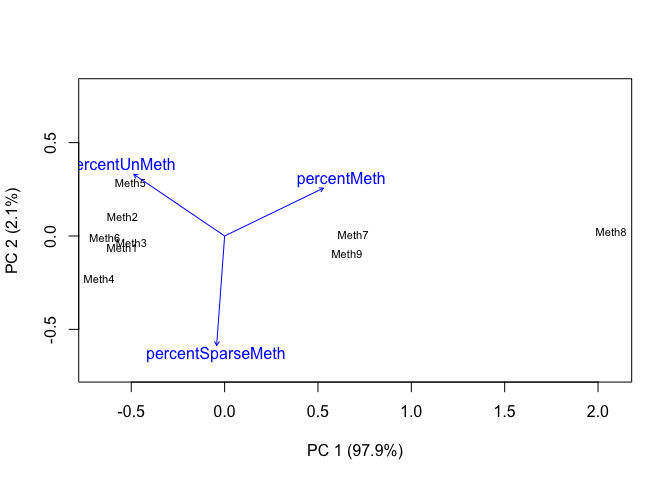

Chacterizing CpG Methylation (5x Individual Samples)
================

In this script, I’ll create summary tables and figures to characterize
CpG methylation in *M. capitata* and *P. acuta* using WGBS, RRBS, and
MBD-BSSeq. I used individual samples with data for 5x CpGs in [this
Jupyter
notebook](https://github.com/hputnam/Meth_Compare/blob/master/scripts/Characterizing-CpG-Methylation-5x.ipynb)
to identify methylation status and genomic location. I will use the
output in this script.

# Set up R Markdown Document

# Install packages

``` r
#install.packages("RColorBrewer") #Use for color palletes
#install.packages("dichromat") #Discern color blind accessibility of figures
#install.packages("compositions") #Compositional data analysis package
#install.packages("vegan") #Multivariate analysis package
#install.packages("cluster") #Multivariate analysis package
#install.packages("glmmTMB") #Linear modeling package
```

``` r
require(RColorBrewer) 
```

    ## Loading required package: RColorBrewer

``` r
require(dichromat)
```

    ## Loading required package: dichromat

``` r
require(compositions)
```

    ## Loading required package: compositions

    ## Loading required package: tensorA

    ## 
    ## Attaching package: 'tensorA'

    ## The following object is masked from 'package:base':
    ## 
    ##     norm

    ## Loading required package: robustbase

    ## Loading required package: bayesm

    ## Welcome to compositions, a package for compositional data analysis.
    ## Find an intro with "? compositions"

    ## 
    ## Attaching package: 'compositions'

    ## The following objects are masked from 'package:stats':
    ## 
    ##     cor, cov, dist, var

    ## The following objects are masked from 'package:base':
    ## 
    ##     %*%, scale, scale.default

``` r
require(vegan)
```

    ## Loading required package: vegan

    ## Loading required package: permute

    ## Loading required package: lattice

    ## This is vegan 2.5-6

``` r
require(cluster)
```

    ## Loading required package: cluster

``` r
require(glmmTMB)
```

    ## Loading required package: glmmTMB

``` r
source("biostats.R") #Multivariate analysis source script
```

# Session information

``` r
sessionInfo()
```

    ## R version 4.0.0 (2020-04-24)
    ## Platform: x86_64-apple-darwin17.0 (64-bit)
    ## Running under: macOS Catalina 10.15.5
    ## 
    ## Matrix products: default
    ## BLAS:   /Library/Frameworks/R.framework/Versions/4.0/Resources/lib/libRblas.dylib
    ## LAPACK: /Library/Frameworks/R.framework/Versions/4.0/Resources/lib/libRlapack.dylib
    ## 
    ## locale:
    ## [1] en_US.UTF-8/en_US.UTF-8/en_US.UTF-8/C/en_US.UTF-8/en_US.UTF-8
    ## 
    ## attached base packages:
    ## [1] stats     graphics  grDevices utils     datasets  methods   base     
    ## 
    ## other attached packages:
    ##  [1] glmmTMB_1.0.1       cluster_2.1.0       vegan_2.5-6        
    ##  [4] lattice_0.20-41     permute_0.9-5       compositions_1.40-5
    ##  [7] bayesm_3.1-4        robustbase_0.93-6   tensorA_0.36.1     
    ## [10] dichromat_2.0-0     RColorBrewer_1.1-2 
    ## 
    ## loaded via a namespace (and not attached):
    ##  [1] Rcpp_1.0.4.6    TMB_1.7.16      knitr_1.28      magrittr_1.5   
    ##  [5] splines_4.0.0   MASS_7.3-51.6   statmod_1.4.34  rlang_0.4.6    
    ##  [9] minqa_1.2.4     stringr_1.4.0   tools_4.0.0     parallel_4.0.0 
    ## [13] grid_4.0.0      nlme_3.1-147    mgcv_1.8-31     xfun_0.13      
    ## [17] htmltools_0.4.0 lme4_1.1-23     yaml_2.2.1      digest_0.6.25  
    ## [21] Matrix_1.2-18   nloptr_1.2.2.1  evaluate_0.14   rmarkdown_2.1  
    ## [25] stringi_1.4.6   compiler_4.0.0  DEoptimR_1.0-8  boot_1.3-25

# CpG distribution

## Mcap

### Import file counts

``` r
McapAll <- read.table("../analyses/Characterizing-CpG-Methylation-5x/Mcap/Mcap-5x-bedgraph-counts.txt", header = FALSE, col.names = c("totalLines", "filename")) #Import file using space as a delimiter. Columns are the number of lines and the filename
McapAll <- McapAll[-10,] #Remove last row (total lines for all files)
tail(McapAll) #Confirm import
```

    ##   totalLines                                        filename
    ## 4    3173254 Meth13_R1_001_val_1_bismark_bt2_pe._5x.bedgraph
    ## 5    2648697 Meth14_R1_001_val_1_bismark_bt2_pe._5x.bedgraph
    ## 6    3176517 Meth15_R1_001_val_1_bismark_bt2_pe._5x.bedgraph
    ## 7     583599 Meth16_R1_001_val_1_bismark_bt2_pe._5x.bedgraph
    ## 8     242390 Meth17_R1_001_val_1_bismark_bt2_pe._5x.bedgraph
    ## 9     153392 Meth18_R1_001_val_1_bismark_bt2_pe._5x.bedgraph

``` r
McapMeth <- read.table("../analyses/Characterizing-CpG-Methylation-5x/Mcap/Mcap-5x-Meth-counts.txt", header = FALSE, col.names = c("Meth", "filename")) #Import file using space as a delimiter. Columns are the number of lines and the filename
McapMeth <- McapMeth[-10,] #Remove last row (total lines for all files)
tail(McapMeth) #Confirm import
```

    ##     Meth                                             filename
    ## 4 257741 Meth13_R1_001_val_1_bismark_bt2_pe._5x.bedgraph-Meth
    ## 5 184742 Meth14_R1_001_val_1_bismark_bt2_pe._5x.bedgraph-Meth
    ## 6 231347 Meth15_R1_001_val_1_bismark_bt2_pe._5x.bedgraph-Meth
    ## 7 106695 Meth16_R1_001_val_1_bismark_bt2_pe._5x.bedgraph-Meth
    ## 8  45506 Meth17_R1_001_val_1_bismark_bt2_pe._5x.bedgraph-Meth
    ## 9  29468 Meth18_R1_001_val_1_bismark_bt2_pe._5x.bedgraph-Meth

``` r
McapSparseMeth <- read.table("../analyses/Characterizing-CpG-Methylation-5x/Mcap/Mcap-5x-sparseMeth-counts.txt", header = FALSE, col.names = c("sparseMeth", "filename")) #Import file using space as a delimiter. Columns are the number of lines and the filename
McapSparseMeth <- McapSparseMeth[-10,] #Remove last row (total lines for all files)
tail(McapSparseMeth) #Confirm import
```

    ##   sparseMeth                                                   filename
    ## 4     152042 Meth13_R1_001_val_1_bismark_bt2_pe._5x.bedgraph-sparseMeth
    ## 5     135052 Meth14_R1_001_val_1_bismark_bt2_pe._5x.bedgraph-sparseMeth
    ## 6     179454 Meth15_R1_001_val_1_bismark_bt2_pe._5x.bedgraph-sparseMeth
    ## 7      74839 Meth16_R1_001_val_1_bismark_bt2_pe._5x.bedgraph-sparseMeth
    ## 8      28850 Meth17_R1_001_val_1_bismark_bt2_pe._5x.bedgraph-sparseMeth
    ## 9      16793 Meth18_R1_001_val_1_bismark_bt2_pe._5x.bedgraph-sparseMeth

``` r
McapUnMeth <- read.table("../analyses/Characterizing-CpG-Methylation-5x/Mcap/Mcap-5x-unMeth-counts.txt", header = FALSE, col.names = c("unMeth", "filename")) #Import file using space as a delimiter. Columns are the number of lines and the filename
McapUnMeth <- McapUnMeth[-10,] #Remove last row (total lines for all files)
tail(McapUnMeth) #Confirm import
```

    ##    unMeth                                               filename
    ## 4 2763471 Meth13_R1_001_val_1_bismark_bt2_pe._5x.bedgraph-unMeth
    ## 5 2328903 Meth14_R1_001_val_1_bismark_bt2_pe._5x.bedgraph-unMeth
    ## 6 2765716 Meth15_R1_001_val_1_bismark_bt2_pe._5x.bedgraph-unMeth
    ## 7  402065 Meth16_R1_001_val_1_bismark_bt2_pe._5x.bedgraph-unMeth
    ## 8  168034 Meth17_R1_001_val_1_bismark_bt2_pe._5x.bedgraph-unMeth
    ## 9  107131 Meth18_R1_001_val_1_bismark_bt2_pe._5x.bedgraph-unMeth

### Create summary table

``` r
McapCpGType <- cbind(McapAll, McapMeth, McapSparseMeth, McapUnMeth) #Mash tables together by column
rownames(McapCpGType) <- substr(McapAll$filename, start = 1, stop = 6) #Use the first 6 characters of the filename to add sample ID as row names
McapCpGType <- McapCpGType[,-c(2,4,6,8)] #Remove filename columns
tail(McapCpGType) #Confirm table mashing
```

    ##        totalLines   Meth sparseMeth  unMeth
    ## Meth13    3173254 257741     152042 2763471
    ## Meth14    2648697 184742     135052 2328903
    ## Meth15    3176517 231347     179454 2765716
    ## Meth16     583599 106695      74839  402065
    ## Meth17     242390  45506      28850  168034
    ## Meth18     153392  29468      16793  107131

``` r
McapCpGType$percentMeth <- (McapCpGType$Meth / McapCpGType$totalLines) * 100 #Calculate percent methylated loci
McapCpGType$percentSparseMeth <- (McapCpGType$sparseMeth / McapCpGType$totalLines) * 100 #Calculate percent sparsely methylated loci
McapCpGType$percentUnMeth <- (McapCpGType$unMeth / McapCpGType$totalLines) * 100 #Calculate percent unmethylated loci
McapCpGType <- McapCpGType[,c(1, 2, 5, 3, 6, 4, 7)] #Reorganize columns
tail(McapCpGType) #Confirm calculations
```

    ##        totalLines   Meth percentMeth sparseMeth percentSparseMeth  unMeth
    ## Meth13    3173254 257741    8.122293     152042          4.791359 2763471
    ## Meth14    2648697 184742    6.974826     135052          5.098809 2328903
    ## Meth15    3176517 231347    7.283040     179454          5.649395 2765716
    ## Meth16     583599 106695   18.282245      74839         12.823703  402065
    ## Meth17     242390  45506   18.773877      28850         11.902306  168034
    ## Meth18     153392  29468   19.210911      16793         10.947768  107131
    ##        percentUnMeth
    ## Meth13      87.08635
    ## Meth14      87.92637
    ## Meth15      87.06756
    ## Meth16      68.89405
    ## Meth17      69.32382
    ## Meth18      69.84132

``` r
write.table(McapCpGType, "../analyses/Characterizing-CpG-Methylation-5x/Mcap/Mcap-CpG-Type.txt", sep = "\t", quote = FALSE, row.names = TRUE) #Save summary table
```

### Reorganize data

``` r
McapCpGTypePercents <- McapCpGType[,c(3,5,7)] #Keep only columns with % total CpG information
head(McapCpGTypePercents) #Check reorganization
```

    ##        percentMeth percentSparseMeth percentUnMeth
    ## Meth10    9.856784         11.984981      78.15823
    ## Meth11   11.345650         11.107605      77.54674
    ## Meth12   12.055734         11.378198      76.56607
    ## Meth13    8.122293          4.791359      87.08635
    ## Meth14    6.974826          5.098809      87.92637
    ## Meth15    7.283040          5.649395      87.06756

``` r
#Create test plots

barplot(t(McapCpGTypePercents[1,]), beside = TRUE, ylim = c(0,100), names.arg = c(expression("High (">="50%)"), "Moderate (10-50%)", expression("Weak ("<="10%)")), axes = FALSE) #Sample 1, WGBS
axis(side = 2, at = seq(0, 100, by = 25), las = 2, col = "grey80")
```

<!-- -->

``` r
barplot(t(McapCpGTypePercents[4,]), beside = TRUE, ylim = c(0,100), names.arg = c(expression("High (">="50%)"), "Moderate (10-50%)", expression("Weak ("<="10%)")), axes = FALSE) #Sample 1, RRBS
axis(side = 2, at = seq(0, 100, by = 25), las = 2, col = "grey80")
```

<!-- -->

``` r
barplot(t(McapCpGTypePercents[7,]), beside = TRUE, ylim = c(0,100), names.arg = c(expression("High (">="50%)"), "Moderate (10-50%)", expression("Weak ("<="10%)")), axes = FALSE) #Sample 1, MBD-BSSeq
axis(side = 2, at = seq(0, 100, by = 25), las = 2, col = "grey80")
```

<!-- -->

### Create multipanel figure with all samples

``` r
#pdf("../analyses/Characterizing-CpG-Methylation-5x/Mcap/Mcap-CpG-Type.pdf", height = 8.5, width = 11) #Save file as pdf

par(mfcol = c(3,3), mar = c(2, 2, 2, 0), oma = c(5, 5, 2, 0)) #Fill in multipanel plot by column and adjust inner and outer margins

barplot(t(McapCpGTypePercents[1,]), beside = TRUE, ylim = c(0,100), names.arg = FALSE, axes = FALSE) #Sample 1, WGBS
axis(side = 2, at = seq(0, 100, by = 25), las = 2, col = "grey80", cex.axis = 1.3) #Add y-axis
mtext(side = 3, "WBGS", adj = 0, line = 1) #Add sequencing information

barplot(t(McapCpGTypePercents[4,]), beside = TRUE, ylim = c(0,100), names.arg = FALSE, axes = FALSE) #Sample 1, RRBS
mtext(side = 3, "RRBS", adj = 0, line = 1) #Add sequencing information
axis(side = 2, at = seq(0, 100, by = 25), las = 2, col = "grey80", cex.axis = 1.3) #Add y-axis
mtext(side = 2, outer = TRUE, "% 5x CpG with Data", cex = 1.5, line = 2) #Add y-axis label

barplot(t(McapCpGTypePercents[7,]), beside = TRUE, ylim = c(0,100), names.arg = c(expression("">= "50%"), "10-50%", "< 10%"), cex.names = 1.3, axes = FALSE) #Sample 1, MBD-BSSeq
mtext(side = 3, "MBD-BSSeq", adj = 0, line = 1) #Add sequencing information
axis(side = 2, at = seq(0, 100, by = 25), las = 2, col = "grey80", cex.axis = 1.3) #Add y-axis

barplot(t(McapCpGTypePercents[2,]), beside = TRUE, ylim = c(0,100), names.arg = FALSE, axes = FALSE) #Sample 2, WGBS
barplot(t(McapCpGTypePercents[5,]), beside = TRUE, ylim = c(0,100), names.arg = FALSE, axes = FALSE) #Sample 2, RRBS
barplot(t(McapCpGTypePercents[8,]), beside = TRUE, ylim = c(0,100), names.arg = c(expression("">= "50%"), "10-50%", "< 10%"), cex.names = 1.3, axes = FALSE) #Sample 2, MBD-BSSeq
mtext(side = 1, outer = TRUE, "% Methylation", cex = 1.5, line = 2) #Add x-axis label

barplot(t(McapCpGTypePercents[3,]), beside = TRUE, ylim = c(0,100), names.arg = FALSE, axes = FALSE) #Sample 3, WGBS
barplot(t(McapCpGTypePercents[6,]), beside = TRUE, ylim = c(0,100), names.arg = FALSE, axes = FALSE) #Sample 3, RRBS
barplot(t(McapCpGTypePercents[9,]), beside = TRUE, ylim = c(0,100), names.arg = c(expression("">= "50%"), "10-50%", "< 10%"), cex.names = 1.3, axes = FALSE) #Sample 3, MBD-BSSeq
```

<!-- -->

``` r
#dev.off() #Turn off plotting device
```

## Pact

### Import file counts

``` r
PactAll <- read.table("../analyses/Characterizing-CpG-Methylation-5x/Pact/Pact-5x-bedgraph-counts.txt", header = FALSE, col.names = c("totalLines", "filename")) #Import file using space as a delimiter. Columns are the number of lines and the filename
PactAll <- PactAll[-10,] #Remove last row (total lines for all files)
tail(PactAll) #Confirm import
```

    ##   totalLines                                       filename
    ## 4    1835561 Meth4_R1_001_val_1_bismark_bt2_pe._5x.bedgraph
    ## 5    1451229 Meth5_R1_001_val_1_bismark_bt2_pe._5x.bedgraph
    ## 6    1517358 Meth6_R1_001_val_1_bismark_bt2_pe._5x.bedgraph
    ## 7    2640625 Meth7_R1_001_val_1_bismark_bt2_pe._5x.bedgraph
    ## 8     539008 Meth8_R1_001_val_1_bismark_bt2_pe._5x.bedgraph
    ## 9    2732607 Meth9_R1_001_val_1_bismark_bt2_pe._5x.bedgraph

``` r
PactMeth <- read.table("../analyses/Characterizing-CpG-Methylation-5x/Pact/Pact-5x-Meth-counts.txt", header = FALSE, col.names = c("Meth", "filename")) #Import file using space as a delimiter. Columns are the number of lines and the filename
PactMeth <- PactMeth[-10,] #Remove last row (total lines for all files)
tail(PactMeth) #Confirm import
```

    ##     Meth                                            filename
    ## 4  31047 Meth4_R1_001_val_1_bismark_bt2_pe._5x.bedgraph-Meth
    ## 5  30345 Meth5_R1_001_val_1_bismark_bt2_pe._5x.bedgraph-Meth
    ## 6  26617 Meth6_R1_001_val_1_bismark_bt2_pe._5x.bedgraph-Meth
    ## 7 258222 Meth7_R1_001_val_1_bismark_bt2_pe._5x.bedgraph-Meth
    ## 8 213342 Meth8_R1_001_val_1_bismark_bt2_pe._5x.bedgraph-Meth
    ## 9 255370 Meth9_R1_001_val_1_bismark_bt2_pe._5x.bedgraph-Meth

``` r
PactSparseMeth <- read.table("../analyses/Characterizing-CpG-Methylation-5x/Pact/Pact-5x-sparseMeth-counts.txt", header = FALSE, col.names = c("sparseMeth", "filename")) #Import file using space as a delimiter. Columns are the number of lines and the filename
PactSparseMeth <- PactSparseMeth[-10,] #Remove last row (total lines for all files)
tail(PactSparseMeth) #Confirm import
```

    ##   sparseMeth                                                  filename
    ## 4     137700 Meth4_R1_001_val_1_bismark_bt2_pe._5x.bedgraph-sparseMeth
    ## 5      64837 Meth5_R1_001_val_1_bismark_bt2_pe._5x.bedgraph-sparseMeth
    ## 6      89246 Meth6_R1_001_val_1_bismark_bt2_pe._5x.bedgraph-sparseMeth
    ## 7     296059 Meth7_R1_001_val_1_bismark_bt2_pe._5x.bedgraph-sparseMeth
    ## 8      80086 Meth8_R1_001_val_1_bismark_bt2_pe._5x.bedgraph-sparseMeth
    ## 9     337855 Meth9_R1_001_val_1_bismark_bt2_pe._5x.bedgraph-sparseMeth

``` r
PactUnMeth <- read.table("../analyses/Characterizing-CpG-Methylation-5x/Pact/Pact-5x-unMeth-counts.txt", header = FALSE, col.names = c("unMeth", "filename")) #Import file using space as a delimiter. Columns are the number of lines and the filename
PactUnMeth <- PactUnMeth[-10,] #Remove last row (total lines for all files)
tail(PactUnMeth) #Confirm import
```

    ##    unMeth                                              filename
    ## 4 1666814 Meth4_R1_001_val_1_bismark_bt2_pe._5x.bedgraph-unMeth
    ## 5 1356047 Meth5_R1_001_val_1_bismark_bt2_pe._5x.bedgraph-unMeth
    ## 6 1401495 Meth6_R1_001_val_1_bismark_bt2_pe._5x.bedgraph-unMeth
    ## 7 2086344 Meth7_R1_001_val_1_bismark_bt2_pe._5x.bedgraph-unMeth
    ## 8  245580 Meth8_R1_001_val_1_bismark_bt2_pe._5x.bedgraph-unMeth
    ## 9 2139382 Meth9_R1_001_val_1_bismark_bt2_pe._5x.bedgraph-unMeth

### Create summary table

``` r
PactCpGType <- cbind(PactAll, PactMeth, PactSparseMeth, PactUnMeth) #Mash tables together by column
rownames(PactCpGType) <- substr(PactAll$filename, start = 1, stop = 5) #Use the first 5 characters of the filename to add sample ID to row names
PactCpGType <- PactCpGType[,-c(2,4,6,8)] #Remove filename columns
tail(PactCpGType) #Confirm table mashing
```

    ##       totalLines   Meth sparseMeth  unMeth
    ## Meth4    1835561  31047     137700 1666814
    ## Meth5    1451229  30345      64837 1356047
    ## Meth6    1517358  26617      89246 1401495
    ## Meth7    2640625 258222     296059 2086344
    ## Meth8     539008 213342      80086  245580
    ## Meth9    2732607 255370     337855 2139382

``` r
PactCpGType$percentMeth <- (PactCpGType$Meth / PactCpGType$totalLines) * 100 #Calculate percent methylated loci
PactCpGType$percentSparseMeth <- (PactCpGType$sparseMeth / PactCpGType$totalLines) * 100 #Calculate percent sparsely methylated loci
PactCpGType$percentUnMeth <- (PactCpGType$unMeth / PactCpGType$totalLines) * 100 #Calculate percent unmethylated loci
PactCpGType <- PactCpGType[,c(1, 2, 5, 3, 6, 4, 7)] #Reorganize columns
tail(PactCpGType) #Confirm calculations
```

    ##       totalLines   Meth percentMeth sparseMeth percentSparseMeth  unMeth
    ## Meth4    1835561  31047    1.691418     137700          7.501794 1666814
    ## Meth5    1451229  30345    2.090986      64837          4.467730 1356047
    ## Meth6    1517358  26617    1.754167      89246          5.881671 1401495
    ## Meth7    2640625 258222    9.778821     296059         11.211702 2086344
    ## Meth8     539008 213342   39.580489      80086         14.858036  245580
    ## Meth9    2732607 255370    9.345288     337855         12.363834 2139382
    ##       percentUnMeth
    ## Meth4      90.80679
    ## Meth5      93.44128
    ## Meth6      92.36416
    ## Meth7      79.00948
    ## Meth8      45.56148
    ## Meth9      78.29088

``` r
write.table(PactCpGType, "../analyses/Characterizing-CpG-Methylation-5x/Pact/Pact-CpG-Type.txt", sep = "\t", quote = FALSE, row.names = TRUE) #Save summary table
```

``` r
PactCpGType <- read.delim("../analyses/Characterizing-CpG-Methylation-5x/Pact/Pact-CpG-Type.txt", sep = "\t", header = TRUE) #Import summary table
head(PactCpGType) #Check import
```

    ##       totalLines   Meth percentMeth sparseMeth percentSparseMeth  unMeth
    ## Meth1    5546051 110364    1.989956     367019          6.617664 5068668
    ## Meth2    6358722 126440    1.988450     345887          5.439568 5886395
    ## Meth3    5866786 124819    2.127553     385346          6.568264 5356621
    ## Meth4    1835561  31047    1.691418     137700          7.501794 1666814
    ## Meth5    1451229  30345    2.090986      64837          4.467730 1356047
    ## Meth6    1517358  26617    1.754167      89246          5.881671 1401495
    ##       percentUnMeth
    ## Meth1      91.39238
    ## Meth2      92.57198
    ## Meth3      91.30418
    ## Meth4      90.80679
    ## Meth5      93.44128
    ## Meth6      92.36416

### Reorganize data

``` r
PactCpGTypePercents <- PactCpGType[,c(3,5,7)] #Keep only columns with % total CpG information
tail(PactCpGTypePercents) #Check reorganization
```

    ##       percentMeth percentSparseMeth percentUnMeth
    ## Meth4    1.691418          7.501794      90.80679
    ## Meth5    2.090986          4.467730      93.44128
    ## Meth6    1.754167          5.881671      92.36416
    ## Meth7    9.778821         11.211702      79.00948
    ## Meth8   39.580489         14.858036      45.56148
    ## Meth9    9.345288         12.363834      78.29088

``` r
#Create test plots

barplot(t(PactCpGTypePercents[1,]), beside = TRUE, ylim = c(0,100), names.arg = c(expression("High (">="50%)"), "Moderate (10-50%)", expression("Weak ("<="10%)")), axes = FALSE) #Sample 1, WGBS
axis(side = 2, at = seq(0, 100, by = 25), las = 2, col = "grey80")
```

<!-- -->

``` r
barplot(t(PactCpGTypePercents[4,]), beside = TRUE, ylim = c(0,100), names.arg = c(expression("High (">="50%)"), "Moderate (10-50%)", expression("Weak ("<="10%)")), axes = FALSE) #Sample 1, RRBS
axis(side = 2, at = seq(0, 100, by = 25), las = 2, col = "grey80")
```

<!-- -->

``` r
barplot(t(PactCpGTypePercents[7,]), beside = TRUE, ylim = c(0,100), names.arg = c(expression("High (">="50%)"), "Moderate (10-50%)", expression("Weak ("<="10%)")), axes = FALSE) #Sample 1, MBD-BSSeqc(expression("High (">="50%)"), "Moderate (10-50%)", expression("Weak ("<="10%)"))
axis(side = 2, at = seq(0, 100, by = 25), las = 2, col = "grey80")
```

<!-- -->

### Create multipanel figure with all samples

``` r
#pdf("../analyses/Characterizing-CpG-Methylation-5x/Pact/Pact-CpG-Type.pdf", height = 8.5, width = 11) #Save file as pdf

par(mfcol = c(3,3), mar = c(2, 2, 2, 0), oma = c(5, 5, 2, 0)) #Fill in multipanel plot by column and adjust inner and outer margins

barplot(t(PactCpGTypePercents[1,]), beside = TRUE, ylim = c(0,100), names.arg = FALSE, axes = FALSE) #Sample 1, WGBS
mtext(side = 3, "WBGS", adj = 0, line = 1) #Add sequencing information
axis(side = 2, at = seq(0, 100, by = 25), las = 2, col = "grey80", cex.axis = 1.3) #Add y-axis

barplot(t(PactCpGTypePercents[4,]), beside = TRUE, ylim = c(0,100), names.arg = FALSE, axes = FALSE) #Sample 1, RRBS
mtext(side = 3, "RRBS", adj = 0, line = 1) #Add sequencing information
axis(side = 2, at = seq(0, 100, by = 25), las = 2, col = "grey80", cex.axis = 1.3) #Add y-axis
mtext(side = 2, outer = TRUE, "% 5x CpG with Data", cex = 1.5, line = 2) #Add y-axis label

barplot(t(PactCpGTypePercents[7,]), beside = TRUE, ylim = c(0,100), names.arg = c(expression("">= "50%"), "10-50%", "< 10%"), cex.names = 1.3, axes = FALSE) #Sample 1, MBD-BSSeq
mtext(side = 3, "MBD-BSSeq", adj = 0, line = 1) #Add sequencing information
axis(side = 2, at = seq(0, 100, by = 25), las = 2, col = "grey80", cex.axis = 1.3) #Add y-axis

barplot(t(PactCpGTypePercents[2,]), beside = TRUE, ylim = c(0,100), names.arg = FALSE, axes = FALSE) #Sample 2, WGBS
barplot(t(PactCpGTypePercents[5,]), beside = TRUE, ylim = c(0,100), names.arg = FALSE, axes = FALSE) #Sample 2, RRBS
barplot(t(PactCpGTypePercents[8,]), beside = TRUE, ylim = c(0,100), names.arg = c(expression("">= "50%"), "10-50%", "< 10%"), cex.names = 1.3, axes = FALSE) #Sample 2, MBD-BSSeq
mtext(side = 1, outer = TRUE, "% Methylation", cex = 1.5, line = 2) #Add x-axis label

barplot(t(PactCpGTypePercents[3,]), beside = TRUE, ylim = c(0,100), names.arg = FALSE, axes = FALSE) #Sample 3, WGBS
barplot(t(PactCpGTypePercents[6,]), beside = TRUE, ylim = c(0,100), names.arg = FALSE, axes = FALSE) #Sample 3, RRBS
barplot(t(PactCpGTypePercents[9,]), beside = TRUE, ylim = c(0,100), names.arg = c(expression("">= "50%"), "10-50%", "< 10%"), cex.names = 1.3, axes = FALSE) #Sample 3, MBD-BSSeq
```

<!-- -->

``` r
#dev.off() #Turn off plotting device
```

# CpG overlaps

## Mcap

### Import file counts

``` r
McapGenomeFeatures <- read.table("../analyses/Characterizing-CpG-Methylation-5x/Mcap/Mcap-CGMotif-Overlaps-counts.txt", header = FALSE, col.names = c("counts", "filename")) #Import file with CG motif and feature track overlaps
McapGenomeFeatures <- McapGenomeFeatures[-8,] #Remove final row
tail(McapGenomeFeatures) #Check import
```

    ##     counts                                    filename
    ## 2  1365975 Mcap-CGMotif-Flanks-Downstream-Overlaps.txt
    ## 3  2758953            Mcap-CGMotif-Flanks-Overlaps.txt
    ## 4  1505544   Mcap-CGMotif-Flanks-Upstream-Overlaps.txt
    ## 5  9450564              Mcap-CGMotif-Gene-Overlaps.txt
    ## 6 16468305        Mcap-CGMotif-Intergenic-Overlaps.txt
    ## 7  7503314            Mcap-CGMotif-Intron-Overlaps.txt

``` r
McapGeneOverlaps <- read.table("../analyses/Characterizing-CpG-Methylation-5x/Mcap/Mcap-5x-mcGenes-counts.txt", header = FALSE, col.names = c("counts", "filename")) #Import file with all file-gene overlaps
McapGeneOverlaps <- McapGeneOverlaps[-37,] #Remove final row
tail(McapGeneOverlaps) #Confirm import
```

    ##    counts
    ## 31  53620
    ## 32  83519
    ## 33  12960
    ## 34   4843
    ## 35  32499
    ## 36  50302
    ##                                                                  filename
    ## 31     Meth17_R1_001_val_1_bismark_bt2_pe._5x.bedgraph-unMeth.bed-mcGenes
    ## 32            Meth17_R1_001_val_1_bismark_bt2_pe._5x.bedgraph.bed-mcGenes
    ## 33       Meth18_R1_001_val_1_bismark_bt2_pe._5x.bedgraph-Meth.bed-mcGenes
    ## 34 Meth18_R1_001_val_1_bismark_bt2_pe._5x.bedgraph-sparseMeth.bed-mcGenes
    ## 35     Meth18_R1_001_val_1_bismark_bt2_pe._5x.bedgraph-unMeth.bed-mcGenes
    ## 36            Meth18_R1_001_val_1_bismark_bt2_pe._5x.bedgraph.bed-mcGenes

``` r
McapCDSOverlaps <- read.table("../analyses/Characterizing-CpG-Methylation-5x/Mcap/Mcap-5x-mcCDS-counts.txt", header = FALSE, col.names = c("counts", "filename")) #Import file with all file-CDS overlaps
McapCDSOverlaps <- McapCDSOverlaps[-37,] #Remove final row
tail(McapCDSOverlaps) #Confirm import
```

    ##    counts                                                             filename
    ## 31  19966     Meth17_R1_001_val_1_bismark_bt2_pe._5x.bedgraph-unMeth.bed-mcCDS
    ## 32  29305            Meth17_R1_001_val_1_bismark_bt2_pe._5x.bedgraph.bed-mcCDS
    ## 33   3992       Meth18_R1_001_val_1_bismark_bt2_pe._5x.bedgraph-Meth.bed-mcCDS
    ## 34   1907 Meth18_R1_001_val_1_bismark_bt2_pe._5x.bedgraph-sparseMeth.bed-mcCDS
    ## 35  11720     Meth18_R1_001_val_1_bismark_bt2_pe._5x.bedgraph-unMeth.bed-mcCDS
    ## 36  17619            Meth18_R1_001_val_1_bismark_bt2_pe._5x.bedgraph.bed-mcCDS

``` r
McapIntronsOverlaps <- read.table("../analyses/Characterizing-CpG-Methylation-5x/Mcap/Mcap-5x-mcIntrons-counts.txt", header = FALSE, col.names = c("counts", "filename")) #Import file with all file-Introns overlaps
McapIntronsOverlaps <- McapIntronsOverlaps[-37,] #Remove final row
tail(McapIntronsOverlaps) #Confirm import
```

    ##    counts
    ## 31  33699
    ## 32  54275
    ## 33   8973
    ## 34   2942
    ## 35  20802
    ## 36  32717
    ##                                                                    filename
    ## 31     Meth17_R1_001_val_1_bismark_bt2_pe._5x.bedgraph-unMeth.bed-mcIntrons
    ## 32            Meth17_R1_001_val_1_bismark_bt2_pe._5x.bedgraph.bed-mcIntrons
    ## 33       Meth18_R1_001_val_1_bismark_bt2_pe._5x.bedgraph-Meth.bed-mcIntrons
    ## 34 Meth18_R1_001_val_1_bismark_bt2_pe._5x.bedgraph-sparseMeth.bed-mcIntrons
    ## 35     Meth18_R1_001_val_1_bismark_bt2_pe._5x.bedgraph-unMeth.bed-mcIntrons
    ## 36            Meth18_R1_001_val_1_bismark_bt2_pe._5x.bedgraph.bed-mcIntrons

``` r
McapFlanksOverlaps <- read.table("../analyses/Characterizing-CpG-Methylation-5x/Mcap/Mcap-5x-mcFlanks-counts.txt", header = FALSE, col.names = c("counts", "filename")) #Import file with all file-flank overlaps
McapFlanksOverlaps <- McapFlanksOverlaps[-37,] #Remove final row
tail(McapFlanksOverlaps) #Confirm import
```

    ##    counts
    ## 31  15099
    ## 32  22627
    ## 33   3326
    ## 34   1541
    ## 35   9460
    ## 36  14327
    ##                                                                   filename
    ## 31     Meth17_R1_001_val_1_bismark_bt2_pe._5x.bedgraph-unMeth.bed-mcFlanks
    ## 32            Meth17_R1_001_val_1_bismark_bt2_pe._5x.bedgraph.bed-mcFlanks
    ## 33       Meth18_R1_001_val_1_bismark_bt2_pe._5x.bedgraph-Meth.bed-mcFlanks
    ## 34 Meth18_R1_001_val_1_bismark_bt2_pe._5x.bedgraph-sparseMeth.bed-mcFlanks
    ## 35     Meth18_R1_001_val_1_bismark_bt2_pe._5x.bedgraph-unMeth.bed-mcFlanks
    ## 36            Meth18_R1_001_val_1_bismark_bt2_pe._5x.bedgraph.bed-mcFlanks

``` r
McapFlanksUpstreamOverlaps <- read.table("../analyses/Characterizing-CpG-Methylation-5x/Mcap/Mcap-5x-mcFlanksUpstream-counts.txt", header = FALSE, col.names = c("counts", "filename")) #Import file with all file-upstream flank overlaps
McapFlanksUpstreamOverlaps <- McapFlanksUpstreamOverlaps[-37,] #Remove final row
tail(McapFlanksUpstreamOverlaps) #Confirm import
```

    ##    counts
    ## 31   8579
    ## 32  12941
    ## 33   1877
    ## 34    910
    ## 35   5300
    ## 36   8087
    ##                                                                           filename
    ## 31     Meth17_R1_001_val_1_bismark_bt2_pe._5x.bedgraph-unMeth.bed-mcFlanksUpstream
    ## 32            Meth17_R1_001_val_1_bismark_bt2_pe._5x.bedgraph.bed-mcFlanksUpstream
    ## 33       Meth18_R1_001_val_1_bismark_bt2_pe._5x.bedgraph-Meth.bed-mcFlanksUpstream
    ## 34 Meth18_R1_001_val_1_bismark_bt2_pe._5x.bedgraph-sparseMeth.bed-mcFlanksUpstream
    ## 35     Meth18_R1_001_val_1_bismark_bt2_pe._5x.bedgraph-unMeth.bed-mcFlanksUpstream
    ## 36            Meth18_R1_001_val_1_bismark_bt2_pe._5x.bedgraph.bed-mcFlanksUpstream

``` r
McapFlanksDownstreamOverlaps <- read.table("../analyses/Characterizing-CpG-Methylation-5x/Mcap/Mcap-5x-mcFlanksDownstream-counts.txt", header = FALSE, col.names = c("counts", "filename")) #Import file with all file-Introns overlaps
McapFlanksUpstreamOverlaps <- McapFlanksUpstreamOverlaps[-37,] #Remove final row
tail(McapFlanksDownstreamOverlaps) #Confirm import
```

    ##     counts
    ## 32   11115
    ## 33    1829
    ## 34     734
    ## 35    4550
    ## 36    7113
    ## 37 2705424
    ##                                                                             filename
    ## 32            Meth17_R1_001_val_1_bismark_bt2_pe._5x.bedgraph.bed-mcFlanksDownstream
    ## 33       Meth18_R1_001_val_1_bismark_bt2_pe._5x.bedgraph-Meth.bed-mcFlanksDownstream
    ## 34 Meth18_R1_001_val_1_bismark_bt2_pe._5x.bedgraph-sparseMeth.bed-mcFlanksDownstream
    ## 35     Meth18_R1_001_val_1_bismark_bt2_pe._5x.bedgraph-unMeth.bed-mcFlanksDownstream
    ## 36            Meth18_R1_001_val_1_bismark_bt2_pe._5x.bedgraph.bed-mcFlanksDownstream
    ## 37                                                                             total

``` r
McapIntergenicOverlaps <- read.table("../analyses/Characterizing-CpG-Methylation-5x/Mcap/Mcap-5x-mcIntergenic-counts.txt", header = FALSE, col.names = c("counts", "filename")) #Import file with all file-Intergenic overlaps
McapIntergenicOverlaps <- McapIntergenicOverlaps[-37,] #Remove final row
tail(McapIntergenicOverlaps) #Confirm import
```

    ##    counts
    ## 31  99332
    ## 32 136268
    ## 33  13186
    ## 34  10410
    ## 35  65177
    ## 36  88773
    ##                                                                       filename
    ## 31     Meth17_R1_001_val_1_bismark_bt2_pe._5x.bedgraph-unMeth.bed-mcIntergenic
    ## 32            Meth17_R1_001_val_1_bismark_bt2_pe._5x.bedgraph.bed-mcIntergenic
    ## 33       Meth18_R1_001_val_1_bismark_bt2_pe._5x.bedgraph-Meth.bed-mcIntergenic
    ## 34 Meth18_R1_001_val_1_bismark_bt2_pe._5x.bedgraph-sparseMeth.bed-mcIntergenic
    ## 35     Meth18_R1_001_val_1_bismark_bt2_pe._5x.bedgraph-unMeth.bed-mcIntergenic
    ## 36            Meth18_R1_001_val_1_bismark_bt2_pe._5x.bedgraph.bed-mcIntergenic

### Create summary table

``` r
McapFeatureOverlaps <- data.frame("allCpGs" = rep(0, times = 7),
                                  "Meth10Meth" = rep(0, times = 7),
                                  "Meth10sparseMeth" = rep(0, times = 7),
                                  "Meth10unMeth" = rep(0, times = 7),
                                  "Meth10" = rep(0, times = 7),
                                  "Meth11Meth" = rep(0, times = 7),
                                  "Meth11sparseMeth" = rep(0, times = 7),
                                  "Meth11unMeth" = rep(0, times = 7),
                                  "Meth11" = rep(0, times = 7),
                                  "Meth12Meth" = rep(0, times = 7),
                                  "Meth12sparseMeth" = rep(0, times = 7),
                                  "Meth12unMeth" = rep(0, times = 7),
                                  "Meth12" = rep(0, times = 7),
                                  "Meth13Meth" = rep(0, times = 7),
                                  "Meth13sparseMeth" = rep(0, times = 7),
                                  "Meth13unMeth" = rep(0, times = 7),
                                  "Meth13" = rep(0, times = 7),
                                  "Meth14Meth" = rep(0, times = 7),
                                  "Meth14sparseMeth" = rep(0, times = 7),
                                  "Meth14unMeth" = rep(0, times = 7),
                                  "Meth14" = rep(0, times = 7),
                                  "Meth15Meth" = rep(0, times = 7),
                                  "Meth15sparseMeth" = rep(0, times = 7),
                                  "Meth15unMeth" = rep(0, times = 7),
                                  "Meth15" = rep(0, times = 7),
                                  "Meth16Meth" = rep(0, times = 7),
                                  "Meth16sparseMeth" = rep(0, times = 7),
                                  "Meth16unMeth" = rep(0, times = 7),
                                  "Meth16" = rep(0, times = 7),
                                  "Meth17Meth" = rep(0, times = 7),
                                  "Meth17sparseMeth" = rep(0, times = 7),
                                  "Meth17unMeth" = rep(0, times = 7),
                                  "Meth17" = rep(0, times = 7),
                                  "Meth18Meth" = rep(0, times = 7),
                                  "Meth18sparseMeth" = rep(0, times = 7),
                                  "Meth18unMeth" = rep(0, times = 7),
                                  "Meth18" = rep(0, times = 7)) #Create blank dataframe with information for various CpG categories and methylation status. Match columns to the order of columns in the overlap count files
row.names(McapFeatureOverlaps) <- c("Genes", "CDS", "Introns", "Flanking Regions", "Upstream Flanks", "Downstream Flanks", "Intergenic") #Assign row names
head(McapFeatureOverlaps) #Confirm changes
```

    ##                   allCpGs Meth10Meth Meth10sparseMeth Meth10unMeth Meth10
    ## Genes                   0          0                0            0      0
    ## CDS                     0          0                0            0      0
    ## Introns                 0          0                0            0      0
    ## Flanking Regions        0          0                0            0      0
    ## Upstream Flanks         0          0                0            0      0
    ## Downstream Flanks       0          0                0            0      0
    ##                   Meth11Meth Meth11sparseMeth Meth11unMeth Meth11 Meth12Meth
    ## Genes                      0                0            0      0          0
    ## CDS                        0                0            0      0          0
    ## Introns                    0                0            0      0          0
    ## Flanking Regions           0                0            0      0          0
    ## Upstream Flanks            0                0            0      0          0
    ## Downstream Flanks          0                0            0      0          0
    ##                   Meth12sparseMeth Meth12unMeth Meth12 Meth13Meth
    ## Genes                            0            0      0          0
    ## CDS                              0            0      0          0
    ## Introns                          0            0      0          0
    ## Flanking Regions                 0            0      0          0
    ## Upstream Flanks                  0            0      0          0
    ## Downstream Flanks                0            0      0          0
    ##                   Meth13sparseMeth Meth13unMeth Meth13 Meth14Meth
    ## Genes                            0            0      0          0
    ## CDS                              0            0      0          0
    ## Introns                          0            0      0          0
    ## Flanking Regions                 0            0      0          0
    ## Upstream Flanks                  0            0      0          0
    ## Downstream Flanks                0            0      0          0
    ##                   Meth14sparseMeth Meth14unMeth Meth14 Meth15Meth
    ## Genes                            0            0      0          0
    ## CDS                              0            0      0          0
    ## Introns                          0            0      0          0
    ## Flanking Regions                 0            0      0          0
    ## Upstream Flanks                  0            0      0          0
    ## Downstream Flanks                0            0      0          0
    ##                   Meth15sparseMeth Meth15unMeth Meth15 Meth16Meth
    ## Genes                            0            0      0          0
    ## CDS                              0            0      0          0
    ## Introns                          0            0      0          0
    ## Flanking Regions                 0            0      0          0
    ## Upstream Flanks                  0            0      0          0
    ## Downstream Flanks                0            0      0          0
    ##                   Meth16sparseMeth Meth16unMeth Meth16 Meth17Meth
    ## Genes                            0            0      0          0
    ## CDS                              0            0      0          0
    ## Introns                          0            0      0          0
    ## Flanking Regions                 0            0      0          0
    ## Upstream Flanks                  0            0      0          0
    ## Downstream Flanks                0            0      0          0
    ##                   Meth17sparseMeth Meth17unMeth Meth17 Meth18Meth
    ## Genes                            0            0      0          0
    ## CDS                              0            0      0          0
    ## Introns                          0            0      0          0
    ## Flanking Regions                 0            0      0          0
    ## Upstream Flanks                  0            0      0          0
    ## Downstream Flanks                0            0      0          0
    ##                   Meth18sparseMeth Meth18unMeth Meth18
    ## Genes                            0            0      0
    ## CDS                              0            0      0
    ## Introns                          0            0      0
    ## Flanking Regions                 0            0      0
    ## Upstream Flanks                  0            0      0
    ## Downstream Flanks                0            0      0

``` r
McapFeatureOverlaps$allCpGs <- c(McapGenomeFeatures$counts[5],
                                 McapGenomeFeatures$counts[1],
                                 McapGenomeFeatures$counts[7],
                                 McapGenomeFeatures$counts[3],
                                 McapGenomeFeatures$counts[4],
                                 McapGenomeFeatures$counts[2],
                                 McapGenomeFeatures$counts[6]) #Assign information for CG motif overlaps with genome features.
head(McapFeatureOverlaps) #Confirm modification
```

    ##                   allCpGs Meth10Meth Meth10sparseMeth Meth10unMeth Meth10
    ## Genes             9450564          0                0            0      0
    ## CDS               1953206          0                0            0      0
    ## Introns           7503314          0                0            0      0
    ## Flanking Regions  2758953          0                0            0      0
    ## Upstream Flanks   1505544          0                0            0      0
    ## Downstream Flanks 1365975          0                0            0      0
    ##                   Meth11Meth Meth11sparseMeth Meth11unMeth Meth11 Meth12Meth
    ## Genes                      0                0            0      0          0
    ## CDS                        0                0            0      0          0
    ## Introns                    0                0            0      0          0
    ## Flanking Regions           0                0            0      0          0
    ## Upstream Flanks            0                0            0      0          0
    ## Downstream Flanks          0                0            0      0          0
    ##                   Meth12sparseMeth Meth12unMeth Meth12 Meth13Meth
    ## Genes                            0            0      0          0
    ## CDS                              0            0      0          0
    ## Introns                          0            0      0          0
    ## Flanking Regions                 0            0      0          0
    ## Upstream Flanks                  0            0      0          0
    ## Downstream Flanks                0            0      0          0
    ##                   Meth13sparseMeth Meth13unMeth Meth13 Meth14Meth
    ## Genes                            0            0      0          0
    ## CDS                              0            0      0          0
    ## Introns                          0            0      0          0
    ## Flanking Regions                 0            0      0          0
    ## Upstream Flanks                  0            0      0          0
    ## Downstream Flanks                0            0      0          0
    ##                   Meth14sparseMeth Meth14unMeth Meth14 Meth15Meth
    ## Genes                            0            0      0          0
    ## CDS                              0            0      0          0
    ## Introns                          0            0      0          0
    ## Flanking Regions                 0            0      0          0
    ## Upstream Flanks                  0            0      0          0
    ## Downstream Flanks                0            0      0          0
    ##                   Meth15sparseMeth Meth15unMeth Meth15 Meth16Meth
    ## Genes                            0            0      0          0
    ## CDS                              0            0      0          0
    ## Introns                          0            0      0          0
    ## Flanking Regions                 0            0      0          0
    ## Upstream Flanks                  0            0      0          0
    ## Downstream Flanks                0            0      0          0
    ##                   Meth16sparseMeth Meth16unMeth Meth16 Meth17Meth
    ## Genes                            0            0      0          0
    ## CDS                              0            0      0          0
    ## Introns                          0            0      0          0
    ## Flanking Regions                 0            0      0          0
    ## Upstream Flanks                  0            0      0          0
    ## Downstream Flanks                0            0      0          0
    ##                   Meth17sparseMeth Meth17unMeth Meth17 Meth18Meth
    ## Genes                            0            0      0          0
    ## CDS                              0            0      0          0
    ## Introns                          0            0      0          0
    ## Flanking Regions                 0            0      0          0
    ## Upstream Flanks                  0            0      0          0
    ## Downstream Flanks                0            0      0          0
    ##                   Meth18sparseMeth Meth18unMeth Meth18
    ## Genes                            0            0      0
    ## CDS                              0            0      0
    ## Introns                          0            0      0
    ## Flanking Regions                 0            0      0
    ## Upstream Flanks                  0            0      0
    ## Downstream Flanks                0            0      0

``` r
for (i in 1:length(McapGeneOverlaps$counts)) {
  McapFeatureOverlaps[1,i+1] <- McapGeneOverlaps[i,1]
  McapFeatureOverlaps[2,i+1] <- McapCDSOverlaps[i,1]
  McapFeatureOverlaps[3,i+1] <- McapIntronsOverlaps[i,1]
  McapFeatureOverlaps[4,i+1] <- McapFlanksOverlaps[i,1]
  McapFeatureOverlaps[5,i+1] <- McapFlanksUpstreamOverlaps[i,1]
  McapFeatureOverlaps[6,i+1] <- McapFlanksDownstreamOverlaps[i,1]
  McapFeatureOverlaps[7,i+1] <- McapIntergenicOverlaps[i,1]
} #For each table with feature overlap information, paste the contents of the count column in the assigned row
tail(McapFeatureOverlaps) #Check summary table
```

    ##                    allCpGs Meth10Meth Meth10sparseMeth Meth10unMeth  Meth10
    ## CDS                1953206      54412            60266       361901  476579
    ## Introns            7503314     176102           136671       894836 1207609
    ## Flanking Regions   2758953      42417            59006       358799  460222
    ## Upstream Flanks    1505544      23421            33440       201145  258006
    ## Downstream Flanks  1365975      23390            29771       170917  224078
    ## Intergenic        16468305     177856           292066      1958464 2428386
    ##                   Meth11Meth Meth11sparseMeth Meth11unMeth  Meth11 Meth12Meth
    ## CDS                    64070            58258       374559  496887     113396
    ## Introns               203311           130195       910897 1244403     420249
    ## Flanking Regions       49804            55242       364811  469857     102126
    ## Upstream Flanks        27709            30930       203539  262178      56327
    ## Downstream Flanks      27243            28176       173987  229406      55336
    ## Intergenic            211966           274257      1965882 2452105     424632
    ##                   Meth12sparseMeth Meth12unMeth  Meth12 Meth13Meth
    ## CDS                          89455       589114  791965      18158
    ## Introns                     259702      1735085 2415036     105145
    ## Flanking Regions            104542       680960  887628      25660
    ## Upstream Flanks              57680       376714  490721      14385
    ## Downstream Flanks            52876       325496  433708      13412
    ## Intergenic                  546922      3728403 4699957     108841
    ##                   Meth13sparseMeth Meth13unMeth  Meth13 Meth14Meth
    ## CDS                          11383       171267  200808      12833
    ## Introns                      41866       715180  862191      77053
    ## Flanking Regions             15818       272600  314078      17970
    ## Upstream Flanks               8757       154473  177615      10127
    ## Downstream Flanks             8292       126212  147916       9404
    ## Intergenic                   83002      1605047 1796890      76921
    ##                   Meth14sparseMeth Meth14unMeth  Meth14 Meth15Meth
    ## CDS                          10486       148994  172313      15130
    ## Introns                      38032       608848  723933      98111
    ## Flanking Regions             14295       232264  264529      21914
    ## Upstream Flanks               8067       132244  150438      11973
    ## Downstream Flanks             7246       106938  123588      11765
    ## Intergenic                   72270      1339366 1488557      96227
    ##                   Meth15sparseMeth Meth15unMeth  Meth15 Meth16Meth
    ## CDS                          14015       174002  203147      13535
    ## Introns                      50116       713864  862091      34929
    ## Flanking Regions             18902       273042  313858      11079
    ## Upstream Flanks              10457       155648  178078       6401
    ## Downstream Flanks             9863       125828  147456       6100
    ## Intergenic                   96462      1605478 1798167      47190
    ##                   Meth16sparseMeth Meth16unMeth Meth16 Meth17Meth
    ## CDS                           9666        49289  72490       5649
    ## Introns                      15666        85558 136153      14821
    ## Flanking Regions              7609        38868  57556       4681
    ## Upstream Flanks               4558        21948  32907       2731
    ## Downstream Flanks             3733        18499  28332       2479
    ## Intergenic                   41921       228482 317593      20371
    ##                   Meth17sparseMeth Meth17unMeth Meth17 Meth18Meth
    ## CDS                           3690        19966  29305       3992
    ## Introns                       5755        33699  54275       8973
    ## Flanking Regions              2847        15099  22627       3326
    ## Upstream Flanks               1631         8579  12941       1877
    ## Downstream Flanks             1499         7137  11115       1829
    ## Intergenic                   16565        99332 136268      13186
    ##                   Meth18sparseMeth Meth18unMeth Meth18
    ## CDS                           1907        11720  17619
    ## Introns                       2942        20802  32717
    ## Flanking Regions              1541         9460  14327
    ## Upstream Flanks                910         5300   8087
    ## Downstream Flanks              734         4550   7113
    ## Intergenic                   10410        65177  88773

``` r
write.table(McapFeatureOverlaps, "../analyses/Characterizing-CpG-Methylation-5x/Mcap/Mcap_union-Genomic-Location-Counts.txt", sep = "\t", quote = FALSE, row.names = TRUE) #Save file
```

``` r
McapFeatureOverlapsPercents <- McapFeatureOverlaps[-c(1,4),] #Duplicate dataframe but remove gene and total flank rows
for (i in 1:length(McapFeatureOverlaps)) {
  McapFeatureOverlapsPercents[,i] <- (McapFeatureOverlapsPercents[,i] / (sum(McapFeatureOverlapsPercents[,i]))) * 100
} #Divide every entry by sum of the column and multiply by 100 to get percentages. Do not include gene information
head(McapFeatureOverlapsPercents) #Check calculations
```

    ##                     allCpGs Meth10Meth Meth10sparseMeth Meth10unMeth    Meth10
    ## CDS                6.782826  11.953926        10.913523    10.088499 10.372459
    ## Introns           26.056481  38.688346        24.749644    24.944812 26.282892
    ## Upstream Flanks    5.228247   5.145426         6.055623     5.607200  5.615347
    ## Downstream Flanks  4.743571   5.138615         5.391207     4.764552  4.876924
    ## Intergenic        57.188874  39.073687        52.890003    54.594938 52.852378
    ##                   Meth11Meth Meth11sparseMeth Meth11unMeth    Meth11 Meth12Meth
    ## CDS                11.991413        11.164472    10.321660 10.605960  10.598351
    ## Introns            38.051915        24.950366    25.101437 26.561549  39.277810
    ## Upstream Flanks     5.186048         5.927377     5.608890  5.596140   5.264501
    ## Downstream Flanks   5.098830         5.399604     4.794531  4.896628   5.171879
    ## Intergenic         39.671794        52.558181    54.173482 52.339722  39.687459
    ##                   Meth12sparseMeth Meth12unMeth    Meth12 Meth13Meth
    ## CDS                       8.886538     8.721397  8.967617   6.985431
    ## Introns                  25.799023    25.686651 27.346056  40.449564
    ## Upstream Flanks           5.729982     5.576972  5.556556   5.533948
    ## Downstream Flanks         5.252748     4.818728  4.910984   5.159632
    ## Intergenic               54.331709    55.196251 53.218787  41.871425
    ##                   Meth13sparseMeth Meth13unMeth    Meth13 Meth14Meth
    ## CDS                       7.425310     6.178064  6.303972   6.886947
    ## Introns                  27.309850    25.798478 27.066792  41.351201
    ## Upstream Flanks           5.712329     5.572259  5.575874   5.434748
    ## Downstream Flanks         5.409002     4.552808  4.643532   5.046743
    ## Intergenic               54.143509    57.898390 56.409830  41.280361
    ##                   Meth14sparseMeth Meth14unMeth    Meth14 Meth15Meth
    ## CDS                       7.704572     6.377103  6.480785   6.487826
    ## Introns                  27.943953    26.059348 27.227513  42.070530
    ## Upstream Flanks           5.927216     5.660185  5.658055   5.134087
    ## Downstream Flanks         5.323987     4.577061  4.648212   5.044896
    ## Intergenic               53.100271    57.326303 55.985436  41.262660
    ##                   Meth15sparseMeth Meth15unMeth    Meth15 Meth16Meth
    ## CDS                       7.746818     6.270749  6.370363  12.514447
    ## Introns                  27.701713    25.726498 27.033788  32.295317
    ## Upstream Flanks           5.780126     5.609301  5.584240   5.918358
    ## Downstream Flanks         5.451792     4.534636  4.623983   5.640054
    ## Intergenic               53.319551    57.858816 56.387626  43.631825
    ##                   Meth16sparseMeth Meth16unMeth    Meth16 Meth17Meth
    ## CDS                      12.795192    12.207016 12.339248  12.266835
    ## Introns                  20.737583    21.189471 23.175965  32.183883
    ## Upstream Flanks           6.033570     5.435687  5.601430   5.930382
    ## Downstream Flanks         4.941491     4.581501  4.822673   5.383162
    ## Intergenic               55.492164    56.586325 54.060683  44.235739
    ##                   Meth17sparseMeth Meth17unMeth    Meth17 Meth18Meth
    ## CDS                      12.663006    11.834298 12.014973  13.370399
    ## Introns                  19.749485    19.974157 22.252608  30.053254
    ## Upstream Flanks           5.597117     5.084967  5.305776   6.286633
    ## Downstream Flanks         5.144132     4.230261  4.557121   6.125867
    ## Intergenic               56.846259    58.876317 55.869522  44.163848
    ##                   Meth18sparseMeth Meth18unMeth    Meth18
    ## CDS                      11.282021    10.897358 11.417999
    ## Introns                  17.405194    19.341881 21.202263
    ## Upstream Flanks           5.383660     4.927986  5.240783
    ## Downstream Flanks         4.342424     4.230630  4.609582
    ## Intergenic               61.586701    60.602144 57.529373

``` r
write.table(McapFeatureOverlapsPercents, "../analyses/Characterizing-CpG-Methylation-5x/Mcap/Mcap_union-Genomic-Location-Percents.txt", sep = "\t", quote = FALSE, row.names = TRUE) #Save file
```

## Pact

### Import file counts

``` r
PactGenomeFeatures <- read.table("../analyses/Characterizing-CpG-Methylation-5x/Pact/Pact-CGMotif-Overlaps-counts.txt", header = FALSE, col.names = c("counts", "filename")) #Import file with CG motif and feature track overlaps
PactGenomeFeatures <- PactGenomeFeatures[-8,] #Remove final row
tail(PactGenomeFeatures) #Check import
```

    ##    counts                                    filename
    ## 2  948914 Pact-CGMotif-Flanks-Downstream-Overlaps.txt
    ## 3 1732726            Pact-CGMotif-Flanks-Overlaps.txt
    ## 4 1047316   Pact-CGMotif-Flanks-Upstream-Overlaps.txt
    ## 5 3434720              Pact-CGMotif-Gene-Overlaps.txt
    ## 6 3989278        Pact-CGMotif-Intergenic-Overlaps.txt
    ## 7 1999490            Pact-CGMotif-Intron-Overlaps.txt

``` r
PactGeneOverlaps <- read.table("../analyses/Characterizing-CpG-Methylation-5x/Pact/Pact-5x-paGenes-counts.txt", header = FALSE, col.names = c("counts", "filename")) #Import file with all file-gene overlaps
PactGeneOverlaps <- PactGeneOverlaps[-37,] #Remove final row
tail(PactGeneOverlaps) #Confirm import
```

    ##     counts
    ## 31  106046
    ## 32  219883
    ## 33  125421
    ## 34  138915
    ## 35 1016418
    ## 36 1280754
    ##                                                                 filename
    ## 31     Meth8_R1_001_val_1_bismark_bt2_pe._5x.bedgraph-unMeth.bed-paGenes
    ## 32            Meth8_R1_001_val_1_bismark_bt2_pe._5x.bedgraph.bed-paGenes
    ## 33       Meth9_R1_001_val_1_bismark_bt2_pe._5x.bedgraph-Meth.bed-paGenes
    ## 34 Meth9_R1_001_val_1_bismark_bt2_pe._5x.bedgraph-sparseMeth.bed-paGenes
    ## 35     Meth9_R1_001_val_1_bismark_bt2_pe._5x.bedgraph-unMeth.bed-paGenes
    ## 36            Meth9_R1_001_val_1_bismark_bt2_pe._5x.bedgraph.bed-paGenes

``` r
PactCDSOverlaps <- read.table("../analyses/Characterizing-CpG-Methylation-5x/Pact/Pact-5x-paCDS-counts.txt", header = FALSE, col.names = c("counts", "filename")) #Import file with all file-CDS overlaps
PactCDSOverlaps <- PactCDSOverlaps[-37,] #Remove final row
tail(PactCDSOverlaps) #Confirm import
```

    ##    counts                                                            filename
    ## 31  72799     Meth8_R1_001_val_1_bismark_bt2_pe._5x.bedgraph-unMeth.bed-paCDS
    ## 32 146814            Meth8_R1_001_val_1_bismark_bt2_pe._5x.bedgraph.bed-paCDS
    ## 33  73677       Meth9_R1_001_val_1_bismark_bt2_pe._5x.bedgraph-Meth.bed-paCDS
    ## 34  77848 Meth9_R1_001_val_1_bismark_bt2_pe._5x.bedgraph-sparseMeth.bed-paCDS
    ## 35 560861     Meth9_R1_001_val_1_bismark_bt2_pe._5x.bedgraph-unMeth.bed-paCDS
    ## 36 712386            Meth9_R1_001_val_1_bismark_bt2_pe._5x.bedgraph.bed-paCDS

``` r
PactIntronsOverlaps <- read.table("../analyses/Characterizing-CpG-Methylation-5x/Pact/Pact-5x-paIntron-counts.txt", header = FALSE, col.names = c("counts", "filename")) #Import file with all file-Introns overlaps
PactIntronsOverlaps <- PactIntronsOverlaps[-37,] #Remove final row
tail(PactIntronsOverlaps) #Confirm import
```

    ##    counts
    ## 31  33695
    ## 32  74499
    ## 33  52983
    ## 34  61846
    ## 35 460776
    ## 36 575605
    ##                                                                  filename
    ## 31     Meth8_R1_001_val_1_bismark_bt2_pe._5x.bedgraph-unMeth.bed-paIntron
    ## 32            Meth8_R1_001_val_1_bismark_bt2_pe._5x.bedgraph.bed-paIntron
    ## 33       Meth9_R1_001_val_1_bismark_bt2_pe._5x.bedgraph-Meth.bed-paIntron
    ## 34 Meth9_R1_001_val_1_bismark_bt2_pe._5x.bedgraph-sparseMeth.bed-paIntron
    ## 35     Meth9_R1_001_val_1_bismark_bt2_pe._5x.bedgraph-unMeth.bed-paIntron
    ## 36            Meth9_R1_001_val_1_bismark_bt2_pe._5x.bedgraph.bed-paIntron

``` r
PactFlanksOverlaps <- read.table("../analyses/Characterizing-CpG-Methylation-5x/Pact/Pact-5x-paFlanks-counts.txt", header = FALSE, col.names = c("counts", "filename")) #Import file with all file-flanks overlaps
PactFlanksOverlaps <- PactFlanksOverlaps[-37,] #Remove final row
tail(PactFlanksOverlaps) #Confirm import
```

    ##    counts
    ## 31  34885
    ## 32  80102
    ## 33  42444
    ## 34  58605
    ## 35 395780
    ## 36 496829
    ##                                                                  filename
    ## 31     Meth8_R1_001_val_1_bismark_bt2_pe._5x.bedgraph-unMeth.bed-paFlanks
    ## 32            Meth8_R1_001_val_1_bismark_bt2_pe._5x.bedgraph.bed-paFlanks
    ## 33       Meth9_R1_001_val_1_bismark_bt2_pe._5x.bedgraph-Meth.bed-paFlanks
    ## 34 Meth9_R1_001_val_1_bismark_bt2_pe._5x.bedgraph-sparseMeth.bed-paFlanks
    ## 35     Meth9_R1_001_val_1_bismark_bt2_pe._5x.bedgraph-unMeth.bed-paFlanks
    ## 36            Meth9_R1_001_val_1_bismark_bt2_pe._5x.bedgraph.bed-paFlanks

``` r
PactFlanksUpstreamOverlaps <- read.table("../analyses/Characterizing-CpG-Methylation-5x/Pact/Pact-5x-paFlanksUpstream-counts.txt", header = FALSE, col.names = c("counts", "filename")) #Import file with all file-upstream flanks overlaps
PactFlanksUpstreamOverlaps <- PactFlanksUpstreamOverlaps[-37,] #Remove final row
tail(PactFlanksUpstreamOverlaps) #Confirm import
```

    ##    counts
    ## 31  22550
    ## 32  50721
    ## 33  25567
    ## 34  36479
    ## 35 252766
    ## 36 314812
    ##                                                                          filename
    ## 31     Meth8_R1_001_val_1_bismark_bt2_pe._5x.bedgraph-unMeth.bed-paFlanksUpstream
    ## 32            Meth8_R1_001_val_1_bismark_bt2_pe._5x.bedgraph.bed-paFlanksUpstream
    ## 33       Meth9_R1_001_val_1_bismark_bt2_pe._5x.bedgraph-Meth.bed-paFlanksUpstream
    ## 34 Meth9_R1_001_val_1_bismark_bt2_pe._5x.bedgraph-sparseMeth.bed-paFlanksUpstream
    ## 35     Meth9_R1_001_val_1_bismark_bt2_pe._5x.bedgraph-unMeth.bed-paFlanksUpstream
    ## 36            Meth9_R1_001_val_1_bismark_bt2_pe._5x.bedgraph.bed-paFlanksUpstream

``` r
PactFlanksDownstreamOverlaps <- read.table("../analyses/Characterizing-CpG-Methylation-5x/Pact/Pact-5x-paFlanksDownstream-counts.txt", header = FALSE, col.names = c("counts", "filename")) #Import file with all file-downstream flanks overlaps
PactFlanksDownstreamOverlaps <- PactFlanksDownstreamOverlaps[-37,] #Remove final row
tail(PactFlanksDownstreamOverlaps) #Confirm import
```

    ##    counts
    ## 31  19030
    ## 32  48878
    ## 33  28375
    ## 34  34209
    ## 35 204309
    ## 36 266893
    ##                                                                            filename
    ## 31     Meth8_R1_001_val_1_bismark_bt2_pe._5x.bedgraph-unMeth.bed-paFlanksDownstream
    ## 32            Meth8_R1_001_val_1_bismark_bt2_pe._5x.bedgraph.bed-paFlanksDownstream
    ## 33       Meth9_R1_001_val_1_bismark_bt2_pe._5x.bedgraph-Meth.bed-paFlanksDownstream
    ## 34 Meth9_R1_001_val_1_bismark_bt2_pe._5x.bedgraph-sparseMeth.bed-paFlanksDownstream
    ## 35     Meth9_R1_001_val_1_bismark_bt2_pe._5x.bedgraph-unMeth.bed-paFlanksDownstream
    ## 36            Meth9_R1_001_val_1_bismark_bt2_pe._5x.bedgraph.bed-paFlanksDownstream

``` r
PactIntergenicOverlaps <- read.table("../analyses/Characterizing-CpG-Methylation-5x/Pact/Pact-5x-paIntergenic-counts.txt", header = FALSE, col.names = c("counts", "filename")) #Import file with all file-Intergenic overlaps
PactIntergenicOverlaps <- PactIntergenicOverlaps[-37,] #Remove final row
tail(PactIntergenicOverlaps) #Confirm import
```

    ##    counts
    ## 31 104665
    ## 32 239055
    ## 33  87520
    ## 34 140365
    ## 35 727400
    ## 36 955285
    ##                                                                      filename
    ## 31     Meth8_R1_001_val_1_bismark_bt2_pe._5x.bedgraph-unMeth.bed-paIntergenic
    ## 32            Meth8_R1_001_val_1_bismark_bt2_pe._5x.bedgraph.bed-paIntergenic
    ## 33       Meth9_R1_001_val_1_bismark_bt2_pe._5x.bedgraph-Meth.bed-paIntergenic
    ## 34 Meth9_R1_001_val_1_bismark_bt2_pe._5x.bedgraph-sparseMeth.bed-paIntergenic
    ## 35     Meth9_R1_001_val_1_bismark_bt2_pe._5x.bedgraph-unMeth.bed-paIntergenic
    ## 36            Meth9_R1_001_val_1_bismark_bt2_pe._5x.bedgraph.bed-paIntergenic

### Create summary table

``` r
PactFeatureOverlaps <- data.frame("allCpGs" = rep(0, times = 7),
                                  "Meth1Meth" = rep(0, times = 7),
                                  "Meth1sparseMeth" = rep(0, times = 7),
                                  "Meth1unMeth" = rep(0, times = 7),
                                  "Meth1" = rep(0, times = 7),
                                  "Meth2Meth" = rep(0, times = 7),
                                  "Meth2sparseMeth" = rep(0, times = 7),
                                  "Meth2unMeth" = rep(0, times = 7),
                                  "Meth2" = rep(0, times = 7),
                                  "Meth3Meth" = rep(0, times = 7),
                                  "Meth3sparseMeth" = rep(0, times = 7),
                                  "Meth3unMeth" = rep(0, times = 7),
                                  "Meth3" = rep(0, times = 7),
                                  "Meth4Meth" = rep(0, times = 7),
                                  "Meth4sparseMeth" = rep(0, times = 7),
                                  "Meth4unMeth" = rep(0, times = 7),
                                  "Meth4" = rep(0, times = 7),
                                  "Meth5Meth" = rep(0, times = 7),
                                  "Meth5sparseMeth" = rep(0, times = 7),
                                  "Meth5unMeth" = rep(0, times = 7),
                                  "Meth5" = rep(0, times = 7),
                                  "Meth6Meth" = rep(0, times = 7),
                                  "Meth6sparseMeth" = rep(0, times = 7),
                                  "Meth6unMeth" = rep(0, times = 7),
                                  "Meth6" = rep(0, times = 7),
                                  "Meth7Meth" = rep(0, times = 7),
                                  "Meth7sparseMeth" = rep(0, times = 7),
                                  "Meth7unMeth" = rep(0, times = 7),
                                  "Meth7" = rep(0, times = 7),
                                  "Meth8Meth" = rep(0, times = 7),
                                  "Meth8sparseMeth" = rep(0, times = 7),
                                  "Meth8unMeth" = rep(0, times = 7),
                                  "Meth8" = rep(0, times = 7),
                                  "Meth9Meth" = rep(0, times = 7),
                                  "Meth9sparseMeth" = rep(0, times = 7),
                                  "Meth9unMeth" = rep(0, times = 7),
                                  "Meth9" = rep(0, times = 7)) #Create blank dataframe with information for various CpG categories and methylation status. Match columns to the order of columns in the overlap count files
row.names(PactFeatureOverlaps) <- c("Genes", "CDS", "Introns", "Flanking Regions", "Upstream Flanks", "Downstream Flanks", "Intergenic") #Assign row names
head(PactFeatureOverlaps) #Confirm changes
```

    ##                   allCpGs Meth1Meth Meth1sparseMeth Meth1unMeth Meth1 Meth2Meth
    ## Genes                   0         0               0           0     0         0
    ## CDS                     0         0               0           0     0         0
    ## Introns                 0         0               0           0     0         0
    ## Flanking Regions        0         0               0           0     0         0
    ## Upstream Flanks         0         0               0           0     0         0
    ## Downstream Flanks       0         0               0           0     0         0
    ##                   Meth2sparseMeth Meth2unMeth Meth2 Meth3Meth Meth3sparseMeth
    ## Genes                           0           0     0         0               0
    ## CDS                             0           0     0         0               0
    ## Introns                         0           0     0         0               0
    ## Flanking Regions                0           0     0         0               0
    ## Upstream Flanks                 0           0     0         0               0
    ## Downstream Flanks               0           0     0         0               0
    ##                   Meth3unMeth Meth3 Meth4Meth Meth4sparseMeth Meth4unMeth Meth4
    ## Genes                       0     0         0               0           0     0
    ## CDS                         0     0         0               0           0     0
    ## Introns                     0     0         0               0           0     0
    ## Flanking Regions            0     0         0               0           0     0
    ## Upstream Flanks             0     0         0               0           0     0
    ## Downstream Flanks           0     0         0               0           0     0
    ##                   Meth5Meth Meth5sparseMeth Meth5unMeth Meth5 Meth6Meth
    ## Genes                     0               0           0     0         0
    ## CDS                       0               0           0     0         0
    ## Introns                   0               0           0     0         0
    ## Flanking Regions          0               0           0     0         0
    ## Upstream Flanks           0               0           0     0         0
    ## Downstream Flanks         0               0           0     0         0
    ##                   Meth6sparseMeth Meth6unMeth Meth6 Meth7Meth Meth7sparseMeth
    ## Genes                           0           0     0         0               0
    ## CDS                             0           0     0         0               0
    ## Introns                         0           0     0         0               0
    ## Flanking Regions                0           0     0         0               0
    ## Upstream Flanks                 0           0     0         0               0
    ## Downstream Flanks               0           0     0         0               0
    ##                   Meth7unMeth Meth7 Meth8Meth Meth8sparseMeth Meth8unMeth Meth8
    ## Genes                       0     0         0               0           0     0
    ## CDS                         0     0         0               0           0     0
    ## Introns                     0     0         0               0           0     0
    ## Flanking Regions            0     0         0               0           0     0
    ## Upstream Flanks             0     0         0               0           0     0
    ## Downstream Flanks           0     0         0               0           0     0
    ##                   Meth9Meth Meth9sparseMeth Meth9unMeth Meth9
    ## Genes                     0               0           0     0
    ## CDS                       0               0           0     0
    ## Introns                   0               0           0     0
    ## Flanking Regions          0               0           0     0
    ## Upstream Flanks           0               0           0     0
    ## Downstream Flanks         0               0           0     0

``` r
PactFeatureOverlaps$allCpGs <- c(PactGenomeFeatures$counts[5],
                                 PactGenomeFeatures$counts[1],
                                 PactGenomeFeatures$counts[7],
                                 PactGenomeFeatures$counts[3],
                                 PactGenomeFeatures$counts[4],
                                 PactGenomeFeatures$counts[2],
                                 PactGenomeFeatures$counts[6]) #Assign information for CG motif overlaps with genome features.
head(PactFeatureOverlaps) #Confirm modification
```

    ##                   allCpGs Meth1Meth Meth1sparseMeth Meth1unMeth Meth1 Meth2Meth
    ## Genes             3434720         0               0           0     0         0
    ## CDS               1455630         0               0           0     0         0
    ## Introns           1999490         0               0           0     0         0
    ## Flanking Regions  1732726         0               0           0     0         0
    ## Upstream Flanks   1047316         0               0           0     0         0
    ## Downstream Flanks  948914         0               0           0     0         0
    ##                   Meth2sparseMeth Meth2unMeth Meth2 Meth3Meth Meth3sparseMeth
    ## Genes                           0           0     0         0               0
    ## CDS                             0           0     0         0               0
    ## Introns                         0           0     0         0               0
    ## Flanking Regions                0           0     0         0               0
    ## Upstream Flanks                 0           0     0         0               0
    ## Downstream Flanks               0           0     0         0               0
    ##                   Meth3unMeth Meth3 Meth4Meth Meth4sparseMeth Meth4unMeth Meth4
    ## Genes                       0     0         0               0           0     0
    ## CDS                         0     0         0               0           0     0
    ## Introns                     0     0         0               0           0     0
    ## Flanking Regions            0     0         0               0           0     0
    ## Upstream Flanks             0     0         0               0           0     0
    ## Downstream Flanks           0     0         0               0           0     0
    ##                   Meth5Meth Meth5sparseMeth Meth5unMeth Meth5 Meth6Meth
    ## Genes                     0               0           0     0         0
    ## CDS                       0               0           0     0         0
    ## Introns                   0               0           0     0         0
    ## Flanking Regions          0               0           0     0         0
    ## Upstream Flanks           0               0           0     0         0
    ## Downstream Flanks         0               0           0     0         0
    ##                   Meth6sparseMeth Meth6unMeth Meth6 Meth7Meth Meth7sparseMeth
    ## Genes                           0           0     0         0               0
    ## CDS                             0           0     0         0               0
    ## Introns                         0           0     0         0               0
    ## Flanking Regions                0           0     0         0               0
    ## Upstream Flanks                 0           0     0         0               0
    ## Downstream Flanks               0           0     0         0               0
    ##                   Meth7unMeth Meth7 Meth8Meth Meth8sparseMeth Meth8unMeth Meth8
    ## Genes                       0     0         0               0           0     0
    ## CDS                         0     0         0               0           0     0
    ## Introns                     0     0         0               0           0     0
    ## Flanking Regions            0     0         0               0           0     0
    ## Upstream Flanks             0     0         0               0           0     0
    ## Downstream Flanks           0     0         0               0           0     0
    ##                   Meth9Meth Meth9sparseMeth Meth9unMeth Meth9
    ## Genes                     0               0           0     0
    ## CDS                       0               0           0     0
    ## Introns                   0               0           0     0
    ## Flanking Regions          0               0           0     0
    ## Upstream Flanks           0               0           0     0
    ## Downstream Flanks         0               0           0     0

``` r
for (i in 1:length(PactGeneOverlaps$counts)) {
  PactFeatureOverlaps[1,i+1] <- PactGeneOverlaps[i,1]
  PactFeatureOverlaps[2,i+1] <- PactCDSOverlaps[i,1]
  PactFeatureOverlaps[3,i+1] <- PactIntronsOverlaps[i,1]
  PactFeatureOverlaps[4,i+1] <- PactFlanksOverlaps[i,1]
  PactFeatureOverlaps[5,i+1] <- PactFlanksUpstreamOverlaps[i,1]
  PactFeatureOverlaps[6,i+1] <- PactFlanksDownstreamOverlaps[i,1]
  PactFeatureOverlaps[7,i+1] <- PactIntergenicOverlaps[i,1]
} #For each table with feature overlap information, paste the contents of the count column in the assigned row
tail(PactFeatureOverlaps) #Check summary table
```

    ##                   allCpGs Meth1Meth Meth1sparseMeth Meth1unMeth   Meth1
    ## CDS               1455630     44391           69732     1033482 1147605
    ## Introns           1999490     30313           88506     1212927 1331746
    ## Flanking Regions  1732726     19148           73346     1018940 1111434
    ## Upstream Flanks   1047316     11410           44616      630420  686446
    ## Downstream Flanks  948914     13174           41423      538748  593345
    ## Intergenic        3989278     17320          136484     1816318 1970122
    ##                   Meth2Meth Meth2sparseMeth Meth2unMeth   Meth2 Meth3Meth
    ## CDS                   49447           59475     1136063 1244985     48847
    ## Introns               37312           85627     1407919 1530858     34362
    ## Flanking Regions      22078           69879     1189855 1281812     21825
    ## Upstream Flanks       12966           41745      733370  788081     12973
    ## Downstream Flanks     15359           40530      630948  686837     14934
    ## Intergenic            18574          131867     2167398 2317839     20691
    ##                   Meth3sparseMeth Meth3unMeth   Meth3 Meth4Meth Meth4sparseMeth
    ## CDS                         69708     1073682 1192237      7459           28514
    ## Introns                     92942     1281701 1409005      6201           28028
    ## Flanking Regions            76679     1078982 1177486      5512           25985
    ## Upstream Flanks             46285      667296  726554      3304           16119
    ## Downstream Flanks           43793      569790  628517      3253           13907
    ## Intergenic                 147023     1935891 2103605     11969           55500
    ##                   Meth4unMeth  Meth4 Meth5Meth Meth5sparseMeth Meth5unMeth
    ## CDS                    351237 387210      6762           13559      287611
    ## Introns                358170 392399      6083           12520      283366
    ## Flanking Regions       332396 363893      5537           12401      271274
    ## Upstream Flanks        213411 232834      3496            7859      175577
    ## Downstream Flanks      169277 186437      3061            6540      138077
    ## Intergenic             628931 696400     12047           26504      516926
    ##                    Meth5 Meth6Meth Meth6sparseMeth Meth6unMeth  Meth6 Meth7Meth
    ## CDS               307932      6215           18448      297495 322158     71918
    ## Introns           301969      5235           17325      297640 320200     47394
    ## Flanking Regions  289212      4609           16818      279752 301179     41653
    ## Upstream Flanks   186932      2876           10651      180292 193819     25318
    ## Downstream Flanks 147678      2660            8817      142856 154333     27785
    ## Intergenic        555477     10629           36825      529826 577280     98419
    ##                   Meth7sparseMeth Meth7unMeth  Meth7 Meth8Meth Meth8sparseMeth
    ## CDS                         69371      577821 719110     55825           18190
    ## Introns                     51739      441740 540873     30922            9882
    ## Flanking Regions            50998      375763 468414     32905           12312
    ## Upstream Flanks             32050      240520 297888     20249            7922
    ## Downstream Flanks           29904      193571 251260     22171            7677
    ## Intergenic                 124696      696362 919477     94478           39912
    ##                   Meth8unMeth  Meth8 Meth9Meth Meth9sparseMeth Meth9unMeth
    ## CDS                     72799 146814     73677           77848      560861
    ## Introns                 33695  74499     52983           61846      460776
    ## Flanking Regions        34885  80102     42444           58605      395780
    ## Upstream Flanks         22550  50721     25567           36479      252766
    ## Downstream Flanks       19030  48878     28375           34209      204309
    ## Intergenic             104665 239055     87520          140365      727400
    ##                    Meth9
    ## CDS               712386
    ## Introns           575605
    ## Flanking Regions  496829
    ## Upstream Flanks   314812
    ## Downstream Flanks 266893
    ## Intergenic        955285

``` r
write.table(PactFeatureOverlaps, "../analyses/Characterizing-CpG-Methylation-5x/Pact/Pact_union-Genomic-Location-Counts.txt", sep = "\t", quote = FALSE, row.names = TRUE) #Save file
```

``` r
PactFeatureOverlapsPercents <- PactFeatureOverlaps[-c(1,4),] #Duplicate dataframe but remove gene and total flank rows
for (i in 1:length(PactFeatureOverlaps)) {
  PactFeatureOverlapsPercents[,i] <- (PactFeatureOverlapsPercents[,i] / (sum(PactFeatureOverlapsPercents[,i]))) * 100
} #Divide every entry by sum of the column and multiply by 100 to get percentages. Do not include gene information
head(PactFeatureOverlapsPercents) #Check calculations
```

    ##                    allCpGs Meth1Meth Meth1sparseMeth Meth1unMeth    Meth1
    ## CDS               15.41878  38.06857        18.31385    19.75349 20.03058
    ## Introns           21.17963  25.99564        23.24450    23.18332 23.24463
    ## Upstream Flanks   11.09371   9.78492        11.71759    12.04955 11.98140
    ## Downstream Flanks 10.05139  11.29768        10.87900    10.29738 10.35639
    ## Intergenic        42.25649  14.85318        35.84506    34.71625 34.38700
    ##                   Meth2Meth Meth2sparseMeth Meth2unMeth    Meth2 Meth3Meth
    ## CDS               36.995167        16.55560    18.69848 18.95358 37.059488
    ## Introns           27.916024        23.83533    23.17296 23.30570 26.069936
    ## Upstream Flanks    9.700878        11.62024    12.07055 11.99770  9.842421
    ## Downstream Flanks 11.491269        11.28203    10.38478 10.45637 11.330202
    ## Intergenic        13.896662        36.70681    35.67323 35.28665 15.697952
    ##                   Meth3sparseMeth Meth3unMeth    Meth3 Meth4Meth
    ## CDS                      17.43786    19.42135 19.67414  23.17467
    ## Introns                  23.24997    23.18411 23.25122  19.26614
    ## Upstream Flanks          11.57846    12.07042 11.98950  10.26533
    ## Downstream Flanks        10.95507    10.30667 10.37171  10.10688
    ## Intergenic               36.77864    35.01746 34.71342  37.18698
    ##                   Meth4sparseMeth Meth4unMeth     Meth4 Meth5Meth
    ## CDS                     20.070670   20.408582 20.430227 21.501479
    ## Introns                 19.728581   20.811423 20.704012 19.342427
    ## Upstream Flanks         11.345975   12.400219 12.284939 11.116411
    ## Downstream Flanks        9.788974    9.835819  9.836911  9.733219
    ## Intergenic              39.065799   36.543957 36.743911 38.306464
    ##                   Meth5sparseMeth Meth5unMeth     Meth5 Meth6Meth
    ## CDS                     20.242752   20.520821 20.528964 22.505884
    ## Introns                 18.691589   20.217943 20.131428 18.957089
    ## Upstream Flanks         11.733003   12.527282 12.462233 10.414630
    ## Downstream Flanks        9.763817    9.851686  9.845279  9.632446
    ## Intergenic              39.568839   36.882267 37.032096 38.489951
    ##                   Meth6sparseMeth Meth6unMeth     Meth6 Meth7Meth
    ## CDS                     20.037799   20.543688 20.548543 26.554273
    ## Introns                 18.818022   20.553701 20.423654 17.499280
    ## Upstream Flanks         11.568875   12.450168 12.362561  9.348162
    ## Downstream Flanks        9.576825    9.865003  9.843984 10.259052
    ## Intergenic              39.998479   36.587439 36.821258 36.339234
    ##                   Meth7sparseMeth Meth7unMeth     Meth7 Meth8Meth
    ## CDS                     22.540616   26.875220 26.354464 24.961434
    ## Introns                 16.811476   20.545913 19.822305 13.826377
    ## Upstream Flanks         10.413959   11.186904 10.917215  9.054081
    ## Downstream Flanks        9.716662    9.003244  9.208358  9.913479
    ## Intergenic              40.517286   32.388719 33.697658 42.244629
    ##                   Meth8sparseMeth Meth8unMeth     Meth8 Meth9Meth
    ## CDS                     21.762799   28.804023 26.218331 27.478909
    ## Introns                 11.822978   13.331935 13.304177 19.760781
    ## Upstream Flanks          9.478004    8.922248  9.057855  9.535585
    ## Downstream Flanks        9.184882    7.529507  8.728729 10.582869
    ## Intergenic              47.751337   41.412287 42.690909 32.641857
    ##                   Meth9sparseMeth Meth9unMeth     Meth9
    ## CDS                     22.194915   25.423052 25.217373
    ## Introns                 17.632653   20.886338 20.375535
    ## Upstream Flanks         10.400374   11.457533 11.143863
    ## Downstream Flanks        9.753184    9.261044  9.447603
    ## Intergenic              40.018874   32.972034 33.815626

``` r
write.table(PactFeatureOverlapsPercents, "../analyses/Characterizing-CpG-Methylation-5x/Pact/Pact_union-Genomic-Location-Percents.txt", sep = "\t", quote = FALSE, row.names = TRUE) #Save file
```

# Multivariate data analysis with compositional data

We are interested in how sequencing method affects the proportion, or
composition, of CpGs in various methylation statuses and genomic
features. For this reason, I will use a combined compositional analysis
and multivariate approach. For each sample, I will have separate columns
for each methylation status and genomic feature. I will not use the
genomic feature proportion data that considers methylation status (will
keep variables separate).

## Mcap

### Format data

``` r
McapCpGMultiMaster <- (cbind(McapCpGTypePercents,
                            data.frame(t(McapFeatureOverlapsPercents[,seq(from = 5, to = 37, by = 4)]))) / 100) #Use cbind to create dataframe with CpG type and genomic feature proportions for each sample
head(McapCpGMultiMaster) #Confirm dataframe creation
```

    ##        percentMeth percentSparseMeth percentUnMeth        CDS   Introns
    ## Meth10  0.09856784        0.11984981     0.7815823 0.10372459 0.2628289
    ## Meth11  0.11345650        0.11107605     0.7754674 0.10605960 0.2656155
    ## Meth12  0.12055734        0.11378198     0.7656607 0.08967617 0.2734606
    ## Meth13  0.08122293        0.04791359     0.8708635 0.06303972 0.2706679
    ## Meth14  0.06974826        0.05098809     0.8792637 0.06480785 0.2722751
    ## Meth15  0.07283040        0.05649395     0.8706756 0.06370363 0.2703379
    ##        Upstream.Flanks Downstream.Flanks Intergenic
    ## Meth10      0.05615347        0.04876924  0.5285238
    ## Meth11      0.05596140        0.04896628  0.5233972
    ## Meth12      0.05556556        0.04910984  0.5321879
    ## Meth13      0.05575874        0.04643532  0.5640983
    ## Meth14      0.05658055        0.04648212  0.5598544
    ## Meth15      0.05584240        0.04623983  0.5638763

``` r
McapCpGMultiTrans <- data.frame(clr(McapCpGMultiMaster)) #Use centered log-ratio transformation
#McapCpGMultiTrans <- data.trans(McapCpGMultiMaster, method = "hellingers", plot = FALSE) #Hellinger (asymmetric) transformation
tail(McapCpGMultiTrans) # Confirm transformation
```

    ##        percentMeth percentSparseMeth percentUnMeth        CDS   Introns
    ## Meth13 -0.47468522        -1.0024836      1.897602 -0.7281178 0.7290098
    ## Meth14 -0.62213490        -0.9354353      1.912057 -0.6956005 0.7397857
    ## Meth15 -0.59144913        -0.8454490      1.889687 -0.7253410 0.7200900
    ## Meth16  0.07691116        -0.2777240      1.403551 -0.3162341 0.3140965
    ## Meth17  0.12682812        -0.3289061      1.433150 -0.3194846 0.2968209
    ## Meth18  0.16534807        -0.3969947      1.456096 -0.3549393 0.2639776
    ##        Upstream.Flanks Downstream.Flanks Intergenic
    ## Meth13      -0.8508487         -1.033822   1.463346
    ## Meth14      -0.8313621         -1.027960   1.460649
    ## Meth15      -0.8570492         -1.045741   1.455252
    ## Meth16      -1.1059973         -1.255691   1.161088
    ## Meth17      -1.1368422         -1.288947   1.217381
    ## Meth18      -1.1336594         -1.261993   1.262165

### Conduct NMDS

``` r
#nmds.scree(McapCpGMultiTrans, distance = "euclidean", k = 10, autotransform = FALSE, trymax = 20) #Create a screeplot to compare the stress for solutions across different k values from 2 to 10. Use 20 different random start configurations. As the number of ordination axes increases, stress is minimized because the NMDS algorithm is trying to represent p dimensional data in k dimensions.
```

``` r
McapMasterNMDS <- metaMDS(McapCpGMultiTrans, distance = 'euclidean', k = 2, trymax = 10000, autotransform = FALSE) #Make MDS dissimilarity matrix on transformed data using euclidean distance.
```

    ## 'comm' has negative data: 'autotransform', 'noshare' and 'wascores' set to FALSE

    ## Run 0 stress 9.354946e-05 
    ## Run 1 stress 0.0008887054 
    ## Run 2 stress 9.158016e-05 
    ## ... New best solution
    ## ... Procrustes: rmse 0.08158348  max resid 0.1508863 
    ## Run 3 stress 0.001197434 
    ## Run 4 stress 9.615461e-05 
    ## ... Procrustes: rmse 0.0277394  max resid 0.0390197 
    ## Run 5 stress 9.975641e-05 
    ## ... Procrustes: rmse 0.0841278  max resid 0.1115761 
    ## Run 6 stress 9.75594e-05 
    ## ... Procrustes: rmse 0.1366647  max resid 0.1994831 
    ## Run 7 stress 9.393301e-05 
    ## ... Procrustes: rmse 0.1052652  max resid 0.1377079 
    ## Run 8 stress 0.0005732189 
    ## ... Procrustes: rmse 0.0953601  max resid 0.1567379 
    ## Run 9 stress 9.594747e-05 
    ## ... Procrustes: rmse 0.04714551  max resid 0.06436933 
    ## Run 10 stress 0.0007359099 
    ## Run 11 stress 9.286536e-05 
    ## ... Procrustes: rmse 0.127641  max resid 0.164968 
    ## Run 12 stress 0.0001982595 
    ## ... Procrustes: rmse 0.03753243  max resid 0.06632298 
    ## Run 13 stress 0.001061116 
    ## Run 14 stress 0.237771 
    ## Run 15 stress 9.535733e-05 
    ## ... Procrustes: rmse 0.1583304  max resid 0.1822395 
    ## Run 16 stress 0.0006391484 
    ## Run 17 stress 9.812272e-05 
    ## ... Procrustes: rmse 0.06699736  max resid 0.09174095 
    ## Run 18 stress 9.845198e-05 
    ## ... Procrustes: rmse 0.08118331  max resid 0.143879 
    ## Run 19 stress 9.822252e-05 
    ## ... Procrustes: rmse 0.19678  max resid 0.2045233 
    ## Run 20 stress 0.000909059 
    ## Run 21 stress 0.0008682419 
    ## Run 22 stress 0.0005161708 
    ## ... Procrustes: rmse 0.09245918  max resid 0.1537897 
    ## Run 23 stress 0.2975758 
    ## Run 24 stress 9.082548e-05 
    ## ... New best solution
    ## ... Procrustes: rmse 0.03241554  max resid 0.04547643 
    ## Run 25 stress 0.0008059684 
    ## Run 26 stress 9.820914e-05 
    ## ... Procrustes: rmse 0.007184291  max resid 0.01083392 
    ## Run 27 stress 0.0005921669 
    ## Run 28 stress 9.799977e-05 
    ## ... Procrustes: rmse 0.1299297  max resid 0.1615989 
    ## Run 29 stress 0.0002035678 
    ## ... Procrustes: rmse 0.1117792  max resid 0.1922978 
    ## Run 30 stress 9.958738e-05 
    ## ... Procrustes: rmse 0.01859085  max resid 0.02597821 
    ## Run 31 stress 0.0006239803 
    ## Run 32 stress 0.001181517 
    ## Run 33 stress 0.001252903 
    ## Run 34 stress 0.0003760409 
    ## ... Procrustes: rmse 0.1001592  max resid 0.1802105 
    ## Run 35 stress 0.0001025057 
    ## ... Procrustes: rmse 0.158155  max resid 0.2228124 
    ## Run 36 stress 0.000181188 
    ## ... Procrustes: rmse 0.03250844  max resid 0.04599261 
    ## Run 37 stress 8.808009e-05 
    ## ... New best solution
    ## ... Procrustes: rmse 0.1007283  max resid 0.1340736 
    ## Run 38 stress 9.628209e-05 
    ## ... Procrustes: rmse 0.01143293  max resid 0.01567684 
    ## Run 39 stress 9.719317e-05 
    ## ... Procrustes: rmse 0.1067152  max resid 0.1508056 
    ## Run 40 stress 9.998088e-05 
    ## ... Procrustes: rmse 0.05790863  max resid 0.08616938 
    ## Run 41 stress 9.564274e-05 
    ## ... Procrustes: rmse 0.04607711  max resid 0.06218842 
    ## Run 42 stress 9.536111e-05 
    ## ... Procrustes: rmse 0.0879249  max resid 0.1235298 
    ## Run 43 stress 0.001450373 
    ## Run 44 stress 0.0001098834 
    ## ... Procrustes: rmse 0.09141298  max resid 0.1273517 
    ## Run 45 stress 0.0008223605 
    ## Run 46 stress 9.956816e-05 
    ## ... Procrustes: rmse 0.04580434  max resid 0.06343376 
    ## Run 47 stress 0.0002208202 
    ## ... Procrustes: rmse 0.1033588  max resid 0.1474058 
    ## Run 48 stress 9.881849e-05 
    ## ... Procrustes: rmse 0.06720463  max resid 0.09577167 
    ## Run 49 stress 0.0005151643 
    ## ... Procrustes: rmse 0.1064736  max resid 0.1570709 
    ## Run 50 stress 9.814324e-05 
    ## ... Procrustes: rmse 0.1571551  max resid 0.1927106 
    ## Run 51 stress 0.0002481211 
    ## ... Procrustes: rmse 0.1425501  max resid 0.1873555 
    ## Run 52 stress 9.930163e-05 
    ## ... Procrustes: rmse 0.07416066  max resid 0.1003722 
    ## Run 53 stress 9.854362e-05 
    ## ... Procrustes: rmse 0.07326445  max resid 0.09810432 
    ## Run 54 stress 8.754247e-05 
    ## ... New best solution
    ## ... Procrustes: rmse 0.0962451  max resid 0.1353223 
    ## Run 55 stress 9.747605e-05 
    ## ... Procrustes: rmse 0.0424343  max resid 0.0581328 
    ## Run 56 stress 0.0003769372 
    ## ... Procrustes: rmse 0.1262609  max resid 0.1595094 
    ## Run 57 stress 0.0006894841 
    ## Run 58 stress 9.979534e-05 
    ## ... Procrustes: rmse 0.1941592  max resid 0.2289429 
    ## Run 59 stress 9.686906e-05 
    ## ... Procrustes: rmse 0.02772626  max resid 0.03943734 
    ## Run 60 stress 0.0006757666 
    ## Run 61 stress 8.999847e-05 
    ## ... Procrustes: rmse 0.05137058  max resid 0.06975777 
    ## Run 62 stress 9.801992e-05 
    ## ... Procrustes: rmse 0.05205921  max resid 0.07074156 
    ## Run 63 stress 0.2661317 
    ## Run 64 stress 9.714419e-05 
    ## ... Procrustes: rmse 0.02911423  max resid 0.04015688 
    ## Run 65 stress 7.63252e-05 
    ## ... New best solution
    ## ... Procrustes: rmse 0.1506488  max resid 0.2156175 
    ## Run 66 stress 0.0002705321 
    ## ... Procrustes: rmse 0.04626948  max resid 0.08469555 
    ## Run 67 stress 9.926804e-05 
    ## ... Procrustes: rmse 0.09742921  max resid 0.1648325 
    ## Run 68 stress 0.0007878583 
    ## Run 69 stress 0.2362532 
    ## Run 70 stress 9.699444e-05 
    ## ... Procrustes: rmse 0.052216  max resid 0.09048208 
    ## Run 71 stress 0.0004054527 
    ## ... Procrustes: rmse 0.09407949  max resid 0.1808652 
    ## Run 72 stress 9.832899e-05 
    ## ... Procrustes: rmse 0.1143081  max resid 0.1914442 
    ## Run 73 stress 9.224483e-05 
    ## ... Procrustes: rmse 0.0696423  max resid 0.1049173 
    ## Run 74 stress 0.0008076022 
    ## Run 75 stress 0.0008505486 
    ## Run 76 stress 9.704427e-05 
    ## ... Procrustes: rmse 0.1253749  max resid 0.1826153 
    ## Run 77 stress 0.0008165103 
    ## Run 78 stress 7.809378e-05 
    ## ... Procrustes: rmse 0.06501768  max resid 0.1021234 
    ## Run 79 stress 9.586588e-05 
    ## ... Procrustes: rmse 0.1188854  max resid 0.1980382 
    ## Run 80 stress 4.458939e-05 
    ## ... New best solution
    ## ... Procrustes: rmse 0.02319112  max resid 0.04204695 
    ## Run 81 stress 9.980065e-05 
    ## ... Procrustes: rmse 0.05161061  max resid 0.07507494 
    ## Run 82 stress 0.0004112986 
    ## ... Procrustes: rmse 0.1068598  max resid 0.1890431 
    ## Run 83 stress 0.0001183391 
    ## ... Procrustes: rmse 0.05950958  max resid 0.09489115 
    ## Run 84 stress 0.0002911699 
    ## ... Procrustes: rmse 0.07703319  max resid 0.1413691 
    ## Run 85 stress 9.468989e-05 
    ## ... Procrustes: rmse 0.1572174  max resid 0.2419158 
    ## Run 86 stress 9.969058e-05 
    ## ... Procrustes: rmse 0.1109529  max resid 0.185303 
    ## Run 87 stress 8.406476e-05 
    ## ... Procrustes: rmse 0.12543  max resid 0.2206167 
    ## Run 88 stress 0.0004026071 
    ## ... Procrustes: rmse 0.03239613  max resid 0.06279648 
    ## Run 89 stress 0.0009017331 
    ## Run 90 stress 0.0007640886 
    ## Run 91 stress 9.852716e-05 
    ## ... Procrustes: rmse 0.1430036  max resid 0.2478635 
    ## Run 92 stress 0.2661332 
    ## Run 93 stress 9.484664e-05 
    ## ... Procrustes: rmse 0.1337944  max resid 0.2271491 
    ## Run 94 stress 0.0008695159 
    ## Run 95 stress 0.001753959 
    ## Run 96 stress 9.837236e-05 
    ## ... Procrustes: rmse 0.1511509  max resid 0.2595898 
    ## Run 97 stress 9.958354e-05 
    ## ... Procrustes: rmse 0.1235739  max resid 0.2136623 
    ## Run 98 stress 0.001100295 
    ## Run 99 stress 0.001210001 
    ## Run 100 stress 9.996534e-05 
    ## ... Procrustes: rmse 0.09389078  max resid 0.1689647 
    ## Run 101 stress 0.0009479306 
    ## Run 102 stress 9.950333e-05 
    ## ... Procrustes: rmse 0.05547761  max resid 0.0811055 
    ## Run 103 stress 9.556676e-05 
    ## ... Procrustes: rmse 0.07676615  max resid 0.1377692 
    ## Run 104 stress 9.86759e-05 
    ## ... Procrustes: rmse 0.09211962  max resid 0.1619863 
    ## Run 105 stress 0.0009599816 
    ## Run 106 stress 9.532229e-05 
    ## ... Procrustes: rmse 0.126746  max resid 0.2229296 
    ## Run 107 stress 0.001220226 
    ## Run 108 stress 8.803851e-05 
    ## ... Procrustes: rmse 0.07820514  max resid 0.140991 
    ## Run 109 stress 9.638464e-05 
    ## ... Procrustes: rmse 0.08649772  max resid 0.1314103 
    ## Run 110 stress 0.0004200542 
    ## ... Procrustes: rmse 0.1469553  max resid 0.2531151 
    ## Run 111 stress 9.067444e-05 
    ## ... Procrustes: rmse 0.06109293  max resid 0.1037491 
    ## Run 112 stress 9.346182e-05 
    ## ... Procrustes: rmse 0.1385405  max resid 0.2406907 
    ## Run 113 stress 9.62216e-05 
    ## ... Procrustes: rmse 0.1273636  max resid 0.2219495 
    ## Run 114 stress 7.822172e-05 
    ## ... Procrustes: rmse 0.07863249  max resid 0.1414277 
    ## Run 115 stress 0.3207321 
    ## Run 116 stress 0.001181049 
    ## Run 117 stress 0.0001221909 
    ## ... Procrustes: rmse 0.133685  max resid 0.2330824 
    ## Run 118 stress 8.480118e-05 
    ## ... Procrustes: rmse 0.142303  max resid 0.2290142 
    ## Run 119 stress 0.0008290153 
    ## Run 120 stress 9.444908e-05 
    ## ... Procrustes: rmse 0.1290243  max resid 0.2265404 
    ## Run 121 stress 0.0007393504 
    ## Run 122 stress 0.0002736861 
    ## ... Procrustes: rmse 0.07708664  max resid 0.1411975 
    ## Run 123 stress 0.0003735883 
    ## ... Procrustes: rmse 0.1398679  max resid 0.2204311 
    ## Run 124 stress 9.849539e-05 
    ## ... Procrustes: rmse 0.1395387  max resid 0.2342536 
    ## Run 125 stress 9.4019e-05 
    ## ... Procrustes: rmse 0.1415967  max resid 0.2457009 
    ## Run 126 stress 0.0007513203 
    ## Run 127 stress 9.612953e-05 
    ## ... Procrustes: rmse 0.1050536  max resid 0.1872041 
    ## Run 128 stress 0.0008453341 
    ## Run 129 stress 8.8124e-05 
    ## ... Procrustes: rmse 0.1306373  max resid 0.2279293 
    ## Run 130 stress 0.0005541347 
    ## Run 131 stress 0.000347599 
    ## ... Procrustes: rmse 0.1485455  max resid 0.2419266 
    ## Run 132 stress 9.802898e-05 
    ## ... Procrustes: rmse 0.1023859  max resid 0.1768939 
    ## Run 133 stress 9.805315e-05 
    ## ... Procrustes: rmse 0.009762301  max resid 0.01814097 
    ## Run 134 stress 9.945079e-05 
    ## ... Procrustes: rmse 0.1188967  max resid 0.2023856 
    ## Run 135 stress 0.0005672437 
    ## Run 136 stress 9.48369e-05 
    ## ... Procrustes: rmse 0.1531159  max resid 0.2391854 
    ## Run 137 stress 0.0009731714 
    ## Run 138 stress 9.968421e-05 
    ## ... Procrustes: rmse 0.144663  max resid 0.2505941 
    ## Run 139 stress 0.0005417822 
    ## ... Procrustes: rmse 0.0729437  max resid 0.1431713 
    ## Run 140 stress 9.789431e-05 
    ## ... Procrustes: rmse 0.1317573  max resid 0.2303152 
    ## Run 141 stress 9.389671e-05 
    ## ... Procrustes: rmse 0.1105021  max resid 0.1965976 
    ## Run 142 stress 9.855658e-05 
    ## ... Procrustes: rmse 0.145642  max resid 0.2306633 
    ## Run 143 stress 9.331537e-05 
    ## ... Procrustes: rmse 0.1489841  max resid 0.2259866 
    ## Run 144 stress 0.2661349 
    ## Run 145 stress 0.00134535 
    ## Run 146 stress 9.719569e-05 
    ## ... Procrustes: rmse 0.1409704  max resid 0.2418909 
    ## Run 147 stress 0.0001477899 
    ## ... Procrustes: rmse 0.1427142  max resid 0.2440613 
    ## Run 148 stress 9.772988e-05 
    ## ... Procrustes: rmse 0.05138044  max resid 0.06440344 
    ## Run 149 stress 9.954621e-05 
    ## ... Procrustes: rmse 0.1441227  max resid 0.2502926 
    ## Run 150 stress 9.431716e-05 
    ## ... Procrustes: rmse 0.09713849  max resid 0.1748425 
    ## Run 151 stress 9.185492e-05 
    ## ... Procrustes: rmse 0.1418217  max resid 0.2466778 
    ## Run 152 stress 9.826184e-05 
    ## ... Procrustes: rmse 0.0589186  max resid 0.09219468 
    ## Run 153 stress 0.001300822 
    ## Run 154 stress 9.649173e-05 
    ## ... Procrustes: rmse 0.1415982  max resid 0.2445218 
    ## Run 155 stress 0.0007878051 
    ## Run 156 stress 9.902793e-05 
    ## ... Procrustes: rmse 0.1270198  max resid 0.2197571 
    ## Run 157 stress 0.2661329 
    ## Run 158 stress 0.3018019 
    ## Run 159 stress 7.892551e-05 
    ## ... Procrustes: rmse 0.07724023  max resid 0.1389455 
    ## Run 160 stress 0.3015719 
    ## Run 161 stress 9.907484e-05 
    ## ... Procrustes: rmse 0.1349373  max resid 0.2344287 
    ## Run 162 stress 0.001249799 
    ## Run 163 stress 0.0002350947 
    ## ... Procrustes: rmse 0.1157385  max resid 0.1766495 
    ## Run 164 stress 9.23901e-05 
    ## ... Procrustes: rmse 0.1455293  max resid 0.2516629 
    ## Run 165 stress 0.0005470174 
    ## Run 166 stress 0.000381875 
    ## ... Procrustes: rmse 0.1469767  max resid 0.2524915 
    ## Run 167 stress 9.415249e-05 
    ## ... Procrustes: rmse 0.06493821  max resid 0.09791379 
    ## Run 168 stress 9.995164e-05 
    ## ... Procrustes: rmse 0.1037454  max resid 0.1463659 
    ## Run 169 stress 0.0002832903 
    ## ... Procrustes: rmse 0.06578882  max resid 0.09977119 
    ## Run 170 stress 9.222172e-05 
    ## ... Procrustes: rmse 0.1366605  max resid 0.2374877 
    ## Run 171 stress 9.650837e-05 
    ## ... Procrustes: rmse 0.1233299  max resid 0.2151824 
    ## Run 172 stress 0.0001200202 
    ## ... Procrustes: rmse 0.1344764  max resid 0.2195343 
    ## Run 173 stress 9.706048e-05 
    ## ... Procrustes: rmse 0.09979005  max resid 0.1593805 
    ## Run 174 stress 9.211264e-05 
    ## ... Procrustes: rmse 0.1336336  max resid 0.2333771 
    ## Run 175 stress 0.0001460884 
    ## ... Procrustes: rmse 0.1404147  max resid 0.2421281 
    ## Run 176 stress 0.000550836 
    ## Run 177 stress 0.001234549 
    ## Run 178 stress 9.049187e-05 
    ## ... Procrustes: rmse 0.06779298  max resid 0.1139024 
    ## Run 179 stress 8.76055e-05 
    ## ... Procrustes: rmse 0.1450578  max resid 0.2396991 
    ## Run 180 stress 0.000690723 
    ## Run 181 stress 0.000919507 
    ## Run 182 stress 0.001277242 
    ## Run 183 stress 0.2362532 
    ## Run 184 stress 0.0004558182 
    ## ... Procrustes: rmse 0.0757684  max resid 0.1440884 
    ## Run 185 stress 0.3209238 
    ## Run 186 stress 0.001314188 
    ## Run 187 stress 8.53369e-05 
    ## ... Procrustes: rmse 0.1281073  max resid 0.2244356 
    ## Run 188 stress 0.0006965151 
    ## Run 189 stress 9.979888e-05 
    ## ... Procrustes: rmse 0.149464  max resid 0.2437384 
    ## Run 190 stress 0.3043873 
    ## Run 191 stress 9.588617e-05 
    ## ... Procrustes: rmse 0.1439482  max resid 0.2491934 
    ## Run 192 stress 9.818983e-05 
    ## ... Procrustes: rmse 0.1386028  max resid 0.2414062 
    ## Run 193 stress 9.561678e-05 
    ## ... Procrustes: rmse 0.1416058  max resid 0.2462577 
    ## Run 194 stress 9.641455e-05 
    ## ... Procrustes: rmse 0.1097428  max resid 0.1511941 
    ## Run 195 stress 0.0003088008 
    ## ... Procrustes: rmse 0.1519785  max resid 0.2596647 
    ## Run 196 stress 0.0004600403 
    ## ... Procrustes: rmse 0.1377086  max resid 0.2193809 
    ## Run 197 stress 0.001079159 
    ## Run 198 stress 9.586824e-05 
    ## ... Procrustes: rmse 0.1350145  max resid 0.2353156 
    ## Run 199 stress 9.696194e-05 
    ## ... Procrustes: rmse 0.1544521  max resid 0.2635996 
    ## Run 200 stress 0.001393372 
    ## Run 201 stress 9.679014e-05 
    ## ... Procrustes: rmse 0.150651  max resid 0.2595615 
    ## Run 202 stress 9.374065e-05 
    ## ... Procrustes: rmse 0.1048809  max resid 0.1877058 
    ## Run 203 stress 9.77008e-05 
    ## ... Procrustes: rmse 0.1381997  max resid 0.2395213 
    ## Run 204 stress 9.998123e-05 
    ## ... Procrustes: rmse 0.05541603  max resid 0.08787941 
    ## Run 205 stress 9.830662e-05 
    ## ... Procrustes: rmse 0.05608274  max resid 0.09624171 
    ## Run 206 stress 0.000381598 
    ## ... Procrustes: rmse 0.1283654  max resid 0.2195044 
    ## Run 207 stress 0.0006521681 
    ## Run 208 stress 0.0006739444 
    ## Run 209 stress 0.0007594339 
    ## Run 210 stress 9.326502e-05 
    ## ... Procrustes: rmse 0.07998012  max resid 0.1431133 
    ## Run 211 stress 9.931781e-05 
    ## ... Procrustes: rmse 0.1532682  max resid 0.2444952 
    ## Run 212 stress 9.984462e-05 
    ## ... Procrustes: rmse 0.1359807  max resid 0.2312289 
    ## Run 213 stress 9.892453e-05 
    ## ... Procrustes: rmse 0.1401401  max resid 0.2437863 
    ## Run 214 stress 9.988327e-05 
    ## ... Procrustes: rmse 0.120364  max resid 0.2098086 
    ## Run 215 stress 9.71407e-05 
    ## ... Procrustes: rmse 0.1298307  max resid 0.2259771 
    ## Run 216 stress 0.0007359877 
    ## Run 217 stress 0.000771349 
    ## Run 218 stress 9.814399e-05 
    ## ... Procrustes: rmse 0.07457122  max resid 0.1233626 
    ## Run 219 stress 0.0006887383 
    ## Run 220 stress 8.98656e-05 
    ## ... Procrustes: rmse 0.122102  max resid 0.2135922 
    ## Run 221 stress 8.657681e-05 
    ## ... Procrustes: rmse 0.05944314  max resid 0.09817531 
    ## Run 222 stress 9.419193e-05 
    ## ... Procrustes: rmse 0.1469537  max resid 0.2534861 
    ## Run 223 stress 0.0006834055 
    ## Run 224 stress 0.0002024577 
    ## ... Procrustes: rmse 0.1177824  max resid 0.1908456 
    ## Run 225 stress 8.888845e-05 
    ## ... Procrustes: rmse 0.1395986  max resid 0.2239808 
    ## Run 226 stress 0.0003273308 
    ## ... Procrustes: rmse 0.0842575  max resid 0.1400124 
    ## Run 227 stress 0.0001245531 
    ## ... Procrustes: rmse 0.1341768  max resid 0.2085244 
    ## Run 228 stress 9.834851e-05 
    ## ... Procrustes: rmse 0.08806133  max resid 0.158997 
    ## Run 229 stress 9.926444e-05 
    ## ... Procrustes: rmse 0.1442932  max resid 0.2486476 
    ## Run 230 stress 9.330008e-05 
    ## ... Procrustes: rmse 0.05627772  max resid 0.09026577 
    ## Run 231 stress 0.0004696832 
    ## ... Procrustes: rmse 0.1484087  max resid 0.2547688 
    ## Run 232 stress 9.864219e-05 
    ## ... Procrustes: rmse 0.134173  max resid 0.2336849 
    ## Run 233 stress 9.329375e-05 
    ## ... Procrustes: rmse 0.1415398  max resid 0.2435156 
    ## Run 234 stress 9.968945e-05 
    ## ... Procrustes: rmse 0.0557246  max resid 0.0873423 
    ## Run 235 stress 0.0004130891 
    ## ... Procrustes: rmse 0.07654984  max resid 0.1370744 
    ## Run 236 stress 9.062029e-05 
    ## ... Procrustes: rmse 0.07830498  max resid 0.1235502 
    ## Run 237 stress 9.303301e-05 
    ## ... Procrustes: rmse 0.1397292  max resid 0.2431557 
    ## Run 238 stress 0.0003472536 
    ## ... Procrustes: rmse 0.1381703  max resid 0.2198907 
    ## Run 239 stress 9.93451e-05 
    ## ... Procrustes: rmse 0.07428581  max resid 0.122403 
    ## Run 240 stress 8.485369e-05 
    ## ... Procrustes: rmse 0.1456576  max resid 0.2411829 
    ## Run 241 stress 0.0001613404 
    ## ... Procrustes: rmse 0.1451084  max resid 0.2507141 
    ## Run 242 stress 9.876538e-05 
    ## ... Procrustes: rmse 0.1461528  max resid 0.2520782 
    ## Run 243 stress 0.0009920655 
    ## Run 244 stress 0.0004205858 
    ## ... Procrustes: rmse 0.09860504  max resid 0.1467893 
    ## Run 245 stress 9.249823e-05 
    ## ... Procrustes: rmse 0.1467228  max resid 0.2455924 
    ## Run 246 stress 9.699304e-05 
    ## ... Procrustes: rmse 0.1375096  max resid 0.2393424 
    ## Run 247 stress 0.0006164488 
    ## Run 248 stress 0.00126257 
    ## Run 249 stress 0.0001071741 
    ## ... Procrustes: rmse 0.1419736  max resid 0.2456743 
    ## Run 250 stress 9.814302e-05 
    ## ... Procrustes: rmse 0.147775  max resid 0.2246243 
    ## Run 251 stress 9.376693e-05 
    ## ... Procrustes: rmse 0.1509724  max resid 0.2598608 
    ## Run 252 stress 0.001456217 
    ## Run 253 stress 0.0003336159 
    ## ... Procrustes: rmse 0.02291047  max resid 0.03626057 
    ## Run 254 stress 8.190092e-05 
    ## ... Procrustes: rmse 0.08669919  max resid 0.1281393 
    ## Run 255 stress 8.82563e-05 
    ## ... Procrustes: rmse 0.1530097  max resid 0.2447929 
    ## Run 256 stress 0.0003994921 
    ## ... Procrustes: rmse 0.07547602  max resid 0.1424388 
    ## Run 257 stress 9.719514e-05 
    ## ... Procrustes: rmse 0.1469174  max resid 0.2542549 
    ## Run 258 stress 0.001449615 
    ## Run 259 stress 9.303301e-05 
    ## ... Procrustes: rmse 0.1176642  max resid 0.2081971 
    ## Run 260 stress 0.0009918887 
    ## Run 261 stress 9.55906e-05 
    ## ... Procrustes: rmse 0.1176668  max resid 0.20828 
    ## Run 262 stress 0.2661308 
    ## Run 263 stress 8.872655e-05 
    ## ... Procrustes: rmse 0.1435478  max resid 0.2472163 
    ## Run 264 stress 8.84331e-05 
    ## ... Procrustes: rmse 0.07635268  max resid 0.1377914 
    ## Run 265 stress 9.461607e-05 
    ## ... Procrustes: rmse 0.08125913  max resid 0.1415341 
    ## Run 266 stress 0.2924162 
    ## Run 267 stress 0.0001267287 
    ## ... Procrustes: rmse 0.04898191  max resid 0.07860815 
    ## Run 268 stress 9.380068e-05 
    ## ... Procrustes: rmse 0.1243825  max resid 0.2013625 
    ## Run 269 stress 9.817317e-05 
    ## ... Procrustes: rmse 0.151133  max resid 0.2598967 
    ## Run 270 stress 8.616239e-05 
    ## ... Procrustes: rmse 0.1146055  max resid 0.1572156 
    ## Run 271 stress 0.0005057404 
    ## ... Procrustes: rmse 0.07737888  max resid 0.1377763 
    ## Run 272 stress 0.0009081311 
    ## Run 273 stress 9.985683e-05 
    ## ... Procrustes: rmse 0.04519025  max resid 0.07106971 
    ## Run 274 stress 9.869128e-05 
    ## ... Procrustes: rmse 0.1430343  max resid 0.2470194 
    ## Run 275 stress 0.001378604 
    ## Run 276 stress 9.969456e-05 
    ## ... Procrustes: rmse 0.05220662  max resid 0.08192254 
    ## Run 277 stress 9.646623e-05 
    ## ... Procrustes: rmse 0.1517067  max resid 0.2419168 
    ## Run 278 stress 0.0001586772 
    ## ... Procrustes: rmse 0.1405589  max resid 0.2395467 
    ## Run 279 stress 0.2957915 
    ## Run 280 stress 0.001551204 
    ## Run 281 stress 0.0001773067 
    ## ... Procrustes: rmse 0.1321433  max resid 0.23217 
    ## Run 282 stress 0.0001127479 
    ## ... Procrustes: rmse 0.1389311  max resid 0.2358649 
    ## Run 283 stress 0.0008266204 
    ## Run 284 stress 9.041647e-05 
    ## ... Procrustes: rmse 0.03710694  max resid 0.05964151 
    ## Run 285 stress 9.78516e-05 
    ## ... Procrustes: rmse 0.1375776  max resid 0.2371333 
    ## Run 286 stress 0.0001011192 
    ## ... Procrustes: rmse 0.1287802  max resid 0.2255765 
    ## Run 287 stress 0.0004978781 
    ## ... Procrustes: rmse 0.03620397  max resid 0.0505059 
    ## Run 288 stress 0.0002497288 
    ## ... Procrustes: rmse 0.147846  max resid 0.2550071 
    ## Run 289 stress 0.2661332 
    ## Run 290 stress 9.500844e-05 
    ## ... Procrustes: rmse 0.134519  max resid 0.2349231 
    ## Run 291 stress 9.059143e-05 
    ## ... Procrustes: rmse 0.09242182  max resid 0.1537063 
    ## Run 292 stress 9.532243e-05 
    ## ... Procrustes: rmse 0.1136946  max resid 0.2020894 
    ## Run 293 stress 0.001153659 
    ## Run 294 stress 0.000573536 
    ## Run 295 stress 8.553754e-05 
    ## ... Procrustes: rmse 0.09079607  max resid 0.1488982 
    ## Run 296 stress 9.581741e-05 
    ## ... Procrustes: rmse 0.1484939  max resid 0.2556025 
    ## Run 297 stress 0.0003492603 
    ## ... Procrustes: rmse 0.1006043  max resid 0.1663654 
    ## Run 298 stress 9.92949e-05 
    ## ... Procrustes: rmse 0.09249069  max resid 0.1665809 
    ## Run 299 stress 0.0007032994 
    ## Run 300 stress 0.000904644 
    ## Run 301 stress 9.654892e-05 
    ## ... Procrustes: rmse 0.1014741  max resid 0.1465112 
    ## Run 302 stress 0.0002721203 
    ## ... Procrustes: rmse 0.05111999  max resid 0.08758964 
    ## Run 303 stress 9.711203e-05 
    ## ... Procrustes: rmse 0.1363432  max resid 0.2362447 
    ## Run 304 stress 0.3017338 
    ## Run 305 stress 0.0004140839 
    ## ... Procrustes: rmse 0.05565746  max resid 0.1084828 
    ## Run 306 stress 9.448703e-05 
    ## ... Procrustes: rmse 0.07284749  max resid 0.1275377 
    ## Run 307 stress 0.0002810556 
    ## ... Procrustes: rmse 0.07860828  max resid 0.1395872 
    ## Run 308 stress 0.001038045 
    ## Run 309 stress 9.719569e-05 
    ## ... Procrustes: rmse 0.1534766  max resid 0.2411929 
    ## Run 310 stress 0.0002667366 
    ## ... Procrustes: rmse 0.1514662  max resid 0.2501596 
    ## Run 311 stress 0.0002780293 
    ## ... Procrustes: rmse 0.1481342  max resid 0.2504521 
    ## Run 312 stress 9.974217e-05 
    ## ... Procrustes: rmse 0.1456341  max resid 0.2509096 
    ## Run 313 stress 0.3017975 
    ## Run 314 stress 0.0005055004 
    ## ... Procrustes: rmse 0.0736986  max resid 0.1432671 
    ## Run 315 stress 0.0001138367 
    ## ... Procrustes: rmse 0.1406919  max resid 0.2439788 
    ## Run 316 stress 8.379875e-05 
    ## ... Procrustes: rmse 0.1110748  max resid 0.186952 
    ## Run 317 stress 9.814419e-05 
    ## ... Procrustes: rmse 0.1004276  max resid 0.1803183 
    ## Run 318 stress 0.2362532 
    ## Run 319 stress 0.001129464 
    ## Run 320 stress 9.994273e-05 
    ## ... Procrustes: rmse 0.03878235  max resid 0.06490129 
    ## Run 321 stress 9.607217e-05 
    ## ... Procrustes: rmse 0.1497513  max resid 0.2554227 
    ## Run 322 stress 0.0001768858 
    ## ... Procrustes: rmse 0.1515889  max resid 0.2367765 
    ## Run 323 stress 9.992062e-05 
    ## ... Procrustes: rmse 0.04543296  max resid 0.07863227 
    ## Run 324 stress 9.820824e-05 
    ## ... Procrustes: rmse 0.05710841  max resid 0.08746758 
    ## Run 325 stress 9.290938e-05 
    ## ... Procrustes: rmse 0.0673577  max resid 0.1182932 
    ## Run 326 stress 0.0002546712 
    ## ... Procrustes: rmse 0.1478571  max resid 0.2467679 
    ## Run 327 stress 0.3194113 
    ## Run 328 stress 9.855049e-05 
    ## ... Procrustes: rmse 0.1427695  max resid 0.248257 
    ## Run 329 stress 0.0008691409 
    ## Run 330 stress 0.0008791992 
    ## Run 331 stress 9.907488e-05 
    ## ... Procrustes: rmse 0.133991  max resid 0.2331241 
    ## Run 332 stress 0.001469194 
    ## Run 333 stress 9.966995e-05 
    ## ... Procrustes: rmse 0.1157685  max resid 0.2057166 
    ## Run 334 stress 0.3209207 
    ## Run 335 stress 0.0004252531 
    ## ... Procrustes: rmse 0.1352605  max resid 0.2230768 
    ## Run 336 stress 9.367503e-05 
    ## ... Procrustes: rmse 0.1153686  max resid 0.2001332 
    ## Run 337 stress 9.502276e-05 
    ## ... Procrustes: rmse 0.06282  max resid 0.09170434 
    ## Run 338 stress 9.936993e-05 
    ## ... Procrustes: rmse 0.06601473  max resid 0.08798496 
    ## Run 339 stress 9.922897e-05 
    ## ... Procrustes: rmse 0.1583315  max resid 0.2413438 
    ## Run 340 stress 9.680715e-05 
    ## ... Procrustes: rmse 0.1562895  max resid 0.237985 
    ## Run 341 stress 0.2375875 
    ## Run 342 stress 0.0004230858 
    ## ... Procrustes: rmse 0.06336297  max resid 0.1073654 
    ## Run 343 stress 9.505531e-05 
    ## ... Procrustes: rmse 0.1492063  max resid 0.2450391 
    ## Run 344 stress 9.498903e-05 
    ## ... Procrustes: rmse 0.07160124  max resid 0.1232826 
    ## Run 345 stress 9.516173e-05 
    ## ... Procrustes: rmse 0.1415306  max resid 0.2282555 
    ## Run 346 stress 9.108501e-05 
    ## ... Procrustes: rmse 0.0590655  max resid 0.1009637 
    ## Run 347 stress 8.524152e-05 
    ## ... Procrustes: rmse 0.06645747  max resid 0.1137779 
    ## Run 348 stress 9.307003e-05 
    ## ... Procrustes: rmse 0.1405084  max resid 0.2267281 
    ## Run 349 stress 9.936041e-05 
    ## ... Procrustes: rmse 0.1469493  max resid 0.2532565 
    ## Run 350 stress 0.0007715245 
    ## Run 351 stress 0.0004609494 
    ## ... Procrustes: rmse 0.07485479  max resid 0.1433621 
    ## Run 352 stress 0.001219192 
    ## Run 353 stress 9.94378e-05 
    ## ... Procrustes: rmse 0.0156471  max resid 0.02201857 
    ## Run 354 stress 9.505992e-05 
    ## ... Procrustes: rmse 0.1433249  max resid 0.2480756 
    ## Run 355 stress 8.576882e-05 
    ## ... Procrustes: rmse 0.146925  max resid 0.2335935 
    ## Run 356 stress 9.793086e-05 
    ## ... Procrustes: rmse 0.1423383  max resid 0.2469591 
    ## Run 357 stress 9.043848e-05 
    ## ... Procrustes: rmse 0.1324538  max resid 0.2307165 
    ## Run 358 stress 9.919448e-05 
    ## ... Procrustes: rmse 0.1502905  max resid 0.2408423 
    ## Run 359 stress 0.0008216123 
    ## Run 360 stress 9.213158e-05 
    ## ... Procrustes: rmse 0.1348685  max resid 0.2357561 
    ## Run 361 stress 0.3017339 
    ## Run 362 stress 0.0003909717 
    ## ... Procrustes: rmse 0.1473849  max resid 0.2392823 
    ## Run 363 stress 0.001480314 
    ## Run 364 stress 0.0003965407 
    ## ... Procrustes: rmse 0.1447078  max resid 0.2338805 
    ## Run 365 stress 9.598439e-05 
    ## ... Procrustes: rmse 0.06877765  max resid 0.1215014 
    ## Run 366 stress 9.763823e-05 
    ## ... Procrustes: rmse 0.1412506  max resid 0.2459285 
    ## Run 367 stress 9.748857e-05 
    ## ... Procrustes: rmse 0.0618196  max resid 0.08449783 
    ## Run 368 stress 9.856755e-05 
    ## ... Procrustes: rmse 0.1326669  max resid 0.230106 
    ## Run 369 stress 9.815428e-05 
    ## ... Procrustes: rmse 0.07967928  max resid 0.1406081 
    ## Run 370 stress 8.216262e-05 
    ## ... Procrustes: rmse 0.1451815  max resid 0.2473614 
    ## Run 371 stress 0.0005149826 
    ## ... Procrustes: rmse 0.1461178  max resid 0.2375477 
    ## Run 372 stress 9.632107e-05 
    ## ... Procrustes: rmse 0.09104849  max resid 0.1628113 
    ## Run 373 stress 0.0006817925 
    ## Run 374 stress 6.156146e-05 
    ## ... Procrustes: rmse 0.1328812  max resid 0.2318883 
    ## Run 375 stress 9.533611e-05 
    ## ... Procrustes: rmse 0.1475831  max resid 0.2349684 
    ## Run 376 stress 9.637907e-05 
    ## ... Procrustes: rmse 0.155411  max resid 0.2380935 
    ## Run 377 stress 9.641176e-05 
    ## ... Procrustes: rmse 0.1420663  max resid 0.2435997 
    ## Run 378 stress 9.458902e-05 
    ## ... Procrustes: rmse 0.05600701  max resid 0.08821493 
    ## Run 379 stress 0.0006443229 
    ## Run 380 stress 9.821248e-05 
    ## ... Procrustes: rmse 0.1318601  max resid 0.2308182 
    ## Run 381 stress 0.2661312 
    ## Run 382 stress 0.0003878256 
    ## ... Procrustes: rmse 0.08048488  max resid 0.1152377 
    ## Run 383 stress 0.0001221303 
    ## ... Procrustes: rmse 0.02887074  max resid 0.04789479 
    ## Run 384 stress 0.0009338932 
    ## Run 385 stress 9.683695e-05 
    ## ... Procrustes: rmse 0.06259271  max resid 0.09510731 
    ## Run 386 stress 9.246993e-05 
    ## ... Procrustes: rmse 0.1135428  max resid 0.2010047 
    ## Run 387 stress 9.981292e-05 
    ## ... Procrustes: rmse 0.1427982  max resid 0.2465165 
    ## Run 388 stress 9.898485e-05 
    ## ... Procrustes: rmse 0.1044073  max resid 0.186944 
    ## Run 389 stress 9.841267e-05 
    ## ... Procrustes: rmse 0.09991539  max resid 0.1764623 
    ## Run 390 stress 9.679031e-05 
    ## ... Procrustes: rmse 0.07079401  max resid 0.1237581 
    ## Run 391 stress 4.589441e-05 
    ## ... Procrustes: rmse 0.08495435  max resid 0.1212789 
    ## Run 392 stress 9.66578e-05 
    ## ... Procrustes: rmse 0.08802624  max resid 0.1589696 
    ## Run 393 stress 9.654677e-05 
    ## ... Procrustes: rmse 0.1327882  max resid 0.2311643 
    ## Run 394 stress 0.000457459 
    ## ... Procrustes: rmse 0.09429665  max resid 0.1421459 
    ## Run 395 stress 8.792519e-05 
    ## ... Procrustes: rmse 0.144628  max resid 0.2504686 
    ## Run 396 stress 0.0003781571 
    ## ... Procrustes: rmse 0.147818  max resid 0.2386119 
    ## Run 397 stress 8.345529e-05 
    ## ... Procrustes: rmse 0.07699758  max resid 0.1123101 
    ## Run 398 stress 9.933075e-05 
    ## ... Procrustes: rmse 0.1339231  max resid 0.2334114 
    ## Run 399 stress 0.001608609 
    ## Run 400 stress 0.0002526723 
    ## ... Procrustes: rmse 0.1412746  max resid 0.2338667 
    ## Run 401 stress 0.0007054021 
    ## Run 402 stress 0.0006320976 
    ## Run 403 stress 9.840989e-05 
    ## ... Procrustes: rmse 0.1068399  max resid 0.1507171 
    ## Run 404 stress 0.000537678 
    ## ... Procrustes: rmse 0.1491896  max resid 0.2455835 
    ## Run 405 stress 9.226506e-05 
    ## ... Procrustes: rmse 0.125899  max resid 0.2212014 
    ## Run 406 stress 0.0005679995 
    ## Run 407 stress 9.752594e-05 
    ## ... Procrustes: rmse 0.0656566  max resid 0.08890249 
    ## Run 408 stress 9.3104e-05 
    ## ... Procrustes: rmse 0.143177  max resid 0.2482651 
    ## Run 409 stress 9.983221e-05 
    ## ... Procrustes: rmse 0.1605512  max resid 0.2441804 
    ## Run 410 stress 0.0001247641 
    ## ... Procrustes: rmse 0.05003388  max resid 0.08034929 
    ## Run 411 stress 0.001208337 
    ## Run 412 stress 0.0008228857 
    ## Run 413 stress 0.0002624399 
    ## ... Procrustes: rmse 0.1508018  max resid 0.2476108 
    ## Run 414 stress 0.0002254387 
    ## ... Procrustes: rmse 0.1271891  max resid 0.2228764 
    ## Run 415 stress 7.602103e-05 
    ## ... Procrustes: rmse 0.1547948  max resid 0.2641617 
    ## Run 416 stress 9.798872e-05 
    ## ... Procrustes: rmse 0.0813531  max resid 0.1471459 
    ## Run 417 stress 9.415323e-05 
    ## ... Procrustes: rmse 0.1246084  max resid 0.2161113 
    ## Run 418 stress 9.865609e-05 
    ## ... Procrustes: rmse 0.1363379  max resid 0.2371262 
    ## Run 419 stress 9.907917e-05 
    ## ... Procrustes: rmse 0.0564979  max resid 0.09126494 
    ## Run 420 stress 9.946682e-05 
    ## ... Procrustes: rmse 0.05963082  max resid 0.09190096 
    ## Run 421 stress 9.831674e-05 
    ## ... Procrustes: rmse 0.1239308  max resid 0.2106925 
    ## Run 422 stress 8.509073e-05 
    ## ... Procrustes: rmse 0.1233802  max resid 0.2166549 
    ## Run 423 stress 9.841398e-05 
    ## ... Procrustes: rmse 0.04419001  max resid 0.06601788 
    ## Run 424 stress 0.237771 
    ## Run 425 stress 0.001171321 
    ## Run 426 stress 9.935651e-05 
    ## ... Procrustes: rmse 0.1185701  max resid 0.2094674 
    ## Run 427 stress 9.860245e-05 
    ## ... Procrustes: rmse 0.1326691  max resid 0.2222764 
    ## Run 428 stress 9.548494e-05 
    ## ... Procrustes: rmse 0.08885147  max resid 0.1270898 
    ## Run 429 stress 0.0008144586 
    ## Run 430 stress 9.512217e-05 
    ## ... Procrustes: rmse 0.1466671  max resid 0.2537418 
    ## Run 431 stress 0.2661297 
    ## Run 432 stress 9.861999e-05 
    ## ... Procrustes: rmse 0.02277945  max resid 0.03481817 
    ## Run 433 stress 0.0001348161 
    ## ... Procrustes: rmse 0.1376662  max resid 0.2366694 
    ## Run 434 stress 0.2661315 
    ## Run 435 stress 0.00114634 
    ## Run 436 stress 0.0001630596 
    ## ... Procrustes: rmse 0.1472969  max resid 0.2542825 
    ## Run 437 stress 0.3206873 
    ## Run 438 stress 0.0001423173 
    ## ... Procrustes: rmse 0.154977  max resid 0.2428331 
    ## Run 439 stress 8.2119e-05 
    ## ... Procrustes: rmse 0.1421443  max resid 0.2458828 
    ## Run 440 stress 9.083592e-05 
    ## ... Procrustes: rmse 0.1294989  max resid 0.2258033 
    ## Run 441 stress 9.546536e-05 
    ## ... Procrustes: rmse 0.1159072  max resid 0.1571548 
    ## Run 442 stress 0.0005604528 
    ## Run 443 stress 0.0006364636 
    ## Run 444 stress 0.0004027615 
    ## ... Procrustes: rmse 0.1427454  max resid 0.2238729 
    ## Run 445 stress 8.585933e-05 
    ## ... Procrustes: rmse 0.1455429  max resid 0.2458814 
    ## Run 446 stress 8.122463e-05 
    ## ... Procrustes: rmse 0.1271533  max resid 0.2124558 
    ## Run 447 stress 9.795778e-05 
    ## ... Procrustes: rmse 0.08502081  max resid 0.1271824 
    ## Run 448 stress 0.0006309773 
    ## Run 449 stress 0.0005249894 
    ## ... Procrustes: rmse 0.1404546  max resid 0.2221774 
    ## Run 450 stress 5.383738e-05 
    ## ... Procrustes: rmse 0.1025419  max resid 0.1436008 
    ## Run 451 stress 0.3209239 
    ## Run 452 stress 0.0002917134 
    ## ... Procrustes: rmse 0.1337695  max resid 0.2087923 
    ## Run 453 stress 0.0001647446 
    ## ... Procrustes: rmse 0.1350162  max resid 0.2339673 
    ## Run 454 stress 0.0007459624 
    ## Run 455 stress 0.001429973 
    ## Run 456 stress 0.001345917 
    ## Run 457 stress 9.433166e-05 
    ## ... Procrustes: rmse 0.1442698  max resid 0.2195757 
    ## Run 458 stress 9.220359e-05 
    ## ... Procrustes: rmse 0.08474639  max resid 0.1243682 
    ## Run 459 stress 9.907079e-05 
    ## ... Procrustes: rmse 0.06983547  max resid 0.1053771 
    ## Run 460 stress 9.051937e-05 
    ## ... Procrustes: rmse 0.1381879  max resid 0.2265651 
    ## Run 461 stress 9.418701e-05 
    ## ... Procrustes: rmse 0.07820302  max resid 0.1357236 
    ## Run 462 stress 0.0001430929 
    ## ... Procrustes: rmse 0.1237366  max resid 0.217921 
    ## Run 463 stress 0.0008490758 
    ## Run 464 stress 0.0004667628 
    ## ... Procrustes: rmse 0.1431545  max resid 0.2535667 
    ## Run 465 stress 0.00129017 
    ## Run 466 stress 9.792395e-05 
    ## ... Procrustes: rmse 0.1424029  max resid 0.2386396 
    ## Run 467 stress 9.578304e-05 
    ## ... Procrustes: rmse 0.1584625  max resid 0.2443053 
    ## Run 468 stress 0.3061982 
    ## Run 469 stress 0.3017338 
    ## Run 470 stress 9.964012e-05 
    ## ... Procrustes: rmse 0.01732322  max resid 0.027273 
    ## Run 471 stress 9.233343e-05 
    ## ... Procrustes: rmse 0.12676  max resid 0.222409 
    ## Run 472 stress 9.807261e-05 
    ## ... Procrustes: rmse 0.08057999  max resid 0.1177735 
    ## Run 473 stress 9.910103e-05 
    ## ... Procrustes: rmse 0.1225531  max resid 0.2159786 
    ## Run 474 stress 9.261942e-05 
    ## ... Procrustes: rmse 0.1284718  max resid 0.2230785 
    ## Run 475 stress 9.859418e-05 
    ## ... Procrustes: rmse 0.1439811  max resid 0.2483517 
    ## Run 476 stress 0.0007343732 
    ## Run 477 stress 9.839929e-05 
    ## ... Procrustes: rmse 0.09615678  max resid 0.1622922 
    ## Run 478 stress 0.2661306 
    ## Run 479 stress 8.941129e-05 
    ## ... Procrustes: rmse 0.1039221  max resid 0.1861078 
    ## Run 480 stress 9.549604e-05 
    ## ... Procrustes: rmse 0.1378223  max resid 0.2398043 
    ## Run 481 stress 9.044508e-05 
    ## ... Procrustes: rmse 0.09979287  max resid 0.1792959 
    ## Run 482 stress 0.0007139233 
    ## Run 483 stress 9.675928e-05 
    ## ... Procrustes: rmse 0.08968318  max resid 0.1322874 
    ## Run 484 stress 0.0001321794 
    ## ... Procrustes: rmse 0.1446021  max resid 0.2500429 
    ## Run 485 stress 9.628436e-05 
    ## ... Procrustes: rmse 0.141182  max resid 0.2458209 
    ## Run 486 stress 0.0003320132 
    ## ... Procrustes: rmse 0.1353065  max resid 0.2389613 
    ## Run 487 stress 0.3209238 
    ## Run 488 stress 9.023024e-05 
    ## ... Procrustes: rmse 0.0798001  max resid 0.1239383 
    ## Run 489 stress 9.979749e-05 
    ## ... Procrustes: rmse 0.1310575  max resid 0.229825 
    ## Run 490 stress 0.0003213703 
    ## ... Procrustes: rmse 0.1509495  max resid 0.2583286 
    ## Run 491 stress 0.001258951 
    ## Run 492 stress 0.3209251 
    ## Run 493 stress 0.0002062454 
    ## ... Procrustes: rmse 0.06283319  max resid 0.1080575 
    ## Run 494 stress 0.0008632708 
    ## Run 495 stress 9.430098e-05 
    ## ... Procrustes: rmse 0.07013455  max resid 0.1255642 
    ## Run 496 stress 8.677664e-05 
    ## ... Procrustes: rmse 0.1429818  max resid 0.2469804 
    ## Run 497 stress 9.786726e-05 
    ## ... Procrustes: rmse 0.1504087  max resid 0.2596399 
    ## Run 498 stress 0.001049328 
    ## Run 499 stress 9.912968e-05 
    ## ... Procrustes: rmse 0.1052354  max resid 0.1852063 
    ## Run 500 stress 8.965574e-05 
    ## ... Procrustes: rmse 0.1114175  max resid 0.1984391 
    ## Run 501 stress 9.22458e-05 
    ## ... Procrustes: rmse 0.1453576  max resid 0.2347614 
    ## Run 502 stress 9.869813e-05 
    ## ... Procrustes: rmse 0.1145341  max resid 0.2033701 
    ## Run 503 stress 0.0003958516 
    ## ... Procrustes: rmse 0.07552448  max resid 0.1428891 
    ## Run 504 stress 9.594791e-05 
    ## ... Procrustes: rmse 0.1376539  max resid 0.2398195 
    ## Run 505 stress 0.3017342 
    ## Run 506 stress 0.001076542 
    ## Run 507 stress 0.0002779867 
    ## ... Procrustes: rmse 0.08120715  max resid 0.1398697 
    ## Run 508 stress 8.471499e-05 
    ## ... Procrustes: rmse 0.1479618  max resid 0.2434133 
    ## Run 509 stress 9.936073e-05 
    ## ... Procrustes: rmse 0.03889385  max resid 0.05552975 
    ## Run 510 stress 0.000870733 
    ## Run 511 stress 0.0005024702 
    ## ... Procrustes: rmse 0.1153239  max resid 0.2015782 
    ## Run 512 stress 0.0005502266 
    ## Run 513 stress 0.0009779158 
    ## Run 514 stress 0.000555162 
    ## Run 515 stress 0.0003921265 
    ## ... Procrustes: rmse 0.1437966  max resid 0.2308168 
    ## Run 516 stress 0.0002729137 
    ## ... Procrustes: rmse 0.08016418  max resid 0.1405858 
    ## Run 517 stress 9.37102e-05 
    ## ... Procrustes: rmse 0.05167159  max resid 0.0865944 
    ## Run 518 stress 9.7385e-05 
    ## ... Procrustes: rmse 0.08147083  max resid 0.1206821 
    ## Run 519 stress 9.995585e-05 
    ## ... Procrustes: rmse 0.1285743  max resid 0.2254737 
    ## Run 520 stress 7.562289e-05 
    ## ... Procrustes: rmse 0.1145633  max resid 0.1555441 
    ## Run 521 stress 9.667521e-05 
    ## ... Procrustes: rmse 0.1224945  max resid 0.2154139 
    ## Run 522 stress 0.0006117229 
    ## Run 523 stress 0.001031937 
    ## Run 524 stress 0.0005833064 
    ## Run 525 stress 0.001513406 
    ## Run 526 stress 0.0006414195 
    ## Run 527 stress 0.3017731 
    ## Run 528 stress 8.628891e-05 
    ## ... Procrustes: rmse 0.1163404  max resid 0.2043949 
    ## Run 529 stress 0.0002704952 
    ## ... Procrustes: rmse 0.05498135  max resid 0.07907133 
    ## Run 530 stress 0.001207899 
    ## Run 531 stress 9.232794e-05 
    ## ... Procrustes: rmse 0.1462477  max resid 0.2532193 
    ## Run 532 stress 0.0006831229 
    ## Run 533 stress 9.898474e-05 
    ## ... Procrustes: rmse 0.1285507  max resid 0.2252199 
    ## Run 534 stress 0.0006829474 
    ## Run 535 stress 0.0001051563 
    ## ... Procrustes: rmse 0.09762053  max resid 0.172494 
    ## Run 536 stress 0.0005927316 
    ## Run 537 stress 0.2931766 
    ## Run 538 stress 9.800799e-05 
    ## ... Procrustes: rmse 0.1208361  max resid 0.184587 
    ## Run 539 stress 0.0005176952 
    ## ... Procrustes: rmse 0.08215202  max resid 0.139675 
    ## Run 540 stress 9.569158e-05 
    ## ... Procrustes: rmse 0.1453164  max resid 0.2506803 
    ## Run 541 stress 0.001264019 
    ## Run 542 stress 9.697811e-05 
    ## ... Procrustes: rmse 0.1391388  max resid 0.2422751 
    ## Run 543 stress 0.3209238 
    ## Run 544 stress 9.906577e-05 
    ## ... Procrustes: rmse 0.0451195  max resid 0.06619369 
    ## Run 545 stress 9.362777e-05 
    ## ... Procrustes: rmse 0.1048281  max resid 0.185625 
    ## Run 546 stress 0.001479931 
    ## Run 547 stress 0.0001713749 
    ## ... Procrustes: rmse 0.1528249  max resid 0.2604197 
    ## Run 548 stress 0.001575558 
    ## Run 549 stress 0.000567066 
    ## Run 550 stress 9.950728e-05 
    ## ... Procrustes: rmse 0.07197491  max resid 0.108093 
    ## Run 551 stress 0.0002998579 
    ## ... Procrustes: rmse 0.07590598  max resid 0.1233523 
    ## Run 552 stress 0.3017341 
    ## Run 553 stress 0.0008058405 
    ## Run 554 stress 0.0006100954 
    ## Run 555 stress 0.001229751 
    ## Run 556 stress 9.758465e-05 
    ## ... Procrustes: rmse 0.119119  max resid 0.2092697 
    ## Run 557 stress 9.866114e-05 
    ## ... Procrustes: rmse 0.1472591  max resid 0.2415743 
    ## Run 558 stress 0.0008630092 
    ## Run 559 stress 0.0009409151 
    ## Run 560 stress 0.0009012054 
    ## Run 561 stress 9.892418e-05 
    ## ... Procrustes: rmse 0.08373565  max resid 0.1509771 
    ## Run 562 stress 0.2362532 
    ## Run 563 stress 9.443269e-05 
    ## ... Procrustes: rmse 0.1009168  max resid 0.1424485 
    ## Run 564 stress 9.18086e-05 
    ## ... Procrustes: rmse 0.1240364  max resid 0.2185604 
    ## Run 565 stress 9.367613e-05 
    ## ... Procrustes: rmse 0.06236711  max resid 0.1089641 
    ## Run 566 stress 9.811664e-05 
    ## ... Procrustes: rmse 0.09787326  max resid 0.1435006 
    ## Run 567 stress 9.263705e-05 
    ## ... Procrustes: rmse 0.07374012  max resid 0.1225508 
    ## Run 568 stress 0.000356159 
    ## ... Procrustes: rmse 0.08983505  max resid 0.1388703 
    ## Run 569 stress 9.753218e-05 
    ## ... Procrustes: rmse 0.1447388  max resid 0.247594 
    ## Run 570 stress 0.2362532 
    ## Run 571 stress 8.672269e-05 
    ## ... Procrustes: rmse 0.05803893  max resid 0.07397706 
    ## Run 572 stress 9.350069e-05 
    ## ... Procrustes: rmse 0.120342  max resid 0.2127412 
    ## Run 573 stress 9.615534e-05 
    ## ... Procrustes: rmse 0.1513774  max resid 0.2401935 
    ## Run 574 stress 9.117217e-05 
    ## ... Procrustes: rmse 0.06332239  max resid 0.08109047 
    ## Run 575 stress 9.48286e-05 
    ## ... Procrustes: rmse 0.1444289  max resid 0.2417422 
    ## Run 576 stress 8.503439e-05 
    ## ... Procrustes: rmse 0.118666  max resid 0.2060735 
    ## Run 577 stress 0.3209238 
    ## Run 578 stress 0.0008465516 
    ## Run 579 stress 9.476463e-05 
    ## ... Procrustes: rmse 0.143765  max resid 0.2352883 
    ## Run 580 stress 0.001316735 
    ## Run 581 stress 0.0002813995 
    ## ... Procrustes: rmse 0.08190206  max resid 0.1403194 
    ## Run 582 stress 8.464227e-05 
    ## ... Procrustes: rmse 0.09678505  max resid 0.1503759 
    ## Run 583 stress 0.3170359 
    ## Run 584 stress 0.0004339008 
    ## ... Procrustes: rmse 0.07772711  max resid 0.1408245 
    ## Run 585 stress 0.0001166796 
    ## ... Procrustes: rmse 0.1210399  max resid 0.2141031 
    ## Run 586 stress 0.0005991565 
    ## Run 587 stress 9.682444e-05 
    ## ... Procrustes: rmse 0.157206  max resid 0.2418631 
    ## Run 588 stress 9.914874e-05 
    ## ... Procrustes: rmse 0.1485002  max resid 0.2443124 
    ## Run 589 stress 8.871451e-05 
    ## ... Procrustes: rmse 0.1109225  max resid 0.152079 
    ## Run 590 stress 6.04726e-05 
    ## ... Procrustes: rmse 0.0226104  max resid 0.03537911 
    ## Run 591 stress 9.909395e-05 
    ## ... Procrustes: rmse 0.1488487  max resid 0.2397701 
    ## Run 592 stress 8.810119e-05 
    ## ... Procrustes: rmse 0.0524444  max resid 0.07284841 
    ## Run 593 stress 0.001225557 
    ## Run 594 stress 9.457955e-05 
    ## ... Procrustes: rmse 0.1519823  max resid 0.2454539 
    ## Run 595 stress 0.001512188 
    ## Run 596 stress 8.500301e-05 
    ## ... Procrustes: rmse 0.1453872  max resid 0.251393 
    ## Run 597 stress 9.513099e-05 
    ## ... Procrustes: rmse 0.1354567  max resid 0.2362039 
    ## Run 598 stress 0.2375875 
    ## Run 599 stress 9.791434e-05 
    ## ... Procrustes: rmse 0.153013  max resid 0.2421093 
    ## Run 600 stress 0.0003191037 
    ## ... Procrustes: rmse 0.07664866  max resid 0.1405139 
    ## Run 601 stress 0.000560071 
    ## Run 602 stress 0.001230335 
    ## Run 603 stress 9.918813e-05 
    ## ... Procrustes: rmse 0.1619745  max resid 0.244603 
    ## Run 604 stress 0.0002085816 
    ## ... Procrustes: rmse 0.1386633  max resid 0.2432044 
    ## Run 605 stress 0.0006553993 
    ## Run 606 stress 0.0002243651 
    ## ... Procrustes: rmse 0.1463262  max resid 0.2529488 
    ## Run 607 stress 8.963775e-05 
    ## ... Procrustes: rmse 0.1537588  max resid 0.263932 
    ## Run 608 stress 9.665176e-05 
    ## ... Procrustes: rmse 0.1426652  max resid 0.2476219 
    ## Run 609 stress 0.2661314 
    ## Run 610 stress 0.2363427 
    ## Run 611 stress 0.0008747837 
    ## Run 612 stress 9.047941e-05 
    ## ... Procrustes: rmse 0.134588  max resid 0.2350245 
    ## Run 613 stress 0.0002412985 
    ## ... Procrustes: rmse 0.07712301  max resid 0.1415919 
    ## Run 614 stress 9.952485e-05 
    ## ... Procrustes: rmse 0.1054577  max resid 0.1875073 
    ## Run 615 stress 9.977977e-05 
    ## ... Procrustes: rmse 0.02968495  max resid 0.04875221 
    ## Run 616 stress 9.824372e-05 
    ## ... Procrustes: rmse 0.1485978  max resid 0.2564256 
    ## Run 617 stress 8.183987e-05 
    ## ... Procrustes: rmse 0.06287191  max resid 0.09640823 
    ## Run 618 stress 9.184785e-05 
    ## ... Procrustes: rmse 0.0484086  max resid 0.07388141 
    ## Run 619 stress 0.0002433311 
    ## ... Procrustes: rmse 0.07704335  max resid 0.1416063 
    ## Run 620 stress 9.515647e-05 
    ## ... Procrustes: rmse 0.07498501  max resid 0.1286464 
    ## Run 621 stress 0.0004351577 
    ## ... Procrustes: rmse 0.07417732  max resid 0.1357575 
    ## Run 622 stress 9.595475e-05 
    ## ... Procrustes: rmse 0.1260453  max resid 0.2221113 
    ## Run 623 stress 0.0002856518 
    ## ... Procrustes: rmse 0.153132  max resid 0.2337836 
    ## Run 624 stress 0.001232642 
    ## Run 625 stress 9.947373e-05 
    ## ... Procrustes: rmse 0.1320005  max resid 0.2300563 
    ## Run 626 stress 7.854505e-05 
    ## ... Procrustes: rmse 0.09066016  max resid 0.1325185 
    ## Run 627 stress 9.830084e-05 
    ## ... Procrustes: rmse 0.1263871  max resid 0.2214309 
    ## Run 628 stress 9.732367e-05 
    ## ... Procrustes: rmse 0.06551579  max resid 0.1147993 
    ## Run 629 stress 9.54779e-05 
    ## ... Procrustes: rmse 0.1013458  max resid 0.1811216 
    ## Run 630 stress 9.962296e-05 
    ## ... Procrustes: rmse 0.1149511  max resid 0.2027377 
    ## Run 631 stress 9.537843e-05 
    ## ... Procrustes: rmse 0.08992486  max resid 0.1377195 
    ## Run 632 stress 9.857984e-05 
    ## ... Procrustes: rmse 0.08296706  max resid 0.1481771 
    ## Run 633 stress 9.671558e-05 
    ## ... Procrustes: rmse 0.147313  max resid 0.2550488 
    ## Run 634 stress 0.0005844187 
    ## Run 635 stress 9.646101e-05 
    ## ... Procrustes: rmse 0.05506663  max resid 0.08093596 
    ## Run 636 stress 0.001143608 
    ## Run 637 stress 0.0006885223 
    ## Run 638 stress 9.9636e-05 
    ## ... Procrustes: rmse 0.1451001  max resid 0.2374917 
    ## Run 639 stress 0.001201563 
    ## Run 640 stress 9.941804e-05 
    ## ... Procrustes: rmse 0.1186497  max resid 0.2100645 
    ## Run 641 stress 0.001549967 
    ## Run 642 stress 0.0002462294 
    ## ... Procrustes: rmse 0.08195859  max resid 0.1396065 
    ## Run 643 stress 0.0007267393 
    ## Run 644 stress 0.2660819 
    ## Run 645 stress 9.50742e-05 
    ## ... Procrustes: rmse 0.1268629  max resid 0.2230894 
    ## Run 646 stress 0.0006979942 
    ## Run 647 stress 0.3017858 
    ## Run 648 stress 9.839136e-05 
    ## ... Procrustes: rmse 0.1313307  max resid 0.2289967 
    ## Run 649 stress 9.917594e-05 
    ## ... Procrustes: rmse 0.1109162  max resid 0.1539384 
    ## Run 650 stress 9.663734e-05 
    ## ... Procrustes: rmse 0.148794  max resid 0.2565899 
    ## Run 651 stress 9.819062e-05 
    ## ... Procrustes: rmse 0.1454268  max resid 0.2521395 
    ## Run 652 stress 0.0004288582 
    ## ... Procrustes: rmse 0.1398407  max resid 0.226845 
    ## Run 653 stress 9.725376e-05 
    ## ... Procrustes: rmse 0.06630831  max resid 0.1171043 
    ## Run 654 stress 0.0009129136 
    ## Run 655 stress 9.718209e-05 
    ## ... Procrustes: rmse 0.1532648  max resid 0.2631036 
    ## Run 656 stress 0.0009249937 
    ## Run 657 stress 0.2661322 
    ## Run 658 stress 9.972225e-05 
    ## ... Procrustes: rmse 0.1494489  max resid 0.2577862 
    ## Run 659 stress 0.001036731 
    ## Run 660 stress 0.0004130584 
    ## ... Procrustes: rmse 0.07274674  max resid 0.1306806 
    ## Run 661 stress 9.777178e-05 
    ## ... Procrustes: rmse 0.113686  max resid 0.2011685 
    ## Run 662 stress 9.376186e-05 
    ## ... Procrustes: rmse 0.08616694  max resid 0.1532575 
    ## Run 663 stress 6.162291e-05 
    ## ... Procrustes: rmse 0.1388618  max resid 0.2418628 
    ## Run 664 stress 0.001270547 
    ## Run 665 stress 9.506212e-05 
    ## ... Procrustes: rmse 0.1476244  max resid 0.2552952 
    ## Run 666 stress 9.884493e-05 
    ## ... Procrustes: rmse 0.07345031  max resid 0.1272093 
    ## Run 667 stress 9.556625e-05 
    ## ... Procrustes: rmse 0.1472561  max resid 0.2544427 
    ## Run 668 stress 8.453275e-05 
    ## ... Procrustes: rmse 0.08326274  max resid 0.1311257 
    ## Run 669 stress 0.000193159 
    ## ... Procrustes: rmse 0.1366219  max resid 0.2344135 
    ## Run 670 stress 0.0007949124 
    ## Run 671 stress 0.0005536181 
    ## Run 672 stress 0.00134498 
    ## Run 673 stress 0.3205373 
    ## Run 674 stress 9.26162e-05 
    ## ... Procrustes: rmse 0.1436188  max resid 0.2489888 
    ## Run 675 stress 9.689357e-05 
    ## ... Procrustes: rmse 0.1201392  max resid 0.2022376 
    ## Run 676 stress 9.945531e-05 
    ## ... Procrustes: rmse 0.01846885  max resid 0.02629929 
    ## Run 677 stress 9.930688e-05 
    ## ... Procrustes: rmse 0.09234788  max resid 0.1400505 
    ## Run 678 stress 9.982239e-05 
    ## ... Procrustes: rmse 0.02412613  max resid 0.03994732 
    ## Run 679 stress 0.0008795087 
    ## Run 680 stress 0.0003829242 
    ## ... Procrustes: rmse 0.08458763  max resid 0.138995 
    ## Run 681 stress 8.735258e-05 
    ## ... Procrustes: rmse 0.07880175  max resid 0.1357755 
    ## Run 682 stress 9.954525e-05 
    ## ... Procrustes: rmse 0.1375046  max resid 0.2392938 
    ## Run 683 stress 9.949055e-05 
    ## ... Procrustes: rmse 0.1055208  max resid 0.1853545 
    ## Run 684 stress 8.408473e-05 
    ## ... Procrustes: rmse 0.1158486  max resid 0.20451 
    ## Run 685 stress 0.237771 
    ## Run 686 stress 0.0007769679 
    ## Run 687 stress 9.818479e-05 
    ## ... Procrustes: rmse 0.1215383  max resid 0.1828125 
    ## Run 688 stress 9.941083e-05 
    ## ... Procrustes: rmse 0.07660348  max resid 0.1377956 
    ## Run 689 stress 9.367686e-05 
    ## ... Procrustes: rmse 0.1524261  max resid 0.2428965 
    ## Run 690 stress 8.945968e-05 
    ## ... Procrustes: rmse 0.05155098  max resid 0.06470244 
    ## Run 691 stress 0.0001448355 
    ## ... Procrustes: rmse 0.1388783  max resid 0.2393344 
    ## Run 692 stress 0.0004050042 
    ## ... Procrustes: rmse 0.07605664  max resid 0.1143956 
    ## Run 693 stress 9.633092e-05 
    ## ... Procrustes: rmse 0.1367011  max resid 0.2374157 
    ## Run 694 stress 8.80597e-05 
    ## ... Procrustes: rmse 0.08349259  max resid 0.1468165 
    ## Run 695 stress 0.3018156 
    ## Run 696 stress 0.001076617 
    ## Run 697 stress 8.834452e-05 
    ## ... Procrustes: rmse 0.05646933  max resid 0.09603274 
    ## Run 698 stress 9.76073e-05 
    ## ... Procrustes: rmse 0.05359038  max resid 0.08233438 
    ## Run 699 stress 0.0007723358 
    ## Run 700 stress 0.001416933 
    ## Run 701 stress 0.0006527389 
    ## Run 702 stress 0.0002191155 
    ## ... Procrustes: rmse 0.1540019  max resid 0.262051 
    ## Run 703 stress 0.001014015 
    ## Run 704 stress 0.0009525636 
    ## Run 705 stress 0.0003938354 
    ## ... Procrustes: rmse 0.1474138  max resid 0.2548823 
    ## Run 706 stress 0.0005241034 
    ## ... Procrustes: rmse 0.07341063  max resid 0.1433117 
    ## Run 707 stress 8.894573e-05 
    ## ... Procrustes: rmse 0.1617706  max resid 0.2441794 
    ## Run 708 stress 9.842998e-05 
    ## ... Procrustes: rmse 0.09336359  max resid 0.1406273 
    ## Run 709 stress 9.969827e-05 
    ## ... Procrustes: rmse 0.02928808  max resid 0.04306399 
    ## Run 710 stress 0.0002601694 
    ## ... Procrustes: rmse 0.1441418  max resid 0.2302927 
    ## Run 711 stress 9.730355e-05 
    ## ... Procrustes: rmse 0.1366665  max resid 0.2282475 
    ## Run 712 stress 9.877796e-05 
    ## ... Procrustes: rmse 0.1403815  max resid 0.2140402 
    ## Run 713 stress 0.0004077479 
    ## ... Procrustes: rmse 0.1459307  max resid 0.234056 
    ## Run 714 stress 0.0005132588 
    ## ... Procrustes: rmse 0.07592108  max resid 0.138911 
    ## Run 715 stress 0.0005688515 
    ## Run 716 stress 0.0003916494 
    ## ... Procrustes: rmse 0.1031463  max resid 0.1589651 
    ## Run 717 stress 8.30241e-05 
    ## ... Procrustes: rmse 0.05678281  max resid 0.09314904 
    ## Run 718 stress 9.889307e-05 
    ## ... Procrustes: rmse 0.09571815  max resid 0.1624872 
    ## Run 719 stress 9.645755e-05 
    ## ... Procrustes: rmse 0.1406845  max resid 0.2429104 
    ## Run 720 stress 9.928767e-05 
    ## ... Procrustes: rmse 0.05360927  max resid 0.08528175 
    ## Run 721 stress 9.670283e-05 
    ## ... Procrustes: rmse 0.1282987  max resid 0.2234351 
    ## Run 722 stress 0.0002847118 
    ## ... Procrustes: rmse 0.1502119  max resid 0.2578119 
    ## Run 723 stress 0.0009820968 
    ## Run 724 stress 9.921295e-05 
    ## ... Procrustes: rmse 0.1228336  max resid 0.2049059 
    ## Run 725 stress 0.3017343 
    ## Run 726 stress 8.959132e-05 
    ## ... Procrustes: rmse 0.1436823  max resid 0.2486376 
    ## Run 727 stress 9.893674e-05 
    ## ... Procrustes: rmse 0.1438157  max resid 0.2492334 
    ## Run 728 stress 9.922777e-05 
    ## ... Procrustes: rmse 0.06700956  max resid 0.102246 
    ## Run 729 stress 9.204771e-05 
    ## ... Procrustes: rmse 0.05981158  max resid 0.1023699 
    ## Run 730 stress 9.805586e-05 
    ## ... Procrustes: rmse 0.09094701  max resid 0.1637451 
    ## Run 731 stress 0.304663 
    ## Run 732 stress 0.0003737805 
    ## ... Procrustes: rmse 0.1151617  max resid 0.2020815 
    ## Run 733 stress 9.546811e-05 
    ## ... Procrustes: rmse 0.1489774  max resid 0.2432766 
    ## Run 734 stress 9.979804e-05 
    ## ... Procrustes: rmse 0.07125902  max resid 0.107531 
    ## Run 735 stress 0.3025619 
    ## Run 736 stress 9.028163e-05 
    ## ... Procrustes: rmse 0.1311831  max resid 0.2298017 
    ## Run 737 stress 9.234328e-05 
    ## ... Procrustes: rmse 0.1465424  max resid 0.2530053 
    ## Run 738 stress 9.520052e-05 
    ## ... Procrustes: rmse 0.08338886  max resid 0.1291868 
    ## Run 739 stress 9.961132e-05 
    ## ... Procrustes: rmse 0.06452954  max resid 0.1035082 
    ## Run 740 stress 9.997063e-05 
    ## ... Procrustes: rmse 0.1373304  max resid 0.2094536 
    ## Run 741 stress 9.83095e-05 
    ## ... Procrustes: rmse 0.06654411  max resid 0.1170047 
    ## Run 742 stress 9.498124e-05 
    ## ... Procrustes: rmse 0.1431306  max resid 0.2194539 
    ## Run 743 stress 0.3209238 
    ## Run 744 stress 0.0002450472 
    ## ... Procrustes: rmse 0.1516267  max resid 0.2610806 
    ## Run 745 stress 9.643844e-05 
    ## ... Procrustes: rmse 0.1392987  max resid 0.2287549 
    ## Run 746 stress 0.001098213 
    ## Run 747 stress 0.0003892467 
    ## ... Procrustes: rmse 0.1292434  max resid 0.2125618 
    ## Run 748 stress 8.357447e-05 
    ## ... Procrustes: rmse 0.139051  max resid 0.2417132 
    ## Run 749 stress 0.0004407132 
    ## ... Procrustes: rmse 0.1425027  max resid 0.2519228 
    ## Run 750 stress 9.921794e-05 
    ## ... Procrustes: rmse 0.01164419  max resid 0.02538279 
    ## Run 751 stress 9.420476e-05 
    ## ... Procrustes: rmse 0.07348368  max resid 0.1295173 
    ## Run 752 stress 9.885199e-05 
    ## ... Procrustes: rmse 0.131383  max resid 0.2296688 
    ## Run 753 stress 9.305756e-05 
    ## ... Procrustes: rmse 0.1399245  max resid 0.2358871 
    ## Run 754 stress 9.766758e-05 
    ## ... Procrustes: rmse 0.1109359  max resid 0.1543922 
    ## Run 755 stress 9.824657e-05 
    ## ... Procrustes: rmse 0.07058637  max resid 0.1263313 
    ## Run 756 stress 9.793558e-05 
    ## ... Procrustes: rmse 0.07366769  max resid 0.1228065 
    ## Run 757 stress 9.899327e-05 
    ## ... Procrustes: rmse 0.1160951  max resid 0.2050755 
    ## Run 758 stress 0.0009834972 
    ## Run 759 stress 8.68546e-05 
    ## ... Procrustes: rmse 0.08368764  max resid 0.1507044 
    ## Run 760 stress 7.576682e-05 
    ## ... Procrustes: rmse 0.009605435  max resid 0.0151616 
    ## Run 761 stress 9.834182e-05 
    ## ... Procrustes: rmse 0.133445  max resid 0.2331757 
    ## Run 762 stress 0.0006789422 
    ## Run 763 stress 0.3201114 
    ## Run 764 stress 0.0005998616 
    ## Run 765 stress 0.0009106005 
    ## Run 766 stress 0.0001662765 
    ## ... Procrustes: rmse 0.1465897  max resid 0.2534717 
    ## Run 767 stress 0.0005574783 
    ## Run 768 stress 9.409678e-05 
    ## ... Procrustes: rmse 0.1468509  max resid 0.253648 
    ## Run 769 stress 9.426232e-05 
    ## ... Procrustes: rmse 0.105301  max resid 0.1783816 
    ## Run 770 stress 9.607422e-05 
    ## ... Procrustes: rmse 0.1350963  max resid 0.234441 
    ## Run 771 stress 9.721861e-05 
    ## ... Procrustes: rmse 0.08280413  max resid 0.1466776 
    ## Run 772 stress 9.813335e-05 
    ## ... Procrustes: rmse 0.1520962  max resid 0.2608865 
    ## Run 773 stress 0.0007701429 
    ## Run 774 stress 8.811381e-05 
    ## ... Procrustes: rmse 0.1140897  max resid 0.2005036 
    ## Run 775 stress 8.798526e-05 
    ## ... Procrustes: rmse 0.1336529  max resid 0.2222584 
    ## Run 776 stress 8.692724e-05 
    ## ... Procrustes: rmse 0.05168539  max resid 0.06515998 
    ## Run 777 stress 9.7358e-05 
    ## ... Procrustes: rmse 0.1417665  max resid 0.2267041 
    ## Run 778 stress 9.337233e-05 
    ## ... Procrustes: rmse 0.1528497  max resid 0.2392753 
    ## Run 779 stress 0.2949737 
    ## Run 780 stress 0.0006459716 
    ## Run 781 stress 9.894574e-05 
    ## ... Procrustes: rmse 0.0277257  max resid 0.03653783 
    ## Run 782 stress 0.3201115 
    ## Run 783 stress 9.349625e-05 
    ## ... Procrustes: rmse 0.140004  max resid 0.2327793 
    ## Run 784 stress 9.221304e-05 
    ## ... Procrustes: rmse 0.116274  max resid 0.1976102 
    ## Run 785 stress 0.0001171883 
    ## ... Procrustes: rmse 0.1246579  max resid 0.2177065 
    ## Run 786 stress 0.001151321 
    ## Run 787 stress 0.0008025996 
    ## Run 788 stress 0.0009151194 
    ## Run 789 stress 0.001005434 
    ## Run 790 stress 9.334926e-05 
    ## ... Procrustes: rmse 0.0975891  max resid 0.1759459 
    ## Run 791 stress 9.84845e-05 
    ## ... Procrustes: rmse 0.1455161  max resid 0.2520027 
    ## Run 792 stress 0.0006525991 
    ## Run 793 stress 0.0002858118 
    ## ... Procrustes: rmse 0.03474573  max resid 0.05791662 
    ## Run 794 stress 9.70028e-05 
    ## ... Procrustes: rmse 0.056499  max resid 0.07589395 
    ## Run 795 stress 9.153e-05 
    ## ... Procrustes: rmse 0.1298459  max resid 0.2277713 
    ## Run 796 stress 0.001257838 
    ## Run 797 stress 9.801293e-05 
    ## ... Procrustes: rmse 0.1485957  max resid 0.2569949 
    ## Run 798 stress 0.0001078279 
    ## ... Procrustes: rmse 0.1456647  max resid 0.2516889 
    ## Run 799 stress 9.9713e-05 
    ## ... Procrustes: rmse 0.05490716  max resid 0.07762127 
    ## Run 800 stress 0.0005712616 
    ## Run 801 stress 0.0003042803 
    ## ... Procrustes: rmse 0.09794889  max resid 0.1654062 
    ## Run 802 stress 9.323289e-05 
    ## ... Procrustes: rmse 0.1117978  max resid 0.1530698 
    ## Run 803 stress 9.681473e-05 
    ## ... Procrustes: rmse 0.1249393  max resid 0.2159764 
    ## Run 804 stress 0.0002172801 
    ## ... Procrustes: rmse 0.1539591  max resid 0.2624447 
    ## Run 805 stress 0.001322036 
    ## Run 806 stress 0.0008513504 
    ## Run 807 stress 9.969273e-05 
    ## ... Procrustes: rmse 0.03863806  max resid 0.05985022 
    ## Run 808 stress 0.001396188 
    ## Run 809 stress 8.672502e-05 
    ## ... Procrustes: rmse 0.129556  max resid 0.2254574 
    ## Run 810 stress 0.0004717836 
    ## ... Procrustes: rmse 0.1113859  max resid 0.195729 
    ## Run 811 stress 9.89457e-05 
    ## ... Procrustes: rmse 0.05859713  max resid 0.07588726 
    ## Run 812 stress 0.000135357 
    ## ... Procrustes: rmse 0.1387688  max resid 0.2388085 
    ## Run 813 stress 9.747753e-05 
    ## ... Procrustes: rmse 0.05532203  max resid 0.09076231 
    ## Run 814 stress 0.0002057388 
    ## ... Procrustes: rmse 0.1499848  max resid 0.2584031 
    ## Run 815 stress 9.80811e-05 
    ## ... Procrustes: rmse 0.1369099  max resid 0.2386884 
    ## Run 816 stress 0.001345171 
    ## Run 817 stress 0.00128539 
    ## Run 818 stress 9.650963e-05 
    ## ... Procrustes: rmse 0.1436592  max resid 0.2178141 
    ## Run 819 stress 0.0006887668 
    ## Run 820 stress 9.700461e-05 
    ## ... Procrustes: rmse 0.1397291  max resid 0.2415428 
    ## Run 821 stress 8.951357e-05 
    ## ... Procrustes: rmse 0.1045632  max resid 0.185861 
    ## Run 822 stress 9.867808e-05 
    ## ... Procrustes: rmse 0.1453115  max resid 0.2515401 
    ## Run 823 stress 0.0001608654 
    ## ... Procrustes: rmse 0.143977  max resid 0.2465057 
    ## Run 824 stress 0.0008104304 
    ## Run 825 stress 9.509473e-05 
    ## ... Procrustes: rmse 0.1298636  max resid 0.2281932 
    ## Run 826 stress 9.917139e-05 
    ## ... Procrustes: rmse 0.1326351  max resid 0.2318101 
    ## Run 827 stress 9.403204e-05 
    ## ... Procrustes: rmse 0.1364716  max resid 0.2383554 
    ## Run 828 stress 0.00072863 
    ## Run 829 stress 0.0006527614 
    ## Run 830 stress 0.3017939 
    ## Run 831 stress 0.3012827 
    ## Run 832 stress 0.0006720326 
    ## Run 833 stress 0.0005187994 
    ## ... Procrustes: rmse 0.1463349  max resid 0.2517235 
    ## Run 834 stress 0.0007403269 
    ## Run 835 stress 0.0005992913 
    ## Run 836 stress 0.001284665 
    ## Run 837 stress 0.0005136323 
    ## ... Procrustes: rmse 0.08242575  max resid 0.1414994 
    ## Run 838 stress 9.541124e-05 
    ## ... Procrustes: rmse 0.1283992  max resid 0.2251614 
    ## Run 839 stress 9.624511e-05 
    ## ... Procrustes: rmse 0.05211592  max resid 0.07852332 
    ## Run 840 stress 9.63881e-05 
    ## ... Procrustes: rmse 0.083957  max resid 0.1280087 
    ## Run 841 stress 9.863346e-05 
    ## ... Procrustes: rmse 0.1474824  max resid 0.2240256 
    ## Run 842 stress 0.0007815006 
    ## Run 843 stress 9.694534e-05 
    ## ... Procrustes: rmse 0.104368  max resid 0.1856905 
    ## Run 844 stress 8.232302e-05 
    ## ... Procrustes: rmse 0.0904023  max resid 0.1364785 
    ## Run 845 stress 8.897258e-05 
    ## ... Procrustes: rmse 0.1499704  max resid 0.2343472 
    ## Run 846 stress 0.2363427 
    ## Run 847 stress 0.0008080413 
    ## Run 848 stress 9.59981e-05 
    ## ... Procrustes: rmse 0.1012385  max resid 0.1506064 
    ## Run 849 stress 9.917249e-05 
    ## ... Procrustes: rmse 0.0952634  max resid 0.1461774 
    ## Run 850 stress 9.528847e-05 
    ## ... Procrustes: rmse 0.1044808  max resid 0.1474311 
    ## Run 851 stress 0.001055936 
    ## Run 852 stress 9.912705e-05 
    ## ... Procrustes: rmse 0.08195102  max resid 0.1470841 
    ## Run 853 stress 0.0009516144 
    ## Run 854 stress 0.0001525205 
    ## ... Procrustes: rmse 0.1234938  max resid 0.2179974 
    ## Run 855 stress 0.0001629899 
    ## ... Procrustes: rmse 0.1261955  max resid 0.2221417 
    ## Run 856 stress 0.0006264905 
    ## Run 857 stress 9.850236e-05 
    ## ... Procrustes: rmse 0.06353364  max resid 0.1079033 
    ## Run 858 stress 0.0004990626 
    ## ... Procrustes: rmse 0.06239222  max resid 0.1085243 
    ## Run 859 stress 0.0001185766 
    ## ... Procrustes: rmse 0.06364103  max resid 0.1000878 
    ## Run 860 stress 9.120101e-05 
    ## ... Procrustes: rmse 0.1472497  max resid 0.2544007 
    ## Run 861 stress 0.0009738043 
    ## Run 862 stress 9.949775e-05 
    ## ... Procrustes: rmse 0.01685034  max resid 0.03098178 
    ## Run 863 stress 9.943005e-05 
    ## ... Procrustes: rmse 0.07569739  max resid 0.1109743 
    ## Run 864 stress 0.0005646427 
    ## Run 865 stress 9.952184e-05 
    ## ... Procrustes: rmse 0.1352825  max resid 0.2343323 
    ## Run 866 stress 9.574295e-05 
    ## ... Procrustes: rmse 0.1497348  max resid 0.2584198 
    ## Run 867 stress 0.0005346556 
    ## ... Procrustes: rmse 0.1401887  max resid 0.2518892 
    ## Run 868 stress 9.710077e-05 
    ## ... Procrustes: rmse 0.101695  max resid 0.1455013 
    ## Run 869 stress 9.743317e-05 
    ## ... Procrustes: rmse 0.1012434  max resid 0.1816837 
    ## Run 870 stress 0.000678606 
    ## Run 871 stress 9.247509e-05 
    ## ... Procrustes: rmse 0.1204334  max resid 0.2056471 
    ## Run 872 stress 9.549174e-05 
    ## ... Procrustes: rmse 0.1402005  max resid 0.2427059 
    ## Run 873 stress 0.0001312367 
    ## ... Procrustes: rmse 0.1502383  max resid 0.2584799 
    ## Run 874 stress 9.384427e-05 
    ## ... Procrustes: rmse 0.1052518  max resid 0.166967 
    ## Run 875 stress 0.0002927116 
    ## ... Procrustes: rmse 0.089898  max resid 0.1316131 
    ## Run 876 stress 9.88417e-05 
    ## ... Procrustes: rmse 0.1440158  max resid 0.2487534 
    ## Run 877 stress 9.915739e-05 
    ## ... Procrustes: rmse 0.07070806  max resid 0.1053381 
    ## Run 878 stress 0.00123376 
    ## Run 879 stress 8.667493e-05 
    ## ... Procrustes: rmse 0.09644656  max resid 0.1718377 
    ## Run 880 stress 0.0006222851 
    ## Run 881 stress 9.908911e-05 
    ## ... Procrustes: rmse 0.09014498  max resid 0.1317228 
    ## Run 882 stress 9.934653e-05 
    ## ... Procrustes: rmse 0.124243  max resid 0.2182682 
    ## Run 883 stress 8.72192e-05 
    ## ... Procrustes: rmse 0.02507867  max resid 0.03698031 
    ## Run 884 stress 0.0008592307 
    ## Run 885 stress 0.0007567031 
    ## Run 886 stress 0.0001473674 
    ## ... Procrustes: rmse 0.05285286  max resid 0.08368406 
    ## Run 887 stress 9.520453e-05 
    ## ... Procrustes: rmse 0.1312489  max resid 0.2219034 
    ## Run 888 stress 0.0004390966 
    ## ... Procrustes: rmse 0.09793093  max resid 0.142619 
    ## Run 889 stress 9.745519e-05 
    ## ... Procrustes: rmse 0.1527063  max resid 0.2443848 
    ## Run 890 stress 9.967674e-05 
    ## ... Procrustes: rmse 0.06407505  max resid 0.1013827 
    ## Run 891 stress 0.0009869549 
    ## Run 892 stress 0.3111467 
    ## Run 893 stress 0.000461361 
    ## ... Procrustes: rmse 0.04144972  max resid 0.08072463 
    ## Run 894 stress 0.0005054482 
    ## ... Procrustes: rmse 0.1337884  max resid 0.207938 
    ## Run 895 stress 9.818453e-05 
    ## ... Procrustes: rmse 0.1414232  max resid 0.2461181 
    ## Run 896 stress 0.0008141613 
    ## Run 897 stress 9.646141e-05 
    ## ... Procrustes: rmse 0.07723947  max resid 0.1313466 
    ## Run 898 stress 0.0006691498 
    ## Run 899 stress 0.3209238 
    ## Run 900 stress 0.000481249 
    ## ... Procrustes: rmse 0.1281325  max resid 0.2197636 
    ## Run 901 stress 9.850751e-05 
    ## ... Procrustes: rmse 0.05520085  max resid 0.08694417 
    ## Run 902 stress 0.0005048106 
    ## ... Procrustes: rmse 0.1453586  max resid 0.2382702 
    ## Run 903 stress 8.779972e-05 
    ## ... Procrustes: rmse 0.08144863  max resid 0.1160436 
    ## Run 904 stress 0.001286627 
    ## Run 905 stress 0.001256499 
    ## Run 906 stress 0.0005846737 
    ## Run 907 stress 0.0005024551 
    ## ... Procrustes: rmse 0.07564343  max resid 0.1387281 
    ## Run 908 stress 0.2661307 
    ## Run 909 stress 9.479601e-05 
    ## ... Procrustes: rmse 0.1253985  max resid 0.2206391 
    ## Run 910 stress 0.0009380921 
    ## Run 911 stress 0.00130887 
    ## Run 912 stress 0.0001002487 
    ## ... Procrustes: rmse 0.1327933  max resid 0.2323539 
    ## Run 913 stress 0.0001037034 
    ## ... Procrustes: rmse 0.1430714  max resid 0.2193016 
    ## Run 914 stress 0.0001543729 
    ## ... Procrustes: rmse 0.1504232  max resid 0.2566707 
    ## Run 915 stress 0.001204115 
    ## Run 916 stress 9.298318e-05 
    ## ... Procrustes: rmse 0.1555146  max resid 0.2443928 
    ## Run 917 stress 9.98834e-05 
    ## ... Procrustes: rmse 0.08478576  max resid 0.1527019 
    ## Run 918 stress 0.001030982 
    ## Run 919 stress 9.81513e-05 
    ## ... Procrustes: rmse 0.1553565  max resid 0.2418871 
    ## Run 920 stress 0.2363427 
    ## Run 921 stress 0.0002349879 
    ## ... Procrustes: rmse 0.1427234  max resid 0.2493441 
    ## Run 922 stress 0.3017913 
    ## Run 923 stress 9.993621e-05 
    ## ... Procrustes: rmse 0.07184029  max resid 0.104209 
    ## Run 924 stress 9.201573e-05 
    ## ... Procrustes: rmse 0.1613346  max resid 0.2438776 
    ## Run 925 stress 0.0005807924 
    ## Run 926 stress 9.075146e-05 
    ## ... Procrustes: rmse 0.07829915  max resid 0.1413552 
    ## Run 927 stress 9.07352e-05 
    ## ... Procrustes: rmse 0.1049609  max resid 0.1868309 
    ## Run 928 stress 0.0007263553 
    ## Run 929 stress 0.0007782065 
    ## Run 930 stress 9.792431e-05 
    ## ... Procrustes: rmse 0.1373204  max resid 0.2392431 
    ## Run 931 stress 0.0007658697 
    ## Run 932 stress 9.761299e-05 
    ## ... Procrustes: rmse 0.0784397  max resid 0.1414634 
    ## Run 933 stress 0.0001676117 
    ## ... Procrustes: rmse 0.1544363  max resid 0.2430512 
    ## Run 934 stress 9.647048e-05 
    ## ... Procrustes: rmse 0.1173876  max resid 0.1893462 
    ## Run 935 stress 9.930333e-05 
    ## ... Procrustes: rmse 0.1446815  max resid 0.2305013 
    ## Run 936 stress 0.001092044 
    ## Run 937 stress 0.0007462636 
    ## Run 938 stress 7.567362e-05 
    ## ... Procrustes: rmse 0.1198126  max resid 0.1958201 
    ## Run 939 stress 9.045869e-05 
    ## ... Procrustes: rmse 0.1475915  max resid 0.2550845 
    ## Run 940 stress 0.0008191736 
    ## Run 941 stress 9.75117e-05 
    ## ... Procrustes: rmse 0.1328126  max resid 0.2324093 
    ## Run 942 stress 0.0005957949 
    ## Run 943 stress 8.506724e-05 
    ## ... Procrustes: rmse 0.1207091  max resid 0.2130287 
    ## Run 944 stress 9.441227e-05 
    ## ... Procrustes: rmse 0.1583727  max resid 0.2418456 
    ## Run 945 stress 9.840318e-05 
    ## ... Procrustes: rmse 0.1066263  max resid 0.1497708 
    ## Run 946 stress 9.918419e-05 
    ## ... Procrustes: rmse 0.0610579  max resid 0.1004502 
    ## Run 947 stress 0.0001716168 
    ## ... Procrustes: rmse 0.1121776  max resid 0.1982972 
    ## Run 948 stress 8.766487e-05 
    ## ... Procrustes: rmse 0.102262  max resid 0.143713 
    ## Run 949 stress 0.0003572713 
    ## ... Procrustes: rmse 0.07850437  max resid 0.1155071 
    ## Run 950 stress 0.000351042 
    ## ... Procrustes: rmse 0.07483517  max resid 0.1081901 
    ## Run 951 stress 9.648808e-05 
    ## ... Procrustes: rmse 0.1472502  max resid 0.245451 
    ## Run 952 stress 0.0002286415 
    ## ... Procrustes: rmse 0.1473695  max resid 0.2288745 
    ## Run 953 stress 0.0005620942 
    ## Run 954 stress 9.461072e-05 
    ## ... Procrustes: rmse 0.1411447  max resid 0.2430011 
    ## Run 955 stress 9.987584e-05 
    ## ... Procrustes: rmse 0.1064031  max resid 0.1896208 
    ## Run 956 stress 0.0003576003 
    ## ... Procrustes: rmse 0.1236241  max resid 0.2077678 
    ## Run 957 stress 9.599306e-05 
    ## ... Procrustes: rmse 0.1497352  max resid 0.2448045 
    ## Run 958 stress 0.0001810397 
    ## ... Procrustes: rmse 0.1215737  max resid 0.1863533 
    ## Run 959 stress 0.0008175204 
    ## Run 960 stress 9.836458e-05 
    ## ... Procrustes: rmse 0.1394686  max resid 0.2427185 
    ## Run 961 stress 0.0008421063 
    ## Run 962 stress 9.988183e-05 
    ## ... Procrustes: rmse 0.1111942  max resid 0.1556738 
    ## Run 963 stress 0.3127105 
    ## Run 964 stress 9.101679e-05 
    ## ... Procrustes: rmse 0.1390242  max resid 0.24218 
    ## Run 965 stress 0.0001408235 
    ## ... Procrustes: rmse 0.1441815  max resid 0.2496866 
    ## Run 966 stress 0.2661336 
    ## Run 967 stress 8.42021e-05 
    ## ... Procrustes: rmse 0.07814584  max resid 0.13757 
    ## Run 968 stress 0.0005579564 
    ## Run 969 stress 9.572214e-05 
    ## ... Procrustes: rmse 0.133277  max resid 0.2254229 
    ## Run 970 stress 9.121976e-05 
    ## ... Procrustes: rmse 0.0959512  max resid 0.1727727 
    ## Run 971 stress 9.903112e-05 
    ## ... Procrustes: rmse 0.05817895  max resid 0.08351322 
    ## Run 972 stress 0.0003447683 
    ## ... Procrustes: rmse 0.07723129  max resid 0.1404852 
    ## Run 973 stress 9.639686e-05 
    ## ... Procrustes: rmse 0.1452159  max resid 0.2502879 
    ## Run 974 stress 0.0006106898 
    ## Run 975 stress 9.123829e-05 
    ## ... Procrustes: rmse 0.1462475  max resid 0.2521519 
    ## Run 976 stress 0.0009792321 
    ## Run 977 stress 0.0001152282 
    ## ... Procrustes: rmse 0.0777069  max resid 0.1178605 
    ## Run 978 stress 9.793191e-05 
    ## ... Procrustes: rmse 0.1498931  max resid 0.2446673 
    ## Run 979 stress 0.0002391937 
    ## ... Procrustes: rmse 0.156208  max resid 0.2368352 
    ## Run 980 stress 0.0008250352 
    ## Run 981 stress 9.415987e-05 
    ## ... Procrustes: rmse 0.1359837  max resid 0.2365998 
    ## Run 982 stress 9.976283e-05 
    ## ... Procrustes: rmse 0.1425712  max resid 0.2447707 
    ## Run 983 stress 0.0001252243 
    ## ... Procrustes: rmse 0.0665493  max resid 0.1033875 
    ## Run 984 stress 0.000712426 
    ## Run 985 stress 9.465788e-05 
    ## ... Procrustes: rmse 0.1399695  max resid 0.2408189 
    ## Run 986 stress 0.001430469 
    ## Run 987 stress 9.953775e-05 
    ## ... Procrustes: rmse 0.02458186  max resid 0.03949146 
    ## Run 988 stress 0.2362532 
    ## Run 989 stress 0.000550057 
    ## Run 990 stress 0.001082397 
    ## Run 991 stress 0.000673813 
    ## Run 992 stress 9.449871e-05 
    ## ... Procrustes: rmse 0.1494565  max resid 0.2582529 
    ## Run 993 stress 0.001097742 
    ## Run 994 stress 0.000246925 
    ## ... Procrustes: rmse 0.1531954  max resid 0.2619716 
    ## Run 995 stress 0.0005894762 
    ## Run 996 stress 8.990212e-05 
    ## ... Procrustes: rmse 0.1308827  max resid 0.2294014 
    ## Run 997 stress 0.001295667 
    ## Run 998 stress 9.849353e-05 
    ## ... Procrustes: rmse 0.1389518  max resid 0.2403087 
    ## Run 999 stress 9.898061e-05 
    ## ... Procrustes: rmse 0.1323885  max resid 0.2250597 
    ## Run 1000 stress 8.936379e-05 
    ## ... Procrustes: rmse 0.1256629  max resid 0.2212075 
    ## Run 1001 stress 9.122173e-05 
    ## ... Procrustes: rmse 0.1412436  max resid 0.2359309 
    ## Run 1002 stress 9.455589e-05 
    ## ... Procrustes: rmse 0.1440035  max resid 0.2320286 
    ## Run 1003 stress 9.462745e-05 
    ## ... Procrustes: rmse 0.07511363  max resid 0.1161895 
    ## Run 1004 stress 9.983293e-05 
    ## ... Procrustes: rmse 0.06786488  max resid 0.1011191 
    ## Run 1005 stress 9.868178e-05 
    ## ... Procrustes: rmse 0.1547772  max resid 0.2648106 
    ## Run 1006 stress 0.001207701 
    ## Run 1007 stress 0.0006748492 
    ## Run 1008 stress 0.0006614788 
    ## Run 1009 stress 0.001037497 
    ## Run 1010 stress 0.00115169 
    ## Run 1011 stress 9.918361e-05 
    ## ... Procrustes: rmse 0.1293481  max resid 0.2268296 
    ## Run 1012 stress 8.312368e-05 
    ## ... Procrustes: rmse 0.1414914  max resid 0.2458851 
    ## Run 1013 stress 0.0001062521 
    ## ... Procrustes: rmse 0.1217679  max resid 0.2136457 
    ## Run 1014 stress 0.0006626025 
    ## Run 1015 stress 0.0007819883 
    ## Run 1016 stress 0.0001573789 
    ## ... Procrustes: rmse 0.1147442  max resid 0.2030798 
    ## Run 1017 stress 0.2363427 
    ## Run 1018 stress 8.64688e-05 
    ## ... Procrustes: rmse 0.07002187  max resid 0.1250739 
    ## Run 1019 stress 9.205905e-05 
    ## ... Procrustes: rmse 0.08803122  max resid 0.1591434 
    ## Run 1020 stress 9.530004e-05 
    ## ... Procrustes: rmse 0.147563  max resid 0.2554267 
    ## Run 1021 stress 9.957181e-05 
    ## ... Procrustes: rmse 0.05557118  max resid 0.07872696 
    ## Run 1022 stress 0.0004748423 
    ## ... Procrustes: rmse 0.1467032  max resid 0.2274848 
    ## Run 1023 stress 9.649474e-05 
    ## ... Procrustes: rmse 0.1336951  max resid 0.2120711 
    ## Run 1024 stress 0.0002180459 
    ## ... Procrustes: rmse 0.1481464  max resid 0.2554887 
    ## Run 1025 stress 0.0006285533 
    ## Run 1026 stress 0.0008122237 
    ## Run 1027 stress 8.853097e-05 
    ## ... Procrustes: rmse 0.1450583  max resid 0.2431313 
    ## Run 1028 stress 9.669962e-05 
    ## ... Procrustes: rmse 0.1270553  max resid 0.2194967 
    ## Run 1029 stress 9.598357e-05 
    ## ... Procrustes: rmse 0.1465561  max resid 0.2539455 
    ## Run 1030 stress 0.0007625054 
    ## Run 1031 stress 9.963449e-05 
    ## ... Procrustes: rmse 0.01185732  max resid 0.01621513 
    ## Run 1032 stress 0.001048752 
    ## Run 1033 stress 8.831931e-05 
    ## ... Procrustes: rmse 0.1390443  max resid 0.2416807 
    ## Run 1034 stress 9.677409e-05 
    ## ... Procrustes: rmse 0.1045088  max resid 0.1529011 
    ## Run 1035 stress 0.0002857529 
    ## ... Procrustes: rmse 0.06074479  max resid 0.08881688 
    ## Run 1036 stress 9.151307e-05 
    ## ... Procrustes: rmse 0.1136258  max resid 0.2018644 
    ## Run 1037 stress 9.49988e-05 
    ## ... Procrustes: rmse 0.1498667  max resid 0.2420106 
    ## Run 1038 stress 0.001220997 
    ## Run 1039 stress 0.001100105 
    ## Run 1040 stress 9.780524e-05 
    ## ... Procrustes: rmse 0.09428895  max resid 0.1687996 
    ## Run 1041 stress 0.00105317 
    ## Run 1042 stress 7.016004e-05 
    ## ... Procrustes: rmse 0.06081901  max resid 0.09400618 
    ## Run 1043 stress 9.714097e-05 
    ## ... Procrustes: rmse 0.08701947  max resid 0.1519975 
    ## Run 1044 stress 0.0001654638 
    ## ... Procrustes: rmse 0.04189219  max resid 0.06906753 
    ## Run 1045 stress 0.0007100558 
    ## Run 1046 stress 9.893841e-05 
    ## ... Procrustes: rmse 0.04299394  max resid 0.06095886 
    ## Run 1047 stress 0.0002811203 
    ## ... Procrustes: rmse 0.1488279  max resid 0.2554404 
    ## Run 1048 stress 9.160857e-05 
    ## ... Procrustes: rmse 0.1318955  max resid 0.230062 
    ## Run 1049 stress 9.976548e-05 
    ## ... Procrustes: rmse 0.04340631  max resid 0.06499741 
    ## Run 1050 stress 0.0008028062 
    ## Run 1051 stress 9.699245e-05 
    ## ... Procrustes: rmse 0.1036447  max resid 0.1463699 
    ## Run 1052 stress 0.001216531 
    ## Run 1053 stress 9.660659e-05 
    ## ... Procrustes: rmse 0.05667029  max resid 0.08895941 
    ## Run 1054 stress 9.776518e-05 
    ## ... Procrustes: rmse 0.09355325  max resid 0.1358858 
    ## Run 1055 stress 0.00085196 
    ## Run 1056 stress 0.0001924998 
    ## ... Procrustes: rmse 0.1531837  max resid 0.2621404 
    ## Run 1057 stress 9.312176e-05 
    ## ... Procrustes: rmse 0.1318604  max resid 0.2312018 
    ## Run 1058 stress 9.57478e-05 
    ## ... Procrustes: rmse 0.1041996  max resid 0.1858713 
    ## Run 1059 stress 0.2375875 
    ## Run 1060 stress 8.340553e-05 
    ## ... Procrustes: rmse 0.07732903  max resid 0.1211346 
    ## Run 1061 stress 0.0008849018 
    ## Run 1062 stress 9.820812e-05 
    ## ... Procrustes: rmse 0.1396538  max resid 0.2426452 
    ## Run 1063 stress 0.0006054331 
    ## Run 1064 stress 0.000468135 
    ## ... Procrustes: rmse 0.07429403  max resid 0.1422595 
    ## Run 1065 stress 9.928837e-05 
    ## ... Procrustes: rmse 0.07808717  max resid 0.1408682 
    ## Run 1066 stress 9.677781e-05 
    ## ... Procrustes: rmse 0.06850297  max resid 0.09406922 
    ## Run 1067 stress 0.0004894672 
    ## ... Procrustes: rmse 0.06194125  max resid 0.0894966 
    ## Run 1068 stress 0.0005966223 
    ## Run 1069 stress 0.00135885 
    ## Run 1070 stress 9.706198e-05 
    ## ... Procrustes: rmse 0.1239701  max resid 0.2163124 
    ## Run 1071 stress 0.0004269808 
    ## ... Procrustes: rmse 0.1467879  max resid 0.2559765 
    ## Run 1072 stress 0.0005147361 
    ## ... Procrustes: rmse 0.07592121  max resid 0.1146462 
    ## Run 1073 stress 6.968657e-05 
    ## ... Procrustes: rmse 0.1117246  max resid 0.1528521 
    ## Run 1074 stress 9.241498e-05 
    ## ... Procrustes: rmse 0.06763259  max resid 0.1205375 
    ## Run 1075 stress 0.001132278 
    ## Run 1076 stress 9.301052e-05 
    ## ... Procrustes: rmse 0.1285487  max resid 0.2262062 
    ## Run 1077 stress 9.551084e-05 
    ## ... Procrustes: rmse 0.05946114  max resid 0.1002361 
    ## Run 1078 stress 0.0009199945 
    ## Run 1079 stress 8.121063e-05 
    ## ... Procrustes: rmse 0.07382887  max resid 0.1327381 
    ## Run 1080 stress 0.0006720252 
    ## Run 1081 stress 9.941375e-05 
    ## ... Procrustes: rmse 0.1336555  max resid 0.2326084 
    ## Run 1082 stress 9.918348e-05 
    ## ... Procrustes: rmse 0.07762914  max resid 0.1119496 
    ## Run 1083 stress 0.001006963 
    ## Run 1084 stress 9.673157e-05 
    ## ... Procrustes: rmse 0.06346896  max resid 0.111316 
    ## Run 1085 stress 0.0006777235 
    ## Run 1086 stress 9.942209e-05 
    ## ... Procrustes: rmse 0.07593115  max resid 0.1283353 
    ## Run 1087 stress 9.537595e-05 
    ## ... Procrustes: rmse 0.07251924  max resid 0.1302236 
    ## Run 1088 stress 9.612468e-05 
    ## ... Procrustes: rmse 0.1473221  max resid 0.2540464 
    ## Run 1089 stress 0.0002862735 
    ## ... Procrustes: rmse 0.08368358  max resid 0.1408276 
    ## Run 1090 stress 0.0008235228 
    ## Run 1091 stress 9.502987e-05 
    ## ... Procrustes: rmse 0.01940447  max resid 0.03240727 
    ## Run 1092 stress 9.984453e-05 
    ## ... Procrustes: rmse 0.08477541  max resid 0.1531392 
    ## Run 1093 stress 9.114337e-05 
    ## ... Procrustes: rmse 0.1414761  max resid 0.2459497 
    ## Run 1094 stress 9.893625e-05 
    ## ... Procrustes: rmse 0.0276553  max resid 0.0396209 
    ## Run 1095 stress 0.3202558 
    ## Run 1096 stress 8.506543e-05 
    ## ... Procrustes: rmse 0.1303707  max resid 0.2215873 
    ## Run 1097 stress 0.0005033456 
    ## ... Procrustes: rmse 0.08991414  max resid 0.1445175 
    ## Run 1098 stress 0.0006019127 
    ## Run 1099 stress 0.0002699369 
    ## ... Procrustes: rmse 0.08121225  max resid 0.1400924 
    ## Run 1100 stress 0.001300981 
    ## Run 1101 stress 9.978429e-05 
    ## ... Procrustes: rmse 0.06149508  max resid 0.08747893 
    ## Run 1102 stress 9.411156e-05 
    ## ... Procrustes: rmse 0.1004545  max resid 0.1698919 
    ## Run 1103 stress 0.0008341147 
    ## Run 1104 stress 0.3061976 
    ## Run 1105 stress 9.983917e-05 
    ## ... Procrustes: rmse 0.1491152  max resid 0.2268152 
    ## Run 1106 stress 0.3202559 
    ## Run 1107 stress 0.3051566 
    ## Run 1108 stress 9.881764e-05 
    ## ... Procrustes: rmse 0.1181623  max resid 0.2097232 
    ## Run 1109 stress 9.706304e-05 
    ## ... Procrustes: rmse 0.03440081  max resid 0.05055402 
    ## Run 1110 stress 0.00149406 
    ## Run 1111 stress 0.0006447991 
    ## Run 1112 stress 0.0001689472 
    ## ... Procrustes: rmse 0.1360236  max resid 0.2184598 
    ## Run 1113 stress 9.945511e-05 
    ## ... Procrustes: rmse 0.01500078  max resid 0.02732527 
    ## Run 1114 stress 9.566854e-05 
    ## ... Procrustes: rmse 0.1417043  max resid 0.24635 
    ## Run 1115 stress 0.0001433962 
    ## ... Procrustes: rmse 0.1436516  max resid 0.2272197 
    ## Run 1116 stress 0.001301702 
    ## Run 1117 stress 9.816532e-05 
    ## ... Procrustes: rmse 0.07903433  max resid 0.1321391 
    ## Run 1118 stress 9.122272e-05 
    ## ... Procrustes: rmse 0.1492649  max resid 0.2572366 
    ## Run 1119 stress 9.26349e-05 
    ## ... Procrustes: rmse 0.1067614  max resid 0.189362 
    ## Run 1120 stress 0.0009220203 
    ## Run 1121 stress 9.970157e-05 
    ## ... Procrustes: rmse 0.142988  max resid 0.2483222 
    ## Run 1122 stress 0.001122662 
    ## Run 1123 stress 9.454912e-05 
    ## ... Procrustes: rmse 0.1298625  max resid 0.2094654 
    ## Run 1124 stress 9.54553e-05 
    ## ... Procrustes: rmse 0.1467706  max resid 0.2539495 
    ## Run 1125 stress 0.001013343 
    ## Run 1126 stress 0.3011876 
    ## Run 1127 stress 0.0007043559 
    ## Run 1128 stress 8.76824e-05 
    ## ... Procrustes: rmse 0.1532236  max resid 0.2633812 
    ## Run 1129 stress 9.410956e-05 
    ## ... Procrustes: rmse 0.1464077  max resid 0.244985 
    ## Run 1130 stress 0.001234343 
    ## Run 1131 stress 0.0002669121 
    ## ... Procrustes: rmse 0.08421384  max resid 0.1392647 
    ## Run 1132 stress 9.299792e-05 
    ## ... Procrustes: rmse 0.1465662  max resid 0.2472446 
    ## Run 1133 stress 0.3209238 
    ## Run 1134 stress 0.0006488601 
    ## Run 1135 stress 9.663571e-05 
    ## ... Procrustes: rmse 0.1513732  max resid 0.2597831 
    ## Run 1136 stress 9.852596e-05 
    ## ... Procrustes: rmse 0.1057888  max resid 0.1862052 
    ## Run 1137 stress 0.0002160856 
    ## ... Procrustes: rmse 0.1562567  max resid 0.2373507 
    ## Run 1138 stress 9.795832e-05 
    ## ... Procrustes: rmse 0.1462911  max resid 0.2536095 
    ## Run 1139 stress 9.929832e-05 
    ## ... Procrustes: rmse 0.1524884  max resid 0.2614691 
    ## Run 1140 stress 8.843756e-05 
    ## ... Procrustes: rmse 0.1111484  max resid 0.1967443 
    ## Run 1141 stress 9.809919e-05 
    ## ... Procrustes: rmse 0.1408556  max resid 0.2392644 
    ## Run 1142 stress 9.656192e-05 
    ## ... Procrustes: rmse 0.06834304  max resid 0.1221247 
    ## Run 1143 stress 9.928382e-05 
    ## ... Procrustes: rmse 0.1301863  max resid 0.2283762 
    ## Run 1144 stress 9.859989e-05 
    ## ... Procrustes: rmse 0.0718849  max resid 0.1244481 
    ## Run 1145 stress 9.060288e-05 
    ## ... Procrustes: rmse 0.1163994  max resid 0.2059632 
    ## Run 1146 stress 0.0008005212 
    ## Run 1147 stress 9.649076e-05 
    ## ... Procrustes: rmse 0.1501666  max resid 0.259287 
    ## Run 1148 stress 9.213615e-05 
    ## ... Procrustes: rmse 0.134967  max resid 0.2295873 
    ## Run 1149 stress 0.3018076 
    ## Run 1150 stress 0.237771 
    ## Run 1151 stress 0.0007380257 
    ## Run 1152 stress 9.933071e-05 
    ## ... Procrustes: rmse 0.07974121  max resid 0.1442523 
    ## Run 1153 stress 9.926627e-05 
    ## ... Procrustes: rmse 0.1437368  max resid 0.2390407 
    ## Run 1154 stress 9.470857e-05 
    ## ... Procrustes: rmse 0.1258988  max resid 0.216167 
    ## Run 1155 stress 0.0008978903 
    ## Run 1156 stress 9.360722e-05 
    ## ... Procrustes: rmse 0.07143149  max resid 0.1270947 
    ## Run 1157 stress 0.0003582317 
    ## ... Procrustes: rmse 0.150933  max resid 0.2310603 
    ## Run 1158 stress 0.3017763 
    ## Run 1159 stress 9.575207e-05 
    ## ... Procrustes: rmse 0.1381909  max resid 0.2399063 
    ## Run 1160 stress 9.857377e-05 
    ## ... Procrustes: rmse 0.04221645  max resid 0.06592582 
    ## Run 1161 stress 9.223927e-05 
    ## ... Procrustes: rmse 0.1208669  max resid 0.2136002 
    ## Run 1162 stress 9.87628e-05 
    ## ... Procrustes: rmse 0.1458744  max resid 0.2521696 
    ## Run 1163 stress 9.413271e-05 
    ## ... Procrustes: rmse 0.1221789  max resid 0.2146684 
    ## Run 1164 stress 9.911903e-05 
    ## ... Procrustes: rmse 0.04987496  max resid 0.07591701 
    ## Run 1165 stress 0.0008384869 
    ## Run 1166 stress 9.047175e-05 
    ## ... Procrustes: rmse 0.1239576  max resid 0.2133763 
    ## Run 1167 stress 9.3351e-05 
    ## ... Procrustes: rmse 0.1477559  max resid 0.2551843 
    ## Run 1168 stress 0.0004503951 
    ## ... Procrustes: rmse 0.1453119  max resid 0.2515973 
    ## Run 1169 stress 0.001414345 
    ## Run 1170 stress 9.624426e-05 
    ## ... Procrustes: rmse 0.08660477  max resid 0.1279108 
    ## Run 1171 stress 9.76117e-05 
    ## ... Procrustes: rmse 0.1068643  max resid 0.1896903 
    ## Run 1172 stress 0.0008231199 
    ## Run 1173 stress 9.88486e-05 
    ## ... Procrustes: rmse 0.0234399  max resid 0.03195351 
    ## Run 1174 stress 0.0002717567 
    ## ... Procrustes: rmse 0.08518037  max resid 0.1390332 
    ## Run 1175 stress 9.791647e-05 
    ## ... Procrustes: rmse 0.1188933  max resid 0.2104629 
    ## Run 1176 stress 0.0002795915 
    ## ... Procrustes: rmse 0.08005855  max resid 0.1409092 
    ## Run 1177 stress 0.0009584429 
    ## Run 1178 stress 0.0006627839 
    ## Run 1179 stress 7.264591e-05 
    ## ... Procrustes: rmse 0.06096679  max resid 0.1046748 
    ## Run 1180 stress 9.574454e-05 
    ## ... Procrustes: rmse 0.09841062  max resid 0.1759944 
    ## Run 1181 stress 9.611843e-05 
    ## ... Procrustes: rmse 0.1521556  max resid 0.2613858 
    ## Run 1182 stress 9.848183e-05 
    ## ... Procrustes: rmse 0.06881606  max resid 0.1152931 
    ## Run 1183 stress 8.993833e-05 
    ## ... Procrustes: rmse 0.07855456  max resid 0.1319514 
    ## Run 1184 stress 0.0001572575 
    ## ... Procrustes: rmse 0.06588264  max resid 0.08866046 
    ## Run 1185 stress 0.0005081526 
    ## ... Procrustes: rmse 0.07192246  max resid 0.1414489 
    ## Run 1186 stress 0.0002984528 
    ## ... Procrustes: rmse 0.1475031  max resid 0.2542961 
    ## Run 1187 stress 0.0001211919 
    ## ... Procrustes: rmse 0.05768934  max resid 0.1032696 
    ## Run 1188 stress 7.979139e-05 
    ## ... Procrustes: rmse 0.1123726  max resid 0.1541249 
    ## Run 1189 stress 0.3012613 
    ## Run 1190 stress 9.827869e-05 
    ## ... Procrustes: rmse 0.06762055  max resid 0.1079519 
    ## Run 1191 stress 8.571592e-05 
    ## ... Procrustes: rmse 0.1421969  max resid 0.2471326 
    ## Run 1192 stress 0.0001076651 
    ## ... Procrustes: rmse 0.1471582  max resid 0.2522998 
    ## Run 1193 stress 8.646483e-05 
    ## ... Procrustes: rmse 0.09284981  max resid 0.141169 
    ## Run 1194 stress 9.055906e-05 
    ## ... Procrustes: rmse 0.1239284  max resid 0.2179975 
    ## Run 1195 stress 0.0005652218 
    ## Run 1196 stress 0.0005518253 
    ## Run 1197 stress 7.015471e-05 
    ## ... Procrustes: rmse 0.07124721  max resid 0.1181131 
    ## Run 1198 stress 9.617606e-05 
    ## ... Procrustes: rmse 0.1518883  max resid 0.2610891 
    ## Run 1199 stress 9.715536e-05 
    ## ... Procrustes: rmse 0.07758535  max resid 0.1242353 
    ## Run 1200 stress 9.9453e-05 
    ## ... Procrustes: rmse 0.1431081  max resid 0.2424729 
    ## Run 1201 stress 0.3024819 
    ## Run 1202 stress 9.924761e-05 
    ## ... Procrustes: rmse 0.146629  max resid 0.2445225 
    ## Run 1203 stress 0.000118498 
    ## ... Procrustes: rmse 0.04998014  max resid 0.08063316 
    ## Run 1204 stress 9.972454e-05 
    ## ... Procrustes: rmse 0.1057637  max resid 0.1736276 
    ## Run 1205 stress 0.0004928797 
    ## ... Procrustes: rmse 0.06810109  max resid 0.1159274 
    ## Run 1206 stress 0.0005610096 
    ## Run 1207 stress 9.191637e-05 
    ## ... Procrustes: rmse 0.1413183  max resid 0.2426328 
    ## Run 1208 stress 9.565773e-05 
    ## ... Procrustes: rmse 0.1233504  max resid 0.2113833 
    ## Run 1209 stress 9.651034e-05 
    ## ... Procrustes: rmse 0.1533567  max resid 0.2435599 
    ## Run 1210 stress 0.001423701 
    ## Run 1211 stress 0.00077633 
    ## Run 1212 stress 9.916981e-05 
    ## ... Procrustes: rmse 0.08312447  max resid 0.1339476 
    ## Run 1213 stress 9.263106e-05 
    ## ... Procrustes: rmse 0.06225321  max resid 0.08315885 
    ## Run 1214 stress 8.839541e-05 
    ## ... Procrustes: rmse 0.1366168  max resid 0.2312442 
    ## Run 1215 stress 9.202468e-05 
    ## ... Procrustes: rmse 0.1408324  max resid 0.2311602 
    ## Run 1216 stress 9.759336e-05 
    ## ... Procrustes: rmse 0.07667353  max resid 0.1195571 
    ## Run 1217 stress 9.602192e-05 
    ## ... Procrustes: rmse 0.1216996  max resid 0.2144129 
    ## Run 1218 stress 8.862257e-05 
    ## ... Procrustes: rmse 0.1441289  max resid 0.2499853 
    ## Run 1219 stress 9.950197e-05 
    ## ... Procrustes: rmse 0.1394873  max resid 0.2116335 
    ## Run 1220 stress 0.2661299 
    ## Run 1221 stress 0.001318529 
    ## Run 1222 stress 0.001165819 
    ## Run 1223 stress 0.0006608303 
    ## Run 1224 stress 0.001267381 
    ## Run 1225 stress 0.0006975416 
    ## Run 1226 stress 0.0008938412 
    ## Run 1227 stress 0.0002226281 
    ## ... Procrustes: rmse 0.1488629  max resid 0.2555012 
    ## Run 1228 stress 0.0002059973 
    ## ... Procrustes: rmse 0.1448464  max resid 0.248285 
    ## Run 1229 stress 9.478007e-05 
    ## ... Procrustes: rmse 0.1434252  max resid 0.2489693 
    ## Run 1230 stress 0.000670605 
    ## Run 1231 stress 9.057525e-05 
    ## ... Procrustes: rmse 0.144158  max resid 0.2424573 
    ## Run 1232 stress 0.001468455 
    ## Run 1233 stress 0.0006271784 
    ## Run 1234 stress 9.875854e-05 
    ## ... Procrustes: rmse 0.1415537  max resid 0.240144 
    ## Run 1235 stress 9.621597e-05 
    ## ... Procrustes: rmse 0.1484557  max resid 0.256189 
    ## Run 1236 stress 0.0004339126 
    ## ... Procrustes: rmse 0.1124685  max resid 0.1908883 
    ## Run 1237 stress 0.0004624247 
    ## ... Procrustes: rmse 0.07380498  max resid 0.1426183 
    ## Run 1238 stress 0.000341303 
    ## ... Procrustes: rmse 0.1463186  max resid 0.2506374 
    ## Run 1239 stress 9.841187e-05 
    ## ... Procrustes: rmse 0.1523788  max resid 0.2617843 
    ## Run 1240 stress 0.0005929139 
    ## Run 1241 stress 0.000293791 
    ## ... Procrustes: rmse 0.07755234  max resid 0.1412695 
    ## Run 1242 stress 9.959522e-05 
    ## ... Procrustes: rmse 0.1445421  max resid 0.2402643 
    ## Run 1243 stress 9.658212e-05 
    ## ... Procrustes: rmse 0.1381676  max resid 0.2395883 
    ## Run 1244 stress 0.237771 
    ## Run 1245 stress 9.485765e-05 
    ## ... Procrustes: rmse 0.1280012  max resid 0.215669 
    ## Run 1246 stress 9.468286e-05 
    ## ... Procrustes: rmse 0.1541023  max resid 0.2445878 
    ## Run 1247 stress 0.0005049398 
    ## ... Procrustes: rmse 0.144727  max resid 0.254364 
    ## Run 1248 stress 9.87957e-05 
    ## ... Procrustes: rmse 0.1127069  max resid 0.2002264 
    ## Run 1249 stress 0.000380345 
    ## ... Procrustes: rmse 0.08745022  max resid 0.1396869 
    ## Run 1250 stress 0.001095414 
    ## Run 1251 stress 0.0002383286 
    ## ... Procrustes: rmse 0.0768942  max resid 0.1413835 
    ## Run 1252 stress 0.0005440041 
    ## ... Procrustes: rmse 0.1345485  max resid 0.2121425 
    ## Run 1253 stress 9.834829e-05 
    ## ... Procrustes: rmse 0.1158994  max resid 0.2050796 
    ## Run 1254 stress 0.0009597995 
    ## Run 1255 stress 0.0006233161 
    ## Run 1256 stress 9.968598e-05 
    ## ... Procrustes: rmse 0.02063547  max resid 0.02925416 
    ## Run 1257 stress 0.0007671828 
    ## Run 1258 stress 0.0004980652 
    ## ... Procrustes: rmse 0.04077677  max resid 0.07946443 
    ## Run 1259 stress 9.824838e-05 
    ## ... Procrustes: rmse 0.1221111  max resid 0.2155958 
    ## Run 1260 stress 0.000953046 
    ## Run 1261 stress 9.913056e-05 
    ## ... Procrustes: rmse 0.1476246  max resid 0.255631 
    ## Run 1262 stress 0.001012269 
    ## Run 1263 stress 9.909152e-05 
    ## ... Procrustes: rmse 0.1189424  max resid 0.1815528 
    ## Run 1264 stress 0.0003233943 
    ## ... Procrustes: rmse 0.1529199  max resid 0.2609653 
    ## Run 1265 stress 9.797704e-05 
    ## ... Procrustes: rmse 0.1196883  max resid 0.210736 
    ## Run 1266 stress 0.2661299 
    ## Run 1267 stress 0.0002704421 
    ## ... Procrustes: rmse 0.1157648  max resid 0.2027981 
    ## Run 1268 stress 0.0008515181 
    ## Run 1269 stress 0.0001697318 
    ## ... Procrustes: rmse 0.119277  max resid 0.2097113 
    ## Run 1270 stress 8.942182e-05 
    ## ... Procrustes: rmse 0.1149558  max resid 0.2040415 
    ## Run 1271 stress 9.966902e-05 
    ## ... Procrustes: rmse 0.0412103  max resid 0.06691775 
    ## Run 1272 stress 9.976346e-05 
    ## ... Procrustes: rmse 0.1253342  max resid 0.2191013 
    ## Run 1273 stress 8.769737e-05 
    ## ... Procrustes: rmse 0.08195737  max resid 0.1156622 
    ## Run 1274 stress 9.449364e-05 
    ## ... Procrustes: rmse 0.0979149  max resid 0.1424421 
    ## Run 1275 stress 0.0001068536 
    ## ... Procrustes: rmse 0.1385578  max resid 0.240256 
    ## Run 1276 stress 9.985433e-05 
    ## ... Procrustes: rmse 0.1499286  max resid 0.242024 
    ## Run 1277 stress 9.123438e-05 
    ## ... Procrustes: rmse 0.07954668  max resid 0.116857 
    ## Run 1278 stress 0.2661305 
    ## Run 1279 stress 9.941729e-05 
    ## ... Procrustes: rmse 0.1521788  max resid 0.2446315 
    ## Run 1280 stress 9.561496e-05 
    ## ... Procrustes: rmse 0.1437415  max resid 0.2457546 
    ## Run 1281 stress 8.72842e-05 
    ## ... Procrustes: rmse 0.09790379  max resid 0.1747433 
    ## Run 1282 stress 0.0006458017 
    ## Run 1283 stress 9.334202e-05 
    ## ... Procrustes: rmse 0.1443508  max resid 0.2497175 
    ## Run 1284 stress 9.728705e-05 
    ## ... Procrustes: rmse 0.1417264  max resid 0.2452507 
    ## Run 1285 stress 9.343404e-05 
    ## ... Procrustes: rmse 0.1386123  max resid 0.2096068 
    ## Run 1286 stress 0.001489772 
    ## Run 1287 stress 9.965106e-05 
    ## ... Procrustes: rmse 0.02612795  max resid 0.04668077 
    ## Run 1288 stress 0.0003707259 
    ## ... Procrustes: rmse 0.1176622  max resid 0.1850229 
    ## Run 1289 stress 0.3209238 
    ## Run 1290 stress 0.0005018688 
    ## ... Procrustes: rmse 0.1057115  max resid 0.1519452 
    ## Run 1291 stress 0.001042302 
    ## Run 1292 stress 0.0004840193 
    ## ... Procrustes: rmse 0.08495753  max resid 0.1426353 
    ## Run 1293 stress 9.009907e-05 
    ## ... Procrustes: rmse 0.052598  max resid 0.07322958 
    ## Run 1294 stress 0.001328178 
    ## Run 1295 stress 0.0007703531 
    ## Run 1296 stress 0.0007344923 
    ## Run 1297 stress 9.880198e-05 
    ## ... Procrustes: rmse 0.1399396  max resid 0.2431882 
    ## Run 1298 stress 9.032306e-05 
    ## ... Procrustes: rmse 0.0545407  max resid 0.08203778 
    ## Run 1299 stress 8.855706e-05 
    ## ... Procrustes: rmse 0.1466199  max resid 0.2466299 
    ## Run 1300 stress 8.437736e-05 
    ## ... Procrustes: rmse 0.0566647  max resid 0.09735843 
    ## Run 1301 stress 0.3025565 
    ## Run 1302 stress 9.646425e-05 
    ## ... Procrustes: rmse 0.1429774  max resid 0.2357051 
    ## Run 1303 stress 0.0003155697 
    ## ... Procrustes: rmse 0.1154908  max resid 0.1816458 
    ## Run 1304 stress 9.470344e-05 
    ## ... Procrustes: rmse 0.1451037  max resid 0.2498043 
    ## Run 1305 stress 9.719253e-05 
    ## ... Procrustes: rmse 0.0266148  max resid 0.03596259 
    ## Run 1306 stress 0.0003285561 
    ## ... Procrustes: rmse 0.03879234  max resid 0.06889712 
    ## Run 1307 stress 0.0006381756 
    ## Run 1308 stress 0.2661345 
    ## Run 1309 stress 9.928302e-05 
    ## ... Procrustes: rmse 0.06319559  max resid 0.1007871 
    ## Run 1310 stress 0.0001350783 
    ## ... Procrustes: rmse 0.1190378  max resid 0.181167 
    ## Run 1311 stress 0.0007805765 
    ## Run 1312 stress 9.926475e-05 
    ## ... Procrustes: rmse 0.0339493  max resid 0.04596255 
    ## Run 1313 stress 8.850143e-05 
    ## ... Procrustes: rmse 0.06302016  max resid 0.1089616 
    ## Run 1314 stress 0.0002846337 
    ## ... Procrustes: rmse 0.1083231  max resid 0.1920517 
    ## Run 1315 stress 0.0009733545 
    ## Run 1316 stress 0.0001040023 
    ## ... Procrustes: rmse 0.1257206  max resid 0.2212465 
    ## Run 1317 stress 9.600048e-05 
    ## ... Procrustes: rmse 0.1441267  max resid 0.2492277 
    ## Run 1318 stress 9.436678e-05 
    ## ... Procrustes: rmse 0.0984398  max resid 0.1766503 
    ## Run 1319 stress 8.841822e-05 
    ## ... Procrustes: rmse 0.05407896  max resid 0.07969427 
    ## Run 1320 stress 0.0004270821 
    ## ... Procrustes: rmse 0.04850519  max resid 0.08591264 
    ## Run 1321 stress 0.2362532 
    ## Run 1322 stress 8.812352e-05 
    ## ... Procrustes: rmse 0.09419086  max resid 0.1665368 
    ## Run 1323 stress 9.589467e-05 
    ## ... Procrustes: rmse 0.1568308  max resid 0.2404137 
    ## Run 1324 stress 9.975589e-05 
    ## ... Procrustes: rmse 0.09917092  max resid 0.1757456 
    ## Run 1325 stress 9.591802e-05 
    ## ... Procrustes: rmse 0.06681235  max resid 0.08686554 
    ## Run 1326 stress 9.895808e-05 
    ## ... Procrustes: rmse 0.06670293  max resid 0.106041 
    ## Run 1327 stress 8.36745e-05 
    ## ... Procrustes: rmse 0.1266316  max resid 0.2191913 
    ## Run 1328 stress 0.0006355901 
    ## Run 1329 stress 9.552734e-05 
    ## ... Procrustes: rmse 0.0819705  max resid 0.1422126 
    ## Run 1330 stress 9.187494e-05 
    ## ... Procrustes: rmse 0.08066173  max resid 0.1413908 
    ## Run 1331 stress 0.0009089889 
    ## Run 1332 stress 9.465482e-05 
    ## ... Procrustes: rmse 0.1430329  max resid 0.2306722 
    ## Run 1333 stress 0.0006014148 
    ## Run 1334 stress 0.001102559 
    ## Run 1335 stress 8.553703e-05 
    ## ... Procrustes: rmse 0.1105529  max resid 0.1957251 
    ## Run 1336 stress 0.000161462 
    ## ... Procrustes: rmse 0.1434424  max resid 0.2462715 
    ## Run 1337 stress 0.001363138 
    ## Run 1338 stress 9.151556e-05 
    ## ... Procrustes: rmse 0.1138611  max resid 0.2015953 
    ## Run 1339 stress 0.0006841543 
    ## Run 1340 stress 9.691919e-05 
    ## ... Procrustes: rmse 0.1476479  max resid 0.2352832 
    ## Run 1341 stress 0.2661296 
    ## Run 1342 stress 9.223294e-05 
    ## ... Procrustes: rmse 0.1446656  max resid 0.2506983 
    ## Run 1343 stress 0.00105671 
    ## Run 1344 stress 0.0007011365 
    ## Run 1345 stress 9.868836e-05 
    ## ... Procrustes: rmse 0.1481736  max resid 0.2424633 
    ## Run 1346 stress 9.600717e-05 
    ## ... Procrustes: rmse 0.06167659  max resid 0.1040582 
    ## Run 1347 stress 9.956869e-05 
    ## ... Procrustes: rmse 0.1084321  max resid 0.1928186 
    ## Run 1348 stress 9.740628e-05 
    ## ... Procrustes: rmse 0.08753593  max resid 0.1580034 
    ## Run 1349 stress 9.858326e-05 
    ## ... Procrustes: rmse 0.1040475  max resid 0.1852132 
    ## Run 1350 stress 9.361303e-05 
    ## ... Procrustes: rmse 0.144803  max resid 0.2466327 
    ## Run 1351 stress 0.3209234 
    ## Run 1352 stress 9.747247e-05 
    ## ... Procrustes: rmse 0.111052  max resid 0.1968356 
    ## Run 1353 stress 0.3025412 
    ## Run 1354 stress 9.487851e-05 
    ## ... Procrustes: rmse 0.08963236  max resid 0.1350745 
    ## Run 1355 stress 9.391928e-05 
    ## ... Procrustes: rmse 0.1380558  max resid 0.2404253 
    ## Run 1356 stress 0.0007555863 
    ## Run 1357 stress 0.0003553496 
    ## ... Procrustes: rmse 0.1275246  max resid 0.2236253 
    ## Run 1358 stress 0.0006253028 
    ## Run 1359 stress 9.718794e-05 
    ## ... Procrustes: rmse 0.09691283  max resid 0.141084 
    ## Run 1360 stress 9.857485e-05 
    ## ... Procrustes: rmse 0.1292023  max resid 0.2256107 
    ## Run 1361 stress 0.0004811589 
    ## ... Procrustes: rmse 0.09623775  max resid 0.1479308 
    ## Run 1362 stress 0.0008333673 
    ## Run 1363 stress 0.0009918393 
    ## Run 1364 stress 0.0002922247 
    ## ... Procrustes: rmse 0.1475945  max resid 0.2542645 
    ## Run 1365 stress 0.0001445474 
    ## ... Procrustes: rmse 0.1469533  max resid 0.2281568 
    ## Run 1366 stress 0.3017341 
    ## Run 1367 stress 9.74037e-05 
    ## ... Procrustes: rmse 0.1155875  max resid 0.202838 
    ## Run 1368 stress 9.925886e-05 
    ## ... Procrustes: rmse 0.0530599  max resid 0.0756431 
    ## Run 1369 stress 0.0005789492 
    ## Run 1370 stress 9.932903e-05 
    ## ... Procrustes: rmse 0.01750402  max resid 0.02861975 
    ## Run 1371 stress 9.904061e-05 
    ## ... Procrustes: rmse 0.08627041  max resid 0.1548011 
    ## Run 1372 stress 9.794407e-05 
    ## ... Procrustes: rmse 0.09253299  max resid 0.1331808 
    ## Run 1373 stress 0.0004569134 
    ## ... Procrustes: rmse 0.08338647  max resid 0.1198673 
    ## Run 1374 stress 0.3000184 
    ## Run 1375 stress 9.920623e-05 
    ## ... Procrustes: rmse 0.1409618  max resid 0.2358762 
    ## Run 1376 stress 9.468028e-05 
    ## ... Procrustes: rmse 0.1382746  max resid 0.2400856 
    ## Run 1377 stress 9.06983e-05 
    ## ... Procrustes: rmse 0.1325862  max resid 0.2222099 
    ## Run 1378 stress 9.814421e-05 
    ## ... Procrustes: rmse 0.1384655  max resid 0.240121 
    ## Run 1379 stress 9.340749e-05 
    ## ... Procrustes: rmse 0.06506074  max resid 0.1029682 
    ## Run 1380 stress 0.0007586855 
    ## Run 1381 stress 0.0005030914 
    ## ... Procrustes: rmse 0.1184644  max resid 0.1994177 
    ## Run 1382 stress 0.0006938185 
    ## Run 1383 stress 9.736587e-05 
    ## ... Procrustes: rmse 0.09951607  max resid 0.1774469 
    ## Run 1384 stress 9.616928e-05 
    ## ... Procrustes: rmse 0.138017  max resid 0.2384794 
    ## Run 1385 stress 0.001218145 
    ## Run 1386 stress 9.534914e-05 
    ## ... Procrustes: rmse 0.1385569  max resid 0.2317636 
    ## Run 1387 stress 9.897078e-05 
    ## ... Procrustes: rmse 0.1295667  max resid 0.2270172 
    ## Run 1388 stress 0.001384956 
    ## Run 1389 stress 9.983096e-05 
    ## ... Procrustes: rmse 0.09048268  max resid 0.1590958 
    ## Run 1390 stress 9.878162e-05 
    ## ... Procrustes: rmse 0.01273918  max resid 0.02118977 
    ## Run 1391 stress 9.795944e-05 
    ## ... Procrustes: rmse 0.1511328  max resid 0.2420661 
    ## Run 1392 stress 9.660803e-05 
    ## ... Procrustes: rmse 0.1342298  max resid 0.2339573 
    ## Run 1393 stress 0.001265357 
    ## Run 1394 stress 0.3017877 
    ## Run 1395 stress 9.728752e-05 
    ## ... Procrustes: rmse 0.08317568  max resid 0.1294968 
    ## Run 1396 stress 9.983684e-05 
    ## ... Procrustes: rmse 0.07832814  max resid 0.1414541 
    ## Run 1397 stress 0.001002106 
    ## Run 1398 stress 0.0009105823 
    ## Run 1399 stress 8.648427e-05 
    ## ... Procrustes: rmse 0.08533326  max resid 0.1490642 
    ## Run 1400 stress 9.729671e-05 
    ## ... Procrustes: rmse 0.1540353  max resid 0.2420357 
    ## Run 1401 stress 0.3206868 
    ## Run 1402 stress 0.0002588463 
    ## ... Procrustes: rmse 0.02499571  max resid 0.03427254 
    ## Run 1403 stress 0.000351425 
    ## ... Procrustes: rmse 0.06898688  max resid 0.09936092 
    ## Run 1404 stress 9.80074e-05 
    ## ... Procrustes: rmse 0.1451039  max resid 0.2510354 
    ## Run 1405 stress 9.855551e-05 
    ## ... Procrustes: rmse 0.138935  max resid 0.2294159 
    ## Run 1406 stress 0.3025426 
    ## Run 1407 stress 9.853031e-05 
    ## ... Procrustes: rmse 0.1534379  max resid 0.2623405 
    ## Run 1408 stress 0.0007891399 
    ## Run 1409 stress 9.844917e-05 
    ## ... Procrustes: rmse 0.1407309  max resid 0.2437255 
    ## Run 1410 stress 9.794971e-05 
    ## ... Procrustes: rmse 0.1138487  max resid 0.202338 
    ## Run 1411 stress 0.2363427 
    ## Run 1412 stress 9.449751e-05 
    ## ... Procrustes: rmse 0.131209  max resid 0.2298447 
    ## Run 1413 stress 0.0007183234 
    ## Run 1414 stress 0.001357854 
    ## Run 1415 stress 0.0003244675 
    ## ... Procrustes: rmse 0.07298298  max resid 0.1084629 
    ## Run 1416 stress 9.82079e-05 
    ## ... Procrustes: rmse 0.07192818  max resid 0.1294332 
    ## Run 1417 stress 9.068348e-05 
    ## ... Procrustes: rmse 0.08555673  max resid 0.153126 
    ## Run 1418 stress 9.657875e-05 
    ## ... Procrustes: rmse 0.1373035  max resid 0.2385445 
    ## Run 1419 stress 9.553073e-05 
    ## ... Procrustes: rmse 0.06646646  max resid 0.1149427 
    ## Run 1420 stress 0.0007804443 
    ## Run 1421 stress 9.348397e-05 
    ## ... Procrustes: rmse 0.1448941  max resid 0.2497927 
    ## Run 1422 stress 5.972014e-05 
    ## ... Procrustes: rmse 0.01920056  max resid 0.02966404 
    ## Run 1423 stress 0.0005439316 
    ## ... Procrustes: rmse 0.1490529  max resid 0.2626148 
    ## Run 1424 stress 9.415413e-05 
    ## ... Procrustes: rmse 0.07077982  max resid 0.1249908 
    ## Run 1425 stress 0.2661322 
    ## Run 1426 stress 0.001186707 
    ## Run 1427 stress 8.894702e-05 
    ## ... Procrustes: rmse 0.07821574  max resid 0.1347578 
    ## Run 1428 stress 8.760831e-05 
    ## ... Procrustes: rmse 0.1431715  max resid 0.2482429 
    ## Run 1429 stress 0.0002145386 
    ## ... Procrustes: rmse 0.152835  max resid 0.235167 
    ## Run 1430 stress 0.0001754581 
    ## ... Procrustes: rmse 0.1454837  max resid 0.2359168 
    ## Run 1431 stress 0.0004248132 
    ## ... Procrustes: rmse 0.0827208  max resid 0.1422435 
    ## Run 1432 stress 0.0001875339 
    ## ... Procrustes: rmse 0.06562808  max resid 0.1225317 
    ## Run 1433 stress 0.0004674813 
    ## ... Procrustes: rmse 0.133294  max resid 0.218078 
    ## Run 1434 stress 0.0002709417 
    ## ... Procrustes: rmse 0.1531436  max resid 0.2636822 
    ## Run 1435 stress 9.968042e-05 
    ## ... Procrustes: rmse 0.09241275  max resid 0.1643764 
    ## Run 1436 stress 9.779314e-05 
    ## ... Procrustes: rmse 0.1139228  max resid 0.2003394 
    ## Run 1437 stress 0.2362532 
    ## Run 1438 stress 9.256399e-05 
    ## ... Procrustes: rmse 0.1260984  max resid 0.2201901 
    ## Run 1439 stress 9.935261e-05 
    ## ... Procrustes: rmse 0.08507246  max resid 0.135208 
    ## Run 1440 stress 0.000736112 
    ## Run 1441 stress 8.319333e-05 
    ## ... Procrustes: rmse 0.1078126  max resid 0.1917129 
    ## Run 1442 stress 0.0007188175 
    ## Run 1443 stress 9.207744e-05 
    ## ... Procrustes: rmse 0.1002998  max resid 0.1795148 
    ## Run 1444 stress 9.898508e-05 
    ## ... Procrustes: rmse 0.08842336  max resid 0.1465057 
    ## Run 1445 stress 8.70396e-05 
    ## ... Procrustes: rmse 0.1366572  max resid 0.238816 
    ## Run 1446 stress 0.0001418742 
    ## ... Procrustes: rmse 0.05702775  max resid 0.09072144 
    ## Run 1447 stress 9.46105e-05 
    ## ... Procrustes: rmse 0.0961924  max resid 0.170025 
    ## Run 1448 stress 0.0001620213 
    ## ... Procrustes: rmse 0.1518006  max resid 0.2592553 
    ## Run 1449 stress 0.0001149078 
    ## ... Procrustes: rmse 0.03556511  max resid 0.05982862 
    ## Run 1450 stress 0.3046992 
    ## Run 1451 stress 7.642213e-05 
    ## ... Procrustes: rmse 0.06872636  max resid 0.122542 
    ## Run 1452 stress 9.998479e-05 
    ## ... Procrustes: rmse 0.1223783  max resid 0.208927 
    ## Run 1453 stress 0.001393304 
    ## Run 1454 stress 0.001383745 
    ## Run 1455 stress 7.528335e-05 
    ## ... Procrustes: rmse 0.09147543  max resid 0.1322385 
    ## Run 1456 stress 0.301734 
    ## Run 1457 stress 0.001000283 
    ## Run 1458 stress 0.0001461204 
    ## ... Procrustes: rmse 0.1443009  max resid 0.2500537 
    ## Run 1459 stress 0.0003540847 
    ## ... Procrustes: rmse 0.1029124  max resid 0.1556178 
    ## Run 1460 stress 0.0005691767 
    ## Run 1461 stress 9.759815e-05 
    ## ... Procrustes: rmse 0.1036543  max resid 0.184463 
    ## Run 1462 stress 0.001503083 
    ## Run 1463 stress 0.0002781573 
    ## ... Procrustes: rmse 0.08370412  max resid 0.1399172 
    ## Run 1464 stress 9.56114e-05 
    ## ... Procrustes: rmse 0.1063644  max resid 0.1878177 
    ## Run 1465 stress 0.000286679 
    ## ... Procrustes: rmse 0.04308198  max resid 0.08188072 
    ## Run 1466 stress 0.3016126 
    ## Run 1467 stress 0.2375875 
    ## Run 1468 stress 8.965782e-05 
    ## ... Procrustes: rmse 0.1017917  max resid 0.1807413 
    ## Run 1469 stress 0.0001092749 
    ## ... Procrustes: rmse 0.04627802  max resid 0.07596121 
    ## Run 1470 stress 9.780685e-05 
    ## ... Procrustes: rmse 0.1357867  max resid 0.2366588 
    ## Run 1471 stress 9.970163e-05 
    ## ... Procrustes: rmse 0.06162151  max resid 0.09386333 
    ## Run 1472 stress 0.0002027447 
    ## ... Procrustes: rmse 0.04375503  max resid 0.06402525 
    ## Run 1473 stress 0.001231762 
    ## Run 1474 stress 5.314276e-05 
    ## ... Procrustes: rmse 0.1243673  max resid 0.217221 
    ## Run 1475 stress 0.001570201 
    ## Run 1476 stress 0.3037767 
    ## Run 1477 stress 9.790227e-05 
    ## ... Procrustes: rmse 0.09463216  max resid 0.1571674 
    ## Run 1478 stress 0.000459153 
    ## ... Procrustes: rmse 0.1154863  max resid 0.1961518 
    ## Run 1479 stress 0.2661297 
    ## Run 1480 stress 0.3209233 
    ## Run 1481 stress 9.806622e-05 
    ## ... Procrustes: rmse 0.1005814  max resid 0.180489 
    ## Run 1482 stress 0.3209238 
    ## Run 1483 stress 9.989685e-05 
    ## ... Procrustes: rmse 0.07771088  max resid 0.1403062 
    ## Run 1484 stress 0.000782183 
    ## Run 1485 stress 0.001398232 
    ## Run 1486 stress 9.62063e-05 
    ## ... Procrustes: rmse 0.1332201  max resid 0.2309468 
    ## Run 1487 stress 8.732405e-05 
    ## ... Procrustes: rmse 0.08893948  max resid 0.1584151 
    ## Run 1488 stress 0.000829094 
    ## Run 1489 stress 9.726254e-05 
    ## ... Procrustes: rmse 0.1374676  max resid 0.2295065 
    ## Run 1490 stress 0.0001438355 
    ## ... Procrustes: rmse 0.1440684  max resid 0.2463483 
    ## Run 1491 stress 9.993962e-05 
    ## ... Procrustes: rmse 0.06493066  max resid 0.09391699 
    ## Run 1492 stress 0.0004649705 
    ## ... Procrustes: rmse 0.1419358  max resid 0.2459759 
    ## Run 1493 stress 9.978535e-05 
    ## ... Procrustes: rmse 0.1502826  max resid 0.2585433 
    ## Run 1494 stress 9.989445e-05 
    ## ... Procrustes: rmse 0.127505  max resid 0.2243278 
    ## Run 1495 stress 9.387753e-05 
    ## ... Procrustes: rmse 0.1140582  max resid 0.201145 
    ## Run 1496 stress 0.2661297 
    ## Run 1497 stress 9.583104e-05 
    ## ... Procrustes: rmse 0.1461238  max resid 0.2492309 
    ## Run 1498 stress 9.483247e-05 
    ## ... Procrustes: rmse 0.05264301  max resid 0.07349918 
    ## Run 1499 stress 9.645793e-05 
    ## ... Procrustes: rmse 0.1350923  max resid 0.2232433 
    ## Run 1500 stress 9.393254e-05 
    ## ... Procrustes: rmse 0.1371142  max resid 0.2392459 
    ## Run 1501 stress 5.944847e-05 
    ## ... Procrustes: rmse 0.007770932  max resid 0.011076 
    ## Run 1502 stress 0.0005508436 
    ## Run 1503 stress 0.0001171105 
    ## ... Procrustes: rmse 0.1402136  max resid 0.2431806 
    ## Run 1504 stress 0.0008542798 
    ## Run 1505 stress 9.436737e-05 
    ## ... Procrustes: rmse 0.1294676  max resid 0.2270406 
    ## Run 1506 stress 9.980985e-05 
    ## ... Procrustes: rmse 0.04618392  max resid 0.07525711 
    ## Run 1507 stress 7.684847e-05 
    ## ... Procrustes: rmse 0.08775712  max resid 0.1335416 
    ## Run 1508 stress 0.0007981709 
    ## Run 1509 stress 0.3012578 
    ## Run 1510 stress 9.880438e-05 
    ## ... Procrustes: rmse 0.05307719  max resid 0.06825318 
    ## Run 1511 stress 9.825385e-05 
    ## ... Procrustes: rmse 0.147728  max resid 0.2537676 
    ## Run 1512 stress 9.891983e-05 
    ## ... Procrustes: rmse 0.0775302  max resid 0.1194363 
    ## Run 1513 stress 0.0004230782 
    ## ... Procrustes: rmse 0.07106571  max resid 0.1058849 
    ## Run 1514 stress 0.0009025993 
    ## Run 1515 stress 9.401179e-05 
    ## ... Procrustes: rmse 0.1065765  max resid 0.19036 
    ## Run 1516 stress 9.507373e-05 
    ## ... Procrustes: rmse 0.07680135  max resid 0.1335401 
    ## Run 1517 stress 9.897327e-05 
    ## ... Procrustes: rmse 0.09180684  max resid 0.1642383 
    ## Run 1518 stress 0.3017961 
    ## Run 1519 stress 0.0006766205 
    ## Run 1520 stress 9.784665e-05 
    ## ... Procrustes: rmse 0.1467526  max resid 0.2439688 
    ## Run 1521 stress 0.0006565096 
    ## Run 1522 stress 0.0008282194 
    ## Run 1523 stress 9.414581e-05 
    ## ... Procrustes: rmse 0.05912733  max resid 0.09396704 
    ## Run 1524 stress 0.2661297 
    ## Run 1525 stress 9.827517e-05 
    ## ... Procrustes: rmse 0.1452452  max resid 0.245787 
    ## Run 1526 stress 9.696897e-05 
    ## ... Procrustes: rmse 0.1489334  max resid 0.2267265 
    ## Run 1527 stress 9.565441e-05 
    ## ... Procrustes: rmse 0.09003461  max resid 0.1619887 
    ## Run 1528 stress 0.0005447554 
    ## Run 1529 stress 8.958408e-05 
    ## ... Procrustes: rmse 0.1327485  max resid 0.2188592 
    ## Run 1530 stress 0.000190325 
    ## ... Procrustes: rmse 0.1096284  max resid 0.1716755 
    ## Run 1531 stress 9.316161e-05 
    ## ... Procrustes: rmse 0.0521498  max resid 0.08207656 
    ## Run 1532 stress 0.0004104899 
    ## ... Procrustes: rmse 0.1150518  max resid 0.1786087 
    ## Run 1533 stress 9.472231e-05 
    ## ... Procrustes: rmse 0.1471339  max resid 0.2450258 
    ## Run 1534 stress 8.990532e-05 
    ## ... Procrustes: rmse 0.06214805  max resid 0.0925802 
    ## Run 1535 stress 9.436954e-05 
    ## ... Procrustes: rmse 0.1398363  max resid 0.2421546 
    ## Run 1536 stress 8.646262e-05 
    ## ... Procrustes: rmse 0.1069722  max resid 0.19088 
    ## Run 1537 stress 9.870627e-05 
    ## ... Procrustes: rmse 0.1443397  max resid 0.2468095 
    ## Run 1538 stress 9.863981e-05 
    ## ... Procrustes: rmse 0.09827036  max resid 0.1519009 
    ## Run 1539 stress 9.599384e-05 
    ## ... Procrustes: rmse 0.1441331  max resid 0.2489386 
    ## Run 1540 stress 0.0007891321 
    ## Run 1541 stress 0.0001131467 
    ## ... Procrustes: rmse 0.0726362  max resid 0.1119585 
    ## Run 1542 stress 9.034398e-05 
    ## ... Procrustes: rmse 0.08386357  max resid 0.1517573 
    ## Run 1543 stress 9.661937e-05 
    ## ... Procrustes: rmse 0.0459214  max resid 0.06158724 
    ## Run 1544 stress 9.403461e-05 
    ## ... Procrustes: rmse 0.1521986  max resid 0.2609428 
    ## Run 1545 stress 9.353319e-05 
    ## ... Procrustes: rmse 0.1415758  max resid 0.2337488 
    ## Run 1546 stress 0.000806262 
    ## Run 1547 stress 8.821772e-05 
    ## ... Procrustes: rmse 0.09416743  max resid 0.1646071 
    ## Run 1548 stress 9.422567e-05 
    ## ... Procrustes: rmse 0.1319355  max resid 0.2313938 
    ## Run 1549 stress 9.982001e-05 
    ## ... Procrustes: rmse 0.04481677  max resid 0.07734177 
    ## Run 1550 stress 0.0006254029 
    ## Run 1551 stress 0.0003111548 
    ## ... Procrustes: rmse 0.1475763  max resid 0.2360281 
    ## Run 1552 stress 9.505474e-05 
    ## ... Procrustes: rmse 0.1370631  max resid 0.239439 
    ## Run 1553 stress 9.838124e-05 
    ## ... Procrustes: rmse 0.1419437  max resid 0.238701 
    ## Run 1554 stress 0.0004204766 
    ## ... Procrustes: rmse 0.1431068  max resid 0.250493 
    ## Run 1555 stress 0.0001256147 
    ## ... Procrustes: rmse 0.1457974  max resid 0.2492303 
    ## Run 1556 stress 9.45665e-05 
    ## ... Procrustes: rmse 0.1129191  max resid 0.2006592 
    ## Run 1557 stress 9.543671e-05 
    ## ... Procrustes: rmse 0.1456487  max resid 0.2523705 
    ## Run 1558 stress 9.928505e-05 
    ## ... Procrustes: rmse 0.1422456  max resid 0.2449485 
    ## Run 1559 stress 0.0009040793 
    ## Run 1560 stress 9.862323e-05 
    ## ... Procrustes: rmse 0.1313209  max resid 0.228188 
    ## Run 1561 stress 9.193843e-05 
    ## ... Procrustes: rmse 0.1248125  max resid 0.2074719 
    ## Run 1562 stress 0.001420258 
    ## Run 1563 stress 0.0003836359 
    ## ... Procrustes: rmse 0.1138601  max resid 0.1987043 
    ## Run 1564 stress 9.667127e-05 
    ## ... Procrustes: rmse 0.1184667  max resid 0.2095139 
    ## Run 1565 stress 0.0001019906 
    ## ... Procrustes: rmse 0.03134085  max resid 0.0567169 
    ## Run 1566 stress 0.0005232318 
    ## ... Procrustes: rmse 0.0735529  max resid 0.1428703 
    ## Run 1567 stress 9.266991e-05 
    ## ... Procrustes: rmse 0.0756004  max resid 0.1136015 
    ## Run 1568 stress 0.0007605706 
    ## Run 1569 stress 7.565095e-05 
    ## ... Procrustes: rmse 0.1130687  max resid 0.2010673 
    ## Run 1570 stress 9.876645e-05 
    ## ... Procrustes: rmse 0.02696056  max resid 0.03931196 
    ## Run 1571 stress 0.237771 
    ## Run 1572 stress 0.0007977586 
    ## Run 1573 stress 8.46589e-05 
    ## ... Procrustes: rmse 0.1418814  max resid 0.2460519 
    ## Run 1574 stress 9.91576e-05 
    ## ... Procrustes: rmse 0.1109693  max resid 0.197288 
    ## Run 1575 stress 9.857513e-05 
    ## ... Procrustes: rmse 0.03523796  max resid 0.05225716 
    ## Run 1576 stress 9.675084e-05 
    ## ... Procrustes: rmse 0.1422761  max resid 0.2469237 
    ## Run 1577 stress 9.546144e-05 
    ## ... Procrustes: rmse 0.1428844  max resid 0.2477996 
    ## Run 1578 stress 0.001156624 
    ## Run 1579 stress 0.001377734 
    ## Run 1580 stress 9.816631e-05 
    ## ... Procrustes: rmse 0.1516698  max resid 0.2426506 
    ## Run 1581 stress 0.2661299 
    ## Run 1582 stress 0.0007858243 
    ## Run 1583 stress 0.000137433 
    ## ... Procrustes: rmse 0.1261143  max resid 0.2218969 
    ## Run 1584 stress 8.318071e-05 
    ## ... Procrustes: rmse 0.06349426  max resid 0.09865598 
    ## Run 1585 stress 9.743874e-05 
    ## ... Procrustes: rmse 0.1422236  max resid 0.2465935 
    ## Run 1586 stress 9.271155e-05 
    ## ... Procrustes: rmse 0.09846302  max resid 0.1598529 
    ## Run 1587 stress 8.825597e-05 
    ## ... Procrustes: rmse 0.07595428  max resid 0.1279584 
    ## Run 1588 stress 9.870001e-05 
    ## ... Procrustes: rmse 0.08770836  max resid 0.1582938 
    ## Run 1589 stress 9.591965e-05 
    ## ... Procrustes: rmse 0.1155579  max resid 0.2036009 
    ## Run 1590 stress 0.2661296 
    ## Run 1591 stress 9.208332e-05 
    ## ... Procrustes: rmse 0.1108742  max resid 0.1526569 
    ## Run 1592 stress 9.619967e-05 
    ## ... Procrustes: rmse 0.0715589  max resid 0.1266824 
    ## Run 1593 stress 0.0007303864 
    ## Run 1594 stress 0.0001670832 
    ## ... Procrustes: rmse 0.1263816  max resid 0.2212586 
    ## Run 1595 stress 9.656143e-05 
    ## ... Procrustes: rmse 0.1395458  max resid 0.2367456 
    ## Run 1596 stress 9.577246e-05 
    ## ... Procrustes: rmse 0.1431312  max resid 0.2412999 
    ## Run 1597 stress 9.444581e-05 
    ## ... Procrustes: rmse 0.1180186  max resid 0.2070102 
    ## Run 1598 stress 9.5902e-05 
    ## ... Procrustes: rmse 0.1080629  max resid 0.1932683 
    ## Run 1599 stress 0.0004115411 
    ## ... Procrustes: rmse 0.1218796  max resid 0.1901263 
    ## Run 1600 stress 0.0009930231 
    ## Run 1601 stress 0.0006053703 
    ## Run 1602 stress 9.432902e-05 
    ## ... Procrustes: rmse 0.08282308  max resid 0.1485696 
    ## Run 1603 stress 9.737606e-05 
    ## ... Procrustes: rmse 0.1472867  max resid 0.2248336 
    ## Run 1604 stress 0.0007724863 
    ## Run 1605 stress 0.001258768 
    ## Run 1606 stress 9.817932e-05 
    ## ... Procrustes: rmse 0.1413566  max resid 0.2460128 
    ## Run 1607 stress 0.0007452543 
    ## Run 1608 stress 0.001036045 
    ## Run 1609 stress 0.0001078727 
    ## ... Procrustes: rmse 0.1305969  max resid 0.2283133 
    ## Run 1610 stress 0.2362532 
    ## Run 1611 stress 9.836914e-05 
    ## ... Procrustes: rmse 0.08226998  max resid 0.1343439 
    ## Run 1612 stress 0.001273913 
    ## Run 1613 stress 9.676731e-05 
    ## ... Procrustes: rmse 0.130347  max resid 0.2284222 
    ## Run 1614 stress 9.940622e-05 
    ## ... Procrustes: rmse 0.1076041  max resid 0.1666336 
    ## Run 1615 stress 9.929158e-05 
    ## ... Procrustes: rmse 0.1441927  max resid 0.2503294 
    ## Run 1616 stress 9.882059e-05 
    ## ... Procrustes: rmse 0.07791562  max resid 0.113865 
    ## Run 1617 stress 9.381735e-05 
    ## ... Procrustes: rmse 0.1411182  max resid 0.2453161 
    ## Run 1618 stress 0.000142252 
    ## ... Procrustes: rmse 0.1450839  max resid 0.2509454 
    ## Run 1619 stress 9.965004e-05 
    ## ... Procrustes: rmse 0.02657714  max resid 0.04322086 
    ## Run 1620 stress 9.892162e-05 
    ## ... Procrustes: rmse 0.1478681  max resid 0.2456375 
    ## Run 1621 stress 9.448223e-05 
    ## ... Procrustes: rmse 0.1163024  max resid 0.2031854 
    ## Run 1622 stress 9.995109e-05 
    ## ... Procrustes: rmse 0.1341436  max resid 0.2340419 
    ## Run 1623 stress 9.897612e-05 
    ## ... Procrustes: rmse 0.08943416  max resid 0.1595212 
    ## Run 1624 stress 0.0005124816 
    ## ... Procrustes: rmse 0.07469037  max resid 0.1398914 
    ## Run 1625 stress 9.943787e-05 
    ## ... Procrustes: rmse 0.02159147  max resid 0.03503269 
    ## Run 1626 stress 8.830826e-05 
    ## ... Procrustes: rmse 0.1515928  max resid 0.244295 
    ## Run 1627 stress 0.0007972877 
    ## Run 1628 stress 9.819409e-05 
    ## ... Procrustes: rmse 0.0376029  max resid 0.0604691 
    ## Run 1629 stress 9.601195e-05 
    ## ... Procrustes: rmse 0.1194415  max resid 0.2112431 
    ## Run 1630 stress 9.918228e-05 
    ## ... Procrustes: rmse 0.06977971  max resid 0.1165325 
    ## Run 1631 stress 0.0008938293 
    ## Run 1632 stress 0.000736664 
    ## Run 1633 stress 9.399363e-05 
    ## ... Procrustes: rmse 0.05479546  max resid 0.08735553 
    ## Run 1634 stress 8.704263e-05 
    ## ... Procrustes: rmse 0.1066255  max resid 0.1480941 
    ## Run 1635 stress 9.813996e-05 
    ## ... Procrustes: rmse 0.03330135  max resid 0.04311146 
    ## Run 1636 stress 9.461385e-05 
    ## ... Procrustes: rmse 0.1091317  max resid 0.1944829 
    ## Run 1637 stress 9.829896e-05 
    ## ... Procrustes: rmse 0.1538738  max resid 0.263195 
    ## Run 1638 stress 8.547247e-05 
    ## ... Procrustes: rmse 0.1278077  max resid 0.2245075 
    ## Run 1639 stress 9.998661e-05 
    ## ... Procrustes: rmse 0.1462817  max resid 0.2270062 
    ## Run 1640 stress 0.0005421033 
    ## ... Procrustes: rmse 0.1486644  max resid 0.2629606 
    ## Run 1641 stress 7.262356e-05 
    ## ... Procrustes: rmse 0.04748179  max resid 0.06513007 
    ## Run 1642 stress 9.921185e-05 
    ## ... Procrustes: rmse 0.1054222  max resid 0.1879225 
    ## Run 1643 stress 0.0003261601 
    ## ... Procrustes: rmse 0.07599963  max resid 0.1402538 
    ## Run 1644 stress 9.220795e-05 
    ## ... Procrustes: rmse 0.06731119  max resid 0.1107649 
    ## Run 1645 stress 0.001061787 
    ## Run 1646 stress 0.0004058867 
    ## ... Procrustes: rmse 0.1432221  max resid 0.2343223 
    ## Run 1647 stress 9.829619e-05 
    ## ... Procrustes: rmse 0.05446916  max resid 0.08395741 
    ## Run 1648 stress 0.0007964191 
    ## Run 1649 stress 9.97185e-05 
    ## ... Procrustes: rmse 0.0278392  max resid 0.04384814 
    ## Run 1650 stress 0.0007711872 
    ## Run 1651 stress 0.3009806 
    ## Run 1652 stress 9.923658e-05 
    ## ... Procrustes: rmse 0.1263318  max resid 0.2085809 
    ## Run 1653 stress 0.0006434782 
    ## Run 1654 stress 9.62222e-05 
    ## ... Procrustes: rmse 0.1423387  max resid 0.2467641 
    ## Run 1655 stress 0.2661298 
    ## Run 1656 stress 0.0001354872 
    ## ... Procrustes: rmse 0.09869615  max resid 0.1766528 
    ## Run 1657 stress 9.866704e-05 
    ## ... Procrustes: rmse 0.1230551  max resid 0.2161063 
    ## Run 1658 stress 0.000103225 
    ## ... Procrustes: rmse 0.03907964  max resid 0.05712846 
    ## Run 1659 stress 9.465175e-05 
    ## ... Procrustes: rmse 0.1380747  max resid 0.2409609 
    ## Run 1660 stress 0.0001007235 
    ## ... Procrustes: rmse 0.04189893  max resid 0.06833819 
    ## Run 1661 stress 9.945353e-05 
    ## ... Procrustes: rmse 0.1419473  max resid 0.2440509 
    ## Run 1662 stress 0.0005355447 
    ## ... Procrustes: rmse 0.08654452  max resid 0.1320961 
    ## Run 1663 stress 9.956508e-05 
    ## ... Procrustes: rmse 0.1421462  max resid 0.2280789 
    ## Run 1664 stress 9.988437e-05 
    ## ... Procrustes: rmse 0.09289317  max resid 0.1488752 
    ## Run 1665 stress 9.987821e-05 
    ## ... Procrustes: rmse 0.1054628  max resid 0.1881478 
    ## Run 1666 stress 0.0006768215 
    ## Run 1667 stress 0.00058 
    ## Run 1668 stress 9.575605e-05 
    ## ... Procrustes: rmse 0.06744093  max resid 0.08844334 
    ## Run 1669 stress 9.311921e-05 
    ## ... Procrustes: rmse 0.08587005  max resid 0.1529385 
    ## Run 1670 stress 0.0005031864 
    ## ... Procrustes: rmse 0.07348415  max resid 0.1430405 
    ## Run 1671 stress 0.3209239 
    ## Run 1672 stress 9.58034e-05 
    ## ... Procrustes: rmse 0.08103144  max resid 0.1461932 
    ## Run 1673 stress 0.00101294 
    ## Run 1674 stress 8.983655e-05 
    ## ... Procrustes: rmse 0.08599519  max resid 0.128709 
    ## Run 1675 stress 9.711228e-05 
    ## ... Procrustes: rmse 0.07326504  max resid 0.1304012 
    ## Run 1676 stress 9.918731e-05 
    ## ... Procrustes: rmse 0.1085353  max resid 0.1798699 
    ## Run 1677 stress 0.0002844893 
    ## ... Procrustes: rmse 0.07998508  max resid 0.1387857 
    ## Run 1678 stress 9.197012e-05 
    ## ... Procrustes: rmse 0.106499  max resid 0.1902942 
    ## Run 1679 stress 0.001174388 
    ## Run 1680 stress 9.645421e-05 
    ## ... Procrustes: rmse 0.1379025  max resid 0.2373419 
    ## Run 1681 stress 9.385104e-05 
    ## ... Procrustes: rmse 0.1126788  max resid 0.1936482 
    ## Run 1682 stress 0.237771 
    ## Run 1683 stress 0.000702426 
    ## Run 1684 stress 0.3209238 
    ## Run 1685 stress 0.0004558419 
    ## ... Procrustes: rmse 0.07485589  max resid 0.1424603 
    ## Run 1686 stress 9.582115e-05 
    ## ... Procrustes: rmse 0.1457789  max resid 0.2521871 
    ## Run 1687 stress 9.182868e-05 
    ## ... Procrustes: rmse 0.1404819  max resid 0.2438974 
    ## Run 1688 stress 9.419926e-05 
    ## ... Procrustes: rmse 0.1556671  max resid 0.241016 
    ## Run 1689 stress 9.154762e-05 
    ## ... Procrustes: rmse 0.08243902  max resid 0.1492529 
    ## Run 1690 stress 0.237771 
    ## Run 1691 stress 9.900818e-05 
    ## ... Procrustes: rmse 0.1399545  max resid 0.2297306 
    ## Run 1692 stress 0.3209238 
    ## Run 1693 stress 9.694473e-05 
    ## ... Procrustes: rmse 0.145238  max resid 0.2513925 
    ## Run 1694 stress 0.0005157223 
    ## ... Procrustes: rmse 0.1443644  max resid 0.2547184 
    ## Run 1695 stress 9.966241e-05 
    ## ... Procrustes: rmse 0.03173778  max resid 0.04230987 
    ## Run 1696 stress 0.0001080711 
    ## ... Procrustes: rmse 0.1312664  max resid 0.2269231 
    ## Run 1697 stress 0.0008424384 
    ## Run 1698 stress 0.0006312533 
    ## Run 1699 stress 9.277475e-05 
    ## ... Procrustes: rmse 0.1145869  max resid 0.202349 
    ## Run 1700 stress 9.998379e-05 
    ## ... Procrustes: rmse 0.1460342  max resid 0.2492574 
    ## Run 1701 stress 9.894428e-05 
    ## ... Procrustes: rmse 0.1547759  max resid 0.2444499 
    ## Run 1702 stress 0.301262 
    ## Run 1703 stress 0.001306438 
    ## Run 1704 stress 0.2363427 
    ## Run 1705 stress 9.906418e-05 
    ## ... Procrustes: rmse 0.08796446  max resid 0.1536733 
    ## Run 1706 stress 0.000668051 
    ## Run 1707 stress 9.896607e-05 
    ## ... Procrustes: rmse 0.1382943  max resid 0.2407154 
    ## Run 1708 stress 9.999461e-05 
    ## ... Procrustes: rmse 0.07757639  max resid 0.1315173 
    ## Run 1709 stress 9.539295e-05 
    ## ... Procrustes: rmse 0.06493463  max resid 0.1147595 
    ## Run 1710 stress 0.001323095 
    ## Run 1711 stress 0.0003768212 
    ## ... Procrustes: rmse 0.1090754  max resid 0.1905039 
    ## Run 1712 stress 9.953149e-05 
    ## ... Procrustes: rmse 0.1259328  max resid 0.2195602 
    ## Run 1713 stress 0.0003069939 
    ## ... Procrustes: rmse 0.08561437  max resid 0.1398874 
    ## Run 1714 stress 0.0003299554 
    ## ... Procrustes: rmse 0.07583793  max resid 0.1421739 
    ## Run 1715 stress 0.0004039614 
    ## ... Procrustes: rmse 0.1399219  max resid 0.2209857 
    ## Run 1716 stress 0.0003041756 
    ## ... Procrustes: rmse 0.1520967  max resid 0.2605516 
    ## Run 1717 stress 0.000397492 
    ## ... Procrustes: rmse 0.07413502  max resid 0.142058 
    ## Run 1718 stress 0.001240474 
    ## Run 1719 stress 0.0001948856 
    ## ... Procrustes: rmse 0.1533769  max resid 0.2634737 
    ## Run 1720 stress 0.0002837285 
    ## ... Procrustes: rmse 0.1506446  max resid 0.2515957 
    ## Run 1721 stress 9.716839e-05 
    ## ... Procrustes: rmse 0.02037291  max resid 0.03320129 
    ## Run 1722 stress 0.2375875 
    ## Run 1723 stress 0.0007048053 
    ## Run 1724 stress 0.000996053 
    ## Run 1725 stress 0.0002293926 
    ## ... Procrustes: rmse 0.08200515  max resid 0.1368788 
    ## Run 1726 stress 0.0001113189 
    ## ... Procrustes: rmse 0.06614938  max resid 0.09361016 
    ## Run 1727 stress 0.301734 
    ## Run 1728 stress 9.918474e-05 
    ## ... Procrustes: rmse 0.1183367  max resid 0.2076092 
    ## Run 1729 stress 8.653198e-05 
    ## ... Procrustes: rmse 0.1347019  max resid 0.2352148 
    ## Run 1730 stress 0.0006824912 
    ## Run 1731 stress 0.2661302 
    ## Run 1732 stress 0.0001384611 
    ## ... Procrustes: rmse 0.1286485  max resid 0.214897 
    ## Run 1733 stress 8.545498e-05 
    ## ... Procrustes: rmse 0.09836183  max resid 0.1410913 
    ## Run 1734 stress 9.668472e-05 
    ## ... Procrustes: rmse 0.1398753  max resid 0.2360177 
    ## Run 1735 stress 0.0009626396 
    ## Run 1736 stress 9.982507e-05 
    ## ... Procrustes: rmse 0.07676924  max resid 0.1387131 
    ## Run 1737 stress 0.001194158 
    ## Run 1738 stress 0.0005748074 
    ## Run 1739 stress 0.0003152895 
    ## ... Procrustes: rmse 0.08291271  max resid 0.121045 
    ## Run 1740 stress 0.0001167037 
    ## ... Procrustes: rmse 0.1117494  max resid 0.198107 
    ## Run 1741 stress 0.0002016726 
    ## ... Procrustes: rmse 0.1504673  max resid 0.2581371 
    ## Run 1742 stress 9.013091e-05 
    ## ... Procrustes: rmse 0.139612  max resid 0.2433474 
    ## Run 1743 stress 0.000107994 
    ## ... Procrustes: rmse 0.04475721  max resid 0.07474193 
    ## Run 1744 stress 0.0006116158 
    ## Run 1745 stress 0.0006715369 
    ## Run 1746 stress 0.0004826458 
    ## ... Procrustes: rmse 0.07376202  max resid 0.1425623 
    ## Run 1747 stress 0.001108755 
    ## Run 1748 stress 9.758894e-05 
    ## ... Procrustes: rmse 0.08450733  max resid 0.1527057 
    ## Run 1749 stress 9.984724e-05 
    ## ... Procrustes: rmse 0.139589  max resid 0.2431995 
    ## Run 1750 stress 9.712825e-05 
    ## ... Procrustes: rmse 0.07374624  max resid 0.1329335 
    ## Run 1751 stress 0.0005906396 
    ## Run 1752 stress 9.550108e-05 
    ## ... Procrustes: rmse 0.1621671  max resid 0.2442118 
    ## Run 1753 stress 0.0006757331 
    ## Run 1754 stress 9.898664e-05 
    ## ... Procrustes: rmse 0.1487666  max resid 0.2362297 
    ## Run 1755 stress 0.000139964 
    ## ... Procrustes: rmse 0.1555017  max resid 0.2417921 
    ## Run 1756 stress 9.634518e-05 
    ## ... Procrustes: rmse 0.1453906  max resid 0.2369019 
    ## Run 1757 stress 0.0001996651 
    ## ... Procrustes: rmse 0.1488481  max resid 0.2558192 
    ## Run 1758 stress 0.0002658504 
    ## ... Procrustes: rmse 0.07738347  max resid 0.1414274 
    ## Run 1759 stress 9.732817e-05 
    ## ... Procrustes: rmse 0.0658276  max resid 0.1127656 
    ## Run 1760 stress 7.48268e-05 
    ## ... Procrustes: rmse 0.05078393  max resid 0.07958615 
    ## Run 1761 stress 0.0006564491 
    ## Run 1762 stress 9.904377e-05 
    ## ... Procrustes: rmse 0.1454004  max resid 0.2521144 
    ## Run 1763 stress 9.270391e-05 
    ## ... Procrustes: rmse 0.1179444  max resid 0.2076282 
    ## Run 1764 stress 0.00131698 
    ## Run 1765 stress 0.2661298 
    ## Run 1766 stress 9.529773e-05 
    ## ... Procrustes: rmse 0.1463486  max resid 0.2531042 
    ## Run 1767 stress 9.374102e-05 
    ## ... Procrustes: rmse 0.1255754  max resid 0.2155619 
    ## Run 1768 stress 0.0005534512 
    ## Run 1769 stress 9.895821e-05 
    ## ... Procrustes: rmse 0.06187148  max resid 0.1071068 
    ## Run 1770 stress 0.3025502 
    ## Run 1771 stress 9.639566e-05 
    ## ... Procrustes: rmse 0.1384733  max resid 0.2392148 
    ## Run 1772 stress 0.0006893094 
    ## Run 1773 stress 0.0007630616 
    ## Run 1774 stress 9.890711e-05 
    ## ... Procrustes: rmse 0.1529214  max resid 0.2451066 
    ## Run 1775 stress 9.165602e-05 
    ## ... Procrustes: rmse 0.07513734  max resid 0.1330992 
    ## Run 1776 stress 0.0005717799 
    ## Run 1777 stress 9.85738e-05 
    ## ... Procrustes: rmse 0.03934306  max resid 0.05353 
    ## Run 1778 stress 0.000169136 
    ## ... Procrustes: rmse 0.01781395  max resid 0.02385234 
    ## Run 1779 stress 8.996207e-05 
    ## ... Procrustes: rmse 0.09161174  max resid 0.1573676 
    ## Run 1780 stress 0.0002043352 
    ## ... Procrustes: rmse 0.1513117  max resid 0.2595209 
    ## Run 1781 stress 0.0003929995 
    ## ... Procrustes: rmse 0.08382924  max resid 0.1217597 
    ## Run 1782 stress 0.0006550181 
    ## Run 1783 stress 9.564067e-05 
    ## ... Procrustes: rmse 0.1305252  max resid 0.2269399 
    ## Run 1784 stress 0.0001308459 
    ## ... Procrustes: rmse 0.1503267  max resid 0.2579765 
    ## Run 1785 stress 0.0001019938 
    ## ... Procrustes: rmse 0.1294742  max resid 0.2265799 
    ## Run 1786 stress 9.823511e-05 
    ## ... Procrustes: rmse 0.07935714  max resid 0.1203737 
    ## Run 1787 stress 9.742287e-05 
    ## ... Procrustes: rmse 0.09276391  max resid 0.1335768 
    ## Run 1788 stress 9.658618e-05 
    ## ... Procrustes: rmse 0.1271372  max resid 0.1981583 
    ## Run 1789 stress 9.887806e-05 
    ## ... Procrustes: rmse 0.1230673  max resid 0.2031424 
    ## Run 1790 stress 0.0006406931 
    ## Run 1791 stress 9.936586e-05 
    ## ... Procrustes: rmse 0.1128804  max resid 0.1903707 
    ## Run 1792 stress 0.0001078502 
    ## ... Procrustes: rmse 0.04182497  max resid 0.07395101 
    ## Run 1793 stress 9.809533e-05 
    ## ... Procrustes: rmse 0.02206648  max resid 0.03749325 
    ## Run 1794 stress 5.102218e-05 
    ## ... Procrustes: rmse 0.112703  max resid 0.1543887 
    ## Run 1795 stress 9.761823e-05 
    ## ... Procrustes: rmse 0.1421499  max resid 0.2418928 
    ## Run 1796 stress 9.662058e-05 
    ## ... Procrustes: rmse 0.119213  max resid 0.2083369 
    ## Run 1797 stress 0.001180567 
    ## Run 1798 stress 9.677143e-05 
    ## ... Procrustes: rmse 0.1577376  max resid 0.2436422 
    ## Run 1799 stress 9.712286e-05 
    ## ... Procrustes: rmse 0.09325832  max resid 0.1601493 
    ## Run 1800 stress 0.001079998 
    ## Run 1801 stress 0.3012602 
    ## Run 1802 stress 0.0008012465 
    ## Run 1803 stress 8.638103e-05 
    ## ... Procrustes: rmse 0.07443171  max resid 0.1104983 
    ## Run 1804 stress 9.707753e-05 
    ## ... Procrustes: rmse 0.07280078  max resid 0.115371 
    ## Run 1805 stress 0.001125167 
    ## Run 1806 stress 0.00126336 
    ## Run 1807 stress 9.965735e-05 
    ## ... Procrustes: rmse 0.1383479  max resid 0.2402033 
    ## Run 1808 stress 7.806881e-05 
    ## ... Procrustes: rmse 0.1212871  max resid 0.2138528 
    ## Run 1809 stress 9.476482e-05 
    ## ... Procrustes: rmse 0.07984269  max resid 0.1402967 
    ## Run 1810 stress 0.3209238 
    ## Run 1811 stress 0.3127062 
    ## Run 1812 stress 9.935567e-05 
    ## ... Procrustes: rmse 0.08158979  max resid 0.1475341 
    ## Run 1813 stress 9.737795e-05 
    ## ... Procrustes: rmse 0.0979804  max resid 0.1752511 
    ## Run 1814 stress 0.312708 
    ## Run 1815 stress 0.000580609 
    ## Run 1816 stress 9.329471e-05 
    ## ... Procrustes: rmse 0.1152749  max resid 0.2041011 
    ## Run 1817 stress 0.0002889865 
    ## ... Procrustes: rmse 0.1502307  max resid 0.2395367 
    ## Run 1818 stress 8.470826e-05 
    ## ... Procrustes: rmse 0.09925656  max resid 0.1770221 
    ## Run 1819 stress 0.2661298 
    ## Run 1820 stress 0.0001173426 
    ## ... Procrustes: rmse 0.1450148  max resid 0.2485229 
    ## Run 1821 stress 0.0002664553 
    ## ... Procrustes: rmse 0.1499064  max resid 0.2569859 
    ## Run 1822 stress 0.000176283 
    ## ... Procrustes: rmse 0.1535262  max resid 0.2490923 
    ## Run 1823 stress 9.650881e-05 
    ## ... Procrustes: rmse 0.13235  max resid 0.2205209 
    ## Run 1824 stress 8.480168e-05 
    ## ... Procrustes: rmse 0.08007787  max resid 0.1291189 
    ## Run 1825 stress 6.922507e-05 
    ## ... Procrustes: rmse 0.1414611  max resid 0.2413666 
    ## Run 1826 stress 0.0005507441 
    ## Run 1827 stress 9.941713e-05 
    ## ... Procrustes: rmse 0.05435671  max resid 0.07077715 
    ## Run 1828 stress 9.999391e-05 
    ## ... Procrustes: rmse 0.1284724  max resid 0.2249007 
    ## Run 1829 stress 9.310731e-05 
    ## ... Procrustes: rmse 0.07192764  max resid 0.1151517 
    ## Run 1830 stress 9.441866e-05 
    ## ... Procrustes: rmse 0.104056  max resid 0.145561 
    ## Run 1831 stress 0.2363427 
    ## Run 1832 stress 9.328497e-05 
    ## ... Procrustes: rmse 0.1079597  max resid 0.1914308 
    ## Run 1833 stress 0.0002241394 
    ## ... Procrustes: rmse 0.1527757  max resid 0.2614178 
    ## Run 1834 stress 9.98077e-05 
    ## ... Procrustes: rmse 0.1017854  max resid 0.1661354 
    ## Run 1835 stress 9.324046e-05 
    ## ... Procrustes: rmse 0.1290416  max resid 0.2261662 
    ## Run 1836 stress 0.001232186 
    ## Run 1837 stress 9.766158e-05 
    ## ... Procrustes: rmse 0.1152076  max resid 0.2034491 
    ## Run 1838 stress 9.031586e-05 
    ## ... Procrustes: rmse 0.05875153  max resid 0.07945574 
    ## Run 1839 stress 0.001419681 
    ## Run 1840 stress 9.628614e-05 
    ## ... Procrustes: rmse 0.1152663  max resid 0.2041697 
    ## Run 1841 stress 9.979242e-05 
    ## ... Procrustes: rmse 0.06539339  max resid 0.1071203 
    ## Run 1842 stress 0.000415309 
    ## ... Procrustes: rmse 0.09356902  max resid 0.1356342 
    ## Run 1843 stress 0.0001123433 
    ## ... Procrustes: rmse 0.1456116  max resid 0.2429628 
    ## Run 1844 stress 0.0001219951 
    ## ... Procrustes: rmse 0.1422148  max resid 0.2466992 
    ## Run 1845 stress 0.0006092054 
    ## Run 1846 stress 0.0009972496 
    ## Run 1847 stress 9.94972e-05 
    ## ... Procrustes: rmse 0.1400981  max resid 0.2412045 
    ## Run 1848 stress 0.001131013 
    ## Run 1849 stress 9.826168e-05 
    ## ... Procrustes: rmse 0.03673844  max resid 0.05373789 
    ## Run 1850 stress 0.0001506665 
    ## ... Procrustes: rmse 0.07387978  max resid 0.11179 
    ## Run 1851 stress 0.0007914573 
    ## Run 1852 stress 9.780651e-05 
    ## ... Procrustes: rmse 0.06362409  max resid 0.1049771 
    ## Run 1853 stress 9.397971e-05 
    ## ... Procrustes: rmse 0.13521  max resid 0.2201376 
    ## Run 1854 stress 0.00122305 
    ## Run 1855 stress 0.000796151 
    ## Run 1856 stress 0.001148905 
    ## Run 1857 stress 0.0001020624 
    ## ... Procrustes: rmse 0.1517314  max resid 0.2608575 
    ## Run 1858 stress 9.525699e-05 
    ## ... Procrustes: rmse 0.05498784  max resid 0.08686067 
    ## Run 1859 stress 0.0002219752 
    ## ... Procrustes: rmse 0.07721288  max resid 0.1411897 
    ## Run 1860 stress 5.93935e-05 
    ## ... Procrustes: rmse 0.091245  max resid 0.1342067 
    ## Run 1861 stress 9.875299e-05 
    ## ... Procrustes: rmse 0.1354285  max resid 0.2369558 
    ## Run 1862 stress 9.427341e-05 
    ## ... Procrustes: rmse 0.1471284  max resid 0.2543387 
    ## Run 1863 stress 9.868335e-05 
    ## ... Procrustes: rmse 0.09255141  max resid 0.1670393 
    ## Run 1864 stress 0.2661299 
    ## Run 1865 stress 9.789027e-05 
    ## ... Procrustes: rmse 0.1478019  max resid 0.2537294 
    ## Run 1866 stress 9.699583e-05 
    ## ... Procrustes: rmse 0.07266793  max resid 0.1307555 
    ## Run 1867 stress 0.001576941 
    ## Run 1868 stress 9.455465e-05 
    ## ... Procrustes: rmse 0.07521277  max resid 0.1123651 
    ## Run 1869 stress 9.977816e-05 
    ## ... Procrustes: rmse 0.1430647  max resid 0.2442168 
    ## Run 1870 stress 0.000448446 
    ## ... Procrustes: rmse 0.1389441  max resid 0.2240857 
    ## Run 1871 stress 0.0008646178 
    ## Run 1872 stress 9.435574e-05 
    ## ... Procrustes: rmse 0.1225342  max resid 0.2085964 
    ## Run 1873 stress 0.2956165 
    ## Run 1874 stress 0.0006626868 
    ## Run 1875 stress 0.0003934424 
    ## ... Procrustes: rmse 0.07556097  max resid 0.1428805 
    ## Run 1876 stress 9.632819e-05 
    ## ... Procrustes: rmse 0.05503502  max resid 0.07547101 
    ## Run 1877 stress 0.0007488814 
    ## Run 1878 stress 0.000229447 
    ## ... Procrustes: rmse 0.1435823  max resid 0.2383081 
    ## Run 1879 stress 0.0001000781 
    ## ... Procrustes: rmse 0.1353157  max resid 0.2359142 
    ## Run 1880 stress 8.492578e-05 
    ## ... Procrustes: rmse 0.05328369  max resid 0.0743238 
    ## Run 1881 stress 0.2362532 
    ## Run 1882 stress 0.000860359 
    ## Run 1883 stress 9.840343e-05 
    ## ... Procrustes: rmse 0.05820503  max resid 0.07463971 
    ## Run 1884 stress 9.793353e-05 
    ## ... Procrustes: rmse 0.06747539  max resid 0.1202504 
    ## Run 1885 stress 0.001315791 
    ## Run 1886 stress 0.0008909885 
    ## Run 1887 stress 9.52851e-05 
    ## ... Procrustes: rmse 0.1088487  max resid 0.187087 
    ## Run 1888 stress 9.580929e-05 
    ## ... Procrustes: rmse 0.1568873  max resid 0.2437499 
    ## Run 1889 stress 0.000789527 
    ## Run 1890 stress 0.2661307 
    ## Run 1891 stress 9.476594e-05 
    ## ... Procrustes: rmse 0.1233011  max resid 0.2173797 
    ## Run 1892 stress 0.0005231594 
    ## ... Procrustes: rmse 0.07412439  max resid 0.1437826 
    ## Run 1893 stress 9.994949e-05 
    ## ... Procrustes: rmse 0.09522497  max resid 0.166258 
    ## Run 1894 stress 9.814802e-05 
    ## ... Procrustes: rmse 0.1259696  max resid 0.221036 
    ## Run 1895 stress 0.0001592795 
    ## ... Procrustes: rmse 0.04636702  max resid 0.07531493 
    ## Run 1896 stress 8.8247e-05 
    ## ... Procrustes: rmse 0.09083519  max resid 0.1557715 
    ## Run 1897 stress 6.643333e-05 
    ## ... Procrustes: rmse 0.1480355  max resid 0.2555471 
    ## Run 1898 stress 0.0005456937 
    ## Run 1899 stress 0.3051599 
    ## Run 1900 stress 9.84697e-05 
    ## ... Procrustes: rmse 0.1046256  max resid 0.1498243 
    ## Run 1901 stress 9.8566e-05 
    ## ... Procrustes: rmse 0.07676714  max resid 0.1216298 
    ## Run 1902 stress 0.001441781 
    ## Run 1903 stress 8.499778e-05 
    ## ... Procrustes: rmse 0.145809  max resid 0.2527679 
    ## Run 1904 stress 0.0007792096 
    ## Run 1905 stress 9.95581e-05 
    ## ... Procrustes: rmse 0.1499171  max resid 0.2589836 
    ## Run 1906 stress 9.745576e-05 
    ## ... Procrustes: rmse 0.1400976  max resid 0.2224817 
    ## Run 1907 stress 0.000687213 
    ## Run 1908 stress 0.0007909587 
    ## Run 1909 stress 0.000604482 
    ## Run 1910 stress 0.0002268603 
    ## ... Procrustes: rmse 0.1453139  max resid 0.2506613 
    ## Run 1911 stress 9.857278e-05 
    ## ... Procrustes: rmse 0.04728627  max resid 0.06415989 
    ## Run 1912 stress 0.2661297 
    ## Run 1913 stress 9.231728e-05 
    ## ... Procrustes: rmse 0.1489689  max resid 0.2414067 
    ## Run 1914 stress 9.676642e-05 
    ## ... Procrustes: rmse 0.1567668  max resid 0.2669508 
    ## Run 1915 stress 0.0009145083 
    ## Run 1916 stress 8.874479e-05 
    ## ... Procrustes: rmse 0.1307974  max resid 0.2253727 
    ## Run 1917 stress 9.763138e-05 
    ## ... Procrustes: rmse 0.1021473  max resid 0.1474271 
    ## Run 1918 stress 0.0006305765 
    ## Run 1919 stress 9.908049e-05 
    ## ... Procrustes: rmse 0.0643503  max resid 0.1036497 
    ## Run 1920 stress 9.677921e-05 
    ## ... Procrustes: rmse 0.09880111  max resid 0.167459 
    ## Run 1921 stress 8.880153e-05 
    ## ... Procrustes: rmse 0.1232504  max resid 0.2148873 
    ## Run 1922 stress 0.001519955 
    ## Run 1923 stress 9.304172e-05 
    ## ... Procrustes: rmse 0.1166917  max resid 0.1572513 
    ## Run 1924 stress 9.48704e-05 
    ## ... Procrustes: rmse 0.1480444  max resid 0.2555228 
    ## Run 1925 stress 9.115505e-05 
    ## ... Procrustes: rmse 0.06675084  max resid 0.1134101 
    ## Run 1926 stress 0.001476752 
    ## Run 1927 stress 9.870986e-05 
    ## ... Procrustes: rmse 0.1437607  max resid 0.2489799 
    ## Run 1928 stress 9.452415e-05 
    ## ... Procrustes: rmse 0.08301451  max resid 0.1495927 
    ## Run 1929 stress 0.000372078 
    ## ... Procrustes: rmse 0.07786456  max resid 0.1414599 
    ## Run 1930 stress 0.0008952981 
    ## Run 1931 stress 8.931687e-05 
    ## ... Procrustes: rmse 0.06427564  max resid 0.1088052 
    ## Run 1932 stress 9.75852e-05 
    ## ... Procrustes: rmse 0.0830829  max resid 0.145571 
    ## Run 1933 stress 9.975825e-05 
    ## ... Procrustes: rmse 0.09317178  max resid 0.1636232 
    ## Run 1934 stress 0.0003369677 
    ## ... Procrustes: rmse 0.1499635  max resid 0.2309187 
    ## Run 1935 stress 0.3209238 
    ## Run 1936 stress 9.965784e-05 
    ## ... Procrustes: rmse 0.03086445  max resid 0.05125568 
    ## Run 1937 stress 0.0005482991 
    ## Run 1938 stress 9.954886e-05 
    ## ... Procrustes: rmse 0.1266451  max resid 0.2207843 
    ## Run 1939 stress 0.0007646032 
    ## Run 1940 stress 9.491827e-05 
    ## ... Procrustes: rmse 0.1420956  max resid 0.2445257 
    ## Run 1941 stress 0.001294367 
    ## Run 1942 stress 9.438071e-05 
    ## ... Procrustes: rmse 0.009437061  max resid 0.01217994 
    ## Run 1943 stress 0.000632327 
    ## Run 1944 stress 0.001032742 
    ## Run 1945 stress 8.387394e-05 
    ## ... Procrustes: rmse 0.1453119  max resid 0.2514243 
    ## Run 1946 stress 0.0001193809 
    ## ... Procrustes: rmse 0.1483252  max resid 0.2564837 
    ## Run 1947 stress 7.439496e-05 
    ## ... Procrustes: rmse 0.1334951  max resid 0.2335087 
    ## Run 1948 stress 0.0001818387 
    ## ... Procrustes: rmse 0.1459716  max resid 0.2460595 
    ## Run 1949 stress 0.0008135436 
    ## Run 1950 stress 0.2661309 
    ## Run 1951 stress 0.0009807752 
    ## Run 1952 stress 9.846188e-05 
    ## ... Procrustes: rmse 0.1442265  max resid 0.2363689 
    ## Run 1953 stress 0.0002194798 
    ## ... Procrustes: rmse 0.1398142  max resid 0.2431052 
    ## Run 1954 stress 0.0005614778 
    ## Run 1955 stress 0.001283546 
    ## Run 1956 stress 0.2661299 
    ## Run 1957 stress 0.0003789475 
    ## ... Procrustes: rmse 0.1456779  max resid 0.23104 
    ## Run 1958 stress 9.684182e-05 
    ## ... Procrustes: rmse 0.1346406  max resid 0.2338661 
    ## Run 1959 stress 0.3018077 
    ## Run 1960 stress 7.092364e-05 
    ## ... Procrustes: rmse 0.148719  max resid 0.2566915 
    ## Run 1961 stress 9.369302e-05 
    ## ... Procrustes: rmse 0.07859312  max resid 0.1247065 
    ## Run 1962 stress 8.391434e-05 
    ## ... Procrustes: rmse 0.05270383  max resid 0.07152641 
    ## Run 1963 stress 0.000589704 
    ## Run 1964 stress 0.0005530207 
    ## Run 1965 stress 9.79428e-05 
    ## ... Procrustes: rmse 0.1132054  max resid 0.2002277 
    ## Run 1966 stress 0.001375839 
    ## Run 1967 stress 0.0009158274 
    ## Run 1968 stress 0.001346562 
    ## Run 1969 stress 9.024584e-05 
    ## ... Procrustes: rmse 0.1091128  max resid 0.1943864 
    ## Run 1970 stress 8.833072e-05 
    ## ... Procrustes: rmse 0.1078557  max resid 0.1906524 
    ## Run 1971 stress 0.0002022972 
    ## ... Procrustes: rmse 0.1545141  max resid 0.2361903 
    ## Run 1972 stress 0.001086983 
    ## Run 1973 stress 9.356193e-05 
    ## ... Procrustes: rmse 0.1423063  max resid 0.2438273 
    ## Run 1974 stress 9.656954e-05 
    ## ... Procrustes: rmse 0.0939915  max resid 0.1654171 
    ## Run 1975 stress 9.541336e-05 
    ## ... Procrustes: rmse 0.09437998  max resid 0.1658772 
    ## Run 1976 stress 0.001248512 
    ## Run 1977 stress 0.0008206117 
    ## Run 1978 stress 0.0004567154 
    ## ... Procrustes: rmse 0.07441621  max resid 0.1430709 
    ## Run 1979 stress 0.0003484934 
    ## ... Procrustes: rmse 0.1299728  max resid 0.2241191 
    ## Run 1980 stress 0.0002600711 
    ## ... Procrustes: rmse 0.1057128  max resid 0.1820664 
    ## Run 1981 stress 8.644411e-05 
    ## ... Procrustes: rmse 0.1318514  max resid 0.2300788 
    ## Run 1982 stress 0.0008147315 
    ## Run 1983 stress 9.572183e-05 
    ## ... Procrustes: rmse 0.1384264  max resid 0.2304506 
    ## Run 1984 stress 9.469036e-05 
    ## ... Procrustes: rmse 0.1000086  max resid 0.1417243 
    ## Run 1985 stress 9.798035e-05 
    ## ... Procrustes: rmse 0.07545675  max resid 0.135877 
    ## Run 1986 stress 0.0001969398 
    ## ... Procrustes: rmse 0.1523994  max resid 0.2613028 
    ## Run 1987 stress 0.0001921097 
    ## ... Procrustes: rmse 0.05164653  max resid 0.07540485 
    ## Run 1988 stress 0.0006986989 
    ## Run 1989 stress 9.855141e-05 
    ## ... Procrustes: rmse 0.1525527  max resid 0.2621364 
    ## Run 1990 stress 9.077619e-05 
    ## ... Procrustes: rmse 0.1328136  max resid 0.2238026 
    ## Run 1991 stress 9.407295e-05 
    ## ... Procrustes: rmse 0.1174781  max resid 0.1872922 
    ## Run 1992 stress 9.598982e-05 
    ## ... Procrustes: rmse 0.1529014  max resid 0.2624672 
    ## Run 1993 stress 9.84029e-05 
    ## ... Procrustes: rmse 0.1239304  max resid 0.2191431 
    ## Run 1994 stress 0.0006660222 
    ## Run 1995 stress 0.0001184594 
    ## ... Procrustes: rmse 0.02831086  max resid 0.04695293 
    ## Run 1996 stress 9.496108e-05 
    ## ... Procrustes: rmse 0.1445124  max resid 0.2503338 
    ## Run 1997 stress 0.0006770481 
    ## Run 1998 stress 0.001207407 
    ## Run 1999 stress 0.0001106291 
    ## ... Procrustes: rmse 0.1413184  max resid 0.2314013 
    ## Run 2000 stress 9.788226e-05 
    ## ... Procrustes: rmse 0.1044271  max resid 0.1496511 
    ## Run 2001 stress 0.0005974687 
    ## Run 2002 stress 0.3209238 
    ## Run 2003 stress 9.844514e-05 
    ## ... Procrustes: rmse 0.06486471  max resid 0.112286 
    ## Run 2004 stress 9.91513e-05 
    ## ... Procrustes: rmse 0.1509519  max resid 0.2286797 
    ## Run 2005 stress 9.825052e-05 
    ## ... Procrustes: rmse 0.1235947  max resid 0.2175967 
    ## Run 2006 stress 0.2375875 
    ## Run 2007 stress 9.282167e-05 
    ## ... Procrustes: rmse 0.1050594  max resid 0.1511946 
    ## Run 2008 stress 0.0002484968 
    ## ... Procrustes: rmse 0.1524673  max resid 0.2351659 
    ## Run 2009 stress 0.0006571751 
    ## Run 2010 stress 0.0005978086 
    ## Run 2011 stress 0.0004536045 
    ## ... Procrustes: rmse 0.05744871  max resid 0.1131267 
    ## Run 2012 stress 9.511021e-05 
    ## ... Procrustes: rmse 0.08489491  max resid 0.1536666 
    ## Run 2013 stress 9.110674e-05 
    ## ... Procrustes: rmse 0.1336447  max resid 0.2157121 
    ## Run 2014 stress 0.3209238 
    ## Run 2015 stress 8.898262e-05 
    ## ... Procrustes: rmse 0.05682414  max resid 0.09783996 
    ## Run 2016 stress 9.214613e-05 
    ## ... Procrustes: rmse 0.08026076  max resid 0.1158251 
    ## Run 2017 stress 9.66139e-05 
    ## ... Procrustes: rmse 0.1220245  max resid 0.2154434 
    ## Run 2018 stress 9.493247e-05 
    ## ... Procrustes: rmse 0.1527015  max resid 0.2438263 
    ## Run 2019 stress 0.0001103708 
    ## ... Procrustes: rmse 0.07920814  max resid 0.1186018 
    ## Run 2020 stress 0.0005304838 
    ## ... Procrustes: rmse 0.1461733  max resid 0.2643185 
    ## Run 2021 stress 9.286973e-05 
    ## ... Procrustes: rmse 0.1436342  max resid 0.2244665 
    ## Run 2022 stress 0.000214893 
    ## ... Procrustes: rmse 0.1236744  max resid 0.2135905 
    ## Run 2023 stress 0.0005734143 
    ## Run 2024 stress 9.85334e-05 
    ## ... Procrustes: rmse 0.1409407  max resid 0.24508 
    ## Run 2025 stress 9.934912e-05 
    ## ... Procrustes: rmse 0.07766959  max resid 0.1320872 
    ## Run 2026 stress 0.0007499531 
    ## Run 2027 stress 9.869409e-05 
    ## ... Procrustes: rmse 0.1440923  max resid 0.2447351 
    ## Run 2028 stress 9.262375e-05 
    ## ... Procrustes: rmse 0.1123516  max resid 0.1994347 
    ## Run 2029 stress 9.904449e-05 
    ## ... Procrustes: rmse 0.08807629  max resid 0.1590716 
    ## Run 2030 stress 0.0004581116 
    ## ... Procrustes: rmse 0.1508443  max resid 0.2300349 
    ## Run 2031 stress 9.15018e-05 
    ## ... Procrustes: rmse 0.1182558  max resid 0.2092857 
    ## Run 2032 stress 9.772199e-05 
    ## ... Procrustes: rmse 0.05756851  max resid 0.0978214 
    ## Run 2033 stress 9.597498e-05 
    ## ... Procrustes: rmse 0.06500825  max resid 0.1030857 
    ## Run 2034 stress 9.531493e-05 
    ## ... Procrustes: rmse 0.1122524  max resid 0.1998817 
    ## Run 2035 stress 9.805238e-05 
    ## ... Procrustes: rmse 0.0963646  max resid 0.1684892 
    ## Run 2036 stress 8.35578e-05 
    ## ... Procrustes: rmse 0.1462283  max resid 0.2518668 
    ## Run 2037 stress 9.842466e-05 
    ## ... Procrustes: rmse 0.1334033  max resid 0.2312793 
    ## Run 2038 stress 9.989493e-05 
    ## ... Procrustes: rmse 0.05593531  max resid 0.07924199 
    ## Run 2039 stress 0.0001684697 
    ## ... Procrustes: rmse 0.1034132  max resid 0.1837418 
    ## Run 2040 stress 0.0002640528 
    ## ... Procrustes: rmse 0.1496682  max resid 0.2382113 
    ## Run 2041 stress 0.0006487457 
    ## Run 2042 stress 0.001009757 
    ## Run 2043 stress 0.2661302 
    ## Run 2044 stress 8.725988e-05 
    ## ... Procrustes: rmse 0.03692492  max resid 0.04857095 
    ## Run 2045 stress 0.001132391 
    ## Run 2046 stress 9.913061e-05 
    ## ... Procrustes: rmse 0.1610404  max resid 0.2446648 
    ## Run 2047 stress 0.2947159 
    ## Run 2048 stress 9.879689e-05 
    ## ... Procrustes: rmse 0.1442416  max resid 0.2407821 
    ## Run 2049 stress 9.982591e-05 
    ## ... Procrustes: rmse 0.0468151  max resid 0.07331055 
    ## Run 2050 stress 0.0001704278 
    ## ... Procrustes: rmse 0.1471916  max resid 0.2534392 
    ## Run 2051 stress 0.0006820025 
    ## Run 2052 stress 0.001394555 
    ## Run 2053 stress 9.938943e-05 
    ## ... Procrustes: rmse 0.07606706  max resid 0.1313659 
    ## Run 2054 stress 0.0002360343 
    ## ... Procrustes: rmse 0.1523025  max resid 0.2622642 
    ## Run 2055 stress 0.001282285 
    ## Run 2056 stress 9.908967e-05 
    ## ... Procrustes: rmse 0.1476975  max resid 0.2540602 
    ## Run 2057 stress 9.783867e-05 
    ## ... Procrustes: rmse 0.1511358  max resid 0.2434639 
    ## Run 2058 stress 0.0002271 
    ## ... Procrustes: rmse 0.1480324  max resid 0.2551973 
    ## Run 2059 stress 0.3127067 
    ## Run 2060 stress 9.459727e-05 
    ## ... Procrustes: rmse 0.1369226  max resid 0.237543 
    ## Run 2061 stress 9.932563e-05 
    ## ... Procrustes: rmse 0.1439951  max resid 0.2494598 
    ## Run 2062 stress 9.020602e-05 
    ## ... Procrustes: rmse 0.09556015  max resid 0.1720996 
    ## Run 2063 stress 0.000892644 
    ## Run 2064 stress 9.903702e-05 
    ## ... Procrustes: rmse 0.1352332  max resid 0.2360518 
    ## Run 2065 stress 9.890834e-05 
    ## ... Procrustes: rmse 0.11518  max resid 0.2027627 
    ## Run 2066 stress 9.804664e-05 
    ## ... Procrustes: rmse 0.08877103  max resid 0.1595177 
    ## Run 2067 stress 9.930658e-05 
    ## ... Procrustes: rmse 0.1468571  max resid 0.2536269 
    ## Run 2068 stress 0.000362401 
    ## ... Procrustes: rmse 0.111398  max resid 0.1736921 
    ## Run 2069 stress 9.630087e-05 
    ## ... Procrustes: rmse 0.1012197  max resid 0.1427374 
    ## Run 2070 stress 0.0005374153 
    ## ... Procrustes: rmse 0.138463  max resid 0.2168955 
    ## Run 2071 stress 8.707969e-05 
    ## ... Procrustes: rmse 0.1346345  max resid 0.2330315 
    ## Run 2072 stress 0.0008975206 
    ## Run 2073 stress 0.0006679656 
    ## Run 2074 stress 8.652232e-05 
    ## ... Procrustes: rmse 0.113761  max resid 0.1905085 
    ## Run 2075 stress 9.918834e-05 
    ## ... Procrustes: rmse 0.1417357  max resid 0.244373 
    ## Run 2076 stress 0.2363427 
    ## Run 2077 stress 0.3161517 
    ## Run 2078 stress 9.97941e-05 
    ## ... Procrustes: rmse 0.1523523  max resid 0.261346 
    ## Run 2079 stress 0.0006263399 
    ## Run 2080 stress 9.921708e-05 
    ## ... Procrustes: rmse 0.08042128  max resid 0.1267033 
    ## Run 2081 stress 0.0004497614 
    ## ... Procrustes: rmse 0.1304109  max resid 0.2105885 
    ## Run 2082 stress 9.820272e-05 
    ## ... Procrustes: rmse 0.1282236  max resid 0.2249241 
    ## Run 2083 stress 0.0004377868 
    ## ... Procrustes: rmse 0.1441807  max resid 0.226069 
    ## Run 2084 stress 0.0007996286 
    ## Run 2085 stress 0.0002255835 
    ## ... Procrustes: rmse 0.1505762  max resid 0.2580282 
    ## Run 2086 stress 0.00124633 
    ## Run 2087 stress 9.827955e-05 
    ## ... Procrustes: rmse 0.1005046  max resid 0.1607542 
    ## Run 2088 stress 9.957875e-05 
    ## ... Procrustes: rmse 0.0455953  max resid 0.06474334 
    ## Run 2089 stress 9.886801e-05 
    ## ... Procrustes: rmse 0.1017312  max resid 0.1754212 
    ## Run 2090 stress 9.828718e-05 
    ## ... Procrustes: rmse 0.1468705  max resid 0.2367724 
    ## Run 2091 stress 0.0002200985 
    ## ... Procrustes: rmse 0.1509355  max resid 0.2586765 
    ## Run 2092 stress 0.0004839688 
    ## ... Procrustes: rmse 0.1473467  max resid 0.2505715 
    ## Run 2093 stress 0.000673006 
    ## Run 2094 stress 9.422982e-05 
    ## ... Procrustes: rmse 0.1053332  max resid 0.1876941 
    ## Run 2095 stress 9.426714e-05 
    ## ... Procrustes: rmse 0.05277333  max resid 0.07492911 
    ## Run 2096 stress 9.484402e-05 
    ## ... Procrustes: rmse 0.06466427  max resid 0.1112658 
    ## Run 2097 stress 9.590853e-05 
    ## ... Procrustes: rmse 0.0701275  max resid 0.1049753 
    ## Run 2098 stress 0.0005668028 
    ## Run 2099 stress 8.163078e-05 
    ## ... Procrustes: rmse 0.1156436  max resid 0.1571113 
    ## Run 2100 stress 7.105423e-05 
    ## ... Procrustes: rmse 0.05545222  max resid 0.07484007 
    ## Run 2101 stress 9.853719e-05 
    ## ... Procrustes: rmse 0.09100111  max resid 0.147582 
    ## Run 2102 stress 9.949915e-05 
    ## ... Procrustes: rmse 0.1432595  max resid 0.244617 
    ## Run 2103 stress 9.51207e-05 
    ## ... Procrustes: rmse 0.1145737  max resid 0.2029766 
    ## Run 2104 stress 0.0001273019 
    ## ... Procrustes: rmse 0.03771339  max resid 0.06442467 
    ## Run 2105 stress 0.0005313651 
    ## ... Procrustes: rmse 0.148667  max resid 0.2620087 
    ## Run 2106 stress 9.304568e-05 
    ## ... Procrustes: rmse 0.103207  max resid 0.1442709 
    ## Run 2107 stress 9.758103e-05 
    ## ... Procrustes: rmse 0.1297292  max resid 0.2253439 
    ## Run 2108 stress 9.877075e-05 
    ## ... Procrustes: rmse 0.1534063  max resid 0.2319534 
    ## Run 2109 stress 0.0008291864 
    ## Run 2110 stress 9.465326e-05 
    ## ... Procrustes: rmse 0.1103733  max resid 0.1798644 
    ## Run 2111 stress 0.0008984823 
    ## Run 2112 stress 9.487977e-05 
    ## ... Procrustes: rmse 0.1329489  max resid 0.2329021 
    ## Run 2113 stress 9.638342e-05 
    ## ... Procrustes: rmse 0.06674202  max resid 0.104917 
    ## Run 2114 stress 0.0006556212 
    ## Run 2115 stress 9.868494e-05 
    ## ... Procrustes: rmse 0.1409885  max resid 0.2438289 
    ## Run 2116 stress 0.237771 
    ## Run 2117 stress 8.892533e-05 
    ## ... Procrustes: rmse 0.01334491  max resid 0.02284096 
    ## Run 2118 stress 9.678772e-05 
    ## ... Procrustes: rmse 0.1430091  max resid 0.2422761 
    ## Run 2119 stress 0.3017343 
    ## Run 2120 stress 9.349104e-05 
    ## ... Procrustes: rmse 0.1268377  max resid 0.2199291 
    ## Run 2121 stress 0.0002600402 
    ## ... Procrustes: rmse 0.1440382  max resid 0.2488937 
    ## Run 2122 stress 0.0007359555 
    ## Run 2123 stress 9.962803e-05 
    ## ... Procrustes: rmse 0.08642629  max resid 0.1474694 
    ## Run 2124 stress 0.001059272 
    ## Run 2125 stress 0.0004962505 
    ## ... Procrustes: rmse 0.06463691  max resid 0.1047813 
    ## Run 2126 stress 0.0006695636 
    ## Run 2127 stress 8.579374e-05 
    ## ... Procrustes: rmse 0.04372694  max resid 0.06530908 
    ## Run 2128 stress 0.0001383804 
    ## ... Procrustes: rmse 0.1389123  max resid 0.2230231 
    ## Run 2129 stress 9.88095e-05 
    ## ... Procrustes: rmse 0.06036144  max resid 0.1027221 
    ## Run 2130 stress 0.0005072524 
    ## ... Procrustes: rmse 0.1472936  max resid 0.226231 
    ## Run 2131 stress 9.57906e-05 
    ## ... Procrustes: rmse 0.1384969  max resid 0.2409419 
    ## Run 2132 stress 0.0001401463 
    ## ... Procrustes: rmse 0.06750857  max resid 0.1044972 
    ## Run 2133 stress 0.2947895 
    ## Run 2134 stress 9.570824e-05 
    ## ... Procrustes: rmse 0.1254288  max resid 0.2207224 
    ## Run 2135 stress 9.649118e-05 
    ## ... Procrustes: rmse 0.1442726  max resid 0.2497717 
    ## Run 2136 stress 0.0003153941 
    ## ... Procrustes: rmse 0.07650544  max resid 0.141417 
    ## Run 2137 stress 0.3209238 
    ## Run 2138 stress 0.0007889352 
    ## Run 2139 stress 9.710799e-05 
    ## ... Procrustes: rmse 0.07174773  max resid 0.113354 
    ## Run 2140 stress 9.209305e-05 
    ## ... Procrustes: rmse 0.1401796  max resid 0.2429563 
    ## Run 2141 stress 0.001269734 
    ## Run 2142 stress 0.3209238 
    ## Run 2143 stress 9.758784e-05 
    ## ... Procrustes: rmse 0.1553172  max resid 0.2444438 
    ## Run 2144 stress 0.2948209 
    ## Run 2145 stress 9.86687e-05 
    ## ... Procrustes: rmse 0.1349789  max resid 0.231944 
    ## Run 2146 stress 9.583073e-05 
    ## ... Procrustes: rmse 0.1268521  max resid 0.2223073 
    ## Run 2147 stress 9.691664e-05 
    ## ... Procrustes: rmse 0.1351976  max resid 0.2358765 
    ## Run 2148 stress 9.374931e-05 
    ## ... Procrustes: rmse 0.137258  max resid 0.231279 
    ## Run 2149 stress 9.462257e-05 
    ## ... Procrustes: rmse 0.08401229  max resid 0.1317244 
    ## Run 2150 stress 9.692388e-05 
    ## ... Procrustes: rmse 0.1399587  max resid 0.2117629 
    ## Run 2151 stress 0.3017734 
    ## Run 2152 stress 0.0009377536 
    ## Run 2153 stress 0.0008530066 
    ## Run 2154 stress 0.3187792 
    ## Run 2155 stress 9.163008e-05 
    ## ... Procrustes: rmse 0.1384013  max resid 0.2411499 
    ## Run 2156 stress 9.888659e-05 
    ## ... Procrustes: rmse 0.1492795  max resid 0.257396 
    ## Run 2157 stress 9.483999e-05 
    ## ... Procrustes: rmse 0.1189227  max resid 0.2100918 
    ## Run 2158 stress 9.805384e-05 
    ## ... Procrustes: rmse 0.1431153  max resid 0.2468161 
    ## Run 2159 stress 0.3170347 
    ## Run 2160 stress 9.592218e-05 
    ## ... Procrustes: rmse 0.1478391  max resid 0.2432349 
    ## Run 2161 stress 0.001184556 
    ## Run 2162 stress 9.744187e-05 
    ## ... Procrustes: rmse 0.07939184  max resid 0.1434516 
    ## Run 2163 stress 9.794524e-05 
    ## ... Procrustes: rmse 0.1545455  max resid 0.2646876 
    ## Run 2164 stress 0.237771 
    ## Run 2165 stress 9.363037e-05 
    ## ... Procrustes: rmse 0.08520812  max resid 0.1277078 
    ## Run 2166 stress 0.2661323 
    ## Run 2167 stress 0.001024887 
    ## Run 2168 stress 0.2362532 
    ## Run 2169 stress 0.2661306 
    ## Run 2170 stress 9.786819e-05 
    ## ... Procrustes: rmse 0.1463352  max resid 0.252259 
    ## Run 2171 stress 0.0006391401 
    ## Run 2172 stress 0.0005834045 
    ## Run 2173 stress 9.243078e-05 
    ## ... Procrustes: rmse 0.1414853  max resid 0.2456493 
    ## Run 2174 stress 0.00037256 
    ## ... Procrustes: rmse 0.1199979  max resid 0.1878135 
    ## Run 2175 stress 0.0009001448 
    ## Run 2176 stress 0.000924655 
    ## Run 2177 stress 9.980204e-05 
    ## ... Procrustes: rmse 0.08739567  max resid 0.1564323 
    ## Run 2178 stress 9.861835e-05 
    ## ... Procrustes: rmse 0.1206476  max resid 0.1986432 
    ## Run 2179 stress 9.665997e-05 
    ## ... Procrustes: rmse 0.1349777  max resid 0.2296794 
    ## Run 2180 stress 0.2362532 
    ## Run 2181 stress 9.999538e-05 
    ## ... Procrustes: rmse 0.1527417  max resid 0.2373896 
    ## Run 2182 stress 0.0006307817 
    ## Run 2183 stress 9.579946e-05 
    ## ... Procrustes: rmse 0.1416367  max resid 0.2451799 
    ## Run 2184 stress 9.845193e-05 
    ## ... Procrustes: rmse 0.1423626  max resid 0.2474946 
    ## Run 2185 stress 8.609706e-05 
    ## ... Procrustes: rmse 0.1419805  max resid 0.2454099 
    ## Run 2186 stress 0.001196409 
    ## Run 2187 stress 9.989392e-05 
    ## ... Procrustes: rmse 0.1601527  max resid 0.2432787 
    ## Run 2188 stress 9.992789e-05 
    ## ... Procrustes: rmse 0.1187041  max resid 0.2091538 
    ## Run 2189 stress 9.978139e-05 
    ## ... Procrustes: rmse 0.1420874  max resid 0.2463379 
    ## Run 2190 stress 0.001284627 
    ## Run 2191 stress 0.0005839091 
    ## Run 2192 stress 8.740918e-05 
    ## ... Procrustes: rmse 0.08852229  max resid 0.1597911 
    ## Run 2193 stress 9.700805e-05 
    ## ... Procrustes: rmse 0.0811031  max resid 0.1173858 
    ## Run 2194 stress 9.698489e-05 
    ## ... Procrustes: rmse 0.06238717  max resid 0.09909502 
    ## Run 2195 stress 9.81169e-05 
    ## ... Procrustes: rmse 0.06430489  max resid 0.106771 
    ## Run 2196 stress 0.0005345138 
    ## ... Procrustes: rmse 0.1255475  max resid 0.2146214 
    ## Run 2197 stress 0.2996368 
    ## Run 2198 stress 9.842966e-05 
    ## ... Procrustes: rmse 0.1097159  max resid 0.1956622 
    ## Run 2199 stress 0.0001315963 
    ## ... Procrustes: rmse 0.1219497  max resid 0.2141875 
    ## Run 2200 stress 8.787298e-05 
    ## ... Procrustes: rmse 0.1504461  max resid 0.2592993 
    ## Run 2201 stress 0.001023999 
    ## Run 2202 stress 0.2661318 
    ## Run 2203 stress 0.001251666 
    ## Run 2204 stress 0.001382983 
    ## Run 2205 stress 9.933081e-05 
    ## ... Procrustes: rmse 0.1503029  max resid 0.2587275 
    ## Run 2206 stress 0.0005574902 
    ## Run 2207 stress 9.380683e-05 
    ## ... Procrustes: rmse 0.1386141  max resid 0.2338112 
    ## Run 2208 stress 9.443808e-05 
    ## ... Procrustes: rmse 0.1001954  max resid 0.1798877 
    ## Run 2209 stress 0.001463399 
    ## Run 2210 stress 9.953945e-05 
    ## ... Procrustes: rmse 0.1506666  max resid 0.2595731 
    ## Run 2211 stress 9.509091e-05 
    ## ... Procrustes: rmse 0.0769929  max resid 0.1097066 
    ## Run 2212 stress 9.9349e-05 
    ## ... Procrustes: rmse 0.09559491  max resid 0.1717975 
    ## Run 2213 stress 9.878769e-05 
    ## ... Procrustes: rmse 0.1326021  max resid 0.2317986 
    ## Run 2214 stress 9.983732e-05 
    ## ... Procrustes: rmse 0.1542031  max resid 0.2422009 
    ## Run 2215 stress 9.540358e-05 
    ## ... Procrustes: rmse 0.1399463  max resid 0.2438629 
    ## Run 2216 stress 9.813462e-05 
    ## ... Procrustes: rmse 0.06026952  max resid 0.09981238 
    ## Run 2217 stress 0.0008534466 
    ## Run 2218 stress 0.001098916 
    ## Run 2219 stress 8.784597e-05 
    ## ... Procrustes: rmse 0.07537944  max resid 0.1328278 
    ## Run 2220 stress 9.908789e-05 
    ## ... Procrustes: rmse 0.1269495  max resid 0.2121078 
    ## Run 2221 stress 0.0001173954 
    ## ... Procrustes: rmse 0.1230811  max resid 0.2171312 
    ## Run 2222 stress 0.001296743 
    ## Run 2223 stress 0.0008105995 
    ## Run 2224 stress 0.0009965934 
    ## Run 2225 stress 9.360259e-05 
    ## ... Procrustes: rmse 0.1070597  max resid 0.1899472 
    ## Run 2226 stress 9.724738e-05 
    ## ... Procrustes: rmse 0.0951054  max resid 0.139153 
    ## Run 2227 stress 0.0007050236 
    ## Run 2228 stress 0.0006218993 
    ## Run 2229 stress 9.68256e-05 
    ## ... Procrustes: rmse 0.06389759  max resid 0.1113645 
    ## Run 2230 stress 9.939378e-05 
    ## ... Procrustes: rmse 0.1410081  max resid 0.2267163 
    ## Run 2231 stress 9.001301e-05 
    ## ... Procrustes: rmse 0.09275926  max resid 0.16666 
    ## Run 2232 stress 0.0001228173 
    ## ... Procrustes: rmse 0.02518577  max resid 0.04479651 
    ## Run 2233 stress 9.028789e-05 
    ## ... Procrustes: rmse 0.08533497  max resid 0.1331295 
    ## Run 2234 stress 8.801853e-05 
    ## ... Procrustes: rmse 0.10265  max resid 0.1826147 
    ## Run 2235 stress 0.0002735178 
    ## ... Procrustes: rmse 0.1499227  max resid 0.2570294 
    ## Run 2236 stress 8.887698e-05 
    ## ... Procrustes: rmse 0.01044269  max resid 0.01677941 
    ## Run 2237 stress 0.000681123 
    ## Run 2238 stress 9.004522e-05 
    ## ... Procrustes: rmse 0.1503548  max resid 0.2594436 
    ## Run 2239 stress 9.789153e-05 
    ## ... Procrustes: rmse 0.1372183  max resid 0.2394809 
    ## Run 2240 stress 9.032471e-05 
    ## ... Procrustes: rmse 0.1362972  max resid 0.2373481 
    ## Run 2241 stress 9.994305e-05 
    ## ... Procrustes: rmse 0.1384898  max resid 0.2412087 
    ## Run 2242 stress 0.0005047126 
    ## ... Procrustes: rmse 0.1014763  max resid 0.1659832 
    ## Run 2243 stress 0.2362532 
    ## Run 2244 stress 0.0002665203 
    ## ... Procrustes: rmse 0.07921  max resid 0.140775 
    ## Run 2245 stress 0.001375319 
    ## Run 2246 stress 9.608029e-05 
    ## ... Procrustes: rmse 0.06080838  max resid 0.09825195 
    ## Run 2247 stress 0.001249042 
    ## Run 2248 stress 8.99328e-05 
    ## ... Procrustes: rmse 0.144135  max resid 0.2500517 
    ## Run 2249 stress 0.0006352825 
    ## Run 2250 stress 9.928772e-05 
    ## ... Procrustes: rmse 0.06284662  max resid 0.0970721 
    ## Run 2251 stress 8.892417e-05 
    ## ... Procrustes: rmse 0.08485523  max resid 0.1187725 
    ## Run 2252 stress 9.528462e-05 
    ## ... Procrustes: rmse 0.1266066  max resid 0.2225668 
    ## Run 2253 stress 0.0005937998 
    ## Run 2254 stress 0.301782 
    ## Run 2255 stress 9.915261e-05 
    ## ... Procrustes: rmse 0.1348039  max resid 0.2335832 
    ## Run 2256 stress 9.656634e-05 
    ## ... Procrustes: rmse 0.1074927  max resid 0.1527183 
    ## Run 2257 stress 9.819994e-05 
    ## ... Procrustes: rmse 0.1120265  max resid 0.1984334 
    ## Run 2258 stress 9.895078e-05 
    ## ... Procrustes: rmse 0.1341674  max resid 0.2271109 
    ## Run 2259 stress 0.2661297 
    ## Run 2260 stress 0.0001905842 
    ## ... Procrustes: rmse 0.143149  max resid 0.2444327 
    ## Run 2261 stress 7.729126e-05 
    ## ... Procrustes: rmse 0.0882629  max resid 0.1588795 
    ## Run 2262 stress 0.001484567 
    ## Run 2263 stress 9.731147e-05 
    ## ... Procrustes: rmse 0.1078315  max resid 0.1514297 
    ## Run 2264 stress 9.8776e-05 
    ## ... Procrustes: rmse 0.1443248  max resid 0.2498817 
    ## Run 2265 stress 9.91996e-05 
    ## ... Procrustes: rmse 0.07070113  max resid 0.12164 
    ## Run 2266 stress 9.946658e-05 
    ## ... Procrustes: rmse 0.07953697  max resid 0.1179858 
    ## Run 2267 stress 0.0008262516 
    ## Run 2268 stress 0.0005725882 
    ## Run 2269 stress 9.881098e-05 
    ## ... Procrustes: rmse 0.1509422  max resid 0.2596581 
    ## Run 2270 stress 9.790174e-05 
    ## ... Procrustes: rmse 0.08640773  max resid 0.1346528 
    ## Run 2271 stress 8.907609e-05 
    ## ... Procrustes: rmse 0.05486515  max resid 0.08337133 
    ## Run 2272 stress 9.726039e-05 
    ## ... Procrustes: rmse 0.0536149  max resid 0.07290273 
    ## Run 2273 stress 9.931732e-05 
    ## ... Procrustes: rmse 0.111109  max resid 0.1556108 
    ## Run 2274 stress 0.001064945 
    ## Run 2275 stress 9.882255e-05 
    ## ... Procrustes: rmse 0.1184077  max resid 0.2088196 
    ## Run 2276 stress 0.0004041239 
    ## ... Procrustes: rmse 0.07597652  max resid 0.1400967 
    ## Run 2277 stress 0.3017969 
    ## Run 2278 stress 9.77607e-05 
    ## ... Procrustes: rmse 0.1406316  max resid 0.2449624 
    ## Run 2279 stress 0.2362532 
    ## Run 2280 stress 0.0001459283 
    ## ... Procrustes: rmse 0.05905534  max resid 0.09221807 
    ## Run 2281 stress 0.001119915 
    ## Run 2282 stress 9.908611e-05 
    ## ... Procrustes: rmse 0.0582605  max resid 0.08039247 
    ## Run 2283 stress 9.915276e-05 
    ## ... Procrustes: rmse 0.1313938  max resid 0.2284885 
    ## Run 2284 stress 0.0004191755 
    ## ... Procrustes: rmse 0.1461129  max resid 0.25581 
    ## Run 2285 stress 9.578562e-05 
    ## ... Procrustes: rmse 0.08267811  max resid 0.1488311 
    ## Run 2286 stress 9.140308e-05 
    ## ... Procrustes: rmse 0.07634372  max resid 0.1236757 
    ## Run 2287 stress 9.098633e-05 
    ## ... Procrustes: rmse 0.09549095  max resid 0.1404204 
    ## Run 2288 stress 9.936446e-05 
    ## ... Procrustes: rmse 0.10229  max resid 0.1833395 
    ## Run 2289 stress 9.950743e-05 
    ## ... Procrustes: rmse 0.1545479  max resid 0.263911 
    ## Run 2290 stress 7.038042e-05 
    ## ... Procrustes: rmse 0.1035938  max resid 0.1457503 
    ## Run 2291 stress 9.815385e-05 
    ## ... Procrustes: rmse 0.1416526  max resid 0.235106 
    ## Run 2292 stress 0.0007054005 
    ## Run 2293 stress 9.893759e-05 
    ## ... Procrustes: rmse 0.1057962  max resid 0.1889194 
    ## Run 2294 stress 0.0001133636 
    ## ... Procrustes: rmse 0.03553946  max resid 0.05430786 
    ## Run 2295 stress 0.0001559651 
    ## ... Procrustes: rmse 0.1294793  max resid 0.2017742 
    ## Run 2296 stress 0.0009613972 
    ## Run 2297 stress 0.0007086523 
    ## Run 2298 stress 0.0007805231 
    ## Run 2299 stress 9.563803e-05 
    ## ... Procrustes: rmse 0.1532695  max resid 0.2438184 
    ## Run 2300 stress 6.332321e-05 
    ## ... Procrustes: rmse 0.03822719  max resid 0.05338239 
    ## Run 2301 stress 0.0006033718 
    ## Run 2302 stress 0.0007754608 
    ## Run 2303 stress 0.0002908871 
    ## ... Procrustes: rmse 0.08816316  max resid 0.1323235 
    ## Run 2304 stress 8.337119e-05 
    ## ... Procrustes: rmse 0.1239876  max resid 0.218503 
    ## Run 2305 stress 9.874816e-05 
    ## ... Procrustes: rmse 0.1075973  max resid 0.1851079 
    ## Run 2306 stress 0.001049723 
    ## Run 2307 stress 9.174558e-05 
    ## ... Procrustes: rmse 0.1294922  max resid 0.2253037 
    ## Run 2308 stress 9.85484e-05 
    ## ... Procrustes: rmse 0.1236393  max resid 0.206037 
    ## Run 2309 stress 9.459597e-05 
    ## ... Procrustes: rmse 0.1140042  max resid 0.2024747 
    ## Run 2310 stress 0.304712 
    ## Run 2311 stress 0.001071524 
    ## Run 2312 stress 0.0003946456 
    ## ... Procrustes: rmse 0.03749078  max resid 0.07317907 
    ## Run 2313 stress 0.0001316188 
    ## ... Procrustes: rmse 0.01649152  max resid 0.02856436 
    ## Run 2314 stress 9.458266e-05 
    ## ... Procrustes: rmse 0.09179934  max resid 0.1657348 
    ## Run 2315 stress 0.001242843 
    ## Run 2316 stress 9.564829e-05 
    ## ... Procrustes: rmse 0.1006391  max resid 0.1802316 
    ## Run 2317 stress 9.679765e-05 
    ## ... Procrustes: rmse 0.06803041  max resid 0.1207881 
    ## Run 2318 stress 9.184132e-05 
    ## ... Procrustes: rmse 0.1120934  max resid 0.1988034 
    ## Run 2319 stress 9.451312e-05 
    ## ... Procrustes: rmse 0.1410548  max resid 0.2440373 
    ## Run 2320 stress 9.601746e-05 
    ## ... Procrustes: rmse 0.1147373  max resid 0.2032626 
    ## Run 2321 stress 0.0007846666 
    ## Run 2322 stress 9.587386e-05 
    ## ... Procrustes: rmse 0.1454468  max resid 0.2447544 
    ## Run 2323 stress 0.0007663104 
    ## Run 2324 stress 9.327762e-05 
    ## ... Procrustes: rmse 0.05821195  max resid 0.09386736 
    ## Run 2325 stress 9.752046e-05 
    ## ... Procrustes: rmse 0.1477713  max resid 0.2558495 
    ## Run 2326 stress 0.0001026735 
    ## ... Procrustes: rmse 0.1506719  max resid 0.2593737 
    ## Run 2327 stress 0.001513441 
    ## Run 2328 stress 9.704866e-05 
    ## ... Procrustes: rmse 0.08754821  max resid 0.1566334 
    ## Run 2329 stress 9.754986e-05 
    ## ... Procrustes: rmse 0.1510105  max resid 0.259956 
    ## Run 2330 stress 9.763604e-05 
    ## ... Procrustes: rmse 0.1121664  max resid 0.199145 
    ## Run 2331 stress 8.345799e-05 
    ## ... Procrustes: rmse 0.04562383  max resid 0.07276019 
    ## Run 2332 stress 0.0001732954 
    ## ... Procrustes: rmse 0.03431336  max resid 0.0633888 
    ## Run 2333 stress 7.954219e-05 
    ## ... Procrustes: rmse 0.1294402  max resid 0.227155 
    ## Run 2334 stress 0.0003151185 
    ## ... Procrustes: rmse 0.0761379  max resid 0.1420743 
    ## Run 2335 stress 9.976595e-05 
    ## ... Procrustes: rmse 0.02674226  max resid 0.04375273 
    ## Run 2336 stress 0.0008475847 
    ## Run 2337 stress 0.3209242 
    ## Run 2338 stress 0.0007879061 
    ## Run 2339 stress 0.0008374821 
    ## Run 2340 stress 9.908283e-05 
    ## ... Procrustes: rmse 0.1453862  max resid 0.2511368 
    ## Run 2341 stress 0.2661298 
    ## Run 2342 stress 8.066955e-05 
    ## ... Procrustes: rmse 0.1175674  max resid 0.2080953 
    ## Run 2343 stress 9.517481e-05 
    ## ... Procrustes: rmse 0.06187485  max resid 0.1032389 
    ## Run 2344 stress 9.113723e-05 
    ## ... Procrustes: rmse 0.06608339  max resid 0.1020093 
    ## Run 2345 stress 9.75798e-05 
    ## ... Procrustes: rmse 0.1276236  max resid 0.223276 
    ## Run 2346 stress 9.990243e-05 
    ## ... Procrustes: rmse 0.07385778  max resid 0.1157365 
    ## Run 2347 stress 0.001176604 
    ## Run 2348 stress 9.736875e-05 
    ## ... Procrustes: rmse 0.02114249  max resid 0.0316094 
    ## Run 2349 stress 0.0006847248 
    ## Run 2350 stress 9.789384e-05 
    ## ... Procrustes: rmse 0.1543957  max resid 0.2385617 
    ## Run 2351 stress 9.273285e-05 
    ## ... Procrustes: rmse 0.1247802  max resid 0.2194505 
    ## Run 2352 stress 9.971813e-05 
    ## ... Procrustes: rmse 0.05226575  max resid 0.08848253 
    ## Run 2353 stress 0.001301429 
    ## Run 2354 stress 9.89576e-05 
    ## ... Procrustes: rmse 0.1512604  max resid 0.2411379 
    ## Run 2355 stress 0.0005639515 
    ## Run 2356 stress 7.161914e-05 
    ## ... Procrustes: rmse 0.1084633  max resid 0.191886 
    ## Run 2357 stress 9.946741e-05 
    ## ... Procrustes: rmse 0.0976208  max resid 0.169716 
    ## Run 2358 stress 0.0001223712 
    ## ... Procrustes: rmse 0.1271194  max resid 0.2237015 
    ## Run 2359 stress 9.828303e-05 
    ## ... Procrustes: rmse 0.06933088  max resid 0.1115139 
    ## Run 2360 stress 9.914137e-05 
    ## ... Procrustes: rmse 0.03640371  max resid 0.05832184 
    ## Run 2361 stress 0.0006073312 
    ## Run 2362 stress 9.815682e-05 
    ## ... Procrustes: rmse 0.1313044  max resid 0.229917 
    ## Run 2363 stress 9.083664e-05 
    ## ... Procrustes: rmse 0.09784727  max resid 0.1755067 
    ## Run 2364 stress 0.0002045188 
    ## ... Procrustes: rmse 0.1541423  max resid 0.2639922 
    ## Run 2365 stress 0.0001189219 
    ## ... Procrustes: rmse 0.1436609  max resid 0.2484032 
    ## Run 2366 stress 9.740767e-05 
    ## ... Procrustes: rmse 0.08146245  max resid 0.1238523 
    ## Run 2367 stress 0.3012585 
    ## Run 2368 stress 0.0001536229 
    ## ... Procrustes: rmse 0.128293  max resid 0.2254571 
    ## Run 2369 stress 9.417781e-05 
    ## ... Procrustes: rmse 0.07152578  max resid 0.1211311 
    ## Run 2370 stress 9.763726e-05 
    ## ... Procrustes: rmse 0.1034281  max resid 0.1449862 
    ## Run 2371 stress 0.0007697813 
    ## Run 2372 stress 0.00128135 
    ## Run 2373 stress 9.970547e-05 
    ## ... Procrustes: rmse 0.1079871  max resid 0.1925395 
    ## Run 2374 stress 9.920673e-05 
    ## ... Procrustes: rmse 0.01632239  max resid 0.02681152 
    ## Run 2375 stress 9.993928e-05 
    ## ... Procrustes: rmse 0.1109574  max resid 0.1727729 
    ## Run 2376 stress 9.248675e-05 
    ## ... Procrustes: rmse 0.0929331  max resid 0.1665636 
    ## Run 2377 stress 0.0006404043 
    ## Run 2378 stress 0.001345132 
    ## Run 2379 stress 9.469617e-05 
    ## ... Procrustes: rmse 0.05961348  max resid 0.09827328 
    ## Run 2380 stress 9.872871e-05 
    ## ... Procrustes: rmse 0.07569267  max resid 0.1126437 
    ## Run 2381 stress 0.3209238 
    ## Run 2382 stress 9.875751e-05 
    ## ... Procrustes: rmse 0.009626554  max resid 0.0126505 
    ## Run 2383 stress 0.001116852 
    ## Run 2384 stress 9.464306e-05 
    ## ... Procrustes: rmse 0.1330284  max resid 0.2329104 
    ## Run 2385 stress 4.333789e-05 
    ## ... New best solution
    ## ... Procrustes: rmse 0.140264  max resid 0.2410222 
    ## Run 2386 stress 9.608988e-05 
    ## ... Procrustes: rmse 0.04616355  max resid 0.06415245 
    ## Run 2387 stress 8.899251e-05 
    ## ... Procrustes: rmse 0.1345152  max resid 0.1600016 
    ## Run 2388 stress 0.0004587667 
    ## ... Procrustes: rmse 0.1007411  max resid 0.1826816 
    ## Run 2389 stress 8.343392e-05 
    ## ... Procrustes: rmse 0.02148218  max resid 0.02956874 
    ## Run 2390 stress 9.599775e-05 
    ## ... Procrustes: rmse 0.0467232  max resid 0.06558931 
    ## Run 2391 stress 0.000592558 
    ## Run 2392 stress 9.360282e-05 
    ## ... Procrustes: rmse 0.02225837  max resid 0.03083479 
    ## Run 2393 stress 0.000685718 
    ## Run 2394 stress 0.0001587836 
    ## ... Procrustes: rmse 0.04056703  max resid 0.05492023 
    ## Run 2395 stress 0.001127892 
    ## Run 2396 stress 9.325485e-05 
    ## ... Procrustes: rmse 0.01602111  max resid 0.0216186 
    ## Run 2397 stress 0.2375875 
    ## Run 2398 stress 0.0005538711 
    ## Run 2399 stress 0.0007671339 
    ## Run 2400 stress 0.3017801 
    ## Run 2401 stress 9.645303e-05 
    ## ... Procrustes: rmse 0.08470666  max resid 0.1156819 
    ## Run 2402 stress 9.340405e-05 
    ## ... Procrustes: rmse 0.1793792  max resid 0.2147328 
    ## Run 2403 stress 9.73854e-05 
    ## ... Procrustes: rmse 0.08260023  max resid 0.1038639 
    ## Run 2404 stress 0.2363427 
    ## Run 2405 stress 9.721582e-05 
    ## ... Procrustes: rmse 0.2096843  max resid 0.2329561 
    ## Run 2406 stress 0.001288263 
    ## Run 2407 stress 0.001351828 
    ## Run 2408 stress 0.001136537 
    ## Run 2409 stress 9.322233e-05 
    ## ... Procrustes: rmse 0.1153848  max resid 0.1507145 
    ## Run 2410 stress 9.051243e-05 
    ## ... Procrustes: rmse 0.05104088  max resid 0.07141047 
    ## Run 2411 stress 9.838452e-05 
    ## ... Procrustes: rmse 0.01759051  max resid 0.02433162 
    ## Run 2412 stress 9.93256e-05 
    ## ... Procrustes: rmse 0.04051138  max resid 0.05671075 
    ## Run 2413 stress 9.735397e-05 
    ## ... Procrustes: rmse 0.02206084  max resid 0.02983625 
    ## Run 2414 stress 0.0007597938 
    ## Run 2415 stress 9.854472e-05 
    ## ... Procrustes: rmse 0.1195538  max resid 0.1758815 
    ## Run 2416 stress 9.192603e-05 
    ## ... Procrustes: rmse 0.05272258  max resid 0.07285443 
    ## Run 2417 stress 0.0009082614 
    ## Run 2418 stress 0.2375875 
    ## Run 2419 stress 9.559875e-05 
    ## ... Procrustes: rmse 0.003054311  max resid 0.004322316 
    ## ... Similar to previous best
    ## *** Solution reached

    ## Warning in metaMDS(McapCpGMultiTrans, distance = "euclidean", k = 2, trymax =
    ## 10000, : stress is (nearly) zero: you may have insufficient data

``` r
McapMasterNMDS$stress #May have insufficient data since stress is close to 0
```

    ## [1] 4.333789e-05

``` r
nmds.monte(McapCpGMultiTrans, distance = "euclidean", k = 2, autotransform = FALSE, trymax = 20) #Perform a randomization test to determine if the solution for k dimensions is significant. The observed stress value is less than the expected stress value.
```

    ## 'comm' has negative data: 'autotransform', 'noshare' and 'wascores' set to FALSE

    ## Warning in metaMDS(comm = x, k = k, distance = distance, trymax = trymax, :
    ## stress is (nearly) zero: you may have insufficient data

    ## 'comm' has negative data: 'autotransform', 'noshare' and 'wascores' set to FALSE
    ## 'comm' has negative data: 'autotransform', 'noshare' and 'wascores' set to FALSE
    ## 'comm' has negative data: 'autotransform', 'noshare' and 'wascores' set to FALSE
    ## 'comm' has negative data: 'autotransform', 'noshare' and 'wascores' set to FALSE
    ## 'comm' has negative data: 'autotransform', 'noshare' and 'wascores' set to FALSE
    ## 'comm' has negative data: 'autotransform', 'noshare' and 'wascores' set to FALSE
    ## 'comm' has negative data: 'autotransform', 'noshare' and 'wascores' set to FALSE
    ## 'comm' has negative data: 'autotransform', 'noshare' and 'wascores' set to FALSE
    ## 'comm' has negative data: 'autotransform', 'noshare' and 'wascores' set to FALSE
    ## 'comm' has negative data: 'autotransform', 'noshare' and 'wascores' set to FALSE
    ## 'comm' has negative data: 'autotransform', 'noshare' and 'wascores' set to FALSE
    ## 'comm' has negative data: 'autotransform', 'noshare' and 'wascores' set to FALSE
    ## 'comm' has negative data: 'autotransform', 'noshare' and 'wascores' set to FALSE
    ## 'comm' has negative data: 'autotransform', 'noshare' and 'wascores' set to FALSE
    ## 'comm' has negative data: 'autotransform', 'noshare' and 'wascores' set to FALSE
    ## 'comm' has negative data: 'autotransform', 'noshare' and 'wascores' set to FALSE
    ## 'comm' has negative data: 'autotransform', 'noshare' and 'wascores' set to FALSE
    ## 'comm' has negative data: 'autotransform', 'noshare' and 'wascores' set to FALSE
    ## 'comm' has negative data: 'autotransform', 'noshare' and 'wascores' set to FALSE
    ## 'comm' has negative data: 'autotransform', 'noshare' and 'wascores' set to FALSE

    ## Warning in metaMDS(comm = y, k = k, distance = distance, trymax = trymax, :
    ## stress is (nearly) zero: you may have insufficient data

    ## 'comm' has negative data: 'autotransform', 'noshare' and 'wascores' set to FALSE
    ## 'comm' has negative data: 'autotransform', 'noshare' and 'wascores' set to FALSE
    ## 'comm' has negative data: 'autotransform', 'noshare' and 'wascores' set to FALSE
    ## 'comm' has negative data: 'autotransform', 'noshare' and 'wascores' set to FALSE
    ## 'comm' has negative data: 'autotransform', 'noshare' and 'wascores' set to FALSE
    ## 'comm' has negative data: 'autotransform', 'noshare' and 'wascores' set to FALSE
    ## 'comm' has negative data: 'autotransform', 'noshare' and 'wascores' set to FALSE
    ## 'comm' has negative data: 'autotransform', 'noshare' and 'wascores' set to FALSE
    ## 'comm' has negative data: 'autotransform', 'noshare' and 'wascores' set to FALSE
    ## 'comm' has negative data: 'autotransform', 'noshare' and 'wascores' set to FALSE
    ## 'comm' has negative data: 'autotransform', 'noshare' and 'wascores' set to FALSE
    ## 'comm' has negative data: 'autotransform', 'noshare' and 'wascores' set to FALSE
    ## 'comm' has negative data: 'autotransform', 'noshare' and 'wascores' set to FALSE
    ## 'comm' has negative data: 'autotransform', 'noshare' and 'wascores' set to FALSE
    ## 'comm' has negative data: 'autotransform', 'noshare' and 'wascores' set to FALSE
    ## 'comm' has negative data: 'autotransform', 'noshare' and 'wascores' set to FALSE
    ## 'comm' has negative data: 'autotransform', 'noshare' and 'wascores' set to FALSE
    ## 'comm' has negative data: 'autotransform', 'noshare' and 'wascores' set to FALSE
    ## 'comm' has negative data: 'autotransform', 'noshare' and 'wascores' set to FALSE

    ## Warning in metaMDS(comm = y, k = k, distance = distance, trymax = trymax, :
    ## stress is (nearly) zero: you may have insufficient data

    ## 'comm' has negative data: 'autotransform', 'noshare' and 'wascores' set to FALSE
    ## 'comm' has negative data: 'autotransform', 'noshare' and 'wascores' set to FALSE
    ## 'comm' has negative data: 'autotransform', 'noshare' and 'wascores' set to FALSE

    ## Warning in metaMDS(comm = y, k = k, distance = distance, trymax = trymax, :
    ## stress is (nearly) zero: you may have insufficient data

    ## 'comm' has negative data: 'autotransform', 'noshare' and 'wascores' set to FALSE
    ## 'comm' has negative data: 'autotransform', 'noshare' and 'wascores' set to FALSE
    ## 'comm' has negative data: 'autotransform', 'noshare' and 'wascores' set to FALSE
    ## 'comm' has negative data: 'autotransform', 'noshare' and 'wascores' set to FALSE
    ## 'comm' has negative data: 'autotransform', 'noshare' and 'wascores' set to FALSE
    ## 'comm' has negative data: 'autotransform', 'noshare' and 'wascores' set to FALSE
    ## 'comm' has negative data: 'autotransform', 'noshare' and 'wascores' set to FALSE
    ## 'comm' has negative data: 'autotransform', 'noshare' and 'wascores' set to FALSE
    ## 'comm' has negative data: 'autotransform', 'noshare' and 'wascores' set to FALSE
    ## 'comm' has negative data: 'autotransform', 'noshare' and 'wascores' set to FALSE
    ## 'comm' has negative data: 'autotransform', 'noshare' and 'wascores' set to FALSE
    ## 'comm' has negative data: 'autotransform', 'noshare' and 'wascores' set to FALSE
    ## 'comm' has negative data: 'autotransform', 'noshare' and 'wascores' set to FALSE
    ## 'comm' has negative data: 'autotransform', 'noshare' and 'wascores' set to FALSE
    ## 'comm' has negative data: 'autotransform', 'noshare' and 'wascores' set to FALSE
    ## 'comm' has negative data: 'autotransform', 'noshare' and 'wascores' set to FALSE
    ## 'comm' has negative data: 'autotransform', 'noshare' and 'wascores' set to FALSE
    ## 'comm' has negative data: 'autotransform', 'noshare' and 'wascores' set to FALSE
    ## 'comm' has negative data: 'autotransform', 'noshare' and 'wascores' set to FALSE
    ## 'comm' has negative data: 'autotransform', 'noshare' and 'wascores' set to FALSE
    ## 'comm' has negative data: 'autotransform', 'noshare' and 'wascores' set to FALSE
    ## 'comm' has negative data: 'autotransform', 'noshare' and 'wascores' set to FALSE
    ## 'comm' has negative data: 'autotransform', 'noshare' and 'wascores' set to FALSE
    ## 'comm' has negative data: 'autotransform', 'noshare' and 'wascores' set to FALSE
    ## 'comm' has negative data: 'autotransform', 'noshare' and 'wascores' set to FALSE
    ## 'comm' has negative data: 'autotransform', 'noshare' and 'wascores' set to FALSE
    ## 'comm' has negative data: 'autotransform', 'noshare' and 'wascores' set to FALSE

    ## Warning in metaMDS(comm = y, k = k, distance = distance, trymax = trymax, :
    ## stress is (nearly) zero: you may have insufficient data

    ## 'comm' has negative data: 'autotransform', 'noshare' and 'wascores' set to FALSE
    ## 'comm' has negative data: 'autotransform', 'noshare' and 'wascores' set to FALSE
    ## 'comm' has negative data: 'autotransform', 'noshare' and 'wascores' set to FALSE
    ## 'comm' has negative data: 'autotransform', 'noshare' and 'wascores' set to FALSE
    ## 'comm' has negative data: 'autotransform', 'noshare' and 'wascores' set to FALSE
    ## 'comm' has negative data: 'autotransform', 'noshare' and 'wascores' set to FALSE
    ## 'comm' has negative data: 'autotransform', 'noshare' and 'wascores' set to FALSE
    ## 'comm' has negative data: 'autotransform', 'noshare' and 'wascores' set to FALSE
    ## 'comm' has negative data: 'autotransform', 'noshare' and 'wascores' set to FALSE
    ## 'comm' has negative data: 'autotransform', 'noshare' and 'wascores' set to FALSE
    ## 'comm' has negative data: 'autotransform', 'noshare' and 'wascores' set to FALSE
    ## 'comm' has negative data: 'autotransform', 'noshare' and 'wascores' set to FALSE
    ## 'comm' has negative data: 'autotransform', 'noshare' and 'wascores' set to FALSE
    ## 'comm' has negative data: 'autotransform', 'noshare' and 'wascores' set to FALSE
    ## 'comm' has negative data: 'autotransform', 'noshare' and 'wascores' set to FALSE
    ## 'comm' has negative data: 'autotransform', 'noshare' and 'wascores' set to FALSE
    ## 'comm' has negative data: 'autotransform', 'noshare' and 'wascores' set to FALSE
    ## 'comm' has negative data: 'autotransform', 'noshare' and 'wascores' set to FALSE
    ## 'comm' has negative data: 'autotransform', 'noshare' and 'wascores' set to FALSE
    ## 'comm' has negative data: 'autotransform', 'noshare' and 'wascores' set to FALSE
    ## 'comm' has negative data: 'autotransform', 'noshare' and 'wascores' set to FALSE
    ## 'comm' has negative data: 'autotransform', 'noshare' and 'wascores' set to FALSE
    ## 'comm' has negative data: 'autotransform', 'noshare' and 'wascores' set to FALSE
    ## 'comm' has negative data: 'autotransform', 'noshare' and 'wascores' set to FALSE
    ## 'comm' has negative data: 'autotransform', 'noshare' and 'wascores' set to FALSE

    ## Warning in metaMDS(comm = y, k = k, distance = distance, trymax = trymax, :
    ## stress is (nearly) zero: you may have insufficient data

    ## 'comm' has negative data: 'autotransform', 'noshare' and 'wascores' set to FALSE
    ## 'comm' has negative data: 'autotransform', 'noshare' and 'wascores' set to FALSE
    ## 'comm' has negative data: 'autotransform', 'noshare' and 'wascores' set to FALSE
    ## 'comm' has negative data: 'autotransform', 'noshare' and 'wascores' set to FALSE
    ## 'comm' has negative data: 'autotransform', 'noshare' and 'wascores' set to FALSE
    ## 'comm' has negative data: 'autotransform', 'noshare' and 'wascores' set to FALSE

<!-- -->

    ## Randomization Test of Stress:
    ## Permutation stress values:
    ##   [1] 9.859538e-02 9.306547e-02 6.957996e-02 7.367870e-02 8.745527e-02
    ##   [6] 5.625148e-02 8.089962e-02 5.117541e-02 7.579267e-02 8.762344e-02
    ##  [11] 7.917431e-02 4.415466e-02 7.363096e-02 1.010888e-01 4.762615e-02
    ##  [16] 1.091747e-01 7.386528e-02 4.181584e-02 7.651700e-02 8.350712e-05
    ##  [21] 8.888717e-02 7.347064e-02 6.921844e-02 7.219818e-02 1.022152e-01
    ##  [26] 5.663674e-02 5.287079e-02 1.030601e-01 9.119726e-02 6.180880e-02
    ##  [31] 6.510192e-02 8.125594e-02 8.908783e-02 6.199702e-02 9.827435e-02
    ##  [36] 5.829794e-02 1.038853e-01 5.541787e-02 8.071726e-05 6.456239e-02
    ##  [41] 5.696750e-02 7.568726e-05 5.993793e-02 7.136083e-02 6.395241e-02
    ##  [46] 7.753225e-02 8.215182e-02 6.740693e-02 9.602695e-02 6.119403e-02
    ##  [51] 1.182919e-01 6.439731e-02 7.656644e-02 7.812209e-02 9.859043e-02
    ##  [56] 7.496605e-02 8.465852e-02 9.349368e-02 7.125688e-02 7.881900e-02
    ##  [61] 1.024162e-01 4.666845e-02 8.468435e-02 5.902419e-02 4.733906e-02
    ##  [66] 7.414741e-02 3.430161e-02 5.964155e-02 8.912110e-05 9.619623e-02
    ##  [71] 6.427641e-02 1.061898e-01 8.394234e-02 9.400852e-02 6.314346e-02
    ##  [76] 7.164618e-02 5.148941e-02 6.340231e-02 8.994522e-02 6.355960e-02
    ##  [81] 9.374283e-02 8.283800e-02 8.830755e-02 5.027451e-02 8.651973e-02
    ##  [86] 6.437003e-02 5.969277e-02 4.539321e-02 3.700920e-02 5.624411e-02
    ##  [91] 7.853948e-02 6.245319e-02 1.051271e-01 8.577743e-05 8.470434e-02
    ##  [96] 7.350376e-02 7.714120e-02 4.076144e-02 7.870475e-02 9.715416e-03

    ##                         [,1]
    ## Observed stress 8.423281e-05
    ## P-value         3.960396e-02

``` r
stressplot(McapMasterNMDS) #Make Shepard plot to visualize the relationship between original dissimilarities (distance matrix) and distnaces in ordination space. The non-metric R-squared value is 1 (redundant with observed stress value and p-value from the randomization test)
```

<!-- -->

``` r
vec.McapMasterNMDS <- envfit(McapMasterNMDS$points, McapCpGMultiTrans, perm = 1000) #Calculate loadings by correlating NMDS scores with original variables
vec.McapMasterNMDS #Look at loadings
```

    ## 
    ## ***VECTORS
    ## 
    ##                        MDS1      MDS2     r2   Pr(>r)    
    ## percentMeth       -0.039104  0.999240 0.9539 0.000999 ***
    ## percentSparseMeth -0.070859 -0.997490 0.9693 0.022977 *  
    ## percentUnMeth      0.227558 -0.973760 0.9942 0.001998 ** 
    ## CDS               -0.271738  0.962370 0.9292 0.002997 ** 
    ## Introns            0.063737 -0.997970 0.9921 0.002997 ** 
    ## Upstream.Flanks    0.309517 -0.950890 0.9914 0.002997 ** 
    ## Downstream.Flanks  0.109253 -0.994010 0.9899 0.002997 ** 
    ## Intergenic         0.074850  0.997190 0.9581 0.024975 *  
    ## ---
    ## Signif. codes:  0 '***' 0.001 '**' 0.01 '*' 0.05 '.' 0.1 ' ' 1
    ## Permutation: free
    ## Number of permutations: 1000

``` r
ordiplot(McapMasterNMDS, choices = c(1,2), type = "text", display = "sites", xlab = "Axis 1", ylab = "Axis 2") #Plot basic NMDS
plot(vec.McapMasterNMDS, p.max = 0.05, col = 'blue') #Plot loadings that are significant at the 0.05 level
```

<!-- -->

``` r
McapMasterNMDS$points #Samples from each method overlap with eachother
```

    ##              MDS1         MDS2
    ## Meth10 -0.2066729 -0.015638430
    ## Meth11 -0.2066414 -0.015977600
    ## Meth12 -0.2066680 -0.015760809
    ## Meth13  0.7594226  0.004353465
    ## Meth14  0.7594634  0.004068663
    ## Meth15  0.7593436  0.004073750
    ## Meth16 -0.5527428  0.011478659
    ## Meth17 -0.5527477  0.011624283
    ## Meth18 -0.5527570  0.011778019
    ## attr(,"centre")
    ## [1] TRUE
    ## attr(,"pc")
    ## [1] TRUE
    ## attr(,"halfchange")
    ## [1] FALSE
    ## attr(,"internalscaling")
    ## [1] 1.800564

### ANOSIM

#### Format data

``` r
dissimMcapCpGMultiTrans <- vegdist(McapCpGMultiTrans, "euclidean") #Calculate euclidean dissimilarity matrix
```

``` r
ANOSIMReplicates <- c(rep("WGBS", times = 3),
                      rep("RRBS", times = 3),
                      rep("MBDBS", times = 3)) #Create a vector with grouping information
```

#### Global test

``` r
McapMethodANOSIM <- anosim(dissimMcapCpGMultiTrans, grouping = ANOSIMReplicates) #Conduct ANOSIM by method
McapMethodANOSIM$statistic #Within group and between group similarities are different for each sequencing method
```

    ## [1] 1

``` r
McapMethodANOSIM$signif #Differences are significant
```

    ## [1] 0.004

``` r
plot.anosim(McapMethodANOSIM) #Obtain boxplot of between and within group similarities
```

    ## Warning in bxp(list(stats = structure(c(10, 16.5, 23, 29.5, 36, 1, 1.5, : some
    ## notches went outside hinges ('box'): maybe set notch=FALSE

<!-- -->

    ## Press return for next plot

<!-- -->

#### Pairwise ANOSIM

##### WGBS vs. RRBS

``` r
McapDataWGRR <- vegdist(McapCpGMultiTrans[c(1:3, 4:6),], "euclidean") #Subset WGBS and RRBS data and calculate dissimilarity matrix
```

``` r
McapWGRRANOSIM <- anosim(McapDataWGRR, grouping = ANOSIMReplicates[1:6]) #Conduct pairwise ANOSIM for WGBS and RRBS data. Only use sequencing method metadata for these samples
```

    ## 'nperm' >= set of all permutations: complete enumeration.

    ## Set of permutations < 'minperm'. Generating entire set.

``` r
McapWGRRANOSIM$statistic
```

    ## [1] 1

``` r
McapWGRRANOSIM$signif #Differences are not significant
```

    ## [1] 0.1

``` r
plot.anosim(McapWGRRANOSIM)
```

    ## Warning in bxp(list(stats = structure(c(7, 9, 11, 13, 15, 1, 2, 3, 4, 5, : some
    ## notches went outside hinges ('box'): maybe set notch=FALSE

<!-- -->

    ## Press return for next plot

<!-- -->

##### WGBS vs. MBD-BS

``` r
McapDataWGMB <- vegdist(McapCpGMultiTrans[c(1:3, 7:9),], "euclidean") #Subset WGBS and MBD-BS data and calculate dissimilarity matrix
```

``` r
McapWGMBANOSIM <- anosim(McapDataWGMB, grouping = ANOSIMReplicates[c(1:3, 7:9)]) #Conduct pairwise ANOSIM for WGBS and MBD-BS data. Only use sequencing method metadata for these samples
```

    ## 'nperm' >= set of all permutations: complete enumeration.

    ## Set of permutations < 'minperm'. Generating entire set.

``` r
McapWGMBANOSIM$statistic
```

    ## [1] 1

``` r
McapWGMBANOSIM$signif #Differences are not significant
```

    ## [1] 0.1

``` r
plot.anosim(McapWGMBANOSIM)
```

    ## Warning in bxp(list(stats = structure(c(7, 9, 11, 13, 15, 1, 1.5, 2, 3.5, : some
    ## notches went outside hinges ('box'): maybe set notch=FALSE

<!-- -->

    ## Press return for next plot

<!-- -->

##### RRBS vs. MBD-BS

``` r
McapDataRRMB <- vegdist(McapCpGMultiTrans[c(4:9),], "euclidean") #Subset RRBS and MBD-BS data and calculate dissimilarity matrix
```

``` r
McapRRMBANOSIM <- anosim(McapDataRRMB, grouping = ANOSIMReplicates[c(4:9)]) #Conduct pairwise ANOSIM for WGBS and RRBS data. Only use sequencing method metadata for these samples
```

    ## 'nperm' >= set of all permutations: complete enumeration.

    ## Set of permutations < 'minperm'. Generating entire set.

``` r
McapRRMBANOSIM$statistic
```

    ## [1] 1

``` r
McapRRMBANOSIM$signif #Differences are not significant
```

    ## [1] 0.1

``` r
plot.anosim(McapRRMBANOSIM)
```

    ## Warning in bxp(list(stats = structure(c(7, 9, 11, 13, 15, 1, 1.5, 2, 4, : some
    ## notches went outside hinges ('box'): maybe set notch=FALSE

<!-- -->

    ## Press return for next plot

<!-- -->

## Pact

### Format data

``` r
PactCpGMultiMaster <- (cbind(PactCpGTypePercents,
                            data.frame(t(PactFeatureOverlapsPercents[,seq(from = 5, to = 37, by = 4)]))) / 100) #Use cbind to create dataframe with CpG type and genomic feature proportions for each sample
head(PactCpGMultiMaster) #Confirm dataframe creation
```

    ##       percentMeth percentSparseMeth percentUnMeth       CDS   Introns
    ## Meth1  0.01989956        0.06617664     0.9139238 0.2003058 0.2324463
    ## Meth2  0.01988450        0.05439568     0.9257198 0.1895358 0.2330570
    ## Meth3  0.02127553        0.06568264     0.9130418 0.1967414 0.2325122
    ## Meth4  0.01691418        0.07501794     0.9080679 0.2043023 0.2070401
    ## Meth5  0.02090986        0.04467730     0.9344128 0.2052896 0.2013143
    ## Meth6  0.01754167        0.05881671     0.9236416 0.2054854 0.2042365
    ##       Upstream.Flanks Downstream.Flanks Intergenic
    ## Meth1       0.1198140        0.10356391  0.3438700
    ## Meth2       0.1199770        0.10456368  0.3528665
    ## Meth3       0.1198950        0.10371708  0.3471342
    ## Meth4       0.1228494        0.09836911  0.3674391
    ## Meth5       0.1246223        0.09845279  0.3703210
    ## Meth6       0.1236256        0.09843984  0.3682126

``` r
PactCpGMultiTrans <- data.frame(clr(PactCpGMultiMaster)) #Use centered log-ratio transformation
#PactCpGMultiTrans <- data.trans(PactCpGMultiMaster, method = "hellingers", plot = FALSE) #Hellinger (asymmetric) transformation
tail(PactCpGMultiTrans) # Confirm transformation
```

    ##       percentMeth percentSparseMeth percentUnMeth       CDS     Introns
    ## Meth4  -2.1613424        -0.6717672     1.8218247 0.3301062  0.34341819
    ## Meth5  -1.9145452        -1.1553005     1.8851522 0.3696557  0.35010112
    ## Meth6  -2.1013390        -0.8914925     1.8624057 0.3594567  0.35336041
    ## Meth7  -0.6514149        -0.5146759     1.4379339 0.3400038  0.05517393
    ## Meth8   0.6564970        -0.3232985     0.7972232 0.2446195 -0.43376129
    ## Meth9  -0.7063177        -0.4264144     1.4192411 0.2863432  0.07314492
    ##       Upstream.Flanks Downstream.Flanks Intergenic
    ## Meth4      -0.1785352        -0.4007676  0.9170632
    ## Meth5      -0.1294783        -0.3651890  0.9596040
    ## Meth6      -0.1486607        -0.3764728  0.9427420
    ## Meth7      -0.5412930        -0.7115223  0.5857945
    ## Meth8      -0.8182070        -0.8552196  0.7321467
    ## Meth9      -0.5303011        -0.6954289  0.5797330

### Conduct NMDS

``` r
#nmds.scree(PactCpGMultiTrans, distance = "euclidean", k = 10, autotransform = FALSE, trymax = 20) #Create a screeplot to compare the stress for solutions across different k values from 2 to 10. Use 20 different random start configurations. As the number of ordination axes increases, stress is minimized because the NMDS algorithm is trying to represent p dimensional data in k dimensions.
```

``` r
PactMasterNMDS <- metaMDS(PactCpGMultiTrans, distance = 'euclidean', k = 2, trymax = 10000, autotransform = FALSE) #Make MDS dissimilarity matrix on transformed data using euclidean distance.
```

    ## 'comm' has negative data: 'autotransform', 'noshare' and 'wascores' set to FALSE

    ## Run 0 stress 0.0003243101 
    ## Run 1 stress 9.894244e-05 
    ## ... New best solution
    ## ... Procrustes: rmse 0.1615683  max resid 0.3364029 
    ## Run 2 stress 0.003007756 
    ## Run 3 stress 0.001103297 
    ## Run 4 stress 9.302709e-05 
    ## ... New best solution
    ## ... Procrustes: rmse 0.00245553  max resid 0.005194052 
    ## ... Similar to previous best
    ## Run 5 stress 0.3209238 
    ## Run 6 stress 9.804712e-05 
    ## ... Procrustes: rmse 0.04374942  max resid 0.08744222 
    ## Run 7 stress 9.885101e-05 
    ## ... Procrustes: rmse 0.0663667  max resid 0.127549 
    ## Run 8 stress 0.0002421432 
    ## ... Procrustes: rmse 0.05174852  max resid 0.1019966 
    ## Run 9 stress 0.002193338 
    ## Run 10 stress 0.001881722 
    ## Run 11 stress 0.001628543 
    ## Run 12 stress 0.001926954 
    ## Run 13 stress 9.55042e-05 
    ## ... Procrustes: rmse 0.1089595  max resid 0.195571 
    ## Run 14 stress 0.0001321302 
    ## ... Procrustes: rmse 0.04605721  max resid 0.09168201 
    ## Run 15 stress 0.0005592281 
    ## ... Procrustes: rmse 0.1780795  max resid 0.3006311 
    ## Run 16 stress 0.003083218 
    ## Run 17 stress 0.001369624 
    ## Run 18 stress 0.001738126 
    ## Run 19 stress 8.450209e-05 
    ## ... New best solution
    ## ... Procrustes: rmse 0.1796343  max resid 0.3029761 
    ## Run 20 stress 0.3017339 
    ## Run 21 stress 0.001211995 
    ## Run 22 stress 0.001138229 
    ## Run 23 stress 8.295062e-05 
    ## ... New best solution
    ## ... Procrustes: rmse 0.1872413  max resid 0.4101142 
    ## Run 24 stress 9.63872e-05 
    ## ... Procrustes: rmse 0.1294406  max resid 0.2286032 
    ## Run 25 stress 9.47226e-05 
    ## ... Procrustes: rmse 0.01073342  max resid 0.02308209 
    ## Run 26 stress 9.603071e-05 
    ## ... Procrustes: rmse 0.03454897  max resid 0.07134448 
    ## Run 27 stress 9.779215e-05 
    ## ... Procrustes: rmse 0.1859737  max resid 0.3136308 
    ## Run 28 stress 8.828992e-05 
    ## ... Procrustes: rmse 0.02993578  max resid 0.06231149 
    ## Run 29 stress 0.0003431487 
    ## ... Procrustes: rmse 0.1791133  max resid 0.3027358 
    ## Run 30 stress 9.606078e-05 
    ## ... Procrustes: rmse 0.04755773  max resid 0.09600274 
    ## Run 31 stress 9.897901e-05 
    ## ... Procrustes: rmse 0.0589187  max resid 0.1165933 
    ## Run 32 stress 9.991436e-05 
    ## ... Procrustes: rmse 0.0383942  max resid 0.07875657 
    ## Run 33 stress 9.623128e-05 
    ## ... Procrustes: rmse 0.01329424  max resid 0.02975127 
    ## Run 34 stress 0.002359446 
    ## Run 35 stress 0.0006119214 
    ## Run 36 stress 0.001532066 
    ## Run 37 stress 0.001497245 
    ## Run 38 stress 9.966492e-05 
    ## ... Procrustes: rmse 0.01713453  max resid 0.0364469 
    ## Run 39 stress 8.612807e-05 
    ## ... Procrustes: rmse 0.1409215  max resid 0.2453026 
    ## Run 40 stress 0.0007690773 
    ## Run 41 stress 0.002592813 
    ## Run 42 stress 0.3209238 
    ## Run 43 stress 0.001990036 
    ## Run 44 stress 9.582859e-05 
    ## ... Procrustes: rmse 0.04525863  max resid 0.09171948 
    ## Run 45 stress 0.0005177041 
    ## ... Procrustes: rmse 0.1810413  max resid 0.3058922 
    ## Run 46 stress 9.773683e-05 
    ## ... Procrustes: rmse 0.006121195  max resid 0.013255 
    ## Run 47 stress 0.001061782 
    ## Run 48 stress 0.001061095 
    ## Run 49 stress 9.950574e-05 
    ## ... Procrustes: rmse 0.01801332  max resid 0.04062767 
    ## Run 50 stress 0.003355394 
    ## Run 51 stress 9.778e-05 
    ## ... Procrustes: rmse 0.03895055  max resid 0.07980962 
    ## Run 52 stress 9.559624e-05 
    ## ... Procrustes: rmse 0.08971459  max resid 0.1683694 
    ## Run 53 stress 9.160598e-05 
    ## ... Procrustes: rmse 0.1675169  max resid 0.2845605 
    ## Run 54 stress 9.860789e-05 
    ## ... Procrustes: rmse 0.02109853  max resid 0.04459312 
    ## Run 55 stress 0.001550821 
    ## Run 56 stress 8.486233e-05 
    ## ... Procrustes: rmse 0.03037069  max resid 0.06317242 
    ## Run 57 stress 0.002214567 
    ## Run 58 stress 9.82153e-05 
    ## ... Procrustes: rmse 0.1017152  max resid 0.1871742 
    ## Run 59 stress 9.61326e-05 
    ## ... Procrustes: rmse 0.02825433  max resid 0.05898615 
    ## Run 60 stress 9.928994e-05 
    ## ... Procrustes: rmse 0.02764652  max resid 0.05777311 
    ## Run 61 stress 0.001808282 
    ## Run 62 stress 9.810202e-05 
    ## ... Procrustes: rmse 0.04391144  max resid 0.08919902 
    ## Run 63 stress 9.991033e-05 
    ## ... Procrustes: rmse 0.1806476  max resid 0.3053788 
    ## Run 64 stress 0.0003740481 
    ## ... Procrustes: rmse 0.1708833  max resid 0.2902817 
    ## Run 65 stress 0.0003344176 
    ## ... Procrustes: rmse 0.1623615  max resid 0.2769392 
    ## Run 66 stress 9.992419e-05 
    ## ... Procrustes: rmse 0.1650358  max resid 0.2793424 
    ## Run 67 stress 0.0001802261 
    ## ... Procrustes: rmse 0.1699329  max resid 0.288322 
    ## Run 68 stress 5.921166e-05 
    ## ... New best solution
    ## ... Procrustes: rmse 0.1795682  max resid 0.3033143 
    ## Run 69 stress 0.003507214 
    ## Run 70 stress 9.448143e-05 
    ## ... Procrustes: rmse 0.1459256  max resid 0.2985089 
    ## Run 71 stress 9.617827e-05 
    ## ... Procrustes: rmse 0.2039404  max resid 0.469893 
    ## Run 72 stress 0.279186 
    ## Run 73 stress 0.0003736131 
    ## ... Procrustes: rmse 0.003046016  max resid 0.004451545 
    ## ... Similar to previous best
    ## *** Solution reached

    ## Warning in metaMDS(PactCpGMultiTrans, distance = "euclidean", k = 2, trymax =
    ## 10000, : stress is (nearly) zero: you may have insufficient data

``` r
PactMasterNMDS$stress #May have insufficient data since stress is close to 0
```

    ## [1] 5.921166e-05

``` r
nmds.monte(PactCpGMultiTrans, distance = "euclidean", k = 2, autotransform = FALSE, trymax = 20) #Perform a randomization test to determine if the solution for k dimensions is significant. The observed stress value is less than the expected stress value.
```

    ## 'comm' has negative data: 'autotransform', 'noshare' and 'wascores' set to FALSE

    ## Warning in metaMDS(comm = x, k = k, distance = distance, trymax = trymax, :
    ## stress is (nearly) zero: you may have insufficient data

    ## 'comm' has negative data: 'autotransform', 'noshare' and 'wascores' set to FALSE

    ## Warning in metaMDS(comm = y, k = k, distance = distance, trymax = trymax, :
    ## stress is (nearly) zero: you may have insufficient data

    ## 'comm' has negative data: 'autotransform', 'noshare' and 'wascores' set to FALSE

    ## Warning in metaMDS(comm = y, k = k, distance = distance, trymax = trymax, :
    ## stress is (nearly) zero: you may have insufficient data

    ## 'comm' has negative data: 'autotransform', 'noshare' and 'wascores' set to FALSE

    ## Warning in metaMDS(comm = y, k = k, distance = distance, trymax = trymax, :
    ## stress is (nearly) zero: you may have insufficient data

    ## 'comm' has negative data: 'autotransform', 'noshare' and 'wascores' set to FALSE

    ## Warning in metaMDS(comm = y, k = k, distance = distance, trymax = trymax, :
    ## stress is (nearly) zero: you may have insufficient data

    ## 'comm' has negative data: 'autotransform', 'noshare' and 'wascores' set to FALSE

    ## Warning in metaMDS(comm = y, k = k, distance = distance, trymax = trymax, :
    ## stress is (nearly) zero: you may have insufficient data

    ## 'comm' has negative data: 'autotransform', 'noshare' and 'wascores' set to FALSE

    ## Warning in metaMDS(comm = y, k = k, distance = distance, trymax = trymax, :
    ## stress is (nearly) zero: you may have insufficient data

    ## 'comm' has negative data: 'autotransform', 'noshare' and 'wascores' set to FALSE
    ## 'comm' has negative data: 'autotransform', 'noshare' and 'wascores' set to FALSE

    ## Warning in metaMDS(comm = y, k = k, distance = distance, trymax = trymax, :
    ## stress is (nearly) zero: you may have insufficient data

    ## 'comm' has negative data: 'autotransform', 'noshare' and 'wascores' set to FALSE

    ## Warning in metaMDS(comm = y, k = k, distance = distance, trymax = trymax, :
    ## stress is (nearly) zero: you may have insufficient data

    ## 'comm' has negative data: 'autotransform', 'noshare' and 'wascores' set to FALSE

    ## Warning in metaMDS(comm = y, k = k, distance = distance, trymax = trymax, :
    ## stress is (nearly) zero: you may have insufficient data

    ## 'comm' has negative data: 'autotransform', 'noshare' and 'wascores' set to FALSE
    ## 'comm' has negative data: 'autotransform', 'noshare' and 'wascores' set to FALSE

    ## Warning in metaMDS(comm = y, k = k, distance = distance, trymax = trymax, :
    ## stress is (nearly) zero: you may have insufficient data

    ## 'comm' has negative data: 'autotransform', 'noshare' and 'wascores' set to FALSE
    ## 'comm' has negative data: 'autotransform', 'noshare' and 'wascores' set to FALSE

    ## Warning in metaMDS(comm = y, k = k, distance = distance, trymax = trymax, :
    ## stress is (nearly) zero: you may have insufficient data

    ## 'comm' has negative data: 'autotransform', 'noshare' and 'wascores' set to FALSE
    ## 'comm' has negative data: 'autotransform', 'noshare' and 'wascores' set to FALSE
    ## 'comm' has negative data: 'autotransform', 'noshare' and 'wascores' set to FALSE

    ## Warning in metaMDS(comm = y, k = k, distance = distance, trymax = trymax, :
    ## stress is (nearly) zero: you may have insufficient data

    ## 'comm' has negative data: 'autotransform', 'noshare' and 'wascores' set to FALSE

    ## Warning in metaMDS(comm = y, k = k, distance = distance, trymax = trymax, :
    ## stress is (nearly) zero: you may have insufficient data

    ## 'comm' has negative data: 'autotransform', 'noshare' and 'wascores' set to FALSE

    ## Warning in metaMDS(comm = y, k = k, distance = distance, trymax = trymax, :
    ## stress is (nearly) zero: you may have insufficient data

    ## 'comm' has negative data: 'autotransform', 'noshare' and 'wascores' set to FALSE
    ## 'comm' has negative data: 'autotransform', 'noshare' and 'wascores' set to FALSE

    ## Warning in metaMDS(comm = y, k = k, distance = distance, trymax = trymax, :
    ## stress is (nearly) zero: you may have insufficient data

    ## 'comm' has negative data: 'autotransform', 'noshare' and 'wascores' set to FALSE

    ## Warning in metaMDS(comm = y, k = k, distance = distance, trymax = trymax, :
    ## stress is (nearly) zero: you may have insufficient data

    ## 'comm' has negative data: 'autotransform', 'noshare' and 'wascores' set to FALSE

    ## Warning in metaMDS(comm = y, k = k, distance = distance, trymax = trymax, :
    ## stress is (nearly) zero: you may have insufficient data

    ## 'comm' has negative data: 'autotransform', 'noshare' and 'wascores' set to FALSE

    ## Warning in metaMDS(comm = y, k = k, distance = distance, trymax = trymax, :
    ## stress is (nearly) zero: you may have insufficient data

    ## 'comm' has negative data: 'autotransform', 'noshare' and 'wascores' set to FALSE

    ## Warning in metaMDS(comm = y, k = k, distance = distance, trymax = trymax, :
    ## stress is (nearly) zero: you may have insufficient data

    ## 'comm' has negative data: 'autotransform', 'noshare' and 'wascores' set to FALSE

    ## Warning in metaMDS(comm = y, k = k, distance = distance, trymax = trymax, :
    ## stress is (nearly) zero: you may have insufficient data

    ## 'comm' has negative data: 'autotransform', 'noshare' and 'wascores' set to FALSE

    ## Warning in metaMDS(comm = y, k = k, distance = distance, trymax = trymax, :
    ## stress is (nearly) zero: you may have insufficient data

    ## 'comm' has negative data: 'autotransform', 'noshare' and 'wascores' set to FALSE
    ## 'comm' has negative data: 'autotransform', 'noshare' and 'wascores' set to FALSE
    ## 'comm' has negative data: 'autotransform', 'noshare' and 'wascores' set to FALSE

    ## Warning in metaMDS(comm = y, k = k, distance = distance, trymax = trymax, :
    ## stress is (nearly) zero: you may have insufficient data

    ## 'comm' has negative data: 'autotransform', 'noshare' and 'wascores' set to FALSE
    ## 'comm' has negative data: 'autotransform', 'noshare' and 'wascores' set to FALSE

    ## Warning in metaMDS(comm = y, k = k, distance = distance, trymax = trymax, :
    ## stress is (nearly) zero: you may have insufficient data

    ## 'comm' has negative data: 'autotransform', 'noshare' and 'wascores' set to FALSE

    ## Warning in metaMDS(comm = y, k = k, distance = distance, trymax = trymax, :
    ## stress is (nearly) zero: you may have insufficient data

    ## 'comm' has negative data: 'autotransform', 'noshare' and 'wascores' set to FALSE

    ## Warning in metaMDS(comm = y, k = k, distance = distance, trymax = trymax, :
    ## stress is (nearly) zero: you may have insufficient data

    ## 'comm' has negative data: 'autotransform', 'noshare' and 'wascores' set to FALSE

    ## Warning in metaMDS(comm = y, k = k, distance = distance, trymax = trymax, :
    ## stress is (nearly) zero: you may have insufficient data

    ## 'comm' has negative data: 'autotransform', 'noshare' and 'wascores' set to FALSE

    ## Warning in metaMDS(comm = y, k = k, distance = distance, trymax = trymax, :
    ## stress is (nearly) zero: you may have insufficient data

    ## 'comm' has negative data: 'autotransform', 'noshare' and 'wascores' set to FALSE

    ## Warning in metaMDS(comm = y, k = k, distance = distance, trymax = trymax, :
    ## stress is (nearly) zero: you may have insufficient data

    ## 'comm' has negative data: 'autotransform', 'noshare' and 'wascores' set to FALSE
    ## 'comm' has negative data: 'autotransform', 'noshare' and 'wascores' set to FALSE

    ## Warning in metaMDS(comm = y, k = k, distance = distance, trymax = trymax, :
    ## stress is (nearly) zero: you may have insufficient data

    ## 'comm' has negative data: 'autotransform', 'noshare' and 'wascores' set to FALSE
    ## 'comm' has negative data: 'autotransform', 'noshare' and 'wascores' set to FALSE
    ## 'comm' has negative data: 'autotransform', 'noshare' and 'wascores' set to FALSE

    ## Warning in metaMDS(comm = y, k = k, distance = distance, trymax = trymax, :
    ## stress is (nearly) zero: you may have insufficient data

    ## 'comm' has negative data: 'autotransform', 'noshare' and 'wascores' set to FALSE
    ## 'comm' has negative data: 'autotransform', 'noshare' and 'wascores' set to FALSE

    ## Warning in metaMDS(comm = y, k = k, distance = distance, trymax = trymax, :
    ## stress is (nearly) zero: you may have insufficient data

    ## 'comm' has negative data: 'autotransform', 'noshare' and 'wascores' set to FALSE

    ## Warning in metaMDS(comm = y, k = k, distance = distance, trymax = trymax, :
    ## stress is (nearly) zero: you may have insufficient data

    ## 'comm' has negative data: 'autotransform', 'noshare' and 'wascores' set to FALSE
    ## 'comm' has negative data: 'autotransform', 'noshare' and 'wascores' set to FALSE

    ## Warning in metaMDS(comm = y, k = k, distance = distance, trymax = trymax, :
    ## stress is (nearly) zero: you may have insufficient data

    ## 'comm' has negative data: 'autotransform', 'noshare' and 'wascores' set to FALSE

    ## Warning in metaMDS(comm = y, k = k, distance = distance, trymax = trymax, :
    ## stress is (nearly) zero: you may have insufficient data

    ## 'comm' has negative data: 'autotransform', 'noshare' and 'wascores' set to FALSE

    ## Warning in metaMDS(comm = y, k = k, distance = distance, trymax = trymax, :
    ## stress is (nearly) zero: you may have insufficient data

    ## 'comm' has negative data: 'autotransform', 'noshare' and 'wascores' set to FALSE

    ## Warning in metaMDS(comm = y, k = k, distance = distance, trymax = trymax, :
    ## stress is (nearly) zero: you may have insufficient data

    ## 'comm' has negative data: 'autotransform', 'noshare' and 'wascores' set to FALSE
    ## 'comm' has negative data: 'autotransform', 'noshare' and 'wascores' set to FALSE

    ## Warning in metaMDS(comm = y, k = k, distance = distance, trymax = trymax, :
    ## stress is (nearly) zero: you may have insufficient data

    ## 'comm' has negative data: 'autotransform', 'noshare' and 'wascores' set to FALSE
    ## 'comm' has negative data: 'autotransform', 'noshare' and 'wascores' set to FALSE
    ## 'comm' has negative data: 'autotransform', 'noshare' and 'wascores' set to FALSE
    ## 'comm' has negative data: 'autotransform', 'noshare' and 'wascores' set to FALSE
    ## 'comm' has negative data: 'autotransform', 'noshare' and 'wascores' set to FALSE

    ## Warning in metaMDS(comm = y, k = k, distance = distance, trymax = trymax, :
    ## stress is (nearly) zero: you may have insufficient data

    ## 'comm' has negative data: 'autotransform', 'noshare' and 'wascores' set to FALSE

    ## Warning in metaMDS(comm = y, k = k, distance = distance, trymax = trymax, :
    ## stress is (nearly) zero: you may have insufficient data

    ## 'comm' has negative data: 'autotransform', 'noshare' and 'wascores' set to FALSE

    ## Warning in metaMDS(comm = y, k = k, distance = distance, trymax = trymax, :
    ## stress is (nearly) zero: you may have insufficient data

    ## 'comm' has negative data: 'autotransform', 'noshare' and 'wascores' set to FALSE

    ## Warning in metaMDS(comm = y, k = k, distance = distance, trymax = trymax, :
    ## stress is (nearly) zero: you may have insufficient data

    ## 'comm' has negative data: 'autotransform', 'noshare' and 'wascores' set to FALSE
    ## 'comm' has negative data: 'autotransform', 'noshare' and 'wascores' set to FALSE
    ## 'comm' has negative data: 'autotransform', 'noshare' and 'wascores' set to FALSE

    ## Warning in metaMDS(comm = y, k = k, distance = distance, trymax = trymax, :
    ## stress is (nearly) zero: you may have insufficient data

    ## 'comm' has negative data: 'autotransform', 'noshare' and 'wascores' set to FALSE

    ## Warning in metaMDS(comm = y, k = k, distance = distance, trymax = trymax, :
    ## stress is (nearly) zero: you may have insufficient data

    ## 'comm' has negative data: 'autotransform', 'noshare' and 'wascores' set to FALSE

    ## Warning in metaMDS(comm = y, k = k, distance = distance, trymax = trymax, :
    ## stress is (nearly) zero: you may have insufficient data

    ## 'comm' has negative data: 'autotransform', 'noshare' and 'wascores' set to FALSE

    ## Warning in metaMDS(comm = y, k = k, distance = distance, trymax = trymax, :
    ## stress is (nearly) zero: you may have insufficient data

    ## 'comm' has negative data: 'autotransform', 'noshare' and 'wascores' set to FALSE

    ## Warning in metaMDS(comm = y, k = k, distance = distance, trymax = trymax, :
    ## stress is (nearly) zero: you may have insufficient data

    ## 'comm' has negative data: 'autotransform', 'noshare' and 'wascores' set to FALSE

    ## Warning in metaMDS(comm = y, k = k, distance = distance, trymax = trymax, :
    ## stress is (nearly) zero: you may have insufficient data

    ## 'comm' has negative data: 'autotransform', 'noshare' and 'wascores' set to FALSE

    ## Warning in metaMDS(comm = y, k = k, distance = distance, trymax = trymax, :
    ## stress is (nearly) zero: you may have insufficient data

    ## 'comm' has negative data: 'autotransform', 'noshare' and 'wascores' set to FALSE
    ## 'comm' has negative data: 'autotransform', 'noshare' and 'wascores' set to FALSE

    ## Warning in metaMDS(comm = y, k = k, distance = distance, trymax = trymax, :
    ## stress is (nearly) zero: you may have insufficient data

    ## 'comm' has negative data: 'autotransform', 'noshare' and 'wascores' set to FALSE

    ## Warning in metaMDS(comm = y, k = k, distance = distance, trymax = trymax, :
    ## stress is (nearly) zero: you may have insufficient data

    ## 'comm' has negative data: 'autotransform', 'noshare' and 'wascores' set to FALSE

    ## Warning in metaMDS(comm = y, k = k, distance = distance, trymax = trymax, :
    ## stress is (nearly) zero: you may have insufficient data

    ## 'comm' has negative data: 'autotransform', 'noshare' and 'wascores' set to FALSE

    ## Warning in metaMDS(comm = y, k = k, distance = distance, trymax = trymax, :
    ## stress is (nearly) zero: you may have insufficient data

    ## 'comm' has negative data: 'autotransform', 'noshare' and 'wascores' set to FALSE

    ## Warning in metaMDS(comm = y, k = k, distance = distance, trymax = trymax, :
    ## stress is (nearly) zero: you may have insufficient data

    ## 'comm' has negative data: 'autotransform', 'noshare' and 'wascores' set to FALSE
    ## 'comm' has negative data: 'autotransform', 'noshare' and 'wascores' set to FALSE
    ## 'comm' has negative data: 'autotransform', 'noshare' and 'wascores' set to FALSE

    ## Warning in metaMDS(comm = y, k = k, distance = distance, trymax = trymax, :
    ## stress is (nearly) zero: you may have insufficient data

    ## 'comm' has negative data: 'autotransform', 'noshare' and 'wascores' set to FALSE
    ## 'comm' has negative data: 'autotransform', 'noshare' and 'wascores' set to FALSE

    ## Warning in metaMDS(comm = y, k = k, distance = distance, trymax = trymax, :
    ## stress is (nearly) zero: you may have insufficient data

    ## 'comm' has negative data: 'autotransform', 'noshare' and 'wascores' set to FALSE

    ## Warning in metaMDS(comm = y, k = k, distance = distance, trymax = trymax, :
    ## stress is (nearly) zero: you may have insufficient data

    ## 'comm' has negative data: 'autotransform', 'noshare' and 'wascores' set to FALSE

    ## Warning in metaMDS(comm = y, k = k, distance = distance, trymax = trymax, :
    ## stress is (nearly) zero: you may have insufficient data

    ## 'comm' has negative data: 'autotransform', 'noshare' and 'wascores' set to FALSE

    ## Warning in metaMDS(comm = y, k = k, distance = distance, trymax = trymax, :
    ## stress is (nearly) zero: you may have insufficient data

    ## 'comm' has negative data: 'autotransform', 'noshare' and 'wascores' set to FALSE

    ## Warning in metaMDS(comm = y, k = k, distance = distance, trymax = trymax, :
    ## stress is (nearly) zero: you may have insufficient data

    ## 'comm' has negative data: 'autotransform', 'noshare' and 'wascores' set to FALSE

    ## Warning in metaMDS(comm = y, k = k, distance = distance, trymax = trymax, :
    ## stress is (nearly) zero: you may have insufficient data

    ## 'comm' has negative data: 'autotransform', 'noshare' and 'wascores' set to FALSE

    ## Warning in metaMDS(comm = y, k = k, distance = distance, trymax = trymax, :
    ## stress is (nearly) zero: you may have insufficient data

    ## 'comm' has negative data: 'autotransform', 'noshare' and 'wascores' set to FALSE
    ## 'comm' has negative data: 'autotransform', 'noshare' and 'wascores' set to FALSE
    ## 'comm' has negative data: 'autotransform', 'noshare' and 'wascores' set to FALSE
    ## 'comm' has negative data: 'autotransform', 'noshare' and 'wascores' set to FALSE

    ## Warning in metaMDS(comm = y, k = k, distance = distance, trymax = trymax, :
    ## stress is (nearly) zero: you may have insufficient data

    ## 'comm' has negative data: 'autotransform', 'noshare' and 'wascores' set to FALSE

    ## Warning in metaMDS(comm = y, k = k, distance = distance, trymax = trymax, :
    ## stress is (nearly) zero: you may have insufficient data

    ## 'comm' has negative data: 'autotransform', 'noshare' and 'wascores' set to FALSE
    ## 'comm' has negative data: 'autotransform', 'noshare' and 'wascores' set to FALSE

    ## Warning in metaMDS(comm = y, k = k, distance = distance, trymax = trymax, :
    ## stress is (nearly) zero: you may have insufficient data

    ## 'comm' has negative data: 'autotransform', 'noshare' and 'wascores' set to FALSE
    ## 'comm' has negative data: 'autotransform', 'noshare' and 'wascores' set to FALSE
    ## 'comm' has negative data: 'autotransform', 'noshare' and 'wascores' set to FALSE

    ## Warning in metaMDS(comm = y, k = k, distance = distance, trymax = trymax, :
    ## stress is (nearly) zero: you may have insufficient data

    ## 'comm' has negative data: 'autotransform', 'noshare' and 'wascores' set to FALSE
    ## 'comm' has negative data: 'autotransform', 'noshare' and 'wascores' set to FALSE

    ## Warning in metaMDS(comm = y, k = k, distance = distance, trymax = trymax, :
    ## stress is (nearly) zero: you may have insufficient data

    ## 'comm' has negative data: 'autotransform', 'noshare' and 'wascores' set to FALSE
    ## 'comm' has negative data: 'autotransform', 'noshare' and 'wascores' set to FALSE

    ## Warning in metaMDS(comm = y, k = k, distance = distance, trymax = trymax, :
    ## stress is (nearly) zero: you may have insufficient data

<!-- -->

    ## Randomization Test of Stress:
    ## Permutation stress values:
    ##   [1] 8.534655e-05 8.662676e-05 8.458077e-05 8.419387e-05 8.178183e-05
    ##   [6] 8.683076e-05 3.356674e-02 7.453343e-05 7.826809e-05 8.948067e-05
    ##  [11] 1.928367e-02 7.341134e-05 3.088410e-02 8.114242e-05 3.131153e-02
    ##  [16] 4.613654e-02 6.774777e-05 9.026343e-05 8.249539e-05 3.246050e-02
    ##  [21] 7.025406e-05 8.981055e-05 8.727908e-05 8.835850e-05 7.927986e-05
    ##  [26] 8.069252e-05 8.073686e-05 2.296651e-02 2.350187e-02 8.772137e-05
    ##  [31] 2.844437e-02 7.152903e-05 9.064464e-05 8.858907e-05 7.600035e-05
    ##  [36] 7.340160e-05 8.860843e-05 2.452847e-02 7.978140e-05 2.268902e-02
    ##  [41] 5.204971e-03 8.686340e-05 3.608627e-02 8.165726e-05 7.830929e-05
    ##  [46] 6.954139e-03 8.111084e-05 9.752472e-05 9.408077e-05 9.927765e-05
    ##  [51] 3.829902e-02 7.150497e-05 2.903231e-02 2.071384e-02 4.406039e-02
    ##  [56] 2.276323e-02 8.909232e-05 8.284104e-05 8.437183e-05 8.539288e-05
    ##  [61] 1.286837e-02 4.728134e-02 8.569585e-05 7.326833e-05 8.492253e-05
    ##  [66] 9.177188e-05 8.591480e-05 9.171488e-05 7.100351e-05 4.134002e-02
    ##  [71] 8.911153e-05 8.054072e-05 9.782451e-05 8.249650e-05 6.128398e-05
    ##  [76] 2.952093e-02 3.824578e-03 9.151905e-05 2.808459e-02 9.360721e-05
    ##  [81] 7.839730e-05 8.730337e-05 9.968900e-05 6.798200e-05 5.834455e-05
    ##  [86] 7.136594e-05 1.156706e-02 1.328558e-02 1.592542e-02 8.259472e-05
    ##  [91] 8.135620e-05 3.534871e-02 8.739881e-05 3.711320e-02 1.932238e-02
    ##  [96] 8.653002e-05 4.072298e-02 8.197848e-05 1.567048e-02 8.717276e-05

    ##                         [,1]
    ## Observed stress 9.159217e-05
    ## P-value         5.940594e-01

``` r
stressplot(PactMasterNMDS) #Make Shepard plot to visualize the relationship between original dissimilarities (distance matrix) and distnaces in ordination space. The non-metric R-squared value is 1 (redundant with observed stress value and p-value from the randomization test)
```

<!-- -->

``` r
vec.PactMasterNMDS <- envfit(PactMasterNMDS$points, PactCpGMultiTrans, perm = 1000) #Calculate loadings by correlating NMDS scores with original variables
vec.PactMasterNMDS #Look at loadings
```

    ## 
    ## ***VECTORS
    ## 
    ##                       MDS1     MDS2     r2   Pr(>r)    
    ## percentMeth        0.99895  0.04577 0.9942 0.000999 ***
    ## percentSparseMeth  0.18354  0.98301 0.7570 0.012987 *  
    ## percentUnMeth     -0.31220  0.95002 0.9958 0.000999 ***
    ## CDS               -0.05925  0.99824 0.2999 0.355644    
    ## Introns           -0.34463  0.93874 0.9744 0.007992 ** 
    ## Upstream.Flanks   -0.57673 -0.81693 0.9853 0.005994 ** 
    ## Downstream.Flanks -0.21240 -0.97718 0.9903 0.006993 ** 
    ## Intergenic        -0.04641 -0.99892 0.9181 0.006993 ** 
    ## ---
    ## Signif. codes:  0 '***' 0.001 '**' 0.01 '*' 0.05 '.' 0.1 ' ' 1
    ## Permutation: free
    ## Number of permutations: 1000

``` r
ordiplot(PactMasterNMDS, choices = c(1,2), type = "text", display = "sites", xlab = "Axis 1", ylab = "Axis 2") #Plot basic NMDS
plot(vec.PactMasterNMDS, p.max = 0.05, col = 'blue') #Plot loadings that are significant at the 0.05 level
```

<!-- -->

``` r
PactMasterNMDS$points #WGBS and RRBS appear to overlap with eachother, and MBD-BS samples are consistent with eachother except for Meth8.
```

    ##             MDS1         MDS2
    ## Meth1 -0.7163560 -0.012831615
    ## Meth2 -0.7165627 -0.013193539
    ## Meth3 -0.7161144 -0.012922699
    ## Meth4 -0.7190286 -0.014799855
    ## Meth5 -0.7167989 -0.009832676
    ## Meth6 -0.7191457 -0.011933942
    ## Meth7  0.8981117  0.076047688
    ## Meth8  2.5078700 -0.075778892
    ## Meth9  0.8980247  0.075245530
    ## attr(,"centre")
    ## [1] TRUE
    ## attr(,"pc")
    ## [1] TRUE
    ## attr(,"halfchange")
    ## [1] FALSE
    ## attr(,"internalscaling")
    ## [1] 0.9042038

### ANOSIM

#### Format data

``` r
dissimPactCpGMultiTrans <- vegdist(PactCpGMultiTrans, "euclidean") #Calculate euclidean dissimilarity matrix
```

#### Global test

``` r
PactMethodANOSIM <- anosim(dissimPactCpGMultiTrans, grouping = ANOSIMReplicates) #Conduct ANOSIM by method
PactMethodANOSIM$statistic #Within group and between group similarities are different for each sequencing method
```

    ## [1] 0.6460905

``` r
PactMethodANOSIM$signif #Differences are significant
```

    ## [1] 0.002

``` r
plot.anosim(PactMethodANOSIM) #Obtain boxplot of between and within group similarities
```

    ## Warning in bxp(list(stats = structure(c(5, 13.5, 22, 29.5, 36, 2, 11, 20, : some
    ## notches went outside hinges ('box'): maybe set notch=FALSE

<!-- -->

    ## Press return for next plot

<!-- -->

#### Pairwise ANOSIM

##### WGBS vs. RRBS

``` r
PactDataWGRR <- vegdist(PactCpGMultiTrans[c(1:3, 4:6),], "euclidean") #Subset WGBS and RRBS data and calculate dissimilarity matrix
```

``` r
PactWGRRANOSIM <- anosim(PactDataWGRR, grouping = ANOSIMReplicates[1:6]) #Conduct pairwise ANOSIM for WGBS and RRBS data. Only use sequencing method metadata for these samples
```

    ## 'nperm' >= set of all permutations: complete enumeration.

    ## Set of permutations < 'minperm'. Generating entire set.

``` r
PactWGRRANOSIM$statistic
```

    ## [1] 0.3703704

``` r
PactWGRRANOSIM$signif #Differences are not significant
```

    ## [1] 0.1

``` r
plot.anosim(PactWGRRANOSIM)
```

    ## Warning in bxp(list(stats = structure(c(4, 7, 9, 12, 14, 6, 8.5, 11, 13, : some
    ## notches went outside hinges ('box'): maybe set notch=FALSE

<!-- -->

    ## Press return for next plot

<!-- -->

##### WGBS vs. MBD-BS

``` r
PactDataWGMB <- vegdist(PactCpGMultiTrans[c(1:3, 7:9),], "euclidean") #Subset WGBS and MBD-BS data and calculate dissimilarity matrix
```

``` r
PactWGMBANOSIM <- anosim(PactDataWGMB, grouping = ANOSIMReplicates[c(1:3, 7:9)]) #Conduct pairwise ANOSIM for WGBS and MBD-BS data. Only use sequencing method metadata for these samples
```

    ## 'nperm' >= set of all permutations: complete enumeration.

    ## Set of permutations < 'minperm'. Generating entire set.

``` r
PactWGMBANOSIM$statistic
```

    ## [1] 0.7037037

``` r
PactWGMBANOSIM$signif #Differences are not significant
```

    ## [1] 0.1

``` r
plot.anosim(PactWGMBANOSIM)
```

    ## Warning in bxp(list(stats = structure(c(5, 7, 10, 13, 15, 2, 5, 8, 9.5, : some
    ## notches went outside hinges ('box'): maybe set notch=FALSE

<!-- -->

    ## Press return for next plot

<!-- -->

##### RRBS vs. MBD-BS

``` r
PactDataRRMB <- vegdist(PactCpGMultiTrans[c(4:9),], "euclidean") #Subset RRBS and MBD-BS data and calculate dissimilarity matrix
```

``` r
PactRRMBANOSIM <- anosim(PactDataRRMB, grouping = ANOSIMReplicates[c(4:9)]) #Conduct pairwise ANOSIM for WGBS and RRBS data. Only use sequencing method metadata for these samples
```

    ## 'nperm' >= set of all permutations: complete enumeration.

    ## Set of permutations < 'minperm'. Generating entire set.

``` r
PactRRMBANOSIM$statistic
```

    ## [1] 1

``` r
PactRRMBANOSIM$signif #Differences are not significant
```

    ## [1] 0.1

``` r
plot.anosim(PactRRMBANOSIM)
```

    ## Warning in bxp(list(stats = structure(c(7, 9, 11, 13, 15, 1, 3, 5, 5.5, : some
    ## notches went outside hinges ('box'): maybe set notch=FALSE

<!-- -->

    ## Press return for next plot

<!-- -->

# Generalized linear model analysis

To complement my multivariate analysis, I will use a series of
generalized linear models to understand how sequencing method and
proportion of CpGs in a genomic location affects (CDS, intron, upstream
flank, downstream flank, intergenic) proportion of CpGs in a given
methylation status (high, moderate, or low methylation).

## Mcap

### Format data

I will run three separate models for each methylation status since the
proportions of each add up to
1.

``` r
McapCpGMasterHigh <- McapCpGMultiMaster[,-c(2:3)] #Remove moderate and low methylation columns.
McapCpGMasterHigh$seqMethod <- ANOSIMReplicates #Use ANOSIM replicate information to assign sequencing method
head(McapCpGMasterHigh) #Confirm changes
```

    ##        percentMeth        CDS   Introns Upstream.Flanks Downstream.Flanks
    ## Meth10  0.09856784 0.10372459 0.2628289      0.05615347        0.04876924
    ## Meth11  0.11345650 0.10605960 0.2656155      0.05596140        0.04896628
    ## Meth12  0.12055734 0.08967617 0.2734606      0.05556556        0.04910984
    ## Meth13  0.08122293 0.06303972 0.2706679      0.05575874        0.04643532
    ## Meth14  0.06974826 0.06480785 0.2722751      0.05658055        0.04648212
    ## Meth15  0.07283040 0.06370363 0.2703379      0.05584240        0.04623983
    ##        Intergenic seqMethod
    ## Meth10  0.5285238      WGBS
    ## Meth11  0.5233972      WGBS
    ## Meth12  0.5321879      WGBS
    ## Meth13  0.5640983      RRBS
    ## Meth14  0.5598544      RRBS
    ## Meth15  0.5638763      RRBS

``` r
McapCpGMasterModerate <- McapCpGMultiMaster[,-c(1,3)] #Remove high and low methylation columns.
McapCpGMasterModerate$seqMethod <- ANOSIMReplicates #Use ANOSIM replicate information to assign sequencing method
head(McapCpGMasterModerate) #Confirm changes
```

    ##        percentSparseMeth        CDS   Introns Upstream.Flanks Downstream.Flanks
    ## Meth10        0.11984981 0.10372459 0.2628289      0.05615347        0.04876924
    ## Meth11        0.11107605 0.10605960 0.2656155      0.05596140        0.04896628
    ## Meth12        0.11378198 0.08967617 0.2734606      0.05556556        0.04910984
    ## Meth13        0.04791359 0.06303972 0.2706679      0.05575874        0.04643532
    ## Meth14        0.05098809 0.06480785 0.2722751      0.05658055        0.04648212
    ## Meth15        0.05649395 0.06370363 0.2703379      0.05584240        0.04623983
    ##        Intergenic seqMethod
    ## Meth10  0.5285238      WGBS
    ## Meth11  0.5233972      WGBS
    ## Meth12  0.5321879      WGBS
    ## Meth13  0.5640983      RRBS
    ## Meth14  0.5598544      RRBS
    ## Meth15  0.5638763      RRBS

``` r
McapCpGMasterLow <- McapCpGMultiMaster[,-c(1:2)] #Remove moderate and low methylation columns.
McapCpGMasterLow$seqMethod <- ANOSIMReplicates #Use ANOSIM replicate information to assign sequencing method
head(McapCpGMasterLow) #Confirm changes
```

    ##        percentUnMeth        CDS   Introns Upstream.Flanks Downstream.Flanks
    ## Meth10     0.7815823 0.10372459 0.2628289      0.05615347        0.04876924
    ## Meth11     0.7754674 0.10605960 0.2656155      0.05596140        0.04896628
    ## Meth12     0.7656607 0.08967617 0.2734606      0.05556556        0.04910984
    ## Meth13     0.8708635 0.06303972 0.2706679      0.05575874        0.04643532
    ## Meth14     0.8792637 0.06480785 0.2722751      0.05658055        0.04648212
    ## Meth15     0.8706756 0.06370363 0.2703379      0.05584240        0.04623983
    ##        Intergenic seqMethod
    ## Meth10  0.5285238      WGBS
    ## Meth11  0.5233972      WGBS
    ## Meth12  0.5321879      WGBS
    ## Meth13  0.5640983      RRBS
    ## Meth14  0.5598544      RRBS
    ## Meth15  0.5638763      RRBS

### Run individual models

Which genomic features affect methylation status? Does sequencing method
affect the detection of CpGs of various methylation statuses in genomic
features? Null hypothesis is always that sequencing method has no
effect.

#### High methylation

``` r
McapCpGHighModel <- glmmTMB(percentMeth ~ CDS + Introns + Upstream.Flanks + Downstream.Flanks + Intergenic + seqMethod,
                            family = beta_family(link = "logit"),
                            data = McapCpGMasterHigh) #Run the full model (all genomic locations) using a beta distribution and a logit link
```

    ## Warning in fitTMB(TMBStruc): Model convergence problem; non-positive-definite
    ## Hessian matrix. See vignette('troubleshooting')

``` r
summary(McapCpGHighModel) #Running the full model leads to a convergence issue. The model is likely overparametrized.
```

    ## Warning in sqrt(diag(vcov)): NaNs produced

    ##  Family: beta  ( logit )
    ## Formula:          
    ## percentMeth ~ CDS + Introns + Upstream.Flanks + Downstream.Flanks +  
    ##     Intergenic + seqMethod
    ## Data: McapCpGMasterHigh
    ## 
    ##      AIC      BIC   logLik deviance df.resid 
    ##       NA       NA       NA       NA        0 
    ## 
    ## 
    ## Overdispersion parameter for beta family (): 6.34e+04 
    ## 
    ## Conditional model:
    ##                     Estimate Std. Error z value Pr(>|z|)    
    ## (Intercept)         -6.02974         NA      NA       NA    
    ## CDS                 15.41227         NA      NA       NA    
    ## Introns             20.17156         NA      NA       NA    
    ## Upstream.Flanks   -249.91711         NA      NA       NA    
    ## Downstream.Flanks  204.42441         NA      NA       NA    
    ## Intergenic           3.87912         NA      NA       NA    
    ## seqMethodRRBS       -0.59698    0.10873   -5.49 4.01e-08 ***
    ## seqMethodWGBS       -1.07191    0.04368  -24.54  < 2e-16 ***
    ## ---
    ## Signif. codes:  0 '***' 0.001 '**' 0.01 '*' 0.05 '.' 0.1 ' ' 1

I will run two separate models for each methylation status: one for
genic regions (CDS and introns) and another for other regions (flanks
and intergenic). This falls in line with the idea that gene body
methylation is prominent in invertebrates.

##### Genes

``` r
McapCpGHighModel.GeneNull <- glmmTMB(percentMeth ~ CDS + Introns,
                                     family = beta_family(link = "logit"),
                                     data = McapCpGMasterHigh) #Run null model (without sequencing method) using a beta distribution and a logit link
McapCpGHighModel.Gene <- glmmTMB(percentMeth ~ CDS + Introns + seqMethod,
                                 family = beta_family(link = "logit"),
                                 data = McapCpGMasterHigh) #Run model using a beta distribution and a logit link
```

``` r
McapCpGHighModel.GeneANOVA <- anova(McapCpGHighModel.Gene, McapCpGHighModel.GeneNull, test = "LRT") #Compare the null and treatment models with a likelihood ratio test. 
McapCpGHighModel.GeneANOVA #Look at ANOVA output
```

    ## Data: McapCpGMasterHigh
    ## Models:
    ## McapCpGHighModel.GeneNull: percentMeth ~ CDS + Introns, zi=~0, disp=~1
    ## McapCpGHighModel.Gene: percentMeth ~ CDS + Introns + seqMethod, zi=~0, disp=~1
    ##                           Df     AIC     BIC logLik deviance  Chisq Chi Df
    ## McapCpGHighModel.GeneNull  4 -46.655 -45.866 27.328  -54.655              
    ## McapCpGHighModel.Gene      6 -57.500 -56.317 34.750  -69.500 14.845      2
    ##                           Pr(>Chisq)    
    ## McapCpGHighModel.GeneNull               
    ## McapCpGHighModel.Gene      0.0005977 ***
    ## ---
    ## Signif. codes:  0 '***' 0.001 '**' 0.01 '*' 0.05 '.' 0.1 ' ' 1

``` r
#McapCpGHighModel.GeneANOVA$Chisq #Chi-sq statistic
#McapCpGHighModel.GeneANOVA$Df #Degrees of freedom
#McapCpGHighModel.GeneANOVA$`Pr(>Chisq)` #P-value
```

``` r
summary(McapCpGHighModel.Gene) #CDS and sequencing method significantly contribute to proportion of highly methylated CpGs. MBD-BS has higher prop highly methylated CpGs than RRBS and WGBS.
```

    ##  Family: beta  ( logit )
    ## Formula:          percentMeth ~ CDS + Introns + seqMethod
    ## Data: McapCpGMasterHigh
    ## 
    ##      AIC      BIC   logLik deviance df.resid 
    ##    -57.5    -56.3     34.8    -69.5        3 
    ## 
    ## 
    ## Overdispersion parameter for beta family (): 3.89e+03 
    ## 
    ## Conditional model:
    ##               Estimate Std. Error z value Pr(>|z|)    
    ## (Intercept)    -0.7895     0.6652  -1.187   0.2353    
    ## CDS            -8.5705     3.4177  -2.508   0.0122 *  
    ## Introns         1.5571     2.6964   0.577   0.5636    
    ## seqMethodRRBS  -1.6037     0.2520  -6.363 1.98e-10 ***
    ## seqMethodWGBS  -0.8559     0.1544  -5.544 2.95e-08 ***
    ## ---
    ## Signif. codes:  0 '***' 0.001 '**' 0.01 '*' 0.05 '.' 0.1 ' ' 1

##### Not genes

``` r
McapCpGHighModel.notGeneNull <- glmmTMB(percentMeth ~ Upstream.Flanks + Downstream.Flanks + Intergenic,
                                        family = beta_family(link = "logit"),
                                        data = McapCpGMasterHigh) #Run null model (no sequencing method) using a beta distribution and a logit link
summary(McapCpGHighModel.notGeneNull) #Upstream flanks contribute significantly to proportion of highly methylated CpGs
```

    ##  Family: beta  ( logit )
    ## Formula:          
    ## percentMeth ~ Upstream.Flanks + Downstream.Flanks + Intergenic
    ## Data: McapCpGMasterHigh
    ## 
    ##      AIC      BIC   logLik deviance df.resid 
    ##    -31.3    -30.3     20.6    -41.3        4 
    ## 
    ## 
    ## Overdispersion parameter for beta family ():  168 
    ## 
    ## Conditional model:
    ##                   Estimate Std. Error z value Pr(>|z|)    
    ## (Intercept)         15.435     13.050   1.183    0.237    
    ## Upstream.Flanks   -303.079     66.425  -4.563 5.05e-06 ***
    ## Downstream.Flanks   65.833    145.961   0.451    0.652    
    ## Intergenic          -6.918     11.001  -0.629    0.529    
    ## ---
    ## Signif. codes:  0 '***' 0.001 '**' 0.01 '*' 0.05 '.' 0.1 ' ' 1

``` r
McapCpGHighModel.notGene <- glmmTMB(percentMeth ~ Upstream.Flanks + Downstream.Flanks + Intergenic + seqMethod,
                                    family = beta_family(link = "logit"),
                                    data = McapCpGMasterHigh) #Run model using a beta distribution and a logit link
summary(McapCpGHighModel.notGene) #All variables significantly contribute to proportion of highly methylated CpGs. MBD-BS has higher prop highly methylated CpGs than RRBS and WGBS.
```

    ##  Family: beta  ( logit )
    ## Formula:          
    ## percentMeth ~ Upstream.Flanks + Downstream.Flanks + Intergenic +      seqMethod
    ## Data: McapCpGMasterHigh
    ## 
    ##      AIC      BIC   logLik deviance df.resid 
    ##    -72.6    -71.3     43.3    -86.6        2 
    ## 
    ## 
    ## Overdispersion parameter for beta family (): 2.61e+04 
    ## 
    ## Conditional model:
    ##                     Estimate Std. Error z value Pr(>|z|)    
    ## (Intercept)         13.08679    2.23132   5.865 4.49e-09 ***
    ## Upstream.Flanks   -296.01253   33.86991  -8.740  < 2e-16 ***
    ## Downstream.Flanks  215.62979   25.26237   8.536  < 2e-16 ***
    ## Intergenic         -15.54049    2.35529  -6.598 4.16e-11 ***
    ## seqMethodRRBS       -0.27123    0.09172  -2.957   0.0031 ** 
    ## seqMethodWGBS       -0.97540    0.05356 -18.210  < 2e-16 ***
    ## ---
    ## Signif. codes:  0 '***' 0.001 '**' 0.01 '*' 0.05 '.' 0.1 ' ' 1

``` r
McapCpGHighModel.notGeneANOVA <- anova(McapCpGHighModel.notGene, McapCpGHighModel.notGeneNull, test = "LRT") #Compare the null and treatment models with a likelihood ratio test. 
McapCpGHighModel.notGeneANOVA #Look at ANOVA output
```

    ## Data: McapCpGMasterHigh
    ## Models:
    ## McapCpGHighModel.notGeneNull: percentMeth ~ Upstream.Flanks + Downstream.Flanks + Intergenic, zi=~0, disp=~1
    ## McapCpGHighModel.notGene: percentMeth ~ Upstream.Flanks + Downstream.Flanks + Intergenic + , zi=~0, disp=~1
    ## McapCpGHighModel.notGene:     seqMethod, zi=~0, disp=~1
    ##                              Df     AIC     BIC logLik deviance Chisq Chi Df
    ## McapCpGHighModel.notGeneNull  5 -31.252 -30.265 20.626  -41.252             
    ## McapCpGHighModel.notGene      7 -72.631 -71.251 43.316  -86.631 45.38      2
    ##                              Pr(>Chisq)    
    ## McapCpGHighModel.notGeneNull               
    ## McapCpGHighModel.notGene      1.399e-10 ***
    ## ---
    ## Signif. codes:  0 '***' 0.001 '**' 0.01 '*' 0.05 '.' 0.1 ' ' 1

``` r
#McapCpGHighModel.notGeneANOVA$Chisq #Chi-sq statistic
#McapCpGHighModel.notGeneANOVA$Df #Degrees of freedom
#McapCpGHighModel.notGeneANOVA$`Pr(>Chisq)` #P-value
```

#### Moderate methylation

##### Genes

``` r
McapCpGModerateModel.GeneNull <- glmmTMB(percentSparseMeth ~ CDS + Introns,
                                         family = beta_family(link = "logit"),
                                         data = McapCpGMasterModerate) #Run null model (without sequencing method) using a beta distribution and a logit link
summary(McapCpGModerateModel.GeneNull) #CDS and introns significantly contribute to proportion of moderately methylated CpGs
```

    ##  Family: beta  ( logit )
    ## Formula:          percentSparseMeth ~ CDS + Introns
    ## Data: McapCpGMasterModerate
    ## 
    ##      AIC      BIC   logLik deviance df.resid 
    ##    -51.8    -51.0     29.9    -59.8        5 
    ## 
    ## 
    ## Overdispersion parameter for beta family (): 1.05e+03 
    ## 
    ## Conditional model:
    ##             Estimate Std. Error z value Pr(>|z|)    
    ## (Intercept)   -6.169      0.789  -7.819 5.31e-15 ***
    ## CDS           21.489      2.473   8.691  < 2e-16 ***
    ## Introns        7.228      2.335   3.096  0.00196 ** 
    ## ---
    ## Signif. codes:  0 '***' 0.001 '**' 0.01 '*' 0.05 '.' 0.1 ' ' 1

``` r
McapCpGModerateModel.Gene <- glmmTMB(percentSparseMeth ~ CDS + Introns + seqMethod,
                                     family = beta_family(link = "logit"),
                                     data = McapCpGMasterModerate) #Run model using a beta distribution and a logit link
summary(McapCpGModerateModel.Gene) #Introns and sequencing method significantly contribute to proportion of moderately methylated CpGs. MBD-BS has less prop moderately methylated CpGs than RRBS and WGBS.
```

    ##  Family: beta  ( logit )
    ## Formula:          percentSparseMeth ~ CDS + Introns + seqMethod
    ## Data: McapCpGMasterModerate
    ## 
    ##      AIC      BIC   logLik deviance df.resid 
    ##    -63.7    -62.5     37.8    -75.7        3 
    ## 
    ## 
    ## Overdispersion parameter for beta family (): 6.16e+03 
    ## 
    ## Conditional model:
    ##               Estimate Std. Error z value Pr(>|z|)    
    ## (Intercept)    -3.8564     0.6400  -6.025 1.69e-09 ***
    ## CDS             4.4363     2.8040   1.582   0.1136    
    ## Introns         5.9592     2.4771   2.406   0.0161 *  
    ## seqMethodRRBS  -0.9506     0.2027  -4.689 2.75e-06 ***
    ## seqMethodWGBS  -0.2213     0.1289  -1.716   0.0862 .  
    ## ---
    ## Signif. codes:  0 '***' 0.001 '**' 0.01 '*' 0.05 '.' 0.1 ' ' 1

``` r
McapCpGModerateModel.GeneANOVA <- anova(McapCpGModerateModel.Gene, McapCpGModerateModel.GeneNull, test = "LRT") #Compare the null and treatment models with a likelihood ratio test. 
McapCpGModerateModel.GeneANOVA #Look at ANOVA output
```

    ## Data: McapCpGMasterModerate
    ## Models:
    ## McapCpGModerateModel.GeneNull: percentSparseMeth ~ CDS + Introns, zi=~0, disp=~1
    ## McapCpGModerateModel.Gene: percentSparseMeth ~ CDS + Introns + seqMethod, zi=~0, disp=~1
    ##                               Df     AIC     BIC logLik deviance  Chisq Chi Df
    ## McapCpGModerateModel.GeneNull  4 -51.825 -51.036 29.913  -59.825              
    ## McapCpGModerateModel.Gene      6 -63.670 -62.487 37.835  -75.670 15.845      2
    ##                               Pr(>Chisq)    
    ## McapCpGModerateModel.GeneNull               
    ## McapCpGModerateModel.Gene      0.0003624 ***
    ## ---
    ## Signif. codes:  0 '***' 0.001 '**' 0.01 '*' 0.05 '.' 0.1 ' ' 1

``` r
#McapCpGModerateModel.GeneANOVA$Chisq #Chi-sq statistic
#McapCpGModerateModel.GeneANOVA$Df #Degrees of freedom
#McapCpGModerateModel.GeneANOVA$`Pr(>Chisq)` #P-value
```

##### Not genes

``` r
McapCpGModerateModel.notGeneNull <- glmmTMB(percentSparseMeth ~ Upstream.Flanks + Downstream.Flanks + Intergenic,
                                            family = beta_family(link = "logit"),
                                            data = McapCpGMasterModerate) #Run null model (no sequencing method) using a beta distribution and a logit link
McapCpGModerateModel.notGene <- glmmTMB(percentSparseMeth ~ Upstream.Flanks + Downstream.Flanks + Intergenic + seqMethod,
                                        family = beta_family(link = "logit"),
                                        data = McapCpGMasterModerate) #Run model using a beta distribution and a logit link
```

``` r
McapCpGModerateModel.notGeneANOVA <- anova(McapCpGModerateModel.notGene, McapCpGModerateModel.notGeneNull, test = "LRT") #Compare the null and treatment models with a likelihood ratio test. 
McapCpGModerateModel.notGeneANOVA #Look at ANOVA output
```

    ## Data: McapCpGMasterModerate
    ## Models:
    ## McapCpGModerateModel.notGeneNull: percentSparseMeth ~ Upstream.Flanks + Downstream.Flanks + Intergenic, zi=~0, disp=~1
    ## McapCpGModerateModel.notGene: percentSparseMeth ~ Upstream.Flanks + Downstream.Flanks + Intergenic + , zi=~0, disp=~1
    ## McapCpGModerateModel.notGene:     seqMethod, zi=~0, disp=~1
    ##                                  Df     AIC     BIC logLik deviance  Chisq
    ## McapCpGModerateModel.notGeneNull  5 -42.242 -41.256 26.121  -52.242       
    ## McapCpGModerateModel.notGene      7 -64.771 -63.390 39.385  -78.771 26.529
    ##                                  Chi Df Pr(>Chisq)    
    ## McapCpGModerateModel.notGeneNull                      
    ## McapCpGModerateModel.notGene          2  1.735e-06 ***
    ## ---
    ## Signif. codes:  0 '***' 0.001 '**' 0.01 '*' 0.05 '.' 0.1 ' ' 1

``` r
#McapCpGModerateModel.notGeneANOVA$Chisq #Chi-sq statistic
#McapCpGModerateModel.notGeneANOVA$Df #Degrees of freedom
#McapCpGModerateModel.notGeneANOVA$`Pr(>Chisq)` #P-value
```

``` r
summary(McapCpGModerateModel.notGene) #Sequencing method significantly contributes to proportion of moderately methylated CpGs.
```

    ##  Family: beta  ( logit )
    ## Formula:          
    ## percentSparseMeth ~ Upstream.Flanks + Downstream.Flanks + Intergenic +  
    ##     seqMethod
    ## Data: McapCpGMasterModerate
    ## 
    ##      AIC      BIC   logLik deviance df.resid 
    ##    -64.8    -63.4     39.4    -78.8        2 
    ## 
    ## 
    ## Overdispersion parameter for beta family (): 8.69e+03 
    ## 
    ## Conditional model:
    ##                    Estimate Std. Error z value Pr(>|z|)    
    ## (Intercept)        -5.89851    4.07162  -1.449   0.1474    
    ## Upstream.Flanks   109.96328   58.53487   1.879   0.0603 .  
    ## Downstream.Flanks -72.55067   44.86373  -1.617   0.1058    
    ## Intergenic          2.43408    4.24613   0.573   0.5665    
    ## seqMethodRRBS      -1.17931    0.16090  -7.329 2.31e-13 ***
    ## seqMethodWGBS      -0.02359    0.09351  -0.252   0.8008    
    ## ---
    ## Signif. codes:  0 '***' 0.001 '**' 0.01 '*' 0.05 '.' 0.1 ' ' 1

#### Low methylation

##### Genes

``` r
McapCpGLowModel.GeneNull <- glmmTMB(percentUnMeth ~ CDS + Introns,
                                    family = beta_family(link = "logit"),
                                    data = McapCpGMasterLow) #Run null model (without sequencing method) using a beta distribution and a logit link
McapCpGLowModel.Gene <- glmmTMB(percentUnMeth ~ CDS + Introns + seqMethod,
                                family = beta_family(link = "logit"),
                                data = McapCpGMasterLow) #Run model using a beta distribution and a logit link
```

``` r
McapCpGLowModel.GeneANOVA <- anova(McapCpGLowModel.Gene, McapCpGLowModel.GeneNull, test = "LRT") #Compare the null and treatment models with a likelihood ratio test. 
McapCpGLowModel.GeneANOVA #Look at ANOVA output
```

    ## Data: McapCpGMasterLow
    ## Models:
    ## McapCpGLowModel.GeneNull: percentUnMeth ~ CDS + Introns, zi=~0, disp=~1
    ## McapCpGLowModel.Gene: percentUnMeth ~ CDS + Introns + seqMethod, zi=~0, disp=~1
    ##                          Df     AIC     BIC logLik deviance  Chisq Chi Df
    ## McapCpGLowModel.GeneNull  4 -39.786 -38.997 23.893  -47.786              
    ## McapCpGLowModel.Gene      6 -66.119 -64.936 39.060  -78.119 30.333      2
    ##                          Pr(>Chisq)    
    ## McapCpGLowModel.GeneNull               
    ## McapCpGLowModel.Gene      2.589e-07 ***
    ## ---
    ## Signif. codes:  0 '***' 0.001 '**' 0.01 '*' 0.05 '.' 0.1 ' ' 1

``` r
#McapCpGLowModel.GeneANOVA$Chisq #Chi-sq statistic
#McapCpGLowModel.GeneANOVA$Df #Degrees of freedom
#McapCpGLowModel.GeneANOVA$`Pr(>Chisq)` #P-value
```

``` r
summary(McapCpGLowModel.Gene) #All variables significantly contribute to proportion of lowly methylated CpGs.
```

    ##  Family: beta  ( logit )
    ## Formula:          percentUnMeth ~ CDS + Introns + seqMethod
    ## Data: McapCpGMasterLow
    ## 
    ##      AIC      BIC   logLik deviance df.resid 
    ##    -66.1    -64.9     39.1    -78.1        3 
    ## 
    ## 
    ## Overdispersion parameter for beta family (): 1.61e+04 
    ## 
    ## Conditional model:
    ##               Estimate Std. Error z value Pr(>|z|)    
    ## (Intercept)    1.26282    0.27716   4.556 5.21e-06 ***
    ## CDS            2.70685    1.29690   2.087  0.03687 *  
    ## Introns       -3.46192    1.09219  -3.170  0.00153 ** 
    ## seqMethodRRBS  1.43635    0.09449  15.201  < 2e-16 ***
    ## seqMethodWGBS  0.62503    0.05919  10.559  < 2e-16 ***
    ## ---
    ## Signif. codes:  0 '***' 0.001 '**' 0.01 '*' 0.05 '.' 0.1 ' ' 1

##### Not genes

``` r
McapCpGLowModel.notGeneNull <- glmmTMB(percentUnMeth ~ Upstream.Flanks + Downstream.Flanks + Intergenic,
                                       family = beta_family(link = "logit"),
                                       data = McapCpGMasterLow) #Run null model (no sequencing method) using a beta distribution and a logit link
McapCpGLowModel.notGene <- glmmTMB(percentUnMeth ~ Upstream.Flanks + Downstream.Flanks + Intergenic + seqMethod,
                                   family = beta_family(link = "logit"),
                                   data = McapCpGMasterLow) #Run model using a beta distribution and a logit link
```

``` r
McapCpGLowModel.notGeneANOVA <- anova(McapCpGLowModel.notGene, McapCpGLowModel.notGeneNull, test = "LRT") #Compare the null and treatment models with a likelihood ratio test. 
McapCpGLowModel.notGeneANOVA #Look at ANOVA output
```

    ## Data: McapCpGMasterLow
    ## Models:
    ## McapCpGLowModel.notGeneNull: percentUnMeth ~ Upstream.Flanks + Downstream.Flanks + Intergenic, zi=~0, disp=~1
    ## McapCpGLowModel.notGene: percentUnMeth ~ Upstream.Flanks + Downstream.Flanks + Intergenic + , zi=~0, disp=~1
    ## McapCpGLowModel.notGene:     seqMethod, zi=~0, disp=~1
    ##                             Df     AIC     BIC logLik deviance  Chisq Chi Df
    ## McapCpGLowModel.notGeneNull  5 -24.087 -23.101 17.043  -34.087              
    ## McapCpGLowModel.notGene      7 -64.751 -63.370 39.375  -78.751 44.664      2
    ##                             Pr(>Chisq)    
    ## McapCpGLowModel.notGeneNull               
    ## McapCpGLowModel.notGene      2.001e-10 ***
    ## ---
    ## Signif. codes:  0 '***' 0.001 '**' 0.01 '*' 0.05 '.' 0.1 ' ' 1

``` r
#McapCpGLowModel.notGeneANOVA$Chisq #Chi-sq statistic
#McapCpGLowModel.notGeneANOVA$Df #Degrees of freedom
#McapCpGLowModel.notGeneANOVA$`Pr(>Chisq)` #P-value
```

``` r
summary(McapCpGLowModel.notGene) #All variables significantly contributes to proportion of lowly methylated CpGs.
```

    ##  Family: beta  ( logit )
    ## Formula:          
    ## percentUnMeth ~ Upstream.Flanks + Downstream.Flanks + Intergenic +  
    ##     seqMethod
    ## Data: McapCpGMasterLow
    ## 
    ##      AIC      BIC   logLik deviance df.resid 
    ##    -64.8    -63.4     39.4    -78.8        2 
    ## 
    ## 
    ## Overdispersion parameter for beta family (): 1.72e+04 
    ## 
    ## Conditional model:
    ##                    Estimate Std. Error z value Pr(>|z|)    
    ## (Intercept)        -4.99735    2.12848  -2.348 0.018882 *  
    ## Upstream.Flanks   109.09621   31.20764   3.496 0.000473 ***
    ## Downstream.Flanks -84.59630   23.64691  -3.577 0.000347 ***
    ## Intergenic          6.96272    2.23009   3.122 0.001795 ** 
    ## seqMethodRRBS       0.82144    0.08510   9.653  < 2e-16 ***
    ## seqMethodWGBS       0.59665    0.04992  11.953  < 2e-16 ***
    ## ---
    ## Signif. codes:  0 '***' 0.001 '**' 0.01 '*' 0.05 '.' 0.1 ' ' 1

## Pact

### Format data

I will run three separate models for each methylation status since the
proportions of each add up to
1.

``` r
PactCpGMasterHigh <- PactCpGMultiMaster[,-c(2:3)] #Remove moderate and low methylation columns.
PactCpGMasterHigh$seqMethod <- ANOSIMReplicates #Use ANOSIM replicate information to assign sequencing method
head(PactCpGMasterHigh) #Confirm changes
```

    ##       percentMeth       CDS   Introns Upstream.Flanks Downstream.Flanks
    ## Meth1  0.01989956 0.2003058 0.2324463       0.1198140        0.10356391
    ## Meth2  0.01988450 0.1895358 0.2330570       0.1199770        0.10456368
    ## Meth3  0.02127553 0.1967414 0.2325122       0.1198950        0.10371708
    ## Meth4  0.01691418 0.2043023 0.2070401       0.1228494        0.09836911
    ## Meth5  0.02090986 0.2052896 0.2013143       0.1246223        0.09845279
    ## Meth6  0.01754167 0.2054854 0.2042365       0.1236256        0.09843984
    ##       Intergenic seqMethod
    ## Meth1  0.3438700      WGBS
    ## Meth2  0.3528665      WGBS
    ## Meth3  0.3471342      WGBS
    ## Meth4  0.3674391      RRBS
    ## Meth5  0.3703210      RRBS
    ## Meth6  0.3682126      RRBS

``` r
PactCpGMasterModerate <- PactCpGMultiMaster[,-c(1,3)] #Remove high and low methylation columns.
PactCpGMasterModerate$seqMethod <- ANOSIMReplicates #Use ANOSIM replicate information to assign sequencing method
head(PactCpGMasterModerate) #Confirm changes
```

    ##       percentSparseMeth       CDS   Introns Upstream.Flanks Downstream.Flanks
    ## Meth1        0.06617664 0.2003058 0.2324463       0.1198140        0.10356391
    ## Meth2        0.05439568 0.1895358 0.2330570       0.1199770        0.10456368
    ## Meth3        0.06568264 0.1967414 0.2325122       0.1198950        0.10371708
    ## Meth4        0.07501794 0.2043023 0.2070401       0.1228494        0.09836911
    ## Meth5        0.04467730 0.2052896 0.2013143       0.1246223        0.09845279
    ## Meth6        0.05881671 0.2054854 0.2042365       0.1236256        0.09843984
    ##       Intergenic seqMethod
    ## Meth1  0.3438700      WGBS
    ## Meth2  0.3528665      WGBS
    ## Meth3  0.3471342      WGBS
    ## Meth4  0.3674391      RRBS
    ## Meth5  0.3703210      RRBS
    ## Meth6  0.3682126      RRBS

``` r
PactCpGMasterLow <- PactCpGMultiMaster[,-c(1:2)] #Remove moderate and low methylation columns.
PactCpGMasterLow$seqMethod <- ANOSIMReplicates #Use ANOSIM replicate information to assign sequencing method
head(PactCpGMasterLow) #Confirm changes
```

    ##       percentUnMeth       CDS   Introns Upstream.Flanks Downstream.Flanks
    ## Meth1     0.9139238 0.2003058 0.2324463       0.1198140        0.10356391
    ## Meth2     0.9257198 0.1895358 0.2330570       0.1199770        0.10456368
    ## Meth3     0.9130418 0.1967414 0.2325122       0.1198950        0.10371708
    ## Meth4     0.9080679 0.2043023 0.2070401       0.1228494        0.09836911
    ## Meth5     0.9344128 0.2052896 0.2013143       0.1246223        0.09845279
    ## Meth6     0.9236416 0.2054854 0.2042365       0.1236256        0.09843984
    ##       Intergenic seqMethod
    ## Meth1  0.3438700      WGBS
    ## Meth2  0.3528665      WGBS
    ## Meth3  0.3471342      WGBS
    ## Meth4  0.3674391      RRBS
    ## Meth5  0.3703210      RRBS
    ## Meth6  0.3682126      RRBS

### Run individual models

Which genomic features affect methylation status? Does sequencing method
affect the detection of CpGs of various methylation statuses in genomic
features? Null hypothesis is always that sequencing method has no
effect.

#### High methylation

##### Genes

``` r
PactCpGHighModel.GeneNull <- glmmTMB(percentMeth ~ CDS + Introns,
                                     family = beta_family(link = "logit"),
                                     data = PactCpGMasterHigh) #Run null model (without sequencing method) using a beta distribution and a logit link
PactCpGHighModel.Gene <- glmmTMB(percentMeth ~ CDS + Introns + seqMethod,
                                 family = beta_family(link = "logit"),
                                 data = PactCpGMasterHigh) #Run model using a beta distribution and a logit link
```

``` r
PactCpGHighModel.GeneANOVA <- anova(PactCpGHighModel.Gene, PactCpGHighModel.GeneNull, test = "LRT") #Compare the null and treatment models with a likelihood ratio test. 
PactCpGHighModel.GeneANOVA #Look at ANOVA output
```

    ## Data: PactCpGMasterHigh
    ## Models:
    ## PactCpGHighModel.GeneNull: percentMeth ~ CDS + Introns, zi=~0, disp=~1
    ## PactCpGHighModel.Gene: percentMeth ~ CDS + Introns + seqMethod, zi=~0, disp=~1
    ##                           Df     AIC     BIC logLik deviance Chisq Chi Df
    ## PactCpGHighModel.GeneNull  4 -46.067 -45.278 27.034  -54.067             
    ## PactCpGHighModel.Gene      6 -87.968 -86.784 49.984  -99.968  45.9      2
    ##                           Pr(>Chisq)    
    ## PactCpGHighModel.GeneNull               
    ## PactCpGHighModel.Gene      1.079e-10 ***
    ## ---
    ## Signif. codes:  0 '***' 0.001 '**' 0.01 '*' 0.05 '.' 0.1 ' ' 1

``` r
#PactCpGHighModel.GeneANOVA$Chisq #Chi-sq statistic
#PactCpGHighModel.GeneANOVA$Df #Degrees of freedom
#PactCpGHighModel.GeneANOVA$`Pr(>Chisq)` #P-value
```

``` r
summary(PactCpGHighModel.Gene) #All parameters significantly contribute to proportion of highly methylated CpGs. MBD-BS has higher prop highly methylated CpGs than RRBS and WGBS.
```

    ##  Family: beta  ( logit )
    ## Formula:          percentMeth ~ CDS + Introns + seqMethod
    ## Data: PactCpGMasterHigh
    ## 
    ##      AIC      BIC   logLik deviance df.resid 
    ##    -88.0    -86.8     50.0   -100.0        3 
    ## 
    ## 
    ## Overdispersion parameter for beta family (): 4.01e+04 
    ## 
    ## Conditional model:
    ##               Estimate Std. Error z value Pr(>|z|)    
    ## (Intercept)     5.1250     0.5335    9.61  < 2e-16 ***
    ## CDS            -7.3009     1.9618   -3.72 0.000198 ***
    ## Introns       -27.3131     0.2664 -102.53  < 2e-16 ***
    ## seqMethodRRBS  -2.0266     0.1061  -19.11  < 2e-16 ***
    ## seqMethodWGBS  -1.2171     0.1217  -10.00  < 2e-16 ***
    ## ---
    ## Signif. codes:  0 '***' 0.001 '**' 0.01 '*' 0.05 '.' 0.1 ' ' 1

##### Not genes

``` r
PactCpGHighModel.notGeneNull <- glmmTMB(percentMeth ~ Upstream.Flanks + Downstream.Flanks + Intergenic,
                                        family = beta_family(link = "logit"),
                                        data = PactCpGMasterHigh) #Run null model (no sequencing method) using a beta distribution and a logit link
PactCpGHighModel.notGene <- glmmTMB(percentMeth ~ Upstream.Flanks + Downstream.Flanks + Intergenic + seqMethod,
                                    family = beta_family(link = "logit"),
                                    data = PactCpGMasterHigh) #Run model using a beta distribution and a logit link
```

``` r
PactCpGHighModel.notGeneANOVA <- anova(PactCpGHighModel.notGene, PactCpGHighModel.notGeneNull, test = "LRT") #Compare the null and treatment models with a likelihood ratio test. 
PactCpGHighModel.notGeneANOVA #Look at ANOVA output
```

    ## Data: PactCpGMasterHigh
    ## Models:
    ## PactCpGHighModel.notGeneNull: percentMeth ~ Upstream.Flanks + Downstream.Flanks + Intergenic, zi=~0, disp=~1
    ## PactCpGHighModel.notGene: percentMeth ~ Upstream.Flanks + Downstream.Flanks + Intergenic + , zi=~0, disp=~1
    ## PactCpGHighModel.notGene:     seqMethod, zi=~0, disp=~1
    ##                              Df     AIC     BIC logLik deviance  Chisq Chi Df
    ## PactCpGHighModel.notGeneNull  5 -60.823 -59.837 35.412  -70.823              
    ## PactCpGHighModel.notGene      7 -81.870 -80.490 47.935  -95.870 25.047      2
    ##                              Pr(>Chisq)    
    ## PactCpGHighModel.notGeneNull               
    ## PactCpGHighModel.notGene       3.64e-06 ***
    ## ---
    ## Signif. codes:  0 '***' 0.001 '**' 0.01 '*' 0.05 '.' 0.1 ' ' 1

``` r
#PactCpGHighModel.notGeneANOVA$Chisq #Chi-sq statistic
#PactCpGHighModel.notGeneANOVA$Df #Degrees of freedom
#PactCpGHighModel.notGeneANOVA$`Pr(>Chisq)` #P-value
```

``` r
summary(PactCpGHighModel.notGene) #All variables significantly contribute to proportion of highly methylated CpGs. MBD-BS has higher prop highly methylated CpGs than RRBS and WGBS.
```

    ##  Family: beta  ( logit )
    ## Formula:          
    ## percentMeth ~ Upstream.Flanks + Downstream.Flanks + Intergenic +      seqMethod
    ## Data: PactCpGMasterHigh
    ## 
    ##      AIC      BIC   logLik deviance df.resid 
    ##    -81.9    -80.5     47.9    -95.9        2 
    ## 
    ## 
    ## Overdispersion parameter for beta family (): 2.54e+04 
    ## 
    ## Conditional model:
    ##                    Estimate Std. Error z value Pr(>|z|)    
    ## (Intercept)         -8.9179     2.2671  -3.934 8.37e-05 ***
    ## Upstream.Flanks     67.8724    29.8239   2.276  0.02286 *  
    ## Downstream.Flanks -110.0908    33.8063  -3.257  0.00113 ** 
    ## Intergenic          28.0061     4.5226   6.193 5.92e-10 ***
    ## seqMethodRRBS       -2.9434     0.3867  -7.611 2.72e-14 ***
    ## seqMethodWGBS       -1.3981     0.1364 -10.252  < 2e-16 ***
    ## ---
    ## Signif. codes:  0 '***' 0.001 '**' 0.01 '*' 0.05 '.' 0.1 ' ' 1

#### Moderate methylation

##### Genes

``` r
PactCpGModerateModel.GeneNull <- glmmTMB(percentSparseMeth ~ CDS + Introns,
                                         family = beta_family(link = "logit"),
                                         data = PactCpGMasterModerate) #Run null model (without sequencing method) using a beta distribution and a logit link
PactCpGModerateModel.Gene <- glmmTMB(percentSparseMeth ~ CDS + Introns + seqMethod,
                                     family = beta_family(link = "logit"),
                                     data = PactCpGMasterModerate) #Run model using a beta distribution and a logit link
```

``` r
PactCpGModerateModel.GeneANOVA <- anova(PactCpGModerateModel.Gene, PactCpGModerateModel.GeneNull, test = "LRT") #Compare the null and treatment models with a likelihood ratio test. 
PactCpGModerateModel.GeneANOVA #Look at ANOVA output
```

    ## Data: PactCpGMasterModerate
    ## Models:
    ## PactCpGModerateModel.GeneNull: percentSparseMeth ~ CDS + Introns, zi=~0, disp=~1
    ## PactCpGModerateModel.Gene: percentSparseMeth ~ CDS + Introns + seqMethod, zi=~0, disp=~1
    ##                               Df     AIC     BIC logLik deviance  Chisq Chi Df
    ## PactCpGModerateModel.GeneNull  4 -46.002 -45.214 27.001  -54.002              
    ## PactCpGModerateModel.Gene      6 -46.345 -45.162 29.172  -58.345 4.3426      2
    ##                               Pr(>Chisq)
    ## PactCpGModerateModel.GeneNull           
    ## PactCpGModerateModel.Gene          0.114

``` r
#PactCpGModerateModel.GeneANOVA$Chisq #Chi-sq statistic
#PactCpGModerateModel.GeneANOVA$Df #Degrees of freedom
#PactCpGModerateModel.GeneANOVA$`Pr(>Chisq)` #P-value
```

``` r
summary(PactCpGModerateModel.GeneNull) #CDS significantly contributes to proportion of moderately methylated CpGs
```

    ##  Family: beta  ( logit )
    ## Formula:          percentSparseMeth ~ CDS + Introns
    ## Data: PactCpGMasterModerate
    ## 
    ##      AIC      BIC   logLik deviance df.resid 
    ##    -46.0    -45.2     27.0    -54.0        5 
    ## 
    ## 
    ## Overdispersion parameter for beta family ():  486 
    ## 
    ## Conditional model:
    ##             Estimate Std. Error z value Pr(>|z|)    
    ## (Intercept)  -4.8096     0.9574  -5.023 5.08e-07 ***
    ## CDS          12.2715     2.4961   4.916 8.82e-07 ***
    ## Introns      -1.7238     2.3850  -0.723     0.47    
    ## ---
    ## Signif. codes:  0 '***' 0.001 '**' 0.01 '*' 0.05 '.' 0.1 ' ' 1

##### Not genes

``` r
PactCpGModerateModel.notGeneNull <- glmmTMB(percentSparseMeth ~ Upstream.Flanks + Downstream.Flanks + Intergenic,
                                            family = beta_family(link = "logit"),
                                            data = PactCpGMasterModerate) #Run null model (no sequencing method) using a beta distribution and a logit link
PactCpGModerateModel.notGene <- glmmTMB(percentSparseMeth ~ Upstream.Flanks + Downstream.Flanks + Intergenic + seqMethod,
                                        family = beta_family(link = "logit"),
                                        data = PactCpGMasterModerate) #Run model using a beta distribution and a logit link
```

``` r
PactCpGModerateModel.notGeneANOVA <- anova(PactCpGModerateModel.notGene, PactCpGModerateModel.notGeneNull, test = "LRT") #Compare the null and treatment models with a likelihood ratio test. 
PactCpGModerateModel.notGeneANOVA #Look at ANOVA output
```

    ## Data: PactCpGMasterModerate
    ## Models:
    ## PactCpGModerateModel.notGeneNull: percentSparseMeth ~ Upstream.Flanks + Downstream.Flanks + Intergenic, zi=~0, disp=~1
    ## PactCpGModerateModel.notGene: percentSparseMeth ~ Upstream.Flanks + Downstream.Flanks + Intergenic + , zi=~0, disp=~1
    ## PactCpGModerateModel.notGene:     seqMethod, zi=~0, disp=~1
    ##                                  Df     AIC     BIC logLik deviance  Chisq
    ## PactCpGModerateModel.notGeneNull  5 -49.241 -48.255 29.621  -59.241       
    ## PactCpGModerateModel.notGene      7 -61.956 -60.576 37.978  -75.956 16.715
    ##                                  Chi Df Pr(>Chisq)    
    ## PactCpGModerateModel.notGeneNull                      
    ## PactCpGModerateModel.notGene          2  0.0002346 ***
    ## ---
    ## Signif. codes:  0 '***' 0.001 '**' 0.01 '*' 0.05 '.' 0.1 ' ' 1

``` r
#PactCpGModerateModel.notGeneANOVA$Chisq #Chi-sq statistic
#PactCpGModerateModel.notGeneANOVA$Df #Degrees of freedom
#PactCpGModerateModel.notGeneANOVA$`Pr(>Chisq)` #P-value
```

``` r
summary(PactCpGModerateModel.notGene) #All parameters significantly contribute to proportion of moderately methylated CpGs.
```

    ##  Family: beta  ( logit )
    ## Formula:          
    ## percentSparseMeth ~ Upstream.Flanks + Downstream.Flanks + Intergenic +  
    ##     seqMethod
    ## Data: PactCpGMasterModerate
    ## 
    ##      AIC      BIC   logLik deviance df.resid 
    ##    -62.0    -60.6     38.0    -76.0        2 
    ## 
    ## 
    ## Overdispersion parameter for beta family (): 5.58e+03 
    ## 
    ## Conditional model:
    ##                    Estimate Std. Error z value Pr(>|z|)    
    ## (Intercept)         12.9937     3.2388   4.012 6.02e-05 ***
    ## Upstream.Flanks   -272.5482    38.4854  -7.082 1.42e-12 ***
    ## Downstream.Flanks  296.5905    47.7549   6.211 5.28e-10 ***
    ## Intergenic         -37.3463     5.8002  -6.439 1.20e-10 ***
    ## seqMethodRRBS        2.5151     0.4888   5.146 2.66e-07 ***
    ## seqMethodWGBS       -0.8695     0.2452  -3.545 0.000392 ***
    ## ---
    ## Signif. codes:  0 '***' 0.001 '**' 0.01 '*' 0.05 '.' 0.1 ' ' 1

#### Low methylation

##### Genes

``` r
PactCpGLowModel.GeneNull <- glmmTMB(percentUnMeth ~ CDS + Introns,
                                    family = beta_family(link = "logit"),
                                    data = PactCpGMasterLow) #Run null model (without sequencing method) using a beta distribution and a logit link
PactCpGLowModel.Gene <- glmmTMB(percentUnMeth ~ CDS + Introns + seqMethod,
                                family = beta_family(link = "logit"),
                                data = PactCpGMasterLow) #Run model using a beta distribution and a logit link
```

``` r
PactCpGLowModel.GeneANOVA <- anova(PactCpGLowModel.Gene, PactCpGLowModel.GeneNull, test = "LRT") #Compare the null and treatment models with a likelihood ratio test. 
PactCpGLowModel.GeneANOVA #Look at ANOVA output
```

    ## Data: PactCpGMasterLow
    ## Models:
    ## PactCpGLowModel.GeneNull: percentUnMeth ~ CDS + Introns, zi=~0, disp=~1
    ## PactCpGLowModel.Gene: percentUnMeth ~ CDS + Introns + seqMethod, zi=~0, disp=~1
    ##                          Df     AIC     BIC logLik deviance  Chisq Chi Df
    ## PactCpGLowModel.GeneNull  4 -29.107 -28.318 18.553  -37.107              
    ## PactCpGLowModel.Gene      6 -43.123 -41.940 27.561  -55.123 18.016      2
    ##                          Pr(>Chisq)    
    ## PactCpGLowModel.GeneNull               
    ## PactCpGLowModel.Gene      0.0001224 ***
    ## ---
    ## Signif. codes:  0 '***' 0.001 '**' 0.01 '*' 0.05 '.' 0.1 ' ' 1

``` r
#PactCpGLowModel.GeneANOVA$Chisq #Chi-sq statistic
#PactCpGLowModel.GeneANOVA$Df #Degrees of freedom
#PactCpGLowModel.GeneANOVA$`Pr(>Chisq)` #P-value
```

``` r
summary(PactCpGLowModel.Gene) #Introns and sequencing method significantly contribute to proportion of lowly methylated CpGs.
```

    ##  Family: beta  ( logit )
    ## Formula:          percentUnMeth ~ CDS + Introns + seqMethod
    ## Data: PactCpGMasterLow
    ## 
    ##      AIC      BIC   logLik deviance df.resid 
    ##    -43.1    -41.9     27.6    -55.1        3 
    ## 
    ## 
    ## Overdispersion parameter for beta family ():  789 
    ## 
    ## Conditional model:
    ##               Estimate Std. Error z value Pr(>|z|)    
    ## (Intercept)    -4.7456     2.5055  -1.894  0.05821 .  
    ## CDS             6.2988     9.1797   0.686  0.49261    
    ## Introns        21.9816     1.5193  14.468  < 2e-16 ***
    ## seqMethodRRBS   1.4462     0.4926   2.936  0.00333 ** 
    ## seqMethodWGBS   0.8065     0.5691   1.417  0.15646    
    ## ---
    ## Signif. codes:  0 '***' 0.001 '**' 0.01 '*' 0.05 '.' 0.1 ' ' 1

##### Not genes

``` r
PactCpGLowModel.notGeneNull <- glmmTMB(percentUnMeth ~ Upstream.Flanks + Downstream.Flanks + Intergenic,
                                       family = beta_family(link = "logit"),
                                       data = PactCpGMasterLow) #Run null model (no sequencing method) using a beta distribution and a logit link
PactCpGLowModel.notGene <- glmmTMB(percentUnMeth ~ Upstream.Flanks + Downstream.Flanks + Intergenic + seqMethod,
                                   family = beta_family(link = "logit"),
                                   data = PactCpGMasterLow) #Run model using a beta distribution and a logit link
```

``` r
PactCpGLowModel.notGeneANOVA <- anova(PactCpGLowModel.notGene, PactCpGLowModel.notGeneNull, test = "LRT") #Compare the null and treatment models with a likelihood ratio test. 
PactCpGLowModel.notGeneANOVA #Look at ANOVA output
```

    ## Data: PactCpGMasterLow
    ## Models:
    ## PactCpGLowModel.notGeneNull: percentUnMeth ~ Upstream.Flanks + Downstream.Flanks + Intergenic, zi=~0, disp=~1
    ## PactCpGLowModel.notGene: percentUnMeth ~ Upstream.Flanks + Downstream.Flanks + Intergenic + , zi=~0, disp=~1
    ## PactCpGLowModel.notGene:     seqMethod, zi=~0, disp=~1
    ##                             Df     AIC     BIC logLik deviance  Chisq Chi Df
    ## PactCpGLowModel.notGeneNull  5 -46.500 -45.514 28.250  -56.500              
    ## PactCpGLowModel.notGene      7 -54.225 -52.845 34.113  -68.225 11.725      2
    ##                             Pr(>Chisq)   
    ## PactCpGLowModel.notGeneNull              
    ## PactCpGLowModel.notGene       0.002844 **
    ## ---
    ## Signif. codes:  0 '***' 0.001 '**' 0.01 '*' 0.05 '.' 0.1 ' ' 1

``` r
#PactCpGLowModel.notGeneANOVA$Chisq #Chi-sq statistic
#PactCpGLowModel.notGeneANOVA$Df #Degrees of freedom
#PactCpGLowModel.notGeneANOVA$`Pr(>Chisq)` #P-value
```

``` r
summary(PactCpGLowModel.notGene) #All variables significantly contributes to proportion of lowly methylated CpGs.
```

    ##  Family: beta  ( logit )
    ## Formula:          
    ## percentUnMeth ~ Upstream.Flanks + Downstream.Flanks + Intergenic +  
    ##     seqMethod
    ## Data: PactCpGMasterLow
    ## 
    ##      AIC      BIC   logLik deviance df.resid 
    ##    -54.2    -52.8     34.1    -68.2        2 
    ## 
    ## 
    ## Overdispersion parameter for beta family (): 3.38e+03 
    ## 
    ## Conditional model:
    ##                    Estimate Std. Error z value Pr(>|z|)    
    ## (Intercept)         -8.7346     3.5122  -2.487 0.012885 *  
    ## Upstream.Flanks    205.7509    42.8217   4.805 1.55e-06 ***
    ## Downstream.Flanks -193.3503    51.8460  -3.729 0.000192 ***
    ## Intergenic          15.9277     6.4672   2.463 0.013784 *  
    ## seqMethodRRBS       -1.0789     0.5467  -1.973 0.048464 *  
    ## seqMethodWGBS        1.0344     0.2543   4.068 4.73e-05 ***
    ## ---
    ## Signif. codes:  0 '***' 0.001 '**' 0.01 '*' 0.05 '.' 0.1 ' ' 1
